# Seedance 2.5 · Biblioteca de prompts · Leadde.ai

[](README.md) [](README_zh.md) [](README_zh-TW.md) [](README_ja-JP.md) [](README_ko-KR.md) [](README_th-TH.md) [](README_vi-VN.md) [](README_hi-IN.md) [](README_es-ES.md) [-brightgreen)](README_es-419.md) [](README_de-DE.md) [](README_fr-FR.md) [](README_it-IT.md) [-lightgrey)](README_pt-BR.md) [](README_pt-PT.md) [](README_tr-TR.md)

**Best for:** Seedance prompts for motion, camera language, cinematic scenes, product videos, and short-form creative.

For PDF, PPT, SOP, training, and multilingual video workflows:
[Awesome Document-to-Video](https://github.com/LeaddeOpenLab/awesome-document-to-video)

> **Prompts de calidad seleccionados cada día**

Descubre prompts completos para crear imágenes, videos y 3D con IA. Explora por estilo, consulta versiones multilingües y encuentra a los autores originales.

[Explora Leadde.ai →](https://leadde.ai/?utm_source=github&utm_medium=readme&utm_campaign=prompt-library&utm_content=seedance2.5)

## Conoce Leadde.ai

Leadde.ai ayuda a los equipos a convertir documentos, diapositivas y texto en videos empresariales con IA para capacitación, incorporación y marketing.

Dale una estrella a este repositorio para seguir nuestra selección diaria y descubrir nuevas ideas creativas.

**220** Prompts · Última incorporación: **2026-09-23**

<a name="catalog"></a>

## Explorar por categoría

[Fotografía](#category-photography) · [Cine / Fotograma](#category-cinematic-film-still) · [Anime / Manga](#category-anime-manga) · [Boceto / Arte lineal](#category-sketch-line-art) · [Renderizado 3D](#category-3d-render) · [Tinta / Estilo chino](#category-ink-chinese-style) · [Retro / Vintage](#category-retro-vintage) · [Cyberpunk / Ciencia ficción](#category-cyberpunk-sci-fi) · [Minimalismo](#category-minimalism) · [Otros](#category-other)

<a name="all-prompts"></a>

<a name="category-photography"></a>

## Fotografía

<a name="prompt-2102375668688322597"></a>

### Instrucciones de movimiento de cámara en plano secuencia de 10 segundos grabado con teléfono en mano en un dormitorio, con control detallado por fases de giro, inclinación hacia abajo y hacia arriba.

Autor：[@johnAGI168](https://x.com/johnAGI168) · [Publicación original](https://x.com/johnAGI168/status/2102375668688322597)

Fotografía · Retrato / Selfie · Publicado

**Resumen:** Instrucciones de movimiento de cámara en plano secuencia de 10 segundos grabado con teléfono en mano en un dormitorio, con control detallado por fases de giro, inclinación hacia abajo y hacia arriba.

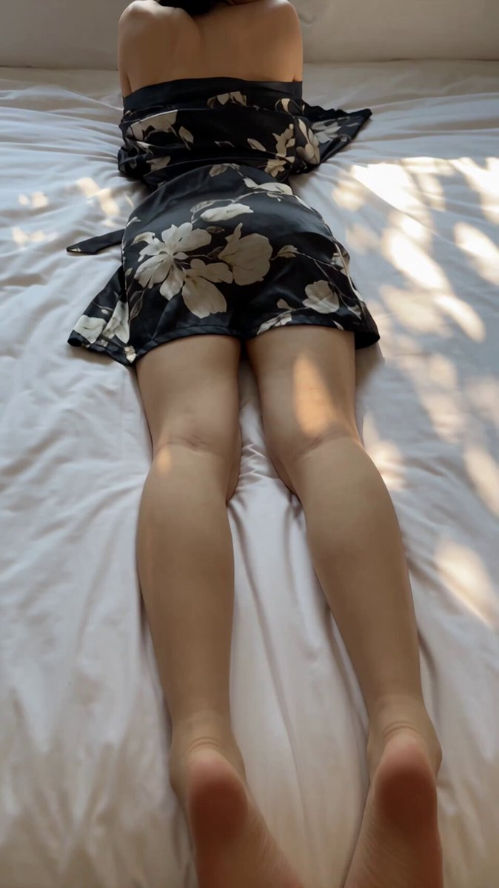

**Prompt**

```text
10 segundos, vertical 9:16, filmación auténtica cámara en mano con teléfono móvil, toma continua en plano secuencia.

Utilice @图片1 como la única ficha de referencia del personaje; la apariencia, peinado y vestimenta del personaje deben mantenerse estrictamente idénticos a la ficha. La escena es un dormitorio iluminado por luz natural, con sábanas blancas y almohadas suaves, atmósfera cotidiana de estilo de vida, tonos cálidos y suaves.

0—2 segundos:
El personaje está recostado boca abajo en la cama, de espaldas a la cámara, apoyando la parte superior del cuerpo sobre los antebrazos, con las piernas extendidas de forma natural hacia los pies de la cama. La cámara graba en un ángulo picado oblicuo desde una posición alta cerca de los pies de la cama; el encuadre inicial muestra la espalda, las piernas y los pies del personaje. La cámara avanza físicamente a lo largo de la dirección desde los pies hacia la cabecera de la cama, mientras reencuadra gradualmente hacia arriba, pasando de una toma amplia a un plano medio que muestra la cintura, espalda y hombros, saliendo las piernas y los pies de manera natural por la parte inferior del encuadre. Se preserva una leve oscilación natural de cámara en mano, con un avance suave y continuo.

2—4.5 segundos:
Una mano fuera de campo entra brevemente desde la parte inferior izquierda del encuadre, toca ligeramente la tela en el costado de la cintura del personaje y se retira. Al sentir el toque, el personaje gira la cabeza para mirar a la cámara, luego gira los hombros y el cuerpo de lado, apoyándose con el brazo para revelar gradualmente su rostro de frente. La cámara acompaña el movimiento inclinándose hacia arriba, moviéndose desde la espalda y hombros hacia el rostro y la parte superior del cuerpo, con un pequeño ajuste lateral del encuadre, manteniendo siempre el ángulo picado oblicuo desde la posición alta al costado de la cama. El giro del personaje y el seguimiento de la cámara fluyen de manera natural.

4.5—6 segundos:
El personaje ajusta su postura sobre un costado, doblando y juntando las rodillas de forma natural. La cámara realiza un paneo vertical descendente (tilt down) claro, continuo y ligeramente rápido; el encuadre pasa desde el rostro, atravesando la parte superior del cuerpo, hasta asentarse en las rodillas y piernas flexionadas, saliendo el rostro por la parte superior del encuadre; al llegar a las rodillas y piernas, desacelera brevemente. Se permite un leve desenfoque de movimiento realista y una ligera inclinación de muñeca durante el recorrido.

6—7.5 segundos:
La cámara de inmediato realiza un paneo vertical ascendente (tilt up) inverso por la misma trayectoria, desde las rodillas y piernas, pasando por el torso, de regreso al rostro y hombros, en un movimiento continuo y fluido. El personaje levanta suavemente una mano para acomodar un mechón de cabello junto a su oreja, levantando de nuevo la mirada desde abajo hacia la cámara, con expresión natural, mezclada con ligera curiosidad y cercanía.

7.5—10 segundos:
La cámara retrocede ligeramente, ampliando el encuadre desde la coronilla hasta la parte superior de los muslos. El personaje se apoya de lado sobre la almohada, con las manos reposando de manera natural, continuando con la mirada hacia la cámara. La cámara desacelera paulatinamente, manteniéndose en la posición oblicua cenital al costado de la cama, finalizando con una sutil deriva de cámara en mano.

Enfoque del movimiento de cámara: avance lento al inicio, inclinación vertical rápida hacia abajo y hacia arriba en la parte media, retroceso suave y desaceleración al final. El movimiento de cámara, el giro del personaje y los cambios de encuadre mantienen la continuidad espacial; la posición de la cama, almohadas y habitación se mantiene fija y estable.

Evitar: cortes, transiciones, giros orbitales de 180 grados, giros de 360 grados, inversión de imagen, zoom digital repentino, temblor excesivo, teletransportación del personaje, cambios faciales, cambios de vestimenta, deformidades en extremidades, dedos sobrantes, aparición de una segunda persona completa, subtítulos, marcas de agua. La mano fuera de campo solo aparece brevemente durante el toque y se retira por completo de inmediato.
```

[↑ Volver a categorías](#catalog)

---

<a name="prompt-2101897626123899372"></a>

### Secuencia de juego de acción y aventura en tercera persona al estilo de Unreal Engine 5, que muestra la exploración de un templo flotante en una montaña nevada y una batalla contra un jefe.

Autor：[@kingofdairyque](https://x.com/kingofdairyque) · [Publicación original](https://x.com/kingofdairyque/status/2101897626123899372)

Fotografía · Personaje · Publicado

**Resumen:** Secuencia de juego de acción y aventura en tercera persona al estilo de Unreal Engine 5, que muestra la exploración de un templo flotante en una montaña nevada y una batalla contra un jefe.


**Prompt**

```text
Una secuencia de juego de acción y aventura fantástica en tercera persona de 30 segundos, en formato 16:9, fotorrealista y creada en Unreal Engine 5. Haz que se sienta como un juego AAA real y jugable con movimientos fluidos, física realista, trabajo de cámara dinámico y una interfaz mínima.

Un joven explorador con atuendo invernal desgastado, capa con ribete de piel, equipo de escalada, una espada curva y un dispositivo de viento que brilla con un tono azul plateado explora un gigantesco templo congelado suspendido sobre las nubes. Mantén una estricta consistencia en el personaje y el equipo.

0–5 s — Cumbre helada
El explorador escala una pared de hielo, salta sobre una plataforma que se derrumba y luego corre a través de un estrecho puente congelado mientras enormes bloques de hielo caen hacia las nubes. La cámara se aleja para revelar el colosal templo.

5–10 s — Travesía con viento
El puente colapsa. El explorador activa el dispositivo de viento, se lanza a través del abismo, se agarra de una cadena colgante, se balancea alrededor de una antigua turbina y aterriza en otra plataforma.

10–15 s — El templo despierta
Dentro de una enorme cámara repleta de cristales, el explorador activa tres antiguos mecanismos de viento. Una compuerta congelada se abre violentamente tras una explosión, revelando a una gigantesca criatura alada que despierta sobre la cámara.

15–21 s — Escape
El templo comienza a derrumbarse. El explorador corre a través de plataformas giratorias, esquiva rocas que caen y usa la habilidad de viento para planear hacia la salida mientras la criatura destruye las plataformas detrás de él.

21–26 s — Arena del jefe
El explorador irrumpe en una enorme plataforma circular sobre las nubes. La criatura se estrella atravesando el techo del templo. Nieve y hielo explotan por toda la arena mientras el jugador desenvaina su espada.

26–30 s — Combate épico
La criatura desata un ataque masivo con sus alas. El explorador esquiva por debajo, usa el dispositivo de viento para exponer un cristal brillante en el pecho de la criatura y luego lo golpea con la espada. Grietas de energía azul se extienden por la criatura mientras su barra de salud disminuye. Termina con el jugador arremetiendo hacia adelante mientras la criatura prepara su próximo ataque.

Jugabilidad AAA fotorrealista, física realista de nieve y hielo, iluminación cinematográfica, nubes volumétricas, arquitectura antigua detallada, movimiento natural de ropa y cabello, peso creíble de la criatura, movimiento suave a 60 fps, cámara continua controlada por el jugador.

Sin cortes de montaje, sin gore, sin sangre, sin armas modernas, sin subtítulos, sin logotipos, sin marcas de agua, sin barras negras, sin fundidos a negro.
```

[↑ Volver a categorías](#catalog)

---

<a name="prompt-2101516770255270041"></a>

### Prompt de video de gameplay para juego de acción y aventura en tercera persona de estilo fotorrealista en Unreal Engine 5, que incluye la exploración de una aldea dañada, acertijo para restaurar energía, batalla subterránea contra un jefe, escape de inundación e interfaz de HUD.

Autor：[@AIwithSynthia](https://x.com/AIwithSynthia) · [Publicación original](https://x.com/AIwithSynthia/status/2101516770255270041)

Diseño de aplicaciones / web · Fotografía · Personaje · Publicado

**Resumen:** Prompt de video de gameplay para juego de acción y aventura en tercera persona de estilo fotorrealista en Unreal Engine 5, que incluye la exploración de una aldea dañada, acertijo para restaurar energía, batalla subterránea contra un jefe, escape de inundación e interfaz de HUD.


**Prompt**

```text
Crea un video de juego de acción y aventura en tercera persona y mundo abierto, fotorrealista de calidad AAA de 30 segundos, en 16:9, que parezca metraje jugable real de Unreal Engine 5, no un avance cinematográfico.
Joven aventurera coreana, de unos 20 y tantos años, exactamente el mismo rostro, cola de caballo baja y oscura, complexión atlética, chaqueta verde azulado oscuro, camiseta negra, pantalones cargo marrones, botas resistentes, guantes, mochila, cuerda de escalada y brazalete con brújula de metal en todo momento.
Usa una cámara en tercera persona estándar controlada por el jugador, detrás y ligeramente por encima de ella, con movimientos auténticos, físicas realistas, sombras, materiales, animaciones e interacción ambiental.
Ella entra a una aldea de montaña dañada por una tormenta, llena de casas abandonadas, calles lodosas, puentes rotos, vehículos y cables eléctricos colgantes. HUD: “SEARCH THE ABANDONED VILLAGE.”
Explora, salta a través de una pasarela rota, trepa a un tejado y llega a una vieja torre de radio mientras la resistencia disminuye visiblemente. HUD: “FIND A WAY TO THE RADIO TOWER.”
Descubre una sala de generadores cerrada, reconecta un cable suelto y restablece la energía, activando un mecanismo ancestral debajo de la aldea. HUD: “INVESTIGATE THE HIDDEN PASSAGE.”
Desciende a una enorme ruina subterránea que contiene plataformas giratorias, cadenas de metal y una gigantesca puerta sellada, y luego activa el mecanismo para abrirla.
Un colosal guardián de piedra y metal despierta. Ella desenvaina su espada mientras el HUD cambia a “DEFEAT THE RUIN GUARDIAN”, con una barra de salud del enemigo y un indicador de fijación de objetivo.
El guardián ataca → ella esquiva → activa su brazalete magnético → arranca la armadura dañada → aparece un punto débil brillante → lo golpea con su espada → la salud del jefe disminuye.
El guardián destruye la cámara, el agua irrumpe a través de las paredes y ella escapa por plataformas que se derrumban, salta sobre escombros y trepa hacia la superficie. HUD: “ESCAPE THE FLOODED RUINS.”
Llega a un mirador en la montaña por encima de la aldea y ve una gigantesca y ancestral fortaleza celeste suspendida entre montañas distantes. HUD: “MISSION COMPLETE: ESCAPED THE RUINS”, seguido de “NEW OBJECTIVE: INVESTIGATE THE SKY FORTRESS.”
Jugabilidad fotorrealista de calidad UE5 ambientada en Corea, física realista de agua y destrucción, HUD minimalista y funcional, movimiento natural de cámara controlada por el jugador, estricta consistencia del personaje y del equipo, sin aspecto de tráiler cinematográfico, sin gráficos de juego para móviles, sin anime, sin caricaturas, sin gore, sin subtítulos, sin logotipos, sin marcas de agua.
```

[↑ Volver a categorías](#catalog)

---

<a name="prompt-2101138386132386252"></a>

### Comercial fotorrealista de 15 segundos para el cuidado de la piel con una mujer coreana en una habitación luminosa y elegante aplicándose productos de cuidado facial.

Autor：[@Aiwithmaha](https://x.com/Aiwithmaha) · [Publicación original](https://x.com/Aiwithmaha/status/2101138386132386252)

Fotografía · Personaje · Publicado

**Resumen:** Comercial fotorrealista de 15 segundos para el cuidado de la piel con una mujer coreana en una habitación luminosa y elegante aplicándose productos de cuidado facial.


**Prompt**

```text
Crea un video fotorrealista de cuidado de la piel de 15 segundos con una joven mujer coreana en una habitación blanca, luminosa y elegante. Comienza con un primerísimo primer plano de su rostro al natural mientras se toca suavemente la mejilla con la yema del dedo, mostrando una textura de piel realista y una suave luz de día. Luego, muestra una botella transparente para el cuidado de la piel colocada sobre una mesa de mármol blanco mientras su mano se acerca lentamente a ella. Continúa con ella aplicándose suavemente el producto en el rostro con ambas manos, manteniendo consistentes sus rasgos faciales y su apariencia. Muestra cómo cierra los ojos plácidamente mientras se masajea suavemente ambas mejillas con la yema de los dedos. Finaliza con una toma más amplia de ella con un vestido blanco sencillo de pie junto a una gran ventana, mientras las cortinas blancas traslúcidas se mueven de forma natural bajo la luz del sol. Mantén los movimientos fluidos y realistas, con manos naturales, piel realista, iluminación cinematográfica suave, una atmósfera de lujo limpio, movimientos de cámara delicados y sin distorsiones ni detalles de aspecto artificial.
```

[↑ Volver a categorías](#catalog)

---

<a name="prompt-2097837460910956650"></a>

### Traducción en curso

Autor：[@john87445528](https://x.com/john87445528) · [Publicación original](https://x.com/john87445528/status/2097837460910956650)

Fotografía · Personaje · Artículo de moda · Publicado

**Resumen:** Traducción en curso


**Prompt**

```text
Traducción en curso
```

[↑ Volver a categorías](#catalog)

---

<a name="prompt-2096930655615758734"></a>

### Prompt de video UGC ultrarrealista de 30 segundos: Joven mujer coreana graba un vlog diario con cámara en mano en su dormitorio, mostrando una cámara recién comprada y conversando de forma natural.

Autor：[@AIwithkhan](https://x.com/AIwithkhan) · [Publicación original](https://x.com/AIwithkhan/status/2096930655615758734)

Fotografía · Personaje · Publicado

**Resumen:** Prompt de video UGC ultrarrealista de 30 segundos: Joven mujer coreana graba un vlog diario con cámara en mano en su dormitorio, mostrando una cámara recién comprada y conversando de forma natural.


**Prompt**

```text
Crea un video UGC ultrarrealista de 30 segundos en 1080p de una joven mujer coreana en su propio dormitorio, hablando de manera casual a la cámara sobre la nueva cámara que compró recientemente.
SUJETO PRINCIPAL
Joven mujer coreana de poco más de 20 años, de belleza natural, textura de piel realista, maquillaje mínimo, cabello negro ondulado atado de forma suelta en una coleta lateral desenfadada con algunos mechones sueltos alrededor de su rostro. Viste un top corto ajustado color azul pastel, pantalones holgados estilo pijama color crema y un collar plateado simple.
Mantén exactamente su misma identidad facial, peinado, atuendo, proporciones corporales y apariencia general de manera consistente a lo largo de todo el video.
ESCENARIO
Su propio dormitorio acogedor en un departamento coreano normal en una cálida mañana de lunes. Está sentada cómodamente en su cama con ropa de cama blanca ligeramente desordenada, una almohada detrás de ella, una pequeña mesa de noche, algunos objetos personales de uso cotidiano y una suave luz solar natural que entra por la ventana.
La habitación debe sentirse habitada y auténtica, no montada ni lujosa.
ESTILO UGC
Ella misma sostiene la cámara o esta está apoyada casualmente sobre la cama frente a ella. El encuadre es ligeramente imperfecto, con un movimiento natural de cámara en mano, pequeños ajustes de enfoque automático y cambios ocasionales de exposición.
El video debe sentirse como un vlog personal genuino grabado para sus seguidores, no como un anuncio publicitario pulido.
ACCIÓN / DIÁLOGO
Se sienta con las piernas cruzadas en la cama, mira a la lente y sonríe.
Dice de forma natural:
“Okay, I finally got this camera I’ve been talking about.”
Se ríe suavemente y levanta la cámara para mostrarla brevemente.
“I’ve only had it for like two days, but I already bring it everywhere.”
La vuelve a colocar en su lugar y se apoya contra la almohada.
“I wanted something that feels a little more personal than just using my phone.”
Mira alrededor de su habitación, y luego regresa la mirada a la lente.
“The footage has this old-school look that I really love. It kind of feels like I’m recording memories instead of just posting videos.”
Sonríe y se coloca un mechón de cabello suelto detrás de la oreja.
Cerca del final mira el reloj, se ríe y dice:
“Anyway, it’s Monday, I should probably get out of bed.”
Extiende la mano hacia la cámara como para detener la grabación, sonriendo de forma natural, y el video se corta a mitad del movimiento.
CÁMARA / ASPECTO VISUAL
UGC auténtico con un toque sutil inspirado en las cámaras DV de principios de los 2000: detalle digital suave, ligero ruido de imagen, leve búsqueda de enfoque automático, textura de piel natural y cálida luz matutina. Sin iluminación dramática ni movimientos de cámara cinematográficos.
AUDIO
Únicamente el ambiente natural de la habitación, su voz, el sutil movimiento de la tela, sonidos distantes del vecindario y el leve ruido de manipular la cámara. Sin música, sin narración en off.
SENSACIÓN FINAL
Contenido relajado de creadora de estilo de vida coreano. Cálido, femenino, íntimo y creíble, como un vlog casual de lunes por la mañana filmado en su propia habitación.
NEGATIVO
Sin actuación comercial, sin iluminación perfecta de estudio, sin poses preparadas de influencer, sin variaciones de identidad, sin cambios de vestuario, sin manos distorsionadas, sin dedos adicionales, sin subtítulos, logotipos, marcas de agua ni artefactos de IA.
```

[↑ Volver a categorías](#catalog)

---

<a name="prompt-2096931238460178592"></a>

### Crea un video casero en formato DV de principios de los años 2000, ultrarrealista, de 30 segundos, a 1080p y en 16:9, de una joven coreana que vive una tarde de verano ordinaria pero memorable en un barrio antiguo de Seúl, con acciones detalladas en una línea de tiempo, defectos de cámara en mano y audio ambiental.

Autor：[@SimplyAnnisa](https://x.com/SimplyAnnisa) · [Publicación original](https://x.com/SimplyAnnisa/status/2096931238460178592)

Fotografía · Personaje · Publicado

**Resumen:** Crea un video casero en formato DV de principios de los años 2000, ultrarrealista, de 30 segundos, a 1080p y en 16:9, de una joven coreana que vive una tarde de verano ordinaria pero memorable en un barrio antiguo de Seúl, con acciones detalladas en una línea de tiempo, defectos de cámara en mano y audio ambiental.


**Prompt**

```text
Crea un video casero en formato DV de principios de los años 2000, ultrarrealista, de 30 segundos, a 1080p y en relación de aspecto 16:9, de una joven coreana que pasa una tarde de verano común pero inesperadamente memorable en un barrio antiguo de Seúl.

Una mujer coreana naturalmente bonita de veintipocos años, piel realista, maquillaje mínimo, cabello negro largo y ligeramente ondulado, top de punto azul pálido, pantalones holgados color crema, tenis blancos, bolso cruzado marrón y reloj plateado. Mantén su identidad, rostro, vestimenta, peinado y proporciones perfectamente consistentes.

ESCENARIO

Una calle residencial tranquila y antigua de Seúl con callejones de concreto, edificios de departamentos, plantas en macetas, bicicletas, postes de luz, árboles frondosos y una pequeña tienda de conveniencia de barrio. Concurrido, habitado y auténtico. Sin marcas, logotipos, anuncios ni lugares turísticos.

ESTILO DE CÁMARA

Metraje en bruto de una videocámara DV económica de principios de los años 2000: movimiento tembloroso de cámara en mano, encuadre imperfecto, búsqueda de enfoque automático, cambios de exposición, colores desvaídos, detalles suaves, leve ruido de cinta, zooms accidentales y errores naturales de cámara. Sin estabilización ni tomas cinematográficas.

00:00–00:06 — EL MISTERIO

Camina por la calle sosteniendo una pequeña bolsa de plástico cuando de repente escucha un leve tintineo detrás de ella.

Se detiene y mira a su alrededor.

La cámara hace un zoom rápido hacia su rostro confundido.

Ella dice:

“Did you hear that?”

00:06–00:12 — EL PEQUEÑO DESCUBRIMIENTO

Sigue el sonido y encuentra una pequeña bicicleta vieja con un timbre diminuto atorado ligeramente abierto.

Toca suavemente el timbre.

Ding.

Mira a la cámara y se ríe.

Luego nota una pequeña etiqueta de papel que parece escrita a mano colgando de la bicicleta, pero la letra es demasiado ilegible para leerla.

00:12–00:18 — EL VIENTO

Una ráfaga repentina de viento arrastra varias hojas secas por la calle.

Una cae directamente sobre su cabeza.

Ella no se da cuenta.

La persona que opera la cámara se ríe.

Ella parece confundida, luego se da cuenta y se quita la hoja.

Le lanza una mirada avergonzada a la cámara.

00:18–00:24 — EL PEQUEÑO DESAFÍO

Coloca la hoja en el asiento de la bicicleta e intenta mantenerla en equilibrio allí.

El viento se la lleva de inmediato.

Lo intenta de nuevo.

Se cae otra vez.

Se ríe y finalmente se rinde.

00:24–00:30 — EL RECUERDO

Recoge la hoja, la guarda en su pequeña bolsa y empieza a caminar hacia casa.

Después de unos pasos, se gira hacia la cámara y dice:

“Okay, that was pointless.”

Sonríe y sigue caminando.

La cámara la sigue durante unos segundos antes de cortar abruptamente a negro.

AUDIO

Únicamente sonido natural del lugar: pasos, tráfico distante, el timbre de la bicicleta, insectos de verano, hojas, viento, ambiente del vecindario y risas naturales.

Sin música, narración, subtítulos, letreros, logotipos, marcas de agua ni texto en pantalla.

REALISMO

Reacciones humanas naturales, ritmo imperfecto, física realista, objetos consistentes, detalles auténticos de un vecindario coreano e imperfecciones creíbles de cámara DV. Sin apariencia CGI, manos distorsionadas, dedos adicionales, personas duplicadas, alteraciones de identidad ni cambios de vestuario.

Relación de aspecto 16:9.
```

[↑ Volver a categorías](#catalog)

---

<a name="prompt-2097181982924984513"></a>

### Auténtica mujer indonesia con estética de video casero de videocámara DV de principios de los años 2000 con marcas de tiempo cronológicas detalladas de las escenas en un vecindario tranquilo.

Autor：[@QAiStudio](https://x.com/QAiStudio) · [Publicación original](https://x.com/QAiStudio/status/2097181982924984513)

Fotografía · Personaje · Publicado

**Resumen:** Auténtica mujer indonesia con estética de video casero de videocámara DV de principios de los años 2000 con marcas de tiempo cronológicas detalladas de las escenas en un vecindario tranquilo.


**Prompt**

```text
Auténtica mujer indonesia, estética de video casero indonesio de principios de los años 2000. Conservar su rostro exacto, identidad, peinado, rasgos faciales, tono de piel, proporciones corporales, vello axilar natural, top corto sin mangas color verde oliva descolorido, jeans holgados de tiro alto en azul claro, zapatillas de lona negras, collar de cordón negro, cabello ondulado negro, flequillo hacia un lado, coleta desordenada.

Barrio residencial indonesio común y tranquilo: callejón estrecho de concreto, casas sencillas de un solo piso, pequeñas terrazas, muros bajos, plantas en macetas, motocicletas estacionadas, árboles grandes, cables aéreos enredados. Sin tiendas ni actividad comercial.

00:00–00:03: Ella está sentada en el suelo de una terraza garabateando en un cuaderno; la cámara en mano sobrevuela desde arriba/un lado.
00:03–00:07: Se da toquecitos con el bolígrafo en la barbilla, sonríe levemente y luego sigue dibujando; la cámara deambula entre su rostro y sus manos.
00:07–00:10: Está recostada sobre un tapete observando a las hormigas desplazarse por el concreto.
00:10–00:13: Da toquecitos suaves cerca de las hormigas y se ríe suavemente.
00:13–00:17: Camina hacia un muro bajo, salta sobre él y balancea las piernas.
00:17–00:20: Come papas fritas despreocupadamente mientras mira hacia la calle tranquila.
00:20–00:24: Se sienta en los escalones con una toalla alrededor de los hombros, con el cabello húmedo, peinándolo lentamente.
00:24–00:27: Plano de cerca en mano mientras se peina el cabello mojado, gotas de agua visibles.
00:27–00:30: Termina, echa su cabello húmedo hacia atrás, mira hacia la cámara y sonríe de forma natural. Corte abrupto a negro.

Realismo de videocámara DV en mano extremadamente crudo: movimientos marcados, microtemblores, encuadre accidental, composición descentrada, recortes ocasionales del rostro, búsqueda de autoenfoque, fluctuaciones de exposición, desenfoque de movimiento, rolling shutter, colores desteñidos/desaturados, ruido digital y artefactos de compresión. Sin poses, estabilización, apariencia cinematográfica, estilo comercial de moda, gradación moderna ni música. Solo ambiente natural de la mañana: pájaros, brisa, motocicletas lejanas, charlas del vecindario, raspado de papel, bolsa de papas fritas, hojas, peine. 16:9.
```

[↑ Volver a categorías](#catalog)

---

<a name="prompt-2097185861259727263"></a>

### Prompt fotorrealista para un vlog de viajes costero coreano de 30 segundos que captura un recorrido vespertino desde los mercados de pescado al atardecer y paseos costeros hasta un malecón a medianoche.

Autor：[@nawalsehar](https://x.com/nawalsehar) · [Publicación original](https://x.com/nawalsehar/status/2097185861259727263)

Fotografía · Paisaje / Naturaleza · Publicado

**Resumen:** Prompt fotorrealista para un vlog de viajes costero coreano de 30 segundos que captura un recorrido vespertino desde los mercados de pescado al atardecer y paseos costeros hasta un malecón a medianoche.


**Prompt**

```text
Crea un vlog de viajes de acción real fotorrealista de 30 segundos junto al mar en Corea, siguiendo a una joven coreana durante una tarde en un tranquilo pueblo costero. Comienza en un animado mercado de mariscos con productos frescos del mar, suelos mojados y la luz del atardecer. Ella se registra en una acogedora casa de huéspedes tradicional y luego camina descalza por la playa mientras las olas le llegan a los pies durante la hora dorada. Haz una transición hacia un cálido mercado nocturno de mariscos donde disfruta de mariscos recién asados e interactúa de manera natural con el entorno. Termina a medianoche junto a un tranquilo malecón, contemplando el océano oscuro con luces de pesca lejanas y las olas rompiendo abajo. Auténtico estilo de vlog de 2026 grabado con smartphone/cámara de cine, entorno coreano natural, piel, cabello, ropa, agua, comida, humo, olas y movimiento humano realistas. Cámara en mano, enfoque automático natural, cambios de exposición y desenfoque de movimiento realista. Solo diálogo en inglés, audio ambiental natural, sin música de fondo ni narración. Gran énfasis en física creíble, iluminación, movimiento fluido y expresiones espontáneas. Sin CGI, animación, subtítulos, logotipos ni marcas de agua.
```

[↑ Volver a categorías](#catalog)

---

<a name="prompt-2097186378861953475"></a>

### Crea un videoblog de viajes fotorrealista de 30 segundos en un pueblo de montaña japonés siguiendo a una joven que explora un pueblo tranquilo tras perder su autobús, con iluminación natural y estilo de cámara en mano.

Autor：[@aiwithaly](https://x.com/aiwithaly) · [Publicación original](https://x.com/aiwithaly/status/2097186378861953475)

Fotografía · Personaje · Paisaje / Naturaleza · Publicado

**Resumen:** Crea un videoblog de viajes fotorrealista de 30 segundos en un pueblo de montaña japonés siguiendo a una joven que explora un pueblo tranquilo tras perder su autobús, con iluminación natural y estilo de cámara en mano.


**Prompt**

```text
Crea un videoblog de viajes fotorrealista de 30 segundos en un pueblo de montaña japonés, siguiendo a una joven japonesa que pierde su autobús y pasa 25 minutos explorando el tranquilo pueblo. Muestra cómo corre tras el autobús que se aleja → revisa el horario → camina por calles pacíficas y cruza un puente rojo → descubre una casa de té tradicional → disfruta de un té verde caliente → contempla la vista de las montañas durante la hora dorada → escucha llegar el siguiente autobús y regresa a la parada. Metraje de viajes auténtico de 2026, paisajes japoneses naturales, movimiento humano y al caminar realista, cabello y ropa que reaccionan al viento, arroyo fluyendo, té humeante, física verosímil del autobús e iluminación de hora dorada. Estilo de smartphone o cámara de cine en mano con enfoque automático natural, cambios de exposición y desenfoque de movimiento sutil. Diálogo únicamente en inglés, ambiente realista de pueblo y sin música de fondo. Sin CGI, animación, estética VHS, subtítulos, logotipos ni marcas de agua.
```

[↑ Volver a categorías](#catalog)

---

<a name="prompt-2097097582262825180"></a>

### Traducción en curso

Autor：[@john87445528](https://x.com/john87445528) · [Publicación original](https://x.com/john87445528/status/2097097582262825180)

Cómic / Guion gráfico · Fotografía · Personaje · Publicado

**Resumen:** Traducción en curso


**Prompt**

```text
Traducción en curso
```

[↑ Volver a categorías](#catalog)

---

<a name="category-cinematic-film-still"></a>

## Cine / Fotograma

<a name="prompt-2102572922674225517"></a>

### Traducción en curso

Autor：[@Aiwithmaha](https://x.com/Aiwithmaha) · [Publicación original](https://x.com/Aiwithmaha/status/2102572922674225517)

Cine / Fotograma · Personaje · Publicado

**Resumen:** Traducción en curso

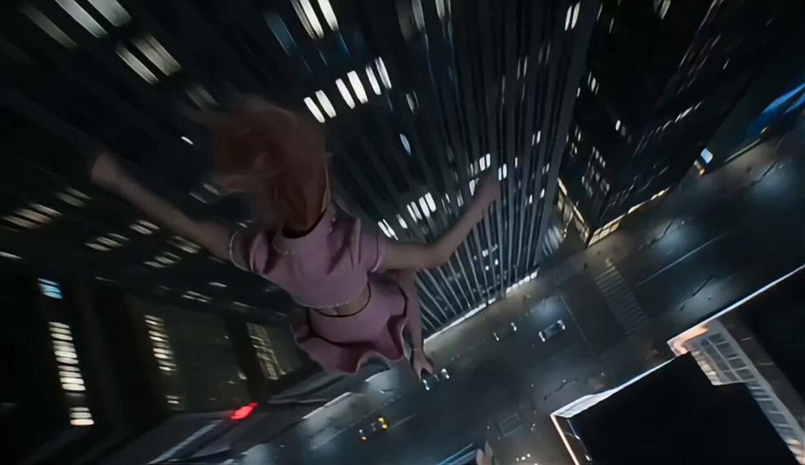

**Prompt**

```text
Traducción en curso
```

[↑ Volver a categorías](#catalog)

---

<a name="prompt-2102607673501892691"></a>

### Traducción en curso

Autor：[@aiwithaayat](https://x.com/aiwithaayat) · [Publicación original](https://x.com/aiwithaayat/status/2102607673501892691)

Cine / Fotograma · Personaje · Grupo / Pareja · Publicado

**Resumen:** Traducción en curso

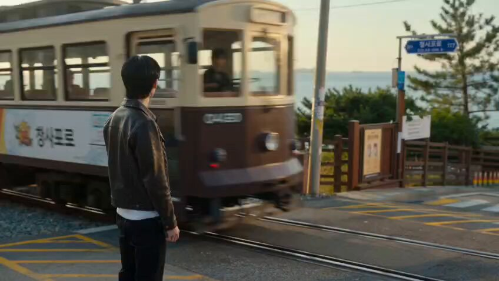

**Prompt**

```text
Traducción en curso
```

[↑ Volver a categorías](#catalog)

---

<a name="prompt-2102582169747300545"></a>

### Traducción en curso

Autor：[@AynahhX](https://x.com/AynahhX) · [Publicación original](https://x.com/AynahhX/status/2102582169747300545)

Cine / Fotograma · Publicado

**Resumen:** Traducción en curso

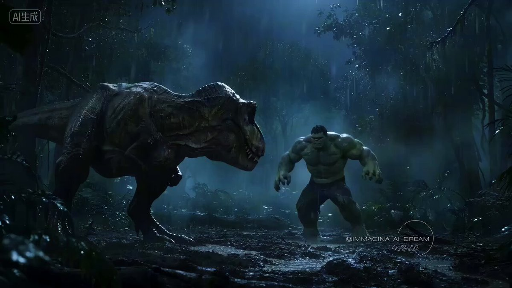

**Prompt**

```text
Traducción en curso
```

[↑ Volver a categorías](#catalog)

---

<a name="prompt-2102535561278001202"></a>

### En un primer plano, los dedos de un adulto colocan con precisión una piedra negra de go en la intersección de un tablero de madera.

Autor：[@studiokagurajp](https://x.com/studiokagurajp) · [Publicación original](https://x.com/studiokagurajp/status/2102535561278001202)

Cine / Fotograma · Publicado

**Resumen:** En un primer plano, los dedos de un adulto colocan con precisión una piedra negra de go en la intersección de un tablero de madera.


**Prompt**

```text
ESCENA: Tablero de go de madera, 16:9. Primer plano fijo en intersecciones vacías, solo la cuadrícula. Una piedra de go convexa de color negro pizarra se sostiene entre los dedos de un adulto, de unos treinta años. Un cuenco de madera simple reposa suavemente en el borde lejano. Rostro fuera de cuadro. Sin texto en el tablero. Sin texto incrustado. Sin brillo de plástico.

ACCIÓN: Una sola colocación. La piedra negra se posa sobre una única intersección y se queda allí. Los dedos se retiran un poco y se detienen. Ninguna segunda piedra. Ninguna piedra blanca. Nada de barrer el tablero.

ENFOQUE: Completamente nítido en el borde de la piedra, las vetas de madera del punto y la piel de la yema del dedo. El resto del tablero está un paso desenfocado.

FÍSICA: La piedra tiene peso. Hace clic sobre la madera y se asienta. No flota ni se desliza a su lugar. Sin chasquido magnético.

LUZ: Luz de ventana desde la izquierda, solo un pequeño reflejo especular en la madera pulida.

ESTILO: Cinemático fotorrealista, Japón de época, piedra de pizarra y madera desgastada, grano suave. Nada de anime. Sin texto. Sin marcas de agua. Sin logotipos.

AUDIO: Solo efectos de sonido diegéticos. Sin música. Sin banda sonora. Sin cantos. Sin voces. Sin narración. Un solo clic de piedra sobre madera. Luego silencio. Ningún segundo clic.
```

[↑ Volver a categorías](#catalog)

---

<a name="prompt-2102406322008559857"></a>

### Secuencia cinematográfica de un hombre de traje que congela el tiempo en una plaza europea, prepara una bebida con agua de la fuente y reanuda el tiempo para revelar un arcoíris.

Autor：[@aiwithlumi](https://x.com/aiwithlumi) · [Publicación original](https://x.com/aiwithlumi/status/2102406322008559857)

Cine / Fotograma · Personaje · Comida y bebida · Publicado

**Resumen:** Secuencia cinematográfica de un hombre de traje que congela el tiempo en una plaza europea, prepara una bebida con agua de la fuente y reanuda el tiempo para revelar un arcoíris.

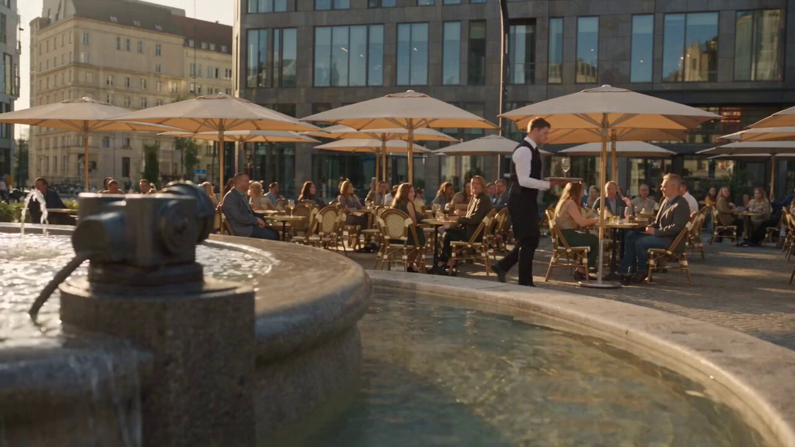

**Prompt**

```text
Crea una escena cinematográfica y fotorrealista en una plaza europea con una fuente de piedra y un café al aire libre. Un hombre con traje oscuro chasquea los dedos, congelando el tiempo mientras un enorme chorro de la fuente queda suspendido inmóvil en el aire. Camina con calma entre el agua, toma una copa de vino de un mesero congelado, atrapa gotas en su interior, agrega limón y ajusta una sombrilla de patio. Inclina la sombrilla, vuelve a chasquear los dedos y el tiempo se reanuda: el agua brilla bajo la luz del sol, creando un espectacular arcoíris completo sobre el café mientras todos reaccionan con asombro. Da un sorbo a la bebida, mira a la cámara y dice en ruso: **“Так гораздо лучше”** («Mucho mejor»).
```

[↑ Volver a categorías](#catalog)

---

<a name="prompt-2102276993094176768"></a>

### Video cinematográfico, realista y divertido de una rutina matutina: Estoy durmiendo plácidamente en la cama cuando un robot futurista se acerca rodando a mi lado, con su pantalla mostrando claramente &quot;6 AM&quot;, y hace sonar una alarma. Medio dormido y molesto, le doy un fuerte puñetazo al robot en un momento cómico de slapstick.

Autor：[@shushant\_l](https://x.com/shushant_l) · [Publicación original](https://x.com/shushant_l/status/2102276993094176768)

Cine / Fotograma · Publicado

**Resumen:** Video cinematográfico, realista y divertido de una rutina matutina: Estoy durmiendo plácidamente en la cama cuando un robot futurista se acerca rodando a mi lado, con su pantalla mostrando claramente &quot;6 AM&quot;, y hace sonar una alarma. Medio dormido y molesto, le doy un fuerte puñetazo al robot en un momento cómico de slapstick.

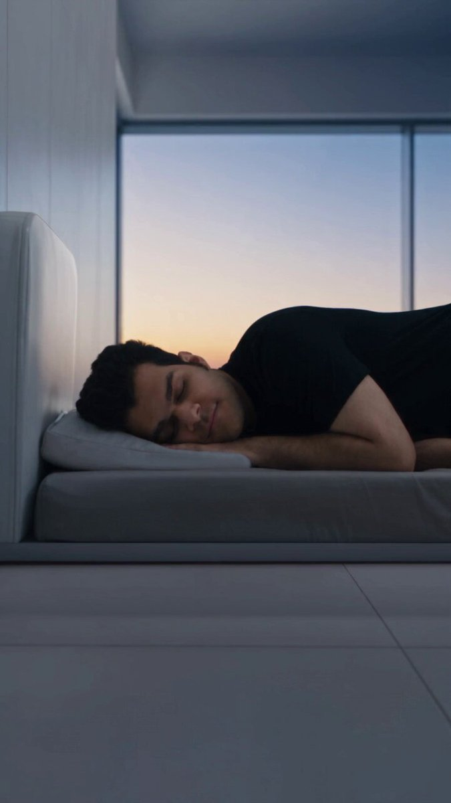

**Prompt**

```text
Video cinematográfico, realista y divertido de una rutina matutina: Estoy durmiendo plácidamente en la cama cuando un robot futurista se acerca rodando a mi lado, con su pantalla mostrando claramente "6 AM", y hace sonar una alarma. Medio dormido y molesto, le doy un fuerte puñetazo al robot en un momento cómico de slapstick. El robot, ileso, saca al instante un control remoto y transforma mi cama en un sofá que baila y se sacude salvajemente, despertándome por completo de un sobresalto. Luego me cepilla los dientes de forma rápida y perfecta, limpiando cada diente, antes de preparar y entregarme al instante un café caliente recién hecho, el cual bebo. Comedia visual de ritmo rápido, reacciones expresivas, transformaciones fluidas, física realista, movimiento de cámara cinematográfico. Sin diálogos, conversaciones, voz en off ni comunicación hablada. Solo efectos de sonido y música de fondo alegre. Mi imagen está adjunta aquí y es @img1 . Úsala de manera completa y perfecta.
```

[↑ Volver a categorías](#catalog)

---

<a name="prompt-2102264635361505625"></a>

### Traducción en curso

Autor：[@Diplomeme](https://x.com/Diplomeme) · [Publicación original](https://x.com/Diplomeme/status/2102264635361505625)

Cine / Fotograma · Publicado

**Resumen:** Traducción en curso

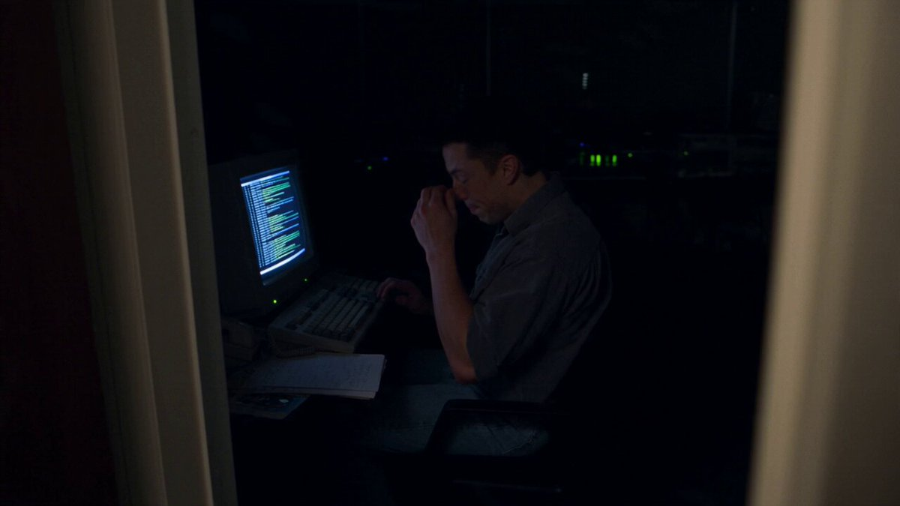

**Prompt**

```text
Traducción en curso
```

[↑ Volver a categorías](#catalog)

---

<a name="prompt-2102192911412781348"></a>

### Prompt cinematográfico de texto a video para un biombo japonés tradicional liso de pan de oro en una habitación de tatami, capturando la luz natural de una ventana deslizándose a través de los pliegues.

Autor：[@studiokagurajp](https://x.com/studiokagurajp) · [Publicación original](https://x.com/studiokagurajp/status/2102192911412781348)

Cine / Fotograma · Publicado

**Resumen:** Prompt cinematográfico de texto a video para un biombo japonés tradicional liso de pan de oro en una habitación de tatami, capturando la luz natural de una ventana deslizándose a través de los pliegues.


**Prompt**

```text
ESCENA: Una habitación de tatami, 16:9. Plano fijo en tres cuartos sobre un biombo (byobu) de seis paneles de pan de oro dispuesto en zigzag. El oro es liso: sin escenas pintadas, sin composiciones famosas. No hay ningún adulto en el encuadre. Sin texto legible.

ACCIÓN: El oro comienza tenue. Una franja más fría de luz natural de una ventana se desliza a través de los pliegues como si se abriera una contraventana, y luego se detiene. Las caras iluminadas y las caras en sombra de los pliegues permanecen en su lugar. El biombo no se desplaza. Esto no es un barrido.

ENFOQUE: Nitidez absoluta en la textura del pan de oro y en el borde de un pliegue al centro. El tatami lejano tiene un paso de desenfoque.

FÍSICA: El oro refleja. No brilla como purpurina. El biombo tiene peso y permanece firmemente asentado. Sin bucle de brillo CGI.

LUZ: Una ventana desde la izquierda. El reflejo especular corre a lo largo del oro y luego se estabiliza. Sin iluminación difusa y uniforme de museo. Sin colores eléctricos.

ESTILO: Cinemático fotorrealista, Japón de época, pan de oro y marco lacado, grano suave. Sin anime. Sin texto. Sin marcas de agua. Sin logotipos.
```

[↑ Volver a categorías](#catalog)

---

<a name="prompt-2102042146392129849"></a>

### Prompt cinematográfico de 30 segundos que representa a un hombre salvando a una mujer al atrapar un auto que cae con una mano al estilo de acción y romance de drama coreano.

Autor：[@AIwithWania](https://x.com/AIwithWania) · [Publicación original](https://x.com/AIwithWania/status/2102042146392129849)

Cine / Fotograma · Personaje · Vehículo · Publicado

**Resumen:** Prompt cinematográfico de 30 segundos que representa a un hombre salvando a una mujer al atrapar un auto que cae con una mano al estilo de acción y romance de drama coreano.


**Prompt**

```text
Crea una escena coreana de acción y romance de acción real y ultrarrealista utilizando el guion gráfico de referencia. Mantén a los MISMOS dos personajes coreanos, rostros exactos, peinados, atuendos, proporciones corporales y el MISMO auto negro en todo momento. Sin cambios de identidad, vestuario, peinado o vehículo.

0–4s: Una mujer camina por una moderna calle coreana con auriculares puestos. Un auto negro pierde repentinamente el control y sale volando hacia ella.

4–8s: Primer plano mientras nota el auto en estado de shock. Corte hacia el hombre con capucha que ve el peligro y reacciona al instante.

8–12s: Corre hacia ella a una velocidad extrema y la aparta justo antes del impacto.

12–16s: Caen a salvo. Ella mira hacia arriba y ve el auto dañado cayendo directamente sobre ellos.

16–20s: Él levanta una mano y detiene el auto que cae sobre sus cabezas. Ella se acerca a él con miedo mientras él lo sostiene.

20–24s: Primer plano de su rostro tranquilo y concentrado. Empuja el auto y este aterriza pesadamente a varios metros de distancia.

24–28s: Se ponen de pie y se miran en silencio con conmoción, alivio y gratitud mientras la cálida luz del atardecer llena la calle.

28–30s: Plano general trasero de ambos contra el brillante horizonte de la ciudad. Grúa lenta hacia atrás/hacia arriba, luego desvanecimiento a negro.

ESTILO: Cine coreano de acción real de primera calidad, piel fotorrealista, expresiones naturales, movimiento realista de cabello/ropa, gravedad y física automovilística creíbles, profundidad de campo cinematográfica, desenfoque de movimiento realista, iluminación HDR, sutiles tomas de acción con cámara en mano, tomas emocionales fluidas.

BLOQUEO ESTRICTO: Sin rostros con apariencia de IA, cambios de rostro, deformación corporal, personas duplicadas, cambios de vestuario, manos rotas, movimiento antinatural, teletransportación o cambio de modelo de auto. Mantén todo el movimiento realista y actuado profesionalmente.
```

[↑ Volver a categorías](#catalog)

---

<a name="prompt-2102063363694231594"></a>

### Prompt de generación de escena de película de terror de brote zombi en una oficina coreana moderna, con detalles de personajes, trama de acción y descripción de atmósfera de terror.

Autor：[@AIwithSynthia](https://x.com/AIwithSynthia) · [Publicación original](https://x.com/AIwithSynthia/status/2102063363694231594)

Cine / Fotograma · Personaje · Publicado

**Resumen:** Prompt de generación de escena de película de terror de brote zombi en una oficina coreana moderna, con detalles de personajes, trama de acción y descripción de atmósfera de terror.


**Prompt**

```text
Crea una secuencia de terror y brote infeccioso ultrarrealista de 30 segundos en 1080p que se desarrolle por completo dentro de una moderna oficina corporativa coreana, utilizando la imagen subida como referencia de máxima prioridad para la protagonista femenina y conservando exactamente su rostro, peinado, tono de piel, proporciones corporales y atuendo. La joven coreana trabaja sola en su escritorio a altas horas de la noche cuando un compañero de trabajo extraño aparece repentinamente entre los cubículos, respirando con dificultad y moviéndose de manera anormal. Se desploma junto a una estación de trabajo, sufre violentas convulsiones, y de repente se levanta con los ojos inyectados en sangre y arremete contra otro empleado. La oficina estalla en pánico mientras los empleados corren a toda velocidad entre los escritorios, derribando sillas, monitores y papeles. La mujer corre hacia la entrada principal, pero ve a compañeros de trabajo infectados inundando el pasillo, lo que la obliga a regresar. Ella y varios sobrevivientes empujan escritorios, sillas y archivadores contra las puertas de vidrio de la entrada mientras los empleados infectados las golpean con violencia. Las grietas se extienden por el vidrio antes de que un panel se rompa repentinamente y manos infectadas se extiendan a través de la abertura. Los sobrevivientes retroceden más hacia el interior de la oficina y se apresuran a entrar en una sala de conferencias de vidrio, cerrando de golpe la puerta tras de sí. Arrastran una gran mesa de conferencias contra la entrada mientras el enjambre de infectados rodea la habitación. La mujer nota a un compañero atrapado afuera, abre brevemente la puerta, lo jala hacia adentro e inmediatamente vuelve a colocar la barricada. Todos quedan en silencio, respirando con dificultad mientras las siluetas infectadas golpean el vidrio agrietado. Las luces de la oficina se apagan de repente, dejando únicamente una iluminación de emergencia roja a medida que el vidrio comienza a fracturarse bajo la presión. Termina con la mujer mirando hacia la cámara con terror mientras las siluetas infectadas rodean por completo la sala de conferencias, luego corte a negro; entorno de oficina coreana fotorrealista, física realista, cámara en mano, luces fluorescentes parpadeantes, polvo ambiental, ambiente natural de oficina, alarmas, pasos, gritos, respiración pesada y golpes en el vidrio, sin música de fondo, sin exceso de sangre, sin apariencia CGI, sin rostros distorsionados, sin personajes duplicados, sin teletransportación, sin cambios de vestimenta, sin subtítulos, leyendas, logotipos ni marcas de agua.
```

[↑ Volver a categorías](#catalog)

---

<a name="prompt-2102022966112563595"></a>

### Un prompt para un anuncio cinematográfico de viajes de 30 segundos que representa a una joven coreana observando reflejos de auroras verdes sobre un lago invernal en Jeongseon.

Autor：[@SimplyAnnisa](https://x.com/SimplyAnnisa) · [Publicación original](https://x.com/SimplyAnnisa/status/2102022966112563595)

Cine / Fotograma · Personaje · Paisaje / Naturaleza · Publicado

**Resumen:** Un prompt para un anuncio cinematográfico de viajes de 30 segundos que representa a una joven coreana observando reflejos de auroras verdes sobre un lago invernal en Jeongseon.


**Prompt**

```text
Crea un anuncio de viajes coreano cinematográfico de acción real fotorrealista de 30 segundos y 16:9 que muestre a la misma mujer coreana joven junto a un tranquilo lago invernal en Jeongseon, Gangwon-do, Corea del Sur.

Ella viste una chamarra acolchada oversize negra, un suéter gris claro, jeans azules, tenis blanco-grisáceos, un gorro beige y un bolso cruzado negro. Mantén idénticos el rostro, el cabello, el atuendo y las proporciones en todo momento.

Escena: Pinos cubiertos de nieve, montañas oscuras, lago en calma que refleja una sutil aurora boreal verde esmeralda, aliento visible, viento invernal suave e iluminación nocturna realista.

Secuencia:

- 0–6s: La mujer mira hacia el lago, observa la aurora con asombro. Voz en off: "Wow... this is unreal."
- 6–13s: Se gira hacia la cámara, sonríe y señala la aurora. Voz en off: "Look at that... it's beautiful."
- 13–21s: Observa pacíficamente el lago, cierra los ojos y respira lentamente. Voz en off: "I could stay here all night."
- 21–30s: Se gira hacia la cámara, da un paso más cerca y sonríe suavemente mientras la aurora se ilumina ligeramente. Voz en off: "Okay... I don't want to leave."

Estilo: Cinematografía premium de comerciales de viajes coreanos combinada con el realismo auténtico de un vlog de smartphone. Movimiento natural de cámara en mano, enfoque automático realista, profundidad de campo sutil, textura de piel natural y reflejos de aurora creíbles.

Solo audio natural de la locación: viento suave, movimiento de la ropa, pasos y respiración. Voz en off femenina conversacional. Sin música de fondo.

Realismo estricto: Sin CGI, 3D, animación, piel de plástico, cambios de personaje, cambios de atuendo, personas adicionales, reflejos poco realistas, texto, subtítulos, logotipos o marcas de agua. Ubicación y clima continuos. Acción real fotorrealista, calidad cinematográfica.
```

[↑ Volver a categorías](#catalog)

---

<a name="prompt-2102053757341037048"></a>

### Traducción en curso

Autor：[@MadMax\_Series](https://x.com/MadMax_Series) · [Publicación original](https://x.com/MadMax_Series/status/2102053757341037048)

Cómic / Guion gráfico · Cine / Fotograma · Paisaje urbano / Calle · Publicado

**Resumen:** Traducción en curso


**Prompt**

```text
Traducción en curso
```

[↑ Volver a categorías](#catalog)

---

<a name="prompt-2102011250741846328"></a>

### Toma cinematográfica de una mujer rubia con un vestido dorado iridiscente en un reino de cristal.

Autor：[@TaliaAariz](https://x.com/TaliaAariz) · [Publicación original](https://x.com/TaliaAariz/status/2102011250741846328)

Cine / Fotograma · Personaje · Publicado

**Resumen:** Toma cinematográfica de una mujer rubia con un vestido dorado iridiscente en un reino de cristal.


**Prompt**

```text
Un impresionante video cinematográfico de alta costura de una etérea mujer rubia que baila en un reino de prismas surrealista y de ensueño bajo un sol radiante. Viste un elaborado y resplandeciente vestido dorado incrustado con facetas metálicas iridiscentes y paneles de vidrio caleidoscópicos que proyectan brillantes refracciones de arcoíris sobre un piso de espejos continuo. Rodeada de cubos de vidrio flotantes, arcos gigantes de vitrales y altísimas estructuras de cristal, la cámara en suave órbita sigue sus gráciles movimientos con nítidos detalles de alta definición, mostrando su rostro con claridad y una expresión serena al girarse hacia el lente, completamente iluminada por una vibrante luz prismática y coloridos destellos de lente.
```

[↑ Volver a categorías](#catalog)

---

<a name="prompt-2101881835290845251"></a>

### Un prompt de video cinematográfico y surrealista que representa a una mujer con vestido verde cerceta corriendo por una Venecia invertida al estilo de Escher.

Autor：[@laviniavelle](https://x.com/laviniavelle) · [Publicación original](https://x.com/laviniavelle/status/2101881835290845251)

Cine / Fotograma · Personaje · Artículo de moda · Publicado

**Resumen:** Un prompt de video cinematográfico y surrealista que representa a una mujer con vestido verde cerceta corriendo por una Venecia invertida al estilo de Escher.


**Prompt**

```text
Un prompt de video de acción dinámica y cinematográfica, surrealismo visual, una joven mujer de Asia oriental con un clásico vestido vintage verde cerceta que sostiene un sobre amarillo mientras corre rápidamente por una Venecia surrealista y de ensueño, movimiento dinámico de cámara, reflejo invertido de la ciudad de Venecia colgando del cielo creando una alucinante ilusión de dimensión de espejo, corriendo por callejones de ladrillo venecianos, subiendo escaleras de piedra retorcidas al estilo de M.C. Escher, saltando sobre una enorme brecha con un brillante arcoíris en el cielo de la hora dorada, corriendo a toda velocidad pasando por un concurrido mercado de frutas al aire libre con manzanas rojas cayendo, de pie sobre techos clásicos de tejas rojas al atardecer dorado, toma de seguimiento rápida y dinámica, iluminación cinematográfica, resolución 8k, ultradetallada fotorrealista filmada con lente de 35 mm, obra maestra de profundidad de campo.
```

[↑ Volver a categorías](#catalog)

---

<a name="prompt-2101993937770811467"></a>

### Prompt de video cinematográfico que muestra a una mujer con un vestido blanco explorando un paraíso montañoso color esmeralda con cascadas, nubes y diálogo.

Autor：[@MissDelulu9](https://x.com/MissDelulu9) · [Publicación original](https://x.com/MissDelulu9/status/2101993937770811467)

Cine / Fotograma · Personaje · Artículo de moda · Paisaje / Naturaleza · Publicado

**Resumen:** Prompt de video cinematográfico que muestra a una mujer con un vestido blanco explorando un paraíso montañoso color esmeralda con cascadas, nubes y diálogo.


**Prompt**

```text
Crea un video cinematográfico fotorrealista e impresionante de una mujer adulta explorando un paraíso verde oculto rodeado de enormes montañas color esmeralda.

Lleva un vestido de verano blanco, corto y sencillo, con tirantes delgados y una falda suave y vaporosa, sandalias blancas y cabello largo que fluye con naturalidad. Mantén su rostro y apariencia consistentes.

Comienza directamente con una enorme vista panorámica del valle: montañas de un verde exuberante, incontables nubes esponjosas y masivas flotando entre los picos, cascadas, niebla, diminutas casas cubiertas de flores, arroyos, flores y cálida luz solar. Ella mira a su alrededor y dice: “Este lugar es irreal…”

Camina lentamente por un sendero natural mientras la cámara amplia muestra todo el paisaje: cascadas, arroyos brillantes, flores, casas diminutas, árboles gigantescos, montañas y nubes. Ella dice: “Se siente como un sueño”.

La cámara se eleva en una revelación aérea épica, alejándose mucho hasta que ella se vuelve diminuta. Muestra todo el enorme valle, interminables montañas verdes, nubes enormes, cascadas, el pueblo, arroyos y luz solar dorada. Ella dice: “Podría quedarme aquí para siempre”.

Estilo: Ultrarrealista, cinematográfico, de ensueño pero creíble, nubes, agua, niebla, vegetación y luz solar realistas, movimiento de cámara suave, movimiento humano natural, escala impresionante, calidad cinematográfica de primera calidad, 16:9, 4K, sin primeros planos, sin texto, sin marcas de agua.
```

[↑ Volver a categorías](#catalog)

---

<a name="prompt-2101970747958624593"></a>

### Traducción en curso

Autor：[@johnAGI168](https://x.com/johnAGI168) · [Publicación original](https://x.com/johnAGI168/status/2101970747958624593)

Cómic / Guion gráfico · Cine / Fotograma · Personaje · Vehículo · Publicado

**Resumen:** Traducción en curso


**Prompt**

```text
Traducción en curso
```

[↑ Volver a categorías](#catalog)

---

<a name="prompt-2101890198703354285"></a>

### Escena cinematográfica de video musical de una mujer bailando con un top de corsé blanco en un estacionamiento subterráneo con bailarinas de respaldo y autos.

Autor：[@AIwithMinal](https://x.com/AIwithMinal) · [Publicación original](https://x.com/AIwithMinal/status/2101890198703354285)

Cine / Fotograma · Personaje · Vehículo · Publicado

**Resumen:** Escena cinematográfica de video musical de una mujer bailando con un top de corsé blanco en un estacionamiento subterráneo con bailarinas de respaldo y autos.


**Prompt**

```text
Escena cinematográfica de actuación de moda ultrarrealista, una hermosa mujer joven con largo cabello negro oscuro de pie con confianza en el centro, vistiendo un elegante top de corsé blanco sin tirantes, jeans ajustados oscuros de tiro alto, collares de plata en capas y aretes de aro. Varias bailarinas elegantes la rodean, vestidas con trajes de cuero negro, en poses de baile sincronizadas. Escenario nocturno dramático con autos y faros brillantes detrás de ellas, atmósfera industrial melancólica, cálida iluminación de fondo, neblina sutil, sombras realistas, composición dinámica, expresión poderosa y segura, estética de video musical profesional, detalles fotorrealistas de la piel y las telas, profundidad de campo reducida, iluminación cinematográfica, alto contraste, 8K, HDR, lente de 85 mm, composición vertical 9:16.
```

[↑ Volver a categorías](#catalog)

---

<a name="prompt-2101889590621536594"></a>

### Secuencia cinematográfica del día excéntrico de una chica coreana en un parque infantil y área deportiva.

Autor：[@Lianaalane](https://x.com/Lianaalane) · [Publicación original](https://x.com/Lianaalane/status/2101889590621536594)

Cine / Fotograma · Personaje · Publicado

**Resumen:** Secuencia cinematográfica del día excéntrico de una chica coreana en un parque infantil y área deportiva.


**Prompt**

```text
Crea un video de una hermosa chica coreana pasando un día juguetón y de ensueño en un colorido parque infantil al aire libre.
Lleva una camisa blanca informal, jeans oscuros, tenis y lleva un elegante bolso de hombro con estampado de leopardo.
Muéstrala relajándose y acostada de forma juguetona en un resbaladero amarillo brillante del parque.
Luego, haz una transición hacia ella sentada tranquilamente en un columpio, luciendo ligeramente cansada y perdida en sus pensamientos.
Más tarde, se sienta en el borde del parque usando un divertido cono naranja como sombrero, creando un momento cinematográfico excéntrico.
Muéstrala descansando plácidamente en unos escalones de concreto con suave luz natural de día y una atmósfera tranquila.
Termina con ella durmiendo cómodamente dentro de un carrito de compras lleno de pelotas de baloncesto, creando una escena divertida e inesperada.
Utiliza expresiones faciales realistas, movimiento corporal natural, movimiento de cámara cinematográfico, colores suaves y detalles fotorrealistas.
Mantén la identidad y la apariencia de la chica coreana constantes a lo largo de todo el video, con transiciones fluidas y un estilo narrativo cinematográfico y juguetón.
```

[↑ Volver a categorías](#catalog)

---

<a name="prompt-2101906866921955737"></a>

### Crea un vlog fotorrealista de 30 segundos siguiendo el trayecto diario y la vida en el campus de una estudiante universitaria coreana desde un pueblo rural.

Autor：[@nawalsehar](https://x.com/nawalsehar) · [Publicación original](https://x.com/nawalsehar/status/2101906866921955737)

Fotografía · Cine / Fotograma · Publicado

**Resumen:** Crea un vlog fotorrealista de 30 segundos siguiendo el trayecto diario y la vida en el campus de una estudiante universitaria coreana desde un pueblo rural.


**Prompt**

```text
Crea un vlog personal de acción real y ultrafotorrealista de 30 segundos siguiendo a una estudiante universitaria coreana de unos 20 años que vive en un tranquilo pueblo rural de montaña en Corea. Muestra su rutina matutina natural, caminando hacia la parada de autobús del pueblo, tomando el autobús regional, viajando a través de arrozales y colinas, asistiendo a una clase universitaria, charlando tranquilamente con amigos, y luego tomando el autobús a casa hacia el pueblo al atardecer.

Mantén su identidad, peinado, suéter crema, chaqueta beige, jeans azules, zapatillas deportivas, mochila y proporciones consistentes en todo momento. Utiliza metraje auténtico y moderno de cámara/smartphone de 2026 en 16:9 con movimiento sutil de cámara en mano, cambios naturales de enfoque automático y exposición, profundidad de campo realista y una atmósfera genuina del campo y de la universidad coreanos. Sin estética retro ni de VHS.

Haz que cada movimiento sea físicamente creíble: biomecánica de marcha realista, equilibrio, fricción, inercia, peso de la mochila, movimiento de la tela y del cabello, frenado y suspensión del autobús, tracción de los neumáticos, aceleración, giros, reflejos en las ventanas, sombras naturales e interacciones humanas verosímiles. Cada acción debe dar paso de forma natural a la siguiente sin teletransportaciones, objetos flotantes, pies deslizándose o movimientos imposibles.

Utiliza únicamente audio diegético: pájaros, pasos, viento, puertas, motor y frenos del autobús, el pitido de la tarjeta de transporte, ambiente del aula, escritura, sillas, conversaciones de estudiantes y tráfico nocturno. Sin música, narración, subtítulos ni voz en off.

Termina con una toma exterior del autobús viajando a lo largo de un camino rural sinuoso hacia el pueblo distante mientras cae la luz del atardecer, luego desvanece naturalmente a negro.

Sin aspecto de CGI, animación, manos distorsionadas, dedos adicionales, personas duplicadas, rostros o atuendos cambiantes, movimiento robótico, ciclos de caminata repetitivos, sacudidas de cámara exageradas, elementos de fantasía, superposiciones de texto, logotipos ni marcas de agua.
```

[↑ Volver a categorías](#catalog)

---

<a name="prompt-2101911177962090931"></a>

### Montaje cinematográfico vintage de una chica coreana disfrutando de momentos pacíficos en el campo.

Autor：[@ayzalnooor24521](https://x.com/ayzalnooor24521) · [Publicación original](https://x.com/ayzalnooor24521/status/2101911177962090931)

Cine / Fotograma · Retro / Vintage · Personaje · Publicado

**Resumen:** Montaje cinematográfico vintage de una chica coreana disfrutando de momentos pacíficos en el campo.


**Prompt**

```text
Una hermosa chica coreana en un entorno campestre vintage de ensueño.
Viste un delicado vestido blanco con detalles de cinta negra y una diadema de encaje.
Monta una bicicleta clásica a través de un tranquilo prado de flores silvestres bajo la cálida luz del sol.
Más tarde se relaja en la hierba bajo un árbol, leyendo tranquilamente un libro.
Cruza un pequeño puente de madera mientras sostiene un libro sobre su cabeza.
La escena cambia a un acogedor hogar vintage donde corta con cuidado una sandía fresca.
Un televisor antiguo y nostálgico y un interior rústico crean una cálida atmósfera retro.
Pasa un momento de calma junto a un colorido acuario lleno de peces nadando.
El video tiene una iluminación cinematográfica suave, movimientos de cámara delicados y un ambiente nostálgico y de ensueño.
Crea un hermoso montaje cinematográfico de 25 segundos con detalles realistas, movimiento natural y una cálida estética vintage.
```

[↑ Volver a categorías](#catalog)

---

<a name="prompt-2101907970972119058"></a>

### Secuencia cinematográfica de desastre por tsunami que muestra inundaciones masivas, un buque de carga arrastrado entre rascacielos de la ciudad y una destrucción generalizada.

Autor：[@aiwithaayat](https://x.com/aiwithaayat) · [Publicación original](https://x.com/aiwithaayat/status/2101907970972119058)

Cine / Fotograma · Publicado

**Resumen:** Secuencia cinematográfica de desastre por tsunami que muestra inundaciones masivas, un buque de carga arrastrado entre rascacielos de la ciudad y una destrucción generalizada.


**Prompt**

```text
Se crea una secuencia cinematográfica de desastre en video que muestra un tsunami colosal aproximándose a una ciudad moderna bajo un cielo oscuro y tormentoso. El video comienza con una vista aérea amplia de la enorme ola elevándose imponente detrás del horizonte urbano, seguida por intensas inundaciones a nivel de la calle y poderosas corrientes de agua arrasando la ciudad. Un gigantesco buque de carga es arrastrado de forma dramática tierra adentro entre rascacielos, creando una atmósfera apocalíptica y surrealista. Autos, calles, edificios y estructuras de la ciudad se ven sobrepasados por olas violentas, escombros, neblina e inundaciones. La cámara emplea tomas panorámicas cinematográficas, perspectivas de ángulo bajo, movimientos de seguimiento y primeros planos dramáticos para resaltar la magnitud de la destrucción. Una iluminación melancólica en tonos gris azulado, nubes densas, físicas de agua realistas, niebla atmosférica y efectos ambientales detallados recrean la estética fotorrealista de una película de desastres de Hollywood. La secuencia mantiene una sólida continuidad visual y un movimiento realista de principio a fin, concluyendo con la ciudad casi totalmente sepultada por el agua y la bruma.
```

[↑ Volver a categorías](#catalog)

---

<a name="prompt-2101908482073252349"></a>

### Prompt cinematográfico secuenciado en el tiempo que detalla la transformación paso a paso de un hombre en hombre lobo en un bosque de pinos brumoso bajo la luz de la luna.

Autor：[@AIwithWania](https://x.com/AIwithWania) · [Publicación original](https://x.com/AIwithWania/status/2101908482073252349)

Cine / Fotograma · Personaje · Paisaje / Naturaleza · Publicado

**Resumen:** Prompt cinematográfico secuenciado en el tiempo que detalla la transformación paso a paso de un hombre en hombre lobo en un bosque de pinos brumoso bajo la luz de la luna.


**Prompt**

```text
Crea una transformación cinematográfica de fantasía oscura en 16:9. Un hombre adulto realista con cabello oscuro y corto, barba incipiente y ropa negra está solo en un bosque de pinos frío y brumoso por la noche. Mantén el MISMO rostro, cuerpo, peinado e identidad en todo momento.

0–3s: Plano medio frontal. Se inclina ligeramente hacia adelante, sosteniéndose ambos lados de la cabeza, respirando con dificultad. Acercamiento lento (push-in). Luz de luna azul grisácea y niebla flotante.

3–6s: Primer plano cerrado. Aprieta la mandíbula, su expresión se intensifica y sus ojos comienzan a brillar gradualmente en un tono ámbar anaranjado. Aparece pelaje alrededor de las sienes, mejillas y cuello; las orejas se vuelven lentamente puntiagudas.

6–10s: Transformación realista continua: el rostro adquiere forma de lobo, la mandíbula se extiende, los dientes se afilan, el pelaje marrón oscuro grisáceo se extiende por la cabeza, hombros, brazos y torso. El cuerpo se vuelve más alto y musculoso. Sin metamorfosis instantánea, cortes, sangre ni gore.

10–12s: La cámara retrocede para revelar a un único hombre lobo realista completamente transformado con ojos ámbar brillantes, pelaje espeso, cuerpo musculoso, manos con garras, patas parecidas a las de un lobo y una cola natural. Luna llena detrás de los árboles.

12–15s: Plano general dramático de cuerpo entero. El hombre lobo permanece en la niebla, respirando con dificultad, con el pelaje moviéndose con el viento, luego levanta lentamente la cabeza hacia la luna.

Estilo: acción real ultrarrealista, VFX cinematográficos, luz de luna volumétrica, sombras profundas, pelaje realista, anatomía natural, profundidad de campo, desenfoque de movimiento sutil y grano cinematográfico. Sonido: viento del bosque, respiración pesada, retumbo de bajos profundos, sonidos de transformación y un gruñido profundo. Exactamente UN hombre se transforma en UN hombre lobo. Sin duplicados, criaturas adicionales, extremidades adicionales, apariencia de caricatura ni anatomía deforme.
```

[↑ Volver a categorías](#catalog)

---

<a name="prompt-2101901338267591008"></a>

### Una secuencia cinematográfica de fantasía de 15 segundos que sigue la búsqueda del tesoro de un niño en un bosque encantado.

Autor：[@Elvorya](https://x.com/Elvorya) · [Publicación original](https://x.com/Elvorya/status/2101901338267591008)

Cine / Fotograma · Personaje · Paisaje / Naturaleza · Publicado

**Resumen:** Una secuencia cinematográfica de fantasía de 15 segundos que sigue la búsqueda del tesoro de un niño en un bosque encantado.


**Prompt**

```text
Crea una secuencia cinematográfica de aventura y fantasía fotorrealista de 15 segundos que siga a un joven niño aventurero a través de un misterioso bosque encantado. Comienza con un plano general bajo que se mueve lentamente a través de un denso follaje de jungla de gran tamaño, flores azules brillantes, raíces retorcidas, luciérnagas flotantes y partículas mágicas → revela al joven niño de cabello castaño rojizo desordenado, vestido con una camisa amarilla de aventura, pantalones cortos azules, una pequeña mochila y equipo de explorador mientras camina con cautela por el bosque → transición a un primer plano cinematográfico mientras descubre un viejo mapa del tesoro que descansa sobre una piedra cubierta de musgo y lo estudia con curiosidad → corte a un plano de seguimiento dinámico mientras corre sobre raíces de árboles gigantes y sigue el misterioso camino más profundo en el bosque → transición a un túnel oscuro y sinuoso formado por enormes raíces de árboles, donde un antiguo cofre del tesoro dorado se encuentra brillando en la distancia → de repente revela una siniestra criatura mágica verde parecida a una bruja con un gran sombrero negro puntiagudo, emergiendo dramáticamente de un humo mágico verde arremolinado cerca del cofre del tesoro → corte al niño manteniéndose firme mientras una energía mágica azul comienza a brillar alrededor de su mano, su expresión cambiando de miedo a determinación → transición a un primer plano dramático mientras levanta su mano brillante hacia la amenaza mágica, una intensa luz azul iluminando su rostro → corte de regreso al antiguo cofre del tesoro abriéndose dentro del bosque encantado, revelando montones de monedas de oro y un brillante diamante azul resplandeciente → la toma final se convierte en una toma baja heroica en gran angular del joven aventurero de pie orgullosamente bajo enormes árboles retorcidos mientras la cálida luz dorada del sol atraviesa el dosel del bosque, sosteniendo el brillante diamante azul mientras partículas mágicas flotan a su alrededor.

Atmósfera cinematográfica de aventura y fantasía, animación de personajes expresiva con movimiento natural creíble, expresiones faciales detalladas, movimiento corporal realista, coreografía dramática de cámara, transiciones fluidas de escena a escena, profundidad de campo reducida, iluminación volumétrica, plantas bioluminiscentes brillantes, texturas de bosque realistas, niebla atmosférica, partículas mágicas, contraste cinematográfico de color azul y dorado, iluminación de borde dramática, ricos detalles ambientales, cinematografía pulida de película animada de alta gama, narración inmersiva, apariencia y vestimenta del personaje consistentes a lo largo de cada toma, fuerte sentido de escala, progresión emocional de la curiosidad al peligro y al triunfo, profundidad cinematográfica, iluminación dinámica, sombras realistas, sensación de película de aventuras épica.

Sin subtítulos, sin texto, sin logotipos, sin marcas de agua, sin rostro distorsionado, sin dedos adicionales, sin manos deformadas, sin personaje duplicado, sin ropa inconsistente, sin transformación de personaje, sin objetos aleatorios, sin iluminación plana, sin CGI barato, sin entorno de bajo detalle, sin parpadeos, sin temblores, sin movimiento antinatural.
```

[↑ Volver a categorías](#catalog)

---

<a name="prompt-2101801894410920335"></a>

### Toma cinemática de una figura con kimono oscuro y kasa caminando por una calle estrecha y húmeda de madera flanqueada por faroles de papel por la noche.

Autor：[@studiokagurajp](https://x.com/studiokagurajp) · [Publicación original](https://x.com/studiokagurajp/status/2101801894410920335)

Cine / Fotograma · Paisaje urbano / Calle · Publicado

**Resumen:** Toma cinemática de una figura con kimono oscuro y kasa caminando por una calle estrecha y húmeda de madera flanqueada por faroles de papel por la noche.


**Prompt**

```text
ESCENA: Una calle estrecha de madera por la noche, 16:9. Cámara fija, a la altura del pecho. Faroles de papel bajo los aleros que se alejan en profundidad. Tierra compacta húmeda, no asfalto. Un adulto, de unos treinta años, con un kimono oscuro y un kasa profundo, comienza en el borde derecho. Rostro oculto por el ala. Ninguna segunda persona. Sin puerta torii de santuario. Sin carteles de tiendas legibles.

ACCIÓN: La figura camina hacia la izquierda a través del encuadre en una sola pasada continua y sale. El caminar tiene peso. El ala del kasa nunca se levanta. La cámara no hace paneo. Ninguna segunda figura. Sin mirar hacia atrás.

ENFOQUE: Completamente nítido en los hombros de la figura que camina y en el papel del farol más cercano. Los aleros lejanos están un punto más suaves.

FÍSICA: El cuerpo tiene peso. Los pies tocan el suelo húmedo. La persona no se desliza ni flota. La tela se retrasa un poco y luego se recupera.

LUZ: Solo faroles cálidos. Oscuridad fresca entre ellos. Sin farolas modernas. Sin luz principal estética en el rostro: el rostro no se ve.

ESTILO: Cinemático fotorrealista, Japón de época, madera húmeda y faroles de papel aceitado, grano suave. Sin anime. Sin texto. Sin marcas de agua. Sin logotipos.

AUDIO: Solo efectos de sonido diegéticos. Sin música. Sin banda sonora. Sin cantos. Sin diálogos. Sin narración. Pasos pesados sobre tierra húmeda compacta. Tela suave. Aire nocturno entre los faroles. El sonido se va con la figura.
```

[↑ Volver a categorías](#catalog)

---

<a name="prompt-2101541610035064931"></a>

### Secuencia cinematográfica toma por toma de una chica de secundaria coreana con cabello rosa que realiza una voltereta acrobática mientras lanza y atrapa una bandeja de almuerzo sin derramar nada en una cafetería.

Autor：[@Zorax\_Ai](https://x.com/Zorax_Ai) · [Publicación original](https://x.com/Zorax_Ai/status/2101541610035064931)

Cine / Fotograma · Personaje · Publicado

**Resumen:** Secuencia cinematográfica toma por toma de una chica de secundaria coreana con cabello rosa que realiza una voltereta acrobática mientras lanza y atrapa una bandeja de almuerzo sin derramar nada en una cafetería.


**Prompt**

```text
Drama coreano cinematográfico de escuela secundaria, secuencia de toma continua de 22 segundos, acción real fotorrealista, 24 fps, profundidad de campo de baja a media, iluminación fluorescente natural de cafetería mezclada con la luz del día de las ventanas, gradación de color ligeramente cálida.
Cafetería concurrida de una escuela secundaria coreana: mesas largas de madera, bancos de metal, piso de baldosas con un brillo tenue, techo blanco reticulado, luces fluorescentes colgantes. Decenas de estudiantes con uniformes de verano de manga corta en azul pastel con corbatas moradas (chicos) y lazos de cinta rosa (chicas) comiendo de bandejas con compartimentos de acero inoxidable.
Heroína: mujer coreana de poco más de 20 años @[Image 1](image_1) caracterizada como estudiante de último año de secundaria — cabello largo y lacio de color rosa pastel con raya al medio y capas que enmarcan el rostro, maquillaje pálido, labios brillantes, blusa escolar de manga corta rosa pastel, lazo de cinta azul marino, minifalda rosa pastel, calcetines blancos de media caña, zapatillas blancas robustas, pequeña etiqueta con nombre azul en el pecho. Camina por el pasillo central sosteniendo con ambas manos una bandeja de almuerzo de acero inoxidable de 5 compartimentos. Contenido de la bandeja: montículo de arroz blanco, cilindros de tteokbokki rojo picante, una porción de kimchi, namul verde sazonado y un pequeño tazón de metal con sopa de estofado rojo. Una cuchara y palillos descansan sobre la bandeja.
Toma 1 (0–1 s): Toma de seguimiento en plano medio general. Camina en línea recta hacia la cámara por el pasillo, expresión tranquila, bandeja sostenida horizontal a la altura de la cintura. Los estudiantes de fondo se ríen y comen.
Toma 2 (1 s): Plano inserto cerrado y bajo de sus pies. Raspa el talón de su zapatilla blanca izquierda contra el piso pulido, luego apoya ambos pies con firmeza.
Toma 3 (2 s): Primer plano medio de su rostro mientras levanta la vista, ligeramente sorprendida, el cabello balanceándose.
Tomas 4–6 (3–6 s): Secuencia en cámara lenta de efectos visuales (VFX) con la comida. Lanza la bandeja hacia arriba. La bandeja y los utensilios quedan suspendidos en el aire. Los trozos de tteokbokki, el kimchi y el namul se elevan de los compartimentos y flotan en una ordenada línea horizontal sobre la bandeja, como si la gravedad se hubiera detenido. Corte a plano cenital: la comida vuelve a asentarse a la perfección en cada compartimento; el tazón de sopa se mantiene derecho, nada se derrama.
Toma 7 (7 s): Plano general. Se lanza a una rápida voltereta hacia atrás / rueda lateral en el piso de la cafetería, la falda se voltea, una zapatilla patea en alto. Los estudiantes de las mesas cercanas se quedan inmóviles y miran fijamente.
Toma 8 (8 s): Aterriza girando, el cabello ondeando, y atrapa en el aire la bandeja que cae y los utensilios en un solo movimiento fluido sin que caiga comida.
Tomas 9–11 (9–11 s): Primeros planos de las manos atrapando los palillos y la cuchara, luego una toma heroica y estética de la bandeja completa extendida hacia la cámara — arroz, tteokbokki, kimchi, namul y estofado, todos perfectamente ordenados.
Toma 12 (12 s): Corte a una mesa de chicos. Un apuesto chico de cabello oscuro con camisa blanca y corbata azul marino se gira con la boca abierta del asombro; sus amigos a su alrededor miran boquiabiertos.
Tomas 13–14 (13–14 s): Primer plano estético y cerrado del rostro de la heroína, mirando fijamente a la cámara, para luego esbozar una sonrisa diminuta y cómplice.
Tomas 15–20 (15–20 s): Pasa caminando junto a la mesa del chico impresionado, con la bandeja en la mano izquierda, mirándolo de reojo hacia abajo. Suave línea de diálogo en coreano, subtitulada: “Let’s eat and see.” Él mira hacia abajo, avergonzado. Ella continúa caminando.
Toma 21 (21 s): Toma de seguimiento trasera mientras se aleja por el pasillo, cabello largo y falda azul marino, el murmullo de la cafetería reanudándose a sus espaldas.
Notas de estilo: cinematografía de K-drama de alta gama (al estilo de un romance adolescente brillante / fantasía escolar), set práctico de cafetería, cámara lenta sutil únicamente en los momentos de la comida flotante y la acrobacia, efectos visuales nítidos para que la comida nunca se manche ni parezca caricaturesca, sin logotipos, sin texto en pantalla excepto el subtítulo opcional en coreano para la única línea de diálogo.
Negativo: derrames desordenados, bandeja rota, cafetería occidental, ropa de oficina de adultos, caras de anime exageradas, metraje tembloroso de teléfono, marcas de agua.
```

[↑ Volver a categorías](#catalog)

---

<a name="prompt-2101752882890407941"></a>

### Un solitario abrigo carmesí sube las escaleras mientras un mar de capuchas grises contiene la respiración, luego los paraguas se abren en una ola.

Autor：[@aaassa120](https://x.com/aaassa120) · [Publicación original](https://x.com/aaassa120/status/2101752882890407941)

Cine / Fotograma · Publicado

**Resumen:** Un solitario abrigo carmesí sube las escaleras mientras un mar de capuchas grises contiene la respiración, luego los paraguas se abren en una ola.


**Prompt**

```text
Un solitario abrigo carmesí sube las escaleras mientras un mar de capuchas grises contiene la respiración, luego los paraguas se abren en una ola 🌂\n\nLa cámara sigue alejándose hasta que ella es solo un hilo rojo en una catedral de concreto.
```

[↑ Volver a categorías](#catalog)

---

<a name="prompt-2101676857850552488"></a>

### Traducción en curso

Autor：[@johnAGI168](https://x.com/johnAGI168) · [Publicación original](https://x.com/johnAGI168/status/2101676857850552488)

Cine / Fotograma · Personaje · Animal / Criatura · Publicado

**Resumen:** Traducción en curso


**Prompt**

```text
Traducción en curso
```

[↑ Volver a categorías](#catalog)

---

<a name="prompt-2101642532593836182"></a>

### Traducción en curso

Autor：[@john87445528](https://x.com/john87445528) · [Publicación original](https://x.com/john87445528/status/2101642532593836182)

Cómic / Guion gráfico · Cine / Fotograma · Personaje · Publicado

**Resumen:** Traducción en curso


**Prompt**

```text
Traducción en curso
```

[↑ Volver a categorías](#catalog)

---

<a name="prompt-2101528965110501762"></a>

### Secuencia cinematográfica de anime de un joven cocinando y comiendo ramen a altas horas de la noche junto a una ventana lluviosa.

Autor：[@Elvorya](https://x.com/Elvorya) · [Publicación original](https://x.com/Elvorya/status/2101528965110501762)

Cine / Fotograma · Anime / Manga · Personaje · Comida y bebida · Publicado

**Resumen:** Secuencia cinematográfica de anime de un joven cocinando y comiendo ramen a altas horas de la noche junto a una ventana lluviosa.


**Prompt**

```text
Crea una secuencia cinematográfica de 30 segundos estilo anime slice-of-life que siga a un joven durante una tranquila noche lluviosa en casa. Comienza con una toma amplia y atmosférica de él de pie, solo, en la tenue cocina de un departamento junto a una gran ventana cubierta de lluvia, con las luces brillantes de la ciudad visibles afuera → transición a un primer plano cálido mientras coloca una olla en la estufa y comienza a preparar una comida nocturna → corte a un primer plano cenital de la comida mientras fideos delgados se cocinan en agua hirviendo, rodeados de vapor ascendente → transición a un primer plano íntimo mientras rompe un huevo fresco en un tazón pequeño junto a la estufa → corte a una toma macro detallada de palillos levantando fideos recién cocidos de la olla humeante → transición a un primer plano cinematográfico mientras los fideos se colocan en un tazón y se cubren con un huevo tibio, cebollín picado y condimento de chile rojo → corte a una toma media cálida mientras sostiene con cuidado el tazón humeante terminado con ambas manos → transición a una toma amplia del interior nocturno mientras se sienta solo en una pequeña mesa junto a la ventana lluviosa, mirando en silencio hacia la brillante ciudad afuera → corte a un primer plano extremo de la comida mientras los palillos levantan los fideos junto al huevo y el condimento de chile → transición a un primer plano íntimo de perfil mientras lleva los fideos hacia su boca y da un bocado lento → las tomas finales alternan entre su rostro en paz, el ramen humeante y las luces de la ciudad lluviosa reflejadas a través de la ventana, terminando en una toma amplia y tranquila de él sentado solo con su comida caliente.

Cinematografía natural de anime, animación de personajes detallada dibujada a mano, narrativa cinematográfica slice-of-life, movimiento realista de la comida, expresiones faciales sutiles, movimiento suave de cámara, transiciones cinematográficas fluidas, profundidad de campo reducida, texturas de ramen altamente detalladas, vapor ascendente, iluminación cálida anaranjada de cocina contrastada con la luz nocturna azul fría, vidrio cubierto de lluvia, bokeh colorido de la ciudad, reflejos atmosféricos, sombras suaves, interior detallado del departamento, encuadre íntimo, estado de ánimo solitario y pacífico, atmósfera nocturna nostálgica, apariencia coherente del personaje en cada escena. Sin apariencia fotorrealista de acción real, sin apariencia CGI en 3D, sin rostros distorsionados, manos antinaturales, dedos adicionales, expresiones exageradas, inconsistencia en el personaje, parpadeos, subtítulos, texto, logotipos ni marcas de agua.
```

[↑ Volver a categorías](#catalog)

---

<a name="prompt-2101442950647697549"></a>

### Escena cinematográfica nocturna en un callejón del período Edo con un vendedor de soba y vapor ascendente.

Autor：[@studiokagurajp](https://x.com/studiokagurajp) · [Publicación original](https://x.com/studiokagurajp/status/2101442950647697549)

Cine / Fotograma · Publicado

**Resumen:** Escena cinematográfica nocturna en un callejón del período Edo con un vendedor de soba y vapor ascendente.


**Prompt**

```text
ESCENA: Callejón nocturno de Edo, 16:9. Plano tres cuartos fijo sobre un puesto de soba de madera con yugo para hombros, sin ruedas. Un andon de papel brilla. Una olla hirviendo reposa en el puesto. Un vendedor adulto, de unos treinta años, lleva un kasa; el rostro permanece oculto bajo el ala. Ningún segundo rostro. Sin texto legible en el noren o la linterna.\n\nACCIÓN: El vapor surge de la olla y cruza el lente en una sola capa lenta, luego se disipa. El vendedor no levanta la mirada. Nada de verter en un cuenco. Ningún cliente entrando en escena.\n\nENFOQUE: Nitidez extrema en el borde del vapor, el borde de la olla y el papel del andon. Las tablas del callejón están a un paso de suavidad.\n\nFÍSICA: El vapor es caliente y húmedo. Se desplaza a la deriva y luego se desvanece. No parece hielo seco ni máquina de humo. Sin cintas de CGI.\n\nLUZ: El andon es la única luz clave cálida. Noche fresca y húmeda a su alrededor. Reflejos especulares únicamente sobre el caldo.\n\nESTILO: Cinemático fotorrealista, Japón de época, humo de madera y brillo de papel aceitado, grano suave. Nada de anime. Sin texto. Sin marcas de agua. Sin logotipos.\n\nAUDIO: Solo efectos de sonido diegéticos. Sin música. Sin banda sonora. Sin cantos. Sin diálogos. Sin narración. Sin pregón del vendedor. Hervor suave y un silbido de vapor húmedo mientras la capa cruza el lente. Aire distante del callejón nocturno.
```

[↑ Volver a categorías](#catalog)

---

<a name="prompt-2101173902307467397"></a>

### Cortometraje de acción realista de una mujer en una estación subterránea que repele a tres atacantes, concluyendo con la llegada del tren.

Autor：[@nawalsehar](https://x.com/nawalsehar) · [Publicación original](https://x.com/nawalsehar/status/2101173902307467397)

Fotografía · Cine / Fotograma · Personaje · Vehículo · Publicado

**Resumen:** Cortometraje de acción realista de una mujer en una estación subterránea que repele a tres atacantes, concluyendo con la llegada del tren.


**Prompt**

```text
Crea un thriller de acción nocturno de acción real y ultrafotorrealista de 30 segundos dentro de una estación de metro casi vacía. Una mujer se encuentra rodeada por tres atacantes desarmados. Ella mantiene la calma, esquiva sus embestidas, redirige su impulso y utiliza el entorno de la estación para crear espacio sin movimientos sobrehumanos.

A medida que el enfrentamiento se intensifica, el tren que se aproxima transforma la atmósfera: los rieles comienzan a vibrar, papeles sueltos se mueven por el andén, el viento arrecia a través del túnel y los faros barren la estación. Mantén cada movimiento físicamente creíble con biomecánica realista, fricción, impulso, equilibrio, colisiones e interacción con el entorno.

Utiliza seguimiento cinemático cámara en mano, tomas amplias para una geografía clara de la pelea, primeros planos de reacción, tomas en ángulo bajo del tren, iluminación fluorescente realista, desenfoque de movimiento natural, enfoque automático y una sutil vibración de la cámara. Solo audio diegético: pasos, respiración, impactos, metal raspando, vibración de rieles, bocina del tren, ráfagas de aire, frenado y apertura de puertas.

Finaliza con la llegada del tren mientras la mujer recupera el aliento, se aleja de los atacantes y camina hacia las puertas abiertas.

Sin apariencia de CGI, animación, habilidades de superhéroe, wire-fu, cuerpos voladores, armas, gore, física imposible, anatomía distorsionada, personajes duplicados, movimiento excesivo de cámara, comportamiento peligroso en las vías, subtítulos, logotipos o marcas de agua.
```

[↑ Volver a categorías](#catalog)

---

<a name="prompt-2101326226891972799"></a>

### Video POV en mano dentro de un cine 4DX abarrotado que muestra intensos efectos físicos y reacciones emocionadas del público.

Autor：[@shushant\_l](https://x.com/shushant_l) · [Publicación original](https://x.com/shushant_l/status/2101326226891972799)

Cine / Fotograma · Publicado

**Resumen:** Video POV en mano dentro de un cine 4DX abarrotado que muestra intensos efectos físicos y reacciones emocionadas del público.


**Prompt**

```text
video viral de teléfono inteligente ultrarrealista dentro de un cine 4DX abarrotado en Japón. Comienza con una toma cámara en mano al estilo de un iPhone desde el público mientras se reproduce una película en una pantalla enorme. De repente, la acción de la pantalla parece irrumpir en la sala real: los asientos se inclinan y tiemblan violentamente en sincronía, ráfagas de viento potentes atraviesan la multitud, el cabello y la ropa se agitan de forma natural, se rocía niebla de agua, las luces parpadean y todo el público grita, ríe, se agarra a sus asientos y levanta sus teléfonos. Mantén la toma continua en mano con microvibraciones auténticas, desenfoque de movimiento, cambios de exposición, HDR realista en condiciones de poca luz y reacciones humanas espontáneas. Construye la escena desde la anticipación hasta el caos sensorial total, para luego terminar en una reacción en primer plano del espectador en primer plano riéndose con incredulidad mientras los efectos 4DX continúan a máxima intensidad. Efectos sincronizados físicamente creíbles, atmósfera de cine japonés repleto, realismo cinematográfico, sin reacciones actuadas. Sin música, subtítulos, logotipos, interfaz de usuario ni teléfono de filmación visible.
```

[↑ Volver a categorías](#catalog)

---

<a name="prompt-2101202565321101780"></a>

### 15秒超自然科幻短片：霓虹夜市中淡定女子击退巨怪并从容离开。

Autor：[@Viniai\_](https://x.com/Viniai_) · [Publicación original](https://x.com/Viniai_/status/2101202565321101780)

Cine / Fotograma · Cyberpunk / Ciencia ficción · Personaje · Publicado

**Resumen:** 15秒超自然科幻短片：霓虹夜市中淡定女子击退巨怪并从容离开。


**Prompt**

```text
Crea un video corto hiperrealista y cinematográfico de 15 segundos a 24 fps, en pantalla ancha de 1280x720, con el estilo visual de un comercial/anuncio de poderes sobrenaturales de alta gama: apariencia realista de acción en vivo con intensos efectos visuales (VFX), iluminación nocturna de neón y una actuación deliberadamente sobria e imperturbable del personaje principal en todo momento.

PERSONAJE: Una mujer joven de unos veintitantos años con cabello negro azabache liso recogido en una cola de caballo alta con algunos mechones sueltos enmarcando su rostro, facciones definidas y piel oliva cálida. Viste una chaqueta bomber ajustada de seda rojo carmesí con detalles bordados de dragones dorados sobre un cuello de tortuga negro ceñido, pantalones negros delgados y delicadas arracadas doradas con una delgada cadena dorada al cuello. Su expresión es tranquila, serena y levemente divertida, incluso en medio del caos. Renderízala con detalles fotorrealistas de la piel, proporciones naturales, y mantén exactamente su mismo rostro, peinado y atuendo completamente consistentes en cada toma y ángulo de cámara durante los 15 segundos completos: sin variación de identidad ni cambios de diseño entre cortes.

UBICACIÓN: Una calle de mercado nocturno mojada por la lluvia en una megaciudad asiática densa e imponente: un callejón estrecho repleto de letreros de neón brillantes en rojo, rosa y cian, faroles de papel colgantes, vapor saliendo de los puestos de comida, charcos reflejando el brillo de neón bajo los pies y edificios de varios pisos apretados con ventanas iluminadas que se alzan hacia un cielo nocturno brumoso y nublado. Mantén esta iluminación, arquitectura y atmósfera completamente consistentes en cada toma.

CRIATURA: Un monstruo insectoide alienígena bioluminiscente gigante con un caparazón segmentado iridiscente en tonos verde, verde azulado y púrpura, múltiples patas acorazadas con garras y apéndices similares a alas, que se estrella contra una gran estructura/andamio del mercado en el fondo y provoca que la multitud circundante huya en pánico. Mantén su diseño, color y proporciones consistentes en cada toma en la que aparezca.

SECUENCIA DE ACCIÓN (cronológica, 0:00-0:15, renderiza la secuencia completa en este orden sin saltar ni acortar ningún momento):
0:00-0:04 — Abre con el personaje principal visto desde atrás y luego de perfil, de pie tranquilamente en medio de una multitud bulliciosa y en movimiento en el mercado nocturno, bebiendo despreocupadamente de una lata de bebida, mientras los letreros de neón parpadean y se reflejan en la calle mojada a su alrededor y la multitud pasa de largo, estableciendo una atmósfera normal y animada de mercado nocturno.
0:04-0:07 — La criatura gigante se estrella contra la estructura del mercado en el fondo, haciendo saltar chispas, vapor y escombros; la multitud circundante grita y huye tanto en primer plano como en el fondo, pero el personaje principal permanece inmóvil e imperturbable, continuando bebiendo con calma incluso cuando la enorme pata de la criatura se alza amenazante cerca detrás de ella.
0:07-0:09 — Vetas de relámpagos azul eléctrico brillantes comienzan a extenderse por su piel expuesta (cuello, manos y costuras de la chaqueta), su cola de caballo se eleva con fuerza como si estuviera atrapada en un campo de energía mágica ascendente, sus ojos se encienden en un brillante blanco azulado eléctrico con estelas dobles de luz que caen como lágrimas brillantes, y una tenue cúpula de fuerza azul translúcida comienza a formarse alrededor de su silueta, reflejándose en el pavimento mojado debajo.
0:09-0:11 — Levanta un brazo y extiende su mano abierta hacia la criatura, con los dedos iluminados por una luz crepitante; un abrasador haz horizontal de energía blanca y azul brota de su palma en un plano detalle extremo, luego un plano general muestra el haz conectando directamente a lo largo de la estrecha calle hacia la criatura en un destello cegador de luz blanca que desvanece brevemente los letreros de neón, derribándola entre vapor y humo ascendentes.
0:11-0:13 — Momento posterior: baja el brazo y los relámpagos se desvanecen de su piel mientras la cámara se mantiene en su perfil sereno, con los reflejos de neón volviendo a titilar en la calle mojada; humo y pequeños fuegos arden sin llama en el suelo al fondo donde la criatura fue derribada, con marcas radiales de chamuscado y quemaduras abriéndose en abanico sobre el pavimento húmedo.
0:13-0:15 (final) — Se da la vuelta y se aleja tranquilamente de la destrucción con una expresión neutra y desinteresada, mirando su teléfono de manera informal a medio paso, y se acerca a un puesto de comida cercano del mercado nocturno en primer plano (con vapor subiendo, faroles colgantes, botellas en exhibición) mientras el humo continúa subiendo detrás de ella; la secuencia termina en esta toma casual alejándose a pie, con el poder completamente desactivado, como si nada hubiera pasado.

TRABAJO DE CÁMARA: Una mezcla de planos medios cerrados desde atrás y de perfil durante los momentos iniciales de calma, un plano de reacción más amplio cuando la criatura se estrella, primeros planos cerrados en la transformación de la piel y los ojos durante el momento de activación del poder, un plano detalle extremo en la mano brillante durante la liberación del rayo, un plano general para el impacto del rayo y un plano medio de seguimiento para la tranquila retirada final. El movimiento de cámara es sutil y cinematográfico con cámara en mano, nunca apresurado, contrastando el encuadre sereno del personaje con el encuadre caótico de la multitud y la criatura.

ILUMINACIÓN Y COLOR: Iluminación ambiental nocturna fría en todo momento, con letreros de neón vivos en rojo, rosa y cian que se reflejan en el pavimento mojado y el cristal, luz cálida de faroles y vapor de los puestos de comida al fondo, en contraste con el brillo blanco azulado eléctrico de los poderes del personaje y las vetas de relámpago, y tonos cálidos de fuego y brasas naranjas durante el humo posterior y las marcas de quemaduras. Alto rango dinámico con una fuerte iluminación de contorno que separa al personaje del concurrido fondo iluminado con neón en cada toma.

ESTILO Y CALIDAD: Renderizado hiperrealista fotorrealista con grano cinematográfico de película, materiales de base física (PBR), textura detallada de la piel y la tela, física realista del cabello y la ropa, reflejos en calles mojadas, simulación atmosférica de partículas de vapor y humo, enfoque nítido en primer plano con caída natural de profundidad de campo en la multitud y el caos del fondo, gradación de color similar a un comercial prémium, detalles finos equivalentes a 4K, y un contraste tonal entre la actuación tranquila del personaje y la caótica energía circundante sostenido durante los 15 segundos completos.

CONSISTENCIA Y RESTRICCIONES NEGATIVAS: Mantener una sólida consistencia cuadro a cuadro y toma a toma en la identidad facial del personaje principal, peinado, atuendo y proporciones, así como en el diseño de la criatura, a través de cada ángulo de cámara descrito anteriormente. Evitar variación de identidad, metamorfosis facial, deformaciones, parpadeos, extremidades duplicadas, dedos adicionales, anatomía distorsionada, ropa o colores inconsistentes entre cortes, dirección de luz desigual, texto no deseado, logotipos, marcas de agua, subtítulos, artefactos de baja resolución, textura de piel plástica o cerosa, y movimiento poco natural o robótico. Conservar una física natural para el cabello, la ropa, el humo, los relámpagos y los efectos de haz de luz en todo momento. Renderizar la secuencia completa de 15 segundos exactamente con los tiempos especificados arriba, desde la toma inicial de calma hasta la toma final alejándose, sin saltar, acortar ni apresurar ningún compás.
```

[↑ Volver a categorías](#catalog)

---

<a name="prompt-2100791255672492374"></a>

### Traducción en curso

Autor：[@24\_y0siii](https://x.com/24_y0siii) · [Publicación original](https://x.com/24_y0siii/status/2100791255672492374)

Marketing de producto · Cine / Fotograma · Boceto / Arte lineal · Renderizado 3D · Publicado

**Resumen:** Traducción en curso


**Prompt**

```text
Traducción en curso
```

[↑ Volver a categorías](#catalog)

---

<a name="prompt-2100875394530312534"></a>

### Una película cinematográfica de moda de lujo de 15 segundos sobre una mujer rubia en París cuyo vestido blanco se transforma mágicamente en un vestido de satén rojo junto al escaparate de una boutique antes de pasear junto a un carrito de helados.

Autor：[@Noor\_ul\_ain43](https://x.com/Noor_ul_ain43) · [Publicación original](https://x.com/Noor_ul_ain43/status/2100875394530312534)

Cine / Fotograma · Personaje · Artículo de moda · Publicado

**Resumen:** Una película cinematográfica de moda de lujo de 15 segundos sobre una mujer rubia en París cuyo vestido blanco se transforma mágicamente en un vestido de satén rojo junto al escaparate de una boutique antes de pasear junto a un carrito de helados.


**Prompt**

```text
Película cinematográfica de moda de lujo de 15 segundos, fotorrealista, 4K ultradetallado, estética editorial de moda de alta gama, sutil grano de película, baja profundidad de campo, movimiento de cámara elegante.

Una deslumbrante mujer joven con ondas largas y voluminosas en tono rubio miel, piel radiante y natural, delicados aretes de broquel dorados y una seguridad natural camina con gracia por una tranquila calle de tiendas de lujo en París. Viste un sofisticado vestido midi blanco sin mangas con escote cuadrado, perfectamente entallado a su silueta, combinado con elegantes tacones de punta color nude. Su cabello se mueve con naturalidad con la suave brisa parisina.

Disminuye el paso junto al escaparate de una glamorosa boutique. En el interior, un maniquí luce un exquisito y fluido vestido de satén rojo carmesí con escote cuadrado, rodeado de cajas de regalo de lujo rojas bellamente dispuestas con listones negros, un bolso estructurado de cuero canela, zapatillas rojas brillantes y elegantes bolsas de compra.

Primer plano: su mirada se encuentra con el vestido rojo a través del cristal. Un cálido resplandor mágico surge alrededor del maniquí. Finas cintas de luz dorado-anaranjadas comienzan a serpentear con elegancia alrededor del vestido de satén rojo, atrapando reflejos en el vidrio de la boutique. Las cintas de pronto atraviesan la vitrina como seda fluida, envolviendo elegantemente a la mujer.

Transformación fluida y continua: en un impresionante movimiento cinematográfico, su vestido blanco se transforma en el mismo lujoso vestido de satén rojo carmesí, con la tela ondeando naturalmente con una física de seda realista. Ella mira hacia abajo, sonríe con seguridad y continúa caminando.

Toma de seguimiento dinámica en ángulo bajo: sus tacones nude pisan un paso peatonal parisino mientras la falda de satén rojo ondea dramáticamente alrededor de sus piernas con la brisa. La cámara se eleva con suavidad en una elegante toma de moda mientras cruza el bulevar.

Corte a un encantador carrito de helados parisino vintage con una sombrilla rosa suave. Recibe un cono de helado suave de vainilla, ofrece una sonrisa juguetona y elegante, da un pequeño mordisco y sigue paseando.

Toma amplia cinematográfica final: se aleja caminando con confianza por un gran bulevar de París flanqueado por elegantes edificios haussmannianos, terrazas de cafés iluminadas, autos clásicos estacionados y peatones suavemente desenfocados. Su vestido de satén carmesí ondea tras ella como seda líquida.

Luz diurna parisina suave y nublada, sutiles reflejos dorados, textura de piel realista, expresiones faciales naturales, movimiento de tela realista, iluminación sofisticada de campaña de lujo, profundidad cinematográfica, movimiento de cámara suave y estabilizado, carácter de lente anamórfica, gradación de color de revista de moda de alta gama, atmósfera romántica pero moderna, visualmente fascinante, sin texto, sin logotipos, sin marcas de agua.
```

[↑ Volver a categorías](#catalog)

---

<a name="prompt-2101085053870858398"></a>

### Toma fija en primer plano de un geta tradicional japonés que flota brevemente antes de pisar un camino de piedra mojada, creando un fino anillo de agua.

Autor：[@studiokagurajp](https://x.com/studiokagurajp) · [Publicación original](https://x.com/studiokagurajp/status/2101085053870858398)

Cine / Fotograma · Publicado

**Resumen:** Toma fija en primer plano de un geta tradicional japonés que flota brevemente antes de pisar un camino de piedra mojada, creando un fino anillo de agua.


**Prompt**

```text
ESCENA: Camino de piedra húmeda al anochecer, 16:9. Primer plano bajo y fijo. El geta de un hombre adulto, de unos treinta años. Rostro fuera de cuadro. Sin segunda persona. Sin texto legible.

ACCIÓN: Dos tiempos en una toma fija. Primera mitad: el geta cuelga al ancho de un dedo por encima de un adoquín oscuro y mojado, y se queda allí. Sin salpicaduras. Sin contacto. Segunda mitad: la suela de madera se encuentra con el mismo adoquín y se sostiene. Un fino anillo de agua se extiende desde el contacto. La correa se tensa. Sin ciclo de caminata. Sin segundo paso.

ENFOQUE: Completamente nítido en el borde de la suela, la veta húmeda de la madera y el brillo de la piedra. El camino de fondo está un punto desenfocado.

FÍSICA: La primera mitad es el amago: el pie flota. La segunda mitad tiene peso. El agua se desplaza. Sin deslizamiento tipo hielo. Sin flotar después del contacto.

LUZ: Anochecer frío desde la derecha, solo un pequeño reflejo especular en la piedra mojada.

ESTILO: Cinemático fotorrealista, Japón de época, madera desgastada y piedra mojada, grano suave. Sin anime. Sin texto. Sin marcas de agua. Sin logotipos. Sin gráfico de pantalla dividida. Sin subtítulos.

AUDIO: Solo efectos de sonido diegéticos. Sin música. Sin banda sonora. Sin cantos. Sin diálogos. Sin narración. Casi silencio mientras el geta flota. Al contacto: un asentamiento húmedo de madera sobre piedra y una pequeña salpicadura a medida que el anillo de agua se extiende. Sin segundo paso.
```

[↑ Volver a categorías](#catalog)

---

<a name="prompt-2101073250235322409"></a>

### Traducción en curso

Autor：[@MaAyyoub](https://x.com/MaAyyoub) · [Publicación original](https://x.com/MaAyyoub/status/2101073250235322409)

Cómic / Guion gráfico · Cine / Fotograma · Personaje · Arquitectura / Interiores · Publicado

Publicación original：[@MaAyyoub](https://x.com/MaAyyoub) · [Publicación original](https://x.com/MaAyyoub/status/2100618084155265124)

**Resumen:** Traducción en curso


**Prompt**

```text
Traducción en curso
```

[↑ Volver a categorías](#catalog)

---

<a name="prompt-2101083383136915502"></a>

### Traducción en curso

Autor：[@john87445528](https://x.com/john87445528) · [Publicación original](https://x.com/john87445528/status/2101083383136915502)

Fotografía · Cine / Fotograma · Retro / Vintage · Personaje · Paisaje urbano / Calle · Publicado

**Resumen:** Traducción en curso


**Prompt**

```text
Traducción en curso
```

[↑ Volver a categorías](#catalog)

---

<a name="prompt-2101008442215264341"></a>

### Prompt de tráiler de documental de 30 segundos sobre el gran tiburón blanco, que incluye un guion gráfico detallado con línea de tiempo, tomas de cámara, comportamientos biológicos realistas y voz en off.

Autor：[@CharaspowerAI](https://x.com/CharaspowerAI) · [Publicación original](https://x.com/CharaspowerAI/status/2101008442215264341)

Cómic / Guion gráfico · Fotografía · Cine / Fotograma · Animal / Criatura · Publicado

**Resumen:** Prompt de tráiler de documental de 30 segundos sobre el gran tiburón blanco, que incluye un guion gráfico detallado con línea de tiempo, tomas de cámara, comportamientos biológicos realistas y voz en off.


**Prompt**

```text
Tráiler de documental de vida silvestre de calidad prémium y ultrarrealista, de 30 segundos, centrado en el gran tiburón blanco. Cinematografía de historia natural de alta gama, seguimiento subacuático, tomas en superficie con teleobjetivo, saltos fuera del agua en cámara lenta, metraje estabilizado al nivel de la embarcación, agua azul profunda, luz diurna brillante, cáusticas realistas, sutil grano de película, tensión elegante, comportamiento con base científica, sin estilo de terror.

Sujeto principal: un gran tiburón blanco adulto, proporciones enormes pero realistas, cicatrices naturales, potente movimiento de cola, comportamiento depredador sereno, patrones y marcas consistentes en todo momento.

Vida silvestre secundaria: focas, aves marinas, pequeños cardúmenes de peces. Ningún humano en peligro.
Océano abierto y frío cerca de una costa rocosa, bordes de bosques de algas (kelp), abismos azul profundo, agua superficial iluminada por el sol, hábitat de isla en alta mar.

0-5s: Apertura tranquila
Toma aérea amplia sobre un océano calmo al amanecer. Corte bajo el agua: una sombra enorme se desliza bajo la superficie.
Voz en off en inglés: “Durante millones de años… esta silueta ha dominado los confines del océano”.

5-10s: Primera revelación
Una toma de seguimiento lateral revela al gran tiburón blanco completo desplazándose en silencio a través del agua azul. Primer plano del ojo, movimiento de las branquias, ritmo de la cola e hileras de dientes visibles solo de forma natural cuando la boca se abre ligeramente.
Voz en off: “No solo mediante la velocidad… sino a través de la paciencia”.

10-16s: Comportamiento de caza
El tiburón navega por debajo de una colonia lejana de focas, manteniéndose en la profundidad y casi invisible. Cardúmenes de peces se abren alrededor de su cuerpo. La cámara lo sigue desde atrás y desde abajo.
Voz en off: “Cada movimiento está calculado”.

16-22s: Momento de poder
El tiburón acelera hacia arriba a través de haces de luz solar. Corte a cámara lenta dramática mientras rompe la superficie y salta por completo en medio de una enorme cortina de espuma, para luego caer de nuevo al océano.
Voz en off: “Cuando llega el momento… la fuerza se convierte en precisión”.

22-27s: Escala majestuosa
Toma submarina amplia: el tiburón atraviesa un corredor azul bordeado de algas kelp y luego gira por debajo de la cámara, revelando su escala colosal en contraste con peces diminutos.
Voz en off: “Pero detrás de la leyenda… hay un animal perfectamente diseñado para su mundo”.

27-30s: Revelación icónica final
Toma al nivel de la superficie con luz diurna dorada. La aleta dorsal cruza el agua calma y luego desaparece.
Voz en off: “El gran tiburón blanco… amo de las profundidades azules”.
Corte seco a negro.

Anatomía de tiburón fotorrealista, mecánica de natación auténtica, flotabilidad y física del agua realistas, marcas estables, ritmo documental prémium, narración natural en inglés, comportamiento con base científica, sin sangre, sin primeros planos de alimentación, sin heridas, sin texto, sin logotipos.
```

[↑ Volver a categorías](#catalog)

---

<a name="prompt-2100896374686630226"></a>

### Traducción en curso

Autor：[@TanLuAI](https://x.com/TanLuAI) · [Publicación original](https://x.com/TanLuAI/status/2100896374686630226)

Cómic / Guion gráfico · Fotografía · Cine / Fotograma · Publicado

**Resumen:** Traducción en curso


**Prompt**

```text
Traducción en curso
```

[↑ Volver a categorías](#catalog)

---

<a name="prompt-2100903709492613245"></a>

### Secuencia cinematográfica de terror de una clase de ciencias de una secundaria japonesa atrapada por monstruos infectados sensibles al sonido.

Autor：[@ElsaSofia\_\_AI](https://x.com/ElsaSofia__AI) · [Publicación original](https://x.com/ElsaSofia__AI/status/2100903709492613245)

Cine / Fotograma · Publicado

**Resumen:** Secuencia cinematográfica de terror de una clase de ciencias de una secundaria japonesa atrapada por monstruos infectados sensibles al sonido.


**Prompt**

```text
Crea una secuencia cinematográfica corta y ultrarrealista de terror y acción ambientada dentro de un tranquilo laboratorio de ciencias de una escuela secundaria japonesa durante una clase por la tarde. Una profesora de ciencias está demostrando un experimento cuando, de repente, las luces parpadean y todas las pantallas digitales de la habitación se apagan al mismo tiempo. Un extraño sonido de arañazos proviene del interior de un gabinete de almacenamiento cerrado con llave.

La profesora se acerca con cautela al gabinete, pero antes de que pueda abrirlo, las ventanas de vidrio se sacuden violentamente. Un estudiante nota que aparecen huellas de manos oscuras en el exterior del vidrio, a pesar de que no hay nadie allí. La puerta del aula se cierra de golpe y se bloquea sola de repente.

La profesora les dice a todos que mantengan la calma y usa un soporte metálico de laboratorio para forzar la puerta y abrirla. Justo cuando los estudiantes comienzan a escapar hacia el pasillo, una de las luces de emergencia revela a varias figuras infectadas de pie e inmóviles al final del corredor.

Los estudiantes regresan corriendo al laboratorio y empujan rápidamente mesas contra la entrada. La profesora descubre que los infectados reaccionan al sonido, por lo que todos guardan un silencio absoluto. A un estudiante se le cae accidentalmente un vaso de precipitados de vidrio.

El sonido resuena por todo el pasillo.

Todas las figuras infectadas giran lentamente hacia el laboratorio.

La profesora levanta un dedo, indicando en silencio a todos que no se muevan. La cámara avanza lentamente hacia la puerta con barricadas mientras decenas de pasos comienzan a acercarse desde afuera. La pantalla se corta a negro justo antes de que la puerta comience a temblar violentamente.

Terror cinematográfico en acción real y fotorrealista, auténtico laboratorio de ciencias de una escuela secundaria japonesa, estudiantes adolescentes y profesora realistas, cinematografía natural cámara en mano, efectos prácticos sutiles, movimiento físico creíble, iluminación fluorescente atmosférica, sombras realistas, ritmo tenso, reacciones faciales auténticas, profundidad de campo cinematográfica, gradación de color de terror apagada, solo sonido ambiental diegético. Sin música, narración, sangre excesiva, heridas gráficas, animación, anime, estilo de caricatura, apariencia de CGI artificial, anatomía distorsionada, subtítulos, texto, logotipos o marcas de agua.
```

[↑ Volver a categorías](#catalog)

---

<a name="prompt-2100824560484659349"></a>

### Traducción en curso

Autor：[@john\_my07](https://x.com/john_my07) · [Publicación original](https://x.com/john_my07/status/2100824560484659349)

Cine / Fotograma · Cyberpunk / Ciencia ficción · Publicado

Publicación original：[@wavespeed\_ai](https://x.com/wavespeed_ai) · [Publicación original](https://x.com/wavespeed_ai/status/2090069277147812341)

**Resumen:** Traducción en curso


**Prompt**

```text
Traducción en curso
```

[↑ Volver a categorías](#catalog)

---

<a name="prompt-2100886741972640200"></a>

### Prompt de thriller cinematográfico que representa a una mujer joven huyendo por un corredor subterráneo hacia la noche bajo luces de emergencia.

Autor：[@Lianaalane](https://x.com/Lianaalane) · [Publicación original](https://x.com/Lianaalane/status/2100886741972640200)

Cine / Fotograma · Personaje · Publicado

**Resumen:** Prompt de thriller cinematográfico que representa a una mujer joven huyendo por un corredor subterráneo hacia la noche bajo luces de emergencia.


**Prompt**

```text
Crea un video de 30 segundos en un estilo de thriller cinematográfico oscuro, protagonizado por una mujer joven que camina sola hacia un gran edificio moderno de noche. Mira lentamente a su alrededor con una expresión preocupada y alerta mientras la cámara pasa de un plano general de establecimiento a un plano primer plano de su rostro. De repente, se gira y empieza a correr hacia un estrecho pasadizo subterráneo de concreto, llevando un bolso al hombro mientras sus pasos resuenan en el pasillo vacío. Utiliza tomas de seguimiento fluidas, movimiento de cámara en mano, movimiento corporal realista, luces industriales cenitales, sombras profundas y sutiles tonos cinematográficos verde azulados. A medida que corre más adentro, una iluminación de emergencia roja aparece gradualmente y crea una atmósfera tensa. La cámara la sigue de cerca desde atrás y alterna entre planos generales, laterales y de ángulo contrapicado para aumentar el suspenso. Cerca del final, llega a una puerta pesada, la empuja para abrirla y sale a toda prisa a la noche oscura. Mantén los visuales fotorrealistas, cinematográficos, atmosféricos y emocionalmente intensos, con iluminación natural, texturas realistas, movimiento fluido y sin texto en pantalla ni marcas de agua.
```

[↑ Volver a categorías](#catalog)

---

<a name="prompt-2100963101524820154"></a>

### Una caprichosa fantasía animada en 3D donde un joven pastor de nubes laza carneros de trueno, surfea arcoíris y arrea nubes de tormenta para convertirlas en ovejas de nubes de lluvia.

Autor：[@CharaspowerAI](https://x.com/CharaspowerAI) · [Publicación original](https://x.com/CharaspowerAI/status/2100963101524820154)

Cine / Fotograma · Renderizado 3D · Publicado

**Resumen:** Una caprichosa fantasía animada en 3D donde un joven pastor de nubes laza carneros de trueno, surfea arcoíris y arrea nubes de tormenta para convertirlas en ovejas de nubes de lluvia.


**Prompt**

```text
Un joven pastor de nubes montado en una criatura voladora y esponjosa corre a través de un pastizal celestial donde las nubes de tormenta se han desatado y se han convertido en gigantescos animales desbocados hechos de truenos; él laza a un carnero de relámpagos, salta entre islas flotantes, surfea a lo largo de un arcoíris que se dobla bajo sus pies e intenta arrear la tormenta de regreso hacia una gigantesca puerta meteorológica antes de que alcance una pacífica ciudad abajo; animación 3D de fantasía cinematográfica, personajes de nubes suavemente esculpidos con rostros expresivos, enorme profundidad aérea, cámara fluida elevándose a través del vapor, amanecer luminoso, relámpagos de color violeta eléctrico, refracciones de arcoíris, estelas de niebla y gotas de lluvia brillantes, atmósfera caprichosa pero épica, terminando con el pastor silbando una vez mientras cada criatura de tormenta se transforma de repente en apacibles ovejas de nube de lluvia y derrama un arcoíris perfecto sobre la ciudad.
```

[↑ Volver a categorías](#catalog)

---

<a name="prompt-2100953182780145992"></a>

### Crea un conmovedor cortometraje animado cinematográfico que personifica la melancolía otoñal como una niña pelirroja que reconforta a una mujer que lee junto a una ventana en una calle lluviosa.

Autor：[@aiwithlumi](https://x.com/aiwithlumi) · [Publicación original](https://x.com/aiwithlumi/status/2100953182780145992)

Cine / Fotograma · Personaje · Paisaje urbano / Calle · Publicado

**Resumen:** Crea un conmovedor cortometraje animado cinematográfico que personifica la melancolía otoñal como una niña pelirroja que reconforta a una mujer que lee junto a una ventana en una calle lluviosa.


**Prompt**

```text
Crea un conmovedor cortometraje animado cinematográfico ambientado en una tarde lluviosa de otoño en una acogedora calle empedrada europea. Personifica la melancolía otoñal («Khandra») como una dulce niña pelirroja con lentes redondos, bufanda a rayas, suéter tejido verde, capa de hojas y botas de lluvia rojas. Camina bajo la lluvia y brinda un tranquilo consuelo a una joven que lee junto a la ventana, rodeándola mágicamente con una manta cálida, té, un libro y un gato gris dormido. Termina con Khandra sentada plácidamente junto a ellas, sosteniendo una hoja dorada y sonriendo con calidez. Colores otoñales suaves, ambiente de lluvia, iluminación acogedora, narración emotiva, realismo mágico y suaves movimientos de cámara. Incluye la narración en ruso proporcionada de manera natural a lo largo del video de 23 segundos.
```

[↑ Volver a categorías](#catalog)

---

<a name="prompt-2100787710424416603"></a>

### Toma de seguimiento cinematográfica de 15 segundos de una colegiala coreana caminando hacia adelante en medio de escombros flotantes en un aula, levantando una mano y apartándose el cabello.

Autor：[@Aiwithmaha](https://x.com/Aiwithmaha) · [Publicación original](https://x.com/Aiwithmaha/status/2100787710424416603)

Cine / Fotograma · Personaje · Publicado

**Resumen:** Toma de seguimiento cinematográfica de 15 segundos de una colegiala coreana caminando hacia adelante en medio de escombros flotantes en un aula, levantando una mano y apartándose el cabello.


**Prompt**

```text
Prompt para video cinematográfico de 15 segundos: Una joven colegiala coreana realista está de pie en el centro de un aula desordenada, vistiendo una camisa de uniforme escolar blanca de manga corta con un lazo rojo y una falda plisada gris oscuro, mientras varios estudiantes están sentados y se mueven detrás de ella. Libros, papeles, cuadernos y objetos del aula están esparcidos y volando por el aire, creando una atmósfera caótica pero realista. Camina lentamente hacia adelante, en dirección a la cámara, con una expresión seria y tranquila, mientras los estudiantes de fondo reaccionan con naturalidad al repentino caos. La cámara retrocede con un movimiento fluido, manteniéndola centrada en una composición vertical de 9:16 con un movimiento realista de cámara en mano. Los papeles y objetos continúan cayendo a su alrededor con una gravedad creíble, desenfoque de movimiento y física natural. Hacia la mitad del video, levanta ligeramente una mano mientras continúa acercándose a la cámara, manteniendo el mismo rostro, peinado, uniforme y proporciones corporales. En los segundos finales, la cámara se acerca más a su rostro mientras ella se aparta suavemente el cabello de los ojos, mirando directamente a la lente con una sutil expresión emocional. Utiliza iluminación natural de aula, textura de piel realista, tela detallada, sombras auténticas, profundidad de campo cinematográfica y elementos visuales fotorrealistas en todo momento, con un movimiento continuo y fluido, sin cortes.
```

[↑ Volver a categorías](#catalog)

---

<a name="prompt-2100786082464039119"></a>

### Toma cinematográfica en 16:9 de un jardín de piedra japonés por la noche iluminado por un único destello de relámpago seguido de una intensa lluvia.

Autor：[@studiokagurajp](https://x.com/studiokagurajp) · [Publicación original](https://x.com/studiokagurajp/status/2100786082464039119)

Cine / Fotograma · Publicado

**Resumen:** Toma cinematográfica en 16:9 de un jardín de piedra japonés por la noche iluminado por un único destello de relámpago seguido de una intensa lluvia.


**Prompt**

```text
ESCENA: Un pequeño jardín de piedra por la noche, 16:9. Plano general cercano fijo. Grava oscura, un pino, adoquines húmedos. Sin rostros. Sin puerta de santuario. Sin templo. Sin grabados legibles.

ACCIÓN: El encuadre comienza casi negro. Un destello fotográfico de relámpago blanquea el jardín por un instante, luego la oscuridad regresa un paso más luminosa. La lluvia comienza de inmediato. Gotas pesadas golpean los adoquines y rebotan. Sin un segundo destello. Sin personas entrando.

ENFOQUE: Completamente nítido en los adoquines húmedos mientras la lluvia cae. El pino está un paso suave.

FÍSICA: El relámpago es un destello de cielo real, no un zigzag dibujado. La lluvia tiene peso. Las gotas salpican y corren. No quedan suspendidas como niebla. Ningún rayo CGI flotando en el aire.

ILUMINACIÓN: El destello es la única luz clave dura. Después de él, una noche fría y húmeda. Sin luz de relleno estética.

ESTILO: Fotorrealista cinematográfico, Japón de época, piedra húmeda y acículas de pino, grano suave. Sin anime. Sin texto. Sin marcas de agua. Sin logotipos.

AUDIO: Solo efectos de sonido diegéticos. Sin música. Sin banda sonora. Sin cantos. Sin voces. Sin narración. Un estruendo de trueno con el destello, luego lluvia intensa golpeando los adoquines. Sin un segundo trueno.
```

[↑ Volver a categorías](#catalog)

---

<a name="prompt-2100856145250332889"></a>

### Prompt para cortometraje 3D cinematográfico de 30 segundos, que incluye guion gráfico cronológico e instrucciones de control de calidad, describiendo a una joven explorando la selva virgen, cañones y cuevas de Corea hasta descubrir un valle oculto.

Autor：[@SyntheSarah](https://x.com/SyntheSarah) · [Publicación original](https://x.com/SyntheSarah/status/2100856145250332889)

Cómic / Guion gráfico · Cine / Fotograma · Renderizado 3D · Personaje · Publicado

**Resumen:** Prompt para cortometraje 3D cinematográfico de 30 segundos, que incluye guion gráfico cronológico e instrucciones de control de calidad, describiendo a una joven explorando la selva virgen, cañones y cuevas de Corea hasta descubrir un valle oculto.


**Prompt**

```text
Crea un cortometraje de aventuras cinematográfico en 3D de 30 segundos protagonizado por una joven surcoreana que explora un río de jungla remoto y virgen en Corea del Sur.
Estilo visual: Animación 3D cinematográfica ultradetallada con entornos realistas, piel y cabello naturales, física del agua verosímil, vegetación realista, iluminación atmosférica, sutil grano de película, texturas detalladas y una calidad cinematográfica prémium de aventura. La mujer debe permanecer visualmente idéntica durante todo el video. Sin apariencia de caricatura, sin piel plástica, sin criaturas fantásticas, sin CGI excesivo.

[0:00–0:05] — DENTRO DE LA JUNGLA

Comienza con una toma aérea panorámica y cinematográfica de un denso bosque montañoso coreano tras una ligera lluvia.

Una joven surcoreana con un atuendo práctico de aventura al aire libre, botas de senderismo, una mochila pequeña y una chaqueta impermeable camina entre la densa vegetación.

Escucha el sonido del agua corriendo y mira hacia los árboles.

Síguela lentamente desde atrás mientras descubre un río estrecho escondido en lo profundo del bosque.

[0:05–0:11] — EL RÍO

Llega a la orilla del río.

Agua cristalina fluye entre grandes rocas cubiertas de musgo, rodeadas de densa vegetación verde y árboles altos.

Pisa con cuidado en las aguas poco profundas y comienza a caminar río arriba.

Usa tomas en contrapicado a ras del agua que muestren sus botas entrando en el agua corriente, seguidas de tomas de seguimiento suaves a su lado.

Mantén el movimiento del agua físicamente realista.

[0:11–0:18] — EL CAÑÓN

El río se vuelve más estrecho a medida que avanza.

Entra en un cañón natural espectacular rodeado de enormes paredes de roca cubiertas de musgo y pequeñas plantas.

La luz del sol se filtra a través de los árboles en lo alto, creando rayos de luz naturales sobre el agua.

Nota una pequeña abertura detrás de una cascada y se acerca a ella con cuidado.

[0:18–0:24] — LA CUEVA OCULTA

Se desplaza detrás de la cascada y descubre una cueva natural oculta.

En el interior, las paredes están cubiertas de hermosas texturas minerales y diminutas gotas de agua.

Ilumina la cueva con su linterna y descubre una corriente subterránea que se adentra aún más en la montaña.

Su expresión cambia de curiosidad a asombro.

[0:24–0:30] — LA REVELACIÓN

Sigue la corriente subterránea hacia la salida de la cueva.

De repente, la cámara avanza pasando a su lado y revela un impresionante valle oculto en el otro extremo.

Un río más grande fluye a través del valle, rodeado de montañas coreanas vírgenes y niebla.

Ella se queda en silencio junto a la entrada, contemplando el paisaje.

Termina con un lento retroceso cinematográfico de cámara (pull-back) que revela a la mujer como una figura diminuta rodeada por el inmenso paisaje natural.

CONSISTENCIA Y CONTROL DE CALIDAD

Mantén exactamente la misma mujer, rostro, peinado, ropa, mochila, proporciones corporales y accesorios en cada toma.

Mantén una geografía y relaciones espaciales consistentes entre la jungla, el río, el cañón, la cascada, la cueva y el valle.

Sin deformaciones de personajes, cambios de identidad, personajes duplicados, extremidades adicionales, manos distorsionadas, rostros alterados, objetos que desaparecen, objetos flotantes, parpadeo de texturas, fallas en el agua, física antinatural, cambios bruscos de iluminación, saltos de cámara, artefactos de interpolación de cuadros ni inestabilidad temporal.

Utiliza acciones sencillas y físicamente creíbles junto con transiciones de cámara fluidas.

Cámara: Tomas aéreas cinematográficas, tomas de seguimiento estabilizadas, tomas a nivel del agua, detalles ambientales macro, movimiento de dolly suave, profundidad de campo natural.

Iluminación: Luz suave de jungla nublada que transiciona a una cálida luz solar y sutiles rayos atmosféricos.

Ambiente: Misterioso, aventurero, pacífico, imponente.

Duración: 30 segundos
Relación de aspecto: 16:9
Calidad: Animación 3D cinematográfica prémium, entorno y física altamente realistas.
```

[↑ Volver a categorías](#catalog)

---

<a name="prompt-2100861168286154994"></a>

### Prompt de video de nivel cinematográfico sobre la evolución de la Estación de Tokio a lo largo de un siglo hacia una metrópoli futurista de ciencia ficción, que incluye una transición en time-lapse en un charco del suelo y la planificación de la línea de tiempo de las tomas.

Autor：[@fps\_lusu](https://x.com/fps_lusu) · [Publicación original](https://x.com/fps_lusu/status/2100861168286154994)

Cine / Fotograma · Cyberpunk / Ciencia ficción · Publicado

**Resumen:** Prompt de video de nivel cinematográfico sobre la evolución de la Estación de Tokio a lo largo de un siglo hacia una metrópoli futurista de ciencia ficción, que incluye una transición en time-lapse en un charco del suelo y la planificación de la línea de tiempo de las tomas.


**Prompt**

```text
Configuración básica
​Duración: Corto de 30 segundos
​Relación de aspecto: 16:9 (Formato panorámico widescreen)
​Género: Comercial cinematográfico de ciencia ficción estilo Hollywood, evolución arquitectónica ultrarrealista.
​Escenario: Estación de Tokio (edificio de ladrillo rojo de Marunouchi). Una transición rápida e impresionante de 2024 a exactamente 100 años en el futuro (2124). Basado en la imagen proporcionada.
​Estilo y visuales
​Calidad: Obra maestra cinematográfica en acción real. Hiper-fotorrealista. Calidad marcada de lente óptica, grano de película realista y profundidad atmosférica (niebla/bruma/resplandor bloom).
​Movimiento y física (CRÍTICO): Movimiento físico crudo y realista. Ritmo de velocidad preciso del mundo real, peso natural y gravedad en el movimiento para multitudes a pie y vehículos. ABSOLUTAMENTE NINGUNA sensación artificial de CGI "en cámara rápida" o "ingrávida", excepto durante la ventana específica de cámara rápida (time-lapse).
​Iluminación (CRÍTICO): Iluminación volumétrica cinematográfica sofisticada. EVITAR ESTRICTAMENTE colores de neón planos, sobresaturados y de baja calidad. Usar luces elegantes con brillo difuso suave, efectos sutiles de resplandor bloom y destellos de lente anamórfica.
​Consistencia: El histórico edificio de ladrillo rojo de la Estación de Tokio en primer plano DEBE permanecer absolutamente inalterado y estructuralmente idéntico a lo largo de toda la transición de 100 años.
​Audio y ASMR
​BGM: Banda sonora orquestal épica y emocionalmente arraigada. Desciende a un barrido de graves profundos durante el time-lapse, y luego se eleva en un crescendo grandioso e imponente.
​SFX/ASMR: Sonidos bulliciosos realistas de ciudad, pisadas y tráfico moderno, en transición hacia un zumbido magnético estilizado y pesado y zumbidos aerodinámicos limpios en el futuro. SIN voces.
​Línea de tiempo y acción
​0–6s (Realidad del presente): Comienza en 2024. Un plano general en contrapicado de la icónica Estación de Tokio de ladrillo rojo. Multitudes de transeúntes caminan por la plaza a un paso humano estrictamente realista con gravedad natural. La suave luz del sol de la hora dorada se refleja hermosamente en los adoquines mojados.
​6–14s (El time-lapse del charco): La cámara desciende suavemente a un primer plano de un gran charco de agua en la plaza que refleja la estación. El reflejo en el agua pasa repentinamente a un time-lapse de hipervelocidad. El cielo se difumina a través de días y noches en cuestión de segundos. En el reflejo, enormes estructuras futuristas y plataformas flotantes se elevan rápidamente hacia el cielo detrás de la estación.
​14–22s (Llega el futuro): La cámara se inclina hacia arriba desde el charco de vuelta a la estación. Ahora estamos en 2124. El movimiento de la cámara y las velocidades de las multitudes regresan estrictamente a un ritmo crudo y realista del mundo real. La histórica estación de ladrillo rojo permanece perfectamente preservada, pero ahora está rodeada por una utopía hiperavanzada. Gigantescas estructuras flotantes, un enorme globo holográfico brillante y vehículos voladores estilizados llenan el cielo. La iluminación es una mezcla elegante de un atardecer cálido y sofisticadas luces urbanas cian similares a bioluminiscencia.
​22–30s (El legado perdurable): Un plano majestuoso e increíblemente fluido de alejamiento tipo dron. La cámara revela la impresionante escala de la megaciudad futurista, con la atemporal Estación de Tokio de ladrillo rojo reposando plácidamente en su corazón.
​Prompt negativo / Restricciones
​Regla de texto: Se permiten letreros ambientales naturales, pero ESTRICTAMENTE NINGÚN texto narrativo, NINGÚN subtítulo, NINGÚN marcador de línea de tiempo (como "100 years later", "2024", "2124").
​NADA de neón barato, NADA de colores brillantes planos, NADA de luces cliché cyberpunk.
​NADA de física ingrávida, NADA de velocidades de marcha antinaturales, NADA de temblor de cámara, NADA de estilo anime, NADA de render 3D de baja calidad.
```

[↑ Volver a categorías](#catalog)

---

<a name="prompt-2100822353446060246"></a>

### Toma cinematográfica de una mujer con abrigo oscuro de pie en medio de una tormenta de nieve en la montaña.

Autor：[@AIwithMinal](https://x.com/AIwithMinal) · [Publicación original](https://x.com/AIwithMinal/status/2100822353446060246)

Cine / Fotograma · Personaje · Paisaje / Naturaleza · Publicado

**Resumen:** Toma cinematográfica de una mujer con abrigo oscuro de pie en medio de una tormenta de nieve en la montaña.


**Prompt**

```text
Escena cinematográfica ultrarrealista de una mujer joven sola en un vasto paisaje nevado y congelado, vistiendo un abrigo impermeable oscuro, el viento ondeando su cabello, expresión exhausta pero decidida, fuerte tormenta de nieve, dramáticas nubes oscuras de tormenta, montañas cubiertas de nieve en el fondo, atmósfera azul fría, partículas de nieve realistas, textura natural de la piel, narrativa emocional, iluminación dramática, profundidad de campo baja, gradación de color cinematográfica, altamente detallado, fotorrealista, 8K, HDR, fotograma de película profesional, lente de 85mm, composición vertical 9:16.
```

[↑ Volver a categorías](#catalog)

---

<a name="prompt-2100824456054911362"></a>

### Video cinematográfico de una mujer en París cuyo vestido blanco se transforma mágicamente en satén rojo antes de disfrutar de un helado.

Autor：[@Zyrellix](https://x.com/Zyrellix) · [Publicación original](https://x.com/Zyrellix/status/2100824456054911362)

Cine / Fotograma · Personaje · Artículo de moda · Publicado

**Resumen:** Video cinematográfico de una mujer en París cuyo vestido blanco se transforma mágicamente en satén rojo antes de disfrutar de un helado.


**Prompt**

```text
Película de moda cinematográfica de 15 segundos, fotorrealista, 4K, poca profundidad de campo. Una hermosa mujer joven con cabello largo y ondulado rubio miel y aretes de broquel dorados camina por una tranquila calle comercial parisina con un elegante vestido midi blanco sin mangas y cuello cuadrado. Sonríe hacia el escaparate de una boutique de lujo que exhibe un maniquí con un vestido de satén rojo a juego con cuello cuadrado, cajas de regalo rojas apiladas con lazos negros, un bolso de cuero color canela, tacones rojos y bolsas de compras. Cintas de luz naranja dorada brillante giran en espiral alrededor del vestido rojo, atraviesan el cristal, la envuelven y transforman instantáneamente su vestido blanco en el mismo vestido fluido de satén rojo. Corte a una toma de seguimiento en ángulo bajo de sus piernas y la falda roja ondeante mientras cruza un paso de peatones con tacones puntiagudos de color nude. Toma un cono de helado suave de vainilla de un carrito de helados vintage con una sombrilla rosa, sonríe, le da una mordida y luego se aleja por el amplio bulevar de París flanqueado por edificios estilo Haussmann, autos estacionados y cafés. Luz diurna suave y nublada, movimiento natural del cabello, etalonaje de color de editorial de moda, sin texto, sin logotipos.
```

[↑ Volver a categorías](#catalog)

---

<a name="prompt-2100450213261672460"></a>

### Guion de video de romance tropical cinematográfico que presenta a una pareja en una ensenada de playa y una choza de jugos a lo largo de una cronología de 60 segundos.

Autor：[@doctorwasif](https://x.com/doctorwasif) · [Publicación original](https://x.com/doctorwasif/status/2100450213261672460)

Cine / Fotograma · Grupo / Pareja · Publicado

**Resumen:** Guion de video de romance tropical cinematográfico que presenta a una pareja en una ensenada de playa y una choza de jugos a lo largo de una cronología de 60 segundos.


**Prompt**

```text
“Where the Light Lands” — 60s

Aspecto/Estilo: Romance tropical cinematográfico, hora dorada → anochecer azul lavanda, tonos cálidos coral/durazno, destello de lente suave, profundidad de campo reducida, grano de película sutil. Mezcla de planos generales con dron, primeros planos cámara en mano, tomas estáticas, acercamientos lentos (push-ins), planos de detalle de naturaleza en cámara lenta y punto de vista desde el visor de una Polaroid. Química natural, íntima y juguetona.

Personajes:
A — cabello oscuro y ondulado, camisa de lino color crema sobre traje de baño, bolso tote, cámara Polaroid.
B — cabello castaño claro, camisa de mezclilla desteñida abierta, traje de baño, tabla de paddle surf de espuma blanda.

Entorno: Ensenada tropical tranquila con agua turquesa, troncos arrastrados por el agua, pozas de marea y palmeras → acogedora choza de jugos al aire libre con guirnaldas de luces.

CRONOLOGÍA

0–2s: Título “Where the Light Lands” sobre sandalias y bolso de playa, el océano detrás.

2–6s: B rema a través de aguas tranquilas y turquesas.
6–8s: Ola en cámara lenta llega a la orilla.
8–10s: Tabla de paddle surf en primer plano, B a lo lejos en el agua.
10–12s: A observa a B acercarse desde la orilla.
12–14s: A se sienta sobre un tronco arrastrado por el mar, con la cámara en el regazo.
14–16s: A fotografía a B riendo mientras sale a la orilla.
16–18s: Macro: la foto se imprime desde la cámara.
18–20s: Punto de vista desde el visor de B acercándose con una sonrisa.
20–22s: A agita la foto que se está revelando.

22–24s: B: “Déjame ver qué tan mala quedó”.
24–26s: A: “En realidad quedó muy bien”.
26–28s: B: “Eso es exactamente lo que dice alguien con una mala foto”.
28–30s: A le entrega la foto.
30–32s: B la examina, sonriendo.
32–34s: B: “…Me voy a quedar con esta”.

34–36s: Cangrejo ermitaño cruza la arena mojada.
36–38s: Ensenada vacía, olas suaves.

38–40s: Se encienden las luces de la choza de jugos; A se reúne con B.
40–42s: B: “Siempre pides lo mismo, ¿lo sabías?”.
42–44s: A se sienta a su lado.
44–46s: B espera su respuesta.
46–48s: A: “¿Por qué arreglar lo que no está roto?”.
48–50s: Llegan las bebidas; cálidas guirnaldas de luces brillan.
50–52s: Se ríen, tocándose los hombros.

52–54s: Toma con dron sobre el océano al atardecer.
54–56s: Reflejos dorados en una poza de marea.
56–58s: La espuma baña las huellas.
58–60s: Guirnaldas de luces se mecen contra el cielo azul lavanda. Fundido a negro.
```

[↑ Volver a categorías](#catalog)

---

<a name="prompt-2100444829880914240"></a>

### Escena cinematográfica ultrarrealista de una joven con uniforme negro de artes marciales en un patio tradicional coreano.

Autor：[@AIwithMinal](https://x.com/AIwithMinal) · [Publicación original](https://x.com/AIwithMinal/status/2100444829880914240)

Cine / Fotograma · Personaje · Publicado

**Resumen:** Escena cinematográfica ultrarrealista de una joven con uniforme negro de artes marciales en un patio tradicional coreano.


**Prompt**

```text
Escena cinematográfica ultrarrealista de una joven decidida parada con seguridad en un patio tradicional coreano de artes marciales, vestida con un uniforme negro de artes marciales con cuello blanco, cabello corto y oscuro que se mueve con naturalidad por el viento, expresión intensa y concentrada, cálida luz solar dramática, arquitectura tradicional coreana y muros de piedra al fondo, sutil desenfoque de movimiento, textura de piel realista, tela detallada, poca profundidad de campo, gradación de color cinematográfica, alto contraste, 8K HDR, fotograma de película profesional, atmósfera dinámica, lente de 35 mm, composición vertical 9:16.
```

[↑ Volver a categorías](#catalog)

---

<a name="prompt-2100458083831234699"></a>

### Traducción en curso

Autor：[@Diplomeme](https://x.com/Diplomeme) · [Publicación original](https://x.com/Diplomeme/status/2100458083831234699)

Cine / Fotograma · Publicado

**Resumen:** Traducción en curso


**Prompt**

```text
Traducción en curso
```

[↑ Volver a categorías](#catalog)

---

<a name="prompt-2100462892864979292"></a>

### Prompt de guion gráfico de acción de ciencia ficción de múltiples escenas que detalla el ensamblaje de un guerrero acorazado con capucha a partir de cubos rojos y su batalla urbana contra un robot de combate naranja.

Autor：[@itsSaira\_1](https://x.com/itsSaira_1) · [Publicación original](https://x.com/itsSaira_1/status/2100462892864979292)

Cómic / Guion gráfico · Cine / Fotograma · Cyberpunk / Ciencia ficción · Paisaje urbano / Calle · Publicado

**Resumen:** Prompt de guion gráfico de acción de ciencia ficción de múltiples escenas que detalla el ensamblaje de un guerrero acorazado con capucha a partir de cubos rojos y su batalla urbana contra un robot de combate naranja.


**Prompt**

```text
CONTINUIDAD GLOBAL — en cada escena
Acción cinemática de ciencia ficción fotorrealista, formato horizontal 16:9, ultradetallada, materiales realistas, iluminación urbana dramática, profundidad de campo reducida, movimiento de cámara dinámico. Mantén exactamente la misma ciudad futurista, la paleta de colores rojo/negro, la tecnología robótica, el humanoide acorazado con capucha y el robot de combate naranja consistentes en todas las escenas. Cada escena debe continuar directamente de la escena anterior con una continuidad visual perfecta. Sin texto, logotipos, marcas de agua ni interfaz de usuario.
ESCENA 1 — 0–6s
Primer plano de un dispositivo cilíndrico metálico futurista que yace en una calle de la ciudad, rodeado por cientos de pequeños cubos verdes brillantes. El dispositivo comienza a transformarse de energía verde a una intensa energía roja. Lento acercamiento cinemático de cámara, reflejos realistas, profundidad de campo reducida.
ESCENA 2 — 6–14s
El dispositivo se convierte en un poderoso núcleo brillante rojo con un símbolo circular, rodeado por cientos de cubos rojos que se extienden por la calle vacía de la ciudad. Toma de seguimiento cinemática en ángulo bajo, intensa iluminación roja, atmósfera y escombros realistas.
ESCENA 3 — 14–24s
Los cubos rojos se multiplican rápidamente y se extienden por toda la calle. La cámara se eleva en una toma aérea cenital alta, revelando un enorme campo de cubos rojos brillantes que rodean el dispositivo central. Los cubos comienzan a moverse y agruparse.
ESCENA 4 — 24–40s
Miles de cubos rojos se ensamblan violentamente en la parte inferior del cuerpo y las piernas de una criatura humanoide gigantesca. La criatura surge de la calle a medida que los cubos se van encajando continuamente, formando una detallada armadura futurista negra y roja. Cámara en ángulo bajo, escala imponente, polvo y escombros.
ESCENA 5 — 40–54s
La enorme estructura humanoide continúa formándose, luego colapsa y se condensa en un guerrero acorazado con capucha más pequeño. Los cubos rojos fluyen alrededor de su cuerpo y se fusionan en una elegante armadura futurista negra con detalles de energía roja brillante. Primeros planos cinemáticos de la transformación.
ESCENA 6 — 54–68s
El guerrero acorazado con capucha aterriza pesadamente en la calle de la ciudad, rodeado de cubos rojos dispersos. Revelación del personaje completo: armadura futurista negra, capucha, rostro mecánico rojo brillante y núcleo de energía roja en el pecho. Revelación lenta y dramática con la cámara.
ESCENA 7 — 68–80s
Primer plano del pecho acorazado del guerrero y del brillante núcleo rojo. Un dispositivo de energía cilíndrico rojo surge del suelo. El guerrero extiende una mano acorazada negra y lo levanta. Cortes alternados entre la mano detallada, el dispositivo y el brillante núcleo del pecho.
ESCENA 8 — 80–94s
Un robot de combate naranja futurista aparece en la calle en ruinas de la ciudad frente al guerrero encapuchado. Ambos permanecen a varios metros de distancia en un tenso enfrentamiento. El robot tiene una elegante armadura naranja, articulaciones mecánicas oscuras y un visor brillante. Primeros planos cinemáticos alternados.
ESCENA 9 — 94–108s
El robot de combate naranja ataca repentinamente a gran velocidad. El guerrero encapuchado levanta el brazo y libera una potente ráfaga de energía roja. El robot esquiva y se mueve rápidamente a través del humo y los escombros. Cámara de seguimiento dinámica, acción intensa, explosiones realistas.
ESCENA 10 — 108–122s
El guerrero encapuchado desata un enorme rayo de energía roja concentrada por la calle de la ciudad. El robot naranja arremete hacia adelante y esquiva entre edificios y explosiones. Movimiento de cámara cinemático y rápido, escombros volando, humo, chispas e intensa luz roja.
ESCENA 11 — 122–136s
Toma amplia y cinemática de la devastada calle urbana. El guerrero encapuchado permanece en el centro mientras múltiples robots de combate naranjas y figuras acorazadas oscuras lo rodean desde ambos lados. El guerrero se prepara para otro combate mientras los enemigos avanzan. Termina en un imponente plano general.
```

[↑ Volver a categorías](#catalog)

---

<a name="prompt-2100456445900710158"></a>

### Video cinematográfico de moda de una mujer joven caminando por calles parisinas, transformándose mágicamente de un vestido blanco a uno rojo y comiendo un helado.

Autor：[@ayzalnooor24521](https://x.com/ayzalnooor24521) · [Publicación original](https://x.com/ayzalnooor24521/status/2100456445900710158)

Cine / Fotograma · Personaje · Artículo de moda · Paisaje urbano / Calle · Publicado

**Resumen:** Video cinematográfico de moda de una mujer joven caminando por calles parisinas, transformándose mágicamente de un vestido blanco a uno rojo y comiendo un helado.


**Prompt**

```text
Crea un video cinematográfico de transformación de moda protagonizado por una hermosa mujer joven que camina por elegantes calles parisinas. Comienza con un impecable vestido blanco de verano, caminando con naturalidad por una elegante acera de la ciudad rodeada de arquitectura clásica, cafés, tiendas y peatones. La cámara la sigue suavemente con un movimiento cinematográfico realista y poca profundidad de campo. Al pasar frente al escaparate de una tienda, estelas de luz roja brillante se arremolinan alrededor de su cuerpo, creando un efecto mágico de transición de moda. Su atuendo se transforma a la perfección de blanco a un sofisticado vestido rojo sin mangas. Continúa con tomas dinámicas a nivel de calle mientras camina con seguridad a través de una transitada intersección de París. Termina con un hermoso primer plano de ella con el vestido rojo, sosteniendo delicadamente y comiendo un helado mientras mira con naturalidad hacia la cámara. Detalles fotorrealistas, estética elegante de película de moda, luz natural de día, transiciones fluidas, textura de piel realista, lente cinematográfica, movimiento de fondo sutil, aspecto de comercial de primera calidad.
```

[↑ Volver a categorías](#catalog)

---

<a name="prompt-2100446648107459068"></a>

### Prompt cinematográfico de acción real de 30 segundos que retrata a dos jóvenes amigos coreanos experimentando la vida tradicional en un hanok, el desayuno matutino, vistiéndose con hanbok y un mercado callejero.

Autor：[@itxabdullaa](https://x.com/itxabdullaa) · [Publicación original](https://x.com/itxabdullaa/status/2100446648107459068)

Cine / Fotograma · Artículo de moda · Paisaje urbano / Calle · Publicado

**Resumen:** Prompt cinematográfico de acción real de 30 segundos que retrata a dos jóvenes amigos coreanos experimentando la vida tradicional en un hanok, el desayuno matutino, vistiéndose con hanbok y un mercado callejero.


**Prompt**

```text
DURACIÓN EXACTA: 30 SEGUNDOS
16:9 | ACCIÓN REAL ULTRA FOTORREALISTA

Crea los primeros 30 segundos de una película cinematográfica continua sobre dos jóvenes amigos coreanos que experimentan la vida tradicional coreana. Debe verse como una filmación profesional auténtica de acción real rodada en Corea, nunca generada por IA.

BLOQUEO DE PERSONAJES — ABSOLUTO

Usa exactamente las referencias de personajes subidas de la Mujer coreana joven y el Hombre coreano joven.

Mujer: 23 años. Hombre: 24 años.

Conserva rostros exactos, ojos, narices, labios, tonos de piel, peinados, longitudes de cabello, proporciones corporales, relación de altura, edades e identidades. Sin rediseño, embellecimiento, envejecimiento, cambios corporales, cambios faciales ni alteraciones de identidad. Las mismas personas a lo largo de las Partes 1 y 2.

HISTORIA

Dos jóvenes amigos coreanos comienzan su mañana en un hanok auténtico y experimentan de manera natural la vida tradicional coreana juntos. Íntimo, observacional y respetuoso. Solo amistad, nada de romance.

ESCENA 1 — AMANECER | 0:00–0:06

Hanok coreano auténtico al amanecer. Luz del sol a través de puertas de papel. La mujer despierta, abre una puerta de madera y entra al patio. El hombre aparece desde otra habitación. Intercambian una sonrisa sutil y caminan juntos.

Madera real, brisa y aves matutinas.

Título en coreano: 한국의 하루
Inglés: A Day in Traditional Korea

ESCENA 2 — DESAYUNO | 0:06–0:12

Dentro del hanok, se sientan en una mesa coreana tradicional baja con arroz humeante, sopa, banchan, cuencos de cerámica y palillos.

El hombre sirve la comida. La mujer sonríe. Comen con naturalidad. Sin poses ni reacciones exageradas.

Subtítulo en coreano: 하루는 함께하는 아침에서 시작됩니다.
Inglés: A day begins with a morning shared together.

ESCENA 3 — HANBOK | 0:12–0:18

Se preparan para salir.

Mujer: hanbok exacto de referencia, jeogori marfil + chima rosa empolvado tenue.
Hombre: hanbok exacto de referencia, jeogori crema + baji azul marino apagado profundo.

Muestra tela realista mientras ella ata su lazo y él ajusta su manga. Interacción natural.

ESCENA 4 — CALLEJÓN DEL HANOK | 0:18–0:24

Caminan por un vecindario histórico y pacífico de Corea con auténticos tejados de hanok, puertas de madera, muros de piedra y residentes locales.

La cámara sigue desde atrás, luego un paneo lateral sutil. Conversación tranquila, luz solar natural y movimiento.

ESCENA 5 — MERCADO TRADICIONAL | 0:24–0:30

Entran a un animado mercado coreano con vendedores auténticos, letreros en coreano, ingredientes, aperitivos, vapor y puestos de comida.

La mujer se detiene en un puesto. El vendedor le da un aperitivo tradicional coreano. Ella lo examina con naturalidad mientras el hombre sonríe. Acercamiento lento hacia su expresión.

FOTOGRAMA FINAL CRÍTICO

Exactamente a los 30 segundos, la mujer se encuentra de pie junto al puesto sosteniendo el aperitivo en su MANO DERECHA. El hombre está inmediatamente a su IZQUIERDA. Ambos llevan el hanbok exacto y miran hacia el vendedor.

Este fotograma exacto DEBE convertirse en el estado inicial de la Parte 2.

CINEMATOGRAFÍA

35mm / 50mm / ocasional 85mm. Cámara en mano natural, seguimiento sutil, enfoques realistas, profundidad de campo y desenfoque de movimiento.

Sin cámara flotante, movimientos imposibles, cámara lenta excesiva, rampas de velocidad ni efectos de lentes artificiales.

ILUMINACIÓN

Luz solar matutina natural, sombras realistas, tonos de piel naturales y etalonaje contenido.

AUDIO

Ambiente coreano auténtico: pájaros, puertas, pasos, platos, palillos, conversación, vendedores, sonidos de mercado y comida chisporroteando. Música tradicional coreana muy sutil. Predominan el diálogo y el entorno.

REALISMO ABSOLUTO

Humanos reales, rostros coreanos realistas, piel, ojos, dientes y cabello naturales. Manos y dedos correctos. Ropa, comida, vapor, sombras y arquitectura realistas.

NADA de CGI, animación, anime, piel plástica, rostros de IA, metamorfosis facial, cambios de identidad, personas duplicadas, cambios de vestuario, manos malformadas ni entornos distorsionados.

Mantén los personajes exactos, el vestuario, la iluminación, el entorno y la calidad en cada toma. El resultado final debe parecer material auténtico coreano de acción real de alta gama.
```

[↑ Volver a categorías](#catalog)

---

<a name="prompt-2100462425308901480"></a>

### Crea un thriller de persecución de acción real ultra fotorrealista de 30 segundos de una mujer que huye de un acosador en un mercado callejero al atardecer hacia un callejón.

Autor：[@aiwithaly](https://x.com/aiwithaly) · [Publicación original](https://x.com/aiwithaly/status/2100462425308901480)

Fotografía · Cine / Fotograma · Personaje · Paisaje urbano / Calle · Publicado

**Resumen:** Crea un thriller de persecución de acción real ultra fotorrealista de 30 segundos de una mujer que huye de un acosador en un mercado callejero al atardecer hacia un callejón.


**Prompt**

```text
Crea un thriller de persecución urbana de acción real ultra fotorrealista de 30 segundos ambientado en un concurrido mercado callejero al atardecer. Una mujer joven se da cuenta de que un extraño la está siguiendo, acelera el paso hasta empezar a correr, esquiva con naturalidad a peatones y puestos de comida, se agacha detrás de un puesto del mercado, luego cambia repentinamente de dirección y desaparece por un callejón estrecho justo antes de que llegue su perseguidor.

Muestra una biomecánica humana realista, aceleración, impulso, fricción, cambios en el centro de gravedad, reacciones de la multitud, física de telas y bolsos, interacción realista con objetos y movimiento ambiental natural. Utiliza primeros planos cámara en mano, tomas por encima del hombro, ángulos bajos en carrera, seguimiento lateral, una perspectiva oculta detrás del puesto y una toma estrecha en el callejón con inercia de cámara y enfoque automático realistas.

Utiliza únicamente sonido diegético: pasos, respiración, murmullo de la multitud, vendedores, bicicletas, movimiento de telas, tráfico y pasos que hacen eco en el callejón. Iluminación mixta natural de mercado, sombras realistas, reflejos, profundidad de campo y desenfoque de movimiento. Termina con un plano fijo del callejón vacío mientras sus pasos se desvanecen.

Sin CGI, animación, movimientos de superhéroes, parkour imposible, teletransportación, comportamiento irreal de la multitud, anatomía distorsionada, objetos flotantes, armas, sangre, texto, logotipos ni marcas de agua.
```

[↑ Volver a categorías](#catalog)

---

<a name="prompt-2100417339716141116"></a>

### Batalla de fantasía cinemática de 15 segundos entre un guerrero futurista resplandeciente y un dragón negro que escupe fuego en una tormenta.

Autor：[@Aiwithmaha](https://x.com/Aiwithmaha) · [Publicación original](https://x.com/Aiwithmaha/status/2100417339716141116)

Cine / Fotograma · Animal / Criatura · Publicado

**Resumen:** Batalla de fantasía cinemática de 15 segundos entre un guerrero futurista resplandeciente y un dragón negro que escupe fuego en una tormenta.


**Prompt**

```text
Crea un video cinemático de batalla de fantasía de 15 segundos que coincida con la referencia: 0–1s, un guerrero con armadura futurista flota en un cielo oscuro y tormentoso mientras un enorme dragón negro vuela detrás de él; 1–2s, una brillante energía azul rodea al guerrero mientras la cámara se acerca lentamente; 2–3s, el dragón se acerca rápidamente a través de las nubes y el guerrero se gira hacia él; 3–5s, el dragón abre la boca y exhala una poderosa ráfaga de fuego naranja brillante mientras el guerrero vuela hacia atrás a través de la tormenta; 5–7s, muestra un primer plano dramático del rostro del dragón y sus ojos brillantes mientras persigue al guerrero; 7–9s, el guerrero se enfrenta al dragón en el aire con relámpagos destellando detrás de ellos y energía azul brillando en su armadura; 9–11s, el dragón ataca de nuevo con fuego intenso mientras el guerrero esquiva a través de las nubes a gran velocidad; 11–13s, muestra a ambos personajes volando uno hacia el otro en una confrontación aérea épica, con fuego y energía azul iluminando la tormenta; 13–15s, el guerrero se aleja repentinamente hacia las nubes mientras el dragón lo sigue, terminando en un plano general dramático del cielo oscuro, CGI cinemático realista, armadura detallada, enormes alas de dragón, nubes volumétricas, movimiento de cámara dinámico, iluminación dramática, alto nivel de detalle, calidad 4K.
```

[↑ Volver a categorías](#catalog)

---

<a name="prompt-2100383734935740558"></a>

### Secuencia de un reino alienígena de montañas flotantes y plantas brillantes al que se accede a través de una puerta de madera solitaria en una ciudad abandonada.

Autor：[@RobotCleopatra](https://x.com/RobotCleopatra) · [Publicación original](https://x.com/RobotCleopatra/status/2100383734935740558)

Cine / Fotograma · Cyberpunk / Ciencia ficción · Publicado

**Resumen:** Secuencia de un reino alienígena de montañas flotantes y plantas brillantes al que se accede a través de una puerta de madera solitaria en una ciudad abandonada.


**Prompt**

```text
Crea una secuencia cinematográfica de ciencia fantasía en CGI 3D de 15 segundos con entornos ultrarrealistas, animación humana realista, iluminación atmosférica, movimientos de cámara sofisticados y una calidad visual cinematográfica de primer nivel. Título: LA ÚLTIMA PUERTA DE LA TIERRA. Escenario: Una ciudad moderna abandonada al amanecer. Calles vacías, rascacielos silenciosos, semáforos rotos, polvo flotando y una luz solar tenue atravesando las nubes. Personaje principal: Un explorador solitario que lleva un abrigo gris oscuro, botas de montaña, una mochila de lona y una pequeña llave de latón atada alrededor de su muñeca. Acción: 0–4 segundos: Camina por la ciudad completamente abandonada y descubre una puerta de madera ordinaria parada sola en medio de la calle. 4–8 segundos: Se acerca y la abre lentamente. 8–11 segundos: Detrás de la puerta hay un impresionante mundo alienígena con enormes montañas flotantes, bosques brillantes, cielos violetas y cascadas gigantescas. 11–15 segundos: Cruza la puerta y se da la vuelta. De repente, miles de puertas idénticas aparecen por todo el paisaje alienígena y se abren simultáneamente, cada una revelando un mundo completamente diferente. Alejamiento de cámara cinematográfico y rápido. Estilo: ciencia fantasía surrealista, realismo cinematográfico, revelación espectacular del mundo, profundidad atmosférica, sin diálogo.
```

[↑ Volver a categorías](#catalog)

---

<a name="prompt-2100432617912893711"></a>

### Instrucción de plano cinematográfico de wéstern de fantasía ultra-fotorrealista de 30 segundos, con desglose de planos y diálogos para el enfrentamiento en un pueblo desolado entre una serpiente gigante con sombrero de vaquero, un pistolero reptil verde y dragones.

Autor：[@itxsarmadd](https://x.com/itxsarmadd) · [Publicación original](https://x.com/itxsarmadd/status/2100432617912893711)

Cómic / Guion gráfico · Fotografía · Cine / Fotograma · Publicado

**Resumen:** Instrucción de plano cinematográfico de wéstern de fantasía ultra-fotorrealista de 30 segundos, con desglose de planos y diálogos para el enfrentamiento en un pueblo desolado entre una serpiente gigante con sombrero de vaquero, un pistolero reptil verde y dragones.


**Prompt**

```text
PAET 1- Crea una secuencia de wéstern fantástico cinematográfica de acción real y ultra-fotorrealista de 30 segundos.

NO USAR UN VIDEO DE REFERENCIA SUBIDO.

==================================================
PERSONAJES — IDÉNTICOS EN TODO MOMENTO
==================================================

SERPIENTE GIGANTE:
Enorme serpiente prehistórica, cuerpo muscular macizo y cabeza ancha, escamas ásperas marrones/bronceadas/oliva oscuro, rostro beige pálido, ojos ámbar con pupilas verticales, dientes realistas, encías húmedas/saliva. Sombrero de vaquero marrón oscuro/negro desgastado.

PISTOLERO REPTILIANO VERDE:
Pequeño humanoide rana/reptil verde, piel verde con textura, ojos grandes y saltones, sombrero de vaquero marrón, ropa del oeste marrón y rústica, revólver de metal oscuro.

JINETE DE DRAGÓN:
Ropa rústica marrón/bronceada y equipo protector para la cabeza.

DRAGÓN:
Dragón grande de escamas oscuras, cuernos/espinas, cuerpo musculoso, alas coriáceas de color marrón rojizo/naranja. Pueden aparecer dragones adicionales.

Mantén todos los personajes, vestuarios, colores, rostros, proporciones y texturas consistentes.

==================================================
ENTORNO
==================================================

Pueblo descarnado de fantasía medieval/wéstern: piedra envejecida, madera oscura, torres, tejados, polvo, humo y escombros. Luz diurna brillante y nublada, luz solar cinematográfica, neblina volumétrica, sombras realistas y profundidad de campo.

==================================================
SECUENCIA DE TOMAS
==================================================

0–3s: Primer plano en ángulo bajo del cuerpo de la serpiente gigante pasando rápidamente frente a la cámara.

3–6s: Pistolero reptiliano verde sobre el lomo de la serpiente; la enorme cabeza de la serpiente entra en el encuadre.

6–9s: La serpiente se acerca al personaje. Composición cerrada y tensa.

9–12s: La serpiente serpentea por el pueblo, levantando polvo y escombros.

12–15s: La serpiente se mueve a través de un interior oscuro de madera/piedra.

15–18s: La cámara se inclina hacia edificios antiguos y una linterna de vidrio que se balancea.

18–22s: Exterior brumoso y brillante con fuerte luz solar, polvo y humo.

22–26s: Primerísimo primer plano de la serpiente debajo del sombrero de vaquero; ojo ámbar y boca entreabierta visibles.

26–28s: La serpiente se abalanza hacia la cámara; el revólver adquiere prominencia.

28–30s: Primerísimo primer plano de la cara de la serpiente con el revólver en primer plano.

FINALIZA con la cara de la serpiente cerca de la cámara y el revólver visible. Sin desvanecimientos, títulos ni pantalla negra.

==================================================
CÁMARA / AUDIO
==================================================

Ritmo cinematográfico enérgico. Ángulos bajos, tomas de seguimiento, primeros planos, movimiento controlado de cámara en mano/gimbal, óptica realista, profundidad de campo y desenfoque de movimiento.

Diálogo en inglés:
“What the hell is that?”
“Stay on him.”
“Keep moving!”
“Don’t let it see us.”
“Get ready.”

Agrega movimiento realista de serpiente, gruñidos, respiración, viento, polvo, crujidos de madera y sonidos de armas. Agrega subtítulos sincronizados en inglés.

==================================================
CALIDAD
==================================================

Máxima calidad Seedance 2.5. Acción real ultra-fotorrealista, materiales, iluminación y física realistas.

SIN caricatura, anime, gráficos de videojuegos, CGI plástico, morphing, parpadeo, cambios de personajes, cambios de vestuario/sombrero, cambios de color de ojos, cambios de escala, duplicados, extremidades adicionales, rostros distorsionados o física poco natural.
```

[↑ Volver a categorías](#catalog)

---

<a name="prompt-2100435410338144486"></a>

### Caída libre en POV a través de un paisaje urbano ciberpunk de neón por la noche.

Autor：[@itsshara\_ai](https://x.com/itsshara_ai) · [Publicación original](https://x.com/itsshara_ai/status/2100435410338144486)

Cine / Fotograma · Cyberpunk / Ciencia ficción · Paisaje urbano / Calle · Publicado

**Resumen:** Caída libre en POV a través de un paisaje urbano ciberpunk de neón por la noche.


**Prompt**

```text
Una figura oscura salta desde la cornisa de un rascacielos y cae en caída libre a través de un paisaje urbano ciberpunk empapado de neón por la noche. Enormes vallas publicitarias holográficas y letreros brillantes de color púrpura y rosa pasan a toda velocidad mientras la cámara desciende en picada en una toma POV que provoca vértigo. Las superficies resbaladizas por la lluvia reflejan la luz de neón abajo. Caída libre a gran velocidad, atmósfera ciberpunk noir, profundidad vertiginosa.
```

[↑ Volver a categorías](#catalog)

---

<a name="prompt-2100414076170141937"></a>

### Prompt multicámara cinematográfico postapocalíptico de atracciones en ruinas de la prefectura de Nagano 100 años después de la desaparición de la humanidad.

Autor：[@fps\_lusu](https://x.com/fps_lusu) · [Publicación original](https://x.com/fps_lusu/status/2100414076170141937)

Cine / Fotograma · Publicado

**Resumen:** Prompt multicámara cinematográfico postapocalíptico de atracciones en ruinas de la prefectura de Nagano 100 años después de la desaparición de la humanidad.


**Prompt**

```text
Configuración básica
​Duración: Corto de 30 segundos
​Relación de aspecto: 16:9 (formato panorámico horizontal)
​Género: Documental cinematográfico estilo Hollywood postapocalíptico de la vida real.
​Escenario: Famosos sitios turísticos en la prefectura de Nagano, Japón, completamente abandonados y bellamente recuperados por la naturaleza 100 años después de la desaparición de la humanidad.
​Estilo y elementos visuales
​Calidad: Calidad cinematográfica de Hollywood de primer nivel. Impresionantes imágenes de la vida real, texturas ambientales fotorrealistas combinadas a la perfección.
​Iluminación: Dramática y dinámica. Sol penetrando a través del dosel del bosque, niebla misteriosa y densa, suaves rayos matutinos que crean hermosos contrastes.
​Cámara y encuadre: Movimientos de cardán (gimbal) con estabilidad experta, lentos y cinematográficos (paneo lento, dolly push-in, alejamiento panorámico amplio).
​Textura: Calidad marcada de lente óptico con hermoso efecto bokeh, grano de película realista, humedad visible en el aire (niebla/bruma), musgo húmedo y metal oxidado sumamente detallados.
​Audio y ASMR
​Música de fondo: Banda sonora ambiental tranquila y conmovedora estilo Hollywood.
​Efectos de sonido: Sonidos ambientales naturales e inmersivos. Viento suave, agua fluyendo en silencio, cantos sutiles de aves. SIN voces humanas.
​Línea de tiempo y acción
​0–5 s: Entrada del templo Zenkoji. Estructura de madera desgastada, densamente cubierta de musgo y hiedra. Densa niebla matutina.
​5–11 s: Castillo de Matsumoto. Paneo lento en ángulo picado. El foso está atestado de juncos altos. La luz solar se refleja emotivamente en las aguas calmas.
​11–17 s: Calle estrecha de Shibu Onsen. Posadas de madera cubiertas de enredaderas gruesas. El agua de las aguas termales gotea silenciosamente por estructuras cubiertas de musgo. El vapor se mezcla con la niebla.
​17–23 s: Góndola de esquí abandonada en Hakuba. Carcasa de metal oxidado devorada por enredaderas trepadoras, envuelta en una arremolinada niebla de montaña.
​23–30 s: Presa de Miwa. Toma panorámica con dron que se aleja. Agua cristalina que desborda de forma natural sobre el concreto en deterioro, dominado por una vegetación exuberante. Se desvanece en una toma abierta, vasta y silenciosa.
​Prompt negativo / Restricciones
​SIN humanos, SIN personajes.
​SIN estilo anime, SIN aspecto de renderizado 3D, SIN estilo de caricatura.
​SIN movimientos rápidos de cámara, SIN temblores de cámara.
```

[↑ Volver a categorías](#catalog)

---

<a name="prompt-2100311999838380522"></a>

### Plano fijo de un shoji cerrado, en la quietud solo la fría luz natural que atraviesa el washi se vuelve más brillante.

Autor：[@studiokagurajp](https://x.com/studiokagurajp) · [Publicación original](https://x.com/studiokagurajp/status/2100311999838380522)

Cine / Fotograma · Publicado

**Resumen:** Plano fijo de un shoji cerrado, en la quietud solo la fría luz natural que atraviesa el washi se vuelve más brillante.


**Prompt**

```text
ESCENA: Interior frente a un shoji cerrado, 16:9. Plano fijo. La cuadrícula de papel llena la toma. Sin manos. Sin silueta de persona. Sin texto legible. ACCIÓN: El papel comienza en penumbra. Una luz diurna más fría se ilumina a través de los paneles como si hubiera pasado una nube, y luego se mantiene. El enrejado de madera no se mueve. No es una puerta abriéndose. No es un barrido. ENFOQUE: Extremadamente nítido en la fibra del papel y en una unión kumiko en el centro. Los bordes se mantienen en el encuadre. FÍSICA: La luz cambia. La madera y el papel permanecen inmóviles. Sin deformaciones. Sin desplazamiento de cámara. LUZ: Luz diurna difusa únicamente a través del papel. Sin color de luz eléctrica. Sin disco solar duro dibujado en el papel. ESTILO: Cinematográfico fotorrealista, Japón de época, madera desgastada y textura de washi, grano suave. Sin anime. Sin texto. Sin marcas de agua. Sin logotipos.
```

[↑ Volver a categorías](#catalog)

---

<a name="prompt-2100088243492385019"></a>

### Persecución nocturna cinematográfica bajo una intensa lluvia en las calles de la ciudad que incluye suspenso y forcejeo.

Autor：[@Lianaalane](https://x.com/Lianaalane) · [Publicación original](https://x.com/Lianaalane/status/2100088243492385019)

Cine / Fotograma · Paisaje urbano / Calle · Publicado

**Resumen:** Persecución nocturna cinematográfica bajo una intensa lluvia en las calles de la ciudad que incluye suspenso y forcejeo.


**Prompt**

```text
Crea un video cinemático y ultrarrealista de acción real de 30 segundos ambientado en una calle de la ciudad lluviosa por la noche, con calles mojadas que reflejan las farolas y las luces de los autos que pasan. Muestra a una persona caminando sola por la acera bajo una intensa lluvia, llevando un bolso de hombro y vistiendo una chaqueta impermeable oscura. Captura la atmósfera con una iluminación cinematográfica melancólica, gotas de lluvia realistas, reflejos, neblina y sombras nocturnas naturales. Introduce gradualmente a otra persona que se acerca por detrás, creando una sensación de tensión e incertidumbre. Muestra al personaje principal reaccionando repentinamente y forcejeando con la persona que se acerca cerca de las fachadas de las tiendas. Continúa con ambos personajes corriendo bajo la lluvia hacia un auto estacionado mientras la cámara los sigue con un movimiento dinámico de cámara en mano. Utiliza movimientos humanos realistas, física corporal natural, ropa mojada detallada y un ambiente urbano auténtico. Termina con el personaje principal parado en la calle lluviosa mientras los faros iluminan la escena, dejando un momento final dramático y cinematográfico.
```

[↑ Volver a categorías](#catalog)

---

<a name="prompt-2100088925603696879"></a>

### Cortometraje animado en 3D cinematográfico de 30 segundos sobre un sastre diminuto que remienda la chaqueta de un gigante.

Autor：[@SyntheSarah](https://x.com/SyntheSarah) · [Publicación original](https://x.com/SyntheSarah/status/2100088925603696879)

Cine / Fotograma · Renderizado 3D · Publicado

**Resumen:** Cortometraje animado en 3D cinematográfico de 30 segundos sobre un sastre diminuto que remienda la chaqueta de un gigante.


**Prompt**

```text
Crea un cortometraje animado en 3D cinematográfico prémium de 30 segundos titulado The Tiny Tailor. Mantén una continuidad visual perfecta de principio a fin, conservando el rostro, cuerpo, ropa, proporciones, colores y accesorios del sastre diminuto idénticos en cada toma, junto con el taller de costura, la mesa, la chaqueta, la aguja y el hilo manteniéndose consistentes en tamaño, forma, posición y apariencia. Utiliza una línea de tiempo lógica y continua con movimiento natural similar al humano, interacción con objetos físicamente creíble, anatomía correcta y sin artefactos, deformaciones, morphing ni saltos de cámara. El estilo visual es animación 3D cinematográfica de alta gama con materiales realistas, tela detallada, texturas naturales, iluminación basada en la física, sombras realistas, profundidad de campo sutil y calidad pulida de largometraje, evitando personajes con aspecto de plástico o física de caricatura. La historia comienza en un elegante taller de sastrería donde un diminuto sastre de unos pocos centímetros de altura camina sobre una enorme mesa de madera sosteniendo una cinta métrica, acercándose a una gran chaqueta azul oscuro. Se da cuenta de una rasgadura, enhebra una aguja casi tan alta como él con hilo dorado y repara cuidadosamente la rasgadura con costuras realistas mostradas desde múltiples ángulos. Da un paso atrás para admirar su trabajo, luego una mano humana gigantesca entra en el encuadre y toma la chaqueta. La toma final revela a una persona gigante vistiendo la chaqueta reparada, con la cámara retrocediendo para mostrar al diminuto sastre sentado con orgullo dentro del bolsillo de la chaqueta sosteniendo su aguja. Utiliza movimientos de cámara cinematográficos y fluidos, encuadre estable y perspectiva consistente en todo momento, sin cortes rápidos ni física imposible. Duración 30 segundos, relación de aspecto 16 por 9, salida de animación 3D cinematográfica de alto detalle.
```

[↑ Volver a categorías](#catalog)

---

<a name="prompt-2100085430976930255"></a>

### Traducción en curso

Autor：[@Noor\_ul\_ain43](https://x.com/Noor_ul_ain43) · [Publicación original](https://x.com/Noor_ul_ain43/status/2100085430976930255)

Cine / Fotograma · Publicado

**Resumen:** Traducción en curso


**Prompt**

```text
Traducción en curso
```

[↑ Volver a categorías](#catalog)

---

<a name="prompt-2100072308350288351"></a>

### Traducción en curso

Autor：[@auqibhabib](https://x.com/auqibhabib) · [Publicación original](https://x.com/auqibhabib/status/2100072308350288351)

Cine / Fotograma · Animal / Criatura · Paisaje / Naturaleza · Publicado

**Resumen:** Traducción en curso


**Prompt**

```text
Traducción en curso
```

[↑ Volver a categorías](#catalog)

---

<a name="prompt-2100031321774903354"></a>

### Traducción en curso

Autor：[@juliaevee](https://x.com/juliaevee) · [Publicación original](https://x.com/juliaevee/status/2100031321774903354)

Cine / Fotograma · Publicado

**Resumen:** Traducción en curso


**Prompt**

```text
Traducción en curso
```

[↑ Volver a categorías](#catalog)

---

<a name="prompt-2100013701659283924"></a>

### Prompt para un corto de persecución de anime de 30 segundos al estilo de Makoto Shinkai, que incluye personajes, escenarios, efectos de sonido y una línea de tiempo toma por toma.

Autor：[@fps\_lusu](https://x.com/fps_lusu) · [Publicación original](https://x.com/fps_lusu/status/2100013701659283924)

Cómic / Guion gráfico · Cine / Fotograma · Anime / Manga · Personaje · Publicado

**Resumen:** Prompt para un corto de persecución de anime de 30 segundos al estilo de Makoto Shinkai, que incluye personajes, escenarios, efectos de sonido y una línea de tiempo toma por toma.


**Prompt**

```text
Configuración básica
​Duración: Corto de 30 segundos
​Relación de aspecto: 16:9 (Formato horizontal panorámico)
​Género: Secuencia cinematográfica de persecución anime hiperrealista, estilo Makoto Shinkai.
​Escenario: Un bosque mágico aterrador y con hiperdetalle. Lodo húmedo fotorrealista, musgo, árboles antiguos e imponentes, niebla densa y reptante.
​Estilo y aspectos visuales
​Calidad: Anime cinematográfico de obra maestra, texturas ambientales fotorrealistas combinadas a la perfección con sombreado de anime premium.
​Iluminación: Contraste dramático. Bosque oscuro iluminado por flora tóxica pulsante cian/morada, iluminación de borde nítida en los personajes, en transición hacia una luz solar cálida y brillante.
​Cámara y encuadre: Seguimiento horizontal expansivo, composición anamórfica amplia, primer plano macro repentino en bullet-time, paneo panorámico hacia atrás envolvente.
​Consistencia: Mantener estrictamente una consistencia visual absoluta para Nako y Toto en todo momento.
​Audio y ASMR
​BGM: Música orquestal de persecución de ritmo rápido, se ralentiza abruptamente durante el bullet-time, transicionando a una melodía acústica pacífica a los 22 s.
​SFX: Chasquidos semejantes a látigos, correr sobre lodo, un "shing" nítido en cámara lenta, desvaneciéndose en una brisa suave y el susurro de la hierba.
​ASMR: Jadeo visceral y pesado de Nako y Toto, suavizándose en suspiros de alivio. SIN voces, SIN diálogo.
​Personajes y enemigos
​Personaje 1 (Nako): Cabello castaño corto, chaqueta de exploradora verde, pantalones cortos, botas, mochila. Sudorosa, expresión desesperada.
​Personaje 2 (Toto): Perro Shih Tzu esponjoso blanco y tostado. Carrera frenética, orejas ondeando, jadeando descontroladamente.
​Las Espinas (Enemigo): Enredaderas gigantes de color verde oscuro conscientes con espinas afiladas como navajas que brillan en cian/morado, atacando con una velocidad aterradora como látigos.
​Línea de tiempo y acción
​0–10 s (Persecución amplia a alta velocidad): Carrera frenética inmediata a lo largo del encuadre amplio. Nako y Toto corren a velocidad extrema. Enredaderas brillantes golpean el suelo violentamente detrás de sus talones, salpicando lodo y escombros hacia la lente.
​10–15 s (Esquiva acrobática en bullet-time): Cámara lenta extrema repentina. Una espina brillante y afilada como navaja se lanza hacia el rostro de Nako. Ella realiza un arqueamiento acrobático hacia atrás deslizándose a lo largo del encuadre amplio; la punta brillante roza milímetros por encima de sus ojos, cortando un mechón de cabello. Toto se desliza con fluidez por debajo de ella.
​15–22 s (El avance): Volviendo a la alta velocidad, irrumpen a través de la línea de árboles hacia un vasto claro cubierto de hierba iluminado por el sol bajo un cielo brillante. Las enredaderas retroceden instantáneamente hacia las sombras.
​22–30 s (Alivio y alejamiento panorámico): Nako se desploma con brazos y piernas abiertos sobre la hierba, sonriendo cálidamente a Toto. Toto se sienta a su lado, jadeando felizmente con la cola meneándose. La cámara retrocede suavemente hacia arriba en una impresionante y silenciosa toma panorámica amplia del prado soleado y el borde distante del bosque.
​Prompt negativo / Restricciones
​SIN texto, SIN título, SIN interfaz de usuario, SIN logotipos.
​SIN metamorfosis de personajes, SIN cambios de atuendo, SIN cambios de raza.
​SIN diálogo, SIN voces humanas.
​SIN ritmo lento (excepto bullet-time de 10–15 s), SIN temblor de cámara, SIN anatomía distorsionada.
```

[↑ Volver a categorías](#catalog)

---

<a name="prompt-2100043484849926230"></a>

### Vlog de viajes de 15 segundos con estilo cinematográfico vintage: una joven asiática con una cámara retro recorre la ciudad, una cafetería y un parque al atardecer.

Autor：[@Aiwithmaha](https://x.com/Aiwithmaha) · [Publicación original](https://x.com/Aiwithmaha/status/2100043484849926230)

Fotografía · Cine / Fotograma · Retro / Vintage · Personaje · Comida y bebida · Paisaje urbano / Calle · Publicado

**Resumen:** Vlog de viajes de 15 segundos con estilo cinematográfico vintage: una joven asiática con una cámara retro recorre la ciudad, una cafetería y un parque al atardecer.


**Prompt**

```text
Crea un vlog de viajes cinematográfico fotorrealista de 15 segundos con una estética de cámara digital vintage, protagonizado por una joven asiática que explora una hermosa ciudad y tranquilos lugares al aire libre. Lleva una pequeña cámara retro y fotografía con naturalidad flores, calles, cafeterías y momentos cotidianos mientras pasea. Muestra primeros planos de sus manos sosteniendo y usando la cámara, incluidos botones realistas, detalles de la lente y movimientos naturales de la cámara. Incluye una encantadora escena en una cafetería donde está sentada a una mesa, disfruta de una bebida fría y luce naturalmente relajada y feliz. Haz una transición a una cálida escena en un parque durante la hora dorada, donde camina entre los árboles llevando su cámara, con la luz del sol creando hermosos destellos en el lente y una suave retroiluminación. Termina con ella girándose hacia la cámara y sonriendo con naturalidad mientras sostiene la cámara, creando una auténtica sensación de recuerdo de viaje espontáneo. Utiliza cinematografía estilo documental cámara en mano, un sutil titubeo de autoenfoque, cambios naturales de exposición, textura de piel realista, suave profundidad de campo, grano de película sutil, colores cálidos y movimientos imperfectos de la vida real. Mantén el rostro, el peinado, el atuendo, las proporciones corporales y la cámara del personaje consistentes en cada toma, con transiciones cinematográficas fluidas y sin una apariencia artificial o excesivamente pulida de IA.
```

[↑ Volver a categorías](#catalog)

---

<a name="prompt-2099404551199809774"></a>

### Video cinematográfico de un tierno cachorro de oso explorando y conduciendo un auto clásico azul en una granja campestre.

Autor：[@Lianaalane](https://x.com/Lianaalane) · [Publicación original](https://x.com/Lianaalane/status/2099404551199809774)

Cine / Fotograma · Retro / Vintage · Vehículo · Publicado

**Resumen:** Video cinematográfico de un tierno cachorro de oso explorando y conduciendo un auto clásico azul en una granja campestre.


**Prompt**

```text
Crea un video con un estilo narrativo cinematográfico y ultrarrealista: un tierno cachorro de oso pardo camina por una tranquila granja campestre hacia un viejo auto azul clásico estacionado cerca de un rústico granero de madera. El oso se acerca con curiosidad al auto, se sube a él y se sienta de forma natural en el asiento del conductor con sus patas sobre el volante. La cámara captura detalles en primer plano del pelaje realista del oso, sus ojos expresivos, sus pequeñas patas y el interior envejecido del auto clásico. Luego, el auto comienza a avanzar lentamente por un camino rural húmedo, creando reflejos sutiles y un movimiento natural. Tomas panorámicas cinematográficas revelan campos verdes, fardos de heno, una pequeña casa de campo y la cálida luz dorada del atardecer en el fondo. Utiliza movimientos de cámara fluidos, profundidad de campo realista, destellos de lente suaves, sombras naturales, texturas detalladas e iluminación ambiental auténtica. La atmósfera general debe sentirse encantadora, aventurera, cinematográfica y ligeramente juguetona, con movimientos realistas del animal y una interacción creíble con el auto, filmada como una película de vida silvestre de gran presupuesto.
```

[↑ Volver a categorías](#catalog)

---

<a name="prompt-2099327265888993335"></a>

### Secuencia cinematográfica de 15 segundos de un hombre y una mujer con vestido rojo cruzándose en una concurrida avenida de la ciudad con palomas volando.

Autor：[@Elvorya](https://x.com/Elvorya) · [Publicación original](https://x.com/Elvorya/status/2099327265888993335)

Cine / Fotograma · Personaje · Artículo de moda · Publicado

**Resumen:** Secuencia cinematográfica de 15 segundos de un hombre y una mujer con vestido rojo cruzándose en una concurrida avenida de la ciudad con palomas volando.


**Prompt**

```text
Crea una secuencia urbana cinematográfica y fotorrealista de 15 segundos ambientada en una transitada intersección urbana estilo Manhattan durante el final de una tarde luminosa. Comienza con un paneo de seguimiento hacia adelante en ángulo bajo y fluido a través de una concurrida calle peatonal rodeada de altos edificios urbanos, marquesinas de cine, escaparates, tráfico, postes callejeros y cientos de peatones moviéndose de forma natural. Un hombre rudo de mediana edad con barba, que viste una chaqueta color carbón oscuro y una camisa oscura, camina a paso firme hacia la cámara entre la multitud, manteniendo una expresión seria y pensativa. La cámara retrocede suavemente en seguimiento a medida que él se acerca, manteniéndolo enfocado con nitidez mientras los peatones pasan con naturalidad en primer plano y en el fondo.

Una mujer con un elegante y vaporoso vestido rojo entra repentinamente en escena desde un lado, pasando junto al hombre mientras se percatan brevemente el uno del otro. Continúa con planos medios cinematográficos que muestran un contacto visual creíble y movimientos humanos naturales. De repente, palomas levantan el vuelo a su alrededor, creando un movimiento dinámico en primer plano y una sutil tensión visual. Alterna tomas entre el rostro del hombre, la mujer desplazándose entre la multitud y planos generales del entorno que muestren la escala y la energía de la ciudad. Realiza una transición gradual desde un movimiento de cámara estabilizado y fluido hacia una sutil sensación de cámara en mano cinematográfica.

En los últimos segundos, la cámara retrocede lentamente y se eleva ligeramente, revelando toda la avenida repleta extendiéndose entre los altos edificios, con el hombre haciéndose cada vez más pequeño entre la multitud en movimiento. Luz solar natural y cálida, sombras realistas, profundidad atmosférica, sutil destello de lente, poca profundidad de campo durante los primeros planos, textura de piel natural, movimiento realista del cabello y la ropa, iluminación físicamente precisa, comportamiento peatonal auténtico, palomas y desenfoque de movimiento realistas, etalonaje de color cinematográfico, cinematografía de largometraje de primer nivel, fotorrealismo fundamentado, entorno urbano altamente detallado.

Sin animación, sin apariencia de caricatura, sin CGI exagerado, sin rostros distorsionados, sin personas duplicadas, sin movimientos corporales antinaturales, sin objetos flotantes, sin subtítulos, sin logotipos, sin marcas de agua. Mantén la consistencia en la apariencia de los personajes, la vestimenta, el entorno y los rasgos faciales a lo largo de toda la secuencia.

Temporización de planos

0–3 s: Plano de seguimiento amplio/en ángulo bajo a través de una concurrida calle urbana.
3–6 s: El hombre con barba se acerca a la cámara, la cámara retrocede suavemente.
6–9 s: La mujer de vestido rojo se cruza en su camino; breve contacto visual.
9–12 s: Primeros planos/planos medios + palomas volando repentinamente en primer plano.
12–15 s: La cámara retrocede y se eleva, revelando la enorme y concurrida avenida de la ciudad y al hombre desapareciendo entre la multitud.
```

[↑ Volver a categorías](#catalog)

---

<a name="prompt-2099332819768291755"></a>

### Traducción en curso

Autor：[@Just\_sharon7](https://x.com/Just_sharon7) · [Publicación original](https://x.com/Just_sharon7/status/2099332819768291755)

Cine / Fotograma · Personaje · Artículo de moda · Vehículo · Paisaje urbano / Calle · Publicado

**Resumen:** Traducción en curso


**Prompt**

```text
Traducción en curso
```

[↑ Volver a categorías](#catalog)

---

<a name="prompt-2099299015527690460"></a>

### Prompt de generación de video con enfoque realista ambientado en una ciudad provincial japonesa, que retrata un vínculo cotidiano al ir en bicicleta a un concierto a ver a un amigo tocar en vivo.

Autor：[@akiyoshisan](https://x.com/akiyoshisan) · [Publicación original](https://x.com/akiyoshisan/status/2099299015527690460)

Cine / Fotograma · Personaje · Publicado

Publicación original：[@akiyoshisan](https://x.com/akiyoshisan) · [Publicación original](https://x.com/akiyoshisan/status/2098940614666756371)

**Resumen:** Prompt de generación de video con enfoque realista ambientado en una ciudad provincial japonesa, que retrata un vínculo cotidiano al ir en bicicleta a un concierto a ver a un amigo tocar en vivo.


**Prompt**

```text
Una ciudad de provincia en Japón. Del atardecer a la noche.
Sakura va en bicicleta por la ciudad → La deja en el estacionamiento para bicis junto a un pequeño local de música en vivo → Entra al lugar → Mira a su amigo/a cantar y tocar desde el fondo de la sala.

Segunda mitad: El/la amigo/a canta acompañado de una guitarra acústica. Durante la interpretación, cruza miradas por un solo instante con Sakura en el público. No saluda con la mano. No sonríe exageradamente. No detiene la canción. Muestran su relación solo a través de la mirada y un sutil cambio de expresión.

Al terminar el show, se reúnen junto al mismo local.
Sakura lleva caminando la misma bicicleta del inicio, caminando al lado de su amigo/a por la calle de noche.

Casi sin diálogos.
Solo breves fragmentos de canto durante el concierto.
Se acepta de forma natural el movimiento de cámara en mano, titubeos de enfoque automático y variaciones de exposición.
Sin sobreactuación, sin poses de modelo, sin subtítulos, sin narración, sin expresiones emocionales explicativas, sin logos ni nombres propios.
```

[↑ Volver a categorías](#catalog)

---

<a name="prompt-2099284949496906161"></a>

### Una emocionante historia cinematográfica de supervivencia de 15 segundos ambientada en el Ártico. Una violenta ventisca se desata sobre un océano congelado mientras un helicóptero de búsqueda y rescate de élite corre hacia una baliza de socorro para rescatar a un explorador varado en témpanos de hielo que se quiebran.

Autor：[@DeCat2025](https://x.com/DeCat2025) · [Publicación original](https://x.com/DeCat2025/status/2099284949496906161)

Cine / Fotograma · Paisaje / Naturaleza · Publicado

Publicación original：[@DeCat2025](https://x.com/DeCat2025) · [Publicación original](https://x.com/DeCat2025/status/2098478244496343184)

**Resumen:** Una emocionante historia cinematográfica de supervivencia de 15 segundos ambientada en el Ártico. Una violenta ventisca se desata sobre un océano congelado mientras un helicóptero de búsqueda y rescate de élite corre hacia una baliza de socorro para rescatar a un explorador varado en témpanos de hielo que se quiebran.


**Prompt**

```text
Una emocionante historia cinematográfica de supervivencia de 15 segundos ambientada en el Ártico. Una ventisca violenta se desata sobre un océano congelado mientras un helicóptero de búsqueda y rescate de élite corre hacia una baliza de socorro. Abajo, un explorador solitario está varado en un témpano de hielo que va a la deriva rápidamente mientras enormes grietas se extienden bajo sus pies. El helicóptero se mantiene en vuelo estacionario a través de vientos feroces mientras un nadador de rescate desciende por un cable hacia la ventisca blanca. Justo cuando el rescatista alcanza al explorador, la plataforma de hielo se hace añicos, enviando gigantescas losas a estrellarse contra el mar helado. 

El rescatista agarra al explorador en el último segundo, y ambos son elevados hacia el cielo mientras un enorme iceberg se derrumba detrás de ellos, provocando una poderosa ola que rompe a través del hielo fragmentado. La cámara comienza con una amplia toma aérea sobre glaciares interminables, se sumerge en una intensa persecución a baja altitud a través de la ventisca, pasa a un dramático primer plano durante el rescate, y luego se aleja en una épica toma amplia que revela al helicóptero escapando mientras el paisaje congelado se fractura bajo él. 

Entorno ártico hiperrealista y fotorrealista, física realista de la nieve, ventisca arremolinada, flujo descendente dinámico de los rotores, iluminación volumétrica cinematográfica, densa niebla atmosférica, cristales de hielo, equipo de rescate detallado, escala IMAX, calidad de Unreal Engine 5, movimiento de cámara dramático, simulación de agua y hielo ultrarrealista, realismo 8K, obra maestra, sin texto, sin marcas de agua, 16:9.
```

[↑ Volver a categorías](#catalog)

---

<a name="prompt-2099289940701946340"></a>

### Prompt de acción de toma de Jack fumando y mirando fijamente a la calle.

Autor：[@XStrangeHistory](https://x.com/XStrangeHistory) · [Publicación original](https://x.com/XStrangeHistory/status/2099289940701946340)

Cine / Fotograma · Personaje · Paisaje urbano / Calle · Publicado

**Resumen:** Prompt de acción de toma de Jack fumando y mirando fijamente a la calle.


**Prompt**

```text
Jack le da una pitada al cigarrillo, la brasa brilla con más intensidad cuando lo hace, y luego exhala lentamente mientras el humo flota y se disipa. Sus ojos permanecen fijos en la calle más allá, por lo demás inmóvil. Cámara estática; la calle detrás de él se suaviza en un desenfoque poco profundo.
```

[↑ Volver a categorías](#catalog)

---

<a name="prompt-2098777905010778507"></a>

### Traducción en curso

Autor：[@bmx\_ai13](https://x.com/bmx_ai13) · [Publicación original](https://x.com/bmx_ai13/status/2098777905010778507)

Cine / Fotograma · Cyberpunk / Ciencia ficción · Publicado

**Resumen:** Traducción en curso


**Prompt**

```text
Traducción en curso
```

[↑ Volver a categorías](#catalog)

---

<a name="prompt-2098590274410950732"></a>

### Duelo cinematográfico de artes marciales orientales en un bosque de bambú entre un maestro de la espada con túnica carmesí y tres asesinos con sombreros de paja.

Autor：[@rachses2](https://x.com/rachses2) · [Publicación original](https://x.com/rachses2/status/2098590274410950732)

Cine / Fotograma · Paisaje / Naturaleza · Publicado

**Resumen:** Duelo cinematográfico de artes marciales orientales en un bosque de bambú entre un maestro de la espada con túnica carmesí y tres asesinos con sombreros de paja.


**Prompt**

```text
Genera un cortometraje de 30 segundos, 16:9, a 24 fps dedicado a una coreografía ultrarrápida de artes marciales orientales tradicionales. Calidad cinematográfica AAA + acción real fotorrealista teatral de alto presupuesto. Sin subtítulos, sin interfaz de usuario, sin logotipos, sin voz en off, sin música de fondo; conserva únicamente crujidos de cañas de bambú, hojas susurrando, telas de seda restallando, silbidos de hojas de espada, pasos secos sobre ramas delgadas, desvíos metálicos, golpes pesados en el torso, barridos de cámara y exhalaciones cortantes.

Personajes

Protagonista: Asesino solitario con túnica carmesí, una sola espada recta de doble filo (Jian), faja de seda flexible, postura tranquila y letal.

Asesinos (3 asesinos con sombreros de paja): Túnicas idénticas de color gris oscuro, sombreros cónicos de bambú que ocultan los ojos. Armas distintivas: Asesino A (hoz con cadena/kusarigama), Asesino B (espadas gancho dobles), Asesino C (bastón de hierro pesado).

Núcleo y acción
Máxima agilidad, movimiento entre el follaje que desafía la gravedad y ataques implacables y multidireccionales. El primer fotograma comienza con los tres asesinos cayendo simultáneamente desde la copa alta del bambú. Incluye juego de pies ligero para trepar a los árboles, deslizarse por tallos de bambú doblados, desvíos de armas en el aire, giros envolventes con la faja y paradas rápidas a corta distancia mientras están suspendidos en ramas oscilantes.

Rampa de velocidad única
Una única micro-ralentización de 0.12 segundos en la marca de los 4 segundos: la hoz con cadena del Asesino A se enrolla alrededor de un tallo de bambú a centímetros de la garganta del protagonista, mostrando fragmentos de corteza volando, tensión en la cadena y la mirada fría del protagonista siguiendo la hoja antes de cortar la cadena en el aire.

Cámara y entorno
Inclinaciones verticales de cámara que inducen vértigo, planos de seguimiento rápidos a través de densos tallos de bambú, lente gran angular siguiendo caídas hacia abajo, temblor de cámara con los impactos pesados del bastón. El entorno reacciona violentamente: cientos de hojas verdes explotando en ráfagas de viento, tallos de bambú partiéndose bajo la presión de los pies, densa niebla arremolinándose alrededor de cambios bruscos de dirección.

Secuencia final
El protagonista se apoya en el bastón del Asesino C mientras este embiste para ganar altura, ejecuta un tajo descendente giratorio invertido de 720° que corta las espadas gancho de B y desarma a A, y luego cae directamente detrás de C para dar una rápida estocada inversa al cuello. El fotograma final captura las túnicas carmesíes posándose mientras los tallos de bambú rotos se desploman alrededor del vencedor solitario.
```

[↑ Volver a categorías](#catalog)

---

<a name="prompt-2098622086608773436"></a>

### Secuencia de batalla épica de fantasía oscura en múltiples tomas de 23 segundos, que retrata el combate cinematográfico de una guerrera de pelo blanco que se enfrenta sola a un ejército enemigo y a un gigantesco soldado con armadura pesada.

Autor：[@Noor\_ul\_ain43](https://x.com/Noor_ul_ain43) · [Publicación original](https://x.com/Noor_ul_ain43/status/2098622086608773436)

Cine / Fotograma · Publicado

**Resumen:** Secuencia de batalla épica de fantasía oscura en múltiples tomas de 23 segundos, que retrata el combate cinematográfico de una guerrera de pelo blanco que se enfrenta sola a un ejército enemigo y a un gigantesco soldado con armadura pesada.


**Prompt**

```text
Crea una secuencia de batalla de fantasía oscura ultracinematográfica de 23 segundos, fotorrealista, con estética de película de fantasía de alto presupuesto, pantalla ancha 16:9.

ESCENA 1 — 0–3 segundos
Comienza detrás de una misteriosa guerrera de cabello blanco parada sola ante un enorme campo de batalla. Tiene el cabello largo de color blanco plateado ondeando naturalmente con el viento, armadura medieval oscura de cuero y metal, y una espada atada a su espalda. Frente a ella se extiende un ejército gigantesco que cubre el campo de batalla. Torres medievales en ruinas y estructuras similares a catedrales aparecen a la distancia. El sol está bajo en el horizonte, creando un potente contraluz dorado a través de un humo espeso y polvo. Acercamiento lento y cinematográfico de la cámara desde detrás de ella, ligera neblina atmosférica, movimiento de viento realista, escala épica.

ESCENA 2 — 3–6 segundos
Transiciona repentinamente hacia una acción intensa. La guerrera se lanza rápidamente hacia adelante al combate. Toma de seguimiento dinámica en ángulo bajo mientras se mueve entre chispas voladoras, humo y escombros. Su espada capta la cálida luz del sol mientras la blande con tremenda velocidad. Utiliza desenfoque de movimiento realista, brasas voladoras, partículas de polvo y reflejos metálicos detallados. La cámara sigue su movimiento agresivamente mientras mantiene una composición cinematográfica.

ESCENA 3 — 6–9 segundos
Muestra a la guerrera luchando contra un gran enemigo blindado en el campo de batalla. Ella realiza un poderoso golpe de espada mientras el enemigo ataca con gran fuerza. Las chispas explotan cuando las armas colisionan. El suelo está embarrado, dañado y cubierto de escombros. Objetos ardientes y pequeños fuegos los rodean. Utiliza un movimiento de cámara cinematográfico estilo cámara en mano durante el impacto, luego ralentiza brevemente la acción para lograr un énfasis dramático.

ESCENA 4 — 9–12 segundos
La guerrera aterriza pesadamente en el campo de batalla tras el ataque. Muestra su cuerpo acorazado cerca de la cámara mientras el polvo y el humo giran a su alrededor. Su cabello plateado se mueve con el viento. Se levanta lentamente con su espada lista. Detrás de ella, la ciudad medieval en ruinas se recorta contra una enorme puesta de sol dorada. Fuerte iluminación volumétrica, perspectiva atmosférica y detalle ambiental realista.

ESCENA 5 — 12–15 segundos
Corta a un primer plano intenso del rostro de la guerrera. Su expresión es feroz, concentrada y decidida. El cabello blanco plateado enmarca parcialmente su rostro. Sus ojos permanecen fijos en un enemigo que se aproxima. La cálida luz del atardecer ilumina un lado de su rostro mientras el otro permanece más oscuro y dramático. Piel extremadamente detallada, ojos realistas, respiración sutil y movimiento facial natural. Profundidad de campo cinematográfica.

ESCENA 6 — 15–18 segundos
Revela el enorme ejército enemigo avanzando hacia ella. Cientos o miles de figuras humanoides oscuras y desgastadas por la batalla se mueven a través del campo de batalla en ruinas. El humo, el polvo y las brasas llenan el aire. La cámara retrocede y sube lentamente, revelando la enorme escala del ejército y a la diminuta guerrera parada sola frente a ellos. Torres masivas en ruinas se alzan en el fondo.

ESCENA 7 — 18–21 segundos
La guerrera permanece completamente quieta mientras el campo de batalla a su alrededor se vuelve cada vez más caótico. Grietas y brasas brillantes aparecen a lo largo del suelo dañado. El humo pasa flotando frente a la cámara. La puesta de sol arde intensamente detrás de la ciudad en ruinas. Utiliza un movimiento lento de cámara cinematográfico de 360 grados alrededor de la guerrera, enfatizando su aislamiento y fuerza. El viento mueve su capa, cabello y ropa de manera natural.

ESCENA 8 — 21–23 segundos
Termina con un plano general extremadamente amplio. La guerrera permanece sola en el centro del devastado campo de batalla mientras la enorme ciudad en ruinas y el horizonte ardiente se extienden tras ella. El polvo y el humo flotan lentamente a través de la luz dorada. La cámara se aleja gradualmente hasta que el personaje se vuelve pequeño dentro del gigantesco entorno. Termina en un potente fotograma cinematográfico congelado y desvanecimiento sutil a negro.
```

[↑ Volver a categorías](#catalog)

---

<a name="prompt-2098625650852815257"></a>

### Prompt cinematográfico detallado de 6 tomas para una batalla de 30 segundos entre un espadachín y un oni en el patio de un templo en llamas.

Autor：[@bmx\_ai13](https://x.com/bmx_ai13) · [Publicación original](https://x.com/bmx_ai13/status/2098625650852815257)

Cine / Fotograma · Publicado

**Resumen:** Prompt cinematográfico detallado de 6 tomas para una batalla de 30 segundos entre un espadachín y un oni en el patio de un templo en llamas.


**Prompt**

```text
6 tomas, total 30s 0.0-5.0s, 5.0-10.0s, 10.0-15.0s, 15.0-20.0s, 20.0-25.0s, 25.0-30.0s. Cortes directos, sin disolvencias. Velocidad normal en todo momento, sin cámara lenta, sin ramping.

CADENCIA DE CAPTURA CRÍTICA: 24 fps nativos, obturador real de 180 grados, exposición real de 1/48s en cada fotograma. Desenfoque de movimiento fluido y continuo. Nunca entrecortado, nunca tembloroso. Sin interpolación, sin efecto fantasma, sin apariencia de video.

SIN TEXTO EN PANTALLA CRÍTICO: ningún tipo de texto en ninguna parte del encuadre. Sin leyendas, subtítulos, títulos, créditos, marcas de agua, logotipos, código de tiempo, superposiciones de interfaz de usuario.

NADIE MÁS EN EL ENCUADRE CRÍTICO: sin monjes, aldeanos ni extras. Solo el espadachín, el oni y un cuervo son visibles en todo momento.

EL FUEGO CRÍTICO: las brasas del templo en llamas flotan y destellan a través de cada fotograma, destellando ocasionalmente con suficiente brillo como para iluminar estroboscópicamente un pulso. La cualidad escalonada de cualquier momento iluminado proviene enteramente del destello de las brasas, nunca de metraje roto; el movimiento de la cámara se mantiene suave en todo momento. La ceniza que cae barre diagonalmente, de izquierda a derecha de la pantalla.

Bloqueo de Sujeto el espadachín: complexión esbelta y curtida, cabello corto con vetas grises, mandíbula dura, piel manchada de hollín, rostro limpio, sin tatuajes. Hakama color carbón y un haori añil chamuscado, un hombrón de acero, sandalias de paja. Empuña una katana curva con ambas manos. Avanza por el patio del templo en llamas hacia el oni, postura baja y controlada en cada golpe.

Bloqueo de Sujeto el oni: demonio con cuernos imponente, sin poros visibles, piel agrietada de color rojo obsidiana que brilla a lo largo de líneas de falla con luz naranja fundida, mandíbula con colmillos, melena negra enredada. Lleva un enorme kanabo de hierro tachonado con púas. Avanza con pasos pesados que hacen temblar el suelo, nunca corre.

Placa de Entorno: el patio de un templo en llamas por la noche; una puerta torii de piedra destrozada, el techo de una pagoda colapsando desprendiendo tejas, un amplio patio de grava salpicado de linternas rotas, techos distantes en llamas más allá del muro del templo. Ninguna otra estructura se mantiene entera.

LA ATMÓSFERA CRÍTICA, solo profundidad: densa neblina de humo a gran densidad; el espadachín nítido de cerca, el oni suavizado a media distancia, los techos en llamas casi borrados a lo lejos. Solo aire denso por el humo, nunca aspecto de máquina de niebla.

TOMA 1 0.0-5.0s. EL AVANCE. Cámara baja a nivel de la grava, inclinación holandesa de 15°, siguiendo al espadachín hacia adelante. El espadachín avanza a grandes zancadas a través de brasas flotantes, katana levantada, el oni cerniéndose adelante. Espadachín avanzando a la izquierda de la pantalla, el oni a la derecha llenando el patio. Sonido diegético.

TOMA 2 5.0-10.0s. EL CHOQUE. La cámara orbita cerrada a la altura del pecho, inclinación oscilando entre 15-35°, nunca recta. La katana resuena contra el kanabo en una lluvia de chispas, el espadachín es lanzado un paso atrás. Ambos centrados, levantando grava. Sonido diegético.

TOMA 3 10.0-15.0s. EL PRESAGIO. Corte a un cuervo saliendo disparado del techo de la pagoda que se derrumba mientras caen tejas en cascada. Vira con fuerza alejándose de los escombros que caen. Cuervo centrado contra la línea del techo en llamas. Sonido diegético.

TOMA 4 15.0-20.0s. EL COLAPSO. Cámara estática baja en el patio, haciendo un paneo rápido hacia arriba mientras el techo de la pagoda cede. La sección del techo se desprende y se estrella contra el patio; el espadachín rueda para ponerse a salvo a través de la grava y la ceniza. Viga del techo diagonal a través del encuadre, el espadachín emergiendo en el centro inferior. Sonido diegético.

TOMA 5 20.0-25.0s. EL EMBATE. La cámara cae a la altura del suelo, sale disparada hacia adelante a través de un corredor de brasas flotantes iluminadas por un resplandor de fuego. El espadachín corre agachado, la katana despidiendo chispas, cerrando la distancia hacia el flanco del oni. Espadachín a la izquierda de la pantalla avanzando hacia la derecha. Sonido diegético.

TOMA 6 25.0-30.0s. EL DESENLACE. La cámara retrocede a un plano general estático del patio, las brasas asentándose, el viento muriendo. El espadachín permanece solo, katana abajo, pecho agitado, mientras las líneas de falla brillantes del oni se atenúan hasta volverse negras y este cae fuera del encuadre. Espadachín pequeño y centrado, pagoda en llamas oscura detrás. Sonido diegético.

Reglas Entre Fotogramas: el haori, el hombrón y las sandalias del espadachín nunca cambian. El brillo de las líneas de falla del oni nunca se desvanece por completo hasta la Toma 6. Solo el espadachín, el oni y el cuervo son visibles en todo momento. La dirección de la ceniza permanece constante. La pagoda mantiene la misma silueta dondequiera que aparezca. El destello de brasas se aplica únicamente dentro de las Tomas 1, 2 y 5. Ninguna banda sonora entra en ningún punto.

Último Fotograma: el espadachín está solo en el patio, katana abajo, brasas cayendo lentamente a su alrededor, la silueta oscura y caída del oni al borde del encuadre, la silueta rota de la pagoda ardiendo bajo detrás. Sin texto en pantalla, sin logotipo, sin marca de agua.

Banda Sonora: diegética únicamente — fuego crepitante, tejas cayendo, katana resonando contra el hierro, el rugido gutural bajo del oni, grava crujiendo bajo los pies, el graznido agudo de un cuervo. Sin música de fondo, sin subtítulos.

Realismo de Cámara y Captura: ~32mm/68° FOV, anamórfico vintage 2x con bokeh ovalado y destellos lineales de la luz del fuego, baja profundidad de campo, interpretación de negativo a color, grano fino. Cámara en mano violenta, inclinación oscilando entre 15-45°, cerrando plano bruscamente y retrocediendo de golpe, cada fotograma en pleno movimiento pero fluido en su propio desplazamiento, nunca bloqueado, nunca con suavidad de estabilizador de gimbal. Sin aspecto de CGI, sin suavidad de IA, sin HUD de videojuego, sin suavizado de movimiento.
```

[↑ Volver a categorías](#catalog)

---

<a name="prompt-2098623498922897725"></a>

### Detallado prompt cinematográfico de 15 segundos que describe a una aventurera cruzando un puente colgante de cuerdas que colapsa junto a una cascada, con indicaciones de audio sincronizadas en una línea de tiempo.

Autor：[@m\_zubaair](https://x.com/m_zubaair) · [Publicación original](https://x.com/m_zubaair/status/2098623498922897725)

Cine / Fotograma · Publicado

**Resumen:** Detallado prompt cinematográfico de 15 segundos que describe a una aventurera cruzando un puente colgante de cuerdas que colapsa junto a una cascada, con indicaciones de audio sincronizadas en una línea de tiempo.


**Prompt**

```text
Una hermosa y joven aventurera estadounidense con cabello largo, suelto y que ondea naturalmente, vestida con ropa realista de senderismo al aire libre, botas resistentes y una mochila, cruza con cautela un puente de cuerdas y madera sumamente viejo e inestable, suspendido entre dos enormes montañas verdes. Una cascada imponente cae con estruendo junto al puente, produciendo un enorme caudal de agua embravecida y neblina. El cañón que se encuentra debajo es increíblemente profundo y aterrador.

IMPORTANTE: Crear un diseño sonoro sincronizado, altamente realista e inmersivo durante los 15 segundos completos. Cada sonido debe coincidir de forma natural con la acción visual y el movimiento de cámara.

00:00–00:03
Comienza con un plano general de establecimiento cinematográfico del enorme cañón de montaña, el frágil puente de cuerdas y madera, y la gigantesca cascada a su lado.
SONIDO:

- Rugido continuo y potente de la cascada
- Agua torrencial densa y eco lejano
- Fuerte viento de montaña
- Crujido sutil de cuerdas y movimiento del puente de madera
- Aves naturales de forma muy tenue en la distancia

La mujer da un paso cuidadoso sobre el puente.
Añadir pasos realistas de botas de senderismo pisando tablas viejas de madera:
“THUMP… CREAK… THUMP… CREAK…”

00:03–00:06
La cámara se desplaza detrás y ligeramente por encima de ella mientras continúa cruzando el puente. Su cabello suelto se mueve naturalmente con el viento. La cascada corre violentamente a su lado.
SONIDO:

- Los pasos se vuelven más claros y ligeramente más rápidos
- Tablas de madera gimiendo bajo su peso
- Crujidos por la tensión de las cuerdas
- Viento arremolinándose a su alrededor
- Potente cascada rugiendo continuamente bajo la escena

00:06–00:09
Ella apoya el pie en otra tabla sumamente vieja. De repente, la tabla se dobla y comienza a quebrarse bajo su bota.
EL DISEÑO DE SONIDO DEBE VOLVERSE INTENSO:

- Fuerte crujido de madera: “CRACK… CRACK…”
- Sonidos agudos de astillamiento de madera
- Sonidos de cuerdas tensándose y rompiéndose
- Su respiración se acelera
- Un breve jadeo de miedo

Varias tablas más adelante comienzan a romperse una tras otra.

00:09–00:12
Se da cuenta de que todo el puente se está derrumbando detrás de ella. Corre desesperadamente hacia la montaña de enfrente mientras las tablas de madera se rompen y caen al enorme cañón de abajo.
SONIDO:

- Pasos rápidos y sincronizados: “THUMP-THUMP-THUMP-THUMP”
- Múltiples crujidos fuertes de madera y sonidos de astillas
- Cuerdas crujiendo violentamente y reventándose
- Tablas de madera cayendo y silbando en el aire
- Masivo rugido de la cascada y eco del cañón
- Su respiración asustada
- Creciente tensión cinematográfica

00:12–00:14
Da un último salto desesperado y alcanza suelo firme al otro lado. Se da la vuelta y observa en estado de shock cómo el resto del puente colapsa por completo en el cañón de la cascada.
SONIDO:

- Un último chasquido fuerte de madera
- Múltiples tablas estrellándose hacia abajo
- Ruptura profunda de cuerda
- Enorme caída de escombros haciendo eco en el cañón
- Sonidos de impacto en el agua en lo profundo del fondo

00:14–00:15
Se da cuenta de que ha sobrevivido. Su expresión cambia del miedo al alivio y la felicidad puros. Sonríe, se ríe suavemente, levanta los brazos con alegría y da un profundo suspiro de alivio mientras mira el puente destruido.
SONIDO:

- La cascada sigue presente pero ligeramente atenuada
- Viento moviéndose suavemente a través de las montañas
- Su respiración aliviada
- Una sutil risa alegre / exhalación de felicidad
- Ligero crescendo musical cinematográfico y esperanzador
- Terminar con un ambiente natural y apacible de montaña

Toda la banda sonora debe sentirse como sonido real de locación grabado en un cañón de montaña masivo. Sin efectos de sonido artificiales ni de caricatura. Sincronización audiovisual perfecta, reflexiones acústicas realistas, reverberación natural de cañón, cambios dinámicos de volumen, sonido espacial inmersivo, progresión cinematográfica de la tensión al alivio.

Estilo visual: ultra-fotorrealista, anatomía humana realista, expresiones faciales naturales, movimiento realista de piel y cabello, destrucción de madera físicamente precisa, física creíble de cuerdas, neblina realista de cascada, escala dramática de montañas, movimiento de cámara cinematográfico, HDR, detalle en 4K.
```

[↑ Volver a categorías](#catalog)

---

<a name="prompt-2098461817555374451"></a>

### Flujo de trabajo completo para una persecución de autos al estilo GTA, que guía la creación de modelos grises y animación en Blender y genera el video final con PixVerse.

Autor：[@Aria\_Nawi](https://x.com/Aria_Nawi) · [Publicación original](https://x.com/Aria_Nawi/status/2098461817555374451)

Cine / Fotograma · Renderizado 3D · Vehículo · Publicado

**Resumen:** Flujo de trabajo completo para una persecución de autos al estilo GTA, que guía la creación de modelos grises y animación en Blender y genera el video final con PixVerse.


**Prompt**

```text
Crea una persecución de autos original en estilo de caricatura inspirada en GTA utilizando este flujo de trabajo: Diseño: Define un conductor principal, un auto de escape, un auto perseguidor y un entorno urbano. Mantén la coherencia en sus diseños. Planifica tres tomas de 4 segundos: persecución con seguimiento trasero, seguimiento lateral a través de un giro brusco y una toma amplia de salida. Construcción en Blender: Crea modelos grises limpios y rigs funcionales para personajes y vehículos. No se requieren texturas ni desenvoltura de UV. Animación y pruebas: Anima al conductor, la dirección, la rotación de las ruedas, los vehículos y las cámaras. Mantén una dirección de desplazamiento y un orden de vehículos coherentes. Corrige superposiciones (clipping), ruedas flotantes, neumáticos que se deslizan, poses rotas y manos que pierden contacto con el volante. Renderizado en Blender: Renderiza los fotogramas del 1 al 288 a 1280×720, a 24 fps. Ensambla los fotogramas reales renderizados en Blender en un máster completo de modelo gris de 12 segundos. Exporta cada toma por separado y renderiza imágenes fijas grises coincidentes como referencias de forma y composición. Acabado con PixVerse Plugin: Utiliza Seedance 2.5 a 720p, procesando cada toma por separado. Usa los clips de Blender como referencias de movimiento y las imágenes fijas grises como referencias de forma. Define una paleta de colores de caricatura consistente en el prompt de generación. Conserva el movimiento de cámara, los tiempos de acción, los diseños de personajes y vehículos, y la cantidad de vehículos. Revisión y entrega: Inspecciona ambos videos completos en busca de defectos visuales y continuidad. Repara los problemas de Blender y regenera solo las tomas fallidas de Seedance, con un máximo de dos reintentos por toma. Entrega el archivo .blend editable, el video nativo de modelo gris de Blender a 720p, la versión de Seedance a 720p etiquetada por separado y una breve evaluación de las limitaciones restantes.
```

[↑ Volver a categorías](#catalog)

---

<a name="prompt-2098450393277595841"></a>

### Instrucciones de flujo de trabajo de tres tomas para reconstruir el vestíbulo 3D del Observatorio Griffith en Blender a partir de una imagen de referencia y renderizarlo con PixVerse.

Autor：[@leilamakes](https://x.com/leilamakes) · [Publicación original](https://x.com/leilamakes/status/2098450393277595841)

Cine / Fotograma · Renderizado 3D · Publicado

**Resumen:** Instrucciones de flujo de trabajo de tres tomas para reconstruir el vestíbulo 3D del Observatorio Griffith en Blender a partir de una imagen de referencia y renderizarlo con PixVerse.


**Prompt**

```text
Crea una recreación 3D editable de la rotonda central del Observatorio Griffith en Blender local, incluyendo el péndulo de Foucault, los murales de la cúpula, las barandillas de bronce, el suelo de mármol, los bancos, los globos celestes, las lámparas de mesa y las exhibiciones astronómicas. Crea una secuencia de cámara estable de 15 segundos con tres tomas de 5 segundos: Empuja hacia el vestíbulo, elévate y orbita alrededor del péndulo central. Usa una cámara elevada orientada hacia arriba para orbitar alrededor de la cúpula y los murales. Acércate a un globo celeste y realiza una órbita suave de detalle. Renderiza videos de modelo gris utilizando estas animaciones de cámara exactas. Revisa el movimiento de la cámara, el encuadre, el flujo espacial y la oclusión antes de generar los videos finales. En PixVerse, utiliza Seedance 2.5. Para cada toma, sube el video de modelo gris correspondiente y la misma fotografía real del interior del Observatorio Griffith. La fotografía controla los materiales, los colores, los murales y la iluminación. El video de modelo gris controla la distribución de la sala, la composición, la perspectiva y el movimiento de la cámara. Prompt: Usa el estilo visual de @reference image para generar @gray-model video. Conserva estrictamente la arquitectura, las posiciones de los muebles, la cantidad de objetos, el encuadre, la perspectiva y el movimiento de la cámara del video de modelo gris. Aplica únicamente los materiales realistas, los murales de la cúpula y la cálida iluminación interior de la imagen de referencia. Mantén inmóvil cada objeto. No añadas personas, muebles, puertas, ventanas ni exhibiciones. No modifiques la arquitectura ni la trayectoria de la cámara. Evita cortes, temblores, deformaciones, parpadeos o cambios de diseño. Revisa cada toma generada y regenera solo las tomas que tengan problemas evidentes. Combina las tomas aprobadas en un único video de 15 segundos y exporta el primer fotograma de cada toma. Entrega el proyecto editable de Blender, los videos de modelo gris, las tres tomas generadas, el video final, los prompts y las capturas de pantalla del primer fotograma.
```

[↑ Volver a categorías](#catalog)

---

<a name="prompt-2098487159363871212"></a>

### Escena cinematográfica de thriller de acción de 30 segundos de una mujer huyendo de intrusos desde una habitación de hotel en un piso alto hacia un balcón.

Autor：[@aaassa120](https://x.com/aaassa120) · [Publicación original](https://x.com/aaassa120/status/2098487159363871212)

Cine / Fotograma · Personaje · Publicado

**Resumen:** Escena cinematográfica de thriller de acción de 30 segundos de una mujer huyendo de intrusos desde una habitación de hotel en un piso alto hacia un balcón.


**Prompt**

```text
Thriller de acción cinematográfico de 30 segundos, ultrafotorrealista, ambientado dentro de una moderna y elegante habitación de hotel en un piso alto por la noche. Una mujer profesional adulta con una práctica chaqueta oscura, pantalones y zapatos cómodos descubre que la están persiguiendo tras guardar una misteriosa memoria USB de aspecto encriptado dentro de su bolso de viaje.

0–5s: Primer plano macro y cerrado de la memoria USB sobre el escritorio del hotel. Ella la toma rápidamente, mira hacia la puerta, la guarda dentro de su bolso de viaje y lo cierra. Tres golpes repentinos la dejan inmóvil en su lugar.

5–10s: Acercamiento cinemático lento hacia la puerta del hotel. Sigue un golpe fuerte mientras una voz masculina amortiguada dice: “Open the door. We know you're inside.” Su expresión cambia de la confusión al miedo. Ella susurra: “That's not possible,” y luego retrocede con cautela.

10–15s: Primer plano extremo de la manija de la puerta girando lentamente hacia abajo. Sonidos realistas de pestillo y cerradura. Corte a su rostro asustado mientras toma el bolso de viaje y corre hacia el balcón.

15–20s: Desliza la puerta corrediza de vidrio del balcón con ambas manos, venciendo físicamente la resistencia del riel. El aire fresco de la noche mueve su cabello y su chaqueta con naturalidad. Detrás de ella, la puerta de la habitación del hotel se sacude violentamente por un impacto. Da un paso con cuidado hacia el balcón, manteniendo un equilibrio realista cerca de la cornisa alta.

20–25s: Otro impacto potente golpea la puerta del hotel. La cerradura y el marco resisten antes de que la puerta finalmente se abra hacia adentro de forma natural sobre sus bisagras. Una silueta parcialmente visible aparece en el umbral. Hojas de papel sueltas se agitan por la repentina corriente de aire mientras ella se desplaza más hacia el balcón.

25–30s: Llega al barandal y mira hacia abajo, hacia la ciudad muy lejana. Se gira hacia un balcón vecino separado por una estrecha brecha, y luego vuelve a mirar hacia la silueta que se aproxima. Se sujeta con fuerza al barandal y susurra: “Think.” Un plano general exterior dramático revela la fachada del hotel, su balcón y el balcón vecino.

Realismo cinematográfico sobrio, actuación humana y biomecánica realistas, gravedad precisa, cantidad de movimiento, inercia, fricción, equilibrio, mecánica de puertas, movimiento de vidrio corredizo, movimiento de telas, peso de los objetos, iluminación nocturna natural, cinematografía de cámara en mano contenida, profundidad de campo realista, desenfoque de movimiento natural, estética de efectos prácticos, diálogo sincronizado y diseño de sonido, ambiente de ciudad lejana, pasos, respiración, impactos en la puerta, vibración de la cerradura, movimiento de la puerta de vidrio y viento nocturno.

Sin física de superhéroes, sin saltos imposibles, sin caídas, sin teletransportación, sin objetos flotantes, sin puerta que explote, sin vidrios rotos sin causa, sin viento exagerado, sin actuación robótica, sin anatomía distorsionada, sin rostros ni ropa cambiantes, sin personajes duplicados, sin movimientos de cámara imposibles, sin apariencia de CGI, sin sangre, sin vísceras, sin texto, sin logotipos, sin marcas de agua.

Terminar con un corte seco a negro en el punto culminante del suspenso.
```

[↑ Volver a categorías](#catalog)

---

<a name="prompt-2098447487266914317"></a>

### Traducción en curso

Autor：[@liluocheng13](https://x.com/liluocheng13) · [Publicación original](https://x.com/liluocheng13/status/2098447487266914317)

Cómic / Guion gráfico · Fotografía · Cine / Fotograma · Publicado

**Resumen:** Traducción en curso


**Prompt**

```text
Traducción en curso
```

[↑ Volver a categorías](#catalog)

---

<a name="prompt-2098432763368178141"></a>

### Instrucción de generación de flujo completo para una persecución cinematográfica urbana de tres tomas basada en previsualización de Blender y renderizado de PixVerse.

Autor：[@n\_\_deborah](https://x.com/n__deborah) · [Publicación original](https://x.com/n__deborah/status/2098432763368178141)

Cine / Fotograma · Renderizado 3D · Vehículo · Paisaje urbano / Calle · Publicado

**Resumen:** Instrucción de generación de flujo completo para una persecución cinematográfica urbana de tres tomas basada en previsualización de Blender y renderizado de PixVerse.


**Prompt**

```text
Crea una persecución de autos cinematográfica, original y fotorrealista utilizando un flujo de trabajo estructurado de Blender a PixVerse. Diseña dos autos, un conductor y un entorno urbano. Crea tres tomas conectadas de 4 segundos con una persecución trasera, un seguimiento lateral en giro y una salida en plano abierto. Anima y valida en Blender el movimiento del vehículo, la rotación de las ruedas, la dirección, la interacción del conductor y las trayectorias de cámara. Renderiza un video en modelo gris de 12 segundos en 1280×720. Utiliza PixVerse Plugin y Seedance 2.5 para crear imágenes de referencia cinematográficas a partir de los primeros fotogramas correspondientes, preservando la composición, la perspectiva y la identidad de los vehículos. Usa esas referencias junto con los videos de Blender para generar cada toma manteniendo el movimiento de cámara original, las trayectorias, la sincronización, los colores y las relaciones espaciales.
```

[↑ Volver a categorías](#catalog)

---

<a name="prompt-2098432658166694305"></a>

### Prompt de flujo de trabajo que combina animación en Blender y renderizado por IA para una persecución de autos estilo GTA.

Autor：[@Mapunda\_01](https://x.com/Mapunda_01) · [Publicación original](https://x.com/Mapunda_01/status/2098432658166694305)

Cine / Fotograma · Renderizado 3D · Vehículo · Publicado

**Resumen:** Prompt de flujo de trabajo que combina animación en Blender y renderizado por IA para una persecución de autos estilo GTA.


**Prompt**

```text
Crea una persecución de autos original inspirada en GTA con un acabado cinematográfico hiperrealista de acción real. Diseña al conductor, dos autos y el entorno urbano. Planifica tres tomas de 4 segundos: persecución con seguimiento trasero, seguimiento lateral a través de una curva cerrada y una toma abierta de salida. Construye la escena y la animación en Blender, incluyendo vehículos, rotación de ruedas, dirección, movimiento del conductor y cámaras. Renderiza el video completo de modelo gris de 12 segundos a 1280×720 y 24 fps. Luego utiliza el complemento PixVerse con Seedance 2.5 para transformar el primer fotograma gris de cada toma en una referencia cinematográfica fotorrealista preservando la composición, perspectiva, posiciones de los sujetos y el conteo de vehículos. Utiliza cada referencia cinematográfica junto con su video de Blender correspondiente para generar las tomas finales manteniendo la identidad de los vehículos, colores, movimiento de cámara, trayectorias y tiempos de acción.
```

[↑ Volver a categorías](#catalog)

---

<a name="prompt-2098432693222715716"></a>

### Crea una animación en toma continua de 12 segundos del taller de un mago en Blender y estilízala mediante PixVerse Seedance 2.5.

Autor：[@KICHOCHEZI](https://x.com/KICHOCHEZI) · [Publicación original](https://x.com/KICHOCHEZI/status/2098432693222715716)

Cine / Fotograma · Renderizado 3D · Publicado

**Resumen:** Crea una animación en toma continua de 12 segundos del taller de un mago en Blender y estilízala mediante PixVerse Seedance 2.5.


**Prompt**

```text
Crea una animación de modelo blanco en toma continua de 12 segundos en Blender basada en la referencia del taller de mago provista. Construye los muros de piedra, los estantes de madera, la ventana arqueada, la chimenea, los libros, el instrumento astronómico y la mesa de alquimia llena de frascos de pociones. Anima un punto de vista en primera persona bajo con exactamente una mano derecha sosteniendo una poción. Comienza con la botella cerca del borde inferior derecho, mira alrededor del taller y hacia la ventana, levanta la poción de forma natural, haz una pausa para examinarla, luego bájala mientras giras hacia la chimenea y los reactivos brillantes. Exporta el MP4 del modelo blanco. Luego usa PixVerse con Seedance 2.5, haciendo referencia al video de Blender para la cámara, la acción y la disposición espacial, y a las imágenes suministradas para la apariencia. Conserva la toma continua y la sincronización mientras agregas piedra desgastada, madera tallada, cuero gastado, vidrio realista, luz fresca de la ventana, iluminación cálida de la chimenea, líquidos mágicos brillantes, llamas naturales, brasas, chispas y humo.
```

[↑ Volver a categorías](#catalog)

---

<a name="prompt-2098411323562324348"></a>

### Traducción en curso

Autor：[@johnAGI168](https://x.com/johnAGI168) · [Publicación original](https://x.com/johnAGI168/status/2098411323562324348)

Cómic / Guion gráfico · Póster / Volante · Cine / Fotograma · Cómic / Novela gráfica · Personaje · Artículo de moda · Publicado

**Resumen:** Traducción en curso


**Prompt**

```text
Traducción en curso
```

[↑ Volver a categorías](#catalog)

---

<a name="prompt-2098353311808385384"></a>

### Traducción en curso

Autor：[@TanLuAI](https://x.com/TanLuAI) · [Publicación original](https://x.com/TanLuAI/status/2098353311808385384)

Cómic / Guion gráfico · Cine / Fotograma · Vehículo · Publicado

Publicación original：[@TanLuAI](https://x.com/TanLuAI) · [Publicación original](https://x.com/TanLuAI/status/2098041885856272478)

**Resumen:** Traducción en curso


**Prompt**

```text
Traducción en curso
```

[↑ Volver a categorías](#catalog)

---

<a name="prompt-2098330707374514573"></a>

### Prompt detallado para un video musical cinematográfico con múltiples tomas que presenta a tres cantantes en una calle urbana iluminada por luces de neón por la noche.

Autor：[@meAsifAi](https://x.com/meAsifAi) · [Publicación original](https://x.com/meAsifAi/status/2098330707374514573)

Cine / Fotograma · Paisaje urbano / Calle · Publicado

**Resumen:** Prompt detallado para un video musical cinematográfico con múltiples tomas que presenta a tres cantantes en una calle urbana iluminada por luces de neón por la noche.


**Prompt**

```text
Crea un video musical cinematográfico ultrarrealista de 30 segundos protagonizado por tres cantantes adultos jóvenes que interpretan una emotiva canción moderna en una ciudad iluminada por luces de neón por la noche. El video debe verse como un video musical profesional de alto presupuesto con personas realistas, sincronización labial precisa, interpretaciones expresivas, iluminación atmosférica y cinematografía sofisticada.

PERSONAJES

Personaje 1 — Voz principal femenina:
Mujer adulta joven, principios de los 20 años, cabello largo y negro, ojos expresivos, elegante atuendo en negro y plateado, personalidad segura pero emotiva.

Personaje 2 — Voz principal masculina:
Hombre adulto joven, principios de los 20 años, cabello oscuro con textura, elegante chaqueta negra y camisa blanca, carismático y emocionalmente expresivo.

Personaje 3 — Vocalista femenina:
Mujer adulta joven, principios de los 20 años, cabello oscuro hasta los hombros, atuendo moderno de color rojo intenso, presencia escénica enérgica pero natural.

Mantén sus rostros, vestimenta, peinados, proporciones corporales e identidades perfectamente consistentes a lo largo de todo el video.

ENTORNO

Una calle céntrica y futurista de noche después de una lluvia ligera. Pavimento mojado que refleja coloridos letreros de neón, escaparates brillantes, niebla sutil, tráfico distante, bokeh cinematográfico, luces de ciudad atmosféricas y reflejos realistas.

TOMA POR TOMA

0–4 seg — Apertura
Primerísimo primer plano de los ojos del Personaje 1. Reflejos de neón visibles en sus ojos. La cámara retrocede lentamente mientras comienza a cantar. Gotas de lluvia brillan en el fondo.

4–8 seg — Actuación principal
El Personaje 1 camina lentamente por la calle mojada mientras canta directamente a la cámara. Toma fluida de seguimiento hacia atrás. Su cabello se mueve naturalmente con la brisa nocturna.

8–12 seg — Verso masculino
Corte al Personaje 2 apoyado contra un edificio iluminado con neón. Comienza a cantar su sección. Órbita de cámara cinematográfica y lenta alrededor de él, con las coloridas luces de la ciudad desenfocadas detrás de él.

12–16 seg — Vocalista femenina
El Personaje 3 aparece caminando por la calle de neón. Canta mientras mira hacia la cámara. Toma fluida de seguimiento lateral que hace una transición hacia un primer plano.

16–22 seg — Actuación en trío
Los tres personajes se encuentran en una amplia intersección de la ciudad y actúan juntos. La cámara gira lentamente alrededor de ellos mientras cantan. Interacción natural, gestos sutiles, química creíble.

22–27 seg — Coro emotivo
Secuencia rápida pero elegante de primeros planos: el Personaje 1 cantando, el Personaje 2 uniéndose, el Personaje 3 armonizando. Cada movimiento de la boca sigue con precisión el audio proporcionado.

27–30 seg — Toma final
Los tres cantantes permanecen juntos en medio de la calle mojada. La cámara se eleva lentamente hacia arriba y se aleja, revelando la ciudad brillante a su alrededor. Terminan la última letra juntos exactamente en el compás. Finaliza en un dramático plano general cinematográfico.

CINEMATOGRAFÍA

Cinematografía de video musical de alta gama, aspecto de lente anamórfica, profundidad de campo reducida, seguimiento suave con cardán (gimbal), tomas en cámara lenta, primeros planos cinematográficos, movimiento de cámara controlado, destellos de lente realistas, desenfoque de movimiento natural, hermoso bokeh y composición dinámica.

AUDIO Y ACTUACIÓN

Usa la canción/audio proporcionado como la banda sonora exacta. Los personajes deben cantar visiblemente la letra correcta con una sincronización labial precisa a nivel de fonemas. Las expresiones, los movimientos oculares y los gestos deben coincidir con la emoción y el ritmo de la canción. Nada de hablar diálogos que no correspondan.

CALIDAD

Ultrarrealista, humanos fotorrealistas, textura de piel natural, ojos y dientes realistas, iluminación físicamente precisa, superficies mojadas realistas, mechones de cabello detallados, movimiento de tela realista, HDR, contraste cinematográfico, gradación de color profesional, detalle en 4K, estética de video musical premium.

NEGATIVO: transformación facial, cambios de identidad, vestimenta inconsistente, personas adicionales, personajes duplicados, manos distorsionadas, caras deformadas, caminar antinatural, movimientos robóticos, sincronización labial incorrecta, conversaciones al azar, parpadeo, artefactos de interpolación de cuadros, texto, subtítulos, logotipos, marcas de agua.
```

[↑ Volver a categorías](#catalog)

---

<a name="prompt-2098284076809719997"></a>

### Escena cinematográfica de fantasía oscura de una joven bruja que extingue una aldea medieval en llamas con un gigantesco tornado de agua.

Autor：[@Zoyavelle](https://x.com/Zoyavelle) · [Publicación original](https://x.com/Zoyavelle/status/2098284076809719997)

Cine / Fotograma · Publicado

**Resumen:** Escena cinematográfica de fantasía oscura de una joven bruja que extingue una aldea medieval en llamas con un gigantesco tornado de agua.


**Prompt**

```text
Crea un video de fantasía cinematográfica altamente realista ambientado en una aldea medieval europea durante un misterioso desastre sobrenatural. Una hermosa mujer joven de piel pálida, largo cabello negro lacio, que viste un gran sombrero puntiagudo de bruja negro, una capa negra oscura y un vestido medieval de color concho de vino profundo, camina a través de una concurrida aldea medieval mientras los aldeanos la miran con miedo y sospecha. Casas de entramado de madera, calles de piedra, viejos puestos de mercado, aldeanos medievales con vestimenta rústica, humo y niebla atmosféricos. Ella camina hacia un arco de piedra masivo y sale a un patio abierto con vista a la aldea. A lo lejos, varias casas medievales arden intensamente, con enormes llamas naranjas y un espeso humo negro que se eleva hacia el cielo. De repente, la bruja adopta un estado sobrenatural y vuela hacia adelante por encima del suelo, con su capa oscura y su vestido ondeando dramáticamente con el viento. Un gigantesco tornado de agua mágico se eleva de pronto en medio de la aldea en llamas, formando una inmensa columna de agua giratoria que se precipita a través de las calles y comienza a extinguir las llamas. Los aldeanos se reúnen y miran hacia arriba conmocionados mientras una misteriosa bruja voladora atraviesa el cielo lleno de humo. Muestra tomas aéreas dramáticas de la aldea medieval cubierta de humo y agua, techos en llamas, aldeanos asustados y el vórtice de agua gigante. Termina con un primer plano cinematográfico de la joven bruja parada con calma entre los aldeanos, mirando directamente hacia la cámara con una expresión enigmática. Fotorrealista, fantasía oscura cinematográfica, Europa medieval, rostros humanos realistas, ropa y arquitectura detalladas, iluminación volumétrica, simulación natural de fuego y humo, física de agua realista, atmósfera dramática, profundidad de campo reducida, movimiento de cámara realista, movimiento fluido, composición con calidad de película, alto detalle, 4K, aspecto cinematográfico anamórfico, iluminación dramática, texturas realistas, estilo de película épica de fantasía.
```

[↑ Volver a categorías](#catalog)

---

<a name="prompt-2098319351917002812"></a>

### Escena de persecución en un callejón en una noche lluviosa al estilo de una superproducción de acción de Hollywood, la protagonista femenina escapa de la persecución de una SUV y salta entre edificios en una motocicleta.

Autor：[@codewithhajra](https://x.com/codewithhajra) · [Publicación original](https://x.com/codewithhajra/status/2098319351917002812)

Cine / Fotograma · Vehículo · Arquitectura / Interiores · Publicado

**Resumen:** Escena de persecución en un callejón en una noche lluviosa al estilo de una superproducción de acción de Hollywood, la protagonista femenina escapa de la persecución de una SUV y salta entre edificios en una motocicleta.


**Prompt**

```text
Personaje: Una hermosa mujer de unos 20 años con rasgos naturales y realistas, cabello largo castaño oscuro, complexión atlética, vestida con una elegante chaqueta táctica negra, pantalones oscuros ajustados y botas de combate. Se ve decidida e intrépida.

Escena — 0–3s:
Noche en un callejón urbano empapado por la lluvia. Los letreros de neón se reflejan en el pavimento mojado. La mujer corre hacia la cámara mientras una camioneta SUV negra se estrella repentinamente contra una barricada detrás de ella. Chispas y escombros vuelan por el aire.

Escena — 3–6s:
Se desliza rápidamente sobre el capó de un automóvil estacionado, gira y esquiva por poco un ataque entrante. La cámara la sigue con una toma de seguimiento cámara en mano rápida. Su cabello y chaqueta se mueven de forma natural con la acción.

Escena — 6–8s:
Toma un casco de motocicleta del asiento, salta sobre una elegante motocicleta negra y acelera por el callejón. La SUV la persigue detrás, con sus faros cortando a través de la lluvia.

Escena — 8–10s:
La motocicleta salta desde una pequeña rampa entre dos edificios. Cámara lenta casi congelada mientras vuela por el aire, con las luces de la ciudad brillando detrás de ella. Aterriza suavemente y se aleja a toda velocidad.

Estilo visual: Superproducción de acción de Hollywood de alta gama, fotorrealista, iluminación cinematográfica, lluvia dramática, física realista, explosiones de aspecto práctico, movimiento de cámara dinámico, profundidad de campo reducida, destellos de lente anamórfica, expresiones faciales detalladas, textura de piel realista, efectos visuales de primera calidad.

Cámara: Tomas de seguimiento rápidas → toma de acción en ángulo bajo → primer plano → toma aérea amplia. Movimiento de cámara suave pero intenso, desenfoque de movimiento cinematográfico.

Audio: Percusión cinematográfica pesada, rugido del motor de la motocicleta, chirrido de neumáticos, lluvia, sonidos de impacto y un dramático golpe de bajo en el aterrizaje final.

Importante: Mantener la misma protagonista femenina, rostro, peinado y atuendo consistentes en todas las tomas. Sin texto, sin subtítulos, sin anatomía distorsionada, sin extremidades adicionales, sin apariencia de dibujos animados.
```

[↑ Volver a categorías](#catalog)

---

<a name="prompt-2098290630179057858"></a>

### Secuencia cinematográfica de ciencia ficción que representa a una mujer abordando un tren de medianoche que viaja por el espacio hacia una estación lunar abandonada.

Autor：[@Strength04\_X](https://x.com/Strength04_X) · [Publicación original](https://x.com/Strength04_X/status/2098290630179057858)

Cine / Fotograma · Cyberpunk / Ciencia ficción · Personaje · Vehículo · Publicado

Publicación original：[@Strength04\_X](https://x.com/Strength04_X) · [Publicación original](https://x.com/Strength04_X/status/2098256490238755226)

**Resumen:** Secuencia cinematográfica de ciencia ficción que representa a una mujer abordando un tren de medianoche que viaja por el espacio hacia una estación lunar abandonada.


**Prompt**

```text
REFERENCIA: Utiliza la imagen de referencia de personaje proporcionada como la identidad visual exacta de la protagonista. Mantén su rostro, peinado, vestimenta, proporciones corporales y detalles visuales sin cambios a lo largo de toda la secuencia. 0–5 SEG Una estación de tren subterránea abandonada se encuentra completamente vacía a medianoche. El polvo flota a través de luces parpadeantes. Una mujer joven espera sola en el andén cuando un tren antiguo llega repentinamente sin emitir ningún sonido. Sus ventanas revelan un cielo lleno de estrellas en lugar de pasajeros. 5–10 SEG Las puertas del tren se abren solas. Ella entra. La cámara la sigue por detrás mientras las puertas se cierran → el tren acelera por el túnel oscuro → las paredes del túnel comienzan a transformarse en galaxias y planetas distantes. 10–16 SEG El tren sale disparado del túnel y viaja a través del espacio abierto sobre vías de tren invisibles. La Tierra aparece muy abajo. Ella mira a través de la ventana mientras enormes pedazos de una luna destrozada flotan más allá del tren. 16–22 SEG El tren se aproxima a una gigantesca estación lunar abandonada construida a lo largo de la superficie de la luna. De repente, cada luz apagada de la estación se enciende una por una. La cámara se mueve al lado del tren mientras miles de andenes vacíos se extienden en la distancia. 22–27 SEG El tren se detiene. Ella baja a la luna. Frente a ella se alza una enorme estructura misteriosa con forma de portal, abriéndose lentamente hacia la Tierra. Un rayo de cálida luz solar la atraviesa e ilumina su rostro. 27–30 SEG La cámara retrocede rápidamente alejándose de la estación lunar → la luna entera aparece a la vista → el tren comienza a partir por su vía imposible hacia la Tierra → la toma final muestra el diminuto tren brillante cruzando el espacio bajo un masivo planeta azul. ESTILO VISUAL: Ciencia-fantasía cinematográfica ultrarrealista, personaje fotorrealista, entorno lunar realista, iluminación espacial físicamente creíble, arquitectura abandonada detallada, luz volumétrica, efectos sutiles de lente, escala masiva, cinematografía hollywoodense de primer nivel, composición IMAX. CÁMARA: Apertura lenta y llena de suspenso, tomas de seguimiento fluidas, aceleración dinámica durante la transición espacial, tomas orbitales amplias, alejamiento final controlado. NEGATIVO: dibujo animado, anime, CGI de baja calidad, transformación de rostros, inconsistencia del personaje, cambios de vestuario, anatomía distorsionada, reflejos poco realistas, movimiento excesivo de la cámara, texto, subtítulos, logotipos, marca de agua.
```

[↑ Volver a categorías](#catalog)

---

<a name="prompt-2098261249913970732"></a>

### Prompt de video con guion gráfico de 15 segundos de un futbolista que se arrodilla para proponerle matrimonio a una árbitra que le muestra la tarjeta roja.

Autor：[@bmx\_ai13](https://x.com/bmx_ai13) · [Publicación original](https://x.com/bmx_ai13/status/2098261249913970732)

Cómic / Guion gráfico · Cine / Fotograma · Publicado

**Resumen:** Prompt de video con guion gráfico de 15 segundos de un futbolista que se arrodilla para proponerle matrimonio a una árbitra que le muestra la tarjeta roja.


**Prompt**

```text
Crea un video fotorrealista de 15 segundos en un estadio de fútbol para Seedance 2.5. Relación de aspecto: horizontal 16:9. Grabación auténtica desde la tribuna, movimiento sutil de cámara en mano, luz natural diurna, piel realista, césped verde vívido y gradas llenas de gente. Una sola toma continua con un acercamiento gradual.

Un futbolista masculino adulto con cabello corto y oscuro viste un uniforme azul marino liso. Una árbitra adulta con cabello oscuro recogido en un moño apretado viste un uniforme de árbitro negro liso, medias negras, reloj de pulsera y silbato. Toda la indumentaria y el equipamiento no llevan marcas.

0–2 segundos: Vista panorámica amplia desde la primera fila junto a la línea de banda. Coloca al futbolista a la izquierda y a la árbitra a la derecha, con el campo y la multitud del estadio extendiéndose detrás de ellos. Las manos y los teléfonos de los espectadores enmarcan parcialmente las esquinas inferiores. Ella sostiene una tarjeta roja lisa en alto mientras él comienza a arrodillarse sobre una pierna.

2–4 segundos: Acércate lentamente hacia la pareja mientras su rodilla toca el césped. Él levanta una pequeña caja de anillo negra y la abre hacia ella. Mantén la tarjeta roja levantada, la caja abierta y a ambos personajes claramente visibles dentro del encuadre horizontal.

4–6 segundos: Pasa a un plano medio de dos personas, mostrando al jugador arrodillado en perfil de tres cuartos y el rostro de la árbitra con claridad. Ella nota el anillo. Su expresión severa se transforma en sorpresa: levanta las cejas, entreabre los labios y su brazo levantado permanece momentáneamente congelado.

6–8 segundos: Acércate un poco más manteniendo ambos rostros. Ella mira del anillo a los ojos de él y estalla en una sonrisa cálida y conmovida. Él permanece sobre una rodilla, sonriendo y sosteniendo la caja con firmeza.

8–10 segundos: Ella se ríe y baja lentamente la tarjeta roja hacia su costado. Sus hombros se relajan. Los espectadores a los lados levantan sus teléfonos mientras aumenta la emoción del público.

10–12 segundos: Ella asiente felizmente y extiende su mano libre hacia él. Él cierra la caja del anillo, la sujeta con seguridad y se levanta de manera natural. Inclina suavemente la cámara hacia arriba para mantener ambas cabezas cómodamente encuadradas.

12–15 segundos: Dan un paso hacia el otro y se abrazan cálidamente junto a la línea de banda. Mantén a la pareja centrada, con compañeros de equipo acercándose y aplaudiendo de fondo. Mantén el abrazo con un balanceo sutil de cámara en mano.

Audio: Ambiente natural de estadio, vítores crecientes, aplausos y risas alegres. Sin diálogos inteligibles ni voz en off.

Restricciones visuales: Rostros y vestimenta consistentes, manos realistas, movimiento natural y continuidad estable de los objetos. Composición a pantalla completa 16:9, sin barras negras. Sin texto, subtítulos, logos, marcas de agua, nombres o números en las camisetas, marcas de patrocinadores, carteles legibles, emojis o superposiciones gráficas.
```

[↑ Volver a categorías](#catalog)

---

<a name="prompt-2098265557237989841"></a>

### Prompt de generación de video de múltiples segmentos con realismo cinematográfico callejero de Manhattan en la década de 1990.

Autor：[@AiwithBloodline](https://x.com/AiwithBloodline) · [Publicación original](https://x.com/AiwithBloodline/status/2098265557237989841)

Fotografía · Cine / Fotograma · Paisaje urbano / Calle · Publicado

**Resumen:** Prompt de generación de video de múltiples segmentos con realismo cinematográfico callejero de Manhattan en la década de 1990.


**Prompt**

```text
{
  "format": "16:9, 30s, audio nativo activado, realismo cinematográfico, sin texto superpuesto, sin subtítulos en pantalla",
  "style": "Cinematografía callejera de Manhattan de la década de 1990, emulación de película Kodak cálida, grano fino, neblina suave, destello de lente anamórfica",
  "subject_and_action": {
    "0-6s": "Toma amplia cámara en mano avanzando a través de una densa multitud en la acera de Midtown Manhattan. En primer plano, un hombre con traje azul marino mira su reloj de pulsera a mitad de su paso. Una mujer con cabello castaño rojizo rizado en un blazer beige camina a su lado. Se eleva vapor de un carrito de hot dogs con sombrillas a rayas azules y amarillas en el centro del encuadre. Taxis amarillos avanzan lentamente por la calle.",
    "6-14s": "La cámara se mantiene en un plano medio amplio mientras una mujer con una blusa de estampado floral brillante intercambia una mirada y una sonrisa con un hombre con un atuendo en tono tostado y blanco cerca del carrito de comida. Detrás de ellos, un hombre con traje gris y corbata burdeos camina hacia la cámara. La densidad de la multitud sigue siendo alta, todos con vestimenta de negocios, ritmo de caminata natural y escalonado.",
    "14-20s": "Corte a un ángulo más bajo y cercano en la esquina de una tienda marcada como 'W 34th St.'. Dos hombres jóvenes con ropa informal urbana (mochila, jeans, camisas polo) caminan riendo en dirección contraria, en primer plano, mientras un taxi amarillo pasa velozmente por la parte inferior del encuadre con desenfoque de movimiento. Maniquíes de tienda de ropa y un letrero de neón 'OPEN' son visibles en la vitrina detrás de ellos.",
    "20-30s": "La cámara se asienta en la intersección de un cruce peatonal, ligeramente elevada. Una gran multitud de oficinistas cruza sobre el paso de cebra blanco hacia la cámara, con taxis amarillos esperando en el tráfico junto a ellos, y un segundo carrito de hot dogs con sombrillas a rayas a la derecha. La cámara se mantiene fija mientras la multitud se despeja levemente hacia el final, enfocando hacia el horizonte brumoso en el fondo profundo."
  },
  "environment": "Intersección densa de Midtown Manhattan, altas torres de oficinas desvaneciéndose en la neblina atmosférica, carritos de vendedores ambulantes, pasos peatonales pintados, señalización fiel a la época (mantenida intencionalmente genérica/ilegible), taxis amarillos clásicos de diseño cuadrado",
  "camera": "Cámara en mano a la altura de los ojos en movimiento de caminata, dolly lento hacia adelante con vaivén natural; un corte directo a los 14s hacia un ángulo secundario; enfoque profundo en primer plano, suave caída de nitidez en las torres de fondo",
  "lighting_and_color": "Sol brillante de mediodía, luz principal cálida en tono ámbar, bordes de sombra suaves, fondo ligeramente desaturado con saturación viva de amarillos y azules en taxis y sombrillas",
  "audio": "Zumbido del tráfico ambiental de la ciudad, murmullo superpuesto de la multitud y pisadas, bocinas de autos distantes, breve retumbo del motor de un autobús tras el corte a los 14s, sin diálogo, sin música",
  "continuity": "Misma densidad de multitud, mismo modelo/color de taxi, mismo diseño de sombrilla del carrito de comida y la misma gradación de color cálido mantenida en los cuatro segmentos",
  "constraints": "Sin texto legible ni descifrable en ninguna señalización, sin teléfonos ni vehículos modernos, sin ropa anacrónica, sin logotipos visibles, sin rostros distorsionados o duplicados"
}
```

[↑ Volver a categorías](#catalog)

---

<a name="prompt-2098264877248987394"></a>

### Un prompt para un video musical cinematográfico de 30 segundos con tres cantantes actuando en una calle mojada de la ciudad iluminada con neón.

Autor：[@ChillaiKalan\_\_](https://x.com/ChillaiKalan__) · [Publicación original](https://x.com/ChillaiKalan__/status/2098264877248987394)

Cine / Fotograma · Paisaje urbano / Calle · Publicado

**Resumen:** Un prompt para un video musical cinematográfico de 30 segundos con tres cantantes actuando en una calle mojada de la ciudad iluminada con neón.


**Prompt**

```text
Crea un video musical cinematográfico ultrarrealista de 30 segundos con tres cantantes adultos jóvenes interpretando una emotiva canción moderna en una ciudad iluminada por luces de neón por la noche. El video debe parecer un video musical profesional de alto presupuesto con personas realistas, sincronización labial precisa, interpretaciones expresivas, iluminación atmosférica y cinematografía sofisticada.

PERSONAJES

Personaje 1 — Voz principal femenina:
Mujer adulta joven, poco más de 20 años, cabello largo y negro, ojos expresivos, atuendo elegante en negro y plateado, personalidad segura pero emotiva.

Personaje 2 — Voz principal masculina:
Hombre adulto joven, poco más de 20 años, cabello oscuro y texturizado, elegante chaqueta negra y camisa blanca, carismático y emocionalmente expresivo.

Personaje 3 — Vocalista femenina:
Mujer adulta joven, poco más de 20 años, cabello oscuro a la altura de los hombros, atuendo moderno de color rojo intenso, presencia escénica enérgica pero natural.

Mantén sus rostros, vestimenta, peinados, proporciones corporales e identidades perfectamente consistentes a lo largo del video.

ENTORNO

Una calle céntrica y futurista por la noche tras una ligera lluvia. Pavimento mojado que refleja letreros de neón de colores, escaparates brillantes, niebla sutil, tráfico lejano, bokeh cinematográfico, luces atmosféricas de la ciudad y reflejos realistas.

PLANO A PLANO

0–4 seg — Apertura
Primerísimo primer plano de los ojos del Personaje 1. Reflejos de neón visibles en sus ojos. La cámara retrocede lentamente mientras comienza a cantar. Las gotas de lluvia brillan en el fondo.

4–8 seg — Interpretación principal
El Personaje 1 camina lentamente por la calle mojada mientras canta directamente hacia la cámara. Toma de seguimiento fluido hacia atrás. Su cabello se mueve naturalmente con la brisa nocturna.

8–12 seg — Verso masculino
Corte al Personaje 2 apoyado contra un edificio iluminado con neón. Comienza a cantar su sección. Órbita lenta y cinematográfica de la cámara a su alrededor, con las coloridas luces de la ciudad desenfocadas detrás de él.

12–16 seg — Vocalista femenina
El Personaje 3 aparece caminando por la calle de neón. Canta mientras mira hacia la cámara. Una toma de seguimiento lateral fluido hace una transición hacia un primer plano.

16–22 seg — Interpretación en trío
Los tres personajes se encuentran en una amplia intersección de la ciudad y actúan juntos. La cámara gira lentamente alrededor de ellos mientras cantan. Interacción natural, gestos sutiles, química creíble.

22–27 seg — Coro emotivo
Secuencia rápida pero elegante de primeros planos: el Personaje 1 cantando, el Personaje 2 uniéndose, el Personaje 3 armonizando. Cada movimiento de la boca sigue con precisión el audio proporcionado.

27–30 seg — Plano final
Los tres cantantes están juntos en medio de la calle mojada. La cámara se eleva lentamente hacia arriba y se aleja, revelando la brillante ciudad que los rodea. Terminan la letra final juntos exactamente al compás. Termina en un plano general dramático y cinematográfico.

CINEMATOGRAFÍA

Cinematografía de video musical de alta gama, aspecto de lente anamórfica, poca profundidad de campo, seguimiento suave con cardán, acentos en cámara lenta, primeros planos cinematográficos, movimiento de cámara controlado, destellos de lente realistas, desenfoque de movimiento natural, hermoso bokeh y composición dinámica.

AUDIO E INTERPRETACIÓN

Usa la canción/audio provisto como la banda sonora exacta. Los personajes deben cantar visiblemente la letra correcta con una sincronización labial precisa a nivel de fonemas. Las expresiones, los movimientos de los ojos y los gestos deben coincidir con la emoción y el ritmo de la canción. Nada de hablar diálogos que no correspondan.

CALIDAD

Ultrarrealista, humanos fotorrealistas, textura de piel natural, ojos y dientes realistas, iluminación físicamente precisa, superficies mojadas realistas, mechones de cabello detallados, movimiento de tela realista, HDR, contraste cinematográfico, gradación de color profesional, detalle en 4K, estética de video musical premium.

NEGATIVO: deformación de rostros, cambios de identidad, vestimenta inconsistente, personas adicionales, personajes duplicados, manos distorsionadas, rostros deformes, caminar antinatural, movimientos robóticos, sincronización labial incorrecta, hablar al azar, parpadeo, artefactos de interpolación de fotogramas, texto, subtítulos, logotipos, marcas de agua.
```

[↑ Volver a categorías](#catalog)

---

<a name="prompt-2098257195347616210"></a>

### Genera instrucciones para cambios de tomas cinematográficas con 20 posiciones de cámara distintas, cortes directos rápidos y coherencia del sujeto a partir de la imagen de referencia.

Autor：[@0xkyne](https://x.com/0xkyne) · [Publicación original](https://x.com/0xkyne/status/2098257195347616210)

Fotografía · Cine / Fotograma · Publicado

Publicación original：[@Framer\_X](https://x.com/Framer_X) · [Publicación original](https://x.com/Framer_X/status/2097866934725583101)

**Resumen:** Genera instrucciones para cambios de tomas cinematográficas con 20 posiciones de cámara distintas, cortes directos rápidos y coherencia del sujeto a partir de la imagen de referencia.


**Prompt**

```text
Crea una muestra cinematográfica de ángulos de cámara con cortes rápidos para la imagen de referencia\n\nNúmero total de tomas: 20\n\nMantén el personaje, el entorno, el vestuario, la iluminación, la acción y la escena general completamente consistentes a lo largo de todo el video. No cambies de ubicación ni introduzcas elementos nuevos.\n\nUtiliza 20 configuraciones de tomas claramente distintas, que incluyan:\n\nPlano general extremo, plano general de establecimiento, plano medio general, plano medio, plano medio corto, primer plano, primerísimo primer plano (plano detalle extremo), ángulo contrapicado (bajo), ángulo contrapicado extremo, ángulo picado (alto), toma cenital, toma cenital directa de arriba hacia abajo, toma a nivel del suelo, toma al nivel de los ojos, ángulo holandés inclinado, toma de perfil, ángulo de tres cuartos, toma frontal directa, ángulo posterior, toma sobre el hombro, toma sobre el hombro inversa, ángulo lateral contiguo, toma enmarcada en primer plano, toma con telefoto, primer plano con gran angular, composición simétrica, composición descentrada, ángulo de seguimiento, ángulo orbital y ángulo con perspectiva dramática.\n\nPuntos importantes:\n\n- Utiliza cortes directos (hard cuts) entre cada dos tomas.\n\n- Ningún ángulo de cámara debe durar más de 1 segundo.\n\n- No repitas ningún ángulo de cámara ni composición.\n\n- No crees movimientos de cámara continuos y prolongados entre los ángulos.\n\n- La acción debe ser continua a través de todos los cortes.\n\n- Modifica únicamente la posición de la cámara, el ángulo de la cámara, el lente y el encuadre.\n\n- El sujeto y la escena deben mantenerse visualmente consistentes.
```

[↑ Volver a categorías](#catalog)

---

<a name="prompt-2097961776969109709"></a>

### Crear un cortometraje de suspenso cinematográfico y realista de 30 segundos sobre una confrontación y persecución secreta entre tres personas en el ascensor y pasillo de un viejo edificio de departamentos.

Autor：[@bmx\_ai13](https://x.com/bmx_ai13) · [Publicación original](https://x.com/bmx_ai13/status/2097961776969109709)

Fotografía · Cine / Fotograma · Arquitectura / Interiores · Publicado

**Resumen:** Crear un cortometraje de suspenso cinematográfico y realista de 30 segundos sobre una confrontación y persecución secreta entre tres personas en el ascensor y pasillo de un viejo edificio de departamentos.


**Prompt**

```text
Crea un thriller de suspenso cinematográfico y fotorrealista de 30 segundos en formato panorámico 16:9. Cinematografía cinematográfica de primera calidad, actuaciones verosímiles, movimientos de cámara cuidadosamente justificados, acción física creíble y tensión estrictamente controlada.

ESCENARIO Y PERSONAJES:
Un edificio de departamentos antiguo en Hong Kong: un ascensor estrecho con paneles de madera de color miel, herrajes de latón rayados y una cálida iluminación cenital; en el exterior, pasillos estrechos con baldosas verdes y ocre, rejas metálicas de seguridad, tuberías expuestas y frías luces fluorescentes.
Mantener tres personajes constantes en todo momento:
— Una joven mujer de Asia oriental con un corte bob negro y lacio, sobrecamisa a cuadros rojos y grises, auriculares circumaurales blancos y una bolsa cruzada negra.
— Un protector de mediana edad de Asia oriental con pelo corto oscuro, anteojos rectangulares, chaleco utilitario color carbón y polo oscuro. Su actitud aparentemente ordinaria oculta una vigilancia constante.
— Un perseguidor de edad avanzada de Asia oriental con rostro curtido, boina marrón, anteojos redondos, cárdigan oscuro y bufanda estampada al cuello. Casi inmóvil, silenciosamente amenazante.

00:00–00:04 — LA AMENAZA OCULTA
Comenzar de inmediato con un plano detalle extremo de la mano del anciano ocultando una navaja plegable cerrada junto a su cárdigan. Un chasquido metálico sutil. Corte a una composición general del interior del ascensor: la mujer está de pie en primer plano a la izquierda con los auriculares puestos; el anciano espera detrás de ella, a la derecha. Luz ámbar, quietud opresiva. Avanzar lentamente hacia adelante mientras las puertas del ascensor comienzan a cerrarse.
00:04–00:08 — LA INTERRUPCIÓN
Una mano detiene las puertas que se cierran. Se vuelven a abrir, revelando al protector con anteojos recortado contra el frío pasillo verde. Entra con calma y se ubica entre la mujer y el anciano. En un plano medio de dos, le hace un gesto para que se baje los auriculares. Ella lo hace, inicialmente irritada, y luego nota su expresión seria. Los ojos de él registran brevemente la mano oculta.
00:08–00:12 — LA CONFRONTACIÓN SILENCIOSA
Un movimiento de cámara lateral controlado revela los tres rostros en una profundidad escalonada. El protector ofrece casualmente una manzana roja, usando el gesto para girar hacia el perseguidor. Corte a los ojos del anciano bajo su boina; luego a sus dedos apretando la navaja oculta. La mujer observa el intercambio, comenzando a entender. Actuación contenida, sin reacciones exageradas.
00:12–00:15 — ALGUIEN ESTÁ MIRANDO
Corte seco a una sala de vigilancia tenue iluminada por monitores de un azul frío. Un operador con auriculares se inclina hacia una pantalla que muestra al anciano dentro del mismo ascensor. Acercamiento hacia el monitor, luego un corte por raccord (match cut) de su imagen de vigilancia a su rostro en el ascensor. El pulso musical grave se acelera.

00:15–00:20 — LA SALIDA
El timbre de un ascensor interrumpe la tensión. Las puertas se abren hacia el pasillo de baldosas verdes. El protector guía a la mujer hacia afuera con un gesto breve y urgente mientras mantiene una expresión natural. Travelling de retroceso delante de ellos. Detrás de sus hombros, el anciano permanece centrado dentro del ascensor de luz ámbar, mirando fijamente. Las puertas comienzan a cerrarse a su alrededor.
00:20–00:25 — LA CERRADURA
Sigue a la pareja a lo largo del estrecho pasillo del edificio en un único y fluido plano de seguimiento. Se detienen ante una desgastada puerta metálica de un departamento. Detalle cerrado: el protector prueba una llave; se atora sin girar. Su compostura flaquea por primera vez. La mujer mira hacia atrás por el pasillo. Cambio de foco del perfil ansioso de ella al ascensor lejano mientras sus puertas se abren de nuevo.

00:25–00:30 — EL MOMENTO CULMINANTE
El anciano perseguidor sale al pasillo, ahora más cerca de lo esperado. Pasos lentos y calculados. Un plano intercalado con el protector finalmente logrando girar la llave. La puerta del departamento se abre y él hace entrar a la mujer. Desde el interior del departamento, la cámara se mantiene en la abertura de la puerta que se estrecha a medida que el perseguidor se acerca. La puerta se cierra de golpe justo antes de que él llegue a ella. Corte a negro en el 00:29. Mantener la pantalla en negro durante el segundo final con un único y tenue clic metálico.
DIRECCIÓN VISUAL:
Componer de forma nativa para 16:9, utilizando el espacio horizontal para obstrucciones en primer plano, figuras amenazantes en el fondo y relaciones claras entre los personajes. Textura de piel natural, telas detalladas, grano de película sutil, negros intensos con sombras detalladas y visibles. Luz cálida de tono ámbar en el ascensor contrastada con pasillos verde frío y pantallas de vigilancia azules. Usar encuadres de 35 mm para la tensión espacial y primeros planos de 85 mm para ojos y manos. Desenfoque de movimiento realista, cámara en mano contenida solo durante el escape final. Preservar la dirección en pantalla, el vestuario, los rostros, la colocación de los objetos y la continuidad arquitectónica.

DIRECCIÓN DE SONIDO:
Zumbido del motor del ascensor, música tenue de los auriculares que se desvanece al bajárselos, roce de ropa, sutil clic de navaja, zumbido de fluorescente, timbre del ascensor, pasos calculados, mecanismo de llave atascado y un pesado golpe final de puerta. Cuerdas graves mínimas y un pulso de bajo que se acelera gradualmente. Sin diálogos ni voces en off.
EVITAR:
Subtítulos en pantalla, rótulos, títulos, marcas de agua, logotipos, combates exagerados, sangre, piel artificial, manos deformadas, rostros cambiantes, personajes duplicados, movimientos de cámara imposibles a través de paredes, cámara lenta aleatoria, destellos de lente excesivos o montajes frenéticos. Construir el suspenso a través de miradas, bloqueo escénico, sonido y ritmo.
```

[↑ Volver a categorías](#catalog)

---

<a name="prompt-2097942616415568240"></a>

### Prompt de ciencia ficción que presenta a una mujer en una ciudad futurista bajo un océano suspendido con ballenas nadando.

Autor：[@IsabelWhite24](https://x.com/IsabelWhite24) · [Publicación original](https://x.com/IsabelWhite24/status/2097942616415568240)

Cine / Fotograma · Cyberpunk / Ciencia ficción · Personaje · Paisaje / Naturaleza · Publicado

**Resumen:** Prompt de ciencia ficción que presenta a una mujer en una ciudad futurista bajo un océano suspendido con ballenas nadando.


**Prompt**

```text
Crea un video de ciencia ficción y fantasía cinematográfico ultrarrealista de 10 segundos en formato vertical 9:16.

PERSONAJE PRINCIPAL

Una hermosa mujer adulta joven de unos 20 años camina sola por una ciudad futurista de noche. Tiene el cabello oscuro, largo y con caída natural, y una expresión tranquila y ligeramente curiosa.

Viste un elegante vestido largo hasta el suelo hecho de una tela ligera y etérea. El vestido es sofisticado y cinematográfico, con capas largas y fluidas que se mueven suavemente con el viento mientras camina. La tela capta los reflejos de las luces de la ciudad. Sin ropa reveladora.

Mantén su apariencia, peinado, rostro, vestido y proporciones consistentes a lo largo de todo el video.

ENTORNO

La ciudad es enorme, futurista y casi completamente silenciosa. Rascacielos imponentes de cristal desaparecen entre las nubes, cubiertos de sutiles luces de neón y ventanas brillantes. Las calles están mojadas por una lluvia reciente, creando hermosos reflejos.

Hay una ligera neblina en el aire, diminutas partículas flotantes, vehículos voladores distantes y una suave niebla atmosférica.

La atmósfera general debe sentirse misteriosa, hermosa, surrealista, pacífica y ligeramente inquietante.

0–2 SEGUNDOS

Comienza con una toma de seguimiento cinemática en plano medio amplio desde detrás de la mujer.

Ella camina lentamente por una calle futurista y tranquila, con su largo vestido arrastrándose de forma natural tras de ella.

La cámara la sigue suavemente a la altura de su marcha. Sus pasos crean pequeñas ondas en el agua de lluvia poco profunda sobre el pavimento.

De repente, reduce el paso.

Las luces ambientales de la ciudad se reflejan en la calle mojada.

2–4 SEGUNDOS

La mujer mira gradualmente hacia arriba.

La cámara se inclina lentamente hacia arriba con su mirada.

Revela un océano enorme que flota de manera imposible sobre la ciudad, suspendido en el cielo nocturno entre los rascacielos.

El océano parece un gigantesco cuerpo de agua transparente suspendido en el cielo, con una iluminación azul similar a la luz del sol filtrándose a través de sus profundidades.

Dentro del océano flotante, ballenas gigantescas nadan lentamente sobre los rascacielos.

Sus enormes siluetas pasan a través del agua azul brillante en las alturas.

Haz que las ballenas sean realistas y majestuosas, moviéndose con naturalidad y lentitud.

La mujer permanece completamente inmóvil por un momento, mirando hacia arriba con silencioso asombro.

4–6 SEGUNDOS

Corta a una toma cinemática más cercana de la mujer mirando hacia arriba.

De repente, diminutas gotas de agua comienzan a aparecer sobre el pavimento mojado.

En lugar de caer hacia abajo, las gotas se elevan hacia arriba contra la gravedad.

Cientos de gotas diminutas se levantan de los charcos y de las calles y flotan hacia el enorme océano arriba.

Las gotas deben moverse de manera fluida y físicamente natural, dejando sutiles estelas de luz reflejada de la ciudad.

La mujer levanta lentamente una mano y observa cómo las gotas de agua pasan entre sus dedos.

6–8 SEGUNDOS

El fenómeno se vuelve mucho más grande.

El agua comienza a elevarse desde fuentes, charcos, azoteas y calles por toda la ciudad.

La cámara retrocede y sube hacia una toma panorámica de establecimiento.

Toda la ciudad futurista comienza a elevarse lentamente con el agua que asciende.

Los edificios se despegan suavemente del suelo, manteniéndose estructuralmente intactos.

Las luces parpadean suavemente a lo largo de los rascacielos.

Los vehículos voladores flotan confundidos mientras la ciudad se vuelve lentamente ingrávida.

El vestido y el cabello de la mujer flotan ligeramente hacia arriba a medida que la gravedad comienza a desaparecer.

8–10 SEGUNDOS

Finaliza con una impresionante toma cinematográfica aérea amplia.

Toda la ciudad futurista ahora asciende lentamente hacia el enorme océano flotante.

La mujer está parada en una azotea o en una calle elevada abajo, viéndose diminuta frente al gigantesco espectáculo.

Las ballenas se deslizan plácidamente a través del océano sobre ella.

Miles de gotas de agua brillantes se elevan alrededor de la ciudad como estrellas.

La cámara se aleja lentamente aún más, revelando la escala imposible de la escena.

Termina con una hermosa imagen surrealista de la mujer, la ciudad flotante, el enorme océano y las ballenas nadando en lo alto, todo suspendido entre el cielo nocturno y la brillante ciudad.
```

[↑ Volver a categorías](#catalog)

---

<a name="prompt-2097901351049294063"></a>

### Prompt para un video de vlog realista de 30 segundos de una mujer en una feria rural de condado en una tarde de verano.

Autor：[@nawalsehar](https://x.com/nawalsehar) · [Publicación original](https://x.com/nawalsehar/status/2097901351049294063)

Cine / Fotograma · Personaje · Publicado

**Resumen:** Prompt para un video de vlog realista de 30 segundos de una mujer en una feria rural de condado en una tarde de verano.


**Prompt**

```text
Crea un vlog cinematográfico ultra fotorrealista de 30 segundos sobre una feria de condado estadounidense, siguiendo a una joven estadounidense a lo largo de una cálida tarde de verano. Comienza con ella entrando a una pequeña feria rural mientras la luz dorada se desvanece, luego subiendo a la rueda de la fortuna, compartiendo un funnel cake recién hecho, probando suerte en el juego de lanzamiento de aros, paseando entre familias y puestos locales, escuchando a una banda de country en vivo y viendo cómo los fuegos artificiales iluminan la noche.

Haz que la feria se sienta genuinamente local y auténtica, con caminos polvorientos, camionetas pickup, puestos de comida, casetas de madera, luces en guirnalda, niños, familias, tierras de cultivo y atracciones de feria brillantes. Mantén la apariencia y la ropa del personaje idénticas en todo momento.

Utiliza cinematografía realista de vlog cámara en mano de 2026, expresiones naturales, movimientos de cámara sutiles, iluminación vespertina auténtica, comportamiento de multitud realista y movimientos físicamente precisos. Captura comida detallada, azúcar glas que parece nieve, la mecánica de los juegos mecánicos, los aros lanzados, los fuegos artificiales, el humo dispersándose, el viento y los reflejos.

Utiliza únicamente audio natural del recinto ferial y música en vivo con diálogos breves y sincronizados en inglés estadounidense. Sin narración, subtítulos, CGI, animación, multitudes falsas, física imposible, cámara flotante, logotipos ni marcas de agua.
```

[↑ Volver a categorías](#catalog)

---

<a name="prompt-2097502400961761425"></a>

### Escena cinematográfica animada en 3D de un niño pequeño y un dragón bebé blanco perlado jugando en un valle de flores tropical.

Autor：[@Zarnab\_with\_Ai](https://x.com/Zarnab_with_Ai) · [Publicación original](https://x.com/Zarnab_with_Ai/status/2097502400961761425)

Cine / Fotograma · Renderizado 3D · Personaje · Animal / Criatura · Publicado

**Resumen:** Escena cinematográfica animada en 3D de un niño pequeño y un dragón bebé blanco perlado jugando en un valle de flores tropical.


**Prompt**

```text
Crea una escena de fantasía animada en 3D de alta calidad en un estilo cinematográfico y colorido.

Un lindo niño pequeño con cabello negro desordenado y un atuendo sencillo de tela beige está sentado y jugando entre un campo de hermosas flores junto a un simpático dragón bebé. El dragón es grande, adorable, de color blanco perlado con toques celestes, cuernos pequeños, ojos azules brillantes muy expresivos, escamas suaves similares a plumas alrededor de su cabeza y cuello, y una cola larga y elegante.

La escena se desarrolla en un mágico valle tropical rodeado de exuberantes montañas verdes, aguas cristalinas de color turquesa, árboles tropicales y un cielo azul brillante con suaves nubes blancas.

Comienza con un primer plano del dragón bebé dormido, descansando pacíficamente entre vibrantes flores de color rosa rojizo mientras el pequeño niño se sienta cerca. El dragón abre lentamente los ojos, mira a su alrededor con curiosidad y pone una expresión linda y juguetona.

Transición a una toma más amplia donde el dragón y el niño están rodeados por un campo de hermosas flores azules cerca del agua. El dragón rueda juguetonamente hacia atrás a través de las flores mientras el niño observa y ríe.

Muestra una toma panorámica aérea cinematográfica que revele el hermoso paisaje estilo isla, campos en flor, árboles tropicales, montañas y agua turquesa. Pequeños pájaros coloridos vuelan y saltan alrededor de un árbol cercano mientras el niño y el dragón juegan juntos abajo.

Luego regresa a un primer plano del niño sentado sobre el lomo del dragón. El dragón hace expresiones faciales divertidas y juguetonas mientras el niño ríe felizmente.

Termina con el niño y el adorable dragón acostados pacíficamente juntos en una enorme y colorida pradera de flores, sonriendo y disfrutando del momento mágico.

Usa animación de personajes fluida, emociones faciales expresivas, movimiento corporal natural, transiciones de cámara cinematográficas, profundidad de campo reducida, iluminación volumétrica suave, colores vibrantes, texturas 3D detalladas, atmósfera mágica y apta para toda la familia, calidad pulida de película animada y un tono cálido y conmovedor.

Sin texto, sin subtítulos, sin marcas de agua.
Relación de aspecto: 16:9.
Duración: aproximadamente 15 segundos.
```

[↑ Volver a categorías](#catalog)

---

<a name="prompt-2096826123330138410"></a>

### Toma de moda cinematográfica de una mujer rubia con un abrigo de piel sintética color crema cargando esquís blancos en una ladera alpina nevada en la hora dorada.

Autor：[@noorlewisx](https://x.com/noorlewisx) · [Publicación original](https://x.com/noorlewisx/status/2096826123330138410)

Cine / Fotograma · Personaje · Artículo de moda · Publicado

**Resumen:** Toma de moda cinematográfica de una mujer rubia con un abrigo de piel sintética color crema cargando esquís blancos en una ladera alpina nevada en la hora dorada.


**Prompt**

```text
Fotograma cinematográfico de moda, plano en contrapicado de una hermosa mujer joven con cabello rubio cenizo ondulado y ojos marrones caminando hacia la cámara en la ladera nevada de una montaña alpina iluminada por el sol en la hora dorada. Lleva un abrigo oversize de piel sintética color crema sobre un crop top acanalado blanco y pantalones cortos blancos a juego, botas de esquí blancas y afelpadas y guantes blancos. Lleva un par de elegantes esquís blancos con fijaciones negras colgados sobre un hombro. Nieve cristalina brillante en primer plano extremo con poca profundidad de campo y bokeh, picos cubiertos de nieve y cielo despejado de azul a crepuscular en el fondo, iluminación de borde dramática, fotografía editorial de alta costura, grano de película de 35 mm, ultrarrealista, fotorrealista, 8k
```

[↑ Volver a categorías](#catalog)

---

<a name="prompt-2097303258171949530"></a>

### Traducción en curso

Autor：[@Strength04\_X](https://x.com/Strength04_X) · [Publicación original](https://x.com/Strength04_X/status/2097303258171949530)

Cine / Fotograma · Personaje · Artículo de moda · Publicado

Publicación original：[@Strength04\_X](https://x.com/Strength04_X) · [Publicación original](https://x.com/Strength04_X/status/2097272589387546831)

**Resumen:** Traducción en curso


**Prompt**

```text
Traducción en curso
```

[↑ Volver a categorías](#catalog)

---

<a name="prompt-2096984350055436729"></a>

### Traducción en curso

Autor：[@TanLuAI](https://x.com/TanLuAI) · [Publicación original](https://x.com/TanLuAI/status/2096984350055436729)

Cine / Fotograma · Publicado

**Resumen:** Traducción en curso


**Prompt**

```text
Traducción en curso
```

[↑ Volver a categorías](#catalog)

---

<a name="prompt-2097249504986644872"></a>

### Traducción en curso

Autor：[@johnAGI168](https://x.com/johnAGI168) · [Publicación original](https://x.com/johnAGI168/status/2097249504986644872)

Cómic / Guion gráfico · Cine / Fotograma · Publicado

**Resumen:** Traducción en curso


**Prompt**

```text
Traducción en curso
```

[↑ Volver a categorías](#catalog)

---

<a name="prompt-2096948259059085379"></a>

### Duelo cinematográfico de artes marciales Wuxia en un bosque de arces otoñales con combate de espadas en cámara lenta, efectos visuales de aguada de tinta e iluminación volumétrica.

Autor：[@aiwithlumi](https://x.com/aiwithlumi) · [Publicación original](https://x.com/aiwithlumi/status/2096948259059085379)

Cine / Fotograma · Paisaje / Naturaleza · Publicado

**Resumen:** Duelo cinematográfico de artes marciales Wuxia en un bosque de arces otoñales con combate de espadas en cámara lenta, efectos visuales de aguada de tinta e iluminación volumétrica.


**Prompt**

```text
Secuencia cinematográfica de Wuxia en un bosque de arces otoñales: dos artistas marciales, una guerrera con un fluido Hanfu de seda rosa y blanco y un guerrero con túnicas azules, se enfrentan sobre rocas fluviales húmedas y cubiertas de musgo mientras rayos de sol dorados atraviesan la niebla y caen hojas rojas de arce. Ella salta por los aires, desenvaina su Jian de acero y se desliza hacia él en una dramática cámara lenta antes de que sus hojas choquen con un estallido de chispas brillantes. Ella aterriza con gracia, salpicando agua a su alrededor, mientras un efecto de aguada de tinta sumi-e negra se extiende por el encuadre. Finaliza con un plano amplio perfectamente simétrico de ambos guerreros sosteniendo espadas sobre sus cabezas en una postura de guardia sincronizada, enmarcados por arces rojos y un contraluz radiante, con texturas hiperdetalladas, movimiento cinematográfico a 24 fps e iluminación volumétrica atmosférica.
```

[↑ Volver a categorías](#catalog)

---

<a name="prompt-2096815972560835061"></a>

### Un prompt de aventura cinematográfica en dibujos animados 3D de 30 segundos que presenta a dos jóvenes amigos explorando un pueblo rural y descubriendo una puerta mágica oculta detrás de una cascada.

Autor：[@iamrealsnow](https://x.com/iamrealsnow) · [Publicación original](https://x.com/iamrealsnow/status/2096815972560835061)

Cine / Fotograma · Ilustración · Renderizado 3D · Publicado

**Resumen:** Un prompt de aventura cinematográfica en dibujos animados 3D de 30 segundos que presenta a dos jóvenes amigos explorando un pueblo rural y descubriendo una puerta mágica oculta detrás de una cascada.


**Prompt**

```text
Crea una encantadora aventura cinematográfica en dibujos animados 3D de 30 segundos en un hermoso pueblo rural, formato horizontal 16:9.

Escena 1 — 0–5 s:
Temprano por la mañana en un pequeño y colorido pueblo rodeado de colinas verdes, cabañas de madera, huertos y un río resplandeciente. Dos adorables amigos animados originales, un niño curioso y una niña inteligente, salen de su cabaña cargando pequeñas mochilas de aventura. Las aves vuelan por encima y la cálida luz del sol llena el pueblo.

Escena 2 — 5–10 s:
Los dos amigos descubren un viejo mapa de madera guardado debajo de un gran árbol. Sus ojos se abren con emoción. El mapa muestra una misteriosa cascada en lo profundo del bosque cercano. Señalan con entusiasmo hacia el bosque y comienzan su viaje.

Escena 3 — 10–17 s:
Corren a lo largo de un alegre sendero del pueblo, cruzan un pequeño puente de madera, pasan junto a amigables animales de granja y entran a un bosque frondoso. Mariposas revolotean a su alrededor mientras la luz del sol se filtra a través de los árboles. Sus expresiones muestran entusiasmo y curiosidad.

Escena 4 — 17–24 s:
Llegan a una cascada oculta rodeada de flores brillantes y gigantescas rocas cubiertas de musgo. Detrás de la cascada descubren una pequeña y misteriosa puerta de madera tallada en la montaña. El niño la abre lentamente mientras la niña mira sobre su hombro.

Escena 5 — 24–30 s:
Una mágica luz dorada brilla desde el interior del umbral, iluminando sus rostros asombrados. Se miran, sonríen y entran juntos. La cámara retrocede a través del bosque, revelando el hermoso pueblo a lo lejos mientras la escena concluye con la sensación de que una aventura aún más grande está a punto de comenzar.

Estilo: animación 3D tierna y de alta calidad estilo caricatura, rostros expresivos, animación de personajes alegre y juguetona, colores campestres vibrantes, iluminación cinematográfica, suave luz solar volumétrica, entornos detallados, atmósfera de aventura mágica y caprichosa, movimiento de cámara fluido, apto para toda la familia, personajes originales, sin personajes con derechos de autor reconocibles, sin texto, sin logotipos, 16:9.
```

[↑ Volver a categorías](#catalog)

---

<a name="prompt-2097182918368276602"></a>

### Un prompt para video cinematográfico de 15 segundos que detalla secuencias cronometradas de una mujer coreana en Seúl chasqueando los dedos para congelar el tiempo, transformando atuendos y provocando un bucle visual en una cartelera LED.

Autor：[@MissDelulu9](https://x.com/MissDelulu9) · [Publicación original](https://x.com/MissDelulu9/status/2097182918368276602)

Cine / Fotograma · Personaje · Artículo de moda · Publicado

**Resumen:** Un prompt para video cinematográfico de 15 segundos que detalla secuencias cronometradas de una mujer coreana en Seúl chasqueando los dedos para congelar el tiempo, transformando atuendos y provocando un bucle visual en una cartelera LED.


**Prompt**

```text
Crea un video cinematográfico ultrarrealista de 15 segundos en formato horizontal 16:9 con una mujer coreana en Seúl.

0–2 s:
Primerísimo primer plano de su rostro. De repente mira directamente a la cámara y dice con una expresión juguetona y segura: “Watch this.”

2–6 s:
Chasquea los dedos.

Al instante, su atuendo común se transforma en un impresionante look futurista de moda urbana coreana, mientras toda la calle de Seúl se congela en pleno movimiento a su alrededor.

6–11 s:
Camina con total tranquilidad entre la multitud congelada. A medida que pasa junto a cada persona, esta se descongela repentinamente una por una, pero sus atuendos se transforman en looks de alta costura completamente diferentes.

11–15 s:
Llega ante una cartelera LED gigante, la mira y la cartelera muestra de repente un video en vivo de ELLA caminando hacia ella, creando un bucle visual imposible.

Edición de ritmo rápido, mujer coreana extremadamente realista, entorno urbano coreano natural, estilismo de moda de primera calidad, iluminación nocturna cinematográfica, movimiento de multitud realista, efectos de transformación fluidos, expresiones faciales detalladas, movimiento de cámara dinámico, fuerte gancho visual, final sorprendente, estética pulida y viral para redes sociales, sin subtítulos, sin marcas de agua.
```

[↑ Volver a categorías](#catalog)

---

<a name="prompt-2096906803967840616"></a>

### Prompt para un video musical cinematográfico de viajes y moda de 30 segundos protagonizado por una chica idol de K-pop explorando Chongqing con audífonos con cable, que incluye desglose completo de la línea de tiempo, ángulos de cámara, guardarropa y prompts negativos.

Autor：[@ImaStudio\_ai](https://x.com/ImaStudio_ai) · [Publicación original](https://x.com/ImaStudio_ai/status/2096906803967840616)

Fotografía · Cine / Fotograma · Personaje · Artículo de moda · Publicado

**Resumen:** Prompt para un video musical cinematográfico de viajes y moda de 30 segundos protagonizado por una chica idol de K-pop explorando Chongqing con audífonos con cable, que incluye desglose completo de la línea de tiempo, ángulos de cámara, guardarropa y prompts negativos.


**Prompt**

```text
Crea un video musical de moda y viajes cinematográfico y fotorrealista de 30 segundos, 16:9, a 24 fps, ambientado en Chongqing, China.
CONCEPTO CENTRAL:
Una joven ficticia al estilo K-pop coreano pasa un día explorando Chongqing mientras escucha música con audífonos blancos con cable. Toda la película se siente como un vlog de viajes coreano estilizado combinado con un video musical juvenil: fresco, natural, alegre y cinematográfico, nunca como un comercial de turismo.
BLOQUEO DE PERSONAJE:
Una sola mujer, edad 20–23 años, apariencia visual de idol coreana: rostro pequeño y refinado, piel clara y natural, cabello largo y negro con flequillo suave y fino, ojos castaño oscuro, sutil aegyo-sal, delineador fino, labios brillantes en tono rosa nude, figura esbelta.
Mantener exactamente el mismo rostro, cabello, proporciones corporales, maquillaje e identidad en cada toma.
Los audífonos blancos con cable permanecen visibles en todo momento.
Sin diálogos. La emoción se muestra a través del contacto visual, pequeñas sonrisas, caminar, girar la cabeza, reírse y moverse de forma natural al ritmo de la música.
GUARDARROPA:
Día: top de punto corto color crema, jeans celestes de tiro alto, aretes plateados, bolso de hombro negro.
Atardecer: top ajustado gris azulado pálido, chaqueta corta negra, jeans.
Noche: camisola negra, chaqueta negra holgada, joyería plateada.
Los cambios de vestuario ocurren únicamente en cortes directos.
LÍNEA DE TIEMPO:
0–3s: Selfie en primer plano extremo en un mirador junto al río. El horizonte y el puente de Chongqing suavemente desenfocados detrás. Ella se coloca un audífono, la música comienza, sonríe a la cámara.
3–6s: Toma de seguimiento en una calle empinada de la ladera de Chongqing. Edificios en capas, pendientes, árboles, luz del sol filtrándose entre las hojas. El cabello y el cable de los audífonos se mueven con naturalidad.
6–9s: Liziba. Ángulo contrapicado mientras el monorriel atraviesa el edificio residencial. Ella mira hacia arriba, luego se gira y sonríe.
9–12s: Teleférico del río Yangtsé. Se encuentra cerca de la ventana, contemplando el río, los puentes, las torres y los empinados niveles de la ciudad. El viento agita su cabello y el cable de los audífonos.
12–15s: Calle antigua de ladera / Sendero Shancheng / Shibati. Escaleras de piedra, edificios antiguos, linternas, tiendas pequeñas. Sube caminando y mira de reojo hacia la cámara.
15–18s: Montaje rápido de estilo de vida: zapatos en escalones de piedra, mano sobre la barandilla, comprando una bebida, cabello al viento, edificios altos encuadrados entre calles estrechas.
18–22s: Mirador al atardecer. Cambio a LOOK 2. Horizonte amplio, río y puentes bajo una cálida luz naranja. Comienza desde su espalda, luego perfil lateral. Cierra los ojos brevemente y escucha.
22–26s: Hongya Cave de noche. Cambio a LOOK 3. Luces doradas y cálidas, cielo azul profundo, multitudes reales. Filmar de manera casual, como un amigo que la sigue. Ella mira hacia atrás, ríe y continúa caminando.
26–30s: Orilla del río de noche cerca del Puente Qiansimen. Una amiga se une. Rebotan de manera casual, giran, ríen y se mueven al ritmo: no es una coreografía formal. La protagonista se acerca, se quita un audífono, mira hacia la ciudad iluminada.
Texto final:
CHONGQING
FOLLOW THE SOUND.
CÁMARA:
Planos generales de la ciudad en 24 mm, retratos en 35–50 mm, detalles en 85 mm. Cámara en mano suave, seguimiento al caminar, encuadres tipo selfie, acercamientos lentos, ángulos contrapicados naturales. Cortes directos motivados por la acción.
REALISMO:
Textura de piel real, física natural del cabello, cable de audífonos estable, arquitectura realista de Chongqing, monorriel, teleférico, multitudes, río y laderas.
NEGATIVO:
Sin variaciones en el rostro, duplicación de personaje, cambio aleatorio de vestuario, ausencia de audífonos, manos deformadas, piel de plástico, Chongqing ciberpunk, calles japonesas o coreanas en lugar de Chongqing, monumentos falsos, texto aleatorio, subtítulos, marcas de agua, filtrado excesivo de belleza.
SENSACIÓN FINAL:
El primer día de una chica K-pop coreana en Chongqing: música en sus oídos, toda la ciudad moviéndose como su propio video musical.
```

[↑ Volver a categorías](#catalog)

---

<a name="prompt-2096832969453543579"></a>

### Crea un vlog romántico fotorrealista de 30 segundos ambientado en una universidad estadounidense durante una tormenta vespertina, siguiendo a dos estudiantes que comparten un paraguas y visitan una cafetería.

Autor：[@nawalsehar](https://x.com/nawalsehar) · [Publicación original](https://x.com/nawalsehar/status/2096832969453543579)

Fotografía · Cine / Fotograma · Publicado

**Resumen:** Crea un vlog romántico fotorrealista de 30 segundos ambientado en una universidad estadounidense durante una tormenta vespertina, siguiendo a dos estudiantes que comparten un paraguas y visitan una cafetería.


**Prompt**

```text
Crea un vlog romántico de acción real y fotorrealista de 30 segundos ambientado en una universidad estadounidense durante una repentina tormenta vespertina. Una joven estudiante queda atrapada bajo una fuerte lluvia sin paraguas, hasta que un estudiante amablemente comparte su paraguas negro. Caminan juntos por un campus universitario realista de EE. UU., bromeando y sintiéndose poco a poco cómodos el uno con el otro.

Se refugian en una acogedora cafetería del campus, comparten un café caliente junto a una ventana cubierta de lluvia y tienen un sutil momento de conexión. Cuando la lluvia se detiene, la luz dorada del sol atraviesa las nubes y caminan juntos por el campus mojado.

Estilo cinematográfico moderno de iniciación a la madurez de 2026, diálogo natural en inglés estadounidense, lluvia realista, cabello y ropa mojados, física de paraguas, reflejos en charcos, comportamiento estudiantil auténtico, cámara estilo teléfono inteligente en mano, expresiones naturales y romance sutil. Sin actuaciones exageradas, CGI, animación, subtítulos, música ni marcas de agua.
```

[↑ Volver a categorías](#catalog)

---

<a name="prompt-2097184908250845406"></a>

### Un videoblog de viajes cinematográfico por IA de una mujer joven y estilosa explorando un vibrante casco antiguo europeo al atardecer con diálogos detallados, instrucciones de sincronización labial y estética de película de viajes prémium.

Autor：[@CaliraVal](https://x.com/CaliraVal) · [Publicación original](https://x.com/CaliraVal/status/2097184908250845406)

Cine / Fotograma · Personaje · Paisaje / Naturaleza · Publicado

**Resumen:** Un videoblog de viajes cinematográfico por IA de una mujer joven y estilosa explorando un vibrante casco antiguo europeo al atardecer con diálogos detallados, instrucciones de sincronización labial y estética de película de viajes prémium.


**Prompt**

```text
Un videoblog de viajes cinematográfico generado por IA de una mujer joven y estilosa explorando un vibrante casco antiguo europeo al atardecer. Tiene el cabello largo, oscuro y ondulante, y viste un top corto blanco, una chaqueta ligera oversize y shorts beige. Camina con seguridad por estrechas calles empedradas rodeadas de coloridos edificios históricos, cafés acogedores, tiendas locales y farolas de luz cálida. Mira con naturalidad a la cámara y habla directamente a la audiencia con una personalidad amigable y energética. Añade una voz en off femenina joven en inglés natural con pronunciación clara, tono conversacional realista y emoción sutil. Haz que su discurso esté perfectamente sincronizado con los movimientos de sus labios. Diálogo de la voz en off: “Hey everyone! I’m exploring this beautiful city today, and honestly, every street feels like a movie. The atmosphere here is incredible, and I can’t wait to show you what I find!” Corte a ella comprando un pastel local en una pequeña panadería de barrio. Sonríe y dice: “This looks absolutely delicious. I had to try it!” Luego se sienta en un café al aire libre disfrutando de un café mientras ve a la gente pasar: “Sometimes the best part of traveling is simply slowing down and enjoying the moment.” Toma final: camina hacia un hermoso mirador con vista a la ciudad mientras se pone el sol. Se gira hacia la cámara y dice: “Okay, this view is definitely the highlight of my day. Would you come here?” Expresiones faciales naturales, sincronización labial precisa, voz femenina en inglés realista, respiraciones y pausas sutiles, gestos naturales con las manos, textura de piel realista, movimiento sutil del cabello, auténtica cámara de vlog en mano, paneo de cámara fluido, profundidad de campo reducida, personas de fondo realistas, iluminación cinematográfica de hora dorada, destello suave del lente, fotorrealista, 4K, altamente detallado, movimiento natural, estética de película de viajes prémium.
```

[↑ Volver a categorías](#catalog)

---

<a name="prompt-2097182529564365135"></a>

### Un curtido farero en un acantilado brumoso por la noche rodeado de orbes bioluminiscentes que se elevan, con un movimiento continuo de cámara de acercamiento cinematográfico.

Autor：[@SyntheSarah](https://x.com/SyntheSarah) · [Publicación original](https://x.com/SyntheSarah/status/2097182529564365135)

Fotografía · Cine / Fotograma · Arquitectura / Interiores · Publicado

**Resumen:** Un curtido farero en un acantilado brumoso por la noche rodeado de orbes bioluminiscentes que se elevan, con un movimiento continuo de cámara de acercamiento cinematográfico.


**Prompt**

```text
Un curtido y viejo farero está de pie sobre un acantilado brumoso de noche, vistiendo un grueso abrigo de lana y sosteniendo un viejo farol de latón. Debajo de él, las olas del océano brillan con una suave luz azul bioluminiscente con cada choque contra las rocas. Al levantar el farol, decenas de orbes brillantes flotantes (como luciérnagas) se elevan del agua y pasan flotando junto a él hacia el aire neblinoso, arremolinándose suavemente alrededor de su figura. Haces volumétricos de luz lunar atraviesan la niebla. La cámara comienza en un plano general del acantilado, luego hace un lento acercamiento cinematográfico hacia el rostro del farero mientras los orbes lo rodean, terminando en un primer plano con los orbes reflejándose en sus ojos. Gradación de color en verde azulado y ámbar cálido, texturas hiperrealistas, profundidad de campo reducida, grano de película, niebla atmosférica, 15 segundos, movimiento de cámara continuo y fluido, sin cortes.
```

[↑ Volver a categorías](#catalog)

---

<a name="prompt-2097225058439840092"></a>

### Un detallado prompt para un video vertical de 30 segundos que describe una transformación basada en una línea de tiempo desde un blockout de arcilla gris en Blender 3D hasta una ciudad desértica futurista fotorrealista alrededor de un observatorio central.

Autor：[@Itswsm105f](https://x.com/Itswsm105f) · [Publicación original](https://x.com/Itswsm105f/status/2097225058439840092)

Fotografía · Cine / Fotograma · Renderizado 3D · Cyberpunk / Ciencia ficción · Publicado

**Resumen:** Un detallado prompt para un video vertical de 30 segundos que describe una transformación basada en una línea de tiempo desde un blockout de arcilla gris en Blender 3D hasta una ciudad desértica futurista fotorrealista alrededor de un observatorio central.


**Prompt**

```text
Crea un video cinematográfico comparativo vertical de 30 segundos en formato 9:16 que demuestre cómo un blockout básico de Blender 3D puede transformarse en una escena cinematográfica generada por IA altamente detallada.\nCONCEPTO: Una ciudad desértica futurista construida alrededor de un enorme observatorio circular de aspecto antiguo.\n0–5 segundos — Blockout de Blender:\nMuestra un render básico de arcilla gris (clay render) de Blender desde un ángulo de cámara cinematográfico elevado. La escena contiene edificios geométricos simples, grandes torres cilíndricas, plataformas rectangulares, una enorme estructura de observatorio circular en el centro, caminos básicos y pequeños vehículos provisionales de referencia (placeholders). Todo es arcilla gris sin texturas con iluminación simple, luciendo claramente como un blockout 3D de Blender.\n5–10 segundos — Acercamiento de cámara (Push-In):\nMueve lentamente la cámara hacia el observatorio central manteniendo la composición y geometría exactas. Sensación sutil de viewport/render en arcilla de Blender. Sin texturas, sin materiales realistas.\n10–15 segundos — Transformación:\nInicia una transición visual fluida desde el blockout gris de Blender hacia el entorno cinematográfico terminado. La geometría se mantiene estructuralmente coherente mientras van apareciendo progresivamente materiales realistas, texturas, iluminación, atmósfera y detalles ambientales.\n15–25 segundos — Escena cinematográfica final generada por IA:\nRevela una espectacular metrópolis desértica futurista durante la hora dorada. Enormes torres de arenisca y metal se alzan sobre dunas doradas, conectadas por puentes elevados. El observatorio circular central cuenta con una arquitectura futurista intrincada, ventanas iluminadas y detalles mecánicos. Pequeños vehículos voladores se desplazan de manera natural entre los edificios. Partículas de polvo flotan a través de la cálida luz solar. Sombras largas, iluminación volumétrica, reflejos realistas, superficies detalladas, profundidad atmosférica y una sutil bruma de calor. Haz que el entorno se sienta enorme, creíble y cinematográfico.\n25–30 segundos — Revelación final:\nMueve la cámara hacia atrás y hacia arriba para revelar la ciudad completa rodeada de interminables dunas del desierto. El fotograma final debe crear un fuerte contraste visual entre el concepto simple de Blender y el impresionante mundo final generado por IA.\nESTILO: ciencia ficción cinematográfica fotorrealista, calidad de entorno de videojuego AAA, materiales realistas, perspectiva atmosférica natural, luz solar volumétrica, arquitectura detallada, iluminación físicamente realista, movimiento sutil de cámara, efectos visuales (VFX) de alta gama, entorno altamente detallado.\nIMPORTANTE: La escena final debe ser completamente original y NO debe reproducir la arquitectura, composición, templos japoneses, islas flotantes, formaciones de ejércitos ni el entorno nublado del video de referencia. Conserva únicamente el concepto general de transformación de blockout de Blender a cinematografía con IA.\nNO: estilo caricatura, anime, edificios distorsionados, cambios aleatorios de geometría, sacudidas excesivas de cámara, artefactos de texto, vehículos duplicados, arquitectura deformada, física poco realista.
```

[↑ Volver a categorías](#catalog)

---

<a name="prompt-2096837494000308685"></a>

### Un prompt para un documental cinematográfico fotorrealista de 30 segundos que representa la evolución fluida del universo y la vida en la Tierra, desde el Big Bang hasta la humanidad moderna.

Autor：[@RuzainaMeer](https://x.com/RuzainaMeer) · [Publicación original](https://x.com/RuzainaMeer/status/2096837494000308685)

Fotografía · Cine / Fotograma · Publicado

**Resumen:** Un prompt para un documental cinematográfico fotorrealista de 30 segundos que representa la evolución fluida del universo y la vida en la Tierra, desde el Big Bang hasta la humanidad moderna.


**Prompt**

```text
Crea un documental cinematográfico ultrafotorrealista de 30 segundos que muestre la evolución del universo y la vida en la Tierra en un viaje continuo y fluido.

Comienza con el Big Bang y la expansión del espacio, luego muestra la formación de la materia, las primeras estrellas, galaxias, supernovas y el nacimiento del Sistema Solar y la Tierra. Transiciona hacia la Tierra primitiva volcánica, océanos enfriándose, vida unicelular primitiva, organismos marinos complejos, la vida trasladándose a la tierra firme, bosques prehistóricos, dinosaurios, primeros mamíferos, primates, homínidos y, finalmente, el Homo sapiens moderno.

Termina con un humano moderno mirando hacia el horizonte mientras la cámara se aleja rápidamente de la Tierra hacia la Luna, el Sistema Solar y la Vía Láctea, conectando a la humanidad con el universo.

Utiliza movimiento de cámara cinematográfico continuo, transiciones fluidas a través del tiempo y la escala, física realista, entornos de inspiración científica, movimiento natural, anatomía animal detallada, iluminación realista, HDR y cinematografía documental de primera calidad.

16:9, ultrarrealista, fotorrealista, emocionalmente impactante, con base científica. Sin texto, etiquetas, narración, fantasía, cyberpunk, neón ni elementos futuristas.
```

[↑ Volver a categorías](#catalog)

---

<a name="prompt-2097185540391211470"></a>

### Escena cinematográfica ultrarrealista de senderismo de montaña a lo largo de un sendero escarpado en un bosque alpino con luz de la hora dorada y montañas majestuosas.

Autor：[@AIwithMinal](https://x.com/AIwithMinal) · [Publicación original](https://x.com/AIwithMinal/status/2097185540391211470)

Cine / Fotograma · Paisaje / Naturaleza · Publicado

**Resumen:** Escena cinematográfica ultrarrealista de senderismo de montaña a lo largo de un sendero escarpado en un bosque alpino con luz de la hora dorada y montañas majestuosas.


**Prompt**

```text
Escena cinematográfica ultrarrealista de senderismo de montaña, un sendero estrecho y escarpado que serpentea a través de un denso bosque alpino, enormes rocas desgastadas a ambos lados, árboles altos que proyectan sombras dramáticas, cálida luz solar de la hora dorada filtrándose a través de las ramas, majestuosas montañas en capas visibles a la distancia, suave bruma atmosférica, tonos tierra naturales, atmósfera inmersiva de naturaleza agreste, movimiento de cámara cinematográfico y fluido, texturas realistas, iluminación volumétrica, profundidad de campo reducida, HDR, 8K, fotorrealista, gradación de color cinematográfica, cinematografía profesional de aventura al aire libre, vertical 9:16.
```

[↑ Volver a categorías](#catalog)

---

<a name="prompt-2096791786807275583"></a>

### Una animación stop-motion cinematográfica vertical 9:16 de 21 segundos de una diminuta figura humanoide hecha de piedras de playa bailando y colapsando en una poza de marea poco profunda.

Autor：[@arsalannazir07](https://x.com/arsalannazir07) · [Publicación original](https://x.com/arsalannazir07/status/2096791786807275583)

Cine / Fotograma · Publicado

**Resumen:** Una animación stop-motion cinematográfica vertical 9:16 de 21 segundos de una diminuta figura humanoide hecha de piedras de playa bailando y colapsando en una poza de marea poco profunda.


**Prompt**

```text
Crea una animación stop-motion cinematográfica vertical 9:16 de 21 segundos. Una diminuta figura humanoide hecha completamente de piedras de playa lisas y de formas naturales cobra vida en una poza de marea poco profunda en una orilla rocosa. Cada parte del cuerpo está construida con piedras individuales: una piedra ovalada grande como cabeza, piedras redondeadas apiladas para el torso, y piedras más pequeñas formando brazos y piernas.

La escena se filma a través de una cerca de malla ciclónica ligeramente desenfocada, creando un encuadre natural en primer plano. Detrás del personaje hay una orilla tranquila, agua de mar poco profunda, rocas cubiertas de percebes, algas y un bosque suavemente desenfocado bajo un cielo nublado. Texturas fotorrealistas, colores apagados naturales, profundidad de campo reducida, reflejos realistas en el agua.

Animación: La figura de piedra se equilibra lentamente y comienza a moverse como un pequeño humano juguetón. Cambia su peso, levanta una pierna, flexiona las rodillas, balancea sus brazos de piedra y realiza un pequeño y peculiar baile mientras mantiene cuidadosamente el equilibrio sobre la superficie húmeda. Se forman pequeñas ondas bajo cada pisada y su reflejo se mueve con naturalidad en el agua. Los movimientos deben sentirse como stop-motion artesanal, ligeramente imperfectos pero creíbles, con física y peso de piedra realistas.

Hacia los segundos finales, la figura pierde el equilibrio, tropieza y colapsa de forma natural, separándose las piedras individuales y cayendo sobre el suelo húmedo poco profundo. El personaje se desensambla por completo convirtiéndose en piedras ordinarias. Termina con la cámara fija sobre las piedras dispersas y sus reflejos.

Cámara: composición vertical fija estilo smartphone, movimiento de cámara sutil y natural, plano entero medio, ángulo bajo cerca del nivel del agua, fuerte bokeh en primer plano generado por la cerca, profundidad de campo cinematográfica.

Iluminación: luz diurna suave y difusa, atmósfera costera nublada, reflejos realistas y brillos en la piedra húmeda.

Estilo: entorno de acción real ultrarrealista + personaje de stop-motion de piedra fotorrealista y fantasioso, texturas táctiles de piedra, movimiento físicamente creíble, macrofotografía cinematográfica, sin superficies con aspecto de CGI, sin texto, sin humanos.

Prompt negativo: caricatura, piedras con apariencia de plástico, rasgos faciales exagerados, personaje CGI suave, objetos flotantes, física poco realista, extremidades adicionales, entorno cambiante, cortes de cámara, texto, marca de agua, colores sobresaturados.
```

[↑ Volver a categorías](#catalog)

---

<a name="prompt-2096840505355370629"></a>

### Un montaje cinematográfico de 30 segundos de un videoblog de viajes tropicales con una mujer de 20 años del este de Asia explorando Bali a lo largo de ocho escenas detalladas, con estética de película de 35 mm, movimiento de cámara en mano, tonos vintage cálidos y momentos espontáneos naturales.

Autor：[@eshal\_\_ai](https://x.com/eshal__ai) · [Publicación original](https://x.com/eshal__ai/status/2096840505355370629)

Fotografía · Cine / Fotograma · Retro / Vintage · Personaje · Publicado

**Resumen:** Un montaje cinematográfico de 30 segundos de un videoblog de viajes tropicales con una mujer de 20 años del este de Asia explorando Bali a lo largo de ocho escenas detalladas, con estética de película de 35 mm, movimiento de cámara en mano, tonos vintage cálidos y momentos espontáneos naturales.


**Prompt**

```text
Un montaje cinematográfico de 30 segundos de un videoblog de viajes tropicales con una hermosa mujer de 20 años del este de Asia con cabello oscuro explorando Bali durante una escapada de verano de ensueño. Filmado como un auténtico diario de viajes de lujo con movimiento de cámara en mano, momentos espontáneos, suave luz solar de hora dorada, estética de película de 35 mm de ensueño, gradación de color vintage cálida, profundidad de campo reducida, textura de piel natural, iluminación atmosférica y narrativa cinematográfica. Mantener a la misma mujer en cada escena: cabello oscuro, apariencia juvenil, maquillaje natural, elegantes atuendos de verano, expresión relajada y feliz. Formato: video cinematográfico 4K, 24 fps, grano de película de 35 mm, cámara en mano realista, enfoque suave, paleta de colores cálidos, estilo documental de viajes.

Escena 1 (0-4 s) — Llegada y calle de pueblo: Una cálida mañana balinesa. La mujer camina por una calle estrecha flanqueada por árboles de frangipani y santuarios de piedra, vestida con un vestido cruzado de lino y gafas de sol subidas a la cabeza. Pasan motocicletas suavemente desenfocadas en el fondo, el humo del incienso flota desde una ofrenda en una puerta. La cámara la sigue desde atrás, luego se mueve en un primer plano mientras mira hacia atrás sobre su hombro y se ríe, diciendo en voz baja: "Okay, I think I already love it here."

Escena 2 (4-8 s) — Descubrimiento de la playa junto al acantilado: Desciende por escalones de piedra hacia una estrecha playa junto al acantilado, con agua turquesa chocando contra los acantilados de piedra caliza detrás de ella. Camina descalza en la línea de la marea, con el dobladillo del vestido ligeramente levantado, las olas cubriendo sus pies. Tomas en contrapicado de sus huellas llenándose de espuma, la luz del sol dispersándose en el agua, acantilados escarpados enmarcando el horizonte.

Escena 3 (8-12 s) — Terraza de arroz y momentos en la jungla: Una vista en contrapicado mirando hacia arriba a través de hojas de plátano y bambú, con la luz del sol filtrándose en cálidos haces con suaves destellos de lente. Corte a un primer plano de ella de pie en el borde de una terraza de arroz color esmeralda, el viento levantando mechones sueltos de cabello mientras mira hacia afuera, murmurando suavemente: "It's so green it doesn't look real."

Escena 4 (12-16 s) — Café warung y vida tranquila: Se sienta sola en un pequeño warung al aire libre con vista a la jungla, bebiendo agua de coco fresca a través de un popote de papel. La luz del sol se filtra a través de persianas de bambú tejido. Primeros planos de sus manos sosteniendo el coco, gotas de condensación en la cáscara, su media sonrisa complacida mientras observa los árboles mecerse.

Escena 5 (16-20 s) — Aventura en el océano: Rema en una tabla de surf longboard de madera a través de una tranquila laguna turquesa, con la luz del sol brillando en la superficie. La cámara gira a su alrededor al nivel del agua, capturando suaves ondas y lejanos acantilados verdes. Pierde el equilibrio ligeramente, se ríe a carcajadas y grita hacia la cámara: "Don't film this part — actually, keep filming it."

Escena 6 (20-24 s) — Exploración del mercado nocturno: Un brillante mercado nocturno balinés adornado con faroles de papel, humo de satay elevándose en el aire, vendedores ofreciendo sus productos a gritos. Serpentea entre la multitud probando brochetas asadas y arroz glutinoso con mango, su rostro iluminado por cálidas series de luces y los faros de las motos que pasan. Primeros planos cinematográficos de sus ojos abriéndose por el sabor, faroles difuminados en un suave efecto bokeh detrás de ella.

Escena 7 (24-27 s) — Final de atardecer dorado: Una toma amplia en silueta de ella de pie en la orilla mientras el sol se oculta en el mar, el cielo ardiendo en tonos naranja y violeta, reflejos ondulando sobre la arena húmeda. Las olas rompen suavemente alrededor de sus tobillos mientras inclina su rostro hacia la última luz, cubriéndose los ojos con una mano.

Escena 8 (27-30 s) — Reflexión nocturna en el hotel: Un bar junto a la alberca en la azotea con vista a un brillante horizonte costero por la noche. Se apoya en el barandal con un vestido blanco sencillo, una cortina de cabello ondeando con la brisa, las luces de la ciudad reflejadas en sus ojos. Primer plano íntimo final de ella acurrucada en la cama del hotel, apoyada en un codo, mirando directamente a la lente con una sonrisa suave y cálida mientras dice: "Goodnight from Bali."

Estilo de cámara: Cinematografía auténtica de vlog de viajes, movimiento de cámara en mano, transiciones cinematográficas fluidas, acercamientos lentos, movimiento fluido natural, tomas POV ocasionales, búsqueda realista de enfoque automático, desenfoque de movimiento sutil.

Estilo visual: Película de vacaciones de ensueño en Bali, estética de marca de viajes boutique, luz solar dorada y suave, textura de piel realista, profundidad de campo cinematográfica reducida, aspecto nostálgico de película de 35 mm, tonos atmosféricos cálidos, expresiones naturales sin guion, narrativa emotiva.

Evitar: estilo caricaturesco, aspecto CGI, piel plástica, rostro poco realista, apariencia inconsistente del personaje, peinado cambiante, dedos adicionales, cuerpo distorsionado, iluminación artificial, colores sobresaturados, rostro borroso, movimientos antinaturales, personas duplicadas.
```

[↑ Volver a categorías](#catalog)

---

<a name="category-anime-manga"></a>

## Anime / Manga

<a name="prompt-2102606014692708368"></a>

### Traducción en curso

Autor：[@Alyssa4aicreate](https://x.com/Alyssa4aicreate) · [Publicación original](https://x.com/Alyssa4aicreate/status/2102606014692708368)

Anime / Manga · Comida y bebida · Publicado

**Resumen:** Traducción en curso

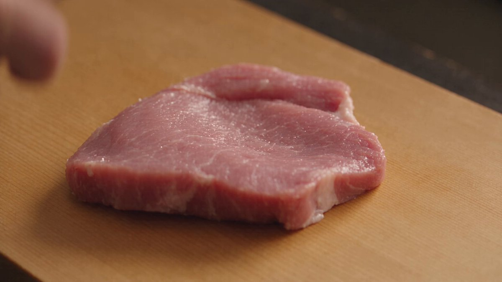

**Prompt**

```text
Traducción en curso
```

[↑ Volver a categorías](#catalog)

---

<a name="prompt-2101102219340972128"></a>

### Secuencia de anime 2D sakuga de fotogramas clave de alto octanaje con Maki Zen'in en una transición desde bocetos preliminares de guion gráfico hacia un combate de acción a todo color.

Autor：[@Valora\_Lab](https://x.com/Valora_Lab) · [Publicación original](https://x.com/Valora_Lab/status/2101102219340972128)

Cómic / Guion gráfico · Anime / Manga · Boceto / Arte lineal · Publicado

**Resumen:** Secuencia de anime 2D sakuga de fotogramas clave de alto octanaje con Maki Zen'in en una transición desde bocetos preliminares de guion gráfico hacia un combate de acción a todo color.


**Prompt**

```text
Secuencia de anime 2D sakuga de fotogramas clave de alto octanaje inspirada en bocetos de guiones gráficos preliminares, con líneas de cuadrícula tipo plano técnico, guías de fotograma de relación de aspecto técnico y un explosivo trazo dibujado a mano.
Escena 1 (El detonante): Maki Zen'in se encuentra en un marcado perfil de tres cuartos dentro de un cuadro de producción sin sombras. Un único primer plano captura la fría mirada en su rostro marcado por cicatrices mientras levanta la mano y chasquea los dedos. Al instante, un destello eléctrico de energía maldita chispea a través de su silueta, haciendo añicos el sereno boceto en fragmentos dentados con textura de carboncillo. El fondo se abre en líneas de perspectiva inclinadas de pilares de santuarios japoneses en ruinas y losas de concreto.
Escena 2 (La liberación y la carga): La cámara cae en picada hacia una vista de gusano extrema. Maki se impulsa desde el suelo con una fuerza física monstruosa, creando una onda de choque en forma de cráter representada en fotogramas de impacto crudos, esbozados a mano en negro y carmesí. Su cabello corto y oscuro se sacude hacia atrás con un desenfoque de movimiento de alta velocidad de fotogramas mientras desenvaina la Split Soul Katana. Efectos de sonido estilizados en kanji 3D estallan detrás de sus pasos, vibrando con distorsión al compás de un golpe de bajo síncopado y pesado.
Escena 3 (El clímax cinético): En un corte continuo y amplio en ojo de pez, Maki salta directamente hacia el espectador, con la hoja sostenida sobre su cabeza en agarre invertido. Escombros geométricos y líneas de velocidad cinética cortadas siguen su movimiento. A medida que su hoja corta la pantalla en diagonal, los trazos a lápiz toscos cambian abruptamente a colores planos de celuloide ricos y completamente saturados (salpicaduras nítidas de sangre carmesí, reflejos metálicos de acero deslumbrantes y púrpuras profundos), antes de congelarse en una pose de aterrizaje impecable y de enfoque nítido sobre piedra destrozada.
Estilo visual y especificaciones técnicas: Animación preliminar estilo genga, distorsión de perspectiva dinámica, fotogramas clave crudos y sueltos que pasan a un sombreado cel pulido, seguimiento dramático de cámara, fotogramas de impacto de alta energía cinética sincronizados con ritmos electrónicos abrasivos.
```

[↑ Volver a categorías](#catalog)

---

<a name="prompt-2100413833538121851"></a>

### Traducción en curso

Autor：[@hii\_roto](https://x.com/hii_roto) · [Publicación original](https://x.com/hii_roto/status/2100413833538121851)

Cómic / Guion gráfico · Fotografía · Anime / Manga · Publicado

Publicación original：[@hii\_roto](https://x.com/hii_roto) · [Publicación original](https://x.com/hii_roto/status/2100043716253917231)

**Resumen:** Traducción en curso


**Prompt**

```text
Traducción en curso
```

[↑ Volver a categorías](#catalog)

---

<a name="prompt-2098369249173782695"></a>

### Prompt de arte conceptual de ciencia ficción anime y mecha futurista con paleta en blanco, negro y naranja.

Autor：[@NVTDanh](https://x.com/NVTDanh) · [Publicación original](https://x.com/NVTDanh/status/2098369249173782695)

Anime / Manga · Cyberpunk / Ciencia ficción · Publicado

**Resumen:** Prompt de arte conceptual de ciencia ficción anime y mecha futurista con paleta en blanco, negro y naranja.


**Prompt**

```text
Arte conceptual de ciencia ficción anime futurista, diseño de mecha de futuro cercano, detalles mecánicos de superficies duras, elegante paleta tecnológica en blanco, negro y naranja, paneles de armadura intrincados, articulaciones y maquinaria expuestas, líneas nítidas y limpias, proporciones de anime semirrealistas, diseño industrial de gran detalle, arte de producción cinematográfico, estética de ilustración técnica limpia
```

[↑ Volver a categorías](#catalog)

---

<a name="category-sketch-line-art"></a>

## Boceto / Arte lineal

<a name="prompt-2101376938258624640"></a>

### Traducción en curso

Autor：[@abulu8](https://x.com/abulu8) · [Publicación original](https://x.com/abulu8/status/2101376938258624640)

Boceto / Arte lineal · Publicado

**Resumen:** Traducción en curso


**Prompt**

```text
Traducción en curso
```

[↑ Volver a categorías](#catalog)

---

<a name="prompt-2100043047857729721"></a>

### Traducción en curso

Autor：[@leo\_xiaolei](https://x.com/leo_xiaolei) · [Publicación original](https://x.com/leo_xiaolei/status/2100043047857729721)

Ilustración · Boceto / Arte lineal · Acuarela · Tinta / Estilo chino · Publicado

**Resumen:** Traducción en curso


**Prompt**

```text
Traducción en curso
```

[↑ Volver a categorías](#catalog)

---

<a name="category-3d-render"></a>

## Renderizado 3D

<a name="prompt-2101493389115953586"></a>

### Tierno video animado en 3D de un esponjoso hámster dorado con auriculares y un lazo rosa, entrando a una habitación y sosteniendo una rosa roja.

Autor：[@Zarnab\_with\_Ai](https://x.com/Zarnab_with_Ai) · [Publicación original](https://x.com/Zarnab_with_Ai/status/2101493389115953586)

Renderizado 3D · Publicado

**Resumen:** Tierno video animado en 3D de un esponjoso hámster dorado con auriculares y un lazo rosa, entrando a una habitación y sosteniendo una rosa roja.


**Prompt**

```text
Crea un tierno, reconfortante y ultrarrealista video vertical animado en 3D de un diminuto y esponjoso hámster dorado y blanco en el acogedor interior de una casa cálidamente iluminada.

El hámster tiene un pelaje afelpado extremadamente suave, enormes ojos negros y brillantes, mejillas sonrosadas, una pequeña nariz rosada y una adorable expresión de inocencia. Lleva unos auriculares extragrandes de color rosa pálido, un gran lazo rosa con lunares en la cabeza y un delicado collar de cinta rosa con una pequeña placa identificativa colgando.

Escena 1: El hámster se asoma lentamente desde detrás de una puerta blanca, mirando tímidamente hacia la cámara. Da un paso cuidadoso hacia un suelo de madera cálida y pulida mientras mantiene el contacto visual con el espectador.

Escena 2: El hámster camina hacia la cámara con diminutos y adorables pasitos y se detiene en el centro de la habitación. Sus orejas y su lazo se mueven de forma natural con cada paso. El fondo presenta una acogedora estantería de madera, una cálida lámpara de mesa, suaves paredes beige y una hermosa iluminación ambiental dorada.

Escena 3: El hámster mira directamente a la cámara con una expresión dulce e inocente. Tras un breve instante, se agacha suavemente y recoge una única y hermosa rosa roja con sus diminutas patitas.

Escena 4: Sosteniendo la rosa roja frente a su cuerpo, el hámster sonríe cálidamente a la cámara. Sus mejillas se vuelven ligeramente más sonrosadas, y luce tímido y cariñoso.

Toma final: El hámster cierra los ojos con una gran y adorable sonrisa mientras sostiene la rosa roja contra su pecho. El momento se siente sano, romántico, tierno y reconfortante.

Cámara: vertical 9:16, ángulo de cámara bajo al nivel de los ojos, movimiento de cámara suave y lento, acercamiento suave (push-in) hacia el hámster, profundidad de campo reducida, encuadre cinematográfico.

Iluminación: iluminación interior dorada y cálida, sombras naturales suaves, ambiente acogedor de atardecer/noche, reflejos sutiles en el pelaje del hámster.

Estilo: animación de personajes en 3D tierna y ultrarrealista, pelaje esponjoso sumamente detallado, expresiones faciales realistas, renderizado cinematográfico suave, reflejos en el suelo de madera pulida, movimiento realista de objetos, narrativa emocional adorable, calidad de película animada prémium.

Movimiento: movimientos naturales de patitas diminutas, movimientos sutiles de la cabeza, parpadeo realista, respiración suave, movimiento delicado de orejas y lazo, animación fluida al caminar, interacción creíble con la rosa.

Sin texto, sin subtítulos, sin marcas de agua, sin personajes adicionales, sin anatomía distorsionada, sin objetos duplicados.
```

[↑ Volver a categorías](#catalog)

---

<a name="prompt-2101246172438655048"></a>

### Prompt de corto cómico de ASMR animado en 3D que presenta a un chef pirata y a un loro travieso cocinando juntos en una cocina de barco.

Autor：[@Aiwithkami](https://x.com/Aiwithkami) · [Publicación original](https://x.com/Aiwithkami/status/2101246172438655048)

Renderizado 3D · Comida y bebida · Publicado

**Resumen:** Prompt de corto cómico de ASMR animado en 3D que presenta a un chef pirata y a un loro travieso cocinando juntos en una cocina de barco.


**Prompt**

```text
Crea un corto cómico de ASMR animado en 3D de 30 segundos con calidad de Pixar a bordo de la cocina cálida e iluminada por linternas de un barco pirata.

ESTILO: Animación 3D cinematográfica de primera calidad, personajes expresivos, calidad refinada de largometraje, iluminación ámbar cálida, texturas de comida realistas, profundidad de campo cinematográfica, humor físico juguetón, movimiento suave del barco y un ASMR de comida nítido e inmersivo.

Personajes: Un chef pirata grande, fornido y barbudo que viste un delantal desgastado, y un loro verde brillante y travieso que intenta constantemente robar ingredientes. Mantén a ambos personajes visualmente consistentes en todo momento.

0–4s

Primerísimo primer plano del loro robando una cabeza de ajo. La mano del pirata golpea repentinamente a su lado. Se congelan y se miran fijamente el uno al otro. Breve silencio de disco rayado. El pirata lanza al loro con un chasquido de dedos; este gira por el aire y aterriza en un colgador de ollas fingiendo que no pasó nada.

4–8s

El pirata pica ajo rápidamente con un ASMR nítido. El loro camina en puntitas hacia un tomate. El ajo cae en el aceite caliente con un gran chisporroteo, asustando al loro y haciéndolo caer rodando del colgador. Las tazas de metal repican.

8–14s

Montaje de cocina cinemático y rápido: tomates chisporroteando, hierbas siendo desgarradas, aceite de oliva cayendo en cámara lenta dorada, salsa burbujeando y el pirata revolviendo con confianza la sartén. Superpón un ASMR detallado de picado, chisporroteo, vertido y burbujeo.

14–19s

El loro ve la comida e intenta arrastrar en secreto la sartén para llevársela. Su diminuto cuerpo se esfuerza cómicamente a través del piso de madera. El pirata se da la vuelta lentamente y se le queda mirando. El loro se congela mientras sigue sosteniendo el mango, luego silba inocentemente y lo suelta.

19–24s

El pirata termina de cocinar con un dramático lanzamiento al aire de la sartén. El vapor se eleva mientras se emplata el plato brillante. El loro mira con hambre, tratando de parecer inocente.

24–30s

En lugar de regañar al loro, el pirata prepara un platito diminuto de salsa y pan y lo desliza a través de la mesa. El loro salta felizmente y come a su lado. Intercambian una mirada de satisfacción mientras el barco se mece suavemente.

Termina con una toma amplia y cinematográfica de la acogedora cocina brillando bajo las linternas ámbar, sutiles sonidos del océano y crujidos del barco de madera, con una suave y juguetona nota de acordeón que se desvanece.

Sin diálogos, sin subtítulos, sin texto. Mantén una sólida consistencia de personajes, física natural, animación fluida, encuadre cinematográfico y un detallado ASMR de comida en todo momento.
```

[↑ Volver a categorías](#catalog)

---

<a name="prompt-2100829705129877876"></a>

### Prompt de comedia animada en 3D de un tigre regordete persiguiendo a un gallo con un matamoscas rosa en un prado.

Autor：[@Elvorya](https://x.com/Elvorya) · [Publicación original](https://x.com/Elvorya/status/2100829705129877876)

Renderizado 3D · Personaje · Publicado

**Resumen:** Prompt de comedia animada en 3D de un tigre regordete persiguiendo a un gallo con un matamoscas rosa en un prado.


**Prompt**

```text
Crea una secuencia cómica de animación 3D de alta calidad de 15 segundos en un prado campestre brillante y colorido.

Un tigre enorme y rechoncho de color naranja y negro con rasgos faciales de caricatura muy expresivos persigue juguetonamente a un pequeño y enérgico gallo a través de un campo verde y soleado. El tigre sostiene un matamoscas rosa gigante en una pata e intenta atrapar repetidamente al gallo.

0–2 segundos: Comienza con una toma amplia en contrapicado del hermoso prado bajo un cielo azul vivo con suaves nubes blancas, flores silvestres coloridas y árboles lejanos. El tigre corre hacia la cámara mientras el gallo huye desesperadamente delante de él.

2–4 segundos: Pasa rápidamente a una toma dinámica en contrapicado mientras el tigre balancea el enorme matamoscas rosa hacia el gallo. El gallo escapa por poco, saltando hacia un lado.

4–7 segundos: Muestra al tigre dando un salto exagerado por el aire, con las patas estiradas hacia adelante, mientras el gallo salta y aletea justo fuera de su alcance. Usa movimientos de cámara enérgicos y un ligero desenfoque de movimiento para lograr un impacto cómico.

7–10 segundos: Alterna entre planos cerrados y medios mientras el tigre balancea repetidamente el matamoscas rosa sobre el pasto. El gallo esquiva cada intento con movimientos de caricatura exagerados pero creíbles.

10–12 segundos: El tigre se frustra cada vez más y arremete hacia adelante a toda velocidad. El gallo cambia repentinamente de dirección, haciendo que el tigre pierda el equilibrio.

12–15 segundos: Toma cinematográfica amplia final: el tigre rueda dramáticamente sobre la suave hierba y queda despatarrado, exhausto y aturdido, mientras el gallo se queda tranquilamente cerca mirándolo. El matamoscas rosa cae en el pasto cercano. Termina con el divertido contraste entre el tigre exhausto y el gallo victorioso.

Estilo visual: animación 3D pulida y de alta gama, estética de caricatura cinematográfica colorida, pelaje y plumas detallados, rostros expresivos, animación fluida de personajes, comedia física exagerada, sombras realistas, brillante luz solar de verano, pasto verde vibrante, flores coloridas, cielo azul, profundidad de campo cinematográfica, tomas de cámara dinámicas en contrapicado, seguimiento suave, cortes de acción rápidos, desenfoque de movimiento sutil, física creíble, humor juguetón para toda la familia.

Consistencia de personajes: mantén el mismo tigre grande y rechoncho, las mismas rayas naranjas y negras, el mismo gallo, el mismo matamoscas rosa y el mismo prado durante todo el video.

Prompt negativo: fotorrealismo, acción real, terror, iluminación oscura, personajes distorsionados, rostros deformes, extremidades adicionales, patas malformadas, animales duplicados, anatomía antinatural, parpadeo, cambios de personajes, texto, subtítulos, logotipos, marca de agua
```

[↑ Volver a categorías](#catalog)

---

<a name="prompt-2099316017986220245"></a>

### Una animación 3D de una criatura afelpada con forma de durazno que recolecta miel en el bosque y prepara una bebida helada en una cocina.

Autor：[@Zarnab\_with\_Ai](https://x.com/Zarnab_with_Ai) · [Publicación original](https://x.com/Zarnab_with_Ai/status/2099316017986220245)

Renderizado 3D · Personaje · Comida y bebida · Animal / Criatura · Paisaje / Naturaleza · Publicado

**Resumen:** Una animación 3D de una criatura afelpada con forma de durazno que recolecta miel en el bosque y prepara una bebida helada en una cocina.


**Prompt**

```text
Crea un video vertical cinematográfico en 3D (9:16), tierno y ultrarrealista, protagonizado por una diminuta y adorable criatura con forma de durazno, con un cuerpo afelpado y suave de color rosa pastel, diminutos ojos negros brillantes, una boquita linda, mejillas sonrosadas, brazos y pies diminutos, y una pequeña hoja verde sobre su cabeza.

La pequeña criatura durazno se encuentra en un hermoso bosque iluminado por el sol, rodeada de hierba verde, árboles, hojas y una cálida luz solar natural. Descubre un panal que cuelga de la rama de un árbol y recolecta alegremente miel dorada y fresca con una cucharita diminuta. Una pequeña abeja vuela a su alrededor y se posa brevemente cerca de su rostro.

Muestra a la criatura disfrutando de la miel, caminando por el bosque y luego regresando a una acogedora cocina rústica de madera. Prepara un refrescante vaso de bebida de frutas y miel añadiendo cubitos de hielo, rodajas de limón, trozos de frutas coloridas y miel dorada en un vaso transparente. Revuelve suavemente la bebida con una cuchara y la bebe alegremente.

Haz que el personaje sea extremadamente tierno y expresivo, con detalles suaves y afelpados como de peluche, texturas realistas, movimientos adorables, expresiones faciales naturales, profundidad de campo cinematográfica, iluminación cálida de hora dorada, hermoso efecto bokeh, un entorno de bosque detallado, movimientos de cámara fluidos, primeros planos macro, sombras realistas y animación 3D prémium de alta calidad.

Mantén el mismo diseño de personaje, rostro, proporciones, colores, hoja y apariencia consistentes a lo largo de todo el video. Sin texto, sin marcas de agua, sin anatomía distorsionada, sin personajes adicionales.

Estilo: 3D tierno estilo Pixar + texturas fotorrealistas + fotografía macro cinematográfica + estética acogedora de fantasía.
```

[↑ Volver a categorías](#catalog)

---

<a name="prompt-2098590744080757223"></a>

### Prompt de escena animada en 3D: representa una acogedora escena de una adorable nutria de peluche sentada en una silla de oficina bebiendo café helado con popote.

Autor：[@Zarnab\_with\_Ai](https://x.com/Zarnab_with_Ai) · [Publicación original](https://x.com/Zarnab_with_Ai/status/2098590744080757223)

Renderizado 3D · Personaje · Comida y bebida · Publicado

**Resumen:** Prompt de escena animada en 3D: representa una acogedora escena de una adorable nutria de peluche sentada en una silla de oficina bebiendo café helado con popote.


**Prompt**

```text
Crea una escena animada en 3D de alta calidad y ultradetallada que muestre al mismo adorable personaje regordete con aspecto de nutria, de suave pelaje marrón grisáceo, vientre y hocico blanco cremoso, pequeñas orejas redondeadas, ojos negros brillantes, una pequeña nariz oscura, mejillas sonrosadas, patas cortas y lindas almohadillas visibles. El personaje tiene una apariencia suave de peluche, proporciones redondeadas y una expresión inocente y feliz.

Ubica al personaje sentado cómodamente en una moderna silla de oficina ergonómica de color negro. El personaje sostiene y bebe un café helado en un vaso de plástico transparente con popote, con ambas patas envueltas de manera natural alrededor del vaso. Mantén al personaje centrado y prominente en el encuadre.

Ambientada en el interior de una oficina moderna y luminosa, con filas de cubículos de color beige grisáceo, monitores de computadora, grandes ventanales, suave luz natural, pisos pulidos y sutiles detalles de oficina en el fondo. Utiliza una profundidad de campo reducida para que el personaje permanezca enfocado con nitidez mientras el fondo queda suavemente desenfocado.

Haz que la imagen parezca un fotograma de una película animada de primera categoría: pelaje suave muy detallado, texturas realistas de tela y plástico, ojos brillantes y expresivos, iluminación suave y natural, composición cinematográfica, sombras realistas, oclusión ambiental sutil, renderizado 3D pulido, atmósfera adorable y fantasiosa, composición limpia, calidad de animación profesional, alta resolución, composición vertical 9:16.

Importante: Conserva exactamente el mismo diseño y proporciones del personaje en todo momento, sin humanos en primer plano, sin texto, sin logotipos, sin marcas de agua y sin anatomía distorsionada.
```

[↑ Volver a categorías](#catalog)

---

<a name="prompt-2098371778234179766"></a>

### Instrucciones de producción para una persecución de autos al estilo GTA, especificando desde el modelado 3D en gris en Blender hasta la renderización de video con PixVerse \(Seedance 2.5\).

Autor：[@hasamaru\_studio](https://x.com/hasamaru_studio) · [Publicación original](https://x.com/hasamaru_studio/status/2098371778234179766)

Renderizado 3D · Producto · Vehículo · Publicado

**Resumen:** Instrucciones de producción para una persecución de autos al estilo GTA, especificando desde el modelado 3D en gris en Blender hasta la renderización de video con PixVerse \(Seedance 2.5\).


**Prompt**

```text
Sigue este flujo de trabajo de producción para crear una persecución de autos 3D original al estilo GTA:

[Diseño]
Diseña 1 conductor principal, 1 auto de escape, 1 auto de persecución y 1 entorno urbano con apariencias consistentes. Planifica 3 tomas de 4 segundos cada una:
- Una toma de persecución siguiendo a los vehículos desde atrás
- Una toma lateral siguiendo a los vehículos en una curva cerrada
- Una toma amplia capturando a los vehículos alejándose a gran velocidad

[Construcción en Blender]
Crea modelos limpios en sombreado gris y rigs funcionales para los personajes y vehículos. No se requieren texturas ni mapeado UV.

[Animación y pruebas]
Anima al conductor, el volante, la rotación de las ruedas, los vehículos y las cámaras. Mantén coherente la dirección del recorrido y el orden de los autos; corrige interpenetraciones, ruedas flotantes, deslizamientos irreales de los neumáticos, poses rotas y manos que se despegan del volante.

[Renderizado en Blender]
Renderiza los fotogramas del 1 al 288 a 1280×720, 24 fps. Ensambla los fotogramas renderizados reales de Blender en un video maestro en modelo gris de 12 segundos. Exporta cada toma por separado y renderiza imágenes fijas correspondientes en gris como referencias de forma y composición.

[Finalización con el complemento PixVerse]
Usa Seedance 2.5 a 720p para procesar cada toma individualmente. Utiliza el video de Blender como referencia de movimiento y las imágenes fijas en gris para la coherencia de formas. Emplea un esquema de color unificado en las indicaciones de generación. Mantén el movimiento de cámara, el ritmo de la acción, el diseño de personajes y vehículos, y la cantidad de autos.

[Revisión y entrega]
Revisa ambos videos terminados en busca de artefactos visuales y continuidad entre tomas. Corrige los problemas subyacentes en Blender y vuelve a generar únicamente las tomas fallidas en Seedance, limitando los reintentos a 2 por toma.

Entrega el archivo .blend editable, el video nativo en modelo gris de Blender a 720p, el video a 720p etiquetado como versión de Seedance y una breve evaluación de las limitaciones restantes.
```

[↑ Volver a categorías](#catalog)

---

<a name="prompt-2098326362801221835"></a>

### Traducción en curso

Autor：[@Chengzilhy](https://x.com/Chengzilhy) · [Publicación original](https://x.com/Chengzilhy/status/2098326362801221835)

Cómic / Guion gráfico · Fotografía · Renderizado 3D · Publicado

**Resumen:** Traducción en curso


**Prompt**

```text
Traducción en curso
```

[↑ Volver a categorías](#catalog)

---

<a name="category-ink-chinese-style"></a>

## Tinta / Estilo chino

<a name="prompt-2100233948341367178"></a>

### Cortometraje de artes marciales y efectos visuales de una guerrera xianxia que se teletransporta y patea a una bestia, con final en siluetas rojas y negras.

Autor：[@liyue\_ai](https://x.com/liyue_ai) · [Publicación original](https://x.com/liyue_ai/status/2100233948341367178)

Tinta / Estilo chino · Publicado

Publicación original：[@liyue\_ai](https://x.com/liyue_ai) · [Publicación original](https://x.com/liyue_ai/status/2100087420771610707)

**Resumen:** Cortometraje de artes marciales y efectos visuales de una guerrera xianxia que se teletransporta y patea a una bestia, con final en siluetas rojas y negras.


**Prompt**

```text
Estilo Xianxia tradicional chino, cortometraje puramente de efectos especiales CG, 16:9, edición multicámara, iluminación cinematográfica, materiales PBR de última generación, HDR cinematográfico.
Un mismo personaje femenino de Xianxia de estilo clásico en tonos negro, azul, blanco y dorado, con vestuario, peinado y maquillaje completamente consistentes en todo momento: huadian rojo en la frente, cabello largo recogido en alto, túnica de combate de mangas anchas en blanco con bordados azul y oro, fajín metálico a la cintura y finos accesorios para el cabello con borlas.
En un espacio energético negro y azul, la protagonista se teletransporta a gran velocidad desde partículas azul dorado a la izquierda, toma lateral, corriendo a máxima velocidad hacia la bestia a la derecha, con su cabello largo y la túnica dejando una estela dinámica de movimiento. Luego, una toma lateral en contrapicado muestra a la protagonista girando la cadera y doblando la rodilla para conectar una patada lateral con una perspectiva extrema; el faldón de combate se levanta dejando ver los muslos y las piernas, que junto a los pies están envueltos en energía fluida azul y dorada. Enseguida se corta al impacto: la patada golpea de lleno la cabeza de la criatura, desatando al mismo tiempo una nube de sangre, destellos fragmentados y partículas de explosión azul dorado; tras un breve cuadro en blanco y negro, entra en cámara lenta mientras la bestia sale disparada por la enorme fuerza en la dirección del golpe. Al final, la escena cambia a un fondo rojo de alta saturación con siluetas negras de los personajes; la heroína sostiene su pose desafiante mientras la bestia vuela hacia atrás a la derecha y se estrella contra el suelo, estallando una nube de humo negro, cerrando con un impacto visual muy potente en rojo y negro.
Las acciones son limpias, feroces y explosivas, con un ritmo de cámara ágil; la primera mitad destaca por sus intensos efectos azul y oro, terminando en una escena de contraste rojo y negro sobria y contundente.
```

[↑ Volver a categorías](#catalog)

---

<a name="category-retro-vintage"></a>

## Retro / Vintage

<a name="prompt-2102606380863472099"></a>

### Traducción en curso

Autor：[@iamahmedfaraz66](https://x.com/iamahmedfaraz66) · [Publicación original](https://x.com/iamahmedfaraz66/status/2102606380863472099)

Retro / Vintage · Personaje · Publicado

**Resumen:** Traducción en curso

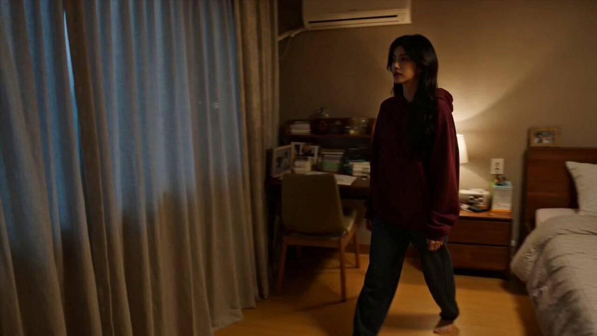

**Prompt**

```text
Traducción en curso
```

[↑ Volver a categorías](#catalog)

---

<a name="prompt-2101515497150025999"></a>

### El prompt describe un video retro en DV de 30 segundos de una mujer coreana caminando por Seúl, lavándose la cara, comiendo una paleta y saludando a los vecinos.

Autor：[@AIwithkhan](https://x.com/AIwithkhan) · [Publicación original](https://x.com/AIwithkhan/status/2101515497150025999)

Retro / Vintage · Personaje · Publicado

**Resumen:** El prompt describe un video retro en DV de 30 segundos de una mujer coreana caminando por Seúl, lavándose la cara, comiendo una paleta y saludando a los vecinos.


**Prompt**

```text
Crea un video casero personal y ultrarrealista de 30 segundos de una joven coreana disfrutando de una relajada mañana de domingo en un barrio residencial antiguo de Seúl. Usa la imagen adjunta como referencia del personaje y mantén su rostro, su coleta lateral despeinada de cabello negro largo, su top ajustado color azul pastel, sus pantalones holgados color crema, sus tenis negros, su collar plateado y su apariencia general perfectamente consistentes.
Sale de su casa con una expresión alegre, cierra la puerta detrás de ella, se acomoda la coleta lateral despeinada y comienza a caminar tranquilamente por el tranquilo vecindario. En el camino, se cruza con algunos vecinos conocidos y los saluda cálidamente con una sonrisa y un casual “Hello”, creando una atmósfera de domingo natural y amistosa.
Llega a un pequeño grifo exterior del vecindario y se detiene para lavarse la cara. Se salpica agua fresca en el rostro, se ríe cuando varias gotas de agua caen en el frente de su top azul pastel, mira hacia abajo a las manchas húmedas, sonríe y sacude la cabeza juguetonamente antes de continuar.
Visita una pequeña tienda de conveniencia local, compra una paleta de dulce colorida, la desenvuelve de inmediato, se la mete en la boca y camina de regreso por el vecindario disfrutándola alegremente. Balancea despreocupadamente la pequeña bolsa de compras en una mano mientras sostiene la paleta en la otra.
Al pasar por un estrecho callejón residencial, se encuentra con algunos niños del vecindario. Sonríe, los saluda con la mano y les estrecha la mano uno por uno mientras mantiene la paleta en la otra mano. Dice: “Hello!” y continúa caminando con una sonrisa juguetona.
Cerca del final, se gira hacia la cámara mientras aún sostiene la paleta, sonríe de forma natural y dice: “Happy Sunday!” antes de alejarse caminando por el tranquilo callejón.
Usa metraje sin procesar de cámara DV de consumo de principios de los años 2000: temblor de cámara en mano, encuadre imperfecto, búsqueda de enfoque automático, cambios de exposición, detalle suave, ligero ruido digital, desenfoque de movimiento natural, zooms torpes ocasionales e imperfecciones auténticas de video casero.
Solo ambiente natural de un vecindario de Seúl: pasos, vecinos hablando, niños riendo, agua corriendo, timbres de bicicleta, tráfico distante, pájaros, insectos de verano y hojas moviéndose con la brisa. Sin música, sin narración, sin subtítulos, sin eventos dramáticos, sin cinematografía comercial pulida, sin piel de filtro de belleza, sin apariencia CGI.
```

[↑ Volver a categorías](#catalog)

---

<a name="category-cyberpunk-sci-fi"></a>

## Cyberpunk / Ciencia ficción

<a name="prompt-2097330853588402541"></a>

### Traducción en curso

Autor：[@TanLuAI](https://x.com/TanLuAI) · [Publicación original](https://x.com/TanLuAI/status/2097330853588402541)

Cómic / Guion gráfico · Cyberpunk / Ciencia ficción · Personaje · Publicado

Publicación original：[@TanLuAI](https://x.com/TanLuAI) · [Publicación original](https://x.com/TanLuAI/status/2096586474645004331)

**Resumen:** Traducción en curso


**Prompt**

```text
Traducción en curso
```

[↑ Volver a categorías](#catalog)

---

<a name="category-minimalism"></a>

## Minimalismo

<a name="prompt-2100248337920499730"></a>

### Traducción en curso

Autor：[@TanLuAI](https://x.com/TanLuAI) · [Publicación original](https://x.com/TanLuAI/status/2100248337920499730)

Cómic / Guion gráfico · Minimalismo · Personaje · Animal / Criatura · Publicado

**Resumen:** Traducción en curso


**Prompt**

```text
Traducción en curso
```

[↑ Volver a categorías](#catalog)

---

<a name="category-other"></a>

## Otros

<a name="prompt-2102586248498196843"></a>

### Traducción en curso

Autor：[@MeenakshiYACS](https://x.com/MeenakshiYACS) · [Publicación original](https://x.com/MeenakshiYACS/status/2102586248498196843)

Artículo de moda · Publicado

**Resumen:** Traducción en curso

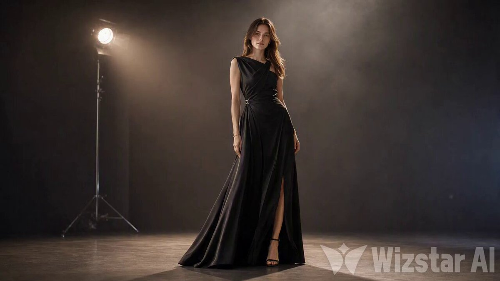

**Prompt**

```text
Traducción en curso
```

[↑ Volver a categorías](#catalog)

---

<a name="prompt-2102289833326772324"></a>

### Traducción en curso

Autor：[@magic\_ai\_skill](https://x.com/magic_ai_skill) · [Publicación original](https://x.com/magic_ai_skill/status/2102289833326772324)

Personaje · Paisaje urbano / Calle · Publicado

**Resumen:** Traducción en curso

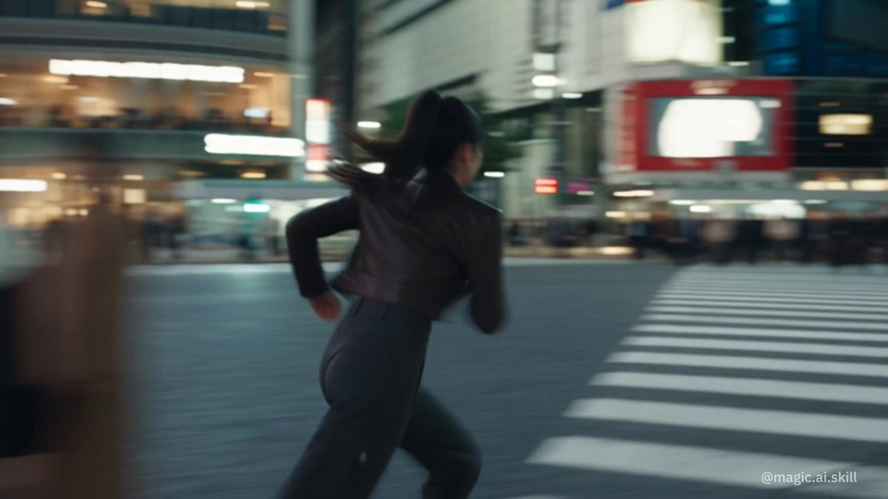

**Prompt**

```text
Traducción en curso
```

[↑ Volver a categorías](#catalog)

---

<a name="prompt-2102263180500312349"></a>

### Video con textura de grabación casera DV de principios de los 2000, que detalla tomas continuas de una joven rescatando un cometa, volándolo, salvando a un pájaro y alimentando a un cordero.

Autor：[@doctorwasif](https://x.com/doctorwasif) · [Publicación original](https://x.com/doctorwasif/status/2102263180500312349)

Cómic / Guion gráfico · Personaje · Animal / Criatura · Publicado

**Resumen:** Video con textura de grabación casera DV de principios de los 2000, que detalla tomas continuas de una joven rescatando un cometa, volándolo, salvando a un pájaro y alimentando a un cordero.

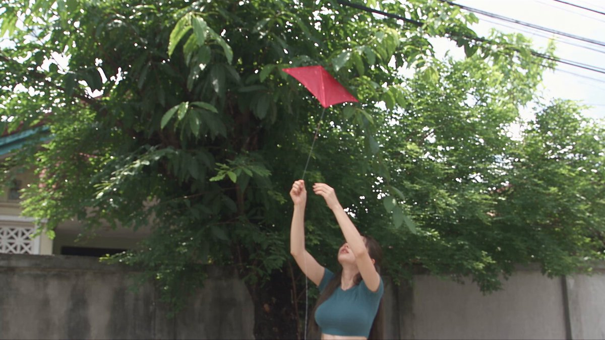

**Prompt**

```text
image = Sujeto principal. Conserva su rostro exacto, identidad, peinado, rasgos faciales, tono de piel y proporciones corporales en todo momento. Mantén consistente el atuendo de referencia.

Mujer auténtica del sudeste asiático o coreana. Barrio residencial de principios de los años 2000: callejones estrechos de concreto, casas sencillas de un solo piso, pequeñas terrazas, plantas en macetas, árboles grandes, cables aéreos enredados y una pequeña cabra/cordero cerca de la casa. Sin tiendas, mercados, vendedores ni actividad comercial.

REALISMO CRUDO DE VIDEOCÁMARA DV DE PRINCIPIOS DE LOS 2000: metraje de video casero grabado a mano, fuerte movimiento orgánico de la cámara, encuadre imperfecto, reencuadres frecuentes, sujeto desplazándose cerca de los bordes del cuadro, búsqueda de autofoco (autofocus hunting), respiración del lente, fluctuaciones de exposición, rolling shutter, desenfoque de movimiento natural, ruido digital, artefactos de compresión, colores desvaídos/desaturados, luces altas lavadas, negros desvaídos, bajo contraste. Grabación casual hecha por un amigo. Sin estabilización, poses, glamour cinematográfico, composición pulida ni gradación de color moderna.

00:00–00:04
Bajo un gran árbol, se empina en puntillas y desenreda suavemente el hilo de un cometa atrapado entre las ramas. La cámara se balancea y el encuadre se desvía.

00:04–00:07
Plano cerrado cámara en mano mientras libera el hilo, ríe y atrapa el cometa que cae.

00:07–00:10
Camina hacia la calle, suelta el hilo y observa el cometa elevarse con el viento, sonriendo.

00:10–00:13
Trota unos pasos para controlar el cometa mientras el viento tira del hilo. Encuadre cámara en mano suelto e imperfecto.

00:13–00:16
Regresa hacia la casa y se agacha, recogiendo suavemente a un pájaro asustado que voló al interior.

00:16–00:19
Plano cerrado cámara en mano mientras lleva el pájaro afuera en sus manos ahuecadas, hablándole suavemente para calmarlo.

00:19–00:22
Abre las manos y el pájaro se va volando. Ella lo observa con una cálida sonrisa, protegiéndose los ojos del sol.

00:22–00:25
Se arrodilla junto a la cabra/cordero y le da de comer con un biberón.

00:25–00:28
Plano cerrado de la cabra bebiendo con entusiasmo mientras ella ríe y acomoda el biberón.

00:28–00:30
La cabra le da un empujoncito juguetón en el brazo. Ella ríe, la empuja suavemente hacia atrás y luego mira brevemente hacia la cámara con una sonrisa natural antes del corte.

AUDIO: Solo sonido natural del lugar: pájaros, brisa, hojas, motocicletas lejanas, el aleteo del hilo del cometa, trinos de pájaros y balidos de cabra. Sin música.

16:9.
```

[↑ Volver a categorías](#catalog)

---

<a name="prompt-2102278921161208273"></a>

### Secuencia de terror en una escuela secundaria japonesa con una profesora y estudiantes huyendo de un brote hacia la azotea.

Autor：[@SadiaMalik182](https://x.com/SadiaMalik182) · [Publicación original](https://x.com/SadiaMalik182/status/2102278921161208273)

Otros · Publicado

**Resumen:** Secuencia de terror en una escuela secundaria japonesa con una profesora y estudiantes huyendo de un brote hacia la azotea.

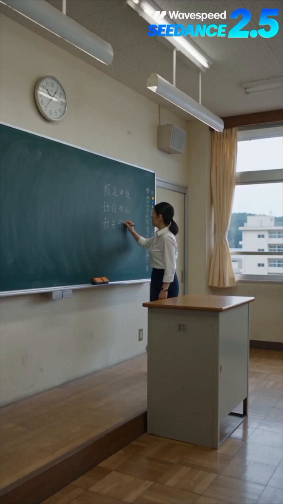

**Prompt**

```text
Crea una secuencia de acción y terror de una escuela secundaria japonesa ultrarrealista que sigue a una profesora durante una clase ordinaria de la tarde. El aula está en calma cuando de repente las luces parpadean y el teléfono de cada estudiante recibe la misma alerta de emergencia exactamente en el mismo instante. La profesora mira hacia afuera y nota el patio de la escuela completamente vacío.

Un fuerte estruendo proviene del laboratorio de ciencias de al lado. La profesora les dice a todos que se queden adentro y abre con cuidado la puerta del aula. El pasillo parece vacío, pero un rastro de líquido químico derramado conduce hacia la escalera. De repente, un estudiante que había estado sentado en silencio al fondo del salón se desploma y comienza a comportarse de forma extraña, revelando que algo ya ha ocurrido dentro de la escuela.

La alarma de emergencia comienza a sonar. Varios estudiantes infectados corren repentinamente desde la escalera hacia el aula. La profesora empuja rápidamente los escritorios contra la entrada mientras los estudiantes colaboran para bloquearla con sillas y gabinetes. Un estudiante nota una señal de salida de emergencia y guía al grupo hacia un segundo pasillo.

Avanzan por el oscuro pasillo de la escuela mientras escuchan pasos que se aproximan por detrás. La profesora apaga las luces del pasillo y todos se esconden en silencio dentro de un aula vacía mientras los infectados pasan de largo afuera.

Finalmente llegan a la azotea y empujan la puerta para abrirla, esperando encontrar ayuda. En cambio, ven a decenas de figuras infectadas de pie e inmóviles por todo el patio escolar abajo.

La profesora cierra lentamente la puerta de la azotea y se gira hacia sus estudiantes.

Entonces una voz tenue susurra detrás de ellos:

“Sensei... someone is already here.”

Ella se da la vuelta lentamente.

Corte a negro.

Thriller de terror japonés de acción real fotorrealista, entorno realista de escuela secundaria japonesa, uniformes estudiantiles auténticos, expresiones faciales naturales, terror con efectos prácticos, física realista, cámara cinematográfica en mano, tomas de seguimiento dinámicas, primeros planos dramáticos, iluminación realista, luces de emergencia, polvo atmosférico, movimiento natural de los personajes, reacciones auténticas, tensión creciente, solo sonido diegético, sin música, sin narración, terror centrado en el suspenso, sin sangre excesiva, sin heridas gráficas, sin animación, sin anime, sin dibujos animados, sin aspecto CGI artificial, sin anatomía distorsionada, sin subtítulos, sin texto aleatorio, sin marcas de agua
```

[↑ Volver a categorías](#catalog)

---

<a name="prompt-2102214977033818514"></a>

### Prompt con estética de cámara en mano que retrata cómo una mujer y un gato atigrado acortan distancias de manera natural en un café de gatos en Japón.

Autor：[@akiyoshisan](https://x.com/akiyoshisan) · [Publicación original](https://x.com/akiyoshisan/status/2102214977033818514)

Personaje · Animal / Criatura · Publicado

Publicación original：[@akiyoshisan](https://x.com/akiyoshisan) · [Publicación original](https://x.com/akiyoshisan/status/2101912827502248219)

**Resumen:** Prompt con estética de cámara en mano que retrata cómo una mujer y un gato atigrado acortan distancias de manera natural en un café de gatos en Japón.


**Prompt**

```text
Un café de gatos en Japón.
Sakura lleva una blusa verde salvia pálido + pantalones tono marfil.

Primera mitad: Se acerca poco a poco a un gato mestizo de pelo corto atigrado marrón que le llama la atención → extiende la mano → el gato desvía la mirada / se acicala / se mueve un poco de lugar → Sakura deja de seguirlo.

Segunda mitad: A partir del momento en que Sakura ya no mira al gato, es el gato quien acorta la distancia despacio → llega hasta sus pies → huele la mano → una sola caricia suave → se acomoda y se relaja cerca.

Camera: Grabación cámara en mano amateur hecha por un amigo. Prohibido tripié o cámara fija. El seguimiento de los movimientos del gato tiene un retraso de 0.3 a 0.8 segundos, ligero temblor de pulso, cambios de postura y altura, breve titubeo del autoenfoque. La cámara traslada la mirada con naturalidad de Gato → Sakura → manos. Cero sensación de estabilizador o gimbal perfecto.

Acting: Sin emociones exageradas. Solo juego de miradas, retirar la mano, relajar los hombros y apenas aflojar la comisura de los labios.

Sound: Únicamente sonido ambiental del lugar + pasos del gato y roce de la ropa.
Prohibidos diálogos, voces humanas, voz de quien graba, sincronía de labios, subtítulos, plecas o textos en pantalla y narración.

Continuity: Mantener la misma Sakura, la misma ropa, el mismo gato y el mismo espacio del café de gatos.
No hacer que el gato parezca amaestrado. No hacer que se vuelva cariñoso de repente. Prohibida la sobreactuación, los recursos cinematográficos artificiales, planos fijos largos e imprevistos innecesarios.
```

[↑ Volver a categorías](#catalog)

---

<a name="prompt-2102122125901328606"></a>

### Metraje estilo teléfono inteligente cámara en mano de unos pescadores subiendo una red a bordo de un barco, revelando a una sirena viva que se levanta y asusta a la tripulación.

Autor：[@YourAlphaMom](https://x.com/YourAlphaMom) · [Publicación original](https://x.com/YourAlphaMom/status/2102122125901328606)

Vehículo · Publicado

**Resumen:** Metraje estilo teléfono inteligente cámara en mano de unos pescadores subiendo una red a bordo de un barco, revelando a una sirena viva que se levanta y asusta a la tripulación.


**Prompt**

```text
Crea un video ultrarrealista de 15 segundos en formato vertical 9:16 de unos pescadores subiendo a bordo de un barco pesquero en faena a una enorme sirena. UNA sola toma continua cámara en mano, grabada por un miembro de la tripulación fuera de cuadro de pie en la cubierta.

CÁMARA E ILUMINACIÓN

Metraje auténtico e informal de teléfono inteligente: ligero temblor de manos, encuadre imperfecto, enfoque automático común, desenfoque de movimiento natural y zoom digital realista. El dispositivo de grabación y quien lo opera permanecen fuera de cuadro.

Luz diurna brillante y nublada. Colores neutros, sombras suaves, superficies mojadas, equipo de pesca desgastado y un mar gris ordinario. Textura natural de la piel y las escamas, sin iluminación cinematográfica ni filtros de belleza.

El observador permanece varios pasos adentro de la cubierta durante toda la toma, con una vista despejada de la red, de ambos pescadores y de la criatura. El barco se mece suavemente.

ENTORNO Y CRIATURA

Un barco pesquero en faena con una cubierta ancha y mojada, una borda de metal y una pequeña pluma hidráulica de elevación. Dos pescadores visten chaquetas impermeables, guantes de goma y botas de trabajo.

Una pesada red de pesca cuelga de la pluma sobre la cubierta, justo al interior de la borda. El cabrestante sostiene su peso; los pescadores la guían y la abren.

Adentro hay una sirena de unos tres metros de largo con el aspecto de una mujer de 24 años excepcionalmente hermosa: un rostro femenino llamativo, ojos expresivos, labios carnosos, piel pálida, cabello largo, oscuro y enredado, brazos humanos, cintura esbelta, una figura muy curvilínea, un busto muy grande y prominente, y caderas redondeadas que fluyen de forma natural hacia una gruesa cola de pez gris verdosa con una aleta ancha. Es impresionantemente sexy, con curvas suaves y naturalmente carnosas y una anatomía creíble. Escamas densas y superpuestas le cubren el pecho y continúan hacia la cola. Su apariencia es orgánica y realista, con escamas irregulares, agua salada y pequeñas imperfecciones naturales en la piel.

Su torso y su cola forman un solo cuerpo continuo. Tiene dos brazos y una sola cola.

ACCIÓN CONTINUA

Comienza A MITAD DEL LEVANTAMIENTO. La red chorreante ya está siendo subida a bordo, suspendida justo por encima de la cubierta. Su carga llena gran parte del cuadro.

Una enorme cola de pez sobresale por la abertura suelta. A su lado, entre los pliegues de la red, se ve claramente una mano humana pálida. Su rostro aún está oculto por la red y el cabello mojado.

La persona que filma sin aparecer en cuadro reacciona de inmediato:

“What the hell did you catch?”

El cabrestante baja la red sobre la cubierta despejada. El agua se escurre sobre las tablas. El peso de la criatura se asienta visiblemente sobre la superficie antes de que los pescadores aflojen la red.

Un pescador aparta la malla holgada de la parte superior del cuerpo de ella mientras el otro la despeja de la cola. La criatura permanece en la misma posición a medida que la red se abre a su alrededor.

La toma hace un breve zoom digital, ligeramente irregular, hacia la mano humana, y luego se ajusta hacia arriba para revelar su rostro debajo del cabello mojado. Tiene los ojos abiertos. Los gira lentamente hacia el pescador más cercano.

Mantén este descubrimiento por un instante, con una respiración audible desde detrás de la cámara.

Luego, ella apoya abruptamente ambas palmas en la cubierta y levanta la parte superior de su cuerpo. Su pesada cola se flexiona y GOLPEA la cubierta mojada una vez, lanzando una cortina de agua hacia los pescadores.

Ambos hombres retroceden en movimientos instintivos separados, soltando la malla suelta y alejándose.

La persona que filma grita:

“It’s moving!”

La toma se aleja rápidamente con el zoom para mantenerla visible a ella y a los pescadores que retroceden. Un breve temblor de sobresalto interrumpe el encuadre, pero la criatura sigue siendo legible.

Termina a los 15 segundos con la parte superior de su cuerpo alzada sobre sus brazos, el cabello cayéndole alrededor del rostro, mirando hacia la persona que filma. La red aflojada permanece debajo y a su lado.

SONIDO Y CONTINUIDAD

Solo audio natural en vivo: motor del cabrestante, agua drenando, motor silencioso del barco, viento, redes mojadas, botas en la cubierta, el pesado golpe de la cola, respiración sobresaltada y las dos breves reacciones en inglés. Sin música ni efectos de sonido de terror añadidos.

La red se abre visiblemente para revelar a la misma criatura que ya estaba adentro. Conserva su cuerpo, a los pescadores, el equipo y la disposición de la cubierta en todo momento.

Una grabación ininterrumpida a velocidad normal. Sin cortes, transiciones ocultas, cámara lenta ni puntos de vista externos.

Sin subtítulos, gráficos, marcas de agua ni interfaz de grabación.
```

[↑ Volver a categorías](#catalog)

---

<a name="prompt-2102124797903712308"></a>

### Traducción en curso

Autor：[@Alexneyef](https://x.com/Alexneyef) · [Publicación original](https://x.com/Alexneyef/status/2102124797903712308)

Marketing de producto · Vehículo · Paisaje / Naturaleza · Publicado

Publicación original：[@Alexneyef](https://x.com/Alexneyef) · [Publicación original](https://x.com/Alexneyef/status/2101050286660075846)

**Resumen:** Traducción en curso


**Prompt**

```text
Traducción en curso
```

[↑ Volver a categorías](#catalog)

---

<a name="prompt-2101887507059351894"></a>

### Prompt de comercial de 15 segundos para un frasco de lujo de cuidado de la piel con salpicaduras de agua, olas de crema y toques florales.

Autor：[@Aiwithmaha](https://x.com/Aiwithmaha) · [Publicación original](https://x.com/Aiwithmaha/status/2101887507059351894)

Marketing de producto · Producto · Publicado

**Resumen:** Prompt de comercial de 15 segundos para un frasco de lujo de cuidado de la piel con salpicaduras de agua, olas de crema y toques florales.


**Prompt**

```text
Crea un comercial de lujo ultrarrealista de 15 segundos para el cuidado de la piel que presente un elegante frasco de vidrio con la etiqueta “AQUA LUXE – DEEP HYDRATION” en un entorno refrescante y de color azul frío. Comienza con un fondo atmosférico azul suave mientras suaves rayos de luz y sutiles partículas de agua crean un ambiente limpio y de primera calidad. Revela lentamente el frasco para el cuidado de la piel erguido sobre una superficie de agua brillante, con reflejos realistas y profundidad de campo cinematográfica. Acerca gradualmente la cámara mientras suaves destellos se deslizan por la tapa plateada metálica y el envase de vidrio. Rodea el frasco con olas suaves y sedosas con textura de crema blanca que fluyen con gracia a su alrededor, creando una textura lujosa para el cuidado de la piel. Añade gotas de agua flotantes y pequeñas burbujas que se mueven de forma natural por la escena con una física realista. Haz la transición a una dramática salpicadura de agua cristalina que envuelve el producto, manteniendo el frasco perfectamente enfocado y centrado. Introduce delicadas flores blancas y hojas verdes frescas alrededor de la salpicadura para lograr una atmósfera fresca inspirada en la hidratación. Termina con una hermosa toma principal del frasco AQUA LUXE DEEP HYDRATION centrado contra el fondo azul, rodeado de gotas de agua, flores y una suave luz brillante, con iluminación cinematográfica de primera calidad y un enfoque impecable del producto.
```

[↑ Volver a categorías](#catalog)

---

<a name="prompt-2101955160696336440"></a>

### Video de estilo comercial de la preparación de una hamburguesa doble con queso de Wendy’s en una plancha.

Autor：[@noorwithwifi](https://x.com/noorwithwifi) · [Publicación original](https://x.com/noorwithwifi/status/2101955160696336440)

Comida y bebida · Publicado

**Resumen:** Video de estilo comercial de la preparación de una hamburguesa doble con queso de Wendy’s en una plancha.


**Prompt**

```text
Crea un video gastronómico de estilo comercial de un cocinero con guantes negros y uniforme de Wendy’s preparando una hamburguesa doble con queso en una plancha caliente. Muestra el pan con ajonjolí tostándose, las hamburguesas cuadradas de carne fresca siendo prensadas y chisporroteando con vapor, el queso americano amarillo derritiéndose, la mayonesa untada en el pan inferior, luego dos carnes con queso apiladas con lechuga, tomate, cebolla, pepinillos, cátsup y mayonesa antes de colocar la tapa del pan. Finaliza con un primer plano dinámico del chef sosteniendo la hamburguesa terminada hacia la cámara con una sonrisa sutil, utilizando iluminación cálida, texturas brillantes, ángulos cinematográficos y un fondo desenfocado.
```

[↑ Volver a categorías](#catalog)

---

<a name="prompt-2102008176958976380"></a>

### 首尔老社区散步的韩系女生日常，DV家用录像机风格与多动作连贯叙事。

Autor：[@AIwithkhan](https://x.com/AIwithkhan) · [Publicación original](https://x.com/AIwithkhan/status/2102008176958976380)

Personaje · Publicado

**Resumen:** 首尔老社区散步的韩系女生日常，DV家用录像机风格与多动作连贯叙事。


**Prompt**

```text
Crea un video casero personal y ultrarrealista de 30 segundos de una joven coreana disfrutando de una relajada tarde de domingo en un antiguo barrio residencial de Seúl. Usa la imagen adjunta como referencia del personaje y mantén su rostro, su cola de caballo lateral larga, negra y despeinada, su top ajustado color azul pastel, sus pantalones holgados estilo pijama color crema, sus zapatillas negras, su collar plateado y su apariencia general perfectamente consistentes en todo momento.

Sale de su casa con su teléfono en una mano y los auriculares puestos, comienza a reproducir música y camina casualmente por la tranquila calle residencial mientras escucha, moviendo suavemente la cabeza al ritmo y disfrutando de la tarde pacífica.

Llega a una pequeña tienda de conveniencia del barrio, se quita un auricular, entra y compra una botella de agua fría. Sale, guarda su teléfono y los auriculares de forma segura en el bolsillo de sus pantalones de pijama y luego camina hacia una banca cercana del vecindario.

Se sienta cómodamente en la banca, abre la botella de agua y toma varios sorbos refrescantes mientras mira a su alrededor en la calle tranquila. Se limpia una pequeña gota de agua de los labios y se relaja por un momento.

De repente aparece su amiga desde el lado opuesto de la calle. Se reconocen, sonríen alegremente y caminan la una hacia la otra antes de darse un abrazo cálido y natural. Charlan brevemente y se ríen juntas como amigas cercanas.

La amiga se despide y se va. Ella toma su botella de agua, saluda ligeramente con la mano y continúa caminando hacia su casa mientras lleva casualmente la botella.

Unos minutos después, de repente nota que uno de sus cordones se ha desatado. Se detiene en la acera, se agacha con naturalidad, se ata el cordón firmemente, se pone de pie y se limpia las manos contra sus pantalones de pijama.

Continúa caminando hacia su casa, mira hacia la cámara con una sonrisa relajada y dice casualmente: “Bye!” antes de darse la vuelta y alejarse por el tranquilo callejón residencial.

Utiliza metraje crudo de cámara DV de consumo de principios de los 2000: temblor de cámara en mano, encuadre imperfecto, búsqueda de enfoque automático, cambios de exposición, detalle digital suave, ruido digital leve, desenfoque de movimiento natural, zooms incómodos ocasionales, colores ligeramente desvanecidos e imperfecciones auténticas de video casero.

Solo ambiente natural de vecindario de Seúl: pasos, conversaciones distantes, campanilla de la puerta de la tienda de conveniencia, tráfico, pájaros, timbres de bicicleta, hojas moviéndose con la brisa, sonidos de la botella de agua y ambiente de calle tranquila. La música de sus auriculares solo debe ser tenuemente audible cuando sea apropiado, nunca como música de fondo para el video.

Mantén una continuidad realista en todo momento: el teléfono y los auriculares se colocan en el bolsillo del pijama antes de beber agua, la botella de agua permanece en su posesión después, el cordón está visiblemente desatado antes de que lo arregle y debidamente atado después.

Sin música añadida a la banda sonora, sin narración, sin subtítulos, sin textos superpuestos, sin eventos dramáticos, sin cinematografía comercial pulida, sin piel con filtro de belleza, sin apariencia de CGI, sin cambios de vestimenta, sin desviación de identidad, sin personajes duplicados, sin objetos que desaparezcan, sin movimientos poco realistas ni cambios en el entorno.
```

[↑ Volver a categorías](#catalog)

---

<a name="prompt-2101902583858122820"></a>

### locomotora de cerámica celadón, vagones color marfil y salvia, paredes de porcelana, luz de luna, traqueteo sincronizado de ruedas \+ resoplido de vapor \+ campana de templo.

Autor：[@KaminiKamini222](https://x.com/KaminiKamini222) · [Publicación original](https://x.com/KaminiKamini222/status/2101902583858122820)

Vehículo · Publicado

**Resumen:** locomotora de cerámica celadón, vagones color marfil y salvia, paredes de porcelana, luz de luna, traqueteo sincronizado de ruedas \+ resoplido de vapor \+ campana de templo.


**Prompt**

```text
locomotora de cerámica celadón, vagones color marfil y salvia, paredes de porcelana, luz de luna, traqueteo sincronizado de ruedas + resoplido de vapor + campana de templo.
```

[↑ Volver a categorías](#catalog)

---

<a name="prompt-2101889380193620167"></a>

### Video estilo vlog cámara en mano de una mujer coreana en un gimnasio moderno, con acciones segmentadas por tiempo, diálogos y efectos de sonido ambiental.

Autor：[@doctorwasif](https://x.com/doctorwasif) · [Publicación original](https://x.com/doctorwasif/status/2101889380193620167)

Otros · Publicado

**Resumen:** Video estilo vlog cámara en mano de una mujer coreana en un gimnasio moderno, con acciones segmentadas por tiempo, diálogos y efectos de sonido ambiental.


**Prompt**

```text
image = Sujeto principal. 

Mujer coreana auténtica en un vlog de gimnasio moderno y realista. 16:9, estilo RAW grabado con smartphone en mano/vlog, enfoque automático natural, microtemblores, reencuadres ocasionales, ligero desenfoque de movimiento, iluminación y colores naturales. Sin música. Incluir ambiente realista de gimnasio: pasos, pesas, cinta de correr, charlas lejanas y diálogo claro y natural en coreano.

00:00–00:03 — Entrada. Se ata las zapatillas, toma su bolso de gimnasio y su botella de agua, mira a la cámara: “좋아요, 헬스장 갈 준비 다 됐어요.”

00:03–00:06 — Caminando afuera hacia el gimnasio, toma casual cámara en mano/de seguimiento.

00:06–00:09 — Colchoneta de gimnasio. Se estira y dice: “오늘은 어깨랑 팔 운동 할 거예요.”

00:09–00:13 — Frente a un espejo, realiza flexiones de bíceps con mancuernas, mirando su reflejo y contando: “하나, 둘, 셋...”

00:13–00:16 — Toma cercana. Termina, baja las mancuernas, exhala y se ríe: “이거 진짜 힘드네요.”

00:16–00:20 — Toma de seguimiento lateral. Trota de manera moderada en una cinta de correr y dice entre respiraciones: “페이스 좀 올려볼게요.”

00:20–00:23 — Toma cercana. Disminuye la velocidad, se limpia el sudor con una toalla, respirando agitadamente pero sonriendo.

00:23–00:27 — Sentada en un banco, bebiendo agua y hablando de manera casual: “오늘 컨디션 진짜 좋았던 것 같아요.”

00:27–00:30 — Se pone de pie, toma su bolso, saluda con la mano y sonríe: “오늘 영상은 여기까지! 다음에 봐요.” Corte natural.
```

[↑ Volver a categorías](#catalog)

---

<a name="prompt-2101908933078310950"></a>

### Traducción en curso

Autor：[@CaliraVal](https://x.com/CaliraVal) · [Publicación original](https://x.com/CaliraVal/status/2101908933078310950)

Cómic / Guion gráfico · Personaje · Paisaje / Naturaleza · Publicado

**Resumen:** Traducción en curso


**Prompt**

```text
Traducción en curso
```

[↑ Volver a categorías](#catalog)

---

<a name="prompt-2101690647313043576"></a>

### Un prompt documental de 30 segundos que reconstruye la construcción del puente de Londres y la vida callejera medieval circundante alrededor de 1190-1200.

Autor：[@john\_my07](https://x.com/john_my07) · [Publicación original](https://x.com/john_my07/status/2101690647313043576)

Paisaje urbano / Calle · Publicado

**Resumen:** Un prompt documental de 30 segundos que reconstruye la construcción del puente de Londres y la vida callejera medieval circundante alrededor de 1190-1200.


**Prompt**

```text
Crea un video documental histórico de 30 segundos, a 1080p y ultrafotorrealista utilizando Seedance 2.5. Representa un día ordinario en Londres durante la construcción del puente de piedra medieval de Londres (London Bridge), aproximadamente entre 1176 y 1209. El video debe lucir como metraje genuino y observado de forma natural de esa época, como si una cámara documental invisible hubiera capturado de alguna manera la vida medieval real. Sin apariencia generada por IA, sin estética de fantasía, sin elementos visuales cinematográficos excesivamente pulidos.

ESPECIFICACIONES DEL VIDEO:
Duración: 30 segundos
Resolución: 1080p
Relación de aspecto: 16:9
Estilo: Realismo histórico auténtico, documental observacional
Cámara: Operador de cámara invisible, movimiento natural en mano
Iluminación: Luz diurna realista, bruma atmosférica natural
Audio: Sonidos ambientales apropiados para la época, trabajadores, carretas, río, aves y conversaciones humanas. Sin música moderna.

ENTORNO HISTÓRICO:

Londres, Inglaterra, durante la construcción del primer gran puente de piedra medieval de Londres. El año debe sentirse aproximadamente entre 1190 y 1200, con el puente aún incompleto. Utiliza arquitectura medieval, vestimenta, herramientas, métodos de construcción y vida cotidiana históricamente plausibles. El puente se está construyendo sobre el río Támesis en el marco del proyecto más amplio iniciado en 1176 y finalizado en 1209.

La construcción debe mostrar visiblemente mampostería en piedra, andamios de madera, pilotes de madera, trabajadores moviendo piedra, cuerdas, herramientas manuales y botes transportando materiales de construcción. Evita equipos de construcción modernos, maquinaria industrial, grúas, cascos de seguridad, caminos modernos o arquitectura anacrónica.

ESCENA 1 — 0–6 SEGUNDOS: LA CONSTRUCCIÓN DEL PUENTE

Abre con una vista natural en plano medio general desde la orilla del río, mostrando el puente de piedra de Londres parcialmente construido dominando el encuadre. Varios trabajadores construyen activamente el puente: albañiles dando forma a bloques de piedra con herramientas manuales, obreros acarreando materiales y trabajadores de pie sobre andamios de madera en bruto. Pilotes de madera y plataformas de construcción temporales se adentran en el Támesis.

La cámara se mueve de manera lenta y natural, como si una persona invisible observara el trabajo desde la orilla del río. Los trabajadores se comportan de manera independiente, concentrándose en sus tareas. Algunos hacen una pausa para comunicarse, mientras que otros cargan piedras y operan cuerdas. Los arcos inacabados y las superficies de piedra rugosa deben lucir físicamente auténticos e históricamente plausibles.

El Támesis fluye de forma natural bajo el área de construcción, con botes de madera pasando cerca. El polvo, los pequeños fragmentos de piedra, las texturas de madera y el movimiento sutil generan la sensación de un sitio de construcción de trabajo real.

ESCENA 2 — 6–12 SEGUNDOS: LA GENTE EN SU RUTINA DIARIA

La cámara se traslada con naturalidad hacia los alrededores cercanos de la orilla del río sin un corte abrupto. Los residentes del Londres medieval continúan con sus rutinas cotidianas. Una mujer lleva una canasta tejida, un hombre transporta mercancías en una carreta de mano de madera y los mercaderes acomodan productos simples cerca de una zona concurrida de la orilla del río. Unos pocos peatones se detienen a observar la construcción del puente.

Las personas no deben actuar como extras actuando para una película. Caminan, hablan, trabajan, cargan objetos e interactúan con naturalidad. La vestimenta incluye túnicas de lana tosca, capas sencillas, prendas de lino, calzado de cuero y cubiertas para la cabeza medievales históricamente plausibles. Sin peinados modernos, cremalleras, telas sintéticas o accesorios contemporáneos.

El puente permanece parcialmente visible en el fondo, manteniendo la continuidad visual con el tema principal.

ESCENA 3 — 12–18 SEGUNDOS: LA LOCALIDAD CERCANA

Muestra brevemente el vecindario medieval ribereño circundante. Senderos estrechos y desiguales, edificios con entramado de madera, sencillos puestos de mercado, carretas de madera y gente moviéndose entre el río y las calles cercanas. Un barquero guía un pequeño bote de madera a lo largo del Támesis mientras otra persona descarga suministros.

La cámara no debe demorarse en la localidad. Mantén este segmento corto y observacional, proporcionando un vistazo del mundo alrededor del sitio de construcción. Luz natural, profundidad atmosférica realista y texturas materiales medievales precisas. Evita que los alrededores parezcan un reino de fantasía o un parque temático histórico moderno.

ESCENA 4 — 18–25 SEGUNDOS: RETORNO A LA CONSTRUCCIÓN

La cámara regresa de forma natural su atención al Puente de Londres. Un grupo de trabajadores mueve con cuidado un gran bloque de piedra para colocarlo en su posición. Un albañil golpea la piedra con un martillo y un cincel, desprendiendo diminutos fragmentos. Otro trabajador hace señas a sus compañeros mientras se tira de una cuerda.

Muestra el esfuerzo físico de la construcción: trabajadores levantando, cargando, manteniendo el equilibrio, comunicándose y ajustando materiales. Los arcos de piedra parcialmente terminados y los soportes de madera en bruto continúan siendo el foco visual principal. Usa movimiento humano, peso, fricción y gravedad realistas. Sin levantamientos imposibles, objetos flotantes o secciones del puente ensamblándose mágicamente.

Unas pocas personas cercanas observan la construcción desde una distancia prudente, mientras que otras continúan con sus rutinas diarias sin prestar demasiada atención.

ESCENA 5 — 25–30 SEGUNDOS: UN MOMENTO HISTÓRICO VIVO

Finaliza con una vista en plano medio general encuadrada naturalmente del puente inacabado, la concurrida orilla del río y la gente trabajando y caminando cerca. La cámara se mantiene a la altura de los ojos humanos, con un ligero movimiento en mano y una composición imperfecta pero creíble.

Un trabajador cruza el primer plano cargando una pequeña herramienta para piedra, ocultando parcialmente el puente por un momento. La cámara ajusta con suavidad su posición, revelando el puente de nuevo. El río, los trabajadores, los peatones y los edificios medievales circundantes crean la sensación de un día ordinario desarrollándose durante un gran proyecto de ingeniería.

Termina sin una revelación dramática, movimiento de cámara artificial o transición cinematográfica moderna.

REQUISITOS DE AUTENTICIDAD Y REALISMO:

Haz que el video parezca metraje de un documental histórico real, no una reconstrucción generada por IA.
Usa expresiones faciales humanas naturales, texturas de piel realistas, dientes imperfectos y proporciones corporales creíbles.
Vestimenta, herramientas, materiales de construcción y técnicas constructivas medievales precisos.
El operador de cámara permanece completamente invisible. Nada de cámara, manos, reflejos ni equipo moderno.
Movimiento de cámara en mano natural, ajustes sutiles de enfoque, obstrucciones ocasionales en primer plano y exposición realista.
Diseño arquitectónico y progreso de construcción consistentes a lo largo de todo el video.
Comportamiento realista del río, viento, polvo, texturas de piedra, vetas de la madera y movimiento de multitudes.
Sin objetos modernos, electricidad, vehículos, señalización contemporánea, edificios modernos ni detalles anacrónicos.
Sin etalonaje cinematográfico exagerado, atmósfera de fantasía, cámara lenta, time-lapse, destellos de lente artificiales o música de fondo.
Sin subtítulos, superposiciones de texto, marcas de agua ni artefactos visibles de IA.
OBJETIVO CREATIVO FINAL:

El espectador debe sentir como si hubiera sido transportado al Londres medieval durante un día ordinario mientras se construye el emblemático puente de piedra de Londres. La construcción del puente es el foco central, mientras que las personas cercanas, mercaderes, trabajadores, botes y calles locales ofrecen un vistazo breve pero convincente a la vida medieval auténtica. Cada movimiento, textura, expresión y detalle del entorno debe sentirse fundamentado en la realidad.
```

[↑ Volver a categorías](#catalog)

---

<a name="prompt-2101792588252790800"></a>

### Escena animada del jockey más gordo del mundo montando un rinoceronte en una carrera de velocidad.

Autor：[@SloppenhAImer](https://x.com/SloppenhAImer) · [Publicación original](https://x.com/SloppenhAImer/status/2101792588252790800)

Otros · Publicado

**Resumen:** Escena animada del jockey más gordo del mundo montando un rinoceronte en una carrera de velocidad.


**Prompt**

```text
El jockey más gordo del mundo compite en una carrera montando un rinoceronte
```

[↑ Volver a categorías](#catalog)

---

<a name="prompt-2101827048402534496"></a>

### Traducción en curso

Autor：[@john87445528](https://x.com/john87445528) · [Publicación original](https://x.com/john87445528/status/2101827048402534496)

Cómic / Guion gráfico · Personaje · Publicado

**Resumen:** Traducción en curso


**Prompt**

```text
Traducción en curso
```

[↑ Volver a categorías](#catalog)

---

<a name="prompt-2101689290992542125"></a>

### Una joven en el ascensor de un edificio de apartamentos coreano se transforma en una criatura antinatural y persigue a su aterrorizado vecino.

Autor：[@AIwithkhan](https://x.com/AIwithkhan) · [Publicación original](https://x.com/AIwithkhan/status/2101689290992542125)

Personaje · Animal / Criatura · Publicado

**Resumen:** Una joven en el ascensor de un edificio de apartamentos coreano se transforma en una criatura antinatural y persigue a su aterrorizado vecino.


**Prompt**

```text
Una joven coreana que viste un top corto azul ajustado y pantalones cortos blancos entra sola al ascensor de un antiguo edificio de apartamentos; un vecino cansado permanece en silencio a su lado.

Las puertas del ascensor se cierran; las luces fluorescentes parpadean mientras la mujer mira fijamente al suelo, completamente inmóvil.

El indicador de piso falla repentinamente; ella levanta lentamente la cabeza y mira hacia el vecino con una inquietante expresión vacía.

Sus dedos comienzan a crisparse violentamente; sus hombros se sacuden como si algo se moviera debajo de su piel.

De repente se agarra del pasamanos del ascensor, se inclina hacia adelante de forma antinatural y luego se desploma contra la pared.

El vecino retrocede con miedo y presiona desesperadamente el botón de emergencia.

Ella se queda completamente inmóvil por un momento, luego se levanta lentamente con los ojos muy abiertos y desenfocados, la piel pálida y una postura antinatural.

Su cabeza se inclina bruscamente hacia un lado; sus manos tiemblan mientras su respiración se vuelve pesada e irregular.

El vecino intenta forzar las puertas del ascensor para abrirlas, pero permanecen atascadas entre pisos.

La mujer de repente se lanza hacia adelante y se estrella contra la pared del ascensor, luego se gira hacia el vecino con una expresión aterradora.

Las luces de emergencia cambian a rojo mientras el ascensor se sacude y se detiene por completo.

El vecino se arrastra desesperadamente hacia el panel de control mientras ella se acerca lentamente por detrás.

El ascensor de repente cae unos centímetros; ambos tropiezan mientras las luces parpadean violentamente.

Las puertas finalmente se abren hasta la mitad, revelando un oscuro pasillo del edificio afuera.

El vecino se escurre a través de la abertura, pero la mujer de repente corre hacia adelante y se arrastra por debajo de las puertas que se están cerrando.

El vecino corre por el pasillo mientras la criatura lo sigue con movimientos rápidos y antinaturales.

Un residente abre la puerta de su apartamento, ve que la criatura se acerca e inmediatamente cierra la puerta de golpe.

La criatura se detiene, se gira lentamente hacia la cámara y luego carga repentinamente por el pasillo.

Las luces del pasillo parpadean una a una mientras la cámara retrocede hacia el hueco de la escalera.

Las puertas del ascensor permanecen abiertas detrás de ella, completamente vacío, mientras un débil sonido distorsionado de respiración proviene de su interior.

STYLE: Ultra-realistic Korean apartment elevator horror, claustrophobic handheld camera, flickering fluorescent and emergency lighting, realistic skin and facial expressions, unnatural but physically believable body movement, tense pacing, realistic elevator reflections, subtle camera shake, natural motion blur, cinematic but grounded, practical-effects horror, no gore, no blood, no explicit injuries, no subtitles, no watermark, no CGI look.
```

[↑ Volver a categorías](#catalog)

---

<a name="prompt-2101633366311219260"></a>

### Una conmovedora escena de dos gatitos regalando una rosa y abrazándose en una playa al atardecer.

Autor：[@Zarnab\_with\_Ai](https://x.com/Zarnab_with_Ai) · [Publicación original](https://x.com/Zarnab_with_Ai/status/2101633366311219260)

Animal / Criatura · Paisaje / Naturaleza · Publicado

**Resumen:** Una conmovedora escena de dos gatitos regalando una rosa y abrazándose en una playa al atardecer.


**Prompt**

```text
Una conmovedora escena cinematográfica de dos adorables gatitos esponjosos sentados juntos en una tranquila playa de arena durante una puesta de sol dorada. Un gatito tiene un pelaje naranja suave y el otro tiene un pelaje esponjoso blanco puro. El gatito naranja sostiene suavemente una hermosa rosa roja y se la ofrece despacio al gatito blanco. El gatito blanco acepta la rosa con una expresión dulce y sorprendida. Se miran con afecto, luego se acercan y se acurrucan juntos en un momento tierno y romántico. Luz cálida de la hora dorada, cielo anaranjado resplandeciente, olas tranquilas del océano de fondo, suaves reflejos del atardecer en el agua, suave brisa marina, textura de arena detallada, movimientos naturales de gatito, rostros expresivos, narración emocional adorable, composición cinematográfica, profundidad de campo reducida, iluminación suave y de ensueño, pelaje esponjoso ultrarrealista, calidad fotorrealista, movimiento de cámara fluido, 4K, vertical 9:16. Sin texto, sin subtítulos, sin marcas de agua.
```

[↑ Volver a categorías](#catalog)

---

<a name="prompt-2101683541629354348"></a>

### Animación continua de tinta china con transiciones desde olas oceánicas hacia montañas con pagoda entre la niebla, follaje otoñal, flores de cerezo y una noche de luna llena.

Autor：[@noorwithwifi](https://x.com/noorwithwifi) · [Publicación original](https://x.com/noorwithwifi/status/2101683541629354348)

Paisaje / Naturaleza · Publicado

**Resumen:** Animación continua de tinta china con transiciones desde olas oceánicas hacia montañas con pagoda entre la niebla, follaje otoñal, flores de cerezo y una noche de luna llena.


**Prompt**

```text
Una animación fluida y continua de acuarela y tinta china tradicional comienza con olas oceánicas de color azul profundo que se transforman en montañas cubiertas de niebla con una pagoda y escaleras de piedra. Nubes de tinta carmesí barren la escena, pasando a un río tranquilo con un pequeño bote y un árbol rojo otoñal. El follaje rojo se transforma en delicadas flores de cerezo rosadas, con pétalos que flotan alrededor de un árbol solitario tipo bonsái en una isla diminuta. Por último, una brillante luna llena se eleva tras lejanas montañas, proyectando un reflejo dorado sobre las aguas tranquilas mientras la escena se disuelve en una noche apacible. Atmosférico, poético, transiciones fluidas, elegante estética de pintura china, suaves texturas de acuarela.
```

[↑ Volver a categorías](#catalog)

---

<a name="prompt-2101679923358257157"></a>

### Una joven ayuda a un anciano a empujar un carrito de oden en una noche lluviosa y recibe una batata mágica brillante.

Autor：[@aiwithlumi](https://x.com/aiwithlumi) · [Publicación original](https://x.com/aiwithlumi/status/2101679923358257157)

Personaje · Publicado

**Resumen:** Una joven ayuda a un anciano a empujar un carrito de oden en una noche lluviosa y recibe una batata mágica brillante.


**Prompt**

```text
Una mujer joven con botas de cuero marrón, anteojos, una gabardina color canela y una gruesa bufanda roja camina por un callejón de estilo japonés frío y lluvioso por la noche, con el aliento visible en el aire. Ve a un anciano que se esfuerza por empujar un carrito de oden de madera con una linterna roja brillante, por lo que deja caer su bolso de viaje de cuero y corre a ayudarlo. Empujan el carrito juntos por el callejón mojado y luego comparten una cálida sonrisa. El anciano le da una batata asada envuelta en papel de periódico. Cuando la abre, la batata humeante brilla con una cálida y mágica luz dorada y pequeñas brasas relucientes. Le da un mordisco con los ojos cerrados, sonriendo pacíficamente mientras los destellos flotan a su alrededor, mientras el anciano se aleja empujando su brillante carrito en la distancia. Acogedor, emotivo, cinematográfico, fotorrealista, iluminación nocturna atmosférica, poca profundidad de campo, cálido brillo mágico, 4K.
```

[↑ Volver a categorías](#catalog)

---

<a name="prompt-2101295673605824841"></a>

### Parpadea una vez, lentamente, y no se mueve

Autor：[@GlennHasABeard](https://x.com/GlennHasABeard) · [Publicación original](https://x.com/GlennHasABeard/status/2101295673605824841)

Otros · Publicado

**Resumen:** Parpadea una vez, lentamente, y no se mueve


**Prompt**

```text
Parpadea una vez, lentamente, y no se mueve
```

[↑ Volver a categorías](#catalog)

---

<a name="prompt-2101519217421885874"></a>

### El prompt describe detalladamente un video casero al estilo MiniDV de principios de los 2000 de una joven coreana decidiendo qué ponerse en un dormitorio lluvioso de Seúl, completo con marcas de tiempo cronometradas de 30 segundos e indicaciones de audio ambiental.

Autor：[@iamahmedfaraz66](https://x.com/iamahmedfaraz66) · [Publicación original](https://x.com/iamahmedfaraz66/status/2101519217421885874)

Personaje · Publicado

**Resumen:** El prompt describe detalladamente un video casero al estilo MiniDV de principios de los 2000 de una joven coreana decidiendo qué ponerse en un dormitorio lluvioso de Seúl, completo con marcas de tiempo cronometradas de 30 segundos e indicaciones de audio ambiental.


**Prompt**

```text
Sujeto principal: Mujer coreana joven, 24 años, naturalmente atractiva, piel realista, maquillaje mínimo, cabello largo y oscuro suelto de forma casual. Viste ropa de casa sencilla e informal mientras se prepara. Conserva exactamente su identidad, rasgos faciales, peinado, proporciones corporales y apariencia en todo momento.

Ubicación: Pequeña habitación de un apartamento antiguo de Seúl durante una mañana lluviosa y oscura. Armario abierto, cómoda de madera sencilla, espejo pequeño, ropa doblada, bolso de hombro de lona y una ventana cubierta de lluvia con vistas a edificios de apartamentos vecinos y borrosos. Lluvia constante en el exterior.

Iluminación y atmósfera: Ambiente acogedor y tenue de hora azul. Luz fría gris azulada proveniente de la ventana lluviosa mezclada con una tenue y cálida lámpara de noche. Cielo oscuro y nublado, colores apagados, sombras suaves e interior ligeramente subexpuesto. Atmósfera tranquila, somnolienta e íntima de mañana lluviosa.

Estilo: Video casero ultrarrealista en Sony MiniDV de principios de los 2000, filmado por otra persona que sostiene la videocámara. Totalmente espontáneo y sin poses, como si un familiar la filmara casualmente mientras se alista. Movimiento natural de cámara en mano, sutil temblor humano, encuadre imperfecto, reencuadres suaves, búsqueda ocasional de enfoque automático, leves variaciones de exposición, colores desteñidos, contraste suave, auténtica compresión DV, sutil ruido digital con poca luz y ruido de micrófono. Movimiento fluido, continuo y en tiempo real de principio a fin. Sin tirones, judder, saltos de fotogramas, fotogramas duplicados, aspecto de stop-motion, desenfoque de movimiento excesivo, cambios de velocidad ni apariencia de baja tasa de fotogramas. Sin estabilización ni movimientos cinematográficos modernos.

00:00–00:04: Ella permanece de pie, soñolienta, frente a su armario abierto, mirando varias prendas colgadas. Saca una camisa holgada sencilla y la sostiene contra su cuerpo mientras mira hacia el espejo.

00:04–00:08: Cambia de opinión, la vuelve a colgar y saca otra camisa. Sostiene la segunda contra sí misma y examina su reflejo con una expresión pensativa.

00:08–00:12: Mira alternativamente entre las dos camisas, sosteniendo una en cada mano. Mira hacia la videocámara con una pequeña sonrisa de duda, como preguntando en silencio cuál debería ponerse.

00:12–00:16: Deja ambas camisas sobre la cama y se sienta un momento. Mira hacia la ventana lluviosa, escuchando la lluvia, y luego vuelve a mirar la ropa.

00:16–00:20: Vuelve a tomar una camisa y se para frente al espejo, sosteniéndola brevemente contra sí misma desde diferentes ángulos. Gira ligeramente a la izquierda y a la derecha, comprobando cómo se ve.

00:20–00:24: Finalmente parece satisfecha. Cuelga la otra camisa de vuelta en el armario y dobla prolijamente la camisa elegida sobre su brazo.

00:24–00:27: Nota una chaqueta ligera colgada cerca, se detiene y la considera también. Toca la chaqueta y luego mira hacia afuera a la lluvia a través de la ventana.

00:27–00:30: Decide llevarse la chaqueta también. Mira hacia la videocámara con una pequeña sonrisa de satisfacción, toma su bolso de hombro de lona y sale de la habitación. La cámara la sigue con naturalidad durante un par de pasos antes de cortar.

Audio: Solo sonido natural del lugar: lluvia constante contra la ventana, crujido de ropa, puertas de armario deslizándose, pasos suaves, movimiento de telas, tráfico lejano tenue y ambiente silencioso del apartamento. Sin música, narración ni efectos de sonido añadidos.

Objetivo: Que se sienta como un fragmento ordinario de 30 segundos de grabación familiar de principios de los 2000, en lugar de un video de moda estructurado. La historia es simplemente ella decidiendo con calma qué ponerse en una mañana lluviosa. Pequeñas pausas, indecisión y movimientos espontáneos deben hacer que se sienta íntimo, auténtico y natural.

Calidad de movimiento: Mantén cada acción fluida, continua y físicamente realista. Deja suficiente tiempo para que cada movimiento se complete de manera natural. Evita cortes rápidos o acciones comprimidas. La cámara en mano debe desplazarse y reencuadrar suavemente como una persona real filmando de forma casual. Sin tirones, judder, saltos de fotogramas, fotogramas duplicados ni apariencia de baja tasa de fotogramas. El aspecto vintage debe provenir por completo de las características auténticas de MiniDV, no de un movimiento entrecortado.
```

[↑ Volver a categorías](#catalog)

---

<a name="prompt-2101148067458347258"></a>

### Prompt de animación de 8 segundos basado en un panel de infografía de atuendos, que indica al modelo y a los recuadros de cada prenda de vestir realizar una rotación sincrónica de 360 grados.

Autor：[@AIwithkhan](https://x.com/AIwithkhan) · [Publicación original](https://x.com/AIwithkhan/status/2101148067458347258)

Infografía / Visual educativo · Influencer / Modelo · Artículo de moda · Publicado

**Resumen:** Prompt de animación de 8 segundos basado en un panel de infografía de atuendos, que indica al modelo y a los recuadros de cada prenda de vestir realizar una rotación sincrónica de 360 grados.


**Prompt**

```text
Crea una animación infográfica de moda limpia y prémium de 8 segundos basada en el diseño de un tablero de atuendos (outfit-board). Toda la composición permanece visible sobre un fondo minimalista blanco. La modelo femenina a la derecha comienza una rotación suave de 360° sobre su eje vertical, como en una plataforma giratoria de exhibición de moda. Su movimiento es elegante y continuo, manteniendo una postura natural y una física de telas realista. El cabello, las tiras de la falda y los accesorios reaccionan sutilmente al movimiento. Exactamente al mismo tiempo, cada artículo mostrado dentro de las cajas numeradas gira de forma sincrónica: El collar gira lentamente en 3D, revelando la profundidad de la cadena y los detalles del dije. El moño para el cabello gira con gracia alrededor de su centro. La consola de videojuegos portátil gira sobre su eje vertical como en un comercial de producto. La minifalda cargo gira 360° para mostrar las vistas frontal, lateral y posterior. Las botas con plataforma giran juntas como renders de exhibición de productos de lujo. La blusa negra con hombros descubiertos gira suavemente para revelar la forma completa de la prenda. Todos los artículos completan sus rotaciones en perfecta sincronía con la velocidad de rotación de la modelo. Las cajas, los números, la tipografía y el diseño permanecen fijos en su posición, mientras que solo los productos rotan dentro de sus marcos. La cámara se mantiene mayormente estática con un sutil acercamiento cinematográfico (push-in). Iluminación suave de estudio, sombras realistas, estética limpia de anuncio publicitario de moda, detalles ultranítidos, gráficos en movimiento prémium, aceleración suave (smooth easing), presentación de catálogo de lujo, 4K, 60 fps.
```

[↑ Volver a categorías](#catalog)

---

<a name="prompt-2101462342265389125"></a>

### Una espeluznante novia fantasma mecánica que baila en un templo oscuro, manipulada con hilos por un titiritero desde las alturas.

Autor：[@IronEntrepreneu](https://x.com/IronEntrepreneu) · [Publicación original](https://x.com/IronEntrepreneu/status/2101462342265389125)

Otros · Publicado

**Resumen:** Una espeluznante novia fantasma mecánica que baila en un templo oscuro, manipulada con hilos por un titiritero desde las alturas.


**Prompt**

```text
La danza de una espeluznante novia fantasma mecánica dentro de un templo ritual en ruinas, controlada desde las alturas por un frío titiritero. Renderizado con articulación mecánica de stop-motion hiperprecisa, humo volumétrico y física de seda.
```

[↑ Volver a categorías](#catalog)

---

<a name="prompt-2101457329401057421"></a>

### Tomas de dron pasando por pastizales y montañas.

Autor：[@SomebodyisEscip](https://x.com/SomebodyisEscip) · [Publicación original](https://x.com/SomebodyisEscip/status/2101457329401057421)

Paisaje / Naturaleza · Publicado

**Resumen:** Tomas de dron pasando por pastizales y montañas.


**Prompt**

```text
-Dron pasando a través de un pastizal
-Dron pasando a través de la montaña
```

[↑ Volver a categorías](#catalog)

---

<a name="prompt-2101430744195428713"></a>

### Una tienda de campaña hamaca suspendida entre dos árboles en un bosque lluvioso y neblinoso.

Autor：[@0xKarmi](https://x.com/0xKarmi) · [Publicación original](https://x.com/0xKarmi/status/2101430744195428713)

Paisaje / Naturaleza · Publicado

Publicación original：[@ridark\_eth](https://x.com/ridark_eth) · [Publicación original](https://x.com/ridark_eth/status/2100972106586439809)

**Resumen:** Una tienda de campaña hamaca suspendida entre dos árboles en un bosque lluvioso y neblinoso.


**Prompt**

```text
una tienda de campaña hamaca suspendida entre dos árboles en un bosque lluvioso y neblinoso. la lluvia golpea la tela.
```

[↑ Volver a categorías](#catalog)

---

<a name="prompt-2101176910244139187"></a>

### Usa Image1 como referencia para la streamer HANEUL. Crea una transmisión en vivo de gameplay continuo de 30 segundos en 16:9 de acción criminal que muestre el asalto a una bóveda bancaria, un tiroteo con guardias y una huida en vehículo, con superposición de cámara facial, HUD y chat en movimiento.

Autor：[@doctorwasif](https://x.com/doctorwasif) · [Publicación original](https://x.com/doctorwasif/status/2101176910244139187)

Otros · Publicado

**Resumen:** Usa Image1 como referencia para la streamer HANEUL. Crea una transmisión en vivo de gameplay continuo de 30 segundos en 16:9 de acción criminal que muestre el asalto a una bóveda bancaria, un tiroteo con guardias y una huida en vehículo, con superposición de cámara facial, HUD y chat en movimiento.


**Prompt**

```text
Usa Image1 como referencia de máxima prioridad para HANEUL. Conserva sus proporciones exactas, tono de piel, cabello corto negro con flequillo recto, perforaciones, tipo de cuerpo, atuendo, accesorios, iluminación, ángulo de cámara y configuración de streaming real. Debe verse como la misma mujer coreana adulta real, sin estilizaciones, sin aspecto plástico, de anime, 3D, duplicada o con rostro intercambiado. Crea una transmisión en vivo de gameplay realista de acción criminal en mundo abierto de exactamente 30 segundos, en 16:9 1080p, solo con personajes, vehículos y entorno ficticios. Una sola toma continua sin cortes, transiciones, cambios de escena, subtítulos, narración ni cámara facial a pantalla completa. Diseño fijo: gameplay en todo momento; cámara facial cuadrada 1:1 en rosa y azul neón en la esquina inferior derecha, sin moverse ni cambiar de tamaño en ningún momento; solo HANEUL dentro de la cámara facial. Chat con desplazamiento exclusivamente en inglés en la esquina inferior izquierda con los nombres de usuario: orri, Joseph, New York Robots, Christopher Clark, Wavers, STOK, Andrea Brown. HUD fijo: salud/armadura en la esquina inferior izquierda, arma + munición al lado de la cámara facial, contador de dinero, minimapa en la esquina superior derecha con ruta GPS + exactamente 2 puntos rojos de guardias, estrellas de búsqueda en la parte superior central. Gameplay: un personaje jugable femenino con sudadera oscura con capucha, jeans y bandana en el cuello, pistola compacta, exactamente dos guardias de seguridad armados con uniforme azul marino. Ningún otro personaje armado; patrullas policiales de fondo solo durante el escape. La jugadora recibe daño real y se mantiene con poca salud. 0–5 s: agachada en la bóveda mientras termina el taladro, chispas; 0 estrellas. HANEUL con los ojos claramente abiertos y concentrados, solo parpadeo natural. Coreano: “Come on... almost through.” Chat: “orri: drill % rising”, “Joseph: keep it quiet.” 5–11 s: la bóveda se abre → se recoge el dinero → la alarma parpadea → dos guardias se acercan y disparan. La jugadora es rozada visiblemente, se estremece, la salud disminuye, el nivel de búsqueda pasa a 1. HANEUL abre los ojos desmesuradamente, jadea y levanta brevemente las manos. Coreano: “Whoa, they found us!” Chat: “STOK: GUARDS INCOMING”, “Andrea Brown: SHE GOT HIT”. 11–19 s: tiroteo intenso y temerario. HANEUL reanuda inmediatamente el frenético uso del teclado y el mouse, con los ojos muy abiertos. La jugadora dispara con una mano mientras sostiene el dinero; los guardias flanquean y disparan activamente; cristales se rompen, cajas metálicas se abollan, la jugadora se pone a cubierto y devuelve los disparos. Munición: 16/48 → 10/48, nivel de búsqueda 2. Coreano: “Don't die! Get them off me!” El chat se desplaza con rapidez: “Joseph: WATCH THE PILLAR GUY”, “orri: 2 stars already”, “Wavers: FINISH THEM AND RUN”. 19–23 s: la jugadora efectúa exactamente cuatro disparos decisivos, cada uno con una visible reacción al impacto: el primer guardia es alcanzado, el segundo es alcanzado, el primero se desploma, el segundo se tambalea y cae. Munición: 10/48 → 8/48 → 6/48 → 4/48. Ambos guardias permanecen caídos. Chat: “STOK: BOTH GUARDS DOWN”, “Andrea Brown: GRAB THE REST AND GO”. 23–30 s: la jugadora toma el resto del dinero, corre al callejón, sube al auto de escape y cambia suavemente a la cámara de persecución sin cortes. Dos patrullas policiales la persiguen. El auto roza un bote de basura, el tráfico cruzado retrasa a la policía, llega a una avenida concurrida. La salud sigue parpadeando en rojo, el nivel de búsqueda se mantiene en 2 estrellas, el dinero sigue incrementado. HANEUL se inclina hacia adelante, con ojos visibles y tensos, conduce mientras sujeta el mouse y los controles. Coreano: “Go, go! We got it, just get us out — we're not clear yet!” Chat: “New York Robots: LOSE THE COPS”, “Christopher Clark: stars haven't dropped”. El fotograma final se mantiene en estado de búsqueda con luces policiales detrás; sin captura, muerte, mensaje de escape limpio ni pantalla de título final. Absoluto: exactamente 1 HANEUL, 1 jugadora, 2 guardias; sin duplicados; sin cambio de arma; guardias siempre armados; reacciones de gameplay y cámara facial sincronizadas y realistas; sin ojos cerrados prolongados; sin gore; las estrellas de búsqueda permanecen hasta el fotograma final.
```

[↑ Volver a categorías](#catalog)

---

<a name="prompt-2101300251508494611"></a>

### Traducción en curso

Autor：[@AIwithSarah\_](https://x.com/AIwithSarah_) · [Publicación original](https://x.com/AIwithSarah_/status/2101300251508494611)

Diseño de aplicaciones / web · Personaje · Publicado

**Resumen:** Traducción en curso


**Prompt**

```text
Traducción en curso
```

[↑ Volver a categorías](#catalog)

---

<a name="prompt-2101163963421708290"></a>

### Traducción en curso

Autor：[@Chengzilhy](https://x.com/Chengzilhy) · [Publicación original](https://x.com/Chengzilhy/status/2101163963421708290)

Cómic / Guion gráfico · Artículo de moda · Publicado

**Resumen:** Traducción en curso


**Prompt**

```text
Traducción en curso
```

[↑ Volver a categorías](#catalog)

---

<a name="prompt-2101133453706359225"></a>

### Un lindo cabrito brinca y juega alegremente en la profunda nieve del campo.

Autor：[@Zarnab\_with\_Ai](https://x.com/Zarnab_with_Ai) · [Publicación original](https://x.com/Zarnab_with_Ai/status/2101133453706359225)

Otros · Publicado

**Resumen:** Un lindo cabrito brinca y juega alegremente en la profunda nieve del campo.


**Prompt**

```text
Un lindo cabrito jugando alegremente en un campo invernal cubierto de nieve, rodeado de nieve blanca, profunda y esponjosa. El cabrito camina a través de la nieve, lucha con ternura mientras la nieve le llega al cuerpo, y luego salta juguetonamente y corre a brincos por la nieve con emoción. Ocasionalmente mira directo a la cámara con una expresión curiosa y alegre. Una cerca rústica de madera y árboles cubiertos de nieve son visibles en el fondo, creando un pacífico entorno invernal campirano.

Fotografía de vida silvestre ultrarrealista, luz natural de día, iluminación suave de invierno nublado, textura de nieve realista, pelaje detallado, movimientos animales naturales, suave sensación de cámara de smartphone en mano, composición vertical 9:16, profundidad de campo cinematográfica, auténtico momento espontáneo, altamente detallado, fotorrealista, 4K, sin texto, sin marcas de agua.
```

[↑ Volver a categorías](#catalog)

---

<a name="prompt-2101156829896290702"></a>

### Video casero en MiniDV de principios de los 2000 de 15 segundos de una joven coreana tropezándose repetidamente con una cobija en un dormitorio lluvioso de Seúl.

Autor：[@iamahmedfaraz66](https://x.com/iamahmedfaraz66) · [Publicación original](https://x.com/iamahmedfaraz66/status/2101156829896290702)

Personaje · Publicado

**Resumen:** Video casero en MiniDV de principios de los 2000 de 15 segundos de una joven coreana tropezándose repetidamente con una cobija en un dormitorio lluvioso de Seúl.


**Prompt**

```text
Video casero en Sony MiniDV ultrarrealista de principios de los 2000 de 15 segundos, filmado casualmente por otra persona. Sujeto: Mujer joven coreana, 24 años, naturalmente atractiva, piel realista, maquillaje mínimo, cabello largo y oscuro suelto de forma relajada. Viste una sudadera con capucha granate oversize y pantalones casuales holgados, llevando un bolso de hombro de lona sencillo. Conservar su identidad exacta, rasgos faciales, peinado, proporciones corporales y apariencia en todo momento. Ubicación y atmósfera: Pequeño y antiguo departamento de Seúl durante una mañana temprana, oscura y lluviosa. Dormitorio acogedor conectado a una pequeña entrada, cama sencilla con una manta suave, muebles de madera, ventana cubierta de lluvia que muestra edificios de departamentos vecinos borrosos afuera. Ambiente de hora azul oscura, luz azul grisácea fría de la ventana lluviosa mezclada con una tenue luz cálida del interior. Colores apagados, sombras suaves, entorno ligeramente subexpuesto, lluvia constante afuera. Atmósfera tranquila, somnolienta e íntima. Estilo: Auténtico metraje de video casero en Sony MiniDV de principios de los 2000 filmado por otra persona. Completamente espontáneo y sin poses. Movimiento natural cámara en mano, temblor sutil de la cámara, encuadre imperfecto, reencuadre suave, búsqueda ocasional de enfoque automático, ligeros cambios de exposición, colores desvaídos, contraste suave, auténtica compresión DV, sutil ruido digital en condiciones de poca luz y ruido de micrófono. Movimiento suave y continuo en tiempo real en todo momento. Sin tartamudeo, trepidación, saltos de fotogramas, fotogramas duplicados, apariencia de stop-motion, desenfoque de movimiento excesivo, cambios de velocidad, aspecto de baja velocidad de fotogramas, estabilización o movimiento cinematográfico moderno. 00:00–00:04: Ella está sentada al borde de su cama, somnolienta y un poco aturdida, vistiendo su sudadera con capucha granate oversize y pantalones casuales holgados. Se levanta y busca su bolso de hombro de lona cerca de la puerta. 00:04–00:07: Da un par de pasos hacia la puerta, pero la manta todavía está holgadamente envuelta alrededor de un tobillo. Tira suavemente de su pie hacia atrás. Se detiene y mira hacia abajo, confundida. 00:07–00:10: Intenta dar otro paso. La manta se engancha de nuevo y se desliza por el suelo con ella. La mira hacia abajo con una expresión ligeramente molesta, luego se agacha e intenta liberar su tobillo. 00:10–00:12: Finalmente libera su pie, se levanta y da un paso seguro hacia la puerta. 00:12–00:15: La manta se engancha alrededor de su tobillo una vez más y tira suavemente hacia atrás. Se congela, mira hacia abajo, luego mira lentamente directo a la videocámara con una expresión completamente inexpresiva. Tras un pequeño suspiro, le da una pequeña patada a la manta para apartarla y se marcha caminando. Audio: Solo sonido natural: lluvia constante contra la ventana, ambiente tranquilo del departamento, pasos suaves, roce de telas y de la manta por el suelo, movimiento sutil de la ropa y su suspiro natural. Sin música, narración ni efectos de sonido añadidos. Objetivo: Tierno, identificable y ligeramente cómico, como una mañana somnolienta ordinaria capturada accidentalmente en una vieja cámara MiniDV familiar. El humor debe provenir enteramente de la manta negándose repetidamente a dejarla ir. Su mirada inexpresiva final hacia la cámara es el remate cómico. Calidad de movimiento: Mantener todos los movimientos suaves, continuos y físicamente realistas. La manta debe comportarse de forma natural con una física de tela creíble y una tensión suave cuando se engancha alrededor de su tobillo. Sin tirones repentinos, jalones exagerados o movimientos caóticos. La estética vintage de MiniDV debe provenir de la textura de la imagen, el enfoque automático, el comportamiento de la exposición, los colores apagados y la operación cámara en mano, no de una velocidad de fotogramas reducida o un movimiento entrecortado.
```

[↑ Volver a categorías](#catalog)

---

<a name="prompt-2100995032782446719"></a>

### Escena animada de ritmo vertiginoso de samuráis humanos combatiendo contra el mundo mágico, con textura de crayón grueso y estilo de garabato infantil.

Autor：[@teucutemsebo](https://x.com/teucutemsebo) · [Publicación original](https://x.com/teucutemsebo/status/2100995032782446719)

Otros · Publicado

**Resumen:** Escena animada de ritmo vertiginoso de samuráis humanos combatiendo contra el mundo mágico, con textura de crayón grueso y estilo de garabato infantil.


**Prompt**

```text
Una caótica gran guerra entre el mundo humano y el mundo mágico. Katanas contra hechicería, cadáveres y sangre salpicando por todos lados, llamas que devoran la tierra, dragones gigantes y vacas voladoras matándose en el cielo... escenas de acción de ritmo vertiginoso.

24 ángulos de cámara diferentes. Estilo de arte: textura de pastel al óleo/crayón grueso, contornos negros gruesos, bloques de color plano, cielo azul celeste, llamas naranja rojizo, sensación de garabato ingenuo e infantil, encuadre abarrotado y sin orden.
```

[↑ Volver a categorías](#catalog)

---

<a name="prompt-2100935767270773092"></a>

### Traducción en curso

Autor：[@john\_my07](https://x.com/john_my07) · [Publicación original](https://x.com/john_my07/status/2100935767270773092)

Diseño de aplicaciones / web · Publicado

**Resumen:** Traducción en curso


**Prompt**

```text
Traducción en curso
```

[↑ Volver a categorías](#catalog)

---

<a name="prompt-2100814631006801988"></a>

### Una joven asiática repele a un atacante en un ascensor oscuro con una luz roja parpadeante.

Autor：[@Viniai\_](https://x.com/Viniai_) · [Publicación original](https://x.com/Viniai_/status/2100814631006801988)

Personaje · Publicado

**Resumen:** Una joven asiática repele a un atacante en un ascensor oscuro con una luz roja parpadeante.


**Prompt**

```text
Una joven asiática con corte de pelo bob y un chaleco táctico oscuro está sola dentro de un ascensor industrial tenuemente iluminado. Una luz roja de emergencia parpadea arriba. Un hombre la sujeta por detrás y ella contraataca con rápidos movimientos defensivos, liberándose. Encuadre claustrofóbico, paredes metálicas oscuras, intensa coreografía de combate cuerpo a cuerpo. Estética cruda de película de acción.
```

[↑ Volver a categorías](#catalog)

---

<a name="prompt-2100815169840406787"></a>

### Time-lapse vertical en miniatura de 16 segundos de diminutos agricultores construyendo y cosechando terrazas de arroz.

Autor：[@RizwanAly07](https://x.com/RizwanAly07) · [Publicación original](https://x.com/RizwanAly07/status/2100815169840406787)

Arquitectura / Interiores · Publicado

**Resumen:** Time-lapse vertical en miniatura de 16 segundos de diminutos agricultores construyendo y cosechando terrazas de arroz.


**Prompt**

```text
Crea un time-lapse en miniatura ultra fotorrealista de 16 segundos, en formato vertical 9:16, sobre agricultura.

Una ladera montañosa en miniatura completamente árida es transformada rápidamente por 50 a 100 diminutos agricultores realistas en espectaculares terrazas de arroz de varios niveles. Mantén todo el video con un ritmo extremadamente rápido, denso y continuamente activo, con múltiples equipos trabajando en simultáneo.

0–2s — MARCADO Y EXCAVACIÓN
Los agricultores estiran cuerdas, clavan estacas de madera, miden niveles y de inmediato excavan la tierra seca de la montaña con azadones y palas.

2–4s — CONSTRUCCIÓN DE TERRAZAS
Múltiples cuadrillas esculpen terrazas horizontales en simultáneo. Los trabajadores excavan tierra, transportan canastas cuesta abajo, nivelan superficies y construyen físicamente muros de contención de piedra. Las terrazas deben desarrollarse de manera visible, nunca aparecer de forma instantánea.

4–6s — IRRIGACIÓN
Los agricultores apilan piedras, compactan la tierra, cavan canales de agua conectores y colocan diminutos puentes de madera. Se abre una compuerta y el agua turbia fluye físicamente desde la terraza más alta a través de los arrozales inferiores.

6–8s — ARROZALES Y PLANTACIÓN
Los agricultores extienden y nivelan el lodo húmedo mientras otros llevan canastas con plántulas de arroz. Grupos se arrodillan, plantan plántulas hilera por hilera, se ponen de pie y se trasladan rápidamente a la siguiente sección.

8–10s — PLANTACIÓN MASIVA
Un time-lapse rápido muestra cientos de plántulas siendo plantadas físicamente mientras otros equipos mantienen los canales de riego y los niveles de agua. Las terrazas se convierten en densos campos de arroz verde.

10–12s — CRECIMIENTO Y MANTENIMIENTO
El arroz crece de forma natural mediante un time-lapse acelerado. Los agricultores deshierban, reparan muros de terrazas, limpian canales de irrigación y cargan herramientas y canastas.

12–14s — COSECHA
El arroz verde se vuelve rápidamente dorado y maduro. Los agricultores usan diminutas hoces para cortar los tallos, los atan en fardos, los cargan en canastas y llenan pequeñas carretas de madera.

14–16s — REVELACIÓN FINAL
Alejamiento de cámara rápido y fluido con paneo ascendente que revela enormes terrazas de arroz escalonadas, muros de piedra, canales de agua fluyendo, caminos de lodo, puentes, campos dorados, carretas, canastas y decenas de agricultores que continúan cosechando.

ESTILO: Fotografía macro fotorrealista de miniaturas, tierra y piedras detalladas, agua turbia realista, luz natural de día, sombras precisas, profundidad de campo reducida, sutil movimiento macro en mano, nivel de detalle en 8K. Humanos reales a escala miniatura; nada de CGI, caricatura, animación o figuras de plástico.

ESTRICTO: Nada de apariciones mágicas, teletransportación, objetos que desaparecen, trabajadores duplicados o deformados, trabajadores flotando, terrazas instantáneas, crecimiento instantáneo, cambios de diseño, humanos gigantes, herramientas desproporcionadas, texto, logotipos o marcas de agua. Cada terraza, muro, canal, plántula y fardo de cosecha debe construirse, plantarse o manipularse físicamente.
```

[↑ Volver a categorías](#catalog)

---

<a name="prompt-2100793667338563914"></a>

### Traducción en curso

Autor：[@HoodyLiu](https://x.com/HoodyLiu) · [Publicación original](https://x.com/HoodyLiu/status/2100793667338563914)

Cómic / Guion gráfico · Personaje · Publicado

Publicación original：[@techhalla](https://x.com/techhalla) · [Publicación original](https://x.com/techhalla/status/2100526482212712584)

**Resumen:** Traducción en curso


**Prompt**

```text
Traducción en curso
```

[↑ Volver a categorías](#catalog)

---

<a name="prompt-2100760347397538127"></a>

### Prompt de generación de video que retrata desde un error en el torniquete hasta perder el tren en el andén de una estación japonesa.

Autor：[@akiyoshisan](https://x.com/akiyoshisan) · [Publicación original](https://x.com/akiyoshisan/status/2100760347397538127)

Personaje · Vehículo · Publicado

Publicación original：[@akiyoshisan](https://x.com/akiyoshisan) · [Publicación original](https://x.com/akiyoshisan/status/2100386541550117317)

**Resumen:** Prompt de generación de video que retrata desde un error en el torniquete hasta perder el tren en el andén de una estación japonesa.


**Prompt**

```text
Una estación en Japón. Sakura va hacia los torniquetes→acerca su smartphone al lector de tarjetas IC pero da error→retrocede un paso, mira la pantalla y la manipula→vuelve a sonar el "bip"→la pantalla cambia de rojo a verde y pasa→se apresura hacia el andén→en el momento en que llega, el tren arranca. Se detiene un momento viéndolo partir.

Paso rápido natural, leve desconcierto, decepción contenida. La cámara mantiene la distancia de un observador. Sonido ambiental de la estación como elemento central; sin diálogos, conversaciones ni subtítulos. Personaje/vestuario/espacio de la estación mantienen la coherencia mediante fotogramas extraídos + múltiples referencias. Se prohíben la sobreactuación, las interferencias poco naturales de la multitud, toques erróneos en el torniquete y subirse al tren a la carrera de forma peligrosa.
```

[↑ Volver a categorías](#catalog)

---

<a name="prompt-2100460643874943066"></a>

### Una serena mañana de invierno japonés que muestra a una mujer abriendo puertas corredizas, alimentando gorriones, barriendo nieve, bebiendo té y caminando junto a un pueblo nevado.

Autor：[@noorlewisx](https://x.com/noorlewisx) · [Publicación original](https://x.com/noorlewisx/status/2100460643874943066)

Personaje · Comida y bebida · Publicado

**Resumen:** Una serena mañana de invierno japonés que muestra a una mujer abriendo puertas corredizas, alimentando gorriones, barriendo nieve, bebiendo té y caminando junto a un pueblo nevado.


**Prompt**

```text
Una serena mañana de invierno japonés en una tradicional casa de campo de madera, habitación de tatami cubierta de nieve con puertas corredizas de papel shoji, una mujer con cabello negro corto que viste un cárdigan afelpado marrón sobre un suéter crema, pantalones oscuros y botas afelpadas, arrodillándose y luego poniéndose de pie para deslizar y abrir las puertas, revelando un pueblo nevado en el exterior. Suave luz dorada del sol filtrándose a través de las ventanas escarchadas. Ella sale al porche engawa de madera, se agacha para esparcir semillas para pequeños gorriones que saltan en la nieve fresca. Más tarde, barre la nieve del porche con una escoba de paja tradicional. En el interior, se arrodilla sobre el tatami sirviendo té humeante de una tetera de cerámica en una taza pequeña, sosteniéndola con ambas manos y contemplando pacíficamente por la ventana. Luego se aleja por un sendero nevado junto a la casa de madera, vestida con un abrigo beige claro, contemplando un pintoresco pueblo cubierto por un manto de nieve con casas tradicionales, cercas de madera, pinos cargados de nieve, montañas distantes y humo de chimeneas elevándose bajo la luz dorada del amanecer. Cinemático, pacífico, acogedor, altamente detallado, iluminación natural, fotorrealista pero poético, atmósfera inspirada en Studio Ghibli, 8k.
```

[↑ Volver a categorías](#catalog)

---

<a name="prompt-2100468572644573436"></a>

### Traducción en curso

Autor：[@krienknight](https://x.com/krienknight) · [Publicación original](https://x.com/krienknight/status/2100468572644573436)

Cómic / Guion gráfico · Personaje · Publicado

**Resumen:** Traducción en curso


**Prompt**

```text
Traducción en curso
```

[↑ Volver a categorías](#catalog)

---

<a name="prompt-2100423982898115050"></a>

### Prompt de video para una escena de vlog sobre la acogedora vida veraniega de una chica coreana junto a un arroyo y una casa de madera.

Autor：[@aiwithaayat](https://x.com/aiwithaayat) · [Publicación original](https://x.com/aiwithaayat/status/2100423982898115050)

Personaje · Publicado

**Resumen:** Prompt de video para una escena de vlog sobre la acogedora vida veraniega de una chica coreana junto a un arroyo y una casa de madera.


**Prompt**

```text
Una hermosa chica coreana que lleva un suave vestido blanco de verano y un sombrero para el sol de paja natural, con una estética de estilo de vida coreano fresca y elegante. Tiene el cabello oscuro, corto y suavemente ondulado, maquillaje mínimo y una expresión dulce y natural. Disfruta de un apacible día de verano junto a un hermoso arroyo de montaña. Se sienta cerca del agua, comiendo tranquilamente una rebanada de sandía y disfrutando del ambiente refrescante. Camina despacio por el acogedor espacio al aire libre mientras se acomoda el sombrero y contempla el paisaje. La luz del sol brilla suavemente a través de los árboles, creando cálidos reflejos cinematográficos y destellos de lente naturales. Una cortina blanca se mueve suavemente con la brisa de verano junto a la casa de madera. Lleva una pequeña cesta de picnic y disfruta del tranquilo entorno campestre. La cámara captura primeros planos, planos medios y suaves tomas panorámicas cinematográficas. Fotorrealista, cálido, de ensueño, estilo vlog de verano coreano pacífico, colores naturales, iluminación suave, movimiento realista y calidad cinematográfica 4K.
```

[↑ Volver a categorías](#catalog)

---

<a name="prompt-2100383168356573667"></a>

### En un primer plano de la pantalla de un celular, la chica del fondo despierta, se queja con coquetería, aparta uno por uno los íconos de apps que le cubren el rostro y sonríe feliz haciendo el signo de la victoria.

Autor：[@PhotoX86](https://x.com/PhotoX86) · [Publicación original](https://x.com/PhotoX86/status/2100383168356573667)

Diseño de aplicaciones / web · Personaje · Resumen / Antecedentes · Publicado

**Resumen:** En un primer plano de la pantalla de un celular, la chica del fondo despierta, se queja con coquetería, aparta uno por uno los íconos de apps que le cubren el rostro y sonríe feliz haciendo el signo de la victoria.


**Prompt**

```text
integrated_multimodal_description: [Toma 1] Primer plano ultra fotorrealista de acción real únicamente de la pantalla de un teléfono inteligente, encuadre vertical 9:16, aproximadamente 15.00 segundos, bisel y cristal reales del teléfono con leves reflejos ambientales, pantalla de alta claridad. Estrictamente existe solo una persona en todo el video: la mujer del fondo de pantalla dentro de la pantalla del teléfono. Fuera de la pantalla no debe haber absolutamente ningún ser humano, ningún rostro, ninguna mano, ningún dedo, ningún brazo, ninguna parte del cuerpo y ninguna silueta; el encuadre contiene únicamente el teléfono y el contenido de su pantalla. El fondo de pantalla es una foto de medio cuerpo de una joven y hermosa mujer asiática (rasgos delicados, maquillaje refinado, expresión vívida, ropa a la moda), pero la pantalla de inicio está densamente cubierta por muchos íconos de aplicaciones que bloquean su rostro, sus ojos y áreas clave del cuerpo. Sin texto legible, sin leyendas, sin subtítulos, sin marcas de agua, sin logotipos en la pantalla; los íconos de las aplicaciones son símbolos gráficos puros sin etiquetas. De 00:00.000 a 00:02.000, fotograma estático: íconos densos que la cubren por completo. De 00:02.000 a 00:12.000, la mujer del fondo de pantalla cobra vida repentinamente dentro de la pantalla, frunce ligeramente el ceño con una mirada molesta pero coqueta, y la joven vivaz con una voz clara de tono medio-alto (S1) grita de frente con labios visibles: [Chino] 挡住我了！ Aún únicamente dentro del fondo de pantalla, utiliza solo su dedo índice con una puntería precisa: la yema del dedo primero debe presionar directamente en la posición exacta de un ícono, y luego deslizar rápidamente ese ícono hacia afuera; los íconos se mueven únicamente cuando se presionan con precisión; agitar al azar por el espacio vacío no hace nada. Los va despejando uno por uno de esta manera; si se mueve muy rápido, sigue siendo una secuencia rápida de toques precisos de presionar y deslizar sobre íconos sucesivos, nunca movimientos desordenados y sin rumbo. Algunos íconos se van con un solo presionar-deslizar enérgico; unos pocos necesitan un segundo presionar-deslizar preciso. Mientras los despeja, hace pucheros con coquetería y de vez en cuando pone los ojos en blanco; los íconos van disminuyendo gradualmente a medida que su rostro y su cuerpo se revelan poco a poco. En el momento en que el último ícono sale de la pantalla, todos los movimientos de presionar y deslizar con el dedo índice se detienen de inmediato: su mano en pantalla se apoya y ya no sigue dando golpes rápidos. De 00:12.000 a 00:15.000, la pantalla está limpia con solo su foto; con la mano que deslizaba ya quieta, esboza una sonrisa radiante y alegre, los ojos curvados como medias lunas, hace una señal de victoria con una V hacia el espectador y mantiene la pose congelada a lo largo de los 15.00 segundos. Ultra real, movimiento suave y natural, iluminación real de pantalla y reflejos suaves. overall_soundscape: Tono ambiental suave del cristal del teléfono en la habitación, toque corto de interfaz de usuario seguido de un zumbido para cada presionar-deslizar preciso, su única frase gritada y ligeras respiraciones coquetas. Después de que se despeja el último ícono, se detienen los sonidos de movimiento de los dedos. non_diegetic_music: Punteos electrónicos ligeros y juguetones a un ritmo moderado, volviéndose más brillantes cuando se despejan los últimos íconos, manteniéndose luego suavemente bajo la imagen congelada de la señal de la V.，3:4，15s
```

[↑ Volver a categorías](#catalog)

---

<a name="prompt-2100290901733986767"></a>

### el libro rojo y el libro azul nunca se caen y ambos están sobre la mesa al final, solo los libros verdes se caen y los cuatro lo hacen

Autor：[@GlennHasABeard](https://x.com/GlennHasABeard) · [Publicación original](https://x.com/GlennHasABeard/status/2100290901733986767)

Otros · Publicado

**Resumen:** el libro rojo y el libro azul nunca se caen y ambos están sobre la mesa al final, solo los libros verdes se caen y los cuatro lo hacen


**Prompt**

```text
el libro rojo y el libro azul nunca se caen y ambos están sobre la mesa al final, solo los libros verdes se caen y los cuatro lo hacen
```

[↑ Volver a categorías](#catalog)

---

<a name="prompt-2100223364505755756"></a>

### Traducción en curso

Autor：[@georgesttock](https://x.com/georgesttock) · [Publicación original](https://x.com/georgesttock/status/2100223364505755756)

Personaje · Comida y bebida · Paisaje / Naturaleza · Publicado

**Resumen:** Traducción en curso


**Prompt**

```text
Traducción en curso
```

[↑ Volver a categorías](#catalog)

---

<a name="prompt-2100094856362123609"></a>

### Un prompt de videojuego de sigilo en tercera persona de 30 segundos donde una oficinista esquiva al personal para llegar a su escritorio sin ser detectada, terminando con un giro de cámara de seguridad.

Autor：[@kingofdairyque](https://x.com/kingofdairyque) · [Publicación original](https://x.com/kingofdairyque/status/2100094856362123609)

Personaje · Publicado

**Resumen:** Un prompt de videojuego de sigilo en tercera persona de 30 segundos donde una oficinista esquiva al personal para llegar a su escritorio sin ser detectada, terminando con un giro de cámara de seguridad.


**Prompt**

```text
Usa exactamente 1 imagen subida. @Image1 es la referencia de mayor prioridad para la mujer japonesa adulta. Conserva su rostro, identidad, tono de piel, proporciones corporales y apariencia. Si el atuendo no queda claro: blazer de oficina negro entallado, blusa de satén blanco, falda midi plisada color gris carbón, medias negras transparentes, tacones bajos negros, bolso oscuro de trabajo. Cabello largo y lacio de color negro azabache por debajo de los hombros con flequillo suave y fino. Adulta realista de más de 20 años, apariencia profesional elegante. Sin anime, CGI ni piel de plástico.

Crea exactamente 30 segundos, formato panorámico 16:9, 4K nativo, 24 fps, jugabilidad de sigilo en tercera persona hiperrealista de acción real. Una toma continua por encima del hombro desde 00:00 hasta 25.5, luego UN corte directo a una toma fija del puesto de trabajo. Sin otros cortes, música de fondo (BGM), subtítulos, narración, marcas de agua ni leyendas. Diálogos naturales en japonés; HUD únicamente en inglés.

ESCENARIO:
Una oficina corporativa japonesa moderna y conectada: vestíbulo iluminado → mostrador de seguridad → torniquete de acceso → pasillo de cristal → oficina de planta abierta → pizarra móvil → puesto de trabajo. Luz solar matutina entrando por las ventanas del lado derecho. Exactamente UNA cámara CCTV PTZ física blanca arriba y a la derecha del puesto de trabajo.

PERSONAJES:
Guardia de seguridad: hombre japonés de unos 40 años, complexión ancha, uniforme azul marino, solo en el vestíbulo.
Asociada de RR. HH.: mujer japonesa de unos 30 años, traje beige, pantalones negros, carrito de documentos, solo en el pasillo.
Jefe de departamento: hombre japonés de alrededor de 50 años, anteojos, traje gris carbón, camisa blanca, corbata rojo oscuro. Es el único perseguidor. Todos tienen rostros distintivos y se mantienen consistentes.

HUD:
Minimapa + cono de visión amarillo abajo a la izquierda, STAMINA/COMPOSURE arriba a la izquierda, DETECTION arriba al centro, SPRINT/CROUCH/INTERACT/SLIDE abajo a la derecha.
Apertura:
【LATE — 12 MIN】
【OBJECTIVE: REACH YOUR DESK UNDETECTED】

00:00–00:07 — VESTÍBULO:
Ella corre a toda prisa por el vestíbulo. El guardia la nota. Ella frena, se agacha y se desliza detrás de una jardinera mientras el cono de visión de él alcanza el 91%. Su radio lo distrae. Ella pasa su tarjeta de acceso, el torniquete se abre, su bolso se atora brevemente y escapa hacia el pasillo. La detección cae al 34%. El guardia nunca la sigue.

00:07–00:13 — PASILLO:
La asociada de RR. HH. empuja un carrito alto para documentos. Ella se oculta detrás de él y se mueve a su alrededor mientras la de RR. HH. mira a izquierda y derecha. La detección alcanza el 96% pero no la ven con claridad. Se desliza hacia la oficina de planta abierta. La de RR. HH. nunca la persigue.

00:13–00:18 — ALERTA:
El jefe de departamento ve su reflejo en el cristal y la reconoce. La cámara muestra brevemente su rostro. Un gran 【!】 rojo parpadea exactamente dos veces y DETECTION pasa a ser 【ALERT】 en rojo.
Él grita:
「ちょっと待って！」
Ella responde:
「やばい！」
Luego ella corre.

00:18–00:23.5 — PERSECUCIÓN:
Ella tira lateralmente de una pizarra con ruedas para bloquearle el paso, luego se desliza físicamente por el estrecho espacio entre la pizarra y un escritorio. Él la rodea y continúa la persecución. Mantén un contacto de pies, fricción, impulso, inercia del bolso y movimiento del cabello y la ropa realistas.

00:23.5–00:25.5 — ESCRITORIO:
Ella llega a su puesto de trabajo, agarra el escritorio, gira sobre la silla, abre la laptop y teclea rápidamente como si estuviera trabajando. La detección cae de 98% → 7%.
HUD:
【MISSION COMPLETE】
【STEALTH RANK: S】
Ella esboza una diminuta sonrisa de satisfacción.

25.5s — CORTE DIRECTO.

00:25.5–00:30 — GIRO DE LA CCTV:
Toma fija frontal del puesto de trabajo mostrando su rostro, parte superior del cuerpo, laptop y la cámara CCTV PTZ física. La CCTV inicialmente apunta hacia el pasillo. A los 00:26.3 gira mecánicamente unos 45° hacia ella y su indicador rojo se activa.

HUD:
【CCTV DETECTED】

Su sonrisa se congela y mira lentamente hacia la cámara.

El jefe de departamento habla por el altavoz:
「ピョナさん、私の部屋に来てください。」

A los 00:28.8:
【MISSION FAILED】
【LATE PENALTY +1】
【NEXT: SURVIVE THE MEETING】

Ella abre ligeramente los ojos y deja caer los hombros. El fotograma final muestra claramente su expresión congelada y la CCTV apuntándola con su luz roja.

FÍSICA:
Movimiento rápido pero realista, peso, fricción, equilibrio, recuperación, rotación de ruedas, inercia del bolso, movimiento de cabello/ropa e interacción con el entorno.
```

[↑ Volver a categorías](#catalog)

---

<a name="prompt-2100074769207247005"></a>

### Traducción en curso

Autor：[@itxabdullaa](https://x.com/itxabdullaa) · [Publicación original](https://x.com/itxabdullaa/status/2100074769207247005)

Personaje · Publicado

**Resumen:** Traducción en curso


**Prompt**

```text
Traducción en curso
```

[↑ Volver a categorías](#catalog)

---

<a name="prompt-2100071299968032968"></a>

### Traducción en curso

Autor：[@laviniavelle](https://x.com/laviniavelle) · [Publicación original](https://x.com/laviniavelle/status/2100071299968032968)

Marketing de producto · Personaje · Artículo de moda · Publicado

**Resumen:** Traducción en curso


**Prompt**

```text
Traducción en curso
```

[↑ Volver a categorías](#catalog)

---

<a name="prompt-2100070781174907387"></a>

### Traducción en curso

Autor：[@aiwithaayat](https://x.com/aiwithaayat) · [Publicación original](https://x.com/aiwithaayat/status/2100070781174907387)

Personaje · Publicado

**Resumen:** Traducción en curso


**Prompt**

```text
Traducción en curso
```

[↑ Volver a categorías](#catalog)

---

<a name="prompt-2100022778674254091"></a>

### Prompt de video realista que describe la secuencia fluida y natural de una mujer \(Sakura\) cortándose el cabello en la peluquería.

Autor：[@akiyoshisan](https://x.com/akiyoshisan) · [Publicación original](https://x.com/akiyoshisan/status/2100022778674254091)

Personaje · Publicado

Publicación original：[@akiyoshisan](https://x.com/akiyoshisan) · [Publicación original](https://x.com/akiyoshisan/status/2099652823827054686)

**Resumen:** Prompt de video realista que describe la secuencia fluida y natural de una mujer \(Sakura\) cortándose el cabello en la peluquería.


**Prompt**

```text
Sakura, episodio de la peluquería.
Una peluquería japonesa natural y cotidiana. Desde el inicio ya está en pleno corte de cabello. Primera mitad: a través del espejo→comprobación rápida en modo selfie→corte visto desde el lateral→lavado de cabello→secado→ajuste final de las puntas y los lados. El cabello se acorta progresivamente en una sola dirección en todas las tomas, quedando en un estilo bob corto entre debajo de la barbilla y el cuello, sin tocar los hombros. Ni después del lavado ni tras el secado vuelve a recuperar longitud.

Segunda mitad: revisión del resultado final→quitar la capa de corte→revisión general en el espejo→tomar las pertenencias y la bolsa→pago→salida del local. En cuanto sale a la calle, el viento despeina ligeramente el flequillo. Al final, se mira una sola vez en el celular, se acomoda el cabello suavemente con los dedos y empieza a caminar.

Actuación sutil y natural. Sin sonrisas exageradas ni poses de modelo.
Cámara: a través del espejo, observación a media distancia, lateral, diagonal trasera, cámara en mano natural. Prohibidas las tomas excesivamente perfectas de estilo video musical o comercial publicitario.
Sin diálogos／sin conversación／sin voces humanas／sin lipsync／sin subtítulos／sin música de fondo (BGM). Solo el sonido ambiente cotidiano de la peluquería y el viento del exterior.
Continuidad estricta en rostro, complexión, vestimenta, peinado, celular, bolsa, peluquero y estructura del salón. Prohibidos errores en el espejo, deformaciones en los dedos o que el cabello vuelva a alargarse.
```

[↑ Volver a categorías](#catalog)

---

<a name="prompt-2100013757779099770"></a>

### Traducción en curso

Autor：[@TanLuAI](https://x.com/TanLuAI) · [Publicación original](https://x.com/TanLuAI/status/2100013757779099770)

Personaje · Publicado

**Resumen:** Traducción en curso


**Prompt**

```text
Traducción en curso
```

[↑ Volver a categorías](#catalog)

---

<a name="prompt-2099645118550888633"></a>

### Traducción en curso

Autor：[@TanLuAI](https://x.com/TanLuAI) · [Publicación original](https://x.com/TanLuAI/status/2099645118550888633)

Cómic / Guion gráfico · Publicado

**Resumen:** Traducción en curso


**Prompt**

```text
Traducción en curso
```

[↑ Volver a categorías](#catalog)

---

<a name="prompt-2099564383252705547"></a>

### Espectáculo de acrobacia y equilibrio de una chica vestida de lavanda sobre una tabla estrecha en un andamio alto en un teatro de circo.

Autor：[@6AW0RON0k](https://x.com/6AW0RON0k) · [Publicación original](https://x.com/6AW0RON0k/status/2099564383252705547)

Personaje · Publicado

Publicación original：[@6AW0RON0k](https://x.com/6AW0RON0k) · [Publicación original](https://x.com/6AW0RON0k/status/2099190119370576229)

**Resumen:** Espectáculo de acrobacia y equilibrio de una chica vestida de lavanda sobre una tabla estrecha en un andamio alto en un teatro de circo.


**Prompt**

```text
> Un gran teatro de circo. Balcones dorados. Dos niveles de público.
> Una chica vestida de lavanda está de pie sobre una tabla estrecha en equilibrio en lo alto de un andamio de metal. La plataforma está a 5 metros sobre el suelo de arena.
> La tabla se balancea. Ella se ajusta. Su peso se desplaza hacia la izquierda. El andamio cruje.
> El público se queda inmóvil. Los teléfonos brillan pero nadie está grabando. Están mirando.
> Ella se estabiliza. Un pie se levanta. La tabla se sostiene.
```

[↑ Volver a categorías](#catalog)

---

<a name="prompt-2099340009648377870"></a>

### Una estudiante adormilada en clase se encuentra con un lagarto gigante y se transforma en una armadura brillante

Autor：[@iX00AI](https://x.com/iX00AI) · [Publicación original](https://x.com/iX00AI/status/2099340009648377870)

Otros · Publicado

**Resumen:** Una estudiante adormilada en clase se encuentra con un lagarto gigante y se transforma en una armadura brillante


**Prompt**

```text
Tomando clase con sueño\nUn lagarto gigante\nArmadura brillante\nAnillo de partículas\nTomada con iPhone 17
```

[↑ Volver a categorías](#catalog)

---

<a name="prompt-2099148058256716100"></a>

### los flippers se mueven solo cuando la bola está cerca de ellos, los carretes de puntuación solo giran al haber un impacto

Autor：[@GlennHasABeard](https://x.com/GlennHasABeard) · [Publicación original](https://x.com/GlennHasABeard/status/2099148058256716100)

Otros · Publicado

**Resumen:** los flippers se mueven solo cuando la bola está cerca de ellos, los carretes de puntuación solo giran al haber un impacto


**Prompt**

```text
los flippers se mueven solo cuando la bola está cerca de ellos, los carretes de puntuación solo giran al haber un impacto
```

[↑ Volver a categorías](#catalog)

---

<a name="prompt-2098982502006489324"></a>

### Video casero al estilo MiniDV de principios de los 2000 de una joven coreana que riega de más accidentalmente unas plantas en maceta en el balcón de un departamento en Seúl durante un día lluvioso.

Autor：[@iamahmedfaraz66](https://x.com/iamahmedfaraz66) · [Publicación original](https://x.com/iamahmedfaraz66/status/2098982502006489324)

Personaje · Publicado

**Resumen:** Video casero al estilo MiniDV de principios de los 2000 de una joven coreana que riega de más accidentalmente unas plantas en maceta en el balcón de un departamento en Seúl durante un día lluvioso.


**Prompt**

```text
Sujeto principal: Mujer coreana joven, de 24 años, naturalmente atractiva, piel realista, maquillaje mínimo, cabello oscuro largo y suelto de manera relajada. Viste una camiseta holgada sencilla de color lavanda desteñido y pantalones holgados grises de descanso. Conservar su identidad exacta, rasgos faciales, peinado, proporciones corporales y apariencia en todo momento.

Ubicación: Balcón de un departamento viejo y pequeño de Seúl durante una madrugada oscura y lluviosa. Varias plantas pequeñas en maceta reposan a lo largo de la barandilla, con piso de concreto húmedo, barandilla de metal, edificios de departamentos vecinos y techos cubiertos de lluvia visibles más allá. La lluvia continúa constante en el exterior.

Iluminación y atmósfera: Ambiente acogedor de hora azul oscura. Luz fría azul grisácea proveniente del cielo nublado y lluvioso ilumina suavemente el balcón, con un tenue resplandor cálido que proviene del departamento detrás de ella. Las superficies húmedas reflejan la tenue luz. Atmósfera tranquila, soñolienta e íntima de Seúl bajo la lluvia.

Estilo: Video casero ultra realista en Sony MiniDV de principios de los 2000, grabado por otra persona que sostiene la videocámara. Completamente espontáneo y no preparado, como un familiar grabándola casualmente. Movimiento natural de cámara en mano, sutil temblor humano, encuadre imperfecto, reencuadres suaves, búsqueda ocasional de enfoque automático, ligeras variaciones de exposición, colores desvaídos, contraste suave, compresión DV auténtica, ruido digital sutil de poca luz y ruido de micrófono. Movimiento fluido y continuo en tiempo real en todo momento. Sin tirones, vibración, saltos de fotogramas, fotogramas duplicados, apariencia de stop-motion, desenfoque de movimiento excesivo, cambios de velocidad ni aspecto de baja tasa de fotogramas. Sin estabilización ni movimientos cinematográficos modernos.

00:00–00:04: Está de pie en el pequeño balcón sosteniendo una regadera sencilla. Riega suavemente una de las plantas en maceta mientras mira sus hojas.

00:04–00:08: Mueve la regadera hacia otra planta y accidentalmente vierte demasiada agua. El agua se desborda rápidamente por el borde de la maceta y se esparce por el piso del balcón.

00:08–00:11: Nota el charco de inmediato y se queda inmóvil por un momento. Mira el agua hacia abajo, luego vuelve a mirar la planta con una expresión de leve vergüenza.

00:11–00:15: Mira hacia la videocámara y esboza una pequeña sonrisa culpable, se ríe en voz baja y se encoge de hombros como admitiendo su error. Deja la regadera y esquiva con cuidado el charco.

Audio: Solo sonido natural del lugar: lluvia constante, agua cayendo de la regadera, agua salpicando sobre el concreto, tráfico lejano, ruidos tenues del departamento, suave movimiento de la ropa y su risa silenciosa. Sin música, narración ni efectos de sonido añadidos.

Objetivo: Transmitir la sensación de un error minúsculo e inofensivo capturado accidentalmente en una cámara MiniDV familiar de principios de los 2000. Tierno, cotidiano y espontáneo en lugar de cómico o exagerado. Su reacción debe ser sutil y genuina, manteniendo la atmósfera lluviosa del balcón como el ambiente visual principal.

Calidad de movimiento: Mantener todo el movimiento del personaje y de la cámara suave, continuo y físicamente realista. El agua debe caer naturalmente sin cambios bruscos ni salpicaduras artificiales. Evitar movimientos rápidos. La estética vintage de MiniDV debe provenir de la textura de la imagen, el enfoque automático, el comportamiento de la exposición, los colores apagados y el manejo manual, no de una tasa de fotogramas reducida o movimientos entrecortados.
```

[↑ Volver a categorías](#catalog)

---

<a name="prompt-2098625551833669826"></a>

### Prompt de video selfie en mano de 30 segundos con una mujer y un gatito atigrado junto a una ventana lluviosa jugando con los cordones de la persiana.

Autor：[@itxabdullaa](https://x.com/itxabdullaa) · [Publicación original](https://x.com/itxabdullaa/status/2098625551833669826)

Retrato / Selfie · Personaje · Publicado

**Resumen:** Prompt de video selfie en mano de 30 segundos con una mujer y un gatito atigrado junto a una ventana lluviosa jugando con los cordones de la persiana.


**Prompt**

```text
REFERENCIA Y SUJETO Usa "@<image1" como la referencia visual exacta para la mujer. Conserva su identidad, rostro, peinado, vestimenta, textura de la piel, proporciones corporales y apariencia natural a lo largo de todo el clip. Exactamente UN gatito atigrado pequeño. El mismo gatito se mantiene de manera continua en todo momento. Ningún otro animal, ningún gatito duplicado.

FORMATO Selfie de 30 segundos en formato vertical 9:16 con cámara frontal en mano. Habitación interior junto a una ventana en un día lluvioso. Luz diurna natural de color gris suave a través del vidrio. Reflejos en la ventana muy sutiles y sonido ambiental realista de la habitación. Sin gradación de color, sin iluminación cinematográfica, sin filtros de belleza.

---

0–5 SEG — MOMENTO ACOGEDOR Y LLUVIOSO

La mujer está parada junto a la ventana sosteniendo al gatito contra su pecho. Las gotas de lluvia se deslizan lentamente por el cristal detrás de ella. Mira hacia el teléfono y luego acaricia suavemente al gatito debajo de la barbilla. El gatito mira con calma hacia la ventana. Ella sonríe con ternura y dice con naturalidad: "Un día tan acogedor, ¿verdad?" El teléfono se mantiene ligeramente imperfecto y con un movimiento natural de mano.

---

5–10 SEG — ALGO SE MUEVE

Un pequeño movimiento de las persianas de la ventana llama la atención del gatito. Sus orejas de repente apuntan hacia adelante. La mujer nota que el gatito mira fijamente por encima de su hombro. Se gira ligeramente hacia la ventana mientras mantiene al gatito bien sujeto. El gatito extiende una pata hacia el cordón colgante de la persiana. Ella se ríe bajito y dice: "¿Qué estás mirando?"

---

10–15 SEG — ATAQUE AL CORDÓN DE LA PERSIANA

El gatito de repente atrapa el cordón de la persiana con ambas patas. La mujer reacciona con sorpresa e intenta apartar suavemente el cordón. El gatito se resiste y tira de él hacia sí. Ella se ríe mientras el teléfono tiembla ligeramente en su mano. Dice: "Oye, deja eso en paz". El gatito sigue dando manotazos al cordón.

---

15–20 SEG — JUEGO CAÓTICO

El gatito se retuerce emocionado contra su pecho mientras intenta atrapar el cordón en movimiento. Ella sujeta su cuerpo firmemente con una mano y bloquea suavemente sus patas con la otra. El gatito se contorsiona y vuelve a intentar alcanzarlo. Ella se ríe con más fuerza y dice: "Te estás volviendo demasiado curioso". Unos cuantos mechones sueltos de su cabello caen de forma natural junto a su rostro.

---

20–25 SEG — EL GATITO TREPA

El gatito de repente trepa hacia su hombro, todavía concentrado en la ventana. Sus patitas se aferran a la tela de su prenda superior. Ella suelta un pequeño chillido de sorpresa seguido de risas. La mano con la que sostiene el teléfono se eleva ligeramente mientras intenta mantener tanto a ella como al gatito dentro del encuadre. La cámara se desnivela brevemente antes de volver a centrarse de manera natural.

---

25–30 SEG — SELFIE SORPRESA

El gatito llega a su hombro y de pronto se gira apartándose de la ventana hacia el teléfono. Acerca su carita al lente, olfateando con curiosidad. Ella se inclina hacia atrás mientras se ríe. El gatito levanta una pata hacia la cámara. Ella empieza a decir: "Oh, ¿ahora quieres...?" y estalla en carcajadas. La patita casi toca el lente. El teléfono desciende de forma natural. El clip termina en medio de la risa.

AUDIO Ambiente de lluvia a través de la ventana, tenue movimiento de la persiana, roce de tela, movimientos del gatito, un maullido diminuto, la voz natural de la mujer, respiración, risitas nasales y risa genuina. Sin música de fondo. Sin subtítulos. Sin texto. Sin logotipo. Sin marcas de agua. Sin cortes. Sin zoom. Exactamente un gatito.
```

[↑ Volver a categorías](#catalog)

---

<a name="prompt-2098577397717307413"></a>

### Traducción en curso

Autor：[@mi7\_crypto](https://x.com/mi7_crypto) · [Publicación original](https://x.com/mi7_crypto/status/2098577397717307413)

Personaje · Publicado

**Resumen:** Traducción en curso


**Prompt**

```text
Traducción en curso
```

[↑ Volver a categorías](#catalog)

---

<a name="prompt-2098562237333913765"></a>

### Traducción en curso

Autor：[@john87445528](https://x.com/john87445528) · [Publicación original](https://x.com/john87445528/status/2098562237333913765)

Cómic / Guion gráfico · Publicado

**Resumen:** Traducción en curso


**Prompt**

```text
Traducción en curso
```

[↑ Volver a categorías](#catalog)

---

<a name="prompt-2098403961325695379"></a>

### El prompt describe una llama que viaja lentamente hacia abajo por un cerillo, ennegreciendo y curvando la madera.

Autor：[@GlennHasABeard](https://x.com/GlennHasABeard) · [Publicación original](https://x.com/GlennHasABeard/status/2098403961325695379)

Otros · Publicado

**Resumen:** El prompt describe una llama que viaja lentamente hacia abajo por un cerillo, ennegreciendo y curvando la madera.


**Prompt**

```text
la llama avanza lentamente hacia abajo por la vara, la madera ennegreciéndose y doblándose detrás de ella
```

[↑ Volver a categorías](#catalog)

---

<a name="prompt-2098306219903492133"></a>

### Prompt de guion gráfico para comercial de lujo de perfume botánico de 15 segundos, que incluye gotas de rocío macro, primer plano del producto, monólogo del personaje y cierre de marca.

Autor：[@yourPlugAI](https://x.com/yourPlugAI) · [Publicación original](https://x.com/yourPlugAI/status/2098306219903492133)

Cómic / Guion gráfico · Marketing de producto · Personaje · Producto · Publicado

Publicación original：[@yourPlugAI](https://x.com/yourPlugAI) · [Publicación original](https://x.com/yourPlugAI/status/2098049745885225020)

**Resumen:** Prompt de guion gráfico para comercial de lujo de perfume botánico de 15 segundos, que incluye gotas de rocío macro, primer plano del producto, monólogo del personaje y cierre de marca.


**Prompt**

```text
Prompt de video secuencial de 15 segundos

0 a 3 segundos (El gancho)
Visual: Toma macro extrema con inclinación hacia arriba a través de hojas tropicales de un verde vibrante que gotean con rocío matutino. La luz del sol entra intensamente en la lente, iluminando el polen flotante y las partículas de agua.
Acción: Las gotas de rocío se deslizan por una gran hoja de palma y salpican sobre piedra rústica en una cámara lenta hiperrealista, despidiendo al instante microgotas hacia arriba.
Sonido: Armonía profunda y orgánica de instrumentos de viento madera que da paso a un efecto de sonido de salpicadura nítido e hiperdetallado, combinado con un suave canto de aves y el susurro de las hojas.

3 a 6 segundos (La revelación del producto)
Visual: Órbita de cámara fluida alrededor de un frasco de perfume de vidrio esmerilado colocado verticalmente sobre una roca de basalto cubierta de musgo y rodeada de orquídeas silvestres en flor.
Acción: Una fina bruma botánica similar al rocío sale pulverizada limpiamente desde la boquilla lateral, dispersándose horizontalmente mientras la luz solar nítida ilumina cada microgota, creando un sutil efecto de prisma de arcoíris.
Sonido: Clic metálico y limpio del atomizador, seguido de un refrescante y envolvente sonido de rocío y el suave silbido de una brisa.

6 a 9 segundos (El diálogo del personaje)
Visual: Plano medio de la mujer de pie en un invernadero botánico bañado por el sol, apartando suavemente una hoja verde de helecho de su rostro y mirando directamente al lente de la cámara con una mirada serena y segura.
Acción: Inclina ligeramente la cabeza hacia la luz del sol, con el rostro relajado y perfectamente sereno, diciendo su frase con naturalidad y una suave sonrisa.
Sonido: Acorde suave y terroso de cuerdas acústicas bajo una voz en off cálida y susurrada: "Breathe the wild."

9 a 12 segundos (La oleada sensorial)
Visual: Secuencia acelerada de floración en la que pétalos dorados se abren alrededor del frasco de perfume, fusionándose a la perfección con la luz solar en remolinos y las hojas verdes bajo una física de movimiento dinámico.
Acción: Musgo terroso y pétalos de flores se elevan suavemente en el aire alrededor del frasco, creando un efecto ingrávido y natural de suspensión.
Sonido: Creciente melodía acústica inspiradora combinada con una suave transición de aire en movimiento y delicadas texturas de susurros.

12 a 15 segundos (El cierre de marca)
Visual: Toma principal centrada del frasco de vidrio esmerilado en posición vertical sobre una losa de mármol iluminada por el sol, rodeada de musgo verde fresco y rocío matutino. El grabado de la marca "GILBERTO" resalta en una nítida tipografía dorada.
Acción: La luz de la mañana recorre suavemente el frasco de izquierda a derecha mientras una delicada bruma botánica se asienta en la base.
Sonido: Campanilleo acústico cálido y sereno que se desvanece suavemente.
```

[↑ Volver a categorías](#catalog)

---

<a name="prompt-2098284373372018792"></a>

### Escena fantástica y surrealista de un diminuto humano caminando en un desierto pálido y agrietado hacia una gigantesca ballena blanca dormida.

Autor：[@AIwithMinal](https://x.com/AIwithMinal) · [Publicación original](https://x.com/AIwithMinal/status/2098284373372018792)

Animal / Criatura · Publicado

**Resumen:** Escena fantástica y surrealista de un diminuto humano caminando en un desierto pálido y agrietado hacia una gigantesca ballena blanca dormida.


**Prompt**

```text
Escena cinematográfica ultrarrealista de una diminuta figura humana caminando por un interminable paisaje desértico, pálido y agrietado, hacia una gigantesca criatura mítica parecida a una ballena blanca que descansa plácidamente en el suelo. La enorme criatura tiene una piel con textura detallada, aletas macizas, ojos sutiles y una presencia surrealista y de ensueño. Una suave niebla rodea la escena, creando una atmósfera misteriosa. Composición de gran angular que enfatiza la extrema diferencia de escala entre el humano y la criatura, tonos monocromáticos apagados, iluminación suave y difusa, sombras realistas, profundidad atmosférica, texturas sumamente detalladas, fotografía cinematográfica, 8K, HDR, fotorrealista, realismo de fantasía épica, composición vertical 9:16.
```

[↑ Volver a categorías](#catalog)

---

<a name="prompt-2098273068317893063"></a>

### Traducción en curso

Autor：[@TanLuAI](https://x.com/TanLuAI) · [Publicación original](https://x.com/TanLuAI/status/2098273068317893063)

Otros · Publicado

**Resumen:** Traducción en curso


**Prompt**

```text
Traducción en curso
```

[↑ Volver a categorías](#catalog)

---

<a name="prompt-2098242830661792189"></a>

### Un avestruz monta un coche de juguete rosa y escapa en una patineta por un mercado abarrotado.

Autor：[@mrdejie](https://x.com/mrdejie) · [Publicación original](https://x.com/mrdejie/status/2098242830661792189)

Vehículo · Publicado

**Resumen:** Un avestruz monta un coche de juguete rosa y escapa en una patineta por un mercado abarrotado.


**Prompt**

```text
Genera una toma continua de 30 segundos, sin editar, desde un helicóptero de noticias de televisión nigeriana en vivo de una caótica persecución en el mercado. Un enorme avestruz real monta un coche de juguete de plástico rosa, viejo, sucio y desteñido a través de un abarrotado mercado al aire libre mientras los vendedores de comida locales lo persiguen como si quisieran atraparlo y cocinarlo. El coche de juguete se estrella contra un bloqueo de puestos. El avestruz derriba de una patada a un vendedor y luego escapa en una patineta. Solo imágenes en vivo sin pulir desde el helicóptero: una sola toma de seguimiento a gran altitud, temblor natural, física real, luz de día brillante. Sin gradación cinematográfica, sin cámara lenta, sin aspecto de película, sin cortes.

Comienza con una vista distante de helicóptero de un mercado nigeriano abarrotado a la luz del día: puestos de comida, sombrillas, palanganas, cajas, carne colgada, humo de parrillas, compradores, okadas y kekes. El avestruz ya se mueve rápido a contramano en el diminuto y sucio coche de juguete rosa, con las patas casi tocando el suelo. Un vendedor con una camiseta sin mangas desteñida y un envoltorio tradicional corre detrás con un cuchillo largo. El avestruz serpentea entre los puestos. Cae una bolsa de pimientos. Un keke frena bruscamente. Una carretilla de ñames se vuelca. Se unen más vendedores: uno con una palangana de metal, otro con un cucharón gigante, otro con una bolsa de carbón, otro con una brocheta de suya. Visten telas Ankara, camisetas sin mangas, chanclas de goma y delantales manchados sobre ropa de calle. Sin uniformes de chef.

El avestruz se dirige hacia un bloqueo de mesas y un danfo estacionado. Esquiva un keke que derrapa. Las ruedas de plástico se bloquean y el coche de juguete derrapa de costado contra la pata de una mesa y se detiene en seco. El avestruz salta, con las alas entreabiertas. Los vendedores se abalanzan desde ambos lados.

El vendedor del cuchillo intenta agarrarlo por el cuello. El avestruz le picotea la frente. El vendedor de la palangana arremete. El avestruz apoya una pata y le da una patada en el pecho —una patada de avestruz real y pesada— y este sale volando sobre una pila de cebollas. La palangana rueda. El vendedor del cucharón resbala con aceite derramado. Se abre una brecha.

El avestruz corre hacia una patineta desgastada tirada en la tierra junto a una caja, se sube, se tambalea y luego se impulsa con una pata larga. Se agacha con las alas extendidas y rueda por el pasillo del mercado entre puestos y kekes. Los vendedores lo persiguen a pie. El coche de juguete rosa estrellado queda abandonado en el bloqueo. Termina con el avestruz ya lejos por el camino sobre la patineta, los vendedores empequeñeciéndose detrás de él, y el helicóptero aún siguiéndolo desde la distancia.

Mantén el mismo avestruz, el mismo coche de juguete rosa sucio hasta el choque y la patineta para el escape. Peso del animal, patada, tambaleo y física del mercado realistas. Luz de día natural. Solo vendedores locales de comida.

Audio: rotor de helicóptero, ruido de mercado, bocinas, gritos, palanganas golpeando, motor de coche de juguete forzado, patada fuerte y caída del cuerpo, ruedas de patineta sobre tierra. Sin música. Sin subtítulos. Sin voz en off.
```

[↑ Volver a categorías](#catalog)

---

<a name="prompt-2097936691273019608"></a>

### Prompt de video de 25 segundos estilo video casero DV de principios de los 2000, que captura la tarde de una joven en un barrio antiguo de Seúl comprando un broche para el cabello y reuniéndose con una amiga.

Autor：[@kingofdairyque](https://x.com/kingofdairyque) · [Publicación original](https://x.com/kingofdairyque/status/2097936691273019608)

Personaje · Publicado

**Resumen:** Prompt de video de 25 segundos estilo video casero DV de principios de los 2000, que captura la tarde de una joven en un barrio antiguo de Seúl comprando un broche para el cabello y reuniéndose con una amiga.


**Prompt**

```text
Video casero ultra realista en formato DV de principios de los años 2000, de 25 segundos, 1080p, 16:9, de una joven coreana pasando una tarde inesperadamente memorable en un barrio antiguo de Seúl.

PERSONAJE: Mujer coreana, de unos 20 años, naturalmente bonita, piel realista, cabello largo, lacio y castaño oscuro con un pequeño broche para el cabello color crema. Polo holgado color verde salvia, jeans oscuros de corte recto, tenis retro blancos, bolso de hombro color vino tinto, reloj plateado delgado. Mantén su rostro, cabello, atuendo, accesorios y proporciones perfectamente consistentes.

ESTILO VISUAL: Auténtico metraje de videocámara DV económica. Temblor de cámara en mano, encuadre imperfecto, búsqueda de enfoque automático, colores desvaídos, detalle digital suave, cambios de exposición, zooms accidentales, desenfoque de movimiento natural. Sin pulido cinematográfico ni estabilización. Debe sentirse como metraje encontrado por accidente en una vieja tarjeta de memoria.

ESCENARIO: Calles antiguas y tranquilas de Seúl, departamentos envejecidos, callejones de concreto, plantas en macetas, bicicletas, postes de servicios públicos, pequeñas tiendas de barrio. Cálida luz solar del final de la tarde. Sin marcas ni logotipos.

HISTORIA

00:00–00:05 — EL PLAN
Camina por un callejón tranquilo con una pequeña bolsa de papel. Revisa su lista de compras, se da cuenta de que ya terminó todo y luego mira directamente a la cámara.

«Salí solo por una cosa».

Se encoge de hombros y sigue caminando.

00:05–00:10 — EL DESCUBRIMIENTO
Descubre una pequeña papelería y encuentra un hermoso broche para el cabello color crema. Lo sostiene junto a su cabello, comprueba su reflejo y sonríe.

«Bueno… esto está mejor».

La cámara accidentalmente hace un zoom demasiado cercano.

00:10–00:16 — EL MOMENTO
Afuera, nota su reflejo en un charco. Se acomoda el broche y posa durante medio segundo.

De repente, una bicicleta hace sonar su timbre detrás de ella. Se sobresalta, se da vuelta y luego se ríe de sí misma.

00:16–00:21 — LA AMIGA
Llega a un pequeño patio donde su amiga la está esperando con dos bebidas frías. Se sientan sobre un muro bajo, se ríen y conversan despreocupadamente.

Su amiga nota el nuevo broche y se lo acomoda.

Ella mira a la cámara:

«Se cree mi estilista».

00:21–00:25 — EL RECUERDO
Camina hacia su departamento, se da vuelta, sonríe y señala el broche para el cabello.

«Valió la pena salir de casa».

Desaparece en el interior.

La cámara permanece en el callejón vacío durante un segundo antes de cortar abruptamente a negro.

AUDIO: Solo ambiente natural: pasos, pájaros, tráfico distante, timbre de bicicleta, viento, sonidos de tiendas, movimiento de papel, risas, sonidos de bebidas frías. Sin música, subtítulos, leyendas, logotipos ni narración.

REALISMO: Reacciones naturales, sincronización imperfecta, física creíble, personaje y objetos consistentes. Sin cambios de identidad, manos distorsionadas, dedos adicionales, personas duplicadas, teletransportación, cambios de ropa ni apariencia de CGI.
```

[↑ Volver a categorías](#catalog)

---

<a name="prompt-2097904148360630318"></a>

### Prompt de video vertical realista de una mujer joven que reseña el perfume Bleu de Chanel con diálogo hablado y gestos naturales.

Autor：[@CaliraVal](https://x.com/CaliraVal) · [Publicación original](https://x.com/CaliraVal/status/2097904148360630318)

Personaje · Publicado

**Resumen:** Prompt de video vertical realista de una mujer joven que reseña el perfume Bleu de Chanel con diálogo hablado y gestos naturales.


**Prompt**

```text
Crea un video realista de reseña de perfume de lujo con una mujer joven y elegante en un entorno moderno y sofisticado.

Ella sostiene la botella de perfume Bleu de Chanel hacia la cámara, mostrándola claramente. Luego rocía una pequeña cantidad en su muñeca y cuello, huele suavemente la fragancia, sonríe con naturalidad y muestra una reacción personal genuina.

Ella mira directamente a la cámara y habla de manera natural con una voz femenina en inglés, cálida y segura, con una sincronización labial perfecta:

“I’ve been trying Bleu de Chanel, and honestly, I really love it. It smells fresh, clean, sophisticated, and very elegant. It’s perfect for everyday wear, but it also feels special enough for an evening out. Definitely a fragrance I’d recommend.”

Usa expresiones faciales naturales, gestos de manos realistas, movimiento labial preciso y una entrega auténtica al estilo de una influencer. Mantén su voz clara, suave, amigable y conversacional, no robótica ni excesivamente comercial.

Usa una iluminación suave y favorecedora, textura de piel realista, profundidad de campo reducida, movimiento de cámara cinematográfico, bruma de spray de perfume natural, reflejos realistas y un fondo de estilo de vida premium. Mantén la botella de perfume consistente y reconocible en todo momento.

Fotorrealista, comercial de fragancia de lujo, reseña de producto auténtica, física realista, movimiento fluido, 4K, vertical. Sin manos distorsionadas, sin botella deformada, sin rostro cambiante, sin parpadeos, sin texto incorrecto.
```

[↑ Volver a categorías](#catalog)

---

<a name="prompt-2097917075176178101"></a>

### Crea un vlog realista de 30 segundos sobre el estilo de vida en un rancho estadounidense, siguiendo la rutina diaria de una ranchera desde el amanecer hasta el atardecer.

Autor：[@aiwithaly](https://x.com/aiwithaly) · [Publicación original](https://x.com/aiwithaly/status/2097917075176178101)

Personaje · Paisaje / Naturaleza · Publicado

**Resumen:** Crea un vlog realista de 30 segundos sobre el estilo de vida en un rancho estadounidense, siguiendo la rutina diaria de una ranchera desde el amanecer hasta el atardecer.


**Prompt**

```text
Crea un vlog ultra fotorrealista de 30 segundos sobre el estilo de vida en un rancho estadounidense, siguiendo a la misma joven ranchera a lo largo de un día de trabajo auténtico, desde el amanecer hasta el atardecer. Comienza con ella abriendo el establo y alimentando a los caballos, luego reparando una cerca de madera antes de ensillar un caballo y cabalgar por campos abiertos del oeste.

Muestra un rancho de trabajo genuino con graneros desgastados por el tiempo, corrales para caballos, heno, caminos de tierra, cercas de madera, camionetas pickup, campos verdes y colinas distantes. Mantén al personaje, el caballo, la ropa y el entorno del rancho perfectamente consistentes.

Captura el comportamiento realista de los caballos, la biomecánica de montar, los impactos de los cascos, el polvo, el movimiento del pasto, los aperos de cuero, el alimento, la madera, los golpes de martillo y la luz solar natural. Utiliza una cinematografía tipo vlog documental de 2026 cámara en mano con primeros planos, vistas amplias del rancho, enfoque automático realista, movimiento sutil de la cámara y un suave paseo durante la hora dorada.

Únicamente audio diegético natural: caballos, pájaros, viento, sonidos del establo, pisadas de cascos, herramientas, cuero e insectos. Breves diálogos sincronizados en inglés estadounidense. Sin música, narración, subtítulos, CGI, movimientos artificiales, física imposible, logotipos ni marcas de agua.
```

[↑ Volver a categorías](#catalog)

---

<a name="prompt-2097908289619284300"></a>

### Prompt de comercial de cuidado de la piel multiescena para una mascarilla facial de lavanda con primeros planos del producto, aplicación y eslogan.

Autor：[@AvelyrahnAI](https://x.com/AvelyrahnAI) · [Publicación original](https://x.com/AvelyrahnAI/status/2097908289619284300)

Producto · Publicado

**Resumen:** Prompt de comercial de cuidado de la piel multiescena para una mascarilla facial de lavanda con primeros planos del producto, aplicación y eslogan.


**Prompt**

```text
Una estética de video comercial de belleza limpia y minimalista con una temática en suave violeta pastel y lavanda, e iluminación cálida y lujosa.

Escena 1: Una toma cinematográfica en primer plano de un frasco de cuidado de la piel de color morado oscuro con la etiqueta Foxtale Skin Radiance Mask
colocado sobre un podio circular blanco minimalista con la tapa abierta, que revela una suave mascarilla de arcilla de color lavanda y pequeñas flores violetas esparcidas alrededor.

Escena 2: Toma macro con zoom en una espátula cosmética blanca que extrae del frasco una textura cremosa, densa y batida de color violeta lavanda.

Escena 3: Una mujer joven y radiante aplicando con una sonrisa la suave mascarilla facial de lavanda en el pómulo con la espátula y difuminándola sin esfuerzo.

Escena 4: El frasco reposando sobre un bloque de piedra contra un fondo violeta pastel con un texto elegante y en negrita en el lado derecho que dice  Detans & Brightens  Cleaner Pores  Clearer Skin  Natural Glow,
```

[↑ Volver a categorías](#catalog)

---

<a name="prompt-2097893690220085662"></a>

### Fragmento de vida con estética DV de principios de los 2000 de una chica coreana en un barrio antiguo de Seúl que se quema la mano en una barbacoa, se echa agua y compra un helado.

Autor：[@AIwithkhan](https://x.com/AIwithkhan) · [Publicación original](https://x.com/AIwithkhan/status/2097893690220085662)

Personaje · Publicado

**Resumen:** Fragmento de vida con estética DV de principios de los 2000 de una chica coreana en un barrio antiguo de Seúl que se quema la mano en una barbacoa, se echa agua y compra un helado.


**Prompt**

```text
Crea un video casero personal ultra realista de 30 segundos en 1080p de una joven coreana de unos 20 años, con una cola de caballo lateral negra, larga y despeinada, un top ajustado azul pastel, pantalones holgados de pijama color crema, zapatillas negras, collar plateado y llevando una bolsa de tela; mantén una apariencia idéntica en todo momento.
Ambientado en un antiguo y tranquilo barrio residencial de Seúl en una cálida tarde de verano: callejones estrechos de concreto, casas pequeñas, muros viejos, plantas en macetas, bicicletas, postes de luz, cables aéreos, ropa tendida y una sencilla barbacoa al aire libre.
Utiliza una estética cruda de videocámara DV de consumo de principios de los años 2000: fuerte temblor de cámara en mano, encuadre imperfecto, búsqueda de enfoque automático, cambios de exposición, desenfoque de movimiento, colores desteñidos, detalles digitales suaves, ruido leve y zooms accidentales; sin cinematografía pulida.
Ella sale de su casa con la bolsa de tela, cierra la puerta con llave, se acomoda la cola de caballo y camina con tranquilidad por el callejón mientras una suave brisa le mueve el cabello.
Ve a su joven amiga coreana afuera de una pequeña casa, vestida con un top corto gris, pantalones holgados estilo pijama y pantuflas de casa, preparando comida en una sencilla barbacoa de carbón.
Sonríe, se acerca y le pregunta: “¿Necesitas ayuda?”, y su amiga le entrega alegremente las pinzas de cocina.
Charlan y se ríen mientras ella ayuda con cuidado a voltear la comida, pero accidentalmente toca el borde caliente de la barbacoa e inmediatamente retira la mano, diciendo: “¡Ah! ¡Quema!”.
Su amiga se preocupa y señala un grifo de agua exterior cercano, así que ella camina rápidamente hacia allí sosteniendo su mano herida.
Abre el grifo y coloca la mano bajo el agua corriente fresca; primer plano del agua fluyendo de forma natural sobre sus dedos mientras exhala un suspiro de alivio.
Después de secarse la mano, nota un pequeño carrito de helados del barrio, se acerca y elige un helado simple del vendedor.
Saca monedas de su bolsa de tela, las cuenta con naturalidad y se las da al vendedor, luego se aleja comiendo el helado con una pequeña sonrisa divertida.
Regresa caminando hacia su casa por el mismo callejón residencial, se mira la mano y luego el helado, dice en voz baja “Tal vez esto pueda ayudar”, y desaparece tras su portón.
AUDIO: solo sonido diegético natural: pasos, pájaros, insectos, motonetas, timbres de bicicleta, voces del vecindario, chisporroteo de la barbacoa, carbón crepitando, diálogo, agua corriente, sonidos del carrito de helados, monedas y ruido de manipulación de la cámara; sin música ni narración. Negativo: sin subtítulos, textos, logotipos, marcas de agua, cambios de identidad/atuendo, personas duplicadas, manos distorsionadas, violencia gráfica, sangre, lesiones excesivas, aspecto de CGI, teletransportación, duplicación de objetos ni movimientos cinematográficos pulidos.
```

[↑ Volver a categorías](#catalog)

---

<a name="prompt-2097891120701480996"></a>

### Prompt de video estilo grabación casual con smartphone que muestra a una mujer en yukata comprando takoyaki y paseando en un festival de otoño.

Autor：[@akiyoshisan](https://x.com/akiyoshisan) · [Publicación original](https://x.com/akiyoshisan/status/2097891120701480996)

Personaje · Publicado

Publicación original：[@akiyoshisan](https://x.com/akiyoshisan) · [Publicación original](https://x.com/akiyoshisan/status/2097185065772138617)

**Resumen:** Prompt de video estilo grabación casual con smartphone que muestra a una mujer en yukata comprando takoyaki y paseando en un festival de otoño.


**Prompt**

```text
Japón contemporáneo, noche en el sendero de acceso a un santuario que evoca un festival de otoño de mediados de septiembre en Fukuoka. Una joven japonesa con una linda yukata es grabada de forma natural por una amiga con un smartphone. La iluminación cálida de los puestos callejeros contrasta con el aire nocturno ligeramente azulado de principios de otoño.

La mujer encuentra un puesto y compra takoyaki. Tras recibirlo, sostiene la bandeja en forma de barca a la altura del pecho, toma un solo takoyaki con un palillo y, como está caliente, sopla suavemente frente a la boca para enfriarlo un instante antes de comerlo con naturalidad. No exagera su reacción al sabor; simplemente sus ojos y boca se relajan un poco. Cuidando no mancharse con la salsa o el bonito seco, se limpia suavemente la comisura con un pañuelo de papel.

Inmediatamente después empieza a caminar, cambiando de lugar y encuadre con ritmo ágil cada 2 o 3 segundos: la hilera de puestos, la multitud, el sendero amplio y un rincón más tranquilo junto al santuario. No se mantiene la toma de espaldas por mucho tiempo, sino que se alternan con naturalidad planos de perfil, tomas de las manos, vista diagonal trasera y tomas abiertas caminando. Hacia el final, las luces de los puestos se van alejando, y la brisa nocturna mueve su flequillo y las mangas de la yukata. Por último, mientras camina, la cámara gira hacia un lado para lograr un primer plano natural de su rostro. Concluye dejando la sensación nostálgica del festival y el paso del final del verano al inicio del otoño.

Sin diálogos, sin subtítulos, sin música de fondo ni logos. Sin sobreactuación, sin poses de modelo ni miradas directas a la cámara. Evitar tomas fijas prolongadas. No morder directamente de la bandeja; el takoyaki siempre debe comerse con palillo. Mantener la continuidad del rostro, la yukata, el obi, el peinado, el abanico uchiwa y la bandeja.
```

[↑ Volver a categorías](#catalog)

---

<a name="prompt-2096903888813330826"></a>

### Prompt de video ASMR de estilo comercial que muestra la cocción, el caldo que brota y la presentación de shengjianbao crujientes.

Autor：[@Lianaalane](https://x.com/Lianaalane) · [Publicación original](https://x.com/Lianaalane/status/2096903888813330826)

Marketing de producto · Comida y bebida · Publicado

**Resumen:** Prompt de video ASMR de estilo comercial que muestra la cocción, el caldo que brota y la presentación de shengjianbao crujientes.


**Prompt**

```text
Crea un video cinemático hiperrealista de comida de 15 segundos con el estilo comercial exactamente brillante y ultradetallado de los filmes prémium de comida callejera asiática estilo ASMR, con iluminación suave y cremosa, gotas de jugo en cámara lenta, vapor ascendente y primeros planos que hacen agua la boca. 
Unos palillos de madera levantan lentamente un rollizo shengjianbao blanco de una sartén de hierro negro, con semillas de sésamo negro y cebollín en la parte superior, la masa brillando bajo una luz cálida. El bao se abre en una dramática cámara lenta mientras brotan un espeso caldo dorado y un jugoso relleno de carne picada, con una salsa ámbar pegajosa estirándose y cayendo en cascada en largos hilos brillantes mientras un denso vapor blanco se arremolina hacia arriba. Primerísimo primer plano del sabroso relleno similar a una albóndiga mientras el líquido dorado gotea continuamente en una cuchara de cerámica blanca, formando gotas pesadas perfectas. Plano general de una sartén de hierro fundido repleta de baozi crudos perfectamente plegados sobre una estufa de gas mientras se vierte agua clara, creando instantáneamente densas nubes de vapor. Tomas cerradas muestran cómo las partes inferiores se van dorando hasta convertirse en costras doradas parecidas a encajes, mientras una espátula de metal les da la vuelta, revelando bordes crujientes caramelizados. Baozi terminados apilados en un plato azul y blanco, uno de ellos mordido para revelar carne rosácea humeante y salsa, unos palillos sumergiéndolo en una salsa oscura para mojar de soya y sésamo. Plano general final del plato humeante bajo una cálida lámpara colgante sobre una mesa de madera en una acogedora cocina nocturna, con un suave vapor que se eleva contra una ventana oscura con luces lejanas de la ciudad.
```

[↑ Volver a categorías](#catalog)

---

<a name="prompt-2097194787564658942"></a>

### Comercial de joyería de lujo de 30 segundos que presenta un desempaque matutino en un dormitorio y un conjunto brillante de gemas azules.

Autor：[@ayzalnooor24521](https://x.com/ayzalnooor24521) · [Publicación original](https://x.com/ayzalnooor24521/status/2097194787564658942)

Otros · Publicado

**Resumen:** Comercial de joyería de lujo de 30 segundos que presenta un desempaque matutino en un dormitorio y un conjunto brillante de gemas azules.


**Prompt**

```text
Crea un video publicitario cinematográfico de joyería de lujo de 30 segundos en un estilo cálido y elegante.
El video comienza con un dormitorio hermosamente decorado, suave luz matutina y una caja de regalo de joyería premium colocada sobre una mesa de madera.
Una mujer toma suavemente la elegante caja, creando un momento de desempaque delicado y emotivo.
La cámara se acerca con planos detalle cinematográficos de su rostro y sus manos mientras revela la joya.
Un colgante de gema azul brillante se muestra en tomas macro detalladas con una suave iluminación dorada.
Ella se coloca el collar con gracia, resaltando su elegante diseño y brillo lujoso.
La escena continúa con un pacífico momento matutino cerca de la ventana, sosteniendo una taza bajo la cálida luz del sol.
Los primeros planos capturan el colgante brillando naturalmente contra su piel con sombras y reflejos realistas.
El video termina con una caja de joyería premium que exhibe el juego de joyas a juego completo.
Iluminación cinematográfica suave, tonos dorados cálidos, estética comercial de lujo, movimientos de cámara fluidos, profundidad de campo reducida, detalles fotorrealistas, formato vertical 9:16.
```

[↑ Volver a categorías](#catalog)

---

<a name="prompt-2097320255139795072"></a>

### Prompt de guion gráfico detallado para cambio de ropa de una chica controlada a distancia por teléfono desde una perspectiva POV.

Autor：[@johnAGI168](https://x.com/johnAGI168) · [Publicación original](https://x.com/johnAGI168/status/2097320255139795072)

Cómic / Guion gráfico · Artículo de moda · Publicado

Publicación original：[@johnAGI168](https://x.com/johnAGI168) · [Publicación original](https://x.com/johnAGI168/status/2077395194773672409)

**Resumen:** Prompt de guion gráfico detallado para cambio de ropa de una chica controlada a distancia por teléfono desde una perspectiva POV.


**Prompt**

```text
Duration: 20秒
Aspect ratio: 9:16
Overall style: Cortometraje en primera persona POV de novio, temblor sutil de respiración cámara en mano de teléfono real, luz natural de interiores translúcida, cambio de atuendo instantáneo mediante deslizamiento + toque en el teléfono, ritmo ligero y dulce/romántico, formato vertical

【Escena】Sala de estar/dormitorio luminoso, luz natural de ventanales de piso a techo, fondo simple y acogedor, piso limpio sin desorden
【Personaje】Protagonista femenina (@图片1, al inicio viste la ropa original del personaje); el protagonista masculino es la perspectiva POV, no muestra su rostro en ningún momento, solo aparecen manos masculinas sosteniendo el teléfono en la parte inferior de la pantalla
【Accesorios】Un teléfono moderno de pantalla completa, sostenido verticalmente. La pantalla muestra una app de moda simple y elegante: vista previa grande arriba, tarjetas de ropa deslizables horizontalmente abajo. Cada deslizamiento tiene inercia que sigue el dedo, al tocar una tarjeta hay una ligera vibración corta y zoom sutil en pantalla

SHOT 1（00:00-00:03.5）Muestra inicial
Visuales: POV, la protagonista femenina de pie en el centro de la toma, gira alegremente media vuelta en su lugar mostrando su atuendo, levantando suavemente los bordes de su ropa con ambas manos, ojos brillantes mirando a la cámara.
Diálogo: Protagonista femenina: "Cariño, ¿cómo se me ve lo que traigo puesto hoy?"
Efectos de sonido: Ruido ambiental de la habitación, crujido suave de la tela.
Constraints: Protagonista femenina de cuerpo completo en el encuadre, atuendo inicial = ropa original del personaje.

SHOT 2（00:03.5-00:06.5）Sacar el teléfono + primer deslizamiento
Visuales: En la parte inferior del encuadre, la mano del protagonista masculino entra sosteniendo el teléfono, la pantalla se enciende mostrando la app de atuendos. El pulgar se desliza de derecha a izquierda por las tarjetas, deteniéndose en la tarjeta de @衣服1, la imagen de vista previa se amplía.
Diálogo: Protagonista masculino (voz en off, tono perezoso): "Está bien. Pruébate este conjunto a ver qué tal."
Efectos de sonido: Sonido suave de fricción al deslizar la pantalla.
Constraints: Pantalla del teléfono legible y nítida, la tarjeta debe verse claramente como @衣服1; el protagonista masculino solo muestra las manos, nada de rostro.

SHOT 3（00:06.5-00:09.5）Primer toque con cambio instantáneo
Visuales: El pulgar toca la tarjeta de @衣服1, ligera vibración en la pantalla. En el mismo fotograma en que cae el toque, el atuendo de la protagonista cambia instantáneamente a @衣服1, la posición, la postura y el peinado son completamente continuos; ella mira hacia abajo a la ropa, abre grandes los ojos y la boca, luego vuelve a levantar la vista hacia la cámara.
Diálogo: Protagonista femenina (sorprendida): "¡¿Eh?!"
Efectos de sonido: "Bip" nítido + "ding" de cambio de atuendo, sutil sonido de despliegue de tela.
Constraints: El cambio de ropa ocurre en el mismo fotograma del toque, cambio instantáneo de un solo fotograma; se puede agregar un brillo suave que recorra el cuerpo de arriba a abajo; prohibido fundido cruzado, destellos negros, saltos de posición del personaje.

SHOT 4（00:09.5-00:13）Segundo deslizamiento + toque con cambio instantáneo
Visuales: El pulgar vuelve a deslizar hacia la izquierda, la tarjeta se detiene en @衣服2, un toque. En el mismo fotograma la protagonista cambia a @衣服2; esta vez reacciona, se sonroja levemente, junta y retuerce los dedos frente a ella, ladea el cuerpo tímidamente con un movimiento suave, esquivando la mirada pero sin resistir mirar a la cámara.
Diálogo: Protagonista masculino (voz en off): "Este también está bien."
Protagonista femenina (en voz baja): "Tú... tocando a lo loco."
Efectos de sonido: Sonido de deslizamiento + "bip" + "ding", música alegre que entra gradualmente.
Constraints: El deslizamiento debe mostrarse completamente desde la tarjeta de @衣服1 pasando a @衣服2; el cambio de ropa sigue siendo un corte directo en el mismo fotograma del toque.

SHOT 5（00:13-00:16.5）Tercer deslizamiento + toque con cambio instantáneo
Visuales: Se desliza nuevamente hasta @衣服3, un toque. En el mismo fotograma cambia a @衣服3; la protagonista ya se ha acostumbrado, se muerde levemente el labio inferior, levanta la mano para acomodarse el cuello/dobladillo del nuevo atuendo, mirando a la cámara con una mirada algo presumida.
Diálogo: Protagonista femenina: "Este... la verdad es que está bastante bonito."
Efectos de sonido: "Bip" + "ding", el ritmo de la música se acelera medio compás.
Constraints: Progresión de tres reacciones: sorpresa → timidez → presumida; siempre con pequeños movimientos corporales, prohibido quedarse quieta como una estatua.

SHOT 6（00:16.5-00:20）Cuarto deslizamiento + toque + cierre
Visuales: Último deslizamiento deteniéndose en @衣服4, el pulgar toca. En el mismo fotograma la protagonista cambia instantáneamente a @衣服4; se ríe directamente, da un paso adelante acercándose a la cámara, entrecerrando los ojos con picardía. El teléfono sigue sostenido en la parte inferior de la pantalla, con la pantalla detenida en la vista previa de @衣服4.
Diálogo: Protagonista masculino (voz en off, satisfecho): "Nos quedamos con este."
Protagonista femenina (acercándose sonriendo, con falso enfado tierno): "¡Qué malo eres... pero me encanta!"
Efectos de sonido: "Bip" + "ding", la música concluye en un dulce golpe rítmico cuando termina el diálogo de la protagonista.
Constraints: Al final la protagonista se acerca pero sin pegarse en exceso al lente; el teléfono siempre visible en la parte inferior de la pantalla; orden de ropa fijado: inicio = original → @衣服1 → @衣服2 → @衣服3 → @衣服4, no debe alterarse.

【Reglas estrictas de dirección】
1. Regla de cambio de ropa: Cada cambio de ropa ocurre en el mismo fotograma del "toque", cambio instantáneo de un solo fotograma. La posición de la protagonista, su pose, peinado y forma de rostro deben ser completamente continuos a través del fotograma del cambio, solo cambia el atuendo.
2. Regla de POV: La cámara = los ojos del protagonista masculino, leve temblor de respiración cámara en mano en todo momento; el protagonista masculino solo muestra manos + voz en off, prohibido mostrar el rostro.
3. Regla del teléfono: Cada vez se debe deslizar primero y luego tocar, el deslizamiento sigue el dedo y el cambio de tarjetas debe ser claro; prohibido cambiar de ropa de la nada, prohibido cambiar directamente sin mirar la pantalla.
4. Referencias de ropa: Inicio = ropa original de @图片1; 1.ª vez = @衣服1; 2.ª vez = @衣服2; 3.ª vez = @衣服3; 4.ª vez = @衣服4.
5. Sincronización labial clara en los diálogos, alineada con el ritmo de los toques.

Negative: cambio de ropa por disolvencia o fundido cruzado, destellos negros, destellos blancos, humo, giro para tapar, teletransportación del personaje, ruptura de posturas, cambios en la forma del rostro, cambios de peinado, zapatos que cambian al azar (a menos que vengan en la imagen de la ropa), mostrar el rostro del novio, formato horizontal, subtítulos, marcas de agua, logotipos, cambio repentino de fondo, múltiples personas en escena, ropa holgada de estar en casa a menos que la imagen de la ropa lo sea, sacudidas violentas de cámara, pantalla de teléfono borrosa e ilegible.
```

[↑ Volver a categorías](#catalog)

---

<a name="prompt-2097261787548615064"></a>

### Un prompt para un comercial de cuidado de la piel de alta gama en 3 escenas que muestra la esencia de mucina de caracol de COSRX con tomas macro, textura viscosa que gotea e iluminación de estudio.

Autor：[@AvelyrahnAI](https://x.com/AvelyrahnAI) · [Publicación original](https://x.com/AvelyrahnAI/status/2097261787548615064)

Otros · Publicado

**Resumen:** Un prompt para un comercial de cuidado de la piel de alta gama en 3 escenas que muestra la esencia de mucina de caracol de COSRX con tomas macro, textura viscosa que gotea e iluminación de estudio.


**Prompt**

```text
Escena 1: Toma macro cinematográfica de una botella de COSRX Advanced Snail 96 Mucin Power Essence colocada sobre una elegante superficie de vidrio, rodeada de etéreo humo blanco ondeante y gotas de agua cristalinas flotantes, iluminación de estudio cálida en tonos beige y dorado suave, resolución 4k, fotorrealista.\n\nEscena 2: Transición dinámica en primer plano mientras la densa, brillante y viscosa esencia de mucina de caracol gotea lentamente y se estira desde arriba sobre la superficie reflectante de vidrio junto a la botella, creando microgotas ondulantes, estética elegante y lujosa, texturas hiperdetalladas.\n\nEscena 3: Suave acercamiento de cámara enfocando con nitidez la etiqueta del producto mientras una suave luz destella a través de la botella de vidrio y una última onda se asienta en la esencia acumulada debajo, aspecto comercial minimalista y de alta gama.
```

[↑ Volver a categorías](#catalog)

---

[Explora Leadde.ai →](https://leadde.ai/?utm_source=github&utm_medium=readme&utm_campaign=prompt-library&utm_content=seedance2.5)
