# Seedance 2.5 · 프롬프트 라이브러리 · Leadde.ai

[](README.md) [](README_zh.md) [](README_zh-TW.md) [](README_ja-JP.md) [](README_ko-KR.md) [](README_th-TH.md) [](README_vi-VN.md) [](README_hi-IN.md) [](README_es-ES.md) [-lightgrey)](README_es-419.md) [](README_de-DE.md) [](README_fr-FR.md) [](README_it-IT.md) [-lightgrey)](README_pt-BR.md) [](README_pt-PT.md) [](README_tr-TR.md)

**Best for:** Seedance prompts for motion, camera language, cinematic scenes, product videos, and short-form creative.

For PDF, PPT, SOP, training, and multilingual video workflows:
[Awesome Document-to-Video](https://github.com/LeaddeOpenLab/awesome-document-to-video)

> **매일 엄선하는 고품질 프롬프트**

AI 이미지, 영상, 3D 제작을 위한 완전한 프롬프트를 찾아보세요. 스타일별 분류, 다국어 버전, 원작자와 출처를 제공합니다.

[Leadde.ai 살펴보기 →](https://leadde.ai/?utm_source=github&utm_medium=readme&utm_campaign=prompt-library&utm_content=seedance2.5)

## Leadde.ai 소개

Leadde.ai는 문서, 슬라이드, 텍스트를 교육, 온보딩, 마케팅용 AI 비즈니스 영상으로 만드는 팀을 돕습니다.

저장소에 별을 눌러 매일 엄선한 프롬프트와 새로운 창작 아이디어를 확인하세요.

**120** 개 · 최근 추가: **2026-09-17**

<a name="catalog"></a>

## 카테고리 탐색

[사진술](#category-photography) · [시네마틱 / 영화 스틸컷](#category-cinematic-film-still) · [애니메이션 / 만화](#category-anime-manga) · [스케치 / 선화](#category-sketch-line-art) · [3D 렌더링](#category-3d-render) · [잉크 / 중국풍](#category-ink-chinese-style) · [사이버펑크 / SF](#category-cyberpunk-sci-fi) · [미니멀리즘](#category-minimalism) · [기타](#category-other)

<a name="all-prompts"></a>

<a name="category-photography"></a>

## 사진술

<a name="prompt-2097837460910956650"></a>

### 번역 중

작성자：[@john87445528](https://x.com/john87445528) · [원본 게시물](https://x.com/john87445528/status/2097837460910956650)

사진술 · 캐릭터 · 패션 아이템 · 배포 완료

**요약:** 번역 중


**프롬프트**

```text
번역 중
```

[↑ 카테고리로 돌아가기](#catalog)

---

<a name="prompt-2096930655615758734"></a>

### 30초 극사실적 UGC 영상 프롬프트: 침실에서 직접 들고 찍는 일상 브이로그로, 새로 산 카메라를 보여주며 자연스럽게 이야기하는 젊은 한국 여성.

작성자：[@AIwithkhan](https://x.com/AIwithkhan) · [원본 게시물](https://x.com/AIwithkhan/status/2096930655615758734)

사진술 · 캐릭터 · 배포 완료

**요약:** 30초 극사실적 UGC 영상 프롬프트: 침실에서 직접 들고 찍는 일상 브이로그로, 새로 산 카메라를 보여주며 자연스럽게 이야기하는 젊은 한국 여성.


**프롬프트**

```text
자신의 침실에서 최근 새로 산 카메라에 대해 카메라를 보며 편안하게 이야기하는 20대 초반 한국 여성의 30초 분량 1080p 극사실적 UGC 영상을 제작하세요.
주요 피사체
20대 초반의 젊은 한국 여성, 자연스러운 미모, 사실적인 피부 결, 한 듯 안 한 듯한 옅은 메이크업, 얼굴 주변에 자연스럽게 잔머리가 흘러내린 채 느슨하게 묶은 흑발 웨이브 사이드 포니테일. 몸에 딱 맞는 파스텔 블루 크롭탑, 헐렁한 크림색 파자마 스타일 팬츠, 심플한 실버 목걸이 착용.
영상 전체에 걸쳐 그녀의 정확한 얼굴 이목구비, 헤어스타일, 의상, 신체 비율 및 전반적인 외모를 일관되게 유지하세요.
배경 설정
따스한 월요일 아침, 일반적인 한국 아파트 내 그녀의 아늑한 침실. 약간 헝클어진 흰색 침구 위 침대에 편안하게 앉아 있으며, 등 뒤에는 베개, 작은 협탁, 몇 가지 일상적인 개인 소지품이 있고 창문으로 부드럽고 자연스러운 아침 햇살이 비쳐 듭니다.
인위적으로 연출되거나 고급스럽지 않고, 실제 사람이 살고 있는 듯한 생생하고 진솔한 느낌의 방이어야 합니다.
UGC 스타일
그녀가 카메라를 직접 손에 쥐고 있거나 앞쪽 침대 위에 자연스럽게 세워두었습니다. 자연스러운 핸드헬드 흔들림, 가벼운 자동 초점 재조정, 간헐적인 노출 변화가 있는 약간은 불완전한 프레이밍.
잘 다듬어진 광고가 아닌, 팔로워들을 위해 촬영한 진솔한 개인 일상 브이로그 같은 느낌이어야 합니다.
행동 / 대사
침대에 양반다리를 하고 앉아 렌즈를 바라보며 미소 짓습니다.
그녀는 자연스럽게 말합니다:
“Okay, I finally got this camera I’ve been talking about.”
그녀는 부드럽게 웃으며 카메라를 들어 올려 잠깐 보여줍니다.
“I’ve only had it for like two days, but I already bring it everywhere.”
그녀는 카메라를 다시 내려놓고 베개에 기댑니다.
“I wanted something that feels a little more personal than just using my phone.”
방 안을 둘러본 뒤 다시 렌즈를 쳐다봅니다.
“The footage has this old-school look that I really love. It kind of feels like I’m recording memories instead of just posting videos.”
그녀는 미소를 지으며 흘러내린 머리카락 한 가닥을 귀 뒤로 넘깁니다.
영상 끝 무렵에 시계를 힐끗 보더니 웃으며 말합니다:
“Anyway, it’s Monday, I should probably get out of bed.”
자연스럽게 미소 지으며 녹화를 끄려는 듯 카메라를 향해 손을 뻗고, 그 동작 도중에 영상이 끊깁니다.
카메라 / 비주얼 룩
2000년대 초반 DV 감성이 은은하게 묻어나는 리얼한 UGC: 부드러운 디지털 디테일, 미세한 이미지 노이즈, 약간의 오토포커스 헌팅, 자연스러운 피부 질감과 따스한 아침 햇살. 드라마틱한 조명이나 영화 같은 카메라 워크 없음.
오디오
자연스러운 침실 앰비언스, 그녀의 목소리, 미세한 옷깃 스치는 소리, 먼 곳의 동네 소음 및 가벼운 카메라 조작음만 포함. 음악 없음, 내레이션 없음.
최종 느낌
편안한 한국 라이프스타일 크리에이터 콘텐츠. 자신의 방에서 촬영한 자연스러운 월요일 아침 브이로그처럼 따뜻하고 여성스러우며 친밀하고 현실감 넘치는 분위기.
네거티브
상업적인 연기, 완벽한 스튜디오 조명, 연출된 인플루언서 포즈, 인물 정체성 왜곡, 의상 변경, 일그러진 손, 여분의 손가락, 자막, 로고, 워터마크 또는 AI 아티팩트 없음.
```

[↑ 카테고리로 돌아가기](#catalog)

---

<a name="prompt-2096931238460178592"></a>

### 서울의 오래된 동네에서 평범하지만 잊지 못할 여름 저녁을 보내는 젊은 한국 여성의 모습을 섬세한 타임라인 액션, 핸드헬드 카메라의 질감 결함, 현장 앰비언트 오디오와 함께 담아낸 30초, 1080p, 16:9 비율의 극사실적인 2000년대 초반 DV 홈 비디오 제작.

작성자：[@SimplyAnnisa](https://x.com/SimplyAnnisa) · [원본 게시물](https://x.com/SimplyAnnisa/status/2096931238460178592)

사진술 · 캐릭터 · 배포 완료

**요약:** 서울의 오래된 동네에서 평범하지만 잊지 못할 여름 저녁을 보내는 젊은 한국 여성의 모습을 섬세한 타임라인 액션, 핸드헬드 카메라의 질감 결함, 현장 앰비언트 오디오와 함께 담아낸 30초, 1080p, 16:9 비율의 극사실적인 2000년대 초반 DV 홈 비디오 제작.


**프롬프트**

```text
서울의 한 오래된 동네에서 평범하지만 뜻밖으로 기억에 남는 여름 저녁을 보내는 젊은 한국 여성의 모습을 담은 30초, 1080p, 16:9 비율의 극사실적인 2000년대 초반 DV 홈 비디오를 제작해 주세요.

자연스러운 미모의 20대 초반 한국 여성으로, 사실적인 피부 결, 옅은 화장, 살짝 웨이브진 긴 검은 머리를 하고 있습니다. 옅은 하늘색 니트 상의, 헐렁한 크림색 바지, 흰색 운동화, 갈색 크로스백, 은색 손목시계를 착용하고 있습니다. 그녀의 정체성, 얼굴, 의상, 헤어스타일 및 신체 비율을 완벽하게 일관되게 유지해 주세요.

배경 설정

콘크리트 골목길, 다세대 연립 주택, 화분, 자전거, 전신주, 잎이 무성한 나무들, 그리고 작은 동네 구멍가게가 있는 조용한 서울의 오래된 주택가 골목길입니다. 사람 사는 냄새가 나고 진정성이 느껴집니다. 브랜드, 로고, 광고판, 관광 명소는 전혀 없습니다.

카메라 스타일

2000년대 초반 저가형 DV 캠코더로 찍은 듯한 로우 풋티지: 흔들리는 핸드헬드 움직임, 불완전한 프레이밍, 초점을 잡으려고 방황하는 오토포커스(AF 헌팅), 노출 변화, 바랜 색감, 부드러운 디테일, 가벼운 테이프 노이즈, 의도치 않은 줌 인/아웃, 자연스러운 촬영 실수들. 손떨림 보정이나 영화 같은 앵글은 없습니다.

00:00–00:06 — 미스터리

작은 비닐봉지를 손에 들고 골목길을 걸어가던 그녀는 등 뒤에서 희미하게 울리는 딸랑거리는 소리를 갑자기 듣습니다.

그녀는 멈춰 서서 주위를 둘러봅니다.

카메라는 어리둥절한 그녀의 얼굴을 향해 빠르게 줌인합니다.

그녀가 말합니다:

“Did you hear that?” ("너도 들었어?")

00:06–00:12 — 작은 발견

그녀는 소리를 따라가다 벨 뚜껑이 살짝 벌어져 걸려 있는 작고 낡은 자전거를 발견합니다.

그녀가 벨을 톡 건드립니다.

따르릉.

그녀는 카메라를 쳐다보며 웃습니다.

그러다 자전거에 걸려 있는 손글씨 느낌의 작은 종이 태그를 발견하지만, 글씨가 너무 흐릿해서 읽을 수 없습니다.

00:12–00:18 — 바람

갑자기 불어온 산들바람에 마른 나뭇잎 몇 장이 골목을 가로질러 날아옵니다.

그중 한 장이 그녀의 머리 위에 툭 떨어집니다.

그녀는 눈치채지 못합니다.

촬영자가 웃음을 터뜨립니다.

그녀는 어리둥절해하다가 곧 알아차리고 머리에서 나뭇잎을 떼어냅니다.

그녀는 머쓱한 표정으로 카메라를 흘겨봅니다.

00:18–00:24 — 작은 도전

그녀는 그 나뭇잎을 자전거 안장 위에 올려놓고 중심을 잡아 세워보려 합니다.

하지만 바람이 즉시 나뭇잎을 날려버립니다.

그녀는 다시 시도합니다.

나뭇잎이 또 떨어집니다.

그녀는 웃음을 터뜨리며 결국 포기합니다.

00:24–00:30 — 추억

그녀는 나뭇잎을 집어 들어 자신의 작은 가방에 넣고 다시 집으로 걸어가기 시작합니다.

몇 걸음 걷다가, 그녀는 카메라를 돌아보며 말합니다:

“Okay, that was pointless.” ("그래, 진짜 쓸데없는 짓이었다.")

그녀는 미소를 지으며 계속 걸어갑니다.

카메라는 몇 초 동안 그녀를 따라가다 갑작스럽게 블랙아웃으로 페이드아웃(암전)됩니다.

오디오

자연스러운 현장음만 포함: 발소리, 멀리서 들리는 차량 소리, 자전거 벨 소리, 여름 벌레 울음소리, 나뭇잎 스치는 소리, 바람 소리, 동네 앰비언스, 그리고 자연스러운 웃음소리.

음악, 내레이션, 자막, 캡션, 로고, 워터마크 또는 화면상의 텍스트 없음.

사실성

자연스러운 사람의 반응, 정형화되지 않은 타이밍, 사실적인 물리 법칙, 일관성 있는 사물, 진짜 한국 동네 골목의 디테일, 그리고 신뢰감을 주는 DV 카메라의 결함 표현. CGI 느낌, 왜곡된 손, 여분의 손가락, 복제된 인물, 인물 외모 변화 또는 의상 변경 없음.

16:9 화면비.
```

[↑ 카테고리로 돌아가기](#catalog)

---

<a name="prompt-2097181982924984513"></a>

### 조용한 주택가에서 상세한 시간대별 장면 타임스탬프와 함께 담아낸 2000년대 초반 DV 캠코더 홈 비디오 미학의 진짜 인도네시아 여성.

작성자：[@QAiStudio](https://x.com/QAiStudio) · [원본 게시물](https://x.com/QAiStudio/status/2097181982924984513)

사진술 · 캐릭터 · 배포 완료

**요약:** 조용한 주택가에서 상세한 시간대별 장면 타임스탬프와 함께 담아낸 2000년대 초반 DV 캠코더 홈 비디오 미학의 진짜 인도네시아 여성.


**프롬프트**

```text
진짜 인도네시아 여성, 2000년대 초반 인도네시아 홈 비디오 미학. 그녀의 고유한 얼굴, 정체성, 헤어스타일, 이목구비, 피부 톤, 신체 비율, 자연스러운 겨드랑이 털, 올리브 그린 색상의 바랜 민소매 크롭탑, 헐렁한 하이웨이스트 연청바지, 검은색 캔버스 스니커즈, 검은색 줄 목걸이, 검은색 웨이브 머리, 옆으로 넘긴 앞머리, 부스스하게 묶은 포니테일을 그대로 유지.

평범하고 조용한 인도네시아 주택가: 좁은 콘크리트 골목길, 소박한 단층 주택, 작은 테라스, 낮은 담장, 화분, 주차된 오토바이, 커다란 나무, 머리 위로 엉킨 전선들. 상점이나 상업 활동 없음.

00:00–00:03: 그녀가 테라스 바닥에 앉아 공책에 낙서를 하고 있다. 핸드헬드 카메라가 위/측면에서 맴돌듯 비춘다.
00:03–00:07: 그녀가 펜으로 턱을 톡톡 치며 옅은 미소를 짓더니 다시 그림을 그린다. 카메라는 그녀의 얼굴과 손 사이를 배회한다.
00:07–00:10: 돗자리에 누워 콘크리트 바닥을 기어가는 개미들을 관찰한다.
00:10–00:13: 개미 근처를 살짝 찌르며 부드럽게 웃는다.
00:13–00:17: 낮은 담장으로 걸어가 가볍게 올라앉아 다리를 흔든다.
00:17–00:20: 조용한 거리를 바라보며 무심하게 감자칩을 먹는다.
00:20–00:24: 어깨에 수건을 두른 채 젖은 머리로 계단에 앉아 천천히 머리를 빗는다.
00:24–00:27: 젖은 머리를 빗는 그녀의 핸드헬드 클로즈업 샷, 물방울이 보인다.
00:27–00:30: 빗질을 마치고 젖은 머리를 뒤로 넘기며 카메라를 바라보고 자연스럽게 미소 짓는다. 갑작스럽게 암전.

극도로 날것 그대로인 핸드헬드 DV 캠코더 리얼리즘: 거친 흔들림, 미세한 떨림, 우발적인 프레이밍, 비중앙 구도, 가끔 얼굴이 잘리는 앵글, 오토포커스 버벅임, 노출 변동, 모션 블러, 롤링 셔터 현상, 빛바랜/채도 낮은 색감, 디지털 노이즈 및 압축 결함. 포즈 연출, 손떨림 보정, 영화 같은 느낌, 패션 화보식 스타일링, 현대적인 색보정이나 음악 없음. 오직 자연스러운 아침 앰비언스 사운드만 존재: 새소리, 산들바람, 멀리서 들리는 오토바이 소리, 이웃들의 웅성거림, 종이 긁는 소리, 과자 봉지 소리, 나뭇잎 소리, 빗질 소리. 16:9.
```

[↑ 카테고리로 돌아가기](#catalog)

---

<a name="prompt-2097185861259727263"></a>

### 일몰 수산시장과 해변 산책부터 자정의 방파제까지의 저녁 여정을 담아낸 30초 분량의 한국 바닷가 여행 브이로그용 극사실주의 프롬프트.

작성자：[@nawalsehar](https://x.com/nawalsehar) · [원본 게시물](https://x.com/nawalsehar/status/2097185861259727263)

사진술 · 풍경 / 자연 · 배포 완료

**요약:** 일몰 수산시장과 해변 산책부터 자정의 방파제까지의 저녁 여정을 담아낸 30초 분량의 한국 바닷가 여행 브이로그용 극사실주의 프롬프트.


**프롬프트**

```text
평화로운 해안 마을에서 보낸 어느 날 저녁을 따라가는 젊은 한국 여성을 주인공으로 한 30초 분량의 극사실주의 실사 한국 바닷가 여행 브이로그를 제작하세요. 신선한 해산물, 젖은 바닥, 석양 빛이 어우러진 활기찬 수산시장에서 시작합니다. 그녀는 아늑한 전통 한옥 게스트하우스에 체크인한 뒤, 골든 아워 동안 발밑으로 파도가 밀려오는 해변을 맨발로 걷습니다. 이어서 갓 구운 해산물을 즐기며 주변 환경과 자연스럽게 교감하는 따뜻한 분위기의 밤 수산시장으로 전환됩니다. 마지막은 자정 무렵 조용한 방파제 옆에서 먼바다의 고깃배 불빛과 발아래 부서지는 파도를 바라보며 어두운 바다를 응시하는 장면으로 끝납니다. 2026년 스타일의 실감 나는 스마트폰/시네마 카메라 브이로그 연출, 자연스러운 한국의 환경, 사실적인 피부, 머리카락, 의복, 물, 음식, 연기, 파도 및 인물 움직임. 핸드헬드 카메라, 자연스러운 자동 초점, 노출 변화 및 사실적인 모션 블러. 영어 대화만 포함, 자연스러운 환경음, 배경음악이나 내레이션 없음. 사실적인 물리 법칙, 조명, 부드러운 움직임 및 즉흥적인 표정을 매우 강조함. CGI, 애니메이션, 자막, 로고 또는 워터마크 없음.
```

[↑ 카테고리로 돌아가기](#catalog)

---

<a name="prompt-2097186378861953475"></a>

### 버스를 놓친 후 조용한 마을을 탐방하는 젊은 여성을 따라가는 자연스러운 조명과 핸드헬드 카메라 스타일의 30초 사실적인 일본 산골 마을 여행 브이로그를 제작해 주세요.

작성자：[@aiwithaly](https://x.com/aiwithaly) · [원본 게시물](https://x.com/aiwithaly/status/2097186378861953475)

사진술 · 캐릭터 · 풍경 / 자연 · 배포 완료

**요약:** 버스를 놓친 후 조용한 마을을 탐방하는 젊은 여성을 따라가는 자연스러운 조명과 핸드헬드 카메라 스타일의 30초 사실적인 일본 산골 마을 여행 브이로그를 제작해 주세요.


**프롬프트**

```text
버스를 놓쳐 조용한 마을을 25분 동안 탐방하는 젊은 일본인 여성을 따라가는 30초 분량의 사실적인 일본 산골 마을 여행 브이로그를 제작해 주세요. 떠나는 버스를 쫓아 달리는 모습 → 시간표 확인 → 한적한 거리를 걷고 붉은 다리를 건너는 모습 → 전통 찻집 발견 → 따뜻한 녹차 음미 → 골든 아워의 산 풍경 감상 → 다음 버스 도착 소리를 듣고 정류장으로 돌아가는 모습을 보여줍니다.

2026년 스타일의 실감 나는 여행 영상, 자연스러운 일본 풍경, 사실적인 걸음걸이와 인물 움직임, 바람에 흩날리는 머리카락과 옷자락, 흐르는 시냇물, 김이 피어오르는 차, 자연스러운 버스 물리 역학 및 골든 아워 조명. 자연스러운 자동 초점, 노출 변화, 미세한 모션 블러가 있는 핸드헬드 스마트폰/시네마 카메라 스타일. 영어 대화만 포함, 사실적인 마을 앰비언스 사운드, 배경 음악 없음. CGI, 애니메이션, VHS 질감, 자막, 로고, 워터마크 제외.
```

[↑ 카테고리로 돌아가기](#catalog)

---

<a name="prompt-2097097582262825180"></a>

### 번역 중

작성자：[@john87445528](https://x.com/john87445528) · [원본 게시물](https://x.com/john87445528/status/2097097582262825180)

만화 / 스토리보드 · 사진술 · 캐릭터 · 배포 완료

**요약:** 번역 중


**프롬프트**

```text
번역 중
```

[↑ 카테고리로 돌아가기](#catalog)

---

<a name="category-cinematic-film-still"></a>

## 시네마틱 / 영화 스틸컷

<a name="prompt-2100450213261672460"></a>

### 번역 중

작성자：[@doctorwasif](https://x.com/doctorwasif) · [원본 게시물](https://x.com/doctorwasif/status/2100450213261672460)

시네마틱 / 영화 스틸컷 · 그룹 / 커플 · 배포 완료

**요약:** 번역 중


**프롬프트**

```text
번역 중
```

[↑ 카테고리로 돌아가기](#catalog)

---

<a name="prompt-2100444829880914240"></a>

### 번역 중

작성자：[@AIwithMinal](https://x.com/AIwithMinal) · [원본 게시물](https://x.com/AIwithMinal/status/2100444829880914240)

시네마틱 / 영화 스틸컷 · 캐릭터 · 배포 완료

**요약:** 번역 중

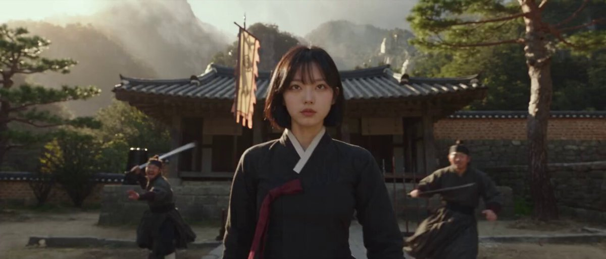

**프롬프트**

```text
번역 중
```

[↑ 카테고리로 돌아가기](#catalog)

---

<a name="prompt-2100458083831234699"></a>

### 번역 중

작성자：[@Diplomeme](https://x.com/Diplomeme) · [원본 게시물](https://x.com/Diplomeme/status/2100458083831234699)

시네마틱 / 영화 스틸컷 · 배포 완료

**요약:** 번역 중

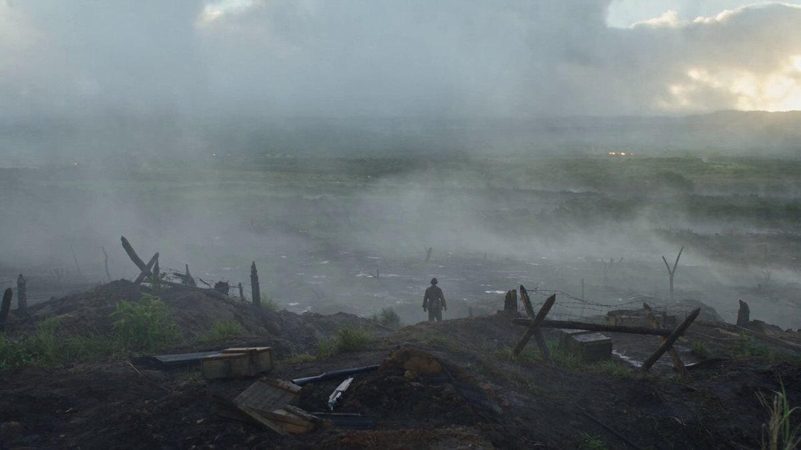

**프롬프트**

```text
번역 중
```

[↑ 카테고리로 돌아가기](#catalog)

---

<a name="prompt-2100462892864979292"></a>

### 번역 중

작성자：[@itsSaira\_1](https://x.com/itsSaira_1) · [원본 게시물](https://x.com/itsSaira_1/status/2100462892864979292)

만화 / 스토리보드 · 시네마틱 / 영화 스틸컷 · 사이버펑크 / SF · 도시 풍경 / 거리 · 배포 완료

**요약:** 번역 중

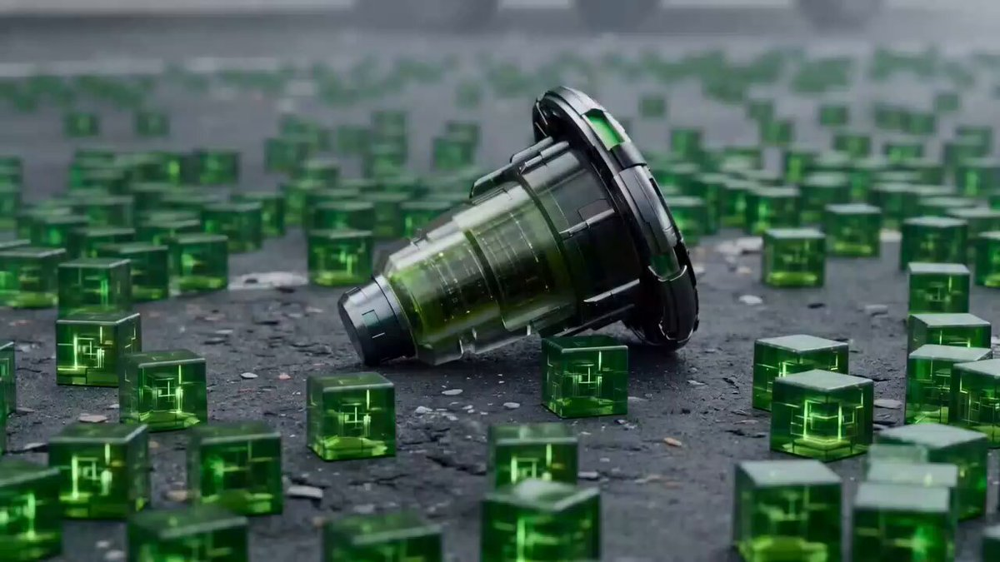

**프롬프트**

```text
번역 중
```

[↑ 카테고리로 돌아가기](#catalog)

---

<a name="prompt-2100456445900710158"></a>

### 번역 중

작성자：[@ayzalnooor24521](https://x.com/ayzalnooor24521) · [원본 게시물](https://x.com/ayzalnooor24521/status/2100456445900710158)

시네마틱 / 영화 스틸컷 · 캐릭터 · 패션 아이템 · 도시 풍경 / 거리 · 배포 완료

**요약:** 번역 중

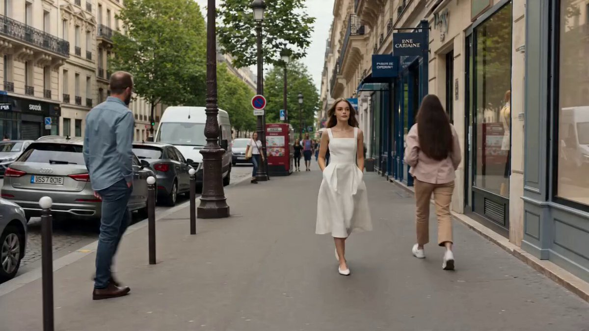

**프롬프트**

```text
번역 중
```

[↑ 카테고리로 돌아가기](#catalog)

---

<a name="prompt-2100446648107459068"></a>

### 번역 중

작성자：[@itxabdullaa](https://x.com/itxabdullaa) · [원본 게시물](https://x.com/itxabdullaa/status/2100446648107459068)

시네마틱 / 영화 스틸컷 · 패션 아이템 · 도시 풍경 / 거리 · 배포 완료

**요약:** 번역 중

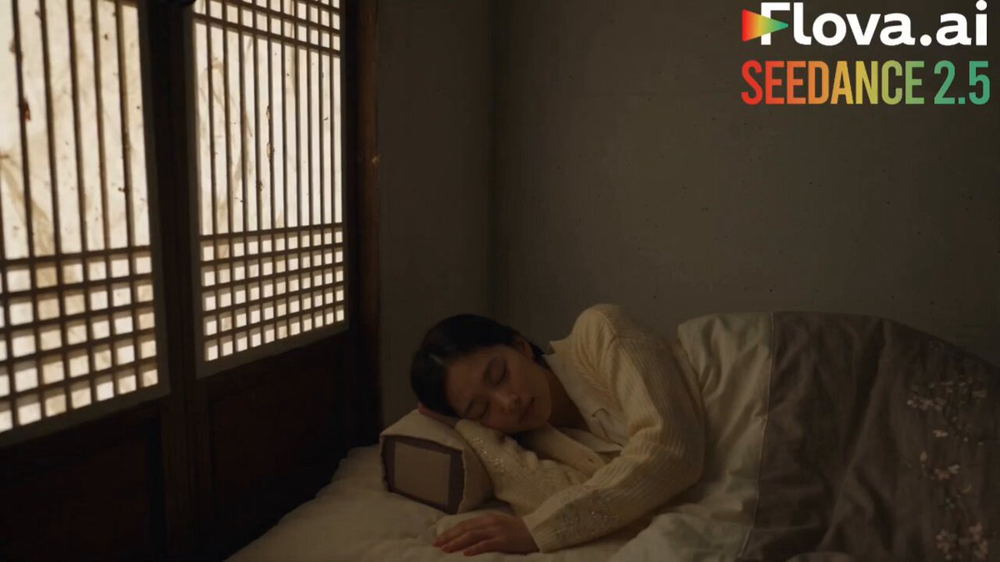

**프롬프트**

```text
번역 중
```

[↑ 카테고리로 돌아가기](#catalog)

---

<a name="prompt-2100462425308901480"></a>

### 번역 중

작성자：[@aiwithaly](https://x.com/aiwithaly) · [원본 게시물](https://x.com/aiwithaly/status/2100462425308901480)

사진술 · 시네마틱 / 영화 스틸컷 · 캐릭터 · 도시 풍경 / 거리 · 배포 완료

**요약:** 번역 중

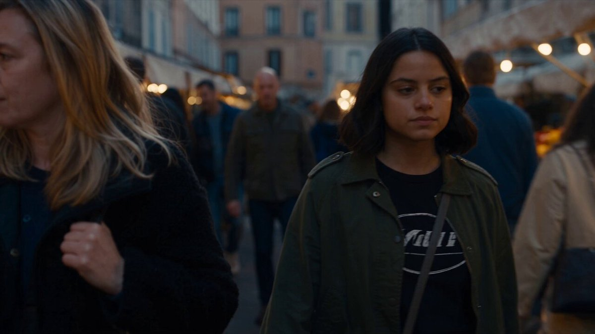

**프롬프트**

```text
번역 중
```

[↑ 카테고리로 돌아가기](#catalog)

---

<a name="prompt-2100417339716141116"></a>

### 폭풍 속에서 빛나는 미래형 전사와 불을 뿜는 검은 용의 15초 시네마틱 판타지 전투.

작성자：[@Aiwithmaha](https://x.com/Aiwithmaha) · [원본 게시물](https://x.com/Aiwithmaha/status/2100417339716141116)

시네마틱 / 영화 스틸컷 · 동물 / 생명체 · 배포 완료

**요약:** 폭풍 속에서 빛나는 미래형 전사와 불을 뿜는 검은 용의 15초 시네마틱 판타지 전투.

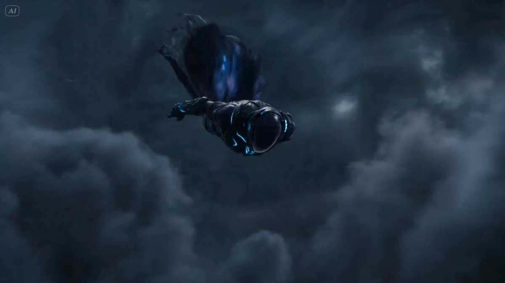

**프롬프트**

```text
레퍼런스와 일치하는 15초 분량의 시네마틱 판타지 전투 비디오 제작: 0~1초, 거대한 검은 용이 뒤에서 날아가는 동안 미래형 갑옷을 입은 전사가 어둡고 폭풍우 치는 하늘에 떠 있다; 1~2초, 카메라가 천천히 다가오면서 푸른빛으로 빛나는 에너지가 전사를 감싼다; 2~3초, 용이 구름을 뚫고 빠르게 접근하자 전사가 그것을 향해 돌아선다; 3~5초, 용이 입을 벌려 강력하고 밝은 오렌지빛 화염을 내뿜고, 전사는 폭풍을 뚫고 뒤로 날아간다; 5~7초, 전사를 쫓는 용의 얼굴과 빛나는 눈을 드라마틱한 클로즈업으로 보여준다; 7~9초, 등 뒤로 번개가 치고 갑옷에서 푸른 에너지가 빛나는 가운데 전사가 공중에서 용과 마주한다; 9~11초, 용이 거센 화염으로 다시 공격하고 전사는 구름 사이를 초고속으로 회피한다; 11~13초, 화염과 푸른 에너지가 폭풍을 밝히는 장대한 공중 대결에서 두 캐릭터가 서로를 향해 날아가는 모습을 보여준다; 13~15초, 용이 뒤쫓는 가운데 전사가 갑자기 구름 속으로 빠져나가며 어두운 하늘의 드라마틱한 와이드 샷으로 마무리된다. 사실적인 시네마틱 CGI, 디테일한 갑옷, 거대한 용의 날개, 볼류메트릭 구름, 역동적인 카메라 무빙, 드라마틱한 조명, 높은 디테일, 4K 화질.
```

[↑ 카테고리로 돌아가기](#catalog)

---

<a name="prompt-2100383734935740558"></a>

### 버려진 도시에 홀로 선 나무 문이 부유하는 산과 발광 식물이 있는 외계의 경이로운 세계로 이어지는 시퀀스.

작성자：[@RobotCleopatra](https://x.com/RobotCleopatra) · [원본 게시물](https://x.com/RobotCleopatra/status/2100383734935740558)

시네마틱 / 영화 스틸컷 · 사이버펑크 / SF · 배포 완료

**요약:** 버려진 도시에 홀로 선 나무 문이 부유하는 산과 발광 식물이 있는 외계의 경이로운 세계로 이어지는 시퀀스.

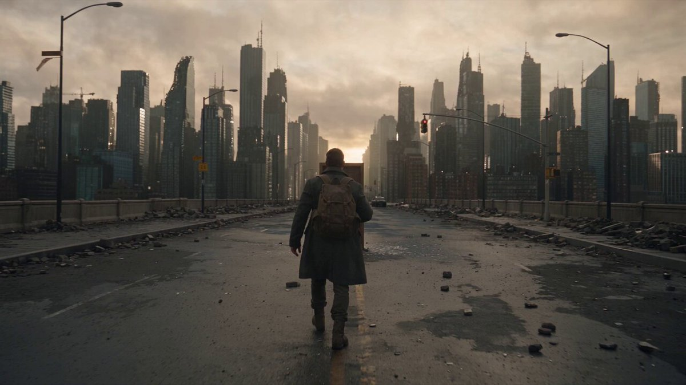

**프롬프트**

```text
초현실적인 환경, 사실적인 인물 애니메이션, 분위기 있는 조명, 정교한 카메라 움직임, 프리미엄 극장용 비주얼 퀄리티를 갖춘 15초 분량의 시네마틱 SF 판타지 3D CGI 시퀀스를 제작하세요. 제목: THE LAST DOOR ON EARTH. 배경: 새벽녘의 버려진 현대 도시. 텅 빈 거리, 침묵하는 초고층 빌딩, 고장 난 신호등, 흩날리는 먼지, 구름 사이로 스며드는 창백한 햇살. 주인공: 짙은 회색 코트, 등산화, 캔버스 백팩을 착용하고 손목에 작은 황동 열쇠를 묶은 고독한 탐험가. 액션: 0–4초: 완전히 버려진 도시를 걷던 그는 길 한가운데 홀로 서 있는 평범한 나무 문 하나를 발견합니다. 4–8초: 그는 다가가 천천히 문을 엽니다. 8–11초: 문 뒤에는 거대한 부유 산, 빛나는 숲, 보라색 하늘, 웅장한 폭포가 펼쳐진 숨 막히도록 아름다운 외계 세계가 드러납니다. 11–15초: 그는 문을 통과한 뒤 돌아섭니다. 갑자기 수천 개의 동일한 문들이 외계 풍경 전역에 나타나 동시에 열리며, 각각 완전히 다른 세계를 보여줍니다. 시네마틱하고 빠른 줌아웃 카메라 무빙. 스타일: 초현실적 SF 판타지, 영화적 리얼리즘, 장엄한 세계 공개, 대기적 깊이감, 대사 없음.
```

[↑ 카테고리로 돌아가기](#catalog)

---

<a name="prompt-2100432617912893711"></a>

### 카우보이 모자를 쓴 거대 뱀, 초록 도마뱀 총잡이, 드래곤이 황폐한 마을에서 대치하는 콘티와 대사가 포함된 30초 초사실적 판타지 웨스턴 영화 촬영 지침.

작성자：[@itxsarmadd](https://x.com/itxsarmadd) · [원본 게시물](https://x.com/itxsarmadd/status/2100432617912893711)

만화 / 스토리보드 · 사진술 · 시네마틱 / 영화 스틸컷 · 배포 완료

**요약:** 카우보이 모자를 쓴 거대 뱀, 초록 도마뱀 총잡이, 드래곤이 황폐한 마을에서 대치하는 콘티와 대사가 포함된 30초 초사실적 판타지 웨스턴 영화 촬영 지침.

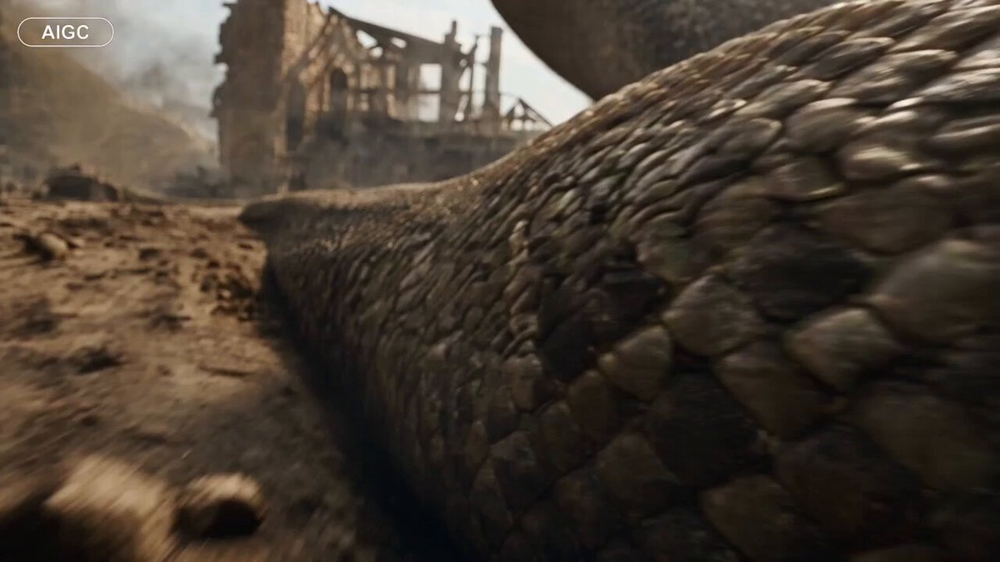

**프롬프트**

```text
파트 1 - 30초 분량의 극사실적인 시네마틱 실사 판타지-서부극 시퀀스를 생성하십시오.

업로드된 참조 비디오를 사용하지 마십시오.

==================================================
등장인물 — 전체에 걸쳐 동일하게 유지
==================================================

거대 뱀:
거대한 선사시대 뱀, 거대하고 근육질인 몸과 넓은 머리, 거친 갈색/황갈색/어두운 올리브색 비늘, 옅은 베이지색 얼굴, 세로 동공의 호박색 눈, 사실적인 이빨, 젖은 잇몸/침. 낡은 짙은 갈색/검은색 카우보이 모자 착용.

초록 파충류 총잡이:
작은 초록색 개구리/파충류 휴머노이드, 질감이 살아있는 초록색 피부, 크고 튀어나온 눈, 갈색 카우보이 모자, 거친 갈색 서부 의복, 어두운 금속 리볼버 소지.

드래곤 라이더:
거친 갈색/황갈색 의복 및 보호용 헤드기어.

드래곤:
어두운 비늘의 대형 드래곤, 뿔/가시, 근육질 몸체, 적갈색/주황색 가죽 날개. 추가 드래곤이 나타날 수 있음.

모든 캐릭터, 의상, 색상, 얼굴, 비율, 질감을 일관되게 유지하십시오.

==================================================
환경
==================================================

거친 서부/중세 판타지 마을: 풍화된 석재, 어두운 목재, 탑, 지붕, 먼지, 연기 및 잔해. 밝은 구름 낀 낮빛, 시네마틱한 햇빛, 볼류메트릭 연무, 사실적인 그림자와 피사계 심도.

==================================================
샷 시퀀스
==================================================

0–3초: 카메라 옆을 빠르게 스쳐 지나가는 거대 뱀 몸통의 로우 앵글 클로즈업.

3–6초: 뱀 등에 올라탄 초록 파충류 총잡이; 거대한 뱀 머리가 프레임 안으로 들어옴.

6–9초: 뱀이 캐릭터에게 다가감. 긴장감 넘치는 타이트한 구도.

9–12초: 뱀이 먼지와 파편을 밀어내며 마을을 똬리 틀듯 누빔.

12–15초: 어두운 목조/석조 실내를 통과해 움직이는 뱀.

15–18초: 오래된 건물과 흔들리는 유리 랜턴을 향해 카메라 틸트업.

18–22초: 강렬한 햇빛, 먼지, 연기가 있는 밝고 뿌연 야외.

22–26초: 카우보이 모자 아래 뱀의 익스트림 클로즈업; 호박색 눈과 살짝 벌어진 입이 보임.

26–28초: 카메라를 향해 돌진하는 뱀; 리볼버가 두드러지게 부각됨.

28–30초: 전경에 리볼버가 위치한 뱀 얼굴의 익스트림 클로즈업.

카메라에 밀착된 뱀의 얼굴과 리볼버가 보이는 상태로 종료. 페이드, 타이틀, 암전 화면 없음.

==================================================
카메라 / 오디오
==================================================

에너지 넘치는 영화적 호흡. 로우 앵글, 트래킹 샷, 클로즈업, 제어된 핸드헬드/짐벌 움직임, 사실적인 광학 효과, 피사계 심도 및 모션 블러.

영어 대사:
“What the hell is that?”
“Stay on him.”
“Keep moving!”
“Don’t let it see us.”
“Get ready.”

사실적인 뱀의 움직임 소리, 으르렁거림, 숨소리, 바람, 먼지, 나무 삐걱거림, 무기 효과음을 추가하십시오. 싱크가 맞는 영어 자막을 추가하십시오.

==================================================
품질
==================================================

최대 Seedance 2.5 품질. 극사실적 실사, 사실적인 질감, 조명 및 물리 효과.

만화, 애니메이션, 게임 그래픽, 플라스틱 같은 CGI, 모핑, 깜빡임, 캐릭터 변화, 의상/모자 변화, 눈 색상 변화, 스케일 변화, 중복 생성, 불필요한 사지, 왜곡된 얼굴 또는 부자연스러운 물리 효과 금지.
```

[↑ 카테고리로 돌아가기](#catalog)

---

<a name="prompt-2100435410338144486"></a>

### 밤의 네온 사이버펑크 도시를 가로지르는 POV 자유 낙하.

작성자：[@itsshara\_ai](https://x.com/itsshara_ai) · [원본 게시물](https://x.com/itsshara_ai/status/2100435410338144486)

시네마틱 / 영화 스틸컷 · 사이버펑크 / SF · 도시 풍경 / 거리 · 배포 완료

**요약:** 밤의 네온 사이버펑크 도시를 가로지르는 POV 자유 낙하.

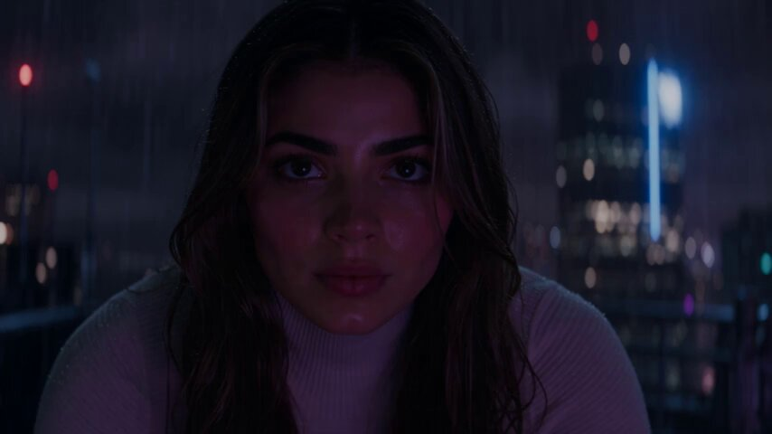

**프롬프트**

```text
어두운 형체가 고층 건물 난간에서 뛰어내려 네온 빛으로 물든 밤의 사이버펑크 도시를 가로지르며 자유 낙하한다. 카메라가 현기증을 유발하는 POV 다이빙으로 급강하함에 따라 거대한 홀로그램 광고판과 빛나는 보라색 및 분홍색 간판들이 쏜살같이 스쳐 지나간다. 빗물로 미끄러운 표면들이 아래에서 네온 빛을 반사한다. 초고속 자유 낙하, 사이버펑크 누아르 분위기, 아찔한 깊이감.
```

[↑ 카테고리로 돌아가기](#catalog)

---

<a name="prompt-2100414076170141937"></a>

### 인류 멸망 100년 후 나가노현 폐허 명소들을 다룬 포스트 아포칼립스 영화풍 다중 숏 프롬프트.

작성자：[@fps\_lusu](https://x.com/fps_lusu) · [원본 게시물](https://x.com/fps_lusu/status/2100414076170141937)

시네마틱 / 영화 스틸컷 · 배포 완료

**요약:** 인류 멸망 100년 후 나가노현 폐허 명소들을 다룬 포스트 아포칼립스 영화풍 다중 숏 프롬프트.

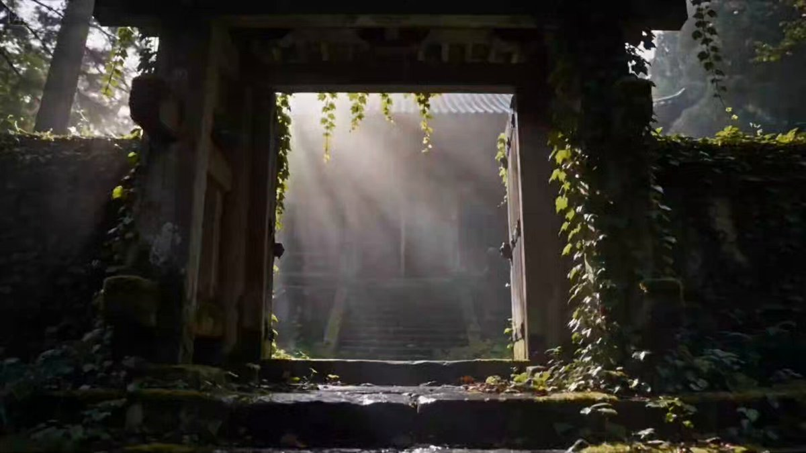

**프롬프트**

```text
기본 설정
길이: 30초 숏폼
화면비: 16:9 (와이드스크린 가로 포맷)
장르: 포스트 아포칼립스 할리우드 시네마틱 실사 다큐멘터리.
배경 설정: 인류가 사라진 지 100년 후, 완전히 버려진 채 자연에 의해 아름답게 되찾아진 일본 나가노현의 유명 관광 명소들.
스타일 및 비주얼
품질: 최고급 할리우드 영화 퀄리티. 숨이 멎을 듯한 실사 비주얼, 매끄럽게 어우러진 사실적인 환경 텍스처.
조명: 드라마틱하고 역동적임. 숲의 캐노피를 뚫고 들어오는 햇살, 짙고 신비로운 안개, 아름다운 대비를 만들어내는 부드러운 아침 햇살.
카메라 및 프레이밍: 매우 안정적이고 느리며 영화적인 짐벌 무빙 (슬로우 팬, 달리 푸시인, 시원한 풀백 샷).
질감: 아름다운 보케를 지닌 묵직한 광학 렌즈의 질감, 사실적인 필름 그레인, 공기 중에서 눈에 보이는 습기(안개/무애), 매우 정밀하게 표현된 젖은 이끼와 녹슨 금속.
오디오 및 ASMR
BGM: 고요하면서도 감성을 자극하는 할리우드 스타일의 앰비언트 스코어.
효과음: 자연스럽고 몰입감 넘치는 환경음. 부드러운 바람 소리, 고요하게 흐르는 물소리, 은은한 새소리. 사람 목소리 절대 없음.
타임라인 및 액션
0–5초: 젠코지 사원 입구. 이끼와 담쟁이덩굴로 뒤덮인 풍화된 목조 건축물. 짙은 아침 안개.
5–11초: 마츠모토성. 하이 앵글 슬로우 팬. 해자는 키 큰 갈대로 가득 차 있음. 잔잔한 수면에 감성적으로 반사되는 햇살.
11–17초: 시부 온천의 좁은 골목길. 울창한 덩굴로 뒤덮인 목조 여관들. 이끼 낀 구조물을 따라 조용히 흘러내리는 온천수. 안개와 섞이는 온천 수증기.
17–23초: 하쿠바의 버려진 스키 곤돌라. 휘감아 오르는 덩굴에 집어삼켜진 녹슨 금속 외관, 소용돌이치는 산안개에 둘러싸인 모습.
23–30초: 미와 댐. 웅장한 드론 풀백 샷. 썩어가는 콘크리트 위로 자연스럽게 흘러넘치는 맑고 투명한 물, 무성한 초목의 지배. 광대하고 고요한 풀 샷으로 페이드아웃.
네거티브 프롬프트 / 제약 조건
사람 없음, 캐릭터 없음.
애니메이션 스타일 없음, 3D 렌더링 느낌 없음, 카툰 스타일 없음.
빠른 카메라 움직임 없음, 카메라 흔들림 없음.
```

[↑ 카테고리로 돌아가기](#catalog)

---

<a name="prompt-2100311999838380522"></a>

### 닫힌 쇼지의 고정 프레임, 정적 속에서 한지를 통과하는 차가운 자연광만이 점차 밝아진다.

작성자：[@studiokagurajp](https://x.com/studiokagurajp) · [원본 게시물](https://x.com/studiokagurajp/status/2100311999838380522)

시네마틱 / 영화 스틸컷 · 배포 완료

**요약:** 닫힌 쇼지의 고정 프레임, 정적 속에서 한지를 통과하는 차가운 자연광만이 점차 밝아진다.


**프롬프트**

```text
장면: 닫힌 쇼지를 마주한 실내, 16:9. 고정 프레임. 종이 격자가 화면을 가득 채움. 손 없음. 사람의 실루엣 없음. 판독 가능한 글자 없음. 동작: 종이는 처음에 어둡다. 구름이 지나간 듯 패널을 가로질러 더 차가운 주광이 밝아진 뒤 그대로 유지된다. 나무 격자는 움직이지 않는다. 이것은 문이 열리는 것이 아니다. 와이프 효과가 아니다. 초점: 종이 섬유와 중앙의 쿠미코 접합부 하나에 극도로 선명한 초점. 가장자리는 프레임 안에 머문다. 물리: 빛이 변함. 나무와 종이는 그대로 유지됨. 왜곡 없음. 카메라 드리프트 없음. 조명: 종이를 통과한 확산 주광만 있음. 전등 색상 없음. 종이에 드리운 강한 태양 원반 없음. 스타일: 실사 영화풍, 시대극 일본, 마모된 목재와 와시 질감, 부드러운 입자감. 애니메이션 없음. 텍스트 없음. 워터마크 없음. 로고 없음.
```

[↑ 카테고리로 돌아가기](#catalog)

---

<a name="prompt-2100088243492385019"></a>

### 서스펜스와 몸싸움이 펼쳐지는 도시 거리의 폭우 속 영화 같은 밤 추격전.

작성자：[@Lianaalane](https://x.com/Lianaalane) · [원본 게시물](https://x.com/Lianaalane/status/2100088243492385019)

시네마틱 / 영화 스틸컷 · 도시 풍경 / 거리 · 배포 완료

**요약:** 서스펜스와 몸싸움이 펼쳐지는 도시 거리의 폭우 속 영화 같은 밤 추격전.


**프롬프트**

```text
비 내리는 밤의 도시 거리를 배경으로 한 30초 분량의 영화 같고 극도로 사실적인 실사 비디오를 제작하세요. 젖은 도로에는 가로등과 지나가는 차량의 전조등 불빛이 반사됩니다. 거센 비 속에서 숄더백을 메고 어두운 색 레인 재킷을 입은 한 사람이 인도 위를 홀로 걷고 있는 모습을 보여주세요. 무드 있는 시네마틱 조명, 사실적인 빗방울, 반사광, 안개, 자연스러운 밤의 그림자로 분위기를 담아냅니다. 점차 뒤에서 다른 사람이 다가오며 긴장감과 불안감을 조성합니다. 상점가 근처에서 주인공이 갑자기 반응하며 다가오는 인물과 몸싸움을 벌이는 장면을 보여줍니다. 카메라가 역동적인 핸드헬드 움직임으로 따라가는 가운데 두 인물이 비를 뚫고 주차된 차를 향해 달려가는 장면으로 이어집니다. 사실적인 인간의 움직임, 자연스러운 신체 물리 효과, 디테일한 젖은 옷, 생생한 도시 환경 분위기를 활용하세요. 헤드라이트가 장면을 비추는 가운데 주인공이 비 내리는 거리에 서 있는 모습으로 끝나며 극적인 시네마틱 엔딩을 남깁니다.
```

[↑ 카테고리로 돌아가기](#catalog)

---

<a name="prompt-2100088925603696879"></a>

### 거인의 재킷을 수선하는 작은 재단사에 관한 30초 시네마틱 3D 애니메이션 단편.

작성자：[@SyntheSarah](https://x.com/SyntheSarah) · [원본 게시물](https://x.com/SyntheSarah/status/2100088925603696879)

시네마틱 / 영화 스틸컷 · 3D 렌더링 · 배포 완료

**요약:** 거인의 재킷을 수선하는 작은 재단사에 관한 30초 시네마틱 3D 애니메이션 단편.


**프롬프트**

```text
《꼬마 재단사》(The Tiny Tailor)라는 제목의 30초 분량 프리미엄 시네마틱 3D 애니메이션 단편 영화를 제작하세요. 처음부터 끝까지 완벽한 시각적 연속성을 유지하여, 작은 재단사의 얼굴, 몸, 의복, 비율, 색상, 액세서리가 모든 샷에서 동일하게 유지되도록 하고, 재봉실, 탁자, 재킷, 바늘, 실의 크기, 형태, 위치, 외관도 일관성을 유지해야 합니다. 자연스럽고 인간다운 움직임, 물리적으로 신뢰할 수 있는 물체 상호작용, 올바른 해부학적 구조를 갖춘 하나의 연속적이고 논리적인 타임라인을 사용하며, 아티팩트, 왜곡, 모핑 또는 카메라 점프가 없어야 합니다. 시각적 스타일은 플라스틱처럼 보이는 캐릭터나 카툰식 물리학을 배제하고, 사실적인 재질, 디테일한 패브릭, 자연스러운 질감, 물리 기반 조명, 사실적인 그림자, 섬세한 피사계 심도 및 완성도 높은 장편 영화 퀄리티를 갖춘 최고급 시네마틱 3D 애니메이션이어야 합니다.
이야기는 우아한 양복점 작업실에서 시작되며, 몇 인치 크기의 작은 재단사가 줄자를 들고 거대한 나무 탁자를 가로질러 걸어가 커다란 짙은 파란색 재킷에 다가갑니다. 그는 찢어진 부분을 발견하고, 자기 키만 한 바늘에 금색 실을 꿰어 다양한 각도에서 사실적인 바느질 과정을 보여주며 꼼꼼하게 찢어진 곳을 수선합니다. 그가 뒤로 물러서서 자신의 작업을 만족스럽게 바라볼 때 거대한 사람의 손이 프레임 안으로 들어와 재킷을 집어 듭니다. 마지막 샷에서는 수선된 재킷을 입은 거인이 드러나고, 카메라가 줌아웃되며 작은 재단사가 바늘을 든 채 자랑스럽게 재킷 주머니 속에 앉아 있는 모습을 보여줍니다. 빠른 컷이나 불가능한 물리 현상 없이 부드러운 영화적 카메라 움직임, 안정적인 구도 및 일관된 원근법을 전체에 걸쳐 사용하세요. 길이 30초, 화면비 16:9, 디테일이 뛰어난 시네마틱 3D 애니메이션 출력.
```

[↑ 카테고리로 돌아가기](#catalog)

---

<a name="prompt-2100085430976930255"></a>

### 사막 폭풍 소용돌이 속에서 싸우는 은발 전사를 다룬 시네마틱 멀티샷 무협 액션 시퀀스 프롬프트.

작성자：[@Noor\_ul\_ain43](https://x.com/Noor_ul_ain43) · [원본 게시물](https://x.com/Noor_ul_ain43/status/2100085430976930255)

시네마틱 / 영화 스틸컷 · 배포 완료

**요약:** 사막 폭풍 소용돌이 속에서 싸우는 은발 전사를 다룬 시네마틱 멀티샷 무협 액션 시퀀스 프롬프트.


**프롬프트**

```text
극적인 폭풍우 치는 하늘 아래 광활하고 황량한 사막 풍경 속에서 펼쳐지는 17–18초 분량의 영화 같은 판타지 무협 액션 시퀀스를 제작하세요.

길게 휘날리는 은백색 머리를 지닌 강력한 젊은 전사가 겹겹이 흩날리는 옷감, 짙은 가죽 허리 장식, 절제된 금속 갑옷 요소가 더해진 우아하고 고풍스러운 동아시아풍의 흰색 무술 도포를 입고 있습니다. 그는 장검을 들고 초자연적인 속도와 정확성으로 움직입니다.

샷 1 — 0:00–0:02
익스트림 클로즈업 / 분위기 있는 오프닝. 화면은 소용돌이치는 베이지색 모래 먼지와 밝고 따스한 햇살로 거의 가득 찬 채 시작됩니다. 먼지 입자들이 카메라를 향해 빠르게 돌진하며 극적인 전환을 연출합니다. 강렬한 시네마틱 모션 블러, 입체적 광선(볼류메트릭 라이트), 얕은 심도.

샷 2 — 0:02–0:04
배경에 거대하고 어두운 암석 지형이 솟아 있는 광활하고 텅 빈 사막 평원이 드러납니다. 전사가 먼 곳에서 나타나 모래 위를 빠른 속도로 질주합니다. 그의 흰 도포와 긴 은발이 바람에 격렬하게 흩날립니다. 카메라는 낮은 시네마틱 앵글로 그의 움직임을 트래킹합니다.

샷 3 — 0:04–0:06
전사가 비범한 무술 동작을 펼치며 도약합니다. 그는 공중에서 회전하며 칼을 휘두릅니다. 검을 따라 눈부신 청백색 에너지 궤적이 이어지고, 따스한 주황빛 황금색 에너지 호가 그를 감싸며 휩쓸고 지나갑니다. 이 에너지는 실체감이 느껴지고 빛을 발하며 주변의 먼지를 밝혀야 합니다.

샷 4 — 0:06–0:09
역동적인 오버헤드/3사분면 카메라 앵글. 전사가 사막 표면을 빠르게 회전하며 가로지릅니다. 그의 도포는 거대하게 흐르는 원형의 형태를 그립니다. 그의 주위로 빛나는 주황색 에너지 고리가 형성되는 한편, 검에서는 청백색 에너지가 뿜어져 나옵니다. 발밑에서는 모래가 극적으로 솟구쳐 오르며 바깥쪽으로 나선형을 그리며 퍼져나갑니다.

샷 5 — 0:09–0:12
전사 주변으로 거대한 모래 먼지 소용돌이가 형성되기 시작하면서 카메라가 극적으로 뒤로 물러납니다. 수천 개의 입자와 흙덩어리가 공중에서 회전합니다. 휘몰아치는 청백색 및 황금색 에너지에 둘러싸인 중심에서 전사의 모습이 여전히 또렷하게 보입니다. 그 규모는 거대하고 초자연적인 느낌을 주어야 합니다.

샷 6 — 0:12–0:14
와이드 설정 샷(에스태블리싱 샷). 사막 바닥에서 솟아오른 거대한 토네이도 같은 모래 기둥이 상공의 짙은 구름까지 이어집니다. 소용돌이 속에서 전사의 모습이 부분적으로 드러납니다. 모래밭에는 여러 개의 원형 충격 흔적과 발자국/크레이터가 나타납니다. 어두운 폭풍 구름과 빛을 머금은 먼지 사이의 강한 대비가 돋보입니다.

샷 7 — 0:14–0:16
소용돌이치는 먼지를 뚫고 전사를 향해 빠르게 시네마틱하게 밀고 들어가는 줌인 샷. 그가 검을 바깥으로 뻗으며 소용돌이에서 모습을 드러냅니다. 칼날에서 빛나는 파도처럼 청백색 에너지가 뿜어져 나옵니다. 그의 긴 머리와 도포는 강풍에 자연스럽게 흩날립니다. 작은 파편들이 카메라 옆을 스쳐 지나갑니다.

샷 8 — 0:16–0:18
마지막 영웅적인 클로즈/미디엄 샷. 전사는 검을 비스듬히 바깥쪽으로 겨눈 채 차분하면서도 강렬한 표정으로 카메라를 응시합니다. 은백색 머리카락이 바람에 날리고 흰 도포가 극적으로 흩날립니다. 먼지와 햇살이 은은하게 빛나는 대기 배경을 만들어냅니다. 강렬하고 영화 같은 정지 프레임 구성으로 마무리됩니다.

비주얼 스타일:
에픽 고예산 판타지 영화, 무협에서 영감을 받은 초자연적 액션, 실사 수준의 캐릭터, 사실적인 의상 시뮬레이션, 사실적인 머리카락 물리 효과, 물리적으로 설득력 있는 먼지와 파편, 볼류메트릭 라이팅, 대기 원근법, 드라마틱한 폭풍 구름, 시네마틱한 심도, 아나모픽 렌즈 특성, 은은한 필름 그레인, 높은 다이내믹 레인지, 정교한 피부 및 직물 질감, 사실적인 환경 상호작용.

카메라:
빠르면서도 제어된 시네마틱 카메라 움직임, 로우 앵글 트래킹 샷, 오버헤드 회전, 빠른 푸시인, 광각 설정 샷, 역동적인 시점 변화, 초자연적 움직임 시의 적절한 모션 블러. 무작위적인 카메라 흔들림이 아닌 매끄럽고 전문적인 촬영 기법.
```

[↑ 카테고리로 돌아가기](#catalog)

---

<a name="prompt-2100072308350288351"></a>

### 번역 중

작성자：[@auqibhabib](https://x.com/auqibhabib) · [원본 게시물](https://x.com/auqibhabib/status/2100072308350288351)

시네마틱 / 영화 스틸컷 · 동물 / 생명체 · 풍경 / 자연 · 배포 완료

**요약:** 번역 중


**프롬프트**

```text
번역 중
```

[↑ 카테고리로 돌아가기](#catalog)

---

<a name="prompt-2100031321774903354"></a>

### 번역 중

작성자：[@juliaevee](https://x.com/juliaevee) · [원본 게시물](https://x.com/juliaevee/status/2100031321774903354)

시네마틱 / 영화 스틸컷 · 배포 완료

**요약:** 번역 중


**프롬프트**

```text
번역 중
```

[↑ 카테고리로 돌아가기](#catalog)

---

<a name="prompt-2100013701659283924"></a>

### 신카이 마코토 스타일의 30초 애니메이션 추격 단편 프롬프트, 캐릭터, 장면, 음향 및 타임라인별 스토리보드 포함.

작성자：[@fps\_lusu](https://x.com/fps_lusu) · [원본 게시물](https://x.com/fps_lusu/status/2100013701659283924)

만화 / 스토리보드 · 시네마틱 / 영화 스틸컷 · 애니메이션 / 만화 · 캐릭터 · 배포 완료

**요약:** 신카이 마코토 스타일의 30초 애니메이션 추격 단편 프롬프트, 캐릭터, 장면, 음향 및 타임라인별 스토리보드 포함.


**프롬프트**

```text
기본 설정
​길이: 30초 숏폼
​화면비: 16:9 (와이드스크린 가로 형식)
​장르: 신카이 마코토 스타일의 초현실적 시네마틱 애니메이션 추격 시퀀스.
​배경: 공포스럽고 극도로 디테일한 마법의 숲. 사실적인 젖은 진흙, 이끼, 오래된 거목들, 짙게 깔린 안개.
​스타일 및 비주얼
​품질: 최고 걸작 수준의 시네마틱 애니메이션, 실사 수준의 환경 텍스처와 최고급 애니메이션 셰이딩이 매끄럽게 결합됨.
​조명: 드라마틱한 대비. 독성을 띠며 박동하는 시안/보라색 발광 식물로 밝혀진 어두운 숲, 캐릭터를 살리는 날카로운 림 라이팅, 이후 눈부시게 따뜻한 햇빛으로의 전환.
​카메라 및 프레이밍: 광활한 수평 트래킹, 와이드 아나몰픽 구도, 갑작스러운 불릿 타임 매크로 클로즈업, 웅장한 파노라마 풀백.
​일관성: 전체에 걸쳐 나코(Nako)와 토토(Toto)의 시각적 일관성을 엄격히 유지.
​오디오 및 ASMR
​BGM: 빠른 템포의 오케스트라 추격 음악, 불릿 타임 중 급격히 느려지며, 22초에 평화로운 어쿠스틱 멜로디로 전환.
​SFX: 채찍 같은 파열음, 진흙 위를 달리는 소리, 슬로모션 속 날카로운 "shing" 소리, 부드러운 산들바람과 풀잎 바스락거리는 소리로 페이드아웃.
​ASMR: 나코와 토토의 생생하고 거친 헐떡임, 점차 안도의 한숨으로 부드러워짐. 음성 없음, 대사 없음.
​캐릭터 및 적
​캐릭터 1 (Nako): 짧은 갈색 머리, 초록색 탐험가 재킷, 반바지, 부츠, 백팩. 땀을 흘리며 필사적인 표정.
​캐릭터 2 (Toto): 푹신한 흰색과 황갈색 털의 시츄 견. 귀를 펄럭이며 거칠게 숨을 몰아쉬는 필사적인 질주.
​가시 덩굴 (적): 면도날처럼 날카롭고 빛나는 시안/보라색 가시를 지닌 지각 있는 거대한 짙은 녹색 덩굴, 채찍처럼 무서운 속도로 가격함.
​타임라인 및 액션
​0–10초 (와이드 고속 추격): 와이드 프레임 전반에 걸친 즉각적인 광란의 전력 질주. 나코와 토토가 극단적인 속도로 달림. 빛나는 덩굴이 그들의 발뒤꿈치 바로 뒤 땅을 격렬하게 내리치며, 진흙과 파편이 렌즈를 향해 튐.
​10–15초 (불릿 타임 아크로바틱 회피): 갑작스러운 극단적 슬로모션. 면도날처럼 날카로운 빛나는 가시 하나가 나코의 얼굴을 향해 돌진함. 나코는 와이드 프레임을 가로지르며 아크로바틱하게 미끄러지듯 백벤드(허리 젖히기)를 선보이고, 빛나는 가시 끝이 그녀의 눈 몇 밀리미터 위를 스치며 머리카락 한 가닥을 잘라냄. 토토는 그녀의 아래로 유려하게 미끄러져 통과함.
​15–22초 (돌파): 다시 고속으로 전환되며, 그들은 숲의 경계를 뚫고 밝은 하늘 아래 햇살이 내리쬐는 광활한 풀밭 빈터로 뛰어나옴. 덩굴은 즉시 그늘 속으로 물러남.
​22–30초 (안도와 파노라마 풀백): 나코는 풀밭에 대자로 드러누워 토토를 향해 따뜻하게 미소 지음. 토토는 그녀 곁에 앉아 꼬리를 흔들며 행복하게 헐떡임. 카메라는 햇살 가득한 초원과 멀리 보이는 숲의 가장자리를 담은 숨 막히게 고요하고 웅장한 파노라마 와이드 샷으로 매끄럽게 높이 빠져나감.
​네거티브 프롬프트 / 제약 조건
​텍스트 없음, 제목 없음, UI 없음, 로고 없음.
​캐릭터 외형 변형 없음, 의상 변경 없음, 견종 변경 없음.
​대화 없음, 사람 목소리 없음.
​느린 템포 없음 (10–15초 불릿 타임 제외), 카메라 흔들림 없음, 왜곡된 인체 해부학적 구조 없음.
```

[↑ 카테고리로 돌아가기](#catalog)

---

<a name="prompt-2100043484849926230"></a>

### 15초 분량의 빈티지 영화 같은 여행 브이로그, 레트로 카메라를 들고 도시, 카페, 노을 지는 공원을 거니는 젊은 아시아 여성.

작성자：[@Aiwithmaha](https://x.com/Aiwithmaha) · [원본 게시물](https://x.com/Aiwithmaha/status/2100043484849926230)

사진술 · 시네마틱 / 영화 스틸컷 · 레트로 / 빈티지 · 캐릭터 · 음식 / 음료 · 도시 풍경 / 거리 · 배포 완료

**요약:** 15초 분량의 빈티지 영화 같은 여행 브이로그, 레트로 카메라를 들고 도시, 카페, 노을 지는 공원을 거니는 젊은 아시아 여성.


**프롬프트**

```text
빈티지 디지털 카메라 감성을 담아 아름다운 도시와 평화로운 야외 명소를 탐험하는 젊은 아시아 여성을 주인공으로 한 15초 분량의 극사실적 시네마틱 여행 브이로그를 제작하세요. 그녀는 작은 레트로 카메라를 들고 걸어 다니며 꽃, 거리, 카페, 일상의 순간들을 자연스럽게 사진에 담습니다. 사실적인 버튼, 렌즈 디테일, 자연스러운 카메라 움직임을 포함하여 그녀가 손으로 카메라를 쥐고 사용하는 클로즈업 샷을 보여줍니다. 테이블에 앉아 시원한 음료를 즐기며 자연스럽고 편안하고 행복해 보이는 매력적인 카페 장면을 포함하세요. 그녀가 카메라를 들고 나무 사이를 걷는 따뜻한 골든 아워 공원 장면으로 전환되며, 햇빛이 아름다운 렌즈 플레어와 부드러운 역광을 만들어냅니다. 마지막에는 카메라를 손에 쥔 채 카메라를 향해 돌아서서 자연스럽게 미소 지으며, 진정성 있고 자연스러운 여행 추억의 느낌을 연출합니다. 핸드헬드 다큐멘터리 스타일의 촬영 기법, 미세한 자동 초점 헌팅, 자연스러운 노출 변화, 사실적인 피부 질감, 부드러운 심도, 은은한 필름 그레인, 따뜻한 색감, 불완전하고 사실적인 움직임을 활용하세요. 모든 샷에서 인물의 얼굴, 헤어스타일, 의상, 신체 비율, 카메라를 일관되게 유지하고, 인위적이거나 과도하게 다듬어진 AI 느낌 없이 매끄러운 시네마틱 전환을 유지하세요.
```

[↑ 카테고리로 돌아가기](#catalog)

---

<a name="prompt-2099404551199809774"></a>

### 귀여운 아기 곰이 시골 농장에서 빈티지 파란색 자동차를 탐색하고 운전하는 영화 같은 비디오.

작성자：[@Lianaalane](https://x.com/Lianaalane) · [원본 게시물](https://x.com/Lianaalane/status/2099404551199809774)

시네마틱 / 영화 스틸컷 · 레트로 / 빈티지 · 차량 · 배포 완료

**요약:** 귀여운 아기 곰이 시골 농장에서 빈티지 파란색 자동차를 탐색하고 운전하는 영화 같은 비디오.


**프롬프트**

```text
영화 같고 극도로 사실적인 스토리텔링 스타일로 비디오 제작: 귀여운 아기 불곰이 평화로운 시골 농장을 가로질러 소박한 나무 외양간 근처에 주차된 오래된 빈티지 파란색 자동차를 향해 걸어갑니다. 아기 곰은 호기심 어린 모습으로 차에 다가가 안으로 기어 올라가고, 스티어링 휠 위에 앞발을 올린 채 운전석에 자연스럽게 앉습니다. 카메라는 아기 곰의 사실적인 털, 표정 있는 눈, 작은 앞발, 그리고 클래식 자동차의 세월이 묻어나는 인테리어의 클로즈업 디테일을 포착합니다. 그런 다음 차가 젖은 시골길을 따라 천천히 움직이기 시작하며 은은한 반사와 자연스러운 움직임을 만들어냅니다. 넓은 시네마틱 샷은 배경으로 푸른 들판, 건초 더미, 작은 농가, 따뜻한 골든 아워의 햇살을 보여줍니다. 매끄러운 카메라 움직임, 사실적인 피사계 심도, 부드러운 렌즈 플레어, 자연스러운 그림자, 섬세한 질감 및 진정한 환경 조명을 사용하세요. 전반적인 분위기는 매력적이고 모험적이며 영화 같고 약간 장난스러워야 하며, 고예산 야생동물 영화처럼 촬영된 사실적인 동물 움직임과 차와의 그럴듯한 상호작용을 담아야 합니다.
```

[↑ 카테고리로 돌아가기](#catalog)

---

<a name="prompt-2099327265888993335"></a>

### 비둘기가 날아오르는 번화한 도시 대로에서 한 남자와 붉은 드레스를 입은 여성이 스쳐 지나가는 15초의 영화 같은 시퀀스.

작성자：[@Elvorya](https://x.com/Elvorya) · [원본 게시물](https://x.com/Elvorya/status/2099327265888993335)

시네마틱 / 영화 스틸컷 · 캐릭터 · 패션 아이템 · 배포 완료

**요약:** 비둘기가 날아오르는 번화한 도시 대로에서 한 남자와 붉은 드레스를 입은 여성이 스쳐 지나가는 15초의 영화 같은 시퀀스.


**프롬프트**

```text
밝은 늦은 오후, 번화한 맨해튼 스타일의 도시 교차로를 배경으로 한 15초 분량의 사실적이고 영화 같은 도시 시퀀스를 제작하세요. 높은 도시 건물, 극장 간판, 상점가, 차량 흐름, 가로등 기둥, 자연스럽게 오가는 수백 명의 보행자로 둘러싸인 붐비는 보행자 거리를 통과하는 매끄러운 로우 앵글 전진 트래킹 샷으로 시작합니다. 짙은 차콜 재킷과 어두운 셔츠를 입은 거친 인상의 턱수염을 기른 중년 남성이 진지하고 사색적인 표정을 지으며 군중을 뚫고 카메라를 향해 일정한 속도로 걸어옵니다. 그가 다가옴에 따라 카메라는 부드럽게 후진 트래킹을 하며, 보행자들이 전경과 배경을 자연스럽게 지나가는 동안 그를 선명하게 초점에 둡니다.

우아하게 펄럭이는 붉은 드레스를 입은 여성이 측면에서 갑자기 장면에 들어와 남성을 스쳐 지나가고, 두 사람은 잠시 서로를 알아채며 시선을 나눕니다. 그럴듯한 눈빛 교환과 자연스러운 인간의 움직임을 보여주는 영화 같은 미디엄 샷으로 이어집니다. 그들 주변에서 비둘기들이 갑자기 날아올라 역동적인 전경의 움직임과 미묘한 시각적 긴장감을 만들어냅니다. 남자의 얼굴, 군중 속을 지나가는 여성, 그리고 도시의 규모와 에너지를 보여주는 와이드한 환경 샷을 교차 편집합니다. 매끄럽고 안정적인 카메라 움직임에서 점차 미묘한 핸드헬드 느낌의 시네마틱한 질감으로 전환됩니다.

마지막 몇 초 동안 카메라는 서서히 뒤로 빠지며 약간 상승하여, 높은 빌딩들 사이로 길게 뻗은 붐비는 대로 전체를 드러내고, 남자는 움직이는 군중 속에서 점점 작아집니다. 따뜻하고 자연스러운 햇살, 사실적인 그림자, 대기 원근감, 섬세한 렌즈 플레어, 클로즈업 시의 얕은 심도, 자연스러운 피부 질감, 사실적인 머리카락과 옷의 움직임, 물리적으로 정확한 조명, 사실적인 보행자 행동, 실제 비둘기와 모션 블러, 시네마틱 컬러 그레이딩, 프리미엄 장편 영화 촬영 기법, 정교한 포토리얼리즘, 매우 디테일한 도시 환경.

애니메이션 없음, 카툰 느낌 없음, 과장된 CGI 없음, 왜곡된 얼굴 없음, 복제된 인물 없음, 부자연스러운 신체 움직임 없음, 떠다니는 물체 없음, 자막 없음, 로고 없음, 워터마크 없음. 전체 시퀀스 동안 일관된 캐릭터 외모, 의상, 환경 및 얼굴 특징을 유지할 것.

샷 타이밍

0–3초: 붐비는 도시 거리를 통과하는 와이드/로우 앵글 트래킹 샷.
3–6초: 턱수염을 기른 남자가 카메라에 다가오고, 카메라는 매끄럽게 후진 트래킹.
6–9초: 붉은 드레스를 입은 여성이 그의 앞을 가로지르며 짧은 눈빛 교환.
9–12초: 클로즈업/미디엄 샷 + 전경에서 갑자기 날아오르는 비둘기들.
12–15초: 카메라가 뒤로 물러서며 상승하여 거대하고 붐비는 도시 대로와 군중 속으로 사라지는 남자를 보여줌.
```

[↑ 카테고리로 돌아가기](#catalog)

---

<a name="prompt-2099332819768291755"></a>

### 번역 중

작성자：[@Just\_sharon7](https://x.com/Just_sharon7) · [원본 게시물](https://x.com/Just_sharon7/status/2099332819768291755)

시네마틱 / 영화 스틸컷 · 캐릭터 · 패션 아이템 · 차량 · 도시 풍경 / 거리 · 배포 완료

**요약:** 번역 중


**프롬프트**

```text
번역 중
```

[↑ 카테고리로 돌아가기](#catalog)

---

<a name="prompt-2099299015527690460"></a>

### 일본의 지방 도시를 무대로, 자전거를 타고 라이브 공연장으로 가 친구의 통기타 탄식을 지켜보는 일상적인 인간관계를 담아낸 리얼 지향 비디오 생성 프롬프트.

작성자：[@akiyoshisan](https://x.com/akiyoshisan) · [원본 게시물](https://x.com/akiyoshisan/status/2099299015527690460)

시네마틱 / 영화 스틸컷 · 캐릭터 · 배포 완료

원본 게시물：[@akiyoshisan](https://x.com/akiyoshisan) · [원본 게시물](https://x.com/akiyoshisan/status/2098940614666756371)

**요약:** 일본의 지방 도시를 무대로, 자전거를 타고 라이브 공연장으로 가 친구의 통기타 탄식을 지켜보는 일상적인 인간관계를 담아낸 리얼 지향 비디오 생성 프롬프트.


**프롬프트**

```text
일본의 지방 도시. 저녁~밤.
사쿠라가 자전거를 타고 거리를 달린다 → 작은 라이브 공연장 옆 자전거 주차 구역에 세운다 → 공연장 안으로 들어간다 → 관객석 뒤편에서 친구의 어쿠스틱 라이브(통기타 탄식)를 지켜본다.

후반: 친구는 통기타를 치며 노래한다. 연주 도중, 객석의 사쿠라와 찰나의 순간 눈이 마주친다. 손을 흔들지 않는다. 과장되게 웃지 않는다. 연주는 멈추지 않는다. 시선과 미세한 표정 변화만으로 관계성을 보여준다.

공연 종료 후, 같은 공연장 옆에서 합류.
사쿠라는 전반부와 같은 자전거를 끌고, 친구와 나란히 서서 밤길을 걷는다.

대사는 극도로 배제.
라이브 중에만 들리는 짧은 노랫소리.
손떨림, AF 흔들림, 노출 변화를 자연스럽게 허용.
과장된 연기, 모델 같은 동작, 자막, 내레이션, 설명적 감정 표현, 로고 및 고유명사 없음.
```

[↑ 카테고리로 돌아가기](#catalog)

---

<a name="prompt-2099284949496906161"></a>

### 북극을 배경으로 펼쳐지는 가슴 뛰는 15초 분량의 영화 같은 생존 스토리. 얼어붙은 바다 위로 격렬한 눈보라가 몰아치는 가운데, 정예 수색구조 헬리콥터가 산산이 부서지는 유빙에서 고립된 탐험가를 구출하기 위해 조난 신호기를 향해 질주한다.

작성자：[@DeCat2025](https://x.com/DeCat2025) · [원본 게시물](https://x.com/DeCat2025/status/2099284949496906161)

시네마틱 / 영화 스틸컷 · 풍경 / 자연 · 배포 완료

원본 게시물：[@DeCat2025](https://x.com/DeCat2025) · [원본 게시물](https://x.com/DeCat2025/status/2098478244496343184)

**요약:** 북극을 배경으로 펼쳐지는 가슴 뛰는 15초 분량의 영화 같은 생존 스토리. 얼어붙은 바다 위로 격렬한 눈보라가 몰아치는 가운데, 정예 수색구조 헬리콥터가 산산이 부서지는 유빙에서 고립된 탐험가를 구출하기 위해 조난 신호기를 향해 질주한다.


**프롬프트**

```text
북극을 배경으로 펼쳐지는 가슴 뛰는 15초 분량의 영화 같은 생존 스토리. 얼어붙은 바다 위로 격렬한 눈보라가 휘몰아치는 가운데, 정예 수색구조 헬리콥터가 조난 신호기를 향해 전속력으로 날아간다. 아래에서는 발밑으로 거대한 균열이 번져가는 빠르게 표류하는 유빙 위에 홀로 남겨진 탐험가가 고립되어 있다. 헬리콥터가 거센 바람 속에서 호버링하는 동안 구조 대원이 케이블을 타고 화이트아웃 속으로 강하한다. 구조 대원이 탐험가에게 손을 뻗는 바로 그 순간, 빙붕이 산산이 부서지며 거대한 얼음 덩어리들이 차가운 바다로 무너져 내린다.

구조 대원은 마지막 순간에 탐험가를 붙잡고, 두 사람이 하늘로 들어 올려지는 순간 뒤쪽에서 거대한 빙산이 붕괴하며 부서진 얼음 위로 거대한 파도가 덮친다. 카메라는 끝없이 펼쳐진 빙하 위를 유영하는 항공 샷으로 시작하여 눈보라를 뚫고 나아가는 긴박한 저고도 추적으로 급강하하고, 구조 순간의 극적인 클로즈업으로 전환된 후, 얼어붙은 풍경이 발아래에서 갈라지는 가운데 탈출하는 헬리콥터의 웅장한 와이드 샷으로 물러선다.

극사실주의, 사실적인 북극 환경, 사실적인 눈 물리 효과, 휘몰아치는 눈보라, 역동적인 로터 하강풍, 시네마틱 볼류메트릭 조명, 짙은 대기 안개, 얼음 결정, 디테일한 구조 장비, IMAX 스케일, 언리얼 엔진 5 퀄리티, 극적인 카메라 움직임, 극사실적인 물과 얼음 시뮬레이션, 8K 사실감, 걸작, 텍스트 없음, 워터마크 없음, 16:9.
```

[↑ 카테고리로 돌아가기](#catalog)

---

<a name="prompt-2099289940701946340"></a>

### 담배를 피우며 거리를 응시하는 잭의 샷 액션 프롬프트.

작성자：[@XStrangeHistory](https://x.com/XStrangeHistory) · [원본 게시물](https://x.com/XStrangeHistory/status/2099289940701946340)

시네마틱 / 영화 스틸컷 · 캐릭터 · 도시 풍경 / 거리 · 배포 완료

**요약:** 담배를 피우며 거리를 응시하는 잭의 샷 액션 프롬프트.


**프롬프트**

```text
잭은 담배를 한 모금 빨아들이고, 그 순간 담뱃불이 더 밝게 타오르며, 이어서 천천히 숨을 내쉬자 연기가 흩어지며 사라진다. 그의 두 눈은 저 너머 거리에 고정되어 있으며 그 외에는 미동도 없다. 고정 카메라; 그 너머의 거리는 얕은 심도의 흐릿함 속으로 부드럽게 풀려나간다.
```

[↑ 카테고리로 돌아가기](#catalog)

---

<a name="prompt-2098777905010778507"></a>

### 폭우와 네온 불빛 속에서 러너와 중무장 집행자가 펼치는 사이버펑크 옥상 멀티샷 추격전.

작성자：[@bmx\_ai13](https://x.com/bmx_ai13) · [원본 게시물](https://x.com/bmx_ai13/status/2098777905010778507)

시네마틱 / 영화 스틸컷 · 사이버펑크 / SF · 배포 완료

**요약:** 폭우와 네온 불빛 속에서 러너와 중무장 집행자가 펼치는 사이버펑크 옥상 멀티샷 추격전.


**프롬프트**

```text
6개 샷, 총 30초 — 0.0-5.0초, 5.0-10.0초, 10.0-15.0초, 15.0-20.0초, 20.0-25.0초, 25.0-30.0초. 하드 컷, 디졸브 없음. 전 구간 정상 속도, 슬로우 모션 없음, 램핑 없음.

촬영 케이던스 — 중요: 네이티브 24fps, 실제 180도 셔터, 모든 프레임에서 실제 1/48초 노출. 유려하고 연속적인 모션 블러. 끊김이나 저더 현상 절대 없음. 프레임 보간 없음, 고스팅 없음, 비디오 룩 배제.

화면 텍스트 없음 — 중요: 화면 내 어느 곳에도 어떤 종류의 텍스트도 없음. 캡션, 자막, 타이틀, 크레딧, 워터마크, 로고, 타임코드, UI 오버레이 없음.

화면 내 다른 인물 없음 — 중요: 보행자 없음, 다른 옥상 인물 없음, 엑스트라 없음. 오직 러너, 집행자, 그리고 드론 한 대만 등장.

네온 플레어 — 중요: 아래쪽의 네온 간판이 옥상을 강렬한 마젠타와 시안 플래시로 내내 스트로브 비춤. 조명이 비치는 순간의 단계적 질감은 오로지 이 간판의 깜빡임에서 비롯되며 깨진 영상 소스로 인한 것이 아님 — 카메라 움직임은 전 구간 부드럽게 유지됨. 빗줄기는 화면 우측에서 좌측으로 대각선 방향으로 내림.

피사체 고정 — 러너: 마르고 다부진 체격, 삭발한 머리, 날카로운 광대뼈, 빗물로 젖어 번쩍이는 짙은 피부, 깨끗한 얼굴, 보이는 타투 없음. 컴프레션 베이스 레이어 위에 무광 블랙 택티컬 재킷, 손가락 없는 장갑, 닳은 파쿠르 슈즈 착용. 맨손 외에는 아무것도 소지하지 않음. 도약 중에도 발걸음을 멈추지 않고 도시의 가장자리를 향해 옥상과 옥상 사이를 질주함.

피사체 고정 — 집행자: 육중한 장갑 체구, 단 하나의 붉은색 바이저 슬릿이 있는 무특징의 무광 그레이 풀페이스 헬멧, 강화 어깨 장갑, 묵직한 부츠. 푸른 아크를 파지직거리며 뿜어내는 스턴 바톤 소지. 전력 질주하지 않고 기계적인 일정한 걸음걸이로 추격하며 항상 거리를 좁혀옴.

월드 플레이트: 빗속 밤의 밀집된 사이버펑크 옥상 스카이라인 — 판금 물탱크, 엉킨 케이블 라인, 녹슨 정비용 다리로 연결된 타워 사이의 틈새, 안개 너머 아득히 아래에서 빛나는 네온 간판. 다른 구조물은 존재하지 않음.

분위기 — 중요, 심도만 해당: 고밀도의 짙은 비안개 — 가까운 러너는 선명하고, 중간 거리의 집행자는 부드럽게 흐려지며, 먼 타워는 거의 지워지듯 흐릿함. 짙어진 습한 공기로만 느껴지며, 결코 연무기(포그 머신) 같은 느낌이 아님.

샷 1 — 0.0-5.0초. 질주(THE SPRINT). 옥상 높이의 로우 앵글 카메라, 15° 기울임(캔트), 러너를 전방으로 트래킹. 자갈 옥상을 가로질러 러너가 질주하고, 뒤에서 집행자의 바톤 불빛이 다가옴. 화면 좌측에서 질주하는 러너, 화면 우측에서 추격하는 집행자. 동시녹음 사운드(Diegetic sound).

샷 2 — 5.0-10.0초. 타격(THE STRIKE). 카메라가 가슴 높이에서 타이트하게 회전하며 15~35° 각도로 기울어지며 절대 수평을 이루지 않음. 바톤의 전류가 러너의 어깨 스치듯 튀고, 러너는 몸을 숙여 집행자의 장갑을 어깨로 들이받음. 둘 다 중앙에 위치, 빗방울이 사방으로 튐. 동시녹음 사운드.

샷 3 — 10.0-15.0초. 감시자(THE WATCHER). 타워 사이를 호버링하는 소형 감시 드론으로 컷 전환, 돌풍에 좌우로 흔들리며 붉은색 스캔 라이트가 주변을 훑음. 자세를 바로잡고 위치를 유지함. 네온 불빛이 비치는 안개를 배경으로 드론이 중앙에 위치. 동시녹음 사운드.

샷 4 — 15.0-20.0초. 붕괴(THE COLLAPSE). 정비 다리를 향한 로우 앵글의 고정 카메라, 녹슨 지지대가 부러지면서 위쪽으로 윕 팬(whip-pan). 다리 구간이 휘어지며 무너져 내리고, 러너는 넓어지는 틈새를 뛰어넘어 안전하게 착지함. 다리가 프레임을 대각선으로 가로지르고 러너가 화면 중앙 하단에서 나타남. 동시녹음 사운드.

샷 5 — 20.0-25.0초. 돌진(THE SURGE). 카메라가 옥상 높이로 내려가 새로운 네온 플레어가 비추는 빗물 통로를 뚫고 앞으로 급가속함. 러너는 재킷이 흠뻑 젖은 채 온 힘을 다해 질주하며 도시의 가장자리를 향한 마지막 구간을 좁힘. 러너는 화면 좌측에서 우측으로 강하게 돌진. 동시녹음 사운드.

샷 6 — 25.0-30.0초. 여파(THE AFTERMATH). 카메라는 뒤로 빠져 정적인 옥상 와이드 샷을 잡음. 비는 이제 수직으로 내리고 바람은 잦아듦. 러너는 거칠게 숨을 몰아쉬며 홀로 타워 가장자리에 서 있고, 턱 아래로 집행자의 붉은 바이저 불빛이 어두워지며 전진을 멈춤. 중앙에 작게 자리한 러너, 그 뒤 어둠 속에 자리한 무너진 다리. 동시녹음 사운드.

교차 프레임 규칙: 러너의 재킷과 장갑은 절대 바뀌지 않음. 집행자의 바이저 불빛은 샷 6 이전까지 완전히 꺼지지 않음. 오직 러너, 집행자, 드론만 항상 보임. 비의 방향은 일정하게 유지됨. 다리는 어디에 등장하든 동일하게 붕괴된 형태를 유지함. 네온 플레어는 샷 1, 2, 5 내부에서만 적용됨. 어떤 시점에도 배경음악이 들어가지 않음.

마지막 프레임: 러너가 옥상 가장자리에 홀로 서 있고, 비는 곧게 내리며, 프레임 하단 가장자리 아래로 집행자의 희미해진 붉은 바이저가 보이고, 네온 안개 속 뒤편으로 무너진 다리가 어렴풋이 보임. 화면 텍스트 없음, 로고 없음, 워터마크 없음.

사운드 베드: 현장음(Diegetic) 전용 — 거센 빗소리, 바톤의 전기 스파크 소리, 자갈을 밟는 부츠 소리, 금속이 삐걱거리며 부러지는 소리, 드론의 희미한 로터 회전음. 배경음악 없음, 자막 없음.

카메라 및 캡처 사실감: ~32mm/68° FOV, 네온 불빛에서 타원형 보케와 스트릭 플레어를 생성하는 빈티지 2배 아나모픽, 얕은 심도, 컬러 네거티브 톤, 고운 입자감. 격렬한 핸드헬드 — 15~45°로 요동치는 캔트, 급격한 펀치 인과 립 백, 모든 프레임이 움직임 속에 있으나 궤적 자체는 매끄러움, 고정되거나 짐벌로 미끄러지는 느낌 절대 없음. CGI 룩 없음, AI 특유의 인위적 부드러움 없음, 비디오 게임 HUD 없음, 모션 스무딩 없음.
```

[↑ 카테고리로 돌아가기](#catalog)

---

<a name="prompt-2098590274410950732"></a>

### 진홍빛 도포를 입은 검술 고수와 삿갓을 쓴 세 명의 자객 사이에서 펼쳐지는 시네마틱한 동양 무술 대나무 숲 결투.

작성자：[@rachses2](https://x.com/rachses2) · [원본 게시물](https://x.com/rachses2/status/2098590274410950732)

시네마틱 / 영화 스틸컷 · 풍경 / 자연 · 배포 완료

**요약:** 진홍빛 도포를 입은 검술 고수와 삿갓을 쓴 세 명의 자객 사이에서 펼쳐지는 시네마틱한 동양 무술 대나무 숲 결투.


**프롬프트**

```text
초고속 전통 동양 무술 액션 합에 특화된 30초, 16:9, 24fps 단편 영화를 제작하세요. 고예산 극장용 극사실주의 실사 + AAA급 시네마틱 퀄리티. 자막 없음, UI 없음, 로고 없음, 내레이션 없음, 배경음악 없음—대나무 줄기가 부러지는 소리, 바스락거리는 나뭇잎 소리, 비단옷이 바람을 가르는 소리, 칼바람 소리, 가느다란 나뭇가지를 가볍게 차고 나가는 날카로운 발소리, 금속 파편이 튕겨 나가는 소리, 묵직한 몸통 타격음, 휩팬(whip pan) 사운드, 날카로운 숨소리만 유지할 것.

등장인물

주인공: 진홍빛 도포를 입은 고독한 자객, 한 자루의 양날 직검(검), 유연한 비단 허리띠, 침착하면서도 치명적인 자세.

자객들 (삿갓을 쓴 3인의 자객): 동일한 짙은 회색 도포, 눈을 가리는 삿갓. 각기 다른 무기 보유: 자객 A(사슬낫/쿠사리가마), 자객 B(쌍호구검/후크 소드), 자객 C(묵직한 쇠곤봉).

핵심 및 액션
극대화된 민첩성, 중력을 거스르는 울창한 숲속 움직임, 쉴 새 없이 몰아치는 다방향 공격. 첫 프레임은 높은 대나무 숲 꼭대기에서 세 명의 자객이 동시에 급강하하며 시작. 경공술을 활용한 나무 타기, 휘어지는 대나무 줄기를 타고 미끄러져 내려오기, 공중에서의 무기 궤적 전환, 회전하는 비단 허리띠로 옭아매기, 흔들리는 나뭇가지 위에 서서 펼치는 신속한 초근접 패링 공방을 포함.

단 한 번의 스피드 램프(Speed Ramp)
4초 지점에서 단 한 번 등장하는 0.12초간의 마이크로 슬로우 모션: 자객 A의 사슬낫이 주인공의 목에서 불과 몇 인치 떨어진 대나무 줄기를 감싸고, 튀는 나무껍질 파편, 사슬의 팽팽한 장력, 칼날의 궤적을 쫓는 주인공의 서늘한 눈빛을 보여준 뒤 공중에서 사슬을 단칼에 베어버림.

카메라 및 환경
어지러울 정도의 수직 카메라 틸트, 빽빽한 대나무 숲 사이를 통과하는 빠른 트래킹 샷, 하향 낙하를 추적하는 광각 렌즈, 무거운 곤봉 타격 시 발생하는 카메라 흔들림. 환경의 격렬한 반응: 돌풍에 폭발하듯 흩날리는 수백 장의 푸른 나뭇잎, 발길질의 압력에 꺾여 부러지는 대나무 줄기, 급격한 방향 전환 주변으로 소용돌이치는 짙은 안개.

엔딩 시퀀스
주인공이 자객 C의 찌르는 쇠곤봉을 발판 삼아 높이 도약한 뒤, 하향 역회전 720도 회전 베기로 자객 B의 쌍구검을 절단하고 자객 A를 무장 해제시킨 후, 곧바로 자객 C의 등 뒤로 낙하하여 목을 노린 날렵한 역수 찌르기를 날림. 마지막 프레임은 부러진 대나무 줄기들이 홀로 남은 승자 주위로 요란하게 무너져 내리는 가운데 진홍빛 도포자락이 천천히 가라앉는 모습을 포착.
```

[↑ 카테고리로 돌아가기](#catalog)

---

<a name="prompt-2098622086608773436"></a>

### 23초 분량의 멀티샷 에픽 다크 판타지 전투 시퀀스, 백발의 여성 전사가 홀로 적군 및 거대한 중갑병에 맞서는 영화 같은 전투 과정을 묘사.

작성자：[@Noor\_ul\_ain43](https://x.com/Noor_ul_ain43) · [원본 게시물](https://x.com/Noor_ul_ain43/status/2098622086608773436)

시네마틱 / 영화 스틸컷 · 배포 완료

**요약:** 23초 분량의 멀티샷 에픽 다크 판타지 전투 시퀀스, 백발의 여성 전사가 홀로 적군 및 거대한 중갑병에 맞서는 영화 같은 전투 과정을 묘사.


**프롬프트**

```text
23초 분량의 극도로 영화 같은 다크 판타지 전투 시퀀스를 제작하세요. 포토리얼리스틱, 고예산 판타지 영화 미학, 16:9 와이드스크린.

장면 1 — 0–3초
거대한 전장 앞에 홀로 서 있는 신비로운 백발의 여성 전사의 뒷모습에서 시작. 바람에 자연스럽게 흩날리는 긴 은백색 머리카락, 어두운 중세풍 가죽 및 금속 갑옷, 등에 멘 장검. 그녀 앞에는 전장을 뒤덮은 거대한 군대가 펼쳐져 있다. 저 멀리 폐허가 된 중세 탑과 대성당 같은 건축물들이 희미하게 보인다. 지평선 낮게 걸린 태양이 자욱한 연기와 먼지를 뚫고 강력한 황금빛 역광을 만들어낸다. 그녀의 등 뒤에서 천천히 다가가는 시네마틱 카메라 푸시인, 은은한 대기 안개, 사실적인 바람의 움직임, 압도적인 스케일감.

장면 2 — 3–6초
갑작스럽게 격렬한 액션으로 전환. 전사가 폭발적인 기세로 앞으로 돌진하며 전투에 돌입한다. 튀는 불꽃과 연기, 파편 사이를 질주하는 그녀를 따라가는 다이내믹한 로우 앵글 트래킹 샷. 엄청난 속도로 휘두르는 칼날이 따스한 햇빛을 받아 반짝인다. 사실적인 모션 블러, 흩날리는 불씨, 먼지 입자, 정교한 금속 반사를 활용. 시네마틱한 구도를 유지하면서 카메라는 그녀의 움직임을 공격적으로 추적한다.

장면 3 — 6–9초
전장에서 거대한 중갑을 두른 적과 맞서 싸우는 전사의 모습. 그녀가 강력한 검격을 날리고, 적은 묵직한 힘으로 반격해온다. 무기가 격돌하는 순간 불꽃이 폭발하듯 튄다. 진흙투성이에 파괴되고 잔해로 뒤덮인 바닥. 불타는 물체들과 작은 불길이 이들을 둘러싸고 있다. 타격 순간에는 핸드헬드 스타일의 시네마틱 카메라 흔들림을 적용하고, 드라마틱한 강조를 위해 동작을 잠시 슬로 모션으로 연출한다.

장면 4 — 9–12초
공격 후 전사가 전장 바닥에 묵직하게 착지한다. 그녀 주위로 먼지와 연기가 소용돌이치는 가운데 갑옷을 입은 그녀의 상체를 카메라에 가깝게 담아낸다. 은빛 머리카락이 바람에 흩날린다. 그녀는 검을 쥔 채 천천히 일어선다. 그녀 뒤로 거대한 황금빛 일몰을 배경으로 폐허가 된 중세 도시의 실루엣이 드러난다. 강렬한 볼류메트릭 라이팅, 공기원근법, 사실적인 환경 디테일.

장면 5 — 12–15초
전사의 얼굴로 강렬한 클로즈업 전환. 그녀의 표정은 매섭고 집중되어 있으며 단호하다. 은백색 머리칼이 얼굴 일부를 드리운다. 그녀의 두 눈은 다가오는 적에게 고정되어 있다. 따스한 석양빛이 얼굴 한쪽을 비추고 다른 쪽은 드라마틱한 어둠에 잠긴다. 극도로 세밀한 피부 질감, 사실적인 눈빛, 미세한 호흡과 자연스러운 표정 변화. 시네마틱한 피사계 심도.

장면 6 — 15–18초
그녀를 향해 진격하는 거대한 적군의 모습을 공개. 전투로 단련된 수백, 수천의 어두운 휴머노이드 형체들이 폐허가 된 전장을 가로질러 움직인다. 연기와 먼지, 불씨가 공기를 가득 채운다. 카메라는 천천히 뒤로, 위로 빠지며 군대의 거대한 규모와 그들 앞에 홀로 선 작고 강인한 전사의 대비를 드러낸다. 거대한 폐허 탑들이 배경에 우뚝 솟아 있다.

장면 7 — 18–21초
주변 전장이 점점 더 혼란스러워지는 가운데 전사는 미동도 없이 서 있다. 갈라진 바닥 틈새로 붉은 빛과 타오르는 불씨가 드러난다. 연기가 카메라 앞을 스쳐 지나간다. 폐허가 된 도시 뒤로 석양이 붉게 타오른다. 전사를 중심으로 천천히 360도 회전하는 시네마틱 카메라 워크를 사용하여 그녀의 고립감과 강인함을 강조한다. 바람이 망토와 머리카락, 옷자락을 자연스럽게 흩날린다.

장면 8 — 21–23초
극도의 익스트림 와이드 설정 샷으로 마무리. 황폐해진 전장 한가운데 전사가 홀로 서 있고, 그 뒤로 거대한 폐허 도시와 불타는 지평선이 끝없이 펼쳐진다. 먼지와 연기가 황금빛 광채 속을 천천히 유영한다. 거대한 환경 속에서 캐릭터가 작게 보일 때까지 카메라는 서서히 멀어진다. 압도적인 시네마틱 스틸 프레임으로 멈춘 뒤 부드럽게 암전(페이드 투 블랙)된다.
```

[↑ 카테고리로 돌아가기](#catalog)

---

<a name="prompt-2098625650852815257"></a>

### 불타는 사원 안뜰에서 펼쳐지는 검객과 오니의 30초 전투를 다룬 상세한 6개 샷의 시네마틱 프롬프트.

작성자：[@bmx\_ai13](https://x.com/bmx_ai13) · [원본 게시물](https://x.com/bmx_ai13/status/2098625650852815257)

시네마틱 / 영화 스틸컷 · 배포 완료

**요약:** 불타는 사원 안뜰에서 펼쳐지는 검객과 오니의 30초 전투를 다룬 상세한 6개 샷의 시네마틱 프롬프트.


**프롬프트**

```text
6개 샷, 총 30초: 0.0-5.0초, 5.0-10.0초, 10.0-15.0초, 15.0-20.0초, 20.0-25.0초, 25.0-30.0초. 하드 컷, 디졸브 없음. 전 구간 정상 속도, 슬로우 모션 없음, 램핑 없음.

촬영 케이던스 필수 요건: 네이티브 24fps, 진정한 180도 셔터, 전 프레임 실제 1/48초 노출. 부드럽고 연속적인 모션 블러. 결코 끊기거나 덜컹거리지 않음. 프레임 보간 없음, 고스팅 없음, 비디오 느낌 없음.

화면 내 텍스트 금지 필수 요건: 프레임 내 어디에도 어떤 형태의 텍스트도 없음. 캡션, 자막, 제목, 크레딧, 워터마크, 로고, 타임코드, UI 오버레이 없음.

화면 내 타 인물 금지 필수 요건: 승려, 마을 주민, 엑스트라 없음. 오직 검객, 오니, 그리고 까마귀 한 마리만 보임.

불길 필수 요건: 불타는 사원의 잔불이 매 프레임마다 날리고 타오르며, 때때로 비트를 스트로브 조명처럼 비출 정도로 밝게 번쩍임. 조명되는 순간의 계단식 질감은 전적으로 잔불의 번쩍임에서 비롯되며, 결코 끊긴 푸티지에서 오지 않음—카메라 움직임은 전 구간 부드럽게 유지됨. 떨어지는 재는 화면 왼쪽에서 오른쪽으로 대각선으로 쏟아짐.

피사체 고정 검객: 군살 없이 풍파를 겪은 체구, 짧게 깎은 희끗희끗한 머리카락, 굳건한 턱선, 그을음 묻은 피부, 깨끗한 얼굴, 문신 없음. 숯색 하카마와 그을린 남색 하오리, 한쪽 강철 견갑, 짚신. 휜 카타나를 양손으로 쥠. 불타는 사원 안뜰을 지나 오니를 향해 전진하며, 모든 공격 동작 내내 자세를 낮고 절제되게 유지함.

피사체 고정 오니: 우뚝 솟은 뿔 달린 악마, 모공이 보이지 않는 갈라진 흑요석빛 붉은 피부는 단층선을 따라 녹아내린 주황빛으로 빛남, 엄니가 난 턱, 헝클어진 검은 갈기. 스파이크가 박힌 거대한 쇠 카나보를 들고 있음. 땅을 흔드는 무거운 발걸음으로 전진하며, 결코 달리지 않음.

월드 플레이트: 밤의 불타는 사원 안뜰—산산조각 난 석조 도리이, 기와를 쏟아내며 무너져 내리는 탑 지붕, 깨진 등롱들이 흩어져 있는 넓은 자갈 마당, 사원 벽 너머 멀리 불타는 지붕들. 온전하게 서 있는 다른 건축물은 없음.

분위기 필수 요건, 깊이감 한정: 고밀도의 짙은 연기 안개—검객은 전경에서 선명하고, 오니는 중거리에서 부드럽게 뭉개지며, 불타는 지붕은 원경에서 거의 지워지듯 보임. 짙어진 연기 낀 공기감만 허용되며, 스모크 머신 같은 연출은 절대 불가.

샷 1 0.0-5.0초. 전진. 자갈 높이의 로우 앵글, 15° 경사, 검객을 따라 앞으로 트래킹. 검객은 흩날리는 잔불을 뚫고 성큼성큼 걷고 카타나를 들어 올리며, 오니가 앞에서 어렴풋이 모습을 드러냄. 검객은 화면 왼쪽에서 전진하고, 오니는 화면 오른쪽에서 마당을 가득 채움. 다이제틱 사운드.

샷 2 5.0-10.0초. 격돌. 카메라는 가슴 높이에서 타이트하게 궤도를 돌고, 앵글은 15-35° 사이로 흔들리며 결코 수평을 맞추지 않음. 카타나가 카나보에 부딪치며 불꽃이 튀고 검객은 한 걸음 뒤로 밀려남. 둘 다 중앙에 위치, 자갈이 튀어 오름. 다이제틱 사운드.

샷 3 10.0-15.0초. 전조. 기와가 비처럼 쏟아져 내리는 가운데 무너지는 탑 지붕에서 까마귀가 박차고 날아오르는 장면으로 컷. 떨어지는 파편을 피해 급격히 선회함. 까마귀는 불타는 지붕 라인을 배경으로 중앙에 위치. 다이제틱 사운드.

샷 4 15.0-20.0초. 붕괴. 안뜰의 로우 앵글 고정 카메라가 탑 지붕이 무너지면서 위로 휩 팬. 지붕 부분이 뜯겨져 나가며 마당으로 추락하고, 검객은 자갈과 재 속으로 굴러 탈출함. 지붕 들보가 프레임을 대각선으로 가로지르고, 검객은 하단 중앙에서 나타남. 다이제틱 사운드.

샷 5 20.0-25.0초. 돌진. 카메라는 지면 높이로 내려가 불빛의 번쩍임에 비치는 흩날리는 잔불의 회랑을 뚫고 로켓처럼 질주함. 검객은 몸을 낮추고 전력 질주하며 카타나는 불꽃을 튀기며 오니의 측면으로 파고듦. 검객은 화면 왼쪽에서 오른쪽으로 돌격. 다이제틱 사운드.

샷 6 25.0-30.0초. 여파. 카메라는 안뜰의 넓은 정적 프레임으로 빠지고, 잔불은 가라앉으며 바람은 잦아듦. 오니의 빛나던 단층선이 어둠으로 꺼지고 프레임 밖으로 쓰러지는 동안, 검객은 카타나를 내리고 가쁜 숨을 몰아쉬며 홀로 서 있음. 검객은 중앙에 작게 서 있고, 뒤편에는 불타는 탑이 어둡게 서 있음. 다이제틱 사운드.

샷 간 일관성 규칙: 검객의 하오리, 견갑, 짚신은 결코 변하지 않음. 오니의 단층선 빛은 샷 6 이전까지 완전히 사라지지 않음. 오직 검객, 오니, 까마귀만 지속적으로 보임. 재가 날리는 방향은 일정함. 탑은 등장하는 모든 곳에서 동일한 실루엣을 유지함. 잔불 플레어는 샷 1, 2, 5 내부에서만 적용됨. 어떤 순간에도 배경음악은 들어가지 않음.

마지막 프레임: 검객이 안뜰에 홀로 서 있고, 카타나는 내려져 있으며, 잔불이 그 주변으로 흩날려 떨어지고, 오니의 쓰러진 어두운 형체가 프레임 가장자리에 있으며, 탑의 부서진 실루엣이 뒤편에서 낮게 타오름. 화면 내 텍스트 없음, 로고 없음, 워터마크 없음.

사운드 베드: 다이제틱 사운드만 허용—타닥거리는 불길, 떨어지는 기와, 쇠에 부딪쳐 울리는 카타나 소리, 오니의 낮게 으르렁거리는 소리, 발밑에서 바스락거리는 자갈 소리, 까마귀의 날카로운 울음소리. 배경음악 없음, 자막 없음.

카메라 및 캡처 사실감: 약 32mm/68° 화각, 타원형 보케 및 불빛으로 인한 스트릭 플레어가 있는 빈티지 2배 아나모픽, 얕은 심도, 컬러 네거티브 질감, 미세한 입자감. 격렬한 핸드헬드—15-45°로 요동치는 앵글, 급격한 인 앤 아웃, 모든 프레임이 움직임의 중간에 있으나 자체적인 이동은 부드러우며, 결코 고정되거나 짐벌처럼 매끄럽지 않음. CGI 느낌 없음, AI의 인위적인 매끄러움 없음, 비디오 게임 HUD 없음, 모션 스무딩 없음.
```

[↑ 카테고리로 돌아가기](#catalog)

---

<a name="prompt-2098623498922897725"></a>

### 폭포 옆에서 붕괴하는 밧줄 다리를 건너는 여성 모험가를 동기화된 타임라인 오디오 큐와 함께 묘사한 상세한 15초 분량의 시네마틱 프롬프트.

작성자：[@m\_zubaair](https://x.com/m_zubaair) · [원본 게시물](https://x.com/m_zubaair/status/2098623498922897725)

시네마틱 / 영화 스틸컷 · 배포 완료

**요약:** 폭포 옆에서 붕괴하는 밧줄 다리를 건너는 여성 모험가를 동기화된 타임라인 오디오 큐와 함께 묘사한 상세한 15초 분량의 시네마틱 프롬프트.


**프롬프트**

```text
자연스럽게 흩날리는 긴 머리를 늘어뜨리고 사실적인 아웃도어 하이킹 의류, 견고한 부츠, 배낭을 착용한 아름답고 젊은 미국인 여성 모험가가 거대한 두 초록빛 산 사이에 매달린 극도로 오래되고 불안정한 나무 밧줄 다리를 조심스럽게 건너고 있다. 다리 바로 옆에서는 거대한 폭포가 쏟아져 내리며 엄청난 양의 급류와 물보라를 일으킨다. 그 아래의 협곡은 믿을 수 없을 정도로 깊고 아찔하다.

중요: 15초 전체에 걸쳐 매우 사실적이고 몰입감 넘치는 동기화된 사운드 디자인을 제작할 것. 모든 소리는 시각적 동작 및 카메라의 움직임과 자연스럽게 일치해야 함.

00:00–00:03
거대한 산악 협곡, 위태로운 나무 밧줄 다리, 그리고 그 옆의 거대한 폭포를 담은 와이드한 시네마틱 설정 숏으로 시작.
사운드:

- 강력하고 지속적인 폭포의 포효 소리
- 거센 급류 소리와 먼 곳의 메아리
- 강한 산바람 소리
- 미세한 밧줄 삐걱거림과 나무다리의 흔들림
- 아주 멀리서 아련하게 들리는 자연의 새소리

여성이 조심스럽게 다리 위로 발을 내딛는다.
오래된 널빤지에 닿는 등산화의 사실적인 발소리 추가:
“쿵… 삐걱… 쿵… 삐걱…”

00:03–00:06
여성이 계속 다리를 건너는 동안 카메라는 그녀의 뒤쪽 약간 위로 이동한다. 그녀의 긴 머리카락이 바람에 자연스럽게 날린다. 폭포는 그녀 바로 옆에서 사납게 쏟아져 내린다.
사운드:

- 발소리가 더 뚜렷해지고 약간 빨라짐
- 그녀의 체중으로 인해 삐걱대는 나무 널빤지 소리
- 장력으로 팽팽해진 밧줄의 삐걱거림
- 그녀 주위를 거세게 스쳐 지나가는 바람 소리
- 장면 전체 밑에서 끊임없이 울려 퍼지는 강력한 폭포의 굉음

00:06–00:09
그녀가 또 다른 극도로 오래된 널빤지에 발을 딛는다. 갑자기 널빤지가 휘어지며 그녀의 부츠 아래에서 갈라지기 시작한다.
사운드 디자인이 극적으로 긴장감 있게 고조되어야 함:

- 나무가 크게 쪼개지는 소리: “우지끈… 바스락…”
- 날카롭게 부서지는 나무 파편 소리
- 밧줄이 뜯어지며 늘어나는 소리
- 그녀의 호흡이 빨라짐
- 짧고 두려움에 찬 숨을 들이켜는 소리

앞쪽의 널빤지 여러 개가 연달아 부서지기 시작한다.

00:09–00:12
그녀는 자신의 등 뒤에서 다리 전체가 무너져 내리고 있음을 깨닫는다. 나무 널빤지들이 부서져 아래의 거대한 협곡으로 떨어지는 동안, 그녀는 반대편 산을 향해 필사적으로 달린다.
사운드:

- 빠르게 동기화된 발소리: “쿵-쿵-쿵-쿵”
- 여러 번 크게 들리는 나무 쪼개지는 소리와 부서지는 소리
- 밧줄이 격렬하게 삐걱거리며 끊어지는 소리
- 떨어지는 나무 판자가 허공을 가르는 바람 소리
- 거대한 폭포의 굉음과 협곡의 울림
- 그녀의 겁에 질린 거친 호흡
- 점차 고조되는 영화적 긴장감

00:12–00:14
그녀는 마지막 필사의 도약을 하여 반대편의 단단한 땅에 닿는다. 그녀는 뒤를 돌아보며 남은 다리가 폭포 협곡 아래로 완전히 붕괴해 떨어지는 광경을 충격 속에 바라본다.
사운드:

- 마지막으로 묵직하게 나무가 딱 부러지는 소리
- 수많은 널빤지가 아래로 추락해 부딪히는 소리
- 묵직한 밧줄 끊어짐 소리
- 거대한 추락 잔해가 협곡 사이로 울려 퍼지는 에코
- 아득히 깊은 아래에서 들려오는 수면 충돌음

00:14–00:15
그녀는 자신이 살아남았음을 깨닫는다. 그녀의 표정이 공포에서 순수한 안도와 기쁨으로 바뀐다. 그녀는 미소 짓고 부드럽게 웃으며, 기쁨에 겨워 양팔을 번쩍 들고 부서진 다리를 바라보며 깊은 안도의 한숨을 내쉰다.
사운드:

- 폭포 소리는 남아있으나 약간 부드러워짐
- 산 사이를 부드럽게 스치는 바람
- 그녀의 안도하는 호흡
- 은은하고 기쁨 어린 웃음 / 행복한 날숨
- 가볍고 고양되는 시네마틱 음악의 서서히 커지는 울림
- 평화롭고 자연스러운 산의 앰비언스로 마무리

전체 사운드트랙은 거대한 산악 협곡에서 녹음된 실제 현장 동시녹음처럼 느껴져야 함. 인위적이거나 만화 같은 음향 효과는 절대 사용하지 말 것. 완벽한 시청각 동기화, 사실적인 음향 반사, 자연스러운 협곡 리버브, 역동적인 볼륨 변화, 몰입감 넘치는 입체 공간 음향, 긴장감에서 안도감으로 이어지는 시네마틱 전개.

비주얼 스타일: 극사실주의(울트라 포토리얼리스틱), 사실적인 인체 해부학적 묘사, 자연스러운 얼굴 표정, 사실적인 피부 및 머리카락 움직임, 물리적으로 정확한 목재 파괴 표현, 사실적인 밧줄 물리 법칙, 실감 나는 폭포 물보라, 웅장한 산의 스케일감, 시네마틱 카메라 워크, HDR, 4K 디테일.
```

[↑ 카테고리로 돌아가기](#catalog)

---

<a name="prompt-2098461817555374451"></a>

### GTA 스타일 자동차 추격전 전체 워크플로 지침: Blender 그레이 모델 및 애니메이션 제작 안내와 PixVerse를 통한 최종 비디오 생성.

작성자：[@Aria\_Nawi](https://x.com/Aria_Nawi) · [원본 게시물](https://x.com/Aria_Nawi/status/2098461817555374451)

시네마틱 / 영화 스틸컷 · 3D 렌더링 · 차량 · 배포 완료

**요약:** GTA 스타일 자동차 추격전 전체 워크플로 지침: Blender 그레이 모델 및 애니메이션 제작 안내와 PixVerse를 통한 최종 비디오 생성.


**프롬프트**

```text
다음 워크플로를 사용하여 독창적인 GTA 스타일의 카툰 자동차 추격전을 제작하세요: 디자인: 메인 운전자 1명, 도주 차량 1대, 추격 차량 1대, 도시 환경 1곳을 정의합니다. 디자인의 일관성을 유지하세요. 4초 길이의 샷 3개를 계획합니다: 후방 트래킹 추격, 급회전 구간 측면 트래킹, 와이드 퇴장 샷. Blender에서 제작: 깔끔한 그레이 모델과 기능적인 캐릭터 및 차량 리깅을 생성합니다. 텍스처나 UV 언래핑은 필요하지 않습니다. 애니메이션 및 테스트: 운전자, 조향, 바퀴 회전, 차량 및 카메라에 애니메이션을 적용합니다. 일관된 주행 방향과 차량 순서를 유지하세요. 클리핑, 공중에 뜬 바퀴, 타이어 미끄러짐, 깨진 포즈, 운전대에서 손이 떨어지는 현상을 수정합니다. Blender에서 렌더링: 1280×720, 24 fps로 1–288 프레임을 렌더링합니다. 실제로 Blender에서 렌더링된 프레임들을 온전한 12초 분량의 그레이 모델 마스터로 조합합니다. 각 샷을 개별적으로 내보내고 형태 및 구도 레퍼런스로 사용할 일치하는 그레이 스틸 이미지를 렌더링합니다. PixVerse 플러그인으로 마무리: 720p의 Seedance 2.5를 사용하여 각 샷을 개별적으로 처리합니다. Blender 클립을 모션 레퍼런스로, 그레이 스틸 이미지를 형태 레퍼런스로 사용합니다. 생성 프롬프트에서 일관된 카툰 색상 팔레트를 정의합니다. 카메라 움직임, 액션 타이밍, 캐릭터 및 차량 디자인, 차량 대수를 유지하세요. 검토 및 납품: 두 개의 완성된 비디오에 시각적 결함과 연속성 문제가 있는지 검사합니다. Blender 문제를 수정하고 실패한 Seedance 샷만 재생성하며, 샷당 최대 2회까지 재시도합니다. 편집 가능한 .blend 파일, 원본 720p Blender 그레이 모델 비디오, 별도로 라벨이 지정된 720p Seedance 버전, 남아 있는 한계점에 대한 간략한 평가서를 납품하세요.
```

[↑ 카테고리로 돌아가기](#catalog)

---

<a name="prompt-2098450393277595841"></a>

### 참조 이미지를 기반으로 Blender에서 그리피스 천문대 3D 홀을 재구축하고 PixVerse로 렌더링하는 3개 샷 워크플로 지침.

작성자：[@leilamakes](https://x.com/leilamakes) · [원본 게시물](https://x.com/leilamakes/status/2098450393277595841)

시네마틱 / 영화 스틸컷 · 3D 렌더링 · 배포 완료

**요약:** 참조 이미지를 기반으로 Blender에서 그리피스 천문대 3D 홀을 재구축하고 PixVerse로 렌더링하는 3개 샷 워크플로 지침.


**프롬프트**

```text
로컬 Blender에서 푸코의 진자, 돔 벽화, 청동 난간, 대리석 바닥, 벤치, 천구의, 탁상 램프 및 천문 전시물을 포함하여 그리피스 천문대의 중앙 로툰다를 편집 가능한 3D로 재현하세요. 세 개의 5초 샷으로 구성된 안정적인 15초 카메라 시퀀스를 만드세요: 홀 안으로 전진하고, 상승하여 중앙 진자 주위를 회전합니다. 위를 향하는 높은 위치의 카메라를 사용하여 돔과 벽화 주위를 회전합니다. 천구의에 가까이 다가가 부드러운 디테일 궤도 회전을 합니다. 이 정확한 카메라 애니메이션을 사용하여 그레이 모델 비디오를 렌더링하세요. 최종 비디오를 생성하기 전에 카메라 움직임, 프레이밍, 공간 흐름 및 차폐를 검토하세요. PixVerse에서 Seedance 2.5를 사용하세요. 각 샷마다 해당 그레이 모델 비디오와 동일한 그리피스 천문대 내부 실제 사진을 업로드하세요. 사진은 재질, 색상, 벽화 및 조명을 제어합니다. 그레이 모델 비디오는 방의 배치, 구도, 원근감 및 카메라 움직임을 제어합니다. 프롬프트: @reference image 의 시각적 스타일을 사용하여 @gray-model video 를 생성합니다. 그레이 모델 비디오의 건축 구조, 가구 위치, 오브젝트 수, 프레이밍, 원근감 및 카메라 움직임을 엄격하게 유지하세요. 참조 이미지의 사실적인 재질, 돔 벽화 및 따뜻한 실내 조명만 적용하세요. 모든 오브젝트를 고정 상태로 유지하세요. 사람, 가구, 문, 창문 또는 전시물을 추가하지 마세요. 건축물이나 카메라 경로를 변경하지 마세요. 컷, 흔들림, 왜곡, 깜빡임 또는 배치 변경을 피하세요. 생성된 모든 샷을 검토하고 명확한 문제가 있는 샷만 다시 생성하세요. 승인된 샷들을 하나의 15초 비디오로 결합하고 각 샷의 첫 번째 프레임을 내보내세요. 편집 가능한 Blender 프로젝트, 그레이 모델 비디오, 생성된 세 개의 샷, 최종 비디오, 프롬프트 및 첫 프레임 스크린샷을 납품하세요.
```

[↑ 카테고리로 돌아가기](#catalog)

---

<a name="prompt-2098487159363871212"></a>

### 침입자를 피해 고층 호텔 객실에서 발코니로 탈출하는 여성의 30초 시네마틱 액션 스릴러 장면.

작성자：[@aaassa120](https://x.com/aaassa120) · [원본 게시물](https://x.com/aaassa120/status/2098487159363871212)

시네마틱 / 영화 스틸컷 · 캐릭터 · 배포 완료

**요약:** 침입자를 피해 고층 호텔 객실에서 발코니로 탈출하는 여성의 30초 시네마틱 액션 스릴러 장면.


**프롬프트**

```text
밤 시간대 고층의 현대식 최고급 호텔 객실 안을 배경으로 한 극사실적 시네마틱 30초 액션 스릴러. 실용적인 어두운 재킷과 바지, 편안한 신발을 착용한 성인 전문직 여성이 암호화된 듯한 의문의 USB 드라이브를 여행 가방에 챙겨 넣은 후 자신이 추적당하고 있음을 알아챈다.

0–5초: 호텔 책상 위에 놓인 USB 드라이브의 타이트한 매크로 클로즈업. 그녀는 재빨리 그것을 집어 들고 문 쪽을 쳐다본 뒤 여행 가방 안에 넣고 닫는다. 갑작스러운 세 번의 노크 소리에 그녀는 그 자리에 얼어붙는다.

5–10초: 호텔 문을 향해 천천히 시네마틱하게 다가가는 줌인. 묵직한 노크 소리가 이어지며 웅얼거리는 남성의 목소리가 들린다. "문 열어. 안에 있는 거 다 알아." 그녀의 표정은 혼란에서 공포로 바뀐다. 그녀는 "그럴 리가 없어"라고 속삭이며 조심스럽게 뒤로 물러선다.

10–15초: 문손잡이가 천천히 아래로 돌아가는 익스트림 클로즈업. 사실적인 걸쇠와 잠금장치 소리. 여행 가방을 낚아채고 발코니 쪽으로 급히 달려가는 그녀의 겁에 질린 얼굴로 전환.

15–20초: 그녀는 양손으로 발코니 유리 미닫이문을 밀어 열며 레일의 저항을 물리적으로 극복한다. 서늘한 밤공기가 그녀의 머리카락과 재킷을 자연스럽게 흩날린다. 그녀 뒤로 충격으로 인해 호텔 객실 문이 격렬하게 흔들린다. 그녀는 높은 난간 근처에서 사실적인 균형을 유지하며 조심스럽게 발코니로 발을 내딛는다.

20–25초: 또 한 번의 강력한 충격이 호텔 문을 강타한다. 잠금장치와 문틀이 버티다가 문이 마침내 경첩을 축으로 자연스럽게 안쪽으로 활짝 열린다. 문간에 실루엣의 일부가 나타난다. 갑작스러운 공기 흐름으로 흩어진 종이들이 휘날리는 가운데 그녀는 발코니 쪽으로 더 깊이 이동한다.

25–30초: 난간에 다다른 그녀는 저 아래 아득한 도시를 내려다본다. 그녀는 좁은 간격으로 떨어진 옆 발코니 쪽을 바라보더니 다가오는 실루엣을 다시 돌아본다. 난간을 꽉 쥐며 "생각해"라고 속삭인다. 호텔 외관, 그녀의 발코니, 그리고 옆 발코니를 드러내는 극적인 야외 와이드 샷.

현실에 기반한 영화적 사실주의, 현실적인 인물 연기 및 생체 역학, 정확한 중력, 운동량, 관성, 마찰, 균형, 문 메커니즘, 유리 미닫이문 움직임, 옷감의 흔들림, 물체의 무게감, 자연스러운 야간 조명, 절제된 핸드헬드 촬영 기법, 사실적인 피사계 심도, 자연스러운 모션 블러, 실물 특수효과 미학, 동기화된 대사 및 사운드 디자인, 먼 도시 환경음, 발소리, 숨소리, 문 충격음, 자물쇠 진동, 유리문 구동음, 밤바람 소리.

슈퍼히어로 물리 법칙 없음, 불가능한 도약 없음, 추락 없음, 순간이동 없음, 떠다니는 물체 없음, 문 폭발 없음, 이유 없는 유리 파손 없음, 과장된 바람 없음, 로봇 같은 어색한 연기 없음, 왜곡된 해부학적 구조 없음, 얼굴이나 의복 변형 없음, 복제된 인물 없음, 불가능한 카메라 워크 없음, CGI 느낌 없음, 혈흔 없음, 고어 없음, 텍스트 없음, 로고 없음, 워터마크 없음.

클리프행어가 절정에 달하는 순간 암전(하드 컷 투 블랙)으로 종료..
```

[↑ 카테고리로 돌아가기](#catalog)

---

<a name="prompt-2098447487266914317"></a>

### 번역 중

작성자：[@liluocheng13](https://x.com/liluocheng13) · [원본 게시물](https://x.com/liluocheng13/status/2098447487266914317)

만화 / 스토리보드 · 사진술 · 시네마틱 / 영화 스틸컷 · 배포 완료

**요약:** 번역 중


**프롬프트**

```text
번역 중
```

[↑ 카테고리로 돌아가기](#catalog)

---

<a name="prompt-2098432763368178141"></a>

### Blender 프리비즈와 PixVerse 렌더링 기반 영화급 3컷 도시 차량 추격전 전 과정 생성 프롬프트.

작성자：[@n\_\_deborah](https://x.com/n__deborah) · [원본 게시물](https://x.com/n__deborah/status/2098432763368178141)

시네마틱 / 영화 스틸컷 · 3D 렌더링 · 차량 · 도시 풍경 / 거리 · 배포 완료

**요약:** Blender 프리비즈와 PixVerse 렌더링 기반 영화급 3컷 도시 차량 추격전 전 과정 생성 프롬프트.


**프롬프트**

```text
구조화된 Blender-to-PixVerse 워크플로를 사용하여 독창적이고 사실적인 시네마틱 자동차 추격전을 제작하세요. 자동차 두 대, 운전자 한 명, 도시 환경을 디자인합니다. 후방 추격, 측면 트래킹 코너링, 와이드 엑시트로 구성된 연결된 4초 분량의 샷 3개를 만듭니다. Blender에서 차량의 움직임, 휠 회전, 조향, 운전자 상호작용 및 카메라 경로를 애니메이션화하고 검증합니다. 12초 분량의 1280×720 그레이 모델 비디오를 렌더링합니다. PixVerse Plugin 및 Seedance 2.5를 사용하여 각 첫 프레임으로부터 구도, 원근감 및 차량의 특징을 유지하면서 시네마틱 참조 이미지를 생성합니다. 원본 카메라 움직임, 궤적, 타이밍, 색상 및 공간 관계를 유지하면서 해당 참조 이미지와 Blender 비디오를 함께 사용하여 각 샷을 생성하세요.
```

[↑ 카테고리로 돌아가기](#catalog)

---

<a name="prompt-2098432658166694305"></a>

### GTA 스타일 자동차 추격전의 Blender 애니메이션 결합 AI 렌더링 워크플로 프롬프트.

작성자：[@Mapunda\_01](https://x.com/Mapunda_01) · [원본 게시물](https://x.com/Mapunda_01/status/2098432658166694305)

시네마틱 / 영화 스틸컷 · 3D 렌더링 · 차량 · 배포 완료

**요약:** GTA 스타일 자동차 추격전의 Blender 애니메이션 결합 AI 렌더링 워크플로 프롬프트.


**프롬프트**

```text
사실적인 실사 영화 품질로 완성되는 GTA에서 영감을 받은 오리지널 자동차 추격전을 제작하세요. 운전자, 두 대의 차량 및 도시 환경을 디자인합니다. 세 개의 4초 샷을 기획합니다: 후방 트래킹 추격, 급회전 구간 측면 트래킹, 와이드 엑시트 샷. 차량, 휠 회전, 조향, 운전자 움직임 및 카메라를 포함한 장면과 애니메이션을 Blender에서 구축합니다. 1280×720 해상도와 24 fps로 완성된 12초 회색 모델 영상을 렌더링합니다. 그런 다음 Seedance 2.5가 탑재된 PixVerse Plugin을 사용하여 구도, 원근감, 피사체 위치, 차량 수를 유지하면서 각 샷의 회색 첫 프레임을 사실적인 시네마틱 참조 이미지로 변환합니다. 각 시네마틱 참조 이미지와 해당 Blender 영상을 함께 사용하여 차량의 정체성, 색상, 카메라 움직임, 궤적 및 액션 타이밍을 유지하면서 최종 샷을 생성합니다.
```

[↑ 카테고리로 돌아가기](#catalog)

---

<a name="prompt-2098432693222715716"></a>

### Blender에서 12초 원테이크 마법사 작업실 애니메이션을 제작하고 PixVerse Seedance 2.5를 통해 스타일화하기.

작성자：[@KICHOCHEZI](https://x.com/KICHOCHEZI) · [원본 게시물](https://x.com/KICHOCHEZI/status/2098432693222715716)

시네마틱 / 영화 스틸컷 · 3D 렌더링 · 배포 완료

**요약:** Blender에서 12초 원테이크 마법사 작업실 애니메이션을 제작하고 PixVerse Seedance 2.5를 통해 스타일화하기.


**프롬프트**

```text
제공된 마법사 작업실 레퍼런스를 바탕으로 Blender에서 12초 분량의 원테이크 화이트 모델 애니메이션을 제작하세요. 돌벽, 나무 선반, 아치형 창문, 벽난로, 책, 천문 기구, 물약병이 가득한 연금술 테이블을 만듭니다. 물약 하나를 들고 있는 정확히 하나의 오른손이 보이는 낮은 1인칭 시점으로 애니메이션을 적용하세요. 병이 오른쪽 하단 모서리 근처에 있는 상태로 시작하여, 작업실을 둘러보고 창문을 향한 뒤, 물약을 자연스럽게 들어 올리고, 이를 살펴보기 위해 잠시 멈춘 다음, 벽난로와 빛나는 시약 쪽으로 몸을 돌리며 물약을 내립니다. 화이트 모델 MP4를 내보냅니다. 그런 다음 카메라, 액션, 공간 레이아웃은 Blender 비디오를, 외형은 제공된 이미지를 참조하여 Seedance 2.5가 적용된 PixVerse를 사용하세요. 원테이크 샷과 타이밍을 유지하면서 풍화된 돌, 조각된 목재, 낡은 가죽, 사실적인 유리, 차가운 창문 빛, 따뜻한 벽난로 조명, 빛나는 마법 액체, 자연스러운 불길, 잔불, 불꽃, 연기를 추가합니다.
```

[↑ 카테고리로 돌아가기](#catalog)

---

<a name="prompt-2098411323562324348"></a>

### 번역 중

작성자：[@johnAGI168](https://x.com/johnAGI168) · [원본 게시물](https://x.com/johnAGI168/status/2098411323562324348)

만화 / 스토리보드 · 포스터 / 전단지 · 시네마틱 / 영화 스틸컷 · 만화 / 그래픽 노블 · 캐릭터 · 패션 아이템 · 배포 완료

**요약:** 번역 중


**프롬프트**

```text
번역 중
```

[↑ 카테고리로 돌아가기](#catalog)

---

<a name="prompt-2098353311808385384"></a>

### 번역 중

작성자：[@TanLuAI](https://x.com/TanLuAI) · [원본 게시물](https://x.com/TanLuAI/status/2098353311808385384)

만화 / 스토리보드 · 시네마틱 / 영화 스틸컷 · 차량 · 배포 완료

원본 게시물：[@TanLuAI](https://x.com/TanLuAI) · [원본 게시물](https://x.com/TanLuAI/status/2098041885856272478)

**요약:** 번역 중


**프롬프트**

```text
번역 중
```

[↑ 카테고리로 돌아가기](#catalog)

---

<a name="prompt-2098330707374514573"></a>

### 네온 불빛이 빛나는 밤 도시 거리에서 세 명의 가수가 펼치는 상세한 다중 샷 시네마틱 뮤직비디오 프롬프트.

작성자：[@meAsifAi](https://x.com/meAsifAi) · [원본 게시물](https://x.com/meAsifAi/status/2098330707374514573)

시네마틱 / 영화 스틸컷 · 도시 풍경 / 거리 · 배포 완료

**요약:** 네온 불빛이 빛나는 밤 도시 거리에서 세 명의 가수가 펼치는 상세한 다중 샷 시네마틱 뮤직비디오 프롬프트.


**프롬프트**

```text
네온 불빛이 빛나는 밤 도시 거리에서 세 명의 젊은 성인 가수가 감성적인 모던 음악을 공연하는 30초 분량의 초현실적 시네마틱 뮤직비디오를 제작하세요. 이 영상은 사실적인 인물, 정밀한 립싱크, 표현력 풍부한 퍼포먼스, 분위기 있는 조명, 세련된 촬영 기법을 갖춘 고예산 전문 뮤직비디오처럼 보여야 합니다.

등장인물

캐릭터 1 — 여성 리드 보컬:
20대 초반의 성인 여성, 긴 흑발, 표현력이 풍부한 눈빛, 우아한 블랙 앤 실버 의상, 자신감 넘치면서도 감성적인 성격.

캐릭터 2 — 남성 리드 보컬:
20대 초반의 성인 남성, 어두운 질감의 헤어스타일, 세련된 블랙 재킷과 화이트 셔츠 차림, 카리스마 넘치고 감정 표현이 풍부함.

캐릭터 3 — 여성 보컬:
20대 초반의 성인 여성, 어깨까지 오는 짙은 색 머리, 트렌디한 딥레드 의상, 활기차면서도 자연스러운 무대 장악력.

영상 전체에서 이들의 얼굴, 의상, 헤어스타일, 신체 비율 및 정체성을 완벽하게 일관되게 유지하십시오.

배경 환경

가벼운 비가 내린 직후의 미래적인 밤 도심 거리. 다채로운 네온사인이 반사되는 젖은 아스팔트 노면, 빛나는 매장 외관, 은은한 안개, 멀리 보이는 교통 흐름, 시네마틱한 보케, 분위기 있는 도시 조명과 사실적인 반사광.

장면별 연출(숏 바이 숏)

0–4초 — 오프닝
캐릭터 1의 눈을 극도로 확대한 익스트림 클로즈업. 눈동자에 비친 네온 불빛 반사. 그녀가 노래를 부르기 시작하자 카메라는 천천히 뒤로 물러남. 배경에서 빗방울이 반짝임.

4–8초 — 리드 퍼포먼스
캐릭터 1이 젖은 거리를 천천히 걸으며 카메라를 정면으로 바라보고 노래함. 부드러운 후진 트래킹 샷. 그녀의 머리카락이 밤바람에 자연스럽게 흩날림.

8–12초 — 남성 파트
네온 조명을 받는 건물에 기대어 있는 캐릭터 2로 전환. 그가 자신의 파트를 부르기 시작함. 그의 주위를 부드럽게 회전하는 시네마틱 궤도 카메라 워크와 배경 뒤로 아름답게 흐려지는 화려한 도시 불빛.

12–16초 — 여성 보컬리스트
네온 거리를 걸어오는 캐릭터 3의 등장. 카메라를 응시하며 노래를 부름. 매끄러운 측면 트래킹 샷이 클로즈업으로 자연스럽게 전환.

16–22초 — 트리오 퍼포먼스
세 인물이 넓은 도시 교차로에서 만나 함께 퍼포먼스를 펼침. 그들이 노래하는 동안 카메라는 그들 주위를 천천히 회전. 자연스러운 상호작용, 섬세한 제스처, 설득력 있는 케미스트리.

22–27초 — 감정적인 코러스
빠르면서도 우아한 클로즈업 시퀀스 전환: 캐릭터 1의 노래, 캐릭터 2의 합류, 캐릭터 3의 화음. 모든 입술의 움직임이 제공된 오디오와 정확하게 일치함.

27–30초 — 파이널 샷
세 명의 가수가 젖은 거리 한가운데 함께 서 있음. 카메라가 서서히 위로 솟아오르며 멀어져 주변의 빛나는 도시를 드러냄. 정확한 비트에 맞춰 마지막 가사를 함께 부르며 마무리. 드라마틱하고 영화 같은 와이드 샷으로 종료.

촬영 기법(시네마토그래피)

하이엔드 뮤직비디오 촬영 기법, 아나모픽 렌즈 룩, 얕은 심도(아웃포커스), 부드러운 짐벌 트래킹, 슬로우 모션 강조 효과, 시네마틱 클로즈업, 정밀하게 제어된 카메라 무빙, 사실적인 렌즈 플레어, 자연스러운 모션 블러, 아름다운 보케 및 다이내믹한 구도.

오디오 및 퍼포먼스

제공된 노래/오디오를 정확한 사운드트랙으로 사용하십시오. 등장인물들은 음소 단위의 정밀한 립싱크로 올바른 가사를 시각적으로 명확히 불러야 합니다. 표정, 시선 처리, 제스처는 노래의 감정과 리듬에 완벽히 부합해야 합니다. 가사와 무관한 대화를 나누는 모습을 연출하지 마십시오.

품질

초현실적, 실사 인물 퀄리티, 자연스러운 피부 질감, 사실적인 눈과 치아, 물리적으로 정확한 라이팅, 사실적인 젖은 노면 반사, 디테일한 머리카락 가닥, 사실적인 의상 직물 움직임, HDR, 영화적 콘트라스트, 전문적인 컬러 그레이딩, 4K 디테일, 프리미엄 뮤직비디오 에스테틱.

네거티브: 얼굴 왜곡/변형, 정체성 변화, 의상 불일치, 불필요한 추가 인물, 중복 캐릭터, 일그러진 손, 기형적인 얼굴, 부자연스러운 걸음걸이, 로봇 같은 움직임, 부정확한 립싱크, 무작위 대화, 깜빡임, 프레임 보간 아티팩트, 텍스트, 자막, 로고, 워터마크.
```

[↑ 카테고리로 돌아가기](#catalog)

---

<a name="prompt-2098284076809719997"></a>

### 젊은 마녀가 거대한 물 토네이도로 불타는 중세 마을을 진화하는 영화 같은 다크 판타지 장면.

작성자：[@Zoyavelle](https://x.com/Zoyavelle) · [원본 게시물](https://x.com/Zoyavelle/status/2098284076809719997)

시네마틱 / 영화 스틸컷 · 배포 완료

**요약:** 젊은 마녀가 거대한 물 토네이도로 불타는 중세 마을을 진화하는 영화 같은 다크 판타지 장면.


**프롬프트**

```text
신비로운 초자연적 재앙이 닥친 중세 유럽 마을을 배경으로 한 매우 사실적이고 영화 같은 판타지 비디오를 제작해 주세요. 창백한 피부와 길고 곧은 검은 머리카락을 지니고, 커다란 뾰족한 검은 마녀 모자, 짙은 검은색 망토, 짙은 버건디색 중세 드레스를 입은 젊고 아름다운 여성이 붐비는 중세 마을을 걸어가고, 마을 사람들은 두려움과 의심의 눈초리로 그녀를 응시합니다. 목조 반목조 가옥들, 돌길, 오래된 시장 가판대, 소박한 옷을 입은 중세 마을 사람들, 분위기 있는 연기와 안개.

그녀는 거대한 돌 아치길을 향해 걸어가 마을이 내려다보이는 탁 트인 안뜰로 나갑니다. 저 멀리 중세 가옥 여러 채가 맹렬히 불타고 있으며, 거대한 주황색 불길과 짙은 검은 연기가 하늘로 치솟고 있습니다. 마녀는 갑자기 초자연적인 힘을 발휘하여 지면 위로 날아오르고, 그녀의 짙은 망토와 드레스가 바람에 극적으로 흩날립니다.

불타는 마을 한가운데에서 거대한 마법의 물 토네이도가 갑자기 솟구쳐 올라, 거대한 소용돌이 물기둥을 형성하며 거리를 가로질러 불길을 진압하기 시작합니다. 신비롭게 날아가는 마녀가 연기 자욱한 하늘을 가로지르자 마을 사람들은 모여들어 충격에 휩싸여 올려다봅니다.

연기와 물로 뒤덮인 중세 마을, 불타는 지붕들, 겁에 질린 마을 사람들, 거대한 물 소용돌이를 담은 극적인 항공 촬영 숏을 보여주세요. 마을 사람들 사이에 침착하게 서서 수수께끼 같은 표정으로 카메라를 똑바로 응시하는 젊은 마녀의 영화 같은 클로즈업으로 마무리합니다.

실사 수준의 사실감, 시네마틱 다크 판타지, 중세 유럽, 사실적인 인간의 얼굴, 정교한 의복 및 건축물, 볼류메트릭 조명, 자연스러운 화염 및 연기 시뮬레이션, 사실적인 유체 물리 효과, 극적인 분위기, 얕은 심도, 사실적인 카메라 움직임, 부드러운 모션, 영화 품질의 구도, 높은 디테일, 4K, 아나모픽 시네마틱 룩, 극적인 조명, 사실적인 질감, 서사적 판타지 영화 스타일.
```

[↑ 카테고리로 돌아가기](#catalog)

---

<a name="prompt-2098319351917002812"></a>

### 할리우드 액션 블록버스터 스타일의 비 내리는 밤 골목 추격전, 여성 주인공이 SUV의 추격을 벗어나 오토바이로 건물 사이를 뛰어넘는 장면.

작성자：[@codewithhajra](https://x.com/codewithhajra) · [원본 게시물](https://x.com/codewithhajra/status/2098319351917002812)

시네마틱 / 영화 스틸컷 · 차량 · 건축 / 인테리어 · 배포 완료

**요약:** 할리우드 액션 블록버스터 스타일의 비 내리는 밤 골목 추격전, 여성 주인공이 SUV의 추격을 벗어나 오토바이로 건물 사이를 뛰어넘는 장면.


**프롬프트**

```text
캐릭터: 자연스럽고 사실적인 이목구비를 지닌 20대 초반의 아름다운 여성. 긴 짙은 갈색 머리, 탄탄한 체형에 날렵한 블랙 택티컬 재킷, 슬림핏의 어두운 바지와 컴뱃 부츠를 착용하고 있다. 단호하고 두려움 없는 눈빛을 띠고 있다.

장면 — 0–3초:
비에 젖은 도시 골목길의 밤. 젖은 아스팔트 위로 네온사인이 반사된다. 그녀의 뒤에서 검은색 SUV가 갑자기 바리케이드를 뚫고 돌진하며 불꽃과 파편이 공중으로 흩날리는 가운데, 여성이 카메라를 향해 달려온다.

장면 — 3–6초:
그녀는 주차된 차량의 보닛 위를 빠르게 미끄러져 넘어가 회전하며 날아오는 공격을 아슬아슬하게 피한다. 카메라는 빠른 핸드헬드 트래킹 샷으로 그녀를 쫓는다. 그녀의 머리카락과 재킷이 액션에 맞춰 자연스럽게 휘날린다.

장면 — 6–8초:
그녀는 시트에서 오토바이 헬멧을 낚아채고, 날렵한 검은색 오토바이에 올라타 골목길을 질주한다. 헤드라이트로 빗줄기를 가르며 SUV가 그 뒤를 맹렬히 추격한다.

장면 — 8–10초:
오토바이가 두 건물 사이의 작은 경사로를 타고 날아오른다. 뒤편으로 도시의 불빛이 빛나는 가운데, 그녀가 공중을 가르는 순간이 멈춘 듯한 슬로 모션으로 연출된다. 그녀는 부드럽게 착지하며 빠른 속도로 사라진다.

비주얼 스타일: 고급스러운 할리우드 액션 블록버스터 스타일, 실사 수준의 그래픽, 시네마틱 조명, 극적인 빗줄기, 사실적인 물리 효과, 실사 같은 폭발 효과, 역동적인 카메라 무빙, 얕은 심도, 아나모픽 렌즈 플레어, 섬세한 표정 연출, 사실적인 피부 질감, 프리미엄 VFX.

카메라: 빠른 트래킹 샷 → 로우 앵글 액션 샷 → 클로즈업 → 와이드 항공 샷. 부드러우면서도 긴장감 넘치는 카메라 무빙, 시네마틱 모션 블러.

오디오: 웅장한 시네마틱 퍼커션, 포효하는 오토바이 엔진음, 타이어 마찰음, 빗소리, 충격음, 그리고 마지막 착지 순간의 극적인 묵직한 베이스 비트.

중요 사항: 모든 샷에서 동일한 여성 캐릭터, 얼굴, 헤어스타일, 의상을 일정하게 유지할 것. 텍스트 없음, 자막 없음, 왜곡된 신체 구조 없음, 불필요한 팔다리 없음, 카툰 스타일 외형 배제.
```

[↑ 카테고리로 돌아가기](#catalog)

---

<a name="prompt-2098290630179057858"></a>

### 우주를 가로질러 버려진 달 기지로 향하는 심야 열차에 탑승하는 여성을 묘사한 영화적 SF 시퀀스.

작성자：[@Strength04\_X](https://x.com/Strength04_X) · [원본 게시물](https://x.com/Strength04_X/status/2098290630179057858)

시네마틱 / 영화 스틸컷 · 사이버펑크 / SF · 캐릭터 · 차량 · 배포 완료

원본 게시물：[@Strength04\_X](https://x.com/Strength04_X) · [원본 게시물](https://x.com/Strength04_X/status/2098256490238755226)

**요약:** 우주를 가로질러 버려진 달 기지로 향하는 심야 열차에 탑승하는 여성을 묘사한 영화적 SF 시퀀스.


**프롬프트**

```text
참조: 제공된 캐릭터 참조 이미지를 주인공의 정확한 시각적 정체성으로 사용하십시오. 시퀀스 전반에 걸쳐 그녀의 얼굴, 헤어스타일, 의상, 신체 비율 및 시각적 디테일을 변경 없이 유지하십시오. 0–5초 한밤중에 완전히 텅 빈 버려진 지하철역. 깜빡이는 불빛 사이로 먼지가 떠다닙니다. 한 젊은 여성이 플랫폼에서 홀로 기다리고 있을 때, 오래된 열차가 소리도 없이 갑자기 도착합니다. 창문에는 승객 대신 별이 가득한 하늘이 비칩니다. 5–10초 열차 문이 저절로 열립니다. 그녀가 안으로 들어섭니다. 문이 닫히며 카메라가 그녀의 뒤를 따릅니다 → 열차가 어두운 터널을 통해 가속합니다 → 터널 벽이 은하와 먼 행성들로 변형되기 시작합니다. 10–16초 열차가 터널을 뚫고 나와 눈에 보이지 않는 철로를 따라 열린 우주를 질주합니다. 저 아래 멀리 지구가 보입니다. 산산이 부서진 거대한 달 조각들이 열차를 스쳐 지나갈 때 그녀는 창밖을 내다봅니다. 16–22초 열차가 달 표면에 건설된 거대하고 버려진 달 기지에 접근합니다. 갑자기 기지의 꺼져 있던 모든 불빛이 하나씩 켜집니다. 수천 개의 텅 빈 플랫폼이 저 멀리 뻗어 있는 가운데 카메라는 열차 옆을 따라 움직입니다. 22–27초 열차가 멈춥니다. 그녀가 달 위로 발을 내딛습니다. 그녀 앞에는 문 모양의 거대하고 신비로운 구조물이 서서히 지구를 향해 열리고 있습니다. 따스한 햇살 한 줄기가 그곳을 통과하여 그녀의 얼굴을 비춥니다. 27–30초 카메라가 달 기지로부터 빠르게 뒤로 멀어집니다 → 달 전체가 시야에 들어옵니다 → 열차는 지구를 향해 불가능한 궤도를 따라 떠나기 시작합니다 → 마지막 샷은 거대한 푸른 행성 아래에서 우주를 가로지르는 작고 빛나는 열차를 보여줍니다. 시각 스타일: 극도로 사실적인 영화적 사이언스 판타지, 실사 같은 캐릭터, 사실적인 달 환경, 물리적으로 신뢰할 수 있는 우주 조명, 정교한 폐허 건축물, 볼류메트릭 라이트, 섬세한 렌즈 효과, 압도적 스케일, 프리미엄 할리우드 촬영기법, IMAX 구도. 카메라: 느리고 긴장감 넘치는 오프닝, 부드러운 트래킹 샷, 우주 전환 중의 역동적인 가속, 광활한 궤도 샷, 절제된 마지막 풀백. 부정적 프롬프트: 카툰, 애니메이션, 저화질 CGI, 얼굴 모핑, 캐릭터 불일치, 의상 변경, 왜곡된 인체 구조, 비현실적인 반사, 과도한 카메라 흔들림, 텍스트, 자막, 로고, 워터마크.
```

[↑ 카테고리로 돌아가기](#catalog)

---

<a name="prompt-2098261249913970732"></a>

### 축구 선수가 레드카드를 든 여성 심판에게 한쪽 무릎을 꿇고 청혼하는 15초 스토리보드 비디오 프롬프트.

작성자：[@bmx\_ai13](https://x.com/bmx_ai13) · [원본 게시물](https://x.com/bmx_ai13/status/2098261249913970732)

만화 / 스토리보드 · 시네마틱 / 영화 스틸컷 · 배포 완료

**요약:** 축구 선수가 레드카드를 든 여성 심판에게 한쪽 무릎을 꿇고 청혼하는 15초 스토리보드 비디오 프롬프트.


**프롬프트**

```text
Seedance 2.5를 위한 15초 분량의 사실적인 축구 경기장 비디오를 제작해 주세요. 화면 비율: 16:9 가로형. 실제 관중이 직접 촬영한 듯한 영상 질감, 미세한 핸드헬드 흔들림, 자연스러운 주광, 현실적인 피부 질감, 선명한 초록빛 잔디, 꽉 찬 관중석. 완만한 줌이 적용된 단일 연속 숏(원테이크).

짙은 색 짧은 머리의 성인 남성 축구선수는 민무늬 네이비블루 유니폼을 착용하고 있습니다. 단정하게 쪽진 짙은 머리의 성인 여성 심판은 민무늬 블랙 심판복, 검은 양말, 손목시계, 호각을 착용하고 있습니다. 모든 의류와 장비에는 브랜드 로고가 없습니다.

0–2초: 터치라인 바로 옆 맨 앞줄에서 바라본 와이드 랜드스케이프 뷰. 축구선수는 왼쪽에, 심판은 오른쪽에 배치하고, 그들 뒤로 경기장 잔디와 관중석이 넓게 펼쳐집니다. 관중들의 손과 스마트폰이 하단 모서리에 일부 걸쳐 있습니다. 선수가 한쪽 무릎을 꿇기 시작하자 심판은 머리 위로 민무늬 레드카드를 들어 올립니다.

2–4초: 그의 무릎이 잔디에 닿을 때 두 사람을 향해 천천히 줌인합니다. 그는 작은 검은색 반지 상자를 들어 올려 그녀를 향해 엽니다. 치켜든 레드카드, 열린 상자, 두 인물이 가로 프레임 안에 선명하게 보이도록 유지합니다.

4–6초: 무릎을 꿇은 선수의 측면 반측 모습과 심판의 얼굴이 뚜렷하게 보이는 미디엄 투숏으로 전환되어 안정됩니다. 그녀가 반지를 알아차립니다. 그녀의 엄격했던 표정이 놀라움으로 변합니다: 눈썹이 올라가고, 입술이 살짝 벌어지며, 치켜들었던 팔이 순간 멈칫합니다.

6–8초: 두 사람의 얼굴을 모두 담은 채 조금 더 가깝게 다가갑니다. 그녀의 시선이 반지에서 그의 눈으로 향하고, 따뜻하고 벅찬 미소가 번집니다. 그는 한쪽 무릎을 꿇은 채 미소를 지으며 상자를 흔들림 없이 쥐고 있습니다.

8–10초: 그녀가 웃음을 터뜨리며 천천히 레드카드를 옆으로 내립니다. 그녀의 어깨에서 긴장이 풀립니다. 관중들의 환호가 고조되면서 가장자리의 관중들이 휴대전화를 들어 올립니다.

10–12초: 그녀가 행복하게 고개를 끄덕이며 빈 손을 그에게 뻗습니다. 그는 반지 상자를 닫아 안전하게 쥐고 자연스럽게 일어섭니다. 두 사람의 머리가 프레임에 알맞게 담기도록 카메라를 부드럽게 위로 틸트합니다.

12–15초: 두 사람은 서로에게 다가가 터치라인 옆에서 따뜻하게 포옹합니다. 커플을 중앙에 배치하고, 배경에서는 팀 동료들이 다가와 박수를 보냅니다. 미세한 핸드헬드 움직임과 함께 포옹 장면을 유지합니다.

오디오: 자연스러운 경기장 현장 앰비언스, 커지는 환호성, 박수 소리, 행복한 웃음소리. 알아들을 수 있는 대사나 내레이션 없음.

시각적 제약 조건: 일관된 얼굴과 의상, 사실적인 손 표현, 자연스러운 움직임, 안정적인 객체 연속성. 풀프레임 16:9 구도, 레터박스 없음. 텍스트, 자막, 캡션, 로고, 워터마크, 유니폼 이름 및 등번호, 스폰서 마크, 식별 가능한 표지판, 이모티콘 또는 그래픽 오버레이 일체 없음.
```

[↑ 카테고리로 돌아가기](#catalog)

---

<a name="prompt-2098265557237989841"></a>

### 1990년대 맨해튼 거리 사실적 영화 스타일의 멀티 세그먼트 비디오 생성 프롬프트.

작성자：[@AiwithBloodline](https://x.com/AiwithBloodline) · [원본 게시물](https://x.com/AiwithBloodline/status/2098265557237989841)

사진술 · 시네마틱 / 영화 스틸컷 · 도시 풍경 / 거리 · 배포 완료

**요약:** 1990년대 맨해튼 거리 사실적 영화 스타일의 멀티 세그먼트 비디오 생성 프롬프트.


**프롬프트**

```text
{
  "format": "16:9, 30초, 기본 오디오 켜짐, 영화적 사실주의, 텍스트 오버레이 없음, 화면 자막 없음",
  "style": "1990년대 맨해튼 거리 영화 촬영 스타일, 따뜻한 코닥 필름 스톡 에뮬레이션, 미세한 입자감, 부드러운 안개, 아나모픽 렌즈 플레어",
  "subject_and_action": {
    "0-6s": "미드타운 맨해튼의 빽빽한 인도 인파를 뚫고 앞으로 서서히 이동하는 핸드헬드 와이드 숏. 전경의 네이비 수트를 입은 남성이 걸어가며 손목시계를 내려다본다. 적갈색 곱슬머리에 베이지색 블레이저를 입은 여성이 그의 옆을 걷는다. 프레임 중앙에 파란색과 노란색 줄무늬 파라솔이 달린 핫도그 카트에서 김이 피어오른다. 노란색 택시들이 길 위에서 서행한다.",
    "6-14s": "카메라는 미디엄 와이드를 유지하며, 화려한 플로럴 프린트 상의를 입은 여성과 황갈색과 흰색 옷을 입은 남성이 푸드 카트 근처에서 눈빛을 교환하며 미소를 짓는다. 그들 뒤로 회색 수트에 버건디 넥타이를 맨 남성이 카메라를 향해 걸어온다. 군중 밀도는 여전히 높고, 모두 비즈니스 복장을 착용하며 자연스럽게 엇갈린 보행 속도를 유지한다.",
    "14-20s": "'W 34th St.'라고 표시된 매장 코너의 더 낮고 가까운 앵글로 컷 전환. 전경에서 캐주얼한 스트리트웨어(백팩, 청바지, 폴로 셔츠)를 입은 두 젊은 남성이 웃으며 반대 방향으로 걸어가고, 노란색 택시 한 대가 모션 블러를 일으키며 프레임 하단을 빠르게 지나간다. 그들 뒤편 창문 너머로 옷가게 마네킹과 네온 'OPEN' 표지판이 보인다.",
    "20-30s": "카메라가 약간 높은 횡단보도 교차로에 자리를 잡는다. 대규모의 직장인 무리가 흰색 줄무늬 횡단보도를 건너 카메라를 향해 다가오고, 노란색 택시들이 그 옆 정체 속에서 공회전하며 대기하고, 오른쪽에는 줄무늬 파라솔이 달린 두 번째 핫도그 카트가 있다. 군중이 끝부분에서 약간 옅어지는 동안 카메라는 흔들림 없이 고정되며, 먼 배경의 안개 낀 스카이라인 쪽으로 초점을 당긴다."
  },
  "environment": "밀집된 미드타운 맨해튼 교차로, 대기 중의 옅은 안개 속으로 희미해지는 높은 오피스 타워들, 길거리 노점 카트, 페인트칠된 횡단보도, 시대 고증에 맞는 표지판(의도적으로 일반적이고 읽을 수 없게 유지됨), 클래식한 각진 형태의 옐로우 캡",
  "camera": "핸드헬드 워킹 카메라, 눈높이 시점, 자연스러운 흔들림이 있는 느린 전진 돌리, 14초 시점에 보조 앵글로 1회 하드 컷, 전경 딥 포커스, 배경 타워는 부드러운 심도 감소",
  "lighting_and_color": "밝은 정오의 태양광, 따뜻한 호박색 키 라이트, 부드러운 그림자 경계선, 배경은 약간 채도를 낮추고 택시와 파라솔에는 강렬한 노란색/파란색 채도 부여",
  "audio": "주변 도시 교통 웅성거림, 겹치는 군중의 웅얼거림과 발소리, 멀리서 들리는 자동차 경적, 14초 컷 시점에 잠시 스치는 버스 엔진 굉음, 대화 없음, 음악 없음",
  "continuity": "4개 구간 전체에 걸쳐 동일한 군중 밀도, 동일한 택시 모델/색상, 동일한 푸드 카트 파라솔 디자인, 동일한 따뜻한 색감의 컬러 그레이딩 유지",
  "constraints": "표지판에 판독 가능하거나 읽을 수 있는 텍스트 금지, 현대식 휴대폰이나 차량 금지, 시대에 맞지 않는 의상 금지, 눈에 띄는 로고 금지, 왜곡되거나 중복된 얼굴 금지"
}
```

[↑ 카테고리로 돌아가기](#catalog)

---

<a name="prompt-2098264877248987394"></a>

### 네온 불빛이 빛나는 비에 젖은 밤거리에서 세 명의 가수가 펼치는 30초 분량의 시네마틱 뮤직비디오 프롬프트.

작성자：[@ChillaiKalan\_\_](https://x.com/ChillaiKalan__) · [원본 게시물](https://x.com/ChillaiKalan__/status/2098264877248987394)

시네마틱 / 영화 스틸컷 · 도시 풍경 / 거리 · 배포 완료

**요약:** 네온 불빛이 빛나는 비에 젖은 밤거리에서 세 명의 가수가 펼치는 30초 분량의 시네마틱 뮤직비디오 프롬프트.


**프롬프트**

```text
세 명의 청년 가수들이 네온사인이 빛나는 밤의 도시에서 감성적인 모던 음악을 공연하는 30초 분량의 극사실적인 시네마틱 뮤직비디오를 제작하세요. 이 영상은 사실적인 인물 묘사, 정밀한 립싱크, 표현력 풍부한 퍼포먼스, 분위기 있는 조명, 그리고 정교한 영화적 촬영 기법이 결합된 고예산 전문 뮤직비디오처럼 보여야 합니다.

캐릭터

캐릭터 1 — 여성 리드 보컬:
20대 초반의 젊은 여성, 긴 검은 머리, 감정이 담긴 눈빛, 우아한 블랙과 실버 의상, 자신감 넘치면서도 감성적인 성격.

캐릭터 2 — 남성 리드 보컬:
20대 초반의 젊은 남성, 질감이 살아있는 어두운 머리, 스타일리시한 블랙 재킷과 화이트 셔츠, 카리스마 넘치고 감정 표현이 풍부함.

캐릭터 3 — 여성 보컬리스트:
20대 초반의 젊은 여성, 어깨까지 오는 어두운 머리, 세련된 딥 레드 의상, 에너지 넘치면서도 자연스러운 무대 장악력.

영상 전체에서 그들의 얼굴, 의상, 헤어스타일, 신체 비율 및 정체성을 완벽하게 일관되게 유지하세요.

배경 환경

가랑비가 내린 직후의 밤 시간대 미래형 도심 거리. 다채로운 네온 간판과 빛나는 상점들이 반사되는 젖은 포장도로, 은은한 안개, 멀리 보이는 차량 흐름, 시네마틱한 보케, 분위기 있는 도시 조명과 사실적인 반사.

장면별 연출 (쇼트 구성)

0–4초 — 오프닝
캐릭터 1의 눈을 극도로 확대한 익스트림 클로즈업. 그녀의 눈동자에 네온 불빛이 반사됨. 그녀가 노래를 시작함에 따라 카메라는 서서히 뒤로 빠짐. 배경에서 빗방울이 반짝임.

4–8초 — 리드 퍼포먼스
캐릭터 1이 카메라를 정면으로 바라보며 노래하고, 젖은 거리를 천천히 걸어감. 부드러운 백워드 트래킹 샷. 밤바람에 머리카락이 자연스럽게 흩날림.

8–12초 — 남성 파트
네온 불빛이 켜진 건물에 기대어 있는 캐릭터 2로 전환. 그가 자신의 파트를 부르기 시작함. 그를 중심으로 천천히 회전하는 시네마틱한 오빗 촬영, 뒤로는 다채로운 도시 불빛이 아름답게 번짐.

12–16초 — 여성 보컬리스트
캐릭터 3이 네온 거리를 걸어오며 등장함. 카메라를 바라보며 노래함. 매끄러운 측면 트래킹 샷이 클로즈업으로 부드럽게 이어짐.

16–22초 — 트리오 퍼포먼스
세 캐릭터가 넓은 도시 교차로에서 만나 다 함께 공연함. 노래하는 동안 카메라는 그들 주위를 천천히 회전함. 자연스러운 인터랙션, 섬세한 제스처, 설득력 있는 케미스트리.

22–27초 — 감성적인 후렴구 (코러스)
빠르지만 우아한 클로즈업 시퀀스: 노래하는 캐릭터 1, 합류하는 캐릭터 2, 화음을 쌓는 캐릭터 3. 입 모양의 모든 움직임이 제공된 오디오와 정밀하게 일치함.

27–30초 — 파이널 샷
세 명의 가수가 젖은 거리 한가운데 나란히 서 있음. 카메라가 서서히 위로 솟아오르며 멀어져 그들을 둘러싼 눈부신 도시 풍경을 드러냄. 비트에 정확히 맞춰 마지막 가사를 함께 부르며 마무리됨. 극적인 시네마틱 와이드 샷으로 종료.

시네마토그래피

하이엔드 뮤직비디오 촬영 스타일, 아나모픽 렌즈 느낌, 얕은 심도, 부드러운 짐벌 트래킹, 슬로우 모션 포인트, 시네마틱 클로즈업, 절제된 카메라 무빙, 사실적인 렌즈 플레어, 자연스러운 모션 블러, 아름다운 보케 및 역동적인 구도.

오디오 및 퍼포먼스

제공된 노래/오디오를 정확한 사운드트랙으로 사용하세요. 캐릭터들은 음소 수준의 정밀한 립싱크로 정확한 가사를 부르는 모습이 보여야 합니다. 표정, 시선 처리, 제스처는 노래의 감정 및 리듬과 일치해야 합니다. 가사와 무관한 대화나 웅얼거림 금지.

화질 및 퀄리티

극사실주의, 사진처럼 사실적인 인간 묘사, 자연스러운 피부 결, 사실적인 눈과 치아, 물리적으로 정확한 조명, 사실적인 젖은 표면 반사, 섬세한 머리카락 가닥, 사실적인 원단 움직임, HDR, 시네마틱 콘트라스트, 전문적인 컬러 그레이딩, 4K 디테일, 프리미엄 뮤직비디오 에스테틱.

네거티브: 얼굴 변형, 신원 불일치, 일관성 없는 의상, 불필요한 행인, 중복 캐릭터, 왜곡된 손, 기형적인 얼굴, 부자연스러운 걸음걸이, 로봇 같은 움직임, 어긋난 립싱크, 무작위 대화, 깜빡임, 프레임 보간 결함, 텍스트, 자막, 로고, 워터마크.
```

[↑ 카테고리로 돌아가기](#catalog)

---

<a name="prompt-2098257195347616210"></a>

### 참조 이미지를 기반으로 피사체의 일관성을 유지하며 20개의 서로 다른 앵글과 빠른 하드 컷으로 전환되는 영화급 카메라 연출 지시문 생성.

작성자：[@0xkyne](https://x.com/0xkyne) · [원본 게시물](https://x.com/0xkyne/status/2098257195347616210)

사진술 · 시네마틱 / 영화 스틸컷 · 배포 완료

원본 게시물：[@Framer\_X](https://x.com/Framer_X) · [원본 게시물](https://x.com/Framer_X/status/2097866934725583101)

**요약:** 참조 이미지를 기반으로 피사체의 일관성을 유지하며 20개의 서로 다른 앵글과 빠른 하드 컷으로 전환되는 영화급 카메라 연출 지시문 생성.


**프롬프트**

```text
참조 이미지를 바탕으로 빠르게 전환되는 시네마틱 카메라 앵글 쇼케이스를 생성하세요\n\n총 샷 수: 20\n\n비디오 전체에 걸쳐 캐릭터, 환경, 의상, 조명, 동작 및 전반적인 장면을 완전히 동일하게 유지하세요. 위치를 변경하거나 새로운 요소를 도입하지 마세요.\n\n다음을 포함하여 20개의 명확히 구별되는 샷 설정을 사용하세요:\n\n익스트림 와이드 샷, 설정용 와이드 샷, 미디엄 와이드 샷, 미디엄 샷, 미디엄 클로즈업, 클로즈업, 익스트림 클로즈업, 로우 앵글, 익스트림 로우 앵글, 하이 앵글, 오버헤드 샷, 탑다운 샷, 지면 높이 샷, 아이 레벨 샷, 더치 앵글(기울어진 앵글), 측면 프로필 샷, 3/4 앵글, 정면 샷, 후방 앵글, 오버 더 숄더 샷, 리버스 오버 더 숄더 샷, 측면 앵글, 전경 프레이밍 샷, 망원 렌즈 샷, 광각 클로즈업, 대칭 구도, 비대칭(오프센터) 구도, 트래킹 앵글, 오빗(선회) 앵글 및 드라마틱한 원근감 앵글.\n\n중요 사항:\n\n- 모든 샷 사이에는 하드 컷을 사용하세요.\n\n- 어떤 카메라 앵글도 1초를 초과하여 지속되어서는 안 됩니다.\n\n- 카메라 앵글이나 구도를 중복해서 사용하지 마세요.\n\n- 앵글 간에 길고 연속적인 카메라 움직임을 만들지 마세요.\n\n- 모든 컷에서 동작이 자연스럽게 연속되어야 합니다.\n\n- 카메라 위치, 카메라 앵글, 렌즈 및 프레이밍만 변경하세요.\n\n- 피사체와 장면은 시각적으로 완벽히 일관성을 유지해야 합니다.
```

[↑ 카테고리로 돌아가기](#catalog)

---

<a name="prompt-2097961776969109709"></a>

### 낡은 아파트의 엘리베이터와 복도에서 펼쳐지는 세 사람의 은밀한 대치와 추격을 다룬 30초 분량의 극사실적 시네마틱 서스펜스 단편을 제작합니다.

작성자：[@bmx\_ai13](https://x.com/bmx_ai13) · [원본 게시물](https://x.com/bmx_ai13/status/2097961776969109709)

사진술 · 시네마틱 / 영화 스틸컷 · 건축 / 인테리어 · 배포 완료

**요약:** 낡은 아파트의 엘리베이터와 복도에서 펼쳐지는 세 사람의 은밀한 대치와 추격을 다룬 30초 분량의 극사실적 시네마틱 서스펜스 단편을 제작합니다.


**프롬프트**

```text
16:9 와이드스크린 화면비로 30초 분량의 극사실적인 시네마틱 서스펜스 스릴러를 제작하세요. 최고급 극장용 영화 촬영 기법, 절제되고 현실적인 연기, 인과관계가 뚜렷한 카메라 워크, 사실적인 물리적 액션, 철저히 통제된 긴장감을 담아내야 합니다.

배경 및 등장인물:
노후화된 홍콩 아파트 건물: 꿀색 목재 패널, 긁힌 황동 부속품, 따뜻한 천장 조명이 있는 비좁은 엘리베이터. 외부에는 녹색과 황토색 타일이 깔린 좁은 복도, 금속 방범문, 노출된 배관, 차가운 형광등이 있습니다.
전체 영상에서 일관된 3명의 등장인물을 유지하세요:
— 검은색 스트레이트 단발머리에 빨간색과 회색 체크무늬 셔츠, 흰색 오버이어 헤드폰, 검은색 크로스백을 착용한 젊은 동아시아 여성.
— 짧은 검은 머리에 직사각형 안경, 차콜색 유틸리티 조끼, 어두운 색상의 폴로셔츠를 입은 중년의 동아시아 남성 보호자. 평범해 보이는 태도 이면에 끊임없는 경계심을 감추고 있습니다.
— 풍상을 겪은 얼굴에 갈색 플랫 캡, 둥근 안경, 어두운 카디건, 패턴 스카프를 두른 노년의 동아시아 남성 추적자. 거의 미동도 없이 조용히 위협을 가합니다.

00:00–00:04 — 숨겨진 위협
노인이 카디건 옆으로 접이식 칼을 숨겨 쥐고 있는 극단적 클로즈업으로 즉시 시작합니다. 절제된 금속성 찰칵 소리. 엘리베이터 내부의 와이드 샷으로 전환: 여성이 전경 좌측에 헤드폰을 쓴 채 서 있고, 노인은 그녀의 뒤쪽 우측에서 기다리고 있습니다. 호박색 조명, 억눌린 정적. 엘리베이터 문이 닫히기 시작하면서 카메라가 천천히 앞으로 진입합니다.
00:04–00:08 — 개입
닫히는 문을 한 손이 가로막습니다. 문이 다시 열리며 차가운 녹색 복도를 배경으로 안경을 쓴 보호자가 나타납니다. 그는 침착하게 들어와 여성과 노인 사이에 자리를 잡습니다. 타이트한 투샷에서 그는 여성에게 헤드폰을 벗으라는 손짓을 합니다. 여성은 처음에는 짜증을 내며 헤드폰을 벗지만, 그의 진지한 표정을 알아챕니다. 보호자의 눈길이 칼을 숨긴 노인의 손을 짧게 훑습니다.
00:08–00:12 — 무언의 대치
통제된 횡이동 카메라 워크를 통해 깊이감 있는 레이어로 세 사람의 얼굴이 차례로 드러납니다. 보호자는 무심하게 빨간 사과를 건네며, 이 동작을 이용해 추적자를 향해 돌아섭니다. 모자 아래 노인의 눈으로 컷 전환, 이어서 숨겨둔 칼을 쥔 손가락에 힘이 들어가는 모습으로 이어집니다. 여성은 이들의 행동을 지켜보며 상황을 파악하기 시작합니다. 절제된 연기, 과장된 반응은 없습니다.
00:12–00:15 — 누군가 지켜보고 있다
차가운 푸른색 모니터들로 밝혀진 어두운 감시실로 하드 컷. 헤드셋을 쓴 오퍼레이터가 같은 엘리베이터 안의 노인을 보여주는 화면 쪽으로 몸을 숙입니다. 모니터 쪽으로 카메라를 밀고 들어가며, 감시 화면 속 노인의 모습에서 엘리베이터 안 그의 얼굴로 매치 컷(match-cut)됩니다. 낮게 깔리는 음악의 펄스가 빨라집니다.

00:15–00:20 — 탈출
엘리베이터 차임벨이 울리며 긴장감이 깨집니다. 녹색 타일 복도 쪽으로 문이 열립니다. 보호자는 평범한 표정을 유지한 채 작고 다급한 손짓으로 여성을 밖으로 이끕니다. 그들의 앞쪽에서 뒤로 후진하며 트래킹합니다. 그들의 어깨 너머로 호박색 엘리베이터 한가운데에 선 노인이 응시하고 있습니다. 그의 주변으로 문이 닫히기 시작합니다.
00:20–00:25 — 걸쇠의 저항
부드러운 원테이크 트래킹 샷으로 좁은 복도를 지나는 두 사람을 따라갑니다. 낡은 금속 아파트 문 앞에 멈춰 섭니다. 타이트한 인서트 샷: 보호자가 열쇠를 꽂고 돌리려 하지만 걸려서 돌아가지 않습니다. 그의 침착함이 처음으로 흔들립니다. 여성은 복도 뒤쪽을 돌아봅니다. 불안한 그녀의 옆모습에서 저 멀리 엘리베이터 문이 다시 열리는 모습으로 랙 포커스(초점 이동)됩니다.

00:25–00:30 — 클리프행어
나이 든 추적자가 복도로 걸어 나오며 예상보다 더 가까이 다가옵니다. 낮고 일정한 발소리. 보호자가 마침내 열쇠를 돌려내는 장면과 한 번 교차 편집됩니다. 아파트 문이 열리고 그는 여성을 안으로 밀어 넣습니다. 아파트 내부 시점에서 추적자가 다가옴에 따라 점점 좁아지는 문틈을 카메라가 포착합니다. 그가 문에 닿기 직전 문이 거칠게 닫힙니다. 00:29에 블랙아웃으로 전환. 마지막 1초 동안 암전을 유지하며 조용한 금속성 찰칵 소리가 한 번 울립니다.

시각 연출:
네이티브 16:9 비율로 구성하고, 수평 공간을 활용하여 전경의 장애물, 위협적인 배경 인물, 명확한 인물 간의 관계를 표현하세요. 자연스러운 피부 질감, 디테일한 패브릭 텍스처, 미세한 필름 그레인, 섀도 디테일이 살아있는 깊은 블랙 톤. 차가운 녹색 복도 및 푸른색 감시 화면과 대비되는 따뜻한 호박색 엘리베이터 조명. 공간의 긴장감을 위해 35mm 프레이밍을 사용하고, 눈과 손 클로즈업에는 85mm를 사용하세요. 사실적인 모션 블러, 마지막 탈출 장면에만 절제된 핸드헬드 움직임을 적용하세요. 스크린 방향성, 의상, 얼굴, 소품 배치, 건축적 연속성을 엄격하게 유지하세요.

음향 연출:
엘리베이터 모터의 웅웅거림, 헤드폰을 벗을 때 잦아드는 희미한 헤드폰 음악 소리, 옷깃 스치는 소리, 은밀한 칼의 찰칵 소리, 형광등의 징- 하는 소음, 엘리베이터 차임벨, 일정한 발소리, 뻑뻑한 열쇠 잠금장치 소리, 마지막의 묵직한 문 닫히는 소리. 미니멀한 저음 현악기와 점차 빨라지는 베이스 펄스. 대사나 내레이션은 전혀 없습니다.

제외 요소:
화면 자막, 부제, 타이틀, 워터마크, 로고, 과장된 전투, 유혈 묘사, 부자연스러운 인공 피부, 뒤틀린 손, 얼굴 변형, 캐릭터 중복, 벽을 뚫는 불가능한 카메라 이동, 무작위 슬로모션, 과도한 렌즈 플레어, 산만한 몽타주 편집. 시선 처리, 블로킹(인물 배치), 사운드, 템포 조절을 통해 서스펜스를 구축하세요.
```

[↑ 카테고리로 돌아가기](#catalog)

---

<a name="prompt-2097942616415568240"></a>

### 머리 위에 바다가 떠 있고 고래가 헤엄치는 미래 도시의 여성을 다룬 SF 프롬프트.

작성자：[@IsabelWhite24](https://x.com/IsabelWhite24) · [원본 게시물](https://x.com/IsabelWhite24/status/2097942616415568240)

시네마틱 / 영화 스틸컷 · 사이버펑크 / SF · 캐릭터 · 풍경 / 자연 · 배포 완료

**요약:** 머리 위에 바다가 떠 있고 고래가 헤엄치는 미래 도시의 여성을 다룬 SF 프롬프트.


**프롬프트**

```text
세로 9:16 포맷으로 10초 분량의 극사실적인 시네마틱 SF 판타지 동영상을 제작해 주세요.

주요 등장인물

20대의 아름다운 성인 여성이 밤의 미래 도시를 홀로 걷고 있습니다. 그녀는 자연스럽게 흘러내리는 긴 흑발에 차분하고 약간 호기심 어린 표정을 짓고 있습니다.

그녀는 가볍고 몽환적인 원단으로 제작된 우아한 바닥 길이의 하늘거리는 가운을 입고 있습니다. 가운은 세련되고 시네마틱하며, 걸을 때마다 바람에 부드럽게 흔들리는 길고 유려한 레이어가 특징입니다. 원단은 도시의 불빛을 반사합니다. 노출이 있는 의상은 제외해 주세요.

영상 전체에 걸쳐 그녀의 외모, 헤어스타일, 얼굴, 가운, 비율을 일관되게 유지해 주세요.

환경

도시는 거대하고 미래적이며 거의 완벽한 침묵에 싸여 있습니다. 우뚝 솟은 유리 마천루들은 은은한 네온 불빛과 빛나는 창문들로 뒤덮인 채 구름 속으로 사라집니다. 거리는 최근 내린 비로 젖어 있어 아름다운 반영을 만들어냅니다.

공기 중에는 옅은 안개, 미세한 부유 입자, 멀리 날아다니는 비행체, 부드러운 대기 안개가 감돌고 있습니다.

전체적인 분위기는 신비롭고, 아름다우며, 초현실적이고, 평화로우면서도 약간 묘한 느낌을 주어야 합니다.

0~2초

여성의 뒤에서 촬영하는 시네마틱한 미디엄 와이드 트래킹 샷으로 시작합니다.

그녀는 조용한 미래 도시의 거리를 천천히 걷고 있으며, 긴 가운이 그녀의 뒤를 자연스럽게 따릅니다.

카메라는 걸음걸이 높이에서 그녀를 매끄럽게 따라갑니다. 그녀의 발걸음은 포장도로 위의 얕은 빗물에 작은 파문을 일으킵니다.

그녀는 갑자기 걸음을 늦춥니다.

도시의 주변 조명이 젖은 거리 전체에 반사됩니다.

2~4초

여성이 서서히 위를 올려다봅니다.

카메라는 그녀의 시선을 따라 천천히 위로 틸트업됩니다.

마천루 사이 밤하늘에 비현실적으로 떠 있는 도시 상공의 거대한 바다가 드러납니다.

바다는 하늘에 매달린 거대하고 투명한 수체처럼 보이며, 햇빛 같은 푸른 조명이 그 깊은 수심을 뚫고 비쳐 내려옵니다.

떠다니는 바다 속에서 거대한 고래들이 마천루 위를 천천히 유영합니다.

머리 위로 빛나는 푸른 물 사이로 그들의 거대한 실루엣이 지나갑니다.

고래들이 자연스럽고 느리게 움직이며 사실적이고 장엄하게 보이도록 해 주세요.

여성은 조용한 경이로움 속에 위를 응시하며 잠시 완전히 멈춰 섭니다.

4~6초

위를 올려다보는 여성의 더 가까운 시네마틱 샷으로 전환됩니다.

갑자기 젖은 포장도로 위로 미세한 물방울들이 맺히기 시작합니다.

물방울들은 아래로 떨어지는 대신 중력을 거슬러 위로 솟아오릅니다.

수백 개의 작은 물방울들이 물웅덩이와 도로에서 떠올라 상공의 거대한 바다를 향해 표류합니다.

물방울들은 도시의 빛을 은은하게 반사하는 궤적을 남기며 매끄럽고 물리적으로 자연스럽게 움직여야 합니다.

여성은 천천히 한 손을 들어 올려 물방울들이 손가락 사이를 스쳐 지나가는 것을 바라봅니다.

6~8초

이 현상은 훨씬 더 거대해집니다.

도시 전역의 분수, 물웅덩이, 옥상, 거리에서 물이 솟아오르기 시작합니다.

카메라는 뒤쪽이자 위쪽으로 빠지며 넓은 상황 설정 쇼트(establishing shot)로 전환됩니다.

미래 도시 전체가 상승하는 물과 함께 서서히 공중으로 떠오르기 시작합니다.

건물들은 구조적 온전함을 유지한 채 지면에서 부드럽게 들려 올라갑니다.

마천루 전역에서 불빛이 은은하게 깜빡입니다.

도시가 서서히 무중력 상태가 되는 동안 비행체들은 혼란스럽게 제자리 비행을 합니다.

중력이 사라지기 시작하면서 여성의 가운과 머리카락이 공중으로 살짝 떠오릅니다.

8~10초

숨이 멎을 듯한 넓은 부감 항공 시네마틱 샷으로 마무리합니다.

미래 도시 전체가 이제 거대한 부유 바다를 향해 천천히 상승하고 있습니다.

여성은 아래의 옥상이나 고가 도로 위에 서 있으며, 이 거대한 광경 앞에서 아주 작게 보입니다.

고래들은 그녀 머리 위의 바다를 평화롭게 미끄러지듯 헤엄칩니다.

수천 개의 빛나는 물방울이 별처럼 도시 주변으로 떠오릅니다.

카메라는 천천히 더 멀리 이동하며 이 장면의 믿을 수 없는 거대한 스케일을 드러냅니다.

여성, 떠다니는 도시, 거대한 바다, 머리 위를 헤엄치는 고래들이 밤하늘과 빛나는 도시 사이에 모두 떠 있는 아름답고 초현실적인 이미지로 끝을 맺습니다.
```

[↑ 카테고리로 돌아가기](#catalog)

---

<a name="prompt-2097901351049294063"></a>

### 여름 저녁 시골 카운티 축제에 간 여성을 담은 30초 분량의 사실적인 브이로그 동영상 프롬프트.

작성자：[@nawalsehar](https://x.com/nawalsehar) · [원본 게시물](https://x.com/nawalsehar/status/2097901351049294063)

시네마틱 / 영화 스틸컷 · 캐릭터 · 배포 완료

**요약:** 여름 저녁 시골 카운티 축제에 간 여성을 담은 30초 분량의 사실적인 브이로그 동영상 프롬프트.


**프롬프트**

```text
따뜻한 여름 저녁, 젊은 미국인 여성을 따라가는 30초 분량의 초극사실적 시네마틱 미국 카운티 페어(카운티 축제) 브이로그를 제작하세요. 금빛 노을이 잦아드는 가운데 그녀가 소규모 시골 축제장에 들어서는 것으로 시작하여, 대관람차를 타고, 갓 튀겨낸 퍼널 케이크를 나눠 먹고, 링 던지기 게임을 해보고, 가족들과 지역 상인들 사이를 거닐며, 라이브 컨트리 밴드의 공연을 듣고, 밤하늘을 수놓는 불꽃놀이를 감상합니다.

먼지 날리는 오솔길, 픽업트럭, 음식 가판대, 목재 부스, 줄조명, 아이들, 가족들, 농경지, 환하게 빛나는 카니발 놀이기구 등을 통해 축제장에 진정한 현지 정취와 삶의 흔적을 담아내세요. 전체적으로 일관된 인물의 외모와 의상을 유지하세요.

사실적인 2026년 스타일 핸드헬드 브이로그 촬영 기법, 자연스러운 표정, 미세한 카메라 흔들림, 사실적인 저녁 조명, 자연스러운 군중의 행동 및 물리적으로 정확한 움직임을 구현하세요. 디테일한 음식, 눈 같은 슈가 파우더, 놀이기구의 기계 장치, 던져진 링, 불꽃놀이, 흩날리는 연기, 바람, 빛 반사를 세밀하게 포착하세요.

오직 자연스러운 축제장 음향과 라이브 음악만을 사용하고, 짧고 입술 싱크가 맞는 미국식 영어 대화를 포함하세요. 내레이션, 자막, CGI, 애니메이션, 인위적인 군중, 비현실적인 물리 법칙, 떠다니는 카메라, 로고 또는 워터마크는 일체 제외합니다.
```

[↑ 카테고리로 돌아가기](#catalog)

---

<a name="prompt-2097502400961761425"></a>

### 열대 꽃 계곡에서 놀고 있는 어린 사내아이와 진주빛 흰색 아기 드래곤의 3D 애니메이션 영화 장면.

작성자：[@Zarnab\_with\_Ai](https://x.com/Zarnab_with_Ai) · [원본 게시물](https://x.com/Zarnab_with_Ai/status/2097502400961761425)

시네마틱 / 영화 스틸컷 · 3D 렌더링 · 캐릭터 · 동물 / 생명체 · 배포 완료

**요약:** 열대 꽃 계곡에서 놀고 있는 어린 사내아이와 진주빛 흰색 아기 드래곤의 3D 애니메이션 영화 장면.


**프롬프트**

```text
다채롭고 영화 같은 스타일로 고품질 3D 애니메이션 판타지 장면을 제작하세요.

헝클어진 검은 머리와 수수한 베이지색 옷을 입은 귀여운 어린 사내아이가 친근한 아기 드래곤 곁의 아름다운 꽃밭 속에 앉아 놀고 있습니다. 드래곤은 크고 사랑스러우며, 은은한 푸른빛이 감도는 진주빛 흰색 몸에 작은 뿔, 표정이 풍부한 밝은 파란 눈, 머리와 목 주변의 부드러운 깃털 같은 비늘, 그리고 길고 우아한 꼬리를 가지고 있습니다.

배경은 울창하고 푸른 산, 맑고 투명한 청록색 물, 열대 나무, 부드러운 흰 구름이 떠 있는 맑고 푸른 하늘로 둘러싸인 마법 같은 열대 계곡입니다.

어린아이가 곁에 앉아 있는 동안 선명한 분홍빛 붉은 꽃들 사이에서 평화롭게 휴식을 취하고 있는 잠자는 아기 드래곤의 클로즈업 샷으로 시작합니다. 드래곤은 천천히 눈을 뜨고 호기심 어린 눈빛으로 주변을 둘러보며 귀엽고 장난스러운 표정을 짓습니다.

물가 근처의 아름다운 푸른 꽃밭에 드래곤과 아이가 둘러싸인 더 넓은 샷으로 전환됩니다. 아이가 바라보며 웃는 동안 드래곤은 꽃밭 사이로 장난스럽게 뒤로 데굴데굴 구릅니다.

아름다운 섬 같은 풍경, 꽃이 만발한 들판, 열대 나무, 산, 청록색 물이 드러나는 영화 같은 항공 와이드 샷을 보여줍니다. 근처 나무 주변에서 알록달록한 작은 새들이 날아다니고 폴짝거리는 가운데, 그 아래에서는 아이와 드래곤이 함께 놀고 있습니다.

그런 다음 드래곤의 등에 앉아 있는 아이의 클로즈업으로 돌아옵니다. 아이가 행복하게 웃자 드래곤은 우스꽝스럽고 장난기 가득한 표정을 짓습니다.

거대한 다채로운 꽃 풀밭에서 아이와 사랑스러운 드래곤이 함께 평화롭게 누워 미소를 지으며 이 마법 같은 순간을 즐기는 모습으로 마무리됩니다.

부드러운 캐릭터 애니메이션, 풍부한 감정 표현, 자연스러운 신체 움직임, 영화 같은 카메라 전환, 얕은 심도, 부드러운 볼류메트릭 조명, 생생한 색감, 정교한 3D 텍스처, 온 가족이 즐길 수 있는 마법 같은 분위기, 완성도 높은 애니메이션 영화 품질, 따뜻하고 감동적인 톤을 사용하세요.

텍스트 없음, 자막 없음, 워터마크 없음.
화면비: 16:9.
재생 시간: 약 15초.
```

[↑ 카테고리로 돌아가기](#catalog)

---

<a name="prompt-2096826123330138410"></a>

### 골든 아워의 눈 덮인 알파인 슬로프에서 크림색 인조 모피 코트를 입고 흰색 스키를 멘 금발 여성의 영화 같은 패션 샷.

작성자：[@noorlewisx](https://x.com/noorlewisx) · [원본 게시물](https://x.com/noorlewisx/status/2096826123330138410)

시네마틱 / 영화 스틸컷 · 캐릭터 · 패션 아이템 · 배포 완료

**요약:** 골든 아워의 눈 덮인 알파인 슬로프에서 크림색 인조 모피 코트를 입고 흰색 스키를 멘 금발 여성의 영화 같은 패션 샷.


**프롬프트**

```text
영화 같은 패션 영화 스틸 컷, 로우 앵글 샷, 골든 아워의 햇살 가득한 눈 덮인 알파인 산비탈에서 카메라를 향해 걸어오는 웨이브 진 더티 블론드 머리와 갈색 눈을 가진 아름다운 젊은 여성. 그녀는 화이트 골지 크롭 탑과 매칭되는 화이트 쇼츠 위에 오버사이즈 크림색 인조 모피 코트를 입고, 화이트 털 스키 부츠와 화이트 장갑을 착용하고 있다. 그녀는 검은색 바인딩이 달린 매끈한 화이트 스키 한 쌍을 한쪽 어깨에 메고 있다. 얕은 피사계 심도와 보케가 있는 극단적 전경의 반짝이는 결정형 눈, 눈 덮인 봉우리와 맑은 푸른빛에서 황혼으로 이어지는 하늘이 있는 배경, 드라마틱한 림 라이팅, 하이패션 에디토리얼 사진, 35mm 필름 그레인, 초현실적, 사실적 포토리얼리즘, 8k
```

[↑ 카테고리로 돌아가기](#catalog)

---

<a name="prompt-2097303258171949530"></a>

### 번역 중

작성자：[@Strength04\_X](https://x.com/Strength04_X) · [원본 게시물](https://x.com/Strength04_X/status/2097303258171949530)

시네마틱 / 영화 스틸컷 · 캐릭터 · 패션 아이템 · 배포 완료

원본 게시물：[@Strength04\_X](https://x.com/Strength04_X) · [원본 게시물](https://x.com/Strength04_X/status/2097272589387546831)

**요약:** 번역 중


**프롬프트**

```text
번역 중
```

[↑ 카테고리로 돌아가기](#catalog)

---

<a name="prompt-2096984350055436729"></a>

### 번역 중

작성자：[@TanLuAI](https://x.com/TanLuAI) · [원본 게시물](https://x.com/TanLuAI/status/2096984350055436729)

시네마틱 / 영화 스틸컷 · 배포 완료

**요약:** 번역 중


**프롬프트**

```text
번역 중
```

[↑ 카테고리로 돌아가기](#catalog)

---

<a name="prompt-2097249504986644872"></a>

### 30초 아트토이 블라인드 박스 언박싱 및 실사 변신 비트 싱크 비디오 생성 프롬프트로, 글로벌 설정, 멀티 숏 콘티 동작, 대사 및 네거티브 프롬프트를 상세하게 규정함.

작성자：[@johnAGI168](https://x.com/johnAGI168) · [원본 게시물](https://x.com/johnAGI168/status/2097249504986644872)

만화 / 스토리보드 · 시네마틱 / 영화 스틸컷 · 배포 완료

**요약:** 30초 아트토이 블라인드 박스 언박싱 및 실사 변신 비트 싱크 비디오 생성 프롬프트로, 글로벌 설정, 멀티 숏 콘티 동작, 대사 및 네거티브 프롬프트를 상세하게 규정함.


**프롬프트**

```text
Duration: 30초
Aspect ratio: 
人物参考: ​ 
Language: 중국어 보통화
Audio: 영상 전체에서 여성 음성 대사는 단 두 마디뿐; 중반부는 트렌디한 일렉트로닉 음악과 트랜지션 음향 효과만 존재; 기타 내레이션 없음, 기타 대사 없음, 자막 없음
Style: 사실적인 모바일 언박싱 브이로그＋고퀄리티 아트토이 변신 쇼, 빠른 템포의 비트 싱크 편집

GLOBAL CONTINUITY

여주인공:
전체 영상에서 이미지 1의 성인 여성 한 명만 등장하며, 이목구비와 체형을 일관되게 유지. 오프닝 헤어스타일과 의상은 레퍼런스 이미지를 그대로 따르며; 변신이 트리거된 후에만 블라인드 박스 피규어와 동일한 스타일로 변경됨.

오리지널 블라인드 박스 디자인:
블루·퍼플 성운 시크릿 모델. 블랙·실버 다면체 블라인드 박스 패키지, 표면에는 블루·퍼플 오로라 그라데이션, 전면에는 투명한 별 모양 창이 있으며, 브랜드 텍스트 없음.

피규어:
피규어의 이목구비는 이미지 1을 프로토타입으로 하며, 정교한 아트토이 비율 적용. 가르마를 중심으로 반반 나뉜 헤어 컬러: 화면 기준 왼쪽은 일렉트릭 블루, 오른쪽은 네뷸라 퍼플, 가지런한 앞머리, 두 갈래의 그라데이션 땋은 머리. 실버 화이트 비대칭 미니스커트, 투명 블루·퍼플 숄, 별 모양 허리 체인 및 실버 통굽 숏부츠 착용.

실사 변신 스타일링:
피규어의 반은 파랗고 반은 보라색인 헤어, 메이크업, 의상 및 액세서리를 완벽히 재현하되, 실제 성인 여성의 신체 비율을 유지하며 카툰형 몸매로 변하지 않음.

SHOT 1（00:00-00:04.00）자신만의 시크릿 모델 뽑기

장면:
아늑하고 모던한 침실, 여주인공이 테이블 앞에 앉아 있고, 테이블 위에는 블루·퍼플 성운 블라인드 박스 하나만 놓여 있음.

동작:
-00:01.50: 여주인공이 포장 비닐을 뜯고, 다면체 상자 뚜껑을 열어 내부에서 은색 포장 봉투를 꺼냄.
.50-00:02.50: 그녀가 포장 봉투를 뜯고 피규어를 왼손 손바닥에 쏟아냄.
.50-00:04.00: 그녀가 고개를 숙여 피규어의 얼굴을 똑똑히 확인하고 눈을 크게 뜨며, 고개를 들어 카메라를 쳐다본 후 다시 피규어를 바라봄.

음성 내용①:
“我去，这么帅！”

어조:
빠르고, 놀랍고, 진솔함, 자연스러운 입 모양과 정확한 중국어 립싱크.

카메라:
정면 미디엄 샷으로 시작; 피규어가 나타날 때 빠르게 줌인하여 여주인공의 놀란 표정과 손에 든 피규어가 동시에 선명하게 유지됨.

SHOT 2（00:04.00-00:09.00）피규어 쇼케이스 및 변신

동작:
.00-00:05.50: 피규어 단독 제품 클로즈업, 카메라가 회전하며 반청반자 헤어, 시스루 숄, 별 모양 허리 체인, 통굽 숏부츠를 보여줌.
.50-00:07.50: 여주인공이 피규어를 얼굴 옆에 대고 두 얼굴을 대조하며, 눈썹을 치켜올리고 입술을 다물며 흥미롭다는 표정을 지음.
.50-00:09.00: 여주인공이 피규어 앞에서 작은 손가락 하트를 만듦; 피규어 가슴의 별 장식이 켜짐. 블루·퍼플 섬광이 화면을 빠르게 뒤덮으며 손가락 하트를 이용한 가림 매치 컷으로 전환됨.

사운드:
음악, 미세한 패키지 소리, 별빛 작동음 및 변신 임팩트 효과음만 존재; 대사 없음.

SHOT 3（00:09.00-00:26.00）실사판 시크릿 모델 비트 싱크 쇼케이스

변신 결과:
섬광이 끝난 후, 여주인공은 이미 피규어와 동일한 스타일을 착용하고 있으며, 헤어는 엄격히 왼쪽 파랑, 오른쪽 보라색임. 이목구비는 여전히 이미지 1 유지.

.00-00:11.50:
아이스 블루 단색 배경, 전신 정면. 여주인공이 양팔을 바깥으로 벌리고 몸을 약간 비틀어 전체적인 스타일링을 과시함; 카메라가 살짝 수평 이동.

.50-00:13.50:
딥 퍼플 배경, 여주인공이 반대쪽 서 있는 자세로 빠르게 전환하며 턴과 함께 블루·퍼플 땋은 머리가 흩날림; 동작은 음악의 강한 비트에 딱 맞춤.

.50-00:15.50:
얼굴 밀착 클로즈업. 여주인공이 한 손을 얼굴 옆에 가져다 대며 블루·퍼플 그라데이션 네일, 별 모양 반지, 투톤 앞머리를 보여줌; 살짝 눈썹을 치켜올림.

.50-00:17.50:
그린 배경, 여주인공이 카메라를 향해 윙크하며 눈 옆으로 브이 포즈를 취함; 카메라가 빠르게 줌인.

.50-00:20.00:
마젠타 배경, 로우 앵글 촬영. 여주인공이 실버 통굽 숏부츠 한 발을 카메라 앞쪽으로 내딛음, 밑창이 카메라 가까이 다가가지만 얼굴을 가리지는 않으며 곧이어 회수함.

.00-00:22.50:
연보라 그리드 배경, 여주인공이 바닥에 비스듬히 앉아 한쪽 다리는 구부리고 다른 쪽 다리는 자연스럽게 뻗은 채 손바닥으로 바닥을 짚고 차분하게 카메라를 응시함.

.50-00:24.50:
오렌지·블루 그라데이션 배경, 전신 스탠딩 포즈. 여주인공이 한 손으로 머리를 짚고 다른 손은 허리에 올리며 피규어 패키지 화보 같은 정지 동작을 완성함.

.50-00:26.00:
블랙 별빛 배경, 여주인공이 반쯤 쪼그려 앉아 카메라에 가까이 다가가 장난기 넘치는 미소를 지음; 블루·퍼플 섬광이 아래에서 위로 훑고 지나가며 현실 장면으로 되돌아감.

사운드:
구간 전체에 내레이션 없음, 대사 없음. 일렉트로닉 음악, 비트 악센트, 섬광 소리, 발소리, 옷깃 스치는 소리만 존재.

카메라 스타일:
전신, 로우 앵글, 익스트림 클로즈업 및 측면 앵글이 빠르게 전환됨. 각 컷의 동작은 간결하며 약 2초마다 하나의 스타일링이 연출됨. 배경에 영단어나 어떠한 문자도 나타나지 않음.

SHOT 4（00:26.00-00:30.00）시크릿 모델 엔딩

장면:
심플한 밝은 배경. 여주인공은 여전히 블루·퍼플 시크릿 실사 스타일을 유지하고 있으며, 손에는 자신과 완벽히 동일한 스타일의 피규어를 들고 있음.

동작:
.00-00:27.50: 여주인공이 먼저 손에 든 피규어를 바라본 뒤 천천히 얼굴을 피규어 가까이 가져감.
.50-00:29.50: 그녀가 피규어와 함께 카메라를 마주보고 눈썹을 살짝 들썩이며 장난기 넘치고 자신감 있는 미소를 지음.
.50-00:30.00: 그녀가 피규어를 카메라 앞으로 들어 올리고 뒤에서 윙크하며 정지 화면으로 마무리.

음성 내용②:
“谁是你的隐藏款？”

어조:
가볍고 장난스러우며 약간의 신비감이 감돎; 보통 속도, 정확한 중국어 립싱크.

CONSTRAINTS

- 영상 전체에서 음성 내용은 오직 “我去，这么帅！”와 “谁是你的隐藏款？” 두 마디로 엄격히 제한됨.
- 00:04부터 00:27.50 사이에는 어떠한 내레이션이나 대사도 절대 금지.
- 스토리는 오직 박스 개봉, 피규어 발견, 변신 발동, 스타일링 쇼케이스, 피규어를 손에 든 엔딩으로만 구성됨.
- 설명서, 숨겨진 룰, 두 번째 피규어, 축소화 또는 공포 반전 등을 추가하지 말 것.
- 피규어와 실제 인물은 반드시 동일한 캐릭터 디자인이어야 함.
- 헤어는 항상 왼쪽 파랑, 오른쪽 보라색이어야 하며 색상이 뒤바뀌어서는 안 됨.
- 자막 없음, 배경 텍스트 없음, 브랜드 로고 없음.

NEGATIVE

추가 내레이션, 연속 해설, 추가 대사, 세 번째 대사, 내레이션 시 인물 입 뻥긋거림,
인물 축소, 실사인물이 탁상 피규어로 변함, 두 번째 피규어, 공포 반전,
원작의 핑크·블랙 헤어 복제, 원작의 블루 라이더 재킷 복제, 영문 대형 텍스트 배경,
헤어 색상 뒤바뀜, 투톤 헤어가 단색으로 섞임, 피규어 얼굴이 모르는 사람으로 변함,
정체성 드리프트, 의상 드리프트, 피규어 크기 변동, 추가 인물,
warped faces, melting features, extra limbs, fused fingers,
robotic delivery, lip-sync drift, silent mouth movement, double mouth,
subtitles, Chinese text, English text, watermarks, logos
```

[↑ 카테고리로 돌아가기](#catalog)

---

<a name="prompt-2096948259059085379"></a>

### 슬로우 모션 검술, 수묵화 시각 효과, 볼류메트릭 조명이 돋보이는 가을 단풍 숲에서의 영화 같은 무협 결투.

작성자：[@aiwithlumi](https://x.com/aiwithlumi) · [원본 게시물](https://x.com/aiwithlumi/status/2096948259059085379)

시네마틱 / 영화 스틸컷 · 풍경 / 자연 · 배포 완료

**요약:** 슬로우 모션 검술, 수묵화 시각 효과, 볼류메트릭 조명이 돋보이는 가을 단풍 숲에서의 영화 같은 무협 결투.


**프롬프트**

```text
가을 단풍 숲을 배경으로 한 영화 같은 무협 시퀀스: 휘날리는 분홍빛과 흰색의 실크 한푸를 입은 여무사와 푸른 도포를 입은 남무사, 두 무술가가 이끼 낀 젖은 강 바위 위에서 대치하고, 황금빛 햇살이 안개를 뚫고 들어오며 붉은 단풍잎이 떨어진다. 여무사가 허공으로 뛰어올라 강철 검을 뽑아 들고 극적인 슬로우 모션으로 그를 향해 활공하며, 칼날이 부딪치며 눈부신 불꽃이 튄다. 그녀는 우아하게 착지하며 주변으로 물보라를 일으키고, 프레임 전반으로 검은 수묵화 효과가 번져 나간다. 마지막은 붉은 단풍과 찬란한 역광 속에 두 무사가 머리 위로 칼을 들고 호흡을 맞춘 방어 자세를 취하는 완벽한 대칭의 와이드 샷으로 마무리되며, 극도로 디테일한 질감, 영화 같은 24fps 움직임, 분위기 있는 볼류메트릭 조명을 담고 있다.
```

[↑ 카테고리로 돌아가기](#catalog)

---

<a name="prompt-2096815972560835061"></a>

### 시골 마을을 탐험하고 폭포 뒤에 숨겨진 마법의 문을 발견하는 두 어린 친구의 이야기를 담은 30초 시네마틱 3D 카툰 모험 프롬프트.

작성자：[@iamrealsnow](https://x.com/iamrealsnow) · [원본 게시물](https://x.com/iamrealsnow/status/2096815972560835061)

시네마틱 / 영화 스틸컷 · 일러스트레이션 · 3D 렌더링 · 배포 완료

**요약:** 시골 마을을 탐험하고 폭포 뒤에 숨겨진 마법의 문을 발견하는 두 어린 친구의 이야기를 담은 30초 시네마틱 3D 카툰 모험 프롬프트.


**프롬프트**

```text
아름다운 시골 마을을 배경으로 한 매력적인 30초 시네마틱 3D 카툰 모험을 제작하세요, 16:9 가로 화면 비율.

장면 1 — 0–5초:
푸른 언덕, 통나무 오두막, 텃밭, 그리고 반짝이는 강으로 둘러싸인 다채로운 작은 마을의 이른 아침. 호기심 많은 어린 소년과 영리한 어린 소녀로 이루어진 사랑스러운 오리지널 카툰 친구 두 명이 작은 모험 배낭을 메고 오두막 밖으로 나옵니다. 머리 위로는 새들이 날아다니고 따뜻한 햇살이 마을을 가득 채웁니다.

장면 2 — 5–10초:
두 친구는 큰 나무 밑에 끼워져 있던 오래된 나무 지도를 발견합니다. 그들의 눈이 흥분으로 커집니다. 지도에는 근처 숲 깊은 곳에 있는 신비로운 폭포가 그려져 있습니다. 그들은 들떠서 숲을 가리키며 여정을 시작합니다.

장면 3 — 10–17초:
그들은 명랑한 마을 오솔길을 따라 달리고, 작은 나무 다리를 건너며, 친근한 농장 동물들을 지나 울창한 숲으로 들어갑니다. 나무 사이로 햇살이 쏟아져 내리는 동안 나비들이 그들 주변을 팔랑거리며 날아다닙니다. 그들의 표정에는 설렘과 호기심이 드러납니다.

장면 4 — 17–24초:
그들은 빛나는 꽃들과 거대한 이끼 낀 바위들로 둘러싸인 숨겨진 폭포에 도착합니다. 폭포 뒤에서 그들은 산에 새겨진 작고 신비로운 나무 문을 발견합니다. 소년이 천천히 문을 열고, 소녀는 소년의 어깨 너머로 들여다봅니다.

장면 5 — 24–30초:
문 안쪽에서 마법 같은 황금빛이 흘러나와 그들의 놀란 얼굴을 비춥니다. 그들은 서로를 바라보며 미소 짓고 함께 안으로 걸어 들어갑니다. 카메라가 숲을 지나 뒤로 빠지면서 저 멀리 아름다운 마을의 전경이 드러나고, 더 큰 모험이 시작될 것 같은 느낌을 주며 장면이 끝납니다.

스타일: 귀엽고 높은 퀄리티의 3D 애니메이션 카툰, 표정이 풍부한 얼굴, 경쾌한 캐릭터 애니메이션, 생생한 시골의 색감, 시네마틱 조명, 부드러운 볼류메트릭 햇빛, 디테일한 환경, 기발한 모험 분위기, 부드러운 카메라 무빙, 가족 친화적, 오리지널 캐릭터, 식별 가능한 저작권 캐릭터 없음, 텍스트 없음, 로고 없음, 16:9.
```

[↑ 카테고리로 돌아가기](#catalog)

---

<a name="prompt-2097182918368276602"></a>

### 서울의 한 한국인 여성이 손가락을 튕겨 시간을 멈추고, 의상을 변신시키며, LED 전광판에서 시각적 루프를 유발하는 시간대별 시퀀스를 상세히 담은 15초 분량의 시네마틱 비디오 프롬프트.

작성자：[@MissDelulu9](https://x.com/MissDelulu9) · [원본 게시물](https://x.com/MissDelulu9/status/2097182918368276602)

시네마틱 / 영화 스틸컷 · 캐릭터 · 패션 아이템 · 배포 완료

**요약:** 서울의 한 한국인 여성이 손가락을 튕겨 시간을 멈추고, 의상을 변신시키며, LED 전광판에서 시각적 루프를 유발하는 시간대별 시퀀스를 상세히 담은 15초 분량의 시네마틱 비디오 프롬프트.


**프롬프트**

```text
서울의 한국인 여성이 등장하는 15초 분량의 초현실적 시네마틱 16:9 가로형 비디오를 제작하세요.

0–2초:
그녀의 얼굴 익스트림 클로즈업. 그녀가 갑자기 카메라를 똑바로 응시하며 장난스럽고 자신감 넘치는 표정으로 말합니다: “Watch this.”

2–6초:
그녀가 손가락을 튕깁니다.

즉시, 그녀의 평범한 의상이 놀랍도록 세련된 미래지향적 한국 스트리트 패션 룩으로 변신하며, 주변 서울 거리 전체가 움직이던 도중 그대로 멈춰버립니다.

6–11초:
그녀는 시간이 멈춘 군중 사이를 무심한 듯 걸어갑니다. 그녀가 사람들을 스쳐 지나갈 때마다 그들은 하나씩 멈춤이 풀리지만, 그들의 옷차림은 완전히 다른 하이패션 룩으로 변신합니다.

11–15초:
그녀가 거대한 LED 전광판에 도달하여 그것을 바라보자, 전광판에는 갑자기 그녀가 그쪽으로 걸어오는 실시간 영상이 표시되며 불가능한 시각적 루프가 만들어집니다.

빠른 템포의 편집, 극도로 사실적인 한국 여성, 자연스러운 한국 거리 환경, 프리미엄 패션 스타일링, 시네마틱한 야간 조명, 사실적인 군중의 움직임, 부드러운 변신 효과, 디테일한 얼굴 표정, 역동적인 카메라 무빙, 강력한 시각적 훅, 놀라운 결말, 세련된 바이럴 소셜 미디어 미학, 자막 없음, 워터마크 없음.
```

[↑ 카테고리로 돌아가기](#catalog)

---

<a name="prompt-2096906803967840616"></a>

### 유선 이어폰을 끼고 충칭을 탐방하는 K-pop 아이돌 스타일의 여성을 담은 30초 분량의 시네마틱 여행 패션 MV 프롬프트로, 전체 타임라인 구성, 카메라 앵글, 의상 및 네거티브 프롬프트를 포함합니다.

작성자：[@ImaStudio\_ai](https://x.com/ImaStudio_ai) · [원본 게시물](https://x.com/ImaStudio_ai/status/2096906803967840616)

사진술 · 시네마틱 / 영화 스틸컷 · 캐릭터 · 패션 아이템 · 배포 완료

**요약:** 유선 이어폰을 끼고 충칭을 탐방하는 K-pop 아이돌 스타일의 여성을 담은 30초 분량의 시네마틱 여행 패션 MV 프롬프트로, 전체 타임라인 구성, 카메라 앵글, 의상 및 네거티브 프롬프트를 포함합니다.


**프롬프트**

```text
중국 충칭을 배경으로 한 30초, 16:9, 24fps의 포토리얼 시네마틱 여행 패션 MV를 제작해 주세요.
핵심 콘셉트:
가상의 한국 K-pop 스타일 젊은 여성이 흰색 유선 이어폰으로 음악을 들으며 충칭을 하루 동안 탐방합니다. 영상 전체는 감각적인 한국 여행 브이로그와 청춘 뮤직비디오가 결합된 느낌으로, 신선하고 자연스러우며 생동감 넘치고 영화적이어야 하며 관광 홍보 광고 느낌이 나서는 절대 안 됩니다.
캐릭터 고정:
여성 1인 단독, 20–23세, 한국 아이돌 비주얼: 작고 정교한 얼굴형, 자연스럽고 맑은 피부, 가벼운 시스루 뱅을 한 긴 흑발, 짙은 갈색 눈, 자연스러운 애교살, 얇은 아이라인, 촉촉한 누드 핑크빛 입술, 슬림한 체형.
모든 샷에서 완전히 동일한 얼굴, 헤어, 신체 비율, 메이크업 및 정체성을 유지할 것.
흰색 유선 이어폰은 영상 내내 선명하게 보일 것.
대사 없음. 아이컨택, 옅은 미소, 걷기, 뒤돌아보기, 웃음, 음악에 맞춰 자연스럽게 리듬을 타는 움직임으로 감정을 표현.
의상:
낮: 크림색 크롭 니트 상의, 연청 하이웨이스트 청바지, 실버 귀걸이, 블랙 숄더백.
일몰: 슬림핏 페일 블루그레이 상의, 블랙 크롭 재킷, 청바지.
밤: 블랙 캐미솔, 오버사이즈 블랙 재킷, 실버 주얼리.
의상 변경은 하드 컷(hard cuts)에서만 이루어짐.
타임라인:
0–3초: 강변 뷰포인트에서의 초근접 셀피. 충칭의 스카이라인과 다리가 뒤편에 부드럽게 아웃포커싱됨. 그녀가 한쪽 이어폰을 꽂고 음악이 시작되며 카메라를 향해 미소 짓는다.
3–6초: 충칭의 가파른 언덕길 골목에서의 팔로우 샷. 층층이 쌓인 건물, 비탈길, 나무, 나뭇잎 사이로 쏟아지는 햇살. 머리카락과 이어폰 줄이 자연스럽게 흔들린다.
6–9초: 리즈바(Liziba). 모노레일이 아파트 건물을 관통하는 로우 앵글. 그녀가 위를 올려다본 뒤 뒤돌아서며 미소 짓는다.
9–12초: 창장 케이블카. 창가에 서서 강, 다리, 고층 타워, 겹겹이 이어진 입체 도시를 내려다본다. 바람에 머리카락과 이어폰 줄이 날린다.
12–15초: 언덕길 옛 골목 / 산청 보도 / 스바티. 돌계단, 오래된 건물, 홍등, 아기자기한 상점들. 그녀가 위쪽으로 걸어 올라가며 카메라를 뒤돌아본다.
15–18초: 빠른 라이프스타일 몽타주: 돌계단을 딛는 신발, 난간을 잡은 손, 음료를 사는 모습, 바람에 흩날리는 머리카락, 좁은 골목 틈 사이로 프레임에 담긴 고층 빌딩들.
18–22초: 일몰 전망대. 룩 2(LOOK 2)로 전환. 따뜻한 주황빛 속 넓게 펼쳐진 스카이라인, 강, 다리. 그녀의 뒷모습에서 시작해 옆모습으로 이어짐. 그녀가 잠시 눈을 감고 음악을 감상한다.
22–26초: 밤의 훙야둥. 룩 3(LOOK 3)으로 전환. 따뜻한 황금빛 조명, 짙은 푸른 밤하늘, 실제 인파. 친구가 뒤따라가며 찍는 듯한 자연스러운 톤으로 촬영. 그녀가 뒤돌아 웃으며 계속 걸어간다.
26–30초: 첸쓰먼 대교 근처의 밤 강변. 여성 친구 한 명이 합류한다. 정형화된 안무가 아닌 비트에 맞춰 자유롭게 가볍게 뛰고, 돌고, 웃으며 리듬을 탄다. 주인공이 카메라 가까이 다가와 한쪽 이어폰을 빼며 환하게 빛나는 도시를 돌아본다.
마지막 텍스트:
CHONGQING
FOLLOW THE SOUND.
카메라:
24mm 도시 와이드, 35–50mm 인물, 85mm 디테일. 부드러운 핸드헬드, 워킹 팔로우, 셀피 구도, 완만한 푸시인, 자연스러운 로우 앵글. 동작에 맞춰 이어지는 하드 컷.
리얼리즘:
실제 피부 결 질감, 자연스러운 머리카락 물리 효과, 안정적인 이어폰 줄, 사실적인 충칭의 건축물, 모노레일, 케이블카, 인파, 강과 언덕길.
네거티브(NEGATIVE):
얼굴 변형, 캐릭터 중복, 무작위 의상 변경, 이어폰 누락, 일그러진 손, 플라스틱 같은 인공 피부, 사이버펑크풍 충칭, 충칭을 대체한 일본이나 한국의 거리, 가짜 랜드마크, 무작위 텍스트, 자막, 워터마크, 과도한 뷰티 필터.
최종 분위기:
한국 K-pop 소녀의 충칭에서의 첫날 — 귀에는 음악이 흐르고, 온 도시가 그녀만의 뮤직비디오처럼 살아 움직인다.
```

[↑ 카테고리로 돌아가기](#catalog)

---

<a name="prompt-2096832969453543579"></a>

### 오후 폭우 속에서 우산을 함께 쓰고 카페를 찾는 두 학생의 모습을 담은 30초 분량의 극사실적 미국 대학교 로맨스 브이로그를 제작해 주세요.

작성자：[@nawalsehar](https://x.com/nawalsehar) · [원본 게시물](https://x.com/nawalsehar/status/2096832969453543579)

사진술 · 시네마틱 / 영화 스틸컷 · 배포 완료

**요약:** 오후 폭우 속에서 우산을 함께 쓰고 카페를 찾는 두 학생의 모습을 담은 30초 분량의 극사실적 미국 대학교 로맨스 브이로그를 제작해 주세요.


**프롬프트**

```text
갑작스러운 오후의 폭우를 배경으로 한 30초 분량의 극사실적 실사 미국 대학교 로맨스 브이로그를 제작해 주세요. 한 여학생이 우산 없이 폭우를 맞고 있을 때, 한 남학생이 친절하게 자신의 검은색 우산을 씌워줍니다. 두 사람은 사실적인 미국 대학 캠퍼스를 함께 걸으며 농담을 주고받고 서서히 편안해집니다. 이들은 아늑한 캠퍼스 카페로 비를 피해 들어가 빗방울 맺힌 창가에서 따뜻한 커피를 나누며 미묘한 설렘의 순간을 맞이합니다. 비가 그치자 구름 사이로 황금빛 햇살이 비치고, 두 사람은 젖은 캠퍼스를 나란히 걷습니다. 현대적인 2026년 시네마틱 성장 영화 스타일, 자연스러운 미국식 영어 대화, 사실적인 비, 젖은 머리카락과 옷, 우산의 물리적 움직임, 물웅덩이 반사, 현실적인 대학생의 행동, 스마트폰 핸드헬드 스타일 카메라, 자연스러운 표정과 은은한 로맨스. 과장된 연기, CGI, 애니메이션, 자막, 음악, 워터마크 없음.
```

[↑ 카테고리로 돌아가기](#catalog)

---

<a name="prompt-2097184908250845406"></a>

### 자세한 대사, 립싱크 지침, 영화 같은 여행 필름 미학을 갖춘 일몰 무렵 활기찬 유럽 구시가지를 탐험하는 스타일리시한 여성의 시네마틱 AI 여행 브이로그.

작성자：[@CaliraVal](https://x.com/CaliraVal) · [원본 게시물](https://x.com/CaliraVal/status/2097184908250845406)

시네마틱 / 영화 스틸컷 · 캐릭터 · 풍경 / 자연 · 배포 완료

**요약:** 자세한 대사, 립싱크 지침, 영화 같은 여행 필름 미학을 갖춘 일몰 무렵 활기찬 유럽 구시가지를 탐험하는 스타일리시한 여성의 시네마틱 AI 여행 브이로그.


**프롬프트**

```text
일몰 무렵 활기찬 유럽의 구시가지를 탐험하는 스타일리시한 젊은 여성의 시네마틱 AI 여행 브이로그. 그녀는 흐르는 듯한 긴 흑발을 지녔으며 화이트 크롭 탑, 가벼운 오버사이즈 재킷, 베이지색 반바지를 착용하고 있습니다. 다채로운 색감의 역사적인 건물들, 아늑한 카페, 현지 상점들과 따뜻하게 빛나는 가로등으로 둘러싸인 좁은 자갈길을 그녀는 자신감 넘치게 걸어갑니다.

그녀는 카메라를 자연스럽게 바라보며 친근하고 에너지 넘치는 성격으로 시청자들에게 직접 말을 건넵니다. 명확한 발음, 사실적인 대화 톤, 섬세한 감정을 담은 자연스러운 젊은 여성의 영어 보이스오버를 추가하세요. 그녀의 음성과 입술 움직임을 완벽하게 동기화하세요.

보이스오버 대사:
“Hey everyone! I’m exploring this beautiful city today, and honestly, every street feels like a movie. The atmosphere here is incredible, and I can’t wait to show you what I find!”
(여러분 안녕하세요! 오늘 이 아름다운 도시를 둘러보고 있는데, 솔직히 모든 거리가 영화 같아요. 이곳 분위기는 정말 환상적이고, 제가 발견한 것들을 빨리 보여드리고 싶어요!)

작은 길거리 베이커리에서 현지 페이스트리를 구매하는 장면으로 전환됩니다. 그녀는 미소 지으며 말합니다:
“This looks absolutely delicious. I had to try it!”
(이거 정말 맛있어 보여요. 안 먹어볼 수가 없었어요!)

그런 다음 그녀는 야외 카페에 앉아 지나가는 사람들을 바라보며 커피를 즐깁니다:
“Sometimes the best part of traveling is simply slowing down and enjoying the moment.”
(때로는 여행에서 가장 좋은 순간이 그저 속도를 늦추고 지금 이 순간을 즐기는 것이죠.)

마지막 장면: 해가 질 무렵 도시가 내려다보이는 아름다운 전망대로 그녀가 걸어갑니다. 그녀는 카메라를 돌아보며 말합니다:
“Okay, this view is definitely the highlight of my day. Would you come here?”
(좋아요, 이 전망은 분명 오늘 하루의 최고의 하이라이트예요. 여러분도 여기 오고 싶으신가요?)

자연스러운 얼굴 표정, 정확한 립싱크, 사실적인 여성 영어 음성, 섬세한 호흡과 멈춤, 자연스러운 손짓 제스처, 사실적인 피부 질감, 섬세한 머릿결의 움직임, 실감 나는 핸드헬드 브이로그 카메라, 부드러운 카메라 트래킹, 얕은 심도, 사실적인 배경 행인들, 영화 같은 골든아워 조명, 부드러운 렌즈 플레어, 포토리얼리스틱, 4K, 매우 정교한 디테일, 자연스러운 움직임, 프리미엄 여행 영화 미학.
```

[↑ 카테고리로 돌아가기](#catalog)

---

<a name="prompt-2097182529564365135"></a>

### 밤의 안개 낀 절벽에서 떠오르는 생체발광 구체들에 둘러싸인 노 등대지기와 연속적인 영화적 푸시인 카메라 움직임.

작성자：[@SyntheSarah](https://x.com/SyntheSarah) · [원본 게시물](https://x.com/SyntheSarah/status/2097182529564365135)

사진술 · 시네마틱 / 영화 스틸컷 · 건축 / 인테리어 · 배포 완료

**요약:** 밤의 안개 낀 절벽에서 떠오르는 생체발광 구체들에 둘러싸인 노 등대지기와 연속적인 영화적 푸시인 카메라 움직임.


**프롬프트**

```text
밤의 안개 낀 절벽 위에 선 비바람을 겪은 노인 등대지기. 두꺼운 울 코트를 입고 낡은 황동 랜턴을 들고 있다. 그의 발아래에서는 파도가 바위에 부딪칠 때마다 은은한 생체발광 푸른 빛을 발한다. 그가 랜턴을 들어 올리자, (반딧불이 같은) 수십 개의 떠다니는 빛나는 구체들이 물에서 솟아올라 그를 지나 안개 낀 공기 속으로 떠다니며 그의 주위를 부드럽게 맴돈다. 볼류메트릭 달빛 광선이 안개를 뚫고 들어온다. 카메라는 절벽의 와이드 샷으로 시작해, 구체들이 등대지기를 감싸는 동안 그의 얼굴을 향해 느리고 영화적인 푸시인을 진행하며, 그의 눈 속에 구체들이 비치는 클로즈업으로 끝난다. 틸과 따뜻한 호박색 컬러 그레이딩, 극사실적 질감, 얕은 피사계 심도, 필름 그레인, 분위기 있는 안개, 15초, 매끄러운 연속 카메라 움직임, 무편집.
```

[↑ 카테고리로 돌아가기](#catalog)

---

<a name="prompt-2097225058439840092"></a>

### 회색 Blender 3D 클레이 블록아웃에서 중앙 천문대 주변의 극사실적인 미래형 사막 도시로 타임라인 기반 변환 과정을 상세히 담은 30초 분량의 세로형 영상 프롬프트.

작성자：[@Itswsm105f](https://x.com/Itswsm105f) · [원본 게시물](https://x.com/Itswsm105f/status/2097225058439840092)

사진술 · 시네마틱 / 영화 스틸컷 · 3D 렌더링 · 사이버펑크 / SF · 배포 완료

**요약:** 회색 Blender 3D 클레이 블록아웃에서 중앙 천문대 주변의 극사실적인 미래형 사막 도시로 타임라인 기반 변환 과정을 상세히 담은 30초 분량의 세로형 영상 프롬프트.


**프롬프트**

```text
단순한 Blender 3D 블록아웃이 고도로 디테일한 시네마틱 AI 생성 장면으로 어떻게 변환될 수 있는지를 보여주는 30초 분량의 세로형 9:16 시네마틱 비교 영상을 제작하세요.
컨셉: 거대하고 고대 느낌을 주는 원형 천문대를 중심으로 세워진 미래형 사막 도시.
0~5초 — Blender 블록아웃:
높은 시네마틱 카메라 앵글에서 기초적인 회색 Blender 클레이 렌더를 보여줍니다. 이 장면에는 단순한 기하학적 형태의 건물들, 커다란 원통형 타워, 직사각형 플랫폼, 중앙의 거대한 원형 천문대 구조물, 기본적인 도로와 작은 플레이스홀더 차량들이 포함됩니다. 모든 것은 단순한 조명이 적용된 텍스처 없는 회색 클레이 형태이며, 명백하게 3D Blender 블록아웃처럼 보입니다.
5~10초 — 카메라 푸시인:
정확한 구도와 지오메트리를 유지하면서 중앙 천문대를 향해 카메라를 천천히 전진시킵니다. 은은한 Blender 뷰포트/클레이 렌더 느낌을 유지합니다. 텍스처와 사실적인 재질은 없습니다.
10~15초 — 변환:
회색 Blender 블록아웃에서 완성된 시네마틱 환경으로 부드러운 시각적 전환을 시작합니다. 지오메트리는 구조적으로 일관성을 유지하면서 사실적인 재질, 텍스처, 조명, 대기 효과 및 환경 디테일이 서서히 나타납니다.
15~25초 — 최종 AI 시네마틱 장면:
골든 아워의 웅장한 미래형 사막 대도시를 공개합니다. 사암과 금속으로 이루어진 거대한 타워들이 황금빛 모래언덕 위로 솟아 있으며, 고가 다리로 서로 연결되어 있습니다. 중앙의 원형 천문대는 복잡한 미래지향적 건축 양식, 빛나는 창문 및 기계적 디테일을 지니고 있습니다. 작은 비행 차량들이 건물 사이를 자연스럽게 이동합니다. 먼지 입자들이 따뜻한 햇빛 속을 떠다닙니다. 긴 그림자, 볼류메트릭 라이팅, 사실적인 반사, 정교한 표면 디테일, 대기 원근감 및 은은한 아지랑이가 연출됩니다. 환경이 거대하고 그럴듯하며 영화 같은 느낌을 주도록 만드세요.
25~30초 — 최종 공개:
카메라를 뒤로 당기며 위로 올려 끝없이 펼쳐진 사막 사구로 둘러싸인 도시 전체를 드러냅니다. 마지막 프레임은 단순한 Blender 컨셉과 놀라운 완성형 AI 생성 세계 사이에 강렬한 시각적 대비를 만들어내야 합니다.
스타일: 포토리얼리스틱 시네마틱 SF, AAA 게임 환경 퀄리티, 사실적인 재질, 자연스러운 대기 원근법, 볼류메트릭 햇살, 정교한 건축, 물리적으로 사실적인 조명, 섬세한 카메라 무빙, 프리미엄 VFX, 고도로 디테일한 환경.
중요 사항: 최종 장면은 완전히 독창적이어야 하며, 참조 영상의 건축물, 구도, 일본 사원, 공중 부양 섬, 군대 대형 또는 구름 배경을 복제해서는 안 됩니다. 일반적인 Blender 블록아웃 → AI 시네마틱 변환 컨셉만을 유지하세요.
제외 요소: 카툰 스타일, 애니메이션, 왜곡된 건물, 무작위 지오메트리 변화, 과도한 카메라 흔들림, 텍스트 아티팩트, 중복된 차량, 뒤틀린 건축물, 비현실적인 물리 법칙.
```

[↑ 카테고리로 돌아가기](#catalog)

---

<a name="prompt-2096837494000308685"></a>

### 빅뱅부터 현대 인류에 이르기까지 우주와 지구 생명의 매끄러운 진화를 묘사하는 30초 분량의 포토리얼리스틱 시네마틱 다큐멘터리 프롬프트.

작성자：[@RuzainaMeer](https://x.com/RuzainaMeer) · [원본 게시물](https://x.com/RuzainaMeer/status/2096837494000308685)

사진술 · 시네마틱 / 영화 스틸컷 · 배포 완료

**요약:** 빅뱅부터 현대 인류에 이르기까지 우주와 지구 생명의 매끄러운 진화를 묘사하는 30초 분량의 포토리얼리스틱 시네마틱 다큐멘터리 프롬프트.


**프롬프트**

```text
우주의 진화와 지구 생명체의 역사를 하나의 매끄러운 여정으로 보여주는 30초 분량의 초극사실적 시네마틱 다큐멘터리를 제작하세요.\n\n빅뱅과 공간의 팽창으로 시작하여, 물질의 형성, 최초의 별들, 은하, 초신성, 그리고 태양계와 지구의 탄생을 보여줍니다. 이어 화산 활동이 활발한 초기 지구, 식어가는 바다, 원시 단세포 생물, 복잡한 해양 생물, 생명체의 육상 진출, 선사 시대의 숲, 공룡, 초기 포유류, 영장류, 초기 인류, 그리고 마침내 현대 호모 사피엔스로 전환됩니다.\n\n마지막에는 현대 인류가 지평선을 바라보는 가운데, 카메라가 지구에서 달, 태양계, 은하수로 빠르게 줌아웃되며 인류와 우주를 연결합니다.\n\n연속적인 시네마틱 카메라 움직임, 시간과 규모를 넘나드는 매끄러운 전환, 사실적인 물리 법칙, 과학적 고증에 기반한 환경, 자연스러운 움직임, 정밀한 동물 해부학적 구조, 사실적인 조명, HDR 및 프리미엄 다큐멘터리 촬영 기법을 사용하세요.\n\n16:9, 극사실적, 포토리얼리스틱, 감정적으로 강력함, 과학적 근거에 기반함. 텍스트, 라벨, 내레이션, 판타지, 사이버펑크, 네온 또는 미래주의적 요소 배제.
```

[↑ 카테고리로 돌아가기](#catalog)

---

<a name="prompt-2097185540391211470"></a>

### 골든아워의 햇살과 웅장한 산세가 어우러진 알파인 숲 속 험준한 길을 걷는 초현실적인 시네마틱 산악 하이킹 장면.

작성자：[@AIwithMinal](https://x.com/AIwithMinal) · [원본 게시물](https://x.com/AIwithMinal/status/2097185540391211470)

시네마틱 / 영화 스틸컷 · 풍경 / 자연 · 배포 완료

**요약:** 골든아워의 햇살과 웅장한 산세가 어우러진 알파인 숲 속 험준한 길을 걷는 초현실적인 시네마틱 산악 하이킹 장면.


**프롬프트**

```text
초현실적인 시네마틱 산악 하이킹 장면, 울창한 알파인 숲을 구불구불 통과하는 좁고 험준한 산길, 양쪽에 늘어선 거대하고 풍화된 바위들, 드라마틱한 그림자를 드리우는 키 큰 나무들, 나뭇가지 사이로 비쳐 드는 따뜻한 골든아워의 햇살, 멀리 보이는 웅장하고 겹겹이 쌓인 산맥, 부드러운 대기 안개, 자연스러운 어스 톤, 몰입감 넘치는 대자연의 분위기, 매끄러운 시네마틱 카메라 워크, 사실적인 질감, 볼륨메트릭 라이팅, 얕은 심도, HDR, 8K, 포토리얼리스틱, 시네마틱 컬러 그레이딩, 전문 야외 모험 촬영 기법, 세로 9:16.
```

[↑ 카테고리로 돌아가기](#catalog)

---

<a name="prompt-2096791786807275583"></a>

### 얕은 조수 웅덩이에서 해변 자갈로 만들어진 작은 인간형 피규어가 춤을 추다 무너지는 21초 길이의 세로형 9:16 시네마틱 스톱모션 애니메이션.

작성자：[@arsalannazir07](https://x.com/arsalannazir07) · [원본 게시물](https://x.com/arsalannazir07/status/2096791786807275583)

시네마틱 / 영화 스틸컷 · 배포 완료

**요약:** 얕은 조수 웅덩이에서 해변 자갈로 만들어진 작은 인간형 피규어가 춤을 추다 무너지는 21초 길이의 세로형 9:16 시네마틱 스톱모션 애니메이션.


**프롬프트**

```text
21초 길이의 세로형 9:16 시네마틱 스톱모션 애니메이션을 제작합니다. 자연스러운 형태의 매끄러운 해변 자갈들로만 만들어진 아주 작은 인간형 피규어가 바위투성이 해변의 얕은 조수 웅덩이에서 살아 움직입니다. 신체의 각 부위는 개별 자갈로 구성되어 있습니다. 머리는 커다란 타원형 자갈, 몸통은 차곡차곡 쌓인 둥근 자갈들, 팔과 다리는 더 작은 자갈들로 이루어져 있습니다.

이 장면은 살짝 초점이 맞지 않는 철조망을 통해 촬영되어 자연스러운 전경 프레임을 만듭니다. 캐릭터 뒤로는 고요한 해안선, 얕은 바닷물, 따개비로 뒤덮인 바위, 해조류, 그리고 흐린 하늘 아래 은은하게 흐려진 숲이 펼쳐집니다. 사실적인 텍스처, 자연스럽고 차분한 색감, 얕은 피사계 심도, 사실적인 물의 반사.

애니메이션: 돌 피규어는 천천히 균형을 잡고 장난기 넘치는 작은 인간처럼 움직이기 시작합니다. 무게중심을 옮기고, 한쪽 다리를 들고, 무릎을 굽히고, 돌로 된 팔을 흔들며 젖은 표면에서 조심스럽게 균형을 유지하면서 기발하고 독특한 작은 춤을 춥니다. 발걸음마다 작은 물결이 일고, 물속에 비친 모습이 자연스럽게 움직입니다. 움직임은 손으로 직접 만든 스톱모션의 느낌이어야 하며, 약간 불완전하지만 사실적인 돌의 물리 법칙과 무게감을 지녀 믿을 수 있어야 합니다.

마지막 몇 초 동안, 피규어는 균형을 잃고 비틀거리다 자연스럽게 무너지며, 개별 돌들이 분리되어 얕고 젖은 바닥 위로 굴러떨어집니다. 캐릭터는 완전히 평범한 돌들로 분해됩니다. 흩어진 돌들과 그 반사 모습을 비추는 카메라로 끝납니다.

카메라: 고정된 스마트폰 스타일의 세로 구도, 미세하고 자연스러운 카메라 움직임, 미디엄 풀 샷, 수면과 가까운 로우 앵글, 철조망으로 인한 강한 전경 보케, 시네마틱한 피사계 심도.

조명: 부드럽게 확산된 일광, 흐린 해안 분위기, 사실적인 반사 및 젖은 돌의 하이라이트.

스타일: 극도로 사실적인 실사 환경 + 기발하고 사실적인 돌 스톱모션 캐릭터, 촉감이 느껴지는 돌의 텍스처, 물리적으로 믿을 수 있는 움직임, 시네마틱 매크로 사진, CGI 느낌의 표면 없음, 텍스트 없음, 사람 없음.

네거티브 프롬프트: cartoon, plastic-looking stones, exaggerated facial features, smooth CGI character, floating objects, unrealistic physics, extra limbs, changing environment, camera cuts, text, watermark, oversaturated colors.
```

[↑ 카테고리로 돌아가기](#catalog)

---

<a name="prompt-2096840505355370629"></a>

### 35mm 필름 미학과 핸드헬드 카메라 움직임, 따뜻한 빈티지 톤, 자연스러운 일상의 순간들로 구성된 8개의 디테일한 장면을 통해 발리를 탐험하는 20세 동아시아 여성을 담은 30초 시네마틱 열대 여행 브이로그 몽타주.

작성자：[@eshal\_\_ai](https://x.com/eshal__ai) · [원본 게시물](https://x.com/eshal__ai/status/2096840505355370629)

사진술 · 시네마틱 / 영화 스틸컷 · 레트로 / 빈티지 · 캐릭터 · 배포 완료

**요약:** 35mm 필름 미학과 핸드헬드 카메라 움직임, 따뜻한 빈티지 톤, 자연스러운 일상의 순간들로 구성된 8개의 디테일한 장면을 통해 발리를 탐험하는 20세 동아시아 여성을 담은 30초 시네마틱 열대 여행 브이로그 몽타주.


**프롬프트**

```text
꿈같은 여름 휴가 동안 발리를 탐험하는 짙은 머리의 아름다운 20세 동아시아 여성을 담은 30초 분량의 영화 같은 열대 여행 브이로그 몽타주. 핸드헬드 카메라 움직임, 솔직한 순간들, 부드러운 골든 아워의 햇살, 몽환적인 35mm 필름 미학, 따뜻한 빈티지 색보정, 얕은 심도, 자연스러운 피부 질감, 분위기 있는 조명, 영화 같은 스토리텔링을 통해 진정한 럭셔리 여행 일기처럼 촬영되었습니다. 모든 장면에 걸쳐 동일한 여성을 유지하세요: 짙은 머리, 젊은 외모, 자연스러운 메이크업, 우아한 여름 의상, 편안하고 행복한 표정. 포맷: 4K 시네마틱 비디오, 24fps, 35mm 필름 그레인, 사실적인 핸드헬드 카메라, 소프트 포커스, 따뜻한 색감, 여행 다큐멘터리 스타일.

장면 1 (0-4초) — 도착 및 마을 거리: 따뜻한 발리의 아침. 린넨 랩 드레스를 입고 선글라스를 머리 위로 올린 여성이 프란지파니 나무와 돌 사당이 늘어선 좁은 거리를 거닙니다. 오토바이가 배경에서 부드럽게 흐려져 지나가고, 문 앞 공양물에서 향 연기가 피어오릅니다. 카메라는 뒤에서 그녀를 따라가다가, 그녀가 어깨 너머로 돌아보며 웃으며 나직하게 "Okay, I think I already love it here."라고 말하는 순간 클로즈업으로 전환됩니다.

장면 2 (4-8초) — 절벽 해변 탐험: 그녀는 돌계단을 내려와 좁은 절벽 해변으로 향하고, 그녀 뒤로는 청록색 바닷물이 석회암 절벽에 부딪힙니다. 그녀는 드레스 밑단을 살짝 올린 채 바닷물이 발을 감싸는 파도를 느끼며 맨발로 물가를 걷습니다. 거품으로 채워지는 그녀의 발자국, 수면 위로 흩어지는 햇살, 지평선을 둘러싼 울퉁불퉁한 절벽의 로우 앵글 숏.

장면 3 (8-12초) — 계단식 논과 정글의 순간들: 바나나 잎과 대나무 사이로 위를 올려다보는 웜즈아이 뷰(worm's-eye view), 부드러운 렌즈 플레어와 함께 따스한 빛줄기가 쏟아집니다. 장면이 전환되어 에메랄드빛 계단식 논 가장자리에 서 있는 그녀의 클로즈업이 보이고, 바람이 머리카락을 흩날리는 가운데 그녀는 먼 곳을 바라보며 조용히 중얼거립니다. "It's so green it doesn't look real."

장면 4 (12-16초) — 와룽 카페 & 슬로우 라이프: 그녀는 정글이 내려다보이는 작은 야외 와룽에 혼자 앉아 종이 빨대로 신선한 코코넛 워터를 마십니다. 햇빛이 엮은 대나무 발 사이로 스며듭니다. 코코넛을 감싼 그녀의 손, 껍질에 맺힌 물방울, 나무가 흔들리는 것을 바라보며 만족스럽게 짓는 미소의 클로즈업 숏.

장면 5 (16-20초) — 바다 어드벤처: 그녀는 수면 위로 햇살이 반짝이는 잔잔한 청록색 석호에서 나무 롱보드를 젓습니다. 카메라는 수면 높이에서 그녀를 선회하며 부드러운 잔물결과 멀리 있는 푸른 절벽을 담아냅니다. 그녀는 살짝 균형을 잃고 크게 웃으며 카메라를 향해 외칩니다. "Don't film this part — actually, keep filming it."

장면 6 (20-24초) — 야시장 탐방: 종이등이 걸려 환하게 빛나는 발리의 야시장, 공기 중으로 피어오르는 사테 연기, 가격을 외치는 상인들. 그녀는 인파 사이를 지나며 구운 꼬치구이와 망고 찹쌀밥을 맛보고, 그녀의 얼굴은 따뜻한 줄조명과 지나가는 오토바이 전조등에 비칩니다. 맛을 보고 눈이 커지는 그녀의 영화 같은 클로즈업, 등불은 그녀 뒤에서 부드러운 보케로 흐려집니다.

장면 7 (24-27초) — 황금빛 일몰 피날레: 태양이 바다 속으로 가라앉고 하늘이 주황색과 보라색으로 물들며 젖은 모래 위에 물결치는 반영 속에서 해안가에 서 있는 그녀의 와이드 실루엣 숏. 파도가 발목 주변을 부드럽게 감싸고, 그녀는 한 손으로 눈을 가리며 마지막 빛을 향해 얼굴을 듭니다.

장면 8 (27-30초) — 호텔의 밤 회상: 밤에 반짝이는 해안 스카이라인이 내려다보이는 루프탑 풀 바. 심플한 흰색 드레스를 입은 그녀가 난간에 기대어 서 있고, 미풍에 머리카락이 흔들리며, 도시의 불빛이 그녀의 눈에 반사됩니다. 호텔 침대에 한쪽 팔꿈치를 괴고 웅크린 채 부드럽고 따뜻한 미소를 지으며 렌즈를 똑바로 바라보고 "Goodnight from Bali."라고 말하는 마지막 친밀한 클로즈업.

카메라 스타일: 진정한 여행 브이로그 시네마토그래피, 핸드헬드 카메라 흔들림, 매끄러운 시네마틱 트랜지션, 슬로우 푸시인, 자연스럽게 흐르는 듯한 움직임, 간헐적인 POV 숏, 현실적인 오토포커스 탐색, 미묘한 모션 블러.

비주얼 스타일: 몽환적인 발리 휴가 영상, 부티크 여행 브랜드 감성, 부드러운 황금빛 햇살, 사실적인 피부 질감, 시네마틱한 얕은 심도, 향수를 자극하는 35mm 필름 느낌, 따뜻하고 분위기 있는 톤, 대본 없는 자연스러운 표정, 감성적인 스토리텔링.

제외 요소: 만화 스타일, CGI 느낌, 플라스틱 피부, 비현실적인 얼굴, 일관되지 않은 인물 외모, 변하는 헤어스타일, 여분의 손가락, 왜곡된 신체, 인위적인 조명, 과포화된 색상, 흐릿한 얼굴, 부자연스러운 움직임, 중복된 인물.
```

[↑ 카테고리로 돌아가기](#catalog)

---

<a name="category-anime-manga"></a>

## 애니메이션 / 만화

<a name="prompt-2100413833538121851"></a>

### 번역 중

작성자：[@hii\_roto](https://x.com/hii_roto) · [원본 게시물](https://x.com/hii_roto/status/2100413833538121851)

만화 / 스토리보드 · 사진술 · 애니메이션 / 만화 · 배포 완료

원본 게시물：[@hii\_roto](https://x.com/hii_roto) · [원본 게시물](https://x.com/hii_roto/status/2100043716253917231)

**요약:** 번역 중

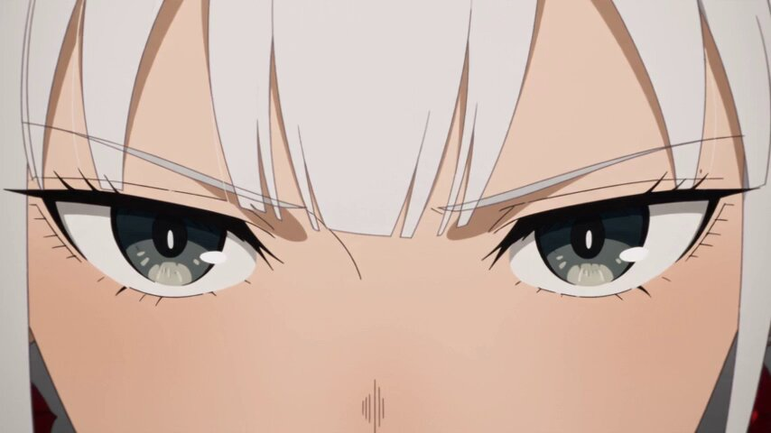

**프롬프트**

```text
번역 중
```

[↑ 카테고리로 돌아가기](#catalog)

---

<a name="prompt-2098369249173782695"></a>

### 화이트-블랙-오렌지 팔레트가 적용된 미래지향적 애니메이션 SF 및 메카 콘셉트 아트 프롬프트.

작성자：[@NVTDanh](https://x.com/NVTDanh) · [원본 게시물](https://x.com/NVTDanh/status/2098369249173782695)

애니메이션 / 만화 · 사이버펑크 / SF · 배포 완료

**요약:** 화이트-블랙-오렌지 팔레트가 적용된 미래지향적 애니메이션 SF 및 메카 콘셉트 아트 프롬프트.


**프롬프트**

```text
미래지향적인 애니메이션 SF 콘셉트 아트, 근미래 메카 디자인, 하드 서피스 기계 디테일, 세련된 화이트-블랙-오렌지 테크놀로지 팔레트, 정교한 장갑 패널, 노출된 관절과 기계 장치, 날카롭고 깔끔한 선화, 반사실적 애니메이션 비율, 고디테일 산업 디자인, 영화 같은 프로덕션 아트, 깔끔한 기술 일러스트레이션 미학
```

[↑ 카테고리로 돌아가기](#catalog)

---

<a name="category-sketch-line-art"></a>

## 스케치 / 선화

<a name="prompt-2100043047857729721"></a>

### 번역 중

작성자：[@leo\_xiaolei](https://x.com/leo_xiaolei) · [원본 게시물](https://x.com/leo_xiaolei/status/2100043047857729721)

일러스트레이션 · 스케치 / 선화 · 수채화 · 잉크 / 중국풍 · 배포 완료

**요약:** 번역 중


**프롬프트**

```text
번역 중
```

[↑ 카테고리로 돌아가기](#catalog)

---

<a name="category-3d-render"></a>

## 3D 렌더링

<a name="prompt-2099316017986220245"></a>

### 숲속의 꿀을 모으고 주방에서 시원한 음료를 만드는 솜털 보송한 복숭아 모양 생명체의 3D 애니메이션.

작성자：[@Zarnab\_with\_Ai](https://x.com/Zarnab_with_Ai) · [원본 게시물](https://x.com/Zarnab_with_Ai/status/2099316017986220245)

3D 렌더링 · 캐릭터 · 음식 / 음료 · 동물 / 생명체 · 풍경 / 자연 · 배포 완료

**요약:** 숲속의 꿀을 모으고 주방에서 시원한 음료를 만드는 솜털 보송한 복숭아 모양 생명체의 3D 애니메이션.


**프롬프트**

```text
부드럽고 솜털이 보송보송한 파스텔 핑크빛 몸, 작고 반짝이는 검은 눈, 귀여운 작은 입, 발그레한 뺨, 앙증맞은 팔과 발, 머리 위에 달린 작은 초록 잎사귀를 가진 작고 사랑스러운 복숭아 모양의 생명체가 등장하는 귀엽고 극도로 사실적인 3D 시네마틱 세로형 비디오(9:16)를 제작해 주세요.

작은 복숭아 생명체는 푸른 풀, 나무, 나뭇잎, 따뜻한 자연 햇살로 둘러싸인 아름다운 햇살 가득한 숲속에 있습니다. 나뭇가지에 매달린 벌집을 발견하고 아주 작은 숟가락으로 신선한 황금빛 꿀을 기분 좋게 채취합니다. 작은 꿀벌 한 마리가 주위를 날아다니다가 얼굴 근처에 잠시 앉습니다.

이 생명체가 꿀을 즐기고, 숲을 걷다가 아늑하고 소박한 원목 주방으로 돌아오는 모습을 보여주세요. 투명한 유리잔에 얼음, 레몬 조각, 알록달록한 과일 조각, 황금빛 꿀을 넣어 상큼한 과일 꿀 음료를 만듭니다. 스푼으로 음료를 부드럽게 저어 행복하게 마십니다.

캐릭터를 극도로 사랑스럽고 풍부한 표정으로 묘사하고, 부드러운 인형 같은 솜털 디테일, 사실적인 질감, 사랑스러운 움직임, 자연스러운 표정, 영화 같은 피사계 심도, 따뜻한 골든 아워 조명, 아름다운 보케, 정교한 숲 환경, 부드러운 카메라 무빙, 매크로 클로즈업, 사실적인 그림자, 프리미엄 고화질 3D 애니메이션을 적용하세요.

전체 비디오에서 동일한 캐릭터 디자인, 얼굴, 비율, 색상, 잎사귀, 외모를 일관되게 유지하세요. 텍스트 없음, 워터마크 없음, 왜곡된 해부학적 구조 없음, 불필요한 캐릭터 없음.

스타일: 픽사 스타일의 귀여운 3D + 실사 같은 질감 + 시네마틱 매크로 사진 + 아늑한 판타지 미학.
```

[↑ 카테고리로 돌아가기](#catalog)

---

<a name="prompt-2098590744080757223"></a>

### 3D 애니메이션 장면 프롬프트: 사무실 회전의자에 앉아 빨대로 아이스 커피를 마시는 사랑스러운 봉제 수달의 따뜻한 모습 묘사.

작성자：[@Zarnab\_with\_Ai](https://x.com/Zarnab_with_Ai) · [원본 게시물](https://x.com/Zarnab_with_Ai/status/2098590744080757223)

3D 렌더링 · 캐릭터 · 음식 / 음료 · 배포 완료

**요약:** 3D 애니메이션 장면 프롬프트: 사무실 회전의자에 앉아 빨대로 아이스 커피를 마시는 사랑스러운 봉제 수달의 따뜻한 모습 묘사.


**프롬프트**

```text
부드러운 회갈색 털, 크림빛 흰색 배와 주둥이, 작고 둥근 귀, 윤기 있는 검은 눈, 작고 짙은 색의 코, 발그레한 뺨, 짧은 앞발, 귀엽게 보이는 발바닥 패드를 지닌 사랑스럽고 통통한 수달 캐릭터가 등장하는 고품질의 극도로 정밀한 3D 애니메이션 장면을 제작하세요. 캐릭터는 부드러운 봉제 인형 같은 외형, 동글동글한 비율, 순수하고 행복한 표정을 지니고 있습니다.

현대적인 검은색 인체공학적 사무용 의자에 편안히 앉아 있는 캐릭터를 배치하세요. 캐릭터는 빨대가 꽂힌 투명 플라스틱 컵에 담긴 아이스 커피를 양발로 자연스럽게 감싸 쥐고 마시고 있습니다. 캐릭터를 프레임 중앙에 두고 눈에 띄게 유지하세요.

베이지 그레이 색상의 칸막이 부스들이 줄지어 있고, 컴퓨터 모니터, 큰 창문, 은은한 자연광, 윤이 나는 바닥, 배경의 섬세한 사무실 디테일이 있는 밝고 현대적인 사무실 내부로 장면을 설정하세요. 얕은 심도를 적용하여 캐릭터는 선명하게 초점을 맞추고 배경은 부드럽게 흐려지게 만드세요.

프리미엄 애니메이션 영화의 한 장면처럼 느껴지도록 연출하세요: 매우 디테일하고 부드러운 털, 사실적인 패브릭 및 플라스틱 질감, 표정이 풍부하고 반짝이는 눈, 자연스럽고 부드러운 조명, 영화 같은 구도, 사실적인 그림자, 섬세한 앰비언트 오클루전, 세련된 3D 렌더링, 사랑스럽고 기발한 분위기, 깔끔한 구도, 전문가급 애니메이션 퀄리티, 고해상도, 세로 9:16 구도.

중요 사항: 캐릭터 디자인과 신체 비율을 전체적으로 정확히 동일하게 유지하고, 전경에 사람을 두지 않으며, 텍스트, 로고, 워터마크 및 왜곡된 해부학적 구조가 없어야 합니다.
```

[↑ 카테고리로 돌아가기](#catalog)

---

<a name="prompt-2098371778234179766"></a>

### Blender에서의 3D 그레이 모델 제작부터 PixVerse\(Seedance 2.5\)를 통한 영상화까지 지정한 GTA 스타일 자동차 추격전 제작 지시서.

작성자：[@hasamaru\_studio](https://x.com/hasamaru_studio) · [원본 게시물](https://x.com/hasamaru_studio/status/2098371778234179766)

3D 렌더링 · 제품 · 차량 · 배포 완료

**요약:** Blender에서의 3D 그레이 모델 제작부터 PixVerse\(Seedance 2.5\)를 통한 영상화까지 지정한 GTA 스타일 자동차 추격전 제작 지시서.


**프롬프트**

```text
다음 제작 공정에 따라 오리지널 GTA 스타일의 3D 자동차 추격전을 제작해 주세요.

【디자인】
메인 드라이버 1명, 도주 차량 1대, 추격 차량 1대, 도시 배경 1곳을 설정하고 각각의 디자인을 일관되게 유지해 주세요. 각 4초씩 총 3개의 샷을 계획해 주세요.
・후방에서 차량을 쫓는 추격 샷
・급커브를 도는 차량을 측면에서 추적하는 샷
・차량이 멀리 달려나가는 모습을 넓게 담은 샷

【Blender에서 구축】
정돈된 그레이 모델과 작동 가능한 캐릭터 및 차량 리그(Rig)를 제작해 주세요. 텍스처나 UV 언래핑은 필요하지 않습니다.

【애니메이션 및 테스트】
드라이버, 핸들 조작, 바퀴 회전, 차량, 카메라를 애니메이션화해 주세요. 진행 방향과 차량 간 전후 관계를 일관되게 유지하고 파고듦(클리핑), 바퀴 뜸, 타이어의 부자연스러운 미끄러짐, 포즈 무너짐, 핸들에서 손이 떨어지는 문제를 수정해 주세요.

【Blender에서 렌더링】
프레임 1~288을 1280×720, 24fps로 렌더링해 주세요. 실제로 Blender에서 렌더링한 프레임을 연결하여 12초 분량의 그레이 모델 마스터 영상을 제작해 주세요. 각 샷을 개별적으로 내보내고, 형태와 구도 참조용으로 해당하는 그레이 스틸 이미지도 렌더링해 주세요.

【PixVerse 플러그인으로 마무리】
Seedance 2.5를 720p 해상도로 사용하여 각 샷을 개별적으로 처리해 주세요. Blender 영상을 모션 참조로, 그레이 스틸 이미지를 형태 참조로 사용해 주세요. 생성 프롬프트에서 영상 전체에 통일감 있는 색상 배합을 지정해 주세요. 카메라 무빙, 액션 타이밍, 캐릭터 및 차량 디자인, 차량 수를 유지해 주세요.

【확인 및 납품】
완성된 두 영상을 모두 확인하여 시각적 오류와 샷 간의 연결성을 점검해 주세요. Blender 측 문제를 수정한 뒤, Seedance에서 실패한 샷만 다시 생성해 주세요. 재시도는 샷당 최대 2회까지로 제한합니다.

편집 가능한 .blend 파일, 네이티브 720p Blender 그레이 모델 영상, Seedance 버전으로 명기된 720p 영상, 남아 있는 한계점에 대한 간결한 평가서를 납품해 주세요.
```

[↑ 카테고리로 돌아가기](#catalog)

---

<a name="prompt-2098326362801221835"></a>

### 번역 중

작성자：[@Chengzilhy](https://x.com/Chengzilhy) · [원본 게시물](https://x.com/Chengzilhy/status/2098326362801221835)

만화 / 스토리보드 · 사진술 · 3D 렌더링 · 배포 완료

**요약:** 번역 중


**프롬프트**

```text
번역 중
```

[↑ 카테고리로 돌아가기](#catalog)

---

<a name="category-ink-chinese-style"></a>

## 잉크 / 중국풍

<a name="prompt-2100233948341367178"></a>

### 선협 여전사가 순간이동하여 요수를 걷어차 날리는 무술 특수효과 단편, 흑백 플래시와 레드·블랙 실루엣 엔딩.

작성자：[@liyue\_ai](https://x.com/liyue_ai) · [원본 게시물](https://x.com/liyue_ai/status/2100233948341367178)

잉크 / 중국풍 · 배포 완료

원본 게시물：[@liyue\_ai](https://x.com/liyue_ai) · [원본 게시물](https://x.com/liyue_ai/status/2100087420771610707)

**요약:** 선협 여전사가 순간이동하여 요수를 걷어차 날리는 무술 특수효과 단편, 흑백 플래시와 레드·블랙 실루엣 엔딩.


**프롬프트**

```text
동양 판타지 선협, 순수 CG 특수효과 단편, 16:9, 다각도 컷 편집, 영화급 라이팅, PBR 차세대 텍스처, 영화급 HDR.
동일한 블랙·블루·화이트·골드 배색의 동양풍 선협 여성 캐릭터, 전 과정 의상·머리장식·메이크업 완벽 일치: 붉은 화전, 높이 묶은 긴 머리, 백색 바탕에 청금색 자수가 놓인 넓은 소매의 전투용 도포, 금속 허리띠, 섬세한 술 장식 헤어피스.
흑청빛 에너지 공간 속에서, 여주인공이 좌측 청금색 입자 속에서 초고속으로 순간이동하듯 등장, 측면 촬영, 우측의 요수를 향해 고속 돌진하며 긴 머리와 옷자락이 역동적인 잔상을 형성한다. 이어지는 로우 앵글 측면 샷에서 여주인공이 골반을 틀며 무릎을 끌어당겨 극단적인 원근감의 사이드 킥을 날린다. 전투복 자락이 흩날리며 허벅지와 그 아래 피부가 드러나고, 다리와 발에는 청금색 유광 에너지가 감싸여 있다. 곧이어 타격 샷으로 전환, 여주인공의 발이 요수의 머리를 정확히 강타하고 핏빛 안개, 부서진 빛가루, 청금빛 폭발 파티클이 동시에 터져 나오며, 짧은 흑백 플래시 프레임 후 슬로우 모션으로 전환되어 요수가 킥의 궤적을 따라 엄청난 위력으로 날아간다. 마지막으로 화면은 고채도 붉은 배경과 검은 실루엣으로 전환되며, 여주인공은 매서운 자세를 유지한 채 요수는 우측 후방으로 날아가 바닥에 떨어지고 검은 연무가 폭발하며 강렬한 레드-블랙 비주얼 임팩트로 마무리된다.
전체 동작은 군더더기 없이 예리하고 폭발적이며, 카메라 템포가 빠르고, 전반부에는 청금빛 특수효과가 강렬하다가 결말에는 간결하고 강렬한 레드-블랙 대비 화면으로 전환된다.
```

[↑ 카테고리로 돌아가기](#catalog)

---

<a name="category-cyberpunk-sci-fi"></a>

## 사이버펑크 / SF

<a name="prompt-2097330853588402541"></a>

### 사이버 무협 비 내리는 밤의 대결, 붉은 옷 여인이 장타로 기계 거한의 영혼을 육신 밖으로 쳐내는 콘티 프롬프트.

작성자：[@TanLuAI](https://x.com/TanLuAI) · [원본 게시물](https://x.com/TanLuAI/status/2097330853588402541)

만화 / 스토리보드 · 사이버펑크 / SF · 캐릭터 · 배포 완료

원본 게시물：[@TanLuAI](https://x.com/TanLuAI) · [원본 게시물](https://x.com/TanLuAI/status/2096586474645004331)

**요약:** 사이버 무협 비 내리는 밤의 대결, 붉은 옷 여인이 장타로 기계 거한의 영혼을 육신 밖으로 쳐내는 콘티 프롬프트.


**프롬프트**

```text
생성@36c7ae17-4706-44b8-a6bc-cf3fd46b7dd4의 후속 스토리: 【스타일】 실사 영화 스타일, 사이버 무협과 네오 누아르의 융합. 채도가 낮은 차가운 쇠색조의 비 내리는 밤, 짙은 붉은 옷감, 젖은 검은 도포, 기계 의수가 질감의 대비를 이룸. 쏟아지는 장대비, 바닥에 깔린 볼륨 안개, 젖은 돌바닥의 반영, 강한 명암 대비를 지닌 빛과 그림자. 내력과 영체는 모두 무색투명한 굴절로 표현되며, 유색 에너지, 발광 윤곽, 광구 또는 광륜은 없음. 환경음과 액션 음향 효과만 존재하며, 멜로디가 있는 배경 음악, 대사, 내레이션은 없음. 【길이】 15초, 16:9 가로 화면. 
【인물 및 배경】 붉은 옷을 입은 여인@ca34fb78-722b-4e56-8e1f-bc4d2e0f5b56, 붉은색 짧은 형태의 천 신발을 착용. 2.5미터의 거한@a92d0332-132f-4b88-864f-00f4dd75d724, 상투, 수염, 검은 장포와 양팔 기계 의수, 여인보다 머리 세 개 정도 더 큰 거구. 여인이 좌측, 거한이 우측에 위치하며 둘 사이는 한 팔 거리, 거한의 등 뒤에는 영체 분리를 위한 공간을 확보. 전 과정 동일한 거리, 동일한 빗줄기, 건물 형태는 안정적으로 유지. 
【00:00—00:03｜쇼트 01: 빗속 대치, 몸을 낮추고 장타 준비】 65mm 미디엄 쇼트, 붉은 옷 여인의 어깨 뒤에서 천천히 패닝하며 두 사람의 옆모습과 키 차이를 드러냄. 기계 우산 면이 상단을 차지하고 우산 가장자리를 따라 빗물이 줄지어 떨어짐. 우측의 거한은 반 걸음 앞으로 압박하며 다가와 장화 바닥으로 괸 물을 밟고 고개를 숙여 여인을 내려다보며, 허리 옆 기계 손을 천천히 쥐어 여인의 어깨를 만지려 함. 여인은 우산을 수직으로 공중으로 던져 올리고, 우산은 여인의 손을 떠나 높은 공중에 정지한 채 떠 있음. 왼발은 앞에 두어 체중을 싣고 오른발은 뒤에 두며, 양 무릎을 살짝 굽히고 중심을 부드럽게 낮춤. 오른손은 허리 옆에서 손바닥을 펴고 오른쪽 팔꿈치는 몸에 밀착. 쇼트 말미에 거한이 오른쪽 기계 팔을 들어 올리기 시작함과 동시에 여인이 오른발 앞꿈치로 지면을 박차며 다음 쇼트로 연결. 음향 효과: 굵은 빗소리, 발로 물을 밟는 소리, 기계 관절의 묵직한 마찰음. 
【00:03—00:06｜쇼트 02: 장타 적중, 육신과 영체의 어긋남 시작】 전방 측면 로우 앵글로 전환, 40mm 미디엄 풀 쇼트로 여인의 발놀림, 골반, 장타 타격점을 명확히 포착. 여인이 뒷발로 지면을 차고 우측 골반을 전방으로 회전시키며 허리와 복부의 힘으로 우측 어깨와 팔꿈치를 이끌어, 오른손 바닥을 허리 옆에서 최단 경로로 맹렬하게 뻗어 장저(손바닥 밑부분)로 거한의 흉골 중앙을 정확히 가격. 먼저 실제 타격감을 표현: 검은 도포의 가슴 부위가 안쪽으로 함몰되며 주름이 어깨와 허리 쪽으로 퍼져나감. 거한의 흉곽이 뒤로 물러나고 어깨가 벌어지며 머리가 뒤늦게 뒤로 젖혀지고 기계 팔 동작이 중단됨. 양발은 땅에서 떨어지지 않고 신발 밑창만 뒤로 몇 센티미터 밀려나며 얕은 물자국을 냄. 여인의 앞다리는 흔들림 없이 하중을 지탱하고 오른쪽 팔꿈치는 살짝 굽힌 채 손바닥이 가슴에 닿은 채 짧게 머무르며, 붉은 소매와 긴 머리카락은 반 박자 더 앞으로 휘날림. 타격점 주변의 빗줄기가 잠시 휘어지고 물방울이 옆으로 밀려나며, 배경의 붉은 기둥에 국소적인 투명 굴절이 발생(섬광 없음). 적중 후 시간이 잠시 슬로우 모션이 되며 거한의 육신은 초점을 잃고, 목과 어깨 뒤쪽으로 몇 센티미터가량 투명한 윤곽선이 어긋나 나타나며 몸의 또 다른 층이 여전히 충격의 관성에 따라 뒤로 밀려나는 듯 보임. 음향 효과: 소매를 가르는 파공음, 묵직하고 단단한 타격음, 빗소리가 순간적으로 작아졌다가 서서히 회복. 
【00:06—00:09｜쇼트 03: 영체의 연속 분리, 등 뒤 체공】 50mm 측면 미디엄 풀 쇼트, 카메라가 천천히 측면으로 이동하며 줌아웃하여 육신과 영체를 동시에 포착. 거한의 육신은 무릎을 굽힌 채 뒤로 젖혀져 양발을 땅에 디딘 상태를 유지하고, 영체는 육신 내부로부터 뒤쪽 위 방향으로 연속적으로 미끄러져 나옴: 흉곽과 어깨선이 먼저 어긋나고, 이어서 머리와 얼굴이 드러나며, 두 기계 팔이 차례로 빠져나오고, 허리와 복부, 다리 및 도포 자락이 마지막으로 분리됨. 영체는 거한의 얼굴, 수염, 상투, 검은 도포 및 기계 팔 구조를 온전히 유지하고 있으며 선명한 볼륨감과 디테일을 지닌 전체 무색 반투명 상태. 영체를 투과하여 약간 굴절된 객잔과 빗줄기를 볼 수 있으며, 갑자기 나타난 복제 인간이나 하얀 연기 형태가 아님. 둘 사이에는 짧은 순간 무색투명한 얇은 막이 늘어나다가 거리가 멀어짐에 따라 점차 가늘어지며 끊어지고, 굴절은 신체 윤곽을 따라 되돌아가며 사라짐. 영체는 육신 뒤쪽 약 70cm, 위쪽 약 40cm 지점까지 밀려나 감속하여 체공하며, 양발은 땅에서 떨어져 있고 옷자락과 양팔은 반 박자 더 흔들림. 여인은 오른손 바닥을 거두고, 우산은 공중에 멈춘 채 떠 있음. 쇼트 말미에 정상 속도로 돌아오며, 빗방울은 육신에 부딪히지만 영체는 그대로 통과함. 음향 효과: 묵직한 공기 압축음, 옷감과 금속의 은은한 마찰음, 정상적인 빗소리 점진적 회복. 
【00:09—00:12｜쇼트 04: 손을 내려다보고 아래의 육신을 발견】 85mm 미디엄 클로즈업으로 전환, 거한의 육신 머리와 어깨는 좌측 하단 전경에 살짝 아웃포커스된 채 놓이고, 영체는 우측 상단 후방에 위치하며 초점은 영체의 눈과 양손에 고정. 배경은 동일한 객잔의 붉은 기둥, 아련한 홍등과 빗줄기. 영체는 미간을 찌푸리며 두 투명한 기계 손을 가슴 앞으로 들어 올려 손바닥을 자신을 향하게 하고 기계 손가락 관절을 천천히 한 번 굽혔다 폄. 손바닥 내부 구조는 온전하지만 손바닥을 통해 배경을 투과해 볼 수 있음. 그는 먼저 양손을 응시하다가 이내 고개를 숙여 자신의 육신을 발견하고는 눈을 번쩍 크게 뜨고 입술을 살짝 벌리며 표정이 혼란에서 경악으로 변함. 영체의 몸은 약간의 부유감만 있을 뿐 위아래로 출렁이지 않음. 이어 그는 망설이며 오른손을 뻗어 육신의 뒤통수를 향해 다가가고, 어깨를 앞으로 내밀며 팔꿈치를 서서히 폄. 쇼트 말미에 투명한 손가락 끝이 육신의 젖은 머리칼에 닿는 순간, 접촉 부위에 미세한 무색 굴절이 일어남. 음향 효과: 빗소리, 처마 끝 낙수음, 먼 곳 배관의 증기 배출음, 귀신 소리나 배경 음악 없음. 
【00:12—00:15｜쇼트 05: 손바닥이 머리를 관통하고 영혼 탈골을 자각】 전방 측면 클로즈업으로 전환, 육신은 앞쪽 아래, 영체는 뒤쪽 위에 유지. 카메라가 살짝 측면으로 이동하며 영체의 오른손이 육신의 뒤통수로 들어가 손가락과 손바닥이 차례로 아무런 저항 없이 관통하고, 손가락 끝이 육신의 앞쪽 뺨 옆으로 드러나는 모습을 선명하게 보여줌. 육신의 머리카락과 피부는 온전하며 구멍이나 손상이 없고 고통 반응도 없음. 관통 경계에는 윤곽선에 밀착된 무색 굴절만 존재하며 손바닥의 이동에 따라 자연스럽게 닫힘. 영체의 팔은 여전히 뒤쪽 어깨와 연결되어 있어야 하며 어긋나거나 끊어지지 않음. 영체는 뚫고 나온 오른손을 응시하며 잠시 굳었다가, 기계 손가락을 천천히 쥐었다가 다시 펴며 자신을 만질 수 없음을 깨달음. 초점이 투명한 손바닥에서 경악에 찬 그의 두 눈으로 다시 이동하고, 그는 시선을 돌려 여인을 바라봄. 카메라는 부드럽게 줌아웃되며 좌측 가장자리에 여인의 붉은 소매와 물방울 떨어지는 우산 가장자리가 걸치고, 여인은 여전히 차분함을 유지. '초점을 잃은 육신, 허공에 뜬 영체, 우산을 들고 있는 여인'의 장면으로 마무리. 음향 효과: 미세한 공기 요동음, 지속적인 빗소리, 우산 가장자리의 낙수음. 
【화면 제약 사항】 장타가 명중한 후에만 영체 분리가 발생할 것; 육신은 제자리 근처에 머물고 영체만 뒤쪽 위로 이동할 것. 전 과정에서 거한의 육신은 하나, 대응하는 영체도 하나만 존재할 것. 모든 내력과 영체 효과는 무색투명하며 자체 발광하지 않을 것. 캐릭터 외모, 기계 구조, 의상, 배경 및 광원을 일관되게 유지할 것. 자막, 판독 가능한 문자, 워터마크, 유색 특수 효과 없음.
```

[↑ 카테고리로 돌아가기](#catalog)

---

<a name="category-minimalism"></a>

## 미니멀리즘

<a name="prompt-2100248337920499730"></a>

### 번역 중

작성자：[@TanLuAI](https://x.com/TanLuAI) · [원본 게시물](https://x.com/TanLuAI/status/2100248337920499730)

만화 / 스토리보드 · 미니멀리즘 · 캐릭터 · 동물 / 생명체 · 배포 완료

**요약:** 번역 중


**프롬프트**

```text
번역 중
```

[↑ 카테고리로 돌아가기](#catalog)

---

<a name="category-other"></a>

## 기타

<a name="prompt-2100460643874943066"></a>

### 번역 중

작성자：[@noorlewisx](https://x.com/noorlewisx) · [원본 게시물](https://x.com/noorlewisx/status/2100460643874943066)

캐릭터 · 음식 / 음료 · 배포 완료

**요약:** 번역 중

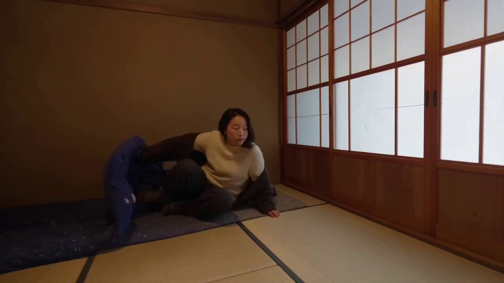

**프롬프트**

```text
번역 중
```

[↑ 카테고리로 돌아가기](#catalog)

---

<a name="prompt-2100468572644573436"></a>

### 번역 중

작성자：[@krienknight](https://x.com/krienknight) · [원본 게시물](https://x.com/krienknight/status/2100468572644573436)

만화 / 스토리보드 · 캐릭터 · 배포 완료

**요약:** 번역 중

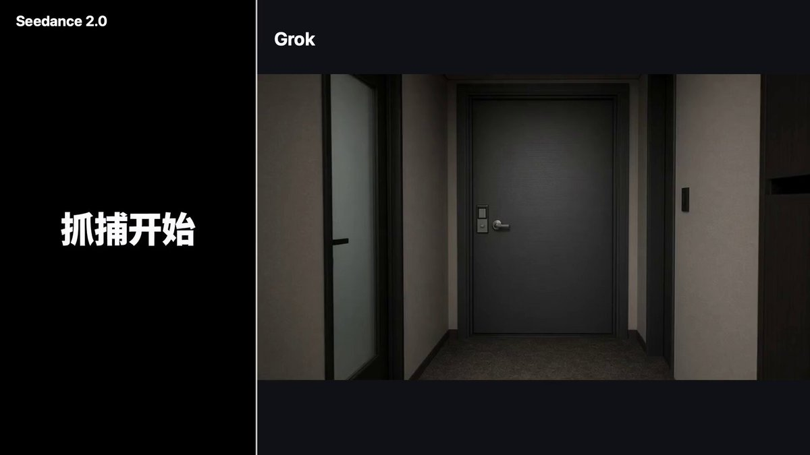

**프롬프트**

```text
번역 중
```

[↑ 카테고리로 돌아가기](#catalog)

---

<a name="prompt-2100423982898115050"></a>

### 계곡과 통나무집 옆에서 즐기는 한국 여성의 여유로운 여름 일상 브이로그 장면 비디오 프롬프트.

작성자：[@aiwithaayat](https://x.com/aiwithaayat) · [원본 게시물](https://x.com/aiwithaayat/status/2100423982898115050)

캐릭터 · 배포 완료

**요약:** 계곡과 통나무집 옆에서 즐기는 한국 여성의 여유로운 여름 일상 브이로그 장면 비디오 프롬프트.


**프롬프트**

```text
부드러운 화이트 서머 드레스와 내추럴한 밀짚 챙모자를 쓴, 산뜻하고 우아한 한국적 라이프스타일 감성의 아름다운 한국 여성. 가볍게 웨이브 진 어두운 단발머리, 옅은 화장, 부드럽고 자연스러운 표정을 짓고 있다. 그녀는 아름다운 계곡 물가에서 평화로운 여름날을 즐긴다. 물가에 앉아 차분하게 수박 한 조각을 먹으며 상쾌한 분위기를 만끽한다. 그녀는 아늑한 야외 공간을 천천히 거닐며 모자를 매만지고 주변 풍경을 바라본다. 나뭇잎 사이로 부드럽게 스며드는 햇살이 따뜻하고 영화 같은 하이라이트와 자연스러운 렌즈 플레어를 연출한다. 나무 오두막 옆에서 여름 바람을 타고 하얀 커튼이 살랑살랑 흔들린다. 그녀는 작은 피크닉 바구니를 들고 고요한 시골 풍경을 즐긴다. 카메라는 클로즈업, 미디엄 샷, 부드럽고 시네마틱한 와이드 샷을 담아낸다. 극사실적이고 따스하며 몽환적이고 평화로운 한국 여름 브이로그 스타일, 자연스러운 색감, 부드러운 조명, 현실적인 움직임, 시네마틱 4K 퀄리티.
```

[↑ 카테고리로 돌아가기](#catalog)

---

<a name="prompt-2100383168356573667"></a>

### 스마트폰 화면 클로즈업 속 배경화면 소녀가 깨어나 뾰로통하게 소리치며 얼굴을 가리는 앱 아이콘들을 하나씩 밀어낸 뒤 활짝 웃으며 브이 포즈를 취한다.

작성자：[@PhotoX86](https://x.com/PhotoX86) · [원본 게시물](https://x.com/PhotoX86/status/2100383168356573667)

앱 / 웹 디자인 · 캐릭터 · 초록 / 배경 · 배포 완료

**요약:** 스마트폰 화면 클로즈업 속 배경화면 소녀가 깨어나 뾰로통하게 소리치며 얼굴을 가리는 앱 아이콘들을 하나씩 밀어낸 뒤 활짝 웃으며 브이 포즈를 취한다.


**프롬프트**

```text
integrated_multimodal_description: [Shot 1] 스마트폰 화면만을 담은 실사 초극사실주의 클로즈업, 세로 9:16 프레임, 약 15.00초, 은은한 주변 반사가 있는 실제 스마트폰 베젤 및 유리, 고선명 디스플레이. 전체 영상에는 엄격하게 단 한 명의 인물만 존재함: 스마트폰 화면 속의 배경화면 여성. 화면 밖에는 절대 사람, 얼굴, 손, 손가락, 팔, 신체 부위, 실루엣이 없어야 하며, 프레임에는 스마트폰과 그 디스플레이 콘텐츠만 포함됨. 배경화면은 섬세한 이목구비, 세련된 메이크업, 생생한 표정, 패셔너블한 의상을 갖춘 젊고 아름다운 아시아 여성의 상반신 사진이지만, 홈 화면은 그녀의 얼굴, 눈, 주요 신체 부위를 가로막는 수많은 앱 아이콘으로 빽빽하게 덮여 있음. 화면에 읽을 수 있는 텍스트, 캡션, 자막, 워터마크, 로고 없음—앱 아이콘은 라벨이 없는 순수한 그래픽 심볼임. 00:00.000부터 00:02.000까지 정적 프레임: 빽빽한 아이콘이 그녀를 완전히 가리고 있음. 00:02.000부터 00:12.000까지, 배경화면 속 여성이 화면 안에서 갑자기 살아 움직이며, 삐친 듯 귀엽게 투정을 부리는 표정으로 살짝 눈살을 찌푸리고, 맑고 높은 중고음 목소리를 지닌 활기찬 젊은 여성(S1)이 정면을 응시하며 입술 모양을 뚜렷이 드러내고 외침: [Chinese] 挡住我了！ 여전히 배경화면 내부에서만, 그녀는 검지손가락만을 사용하여 정확하게 타겟팅함: 손가락 끝으로 먼저 아이콘의 정확한 위치를 직접 누른 다음, 빠르게 그 아이콘을 스와이프하여 밀어내야 함. 아이콘은 정확히 눌렸을 때만 움직이며, 허공에서 무작위로 휘젓는 것은 아무런 효과가 없음. 그녀는 이런 방식으로 아이콘들을 하나씩 정리함. 매우 빠르게 움직이더라도, 이는 연속된 아이콘을 향한 정확한 누르기-스와이프 타격의 빠른 연속 동작일 뿐, 결코 목적 없는 허우적거림이 아님. 어떤 아이콘은 날카로운 한 번의 누르기-스와이프로 사라지며, 일부는 두 번째 정밀한 누르기-스와이프가 필요함. 아이콘을 치우는 동안 그녀는 앙증맞게 입술을 삐죽거리고 가끔 눈을 흘기며, 아이콘이 서서히 줄어들면서 그녀의 얼굴과 몸이 조금씩 드러남. 마지막 아이콘이 화면을 벗어나는 순간, 모든 검지손가락 누르기 및 스와이프 동작이 즉시 멈추고, 화면 속 그녀의 손은 차분해져 더 이상 손가락을 튕기지 않음. 00:12.000부터 00:15.000까지, 화면은 그녀의 사진만 남아 깨끗해짐. 스와이프하던 손이 이미 멈춘 상태에서, 그녀는 밝고 행복한 미소를 짓고, 눈은 반달 모양으로 휘어지며, 시청자를 향해 승리의 브이(V) 사인을 취하고 15.00초 동안 정지 상태를 유지함. 초현실적이고 매끄럽고 자연스러운 움직임, 사실적인 화면 조명과 부드러운 반사. overall_soundscape: 부드러운 스마트폰 유리 룸 톤, 정확한 누르기 및 스와이프마다 들리는 짧은 UI 탭 소리와 휙 지나가는 소리, 그녀가 외치는 한 문장의 대사와 가벼운 토라진 숨소리. 마지막 아이콘이 사라진 후 손가락 움직임 효과음은 멈춤. non_diegetic_music: 적당한 템포의 경쾌하고 장난스러운 전자 플럭 사운드로, 마지막 아이콘들이 정리될 때 밝아지다가 브이 사인 정지 화면 아래에서 부드럽게 유지됨.，3:4，15s
```

[↑ 카테고리로 돌아가기](#catalog)

---

<a name="prompt-2100290901733986767"></a>

### 빨간 책과 파란 책은 절대 떨어지지 않고 마지막에 둘 다 탁자 위에 있으며, 오직 초록색 책들만 떨어지고 그 네 권 모두 떨어진다

작성자：[@GlennHasABeard](https://x.com/GlennHasABeard) · [원본 게시물](https://x.com/GlennHasABeard/status/2100290901733986767)

기타 · 배포 완료

**요약:** 빨간 책과 파란 책은 절대 떨어지지 않고 마지막에 둘 다 탁자 위에 있으며, 오직 초록색 책들만 떨어지고 그 네 권 모두 떨어진다


**프롬프트**

```text
빨간 책과 파란 책은 절대 떨어지지 않고 마지막에 둘 다 탁자 위에 있으며, 오직 초록색 책들만 떨어지고 그 네 권 모두 떨어진다
```

[↑ 카테고리로 돌아가기](#catalog)

---

<a name="prompt-2100223364505755756"></a>

### 숲속 트레일을 질주하는 멀티 씬 액션 POV 및 3인칭 더트 바이크 주행 영상으로, 마지막에 시원한 에너지 음료로 보상을 받는 시퀀스.

작성자：[@georgesttock](https://x.com/georgesttock) · [원본 게시물](https://x.com/georgesttock/status/2100223364505755756)

캐릭터 · 음식 / 음료 · 풍경 / 자연 · 배포 완료

**요약:** 숲속 트레일을 질주하는 멀티 씬 액션 POV 및 3인칭 더트 바이크 주행 영상으로, 마지막에 시원한 에너지 음료로 보상을 받는 시퀀스.


**프롬프트**

```text
{
 "shot_type": "멀티 씬 액션 POV 및 3인칭 비디오, 9:16 세로형, 익스트림 스포츠 콘텐츠 스타일",
 "duration": "20초",
 "camera": {
 "setup": "헬멧 장착 POV 카메라와 구경꾼의 핸드헬드 3인칭 트래킹 샷의 조합",
 "pov_details": "GoPro 스타일 헬멧 마운트, 약간 낮고 중앙에 위치, 프레임 가장자리에 자연스러운 어안 왜곡이 있는 광각 렌즈, 프레임 하단에 헬멧 바이저 안쪽 테두리의 희미한 반사 표시",
 "third_person_details": "구경꾼이 스마트폰으로 촬영한 핸드헬드 영상, 빠른 움직임을 추적할 때의 자연스러운 흔들림과 약간의 지연, 간헐적인 빠른 재초점"
 },
 "setting": {
 "location": "울창한 숲을 가로지르는 더트 바이크 트레일",
 "details": [
 "선명한 타이어 자국과 작은 잔돌들이 흩뿌려진 단단하게 다져진 적갈색 흙길",
 "양쪽에 늘어선 키 큰 소나무와 활엽수들, 나뭇잎 사이로 내리쬐는 일렁이는 햇살 얼룩",
 "다져진 흙층과 타이어에 마모된 모서리가 선명한 인공 흙 둔덕과 점프대",
 "트레일 끝에 놓인 작은 목제 접이식 테이블, 그 위의 빨간 쿨러, 쌓여 있는 컵들, 내부에 보이는 몇 캔의 에너지 음료",
 "트레일 가장자리를 따라 자란 마른 풀밭과 흩어진 낙엽들",
 "이전 라이더들이 지나가며 공기 중에 남긴 옅은 흙먼지 연무"
 ],
 "time_of_day": "정오, 나뭇잎 사이로 쏟아지는 밝은 직사광선",
 "atmosphere": "에너지가 넘치고 아드레날린이 솟구치는, 흙먼지 가득한 아웃도어 액션 스포츠 분위기"
 },
 "character": {
 "description": "20대 중반의 젊은 남성, 탄탄하고 날렵한 근육질 체구, 헬멧을 벗었을 때 턱끈 아래로 보이는 옅은 턱수염 자국, 헬멧을 벗으면 드러나는 땀에 젖은 짧은 흑발",
 "outfit": "무광 블랙 쉘에 절제되고 대중적인 레드 및 그레이 그래픽 포인트가 들어간 풀페이스 모토크로스 헬멧, 나무들이 비치는 틴티드 바이저, 레드 포인트 스트라이프가 들어간 다크 그레이 색상의 패딩 처리된 흡한속건 저지, 너클 보호대가 보강된 블랙 라이딩 글러브, 무릎 보호대가 장착된 블랙 및 그레이 라이딩 팬츠, 마모 흔적과 흙이 묻어 있는 모토크로스 부츠"
 },
 "vehicle": {
 "description": "무광 다크 그린과 블랙 프레임의 더트 바이크, 펜더와 엔진 하우징 전반에 튄 흙과 진흙 얼룩, 흙이 잔뜩 묻어 마모된 트레드 타이어, 열기로 인해 가볍게 변색된 배기 파이프"
 },
 "sequence": [
 {
 "timestamp": "0:00 - 0:06",
 "scene": "POV 트레일 라이딩",
 "action": "헬멧에 장착된 POV로 흙길을 질주, 양옆의 나무들이 잔상처럼 빠르게 스쳐 지나가고, 프레임 하단에는 앞바퀴가 튀겨내는 붉은 흙먼지와 자갈이 보이며, 노면에 따라 가볍게 떨리는 핸들바, 우거진 나뭇잎 아래를 지날 때 바이저 위로 빠르게 깜빡이는 햇살 얼룩",
 "camera_note": "1인칭 POV, 엔진에서 전달되는 지속적인 미세 진동, 요철을 지날 때 간헐적으로 일어나는 거친 충격 흔들림",
 "audio_detail": "우렁찬 2행정 엔진의 굉음, 배기구에서 뿜어져 나오는 리드미컬한 파열음, 헬멧 마이크를 스쳐 지나가는 거친 바람 소리"
 },
 {
 "timestamp": "0:07 - 0:13",
 "scene": "점프 및 트릭",
 "action": "속도를 내며 흙 둔덕에 접근하는 순간 3인칭 트래킹 샷으로 전환, 도약 직전 서스펜션이 압축되며 바이크가 솟아오르고, 뒷바퀴에서 흙이 뿜어져 나오는 채 바이크가 잠시 공중에 뜨며, 라이더는 체중을 이동해 공중에서 한쪽 다리를 스타일리시하게 뻗는 트릭을 선보인 후 재빨리 착지 자세를 잡고, 착지 시 서스펜션이 충격을 완화하며 충격과 함께 작은 먼지 구름을 일으킴. 트레일 가장자리에 서서 스마트폰을 들고 촬영하던 두 구경꾼 중 한 명이 그가 착지하자 주먹을 불끈 쥐며 환호함",
 "camera_note": "점프의 포물선을 따라가는 3인칭 핸드헬드 트래킹 샷, 가장 빠른 비행 구간에서의 가벼운 모션 블러",
 "audio_detail": "공중에서 스로틀을 잠시 놓을 때 피치가 올라가는 엔진음, 멀리서 들려오는 구경꾼들의 신난 환호성, 착지 시 쿵 하는 둔탁한 소리와 흙 밟히는 소리"
 },
 {
 "timestamp": "0:14 - 0:16",
 "scene": "정차",
 "action": "트레일 가장자리의 작은 목제 테이블 쪽으로 천천히 다가가며, 브레이크를 밟자 엔진 회전수가 낮아지고 완전히 정차함. 부츠로 킥스탠드를 툭 차서 내린 뒤, 시트 위로 다리를 넘겨 내리며 한 동작으로 헬멧을 벗자 땀에 젖은 머리카락과 살짝 상기되어 아드레날린으로 상기된 표정이 드러남",
 "camera_note": "고정 3인칭 미디엄 샷, 자연스러운 가벼운 핸드헬드 흔들림",
 "audio_detail": "엔진 공회전 소리가 낮은 울림으로 잦아들다 멈추는 소리, 킥스탠드가 고정될 때 나는 희미한 기계적 딸깍 소리"
 },
 {
 "timestamp": "0:17 - 0:20",
 "scene": "보상",
 "action": "테이블 뒤에 서 있던 남자가 빨간 쿨러 속으로 손을 뻗어 500ml 음료 캔을 꺼내는데, 무광 블랙 캔 표면에 성에와 굵은 물방울이 즉시 맺히며 흘러내림. 라이더에게 캔을 건네자 라이더는 만족스러운 고갯짓으로 받아서 캔 뚜껑을 따며 경쾌한 치익 소리와 함께 캔 상단에서 차가운 증기가 피어오르고, 첫 모금을 마시기 전 만족스럽게 숨을 들이마심",
 "product": "심플하고 미니멀한 범용 로고 마크가 새겨진 무광 블랙 500ml 음료 캔, 실제 브랜드명 없음, 캔 측면을 따라 굵은 물방울이 흘러내리며 맺힌 짙은 성에와 결로 현상",
 "camera_note": "캔 표면의 물방울 디테일을 확인할 수 있을 만큼 가까운 고정 미디엄 샷",
 "audio_detail": "캔이 열리는 날카로운 금속 딸깍-치익 소리, 희미한 탄산 기포 소리"
 }
 ],
 "audio": "주행 구간 내내 울려 퍼지는 우렁찬 더트 바이크 엔진 소리, 흙과 자갈이 갈리는 소리, 숲의 환경음(새소리, 바스락거리는 나뭇잎), 멀리서 들리는 구경꾼들의 웅성거림과 환호, 마지막의 캔 따는 소리와 탄산 소리, 배경음악 없음",
 "lighting": {
 "source": "숲의 캐노피를 뚫고 쏟아지는 밝고 강렬한 정오의 직사광선",
 "effect": "주행 중 트레일과 라이더 위로 빠르게 지나가는 강렬한 햇살과 그림자 패턴, 흙 위의 따뜻한 골든 톤, 마지막 샷에서 캔의 젖은 물방울 위로 맺히는 날카로운 반사 하이라이트",
 "style": "극사실주의, 포토리얼리스틱, 에너지가 넘치고 거친 액션 스포츠 콘텐츠 미학, 자연스러운 먼지와 흙 질감, 사실적인 액션캠 및 핸드헬드 스마트폰 영상 퀄리티, 디지털 인위적 보정 없음",
 "aspect_ratio": "9:16",
 "quality": "높은 디테일, 사실적인 흙·모션 블러·금속 및 물방울 결로 질감, 자연스러운 컬러 그레이딩, 에어브러시 보정 결함 없음, 과장된 물리 표현 없음"
}
```

[↑ 카테고리로 돌아가기](#catalog)

---

<a name="prompt-2100094856362123609"></a>

### 한 직장 여성이 들키지 않고 자리에 도착하기 위해 직원들을 따돌리지만 결국 CCTV 반전으로 끝나는 30초 분량의 3인칭 잠입 비디오 게임 프롬프트.

작성자：[@kingofdairyque](https://x.com/kingofdairyque) · [원본 게시물](https://x.com/kingofdairyque/status/2100094856362123609)

캐릭터 · 배포 완료

**요약:** 한 직장 여성이 들키지 않고 자리에 도착하기 위해 직원들을 따돌리지만 결국 CCTV 반전으로 끝나는 30초 분량의 3인칭 잠입 비디오 게임 프롬프트.


**프롬프트**

```text
업로드된 이미지를 정확히 1장 사용할 것. @Image1은 성인 일본인 여성에 대한 최우선 참조 자료입니다. 그녀의 얼굴, 정체성, 피부 톤, 신체 비율 및 외모를 그대로 유지하십시오. 의상이 불명확한 경우: 몸에 딱 맞는 블랙 오피스 블레이저, 화이트 새틴 블라우스, 차콜 플리츠 미디스커트, 얇은 블랙 스타킹, 블랙 로우힐, 어두운 색상의 출퇴근용 가방. 어깨 아래로 내려오는 찰랑이는 직모 흑발과 부드러운 시스루 뱅. 현실적인 20대 이상의 성인, 우아하고 프로페셔널한 외모. 애니메이션 느낌, CGI 느낌 또는 플라스틱 같은 피부는 제외할 것.

정확히 30초, 16:9 가로 화면, 네이티브 4K, 24fps, 극사실적인 실사 3인칭 잠입 게임 플레이 영상을 제작하십시오. 00:00부터 25.5초까지 하나의 연속된 숄더뷰 숏으로 진행된 후, 고정된 워크스테이션 숏으로 정확히 단 한 번의 하드 컷. 그 외의 컷, BGM, 자막, 내레이션, 워터마크 또는 캡션은 일절 없음. 자연스러운 일본어 대사; HUD는 영어로만 표기.

배경 설정:
하나로 이어진 현대적인 일본 기업 오피스: 밝은 로비 → 보안 데스크 → 출입 게이트 → 유리 복도 → 오픈 플랜 오피스 → 이동식 화이트보드 → 개인 좌석. 우측 창문에서 아침 햇살이 비침. 개인 좌석 우측 상단에 정확히 1대의 실제 화이트 PTZ CCTV가 설치되어 있음.

등장인물:
경비원 — 40대 일본인 남성, 건장한 체격, 네이비 유니폼, 로비에만 등장.
인사팀 직원 — 30대 일본인 여성, 베이지색 수트, 블랙 팬츠, 서류 카트, 복도에만 등장.
부서장 — 50세 전후의 일본인 남성, 안경, 차콜 수트, 화이트 셔츠, 짙은 붉은색 넥타이. 유일한 추격자. 모든 인물은 뚜렷하게 구별되는 고유한 얼굴을 가지며 일관성을 유지할 것.

HUD:
좌측 하단 미니맵 + 노란색 시야각 콘, 좌측 상단 STAMINA/COMPOSURE, 상단 중앙 DETECTION, 우측 하단 SPRINT/CROUCH/INTERACT/SLIDE.
오프닝:
【LATE — 12 MIN】
【OBJECTIVE: REACH YOUR DESK UNDETECTED】

00:00–00:07 — 로비:
그녀가 로비를 전속력으로 질주한다. 경비원이 그녀를 감지한다. 경비원의 시야각 게이지가 91%에 달하자 그녀는 급제동 후 웅크리며 화분 뒤로 슬라이딩한다. 경비원은 무전기 소리에 주의가 분산된다. 그녀는 출입증을 태그하고 게이트가 열리며 가방이 잠깐 걸리지만 복도로 빠져나간다. 발각도(Detection)는 34%로 떨어진다. 경비원은 뒤쫓아오지 않는다.

00:07–00:13 — 복도:
인사팀 직원이 높은 서류 카트를 밀고 간다. 인사팀 직원이 좌우를 살피는 사이, 그녀는 카트 뒤에 숨어 함께 돌며 이동한다. 발각도가 96%에 도달하지만 확실하게 들키지는 않는다. 그녀는 오픈 오피스로 미끄러지듯 들어간다. 인사팀 직원은 쫓아오지 않는다.

00:13–00:18 — 경보:
부서장이 유리에 비친 그녀의 모습을 보고 정체를 알아챈다. 카메라는 그의 얼굴을 짧게 비춘다. 커다란 빨간색 【!】가 정확히 두 번 깜빡이고 DETECTION은 붉은색 【ALERT】로 바뀐다.
그의 외침:
「ちょっと待って！」
그녀의 대답:
「やばい！」
그리고 그녀는 달리기 시작한다.

00:18–00:23.5 — 추격:
그녀는 바퀴 달린 화이트보드를 옆으로 끌어당겨 그의 진로를 막고, 보드와 책상 사이의 좁은 틈으로 몸을 날려 슬라이딩해 빠져나간다. 그는 보드를 돌아 계속 추격한다. 사실적인 발의 접지감, 마찰력, 운동량, 가방의 관성, 머리카락과 의상의 흔들림을 유지할 것.

00:23.5–00:25.5 — 데스크:
그녀는 자신의 자리에 도착해 책상을 붙잡고 의자로 몸을 돌려 앉은 뒤 노트북을 열고 일하는 척 광속으로 타이핑한다. 발각도는 98%에서 7%로 급락한다.
HUD:
【MISSION COMPLETE】
【STEALTH RANK: S】
그녀는 만족스러운 듯 살짝 미소를 짓는다.

25.5초 — 하드 컷.

00:25.5–00:30 — CCTV 반전:
그녀의 얼굴, 상반신, 노트북, 그리고 실제 PTZ CCTV를 담은 고정된 정면 워크스테이션 숏. CCTV는 처음에 복도 쪽을 향해 있다. 00:26.3에 카메라가 기계음과 함께 그녀 쪽으로 약 45° 회전하며 빨간색 표시등이 켜진다.

HUD:
【CCTV DETECTED】

그녀의 미소가 얼어붙고 천천히 카메라를 향해 시선을 올린다.

스피커를 통해 들려오는 부서장의 목소리:
「ピョナさん、私の部屋に来てください。」

00:28.8 시점:
【MISSION FAILED】
【LATE PENALTY +1】
【NEXT: SURVIVE THE MEETING】

그녀는 눈을 살짝 크게 뜨며 어깨를 떨군다. 마지막 프레임에는 굳어버린 그녀의 표정과 빨간 불빛을 켠 채 그녀를 정면으로 바라보는 CCTV가 선명하게 잡힌다.

물리 표현:
빠르면서도 현실적인 움직임, 무게감, 마찰력, 균형 유지, 자세 복구, 바퀴 회전, 가방의 관성, 머리카락 및 의상의 흔들림, 환경과의 상호작용 반영.
```

[↑ 카테고리로 돌아가기](#catalog)

---

<a name="prompt-2100074769207247005"></a>

### 일본인 직장인이 오후 5시 정각에 사무실을 탈출하는 과정을 정밀한 타이밍의 액션, HUD 오버레이, 코믹한 잠입 클리셰와 함께 담아낸 30초 분량의 AAA급 3인칭 잠입 게임 시퀀스.

작성자：[@itxabdullaa](https://x.com/itxabdullaa) · [원본 게시물](https://x.com/itxabdullaa/status/2100074769207247005)

캐릭터 · 배포 완료

**요약:** 일본인 직장인이 오후 5시 정각에 사무실을 탈출하는 과정을 정밀한 타이밍의 액션, HUD 오버레이, 코믹한 잠입 클리셰와 함께 담아낸 30초 분량의 AAA급 3인칭 잠입 게임 시퀀스.


**프롬프트**

```text
장면

정확히 오후 5시 00분, 현대적인 일본 기업 사무실 내부에서 펼쳐지는 30초 분량의 극사실적 AAA급 3인칭 잠입 액션 시퀀스. 25세의 일본인 여성 직장인 NAGI(나기)는 퇴근 시간을 맞아 누군가 다른 업무를 넘기기 전에 탈출해야 한다. 은근한 코미디 요소를 가미하여 사무실을 일촉즉발의 잠입 미션 현장처럼 연출한다.

NAGI — 캐릭터 고정

25세 일본인 여성, [@Image1]과 동일한 얼굴, 뱅 스타일 앞머리의 긴 생머리 흑발, 흰색 반소매 블라우스, 차콜색 테일러드 슬랙스, 검은색 벨트, 미니멀한 흰색 스니커즈, 사원증, 작은 검은색 출퇴근용 토트백. 전 장면에 걸쳐 동일한 얼굴, 헤어, 의상, 신체 비율, 액세서리를 유지할 것. 자연스러운 일본인 여성 음성으로 일본어를 구사함.

출연진

- 선배 동료: 여성, 40대 후반, 갈색 단발 보브컷, 안경, 연하늘색 블라우스, 짙은 색 스커트, 클립보드 지참.
- 파티 동료: 남성, 20대 후반, 헝클어진 흑발, 크림색 스웨터, 케이크 상자와 풍선 지참.
- 부장님: 남성, 60대, 땅딸막한 체형, 정수리가 완전히 벗겨진 흰색 옆머리의 대머리, 금테 안경, 차콜색 쓰리피스 정장, 두꺼운 서류 뭉치 지참.
- 배송원: 남성, 30대 초반, 장신, 짧은 흑발, 어두운 유니폼, 물품 카트를 밀고 있음.
- 부장님만이 유일한 대머리 캐릭터임.

경로

개인 자리 → 오픈형 사무 공간 → 탕비실/휴게실 → 비품 복도 → 중앙 복도 → 보안 게이트 → 로비 → 유리문 출구.

카메라 / 포맷

0~27초까지는 3인칭 게임플레이 원테이크 롱테이크, 27초에 정확히 단 한 번의 하드 컷으로 전환되어 27~30초는 고정 샷으로 진행. 카메라는 사실적인 게임플레이 모션으로 NAGI의 뒤를 유지함. 오브젝트 뚫림(클리핑), 순간이동, 추가 컷 편집 금지. 마지막 샷은 건물 밖에서 NAGI의 정면을 바라봄.

액션

0–5.5초:
시계가 17:00을 가리킨다. NAGI는 토트백을 낚아채며 속삭인다:
{定時だ…今なら逃げられる。}
HUD: 5:00 PM — SHIFT OVER / OBJECTIVE: EXIT THE BUILDING.
선배 동료가 도와줄 사람을 두리번거리며 찾는다. NAGI는 의자 뒤로 웅크려 시야 감지 범위(detection cone)를 피한 뒤 재빠르게 빠져나간다.

5.5–11초:
휴게실 앞에서 케이크와 풍선을 든 동료가 경로를 막고 있다. 풍선 하나가 NAGI의 머리카락을 스친다. 그녀는 그가 지나갈 때까지 얼어붙어 있다가 나직이 중얼거린다:
{風船まで敵なの…？}
HUD: THREAT PASSED.

11–17초:
배송원이 짐이 가득 실린 카트를 밀며 좁은 복도를 지나간다. NAGI는 상자 뒤로 숨고, 떨어지는 상자 하나를 소리 없이 받아낸다. HUD: SILENT INTERACTION +50. 그녀는 계속해서 출구를 향해 전진한다.

17–23초:
서류를 든 부장님이 나타난다. 붉은색 경보 마커 발동.
{なぎさん、これ今日中に――}
NAGI는 복사기 뒤로 몸을 숙이고 그 주변을 빙 돌아 유리 파티션 뒤로 시야를 차단(break line of sight)한 뒤 속삭인다:
{今日はもう終わりです…！}
HUD: ALERT / BREAK LINE OF SIGHT / ESCAPE ROUTE FOUND.

23–27초:
NAGI는 보안 게이트로 전력 질주한다. 첫 번째 사원증 태그가 실패한다. 패닉에 빠진 그녀가 다시 태그하자: ACCESS GRANTED. 그녀는 유리 출구 문에 도달해 문을 연다. 부장님이 외친다:
{なぎさん！ちょっとだけ！}
그녀가 카메라를 향해 돌아본다.

27초 하드 컷

27–30초:
건물 밖의 완전 고정 샷. NAGI가 가방을 든 채 바깥에 서 있고, 유리창 너머로 부장님이 보인다. 그가 소리친다:
{明日の朝でもいいから！}
NAGI가 카메라를 향해 미소 짓는다:
{もちろんです！}
문이 닫히며 그녀는 유유히 걸어 나간다.

HUD: MISSION COMPLETE / STEALTH RANK: S / ADRENALINE +200 / WORKDAY SUCCESSFULLY ESCAPED

사실감

자연스러운 피부, 눈, 머리카락, 옷감, 호흡, 그림자, 반사 및 물리 법칙을 지닌 극사실적 실사 인물. 토트백에는 실제 무게감이 느껴지며 풍선, 카트 바퀴, 의상, 머리카락이 자연스럽게 움직임. AI 특유의 이질적인 얼굴, 플라스틱 피부, 애니메이션풍, 카툰풍, 순간이동 또는 복제된 인물 금지.

조명

사무실 창문을 통해 들어오는 일관된 5600K 늦은 오후 햇살과 사실적인 그림자 및 반사. 컷 전환 이후에도 야외의 자연스러운 주광이 매끄럽게 이어짐.

HUD / 오디오

동일한 위치에 고정된 GTA 스타일의 영문 HUD. 자막이나 캡션 바 없음. 대사는 오직 일본어로만 진행. 긴장감 넘치는 잠입 신스 사운드, 경보 시의 심장 박동음, 사실적인 사무실 환경음, 스캐너 및 문 열리는 소리, 마지막에는 코믹한 승리의 팡파르로 마무리.

출력 사양

16:9 • 30초 • 0–27초 단일 롱테이크 원컷 • 27–30초 고정 샷 1개 • 정확히 1번의 컷 편집 • 극사실적 실사 영화 퀄리티.
```

[↑ 카테고리로 돌아가기](#catalog)

---

<a name="prompt-2100071299968032968"></a>

### 번역 중

작성자：[@laviniavelle](https://x.com/laviniavelle) · [원본 게시물](https://x.com/laviniavelle/status/2100071299968032968)

제품 마케팅 · 캐릭터 · 패션 아이템 · 배포 완료

**요약:** 번역 중


**프롬프트**

```text
번역 중
```

[↑ 카테고리로 돌아가기](#catalog)

---

<a name="prompt-2100070781174907387"></a>

### 번역 중

작성자：[@aiwithaayat](https://x.com/aiwithaayat) · [원본 게시물](https://x.com/aiwithaayat/status/2100070781174907387)

캐릭터 · 배포 완료

**요약:** 번역 중


**프롬프트**

```text
번역 중
```

[↑ 카테고리로 돌아가기](#catalog)

---

<a name="prompt-2100022778674254091"></a>

### 미용실에서 머리를 자르는 여성\(사쿠라\)의 자연스러운 일련의 과정을 담아낸 사실적인 영상 프롬프트.

작성자：[@akiyoshisan](https://x.com/akiyoshisan) · [원본 게시물](https://x.com/akiyoshisan/status/2100022778674254091)

캐릭터 · 배포 완료

원본 게시물：[@akiyoshisan](https://x.com/akiyoshisan) · [원본 게시물](https://x.com/akiyoshisan/status/2099652823827054686)

**요약:** 미용실에서 머리를 자르는 여성\(사쿠라\)의 자연스러운 일련의 과정을 담아낸 사실적인 영상 프롬프트.


**프롬프트**

```text
사쿠라, 미용실 편.
자연스러운 일본의 미용실. 영상 시작부터 이미 커트가 진행 중인 상태. 전반부는 거울 너머 시점→짧은 셀카 확인→옆모습 커트→샴푸→드라이→모발 끝과 옆머리 최종 정돈. 머리카락은 모든 컷에서 오직 짧아지는 한 방향으로만 진행되며, 어깨에 닿지 않는 턱 아래~목덜미 길이의 짧은 보브 단발에 가까워짐. 샴푸 후 및 드라이 후에도 머리 길이가 되돌아가지 않음.

후반부는 완성된 스타일 확인→미용 가운 벗기→거울로 전체 확인→짐 챙기기→계산→퇴점. 가게 밖으로 나가는 순간 바람에 앞머리가 살짝 흐트러짐. 마지막에 딱 한 번 스마트폰으로 확인하고 손가락으로 가볍게 정돈한 뒤 그대로 걸어가기 시작함.

연기는 절제되고 자연스럽게. 과한 미소나 모델 같은 포즈 없음.
카메라는 거울 너머, 중거리 관찰, 측면, 대각선 후방, 자연스러운 핸드헬드. 지나치게 완벽한 MV/광고 스타일 카메라 워크 금지.
대사 없음/대화 없음/사람 목소리 없음/립싱크 없음/자막 없음/BGM 없음. 미용실의 일상적 환경음과 외부 바람 소리만 존재.
얼굴, 체형, 의상, 헤어스타일, 스마트폰, 가방, 미용사, 매장 구조를 연속적으로 일관되게 유지. 거울 왜곡 및 오류, 손가락 왜곡, 머리 길이가 다시 길어지는 현상 금지.
```

[↑ 카테고리로 돌아가기](#catalog)

---

<a name="prompt-2100013757779099770"></a>

### 헬리콥터에서 분화구로 거대 분홍 비누를 투하해 대량의 비누 방울이 피어올라 기내로 밀려 들어오는 원테이크 다큐멘터리 스타일 비디오 프롬프트.

작성자：[@TanLuAI](https://x.com/TanLuAI) · [원본 게시물](https://x.com/TanLuAI/status/2100013757779099770)

캐릭터 · 배포 완료

**요약:** 헬리콥터에서 분화구로 거대 분홍 비누를 투하해 대량의 비누 방울이 피어올라 기내로 밀려 들어오는 원테이크 다큐멘터리 스타일 비디오 프롬프트.


**프롬프트**

```text
【기본 설정】
15초, 9:16 세로 화면, 원테이크, 실사 다큐멘터리 촬영 스타일. 한 남성이 헬리콥터에서 분화구로 거대한 비누를 투하하고, 이후 화산에서 대량의 비누 방울이 솟아올라 기내로 밀려 들어오는 전체 과정을 기록한다.

현장 관찰 방식으로 초현실적인 사건을 연출하며, 화면은 자연스럽고 절제되어 있으며 인물의 반응도 사실적이다. 코미디 연기, 우스꽝스러운 동작, 의도적으로 설계된 개그는 없다. 전 과정이 단 하나의 연속 샷으로 진행되며, 컷 전환, 트랜지션, 히든 컷, 슬로 모션, 시간 점프는 일절 없다.

【인물 및 소품】
성인 남성 1명. 어두운 색상의 아웃도어 재킷, 긴 바지, 부츠를 착용하고 있으며, 허리 안전벨트가 기내 고정 포인트에 연결된 채 열려 있는 헬리콥터 측면 출입문 안쪽에 위치한다.

남성은 길이 약 80cm, 너비 약 45cm, 두께 약 25cm의 거대한 분홍색 비누를 양팔로 안고 있다. 모서리가 둥근 직육면체 형태로 표면은 매끄럽고 약간의 촉촉한 반사광이 있으며, 뚜렷한 두께와 무게감을 지닌다. 포장이나 문자는 없다.

헬리콥터 내부에는 실제 좌석, 고정 손잡이, 금속 도어 프레임, 바닥이 보인다. 조종사는 전방 조종석에 머물러 있다. 인물, 기내, 소품의 외형은 전 과정에 걸쳐 일관성을 유지한다.

【환경 및 촬영】
낮, 자연광. 어둡고 거친 암벽이 넓은 분화구를 둘러싸고 있으며, 바닥에는 주황빛을 띤 붉은 마그마가 천천히 끓어오르며 요동치고 공기 중에는 미세한 열 아지랑이가 존재한다.

헬리콥터는 분화구 가장자리 상공에 호버링하고 있으며, 측면 도어는 화산 내부를 향하고 있다. 구도는 남성, 도어, 아래쪽 낙하 지점의 위치를 명확히 보여주며, 투하 높이와 실제 낙하 시간은 일치한다.

카메라는 항상 기내 촬영자가 들고 있으며, 측면 도어 부근에서 앞으로 기울인 부감 촬영, 틸트업 및 회전을 수행한다. 로터로 인한 미세한 진동과 자연스러운 핸드헬드 보정이 들어간 광각 다큐멘터리 구도로, 움직임이 뚜렷하게 식별된다. 자연스러운 노출과 색감으로 피부, 의복 원단, 암벽, 금속의 사실적인 질감을 유지한다.

【연속 시간 시퀀스｜0:00—0:04｜거대 비누 투하】
기내 내부에서 측면 도어를 향해 촬영. 남성과 거대한 비누가 근경을 차지하며, 도어를 통해 아래의 분화구가 선명하게 보인다.

남성은 비누의 아랫면을 문턱에 대고 양손으로 양쪽을 단단히 잡은 후, 무릎을 굽히며 무게중심을 앞으로 이동시켜 비누를 밖으로 밀어낸다. 밀어내는 움직임에 따라 양팔이 펴지고, 비누의 무게중심이 문턱을 넘어가면 양손을 확실히 뗀다.

비누는 기내를 벗어나 살짝 회전하며 아래로 가속 낙하한다. 남성은 양손을 거두어 기내 손잡이를 단단히 잡고 제자리에 남아 관찰한다.

카메라는 자연스럽게 앞으로 기울여 비누의 궤적을 따라 연속적으로 아래를 내려다보며 촬영하고, 화면 가장자리에는 도어 프레임이 약간 남는다. 비누는 원근 속에서 점차 작아지다가 아래의 마그마에 닿아 국소적인 출렁임을 일으킨다. 낙하 과정을 온전히 보여주며 거리를 건너뛰거나 낙하지점의 급작스러운 클로즈업으로 전환하지 않는다.

【연속 시간 시퀀스｜0:04—0:09｜거품 생성, 대량의 방울 상승】
카메라는 부감 촬영을 유지한다. 비누가 마그마와 접촉한 위치에서 촘촘한 흰색 기포가 발생하고, 이후 거품이 지속적으로 팽창하여 주변 마그마를 점차 덮는다.

들끓는 하얀 거품 속에서 투명한 비누 방울이 끊임없이 부풀어 올라 분리되고, 상승 기류를 타고 헬리콥터 방향으로 떠오른다. 처음에는 몇 개뿐이지만 곧 수량이 급격히 증가하여 앞뒤 원근감이 있는 빽빽한 비누 방울 무리를 형성한다.

비누 방울의 크기는 포도알만 한 것부터 농구공 크기까지 다양하며, 표면에는 박막 반사광과 은은한 무지갯빛이 감돌아 방울을 통해 화산과 암벽을 투과해 볼 수 있다. 상승 속도에는 약간씩 차이가 있으며 서로 부딪히고 변형되다가 일부는 자연스럽게 터지고 뒤이어 계속해서 생성된다.

카메라는 방울이 다가오는 과정을 계속해서 관찰한다. 먼 화산은 틈새로 여전히 볼 수 있으며, 가까운 방울들이 화면을 점차 많이 채워나간다. 마그마 위의 흰 거품과 공중으로 떠오르는 투명한 비누 방울은 뚜렷하게 구별된다.

【연속 시간 시퀀스｜0:09—0:13.5｜방울 도착, 기내로 유입】
방울이 도어 높이까지 솟아올라 로터와 기체 주변의 기류에 휘말린다. 일부는 터지거나 빗나가지만, 대다수는 측면 도어 밖에서 지속적으로 쏟아져 들어온다.

카메라는 방울을 따라 연속적으로 틸트업하며 부드럽게 기내로 방향을 돌려 다시 남성을 비춘다. 촬영 위치와 도어 프레임의 방향은 연속적이고 일관성을 유지해야 하며, 갑자기 기체 외부 시점으로 전환되어서는 안 된다.

남성은 한 손으로 고정 손잡이를 잡고 몸을 살짝 기내 안쪽으로 물리며, 다른 한 손은 자연스럽게 얼굴 앞으로 들어 눈에 가까워지는 방울을 쳐낸다. 그는 주로 눈앞의 변화를 관찰하며 카메라를 보지 않고, 과장된 연기를 하지 않으며, 말도 하지 않는다.

방울은 도어에서 기내 내부로 끊임없이 확산되어 좌석, 남성의 어깨, 카메라 사이를 가득 메운다. 가까운 비누 방울의 막은 부드럽게 변형되고 미끄러지며, 터진 후 머리카락, 소매, 좌석 위에 촉촉한 흰 거품 자국을 남긴다. 더 많은 방울이 곧바로 채워지면서 기내 구조와 인물의 윤곽이 점차 가려진다.

【연속 시간 시퀀스｜0:13.5—0:15｜기내가 방울로 가득 참, 그대로 종료】
카메라는 현재의 기내 시점을 유지하며, 단지 촬영자의 몸에 맞춰 아주 살짝 뒤로 물러선다.

엄청난 양의 방울이 이미 도어와 인물 주변을 빽빽이 채워 남성의 상반신은 거의 가려진다. 방울들은 여전히 자연스럽게 부대끼고 떠다니며 터지고, 부분적인 틈새로 짙은 색 소매와 손잡이를 쥔 손이 보인다.

여기서 그대로 즉시 종료하며, 방울을 걷어내고 얼굴을 드러내거나, 카메라를 쳐다보거나, 다시 덮이는 동작을 추가하지 않고 정지 화면이나 줌아웃도 하지 않는다.

【사운드】
실제 로터 소리와 도어의 바람 소리가 전체에 걸쳐 울리며, 비누가 문턱을 문지르는 소리, 먼 곳에서 울리는 낮고 묵직한 화산 요동 소리, 그리고 방울이 기내에 진입한 후의 미세하고 촘촘한 파열음이 조화를 이룬다. 소리의 원근감은 카메라 방향에 따라 자연스럽게 변화한다. 배경음악, 내레이션, 대사, 코미디 효과음은 없다.

【핵심 제약 조건】
9:16 세로 화면, 15초, 전체 원테이크, 실사 다큐멘터리 촬영 질감. 카메라는 항상 동일한 헬리콥터 내부의 측면 도어 부근에 위치한다.

거대한 분홍색 비누는 단 한 개뿐이며, 던진 후에는 남성의 손에 다시 나타나지 않는다. 비누 방울은 먼저 화산에서 생성된 후 연속적으로 도어까지 상승하여 기내로 밀려 들어와야 하며, 허공에서 갑자기 생겨나서는 안 된다. 헬리콥터 전체를 하나로 감싸는 거대한 단일 비누 방울은 없다.

투명한 비누 방울은 뚜렷한 박막 구조를 가지며, 흰색 거품은 미세한 기포들로 이루어져 연기, 솜, 눈처럼 표현되지 않도록 한다. 마지막은 남성의 상반신이 비누 방울에 거의 가려진 상태를 1.5초간만 보여준 뒤 즉시 종료한다. 자막, 로고, 워터마크는 없다.
```

[↑ 카테고리로 돌아가기](#catalog)

---

<a name="prompt-2099645118550888633"></a>

### 번역 중

작성자：[@TanLuAI](https://x.com/TanLuAI) · [원본 게시물](https://x.com/TanLuAI/status/2099645118550888633)

만화 / 스토리보드 · 배포 완료

**요약:** 번역 중


**프롬프트**

```text
번역 중
```

[↑ 카테고리로 돌아가기](#catalog)

---

<a name="prompt-2099564383252705547"></a>

### 서커스 극장에서 라벤더색 옷을 입은 소녀가 높은 비계 위 좁은 판자에서 펼치는 균형 묘기 공연.

작성자：[@6AW0RON0k](https://x.com/6AW0RON0k) · [원본 게시물](https://x.com/6AW0RON0k/status/2099564383252705547)

캐릭터 · 배포 완료

원본 게시물：[@6AW0RON0k](https://x.com/6AW0RON0k) · [원본 게시물](https://x.com/6AW0RON0k/status/2099190119370576229)

**요약:** 서커스 극장에서 라벤더색 옷을 입은 소녀가 높은 비계 위 좁은 판자에서 펼치는 균형 묘기 공연.


**프롬프트**

```text
> 웅장한 서커스 극장. 금빛 발코니. 2층 규모의 관객석.
> 라벤더색 옷을 입은 소녀가 금속 비계 꼭대기 위에서 균형을 잡고 있는 좁은 판자 위에 서 있다. 플랫폼은 모래 바닥에서 5미터 위에 있다.
> 판자가 흔들린다. 그녀가 자세를 바로잡는다. 무게중심이 왼쪽으로 쏠린다. 비계가 삐걱거린다.
> 관객은 숨을 죽인다. 휴대폰 화면이 빛나지만 아무도 촬영하지 않는다. 그저 바라보고 있다.
> 그녀가 안정을 찾는다. 한쪽 발이 들린다. 판자가 버텨낸다.
```

[↑ 카테고리로 돌아가기](#catalog)

---

<a name="prompt-2099340009648377870"></a>

### 수업 중 졸던 여학생이 거대 도마뱀과 마주쳐 빛나는 갑옷으로 변신하다

작성자：[@iX00AI](https://x.com/iX00AI) · [원본 게시물](https://x.com/iX00AI/status/2099340009648377870)

기타 · 배포 완료

**요약:** 수업 중 졸던 여학생이 거대 도마뱀과 마주쳐 빛나는 갑옷으로 변신하다


**프롬프트**

```text
졸린 표정으로 수업을 듣고 있다\n거대한 도마뱀\n빛나는 갑옷\n입자 고리\niPhone 17로 촬영
```

[↑ 카테고리로 돌아가기](#catalog)

---

<a name="prompt-2099148058256716100"></a>

### 플리퍼는 공이 가까이 있을 때만 움직이고, 점수 릴은 적중했을 때만 돌아간다

작성자：[@GlennHasABeard](https://x.com/GlennHasABeard) · [원본 게시물](https://x.com/GlennHasABeard/status/2099148058256716100)

기타 · 배포 완료

**요약:** 플리퍼는 공이 가까이 있을 때만 움직이고, 점수 릴은 적중했을 때만 돌아간다


**프롬프트**

```text
플리퍼는 공이 가까이 있을 때만 움직이고, 점수 릴은 적중했을 때만 돌아간다
```

[↑ 카테고리로 돌아가기](#catalog)

---

<a name="prompt-2098982502006489324"></a>

### 비 내리는 서울 아파트 베란다에서 한 젊은 한국 여성이 실수로 화분에 물을 너무 많이 주는 모습을 담은 2000년대 초반 MiniDV 스타일의 홈 비디오.

작성자：[@iamahmedfaraz66](https://x.com/iamahmedfaraz66) · [원본 게시물](https://x.com/iamahmedfaraz66/status/2098982502006489324)

캐릭터 · 배포 완료

**요약:** 비 내리는 서울 아파트 베란다에서 한 젊은 한국 여성이 실수로 화분에 물을 너무 많이 주는 모습을 담은 2000년대 초반 MiniDV 스타일의 홈 비디오.


**프롬프트**

```text
주요 피사체: 24세의 젊은 한국 여성, 자연스러운 미모, 사실적인 피부 결, 거의 화기 없는 옅은 화장, 자연스럽게 늘어뜨린 긴 흑발. 심플한 오버사이즈의 빛바랜 라벤더색 티셔츠와 헐렁한 회색 라운지 팬츠 착용. 영상 전체에 걸쳐 그녀의 동일한 신원, 얼굴 특징, 헤어스타일, 체형 비율 및 외모를 완벽하게 유지할 것.

장소: 어둡고 비 내리는 이른 아침, 서울의 오래된 작은 아파트 베란다. 난간을 따라 작은 화분 몇 개가 놓여 있고, 젖은 콘크리트 바닥, 금속 난간, 그 너머로 보이는 인접한 아파트 건물들과 빗물로 덮인 옥상들이 보인다. 밖에는 빗줄기가 꾸준히 이어지고 있다.

조명 및 분위기: 아늑하고 어둑한 블루 아워(blue-hour) 무드. 흐리고 비 오는 하늘에서 비치는 차가운 블루그레이 빛이 베란다를 은은하게 비추고, 그녀 뒤편 아파트 실내에서는 희미한 따뜻한 불빛이 흘러나온다. 젖은 바닥 표면이 어스름한 빛을 반사한다. 조용하고 나른하며 친밀한 서울의 비 오는 날 분위기.

스타일: 캠코더를 든 다른 사람이 직접 촬영한, 극도로 사실적인 2000년대 초반 Sony MiniDV 홈 비디오 질감. 가족이 그녀를 무심코 담아낸 듯 완전히 자연스럽고 연출되지 않은 느낌. 자연스러운 핸드헬드 움직임, 미세한 손떨림, 불완전한 프레이밍, 완만한 리프레이밍, 간헐적인 오토포커스 버벅임, 가벼운 노출 변화, 바랜 색감, 부드러운 콘트라스트, 실제 DV 특유의 압축 아티팩트, 저조도에서의 은은한 디지털 노이즈 및 마이크 소음. 전 과정에서 매끄럽고 연속적인 실시간 모션. 끊김, 떨림, 프레임 누락, 중복 프레임, 스톱모션 느낌, 과도한 모션 블러, 속도 변화 또는 저프레임 느낌 일절 없음. 손떨림 보정이나 현대적인 시네마틱 카메라 워크 배제.

00:00–00:04: 그녀는 작은 베란다에 서서 심플한 물뿌리개를 들고 있다. 잎사귀를 바라보며 화분 중 하나에 조심스럽게 물을 준다.

00:04–00:08: 그녀가 물뿌리개를 다른 화분으로 옮기다가 실수로 물을 너무 많이 붓는다. 물이 화분 가장자리로 빠르게 넘쳐흘러 베란다 바닥으로 번져나간다.

00:08–00:11: 그녀는 즉시 바닥의 물웅덩이를 알아차리고 잠시 멈칫한다. 고개를 숙여 물을 내려다본 뒤, 약간 쑥스러운 표정으로 화분을 다시 쳐다본다.

00:11–00:15: 그녀는 캠코더를 바라보며 멋쩍은 미소를 짓고, 자신의 실수를 인정하듯 조용히 웃으며 어깨를 으쓱한다. 물뿌리개를 바닥에 내려놓고 물웅덩이를 조심스럽게 피해 발을 내딛는다.

오디오: 현장 자연음만 사용—지속적인 빗소리, 물뿌리개에서 물이 쏟아지는 소리, 콘크리트 바닥에 물이 튀는 소리, 멀리서 들리는 차량 소음, 희미한 아파트 환경음, 옷깃이 스치는 부드러운 소리, 그리고 그녀의 나지막한 웃음소리. 배경음악, 내레이션, 인위적인 효과음 일절 없음.

목표: 2000년대 초반 가족용 MiniDV 카메라에 우연히 포착된 작고 무해한 실수처럼 느껴지도록 연출. 희극적이거나 과장된 연출이 아닌, 귀엽고 일상적이며 자연스러운 순간으로 표현할 것. 그녀의 반응은 미묘하면서도 진솔해야 하며, 비 내리는 베란다의 분위기가 핵심적인 시각적 무드로 유지되어야 함.

모션 품질: 모든 인물 및 카메라의 움직임을 부드럽고 연속적이며 물리적으로 사실감 있게 유지할 것. 물은 급작스러운 변화나 부자연스러운 튐 없이 자연스럽게 쏟아져야 함. 급격한 움직임 지양. 빈티지 MiniDV 특유의 미학은 프레임 레이트 저하나 뚝뚝 끊기는 움직임이 아니라, 영상 질감, 오토포커스 반응, 노출 특성, 차분한 색감 및 핸드헬드 조작감에서 나와야 함.
```

[↑ 카테고리로 돌아가기](#catalog)

---

<a name="prompt-2098625551833669826"></a>

### 비 오는 날 창가에서 블라인드 줄을 가지고 노는 여성과 태비 새끼 고양이를 담은 30초 핸드헬드 셀카 영상 프롬프트.

작성자：[@itxabdullaa](https://x.com/itxabdullaa) · [원본 게시물](https://x.com/itxabdullaa/status/2098625551833669826)

인물 사진 / 셀카 · 캐릭터 · 배포 완료

**요약:** 비 오는 날 창가에서 블라인드 줄을 가지고 노는 여성과 태비 새끼 고양이를 담은 30초 핸드헬드 셀카 영상 프롬프트.


**프롬프트**

```text
참조 및 피사체 여성을 위한 정확한 시각적 참조로 "@<image1"을(를) 사용할 것. 클립 전체에 걸쳐 그녀의 정체성, 얼굴, 헤어스타일, 의상, 피부 질감, 신체 비율 및 자연스러운 외모를 유지할 것. 정확히 한 마리의 작은 태비 새끼 고양이. 동일한 새끼 고양이가 처음부터 끝까지 연속적으로 등장할 것. 다른 동물 없음, 중복된 새끼 고양이 없음.

포맷 30초 분량의 세로형 9:16 핸드헬드 전면 카메라 셀카. 비 오는 날 창가 실내 방. 유리를 통해 들어오는 부드러운 회색의 자연광. 매우 은은한 창문 반사와 현실적인 실내 앰비언트 사운드. 컬러 그레이딩 없음, 시네마틱 조명 없음, 뷰티 필터 없음.

---

0–5초 — 아늑한 비 오는 순간

여성이 새끼 고양이를 가슴에 안고 창가에 서 있다. 그녀 뒤 유리창을 따라 빗방울이 천천히 흘러내린다. 그녀는 스마트폰을 바라본 다음 새끼 고양이의 턱 아래를 부드럽게 긁어준다. 새끼 고양이는 차분하게 창밖을 바라본다. 그녀는 부드럽게 미소 지으며 무심하게 말한다: "Such a cozy day, huh?" 스마트폰은 약간 불완전하고 자연스러운 핸드헬드 느낌을 유지한다.

---

5–10초 — 무언가의 움직임

창문 블라인드의 작은 움직임이 새끼 고양이의 주의를 끈다. 귀가 갑자기 앞으로 쫑긋 세워진다. 여성은 새끼 고양이가 자신의 어깨 너머를 응시하고 있음을 알아챈다. 그녀는 새끼 고양이를 안전하게 받쳐 든 채 창문 쪽으로 살짝 돌아선다. 새끼 고양이가 매달린 블라인드 줄을 향해 앞발 하나를 뻗는다. 그녀는 조용히 웃으며 말한다: "What are you looking at?"

---

10–15초 — 블라인드 줄 공격

새끼 고양이가 갑자기 양발로 블라인드 줄을 낚아챈다. 여성은 놀라며 줄을 부드럽게 떼어내려 한다. 새끼 고양이는 놓지 않고 자기 쪽으로 잡아당긴다. 그녀가 웃자 손에 든 스마트폰이 살짝 흔들린다. 그녀가 말한다: "Hey, leave that alone." 새끼 고양이는 계속해서 줄을 툭툭 친다.

---

15–20초 — 정신없는 장난

새끼 고양이가 움직이는 줄을 잡으려고 가슴 쪽에서 신나게 바둥거린다. 그녀는 한 손으로 몸을 단단히 받치고 다른 손으로 앞발을 부드럽게 막는다. 새끼 고양이는 몸을 비틀며 다시 손을 뻗는다. 그녀는 더 크게 웃으며 말한다: "You're getting way too curious." 그녀의 머리카락 몇 가닥이 얼굴 옆으로 자연스럽게 흘러내린다.

---

20–25초 — 기어오르는 새끼 고양이

새끼 고양이는 여전히 창문에 집중한 채 갑자기 그녀의 어깨를 향해 기어오른다. 발톱이 상의 천을 붙잡는다. 그녀는 짧게 놀란 소리를 내더니 이내 웃음을 터뜨린다. 자신과 새끼 고양이를 모두 프레임 안에 담으려 하면서 스마트폰을 든 손이 살짝 올라간다. 카메라는 잠시 균형을 잃었다가 자연스럽게 다시 중앙으로 돌아온다.

---

25–30초 — 깜짝 셀카

새끼 고양이가 어깨에 도달하더니 갑자기 창문에서 스마트폰 쪽으로 방향을 돌린다. 호기심 어린 표정으로 코를 킁킁거리며 렌즈 가까이 얼굴을 가져간다. 그녀는 웃음을 터뜨리며 몸을 뒤로 젖힌다. 새끼 고양이가 카메라를 향해 한 발을 들어 올린다. 그녀가 "Oh, now you want—"라고 시작하다가 웃음을 터뜨린다. 발이 렌즈에 거의 닿을 뻔한다. 스마트폰이 자연스럽게 살짝 내려간다. 클립은 웃음 도중에 끝난다.

오디오 창문을 통해 들리는 빗소리 환경음, 희미한 블라인드 움직임 소리, 옷깃 스치는 소리, 새끼 고양이의 바스락거림, 작은 야옹 소리 한 번, 여성의 자연스러운 목소리, 숨소리, 코웃음과 진심 어린 웃음소리. 배경음악 없음. 자막 없음. 텍스트 없음. 로고 없음. 워터마크 없음. 컷 전환 없음. 줌 없음. 정확히 한 마리의 새끼 고양이.
```

[↑ 카테고리로 돌아가기](#catalog)

---

<a name="prompt-2098577397717307413"></a>

### 번역 중

작성자：[@mi7\_crypto](https://x.com/mi7_crypto) · [원본 게시물](https://x.com/mi7_crypto/status/2098577397717307413)

캐릭터 · 배포 완료

**요약:** 번역 중


**프롬프트**

```text
번역 중
```

[↑ 카테고리로 돌아가기](#catalog)

---

<a name="prompt-2098562237333913765"></a>

### 번역 중

작성자：[@john87445528](https://x.com/john87445528) · [원본 게시물](https://x.com/john87445528/status/2098562237333913765)

만화 / 스토리보드 · 배포 완료

**요약:** 번역 중


**프롬프트**

```text
번역 중
```

[↑ 카테고리로 돌아가기](#catalog)

---

<a name="prompt-2098403961325695379"></a>

### 프롬프트는 불길이 성냥개비를 따라 천천히 내려가며 나무를 검게 그을리고 오그라들게 하는 모습을 묘사합니다.

작성자：[@GlennHasABeard](https://x.com/GlennHasABeard) · [원본 게시물](https://x.com/GlennHasABeard/status/2098403961325695379)

기타 · 배포 완료

**요약:** 프롬프트는 불길이 성냥개비를 따라 천천히 내려가며 나무를 검게 그을리고 오그라들게 하는 모습을 묘사합니다.


**프롬프트**

```text
불길이 막대를 따라 천천히 내려가며, 그 뒤로 나무가 검게 그을리고 오그라든다
```

[↑ 카테고리로 돌아가기](#catalog)

---

<a name="prompt-2098306219903492133"></a>

### 매크로 이슬방울, 제품 클로즈업, 인물 독백 및 브랜드 아웃트로를 포함한 15초 식물 향수 럭셔리 상업 광고 스토리보드 프롬프트.

작성자：[@yourPlugAI](https://x.com/yourPlugAI) · [원본 게시물](https://x.com/yourPlugAI/status/2098306219903492133)

만화 / 스토리보드 · 제품 마케팅 · 캐릭터 · 제품 · 배포 완료

원본 게시물：[@yourPlugAI](https://x.com/yourPlugAI) · [원본 게시물](https://x.com/yourPlugAI/status/2098049745885225020)

**요약:** 매크로 이슬방울, 제품 클로즈업, 인물 독백 및 브랜드 아웃트로를 포함한 15초 식물 향수 럭셔리 상업 광고 스토리보드 프롬프트.


**프롬프트**

```text
15초 시퀀셜 비디오 프롬프트

0~3초 (시선 집중 훅)
비주얼: 아침 이슬방울이 흘러내리는 생생한 초록빛 열대 나뭇잎 사이로 들어가는 익스트림 매크로 틸트업 샷. 햇빛이 렌즈로 눈부시게 번져 들어가며 공중에 떠다니는 꽃가루와 물 입자를 비춘다.
액션: 커다란 야자수 잎을 따라 흘러내린 이슬방울이 초현실적인 슬로우 모션으로 거친 암석에 부딪혀 튀어 오르며, 즉각 미세한 물방울들을 위로 뿜어낸다.
사운드: 깊이 있고 유기적인 목관악기 하모니로 시작되어 선명하고 정밀한 물방울 튀는 효과음과 함께 부드러운 새소리, 바스락거리는 나뭇잎 소리가 어우러진다.

3~6초 (제품 공개)
비주얼: 활짝 핀 야생 난초에 둘러싸인 이끼 낀 현무암 위에 똑바로 세워져 있는 반투명 유리 향수병을 매끄럽게 회전하며 감싸 도는 오빗 샷.
액션: 측면 노즐에서 이슬처럼 고운 식물성 미스트가 깔끔하게 분사되어 수평으로 퍼져나가고, 맑은 햇살이 미세한 방울마다 맺혀 은은한 무지개 프리즘 효과를 연출한다.
사운드: 깔끔한 금속 펌프 스프레이 클릭음에 이어 상쾌하고 분위기 있는 미스트 분사음과 부드러운 산들바람 소리가 이어진다.

6~9초 (등장인물 대사)
비주얼: 햇살이 쏟아지는 식물 유리온실 안에 서서 얼굴을 가리는 푸른 양치식물 잎을 부드럽게 걷어내며 차분하고 자신감 넘치는 시선으로 카메라 렌즈를 정면으로 바라보는 여성의 미디엄 샷.
액션: 그녀는 얼굴을 편안하고 흔들림 없이 유지한 채 햇빛을 향해 살짝 고개를 기울이며, 부드러운 미소와 함께 자연스럽게 대사를 건넨다.
사운드: 포근하고 자연적인 어쿠스틱 현악기 코드 위로 따뜻하고 숨결이 담긴 보이스오버: "Breathe the wild."

9~12초 (감각의 고조)
비주얼: 향수병 주변으로 황금빛 꽃잎이 피어오르며 역동적인 모션 물리 효과 속에서 소용돌이치는 햇빛 및 푸른 잎들과 자연스럽게 어우러지는 패스트포워드 개화 시퀀스.
액션: 그윽한 이끼와 꽃잎이 향수병 주변 공중으로 부드럽게 떠오르며 무중력 상태의 자연스러운 플로팅 효과를 자아낸다.
사운드: 고조되는 어쿠스틱 멜로디의 팽창과 함께 부드러운 바람 스위시 전환음 및 은은하게 바스락거리는 질감의 사운드.

12~15초 (브랜드 아웃트로)
비주얼: 싱그러운 초록 이끼와 아침 이슬 한가운데, 햇살이 내리쬐는 대리석 판 위에 곧게 서 있는 반투명 유리병의 중앙 히어로 샷. 음각된 "GILBERTO" 브랜드명이 또렷한 골드 타이포그래피로 돋보인다.
액션: 아침 햇살이 병을 따라 왼쪽에서 오른쪽으로 매끄럽게 훑고 지나가며, 섬세한 식물성 미스트가 바닥에 가라앉는다.
사운드: 따스하고 묵직한 어쿠스틱 차임 소리가 긴 여운을 남기며 부드럽게 페이드아웃된다.
```

[↑ 카테고리로 돌아가기](#catalog)

---

<a name="prompt-2098284373372018792"></a>

### 창백하게 갈라진 사막에서 거대한 잠든 흰 고래를 향해 걸어가는 작은 인간의 환상적이고 초현실적인 장면.

작성자：[@AIwithMinal](https://x.com/AIwithMinal) · [원본 게시물](https://x.com/AIwithMinal/status/2098284373372018792)

동물 / 생명체 · 배포 완료

**요약:** 창백하게 갈라진 사막에서 거대한 잠든 흰 고래를 향해 걸어가는 작은 인간의 환상적이고 초현실적인 장면.


**프롬프트**

```text
끝없이 펼쳐진 창백하고 갈라진 사막 풍경을 가로질러 지상에 평화롭게 쉬고 있는 거대한 신화 속 흰 고래 형상의 생명체를 향해 걸어가는 아주 작은 인간 형상의 초현실적 영화적 장면. 이 거대한 생명체는 디테일한 질감의 피부, 거대한 지느러미, 은은한 눈, 그리고 초현실적이고 몽환적인 존재감을 가지고 있다. 부드러운 안개가 장면을 감싸며 신비로운 분위기를 연출한다. 인간과 생명체 사이의 극단적인 크기 차이를 강조하는 광각 구도, 차분한 모노크롬 톤, 부드럽게 확산된 조명, 사실적인 그림자, 대기 원근감, 매우 정교한 질감, 시네마틱 사진, 8K, HDR, 포토리얼리스틱, 에픽 판타지 리얼리즘, 세로형 9:16 구도.
```

[↑ 카테고리로 돌아가기](#catalog)

---

<a name="prompt-2098273068317893063"></a>

### 번역 중

작성자：[@TanLuAI](https://x.com/TanLuAI) · [원본 게시물](https://x.com/TanLuAI/status/2098273068317893063)

기타 · 배포 완료

**요약:** 번역 중


**프롬프트**

```text
번역 중
```

[↑ 카테고리로 돌아가기](#catalog)

---

<a name="prompt-2098242830661792189"></a>

### 타조가 분홍색 장난감 차를 몰고 번화한 시장을 지나 스케이트보드를 타고 탈출한다.

작성자：[@mrdejie](https://x.com/mrdejie) · [원본 게시물](https://x.com/mrdejie/status/2098242830661792189)

차량 · 배포 완료

**요약:** 타조가 분홍색 장난감 차를 몰고 번화한 시장을 지나 스케이트보드를 타고 탈출한다.


**프롬프트**

```text
혼란스러운 시장 추격전을 담은 30초 분량의 연속된 나이지리아 무보정 생방송 TV 뉴스 헬리콥터 샷을 생성하세요. 거대한 진짜 타조가 지저분하고 색바랜 낡은 분홍색 플라스틱 장난감 자동차를 타고 빽빽한 야외 시장을 질주하고, 현지 음식 상인들이 마치 잡아서 요리하려는 듯 뒤쫓습니다. 장난감 자동차는 가판대 바리케이드에 충돌합니다. 타조는 상인 한 명을 발로 차서 넘어뜨린 뒤 스케이트보드를 타고 탈출합니다. 편집되지 않은 헬리콥터 라이브 영상만 허용: 단일 고고도 트래킹 샷, 자연스러운 흔들림, 사실적인 물리 작용, 밝은 대낮의 빛. 시네마틱 보정 없음, 슬로 모션 없음, 필름 룩 없음, 컷 편집 없음.

대낮의 붐비는 나이지리아 시장을 멀리서 내려다보는 헬리콥터 시점으로 시작: 음식 가판대, 파라솔, 대야, 나무 상자, 걸려 있는 고기, 바비큐 연기, 쇼핑객, 오카다(오토바이 택시), 케케(삼륜차). 타조는 이미 다리가 땅에 거의 닿을락 말락 한 채 작은 더러운 분홍색 장난감 차를 타고 역방향으로 질주하고 있습니다. 색바랜 싱글릿과 래퍼(싸개옷)를 입은 상인이 긴 칼을 들고 뒤에서 달립니다. 타조는 가판대 사이를 요리조리 빠져나갑니다. 고추 자루가 떨어집니다. 케케가 급브레이크를 밟습니다. 참마 수레가 넘어집니다. 양철 대야를 든 상인, 거대한 국자를 든 상인, 숯 자루를 든 상인, 수야(꼬치구이) 꼬치를 든 상인 등 더 많은 상인이 합류합니다. 그들은 앙카라(Ankara) 원단 옷, 싱글릿, 고무 슬리퍼, 평상복 위에 얼룩진 앞치마를 두르고 있습니다. 셰프 유니폼은 없습니다.

타조는 테이블과 주차된 단포(승합차)로 이루어진 바리케이드를 향해 돌진합니다. 미끄러지는 케케를 급커브로 피합니다. 플라스틱 바퀴가 잠기며 장난감 자동차가 옆으로 미끄러져 테이블 다리에 세게 부딪히며 멈춥니다. 타조는 날개를 반쯤 펼치며 뛰어내립니다. 양쪽에서 상인들이 몰려듭니다.

칼을 든 상인이 목을 잡으려 합니다. 타조가 그의 이마를 쫍니다. 대야를 든 상인이 덤벼듭니다. 타조가 한 발을 딛고 그의 가슴을 찹니다—진짜 육중한 타조의 발차기—그는 양파 더미 위로 날아가 처박힙니다. 대야가 굴러갑니다. 국자를 든 상인이 쏟아진 기름에 미끄러집니다. 틈이 생깁니다.

타조는 상자 옆 흙바닥에 놓인 낡은 스케이트보드로 달려가 올라타서 흔들거리다가, 긴 다리 하나로 땅을 찹니다. 날개를 펼치고 몸을 낮춘 채 가판대와 케케 사이의 시장 골목을 질주합니다. 상인들이 걸어서 쫓아갑니다. 부서진 분홍색 장난감 자동차는 바리케이드에 버려집니다. 타조가 스케이트보드를 타고 도로 저 멀리 달아나고 상인들은 뒤에서 작아지며, 헬리콥터는 여전히 멀리서 추적하는 장면으로 끝납니다.

동일한 타조, 충돌 전까지 동일한 지저분한 분홍색 장난감 차, 탈출을 위한 동일한 스케이트보드를 유지하세요. 사실적인 동물의 무게감, 발차기, 흔들림, 시장 환경 물리 법칙. 자연스러운 대낮 채광. 현지 음식 상인들만 등장.

오디오: 헬리콥터 로터 소리, 시장 소음, 경적, 외침, 덜그럭거리는 대야 소리, 무리하게 돌아가는 장난감 차 모터 소리, 강한 발차기와 몸이 부딪히며 넘어지는 소리, 흙바닥 위의 스케이트보드 바퀴 소리. 음악 없음. 자막 없음. 보이스오버 없음.
```

[↑ 카테고리로 돌아가기](#catalog)

---

<a name="prompt-2097936691273019608"></a>

### 2000년대 초반 DV 홈 비디오 스타일의 25초 비디오 프롬프트. 서울 오래된 골목에서 젊은 여성이 머리핀을 사고 친구를 만나는 오후의 순간을 기록.

작성자：[@kingofdairyque](https://x.com/kingofdairyque) · [원본 게시물](https://x.com/kingofdairyque/status/2097936691273019608)

캐릭터 · 배포 완료

**요약:** 2000년대 초반 DV 홈 비디오 스타일의 25초 비디오 프롬프트. 서울 오래된 골목에서 젊은 여성이 머리핀을 사고 친구를 만나는 오후의 순간을 기록.


**프롬프트**

```text
서울의 한 오래된 동네에서 뜻밖의 기억에 남을 오후를 보내는 20대 초반 한국 여성의 모습을 담은 25초, 1080p, 16:9 비율의 극사실적 2000년대 초반 DV 홈 비디오.

등장인물: 20대 초반 한국 여성, 자연스러운 미인, 사실적인 피부 질감, 작은 크림색 헤어핀을 꽂은 짙은 갈색 긴 생머리. 세이지 그린 오버사이즈 폴로셔츠, 어두운 색상의 일자 청바지, 흰색 레트로 스니커즈, 버건디 숄더백, 얇은 실버 손목시계 착용. 얼굴, 헤어, 의상, 액세서리, 신체 비율을 완벽히 일관되게 유지할 것.

시각적 스타일: 실제 저가 DV 캠코더 촬영물 느낌. 핸드헬드 흔들림, 불완전한 프레이밍, 오토포커스 헤맴, 빛바랜 색감, 부드러운 디지털 디테일, 노출 변화, 우발적인 줌, 자연스러운 모션 블러. 영화 같은 정제미나 손떨림 보정 없음. 오래된 메모리 카드에서 우연히 발견된 영상 같은 느낌이어야 함.

배경: 한적한 서울의 오래된 골목길, 낡은 아파트, 콘크리트 골목, 화분, 자전거, 전신주, 작은 동네 가게들. 따뜻한 늦은 오후 햇살. 브랜드나 로고 없음.

스토리

00:00–00:05 — 계획
그녀가 작은 종이봉투를 들고 조용한 골목을 걸어간다. 쇼핑 목록을 확인하고 이미 다 샀다는 것을 깨닫더니 카메라를 똑바로 바라본다.

“하나만 사러 나온 건데.”

그녀는 어깨를 으쓱하고 계속 걸어간다.

00:05–00:10 — 발견
그녀는 작은 문구점을 발견하고 예쁜 크림색 헤어핀을 찾는다. 머리 옆에 대어보고 거울에 비친 모습을 확인하며 미소 짓는다.

“음… 이게 더 낫네.”

카메라가 실수로 너무 과하게 줌인된다.

00:10–00:16 — 순간
밖으로 나와 그녀는 웅덩이에 비친 자신의 모습을 발견한다. 핀을 고쳐 꽂고 0.5초 동안 포즈를 취한다.

갑자기 뒤에서 자전거 벨이 울린다. 그녀는 깜짝 놀라 뒤를 돌아보고는 스스로 어이없어 웃는다.

00:16–00:21 — 친구
그녀는 친구가 차가운 음료 두 잔을 들고 기다리고 있는 작은 마당에 도착한다. 둘은 낮은 담장에 앉아 웃으며 편안하게 이야기를 나눈다.

친구는 새로 산 핀을 알아보고 매만져준다.

그녀가 카메라를 바라보며 말한다:

“자기가 내 스타일리스트인 줄 알아.”

00:21–00:25 — 추억
그녀는 자신의 아파트를 향해 걸어가다가 뒤돌아보며 미소 짓고 헤어핀을 가리킨다.

“나오길 잘했다.”

그녀는 건물 안으로 사라진다.

카메라는 텅 빈 골목을 1초간 비춘 뒤 갑자기 검은 화면으로 전환된다.

오디오: 자연스러운 현장음만 포함 — 발소리, 새소리, 멀리서 들리는 차량 소리, 자전거 벨 소리, 바람 소리, 가게 소리, 종이 부스럭거리는 소리, 웃음소리, 차가운 음료 소리. 음악, 자막, 캡션, 로고, 내레이션 없음.

사실성: 자연스러운 반응, 불완전한 타이밍, 그럴듯한 물리 법칙, 일관된 캐릭터와 소품. 정체성 흔들림, 왜곡된 손, 여분의 손가락, 중복된 인물, 순간이동, 의상 변경, CGI 느낌 없음.
```

[↑ 카테고리로 돌아가기](#catalog)

---

<a name="prompt-2097904148360630318"></a>

### 대사와 자연스러운 제스처가 포함된, 젊은 여성의 블루 드 샤넬 향수 리뷰 사실적 세로형 비디오 프롬프트.

작성자：[@CaliraVal](https://x.com/CaliraVal) · [원본 게시물](https://x.com/CaliraVal/status/2097904148360630318)

캐릭터 · 배포 완료

**요약:** 대사와 자연스러운 제스처가 포함된, 젊은 여성의 블루 드 샤넬 향수 리뷰 사실적 세로형 비디오 프롬프트.


**프롬프트**

```text
우아하고 현대적인 공간에서 스타일리시한 젊은 여성이 등장하는 사실적인 럭셔리 향수 리뷰 영상을 제작하세요.

그녀는 블루 드 샤넬(Bleu de Chanel) 향수병을 카메라 쪽으로 들어 올려 병을 또렷하게 보여줍니다. 그런 다음 손목과 목에 소량을 뿌리고, 부드럽게 향을 맡은 뒤 자연스럽게 미소를 지으며 진솔한 개인적 반응을 보입니다.

그녀는 카메라를 정면으로 바라보며 완벽한 립싱크와 함께 따뜻하고 자신감 넘치는 여성 영어 목소리로 자연스럽게 말합니다:

“I’ve been trying Bleu de Chanel, and honestly, I really love it. It smells fresh, clean, sophisticated, and very elegant. It’s perfect for everyday wear, but it also feels special enough for an evening out. Definitely a fragrance I’d recommend.”

자연스러운 표정, 사실적인 손 제스처, 정확한 입술 움직임, 그리고 진정성 있는 인플루언서 스타일의 전달력을 적용하세요. 그녀의 목소리는 기계적이거나 지나치게 상업적이지 않고 맑고 부드러우며 친근하고 대화하듯 유지하세요.

인물을 돋보이게 하는 부드러운 조명, 사실적인 피부 결, 얕은 심도, 영화 같은 카메라 워크, 자연스러운 향수 분사 미스트, 사실적인 반사광, 프리미엄 라이프스타일 배경을 사용하세요. 향수병은 영상 전체에서 일관되고 알아볼 수 있게 유지되어야 합니다.

포토리얼리스틱, 럭셔리 향수 광고, 진정성 있는 제품 리뷰, 사실적인 물리 효과, 부드러운 움직임, 4K, 세로형. 왜곡된 손 없음, 변형된 병 없음, 얼굴 바뀜 없음, 깜빡임 없음, 잘못된 텍스트 없음.
```

[↑ 카테고리로 돌아가기](#catalog)

---

<a name="prompt-2097917075176178101"></a>

### 일출부터 일몰까지 목장 여성의 일상을 담은 사실적인 30초 분량의 아메리칸 랜치 라이프스타일 브이로그 제작.

작성자：[@aiwithaly](https://x.com/aiwithaly) · [원본 게시물](https://x.com/aiwithaly/status/2097917075176178101)

캐릭터 · 풍경 / 자연 · 배포 완료

**요약:** 일출부터 일몰까지 목장 여성의 일상을 담은 사실적인 30초 분량의 아메리칸 랜치 라이프스타일 브이로그 제작.


**프롬프트**

```text
동일한 젊은 여성 목장주의 하루 일과를 일출부터 일몰까지 현실감 있게 따라가는 30초 분량의 초극사실적 아메리칸 랜치 라이프스타일 브이로그를 제작해 주세요. 그녀가 헛간을 열고 말들에게 먹이를 주는 것으로 시작하여, 나무 울타리를 수리하고, 말에 안장을 얹어 드넓은 서부 들판을 달리는 모습을 담습니다.

세월의 흔적이 묻어나는 헛간, 말 방목장, 건초, 흙길, 나무 울타리, 픽업트럭, 푸른 초원과 먼 언덕이 있는 진정한 작업 목장을 보여주세요. 인물, 말, 의복, 목장 환경을 완벽하게 일관되게 유지하세요.

현실적인 말의 행동, 승마 생체역학, 말굽 충격, 먼지, 풀의 흔들림, 가죽 마구, 사료, 나무, 망치질 충격, 자연 채광을 담아내세요. 클로즈업, 목장의 와이드 뷰, 사실적인 오토포커스, 미세한 카메라 흔들림, 매끄러운 골든 아워 승마 장면이 포함된 2026년 핸드헬드 다큐멘터리 브이로그 촬영 기법을 적용하세요.

자연스러운 동시녹음 음향(다이에제틱 오디오)만 사용: 말, 새, 바람, 헛간 소음, 말굽 소리, 공구, 가죽, 곤충 소리. 짧게 동기화된 미국식 영어 대화. 음악, 내레이션, 자막, CGI, 인위적인 움직임, 비현실적인 물리 법칙, 로고, 워터마크는 배제하세요.
```

[↑ 카테고리로 돌아가기](#catalog)

---

<a name="prompt-2097908289619284300"></a>

### 제품 클로즈업, 도포 과정, 슬로건이 포함된 라벤더 페이스 마스크를 위한 멀티 씬 스킨케어 광고 프롬프트.

작성자：[@AvelyrahnAI](https://x.com/AvelyrahnAI) · [원본 게시물](https://x.com/AvelyrahnAI/status/2097908289619284300)

제품 · 배포 완료

**요약:** 제품 클로즈업, 도포 과정, 슬로건이 포함된 라벤더 페이스 마스크를 위한 멀티 씬 스킨케어 광고 프롬프트.


**프롬프트**

```text
부드러운 파스텔 퍼플과 라벤더 테마, 따뜻하고 럭셔리한 조명이 돋보이는 깔끔하고 미니멀한 뷰티 광고 영상 미학.

장면 1: 미니멀한 흰색 원형 받침대 위에 놓인 'Foxtale Skin Radiance Mask' 라벨이 붙은 짙은 보라색 스킨케어 용기의 시네마틱 클로즈업 샷. 뚜껑이 열려 매끄러운 라벤더 클레이 마스크가 드러나고 주변에 작은 보라색 꽃들이 흩어져 있다.

장면 2: 흰색 화장용 스패출러가 용기에서 풍부하고 크리미한 휘핑 라벤더 퍼플 텍스처를 떠올리는 매크로 줌 샷.

장면 3: 빛나는 피부의 젊은 여성이 미소를 지으며 스패출러로 부드러운 라벤더 마스크팩을 광대뼈에 바르고 자연스럽게 펴 바르는 모습.

장면 4: 파스텔 퍼플 배경 속 스톤 블록 위에 놓인 용기, 오른쪽에는 'Detans & Brightens  Cleaner Pores  Clearer Skin  Natural Glow'라고 적힌 우아하고 볼드한 텍스트.
```

[↑ 카테고리로 돌아가기](#catalog)

---

<a name="prompt-2097893690220085662"></a>

### 2000년대 초반 DV 질감의 서울 옛 골목길에서 고기를 굽다 손을 데여 물로 식히고 아이스크림을 사는 한국 여성의 일상 한 장면.

작성자：[@AIwithkhan](https://x.com/AIwithkhan) · [원본 게시물](https://x.com/AIwithkhan/status/2097893690220085662)

캐릭터 · 배포 완료

**요약:** 2000년대 초반 DV 질감의 서울 옛 골목길에서 고기를 굽다 손을 데여 물로 식히고 아이스크림을 사는 한국 여성의 일상 한 장면.


**프롬프트**

```text
20대 초반의 젊은 한국 여성이 등장하는 30초 분량의 1080p 극사실적인 개인 홈비디오를 제작하세요. 헝클어진 긴 검은색 사이드 포니테일, 파스텔 블루 슬림핏 상의, 헐렁한 크림색 파자마 바지, 검은색 운동화, 은목걸이를 착용하고 캔버스 토트백을 메고 있으며, 영상 전체에서 동일한 외모를 유지해야 합니다.
배경은 따뜻한 여름 오후의 한적한 서울 옛 주택가 골목길: 좁은 콘크리트 골목, 작은 단독주택들, 낡은 담장, 화분들, 자전거, 전신주, 머리 위의 전선들, 빨래, 그리고 소박한 야외 바베큐 그릴.
2000년대 초반 소비자용 DV 캠코더의 날것 감성 적용: 강한 핸드헬드 흔들림, 불완전한 프레이밍, 오토포커스 버벅임, 노출 변화, 모션 블러, 바랜 색감, 소프트한 디지털 디테일, 가벼운 노이즈, 의도치 않은 줌 인/아웃; 정돈된 영화적 촬영 기법 배제.
그녀는 토트백을 들고 집을 나와 문을 잠그고, 포니테일을 매만진 뒤 산들바람에 머리카락을 흩날리며 골목길을 유유히 걸어갑니다.
작은 집 밖에서 회색 크롭탑과 헐렁한 파자마 바지, 실내 슬리퍼를 신고 소박한 숯불 바베큐 그릴에서 음식을 준비하고 있는 젊은 한국인 친구를 발견합니다.
그녀는 미소를 지으며 다가가 “도와줄까?”라고 묻고, 친구는 기쁘게 집게를 건넵니다.
둘은 웃고 대화하며 그녀가 조심스레 음식을 뒤집는 것을 돕다가, 실수로 뜨거운 바베큐 그릴 가장자리에 손이 닿아 즉시 손을 떼며 “아! 뜨거워!”라고 외칩니다.
친구는 걱정스러운 표정으로 근처 야외 수도꼭지를 가리키고, 그녀는 다친 손을 감싸 쥐며 서둘러 걸어갑니다.
수도꼭지를 틀고 차가운 흐르는 물에 손을 댑니다. 손가락 위로 자연스럽게 물이 흐르는 클로즈업과 함께 그녀는 안도의 한숨을 쉽니다.
손을 닦은 뒤, 근처의 작은 아이스크림 손수레를 발견하고 다가가 판매자에게서 소박한 아이스크림을 하나 고릅니다.
캔버스 토트백에서 동전을 꺼내 자연스럽게 세어 판매자에게 건네고, 작은 미소를 머금은 채 아이스크림을 먹으며 걸어갑니다.
그녀는 같은 주택가 골목을 통해 집으로 걸어 돌아가며, 자신의 손을 보고 다시 아이스크림을 보더니 나지막이 “이게 도움이 될지도 모르겠네”라고 중얼거린 뒤 대문 안으로 사라집니다.
오디오: 발소리, 새소리, 풀벌레 소리, 스쿠터 소리, 자전거 벨 소리, 동네 사람들의 목소리, 고기 굽는 지글지글한 소리, 숯불 타닥거리는 소리, 대화, 흐르는 물소리, 아이스크림 카트 소리, 동전 소리, 카메라 조작 잡음 등 자연스러운 현장음(다이에제틱 사운드)만 포함. 음악이나 내레이션 없음. 네거티브: 자막, 캡션, 로고, 워터마크, 인물/의상 변경, 인물 복제, 일그러진 손, 유혈, 피, 과도한 상처, CGI 느낌, 순간이동, 물체 중복, 정돈된 영화적 카메라 무빙 없음.
```

[↑ 카테고리로 돌아가기](#catalog)

---

<a name="prompt-2097891120701480996"></a>

### 가을 축제에서 유카타 차림의 여성이 타코야키를 사고 산책하는 모습을 담은 자연스러운 스마트폰 촬영풍 영상 프롬프트.

작성자：[@akiyoshisan](https://x.com/akiyoshisan) · [원본 게시물](https://x.com/akiyoshisan/status/2097891120701480996)

캐릭터 · 배포 완료

원본 게시물：[@akiyoshisan](https://x.com/akiyoshisan) · [원본 게시물](https://x.com/akiyoshisan/status/2097185065772138617)

**요약:** 가을 축제에서 유카타 차림의 여성이 타코야키를 사고 산책하는 모습을 담은 자연스러운 스마트폰 촬영풍 영상 프롬프트.


**프롬프트**

```text
현대 일본, 9월 중순 후쿠오카의 가을 축제를 연상시키는 신사 참배길의 밤. 사랑스러운 유카타 차림의 일본 여성을 친구가 스마트폰으로 자연스럽게 촬영하고 있다. 포장마차의 따뜻한 불빛과 약간 푸른빛을 띤 초가을 밤공기.

여성은 포장마차를 발견하고 타코야키를 산다. 음식을 받은 후 배 모양의 용기(후네자라)를 가슴 높이에 들고, 이쑤시개로 타코야키 한 개만을 집어 든 뒤, 뜨겁기 때문에 입가 앞에서 짧게 '후-' 하고 식힌 후 자연스럽게 먹는다. 맛있음을 과장되게 연기하지 않고, 눈매와 입가가 살짝 부드러워지는 정도. 소스나 가쓰오부시가 묻을까 신경 쓰여 티슈로 입가를 가볍게 닦아낸다.

그 후 곧바로 걷기 시작하며, 포장마차 행렬, 인파, 넓은 참배길, 조금 한적한 신사 옆길로 2~3초마다 경쾌한 템포로 장소와 구도를 바꾼다. 뒷모습만 오래 지속하지 않고, 옆모습, 손 주변, 대각선 뒤, 풀샷의 걸음걸이를 자연스럽게 전환한다. 후반부에는 포장마차의 불빛이 멀어지고, 밤바람에 앞머리와 유카타 소매가 흔들린다. 마지막은 걸어가는 도중 카메라가 옆으로 돌아 들어가며 자연스럽게 얼굴 클로즈업. 축제를 즐긴 여운과 늦여름에서 초가을로 넘어가는 공기감을 남기며 마무리된다.

대사, 자막, BGM, 로고 없음. 과장된 연기, 모델 같은 포즈, 카메라 아이컨택 없음. 고정 카메라를 길게 지속하지 않음. 배 모양 용기에 직접 입을 대고 베어 물지 않고 타코야키는 반드시 이쑤시개로 먹을 것. 인물의 얼굴, 유카타, 오비(허리띠), 헤어스타일, 부채, 배 모양 용기의 연속성을 유지할 것.
```

[↑ 카테고리로 돌아가기](#catalog)

---

<a name="prompt-2096903888813330826"></a>

### 바삭한 성젠바오의 조리 과정, 터져 나오는 육즙, 담음새를 보여주는 상업 광고 스타일의 ASMR 영상 프롬프트.

작성자：[@Lianaalane](https://x.com/Lianaalane) · [원본 게시물](https://x.com/Lianaalane/status/2096903888813330826)

제품 마케팅 · 음식 / 음료 · 배포 완료

**요약:** 바삭한 성젠바오의 조리 과정, 터져 나오는 육즙, 담음새를 보여주는 상업 광고 스타일의 ASMR 영상 프롬프트.


**프롬프트**

```text
크리미하고 부드러운 조명, 슬로모션으로 떨어지는 육즙, 피어오르는 김, 군침이 도는 클로즈업이 어우러진 프리미엄 아시안 길거리 음식 ASMR 영상의 윤기 있고 극도로 디테일한 상업 광고 스타일 그대로, 극사실적인 15초 시네마틱 음식 비디오를 제작하세요.
검은 무쇠 팬에서 나무 젓가락이 통통하고 하얀 성젠바오를 천천히 들어 올립니다. 위에는 검은깨와 송송 썬 쪽파가 얹혀 있고, 반죽은 따스한 조명 아래서 반짝입니다. 성젠바오가 극적인 슬로모션으로 찢어지며 진한 황금빛 육즙과 촉촉한 다진 고기 소가 터져 나오고, 끈적하고 영롱한 호박색 소스가 길고 윤기 나는 가닥을 이루며 쏟아져 내리는 한편 짙은 흰 김이 소용돌이치며 피어오릅니다. 육즙 가득한 미트볼 같은 소에서 황금빛 액체가 하얀 세라믹 숟가락으로 끊임없이 똑똑 떨어져 완벽하고 묵직한 물방울을 형성하는 익스트림 클로즈업. 가스레인지 위 무쇠 스킬렛에 주름이 완벽하게 잡힌 날것의 포자들이 가득 차 있고, 맑은 물이 부어지자마자 순식간에 두터운 수증기 구름이 형성되는 풀샷. 금속 뒤집개로 뒤집자 캐러멜라이즈된 바삭한 바닥이 드러나며, 바닥면이 바삭하고 황금빛 레이스 모양의 크러스트로 변해가는 타이트한 샷. 청화 접시에 완성된 만두들이 쌓여 있고, 한 입 베어 문 만두 속 훈훈한 분홍빛 고기와 소스가 드러나며 젓가락으로 진한 참기름 간장 소스에 찍어냅니다. 아늑한 밤 주방의 나무 식탁 위, 따뜻한 펜던트 조명 아래 김이 모락모락 나는 접시를 담은 마지막 풀샷. 먼 도시의 불빛이 보이는 어두운 창문을 배경으로 부드러운 김이 피어오릅니다.
```

[↑ 카테고리로 돌아가기](#catalog)

---

<a name="prompt-2097194787564658942"></a>

### 아침 침실에서의 언박싱과 반짝이는 블루 젬스톤 세트를 담아낸 30초 럭셔리 주얼리 광고.

작성자：[@ayzalnooor24521](https://x.com/ayzalnooor24521) · [원본 게시물](https://x.com/ayzalnooor24521/status/2097194787564658942)

기타 · 배포 완료

**요약:** 아침 침실에서의 언박싱과 반짝이는 블루 젬스톤 세트를 담아낸 30초 럭셔리 주얼리 광고.


**프롬프트**

```text
따뜻하고 우아한 스타일로 제작된 30초 분량의 영화 같은 럭셔리 주얼리 광고 영상. 아름답게 꾸며진 침실, 부드러운 아침 햇살, 원목 테이블 위에 놓인 프리미엄 주얼리 선물 상자로 영상이 시작됩니다. 한 여성이 우아한 상자를 부드럽게 집어 들며 섬세하고 감성적인 언박싱 순간을 연출합니다. 카메라가 영화 같은 클로즈업 샷으로 그녀의 얼굴과 손을 비추며 주얼리가 드러나는 순간을 포착합니다. 부드러운 황금빛 조명 아래 반짝이는 블루 젬스톤 펜던트가 정교한 매크로 샷으로 보여집니다. 그녀는 목걸이를 우아하게 착용하여 세련된 디자인과 럭셔리한 광채를 돋보이게 합니다. 장면은 창가에서 따뜻한 햇살을 받으며 컵을 든 채 맞이하는 평화로운 아침 순간으로 이어집니다. 클로즈업 샷은 사실적인 그림자와 반사와 함께 그녀의 피부 위에서 자연스럽게 반짝이는 펜던트를 담아냅니다. 영상은 매칭되는 주얼리 풀 세트가 진열된 프리미엄 주얼리 상자로 마무리됩니다. 부드러운 시네마틱 조명, 따뜻한 골드 톤, 럭셔리 광고 미학, 부드러운 카메라 무빙, 얕은 심도, 사실적인 디테일, 9:16 세로 형식.
```

[↑ 카테고리로 돌아가기](#catalog)

---

<a name="prompt-2097320255139795072"></a>

### POV 시점 스마트폰 원격 조작 여자친구 환복 상세 스토리보드 프롬프트.

작성자：[@johnAGI168](https://x.com/johnAGI168) · [원본 게시물](https://x.com/johnAGI168/status/2097320255139795072)

만화 / 스토리보드 · 패션 아이템 · 배포 완료

원본 게시물：[@johnAGI168](https://x.com/johnAGI168) · [원본 게시물](https://x.com/johnAGI168/status/2077395194773672409)

**요약:** POV 시점 스마트폰 원격 조작 여자친구 환복 상세 스토리보드 프롬프트.


**프롬프트**

```text
Duration: 20초
Aspect ratio: 9:16
Overall style: POV 남자친구 1인칭 숏폼 드라마, 리얼한 스마트폰 핸드헬드의 미세한 숨결 흔들림, 투명한 실내 자연광, 스마트폰 스와이프+탭 순간 환복, 경쾌하고 달달한 템포, 세로 화면

【장면】밝은 거실/침실, 통창 자연광, 심플하고 아늑한 배경, 잡동사니 없는 깨끗한 바닥
【캐릭터】여주인공(@이미지1, 오프닝에서는 캐릭터 본래 의상 착용); 남주인공은 POV 시점으로 전체 장면에서 얼굴 미노출, 화면 하단에 스마트폰을 쥔 남성의 손만 등장
【소품】모던 베젤리스 스마트폰 1대, 세로로 쥠. 화면은 심플하고 트렌디한 코디 앱: 상단 대형 미리보기, 하단 가로 스크롤 가능한 의상 카드. 매 스와이프마다 손가락을 따르는 관성이 있으며, 카드 탭 시 화면의 미세한 줌+짧은 진동 피드백

SHOT 1（00:00-00:03.5）오프닝 착장 쇼케이스
화면: POV, 여주인공이 화면 중앙에 서서 기분 좋게 제자리에서 반 바퀴 돌며 코디를 보여주고, 양손으로 옷자락을 살짝 들어 올리며 눈을 반짝이며 카메라를 바라봄.
대사: 여주인공: "자기야, 나 오늘 입은 거 어때?"
효과음: 실내 앰비언스, 옷감 스치는 미세한 소리.
Constraints: 여주인공 전신 화면에 노출, 오프닝 의상 = 캐릭터 본래 의상.

SHOT 2（00:03.5-00:06.5）폰을 꺼냄 + 첫 번째 스와이프
화면: 화면 하단에서 남주인공의 손이 폰을 들어 올리며 프레임인, 화면이 켜지며 코디 앱 표시. 엄지손가락이 오른쪽에서 왼쪽으로 카드를 넘기다 @의상1 카드에서 멈추고 미리보기가 확대됨.
대사: 남주인공(내레이션, 나른하게): "괜찮네. 이 옷으로 한번 입어봐."
효과음: 화면 스와이프의 가벼운 마찰음.
Constraints: 스마트폰 화면은 선명하게 식별 가능해야 하며, 카드 위 의상이 @의상1임을 알 수 있어야 함; 남주인공은 손만 노출, 얼굴 노출 금지.

SHOT 3（00:06.5-00:09.5）첫 번째 탭 순간 변화
화면: 엄지손가락이 @의상1 카드를 탭하자 화면에 짧은 진동. 탭이 닿는 동일한 프레임에서 여주인공의 의상이 순식간에 @의상1로 변경됨, 위치·포즈·헤어스타일은 완벽하게 연속적임; 그녀는 옷을 내려다보며 눈을 크게 뜨고 입을 벌렸다가 다시 고개를 들어 카메라를 봄.
대사: 여주인공(놀라며): "어?!"
효과음: 청량한 "띱" + 환복 효과음 "띵", 옷감이 펼쳐지는 미세한 소리.
Constraints: 환복은 탭과 동일한 프레임에서 단일 프레임 순간 변화로 발생; 위에서 아래로 몸을 훑는 부드러운 미광 추가 가능; 디졸브, 블랙 플래시, 인물 위치 점프 금지.

SHOT 4（00:09.5-00:13）두 번째 스와이프 + 탭 순간 변화
화면: 엄지손가락이 다시 왼쪽으로 스와이프, 카드가 @의상2에서 멈추고 탭. 동일 프레임에서 여주인공이 @의상2로 변경; 이번에는 상황을 파악하고 뺨을 살짝 붉히며 손가락을 몸 앞에서 만지작거리고, 부끄러워하며 몸을 살짝 비틀고 시선을 피하면서도 참지 못하고 카메라를 봄.
대사: 남주인공(내레이션): "이것도 괜찮네."
여주인공(작은 목소리로): "너 진짜…… 막 누른다."
효과음: 스와이프 소리 + "띱" + "띵", 경쾌한 음악이 서서히 올라옴.
Constraints: @의상1 카드에서 @의상2로 넘어가는 스와이프가 완전히 보여야 함; 환복은 여전히 탭과 동일한 프레임의 하드 컷.

SHOT 5（00:13-00:16.5）세 번째 스와이프 + 탭 순간 변화
화면: 다시 @의상3으로 넘겨서 한 번 탭. 동일 프레임에서 @의상3으로 변경; 여주인공은 이미 익숙해져 아랫입술을 살짝 깨물고 손을 올려 새 옷의 깃/치맛자락을 정돈하며 약간得意한 눈빛으로 카메라를 봄.
대사: 여주인공: "이거…… 제법 예쁜데?"
효과음: "띱" + "띵", 음악 템포가 반 박자 빨라짐.
Constraints: 3단계 감정 발전: 놀람 → 부끄러움 →得意함; 매번 작은 디테일 동작이 있어야 하며 가만히 서 있는 것 금지.

SHOT 6（00:16.5-00:20）네 번째 스와이프 + 탭 + 마무리
화면: 마지막 스와이프가 @의상4에서 멈추고 엄지손가락으로 탭. 동일 프레임에서 여주인공이 @의상4로 순간 변화; 그녀는 바로 웃음을 터뜨리며 한 걸음 다가와 카메라 가까이 오며 장난기 어린 눈을 찡긋거림. 스마트폰은 여전히 화면 하단에 들려 있고 화면은 @의상4 미리보기에 멈춰 있음.
대사: 남주인공(내레이션, 만족스럽게): "이걸로 확정."
여주인공(웃으며 다가와, 앙탈 부리듯): "자기 진짜 짓궂어—— 근데 너무 좋아!"
효과음: "띱" + "띵", 음악은 여주인공 대사 타이밍에 맞춰 달콤한 강박으로 마무리.
Constraints: 엔딩에서 여주인공이 다가오되 과도하게 얼굴을 밀착하지 않음; 스마트폰은 화면 하단에 지속적으로 노출; 의상 순서 고정: 오프닝 = 본래 의상 → @의상1 → @의상2 → @의상3 → @의상4, 순서 왜곡 불가.

【감독 절대 수칙】
1. 환복 철칙: 모든 환복은 '탭'과 동일한 단일 프레임에서 순간 변화로 발생해야 함. 여주인공의 위치, 포즈, 헤어스타일, 얼굴형은 환복 프레임을 넘어 완벽하게 연속되어야 하며 오직 의상만 변경됨.
2. POV 철칙: 카메라 = 남주인공의 눈, 전 구간 미세한 핸드헬드 호흡 흔들림; 남주인공은 손 + 내레이션만 등장, 얼굴 노출 절대 금지.
3. 스마트폰 철칙: 매번 반드시 먼저 스와이프한 후 탭해야 하며 스와이프는 손을 따르고 카드 전환이 명확해야 함; 허공에서 환복하거나 화면을 보지 않고 바로 변하는 연출 금지.
4. 의상 참조: 오프닝 = @이미지1 본래 의상; 1회차 = @의상1; 2회차 = @의상2; 3회차 = @의상3; 4회차 = @의상4.
5. 대사 입모양은 또렷해야 하며 탭 비트와 일치할 것.

Negative: 디졸브 환복, 블랙 플래시, 화이트 플래시, 연기, 회전 가림, 인물 순간이동, 포즈 끊김, 얼굴형 변화, 헤어스타일 변화, 신발 멋대로 변경(의상 이미지 자체에 포함된 경우 제외), 남주인공 얼굴 노출, 가로 화면, 자막, 워터마크, 로고, 배경 갑작스러운 변경, 다수인원 프레임인, 헐렁한 홈웨어(의상 이미지가 그런 경우가 아니라면), 과도한 카메라 흔들림, 스마트폰 화면 흐림 및 판독 불가.
```

[↑ 카테고리로 돌아가기](#catalog)

---

<a name="prompt-2097261787548615064"></a>

### 매크로 샷, 끈적하게 떨어지는 질감, 스튜디오 조명을 갖추고 COSRX 달팽이 점액 에센스를 선보이는 3개 장면의 고급 스킨케어 광고 프롬프트.

작성자：[@AvelyrahnAI](https://x.com/AvelyrahnAI) · [원본 게시물](https://x.com/AvelyrahnAI/status/2097261787548615064)

기타 · 배포 완료

**요약:** 매크로 샷, 끈적하게 떨어지는 질감, 스튜디오 조명을 갖추고 COSRX 달팽이 점액 에센스를 선보이는 3개 장면의 고급 스킨케어 광고 프롬프트.


**프롬프트**

```text
장면 1: 매끄러운 유리 표면 위에 서 있는 COSRX Advanced Snail 96 Mucin Power Essence 병의 영화 같은 매크로 샷. 피어오르는 몽환적인 흰 연기와 공중에 뜬 투명한 물방울로 둘러싸여 있으며, 따뜻한 베이지색과 부드러운 골드 스튜디오 조명, 4k 해상도, 사실적 묘사.

장면 2: 농밀하고 윤기 있는 점성의 달팽이 점액 에센스가 위에서 병 옆의 반사되는 유리 표면으로 천천히 떨어지며 늘어나 미세한 물방울 파동을 만들어내는 역동적인 클로즈업 전환. 우아하고 럭셔리한 미학, 극도로 정밀한 질감.

장면 3: 유리병 위로 부드러운 빛이 반짝이고 아래 고인 에센스에 마지막 파문이 잦아들면서 제품 라벨에 또렷하게 초점을 맞추는 부드러운 카메라 푸시인, 미니멀하고 고급스러운 광고 룩.
```

[↑ 카테고리로 돌아가기](#catalog)

---

[Leadde.ai 살펴보기 →](https://leadde.ai/?utm_source=github&utm_medium=readme&utm_campaign=prompt-library&utm_content=seedance2.5)
