# Seedance 2.5 · คลังพรอมต์ · Leadde.ai

[](README.md) [](README_zh.md) [](README_zh-TW.md) [](README_ja-JP.md) [](README_ko-KR.md) [](README_th-TH.md) [](README_vi-VN.md) [](README_hi-IN.md) [](README_es-ES.md) [-lightgrey)](README_es-419.md) [](README_de-DE.md) [](README_fr-FR.md) [](README_it-IT.md) [-lightgrey)](README_pt-BR.md) [](README_pt-PT.md) [](README_tr-TR.md)

**Best for:** Seedance prompts for motion, camera language, cinematic scenes, product videos, and short-form creative.

For PDF, PPT, SOP, training, and multilingual video workflows:
[Awesome Document-to-Video](https://github.com/LeaddeOpenLab/awesome-document-to-video)

> **คัดสรรพรอมต์คุณภาพสูงทุกวัน**

ค้นพบพรอมต์ฉบับเต็มสำหรับสร้างภาพ วิดีโอ และ 3D ด้วย AI เลือกตามสไตล์ อ่านหลายภาษา และดูเครดิตผู้สร้างต้นฉบับได้

[สำรวจ Leadde.ai →](https://leadde.ai/?utm_source=github&utm_medium=readme&utm_campaign=prompt-library&utm_content=seedance2.5)

## รู้จัก Leadde.ai

Leadde.ai ช่วยทีมเปลี่ยนเอกสาร สไลด์ และข้อความเป็นวิดีโอธุรกิจด้วย AI สำหรับการฝึกอบรม การเริ่มงาน และการตลาด

กดดาวให้คลังนี้เพื่อติดตามพรอมต์ที่คัดสรรทุกวันและค้นหาแนวคิดสร้างสรรค์ใหม่ ๆ

**211** รายการ · เพิ่มล่าสุด: **2026-09-22**

<a name="catalog"></a>

## เรียกดูตามหมวดหมู่

[การถ่ายภาพ](#category-photography) · [ภาพยนตร์ / ภาพนิ่งจากภาพยนตร์](#category-cinematic-film-still) · [อนิเมะ / มังงะ](#category-anime-manga) · [ภาพร่าง / ลายเส้น](#category-sketch-line-art) · [ภาพเรนเดอร์ 3 มิติ](#category-3d-render) · [หมึก / สไตล์จีน](#category-ink-chinese-style) · [ย้อนยุค / วินเทจ](#category-retro-vintage) · [ไซเบอร์พังก์ / ไซไฟ](#category-cyberpunk-sci-fi) · [มินิมอลลิสต์](#category-minimalism) · [อื่น ๆ](#category-other)

<a name="all-prompts"></a>

<a name="category-photography"></a>

## การถ่ายภาพ

<a name="prompt-2101897626123899372"></a>

### กำลังแปล

ผู้เขียน：[@kingofdairyque](https://x.com/kingofdairyque) · [โพสต์ต้นฉบับ](https://x.com/kingofdairyque/status/2101897626123899372)

การถ่ายภาพ · ตัวละคร · เผยแพร่แล้ว

**สรุป:** กำลังแปล

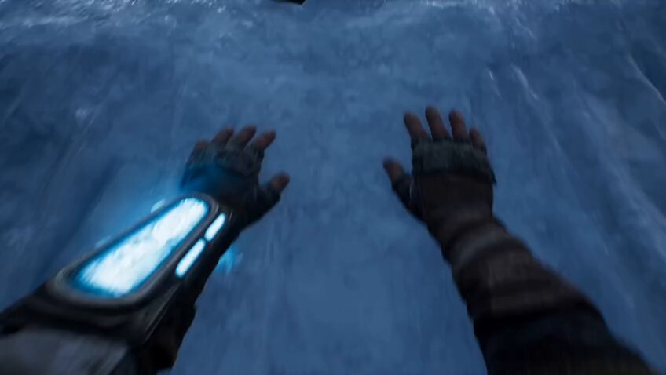

**พรอมต์**

```text
กำลังแปล
```

[↑ กลับสู่หมวดหมู่](#catalog)

---

<a name="prompt-2101516770255270041"></a>

### คำสั่งสร้างวิดีโอเกมเพลย์แอ็กชันผจญภัยโอเพนเวิลด์มุมมองบุคคลที่สามสไตล์สมจริง Unreal Engine 5 ครอบคลุมการสำรวจหมู่บ้านที่เสียหาย การแก้ปริศนาเครื่องกำเนิดไฟฟ้า การต่อสู้กับบอสใต้ดิน และการหลบหนีน้ำท่วมพร้อมอินเทอร์เฟซ HUD

ผู้เขียน：[@AIwithSynthia](https://x.com/AIwithSynthia) · [โพสต์ต้นฉบับ](https://x.com/AIwithSynthia/status/2101516770255270041)

การออกแบบแอป / เว็บ · การถ่ายภาพ · ตัวละคร · เผยแพร่แล้ว

**สรุป:** คำสั่งสร้างวิดีโอเกมเพลย์แอ็กชันผจญภัยโอเพนเวิลด์มุมมองบุคคลที่สามสไตล์สมจริง Unreal Engine 5 ครอบคลุมการสำรวจหมู่บ้านที่เสียหาย การแก้ปริศนาเครื่องกำเนิดไฟฟ้า การต่อสู้กับบอสใต้ดิน และการหลบหนีน้ำท่วมพร้อมอินเทอร์เฟซ HUD

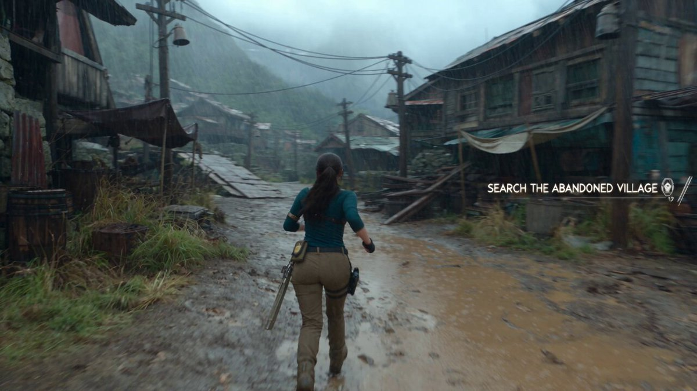

**พรอมต์**

```text
สร้างวิดีโอเกมเพลย์แนวแอ็กชันผจญภัยแบบโอเพนเวิลด์มุมมองบุคคลที่สามระดับ AAA ที่มีความสมจริงเสมือนภาพถ่าย ความยาว 30 วินาที อัตราส่วน 16 : 9 ให้ความรู้สึกเหมือนฟุตเทจที่เล่นได้จริงจาก Unreal Engine 5 ไม่ใช่ตัวอย่างภาพยนตร์
นักผจญภัยหญิงสาวชาวเกาหลี อายุราว 20 กลางๆ ใบหน้าเดิมตลอดเวลา รวบผมหางม้าสีเข้มต่ำ รูปร่างนักกีฬา สวมแจ็กเก็ตสีเขียวน้ำทะเลเข้ม เสื้อเชิ้ตสีดำ กางเกงคาร์โกสีน้ำตาล รองเท้าบูทสมบุกสมบัน ถุงมือ เป้สะพายหลัง เชือกปีนเขา และสร้อยข้อมือเข็มทิศโลหะตลอดทั้งคลิป
ใช้มุมกล้องบุคคลที่สามตามปกติที่ผู้เล่นควบคุมได้ โดยอยู่ด้านหลังและเหนือตัวเธอเล็กน้อย พร้อมการเคลื่อนไหวที่สมจริง ระบบฟิสิกส์ เงา วัสดุ แอนิเมชัน และการมีปฏิสัมพันธ์กับสภาพแวดล้อมที่สมจริง
เธอเดินเข้าไปในหมู่บ้านบนภูเขาที่ได้รับความเสียหายจากพายุ เต็มไปด้วยบ้านร้าง ถนนที่เป็นโคลน สะพานที่พัง ยานพาหนะ และสายไฟที่ห้อยระโยงระยาง HUD: “SEARCH THE ABANDONED VILLAGE.”
เธอออกสำรวจ กระโดดข้ามทางเดินที่พัง ปีนขึ้นไปบนหลังคา และไปถึงหอวิทยุเก่าในขณะที่ค่าความแข็งแกร่ง (Stamina) ลดลงอย่างเห็นได้ชัด HUD: “FIND A WAY TO THE RADIO TOWER.”
เธอพบห้องเครื่องกำเนิดไฟฟ้าที่ล็อกอยู่ ต่อสายเคเบิลที่หลุดออกใหม่ และคืนกระแสไฟฟ้า ซึ่งกระตุ้นกลไกโบราณใต้หมู่บ้าน HUD: “INVESTIGATE THE HIDDEN PASSAGE.”
เธอลงไปยังซากปรักหักพังใต้ดินขนาดมหึมาที่มีแท่นหมุน โซ่โลหะ และประตูบานยักษ์ที่ถูกปิดผนึก จากนั้นเปิดใช้งานกลไกเพื่อเปิดมัน
ผู้พิทักษ์หินและโลหะขนาดมหึมาตื่นขึ้น เธอชักดาบออกมาในขณะที่ HUD เปลี่ยนเป็น “DEFEAT THE RUIN GUARDIAN” พร้อมแถบพลังชีวิตของศัตรูและเครื่องหมายล็อกเป้า
ผู้พิทักษ์โจมตี → เธอหลบหลีก → เปิดใช้งานสร้อยข้อมือแม่เหล็ก → ดึงเกราะที่เสียหายออก → จุดอ่อนเรืองแสงปรากฏขึ้น → เธอฟันด้วยดาบ → พลังชีวิตของบอสลดลง
ผู้พิทักษ์ทำลายห้องโถง น้ำทะลักทะลุผ่านกำแพงเข้ามา และเธอหลบหนีข้ามแท่นที่กำลังพังทลาย กระโดดข้ามเศษซากปรักหักพัง และปีนขึ้นสู่ผิวดิน HUD: “ESCAPE THE FLOODED RUINS.”
เธอขึ้นมาถึงจุดชมวิวบนภูเขาเหนือหมู่บ้าน และมองเห็นป้อมปราการลอยฟ้าโบราณขนาดยักษ์ลอยอยู่ระหว่างภูเขาที่อยู่ห่างไกล HUD: “MISSION COMPLETE: ESCAPED THE RUINS” ตามด้วย “NEW OBJECTIVE: INVESTIGATE THE SKY FORTRESS.”
ภาพเกมเพลย์ระดับ UE5 ของเกาหลีที่สมจริงเสมือนภาพถ่าย ระบบฟิสิกส์ของการทำลายล้างและน้ำที่สมจริง HUD ใช้งานได้จริงแบบมินิมอล การเคลื่อนที่ของกล้องที่ควบคุมโดยผู้เล่นอย่างเป็นธรรมชาติ ความต่อเนื่องของตัวละครและอุปกรณ์อย่างเคร่งครัด ไม่มีลักษณะเหมือนตัวอย่างภาพยนตร์ ไม่มีกราฟิกแบบเกมมือถือ ไม่มีอนิเมะ ไม่มีการ์ตูน ไม่มีเลือดสยองขวัญ ไม่มีคำบรรยายใต้ภาพ ไม่มีโลโก้ ไม่มีลายน้ำ
```

[↑ กลับสู่หมวดหมู่](#catalog)

---

<a name="prompt-2101138386132386252"></a>

### โฆษณาสกินแคร์ที่สมจริงแบบภาพถ่ายความยาว 15 วินาที นำเสนอหญิงชาวเกาหลีในห้องสว่างและสง่างามกำลังทาสกินแคร์

ผู้เขียน：[@Aiwithmaha](https://x.com/Aiwithmaha) · [โพสต์ต้นฉบับ](https://x.com/Aiwithmaha/status/2101138386132386252)

การถ่ายภาพ · ตัวละคร · เผยแพร่แล้ว

**สรุป:** โฆษณาสกินแคร์ที่สมจริงแบบภาพถ่ายความยาว 15 วินาที นำเสนอหญิงชาวเกาหลีในห้องสว่างและสง่างามกำลังทาสกินแคร์


**พรอมต์**

```text
สร้างวิดีโอดูแลผิวที่สมจริงแบบภาพถ่ายความยาว 15 วินาที โดยมีหญิงสาวชาวเกาหลีในห้องสีขาวที่สว่างและสง่างาม เริ่มต้นด้วยภาพโคลสอัพขั้นสุดของใบหน้าที่เป็นธรรมชาติของเธอขณะที่เธอใช้ปลายนิ้วสัมผัสแก้มเบาๆ แสดงให้เห็นพื้นผิวผิวที่สมจริงและแสงธรรมชาติที่นุ่มนวล จากนั้นแสดงขวดสกินแคร์ใสวางอยู่บนโต๊ะหินอ่อนสีขาวขณะที่มือของเธอค่อยๆ เอื้อมไปหยิบ ต่อด้วยภาพเธอทาสกินแคร์ลงบนใบหน้าอย่างอ่อนโยนโดยใช้ทั้งสองมือ โดยรักษาลักษณะใบหน้าและรูปลักษณ์ของเธอให้สม่ำเสมอ แสดงภาพเธอหลับตาอย่างสงบพร้อมทั้งใช้ปลายนิ้วนวดเบาๆ ที่แก้มทั้งสองข้าง ปิดท้ายด้วยช็อตมุมกว้างขึ้นของเธอในชุดเดรสสีขาวเรียบง่ายยืนอยู่ข้างหน้าต่างบานใหญ่ ขณะที่ผ้าม่านสีขาวโปร่งแสงพลิ้วไหวอย่างเป็นธรรมชาติในแสงแดด ให้การเคลื่อนไหวราบรื่นและสมจริง มือดูเป็นธรรมชาติ ผิวสมจริง แสงสไตล์ภาพยนตร์ที่นุ่มนวล บรรยากาศหรูหราสะอาดตา การเคลื่อนไหวของกล้องที่นุ่มนวล และไม่มีการบิดเบี้ยวหรือรายละเอียดที่ดูประดิษฐ์ขึ้น
```

[↑ กลับสู่หมวดหมู่](#catalog)

---

<a name="prompt-2097837460910956650"></a>

### กำลังแปล

ผู้เขียน：[@john87445528](https://x.com/john87445528) · [โพสต์ต้นฉบับ](https://x.com/john87445528/status/2097837460910956650)

การถ่ายภาพ · ตัวละคร · ไอเทมแฟชั่น · เผยแพร่แล้ว

**สรุป:** กำลังแปล


**พรอมต์**

```text
กำลังแปล
```

[↑ กลับสู่หมวดหมู่](#catalog)

---

<a name="prompt-2096930655615758734"></a>

### พรอมต์วิดีโอ UGC ความสมจริงเป็นพิเศษความยาว 30 วินาที: หญิงสาวชาวเกาหลีถือกล้องถ่ายวล็อกประจำวันในห้องนอน แสดงกล้องตัวใหม่ที่เพิ่งซื้อมาพร้อมบทสนทนาที่เป็นธรรมชาติ

ผู้เขียน：[@AIwithkhan](https://x.com/AIwithkhan) · [โพสต์ต้นฉบับ](https://x.com/AIwithkhan/status/2096930655615758734)

การถ่ายภาพ · ตัวละคร · เผยแพร่แล้ว

**สรุป:** พรอมต์วิดีโอ UGC ความสมจริงเป็นพิเศษความยาว 30 วินาที: หญิงสาวชาวเกาหลีถือกล้องถ่ายวล็อกประจำวันในห้องนอน แสดงกล้องตัวใหม่ที่เพิ่งซื้อมาพร้อมบทสนทนาที่เป็นธรรมชาติ


**พรอมต์**

```text
สร้างวิดีโอ UGC ความยาว 30 วินาที ความละเอียด 1080p ที่สมจริงเป็นพิเศษของหญิงสาวชาวเกาหลีในห้องนอนของเธอเอง กำลังพูดคุยกับกล้องอย่างเป็นกันเองเกี่ยวกับกล้องตัวใหม่ที่เธอเพิ่งซื้อมา
ตัวละครหลัก
หญิงสาวชาวเกาหลีอายุประมาณ 20 ต้นๆ สวยอย่างเป็นธรรมชาติ ผิวสัมผัสสมจริง แต่งหน้าบางๆ ผมหยื่นลอนสีดำมัดเป็นหางม้าข้างแบบหลวมๆ ยุ่งๆ พร้อมปอยผมหลุดลุ่ยรอบใบหน้า สวมเสื้อท็อปพอดีตัวสีฟ้าพาสเทล กางเกงทรงหลวมสไตล์ชุดนอนสีครีม และสร้อยคอเงินเรียบง่ายเส้นหนึ่ง
รักษาเอกลักษณ์บนใบหน้า ทรงผม ชุด สัดส่วนร่างกาย และรูปลักษณ์โดยรวมของเธอให้เหมือนเดิมอย่างสม่ำเสมอตลอดทั้งวิดีโอ
ฉากหลัง
ห้องนอนอันแสนอบอุ่นของเธอเองในอพาร์ตเมนต์ธรรมดาในเกาหลีในเช้าวันจันทร์ที่อบอุ่น เธอนั่งอย่างสบายๆ บนเตียงที่มีชุดเครื่องนอนสีขาวที่ยับย่นเล็กน้อย มีหมอนอยู่ข้างหลัง โต๊ะข้างเตียงขนาดเล็ก ของใช้ส่วนตัวในชีวิตประจำวันเล็กน้อย และแสงแดดธรรมชาติอันนุ่มนวลส่องเข้ามาทางหน้าต่าง
ห้องควรให้ความรู้สึกเหมือนมีคนอาศัยอยู่จริงและเป็นของแท้ ไม่ได้จัดฉากหรือหรูหรา
สไตล์ UGC
เธอถือกล้องด้วยตัวเองหรือวางพิงไว้บนเตียงข้างหน้าเธออย่างเป็นกันเอง การจัดเฟรมมีความไม่สมบูรณ์เล็กน้อย มีการเคลื่อนไหวของการถือกล้องด้วยมืออย่างเป็นธรรมชาติ การปรับออโต้โฟกัสเล็กน้อย และการเปลี่ยนแปลงการเปิดรับแสงเป็นครั้งคราว
วิดีโอควรให้ความรู้สึกเหมือนวล็อกส่วนตัวจริงๆ ที่บันทึกไว้สำหรับผู้ติดตามของเธอ ไม่ใช่โฆษณาที่ขัดเกลามาอย่างดี
การกระทำ / บทสนทนา
เธอนั่งขัดสมาธิบนเตียง มองเข้าไปในเลนส์แล้วยิ้ม
เธอพูดอย่างเป็นธรรมชาติว่า:
“Okay, I finally got this camera I’ve been talking about.”
เธอหัวเราะเบาๆ และหยิบกล้องขึ้นมาแสดงให้ดูครู่หนึ่ง
“I’ve only had it for like two days, but I already bring it everywhere.”
เธอวางมันลงแล้วเอนพิงหมอน
“I wanted something that feels a little more personal than just using my phone.”
เธอมองไปรอบๆ ห้อง แล้วหันกลับมามองที่เลนส์
“The footage has this old-school look that I really love. It kind of feels like I’m recording memories instead of just posting videos.”
เธอยิ้มและทัดปอยผมที่หลุดลุ่ยไว้หลังหู
ใกล้จบ เธอมองดูนาฬิกา หัวเราะแล้วพูดว่า:
“Anyway, it’s Monday, I should probably get out of bed.”
เธอยื่นมือไปที่กล้องเหมือนจะกดหยุดบันทึก ยิ้มอย่างเป็นธรรมชาติ และวิดีโอตัดจบระหว่างการเคลื่อนไหวนั้น
มุมกล้อง / รูปลักษณ์ทางภาพ
UGC ของแท้ที่ได้รับแรงบันดาลใจจากกล้อง DV ยุคต้นทศวรรษ 2000 อย่างละเอียดอ่อน: รายละเอียดดิจิทัลที่นุ่มนวล นอยส์ของภาพเล็กน้อย การพยายามหาโฟกัสของออโต้โฟกัสเล็กน้อย ผิวสัมผัสที่เป็นธรรมชาติ และแสงยามเช้าที่อบอุ่น ไม่มีการจัดแสงแบบดราม่าหรือการเคลื่อนไหวของกล้องแบบภาพยนตร์
เสียง
เฉพาะเสียงบรรยากาศธรรมชาติในห้องนอน เสียงของเธอ การเคลื่อนไหวของเนื้อผ้าเล็กน้อย เสียงละแวกบ้านในระยะไกล และเสียงการจับกล้องเล็กน้อย ไม่มีดนตรีประกอบ ไม่มีการบรรยายเสียง
ความรู้สึกสุดท้าย
เนื้อหาของผู้สร้างไลฟ์สไตล์ชาวเกาหลีที่ผ่อนคลาย อบอุ่น มีความเป็นผู้หญิง เป็นกันเอง และน่าเชื่อถือ เหมือนวล็อกเช้าวันจันทร์สบายๆ ที่ถ่ายในห้องของเธอเอง
สิ่งที่ห้ามมี (NEGATIVE)
ไม่มีการแสดงแบบโฆษณา ไม่มีการจัดแสงในสตูดิโอที่สมบูรณ์แบบ ไม่มีการโพสท่าแบบอินฟลูเอนเซอร์ที่จัดฉาก การระบุตัวตนต้องไม่เปลี่ยนไป ไม่เปลี่ยนชุด ไม่มีมือบิดเบี้ยว ไม่มีนิ้วเกิน ไม่มีคำบรรยาย โลโก้ ลายน้ำ หรือสิ่งแปลกปลอมจาก AI
```

[↑ กลับสู่หมวดหมู่](#catalog)

---

<a name="prompt-2096931238460178592"></a>

### สร้างโฮมวิดีโอแบบ DV ยุคต้นทศวรรษ 2000 ความยาว 30 วินาที ความละเอียด 1080p อัตราส่วน 16:9 ที่สมจริงขั้นสุด ของหญิงสาวชาวเกาหลีที่กำลังสัมผัสกับช่วงเย็นฤดูร้อนธรรมดา ๆ แต่น่าจดจำในย่านเก่าแก่ของกรุงโซล พร้อมการกระทำตามลำดับเวลาอย่างละเอียด ความบกพร่องของกล้องแบบถือ และเสียงบรรยากาศรอบตัว

ผู้เขียน：[@SimplyAnnisa](https://x.com/SimplyAnnisa) · [โพสต์ต้นฉบับ](https://x.com/SimplyAnnisa/status/2096931238460178592)

การถ่ายภาพ · ตัวละคร · เผยแพร่แล้ว

**สรุป:** สร้างโฮมวิดีโอแบบ DV ยุคต้นทศวรรษ 2000 ความยาว 30 วินาที ความละเอียด 1080p อัตราส่วน 16:9 ที่สมจริงขั้นสุด ของหญิงสาวชาวเกาหลีที่กำลังสัมผัสกับช่วงเย็นฤดูร้อนธรรมดา ๆ แต่น่าจดจำในย่านเก่าแก่ของกรุงโซล พร้อมการกระทำตามลำดับเวลาอย่างละเอียด ความบกพร่องของกล้องแบบถือ และเสียงบรรยากาศรอบตัว


**พรอมต์**

```text
สร้างโฮมวิดีโอแบบ DV ยุคต้นทศวรรษ 2000 ความยาว 30 วินาที ความละเอียด 1080p อัตราส่วน 16:9 ที่สมจริงขั้นสุด ของหญิงสาวชาวเกาหลีที่กำลังใช้อยู่ในช่วงเย็นฤดูร้อนธรรมดา ๆ แต่น่าจดจำอย่างไม่คาดคิดในย่านที่อยู่อาศัยเก่าแก่ของกรุงโซล

หญิงสาวชาวเกาหลีที่ดูน่ารักเป็นธรรมชาติในวัย 20 ต้น ๆ ผิวพรรณสมจริง แต่งหน้าบางเบา ผมยาวสีดำหยักศกเล็กน้อย เสื้อไหมพรมแขนสั้นสีฟ้าอ่อน กางเกงขายาวทรงหลวมสีครีม รองเท้าผ้าใบสีขาว กระเป๋าสะพายข้างสีน้ำตาล และนาฬิกาสีเงิน รักษาอัตลักษณ์ ใบหน้า เสื้อผ้า ทรงผม และสัดส่วนของเธอให้สอดคล้องกันอย่างสมบูรณ์แบบ

ฉากหลัง

ถนนในย่านที่พักอาศัยเก่าแก่ที่เงียบสงบของกรุงโซล ประกอบด้วยตรอกคอนกรีต อาคารอพาร์ตเมนต์ ไม้กระถาง จักรยาน เสาไฟฟ้า ต้นไม้ใบดกเขียวชอุ่ม และร้านสะดวกซื้อเล็ก ๆ ในละแวกบ้าน มีร่องรอยการอยู่อาศัยจริงและดูเป็นธรรมชาติ ไม่มีแบรนด์ โลโก้ โฆษณา หรือสถานที่ท่องเที่ยว

สไตล์กล้อง

ฟุตเทจดิบจากกล้องวิดีโอ DV ราคาประหยัดยุคต้นทศวรรษ 2000: การเคลื่อนไหวแบบถือถ่ายที่สั่นไหว การจัดเฟรมที่ไม่สมบูรณ์ การโฟกัสอัตโนมัติที่วูบวาบ การเปลี่ยนระดับแสง สีซีดจาง รายละเอียดนุ่มนวล สัญญาณรบกวนเทปเล็กน้อย การซูมโดยไม่ตั้งใจ และความผิดพลาดของกล้องที่เป็นธรรมชาติ ไม่มีการกันสั่นหรือการถ่ายทำแบบภาพยนตร์

00:00–00:06 — ความลึกลับ

เธอเดินไปตามถนนพร้อมกับถือถุงพลาสติกใบเล็ก ทันใดนั้นเธอก็ได้ยินเสียงกรุ๊งกริ๊งเบา ๆ ดังมาจากข้างหลัง

เธอหยุดเดินแล้วมองไปรอบ ๆ

กล้องซูมเข้าหาใบหน้าที่ดูงุนงงของเธออย่างรวดเร็ว

เธอพูดว่า:

“Did you hear that?”

00:06–00:12 — การค้นพบเล็ก ๆ

เธอเดินตามเสียงไปและพบกับรถจักรยานคันเก่าเล็ก ๆ ที่มีกระดิ่งจิ๋วค้างเปิดอยู่เล็กน้อย

เธอเคาะกระดิ่งเบา ๆ

กริ๊ง

เธอมองมาที่กล้องแล้วหัวเราะ

จากนั้นเธอสังเกตเห็นป้ายกระดาษแผ่นเล็กที่มีลายมือเขียนห้อยอยู่จากจักรยาน แต่ลายมือเลือนรางเกินกว่าจะอ่านออก

00:12–00:18 — ลมพัด

ลมกระโชกแรงพัดใบไม้แห้งหลายใบข้ามถนนกะทันหัน

ใบหนึ่งร่วงลงมาบนศีรษะของเธอพอดี

เธอไม่ทันสังเกต

คนถือกล้องหัวเราะ

เธอทำหน้างง แล้วก็รู้ตัวจึงหยิบใบไม้ออก

เธอจ้องมองกล้องด้วยความเขินอาย

00:18–00:24 — ความท้าทายเล็ก ๆ

เธอวางใบไม้ลงบนอานจักรยานและพยายามรักษาสมดุลให้อยู่ตรงนั้น

ลมพัดมันปลิวหายไปทันที

เธอลองใหม่อีกครั้ง

มันร่วงลงมาอีก

เธอหัวเราะและยอมแพ้ในที่สุด

00:24–00:30 — ความทรงจำ

เธอเก็บใบไม้ขึ้นมา ใส่ลงในถุงเล็ก ๆ ของเธอ และเริ่มเดินกลับบ้าน

หลังจากก้าวไปไม่กี่ก้าว เธอหันกลับมาที่กล้องแล้วพูดว่า:

“Okay, that was pointless.”

เธอยิ้มและเดินต่อไป

กล้องเคลื่อนตามเธอไปสองสามวินาทีก่อนจะตัดเป็นสีดำอย่างกะทันหัน

เสียง

เสียงธรรมชาติจากสถานที่จริงเท่านั้น: เสียงฝีเท้า การจราจรไกล ๆ กระดิ่งจักรยาน แมลงฤดูร้อน ใบไม้ ลม บรรยากาศแวดล้อมในละแวกบ้าน และเสียงหัวเราะอย่างเป็นธรรมชาติ

ไม่มีดนตรี ไม่มีเสียงบรรยาย ไม่มีคำบรรยายใต้ภาพ ไม่มีแคปชัน ไม่มีโลโก้ ไม่มีลายน้ำ หรือข้อความบนหน้าจอ

ความสมจริง

ปฏิกิริยาของมนุษย์ที่เป็นธรรมชาติ จังหวะเวลาที่ไม่สมบูรณ์ ฟิสิกส์ที่สมจริง วัตถุที่สม่ำเสมอ รายละเอียดย่านที่อยู่อาศัยของเกาหลีที่แท้จริง และความไม่สมบูรณ์ของกล้อง DV ที่น่าเชื่อถือ ไม่มีภาพลักษณ์แบบ CGI มือบิดเบี้ยว นิ้วเกิน คนซ้ำซ้อน การเปลี่ยนตัวบุคคล หรือการเปลี่ยนชุดเสื้อผ้า

อัตราส่วนภาพ 16:9
```

[↑ กลับสู่หมวดหมู่](#catalog)

---

<a name="prompt-2097181982924984513"></a>

### หญิงชาวอินโดนีเซียแท้ ๆ ในสไตล์โฮมวิดีโอกล้อง DV แคมคอร์เดอร์ต้นยุค 2000 พร้อมระบุช่วงเวลาตามลำดับเหตุการณ์อย่างละเอียดในย่านที่เงียบสงบ

ผู้เขียน：[@QAiStudio](https://x.com/QAiStudio) · [โพสต์ต้นฉบับ](https://x.com/QAiStudio/status/2097181982924984513)

การถ่ายภาพ · ตัวละคร · เผยแพร่แล้ว

**สรุป:** หญิงชาวอินโดนีเซียแท้ ๆ ในสไตล์โฮมวิดีโอกล้อง DV แคมคอร์เดอร์ต้นยุค 2000 พร้อมระบุช่วงเวลาตามลำดับเหตุการณ์อย่างละเอียดในย่านที่เงียบสงบ


**พรอมต์**

```text
หญิงชาวอินโดนีเซียแท้ ๆ สไตล์โฮมวิดีโออินโดนีเซียต้นยุค 2000 รักษาใบหน้า อัตลักษณ์ ทรงผม ลักษณะใบหน้า โทนสีผิว สัดส่วนร่างกาย ขนรักแร้ตามธรรมชาติ เสื้อครอปแขนกุดสีเขียวมะกอกซีด กางเกงยีนส์เอวสูงทรงหลวมสีฟ้าอ่อน รองเท้าผ้าใบแคนวาสสีดำ สร้อยคอเชือกสีดำ ผมลอนคลื่นสีดำ หน้าม้าปัดข้าง และผมหางม้ามัดแบบยุ่ง ๆ ของเธอไว้อย่างแม่นยำ

ย่านที่พักอาศัยธรรมดาที่เงียบสงบในอินโดนีเซีย: ซอยคอนกรีตแคบ ๆ บ้านชั้นเดียวเรียบง่าย ระเบียงเล็ก ๆ กำแพงเตี้ย ไม้กระถาง มอเตอร์ไซค์จอดอยู่ ต้นไม้ใหญ่ สายไฟระโยงระยางพันกันด้านบน ไม่มีร้านค้าหรือกิจกรรมเชิงพาณิชย์

00:00–00:03: เธอนั่งอยู่บนพื้นระเบียง ขีดเขียนเล่นในสมุดบันทึก กล้องมือถือลอยอยู่ด้านบน/ด้านข้าง
00:03–00:07: เธอเอาปากกาเคาะคาง ยิ้มจาง ๆ แล้ววาดรูปต่อ กล้องเคลื่อนส่ายไปมาระหว่างใบหน้าและมือของเธอ
00:07–00:10: เธอนอนบนเสื่อมองดูมดคลานไปตามคอนกรีต
00:10–00:13: เธอแหย่นิ้วเบา ๆ ใกล้ ๆ มดแล้วหัวเราะเบา ๆ
00:13–00:17: เธอเดินไปที่กำแพงเตี้ย กระโดดขึ้นไปนั่ง และแกว่งขา
00:17–00:20: เธอหยิบมันฝรั่งทอดกินอย่างสบายอารมณ์ขณะมองดูถนนที่เงียบสงบ
00:20–00:24: เธอนั่งบนบันไดพร้อมผ้าขนหนูคล้องไหล่ ผมเปียกชื้น และค่อย ๆ หวีผม
00:24–00:27: ช็อตโคลสอัปแบบถือกล้องถ่ายด้วยมือขณะที่เธอกำลังหวีผมเปียก มองเห็นหยดน้ำ
00:27–00:30: เธอหวีเสร็จแล้วสะบัดผมเปียกชื้นไปข้างหลัง มองมาทางกล้อง และยิ้มอย่างเป็นธรรมชาติ ตัดเข้าสู่ความมืดกะทันหัน

ความสมจริงแบบกล้องวิดีโอแฮนดีแคม DV ดิบ ๆ ขั้นสุด: การเคลื่อนไหวหนักหน่วง การสั่นไหวเล็กน้อย การจัดเฟรมโดยไม่ตั้งใจ องค์ประกอบภาพเบี้ยวไม่อยู่ตรงกลาง การครอปตัดใบหน้าเป็นบางครั้ง โฟกัสอัตโนมัติที่วูบวาบหาจุดโฟกัส แสงแกว่ง เบลอจากการเคลื่อนไหว โรลลิงชัตเตอร์ สีซีด/ลดความอิ่มตัว สัญญาณรบกวนดิจิทัลและรอยการบีบอัดไฟล์ ไม่มีการโพสท่า ไม่มีการกันสั่น ไม่มีลุคแบบภาพยนตร์ ไม่มีการแต่งสไตล์โฆษณาแฟชั่น ไม่มีการเกรดสีสมัยใหม่ หรือไม่มีดนตรีประกอบ มีเพียงเสียงบรรยากาศยามเช้าตามธรรมชาติ: เสียงนก สายลม มอเตอร์ไซค์ในระยะไกล เสียงพูดคุยของคนในละแวกบ้าน เสียงขูดขีดของกระดาษ ซองมันฝรั่งทอด ใบไม้ หวี 16:9
```

[↑ กลับสู่หมวดหมู่](#catalog)

---

<a name="prompt-2097185861259727263"></a>

### พรอมต์ภาพเสมือนจริงสำหรับวิดีโอบล็อกท่องเที่ยวริมทะเลเกาหลีความยาว 30 วินาที บันทึกการเดินทางในยามเย็นตั้งแต่ตลาดปลาช่วงพระอาทิตย์ตกดินและการเดินเล่นริมชายหาดไปจนถึงกำแพงกันคลื่นในเวลาเที่ยงคืน

ผู้เขียน：[@nawalsehar](https://x.com/nawalsehar) · [โพสต์ต้นฉบับ](https://x.com/nawalsehar/status/2097185861259727263)

การถ่ายภาพ · ทิวทัศน์ / ธรรมชาติ · เผยแพร่แล้ว

**สรุป:** พรอมต์ภาพเสมือนจริงสำหรับวิดีโอบล็อกท่องเที่ยวริมทะเลเกาหลีความยาว 30 วินาที บันทึกการเดินทางในยามเย็นตั้งแต่ตลาดปลาช่วงพระอาทิตย์ตกดินและการเดินเล่นริมชายหาดไปจนถึงกำแพงกันคลื่นในเวลาเที่ยงคืน


**พรอมต์**

```text
สร้างวิดีโอบล็อกท่องเที่ยวริมทะเลเกาหลีแบบไลฟ์แอ็กชันสมจริงความยาว 30 วินาที ติดตามหญิงสาวชาวเกาหลีในช่วงเย็นวันหนึ่งในหมู่บ้านชายฝั่งอันเงียบสงบ เริ่มต้นที่ตลาดอาหารทะเลอันมีชีวิตชีวาที่มีอาหารทะเลสด พื้นเปียกแฉะ และแสงอาทิตย์อัสดง เธอเช็กอินเข้าเกสต์เฮาส์แบบดั้งเดิมที่อบอุ่น จากนั้นเดินเท้าเปล่าไปตามชายหาดขณะที่เกลียวคลื่นซัดมาถึงเท้าของเธอในช่วงเวลาแสงสีทอง เปลี่ยนฉากเข้าสู่ตลาดอาหารทะเลในยามค่ำคืนที่อบอุ่น ซึ่งเธอเพลิดเพลินกับอาหารทะเลเผาสดใหม่และมีปฏิสัมพันธ์กับสภาพแวดล้อมอย่างเป็นธรรมชาติ จบลงในเวลาเที่ยงคืนข้างกำแพงกันคลื่นที่เงียบสงบ มองออกไปเห็นมหาสมุทรอันมืดมิดพร้อมแสงไฟจากเรือประมงในระยะไกลและคลื่นที่ซัดสาดอยู่ด้านล่าง สไตล์วิดีโอบล็อกด้วยสมาร์ตโฟน/กล้องถ่ายภาพยนตร์ปี 2026 อย่างแท้จริง สภาพแวดล้อมเกาหลีที่เป็นธรรมชาติ ผิว เส้นผม เสื้อผ้า น้ำ อาหาร ควัน คลื่น และการเคลื่อนไหวของมนุษย์ที่สมจริง กล้องถือถ่าย การโฟกัสอัตโนมัติที่เป็นธรรมชาติ การเปลี่ยนแปลงการรับแสง และโมชันเบลอที่สมจริง มีบทสนทนาภาษาอังกฤษเท่านั้น เสียงสภาพแวดล้อมตามธรรมชาติ ไม่มีดนตรีประกอบหรือเสียงบรรยาย เน้นย้ำเป็นพิเศษในเรื่องฟิสิกส์ที่สมจริง แสงสว่าง การเคลื่อนไหวที่ลื่นไหล และการแสดงออกที่เป็นธรรมชาติ ไม่ใช้ CGI แอนิเมชัน คำบรรยาย โลโก้ หรือลายน้ำ
```

[↑ กลับสู่หมวดหมู่](#catalog)

---

<a name="prompt-2097186378861953475"></a>

### สร้างวิดีโอบล็อกท่องเที่ยวเมืองบนภูเขาของญี่ปุ่นความยาว 30 วินาทีที่สมจริงดุจภาพถ่าย ติดตามหญิงสาวที่สำรวจหมู่บ้านอันเงียบสงบหลังจากตกรถประจำทาง โดดเด่นด้วยแสงธรรมชาติและสไตล์กล้องถือด้วยมือ

ผู้เขียน：[@aiwithaly](https://x.com/aiwithaly) · [โพสต์ต้นฉบับ](https://x.com/aiwithaly/status/2097186378861953475)

การถ่ายภาพ · ตัวละคร · ทิวทัศน์ / ธรรมชาติ · เผยแพร่แล้ว

**สรุป:** สร้างวิดีโอบล็อกท่องเที่ยวเมืองบนภูเขาของญี่ปุ่นความยาว 30 วินาทีที่สมจริงดุจภาพถ่าย ติดตามหญิงสาวที่สำรวจหมู่บ้านอันเงียบสงบหลังจากตกรถประจำทาง โดดเด่นด้วยแสงธรรมชาติและสไตล์กล้องถือด้วยมือ


**พรอมต์**

```text
สร้างวิดีโอบล็อกท่องเที่ยวเมืองบนภูเขาของญี่ปุ่นความยาว 30 วินาทีที่สมจริงดุจภาพถ่าย ติดตามหญิงสาวชาวญี่ปุ่นคนหนึ่งที่ตกรถประจำทางและใช้เวลา 25 นาทีในการเดินสำรวจเมืองอันเงียบสงบ แสดงภาพเธอวิ่งตามรถประจำทางที่เพิ่งออกไป → ตรวจดูตารางเวลาเดินรถ → เดินผ่านถนนอันเงียบสงบและข้ามสะพานสีแดง → ค้นพบร้านน้ำชาแบบดั้งเดิม → เพลิดเพลินกับชาเขียวอุ่นๆ → ชมวิวภูเขาในช่วงเวลาแสงสีทอง (golden-hour) → ได้ยินเสียงรถประจำทางคันต่อไปมาถึงและเดินกลับไปยังป้ายรถ

ฟุตเทจการเดินทางที่สมจริงสไตล์ปี 2026 ทิวทัศน์ธรรมชาติของญี่ปุ่น การเดินและการเคลื่อนไหวของมนุษย์ที่สมจริง เส้นผมและเสื้อผ้าที่พลิ้วไหวตามแรงลม ลำธารที่ไหลเอื่อย ชาร้อนมีควันกรุ่น ฟิสิกส์การเคลื่อนที่ของรถประจำทางที่สมจริงและแสงช่วง golden-hour รูปแบบกล้องสมาร์ตโฟน/กล้องถ่ายภาพยนตร์แบบถือด้วยมือพร้อมระบบโฟกัสอัตโนมัติ การปรับระดับแสงที่ดูเป็นธรรมชาติ และโมชันเบลอเล็กน้อย มีบทสนทนาภาษาอังกฤษเท่านั้น เสียงบรรยากาศหมู่บ้านที่สมจริงและไม่มีดนตรีประกอบ ไม่มี CGI, แอนิเมชัน, เอฟเฟกต์แบบม้วนเทป VHS, คำบรรยาย, โลโก้ หรือลายน้ำ
```

[↑ กลับสู่หมวดหมู่](#catalog)

---

<a name="prompt-2097097582262825180"></a>

### 15秒第一人称视角的台球厅暧昧喜剧视频提示词，包含详细的分镜时间线、人物互动、运镜方式、台球局轨迹及音频与负面约束。

ผู้เขียน：[@john87445528](https://x.com/john87445528) · [โพสต์ต้นฉบับ](https://x.com/john87445528/status/2097097582262825180)

คอมิก / สตอรี่บอร์ด · การถ่ายภาพ · ตัวละคร · เผยแพร่แล้ว

**สรุป:** 15秒第一人称视角的台球厅暧昧喜剧视频提示词，包含详细的分镜时间线、人物互动、运镜方式、台球局轨迹及音频与负面约束。


**พรอมต์**

```text
｜15秒｜男主第一人称｜海妖风暧昧喜剧 【剧情锁定】 成年女主角#1发现男主准备击球，故意走进他的视野，主动侧坐上台球桌，屈起一条腿，让预定#2服装原有剪裁自然呈现大腿线条，以海妖风眼神和姿态干扰瞄准。男主停杆、抬头，她以为自己的小心思奏效；男主却不耐烦地倒转球杆，用橡胶粗端隔着衣服轻顶她臀侧一下，催她下桌。她被识破后调皮又无奈地让开，男主立即继续击球，母球撞中目标球，目标球落袋。 必须完整呈现“她先站着—主动上桌—故意展示腿部线条并观察他的反应”。她明知会干扰打球，仍主动试探；不能开场便让她已经坐好，也不能演成偶然挡路。 【人物与服装】 画面中唯一可见的人物是成年女主角#1
，面孔、发型、体型保持一致。#1完整穿着预定#2
屏幕截图_31-8-2026_22160_jimeng.jianying.com
服装，带着装饰眼镜
包括既定丝袜
和配饰；#2仅是服装编号，绝不生成第二个人物。腿部呈现服从#2本身的长度、开口和袜装，不能为了露腿改变剪裁、消除袜子或凭空缩短衣服。 成年男主只提供第一人称视点、唯一一支球杆和一句画外对白。脸、身体、手臂、双手、影子、倒影均不入画。全片不出现其他人或人物复制。 【影像与拍摄关系】 9:16竖屏，1080×1920，30fps，约26—28mm等效视角。男主佩戴贴近眼线的轻型头戴相机，保留未经处理的手机视频观感。低头看球、抬头看人、直起身体均带动真实镜头运动。男主无需手持摄影设备，可以正常操杆；握杆手和架杆手始终位于取景下缘之外。 全程连续第一人称，不切到男主正面、第三人称或外部全景。轻微呼吸起伏、头部晃动和不完美重新构图；从白球转看#1时，对焦允许短暂迟疑。冷白顶灯照明，肤色和衣料保留纹理，暗部带少量手机噪点；快速调杆有适量运动模糊，但不能糊掉端头交换。无美颜、磨皮、电影调色和稳定器运镜。 构图以能读懂人物动作为先：上桌时保留她扶库边的手、坐下的位置和两腿变化；试探时让脸与腿部线条同时在画面内；赶人时让表情和球杆粗端同时可见；最后回到白球、红球、中袋的完整路线。镜头不长时间追着某一处身体，也不能为了看脸把上桌和调杆动作裁掉。 【台球厅环境】 普通室内台球厅，绿色台呢、红棕色木质库边、黑色桌体、银色边框和白色网兜球袋。背景为深灰与棕色竖向墙板、浅色百叶窗、深绿色等候椅，顶灯将桌面照得比背景明亮。远处可见另一张无人使用的球桌，环境朴素、有实际使用痕迹，整体空间和光线全程不变。 没有酒吧灯光、粉色爱心、霓虹装饰、豪华软包或摄影棚布景。镜头范围内不出现其他顾客、工作人员、人像海报或镜面反射。 【空间与球局】 男主位于近侧长库边中央，#1开始站在对面长库边、画面右侧。两人隔着约1.3米的桌宽相对，不能改成隔着整张球桌的长度。对面中袋位于画面上方中央，始终是明确的落袋目标。 桌上起始共有四颗球：一颗白色母球、一颗红色实心目标球、一颗蓝球、一颗黄球。白球位于近半台中央；红球在对面中袋前约25厘米，白球、红球、中袋形成容易看清的直线。蓝球与黄球分别停在左右远离球路的位置，全程静止。 #1坐在对面中袋右侧的库边，身体斜向镜头；一条屈腿轻放在台面右侧边缘，另一条腿垂在桌外。她的腿部和上身进入男主瞄准视野，但不踩球、不压球、不把腿跨在两球之间。她必须下桌后男主才击球。 她坐下前，白球到红球、红球到中袋的路线已在开场建立；她坐下后，屈腿位于这条路线右侧，进入视野并分散注意，但实际球路没有被身体堵死。她收腿下桌的过程中不得碰动任何球。球位从开头直到出杆保持不变，观众能用同一组位置看懂男主始终想打哪一球。 【海妖风与结尾表情】 坐姿呈自然S曲线：身体微侧，肩部下沉，颈部拉长，下巴轻轻侧抬，腰胯略向一侧移。屈腿与垂腿前后错位，大腿线条在人物整体中自然可见；左手撑库边，右手只整理一次发丝。半垂眼冷感直视男主，嘴角仅有很淡的试探笑意。 前半段冷艳、克制、有距离感；后半段按剧情允许出现调皮、无奈的微笑。她被识破后不惊恐、不生气，也不狼狈尖叫，而是嘴角先停半拍，随后侧眼抿笑、小幅摇头，像在用表情说“行吧，你就知道打球”。这句话不实际说出，不加字幕。 暧昧必须通过相互观察表现：她每次调整坐姿后都会瞥一眼杆头，看到杆头停住才露出得意；男主的镜头则反复从她回到红球，留下他其实更在乎球局的线索。前半段的腿部展示、后半段的调皮笑都属于成年人的轻松玩笑，保持自然、从容，不用夸张表情代替剧情。 【球杆连续性】 唯一一支约145厘米的台球杆：浅木色细杆、细小蓝色皮头、深色粗握柄、尾部黑色橡胶保护帽。细头用于击球，橡胶粗端用于一次轻微赶人动作。 调头是端对端转过180度。必须连续看见：细头离开白球并撤回；同一杆身斜向扫过镜头前方；细头转向侧下方，粗握柄和黑色尾帽从另一侧绕出；最终黑色粗端指向#1。握持点可以藏在下缘，杆身不能整根退出后突然换成另一端，也不能只沿长轴自转。 翻杆时杆身经过人物前方，必须与她保持明显的前后距离，不扫到头发、面部或肩膀。橡胶尾帽靠近臀侧后仅短暂接触一次，随即离开；接下来由#1自己撑住库边、收腿、滑下。她的身体运动、衣料变化与接触顺序同步，不能先下桌再补拍顶人的动作。 【严格时间分镜】 → 0—3秒，第一人称俯看球桌。白球、红球、中袋与左右静止的蓝黄两球同时建立，细杆头正在白球后方试瞄。 原本站在对面长库边右侧的#1先看一眼球杆方向，再看向镜头。她主动扶住库边，侧身坐上去，屈起一条腿放到台面边缘，另一条腿垂在桌外。坐下、抬腿和衣料自然形成褶皱的过程连续可见，#2原有剪裁呈现大腿线条。镜头随男主抬头，从球路转向她的完整坐姿。 → 3—5.5秒，保持#1面部、上身和腿部同框的中景。她肩部放松下沉、颈部拉长，身体形成S曲线，指尖整理发丝，半垂眼看着镜头，随后把视线短暂移向球杆，确认男主是否停下。 球杆停止试瞄。镜头略低头看球，又抬回她脸上。#1看见这个反应，嘴角慢慢浮起一丝笃定笑意，屈起的膝盖略向侧面调整，使大腿线条更完整。动作明显带有故意干扰的试探，但不拉扯衣摆。 → 5.5—7秒，球杆再次靠近白球，却仍未击打。男主短促呼气，镜头随他直起身体升高，发出略带火气、不耐烦的成年男声：“让开，让开。” #1没有立刻移动，只轻轻侧头，半垂眼望着他，嘴角还保留着以为自己成功的笑意。 → 7—8.5秒，完整展示调转球杆。浅木色细头先从白球后方撤回，同一杆身斜贯画面前景，细头沿侧下方转走；深色粗柄与黑色橡胶尾帽从另一侧转到正前方，完成端对端半圈翻转。 相机有轻微头部晃动，但始终让杆身的一部分留在画面中。最终画面下方清楚出现朝向#1的黑色橡胶粗端，细头已经朝向男主一侧。 → 8.5—10秒，男主将粗端越过桌面，隔着完整#2服装，在#1靠台面一侧的臀部外侧短促轻顶一下，随即撤开。人物中景同时交代她的脸、姿态、库边和接触动作，不切局部特写。 #1低头看一眼黑色杆尾，嘴角原来的笃定笑意停住半拍。她明白男主完全没有配合自己的试探，主动双手撑库边，把屈起的腿收出台面，顺势向桌外滑下。动作由她自身支撑完成，不被顶飞，也不跌倒。 → 10—11秒，#1双脚落地后向画面右侧让开半步，鞋底落地声清楚。她侧眼看向男主，抿住忍不住扬起的嘴角，轻轻摇一次头，带一点“被你看穿了”的调皮无奈。 她身体重新微侧，颈线拉长，维持冷艳基调；不是慌张、恼怒、委屈或被羞辱的表情。 → 11—12秒，球杆粗端收回，按先前相反的路径端对端调转：黑色尾帽转向下缘，浅木色杆身和蓝色细皮头重新指向白球。镜头随男主低头回到球路，细头停在白球后方，#1已经完全让出观察方向。 → 12—14秒，男主平稳出杆一次，细皮头实际接触白球，发出清楚的“嗒”。白球先滚动，再撞上红球；红球沿直线滚向对面中袋，越过袋沿并落进白色网兜，发出真实的落袋声。 白球碰撞后留在台面，减速停下；蓝球和黄球原地不动。落袋后桌上剩白、蓝、黄三颗球，红球不能再次出现在桌面。 → 14—15秒，镜头从空出的中袋略抬向右侧。#1站在桌旁，目光先扫过落袋位置，再回到男主，半垂眼侧视，嘴角带着克制的调皮笑意，轻轻呼出一口气。 她保持自然S曲线和前后错位的双腿，一副小计策失败却又拿他没办法的模样。男主没有搭话，结尾停在她无奈抿笑的反应上。 【音频】 现场同期声：通风设备、远处模糊人声、坐上库边的衣料摩擦、球杆转动的轻响、鞋底落地、击球、球体碰撞与落袋声。唯一对白来自镜头后方成年男主：“让开，让开。”#1用表情完成反应。无背景音乐、旁白、解释性对白和罐头笑声。 【负面约束】 不得省略主动上桌和故意干扰；不得只拍她已经坐好的状态；不得把大腿裁出画面，也不得使用裙底角度或腿臀慢扫；不得改变#2服装或露出内衣；不得复制人物、肢体、球和球杆；不得出现男主或第二个#1；不得把翻杆省略成杆子退出后换端；不得用细头顶人、反复顶撞、造成受伤或摔落；不得让#1做惊恐、愤怒或委屈反应；不得省略白球撞红球和红球真实落袋；不得白球入袋代替红球，不得目标球凭空消失；不得出现字幕、水印、平台UI、爱心贴纸、慢动作或电影滤镜。
```

[↑ กลับสู่หมวดหมู่](#catalog)

---

<a name="category-cinematic-film-still"></a>

## ภาพยนตร์ / ภาพนิ่งจากภาพยนตร์

<a name="prompt-2102192911412781348"></a>

### พรอมต์แปลงข้อความเป็นวิดีโอระดับภาพยนตร์สำหรับฉากกั้นห้องพับทองคำเปลวแบบเรียบดั้งเดิมของญี่ปุ่นในห้องเสื่อทาทามิ ที่จับภาพแสงธรรมชาติยามกลางวันจากหน้าต่างสาดส่องผ่านรอยพับ

ผู้เขียน：[@studiokagurajp](https://x.com/studiokagurajp) · [โพสต์ต้นฉบับ](https://x.com/studiokagurajp/status/2102192911412781348)

ภาพยนตร์ / ภาพนิ่งจากภาพยนตร์ · เผยแพร่แล้ว

**สรุป:** พรอมต์แปลงข้อความเป็นวิดีโอระดับภาพยนตร์สำหรับฉากกั้นห้องพับทองคำเปลวแบบเรียบดั้งเดิมของญี่ปุ่นในห้องเสื่อทาทามิ ที่จับภาพแสงธรรมชาติยามกลางวันจากหน้าต่างสาดส่องผ่านรอยพับ

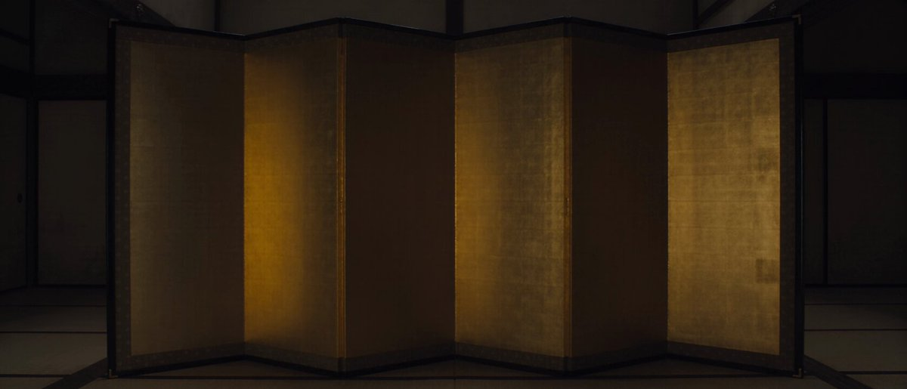

**พรอมต์**

```text
ฉาก: ห้องเสื่อทาทามิ, 16:9 ล็อกมุมกล้องแบบสามในสี่จับภาพฉากกั้นห้องพับได้หกพับปิดทองคำเปลวแบบเรียบ (เบียวบุ) ที่ตั้งเป็นแนวซิกแซก ทองคำเปลวเป็นแบบเรียบ — ไม่มีภาพวาดทิวทัศน์ ไม่มีองค์ประกอบภาพที่มีชื่อเสียง ไม่มีผู้ใหญ่อยู่ในเฟรม ไม่มีตัวหนังสือที่อ่านได้

การเคลื่อนไหว: แผ่นทองเริ่มจากความสลัว ลำแสงธรรมชาติโทนเย็นจากหน้าต่างเคลื่อนพาดผ่านรอยพับราวกับบานเกล็ดเปิดออก แล้วหยุดนิ่งอยู่กับที่ ด้านสว่างและด้านเงาของรอยพับยังคงอยู่ในตำแหน่งเดิม ฉากกั้นไม่เคลื่อนที่ นี่ไม่ใช่การเปลี่ยนฉากแบบไวป์ (wipe)

โฟกัส: คมชัดกริบที่ผิวสัมผัสของทองคำเปลวและขอบของรอยพับกึ่งกลาง เสื่อทาทามิระยะไกลเบลอแบบซอฟต์ลงหนึ่งสต็อป

ฟิสิกส์: ทองคำสะท้อนแสง ไม่ระยิบระยับเป็นประกายแบบกากเพชร ฉากกั้นมีน้ำหนักและตั้งอยู่อย่างมั่นคง ไม่มีลูปประกายแวววาวแบบ CGI

แสง: หน้าต่างหนึ่งบานจากทางซ้าย แสงสะท้อนเฉพาะจุด (specular) พาดผ่านไปตามผิวทองแล้วนิ่งสนิท ไม่มีการเติมแสงนวลสม่ำเสมอแบบพิพิธภัณฑ์ ไม่มีสีแสงประดิษฐ์จากไฟฟ้า

สไตล์: สมจริงระดับภาพยนตร์, ยุคโบราณของญี่ปุ่น, ทองคำเปลวและกรอบลงรัก, เกรนภาพนุ่มนวล ไม่มีสไตล์อนิเมะ ไม่มีตัวหนังสือ ไม่มีลายน้ำ ไม่มีโลโก้
```

[↑ กลับสู่หมวดหมู่](#catalog)

---

<a name="prompt-2102042146392129849"></a>

### พรอมต์ภาพยนตร์ความยาว 30 วินาที แสดงฉากชายคนหนึ่งช่วยหญิงสาวด้วยการใช้มือเดียวรับรถที่กำลังร่วงลงมาในสไตล์แอ็กชันโรแมนติกแบบซีรีส์เกาหลี

ผู้เขียน：[@AIwithWania](https://x.com/AIwithWania) · [โพสต์ต้นฉบับ](https://x.com/AIwithWania/status/2102042146392129849)

ภาพยนตร์ / ภาพนิ่งจากภาพยนตร์ · ตัวละคร · ยานพาหนะ · เผยแพร่แล้ว

**สรุป:** พรอมต์ภาพยนตร์ความยาว 30 วินาที แสดงฉากชายคนหนึ่งช่วยหญิงสาวด้วยการใช้มือเดียวรับรถที่กำลังร่วงลงมาในสไตล์แอ็กชันโรแมนติกแบบซีรีส์เกาหลี

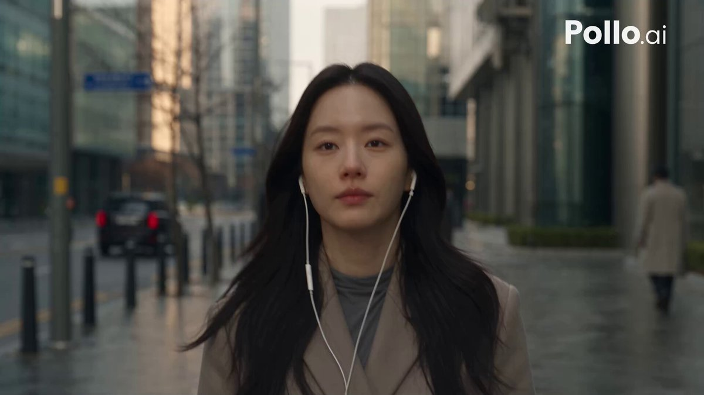

**พรอมต์**

```text
สร้างฉากแอ็กชันโรแมนติกเกาหลีแบบไลฟ์แอ็กชันที่สมจริงขั้นสุดยอดโดยใช้สตอรี่บอร์ดอ้างอิง รักษาตัวละครเกาหลีสองคนเดิม ใบหน้า ทรงผม เสื้อผ้า สัดส่วนร่างกายที่เหมือนเดิมทุกประการ และรถยนต์สีดำคันเดิมตลอดทั้งคลิป ห้ามเปลี่ยนอัตลักษณ์ ชุด ทรงผม หรือยานพาหนะ

0–4 วินาที: หญิงสาวเดินไปตามถนนเกาหลีสมัยใหม่พร้อมสวมหูฟัง รถยนต์สีดำคันหนึ่งเสียการควบคุมกะทันหันและลอยพุ่งตรงมาที่เธอ

4–8 วินาที: ภาพโคลสอัปขณะที่เธอสังเกตเห็นรถด้วยความตกตะลึง ตัดสลับไปที่ชายสวมฮู้ดที่มองเห็นอันตรายและตอบสนองในทันที

8–12 วินาที: เขาวิ่งเข้าหาเธอด้วยความเร็วสูงสุดขีดและดึงเธอหลบออกมาก่อนการปะทะเพียงเสี้ยววินาที

12–16 วินาที: ทั้งคู่ล้มลงอย่างปลอดภัย เธอเงยหน้าขึ้นมองและเห็นรถที่พังยับเยินกำลังร่วงลงมาเหนือศีรษะของพวกเขาพอดี

16–20 วินาที: เขายกมือข้างหนึ่งขึ้นและหยุดรถที่กำลังตกลงมาไว้เหนือศีรษะ เธอขยับเข้าไปใกล้เขาด้วยความหวาดกลัวขณะที่เขายังคงรับรถไว้

20–24 วินาที: ภาพโคลสอัปใบหน้าที่นิ่งสงบและมีสมาธิของเขา เขาผลักรถออกไปและมันตกลงกระแทกพื้นอย่างแรงห่างออกไปหลายเมตร

24–28 วินาที: ทั้งสองคนลุกขึ้นยืนและมองหน้ากันอย่างเงียบๆ ด้วยความตกใจ โล่งใจ และซาบซึ้งใจ ขณะที่แสงอาทิตย์อัสดงอันอบอุ่นสาดส่องไปทั่วท้องถนน

28–30 วินาที: ช็อตกว้างจากด้านหลังของทั้งสองคนโดยมีฉากหลังเป็นเส้นขอบฟ้าของเมืองที่ส่องประกาย เครนค่อยๆ เคลื่อนถอยหลังและยกสูงขึ้นอย่างช้าๆ ก่อนจะค่อยๆ มืดดับไป (fade to black)

สไตล์: ภาพยนตร์ไลฟ์แอ็กชันเกาหลีระดับพรีเมียม ผิวหนังสมจริงเหมือนภาพถ่าย การแสดงออกทางสีหน้าที่เป็นธรรมชาติ การเคลื่อนไหวของเส้นผมและเสื้อผ้าที่สมจริง ฟิสิกส์ของแรงโน้มถ่วงและตัวรถที่น่าเชื่อถือ ระยะชัดลึกแบบภาพยนตร์ โมชันเบลอที่สมจริง แสง HDR ช็อตแอ็กชันแบบถือกล้องถ่าย (handheld) ที่ประณีต ช็อตอารมณ์ที่นุ่มนวล

ข้อจำกัดที่เข้มงวด: ไม่มีใบหน้าที่ดูเป็น AI, ไม่มีการเปลี่ยนใบหน้า, ไม่มีการบิดเบี้ยวของร่างกาย, ไม่มีบุคคลซ้ำซ้อน, ไม่มีการเปลี่ยนเสื้อผ้า, มือไม่หักงอหรือผิดรูป, ไม่มีการเคลื่อนไหวที่ไม่เป็นธรรมชาติ, ไม่มีการเทเลพอร์ต, หรือการเปลี่ยนรุ่นรถยนต์ รักษาการเคลื่อนไหวทั้งหมดให้สมจริงและมีการแสดงระดับมืออาชีพ
```

[↑ กลับสู่หมวดหมู่](#catalog)

---

<a name="prompt-2102063363694231594"></a>

### ข้อความแจ้งเตือนสำหรับสร้างฉากภาพยนตร์สยองขวัญซอมบี้ระบาดในสำนักงานเกาหลีสมัยใหม่ พร้อมรายละเอียดตัวละคร ลำดับเหตุการณ์แอ็กชัน และบรรยากาศความน่าสะพรึงกลัว

ผู้เขียน：[@AIwithSynthia](https://x.com/AIwithSynthia) · [โพสต์ต้นฉบับ](https://x.com/AIwithSynthia/status/2102063363694231594)

ภาพยนตร์ / ภาพนิ่งจากภาพยนตร์ · ตัวละคร · เผยแพร่แล้ว

**สรุป:** ข้อความแจ้งเตือนสำหรับสร้างฉากภาพยนตร์สยองขวัญซอมบี้ระบาดในสำนักงานเกาหลีสมัยใหม่ พร้อมรายละเอียดตัวละคร ลำดับเหตุการณ์แอ็กชัน และบรรยากาศความน่าสะพรึงกลัว

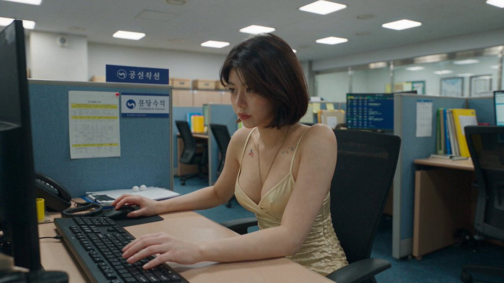

**พรอมต์**

```text
สร้างฉากสยองขวัญการระบาดของเชื้อไวรัสความยาว 30 วินาที ความละเอียด 1080p ที่สมจริงอย่างยิ่ง โดยเกิดขึ้นภายในสำนักงานบริษัทเกาหลีสมัยใหม่ทั้งหมด โดยใช้ภาพที่อัปโหลดเป็นข้อมูลอ้างอิงที่มีลำดับความสำคัญสูงสุดสำหรับตัวละครเอกหญิง และรักษาใบหน้า ทรงผม สีผิว สัดส่วนร่างกาย และชุดเสื้อผ้าของเธอให้ตรงกันทุกประการ หญิงสาวชาวเกาหลีทำงานคนเดียวที่โต๊ะทำงานของเธอในตอนดึก เมื่อจู่ๆ เพื่อนร่วมงานคนหนึ่งที่มีท่าทางแปลกประหลาดก็ปรากฏตัวขึ้นระหว่างคอกทำงาน หายใจแรงและเคลื่อนไหวอย่างผิดธรรมชาติ เขาทรุดตัวลงข้างโต๊ะทำงาน ชักกระตุกอย่างรุนแรง จากนั้นก็ลุกขึ้นมาทันทีด้วยดวงตาที่แดงก่ำและพุ่งเข้าใส่พนักงานอีกคน สำนักงานตกอยู่ในความโกลาหลและความตื่นตระหนกในขณะที่พนักงานวิ่งหนีเอาชีวิตรอดระหว่างโต๊ะทำงาน ชนเก้าอี้ จอมอนิเตอร์ และเอกสารล้มระเนระนาด หญิงสาววิ่งไปทางทางเข้าหลักแต่เห็นเพื่อนร่วมงานที่ติดเชื้อกำลังแห่กันเข้ามาเต็มโถงทางเดิน บีบให้เธอต้องหันหลังกลับ เธอและผู้รอดชีวิตอีกหลายคนดันโต๊ะ เก้าอี้ และตู้เก็บเอกสารไปกั้นประตูกระจกตรงทางเข้า ในขณะที่พนักงานที่ติดเชื้อทุบตีประตูกระจกอย่างรุนแรง รอยร้าวเริ่มลามไปทั่วกระจกก่อนที่บานหนึ่งจะแตกออกทันที และมือของผู้ติดเชื้อก็เอื้อมผ่านช่องเปิดเข้ามา ผู้รอดชีวิตถอยหนีลึกเข้าไปในสำนักงานและรีบเข้าไปในห้องประชุมกระจก ปิดประตูดังปังตามหลัง พวกเขาลากโต๊ะประชุมขนาดใหญ่มาขวางทางเข้าไว้ในขณะที่ฝูงผู้ติดเชื้อล้อมรอบห้อง หญิงสาวสังเกตเห็นเพื่อนร่วมงานคนหนึ่งติดอยู่ข้างนอก เธอแง้มเปิดประตูชั่วครู่ ดึงเขาเข้ามาข้างใน แล้วสร้างสิ่งกีดขวางใหม่อีกครั้งทันที ทุกคนเงียบกริบ หายใจหอบเหนื่อยขณะที่เงาดำร่างของผู้ติดเชื้อกระหน่ำทุบกระจกที่มีรอยร้าว ไฟในสำนักงานดับลงทันที เหลือเพียงไฟฉุกเฉินสีแดงในขณะที่กระจกเริ่มปริแตกภายใต้แรงกดดัน จบลงด้วยภาพหญิงสาวจ้องมองมาที่กล้องด้วยความหวาดกลัวในขณะที่เงามืดของผู้ติดเชื้อล้อมรอบห้องประชุมอย่างสมบูรณ์ จากนั้นตัดเป็นจอดำ; สภาพแวดล้อมสำนักงานเกาหลีที่สมจริงเหมือนภาพถ่าย, ฟิสิกส์ที่สมจริง, กล้องถือถ่ายแบบแฮนด์เฮลด์, ไฟฟลูออเรสเซนต์กะพริบ, ฝุ่นในบรรยากาศ, บรรยากาศสำนักงานตามธรรมชาติ, เสียงสัญญาณเตือนภัย, เสียงฝีเท้า, เสียงกรีดร้อง, เสียงหายใจหอบแรง และเสียงทุบกระจก, ไม่มีดนตรีประกอบ, ไม่มีความรุนแรงเลือดสาดมากเกินไป, ไม่มีลักษณะเหมือนงาน CGI, ไม่มีใบหน้าที่บิดเบี้ยว, ไม่มีตัวละครซ้ำซ้อน, ไม่มีการเทเลพอร์ต, ไม่มีการเปลี่ยนชุด, ไม่มีคำบรรยาย, คำอธิบายภาพ, โลโก้ หรือลายน้ำ
```

[↑ กลับสู่หมวดหมู่](#catalog)

---

<a name="prompt-2102022966112563595"></a>

### ข้อความพรอมต์โฆษณาท่องเที่ยวระดับภาพยนตร์ความยาว 30 วินาที ถ่ายทอดภาพหญิงสาวชาวเกาหลีชมเงาสะท้อนแสงออโรร่าสีเขียวเหนือทะเลสาบฤดูหนาวในจองซอน

ผู้เขียน：[@SimplyAnnisa](https://x.com/SimplyAnnisa) · [โพสต์ต้นฉบับ](https://x.com/SimplyAnnisa/status/2102022966112563595)

ภาพยนตร์ / ภาพนิ่งจากภาพยนตร์ · ตัวละคร · ทิวทัศน์ / ธรรมชาติ · เผยแพร่แล้ว

**สรุป:** ข้อความพรอมต์โฆษณาท่องเที่ยวระดับภาพยนตร์ความยาว 30 วินาที ถ่ายทอดภาพหญิงสาวชาวเกาหลีชมเงาสะท้อนแสงออโรร่าสีเขียวเหนือทะเลสาบฤดูหนาวในจองซอน

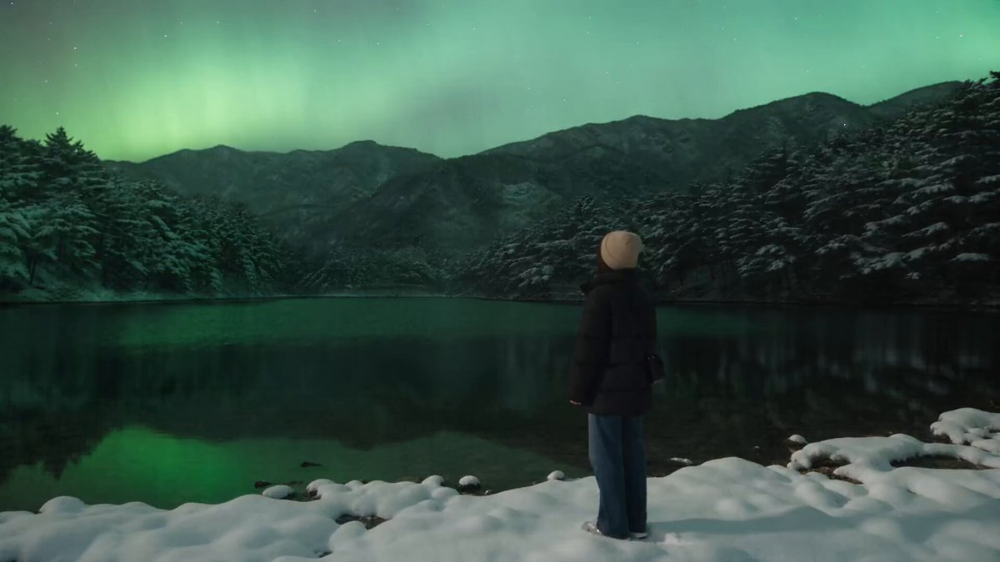

**พรอมต์**

```text
สร้างโฆษณาการท่องเที่ยวเกาหลีแบบภาพยนตร์ไลฟ์แอ็กชันสมจริง ความยาว 30 วินาที อัตราส่วน 16:9 โดยนำเสนอหญิงสาวชาวเกาหลีคนเดิมริมทะเลสาบฤดูหนาวอันเงียบสงบในจองซอน คังวอนโด ประเทศเกาหลีใต้

เธอสวมเสื้อแจ็กเก็ตพัฟเฟอร์โอเวอร์ไซส์สีดำ สเวตเตอร์สีเทาอ่อน กางเกงยีนส์สีน้ำเงิน รองเท้าผ้าใบสีขาวเทา หมวกบีนนี่สีเบจ และกระเป๋าสะพายข้างสีดำ รักษาใบหน้า ทรงผม ชุด และสัดส่วนให้เหมือนเดิมตลอดทั้งคลิป

ฉาก: ต้นสนที่ปกคลุมด้วยหิมะ ภูเขาสีมืด ทะเลสาบอันเงียบสงบที่สะท้อนแสงออโรร่าสีเขียวมรกตจางๆ ควันลมหายใจ ลมฤดูหนาวพัดเบาๆ และแสงสว่างยามค่ำคืนที่สมจริง

ลำดับภาพ:

- 0–6 วินาที: หญิงสาวหันหน้าเข้าหาทะเลสาบ มองขึ้นไปที่แสงออโรร่าด้วยความประหลาดใจ เสียงพากย์: "Wow... this is unreal."
- 6–13 วินาที: เธอหันมาทางกล้อง ยิ้ม และชี้ไปที่แสงออโรร่า เสียงพากย์: "Look at that... it's beautiful."
- 13–21 วินาที: เธอมองดูทะเลสาบอย่างสงบ หลับตาลง และหายใจช้าๆ เสียงพากย์: "I could stay here all night."
- 21–30 วินาที: เธอหันกลับมาทางกล้อง ก้าวเข้ามาใกล้หนึ่งก้าว และยิ้มอย่างอ่อนโยนขณะที่แสงออโรร่าสว่างขึ้นเล็กน้อย เสียงพากย์: "Okay... I don't want to leave."

สไตล์: งานภาพยนตร์โฆษณาท่องเที่ยวเกาหลีระดับพรีเมียมผสมผสานกับความสมจริงของสมาร์ตโฟนวิดีโอบล็อก การเคลื่อนไหวของกล้องแบบถือด้วยมืออย่างเป็นธรรมชาติ การโฟกัสอัตโนมัติที่สมจริง ระยะชัดลึกที่ละเอียดอ่อน พื้นผิวผิวที่เป็นธรรมชาติ และแสงสะท้อนออโรร่าที่สมจริง

เสียงธรรมชาติจากสถานที่เท่านั้น: เสียงลมพัดเบาๆ เสียงเสียดสีของเสื้อผ้า เสียงฝีเท้า และเสียงหายใจ เสียงบรรยายของผู้หญิงในลักษณะการพูดคุย ไม่มีดนตรีประกอบ

ความสมจริงอย่างเคร่งครัด: ไม่มี CGI, 3D, แอนิเมชัน, ผิวพลาสติก, การเปลี่ยนตัวละคร, การเปลี่ยนชุด, บุคคลพิเศษ, การสะท้อนที่ไม่สมจริง, ข้อความ, คำบรรยาย, โลโก้ หรือลายน้ำ สถานที่และสภาพอากาศต่อเนื่อง ไลฟ์แอ็กชันที่สมจริงดุจภาพถ่าย คุณภาพระดับภาพยนตร์
```

[↑ กลับสู่หมวดหมู่](#catalog)

---

<a name="prompt-2102053757341037048"></a>

### กำลังแปล

ผู้เขียน：[@MadMax\_Series](https://x.com/MadMax_Series) · [โพสต์ต้นฉบับ](https://x.com/MadMax_Series/status/2102053757341037048)

คอมิก / สตอรี่บอร์ด · ภาพยนตร์ / ภาพนิ่งจากภาพยนตร์ · ทิวทัศน์เมือง / ถนน · เผยแพร่แล้ว

**สรุป:** กำลังแปล

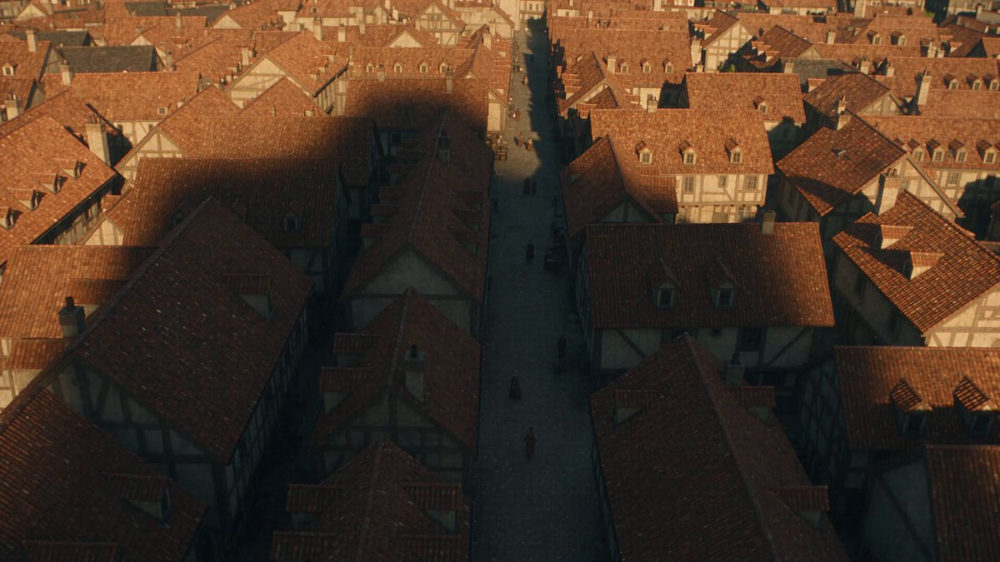

**พรอมต์**

```text
กำลังแปล
```

[↑ กลับสู่หมวดหมู่](#catalog)

---

<a name="prompt-2102011250741846328"></a>

### ช็อตภาพยนตร์ของหญิงสาวผมบลอนด์ในชุดราตรีสีทองเหลือบประกายในดินแดนคริสตัล

ผู้เขียน：[@TaliaAariz](https://x.com/TaliaAariz) · [โพสต์ต้นฉบับ](https://x.com/TaliaAariz/status/2102011250741846328)

ภาพยนตร์ / ภาพนิ่งจากภาพยนตร์ · ตัวละคร · เผยแพร่แล้ว

**สรุป:** ช็อตภาพยนตร์ของหญิงสาวผมบลอนด์ในชุดราตรีสีทองเหลือบประกายในดินแดนคริสตัล


**พรอมต์**

```text
วิดีโอภาพยนตร์แนวไฮแฟชั่นสุดตระการตาของหญิงสาวผมบลอนด์ผู้เลอโฉมราวกับไม่มีอยู่จริง กำลังเต้นรำในดินแดนปริซึมเหนือจริงดั่งความฝันภายใต้แสงตะวันอันเจิดจ้า เธอสวมชุดราตรีสีทองระยิบระยับอันวิจิตรบรรจง ฝังด้วยเหลี่ยมมุมโลหะเหลือบสีและแผ่นกระจกคาไลโดสโคปที่ทอดประกายการหักเหของแสงสีรุ้งอันงดงามลงบนพื้นกระจกเงาไร้รอยต่อ ท่ามกลางลูกบาศก์แก้วลอยได้ ซุ้มกระจกสีขนาดยักษ์ และโครงสร้างคริสตัลสูงตระหง่าน กล้องที่เคลื่อนที่วนรอบอย่างนุ่มนวลคอยติดตามการเคลื่อนไหวอันสง่างามของเธอด้วยรายละเอียดคมชัดระดับไฮเดฟินิชัน เผยให้เห็นใบหน้าของเธออย่างชัดเจนด้วยสีหน้าอันเงียบสงบขณะที่เธอหันหน้าเข้าหากล้อง สว่างไสวอย่างสมบูรณ์แบบด้วยแสงปริซึมที่มีชีวิตชีวาและแสงแฟลร์เลนส์หลากสีสัน
```

[↑ กลับสู่หมวดหมู่](#catalog)

---

<a name="prompt-2101881835290845251"></a>

### พรอมต์วิดีโอสไตล์ภาพยนตร์เหนือจริงที่แสดงภาพผู้หญิงในชุดสีเขียวนกเป็ดน้ำกำลังวิ่งผ่านเมืองเวนิสกลับหัวสไตล์เอสเชอร์

ผู้เขียน：[@laviniavelle](https://x.com/laviniavelle) · [โพสต์ต้นฉบับ](https://x.com/laviniavelle/status/2101881835290845251)

ภาพยนตร์ / ภาพนิ่งจากภาพยนตร์ · ตัวละคร · ไอเทมแฟชั่น · เผยแพร่แล้ว

**สรุป:** พรอมต์วิดีโอสไตล์ภาพยนตร์เหนือจริงที่แสดงภาพผู้หญิงในชุดสีเขียวนกเป็ดน้ำกำลังวิ่งผ่านเมืองเวนิสกลับหัวสไตล์เอสเชอร์


**พรอมต์**

```text
พรอมต์วิดีโอแอ็กชันแบบภาพยนตร์ที่มีการเคลื่อนไหวตลอดเวลา แนวภาพเหนือจริง หญิงสาวชาวเอเชียตะวันออกในชุดกระโปรงวินเทจสีเขียวนกเป็ดน้ำคลาสสิก ถือซองจดหมายสีเหลืองและวิ่งอย่างรวดเร็วผ่านเวนิสที่ดูเหนือจริงราวกับความฝัน การเคลื่อนไหวของกล้องแบบไดนามิก เงาสะท้อนกลับหัวของเมืองเวนิสที่ห้อยลงมาจากท้องฟ้าสร้างภาพลวงตาแห่งมิติกกระจกที่บิดเบือนความคิด วิ่งลัดเลาะไปตามตรอกอิฐของเวนิส ปีนบันไดหินที่บิดเบี้ยวสไตล์ เอ็ม.ซี. เอสเชอร์ กระโดดข้ามช่องว่างขนาดใหญ่โดยมีสายรุ้งสดใสบนท้องฟ้าช่วงเวลาแสงสีทอง วิ่งเต็มฝีเท้าผ่านตลาดผลไม้กลางแจ้งที่วุ่นวายซึ่งมีแอปเปิลสีแดงร่วงหล่น ยืนอยู่บนหลังคากระเบื้องสีแดงคลาสสิกในยามพระอาทิตย์ตกดินสีทอง ช็อตติดตามวัตถุเคลื่อนที่เร็วแบบไดนามิก แสงสไตล์ภาพยนตร์ ความละเอียด 8k สมจริงระดับภาพถ่ายที่มีรายละเอียดสูงเป็นพิเศษ ถ่ายด้วยเลนส์ 35 มม. ผลงานชิ้นเอกที่มีระยะชัดลึก
```

[↑ กลับสู่หมวดหมู่](#catalog)

---

<a name="prompt-2101993937770811467"></a>

### ข้อความคำสั่งสร้างวิดีโอแนวภาพยนตร์ที่ถ่ายทอดภาพผู้หญิงในชุดเดรสสีขาวกำลังสำรวจสวรรค์บนภูเขาสีมรกต พร้อมน้ำตก ก้อนเมฆ และบทสนทนา

ผู้เขียน：[@MissDelulu9](https://x.com/MissDelulu9) · [โพสต์ต้นฉบับ](https://x.com/MissDelulu9/status/2101993937770811467)

ภาพยนตร์ / ภาพนิ่งจากภาพยนตร์ · ตัวละคร · ไอเทมแฟชั่น · ทิวทัศน์ / ธรรมชาติ · เผยแพร่แล้ว

**สรุป:** ข้อความคำสั่งสร้างวิดีโอแนวภาพยนตร์ที่ถ่ายทอดภาพผู้หญิงในชุดเดรสสีขาวกำลังสำรวจสวรรค์บนภูเขาสีมรกต พร้อมน้ำตก ก้อนเมฆ และบทสนทนา

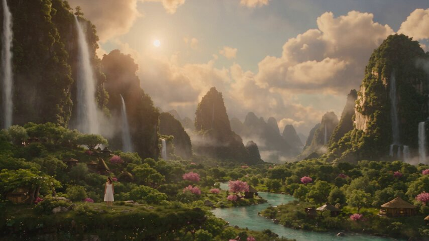

**พรอมต์**

```text
สร้างวิดีโอภาพยนตร์แนวเสมือนจริงที่สวยงามจนแทบหยุดหายใจ แสดงภาพหญิงสาววัยผู้ใหญ่กำลังสำรวจสรวงสวรรค์สีเขียวที่ซ่อนอยู่ท่ามกลางภูเขาสีมรกตขนาดยักษ์ เธอสวมชุดเดรสฤดูร้อนสีขาวสั้นเรียบง่ายสายเดี่ยวเส้นเล็กพร้อมกระโปรงพลิ้วไหวอย่างนุ่มนวล รองเท้าแตะสีขาว และผมยาวสลวยเป็นธรรมชาติ รักษาใบหน้าและรูปลักษณ์ของเธอให้สม่ำเสมอ เริ่มต้นโดยตรงด้วยวิวมุมกว้างพาโนรามาของหุบเขาอันกว้างใหญ่ ภูเขาสีเขียวชอุ่ม เมฆปุกปุยขนาดมหึมาจำนวนนับไม่ถ้วนลอยอยู่ระหว่างยอดเขา น้ำตก หมอก บ้านหลังเล็กๆ ที่ปกคลุมด้วยดอกไม้ ลำธาร ดอกไม้ และแสงแดดอันอบอุ่น เธอหันมองรอบๆ และพูดว่า: “This place is unreal…” เธอเดินช้าๆ ไปตามเส้นทางธรรมชาติ ขณะที่กล้องมุมกว้างเผยให้เห็นทิวทัศน์เต็มรูปแบบ ทั้งน้ำตก ลำธารระยิบระยับ ดอกไม้ บ้านหลังเล็ก ต้นไม้ใหญ่ ภูเขา และก้อนเมฆ เธอพูดว่า: “It feels like a dream.” กล้องลอยตัวขึ้นสู่การเผยภาพมุมสูงอันยิ่งใหญ่ ดึงระยะห่างออกไปไกลจนกระทั่งเธอดูตัวเล็กจิ๋ว แสดงให้เห็นหุบเขาขนาดมหึมาทั้งหมด ภูเขาสีเขียวที่ทอดยาวไม่รู้จบ ก้อนเมฆยักษ์ น้ำตก หมู่บ้าน ลำธาร และแสงแดดสีทอง เธอพูดว่า: “I could stay here forever.” สไตล์: เสมือนจริงขั้นสุด อารมณ์ภาพยนตร์ ชวนฝันแต่สมจริง ก้อนเมฆ น้ำ หมอก แมกไม้เขียวขจี และแสงแดดที่สมจริง การเคลื่อนไหวของกล้องที่นุ่มนวล การเคลื่อนไหวของมนุษย์ที่เป็นธรรมชาติ สเกลยิ่งใหญ่อลังการ คุณภาพระดับภาพยนตร์พรีเมียม 16:9, 4K, ไม่มีการซูมระยะใกล้ ไม่มีข้อความ ไม่มีลายน้ำ
```

[↑ กลับสู่หมวดหมู่](#catalog)

---

<a name="prompt-2101970747958624593"></a>

### กำลังแปล

ผู้เขียน：[@johnAGI168](https://x.com/johnAGI168) · [โพสต์ต้นฉบับ](https://x.com/johnAGI168/status/2101970747958624593)

คอมิก / สตอรี่บอร์ด · ภาพยนตร์ / ภาพนิ่งจากภาพยนตร์ · ตัวละคร · ยานพาหนะ · เผยแพร่แล้ว

**สรุป:** กำลังแปล

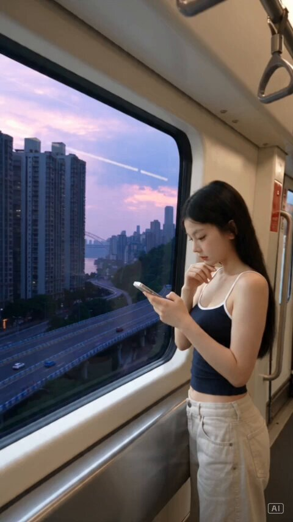

**พรอมต์**

```text
กำลังแปล
```

[↑ กลับสู่หมวดหมู่](#catalog)

---

<a name="prompt-2101890198703354285"></a>

### ฉากมิวสิกวิดีโอสไตล์ภาพยนตร์ของหญิงสาวที่เต้นในเสื้อคอร์เซ็ตสีขาวในโรงจอดรถใต้ดินพร้อมแดนเซอร์และรถยนต์

ผู้เขียน：[@AIwithMinal](https://x.com/AIwithMinal) · [โพสต์ต้นฉบับ](https://x.com/AIwithMinal/status/2101890198703354285)

ภาพยนตร์ / ภาพนิ่งจากภาพยนตร์ · ตัวละคร · ยานพาหนะ · เผยแพร่แล้ว

**สรุป:** ฉากมิวสิกวิดีโอสไตล์ภาพยนตร์ของหญิงสาวที่เต้นในเสื้อคอร์เซ็ตสีขาวในโรงจอดรถใต้ดินพร้อมแดนเซอร์และรถยนต์

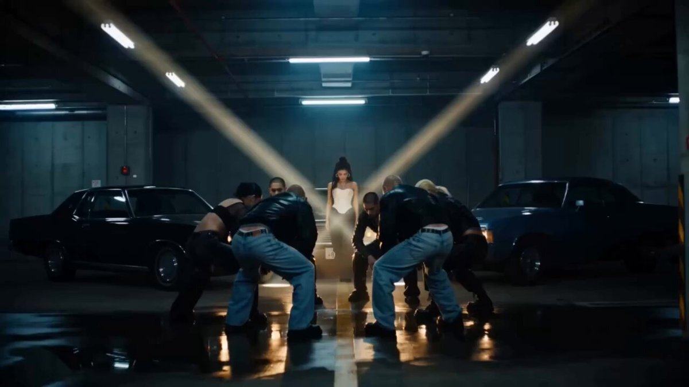

**พรอมต์**

```text
ฉากการแสดงแฟชั่นสไตล์ภาพยนตร์ที่สมจริงอย่างยิ่ง หญิงสาวแสนสวยผมยาวสีดำขลับยืนอยู่อย่างมั่นใจตรงกลาง สวมเสื้อท็อปคอร์เซ็ตเกาะอกสีขาวอันสง่างาม กางเกงยีนส์เอวสูงทรงเข้ารูปสีเข้ม สร้อยคอเงินแบบซ้อนเลเยอร์และต่างหูห่วง มีแดนเซอร์สาวสุดเก๋หลายคนล้อมรอบเธอ สวมชุดหนังสีดำ โพสท่าเต้นที่พร้อมเพรียงกัน บรรยากาศยามค่ำคืนที่น่าทึ่งพร้อมรถยนต์และไฟหน้ารถที่สว่างจ้าอยู่ด้านหลัง บรรยากาศสไตล์อินดัสเทรียลที่เต็มไปด้วยอารมณ์ แสงส่องจากด้านหลังโทนอุ่น หมอกควันบางเบา เงาที่สมจริง องค์ประกอบภาพที่มีชีวิตชีวา สีหน้าทรงพลังและมั่นใจ สุนทรียศาสตร์ของมิวสิกวิดีโอระดับมืออาชีพ รายละเอียดผิวและเนื้อผ้าที่สมจริงเหมือนภาพถ่าย ระยะชัดตื้น แสงสไตล์ภาพยนตร์ คอนทราสต์สูง 8K, HDR, เลนส์ 85 มม., องค์ประกอบภาพแนวตั้ง 9:16
```

[↑ กลับสู่หมวดหมู่](#catalog)

---

<a name="prompt-2101889590621536594"></a>

### ลำดับภาพสไตล์ภาพยนตร์เกี่ยวกับวันสุดแปลกแหวกแนวของหญิงสาวชาวเกาหลีที่สนามเด็กเล่นและพื้นที่เล่นกีฬา

ผู้เขียน：[@Lianaalane](https://x.com/Lianaalane) · [โพสต์ต้นฉบับ](https://x.com/Lianaalane/status/2101889590621536594)

ภาพยนตร์ / ภาพนิ่งจากภาพยนตร์ · ตัวละคร · เผยแพร่แล้ว

**สรุป:** ลำดับภาพสไตล์ภาพยนตร์เกี่ยวกับวันสุดแปลกแหวกแนวของหญิงสาวชาวเกาหลีที่สนามเด็กเล่นและพื้นที่เล่นกีฬา

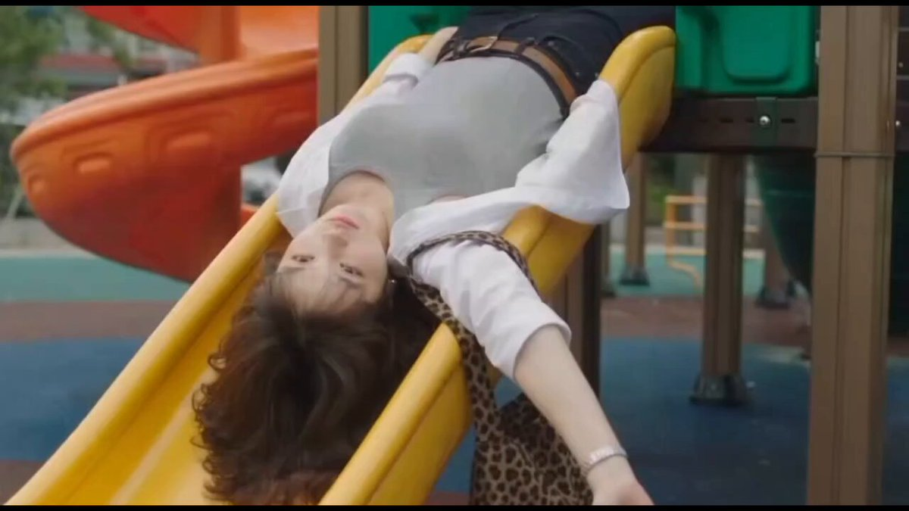

**พรอมต์**

```text
สร้างวิดีโอของหญิงสาวชาวเกาหลีแสนสวยที่กำลังเพลิดเพลินกับวันอันแสนสนุกและชวนฝัน ณ สนามเด็กเล่นกลางแจ้งสีสันสดใส เธอสวมเสื้อเชิ้ตสีขาวแบบลำลอง กางเกงยีนส์สีเข้ม รองเท้าผ้าใบ และสะพายกระเป๋าสะพายไหล่ลายเสือดาวสุดเก๋ แสดงภาพเธอกำลังพักผ่อนและนอนเล่นอย่างสนุกสนานบนกระดานลื่นสีเหลืองสดใส จากนั้นตัดฉากไปยังเธอนั่งเงียบๆ บนชิงช้า ดูเหนื่อยล้าเล็กน้อยและกำลังจมอยู่ในความคิด หลังจากนั้นเธอนั่งอยู่ที่ขอบสนามเด็กเล่นโดยสวมหมวกกรวยจราจรสีส้มสุดตลก สร้างช่วงเวลาแปลกใหม่สไตล์ภาพยนตร์ แสดงภาพเธอพักผ่อนอย่างสงบสุขบนขั้นบันไดคอนกรีตท่ามกลางแสงแดดธรรมชาติอันนุ่มนวลและบรรยากาศที่เงียบสงบ ปิดท้ายด้วยการที่เธอนอนหลับอย่างสบายตัวอยู่ภายในรถเข็นช็อปปิ้งที่เต็มไปด้วยลูกบาสเก็ตบอล สร้างฉากที่ไม่คาดคิดและชวนขบขัน ใช้การแสดงออกทางสีหน้าที่สมจริง การเคลื่อนไหวร่างกายที่เป็นธรรมชาติ การเคลื่อนกล้องแบบภาพยนตร์ โทนสีนุ่มนวล และรายละเอียดที่สมจริงเหมือนภาพถ่าย รักษาเอกลักษณ์และรูปลักษณ์ของหญิงสาวชาวเกาหลีให้คงเส้นคงวาตลอดทั้งวิดีโอ พร้อมการเปลี่ยนฉากที่ราบรื่นและสไตล์การเล่าเรื่องแบบภาพยนตร์ที่เปี่ยมไปด้วยความขี้เล่น
```

[↑ กลับสู่หมวดหมู่](#catalog)

---

<a name="prompt-2101906866921955737"></a>

### สร้างวล็อกความยาว 30 วินาทีที่สมจริงระดับภาพถ่าย ติดตามการเดินทางไปกลับประจำวันและชีวิตในมหาวิทยาลัยของนักศึกษาชาวเกาหลีจากหมู่บ้านชนบท

ผู้เขียน：[@nawalsehar](https://x.com/nawalsehar) · [โพสต์ต้นฉบับ](https://x.com/nawalsehar/status/2101906866921955737)

การถ่ายภาพ · ภาพยนตร์ / ภาพนิ่งจากภาพยนตร์ · เผยแพร่แล้ว

**สรุป:** สร้างวล็อกความยาว 30 วินาทีที่สมจริงระดับภาพถ่าย ติดตามการเดินทางไปกลับประจำวันและชีวิตในมหาวิทยาลัยของนักศึกษาชาวเกาหลีจากหมู่บ้านชนบท

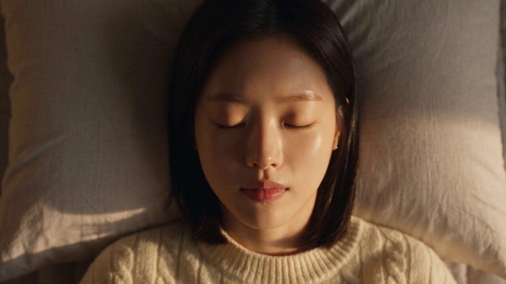

**พรอมต์**

```text
สร้างวล็อกส่วนตัวแบบไลฟ์แอ็กชันความยาว 30 วินาทีที่มีความสมจริงระดับภาพถ่ายขั้นสุดยอด ติดตามชีวิตของนักศึกษามหาวิทยาลัยหญิงชาวเกาหลีในช่วงวัยยี่สิบต้นๆ ที่อาศัยอยู่ในหมู่บ้านบนภูเขาชนบทอันเงียบสงบของเกาหลี แสดงกิจวัตรยามเช้าที่เป็นธรรมชาติของเธอ การเดินไปที่ป้ายรถประจำทางของหมู่บ้าน การขึ้นรถประจำทางประจำภูมิภาค การเดินทางผ่านทุ่งนาและเนินเขา การเข้าฟังบรรยายในมหาวิทยาลัย การพูดคุยเบาๆ กับเพื่อนๆ จากนั้นนั่งรถประจำทางกลับบ้านมุ่งหน้าสู่หมู่บ้านในช่วงพระอาทิตย์ตกดิน

รักษาอัตลักษณ์ ทรงผม เสื้อสเวตเตอร์สีครีม แจ็กเก็ตสีเบจ กางเกงยีนส์สีน้ำเงิน รองเท้าผ้าใบ เป้สะพายหลัง และสัดส่วนของเธอให้สอดคล้องกันตลอดทั้งเรื่อง ใช้ฟุตเทจจากสมาร์ตโฟน/กล้องปี 2026 สมัยใหม่ที่สมจริงในอัตราส่วน 16:9 พร้อมการเคลื่อนไหวแบบถือกล้องด้วยมืออย่างแนบเนียน การปรับโฟกัสอัตโนมัติและการปรับระดับแสงที่เป็นธรรมชาติ ความชัดลึกของภาพที่สมจริง และบรรยากาศชนบทและมหาวิทยาลัยของเกาหลีแท้ๆ ไม่ใช้สุนทรียศาสตร์แบบเรโทรหรือ VHS

ทำให้ทุกการเคลื่อนไหวมีความสมเหตุสมผลตามหลักฟิสิกส์: ชีวกลศาสตร์การเดินที่สมจริง ความสมดุล แรงเสียดทาน ความเฉื่อย น้ำหนักของเป้สะพายหลัง การเคลื่อนไหวของเนื้อผ้าและเส้นผม การเบรกและระบบกันสะเทือนของรถบัส การยึดเกาะถนนของยาง การเร่งความเร็ว การเลี้ยว เงาสะท้อนบนกระจกหน้าต่าง เงาที่เป็นธรรมชาติ และปฏิสัมพันธ์ระหว่างมนุษย์ที่น่าเชื่อถือ ทุกการกระทำควรเชื่อมโยงไปยังการกระทำถัดไปอย่างเป็นธรรมชาติ โดยไม่มีการเทเลพอร์ต วัตถุลอย การลื่นไถลของเท้า หรือการเคลื่อนไหวที่เป็นไปไม่ได้

ใช้เฉพาะเสียงในเหตุการณ์จริง (diegetic audio): เสียงนก เสียงฝีเท้า ลม ประตู เสียงเครื่องยนต์และเบรกรถบัส เสียงบี๊บแตะบัตรโดยสาร บรรยากาศในห้องเรียน เสียงการเขียน เสียงเก้าอี้ บทสนทนาของนักศึกษา และการจราจรยามเย็น ไม่ต้องมีดนตรี เสียงบรรยาย คำบรรยายใต้ภาพ หรือเสียงพากย์

จบด้วยช็อตภายนอกของรถบัสที่แล่นไปตามถนนในชนบทที่คดเคี้ยว มุ่งหน้าสู่หมู่บ้านที่อยู่ไกลออกไปขณะที่แสงยามเย็นเริ่มลับตา จากนั้นค่อยๆ ดับมืดลงอย่างเป็นธรรมชาติ

ไม่มีลุค CGI แอนิเมชัน มือบิดเบี้ยว นิ้วส่วนเกิน ผู้คนซ้ำซ้อน ใบหน้าหรือชุดที่เปลี่ยนไป การเคลื่อนไหวแบบหุ่นยนต์ วงจรการเดินที่ซ้ำซาก การสั่นของกล้องที่เกินจริง องค์ประกอบแฟนตาซี ข้อความซ้อนทับ โลโก้ หรือลายน้ำ
```

[↑ กลับสู่หมวดหมู่](#catalog)

---

<a name="prompt-2101911177962090931"></a>

### ภาพยนตร์มอนทาจแนววินเทจของหญิงสาวชาวเกาหลีที่เพลิดเพลินกับช่วงเวลาอันเงียบสงบในชนบท

ผู้เขียน：[@ayzalnooor24521](https://x.com/ayzalnooor24521) · [โพสต์ต้นฉบับ](https://x.com/ayzalnooor24521/status/2101911177962090931)

ภาพยนตร์ / ภาพนิ่งจากภาพยนตร์ · ย้อนยุค / วินเทจ · ตัวละคร · เผยแพร่แล้ว

**สรุป:** ภาพยนตร์มอนทาจแนววินเทจของหญิงสาวชาวเกาหลีที่เพลิดเพลินกับช่วงเวลาอันเงียบสงบในชนบท

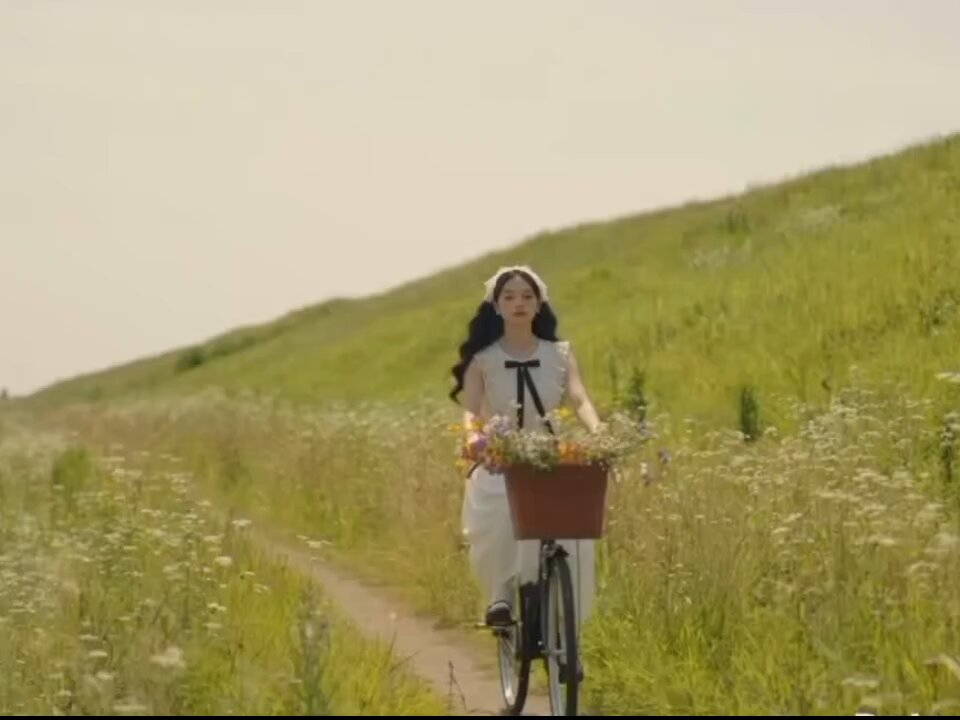

**พรอมต์**

```text
หญิงสาวชาวเกาหลีแสนสวยในบรรยากาศชนบทวินเทจอันชวนฝัน
เธอสวมชุดเดรสสีขาวประณีตพร้อมดีเทลริบบิ้นสีดำและที่คาดผมลูกไม้
เธอปั่นจักรยานคลาสสิกผ่านทุ่งดอกไม้ป่าอันเงียบสงบใต้แสงแดดอันอบอุ่น
ต่อมาเธอผ่อนคลายบนพื้นหญ้าใต้ต้นไม้ อ่านหนังสืออย่างเงียบสงบ
เธอเดินข้ามสะพานไม้เล็กๆ พลางถือหนังสือไว้เหนือศีรษะ
ฉากเปลี่ยนเป็นบ้านสไตล์วินเทจอันแสนอบอุ่นที่เธอกำลังหั่นแตงโมสดอย่างพิถีพิถัน
โทรทัศน์เก่าย้อนยุคและการตกแต่งภายในแบบชนบทสร้างบรรยากาศเรโทรที่อบอุ่น
เธอใช้ช่วงเวลาเงียบสงบข้างตู้ปลาหลากสีสันที่มีปลาว่ายไปมา
วิดีโอมีแสงแบบภาพยนตร์ที่นุ่มนวล การเคลื่อนไหวของกล้องที่นุ่มนวล และอารมณ์ย้อนยุคชวนฝัน
สร้างสรรค์วิดีโอตัดต่อแบบภาพยนตร์ความยาว 25 วินาทีที่สวยงาม พร้อมรายละเอียดที่สมจริง การเคลื่อนไหวที่เป็นธรรมชาติ และสุนทรียศาสตร์วินเทจอันอบอุ่น
```

[↑ กลับสู่หมวดหมู่](#catalog)

---

<a name="prompt-2101907970972119058"></a>

### ฉากภัยพิบัติสึนามิแบบภาพยนตร์แสดงน้ำท่วมใหญ่ เรือบรรทุกสินค้าที่ถูกซัดไประหว่างตึกระฟ้าของเมือง และการทำลายล้างเป็นวงกว้าง

ผู้เขียน：[@aiwithaayat](https://x.com/aiwithaayat) · [โพสต์ต้นฉบับ](https://x.com/aiwithaayat/status/2101907970972119058)

ภาพยนตร์ / ภาพนิ่งจากภาพยนตร์ · เผยแพร่แล้ว

**สรุป:** ฉากภัยพิบัติสึนามิแบบภาพยนตร์แสดงน้ำท่วมใหญ่ เรือบรรทุกสินค้าที่ถูกซัดไประหว่างตึกระฟ้าของเมือง และการทำลายล้างเป็นวงกว้าง

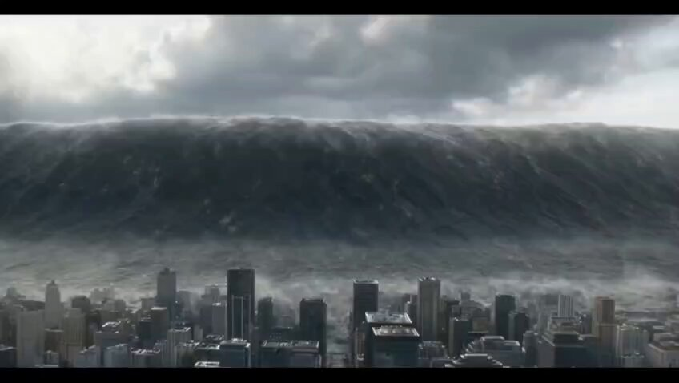

**พรอมต์**

```text
สร้างฉากภัยพิบัติในรูปแบบภาพยนตร์แสดงคลื่นสึนามิขนาดยักษ์กำลังเคลื่อนเข้าใกล้เมืองสมัยใหม่ภายใต้ท้องฟ้ามืดครึ้มที่มีพายุ วิดีโอเปิดด้วยมุมมองทางอากาศกว้างๆ ของคลื่นมหึมาที่ตระหง่านอยู่ด้านหลังเส้นขอบฟ้าเมือง ตามด้วยน้ำท่วมรุนแรงในระดับถนนและกระแสน้ำเชี่ยวกรากพัดผ่านตัวเมือง เรือบรรทุกสินค้าขนาดใหญ่ถูกพัดพาเข้าสู่แผ่นดินระหว่างตึกระฟ้าอย่างน่าทึ่ง สร้างบรรยากาศวันสิ้นโลกที่เหนือจริง รถยนต์ ท้องถนน อาคาร และโครงสร้างเมืองถูกคลื่นที่รุนแรง ซากปรักหักพัง ละอองน้ำ และน้ำท่วมกลืนกินอย่างสิ้นเชิง กล้องใช้ช็อตกว้างแบบภาพยนตร์ มุมมองมุมต่ำ การเคลื่อนไหวตามวัตถุ และการโคลสอัพที่น่าทึ่งเพื่อเน้นย้ำถึงขนาดของการทำลายล้าง แสงโทนสีเทาน้ำเงินที่ชวนให้อารมณ์หม่นหมอง เมฆหนาทึบ ฟิสิกส์ของน้ำที่สมจริง หมอกในบรรยากาศ และเอฟเฟกต์สภาพแวดล้อมที่ละเอียดสร้างรูปลักษณ์ของภาพยนตร์ภัยพิบัติฮอลลีวูดที่สมจริงราวกับภาพถ่าย ซีเควนซ์นี้รักษาความต่อเนื่องทางสายตาอย่างยอดเยี่ยมและการเคลื่อนไหวที่สมจริงตลอดทั้งเรื่อง และสิ้นสุดลงด้วยภาพที่เมืองถูกน้ำและหมอกกลืนกินไปเกือบทั้งหมด
```

[↑ กลับสู่หมวดหมู่](#catalog)

---

<a name="prompt-2101908482073252349"></a>

### พรอมต์ลำดับเวลาแนวภาพยนตร์ที่ระบุรายละเอียดการกลายร่างทีละขั้นตอนของชายคนหนึ่งเป็นมนุษย์หมาป่าในป่าสนใต้หมอกและแสงจันทร์

ผู้เขียน：[@AIwithWania](https://x.com/AIwithWania) · [โพสต์ต้นฉบับ](https://x.com/AIwithWania/status/2101908482073252349)

ภาพยนตร์ / ภาพนิ่งจากภาพยนตร์ · ตัวละคร · ทิวทัศน์ / ธรรมชาติ · เผยแพร่แล้ว

**สรุป:** พรอมต์ลำดับเวลาแนวภาพยนตร์ที่ระบุรายละเอียดการกลายร่างทีละขั้นตอนของชายคนหนึ่งเป็นมนุษย์หมาป่าในป่าสนใต้หมอกและแสงจันทร์

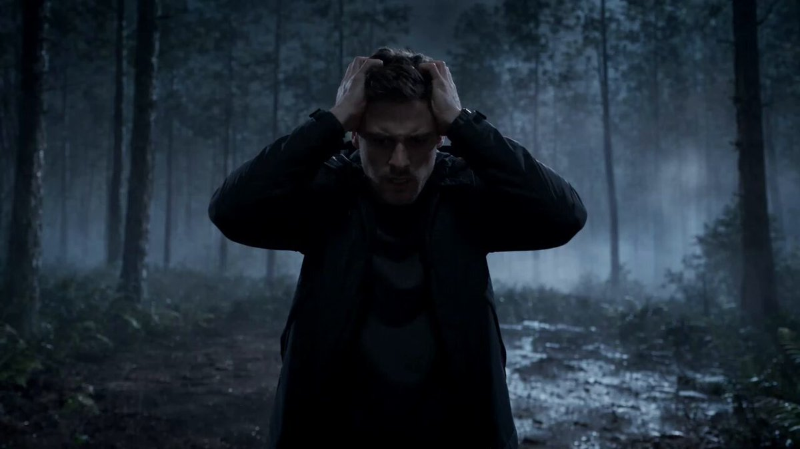

**พรอมต์**

```text
สร้างฉากการกลายร่างแนวดาร์กแฟนตาซีสไตล์ภาพยนตร์ในอัตราส่วน 16:9 ชายวัยผู้ใหญ่ที่สมจริงคนหนึ่ง มีผมสั้นสีเข้ม มีหนวดเคราจางๆ และสวมเสื้อผ้าสีดำ ยืนอยู่ตามลำพังในป่าสนที่หนาวเย็นและเต็มไปด้วยหมอกยามค่ำคืน รักษาใบหน้า รูปร่าง ทรงผม และอัตลักษณ์เดิมให้คงที่ตลอดทั้งคลิป

0–3 วินาที: ช็อตระยะปานกลางด้านหน้า เขาก้มตัวไปข้างหน้าเล็กน้อย ใช้มือทั้งสองข้างกุมศีรษะ หายใจหอบอย่างหนัก กล้องค่อยๆ ดันเข้าอย่างช้าๆ แสงจันทร์สีฟ้าอมเทาและหมอกที่ลอยละล่อง

3–6 วินาที: ช็อตโคลสอัพแบบแคบ กรามของเขาขบแน่น สีหน้าทวีความตึงเครียดอย่างรุนแรง และดวงตาค่อยๆ เปล่งประกายสีส้มอำพัน ขนเริ่มปรากฏรอบขมับ แก้ม และลำคอ ใบหูค่อยๆ กลายเป็นทรงแหลม

6–10 วินาที: การกลายร่างที่ต่อเนื่องและสมจริง: ใบหน้าเปลี่ยนเป็นเหมือนหมาป่า กรามยื่นยาวขึ้น ฟันแหลมคม ขนสีน้ำตาลเทาเข้มแผ่กระจายไปทั่วศีรษะ ไหล่ แขน และลำตัว ร่างกายเติบโตสูงใหญ่และมีกล้ามเนื้อมากขึ้น ไม่มีการเปลี่ยนรูปร่างแบบฉับพลัน ไม่มีการตัดต่อฉาก ไม่มีเลือดหรือฉากแหวะสยองขวัญ

10–12 วินาที: กล้องถอยหลังออกเพื่อเผยให้เห็นมนุษย์หมาป่าที่สมจริงและกลายร่างโดยสมบูรณ์จำนวนหนึ่งตัว พร้อมดวงตาสีอำพันที่เปล่งประกาย ขนหนานุ่ม ร่างกายกำยำ มือมีกรงเล็บ ขาเหมือนหมาป่า และหางที่เป็นธรรมชาติ มีพระจันทร์เต็มดวงอยู่หลังทิวไม้

12–15 วินาที: ช็อตมุมกว้างเต็มตัวที่ทรงพลัง มนุษย์หมาป่ายืนอยู่ในสายหมอก หายใจหนักหน่วง ขนปลิวไหวตามแรงลม จากนั้นค่อยๆ เงยหน้าขึ้นมองดวงจันทร์

สไตล์: คนแสดงจริงสมจริงขั้นสุด (ultra-realistic live-action), วิชวลเอฟเฟกต์ระดับภาพยนตร์ (cinematic VFX), แสงจันทร์แบบวอลูเมตริก (volumetric moonlight), เงามืดลึก, เส้นขนที่สมจริง, กายวิภาคที่เป็นธรรมชาติ, ระยะชัดลึก (depth of field), โมชันเบลอและเกรนฟิล์มที่แนบเนียน เสียง: ลมพัดในป่า, เสียงหายใจหอบหนัก, เสียงเบสทุ้มต่ำดังกึกก้อง, เสียงกระบวนการกลายร่าง และเสียงคำรามลึก ชายหนึ่งคนกลายร่างเป็นมนุษย์หมาป่าหนึ่งตัวพอดี ไม่มีร่างซ้ำซ้อน ไม่มีสิ่งมีชีวิตส่วนเกิน ไม่มีระยางค์เกิน ไม่มีลุคแบบการ์ตูน หรือกายวิภาคที่ผิดรูป
```

[↑ กลับสู่หมวดหมู่](#catalog)

---

<a name="prompt-2101901338267591008"></a>

### ลำดับเหตุการณ์แฟนตาซีระดับภาพยนตร์ความยาว 15 วินาทีที่ติดตามการล่าสมบัติของเด็กชายในป่าต้องมนตร์

ผู้เขียน：[@Elvorya](https://x.com/Elvorya) · [โพสต์ต้นฉบับ](https://x.com/Elvorya/status/2101901338267591008)

ภาพยนตร์ / ภาพนิ่งจากภาพยนตร์ · ตัวละคร · ทิวทัศน์ / ธรรมชาติ · เผยแพร่แล้ว

**สรุป:** ลำดับเหตุการณ์แฟนตาซีระดับภาพยนตร์ความยาว 15 วินาทีที่ติดตามการล่าสมบัติของเด็กชายในป่าต้องมนตร์

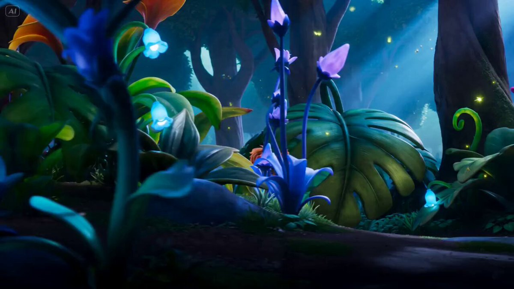

**พรอมต์**

```text
สร้างฉากการผจญภัยแฟนตาซีแบบภาพยนตร์ที่สมจริงเสมือนภาพถ่ายความยาว 15 วินาที ติดตามเด็กชายผู้รักการผจญภัยเดินทางผ่านป่าต้องมนตร์ลึกลับ เริ่มต้นด้วยช็อตสร้างบรรยากาศมุมต่ำที่เคลื่อนที่ช้าๆ ผ่านใบไม้ในป่าทึบขนาดใหญ่ ดอกไม้สีฟ้าเรืองแสง รากไม้ที่บิดเบี้ยว หิ่งห้อยที่ลอยละล่อง และอนุภาคเวทมนตร์ → เผยให้เห็นเด็กชายน้อยผมสีน้ำตาลแดงยุ่งเหยิง สวมเสื้อผจญภัยสีเหลือง กางเกงขาสั้นสีน้ำเงิน เป้สะพายหลังใบเล็ก และอุปกรณ์นักสำรวจ ขณะที่เขาเดินอย่างระมัดระวังผ่านป่า → เปลี่ยนฉากเป็นภาพโคลสอัพสไตล์ภาพยนตร์เมื่อเขาค้นพบแผนที่สมบัติเก่าแก่ที่วางอยู่บนหินปกคลุมด้วยมอสและศึกษามันด้วยความอยากรู้อยากเห็น → ตัดไปที่ช็อตติดตามแบบไดนามิกขณะที่เขาวิ่งข้ามรากไม้ขนาดยักษ์และเดินตามเส้นทางลึกลับลึกเข้าไปในป่า → เปลี่ยนฉากเป็นอุโมงค์คดเคี้ยวอันมืดมิดที่เกิดจากรากไม้ขนาดมหึมา ที่ซึ่งหีบสมบัติโบราณสีทองตั้งอยู่และเรืองแสงในระยะไกล → เผยให้เห็นสิ่งมีชีวิตเวทมนตร์ชั่วร้ายคล้ายแม่มดสีเขียวสวมหมวกทรงแหลมสีดำใบใหญ่โผล่ออกมาอย่างน่าทึ่งจากควันเวทมนตร์สีเขียวที่หมุนวนใกล้หีบสมบัติทันที → ตัดไปที่เด็กชายที่ยืนหยัดอย่างมั่นคงขณะที่พลังงานเวทมนตร์สีฟ้าเริ่มเรืองแสงรอบมือของเขา สีหน้าของเขาเปลี่ยนจากความกลัวเป็นความมุ่งมั่น → เปลี่ยนฉากเป็นภาพโคลสอัพที่น่าตื่นเต้นขณะที่เขายกมือที่เรืองแสงขึ้นเผชิญหน้ากับภัยคุกคามทางเวทมนตร์ แสงสีฟ้าเข้มข้นส่องสว่างใบหน้าของเขา → ตัดกลับไปที่หีบสมบัติโบราณที่เปิดออกภายในป่าต้องมนตร์ เผยให้เห็นกองเหรียญทองและเพชรสีฟ้าเรืองแสงเจิดจรัส → ช็อตสุดท้ายกลายเป็นช็อตมุมกว้างจากมุมต่ำอันกล้าหาญของนักผจญภัยรุ่นเยาว์ที่ยืนอยู่อย่างภาคภูมิใจใต้ต้นไม้ใหญ่ที่บิดเบี้ยว ขณะที่แสงแดดสีทองอบอุ่นส่องผ่านยอดไม้ในป่า ถือเพชรสีฟ้าเรืองแสงโดยมีอนุภาคเวทมนตร์ลอยอยู่รอบตัวเขา

บรรยากาศการผจญภัยแฟนตาซีระดับภาพยนตร์ แอนิเมชันตัวละครที่แสดงอารมณ์พร้อมการเคลื่อนไหวที่เป็นธรรมชาติและน่าเชื่อถือ สีหน้าละเอียด การเคลื่อนไหวของร่างกายที่สมจริง การออกแบบมุมกล้องที่น่าทึ่ง การเปลี่ยนฉากอย่างราบรื่น ความชัดตื้น แสงเชิงปริมาตร พืชเรืองแสงทางชีวภาพ ผิวสัมผัสของป่าที่สมจริง หมอกในบรรยากาศ อนุภาคเวทมนตร์ ความเปรียบต่างของสีน้ำเงินและสีทองสไตล์ภาพยนตร์ แสงขอบที่น่าทึ่ง รายละเอียดสิ่งแวดล้อมที่สมบูรณ์ งานภาพยนตร์แอนิเมชันระดับไฮเอนด์ที่ประณีต การเล่าเรื่องที่ชวนดื่มด่ำ รูปลักษณ์และเสื้อผ้าของตัวละครที่สอดคล้องกันตลอดทุกช็อต ความรู้สึกถึงขนาดที่ชัดเจน การพัฒนาทางอารมณ์จากความอยากรู้อยากเห็นไปสู่ภยันตรายและชัยชนะ มิติความลึกแบบภาพยนตร์ แสงแบบไดนามิก เงาที่สมจริง ความรู้สึกของภาพยนตร์ผจญภัยระดับมหากาพย์

ไม่มีคำบรรยาย ไม่มีข้อความ ไม่มีโลโก้ ไม่มีลายน้ำ ไม่มีใบหน้าที่บิดเบี้ยว ไม่มีนิ้วเกิน ไม่มีมือผิดรูป ไม่มีตัวละครซ้ำซ้อน ไม่มีเสื้อผ้าที่ไม่สอดคล้องกัน ไม่มีการแปลงร่างของตัวละคร ไม่มีสิ่งของสุ่ม ไม่มีแสงที่แบนเรียบ ไม่มี CGI ราคาถูก ไม่มีสภาพแวดล้อมที่มีรายละเอียดต่ำ ไม่มีการกะพริบ ไม่มีการสั่นไหว ไม่มีการเคลื่อนไหวที่ไม่เป็นธรรมชาติ
```

[↑ กลับสู่หมวดหมู่](#catalog)

---

<a name="prompt-2101801894410920335"></a>

### ช็อตภาพยนตร์ของร่างในชุดกิโมโนสีเข้มและหมวกคาซะกำลังเดินไปตามถนนไม้แคบๆ ที่เปียกชื้นและเรียงรายด้วยโคมกระดาษในยามค่ำคืน

ผู้เขียน：[@studiokagurajp](https://x.com/studiokagurajp) · [โพสต์ต้นฉบับ](https://x.com/studiokagurajp/status/2101801894410920335)

ภาพยนตร์ / ภาพนิ่งจากภาพยนตร์ · ทิวทัศน์เมือง / ถนน · เผยแพร่แล้ว

**สรุป:** ช็อตภาพยนตร์ของร่างในชุดกิโมโนสีเข้มและหมวกคาซะกำลังเดินไปตามถนนไม้แคบๆ ที่เปียกชื้นและเรียงรายด้วยโคมกระดาษในยามค่ำคืน

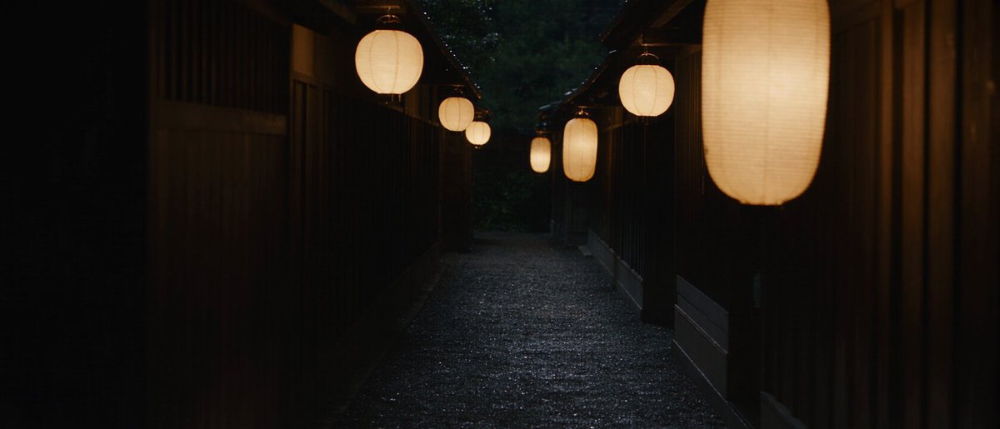

**พรอมต์**

```text
ฉาก: ถนนไม้แคบๆ ในยามค่ำคืน, 16:9 กล้องล็อกตำแหน่งระดับหน้าอก โคมกระดาษใต้ชายคาเรียงรายลึกเข้าไปในฉาก พื้นดินเปียกอัดแน่น ไม่ใช่ยางมะตอย ผู้ใหญ่ วัยสามสิบ ในชุดกิโมโนสีเข้มและหมวกคาซะ (kasa) ทรงลึก เริ่มเดินจากขอบขวาของเฟรม ใบหน้าถูกบดบังด้วยปีกหมวก ไม่มีบุคคลที่สอง ไม่มีซุ้มประตูศาลเจ้า ไม่มีป้ายร้านค้าที่อ่านออกได้

การเคลื่อนไหว: ร่างนั้นเดินไปทางซ้ายผ่านเฟรมอย่างต่อเนื่องในครั้งเดียวแล้วลับตาไป การเดินมีน้ำหนัก ปีกหมวกคาซะไม่เคยเปิดขึ้น กล้องไม่แพนตาม ไม่มีบุคคลที่สอง ไม่มีการหันกลับมามอง

การโฟกัส: คมชัดกริบที่หัวไหล่ของร่างที่กำลังเดินและผิวกระดาษของโคมไฟที่อยู่ใกล้ที่สุด ชายคาที่อยู่ไกลออกไปเบลอลงหนึ่งสต็อป

ฟิสิกส์: ร่างกายมีน้ำหนัก เท้าเหยียบย่ำลงบนพื้นเปียก บุคคลไม่เลื่อนไถลหรือลอยตัว ชายผ้าทิ้งตัวช้ากว่าเล็กน้อยแล้วจึงเคลื่อนตาม

แสง: แสงอุ่นจากโคมไฟเท่านั้น มีความมืดโทนเย็นคั่นอยู่ระหว่างโคม ไม่มีเสาไฟถนนสมัยใหม่ ไม่มีไฟส่องหน้าเพื่อความงาม — ไม่เห็นใบหน้า

สไตล์: แนวภาพยนตร์สมจริงเหมือนภาพถ่าย, ยุคโบราณของญี่ปุ่น, ไม้เปียกชื้นและโคมกระดาษทาน้ำมัน, เกรนภาพนุ่มนวล ไม่มีสไตล์อนิเมะ ไม่มีข้อความ ไม่มีลายน้ำ ไม่มีโลโก้

เสียง: เสียงประกอบในฉากเท่านั้น (Diegetic SFX) ไม่มีดนตรี ไม่มีดนตรีประกอบ ไม่มีเสียงร้องเพลง ไม่มีการพูดคุย ไม่มีการบรรยาย เสียงฝีเท้าที่หนักแน่นบนพื้นดินเปียกอัดแน่น เสียงผ้าเนื้อนุ่ม เสียงอากาศยามค่ำคืนระหว่างแนวโคมไฟ เสียงจะค่อยๆ หายไปพร้อมกับการจากไปของร่างนั้น
```

[↑ กลับสู่หมวดหมู่](#catalog)

---

<a name="prompt-2101541610035064931"></a>

### ช็อตซีเควนซ์แบบภาพยนตร์ตามลำดับภาพของเด็กสาวมัธยมปลายชาวเกาหลีผมสีชมพูแสดงกายกรรมตีลังกากลับหลังพร้อมโยนและรับถาดอาหารกลางวันโดยไม่หกเลอะเทอะในโรงอาหาร

ผู้เขียน：[@Zorax\_Ai](https://x.com/Zorax_Ai) · [โพสต์ต้นฉบับ](https://x.com/Zorax_Ai/status/2101541610035064931)

ภาพยนตร์ / ภาพนิ่งจากภาพยนตร์ · ตัวละคร · เผยแพร่แล้ว

**สรุป:** ช็อตซีเควนซ์แบบภาพยนตร์ตามลำดับภาพของเด็กสาวมัธยมปลายชาวเกาหลีผมสีชมพูแสดงกายกรรมตีลังกากลับหลังพร้อมโยนและรับถาดอาหารกลางวันโดยไม่หกเลอะเทอะในโรงอาหาร

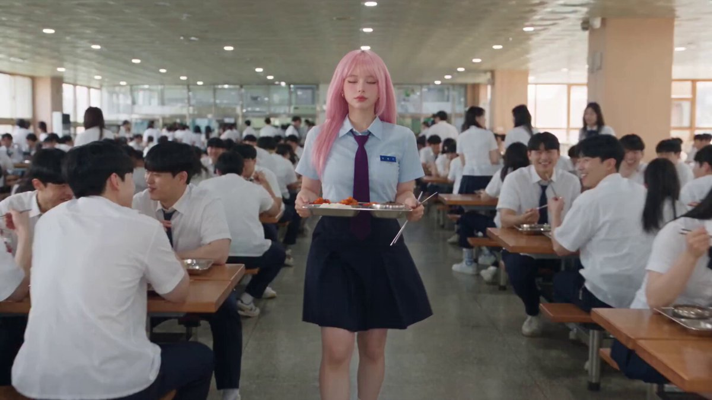

**พรอมต์**

```text
ซีรีส์เกาหลีแนววัยรุ่นมัธยมปลายสไตล์ภาพยนตร์, ซีเควนซ์ช็อตต่อเนื่อง 22 วินาที, คนแสดงสมจริง (photoreal live-action), 24fps, ระยะชัดตื้นถึงปานกลาง, แสงไฟนีออนในโรงอาหารตามธรรมชาติผสมกับแสงแดดริมหน้าต่าง, การเกรดสีโทนอุ่นเล็กน้อย
โรงอาหารโรงเรียนมัธยมปลายเกาหลีที่พลุกพล่าน: โต๊ะไม้ยาว, ม้านั่งโลหะ, พื้นกระเบื้องเงาจางๆ, ฝ้าเพดานลายตารางวาฟเฟิลสีขาว, ไฟนีออนแบบแขวน นักเรียนหลายสิบคนในชุดนักเรียนฤดูร้อนแขนสั้นสีฟ้าพาสเทล ผูกเนกไทสีม่วง (ชาย) และโบผูกผมสีชมพู (หญิง) กำลังรับประทานอาหารจากถาดหลุมสแตนเลส
นางเอก: หญิงชาวเกาหลีช่วงอายุ 20 ต้นๆ @[Image 1](image_1) แต่งกายเป็นนักเรียนมัธยมปลายปีสุดท้าย — ผมยาวตรงสีชมพูพาสเทลแสกกลางพร้อมสไลด์ไล่ระดับกรอบหน้า, แต่งหน้าบางเบา, ริมฝีปากฉ่ำวาว, เสื้อเชิ้ตนักเรียนแขนสั้นสีชมพูพาสเทล, โบผูกคอสีน้ำเงินเข้ม, กระโปรงสั้นสีชมพูพาสเทล, ถุงเท้าครึ่งแข้งสีขาว, รองเท้าผ้าใบสีขาวทรงหนา (chunky sneakers), ป้ายชื่อสีน้ำเงินขนาดเล็กบนหน้าอก เธอเดินไปตามทางเดินตรงกลาง ถือถาดอาหารสแตนเลส 5 หลุมด้วยมือทั้งสองข้าง สิ่งของในถาด: ข้าวสวยพูนๆ, ต๊อกบกกีทรงกระบอกสีแดงรสเผ็ด, กิมจิกองหนึ่ง, นามุลผักปรุงรส และถ้วยซุปโลหะขนาดเล็กใส่สตูว์สีแดง ช้อนและตะเกียบวางอยู่บนถาด
ช็อต 1 (0–1 วินาที): ช็อตติดตามมุมกว้างปานกลาง (Medium-wide tracking shot) เธอเดินตรงมาทางกล้องตามทางเดิน สีหน้าสงบ ถือถาดขนานในระดับเอว นักเรียนเบื้องหลังหัวเราะและรับประทานอาหาร
ช็อต 2 (1 วินาที): ช็อตแทรกมุมต่ำระยะประชิดที่เท้าของเธอ เธอใช้ส้นรองเท้าผ้าใบสีขาวข้างซ้ายถูกับพื้นขัดเงา จากนั้นวางเท้าทั้งสองข้างอย่างมั่นคง
ช็อต 3 (2 วินาที): ช็อตโคลสอัปปานกลางที่ใบหน้าของเธอขณะที่เธอเงยหน้าขึ้น ตกใจเล็กน้อย ผมสะบัดพริ้ว
ช็อต 4–6 (3–6 วินาที): ซีเควนซ์อาหาร VFX สโลว์โมชัน เธอโยนถาดขึ้นด้านบน ถาดและช้อนส้อมลอยนิ่งกลางอากาศ ชิ้นต๊อกบกกี กิมจิ และนามุลลอยขึ้นจากช่องหลุมและลอยเป็นเส้นตรงแนวนอนเหนือถาด ราวกับแรงโน้มถ่วงหยุดทำงาน ตัดไปที่มุมมองจากด้านบน: อาหารตกลงกลับเข้าไปในแต่ละช่องหลุมอย่างสมบูรณ์แบบ ถ้วยซุปยังคงตั้งตรง ไม่มีอะไรหกเลอะเทอะ
ช็อต 7 (7 วินาที): มุมกว้าง เธอทิ้งตัวลงทำท่าแบ็คแฮนด์สปริง / ล้อเกวียนอย่างรวดเร็วบนพื้นโรงอาหาร กระโปรงสะบัด รองเท้าผ้าใบข้างหนึ่งเตะสูง นักเรียนที่โต๊ะใกล้เคียงชะงักและจ้องมอง
ช็อต 8 (8 วินาที): เธอลงพื้นพร้อมหมุนตัว ผมสะบัด และรับถาดกับช้อนส้อมที่ตกลงมาด้วยการเคลื่อนไหวที่ลื่นไหลเพียงจังหวะเดียวโดยไม่มีอาหารหล่น
ช็อต 9–11 (9–11 วินาที): ช็อตโคลสอัปมือที่จับตะเกียบและช้อน ตามด้วยช็อตบิวตี้ตัวเอกของถาดที่จัดเสร็จสมบูรณ์ยื่นเข้าหากล้อง — ข้าว ต๊อกบกกี กิมจิ นามุล และสตูว์ ล้วนจัดวางอย่างประณีตสมบูรณ์แบบ
ช็อต 12 (12 วินาที): ตัดไปที่โต๊ะของกลุ่มเด็กผู้ชาย เด็กหนุ่มหน้าตาดีผมสีเข้มในเสื้อเชิ้ตสีขาวและเนกไทสีกรมท่าหันมา อ้าปากค้างด้วยความตกใจ เพื่อนๆ รอบตัวเขาต่างอ้าปากตาค้าง
ช็อต 13–14 (13–14 วินาที): โคลสอัปบิวตี้ระยะประชิดที่ใบหน้าของนางเอก จ้องมองมาที่กล้อง แล้วยิ้มมุมปากอย่างรู้ทัน
ช็อต 15–20 (15–20 วินาที): เธอเดินผ่านโต๊ะของเด็กหนุ่มที่กำลังตกตะลึง ถาดอาหารอยู่ในมือซ้าย เหลือบมองลงมาที่เขา บทพูดเบาๆ เป็นภาษาเกาหลี มีคำบรรยาย: “Let’s eat and see.” เขาก้มหน้าลงด้วยความเขินอาย เธอเดินต่อไป
ช็อต 21 (21 วินาที): ช็อตติดตามจากด้านหลังขณะที่เธอเดินออกไปตามทางเดิน ผมยาวและกระโปรงสีกรมท่า โรงอาหารกลับมาจอแจมีชีวิตชีวาอีกครั้งด้านหลังเธอ
หมายเหตุสไตล์: การกำกับภาพซีรีส์เกาหลีระดับไฮเอนด์ (คล้ายกับแนวโรแมนติกวัยรุ่นเคลือบเงา / แฟนตาซีในโรงเรียน), ฉากโรงอาหารสมจริง, สโลว์โมชันแนบเนียนเฉพาะจังหวะอาหารลอยตัวและจังหวะตีลังกา, VFX สะอาดตาเพื่อให้อาหารไม่เลอะเปรอะเปื้อนหรือดูเป็นการ์ตูน, ไม่มีโลโก้, ไม่มีข้อความบนหน้าจอยกเว้นคำบรรยายภาษาเกาหลีเสริมในประโยคเดียว
เชิงลบ (Negative): อาหารหกเลอะเทอะ, ถาดแตกหัก, โรงอาหารแบบตะวันตก, ชุดทำงานผู้ใหญ่, สีหน้าการ์ตูนอนิเมะเกินจริง, วิดีโอสั่นไหวจากมือถือ, ลายน้ำ
```

[↑ กลับสู่หมวดหมู่](#catalog)

---

<a name="prompt-2101752882890407941"></a>

### เสื้อโค้ตสีแดงเข้มตัวหนึ่งเดินขึ้นบันไดขณะที่ทะเลหมวกฮู้ดสีเทากลั้นหายใจ จากนั้นร่มก็เปิดออกเป็นระลอกคลื่น

ผู้เขียน：[@aaassa120](https://x.com/aaassa120) · [โพสต์ต้นฉบับ](https://x.com/aaassa120/status/2101752882890407941)

ภาพยนตร์ / ภาพนิ่งจากภาพยนตร์ · เผยแพร่แล้ว

**สรุป:** เสื้อโค้ตสีแดงเข้มตัวหนึ่งเดินขึ้นบันไดขณะที่ทะเลหมวกฮู้ดสีเทากลั้นหายใจ จากนั้นร่มก็เปิดออกเป็นระลอกคลื่น

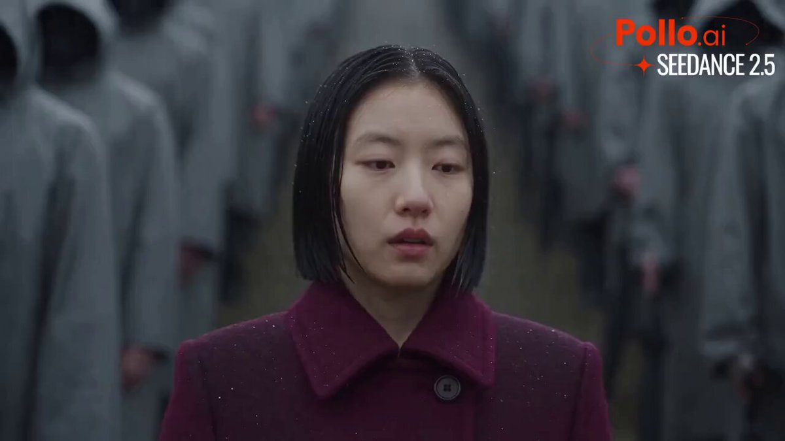

**พรอมต์**

```text
เสื้อโค้ตสีแดงเข้มตัวหนึ่งเดินขึ้นบันไดขณะที่ทะเลหมวกฮู้ดสีเทากลั้นหายใจ จากนั้นร่มก็เปิดออกเป็นระลอกคลื่น 🌂\n\nกล้องค่อยๆ ถอยห่างออกไปเรื่อยๆ จนกระทั่งเธอกลายเป็นเพียงเส้นด้ายสีแดงในวิหารคอนกรีต
```

[↑ กลับสู่หมวดหมู่](#catalog)

---

<a name="prompt-2101676857850552488"></a>

### กำลังแปล

ผู้เขียน：[@johnAGI168](https://x.com/johnAGI168) · [โพสต์ต้นฉบับ](https://x.com/johnAGI168/status/2101676857850552488)

ภาพยนตร์ / ภาพนิ่งจากภาพยนตร์ · ตัวละคร · สัตว์ / สิ่งมีชีวิต · เผยแพร่แล้ว

**สรุป:** กำลังแปล

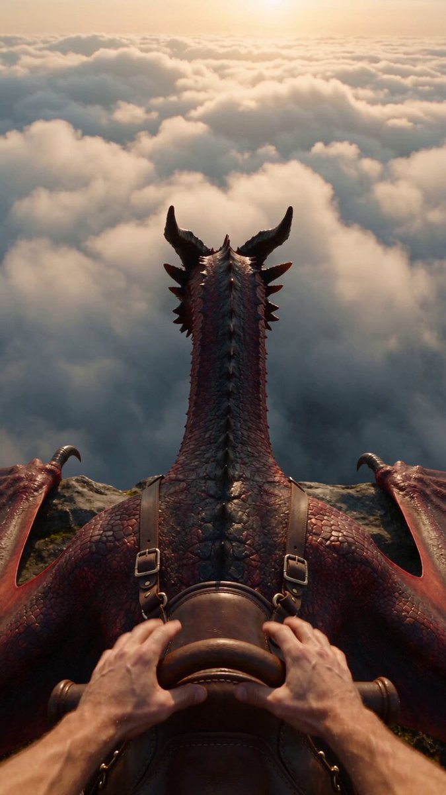

**พรอมต์**

```text
กำลังแปล
```

[↑ กลับสู่หมวดหมู่](#catalog)

---

<a name="prompt-2101642532593836182"></a>

### กำลังแปล

ผู้เขียน：[@john87445528](https://x.com/john87445528) · [โพสต์ต้นฉบับ](https://x.com/john87445528/status/2101642532593836182)

คอมิก / สตอรี่บอร์ด · ภาพยนตร์ / ภาพนิ่งจากภาพยนตร์ · ตัวละคร · เผยแพร่แล้ว

**สรุป:** กำลังแปล

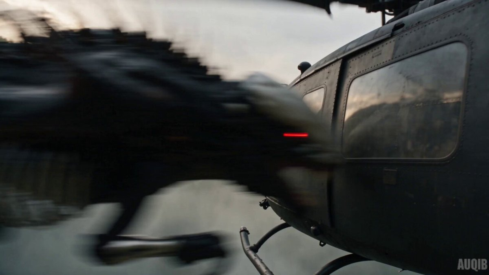

**พรอมต์**

```text
กำลังแปล
```

[↑ กลับสู่หมวดหมู่](#catalog)

---

<a name="prompt-2101528965110501762"></a>

### ฉากอนิเมะสไตล์ภาพยนตร์ของชายหนุ่มกำลังทำและกินราเมนรอบดึกริมหน้าต่างในคืนฝนตก

ผู้เขียน：[@Elvorya](https://x.com/Elvorya) · [โพสต์ต้นฉบับ](https://x.com/Elvorya/status/2101528965110501762)

ภาพยนตร์ / ภาพนิ่งจากภาพยนตร์ · อนิเมะ / มังงะ · ตัวละคร · อาหาร / เครื่องดื่ม · เผยแพร่แล้ว

**สรุป:** ฉากอนิเมะสไตล์ภาพยนตร์ของชายหนุ่มกำลังทำและกินราเมนรอบดึกริมหน้าต่างในคืนฝนตก

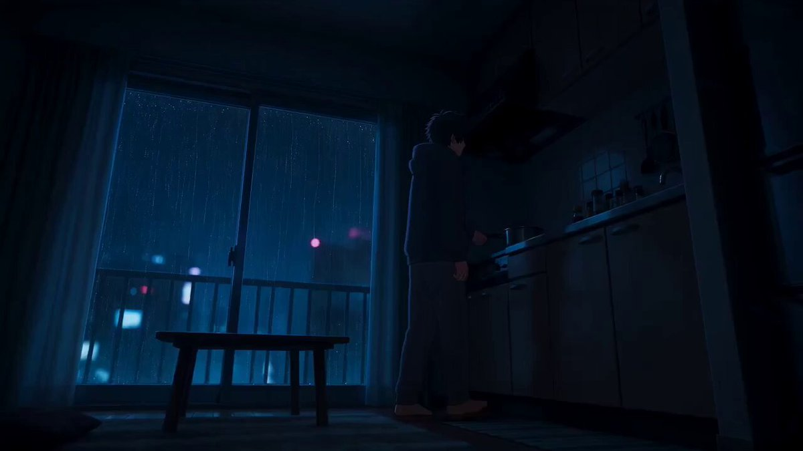

**พรอมต์**

```text
สร้างฉากอนิเมะแนวชีวิตประจำวันแบบภาพยนตร์ความยาว 30 วินาที ติดตามชายหนุ่มคนหนึ่งในค่ำคืนที่เงียบสงบและมีฝนตกที่บ้าน เริ่มต้นด้วยช็อตกว้างที่เต็มไปด้วยบรรยากาศ เขายืนอยู่คนเดียวในครัวของอพาร์ตเมนต์สลัวๆ ข้างหน้าต่างบานใหญ่ที่มีหยดฝนเกาะ โดยมองเห็นแสงไฟในเมืองที่ส่องประกายอยู่ด้านนอก → เปลี่ยนฉากเป็นภาพโคลสอัปที่อบอุ่นเมื่อเขาวางหม้อบนเตาและเริ่มเตรียมมื้อดึก → ตัดไปยังภาพโคลสอัปอาหารจากมุมมองด้านบนขณะที่เส้นบะหมี่เส้นเล็กกำลังต้มอยู่ในน้ำเดือดพล่าน ล้อมรอบด้วยไอน้ำที่ลอยขึ้นมา → เปลี่ยนเป็นภาพโคลสอัปอย่างใกล้ชิดขณะที่เขาตอกไข่สดลงในชามใบเล็กข้างเตา → ตัดไปยังภาพมาโครที่มีรายละเอียดของตะเกียบที่คีบเส้นบะหมี่ที่เพิ่งต้มสุกขึ้นมาจากหม้อที่มีไอร้อน → เปลี่ยนเป็นภาพโคลสอัปสไตล์ภาพยนตร์เมื่อนำเส้นบะหมี่ใส่ลงในชามแล้วท็อปปิ้งด้วยไข่ต้มยางมะตูม ต้นหอมซอย และพริกป่นสีแดง → ตัดเป็นภาพมีเดียมช็อตที่อบอุ่นขณะที่เขาประคองชามที่มีไอความร้อนอย่างระมัดระวังด้วยมือทั้งสองข้าง → เปลี่ยนเป็นภาพภายในห้องมุมกว้างยามค่ำคืนขณะที่เขานั่งคนเดียวที่โต๊ะเล็กๆ ข้างหน้าต่างที่ฝนตก มองออกไปที่เมืองที่ส่องประกายด้านนอกอย่างเงียบๆ → ตัดเป็นภาพเอ็กซ์ตรีมโคลสอัปของอาหารขณะที่ตะเกียบคีบเส้นบะหมี่ขึ้นมาข้างๆ ท็อปปิ้งไข่และพริกป่น → เปลี่ยนเป็นภาพโคลสอัปด้านข้างที่ใกล้ชิดขณะที่เขานำเส้นบะหมี่เข้าปากและค่อยๆ กัดเคี้ยวอย่างช้าๆ → ช็อตสุดท้ายสลับไปมาระหว่างใบหน้าที่สงบของเขา ราเมนที่มีไอกรุ่น และแสงไฟเมืองที่ฝนตกสะท้อนผ่านหน้าต่าง จบลงด้วยช็อตกว้างที่เงียบสงบของเขานั่งอยู่คนเดียวพร้อมกับอาหารอันอบอุ่น

การถ่ายทำอนิเมะที่เป็นธรรมชาติ, แอนิเมชันตัวละครวาดมือที่มีรายละเอียด, การเล่าเรื่องแบบสไลซ์ออฟไลฟ์สไตล์ภาพยนตร์, การเคลื่อนไหวของอาหารที่สมจริง, การแสดงออกทางสีหน้าที่ละเอียดอ่อน, การเคลื่อนไหวของกล้องที่นุ่มนวล, การเปลี่ยนฉากที่ลื่นไหลระดับภาพยนตร์, ระยะชัดตื้น, พื้นผิวราเมนที่มีรายละเอียดสูง, ควันไอน้ำลอยขึ้น, แสงไฟสีส้มอบอุ่นในครัวตัดกับแสงสียามค่ำคืนสีน้ำเงินเย็นตา, กระจกที่เปียกฝน, โบเก้แสงไฟในเมืองที่มีสีสัน, แสงสะท้อนที่สร้างบรรยากาศ, เงาที่นุ่มนวล, การตกแต่งภายในอพาร์ตเมนต์ที่มีรายละเอียด, การจัดเฟรมที่ใกล้ชิด, อารมณ์เหงาอันสงบ, บรรยากาศยามค่ำคืนที่ชวนให้คิดถึงอดีต, รูปลักษณ์ของตัวละครที่สอดคล้องกันตลอดทุกฉาก ไม่เอารูปลักษณ์ภาพคนจริงที่สมจริง, ไม่มีรูปลักษณ์ 3D CGI, ไม่มีใบหน้าที่บิดเบี้ยว, มือที่ไม่เป็นธรรมชาติ, นิ้วเกิน, การแสดงออกทางสีหน้าที่เกินจริง, ความไม่สอดคล้องกันของตัวละคร, อาการภาพกระพริบ, คำบรรยาย, ข้อความ, โลโก้ หรือลายน้ำ
```

[↑ กลับสู่หมวดหมู่](#catalog)

---

<a name="prompt-2101442950647697549"></a>

### ฉากตรอกยามค่ำคืนยุคเอโดะสไตล์ภาพยนตร์ นำเสนอพ่อค้าขายโซบะพร้อมไอน้ำที่ลอยกรุ่น

ผู้เขียน：[@studiokagurajp](https://x.com/studiokagurajp) · [โพสต์ต้นฉบับ](https://x.com/studiokagurajp/status/2101442950647697549)

ภาพยนตร์ / ภาพนิ่งจากภาพยนตร์ · เผยแพร่แล้ว

**สรุป:** ฉากตรอกยามค่ำคืนยุคเอโดะสไตล์ภาพยนตร์ นำเสนอพ่อค้าขายโซบะพร้อมไอน้ำที่ลอยกรุ่น

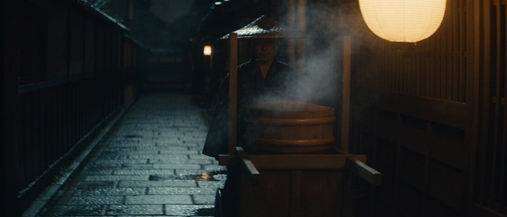

**พรอมต์**

```text
ฉาก: ตรอกยามค่ำคืนในยุคเอโดะ, 16:9 กล้องล็อกมุมสามส่วนสี่ถ่ายแผงขายโซบะไม้แบบหาบ ไม่มีล้อ โคมไฟกระดาษอันดง (andon) ส่องแสงเรืองรองหนึ่งดวง มีหม้อต้มเดือดวางอยู่บนแผง พ่อค้าวัยผู้ใหญ่ อายุสามสิบกว่าๆ สวมหมวกคาซะ (kasa) ใบหน้ายังคงซ่อนอยู่ใต้ปีกหมวก ไม่มีใบหน้าบุคคลที่สอง ไม่มีตัวอักษรที่อ่านออกได้บนผ้าม่านโนเรนหรือโคมไฟ

การเคลื่อนไหว: ไอน้ำลอยม้วนตัวขึ้นมาจากหม้อแล้วเคลื่อนผ่านหน้าเลนส์เป็นแผ่นบางๆ ช้าๆ ก่อนจะจางหายไป พ่อค้าไม่เงยหน้าขึ้นมา ไม่มีการเทลงในชาม ไม่มีลูกค้าก้าวเข้ามา

โฟกัส: คมกริบที่ขอบของไอน้ำ ขอบหม้อ และกระดาษของโคมไฟอันดง ส่วนแผ่นไม้ของตรอกจะนุ่มนวลเบลอลงหนึ่งสต็อป

ฟิสิกส์: ไอน้ำมีความร้อนและเปียกชื้น มันลอยเคว้งแล้วค่อยๆ สลายไป ไม่ดูเหมือนน้ำแข็งแห้งหรือเครื่องพ่นควัน ไม่มีเส้นริบบิ้นแบบ CGI

แสง: โคมไฟอันดงเป็นแสงหลักโทนอุ่นเพียงแหล่งเดียว บรรยากาศรอบๆ เป็นค่ำคืนที่เย็นเยียบและเปียกชื้น แสงสะท้อนประกายเกิดขึ้นเฉพาะบนน้ำซุปเท่านั้น

สไตล์: สมจริงระดับภาพยนตร์แนวย้อนยุคของญี่ปุ่น ควันไม้และแสงเรืองจากกระดาษเคลือบน้ำมัน เกรนภาพนุ่มนวล ไม่มีแอนิเมะ ไม่มีข้อความ ไม่มีลายน้ำ ไม่มีโลโก้

เสียง: เสียงเอฟเฟกต์เฉพาะในฉาก (Diegetic SFX) เท่านั้น ไม่มีดนตรี ไม่มีสกอร์เพลง ไม่มีการร้องเพลง ไม่มีคำพูด ไม่มีการบรรยาย ไม่มีเสียงพ่อค้าเรียกลูกค้า มีเสียงเดือดเบาๆ และเสียงฟู่ของไอน้ำเปียกชื้นขณะที่แผ่นไอน้ำเคลื่อนผ่านเลนส์ เสียงบรรยากาศตรอกยามค่ำคืนอันไกลโพ้น
```

[↑ กลับสู่หมวดหมู่](#catalog)

---

<a name="prompt-2101173902307467397"></a>

### ภาพยนตร์แอ็กชันสั้นสมจริงของหญิงสาวในสถานีรถไฟใต้ดินที่รับมือกับผู้โจมตีสามคนและจบลงด้วยรถไฟเข้าเทียบชานชาลา

ผู้เขียน：[@nawalsehar](https://x.com/nawalsehar) · [โพสต์ต้นฉบับ](https://x.com/nawalsehar/status/2101173902307467397)

การถ่ายภาพ · ภาพยนตร์ / ภาพนิ่งจากภาพยนตร์ · ตัวละคร · ยานพาหนะ · เผยแพร่แล้ว

**สรุป:** ภาพยนตร์แอ็กชันสั้นสมจริงของหญิงสาวในสถานีรถไฟใต้ดินที่รับมือกับผู้โจมตีสามคนและจบลงด้วยรถไฟเข้าเทียบชานชาลา

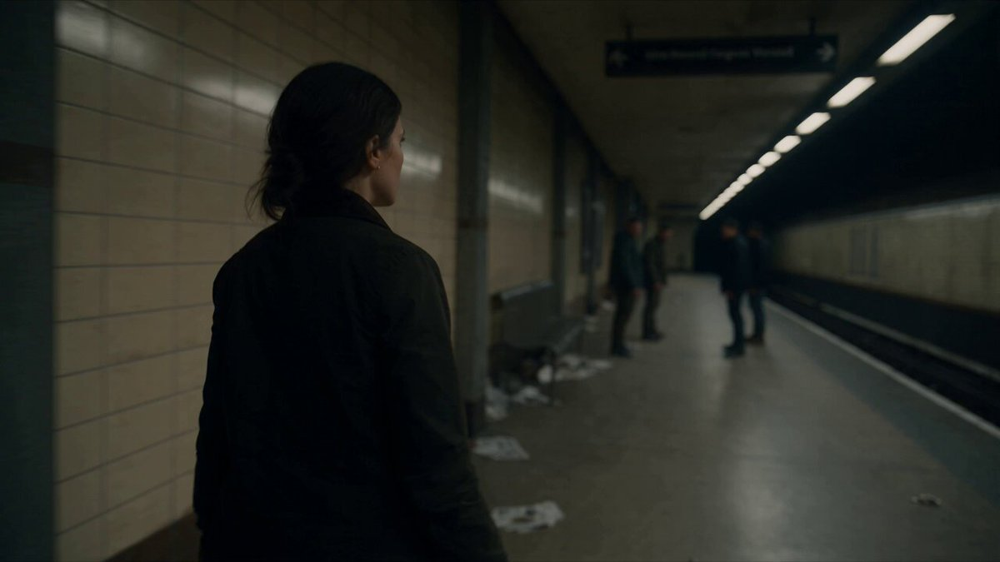

**พรอมต์**

```text
สร้างฉากแอ็กชันทริลเลอร์ไลฟ์แอ็กชันยามค่ำคืนที่มีความสมจริงระดับภาพถ่ายความยาว 30 วินาที ภายในสถานีรถไฟใต้ดินที่แทบจะร้างผู้คน ผู้หญิงคนหนึ่งพบว่าตัวเองถูกล้อมด้วยผู้โจมตีไร้อาวุธสามคน เธอตั้งสติ หลบหลีกการรุกคืบ เบี่ยงเบนแรงปะทะของพวกเขา และใช้สภาพแวดล้อมของสถานีเพื่อสร้างระยะห่างโดยไม่มีการเคลื่อนไหวแบบเหนือมนุษย์ เมื่อการเผชิญหน้าทวีความรุนแรงขึ้น รถไฟที่กำลังแล่นเข้ามาก็เปลี่ยนบรรยากาศ—รางรถไฟเริ่มสั่นสะเทือน เศษกระดาษปลิวว่อนบนชานชาลา ลมพัดแรงขึ้นผ่านอุโมงค์ และแสงไฟหน้ารถไฟกวาดไปทั่วสถานี รักษาทุกท่วงท่าให้สมจริงตามหลักฟิสิกส์ ด้วยชีวกลศาสตร์ ความเสียดทาน โมเมนตัม การทรงตัว การชนปะทะ และการมีปฏิสัมพันธ์กับสิ่งแวดล้อมที่สมจริง ใช้การถือกล้องติดตามสไตล์ภาพยนตร์ ช็อตกว้างเพื่อบอกตำแหน่งการต่อสู้ที่ชัดเจน ช็อตปฏิกิริยาแบบโคลสอัพ ภาพรถไฟมุมต่ำ แสงไฟฟลูออเรสเซนต์ที่สมจริง โมชันเบลอตามธรรมชาติ การโฟกัสอัตโนมัติ และการสั่นไหวของกล้องอย่างแนบเนียน ใช้เสียงในเหตุการณ์จริงเท่านั้น: เสียงฝีเท้า เสียงหายใจ เสียงกระแทก เสียงขูดของโลหะ เสียงรางสั่น เสียงหวูดรถไฟ ลมพัดกระโชก เสียงเบรก และเสียงเปิดประตู จบด้วยการที่รถไฟมาถึงขณะที่หญิงสาวพักหายใจ หันหลังให้กลุ่มผู้โจมตี และเดินตรงไปยังประตูที่เปิดออก ปราศจากลุคแบบซีจีไอ แอนิเมชัน พลังซูเปอร์ฮีโร่ สลิงวิชาตัวเบา ตัวละครลอยกระเด็น อาวุธ เลือดสาด ฟิสิกส์ที่เป็นไปไม่ได้ สรีระผิดเพี้ยน ตัวละครซ้ำซ้อน กล้องสั่นไหวมากเกินไป พฤติกรรมเสี่ยงอันตรายบนราง คำบรรยาย โลโก้ หรือลายน้ำ
```

[↑ กลับสู่หมวดหมู่](#catalog)

---

<a name="prompt-2101326226891972799"></a>

### วิดีโอ POV แบบถือกล้องด้วยมือภายในโรงภาพยนตร์ 4DX ที่มีคนแน่น แสดงเอฟเฟกต์ทางกายภาพที่รุนแรงและปฏิกิริยาตื่นเต้นของผู้ชม

ผู้เขียน：[@shushant\_l](https://x.com/shushant_l) · [โพสต์ต้นฉบับ](https://x.com/shushant_l/status/2101326226891972799)

ภาพยนตร์ / ภาพนิ่งจากภาพยนตร์ · เผยแพร่แล้ว

**สรุป:** วิดีโอ POV แบบถือกล้องด้วยมือภายในโรงภาพยนตร์ 4DX ที่มีคนแน่น แสดงเอฟเฟกต์ทางกายภาพที่รุนแรงและปฏิกิริยาตื่นเต้นของผู้ชม

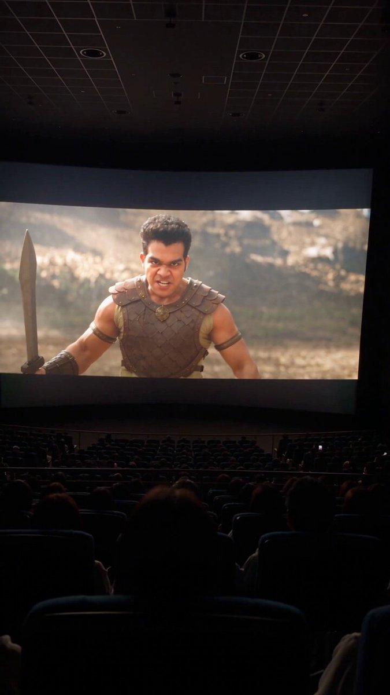

**พรอมต์**

```text
วิดีโอสมาร์ตโฟนแบบไวรัลที่สมจริงเป็นพิเศษภายในโรงภาพยนตร์ 4DX ที่คนแน่นในญี่ปุ่น เริ่มต้นด้วยช็อตถือกล้องสไตล์ iPhone จากมุมผู้ชมในขณะที่ภาพยนตร์กำลังฉายบนจอขนาดยักษ์ ทันใดนั้น แอ็กชันบนจอก็ดูเหมือนจะทะลักเข้ามาในโรงภาพยนตร์จริง: ที่นั่งเอียงและสั่นไหวอย่างรุนแรงตามจังหวะ ลมแรงพัดผ่านฝูงชน เส้นผมและเสื้อผ้าปลิวสะบัดอย่างเป็นธรรมชาติ ละอองน้ำพ่นออกมา แสงไฟกะพริบ และผู้ชมทั้งโรงภาพยนตร์กรีดร้อง หัวเราะ จับที่นั่งไว้แน่น และยกโทรศัพท์ขึ้นมา ถ่ายเป็นช็อตถือกล้องแบบต่อเนื่องช็อตเดียวที่มีการสั่นไหวเล็กน้อยตามธรรมชาติ โมชันเบลอ การปรับระดับแสงที่สมจริง HDR ในที่แสงน้อยที่สมจริง และปฏิกิริยาของผู้คนที่เกิดขึ้นเองตามธรรมชาติ ค่อยๆ ไต่ระดับจากความคาดหวังไปสู่ความโกลาหลทางประสาทสัมผัสอย่างสมบูรณ์แบบ แล้วจบลงด้วยภาพโคลสอัปปฏิกิริยาของผู้ชมแถวหน้าที่หัวเราะอย่างไม่อยากจะเชื่อในขณะที่เอฟเฟกต์ 4DX ยังคงทำงานเต็มพิกัด เอฟเฟกต์ที่สัมพันธ์กันอย่างสมจริงตามหลักฟิสิกส์ บรรยากาศโรงภาพยนตร์ญี่ปุ่นที่คนแน่น ความสมจริงระดับภาพยนตร์ ไม่มีปฏิกิริยาที่จัดฉาก ไม่มีดนตรี ไม่มีคำบรรยาย ไม่มีโลโก้ ไม่มี UI หรือโทรศัพท์ที่ใช้ถ่ายติดเข้ามาในเฟรม
```

[↑ กลับสู่หมวดหมู่](#catalog)

---

<a name="prompt-2101202565321101780"></a>

### 15秒超自然科幻短片：霓虹夜市中淡定女子击退巨怪并从容离开。

ผู้เขียน：[@Viniai\_](https://x.com/Viniai_) · [โพสต์ต้นฉบับ](https://x.com/Viniai_/status/2101202565321101780)

ภาพยนตร์ / ภาพนิ่งจากภาพยนตร์ · ไซเบอร์พังก์ / ไซไฟ · ตัวละคร · เผยแพร่แล้ว

**สรุป:** 15秒超自然科幻短片：霓虹夜市中淡定女子击退巨怪并从容离开。

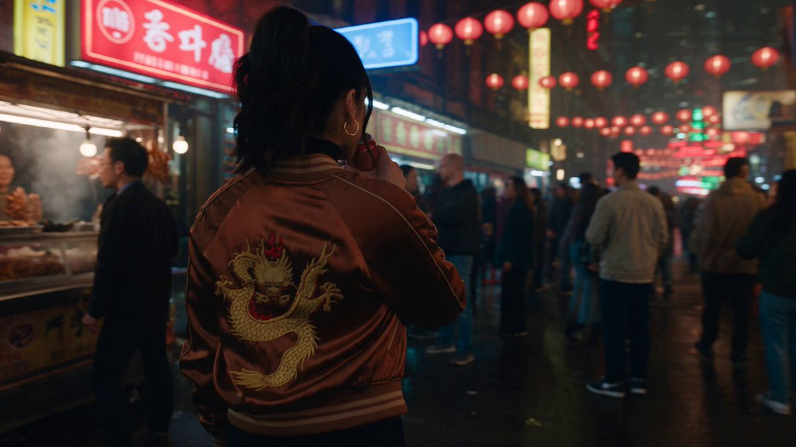

**พรอมต์**

```text
สร้างวิดีโอสั้นแนวภาพยนตร์เสมือนจริงระดับไฮเปอร์เรียลลิสติก ความยาว 15 วินาที ที่ 24fps จอกว้างขนาด 1280x720 ในสไตล์ภาพของโฆษณาพลังเหนือธรรมชาติระดับพรีเมียม — รูปลักษณ์ภาพคนแสดงจริงที่สมจริงหนักแน่นพร้อม VFX จัดเต็ม แสงนีออนยามค่ำคืน และการแสดงที่นิ่งสงบ ไม่สะทกสะท้านอย่างตั้งใจของตัวละครหลักตลอดทั้งเรื่อง

ตัวละคร: หญิงสาววัยยี่สิบกลางๆ ผมสีดำขลับเรียบเงาถูกรวบเป็นหางม้าสูงโดยมีปอยผมหลุดลุ่ยเล็กน้อยล้อมกรอบใบหน้า ใบหน้าคมชัดได้รูป และผิวสีแทนอบอุ่น เธอสวมแจ็กเก็ตบอมเบอร์ผ้าไหมสีแดงเลือดหมูเข้ารูป ปักลายมังกรสีทองทับเสื้อคอเต่าเข้ารูปสีดำ กางเกงขายาวสีดำทรงสลิม และต่างหูห่วงสีทองประณีตพร้อมสร้อยคอโซ่ทองเส้นบาง สีหน้าของเธอนิ่ง สงบ และแฝงความขบขันเล็กน้อยแม้จะอยู่ท่ามกลางความโกลาหล เรนเดอร์เธอด้วยรายละเอียดผิวที่สมจริง สัดส่วนที่เป็นธรรมชาติ และรักษาใบหน้า ทรงผม และชุดของเธอให้ตรงกันเป๊ะในทุกๆ ช็อตและมุมกล้องตลอดทั้ง 15 วินาที — ห้ามมีหน้าเปลี่ยน ห้ามเปลี่ยนการออกแบบระหว่างคัต

สถานที่: ถนนตลาดกลางคืนที่เปียกชุ่มด้วยฝนในมหานครเอเชียที่หนาแน่นและสูงตระหง่าน — ตรอกแคบๆ ที่อัดแน่นไปด้วยป้ายไฟนีออนเรืองแสงสีแดง สีชมพู และสีฟ้า โคมไฟกระดาษแขวนอยู่ ไอควันลอยขึ้นจากแผงขายอาหาร แอ่งน้ำสะท้อนแสงนีออนใต้ฝ่าเท้า และอาคารหลายชั้นที่อัดแน่นพร้อมหน้าต่างสว่างไสวสูงตระหง่านสู่ท้องฟ้ายามค่ำคืนที่ปกคลุมไปด้วยหมอกสลัว รักษาแสง สถาปัตยกรรม และบรรยากาศนี้ให้สอดคล้องกันตลอดทุกช็อต

สิ่งมีชีวิต: สัตว์ประหลาดคล้ายแมลงต่างดาวเรืองแสงทางชีวภาพขนาดมหึมา พร้อมกระดองแบ่งเป็นปล้องสีเขียว-เขียวอมฟ้า-ม่วงเหลือบแสง ขาหุ้มเกราะติดกรงเล็บหลายขา และรยางค์คล้ายปีก กำลังพังทะลุโครงสร้าง/นั่งร้านขนาดใหญ่ของตลาดในพื้นหลัง ทำให้ฝูงชนโดยรอบวิ่งหนีอย่างตื่นตระหนก รักษาการออกแบบ สี และสัดส่วนของมันให้สอดคล้องกันในทุกช็อตที่ปรากฏ

ลำดับการกระทำ (ตามลำดับเวลา 0:00-0:15 เรนเดอร์ลำดับทั้งหมดตามลำดับนี้โดยไม่ข้ามหรือตัดทอนจังหวะใดๆ):
0:00-0:04 — เปิดด้วยตัวละครหลักที่เห็นจากด้านหลังแล้วเป็นมุมมองด้านข้าง ยืนอย่างสงบท่ามกลางฝูงชนในตลาดกลางคืนที่เคลื่อนไหวจอแจ จิบเครื่องดื่มจากกระป๋องอย่างสบายๆ ขณะที่ป้ายไฟนีออนกะพริบและสะท้อนบนถนนที่เปียกชื้นรอบตัวเธอ และฝูงชนเดินผ่านไปมา สร้างบรรยากาศตลาดกลางคืนที่มีชีวิตชีวาตามปกติ
0:04-0:07 — สิ่งมีชีวิตขนาดยักษ์พุ่งชนโครงสร้างตลาดในพื้นหลัง ทำให้เกิดประกายไฟ ไอควัน และเศษซากปลิวว่อน ฝูงชนโดยรอบกรีดร้องและวิ่งหนีทั้งในเบื้องหน้าและเบื้องหลัง แต่ตัวละครหลักยังคงนิ่งเฉยและไม่สะทกสะท้าน ยังคงดื่มต่อไปอย่างสงบแม้ขาขนาดมหึมาของสิ่งมีชีวิตจะปรากฏอยู่ด้านหลังเธอไม่ไกล
0:07-0:09 — เส้นเลือดสายฟ้าสีฟ้าอมน้ำเงินเรืองแสงเริ่มแผ่กระจายไปทั่วผิวหนังที่เปิดเผยของเธอ (คอ มือ และตะเข็บแจ็กเก็ต) หางม้าของเธอสะบัดขึ้นด้านบนราวกับติดอยู่ในสนามพลังงานเวทมนตร์ที่พวยพุ่ง ดวงตาของเธอลุกโชนเป็นสีฟ้าขาวเรืองแสงดุจประกายไฟฟ้าพร้อมเส้นแสงคู่พวยพุ่งลงมาเหมือนหยดน้ำตาเรืองแสง และโดมพลังงานโปร่งแสงสีฟ้าจางๆ เริ่มก่อตัวรอบเงาร่างของเธอ สะท้อนบนทางเท้าที่เปียกแฉะด้านล่าง
0:09-0:11 — เธอยกแขนข้างหนึ่งขึ้นแล้วยื่นมือที่เปิดออกไปทางสิ่งมีชีวิต นิ้วมือสว่างจ้าด้วยแสงที่แตกเปรี๊ยะ ลำแสงพลังงานสีขาวอมฟ้าแนวนอนที่แผดเผาปะทุขึ้นจากฝ่ามือของเธอในระยะประชิดอย่างยิ่ง จากนั้นช็อตกว้างแสดงให้เห็นลำแสงเชื่อมต่อตรงลงไปตามถนนแคบๆ เข้าสู่สิ่งมีชีวิตในแสงวาบสีขาวสว่างจ้าที่กลบแสงป้ายไฟนีออนไปชั่วขณะ โจมตีมันล้มลงท่ามกลางไอน้ำและควันที่ลอยขึ้น
0:11-0:13 — จังหวะผลลัพธ์: เธอลดแขนลงและสายฟ้าจางหายไปจากผิวของเธอขณะที่กล้องจับภาพโปรไฟล์ที่สงบของเธอ แสงสะท้อนนีออนกะพริบกลับมาบนถนนเปียก ควันและไฟขนาดเล็กบนพื้นยังคงคุอยู่ในพื้นหลังที่สิ่งมีชีวิตถูกล้มลง พร้อมรอยไหม้เกรียมเป็นรัศมีแผ่กว้างบนทางเท้าที่เปียก
0:13-0:15 (ฉากจบ) — เธอหันหลังและเดินอย่างสงบหนีจากความพินาศด้วยสีหน้าเรียบเฉย ไม่แยแส เช็กโทรศัพท์มือถือแบบสบายๆ ขณะก้าวเดิน และเดินเข้าไปใกล้แผงขายอาหารในตลาดกลางคืนบริเวณเบื้องหน้า (ไอควันลอยขึ้น โคมไฟแขวน ขวดที่จัดแสดง) ขณะที่ควันยังคงลอยขึ้นด้านหลังเธอ — ลำดับสิ้นสุดลงด้วยช็อตการเดินจากไปอย่างสบายๆ นี้ โดยพลังถูกปิดการทำงานโดยสมบูรณ์ ราวกับไม่มีอะไรเกิดขึ้น

งานกล้อง: การผสมผสานระหว่างช็อตระยะกลางแบบโคลสอัพจากด้านหลังและด้านข้างในช่วงจังหวะเปิดที่สงบ ช็อตรีแอ็กชันที่กว้างขึ้นเมื่อสิ่งมีชีวิตพุ่งชน ช็อตโคลสอัพแน่นๆ ของการเปลี่ยนแปลงของผิวหนัง/ดวงตาระหว่างจังหวะเปิดใช้งานพลัง ช็อตโคลสอัพขั้นสุดที่มือเรืองแสงระหว่างการปล่อยลำแสง ช็อตกว้างสำหรับการปะทะของลำแสง และช็อตติดตามระยะกลางสำหรับการเดินจากไปอย่างสงบในตอนท้าย การเคลื่อนไหวของกล้องมีความละเอียดอ่อนและเป็นภาพยนตร์แบบถือด้วยมือ ไม่เร่งรีบ คอนทราสต์ระหว่างการจัดเฟรมที่นิ่งสงบบนตัวละครกับการจัดเฟรมที่วุ่นวายของฝูงชนและสิ่งมีชีวิต

แสงและสี: แสงบรรยากาศยามค่ำคืนโทนเย็นตลอดทั้งเรื่อง พร้อมป้ายไฟนีออนสีแดงสด สีชมพู และสีฟ้าสะท้อนบนทางเท้าเปียกและกระจก แสงโคมไฟอบอุ่นและไอน้ำจากแผงขายอาหารในพื้นหลัง ตัดกับแสงเรืองรองสีฟ้าขาวจากสายฟ้าและเส้นเลือดพลังงานของตัวละคร และโทนไฟ/สะเก็ดไฟสีส้มอบอุ่นในช่วงควันและรอยไหม้หลังเหตุการณ์ ไดนามิกเรนจ์สูงพร้อมไฟขอบ (rim light) ที่ชัดเจนแยกตัวละครออกจากพื้นหลังที่สว่างไสวด้วยแสงนีออนในทุกช็อต

สไตล์และคุณภาพ: การเรนเดอร์ระดับไฮเปอร์เรียลลิสติกที่สมจริงด้วยเกรนฟิล์มภาพยนตร์ วัสดุตามหลักฟิสิกส์ รายละเอียดผิวและพื้นผิวผ้า ฟิสิกส์ของเส้นผมและเสื้อผ้าที่สมจริง การสะท้อนของถนนเปียก การจำลองอนุภาคไอน้ำและควันในบรรยากาศ โฟกัสเบื้องหน้าที่คมชัดพร้อมระยะชัดลึกตามธรรมชาติบนฝูงชนและความโกลาหลในพื้นหลัง เกรดสีเหมือนโฆษณาพรีเมียม รายละเอียดเทียบเท่า 4K คอนทราสต์ของโทนระหว่างการแสดงที่สงบของตัวละครและพลังงานที่วุ่นวายรอบข้างอย่างต่อเนื่องตลอด 15 วินาทีเต็ม

ความสอดคล้องและข้อจำกัดเชิงลบ: รักษาความสอดคล้องอย่างเคร่งครัดแบบเฟรมต่อเฟรมและช็อตต่อช็อตในอัตลักษณ์ใบหน้า ทรงผม ชุด และสัดส่วนของตัวละครหลัก รวมถึงการออกแบบสิ่งมีชีวิตในทุกมุมกล้องที่อธิบายไว้ข้างต้น หลีกเลี่ยงหน้าเปลี่ยน หน้าบิดเบี้ยว การบิดงอ การกะพริบ อวัยวะซ้ำซ้อน นิ้วส่วนเกิน กายวิภาคผิดเพี้ยน เสื้อผ้าหรือสีที่ไม่สอดคล้องกันระหว่างคัต ทิศทางแสงที่ไม่ตรงกัน ข้อความที่ไม่พึงประสงค์ โลโก้ ลายน้ำ ซับไตเติล สิ่งแปลกปลอมจากความละเอียดต่ำ ผิวที่มีลักษณะเป็นพลาสติกหรือแว็กซ์ และการเคลื่อนไหวที่ผิดธรรมชาติหรือดูเหมือนหุ่นยนต์ รักษาฟิสิกส์ธรรมชาติสำหรับเส้นผม ผ้า ควัน สายฟ้า และเอฟเฟกต์ลำแสงตลอดทั้งเรื่อง เรนเดอร์ลำดับ 15 วินาทีที่สมบูรณ์ตรงตามเวลาข้างต้นอย่างแม่นยำ ตั้งแต่ช็อตเปิดที่สงบจนถึงช็อตเดินจากไปในตอนท้าย โดยไม่ข้าม ย่นย่อ หรือเร่งรีบในจังหวะใดๆ
```

[↑ กลับสู่หมวดหมู่](#catalog)

---

<a name="prompt-2100791255672492374"></a>

### กำลังแปล

ผู้เขียน：[@24\_y0siii](https://x.com/24_y0siii) · [โพสต์ต้นฉบับ](https://x.com/24_y0siii/status/2100791255672492374)

การตลาดผลิตภัณฑ์ · ภาพยนตร์ / ภาพนิ่งจากภาพยนตร์ · ภาพร่าง / ลายเส้น · ภาพเรนเดอร์ 3 มิติ · เผยแพร่แล้ว

**สรุป:** กำลังแปล


**พรอมต์**

```text
กำลังแปล
```

[↑ กลับสู่หมวดหมู่](#catalog)

---

<a name="prompt-2100875394530312534"></a>

### ภาพยนตร์แฟชั่นหรูหราสไตล์ภาพยนตร์ความยาว 15 วินาทีของหญิงสาวผมบลอนด์ในปารีส ซึ่งชุดเดรสสีขาวของเธอเปลี่ยนเป็นชุดราตรีผ้าซาตินสีแดงอย่างน่าอัศจรรย์ข้างหน้าต่างบูติก ก่อนที่เธอจะเดินเล่นผ่านรถเข็นไอศกรีม

ผู้เขียน：[@Noor\_ul\_ain43](https://x.com/Noor_ul_ain43) · [โพสต์ต้นฉบับ](https://x.com/Noor_ul_ain43/status/2100875394530312534)

ภาพยนตร์ / ภาพนิ่งจากภาพยนตร์ · ตัวละคร · ไอเทมแฟชั่น · เผยแพร่แล้ว

**สรุป:** ภาพยนตร์แฟชั่นหรูหราสไตล์ภาพยนตร์ความยาว 15 วินาทีของหญิงสาวผมบลอนด์ในปารีส ซึ่งชุดเดรสสีขาวของเธอเปลี่ยนเป็นชุดราตรีผ้าซาตินสีแดงอย่างน่าอัศจรรย์ข้างหน้าต่างบูติก ก่อนที่เธอจะเดินเล่นผ่านรถเข็นไอศกรีม


**พรอมต์**

```text
ภาพยนตร์แฟชั่นหรูหราความยาว 15 วินาที สไตล์ภาพยนตร์ สมจริงระดับภาพถ่าย รายละเอียดสูงพิเศษ 4K สุนทรียภาพระดับแฟชั่นเอดิทอเรียลพรีเมียม เกรนฟิล์มบางเบา ระยะชัดตื้น การเคลื่อนไหวของกล้องที่สง่างาม

หญิงสาวสวยสะพรั่งผมบลอนด์น้ำผึ้งเป็นลอนหนานุ่ม ผิวเปล่งปลั่งเป็นธรรมชาติ ต่างหูหมุดทองคำประณีต และความมั่นใจอย่างเป็นธรรมชาติ เดินอย่างสง่างามไปตามถนนช้อปปิ้งหรูหราอันเงียบสงบในปารีส เธอสวมชุดเดรสยาวปานกลางคอสี่เหลี่ยมแขนกุดสีขาวอันประณีต เข้ารูปพอดีกับทรวดทรงของเธอ จับคู่กับรองเท้าส้นสูงหัวแหลมสีนู้ดสุดหรู เส้นผมของเธอพริ้วไหวอย่างเป็นธรรมชาติในสายลมอ่อนๆ ของปารีส

เธอชะลอฝีเท้าลงข้างหน้าต่างตู้โชว์บูติกอันเย้ายวนใจ ด้านในมีหุ่นโชว์สวมชุดเดรสคอสี่เหลี่ยมผ้าซาตินสีแดงเข้มพริ้วไหวประณีต รายล้อมด้วยกล่องของขวัญหรูหราสีแดงผูกริบบิ้นสีดำที่จัดวางอย่างสวยงาม กระเป๋าถือหนังสีแทนทรงสวย รองเท้าส้นสูงสีแดงเงางาม และถุงช้อปปิ้งหรูหรา

ภาพโคลสอัป: สายตาของเธอสบเข้ากับชุดสีแดงผ่านกระจก แสงประกายเวทมนตร์อันอบอุ่นปรากฏขึ้นรอบหุ่นโชว์ ริบบิ้นแสงสีส้มทองเส้นบางเริ่มหมุนวนอย่างสง่างามรอบชุดซาตินสีแดง สะท้อนประกายบนกระจกบูติก ทันใดนั้น ริบบิ้นก็ร่อนทะลุกระจกออกมาดั่งแพรไหมที่พลิ้วไหว โอบล้อมรอบตัวหญิงสาวอย่างงดงาม

การแปลงโฉมที่ไร้รอยต่อ: ในการเคลื่อนไหวแบบภาพยนตร์อันน่าทึ่งเพียงครั้งเดียว ชุดสีขาวของเธอก็เปลี่ยนเป็นชุดราตรีผ้าซาตินสีแดงเข้มสุดหรูแบบเดียวกัน เนื้อผ้าพลิ้วไหวเป็นระลอกอย่างเป็นธรรมชาติด้วยฟิสิกส์ของผ้าไหมที่สมจริง เธอเหลือบมองลงมายิ้มอย่างมั่นใจ และเดินต่อไป

ช็อตติดตามมุมต่ำแบบไดนามิก: รองเท้าส้นสูงสีนู้ดของเธอก้าวลงบนทางม้าลายปารีส ในขณะที่กระโปรงซาตินสีแดงพลิ้วไหวอย่างตระการตารอบเรียวขาของเธอตามสายลม กล้องเคลื่อนตัวสูงขึ้นอย่างราบรื่นเป็นช็อตแฟชั่นอันสง่างามขณะที่เธอข้ามถนนสายหลัก

ตัดภาพไปที่รถเข็นไอศกรีมวินเทจสไตล์ปารีสอันมีเสน่ห์พร้อมร่มสีชมพูอ่อน เธอรับโคนไอศกรีมซอฟต์เสิร์ฟรสวานิลลา ยิ้มอย่างขี้เล่นและสง่างาม กัดชิมคำเล็กๆ แล้วเดินทอดน่องต่อไป

ช็อตกว้างส่งท้ายสไตล์ภาพยนตร์: เธอเดินจากไปด้วยความมั่นใจไปตามถนนบูเลอวาร์ดอันยิ่งใหญ่ของปารีสที่เรียงรายไปด้วยอาคารสไตล์โอสมานน์อันสง่างาม ระเบียงคาเฟ่ที่ส่องประกาย รถคลาสสิกที่จอดอยู่ และคนเดินเท้าที่เบลออย่างนุ่มนวล ชุดเดรสผ้าซาตินสีแดงเข้มของเธอพลิ้วไหวตามหลังดั่งแพรไหมเหลว

แสงแดดกลางวันในปารีสที่มีเมฆครึ้มอย่างนุ่มนวล แสงไฮไลต์สีทองบางเบา ผิวสัมผัสของผิวหนังที่สมจริง สีหน้าเป็นธรรมชาติ การเคลื่อนไหวของเนื้อผ้าที่สมจริง แสงไฟแบบแคมเปญหรูหราประณีต มิติภาพแบบภาพยนตร์ การเคลื่อนไหวของกล้องที่นิ่งและราบรื่น เอกลักษณ์ของเลนส์แอนามอร์ฟิก การเกรดสีระดับนิตยสารแฟชั่นพรีเมียม บรรยากาศโรแมนติกแต่ทันสมัย ตราตรึงสายตา ไม่มีข้อความ ไม่มีโลโก้ ไม่มีลายน้ำ
```

[↑ กลับสู่หมวดหมู่](#catalog)

---

<a name="prompt-2101085053870858398"></a>

### ภาพโคลสอัปแบบตั้งกล้องนิ่งของเกตะแบบดั้งเดิมของญี่ปุ่นที่ลอยค้างชั่วขณะก่อนจะก้าวลงบนทางเดินหินเปียก ทำให้เกิดวงน้ำบางๆ แผ่ออกมา

ผู้เขียน：[@studiokagurajp](https://x.com/studiokagurajp) · [โพสต์ต้นฉบับ](https://x.com/studiokagurajp/status/2101085053870858398)

ภาพยนตร์ / ภาพนิ่งจากภาพยนตร์ · เผยแพร่แล้ว

**สรุป:** ภาพโคลสอัปแบบตั้งกล้องนิ่งของเกตะแบบดั้งเดิมของญี่ปุ่นที่ลอยค้างชั่วขณะก่อนจะก้าวลงบนทางเดินหินเปียก ทำให้เกิดวงน้ำบางๆ แผ่ออกมา


**พรอมต์**

```text
ฉาก: ทางเดินหินเปียกยามพลบค่ำ อัตราส่วน 16:9 ภาพโคลสอัปมุมต่ำแบบตั้งกล้องนิ่ง เกตะของผู้ชายวัยผู้ใหญ่ อายุสามสิบกว่าปี ใบหน้าอยู่นอกเฟรม ไม่มีบุคคลที่สอง ไม่มีตัวอักษรที่อ่านออกได้

การเคลื่อนไหว: สองจังหวะในช็อตที่ตั้งกล้องนิ่งเพียงช็อตเดียว ครึ่งแรก: เกตะลอยค้างอยู่เหนือหินกรวดเปียกสีเข้มก้อนหนึ่งในระดับความสูงเท่าความกว้างหนึ่งนิ้วมือและหยุดนิ่งอยู่อย่างนั้น ไม่มีการกระเซ็น ไม่มีการสัมผัส ครึ่งหลัง: พื้นไม้ประกบลงบนหินกรวดก้อนเดิมและหยุดนิ่ง วงน้ำบางๆ แผ่ออกมาจากจุดที่สัมผัส สายรัดตึงขึ้น ไม่มีการเดินเป็นวงจรซ้ำ ไม่มีก้าวที่สอง

การโฟกัส: คมกริบที่ขอบพื้นรองเท้า ลายไม้เปียกชื้น และประกายแวววาวบนหิน ทางเดินด้านหลังเบลอนุ่มลงหนึ่งสต็อป

ฟิสิกส์: ครึ่งแรกคือการเว้นจังหวะ—เท้าลอยอยู่ ครึ่งหลังมีน้ำหนัก น้ำถูกแทนที่ ไม่มีการลื่นไถลเหมือนน้ำแข็ง ไม่มีการลอยตัวหลังสัมผัส

แสง: แสงพลบค่ำโทนเย็นจากทางขวา ไฮไลต์สะท้อนแสงเล็กๆ ปรากฏเฉพาะบนหินเปียกเท่านั้น

สไตล์: สมจริงระดับภาพยนตร์ ญี่ปุ่นยุคโบราณ ไม้ที่ผ่านการใช้งานและหินเปียก เกรนภาพนุ่มนวล ไม่มีภาพสไตล์อนิเมะ ไม่มีข้อความ ไม่มีลายน้ำ ไม่มีโลโก้ ไม่มีกราฟิกแบ่งหน้าจอ ไม่มีคำบรรยายภาพ

เสียง: เสียงเอฟเฟกต์เฉพาะในเหตุการณ์เท่านั้น (Diegetic SFX) ไม่มีดนตรี ไม่มีดนตรีประกอบ ไม่มีเสียงร้องเพลง ไม่มีการพูดคุย ไม่มีการบรรยาย เกือบเงียบสนิทในขณะที่เกตะลอยอยู่ เมื่อสัมผัส: เสียงไม้กระทบหินเปียกหนักแน่นหนึ่งครั้งและเสียงน้ำกระเซ็นแผ่วเบาขณะที่วงน้ำแผ่ออกไป ไม่มีเสียงก้าวที่สอง
```

[↑ กลับสู่หมวดหมู่](#catalog)

---

<a name="prompt-2101073250235322409"></a>

### กำลังแปล

ผู้เขียน：[@MaAyyoub](https://x.com/MaAyyoub) · [โพสต์ต้นฉบับ](https://x.com/MaAyyoub/status/2101073250235322409)

คอมิก / สตอรี่บอร์ด · ภาพยนตร์ / ภาพนิ่งจากภาพยนตร์ · ตัวละคร · สถาปัตยกรรม / การตกแต่งภายใน · เผยแพร่แล้ว

โพสต์ต้นฉบับ：[@MaAyyoub](https://x.com/MaAyyoub) · [โพสต์ต้นฉบับ](https://x.com/MaAyyoub/status/2100618084155265124)

**สรุป:** กำลังแปล

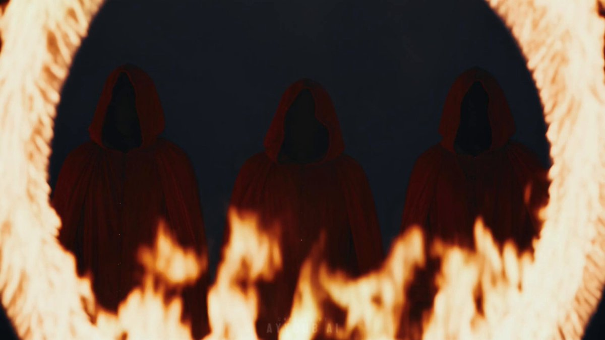

**พรอมต์**

```text
กำลังแปล
```

[↑ กลับสู่หมวดหมู่](#catalog)

---

<a name="prompt-2101083383136915502"></a>

### กำลังแปล

ผู้เขียน：[@john87445528](https://x.com/john87445528) · [โพสต์ต้นฉบับ](https://x.com/john87445528/status/2101083383136915502)

การถ่ายภาพ · ภาพยนตร์ / ภาพนิ่งจากภาพยนตร์ · ย้อนยุค / วินเทจ · ตัวละคร · ทิวทัศน์เมือง / ถนน · เผยแพร่แล้ว

**สรุป:** กำลังแปล

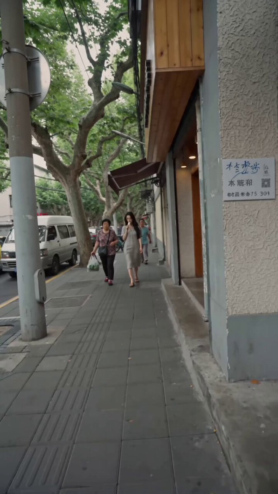

**พรอมต์**

```text
กำลังแปล
```

[↑ กลับสู่หมวดหมู่](#catalog)

---

<a name="prompt-2101008442215264341"></a>

### พรอมต์ตัวอย่างสารคดีฉลามขาวความยาว 30 วินาที ประกอบด้วยสตอรีบอร์ดตามไทม์ไลน์โดยละเอียด มุมกล้อง พฤติกรรมของสิ่งมีชีวิตตามความเป็นจริง และเสียงบรรยาย

ผู้เขียน：[@CharaspowerAI](https://x.com/CharaspowerAI) · [โพสต์ต้นฉบับ](https://x.com/CharaspowerAI/status/2101008442215264341)

คอมิก / สตอรี่บอร์ด · การถ่ายภาพ · ภาพยนตร์ / ภาพนิ่งจากภาพยนตร์ · สัตว์ / สิ่งมีชีวิต · เผยแพร่แล้ว

**สรุป:** พรอมต์ตัวอย่างสารคดีฉลามขาวความยาว 30 วินาที ประกอบด้วยสตอรีบอร์ดตามไทม์ไลน์โดยละเอียด มุมกล้อง พฤติกรรมของสิ่งมีชีวิตตามความเป็นจริง และเสียงบรรยาย


**พรอมต์**

```text
ตัวอย่างสารคดีสัตว์ป่าระดับพรีเมียมที่สมจริงเป็นพิเศษ ความยาว 30 วินาที เน้นที่ฉลามขาว การถ่ายทำภาพยนตร์ประวัติศาสตร์ธรรมชาติระดับไฮเอนด์ การติดตามใต้น้ำ ช็อตผิวน้ำด้วยเลนส์เทเล การกระโดดพ้นน้ำแบบสโลว์โมชัน ฟุตเทจระดับเรือที่นิ่งสนิท น้ำทะเลสีน้ำเงินเข้ม แสงแดดสว่างจ้า คอสติกสะท้อนแสงที่สมจริง เกรนฟิล์มบางเบา ความตึงเครียดที่สง่างาม พฤติกรรมที่ถูกต้องตามหลักวิทยาศาสตร์ ไม่มีการจัดสไตล์แบบสยองขวัญ

ตัวแบบหลัก: ฉลามขาวโตเต็มวัยหนึ่งตัว สัดส่วนมหึมาแต่สมจริง มีรอยแผลเป็นตามธรรมชาติ การเคลื่อนไหวของหางอันทรงพลัง พฤติกรรมนักล่าที่สงบ รอยตำหนิสม่ำเสมอตลอดทั้งเรื่อง

สัตว์ป่ารอง: แมวน้ำ นกทะเล ฝูงปลาขนาดเล็ก ไม่มีมนุษย์ที่ตกอยู่ในอันตราย
มหาสมุทรเปิดที่เย็นยะเยือกใกล้ชายฝั่งหิน ขอบแนวสาหร่ายเคลป์ ทางลาดชันสู่น้ำลึกสีน้ำเงิน น้ำผิวดินที่ต้องแสงแดด ถิ่นที่อยู่อาศัยนอกเกาะชายฝั่ง

0-5 วินาที: การเปิดเรื่องที่เงียบสงบ
มุมกว้างทางอากาศเหนือมหาสมุทรที่สงบนิ่งในยามพระอาทิตย์ขึ้น ตัดภาพลงใต้น้ำ: เงาขนาดยักษ์ร่อนอยู่ใต้ผิวน้ำ
เสียงบรรยายภาษาอังกฤษ: “For millions of years… this silhouette has ruled the edge of the ocean.”

5-10 วินาที: การปรากฏตัวครั้งแรก
ช็อตติดตามด้านข้างเผยให้เห็นฉลามขาวทั้งตัวกำลังเคลื่อนที่อย่างเงียบเชียบผ่านผืนน้ำสีน้ำเงิน โคลสอัพที่ดวงตา การขยับของเหงือก จังหวะของหาง และแถวฟันที่มองเห็นได้ตามธรรมชาติเมื่ออ้าปากเล็กน้อยเท่านั้น
เสียงบรรยาย: “Not through speed alone… but through patience.”

10-16 วินาที: พฤติกรรมการล่า
ฉลามแล่นอยู่ใต้ฝูงแมวน้ำที่อยู่ไกลออกไป โดยยังคงอยู่ลึกและแทบมองไม่เห็น ฝูงปลาแหวกว่ายแยกออกจากตัวมัน กล้องตามจากด้านหลังและด้านล่าง
เสียงบรรยาย: “Every movement is calculated.”

16-22 วินาที: ช่วงเวลาแห่งพลัง
ฉลามเร่งความเร็วพุ่งขึ้นด้านบนผ่านลำแสงแดด ตัดไปที่สโลว์โมชันอันน่าทึ่งขณะที่มันกระโดดทะลุผิวน้ำอย่างสมบูรณ์ท่ามกลางละอองน้ำมหาศาล แล้วตกลงสู่มหาสมุทร
เสียงบรรยาย: “When the moment comes… power becomes precision.”

22-27 วินาที: ขนาดที่สง่างาม
ช็อตมุมกว้างใต้น้ำ: ฉลามว่ายผ่านช่องทางสีน้ำเงินที่ขนาบด้วยสาหร่ายเคลป์ จากนั้นเลี้ยวอยู่ใต้กล้อง เผยให้เห็นขนาดมหึมาของมันเมื่อเทียบกับปลาตัวเล็กๆ
เสียงบรรยาย: “But behind the legend… is an animal perfectly built for its world.”

27-30 วินาที: การเผยโฉมอันเป็นเอกลักษณ์ครั้งสุดท้าย
ช็อตระดับผิวน้ำในแสงแดดสีทอง ครีบหลังแหวกผ่านผืนน้ำที่สงบนิ่ง แล้วค่อยๆ หายไป
เสียงบรรยาย: “The great white shark… master of the blue.”
ตัดฉึบเป็นจอดำ

กายวิภาคของฉลามที่สมจริงเหมือนภาพถ่าย กลไกการว่ายน้ำที่แท้จริง การลอยตัวและฟิสิกส์ของน้ำที่สมจริง ลวดลายที่เสถียร จังหวะการเล่าเรื่องแบบสารคดีพรีเมียม การบรรยายภาษาอังกฤษที่เป็นธรรมชาติ พฤติกรรมตามหลักวิทยาศาสตร์ ไม่มีความสยดสยอง ไม่มีการโคลสอัพการกินอาหาร ไม่มีการบาดเจ็บ ไม่มีข้อความ ไม่มีโลโก้
```

[↑ กลับสู่หมวดหมู่](#catalog)

---

<a name="prompt-2100896374686630226"></a>

### กำลังแปล

ผู้เขียน：[@TanLuAI](https://x.com/TanLuAI) · [โพสต์ต้นฉบับ](https://x.com/TanLuAI/status/2100896374686630226)

คอมิก / สตอรี่บอร์ด · การถ่ายภาพ · ภาพยนตร์ / ภาพนิ่งจากภาพยนตร์ · เผยแพร่แล้ว

**สรุป:** กำลังแปล

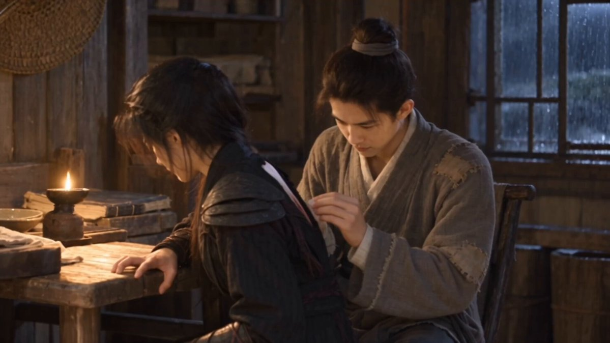

**พรอมต์**

```text
กำลังแปล
```

[↑ กลับสู่หมวดหมู่](#catalog)

---

<a name="prompt-2100903709492613245"></a>

### ฉากภาพยนตร์สยองขวัญของชั้นเรียนวิทยาศาสตร์ในโรงเรียนมัธยมปลายของญี่ปุ่นที่ติดอยู่ท่ามกลางสัตว์ประหลาดติดเชื้อที่ไวต่อเสียง

ผู้เขียน：[@ElsaSofia\_\_AI](https://x.com/ElsaSofia__AI) · [โพสต์ต้นฉบับ](https://x.com/ElsaSofia__AI/status/2100903709492613245)

ภาพยนตร์ / ภาพนิ่งจากภาพยนตร์ · เผยแพร่แล้ว

**สรุป:** ฉากภาพยนตร์สยองขวัญของชั้นเรียนวิทยาศาสตร์ในโรงเรียนมัธยมปลายของญี่ปุ่นที่ติดอยู่ท่ามกลางสัตว์ประหลาดติดเชื้อที่ไวต่อเสียง


**พรอมต์**

```text
สร้างฉากแอ็กชันสยองขวัญแบบภาพยนตร์ที่สมจริงอย่างยิ่งและมีความยาวสั้นๆ โดยมีฉากหลังเป็นห้องปฏิบัติการวิทยาศาสตร์อันเงียบสงบของโรงเรียนมัธยมปลายในญี่ปุ่นระหว่างคาบเรียนช่วงบ่าย ครูวิทยาศาสตร์หญิงกำลังสาธิตการทดลองเมื่อจู่ๆ ไฟก็กะพริบและหน้าจอดิจิทัลทุกจอในห้องก็ดับลงพร้อมกัน มีเสียงขูดขีดแปลกๆ ดังมาจากด้านในตู้เก็บของที่ล็อกไว้

ครูค่อยๆ เดินเข้าไปใกล้ตู้เก็บของอย่างระมัดระวัง แต่ก่อนที่เธอจะได้เปิดมัน หน้าต่างกระจกก็สั่นสะเทือนอย่างรุนแรง นักเรียนคนหนึ่งสังเกตเห็นรอยฝ่ามือสีเข้มปรากฏขึ้นที่ด้านนอกของกระจกแม้ว่าจะไม่มีใครอยู่ตรงนั้นก็ตาม ประตูห้องเรียนปิดกระแทกและล็อกตัวเองโดยกะทันหัน

ครูบอกให้ทุกคนอยู่ในความสงบและใช้ขาตั้งเหล็กในห้องปฏิบัติการงัดเปิดประตู ขณะที่เหล่านักเรียนเริ่มหนีออกไปที่โถงทางเดิน ไฟฉุกเฉินดวงหนึ่งก็ส่องให้เห็นร่างของผู้ติดเชื้อหลายคนยืนนิ่งอยู่ที่ปลายสุดของทางเดิน

นักเรียนรีบวิ่งกลับเข้าไปในห้องปฏิบัติการและดันโต๊ะไปขวางทางเข้าไว้อย่างรวดเร็ว ครูพบว่าผู้ติดเชื้อมีปฏิกิริยาต่อเสียง ทุกคนจึงเงียบกริบในทันที นักเรียนคนหนึ่งทำบีกเกอร์แก้วหล่นโดยไม่ตั้งใจ

เสียงนั้นดังก้องไปทั่วโถงทางเดิน

ร่างผู้ติดเชื้อทั้งหมดค่อยๆ หันหน้ามาทางห้องปฏิบัติการ

ครูยกนิ้วขึ้นหนึ่งนิ้ว ส่งสัญญาณอย่างเงียบๆ ให้ทุกคนอย่าขยับ กล้องค่อยๆ ดอลลี่เคลื่อนเข้าไปหาประตูที่ปิดกั้นไว้ขณะที่เสียงฝีเท้าหลายสิบคู่เริ่มเข้ามาใกล้จากด้านนอก หน้าจอตัดเป็นสีดำสนิทก่อนที่ประตูจะเริ่มสั่นสะเทือนอย่างรุนแรงเพียงชั่วครู่

ภาพยนตร์สยองขวัญคนแสดงที่สมจริงแบบภาพถ่าย, ห้องปฏิบัติการวิทยาศาสตร์โรงเรียนมัธยมปลายของญี่ปุ่นของแท้, นักเรียนวัยรุ่นและครูที่สมจริง, งานภาพแบบถือกล้องถ่ายที่เป็นธรรมชาติ, เอฟเฟกต์เชิงปฏิบัติการที่แนบเนียน, การเคลื่อนไหวทางกายภาพที่น่าเชื่อถือ, แสงฟลูออเรสเซนต์ที่สร้างบรรยากาศ, เงาที่สมจริง, จังหวะการดำเนินเรื่องที่ตึงเครียด, ปฏิกิริยาทางสีหน้าที่แท้จริง, ระยะชัดลึกแบบภาพยนตร์, การปรับโทนสีแนวสยองขวัญแบบหม่น, เสียงจากสภาพแวดล้อมจริงในเรื่องเท่านั้น ไม่มีเสียงดนตรี, เสียงบรรยาย, ความรุนแรงของเลือดที่มากเกินไป, บาดแผลฉกรรจ์, แอนิเมชัน, อนิเมะ, สไตล์การ์ตูน, ลักษณะที่ดูเป็น CGI ปลอม, กายวิภาคที่บิดเบี้ยว, คำบรรยาย, ข้อความ, โลโก้ หรือลายน้ำ
```

[↑ กลับสู่หมวดหมู่](#catalog)

---

<a name="prompt-2100824560484659349"></a>

### กำลังแปล

ผู้เขียน：[@john\_my07](https://x.com/john_my07) · [โพสต์ต้นฉบับ](https://x.com/john_my07/status/2100824560484659349)

ภาพยนตร์ / ภาพนิ่งจากภาพยนตร์ · ไซเบอร์พังก์ / ไซไฟ · เผยแพร่แล้ว

โพสต์ต้นฉบับ：[@wavespeed\_ai](https://x.com/wavespeed_ai) · [โพสต์ต้นฉบับ](https://x.com/wavespeed_ai/status/2090069277147812341)

**สรุป:** กำลังแปล

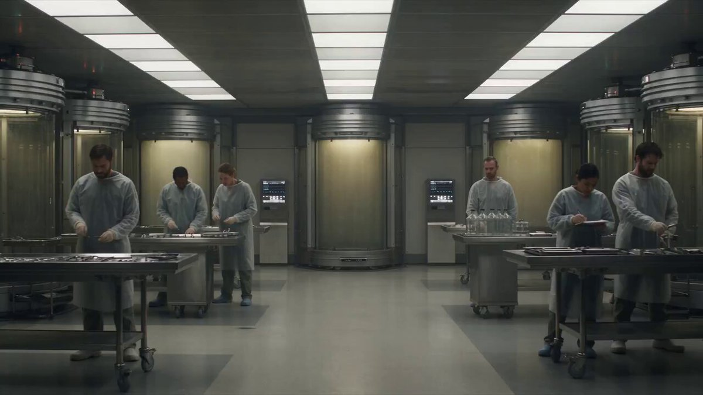

**พรอมต์**

```text
กำลังแปล
```

[↑ กลับสู่หมวดหมู่](#catalog)

---

<a name="prompt-2100886741972640200"></a>

### พรอมต์ภาพยนตร์ระทึกขวัญบรรยายภาพหญิงสาวกำลังวิ่งหนีผ่านทางเดินใต้ดินออกไปสู่ค่ำคืนภายใต้แสงไฟฉุกเฉิน

ผู้เขียน：[@Lianaalane](https://x.com/Lianaalane) · [โพสต์ต้นฉบับ](https://x.com/Lianaalane/status/2100886741972640200)

ภาพยนตร์ / ภาพนิ่งจากภาพยนตร์ · ตัวละคร · เผยแพร่แล้ว

**สรุป:** พรอมต์ภาพยนตร์ระทึกขวัญบรรยายภาพหญิงสาวกำลังวิ่งหนีผ่านทางเดินใต้ดินออกไปสู่ค่ำคืนภายใต้แสงไฟฉุกเฉิน

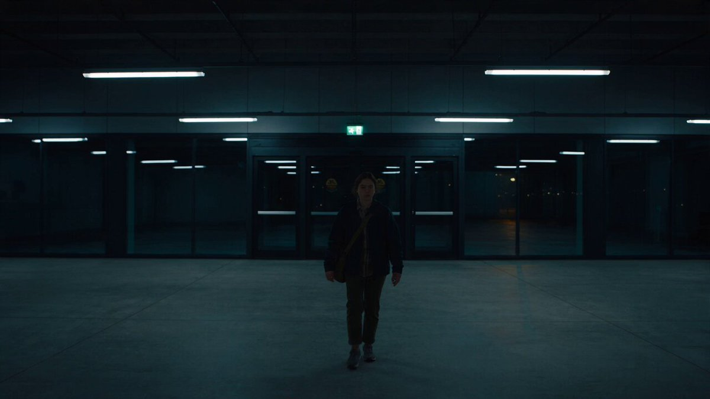

**พรอมต์**

```text
สร้างวิดีโอความยาว 30 วินาทีในสไตล์ภาพยนตร์ระทึกขวัญโทนดาร์ก นำเสนอหญิงสาวคนหนึ่งกำลังเดินอยู่ตามลำพังมุ่งหน้าสู่อาคารสมัยใหม่ขนาดใหญ่ในยามค่ำคืน ขณะที่กล้องเคลื่อนจากภาพมุมกว้างเพื่อบอกสถานที่เข้าไปสู่มุมโคลสอัพใบหน้า เธอค่อย ๆ มองไปรอบ ๆ ด้วยสีหน้ากังวลและระแวดระวัง ทันใดนั้น เธอหันหลังกลับแล้วเริ่มวิ่งไปยังทางเดินคอนกรีตใต้ดินที่แคบพร้อมสะพายกระเป๋า ขณะที่เสียงฝีเท้าของเธอดังก้องไปทั่วทางเดินที่ว่างเปล่า ใช้ช็อตติดตามที่ราบรื่น การเคลื่อนไหวของกล้องแบบถือด้วยมือ การเคลื่อนไหวของร่างกายที่สมจริง ไฟส่องสว่างสไตล์อินดัสเทรียลเหนือศีรษะ เงามืดที่ลึก และโทนสีภาพยนตร์อมเขียวอมฟ้าจาง ๆ เมื่อเธอวิ่งลึกเข้าไปเรื่อย ๆ ไฟฉุกเฉินสีแดงจะค่อย ๆ ปรากฏขึ้นและสร้างบรรยากาศที่ตึงเครียด กล้องติดตามเธออย่างใกล้ชิดจากด้านหลังและสลับระหว่างมุมกว้าง มุมด้านข้าง และมุมต่ำเพื่อเพิ่มความลุ้นระทึก ในช่วงท้าย เธอมาถึงประตูที่หนักบานหนึ่ง ผลักเปิดออก และรีบวิ่งออกไปสู่ราตรีที่มืดมิด รักษาภาพให้สมจริงระดับภาพถ่าย มีความเป็นภาพยนตร์ มีบรรยากาศที่ชัดเจน และเข้มข้นทางอารมณ์ ด้วยแสงธรรมชาติ พื้นผิวที่สมจริง การเคลื่อนไหวที่ลื่นไหล และไม่มีข้อความหรือลายน้ำบนหน้าจอ
```

[↑ กลับสู่หมวดหมู่](#catalog)

---

<a name="prompt-2100963101524820154"></a>

### แฟนตาซีแอนิเมชัน 3 มิติสุดเพ้อฝันที่เด็กหนุ่มผู้เลี้ยงแกะก้อนเมฆเหวี่ยงบ่วงบาศจับแกะสายฟ้า โต้คลื่นสายรุ้ง และต้อนเมฆพายุให้กลายเป็นแกะเมฆฝน

ผู้เขียน：[@CharaspowerAI](https://x.com/CharaspowerAI) · [โพสต์ต้นฉบับ](https://x.com/CharaspowerAI/status/2100963101524820154)

ภาพยนตร์ / ภาพนิ่งจากภาพยนตร์ · ภาพเรนเดอร์ 3 มิติ · เผยแพร่แล้ว

**สรุป:** แฟนตาซีแอนิเมชัน 3 มิติสุดเพ้อฝันที่เด็กหนุ่มผู้เลี้ยงแกะก้อนเมฆเหวี่ยงบ่วงบาศจับแกะสายฟ้า โต้คลื่นสายรุ้ง และต้อนเมฆพายุให้กลายเป็นแกะเมฆฝน

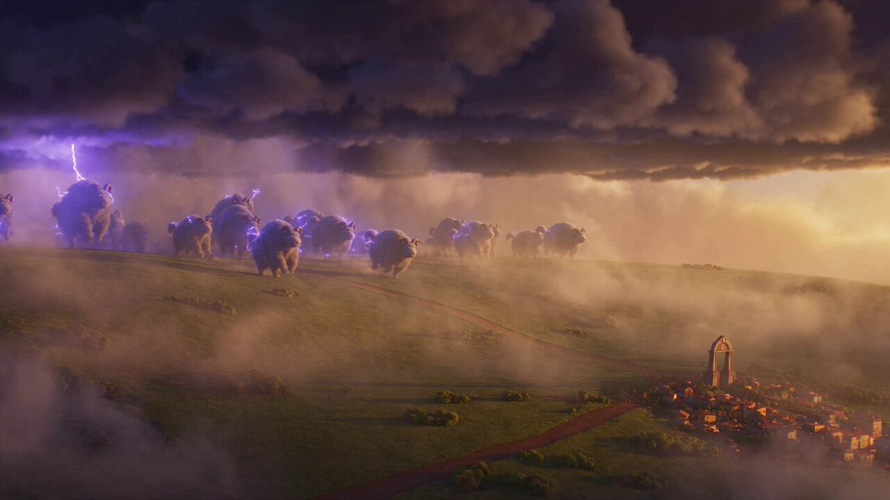

**พรอมต์**

```text
เด็กหนุ่มผู้เลี้ยงแกะก้อนเมฆขี่สัตว์บินขนนุ่มฟูควบทะยานผ่านทุ่งหญ้าบนท้องฟ้า ที่ซึ่งเมฆพายุได้หลุดลอยและกลายร่างเป็นสัตว์ยักษ์ที่กำลังแตกตื่นวิ่งพล่านซึ่งสร้างขึ้นจากสายฟ้าฟาด เขาเหวี่ยงบ่วงบาศจับแกะตัวผู้แห่งสายฟ้า กระโดดข้ามเกาะลอยฟ้า เล่นเซิร์ฟไปตามสายรุ้งที่โค้งงออยู่ใต้ฝ่าเท้า และพยายามต้อนพายุกลับไปยังประตูลมฟ้าอากาศขนาดยักษ์ก่อนที่มันจะไปถึงเมืองอันเงียบสงบเบื้องล่าง แอนิเมชัน 3 มิติแนวแฟนตาซีระดับภาพยนตร์ ตัวละครเมฆทรงปั้นนุ่มนวลพร้อมสีหน้าสื่ออารมณ์ ความลึกของเวหาที่ยิ่งใหญ่ กล้องที่ลื่นไหลเหินผ่านไอหมอก แสงอาทิตย์ขึ้นอันเจิดจ้า สายฟ้าสีม่วงนีออน การหักเหของแสงรุ้ง ละอองหมอกที่ทอดยาวและหยดน้ำฝนระยิบระยับ บรรยากาศแปลกใหม่ชวนฝันแต่แฝงความยิ่งใหญ่ตระการตา ปิดท้ายด้วยคนเลี้ยงแกะผิวปากหนึ่งครั้งในขณะที่สิ่งมีชีวิตจากพายุทุกตัวพลันแปรเปลี่ยนเป็นแกะเมฆฝนผู้อ่อนโยนและโปรยปรายสายรุ้งอันสมบูรณ์แบบเหนือเมือง
```

[↑ กลับสู่หมวดหมู่](#catalog)

---

<a name="prompt-2100953182780145992"></a>

### สร้างภาพยนตร์แอนิเมชันสั้นที่อบอุ่นหัวใจ โดยนำความหม่นหมองในฤดูใบไม้ร่วงมาสร้างเป็นตัวละครเด็กหญิงผมแดงที่นำความอบอุ่นใจมาสู่หญิงสาวที่กำลังอ่านหนังสือริมหน้าต่างบนถนนที่มีฝนตก

ผู้เขียน：[@aiwithlumi](https://x.com/aiwithlumi) · [โพสต์ต้นฉบับ](https://x.com/aiwithlumi/status/2100953182780145992)

ภาพยนตร์ / ภาพนิ่งจากภาพยนตร์ · ตัวละคร · ทิวทัศน์เมือง / ถนน · เผยแพร่แล้ว

**สรุป:** สร้างภาพยนตร์แอนิเมชันสั้นที่อบอุ่นหัวใจ โดยนำความหม่นหมองในฤดูใบไม้ร่วงมาสร้างเป็นตัวละครเด็กหญิงผมแดงที่นำความอบอุ่นใจมาสู่หญิงสาวที่กำลังอ่านหนังสือริมหน้าต่างบนถนนที่มีฝนตก

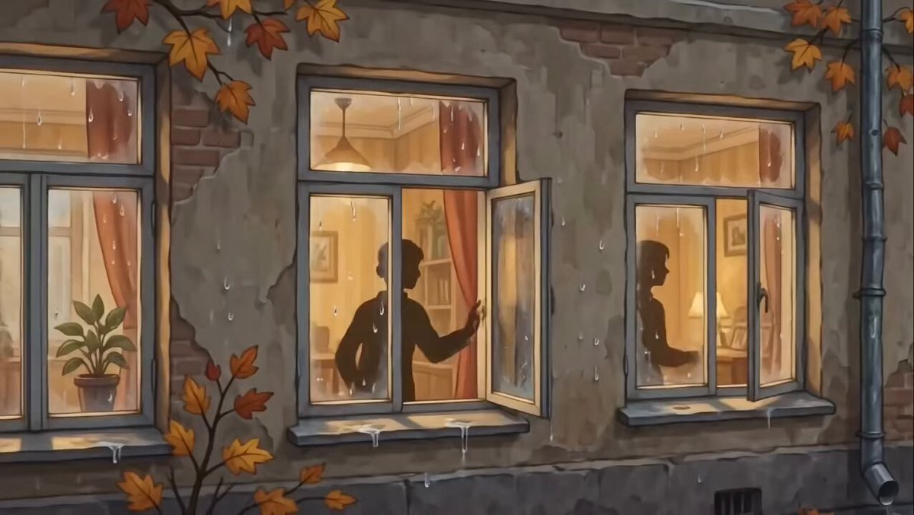

**พรอมต์**

```text
สร้างแอนิเมชันสั้นแบบภาพยนตร์ที่อบอุ่นหัวใจ โดยมีฉากเป็นถนนปูหินสไตล์ยุโรปอันแสนอบอุ่นในยามเย็นของฤดูใบไม้ร่วงที่มีฝนตก บุคลาธิษฐานของความหม่นหมองในฤดูใบไม้ร่วง (“Khandra”) ให้กลายเป็นเด็กหญิงตัวเล็กผมสีแดงผู้อ่อนโยน สวมแว่นตาทรงกลม ผ้าพันคอลายทาง เสื้อสเวตเตอร์ถักสีเขียว ผ้าคลุมทำจากใบไม้ และรองเท้าบูทกันฝนสีแดง เธอเดินผ่านสายฝนและนำพาความสบายใจอันเงียบสงบมาสู่หญิงสาวที่กำลังอ่านหนังสืออยู่ริมหน้าต่าง เสกผ้าห่มอุ่นๆ ชา หนังสือ และแมวสีเทาที่กำลังหลับใหลมาล้อมรอบตัวเธออย่างน่าอัศจรรย์ จบลงด้วยภาพ Khandra นั่งลงข้างๆ พวกเขาอย่างสงบ ถือใบไม้สีทองพร้อมรอยยิ้มอันอบอุ่น โทนสีฤดูใบไม้ร่วงอันนุ่มนวล บรรยากาศสายฝน แสงไฟที่อบอุ่น การเล่าเรื่องที่เปี่ยมด้วยอารมณ์ สัจนิยมมหัศจรรย์ และการเคลื่อนไหวของกล้องที่นุ่มนวล ใส่เสียงบรรยายภาษารัสเซียที่ให้มาอย่างเป็นธรรมชาติตลอดความยาววิดีโอ 23 วินาที
```

[↑ กลับสู่หมวดหมู่](#catalog)

---

<a name="prompt-2100787710424416603"></a>

### ช็อตแทร็กกิ้งภาพยนตร์ความยาว 15 วินาทีของนักเรียนหญิงชาวเกาหลีที่เดินไปข้างหน้าท่ามกลางเศษสิ่งของที่ลอยอยู่ในห้องเรียน ยกมือขึ้นและปัดผม

ผู้เขียน：[@Aiwithmaha](https://x.com/Aiwithmaha) · [โพสต์ต้นฉบับ](https://x.com/Aiwithmaha/status/2100787710424416603)

ภาพยนตร์ / ภาพนิ่งจากภาพยนตร์ · ตัวละคร · เผยแพร่แล้ว

**สรุป:** ช็อตแทร็กกิ้งภาพยนตร์ความยาว 15 วินาทีของนักเรียนหญิงชาวเกาหลีที่เดินไปข้างหน้าท่ามกลางเศษสิ่งของที่ลอยอยู่ในห้องเรียน ยกมือขึ้นและปัดผม

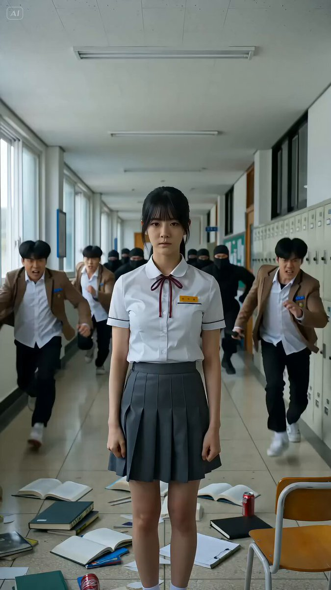

**พรอมต์**

```text
พรอมต์วิดีโอภาพยนตร์ความยาว 15 วินาที: นักเรียนหญิงชาวเกาหลีที่สมจริงยืนอยู่กลางห้องเรียนที่รก สวมเสื้อเชิ้ตนักเรียนแขนสั้นสีขาวพร้อมเนคไทโบว์สีแดงและกระโปรงพลีทสีเทาเข้ม ในขณะที่นักเรียนหลายคนนั่งและเคลื่อนไหวอยู่ด้านหลังของเธอ หนังสือ กระดาษ สมุดบันทึก และสิ่งของในห้องเรียนกระจัดกระจายและลอยอยู่ในอากาศ สร้างบรรยากาศที่โกลาหลแต่สมจริง เธอเดินช้าๆ ตรงไปข้างหน้าหากล้องด้วยสีหน้าที่จริงจังและสงบนิ่ง ในขณะที่นักเรียนในพื้นหลังมีปฏิกิริยาอย่างเป็นธรรมชาติต่อความวุ่นวายที่เกิดขึ้นอย่างกะทันหัน กล้องแทร็กถอยหลังอย่างราบรื่น โดยรักษาร่างของเธอให้อยู่กึ่งกลางในองค์ประกอบภาพแนวตั้ง 9:16 ด้วยการเคลื่อนไหวแบบถือกล้องด้วยมือที่สมจริง กระดาษและสิ่งของต่างๆ ยังคงตกลงมารอบๆ ตัวเธอด้วยแรงโน้มถ่วง ความเบลอจากการเคลื่อนไหว และระบบฟิสิกส์ที่เป็นธรรมชาติและน่าเชื่อถือ ในช่วงกลางของวิดีโอ เธอยกมือขึ้นข้างหนึ่งเล็กน้อยในขณะที่ยังคงก้าวเข้ามาหากล้อง โดยยังคงใบหน้า ทรงผม เครื่องแบบ และสัดส่วนร่างกายแบบเดิม ในช่วงไม่กี่วินาทีสุดท้าย กล้องจะเคลื่อนเข้าไปใกล้ใบหน้าของเธอขณะที่เธอปัดผมออกจากดวงตาอย่างแผ่วเบา มองตรงเข้าไปในเลนส์ด้วยสีหน้าที่แสดงอารมณ์อันละเอียดอ่อน ใช้แสงธรรมชาติในห้องเรียน ผิวสัมผัสที่สมจริง รายละเอียดของเนื้อผ้า เงาที่สมจริง ระยะชัดลึกแบบภาพยนตร์ และภาพที่สมจริงดุจภาพถ่ายตลอดทั้งคลิป พร้อมการเคลื่อนไหวที่ราบรื่นต่อเนื่องและไม่มีการตัดต่อ
```

[↑ กลับสู่หมวดหมู่](#catalog)

---

<a name="prompt-2100786082464039119"></a>

### ช็อตภาพยนตร์ขนาด 16:9 ของสวนหินญี่ปุ่นยามค่ำคืนที่สว่างวาบด้วยแสงฟ้าแลบเพียงครั้งเดียวตามด้วยฝนตกหนัก

ผู้เขียน：[@studiokagurajp](https://x.com/studiokagurajp) · [โพสต์ต้นฉบับ](https://x.com/studiokagurajp/status/2100786082464039119)

ภาพยนตร์ / ภาพนิ่งจากภาพยนตร์ · เผยแพร่แล้ว

**สรุป:** ช็อตภาพยนตร์ขนาด 16:9 ของสวนหินญี่ปุ่นยามค่ำคืนที่สว่างวาบด้วยแสงฟ้าแลบเพียงครั้งเดียวตามด้วยฝนตกหนัก

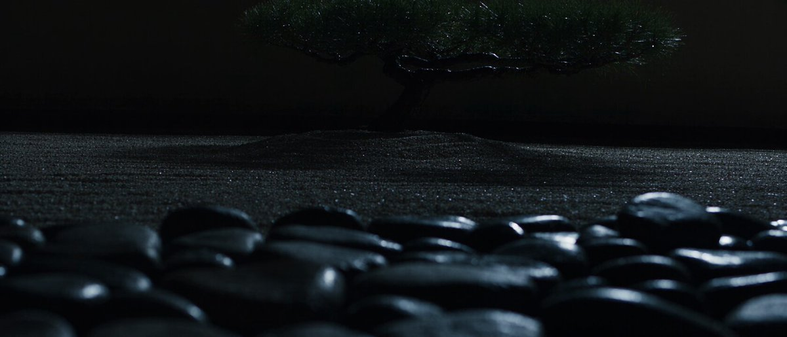

**พรอมต์**

```text
ฉาก: สวนหินขนาดเล็กในเวลากลางคืน, 16:9 ช็อตมุมกว้างกึ่งใกล้แบบล็อกนิ่ง กรวดสีเข้ม ต้นสนหนึ่งต้น หินกรวดมนเปียกชื้น ไม่มีใบหน้า ไม่มีซุ้มประตูดั้งเดิม ไม่มีวัด ไม่มีการแกะสลักที่อ่านออกได้

การเคลื่อนไหว: เฟรมเริ่มต้นด้วยความมืดสนิท แสงฟ้าแลบแบบภาพถ่ายหนึ่งครั้งสว่างวาบจนสวนกลายเป็นสีขาวเพียงชั่วขณะ จากนั้นความมืดจะกลับมาโดยสว่างขึ้นหนึ่งสต็อป ฝนเริ่มตกทันที เม็ดฝนหนาทึบตกลงกระทบก้อนหินกรวดแล้วกระดอน ไม่มีฟ้าแลบครั้งที่สอง ไม่มีคนเดินเข้ามา

การโฟกัส: คมชัดระดับแท็กชาร์ปที่ก้อนหินกรวดเปียกขณะฝนตกกระทบ ต้นสนจะนุ่มนวลลงหนึ่งสต็อป

ระบบฟิสิกส์: ฟ้าแลบคือแสงวาบจริงจากท้องฟ้า ไม่ใช่ลายซิกแซกที่วาดขึ้น ฝนมีน้ำหนัก เม็ดฝนกระเซ็นและไหล ไม่ลอยค้างเหมือนหมอก ไม่มีสายฟ้า CGI ค้างอยู่ในอากาศ

แสง: แสงวาบเป็นแสงหลักแบบแข็งเพียงแหล่งเดียว หลังจากนั้นเป็นค่ำคืนที่เย็นยะเยือกและเปียกชื้น ไม่มีการเปิดไฟเสริมเพื่อความงาม

สไตล์: ภาพยนตร์เสมือนจริง ญี่ปุ่นยุคโบราณ หินเปียกและใบสน เกรนภาพนุ่มนวล ไม่มีอนิเมะ ไม่มีข้อความ ไม่มีลายน้ำ ไม่มีโลโก้

เสียง: เสียงเอฟเฟกต์ในฉากจริงเท่านั้น (Diegetic SFX) ไม่มีดนตรี ไม่มีดนตรีประกอบ ไม่มีเสียงร้องเพลง ไม่มีบทพูด ไม่มีการบรรยาย เสียงฟ้าร้องฟาดหนึ่งครั้งพร้อมแสงวาบ ตามด้วยเสียงฝนตกหนักกระทบก้อนหินกรวด ไม่มีฟ้าร้องครั้งที่สอง
```

[↑ กลับสู่หมวดหมู่](#catalog)

---

<a name="prompt-2100856145250332889"></a>

### พรอมต์ภาพยนตร์สั้น 3 มิติระดับภาพยนตร์ความยาว 30 วินาที พร้อมสตอรีบอร์ดระบุเวลาและคำสั่งควบคุมคุณภาพ บรรยายการเดินทางของหญิงสาวในการสำรวจป่า หุบผาชัน ถ้ำ ในเกาหลีที่ยังไม่ถูกรบกวน จนกระทั่งค้นพบหุบเขาที่ซ่อนอยู่

ผู้เขียน：[@SyntheSarah](https://x.com/SyntheSarah) · [โพสต์ต้นฉบับ](https://x.com/SyntheSarah/status/2100856145250332889)

คอมิก / สตอรี่บอร์ด · ภาพยนตร์ / ภาพนิ่งจากภาพยนตร์ · ภาพเรนเดอร์ 3 มิติ · ตัวละคร · เผยแพร่แล้ว

**สรุป:** พรอมต์ภาพยนตร์สั้น 3 มิติระดับภาพยนตร์ความยาว 30 วินาที พร้อมสตอรีบอร์ดระบุเวลาและคำสั่งควบคุมคุณภาพ บรรยายการเดินทางของหญิงสาวในการสำรวจป่า หุบผาชัน ถ้ำ ในเกาหลีที่ยังไม่ถูกรบกวน จนกระทั่งค้นพบหุบเขาที่ซ่อนอยู่

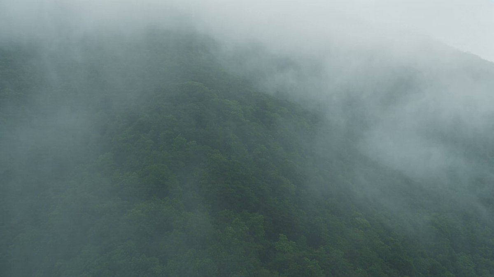

**พรอมต์**

```text
สร้างภาพยนตร์แอนิเมชัน 3 มิติแนวผจญภัยสไตล์ภาพยนตร์ความยาว 30 วินาที โดยมีหญิงสาวชาวเกาหลีสำรวจแม่น้ำในป่าดงดิบอันห่างไกลที่ยังไม่เคยมีใครแตะต้องในเกาหลีใต้
สไตล์ภาพ: แอนิเมชัน 3 มิติระดับภาพยนตร์ที่มีรายละเอียดสูงเป็นพิเศษ พร้อมสภาพแวดล้อมที่สมจริง ผิวและเส้นผมที่เป็นธรรมชาติ ระบบฟิสิกส์ของน้ำที่น่าเชื่อถือ พืชพรรณสมจริง แสงบรรยากาศ เกรนฟิล์มบางเบา พื้นผิวที่มีรายละเอียด และคุณภาพระดับภาพยนตร์ผจญภัยพรีเมียม หญิงสาวต้องมีรูปลักษณ์ภายนอกเหมือนเดิมตลอดทั้งวิดีโอ ไม่เอารูปลักษณ์แบบการ์ตูน ไม่เอาผิวพลาสติก ไม่มีสิ่งมีชีวิตแฟนตาซี ไม่มี CGI มากเกินไป

[0:00–0:05] — เข้าสู่ป่าลึก

เปิดฉากด้วยช็อตมุมสูงทางอากาศแบบภาพยนตร์มุมกว้างของป่าบนภูเขาในเกาหลีที่หนาทึบหลังฝนตกปรอยๆ

หญิงสาวชาวเกาหลีสวมชุดผจญภัยกลางแจ้งที่ใช้งานได้จริง รองเท้าเดินป่า เป้สะพายหลังขนาดเล็ก และเสื้อแจ็กเก็ตกันน้ำ เดินผ่านพงหญ้าและพืชพรรณหนาทึบ

เธอได้ยินเสียงน้ำไหลเชี่ยวและมองไปยังแนวต้นไม้

กล้องค่อยๆ เคลื่อนตามเธอจากด้านหลังในขณะที่เธอค้นพบแม่น้ำแคบๆ ที่ซ่อนอยู่ลึกเข้าไปในป่า

[0:05–0:11] — แม่น้ำ

เธอมาถึงริมฝั่งแม่น้ำ

น้ำใสราวกระจกไหลระหว่างโขดหินขนาดใหญ่ที่ปกคลุมด้วยมอส ล้อมรอบด้วยพืชพรรณสีเขียวชอุ่มและต้นไม้สูงตระหง่าน

เธอก้าวลงไปในน้ำตื้นอย่างระมัดระวังและเริ่มเดินทวนกระแสน้ำ

ใช้ช็อตมุมต่ำระดับผิวน้ำแสดงให้เห็นรองเท้าบูทของเธอเหยียบลงไปในสายน้ำที่กำลังไหล ตามด้วยช็อตติดตามที่ราบรื่นข้างตัวเธอ

รักษาการเคลื่อนไหวของน้ำให้สมจริงตามหลักฟิสิกส์

[0:11–0:18] — หุบเขาลึก

แม่น้ำแคบลงเมื่อเธอเดินต่อไป

เธอเข้าสู่หุบผาชันธรรมชาติอันน่าตื่นตา ล้อมรอบด้วยหน้าผาหินมหึมาที่ปกคลุมไปด้วยมอสและพืชขนาดเล็ก

แสงแดดส่องผ่านยอดไม้ด้านบน เกิดเป็นลำแสงธรรมชาติพาดผ่านผิวน้ำ

เธอสังเกตเห็นช่องเปิดเล็กๆ ด้านหลังน้ำตกและเดินเข้าไปใกล้อย่างระมัดระวัง

[0:18–0:24] — ถ้ำลึกลับ

เธอเดินเข้าไปด้านหลังน้ำตกและค้นพบถ้ำธรรมชาติที่ซ่อนอยู่

ภายใน ผนังถ้ำปกคลุมด้วยพื้นผิวแร่ธาตุที่สวยงามและหยดน้ำเล็กๆ

เธอส่องไฟฉายไปรอบๆ ถ้ำ และค้นพบลำธารใต้ดินที่ทอดยาวลึกเข้าไปในภูเขา

สีหน้าของเธอเปลี่ยนจากความอยากรู้อยากเห็นเป็นความตื่นตาตื่นใจ

[0:24–0:30] — เผยความลับ

เธอเดินตามลำธารใต้ดินไปยังทางออกถ้ำ

ทันใดนั้น กล้องเคลื่อนผ่านตัวเธอและเผยให้เห็นหุบเขาที่ซ่อนอยู่อันน่าทึ่งอีกฟากหนึ่ง

แม่น้ำขนาดใหญ่กว่าไหลผ่านหุบเขา ล้อมรอบด้วยขุนเขาเกาหลีอันบริสุทธิ์และสายหมอก

เธอยืนนิ่งเงียบอยู่ที่ปากทาง มองดูทิวทัศน์

จบด้วยการดึงกล้องถอยหลังช้าๆ แบบภาพยนตร์ เผยให้เห็นหญิงสาวเป็นเพียงร่างเล็กๆ ที่ถูกโอบล้อมด้วยภูมิทัศน์ธรรมชาติอันยิ่งใหญ่ตระการตา

การควบคุมความสม่ำเสมอและคุณภาพ

คงหญิงสาวคนเดิม ใบหน้า ทรงผม เสื้อผ้า เป้สะพายหลัง สัดส่วนร่างกาย และเครื่องประดับให้ตรงกันทุกประการตลอดทุกช็อต

รักษาภูมิศาสตร์และความสัมพันธ์เชิงพื้นที่ที่สอดคล้องกันระหว่างป่า แม่น้ำ หุบผาชัน น้ำตก ถ้ำ และหุบเขา

ห้ามมีการกลายร่างของตัวละคร การเปลี่ยนอัตลักษณ์ ตัวละครซ้ำซ้อน แขนขาเกิน มือบิดเบี้ยว ใบหน้าผิดรูป วัตถุหายไป วัตถุลอยได้ พื้นผิวกะพริบ บั๊กของน้ำ ฟิสิกส์ผิดธรรมชาติ แสงเปลี่ยนกะทันหัน กล้องกระตุก อาร์ติแฟกต์จากการแทรกเฟรม หรือความไม่เสถียรชั่วขณะ

ใช้การเคลื่อนไหวที่เรียบง่ายและน่าเชื่อถือตามหลักฟิสิกส์ และการเปลี่ยนฉากของกล้องที่ราบรื่น

กล้อง: ช็อตมุมสูงทางอากาศแบบภาพยนตร์ ช็อตติดตามที่นิ่ง ช็อตระดับน้ำ รายละเอียดสภาพแวดล้อมแบบมาโคร การเคลื่อนที่แบบดอลลี่ที่นุ่มนวล ระยะชัดลึกที่เป็นธรรมชาติ

แสง: แสงป่าที่มีเมฆครึ้มนุ่มนวลเปลี่ยนผ่านเป็นแสงแดดอบอุ่นและลำแสงบรรยากาศที่ละเอียดอ่อน

อารมณ์: ลึกลับ ผจญภัย สงบ น่าเกรงขามและตื่นตา

ระยะเวลา: 30 วินาที
อัตราส่วนภาพ: 16:9
คุณภาพ: แอนิเมชัน 3 มิติระดับภาพยนตร์พรีเมียม สภาพแวดล้อมและระบบฟิสิกส์ที่สมจริงอย่างยิ่ง
```

[↑ กลับสู่หมวดหมู่](#catalog)

---

<a name="prompt-2100861168286154994"></a>

### 关于东京站历经百年演进为未来科幻大都市的电影级视频提示词，包含地面水洼延时过渡及镜头时间轴规划。

ผู้เขียน：[@fps\_lusu](https://x.com/fps_lusu) · [โพสต์ต้นฉบับ](https://x.com/fps_lusu/status/2100861168286154994)

ภาพยนตร์ / ภาพนิ่งจากภาพยนตร์ · ไซเบอร์พังก์ / ไซไฟ · เผยแพร่แล้ว

**สรุป:** 关于东京站历经百年演进为未来科幻大都市的电影级视频提示词，包含地面水洼延时过渡及镜头时间轴规划。

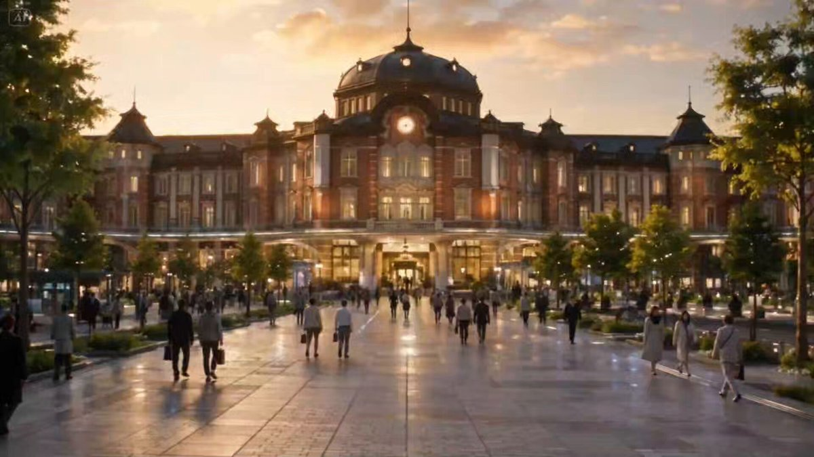

**พรอมต์**

```text
การตั้งค่าพื้นฐาน
​ความยาว: วิดีโอสั้น 30 วินาที
​อัตราส่วนภาพ: 16:9 (รูปแบบแนวนอนจอกว้าง)
​ประเภท: โฆษณาภาพยนตร์ไซไฟระดับฮอลลีวูด วิวัฒนาการทางสถาปัตยกรรมที่สมจริงเป็นพิเศษ
​สถานที่: สถานีโตเกียว (อาคารอิฐแดงมารุโนะอุจิ) การเปลี่ยนแปลงที่รวดเร็วและน่าทึ่งจากปี 2024 ไปสู่อีก 100 ปีข้างหน้าอย่างแท้จริง (ปี 2124) อ้างอิงจากภาพที่ให้มา
​สไตล์และภาพ
​คุณภาพ: การแสดงสดระดับภาพยนตร์ชิ้นเอก ภาพถ่ายที่สมจริงระดับไฮเปอร์ คุณภาพเลนส์ออปติคอลที่หนักแน่น เม็ดเกรนฟิล์มที่สมจริง และความลึกของบรรยากาศ (หมอก/ไอหมอก/แสงฟุ้งกระจาย)
​การเคลื่อนไหวและฟิสิกส์ (สำคัญมาก): การเคลื่อนไหวทางกายภาพที่ดิบและสมจริง จังหวะความเร็วตามโลกความเป็นจริงที่แม่นยำ น้ำหนักตามธรรมชาติ และแรงโน้มถ่วงในการเคลื่อนที่ของฝูงชนที่กำลังเดินและยานพาหนะ ห้ามมีความรู้สึก CGI ที่ "เร่งความเร็ว" หรือ "ลอยล่อง" อย่างผิดธรรมชาติโดยเด็ดขาด ยกเว้นเฉพาะในช่วงเวลาไทม์แลปส์ที่กำหนดเท่านั้น
​แสง (สำคัญมาก): แสงเชิงปริมาตรระดับภาพยนตร์ที่ซับซ้อน หลีกเลี่ยงสีนีออนที่ราคาถูก อิ่มตัวเกินไป และแบนราบโดยเด็ดขาด ใช้แสงเรืองรองที่นุ่มนวลและกระจายตัวอย่างหรูหรา เอฟเฟกต์แสงฟุ้งกระจายแบบละมุน และแสงแฟลร์ของเลนส์อนามอร์ฟิก
​ความสม่ำเสมอ: อาคารสถานีโตเกียวอิฐแดงเก่าแก่ในเบื้องหน้าต้องคงอยู่อย่างไม่เปลี่ยนแปลงและมีโครงสร้างเหมือนเดิมทุกประการตลอดช่วงการเปลี่ยนแปลง 100 ปีทั้งหมด
​เสียงและ ASMR
​ดนตรีประกอบ: ดนตรีออร์เคสตราอันยิ่งใหญ่ที่เปี่ยมด้วยอารมณ์ ดำดิ่งลงสู่คลื่นเสียงเบสทุ้มลึกในระหว่างไทม์แลปส์ จากนั้นค่อยๆ ขยายตัวขึ้นสู่จุดไคลแมกซ์อันยิ่งใหญ่ตระการตา
​SFX/ASMR: เสียงเมืองอันคึกคักที่สมจริง เสียงฝีเท้า และการจราจรยุคใหม่ เปลี่ยนผ่านไปสู่เสียงฮัมของแม่เหล็กที่โฉบเฉี่ยวและหนักแน่น และเสียงหวีดหวิวตามหลักอากาศพลศาสตร์ที่ชัดเจนในอนาคต ไม่มีเสียงพูด
​ไทม์ไลน์และการเคลื่อนไหว
​0–6 วินาที (ความเป็นจริงในยุคปัจจุบัน): เริ่มต้นในปี 2024 ภาพมุมกว้างมุมต่ำของสถานีโตเกียวอิฐแดงอันเป็นเอกลักษณ์ ฝูงชนของผู้เดินทางสัญจรเดินข้ามลานกว้างด้วยความเร็วการเดินของมนุษย์ที่สมจริงและเคร่งครัดพร้อมแรงโน้มถ่วงตามธรรมชาติ แสงแดดสีทองอันนุ่มนวลสะท้อนอย่างงดงามบนพื้นหินกรวดที่เปียกชื้น
​6–14 วินาที (ไทม์แลปส์บนแอ่งน้ำ): กล้องลดระดับลงอย่างนุ่มนวลเป็นภาพโคลสอัปของแอ่งน้ำขนาดใหญ่บนลานกว้างที่สะท้อนภาพสถานี จู่ๆ ภาพสะท้อนในน้ำก็เข้าสู่ไทม์แลปส์ความเร็วสูง ท้องฟ้าเคลื่อนผ่านวันและคืนอย่างรวดเร็วในไม่กี่วินาที ในภาพสะท้อนนั้น โครงสร้างแห่งอนาคตขนาดมหึมาและแท่นลอยน้ำต่างพุ่งทะยานขึ้นสู่ท้องฟ้าเบื้องหลังสถานีอย่างรวดเร็ว
​14–22 วินาที (อนาคตมาถึง): กล้องเอียงขึ้นจากแอ่งน้ำกลับไปที่สถานี ขณะนี้เราอยู่ในปี 2124 การเคลื่อนไหวของกล้องและความเร็วของฝูงชนกลับสู่จังหวะในโลกความเป็นจริงที่ดิบและสมจริงอย่างเคร่งครัด สถานีอิฐแดงเก่าแก่ยังคงได้รับการอนุรักษ์ไว้อย่างสมบูรณ์แบบ แต่บัดนี้ถูกล้อมรอบด้วยยูโทเปียอันล้ำสมัย โครงสร้างลอยฟ้าขนาดยักษ์ ลูกโลกโฮโลกราฟิกเรืองแสงขนาดมหึมา และยานพาหนะบินได้ที่โฉบเฉี่ยวเต็มท้องฟ้า แสงเป็นส่วนผสมอันหรูหราของพระอาทิตย์ตกอันอบอุ่นและแสงไฟเมืองสีฟ้าครามที่ซับซ้อนคล้ายการเรืองแสงทางชีวภาพ
​22–30 วินาที (มรดกที่ยั่งยืน): ช็อตการดึงกล้องถอยหลังที่นุ่มนวลอย่างเหลือเชื่อคล้ายโดรนอันสง่างาม กล้องเผยให้เห็นสเกลอันน่าทึ่งของมหานครแห่งอนาคต โดยมีสถานีโตเกียวอิฐแดงเหนือกาลเวลาตั้งอยู่อย่างสงบใจกลางเมือง
​พรอมต์เชิงลบ / ข้อจำกัด
​กฎเกี่ยวกับข้อความ: อนุญาตให้มีป้ายสภาพแวดล้อมตามธรรมชาติได้ แต่ห้ามมีข้อความบรรยายเรื่องราว ห้ามมีคำบรรยายใต้ภาพ ห้ามมีเครื่องหมายบอกไทม์ไลน์ (เช่น "100 years later", "2024", "2124") โดยเด็ดขาด
​ไม่มีไฟนีออนราคาถูก ไม่มีสีเรืองแสงแบนราบ ไม่มีไฟที่เป็นภาพจำแบบไซเบอร์พังก์
​ไม่มีฟิสิกส์แบบลอยล่อง ไม่มีความเร็วการเดินที่ไม่เป็นธรรมชาติ ไม่มีการสั่นไหวของกล้อง ไม่ใช่สไตล์อนิเมะ ไม่ใช่การเรนเดอร์ 3D คุณภาพต่ำ
```

[↑ กลับสู่หมวดหมู่](#catalog)

---

<a name="prompt-2100822353446060246"></a>

### ภาพสไตล์ภาพยนตร์ของหญิงสาวในเสื้อโค้ตสีเข้มที่ยืนอยู่ท่ามกลางพายุหิมะบนภูเขา

ผู้เขียน：[@AIwithMinal](https://x.com/AIwithMinal) · [โพสต์ต้นฉบับ](https://x.com/AIwithMinal/status/2100822353446060246)

ภาพยนตร์ / ภาพนิ่งจากภาพยนตร์ · ตัวละคร · ทิวทัศน์ / ธรรมชาติ · เผยแพร่แล้ว

**สรุป:** ภาพสไตล์ภาพยนตร์ของหญิงสาวในเสื้อโค้ตสีเข้มที่ยืนอยู่ท่ามกลางพายุหิมะบนภูเขา

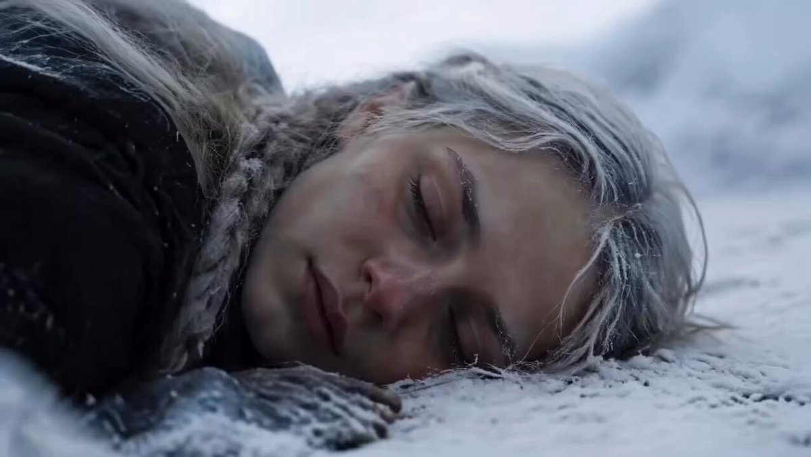

**พรอมต์**

```text
ฉากภาพยนตร์ที่สมจริงอย่างยิ่งของหญิงสาวคนหนึ่งที่ยืนอยู่ตามลำพังในทิวทัศน์หิมะเยือกแข็งอันกว้างใหญ่ สวมเสื้อโค้ตกันน้ำสีเข้ม ลมพัดเส้นผมของเธอ สีหน้าเหนื่อยล้าแต่เปี่ยมด้วยความมุ่งมั่น พายุหิมะโหมกระหน่ำ เมฆพายุสีเข้มอันดุดัน ภูเขาที่ปกคลุมด้วยหิมะในพื้นหลัง บรรยากาศโทนเย็นสีฟ้า อนุภาคหิมะที่สมจริง พื้นผิวผิวหนังตามธรรมชาติ การเล่าเรื่องที่เปี่ยมด้วยอารมณ์ การจัดแสงที่ดรามาติก ความชัดตื้น การเกรดสีแบบภาพยนตร์ รายละเอียดสูงเป็นพิเศษ ภาพเสมือนจริง 8K, HDR, ภาพนิ่งภาพยนตร์ระดับมืออาชีพ เลนส์ 85mm องค์ประกอบภาพแนวตั้ง 9:16
```

[↑ กลับสู่หมวดหมู่](#catalog)

---

<a name="prompt-2100824456054911362"></a>

### วิดีโอซีเนมาติกของหญิงสาวในปารีสที่ชุดเดรสสีขาวเปลี่ยนเป็นผ้าซาตินสีแดงอย่างน่าอัศจรรย์ก่อนที่เธอจะเพลิดเพลินกับไอศกรีม

ผู้เขียน：[@Zyrellix](https://x.com/Zyrellix) · [โพสต์ต้นฉบับ](https://x.com/Zyrellix/status/2100824456054911362)

ภาพยนตร์ / ภาพนิ่งจากภาพยนตร์ · ตัวละคร · ไอเทมแฟชั่น · เผยแพร่แล้ว

**สรุป:** วิดีโอซีเนมาติกของหญิงสาวในปารีสที่ชุดเดรสสีขาวเปลี่ยนเป็นผ้าซาตินสีแดงอย่างน่าอัศจรรย์ก่อนที่เธอจะเพลิดเพลินกับไอศกรีม


**พรอมต์**

```text
ภาพยนตร์แฟชั่นสไตล์ซีเนมาติกความยาว 15 วินาที สมจริงราวภาพถ่าย ความละเอียด 4K ระยะชัดตื้น หญิงสาวแสนสวยผมยาวลอนสีบลอนด์น้ำผึ้งและสวมต่างหูทองแบบติดหู สวมชุดเดรสยาวปานกลางคอสี่เหลี่ยมแขนกุดสีขาวสง่างาม เดินอยู่บนถนนช้อปปิ้งอันเงียบสงบในปารีส เธอส่งยิ้มให้หน้าต่างร้านบูติกหรูหราที่จัดแสดงหุ่นสวมชุดเดรสผ้าซาตินคอสี่เหลี่ยมสีแดงที่เข้าชุดกัน กล่องของขวัญสีแดงผูกโบว์สีดำวางซ้อนกัน กระเป๋าหนังสีน้ำตาลแทน รองเท้าส้นสูงสีแดง และถุงช้อปปิ้ง ริบบิ้นแสงสีส้มทองเรืองแสงหมุนวนรอบชุดเดรสสีแดง พุ่งทะลุกระจกเข้ามาโอบล้อมตัวเธอ และเปลี่ยนชุดเดรสสีขาวของเธอให้กลายเป็นชุดเดรสผ้าซาตินสีแดงพลิ้วไหวชุดเดียวกันในทันที ตัดภาพเป็นมุมมองมุมต่ำตามติดช่วงขาและกระโปรงสีแดงที่พลิ้วไหวขณะที่เธอเดินข้ามทางม้าลายด้วยรองเท้าส้นสูงหัวแหลมสีนู้ด เธอรับโคนไอศกรีมซอฟต์เสิร์ฟรสวานิลลาจากรถเข็นไอศกรีมวินเทจที่มีร่มสีชมพู ยิ้ม กัดหนึ่งคำ แล้วเดินออกไปตามถนนสายกว้างของปารีสที่เรียงรายไปด้วยอาคารสไตล์โอสมานน์ รถยนต์ที่จอดอยู่ และคาเฟ่ แสงกลางวันแบบมีเมฆบังนุ่มนวล การเคลื่อนไหวของเส้นผมอย่างเป็นธรรมชาติ การเกรดสีแบบแฟชั่นภาพถ่าย ไม่มีข้อความ ไม่มีโลโก้
```

[↑ กลับสู่หมวดหมู่](#catalog)

---

<a name="prompt-2100450213261672460"></a>

### บทภาพยนตร์โรแมนติกเขตร้อนแนวภาพยนตร์ที่นำเสนอคู่รักที่อ่าวชายหาดและเพิงร้านน้ำผลไม้ตลอดเส้นเวลา 60 วินาที

ผู้เขียน：[@doctorwasif](https://x.com/doctorwasif) · [โพสต์ต้นฉบับ](https://x.com/doctorwasif/status/2100450213261672460)

ภาพยนตร์ / ภาพนิ่งจากภาพยนตร์ · กลุ่ม / คู่ · เผยแพร่แล้ว

**สรุป:** บทภาพยนตร์โรแมนติกเขตร้อนแนวภาพยนตร์ที่นำเสนอคู่รักที่อ่าวชายหาดและเพิงร้านน้ำผลไม้ตลอดเส้นเวลา 60 วินาที


**พรอมต์**

```text
“Where the Light Lands” — 60 วินาที

รูปลักษณ์/สไตล์: โรแมนติกเขตร้อนแนวภาพยนตร์, ช่วงเวลาแสงสีทอง (golden hour) → พลบค่ำโทนสีฟ้าลาเวนเดอร์, โทนสีปะการัง/พีชอันอบอุ่น, แสงแฟลร์ของเลนส์ที่นุ่มนวล, ความชัดตื้น (shallow DOF), เกรนฟิล์มบางเบา ผสมผสานช็อตมุมกว้างจากโดรน, โคลสอัพแบบถือกล้องด้วยมือ (handheld), ช็อตภาพนิ่ง, การเคลื่อนกล้องเข้าอย่างช้าๆ (slow push-ins), ภาพแทรกธรรมชาติแบบสโลว์โมชัน, และมุมมอง POV ผ่านช่องมองภาพโพลารอยด์ เคมีที่เป็นธรรมชาติ ขี้เล่น และสนิทสนม

ตัวละคร:
A — ผมหยื่นศอกสีเข้ม, สวมเสื้อเชิ้ตผ้าลินินสีครีมทับชุดว่ายน้ำ, กระเป๋าผ้าโท้ท, กล้องโพลารอยด์
B — ผมสีน้ำตาลทราย, สวมเสื้อเชิ้ตเดนิมซีดเปิดอก, กางเกงว่ายน้ำขาสั้น, ซอฟต์ท็อปแพดเดิลบอร์ด

สถานที่: อ่าวเขตร้อนอันเงียบสงบพร้อมน้ำทะเลสีฟ้าเทอร์ควอยซ์, ขอนไม้ลอยน้ำ, แอ่งน้ำขึ้นน้ำลง และต้นมะพร้าว → เพิงร้านน้ำผลไม้กลางแจ้งแสนอบอุ่นประดับไฟสาย

ไทม์ไลน์

0–2 วินาที: ชื่อเรื่อง “Where the Light Lands” ปรากฏเหนือรองเท้าแตะและกระเป๋าชายหาด โดยมีมหาสมุทรอยู่ด้านหลัง

2–6 วินาที: B พายเรือข้ามผืนน้ำสีฟ้าเทอร์ควอยซ์อันสงบนิ่ง
6–8 วินาที: คลื่นสโลว์โมชันซัดเข้าหาฝั่ง
8–10 วินาที: แพดเดิลบอร์ดอยู่ด้านหน้า B อยู่ไกลออกไปในน้ำ
10–12 วินาที: A เฝ้ามอง B กำลังเข้าใกล้มาจากฝั่ง
12–14 วินาที: A นั่งบนขอนไม้ลอยน้ำ กล้องวางอยู่บนตัก
14–16 วินาที: A ถ่ายภาพ B ที่กำลังหัวเราะขณะที่เขาเดินขึ้นฝั่ง
16–18 วินาที: มาโคร: ภาพถ่ายพิมพ์ออกมาจากตัวกล้อง
18–20 วินาที: มุมมอง POV จากช่องมองภาพเห็น B กำลังเดินเข้ามาพร้อมรอยยิ้มกว้าง
20–22 วินาที: A โบกพัดภาพถ่ายที่กำลังพัฒนาภาพ

22–24 วินาที: B: “ขอดูหน่อยสิว่ามันแย่แค่ไหน”
24–26 วินาที: A: “จริงๆ แล้วมันออกมาดีมากเลยนะ”
26–28 วินาที: B: “นั่นคือคำพูดของคนที่ถ่ายรูปออกมาแย่ชัดๆ”
28–30 วินาที: A ยื่นรูปถ่ายให้เขา
30–32 วินาที: B พินิจดูรูปพร้อมรอยยิ้ม
32–34 วินาที: B: “…รูปนี้ฉันขอเก็บไว้นะ”

34–36 วินาที: ปูเสฉวนเดินข้ามผืนทรายเปียก
36–38 วินาที: อ่าวที่ว่างเปล่าระลอกคลื่นเบาๆ

38–40 วินาที: ไฟในเพิงน้ำผลไม้เปิดสว่างขึ้น; A มาร่วมโต๊ะกับ B
40–42 วินาที: B: “เธอสั่งเมนูเดิมตลอดเลย รู้ตัวไหม?”
42–44 วินาที: A นั่งลงข้างๆ เขา
44–46 วินาที: B รอคำตอบจากเธอ
46–48 วินาที: A: “จะเปลี่ยนทำไมในเมื่อของเดิมมันดีอยู่แล้ว?”
48–50 วินาที: เครื่องดื่มมาเสิร์ฟ; ไฟสายโทนอุ่นส่องแสงเปล่งประกาย
50–52 วินาที: ทั้งสองหัวเราะ ไหล่สัมผัสกัน

52–54 วินาที: ช็อตโดรนเหนือมหาสมุทรยามพลบค่ำ
54–56 วินาที: แสงสะท้อนสีทองในแอ่งน้ำขึ้นน้ำลง
56–58 วินาที: ฟองคลื่นซัดกลบรอยเท้า
58–60 วินาที: ไฟสายแกว่งไหวตัดกับท้องฟ้าสีฟ้าอมม่วงลาเวนเดอร์ ค่อยๆ จางหายไป (Fade out)
```

[↑ กลับสู่หมวดหมู่](#catalog)

---

<a name="prompt-2100444829880914240"></a>

### ฉากสไตล์ภาพยนตร์สมจริงขั้นสุดของหญิงสาวในชุดศิลปะการต่อสู้สีดำในลานบ้านแบบดั้งเดิมของเกาหลี

ผู้เขียน：[@AIwithMinal](https://x.com/AIwithMinal) · [โพสต์ต้นฉบับ](https://x.com/AIwithMinal/status/2100444829880914240)

ภาพยนตร์ / ภาพนิ่งจากภาพยนตร์ · ตัวละคร · เผยแพร่แล้ว

**สรุป:** ฉากสไตล์ภาพยนตร์สมจริงขั้นสุดของหญิงสาวในชุดศิลปะการต่อสู้สีดำในลานบ้านแบบดั้งเดิมของเกาหลี


**พรอมต์**

```text
ฉากสไตล์ภาพยนตร์สมจริงขั้นสุดของหญิงสาวผู้มาดมั่นยืนอย่างมั่นใจในลานศิลปะการต่อสู้แบบดั้งเดิมของเกาหลี สวมชุดศิลปะการต่อสู้สีดำพร้อมปกเสื้อสีขาว ผมสั้นสีเข้มพลิ้วไหวอย่างเป็นธรรมชาติตามสายลม สีหน้ามุ่งมั่นจริงจัง แสงแดดอบอุ่นชวนดราม่า สถาปัตยกรรมเกาหลีโบราณและกำแพงหินเป็นฉากหลัง มีโมชันเบลอเล็กน้อย ผิวสัมผัสของผิวหนังสมจริง รายละเอียดเนื้อผ้าประณีต ระยะชัดตื้น การเกรดสีแบบภาพยนตร์ คอนทราสต์สูง 8K HDR ภาพนิ่งภาพยนตร์ระดับมืออาชีพ บรรยากาศทรงพลัง เลนส์ 35 มม. องค์ประกอบภาพแนวตั้ง 9:16
```

[↑ กลับสู่หมวดหมู่](#catalog)

---

<a name="prompt-2100458083831234699"></a>

### กำลังแปล

ผู้เขียน：[@Diplomeme](https://x.com/Diplomeme) · [โพสต์ต้นฉบับ](https://x.com/Diplomeme/status/2100458083831234699)

ภาพยนตร์ / ภาพนิ่งจากภาพยนตร์ · เผยแพร่แล้ว

**สรุป:** กำลังแปล


**พรอมต์**

```text
กำลังแปล
```

[↑ กลับสู่หมวดหมู่](#catalog)

---

<a name="prompt-2100462892864979292"></a>

### พรอมต์สตอรีบอร์ดฉากแอ็กชันไซไฟหลายฉาก แสดงรายละเอียดการประกอบตัวของนักรบสวมเกราะมีฮู้ดจากลูกบาศก์สีแดงและการต่อสู้ในเมืองกับหุ่นยนต์ต่อสู้สีส้ม

ผู้เขียน：[@itsSaira\_1](https://x.com/itsSaira_1) · [โพสต์ต้นฉบับ](https://x.com/itsSaira_1/status/2100462892864979292)

คอมิก / สตอรี่บอร์ด · ภาพยนตร์ / ภาพนิ่งจากภาพยนตร์ · ไซเบอร์พังก์ / ไซไฟ · ทิวทัศน์เมือง / ถนน · เผยแพร่แล้ว

**สรุป:** พรอมต์สตอรีบอร์ดฉากแอ็กชันไซไฟหลายฉาก แสดงรายละเอียดการประกอบตัวของนักรบสวมเกราะมีฮู้ดจากลูกบาศก์สีแดงและการต่อสู้ในเมืองกับหุ่นยนต์ต่อสู้สีส้ม


**พรอมต์**

```text
ความต่อเนื่องระดับสากล — ในทุกฉาก
แอ็กชันไซไฟสไตล์ภาพยนตร์สมจริงเสมือนภาพถ่าย, ทิวทัศน์ 16:9, รายละเอียดขั้นสุดยอด, วัสดุสมจริง, แสงเงาในเมืองที่ดูดุดันและน่าทึ่ง, ระยะชัดตื้น, การเคลื่อนไหวของกล้องแบบไดนามิก รักษาความสอดคล้องของเมืองแห่งอนาคตแบบเดียวกันทุกประการ โทนสีแดง/ดำ เทคโนโลยีหุ่นยนต์ ฮิวแมนอยด์สวมเกราะมีฮู้ด และหุ่นยนต์ต่อสู้สีส้มในทุกฉาก แต่ละฉากต้องดำเนินเรื่องต่อจากฉากก่อนหน้าโดยตรงด้วยความต่อเนื่องทางสายตาอย่างไร้รอยต่อ ไม่มีข้อความ โลโก้ ลายน้ำ หรือ UI
ฉาก 1 — 0–6 วินาที
ภาพโคลสอัปของอุปกรณ์ทรงกระบอกโลหะแห่งอนาคตที่วางอยู่บนถนนในเมือง ล้อมรอบด้วยลูกบาศก์เรืองแสงสีเขียวขนาดเล็กหลายร้อยลูก อุปกรณ์เริ่มเปลี่ยนผ่านจากพลังงานสีเขียวไปเป็นพลังงานสีแดงเข้ม กล้องค่อยๆ ดันเข้าไปข้างหน้าอย่างช้าๆ ในสไตล์ภาพยนตร์ การสะท้อนแสงที่สมจริง ระยะชัดตื้น
ฉาก 2 — 6–14 วินาที
อุปกรณ์กลายเป็นแกนพลังงานเรืองแสงสีแดงทรงพลังพร้อมสัญลักษณ์วงกลม ล้อมรอบด้วยลูกบาศก์สีแดงหลายร้อยลูกที่กระจายตัวไปทั่วถนนในเมืองที่ว่างเปล่า ช็อตติดตามมุมมองต่ำแบบภาพยนตร์ แสงสว่างสีแดงจัดจ้า บรรยากาศและเศษซากปรักหักพังที่สมจริง
ฉาก 3 — 14–24 วินาที
ลูกบาศก์สีแดงทวีจำนวนอย่างรวดเร็วและกระจายไปทั่วทั้งถนน กล้องลอยขึ้นเป็นมุมมองมุมสูงจากด้านบน เผยให้เห็นทุ่งลูกบาศก์สีแดงเรืองแสงขนาดมหึมาที่ล้อมรอบอุปกรณ์ตรงกลาง ลูกบาศก์เริ่มเคลื่อนที่และรวมตัวเข้าด้วยกัน
ฉาก 4 — 24–40 วินาที
ลูกบาศก์สีแดงหลายพันลูกประกอบตัวกันอย่างรุนแรงกลายเป็นร่างกายส่วนล่างและขาของสิ่งมีชีวิตฮิวแมนอยด์ขนาดยักษ์ สิ่งมีชีวิตผุดขึ้นมาจากถนนขณะที่ลูกบาศก์ล็อกเข้าหากันอย่างต่อเนื่อง ก่อตัวเป็นเกราะแห่งอนาคตสีดำและแดงที่มีรายละเอียดสูง กล้องมุมต่ำ สเกลที่ทรงพลัง ฝุ่นและเศษซาก
ฉาก 5 — 40–54 วินาที
โครงสร้างฮิวแมนอยด์ขนาดยักษ์ก่อตัวต่อไปเรื่อยๆ จากนั้นก็ยุบตัวและควบแน่นกลายเป็นนักรบสวมเกราะมีฮู้ดขนาดเล็กลง ลูกบาศก์สีแดงไหลเวียนรอบร่างกายและหลอมรวมเข้าเป็นเกราะแห่งอนาคตสีดำเงางามพร้อมรายละเอียดพลังงานสีแดงเรืองแสง ช็อตโคลสอัปการแปลงร่างแบบภาพยนตร์
ฉาก 6 — 54–68 วินาที
นักรบสวมเกราะมีฮู้ดลงสู่พื้นถนนในเมืองอย่างหนักหน่วง ล้อมรอบด้วยลูกบาศก์สีแดงที่กระจัดกระจาย เผยให้เห็นตัวละครเต็มตัว: เกราะแห่งอนาคตสีดำ ฮู้ด ใบหน้าจักรกลเรืองแสงสีแดง และแกนพลังงานสีแดงบนหน้าอก กล้องค่อยๆ เปิดเผยภาพอย่างช้าๆ เต็มไปด้วยอารมณ์ดราม่า
ฉาก 7 — 68–80 วินาที
ภาพโคลสอัปที่หน้าอกหุ้มเกราะและแกนสีแดงเรืองแสงของนักรบ อุปกรณ์พลังงานทรงกระบอกสีแดงลอยขึ้นมาจากพื้น นักรบเอื้อมมือหุ้มเกราะสีดำลงมาแล้วยกมันขึ้นมา ตัดสลับระหว่างมือที่มีรายละเอียด อุปกรณ์ และแกนหน้าอกเรืองแสง
ฉาก 8 — 80–94 วินาที
หุ่นยนต์ต่อสู้สีส้มแห่งอนาคตปรากฏตัวบนถนนในเมืองที่พังทลาย เผชิญหน้ากับนักรบมีฮู้ด ทั้งสองยืนห่างกันไม่กี่เมตรในการประจันหน้าอันตึงเครียด หุ่นยนต์มีเกราะสีส้มเพรียวบาง ข้อต่อจักรกลสีเข้ม และกระบังหน้าเรืองแสง ช็อตโคลสอัปสลับไปมาแบบภาพยนตร์
ฉาก 9 — 94–108 วินาที
หุ่นยนต์ต่อสู้สีส้มเปิดฉากโจมตีด้วยความเร็วสูงอย่างกะทันหัน นักรบมีฮู้ดยกแขนขึ้นและปล่อยคลื่นพลังงานสีแดงอันทรงพลัง หุ่นยนต์หลบหลีกและเคลื่อนที่อย่างรวดเร็วผ่านควันและเศษซากปรักหักพัง กล้องติดตามแบบไดนามิก แอ็กชันดุเดือด การระเบิดที่สมจริง
ฉาก 10 — 108–122 วินาที
นักรบมีฮู้ดปล่อยลำแสงพลังงานสีแดงเข้มข้นขนาดใหญ่วิ่งตรงไปตามถนนในเมือง หุ่นยนต์สีส้มพุ่งไปข้างหน้าและหลบหลีกระหว่างอาคารและการระเบิด การเคลื่อนไหวของกล้องแบบภาพยนตร์ที่รวดเร็ว เศษซากที่ลอยกระเด็น ควัน ประกายไฟ และแสงสีแดงเข้มข้น
ฉาก 11 — 122–136 วินาที
ช็อตมุมกว้างแบบภาพยนตร์ของถนนในเมืองที่ถูกทำลายยับเยิน นักรบมีฮู้ดยืนอยู่ตรงกลางขณะที่หุ่นยนต์ต่อสู้สีส้มหลายตัวและร่างหุ้มเกราะสีเข้มล้อมรอบจากทั้งสองด้าน นักรบเตรียมพร้อมสำหรับการต่อสู้อีกครั้งในขณะที่ศัตรูก้าวเข้ามา จบด้วยช็อตมุมกว้างอันทรงพลัง
```

[↑ กลับสู่หมวดหมู่](#catalog)

---

<a name="prompt-2100456445900710158"></a>

### วิดีโอแฟชั่นสไตล์ภาพยนตร์ของหญิงสาวที่เดินบนถนนในปารีส แปลงโฉมจากชุดเดรสสีขาวเป็นชุดเดรสสีแดงอย่างน่าอัศจรรย์ และกำลังรับประทานไอศกรีม

ผู้เขียน：[@ayzalnooor24521](https://x.com/ayzalnooor24521) · [โพสต์ต้นฉบับ](https://x.com/ayzalnooor24521/status/2100456445900710158)

ภาพยนตร์ / ภาพนิ่งจากภาพยนตร์ · ตัวละคร · ไอเทมแฟชั่น · ทิวทัศน์เมือง / ถนน · เผยแพร่แล้ว

**สรุป:** วิดีโอแฟชั่นสไตล์ภาพยนตร์ของหญิงสาวที่เดินบนถนนในปารีส แปลงโฉมจากชุดเดรสสีขาวเป็นชุดเดรสสีแดงอย่างน่าอัศจรรย์ และกำลังรับประทานไอศกรีม


**พรอมต์**

```text
สร้างวิดีโอแปลงโฉมแฟชั่นสไตล์ภาพยนตร์ นำแสดงโดยหญิงสาวสวยที่กำลังเดินผ่านถนนอันสง่างามของกรุงปารีส เธอเริ่มต้นในชุดเดรสฤดูร้อนสีขาวสะอาดตา เดินอย่างเป็นธรรมชาติไปตามทางเท้าของเมืองที่ทันสมัยท่ามกลางสถาปัตยกรรมคลาสสิก คาเฟ่ ร้านค้า และคนเดินเท้า กล้องติดตามเธออย่างราบรื่นด้วยการเคลื่อนไหวแบบภาพยนตร์ที่สมจริงและระยะชัดตื้น เมื่อเธอเดินผ่านหน้าร้าน เส้นแสงสีแดงเรืองรองก็หมุนวนรอบตัวเธอ ทำให้เกิดเอฟเฟกต์การแปลงโฉมแฟชั่นที่น่าอัศจรรย์ ชุดของเธอเปลี่ยนจากสีขาวเป็นชุดเดรสแขนกุดสีแดงสุดหรูหราอย่างแนบเนียน ต่อด้วยช็อตระดับถนนที่มีความเคลื่อนไหวอย่างมีชีวิตชีวาขณะที่เธอเดินข้ามสี่แยกอันพลุกพล่านของปารีสอย่างมั่นใจ ปิดท้ายด้วยภาพโคลสอัปที่สวยงามของเธอในชุดเดรสสีแดง ถือไอศกรีมและรับประทานอย่างนุ่มนวลพร้อมกับมองมาที่กล้องอย่างเป็นธรรมชาติ รายละเอียดสมจริงเหมือนภาพถ่าย สุนทรียศาสตร์ของภาพยนตร์แฟชั่นอันสง่างาม แสงธรรมชาติ การเปลี่ยนฉากที่ราบรื่น ผิวสัมผัสที่สมจริง เลนส์ภาพยนตร์ การเคลื่อนไหวของพื้นหลังที่ละเอียดอ่อน ลุคโฆษณาระดับพรีเมียม
```

[↑ กลับสู่หมวดหมู่](#catalog)

---

<a name="prompt-2100446648107459068"></a>

### พรอมต์ภาพคนแสดงจริงระดับภาพยนตร์ความยาว 30 วินาที ถ่ายทอดภาพเพื่อนหนุ่มสาวชาวเกาหลีสองคนที่กำลังสัมผัสวิถีชีวิตแบบดั้งเดิมในบ้านฮันอก การรับประทานอาหารเช้า การแต่งกายด้วยชุดฮันบก และตลาดริมทาง

ผู้เขียน：[@itxabdullaa](https://x.com/itxabdullaa) · [โพสต์ต้นฉบับ](https://x.com/itxabdullaa/status/2100446648107459068)

ภาพยนตร์ / ภาพนิ่งจากภาพยนตร์ · ไอเทมแฟชั่น · ทิวทัศน์เมือง / ถนน · เผยแพร่แล้ว

**สรุป:** พรอมต์ภาพคนแสดงจริงระดับภาพยนตร์ความยาว 30 วินาที ถ่ายทอดภาพเพื่อนหนุ่มสาวชาวเกาหลีสองคนที่กำลังสัมผัสวิถีชีวิตแบบดั้งเดิมในบ้านฮันอก การรับประทานอาหารเช้า การแต่งกายด้วยชุดฮันบก และตลาดริมทาง


**พรอมต์**

```text
ความยาวที่แน่นอน: 30 วินาที
16:9 | ภาพคนแสดงจริงเสมือนจริงขั้นสูงสุด (ULTRA-PHOTOREALISTIC LIVE-ACTION)

สร้าง 30 วินาทีแรกของภาพยนตร์แนวซีเนมาติกต่อเนื่องเรื่องเดียวเกี่ยวกับเพื่อนหนุ่มสาวชาวเกาหลีสองคนที่กำลังสัมผัสกับวิถีชีวิตแบบดั้งเดิมของเกาหลี จะต้องดูเหมือนภาพคนแสดงจริงระดับมืออาชีพของแท้ที่ถ่ายทำในเกาหลี ไม่ดูเหมือนสร้างด้วย AI โดยเด็ดขาด

การล็อกตัวละคร — โดยเด็ดขาด

ใช้อ้างอิงตัวละครหญิงสาวชาวเกาหลีและชายหนุ่มชาวเกาหลีที่อัปโหลดอย่างแม่นยำทุกประการ

ผู้หญิง: 23 ปี ผู้ชาย: 24 ปี

คงใบหน้า ดวงตา จมูก ริมฝีปาก โทนสีผิว ทรงผม ความยาวของผม สัดส่วนร่างกาย ความสัมพันธ์ของส่วนสูง อายุ และอัตลักษณ์ที่แน่นอนไว้ ไม่มีการออกแบบใหม่ ไม่มีการแต่งให้สวยขึ้น ไม่ทำให้ดูมีอายุขึ้น ไม่มีการเปลี่ยนรูปร่างหน้าตา หรืออัตลักษณ์คลาดเคลื่อน เป็นคนเดิมตลอดทั้งตอนที่ 1 และตอนที่ 2

เรื่องราว

เพื่อนหนุ่มสาวชาวเกาหลีสองคนเริ่มต้นยามเช้าของพวกเขาในบ้านฮันอกดั้งเดิมแท้ๆ และสัมผัสวิถีชีวิตเกาหลีแบบดั้งเดิมร่วมกันอย่างเป็นธรรมชาติ ให้ความรู้สึกใกล้ชิด เป็นการสังเกตการณ์ และให้ความเคารพ เป็นมิตรภาพเท่านั้น ไม่มีความโรแมนติก

ฉากที่ 1 — ยามรุ่งอรุณ | 0:00–0:06

บ้านฮันอกเกาหลีดั้งเดิมแท้ในยามรุ่งสาง แสงแดดส่องผ่านประตูกระดาษ หญิงสาวตื่นขึ้น เปิดประตูไม้แล้วก้าวออกมายังลานบ้าน ชายหนุ่มปรากฏตัวจากอีกห้องหนึ่ง พวกเขาส่งยิ้มบางๆ ให้กันและเดินไปด้วยกัน

เนื้อไม้จริง สายลมพัดผ่าน และเสียงนกยามเช้า

ชื่อภาษาเกาหลี: 한국의 하루
ภาษาอังกฤษ: A Day in Traditional Korea

ฉากที่ 2 — อาหารเช้า | 0:06–0:12

ภายในบ้านฮันอก พวกเขานั่งที่โต๊ะอาหารเกาหลีโบราณทรงเตี้ย พร้อมข้าวสวยควันกรุ่น ซุป พันชัน (เครื่องเคียง) ถ้วยเซรามิก และตะเกียบ

ชายหนุ่มตักเสิร์ฟอาหาร หญิงสาวยิ้ม ทั้งคู่รับประทานอาหารอย่างเป็นธรรมชาติ ไม่มีการโพสท่าหรือแสดงอารมณ์เกินจริง

คำบรรยายภาษาเกาหลี: 하루는 함께하는 아침에서 시작됩니다.
ภาษาอังกฤษ: A day begins with a morning shared together.

ฉากที่ 3 — ชุดฮันบก | 0:12–0:18

พวกเขาเตรียมตัวออกไปข้างนอก

หญิงสาว: สวมชุดฮันบกตามภาพอ้างอิงอย่างแม่นยำ ชอโกรี (เสื้อท่อนบน) สีงาช้าง + ชิมา (กระโปรง) สีชมพูกุหลาบหม่น (dusty-rose)
ชายหนุ่ม: สวมชุดฮันบกตามภาพอ้างอิงอย่างแม่นยำ ชอโกรีสีครีม + พาจี (กางเกง) สีกรมท่าหม่นเข้ม

แสดงเนื้อผ้าที่สมจริงขณะที่เธอผูกริบบิ้นและเขาจัดแขนเสื้อ ปฏิสัมพันธ์เป็นไปอย่างเป็นธรรมชาติ

ฉากที่ 4 — ตรอกบ้านฮันอก | 0:18–0:24

พวกเขาเดินผ่านย่านประวัติศาสตร์ของเกาหลีอันเงียบสงบที่มีหลังคาบ้านฮันอกแท้ ประตูไม้ กำแพงหิน และชาวบ้านในพื้นที่

กล้องติดตามจากด้านหลัง จากนั้นแทร็กกิ้งด้านข้างอย่างแนบเนียน บทสนทนาที่เงียบสงบ แสงแดดธรรมชาติ และการเคลื่อนไหวที่เป็นธรรมชาติ

ฉากที่ 5 — ตลาดโบราณ | 0:24–0:30

พวกเขาเดินเข้าสู่ตลาดเกาหลีที่มีชีวิตชีวา มีพ่อค้าแม่ค้าของแท้ ป้ายภาษาเกาหลี วัตถุดิบ ขนม ควันลอย และแผงขายอาหาร

หญิงสาวหยุดอยู่ที่แผงขายของ พ่อค้าส่งขนมเกาหลีโบราณให้เธอ เธอพิจารณาดูอย่างเป็นธรรมชาติขณะที่ชายหนุ่มยิ้ม กล้องค่อยๆ ดันเข้าช้าๆ ไปยังสีหน้าของเธอ

เฟรมจบที่สำคัญยิ่ง

ที่เวลา 30 วินาทีพอดี หญิงสาวยืนอยู่ข้างแผงขายของโดยถือขนมไว้ในมือขวาของเธอ ชายหนุ่มยืนอยู่ทางซ้ายมือของเธอทันที ทั้งคู่สวมชุดฮันบกชุดเดิมอย่างถูกต้องตรงตามอ้างอิงและมองไปยังพ่อค้า

เฟรมภาพที่แน่นอนนี้จะต้องเป็นสถานะเริ่มต้นของตอนที่ 2

การถ่ายทำภาพยนตร์

เลนส์ 35 มม. / 50 มม. / 85 มม. เป็นบางครั้ง ถือกล้องถ่ายด้วยมือ (handheld) อย่างเป็นธรรมชาติ แทร็กกิ้งอย่างนุ่มนวล การปรับโฟกัส (focus pulls) ที่สมจริง ระยะชัดลึกชัดตื้น (depth of field) และโมชันเบลอที่เป็นธรรมชาติ

ไม่มีมุมกล้องลอยไปมา ไม่มีการเคลื่อนไหวที่เป็นไปไม่ได้ ไม่มีการสโลว์โมชันมากเกินไป ไม่มีการเร่งสปีด (speed ramps) หรือเอฟเฟกต์เลนส์เทียม

การจัดแสง

แสงแดดยามเช้าตามธรรมชาติ เงาที่สมจริง โทนสีผิวธรรมชาติ และการเกรดสีที่ควบคุมอย่างพอเหมาะ

เสียง

บรรยากาศเกาหลีแท้ๆ: นก ประตู เสียงฝีเท้า จานชาม ตะเกียบ บทสนทนา พ่อค้าแม่ค้า เสียงตลาด และอาหารที่กำลังส่งเสียงฉ่า ดนตรีเกาหลีโบราณเบาๆ อย่างยิ่ง บทสนทนาและเสียงสภาพแวดล้อมมีความโดดเด่นหลัก

ความสมจริงอย่างแท้จริง

มนุษย์จริง ใบหน้าชาวเกาหลีที่สมจริง ผิวหนัง ดวงตา ฟัน และเส้นผมที่เป็นธรรมชาติ มือและนิ้วที่ถูกต้อง เสื้อผ้า อาหาร ควัน เงา และสถาปัตยกรรมที่สมจริง

ไม่มี CGI, แอนิเมชัน, อนิเมะ, ผิวพลาสติก, ใบหน้า AI, การเปลี่ยนรูปหน้า (face morphing), การเปลี่ยนอัตลักษณ์, คนที่ซ้ำซ้อน, การเปลี่ยนเสื้อผ้า, มือที่ผิดรูป หรือสภาพแวดล้อมที่บิดเบี้ยว

รักษาตัวละคร เสื้อผ้า การจัดแสง สภาพแวดล้อม และคุณภาพที่แน่นอนในทุกๆ ช็อต ผลลัพธ์สุดท้ายต้องดูเหมือนฟุตเทจภาพคนแสดงจริงระดับไฮเอนด์ของเกาหลี
```

[↑ กลับสู่หมวดหมู่](#catalog)

---

<a name="prompt-2100462425308901480"></a>

### สร้างภาพยนตร์ระทึกขวัญไล่ล่าแบบคนแสดงจริงที่สมจริงอย่างยิ่งยวด ความยาว 30 วินาที ของหญิงสาวที่วิ่งหนีผู้สะกดรอยตามในตลาดนัดริมถนนยามเย็นเข้าไปในตรอก

ผู้เขียน：[@aiwithaly](https://x.com/aiwithaly) · [โพสต์ต้นฉบับ](https://x.com/aiwithaly/status/2100462425308901480)

การถ่ายภาพ · ภาพยนตร์ / ภาพนิ่งจากภาพยนตร์ · ตัวละคร · ทิวทัศน์เมือง / ถนน · เผยแพร่แล้ว

**สรุป:** สร้างภาพยนตร์ระทึกขวัญไล่ล่าแบบคนแสดงจริงที่สมจริงอย่างยิ่งยวด ความยาว 30 วินาที ของหญิงสาวที่วิ่งหนีผู้สะกดรอยตามในตลาดนัดริมถนนยามเย็นเข้าไปในตรอก


**พรอมต์**

```text
สร้างภาพยนตร์ระทึกขวัญไล่ล่าแบบคนแสดงจริง (live-action) ที่สมจริงอย่างยิ่งยวด ความยาว 30 วินาที ในฉากตลาดนัดริมถนนยามเย็นที่พลุกพล่าน หญิงสาวคนหนึ่งรู้ตัวว่ามีคนแปลกหน้ากำลังแอบตามเธอ เธอจึงเร่งฝีเท้าวิ่ง หลบหลีกคนเดินเท้าและแผงขายอาหารอย่างเป็นธรรมชาติ ก้มหลบหลังแผงขายของในตลาด จากนั้นเปลี่ยนทิศทางกะทันหันแล้วหายลับเข้าไปในตรอกแคบๆ ก่อนที่ผู้สะกดรอยตามจะมาถึงเพียงเสี้ยววินาที

แสดงกลศาสตร์ชีวภาพของร่างกายมนุษย์ที่สมจริง การเร่งความเร็ว โมเมนตัม แรงเสียดทาน การถ่ายเทจุดศูนย์ถ่วง ปฏิกิริยาของฝูงชน ฟิสิกส์ของเนื้อผ้าและกระเป๋า การมีปฏิสัมพันธ์กับวัตถุที่สมจริง และการเคลื่อนไหวตามธรรมชาติของสิ่งแวดล้อม ใช้มุมกล้องระยะใกล้แบบถือด้วยมือ (handheld close-ups), ภาพข้ามไหล่, มุมต่ำขณะวิ่ง, การเคลื่อนกล้องตามด้านข้าง, มุมมองแอบซ่อนหลังแผงค้า และภาพมุมแคบในตรอกพร้อมแรงเฉื่อยของกล้องและการโฟกัสอัตโนมัติที่สมจริง

ใช้เฉพาะเสียงในฉากเท่านั้น: เสียงฝีเท้า, เสียงหายใจ, เสียงพูดคุยของฝูงชน, เสียงพ่อค้าแม่ค้า, รถจักรยาน, เสียงเสียดสีของเสื้อผ้า, เสียงการจราจร และเสียงฝีเท้าที่ก้องกังวานในตรอก แสงผสมผสานตามธรรมชาติในตลาด เงาที่สมจริง แสงสะท้อน ระยะชัดลึก (depth of field) และโมชันเบลอ จบลงด้วยช็อตกล้องนิ่งอยู่กับที่มองตรอกที่ว่างเปล่าขณะที่เสียงฝีเท้าของเธอค่อยๆ แผ่วจางหายไป

ไม่มี CGI, ไม่มีแอนิเมชัน, ไม่มีการเคลื่อนไหวแบบซูเปอร์ฮีโร่, ไม่มีปากัวร์ที่เป็นไปไม่ได้, ไม่มีการเทเลพอร์ต, ไม่มีพฤติกรรมฝูงชนที่ไม่สมจริง, ไม่มีกายวิภาคที่บิดเบี้ยว, ไม่มีวัตถุลอยได้, ไม่มีอาวุธ, ไม่มีความรุนแรงเลือดสาด, ไม่มีข้อความ, ไม่มีโลโก้ หรือลายน้ำ
```

[↑ กลับสู่หมวดหมู่](#catalog)

---

<a name="prompt-2100417339716141116"></a>

### การต่อสู้แฟนตาซีระดับภาพยนตร์ 15 วินาทีระหว่างนักรบล้ำยุคที่เปล่งประกายและมังกรดำพ่นไฟท่ามกลางพายุ

ผู้เขียน：[@Aiwithmaha](https://x.com/Aiwithmaha) · [โพสต์ต้นฉบับ](https://x.com/Aiwithmaha/status/2100417339716141116)

ภาพยนตร์ / ภาพนิ่งจากภาพยนตร์ · สัตว์ / สิ่งมีชีวิต · เผยแพร่แล้ว

**สรุป:** การต่อสู้แฟนตาซีระดับภาพยนตร์ 15 วินาทีระหว่างนักรบล้ำยุคที่เปล่งประกายและมังกรดำพ่นไฟท่ามกลางพายุ


**พรอมต์**

```text
สร้างวิดีโอการต่อสู้แฟนตาซีระดับภาพยนตร์ความยาว 15 วินาทีให้ตรงตามข้อมูลอ้างอิง: 0–1 วินาที นักรบในชุดเกราะล้ำยุคลอยอยู่บนท้องฟ้ามืดมิดที่มีพายุ ในขณะที่มีมังกรดำขนาดยักษ์บินอยู่ข้างหลังเขา; 1–2 วินาที พลังงานสีฟ้าเปล่งประกายล้อมรอบนักรบขณะที่กล้องค่อยๆ เคลื่อนตัวเข้าไปใกล้; 2–3 วินาที มังกรพุ่งเข้ามาอย่างรวดเร็วผ่านมวลเมฆ และนักรบหันหน้าเข้าหามัน; 3–5 วินาที มังกรอ้าปากและพ่นลำแสงเพลิงสีส้มสว่างจ้าทรงพลัง ในขณะที่นักรบบินถอยหลังฝ่าพายุ; 5–7 วินาที แสดงภาพโคลสอัพสุดดรามาติกของใบหน้ามังกรและดวงตาที่เปล่งประกายขณะที่มันไล่ล่านักรบ; 7–9 วินาที นักรบเผชิญหน้ากับมังกรกลางอากาศโดยมีสายฟ้าแลบแปลบปลาบอยู่เบื้องหลังและพลังงานสีฟ้าส่องประกายจากชุดเกราะของเขา; 9–11 วินาที มังกรโจมตีอีกครั้งด้วยไฟอันรุนแรงในขณะที่นักรบหลบหลีกผ่านกลุ่มเมฆด้วยความเร็วสูง; 11–13 วินาที แสดงภาพตัวละครทั้งสองบินเข้าหากันในการปะทะทางอากาศครั้งยิ่งใหญ่ โดยมีเปลวไฟและพลังงานสีฟ้าส่องสว่างท่ามกลางพายุ; 13–15 วินาที นักรบเคลื่อนตัวหลบเข้าไปในกลีบเมฆอย่างกะทันหันขณะที่มังกรบินตาม จบลงด้วยช็อตมุมกว้างสุดดรามาติกของท้องฟ้ามืดมิด, CGI เสมือนจริงระดับภาพยนตร์, ชุดเกราะที่มีรายละเอียดสูง, ปีกมังกรขนาดมหึมา, เมฆแบบวอล्यूเมตริก, การเคลื่อนไหวของกล้องที่ทรงพลัง, แสงที่ให้อารมณ์เข้มข้น, รายละเอียดสูง, คุณภาพระดับ 4K
```

[↑ กลับสู่หมวดหมู่](#catalog)

---

<a name="prompt-2100383734935740558"></a>

### ซีเควนซ์ประตูไม้ที่ตั้งตระหง่านในเมืองร้างซึ่งนำไปสู่แดนมหัศจรรย์ต่างดาวที่มีภูเขาลอยได้และพืชเรืองแสง

ผู้เขียน：[@RobotCleopatra](https://x.com/RobotCleopatra) · [โพสต์ต้นฉบับ](https://x.com/RobotCleopatra/status/2100383734935740558)

ภาพยนตร์ / ภาพนิ่งจากภาพยนตร์ · ไซเบอร์พังก์ / ไซไฟ · เผยแพร่แล้ว

**สรุป:** ซีเควนซ์ประตูไม้ที่ตั้งตระหง่านในเมืองร้างซึ่งนำไปสู่แดนมหัศจรรย์ต่างดาวที่มีภูเขาลอยได้และพืชเรืองแสง


**พรอมต์**

```text
สร้างซีเควนซ์ 3D CGI แนวไซไฟแฟนตาซีระดับภาพยนตร์ความยาว 15 วินาที พร้อมสภาพแวดล้อมที่สมจริงเป็นพิเศษ แอนิเมชันมนุษย์ที่สมจริง แสงที่สร้างบรรยากาศ การเคลื่อนกล้องที่ซับซ้อน และคุณภาพภาพระดับพรีเมียมเกรดภาพยนตร์โรง ชื่อเรื่อง: THE LAST DOOR ON EARTH ฉาก: เมืองสมัยใหม่ที่ถูกทิ้งร้างในยามรุ่งอรุณ ถนนที่ว่างเปล่า ตึกระฟ้าที่เงียบสงบ สัญญาณไฟจราจรที่พัง ฝุ่นละอองที่ล่องลอย และแสงแดดซีดจางที่ส่องผ่านก้อนเมฆ ตัวละครหลัก: นักสำรวจผู้โดดเดี่ยว สวมเสื้อโค้ตสีเทาเข้ม รองเท้าเดินป่า เป้ผ้าใบสะพายหลัง และมีกุญแจทองเหลืองดอกเล็กผูกไว้ที่ข้อมือ การกระทำ: 0–4 วินาที: เขาเดินผ่านเมืองที่ถูกทิ้งร้างโดยสิ้นเชิงและพบประตูกระจกไม้ธรรมดาบานหนึ่งตั้งอยู่โดดเดี่ยวกลางถนน 4–8 วินาที: เขาเดินเข้าไปใกล้และค่อยๆ เปิดมันออก 8–11 วินาที: ด้านหลังประตูคือโลกต่างดาวอันน่าทึ่งที่มีภูเขาลอยได้ขนาดมหึมา ป่าเรืองแสง ท้องฟ้าสีม่วง และน้ำตกยักษ์ 11–15 วินาที: เขาก้าวผ่านเข้าไปแล้วหันกลับมา ทันใดนั้น ประตูที่เหมือนกันทุกประการนับพันบานก็ปรากฏขึ้นทั่วภูมิทัศน์ต่างดาวและเปิดพร้อมกัน แต่ละบานเผยให้เห็นโลกที่แตกต่างกันอย่างสิ้นเชิง การดึงกล้องถอยหลังอย่างรวดเร็วระดับภาพยนตร์ สไตล์: ไซไฟแฟนตาซีเหนือจริง ความสมจริงระดับภาพยนตร์ การเปิดเผยโลกอันตระการตา มิติบรรยากาศที่ลุ่มลึก ไม่มีบทสนทนา
```

[↑ กลับสู่หมวดหมู่](#catalog)

---

<a name="prompt-2100432617912893711"></a>

### คำสั่งฉากภาพยนตร์แฟนตาซี-คาวบอยตะวันตกแบบสมจริงยิ่งยวดความยาว 30 วินาที ประกอบด้วยสตอรีบอร์ดและบทสนทนาการเผชิญหน้าระหว่างงูยักษ์สวมหมวกคาวบอย มือปืนกิ้งก่าสีเขียว และมังกรบินในเมืองรกร้าง

ผู้เขียน：[@itxsarmadd](https://x.com/itxsarmadd) · [โพสต์ต้นฉบับ](https://x.com/itxsarmadd/status/2100432617912893711)

คอมิก / สตอรี่บอร์ด · การถ่ายภาพ · ภาพยนตร์ / ภาพนิ่งจากภาพยนตร์ · เผยแพร่แล้ว

**สรุป:** คำสั่งฉากภาพยนตร์แฟนตาซี-คาวบอยตะวันตกแบบสมจริงยิ่งยวดความยาว 30 วินาที ประกอบด้วยสตอรีบอร์ดและบทสนทนาการเผชิญหน้าระหว่างงูยักษ์สวมหมวกคาวบอย มือปืนกิ้งก่าสีเขียว และมังกรบินในเมืองรกร้าง


**พรอมต์**

```text
PAET 1- สร้างซีเควนซ์ภาพยนตร์แฟนตาซี-คาวบอยตะวันตกแบบไลฟ์แอ็กชันความยาว 30 วินาที ที่มีความสมจริงระดับภาพถ่ายขั้นสูงสุด

ห้ามใช้วิดีโออ้างอิงที่อัปโหลด

==================================================
ตัวละคร — ต้องเหมือนเดิมตลอดทั้งเรื่อง
==================================================

งูยักษ์:
งูยุคก่อนประวัติศาสตร์ขนาดยักษ์ ร่างกายเต็มไปด้วยกล้ามเนื้อขนาดมหึมาและหัวกว้าง เกล็ดหยาบสีน้ำตาล/สีแทน/สีโอลีฟเข้ม ใบหน้าสีเบจซีด ดวงตาสีอำพันพร้อมรูม่านตาแนวตั้ง ฟันสมจริง เหงือกเปียก/น้ำลาย สวมหมวกคาวบอยสีน้ำตาลเข้ม/ดำที่ดูเก่าผ่านการใช้งาน

มือปืนสัตว์เลื้อยคลานสีเขียว:
มนุษย์กบ/สัตว์เลื้อยคลานตัวเล็ก ผิวสีเขียวมีมิติผิวสัมผัส ตาโตโปน หมวกคาวบอยสีน้ำตาล เสื้อผ้าคาวบอยตะวันตกสีน้ำตาลสมบุกสมบัน ปืนลูกโม่โลหะสีเข้ม

คนขี่มังกร:
เสื้อผ้าสมบุกสมบันสีน้ำตาล/สีแทน และหมวก/เครื่องสวมศีรษะป้องกัน

มังกร:
มังกรเกล็ดสีเข้มขนาดใหญ่ มีเขา/หนาม ร่างกายเต็มไปด้วยกล้ามเนื้อ ปีกหนังสีน้ำตาลแดง/สีส้ม อาจมีมังกรเพิ่มเติมปรากฏขึ้น

รักษาตัวละคร เครื่องแต่งกาย สีสัน ใบหน้า สัดส่วน และพื้นผิวสัมผัสทั้งหมดให้สอดคล้องกันตลอดเวลา

==================================================
สภาพแวดล้อม
==================================================

เมืองคาวบอยตะวันตก/แฟนตาซียุคกลางที่สมบุกสมบัน: หินเก่าแก่ ไม้เนื้อเข้ม หอคอย หลังคา ฝุ่น ควัน และเศษซาก แสงแดดกลางวันสดใสที่มีเมฆ แสงอาทิตย์ระดับภาพยนตร์ หมอกควันแบบมีมิติปริมาตร (volumetric haze) เงาและความชัดลึกที่สมจริง

==================================================
ลำดับช็อต
==================================================

0–3 วินาที: ช็อตโคลสอัปมุมต่ำของลำตัวงูยักษ์ที่พุ่งผ่านกล้องไปอย่างรวดเร็ว

3–6 วินาที: มือปืนสัตว์เลื้อยคลานสีเขียวอยู่บนหลังงู; หัวงูขนาดมหึมาเคลื่อนเข้ามาในเฟรม

6–9 วินาที: งูเคลื่อนเข้าใกล้ตัวละคร องค์ประกอบภาพระยะใกล้ที่ตึงเครียด

9–12 วินาที: งูเลื้อยขดผ่านเมือง พัดพาฝุ่นและเศษซากฟุ้งกระจาย

12–15 วินาที: งูเคลื่อนที่ผ่านภายในอาคารไม้/หินสีเข้ม

15–18 วินาที: กล้องเงยขึ้นไปยังอาคารเก่าและตะเกียงแก้วที่กำลังแกว่งไปมา

18–22 วินาที: ภายนอกที่สว่างสลัวพร้อมแสงแดดจ้า ฝุ่น และควัน

22–26 วินาที: ช็อตเอ็กซ์ตรีมโคลสอัปของงูใต้หมวกคาวบอย; มองเห็นตาสีอำพันและปากที่เปิดออกเล็กน้อย

26–28 วินาที: งูพุ่งเข้าหากล้อง; ปืนลูกโม่โดดเด่นขึ้นมา

28–30 วินาที: ช็อตเอ็กซ์ตรีมโคลสอัปของหน้างูโดยมีปืนลูกโต้อยู่ในระยะหน้า (foreground)

จบด้วยหน้างูอยู่ใกล้กล้องและมองเห็นปืนลูกโม่ ไม่มีการเฟด ไม่มีชื่อเรื่อง หรือหน้าจอดำ

==================================================
กล้อง / เสียง
==================================================

จังหวะการเล่าเรื่องแบบภาพยนตร์ที่กระฉับกระเฉง มุมต่ำ ช็อตติดตาม โคลสอัป การเคลื่อนไหวของกล้องแบบถือด้วยมือ/กิมบอลที่ควบคุมอย่างดี คุณสมบัติทางแสงที่สมจริง ความชัดลึก และโมชันเบลอ

บทสนทนาภาษาอังกฤษ:
“What the hell is that?”
“Stay on him.”
“Keep moving!”
“Don’t let it see us.”
“Get ready.”

เพิ่มการเคลื่อนไหวของงูที่สมจริง เสียงคำราม เสียงหายใจ เสียงลม ฝุ่น เสียงไม้ลั่นเอี๊ยดอ๊าด และเสียงอาวุธ เพิ่มคำบรรยายภาษาอังกฤษที่ตรงกับเสียง

==================================================
คุณภาพ
==================================================

คุณภาพสูงสุดของ Seedance 2.5 ไลฟ์แอ็กชันที่มีความสมจริงระดับภาพถ่ายขั้นสูงสุด วัสดุ แสง และฟิสิกส์ที่สมจริง

ห้ามมีการ์ตูน แอนิเมะ กราฟิกเกม ซีจีไอพลาสติก การแปลงร่างผิดรูป การกะพริบ การเปลี่ยนตัวละคร การเปลี่ยนชุด/หมวก การเปลี่ยนสีตา การเปลี่ยนขนาด การทำซ้ำ อวัยวะส่วนเกิน ใบหน้าที่บิดเบี้ยว หรือฟิสิกส์ที่ไม่เป็นธรรมชาติ
```

[↑ กลับสู่หมวดหมู่](#catalog)

---

<a name="prompt-2100435410338144486"></a>

### การดิ่งพสุธามุมมอง POV ผ่านทัศนียภาพเมืองไซเบอร์พังก์สว่างไสวด้วยแสงนีออนยามค่ำคืน

ผู้เขียน：[@itsshara\_ai](https://x.com/itsshara_ai) · [โพสต์ต้นฉบับ](https://x.com/itsshara_ai/status/2100435410338144486)

ภาพยนตร์ / ภาพนิ่งจากภาพยนตร์ · ไซเบอร์พังก์ / ไซไฟ · ทิวทัศน์เมือง / ถนน · เผยแพร่แล้ว

**สรุป:** การดิ่งพสุธามุมมอง POV ผ่านทัศนียภาพเมืองไซเบอร์พังก์สว่างไสวด้วยแสงนีออนยามค่ำคืน


**พรอมต์**

```text
ร่างมืดร่างหนึ่งกระโดดลงมาจากขอบตึกระฟ้าและดิ่งพสุธาผ่านทัศนียภาพเมืองไซเบอร์พังก์ยามค่ำคืนที่อาบไปด้วยแสงนีออน ป้ายบิลบอร์ดโฮโลแกรมขนาดยักษ์และป้ายไฟนีออนเรืองแสงสีม่วงและชมพูพุ่งผ่านไปอย่างรวดเร็วขณะที่กล้องดิ่งลงสู่เบื้องล่างในมุมมองบุคคลที่หนึ่ง (POV) ชวนเวียนหัว ผิวทางที่เปียกชุ่มด้วยสายฝนสะท้อนแสงนีออนเบื้องล่าง การดิ่งพสุธาความเร็วสูง บรรยากาศไซเบอร์พังก์นัวร์ ความลึกชวนวิงเวียน
```

[↑ กลับสู่หมวดหมู่](#catalog)

---

<a name="prompt-2100414076170141937"></a>

### พรอมต์หลายช็อตสไตล์ภาพยนตร์หลังวันสิ้นโลกของสถานที่ท่องเที่ยวร้างในจังหวัดนากาโนะ 100 ปีหลังมนุษยชาติสูญสิ้น

ผู้เขียน：[@fps\_lusu](https://x.com/fps_lusu) · [โพสต์ต้นฉบับ](https://x.com/fps_lusu/status/2100414076170141937)

ภาพยนตร์ / ภาพนิ่งจากภาพยนตร์ · เผยแพร่แล้ว

**สรุป:** พรอมต์หลายช็อตสไตล์ภาพยนตร์หลังวันสิ้นโลกของสถานที่ท่องเที่ยวร้างในจังหวัดนากาโนะ 100 ปีหลังมนุษยชาติสูญสิ้น


**พรอมต์**

```text
การตั้งค่าพื้นฐาน
ระยะเวลา: วิดีโอสั้น 30 วินาที
อัตราส่วนภาพ: 16:9 (รูปแบบแนวนอนจอกว้าง)
ประเภท: สารคดีสมจริงสไตล์ภาพยนตร์ฮอลลีวูดหลังวันสิ้นโลก
ฉาก: แหล่งท่องเที่ยวยอดนิยมในจังหวัดนากาโนะ ประเทศญี่ปุ่น ถูกทิ้งร้างอย่างสมบูรณ์และถูกธรรมชาติทวงคืนอย่างงดงาม 100 ปีหลังจากการหายตัวไปของมนุษยชาติ
สไตล์และภาพ
คุณภาพ: คุณภาพระดับภาพยนตร์ฮอลลีวูดพรีเมียม ภาพสมจริงชวนตื่นตา พื้นผิวสิ่งแวดล้อมที่เสมือนจริงผสานกันอย่างแนบเนียน
แสง: ดราม่าและเปี่ยมพลัง แสงแดดส่องลอดเรือนยอดไม้ หมอกหนาทึบลึกลับ แสงแดดยามเช้าอันนุ่มนวลสร้างความเปรียบต่างที่งดงาม
กล้องและการจัดเฟรม: การเคลื่อนไหวกิมบอลที่นิ่ง เชื่องช้า และทรงพลังระดับภาพยนตร์อย่างเชี่ยวชาญ (แพนกล้องช้าๆ, ดอลลี่พุชอิน, กวาดกล้องดึงออก)
พื้นผิว: คุณภาพเลนส์ออปติคอลหนักแน่นพร้อมโบเก้สวยงาม เกรนฟิล์มสมจริง ความชื้นในอากาศที่มองเห็นได้ (หมอก/ละอองหมอก) มอสเปียกชื้นและโลหะขึ้นสนิมที่มีรายละเอียดสูง
เสียงและ ASMR
BGM: ดนตรีแอมเบียนต์สไตล์ฮอลลีวูดที่เงียบสงบและปลุกเร้าอารมณ์
SFX: เสียงสภาพแวดล้อมตามธรรมชาติที่ชวนดื่มด่ำ ลมอ่อนๆ เสียงน้ำไหลเงียบๆ เสียงนกแผ่วเบา ห้ามมีเสียงมนุษย์
ไทม์ไลน์และการกระทำ
0–5 วินาที: ทางเข้าวัดเซ็นโคจิ โครงสร้างไม้ผุพังตามกาลเวลาปกคลุมไปด้วยมอสและไม้เลื้อยหนาทึบ หมอกยามเช้าลงจัด
5–11 วินาที: ปราสาทมัตสึโมโตะ แพนกล้องมุมสูงอย่างช้าๆ คูเมืองเต็มไปด้วยต้นกกสูง แสงแดดสะท้อนบนผิวน้ำนิ่งอย่างสะเทือนอารมณ์
11–17 วินาที: ถนนแคบๆ ในชิบุออนเซ็น โรงแรมไม้ดั้งเดิมปกคลุมด้วยเถาวัลย์หนา น้ำพุร้อนไหลรินอย่างเงียบเชียบบนโครงสร้างที่เต็มไปด้วยมอส ไอน้ำผสมผสานกับสายหมอก
17–23 วินาที: กระเช้าลอยฟ้าสกีร้างในฮากุบะ โครงสร้างเหล็กขึ้นสนิมถูกเถาวัลย์เลื้อยกลืนกิน ห้อมล้อมด้วยหมอกภูเขาที่หมุนวน
23–30 วินาที: เขื่อนมิวะ ช็อตโดรนกวาดถอยหลังอย่างยิ่งใหญ่ น้ำใสสะอาดล้นผ่านคอนกรีตที่ผุพังตามธรรมชาติ รายล้อมด้วยความเขียวชอุ่มอุดมสมบูรณ์ ค่อยๆ จางหายไปสู่ภาพมุมกว้างอันกว้างใหญ่และเงียบสงบ
Negative Prompt / ข้อจำกัด
ห้ามมีมนุษย์, ห้ามมีตัวละคร
ห้ามมีสไตล์อนิเมะ, ห้ามมีลุคเรนเดอร์ 3D, ห้ามมีสไตล์การ์ตูน
ห้ามขยับกล้องเร็ว, ห้ามมีอาการกล้องสั่น
```

[↑ กลับสู่หมวดหมู่](#catalog)

---

<a name="prompt-2100311999838380522"></a>

### เฟรมล็อคของประตูโชจิที่ปิดอยู่ ท่ามกลางความนิ่งสงบมีเพียงแสงธรรมชาติอันเย็นตาที่ส่องผ่านกระดาษวาชิสว่างขึ้นเรื่อยๆ

ผู้เขียน：[@studiokagurajp](https://x.com/studiokagurajp) · [โพสต์ต้นฉบับ](https://x.com/studiokagurajp/status/2100311999838380522)

ภาพยนตร์ / ภาพนิ่งจากภาพยนตร์ · เผยแพร่แล้ว

**สรุป:** เฟรมล็อคของประตูโชจิที่ปิดอยู่ ท่ามกลางความนิ่งสงบมีเพียงแสงธรรมชาติอันเย็นตาที่ส่องผ่านกระดาษวาชิสว่างขึ้นเรื่อยๆ


**พรอมต์**

```text
ฉาก: ภายในห้องหันหน้าเข้าหาประตูโชจิที่ปิดอยู่ อัตราส่วน 16:9 ล็อคเฟรม ตารางกระดาษเต็มเฟรม ไม่มีมือ ไม่มีเงาคน ไม่มีตัวอักษรที่อ่านออก การเคลื่อนไหว: กระดาษเริ่มจากความสลัว แสงแดดธรรมชาติโทนเย็นสว่างขึ้นทั่วบานประตูราวกับเมฆได้เคลื่อนผ่านไป แล้วคงระดับไว้ โครงไม้ไม่ขยับ นี่ไม่ใช่การเปิดประตู ไม่ใช่การปัดเปลี่ยนฉาก โฟกัส: คมชัดเป็นพิเศษที่เส้นใยกระดาษและข้อต่อคุมิโกะหนึ่งจุดที่กึ่งกลาง ขอบยังคงอยู่ในเฟรม ฟิสิกส์: แสงเปลี่ยน ไม้และกระดาษอยู่นิ่ง ไม่มีการบิดเบี้ยว กล้องไม่เลื่อน แสง: แสงแดดธรรมชาติแบบฟุ้งกระจายผ่านกระดาษเท่านั้น ไม่มีแสงสีจากไฟฟ้า ไม่มีดวงอาทิตย์เป็นวงคมชัดบนกระดาษ สไตล์: ภาพยนตร์สมจริงเสมือนจริง ญี่ปุ่นย้อนยุค เนื้อไม้เก่าและสัมผัสกระดาษวาชิ เกรนภาพนุ่มนวล ไม่มีอนิเมะ ไม่มีข้อความ ไม่มีลายน้ำ ไม่มีโลโก้
```

[↑ กลับสู่หมวดหมู่](#catalog)

---

<a name="prompt-2100088243492385019"></a>

### กำลังแปล

ผู้เขียน：[@Lianaalane](https://x.com/Lianaalane) · [โพสต์ต้นฉบับ](https://x.com/Lianaalane/status/2100088243492385019)

ภาพยนตร์ / ภาพนิ่งจากภาพยนตร์ · ทิวทัศน์เมือง / ถนน · เผยแพร่แล้ว

**สรุป:** กำลังแปล


**พรอมต์**

```text
กำลังแปล
```

[↑ กลับสู่หมวดหมู่](#catalog)

---

<a name="prompt-2100088925603696879"></a>

### ภาพยนตร์สั้นแอนิเมชัน 3 มิติแนวภาพยนตร์ความยาว 30 วินาที เกี่ยวกับช่างตัดเสื้อตัวจิ๋วที่ซ่อมแจ็กเก็ตของยักษ์

ผู้เขียน：[@SyntheSarah](https://x.com/SyntheSarah) · [โพสต์ต้นฉบับ](https://x.com/SyntheSarah/status/2100088925603696879)

ภาพยนตร์ / ภาพนิ่งจากภาพยนตร์ · ภาพเรนเดอร์ 3 มิติ · เผยแพร่แล้ว

**สรุป:** ภาพยนตร์สั้นแอนิเมชัน 3 มิติแนวภาพยนตร์ความยาว 30 วินาที เกี่ยวกับช่างตัดเสื้อตัวจิ๋วที่ซ่อมแจ็กเก็ตของยักษ์


**พรอมต์**

```text
สร้างภาพยนตร์สั้นแอนิเมชัน 3 มิติระดับพรีเมียมแนวภาพยนตร์ความยาว 30 วินาที ในชื่อ The Tiny Tailor รักษาความต่อเนื่องทางสายตาอย่างไร้ที่ติตั้งแต่ต้นจนจบ โดยให้ใบหน้า ร่างกาย เสื้อผ้า สัดส่วน สีสัน และเครื่องประดับของช่างตัดเสื้อจิ๋วเหมือนกันในทุกช็อต ควบคู่ไปกับห้องตัดเย็บ โต๊ะ แจ็กเก็ต เข็ม และด้าย ที่ต้องมีขนาด รูปร่าง ตำแหน่ง และลักษณะที่สม่ำเสมอ ใช้เส้นเวลาเดียวที่ต่อเนื่องและสมเหตุสมผล พร้อมการเคลื่อนไหวที่เป็นธรรมชาติเหมือนมนุษย์ ปฏิสัมพันธ์กับวัตถุที่สมจริงตามหลักฟิสิกส์ สรีรวิทยาที่ถูกต้อง และไม่มีสิ่งแปลกปลอม การบิดเบี้ยว การเปลี่ยนรูป หรือการกระตุกของมุมกล้อง สไตล์ภาพเป็นแอนิเมชัน 3 มิติระดับไฮเอนด์แนวภาพยนตร์ พร้อมด้วยวัสดุที่สมจริง เนื้อผ้าที่มีรายละเอียด พื้นผิวธรรมชาติ แสงที่อิงตามหลักฟิสิกส์ เงาที่สมจริง ระยะชัดลึกที่ประณีต และคุณภาพระดับภาพยนตร์ขนาดยาว หลีกเลี่ยงตัวละครที่ดูเหมือนพลาสติกหรือฟิสิกส์แนวการ์ตูน เรื่องราวเริ่มต้นในเวิร์กช็อปตัดเสื้ออันสง่างาม เมื่อช่างตัดเสื้อตัวจิ๋วสูงเพียงไม่กี่นิ้วถือสายวัดเดินข้ามโต๊ะไม้ขนาดใหญ่ เข้าไปหาแจ็กเก็ตสีน้ำเงินเข้มตัวโต เขาสังเกตรอยขาด ร้อยด้ายสีทองเข้ากับเข็มที่สูงเกือบเท่าตัวเอง และซ่อมแซมรอยขาดอย่างประณีตด้วยการเย็บที่สมจริงซึ่งแสดงจากหลายมุมมอง เขาถอยหลังหนึ่งก้าวเพื่อชื่นชมผลงานของตน จากนั้นมือมนุษย์ขนาดยักษ์ก็เข้ามาในเฟรมและหยิบแจ็กเก็ตขึ้นมา ช็อตสุดท้ายเผยให้เห็นคนตัวยักษ์สวมแจ็กเก็ตที่ได้รับการซ่อมแซมแล้ว โดยกล้องเคลื่อนถอยหลังเพื่อแสดงให้เห็นช่างตัดเสื้อจิ๋วนั่งถือเข็มอย่างภาคภูมิใจอยู่ข้างในกระเป๋าแจ็กเก็ต ใช้การเคลื่อนไหวของกล้องแนวภาพยนตร์ที่นุ่มนวล การจัดเฟรมที่มั่นคง และทัศนมียภาพที่สม่ำเสมอตลอดเรื่อง โดยไม่มีการตัดภาพอย่างรวดเร็วหรือฟิสิกส์ที่เป็นไปไม่ได้ ความยาว 30 วินาที อัตราส่วนภาพ 16 ต่อ 9 ผลงานแอนิเมชัน 3 มิติแนวภาพยนตร์ที่มีรายละเอียดสูง
```

[↑ กลับสู่หมวดหมู่](#catalog)

---

<a name="prompt-2100085430976930255"></a>

### กำลังแปล

ผู้เขียน：[@Noor\_ul\_ain43](https://x.com/Noor_ul_ain43) · [โพสต์ต้นฉบับ](https://x.com/Noor_ul_ain43/status/2100085430976930255)

ภาพยนตร์ / ภาพนิ่งจากภาพยนตร์ · เผยแพร่แล้ว

**สรุป:** กำลังแปล


**พรอมต์**

```text
กำลังแปล
```

[↑ กลับสู่หมวดหมู่](#catalog)

---

<a name="prompt-2100072308350288351"></a>

### กำลังแปล

ผู้เขียน：[@auqibhabib](https://x.com/auqibhabib) · [โพสต์ต้นฉบับ](https://x.com/auqibhabib/status/2100072308350288351)

ภาพยนตร์ / ภาพนิ่งจากภาพยนตร์ · สัตว์ / สิ่งมีชีวิต · ทิวทัศน์ / ธรรมชาติ · เผยแพร่แล้ว

**สรุป:** กำลังแปล


**พรอมต์**

```text
กำลังแปล
```

[↑ กลับสู่หมวดหมู่](#catalog)

---

<a name="prompt-2100031321774903354"></a>

### กำลังแปล

ผู้เขียน：[@juliaevee](https://x.com/juliaevee) · [โพสต์ต้นฉบับ](https://x.com/juliaevee/status/2100031321774903354)

ภาพยนตร์ / ภาพนิ่งจากภาพยนตร์ · เผยแพร่แล้ว

**สรุป:** กำลังแปล


**พรอมต์**

```text
กำลังแปล
```

[↑ กลับสู่หมวดหมู่](#catalog)

---

<a name="prompt-2100013701659283924"></a>

### กำลังแปล

ผู้เขียน：[@fps\_lusu](https://x.com/fps_lusu) · [โพสต์ต้นฉบับ](https://x.com/fps_lusu/status/2100013701659283924)

คอมิก / สตอรี่บอร์ด · ภาพยนตร์ / ภาพนิ่งจากภาพยนตร์ · อนิเมะ / มังงะ · ตัวละคร · เผยแพร่แล้ว

**สรุป:** กำลังแปล


**พรอมต์**

```text
กำลังแปล
```

[↑ กลับสู่หมวดหมู่](#catalog)

---

<a name="prompt-2100043484849926230"></a>

### กำลังแปล

ผู้เขียน：[@Aiwithmaha](https://x.com/Aiwithmaha) · [โพสต์ต้นฉบับ](https://x.com/Aiwithmaha/status/2100043484849926230)

การถ่ายภาพ · ภาพยนตร์ / ภาพนิ่งจากภาพยนตร์ · ย้อนยุค / วินเทจ · ตัวละคร · อาหาร / เครื่องดื่ม · ทิวทัศน์เมือง / ถนน · เผยแพร่แล้ว

**สรุป:** กำลังแปล


**พรอมต์**

```text
กำลังแปล
```

[↑ กลับสู่หมวดหมู่](#catalog)

---

<a name="prompt-2099404551199809774"></a>

### กำลังแปล

ผู้เขียน：[@Lianaalane](https://x.com/Lianaalane) · [โพสต์ต้นฉบับ](https://x.com/Lianaalane/status/2099404551199809774)

ภาพยนตร์ / ภาพนิ่งจากภาพยนตร์ · ย้อนยุค / วินเทจ · ยานพาหนะ · เผยแพร่แล้ว

**สรุป:** กำลังแปล


**พรอมต์**

```text
กำลังแปล
```

[↑ กลับสู่หมวดหมู่](#catalog)

---

<a name="prompt-2099327265888993335"></a>

### ฉากภาพยนตร์ความยาว 15 วินาทีของชายคนหนึ่งและหญิงสาวในชุดเดรสสีแดงเดินตัดทางกันบนถนนในเมืองที่พลุกพล่านพร้อมฝูงนกพิราบบิน

ผู้เขียน：[@Elvorya](https://x.com/Elvorya) · [โพสต์ต้นฉบับ](https://x.com/Elvorya/status/2099327265888993335)

ภาพยนตร์ / ภาพนิ่งจากภาพยนตร์ · ตัวละคร · ไอเทมแฟชั่น · เผยแพร่แล้ว

**สรุป:** ฉากภาพยนตร์ความยาว 15 วินาทีของชายคนหนึ่งและหญิงสาวในชุดเดรสสีแดงเดินตัดทางกันบนถนนในเมืองที่พลุกพล่านพร้อมฝูงนกพิราบบิน


**พรอมต์**

```text
สร้างฉากภาพยนตร์แนวสมจริงในเมืองความยาว 15 วินาที ณ สี่แยกในเมืองอันพลุกพล่านสไตล์แมนฮัตตันช่วงบ่ายแก่ๆ ที่มีแสงแดดจ้า เริ่มต้นด้วยช็อตแทร็กกิ้งมุมต่ำที่เคลื่อนไปข้างหน้าอย่างนุ่มนวลผ่านถนนคนเดินที่แน่นขนัด ล้อมรอบด้วยตึกสูงในเมือง ป้ายโรงภาพยนตร์ หน้าร้านค้า การจราจร เสาไฟถนน และคนเดินถนนหลายร้อยคนที่เคลื่อนไหวอย่างเป็นธรรมชาติ ชายวัยกลางคนรูปร่างสมบุกสมบันมีเครา สวมเสื้อแจ็กเก็ตสีชาร์โคลเข้มและเสื้อเชิ้ตสีเข้มเดินตรงเข้ามาหากล้องอย่างมั่นคงผ่านฝูงชน โดยมีสีหน้าจริงจังและครุ่นคิด กล้องเคลื่อนถอยหลังอย่างนุ่มนวลเมื่อเขาเข้าใกล้ โดยโฟกัสที่ตัวเขาอย่างคมชัดขณะที่คนเดินถนนเดินผ่านไปมาในฉากหน้าและฉากหลังอย่างเป็นธรรมชาติ ทันใดนั้น หญิงสาวในชุดเดรสสีแดงพลิ้วไหวหรูหราก็ก้าวเข้ามาในฉากจากด้านข้าง เดินผ่านชายคนนั้นไปโดยที่พวกเขาสบตากันชั่วครู่ ดำเนินเรื่องต่อไปด้วยช็อตระยะกลางแบบภาพยนตร์ที่แสดงการสบตาที่สมจริงและการเคลื่อนไหวตามธรรมชาติของมนุษย์ นกพิราบบินขึ้นสู่ท้องฟ้ารอบตัวพวกเขาอย่างกะทันหัน สร้างการเคลื่อนไหวในฉากหน้าที่ดูมีพลังและความตึงเครียดทางอารมณ์อย่างแนบเนียน ตัดสลับระหว่างใบหน้าของชายหนุ่ม หญิงสาวที่เคลื่อนตัวผ่านฝูงชน และช็อตมุมกว้างของสภาพแวดล้อมที่แสดงให้เห็นถึงขนาดและความมีชีวิตชีวาของเมือง ค่อยๆ เปลี่ยนจากการเคลื่อนไหวของกล้องที่นิ่งมั่นคงไปสู่ความรู้สึกแบบกล้องมือถือสไตล์ภาพยนตร์ ในช่วงวินาทีสุดท้าย กล้องค่อยๆ ดึงถอยหลังและยกตัวสูงขึ้นเล็กน้อย เผยให้เห็นถนนสายใหญ่ที่แออัดทอดยาวระหว่างตึกสูงระฟ้า โดยชายคนนั้นดูตัวเล็กลงเรื่อยๆ ท่ามกลางฝูงชนที่กำลังเคลื่อนที่ แสงแดดธรรมชาติตกกระทบอย่างอบอุ่น เงาที่สมจริง ความลึกของบรรยากาศ แสงสะท้อนเลนส์จางๆ ระยะชัดตื้นระหว่างการถ่ายภาพระยะใกล้ ผิวสัมผัสของผิวหนังที่เป็นธรรมชาติ การเคลื่อนไหวของเส้นผมและเสื้อผ้าที่สมจริง แสงที่แม่นยำตามหลักฟิสิกส์ พฤติกรรมของคนเดินถนนที่แท้จริง นกพิราบและการเคลื่อนไหวเบลอที่สมจริง การปรับเกรดสีระดับภาพยนตร์ งานถ่ายภาพยนตร์ระดับภาพยนตร์ฟอร์มยักษ์ ความสมจริงระดับภาพถ่ายที่มีความลึกซึ้ง สภาพแวดล้อมในเมืองที่มีรายละเอียดสูงมาก ไม่ใช่แอนิเมชัน ไม่ใช่ภาพการ์ตูน ไม่มี CGI เกินจริง ไม่มีใบหน้าที่บิดเบี้ยว ไม่มีบุคคลซ้ำซ้อน ไม่มีการเคลื่อนไหวของร่างกายที่ผิดธรรมชาติ ไม่มีวัตถุลอยได้ ไม่มีคำบรรยาย ไม่มีโลโก้ ไม่มีลายน้ำ รักษาความต่อเนื่องของรูปลักษณ์ตัวละคร เสื้อผ้า สภาพแวดล้อม และลักษณะใบหน้าตลอดทั้งลำดับภาพ จังหวะเวลาของช็อต: 0–3 วินาที: ช็อตแทร็กกิ้งมุมกว้าง/มุมต่ำผ่านถนนในเมืองที่มีผู้คนพลุกพล่าน; 3–6 วินาที: ชายมีเคราเดินเข้าหากล้อง กล้องเคลื่อนถอยหลังอย่างนุ่มนวล; 6–9 วินาที: หญิงในชุดสีแดงเดินตัดผ่านเส้นทางของเขา มีการสบตากันสั้นๆ; 9–12 วินาที: ช็อตระยะใกล้/ระยะกลาง พร้อมนกพิราบบินผ่านฉากหน้าอย่างกะทันหัน; 12–15 วินาที: กล้องถอยหลังและยกตัวสูงขึ้น เผยให้เห็นถนนใหญ่ในเมืองที่แออัดมหาศาล และชายคนนั้นค่อยๆ กลืนหายไปในฝูงชน
```

[↑ กลับสู่หมวดหมู่](#catalog)

---

<a name="prompt-2099332819768291755"></a>

### กำลังแปล

ผู้เขียน：[@Just\_sharon7](https://x.com/Just_sharon7) · [โพสต์ต้นฉบับ](https://x.com/Just_sharon7/status/2099332819768291755)

ภาพยนตร์ / ภาพนิ่งจากภาพยนตร์ · ตัวละคร · ไอเทมแฟชั่น · ยานพาหนะ · ทิวทัศน์เมือง / ถนน · เผยแพร่แล้ว

**สรุป:** กำลังแปล


**พรอมต์**

```text
กำลังแปล
```

[↑ กลับสู่หมวดหมู่](#catalog)

---

<a name="prompt-2099299015527690460"></a>

### พรอมต์สร้างวิดีโอแนวสมจริง เล่าถึงความสัมพันธ์ธรรมดาทั่วไปในชีวิตประจำวัน โดยมีฉากหลังเป็นเมืองชนบทในญี่ปุ่น ปั่นจักรยานไปยังสถานที่แสดงดนตรีสดเพื่อเฝ้าดูเพื่อนร้องเพลงเล่นกีตาร์โปร่ง

ผู้เขียน：[@akiyoshisan](https://x.com/akiyoshisan) · [โพสต์ต้นฉบับ](https://x.com/akiyoshisan/status/2099299015527690460)

ภาพยนตร์ / ภาพนิ่งจากภาพยนตร์ · ตัวละคร · เผยแพร่แล้ว

โพสต์ต้นฉบับ：[@akiyoshisan](https://x.com/akiyoshisan) · [โพสต์ต้นฉบับ](https://x.com/akiyoshisan/status/2098940614666756371)

**สรุป:** พรอมต์สร้างวิดีโอแนวสมจริง เล่าถึงความสัมพันธ์ธรรมดาทั่วไปในชีวิตประจำวัน โดยมีฉากหลังเป็นเมืองชนบทในญี่ปุ่น ปั่นจักรยานไปยังสถานที่แสดงดนตรีสดเพื่อเฝ้าดูเพื่อนร้องเพลงเล่นกีตาร์โปร่ง


**พรอมต์**

```text
เมืองชนบทในญี่ปุ่น ช่วงเย็นถึงค่ำ
ซากุระปั่นจักรยานไปตามถนนในเมือง → จอดในพื้นที่จอดจักรยานข้างสถานที่แสดงดนตรีสดขนาดเล็ก → เดินเข้าไปในอาคาร → ยืนดูเพื่อนร้องเพลงเล่นกีตาร์โปร่งจากด้านหลังของที่นั่งผู้ชม

ครึ่งหลัง: เพื่อนกำลังร้องเพลงพร้อมเล่นกีตาร์โปร่ง ระหว่างการแสดง สบตากับซากุระในที่นั่งผู้ชมเพียงเสี้ยววินาที ไม่โบกมือ ไม่หัวเราะเกินจริง ไม่หยุดเล่นดนตรี สื่อถึงความสัมพันธ์ผ่านเพียงสายตาและการเปลี่ยนสีหน้าเพียงเล็กน้อย

หลังจบการแสดง ทั้งสองมาเจอกันข้างสถานที่เดิม
ซากุระจูงจักรยานคันเดิมจากครึ่งแรก และเดินเคียงข้างเพื่อนไปตามถนนยามค่ำคืน

ไม่มีบทพูดให้ได้มากที่สุด
มีเพียงเสียงร้องเพลงสั้นๆ ระหว่างการแสดงสดเท่านั้น
ยอมรับอาการกล้องสั่น การหาโฟกัสวืดวาด (AF hunting) และแสงวูบวาบตามธรรมชาติ
ไม่มีการแสดงอารมณ์เกินจริง ไม่มีท่าทางแบบนายแบบนางแบบ ไม่มีคำบรรยาย ไม่มีเสียงบรรยาย ไม่มีการแสดงอารมณ์แบบอธิบายโจ่งแจ้ง ไม่มีโลโก้และชื่อเฉพาะ
```

[↑ กลับสู่หมวดหมู่](#catalog)

---

<a name="prompt-2099284949496906161"></a>

### เรื่องราวการเอาชีวิตรอดระดับภาพยนตร์ความยาว 15 วินาทีสุดระทึกใจที่มีฉากหลังอยู่ในอาร์กติก พายุหิมะอันรุนแรงโหมกระหน่ำทั่วผืนมหาสมุทรที่กลายเป็นน้ำแข็ง ขณะที่เฮลิคอปเตอร์ค้นหาและกู้ภัยระดับแนวหน้าเร่งมุ่งหน้าไปยังสัญญาณขอความช่วยเหลือเพื่อช่วยเหลือนักสำรวจที่ติดอยู่บนแผ่นน้ำแข็งที่แตกกระจาย

ผู้เขียน：[@DeCat2025](https://x.com/DeCat2025) · [โพสต์ต้นฉบับ](https://x.com/DeCat2025/status/2099284949496906161)

ภาพยนตร์ / ภาพนิ่งจากภาพยนตร์ · ทิวทัศน์ / ธรรมชาติ · เผยแพร่แล้ว

โพสต์ต้นฉบับ：[@DeCat2025](https://x.com/DeCat2025) · [โพสต์ต้นฉบับ](https://x.com/DeCat2025/status/2098478244496343184)

**สรุป:** เรื่องราวการเอาชีวิตรอดระดับภาพยนตร์ความยาว 15 วินาทีสุดระทึกใจที่มีฉากหลังอยู่ในอาร์กติก พายุหิมะอันรุนแรงโหมกระหน่ำทั่วผืนมหาสมุทรที่กลายเป็นน้ำแข็ง ขณะที่เฮลิคอปเตอร์ค้นหาและกู้ภัยระดับแนวหน้าเร่งมุ่งหน้าไปยังสัญญาณขอความช่วยเหลือเพื่อช่วยเหลือนักสำรวจที่ติดอยู่บนแผ่นน้ำแข็งที่แตกกระจาย


**พรอมต์**

```text
เรื่องราวการเอาชีวิตรอดระดับภาพยนตร์ความยาว 15 วินาทีสุดระทึกใจที่มีฉากหลังอยู่ในอาร์กติก พายุหิมะอันรุนแรงโหมกระหน่ำทั่วผืนมหาสมุทรที่กลายเป็นน้ำแข็ง ขณะที่เฮลิคอปเตอร์ค้นหาและกู้ภัยระดับแนวหน้ากำลังเร่งบินไปยังสัญญาณขอความช่วยเหลือ ด้านล่าง นักสำรวจคนหนึ่งติดอยู่ลำพังบนแผ่นน้ำแข็งที่กำลังลอยล่องไปอย่างรวดเร็ว พร้อมรอยแตกร้าวขนาดใหญ่ที่แผ่ขยายอยู่ใต้เท้าของพวกเขา เฮลิคอปเตอร์ลอยตัวนิ่งฝ่ากระแสลมกรรโชกแรง ขณะที่นักว่ายน้ำกู้ภัยโรยตัวลงมาตามสายสลิงเข้าสู่ทัศนวิสัยที่ขาวโพลน และในวินาทีที่ผู้กู้ภัยเอื้อมถึงตัวนักสำรวจ แผ่นน้ำแข็งก็แตกกระจาย ส่งก้อนน้ำแข็งมหึมาพังทลายร่วงหล่นลงสู่ทะเลอันหนาวเหน็บ

ผู้กู้ภัยคว้าตัวนักสำรวจไว้ได้ในเสี้ยววินาทีสุดท้าย และทั้งคู่ก็ถูกดึงขึ้นสู่ท้องฟ้าในขณะที่ภูเขาน้ำแข็งขนาดยักษ์พังถล่มลงมาด้านหลัง ก่อให้เกิดคลื่นทรงพลังซัดกระหน่ำข้ามผืนน้ำแข็งที่แตกออก กล้องเริ่มต้นด้วยช็อตมุมสูงบินกวาดผ่านธารน้ำแข็งอันไร้ที่สิ้นสุด ดิ่งลงสู่การไล่ล่าระดับความสูงต่ำสุดเข้มข้นฝ่าพายุหิมะ เปลี่ยนผ่านไปสู่โคลสอัพสุดดราม่าระหว่างการช่วยเหลือ จากนั้นถอยกลับสู่ช็อตมุมกว้างสุดยิ่งใหญ่ เผยให้เห็นเฮลิคอปเตอร์กำลังหลบหนีขณะที่ผืนดินน้ำแข็งแตกร้าวอยู่เบื้องล่าง

สมจริงขั้นสุด สภาพแวดล้อมอาร์กติกแบบโฟโตเรียลลิสติก ฟิสิกส์ของหิมะที่สมจริง พายุหิมะหมุนวน ลมเป่าจากใบพัดที่ทรงพลัง แสงปริมาตรแบบภาพยนตร์ หมอกบรรยากาศหนาทึบ ผลึกน้ำแข็ง อุปกรณ์กู้ภัยที่มีรายละเอียดครบถ้วน สเกลแบบ IMAX คุณภาพ Unreal Engine 5 การเคลื่อนกล้องที่ดราม่า การจำลองน้ำและน้ำแข็งที่สมจริงเป็นพิเศษ ความสมจริงระดับ 8K ผลงานชิ้นเอก ไม่มีข้อความ ไม่มีลายน้ำ 16:9
```

[↑ กลับสู่หมวดหมู่](#catalog)

---

<a name="prompt-2099289940701946340"></a>

### พรอมต์การเคลื่อนไหวในช็อตของแจ็คที่กำลังสูบบุหรี่และจ้องมองถนน

ผู้เขียน：[@XStrangeHistory](https://x.com/XStrangeHistory) · [โพสต์ต้นฉบับ](https://x.com/XStrangeHistory/status/2099289940701946340)

ภาพยนตร์ / ภาพนิ่งจากภาพยนตร์ · ตัวละคร · ทิวทัศน์เมือง / ถนน · เผยแพร่แล้ว

**สรุป:** พรอมต์การเคลื่อนไหวในช็อตของแจ็คที่กำลังสูบบุหรี่และจ้องมองถนน


**พรอมต์**

```text
แจ็คสูบบุหรี่หนึ่งครั้ง ปลายไฟสว่างวาบขึ้นเมื่อเขาสูด จากนั้นค่อยๆ พ่นควันออกมาอย่างช้าๆ ควันลอยละล่องและจางหายไป ดวงตาของเขายังคงจ้องนิ่งไปที่ถนนเบื้องหน้า นอกนั้นร่างกายอยู่นิ่งสนิท กล้องนิ่ง; ถนนด้านหลังเขาเบลอละมุนด้วยระยะชัดตื้น
```

[↑ กลับสู่หมวดหมู่](#catalog)

---

<a name="prompt-2099089929439531390"></a>

### กำลังแปล

ผู้เขียน：[@MeenakshiYACS](https://x.com/MeenakshiYACS) · [โพสต์ต้นฉบับ](https://x.com/MeenakshiYACS/status/2099089929439531390)

ภาพยนตร์ / ภาพนิ่งจากภาพยนตร์ · ตัวละคร · เผยแพร่แล้ว

**สรุป:** กำลังแปล


**พรอมต์**

```text
กำลังแปล
```

[↑ กลับสู่หมวดหมู่](#catalog)

---

<a name="prompt-2098797781792047191"></a>

### กำลังแปล

ผู้เขียน：[@MadMax\_Series](https://x.com/MadMax_Series) · [โพสต์ต้นฉบับ](https://x.com/MadMax_Series/status/2098797781792047191)

ภาพยนตร์ / ภาพนิ่งจากภาพยนตร์ · เผยแพร่แล้ว

**สรุป:** กำลังแปล


**พรอมต์**

```text
กำลังแปล
```

[↑ กลับสู่หมวดหมู่](#catalog)

---

<a name="prompt-2098803826405089450"></a>

### กำลังแปล

ผู้เขียน：[@MeenakshiYACS](https://x.com/MeenakshiYACS) · [โพสต์ต้นฉบับ](https://x.com/MeenakshiYACS/status/2098803826405089450)

ภาพยนตร์ / ภาพนิ่งจากภาพยนตร์ · ยานพาหนะ · เผยแพร่แล้ว

**สรุป:** กำลังแปล


**พรอมต์**

```text
กำลังแปล
```

[↑ กลับสู่หมวดหมู่](#catalog)

---

<a name="prompt-2098777905010778507"></a>

### กำลังแปล

ผู้เขียน：[@bmx\_ai13](https://x.com/bmx_ai13) · [โพสต์ต้นฉบับ](https://x.com/bmx_ai13/status/2098777905010778507)

ภาพยนตร์ / ภาพนิ่งจากภาพยนตร์ · ไซเบอร์พังก์ / ไซไฟ · เผยแพร่แล้ว

**สรุป:** กำลังแปล


**พรอมต์**

```text
กำลังแปล
```

[↑ กลับสู่หมวดหมู่](#catalog)

---

<a name="prompt-2098791384392282330"></a>

### กำลังแปล

ผู้เขียน：[@abulu8](https://x.com/abulu8) · [โพสต์ต้นฉบับ](https://x.com/abulu8/status/2098791384392282330)

ภาพยนตร์ / ภาพนิ่งจากภาพยนตร์ · เผยแพร่แล้ว

**สรุป:** กำลังแปล


**พรอมต์**

```text
กำลังแปล
```

[↑ กลับสู่หมวดหมู่](#catalog)

---

<a name="prompt-2098748314548134381"></a>

### กำลังแปล

ผู้เขียน：[@johnAGI168](https://x.com/johnAGI168) · [โพสต์ต้นฉบับ](https://x.com/johnAGI168/status/2098748314548134381)

คอมิก / สตอรี่บอร์ด · การถ่ายภาพ · ภาพยนตร์ / ภาพนิ่งจากภาพยนตร์ · เผยแพร่แล้ว

**สรุป:** กำลังแปล


**พรอมต์**

```text
กำลังแปล
```

[↑ กลับสู่หมวดหมู่](#catalog)

---

<a name="prompt-2098590274410950732"></a>

### การดวลศิลปะการต่อสู้ตะวันออกระดับภาพยนตร์ในป่าไผ่ระหว่างยอดกระบี่ชุดแดงเข้มและสามมือสังหารสวมหมวกสาน

ผู้เขียน：[@rachses2](https://x.com/rachses2) · [โพสต์ต้นฉบับ](https://x.com/rachses2/status/2098590274410950732)

ภาพยนตร์ / ภาพนิ่งจากภาพยนตร์ · ทิวทัศน์ / ธรรมชาติ · เผยแพร่แล้ว

**สรุป:** การดวลศิลปะการต่อสู้ตะวันออกระดับภาพยนตร์ในป่าไผ่ระหว่างยอดกระบี่ชุดแดงเข้มและสามมือสังหารสวมหมวกสาน


**พรอมต์**

```text
สร้างภาพยนตร์สั้นความยาว 30 วินาที อัตราส่วน 16:9 ความเร็ว 24fps อุทิศให้กับท่วงท่าคิวบู๊ศิลปะการต่อสู้ตะวันออกโบราณที่รวดเร็วเป็นพิเศษ คุณภาพภาพยนตร์คนแสดงสมจริงฟอร์มยักษ์ระดับภาพยนตร์โรง + คุณภาพระดับ AAA ไม่มีคำบรรยาย ไม่มี UI ไม่มีโลโก้ ไม่มีเสียงบรรยาย ไม่มีดนตรีประกอบ—คงไว้เพียงเสียงลำไผ่หัก เสียงใบไม้เสียดสี เสียงผ้าไหมสะบัด เสียงดาบแหวกอากาศ เสียงก้าวเท้าเฉียบคมบนกิ่งไม้เรียวเล็ก เสียงการปะทะสะท้อนของโลหะ เสียงกระแทกลำตัวอย่างรุนแรง เสียงวิปแพน และเสียงพ่นลมหายใจคมชัด ตัวละคร ตัวเอก: มือสังหารเดี่ยวสวมชุดคลุมสีแดงเข้ม ดาบสองคมตรงเล่มเดียว (เจี้ยน) ผ้าคาดเอวไหมพลิ้วไหว ท่าทีสุขุมเยือกเย็นพร้อมสังหาร มือสังหาร (มือสังหารสวมหมวกสาน 3 คน): ชุดคลุมสีเทาเข้มเหมือนกัน หมวกงอบไม้ไผ่ทรงกรวยบดบังดวงตา อาวุธต่างกัน: มือสังหาร A (เคียวโซ่/คุซาริกามะ) มือสังหาร B (ดาบตะขอคู่) มือสังหาร C (กระบองเหล็กหนัก) แก่นเรื่องและแอ็กชัน: ความคล่องแคล่วสูงสุด การเคลื่อนไหวท้าทายแรงโน้มถ่วงบนยอดไม้ และการโจมตีหลายทิศทางอย่างไม่หยุดยั้ง เฟรมแรกเปิดด้วยมือสังหารทั้งสามกระโดดลงมาพร้อมกันจากยอดไผ่สูง โดดเด่นด้วยวิชาตัวเบาปีนป่ายต้นไม้ การไถลลงตามลำไผ่ที่โน้มงอ การเปลี่ยนทิศทางอาวุธกลางอากาศ การตวัดพันของผ้าคาดเอว และการปัดป้องระยะประชิดอย่างรวดเร็วขณะทรงตัวอยู่บนกิ่งไม้ที่ไหวเอน การปรับความเร็วภาพครั้งเดียว: ภาพสโลว์โมชันระดับไมโคร 0.12 วินาทีเพียงครั้งเดียวที่วินาทีที่ 4: เคียวโซ่ของมือสังหาร A พันรอบลำไผ่ห่างจากคอของตัวเอกเพียงไม่กี่นิ้ว แสดงให้เห็นเศษเปลือกไม้ที่ปลิวว่อน ความตึงของโซ่ และสายตาเย็นชาของตัวเอกที่จับจ้องคมอาวุธก่อนจะฟันตัดโซ่กลางอากาศ กล้องและสภาพแวดล้อม: มุมกล้องเอียงแนวตั้งชวนเวียนศีรษะ ช็อตแทร็กกิงรวดเร็วผ่านลำไผ่หนาทึบ เลนส์มุมกว้างติดตามการทิ้งตัวลงสู่เบื้องล่าง กล้องสั่นไหวเมื่อกระบองเหล็กกระแทกอย่างหนักหน่วง สภาพแวดล้อมตอบสนองอย่างรุนแรง: ใบไม้สีเขียวนับร้อยระเบิดกระจายตามแรงลม ลำไผ่หักสะบั้นใต้แรงเหยียบ หมอกหนาลอยวนเวียนตามการเปลี่ยนทิศทางกะทันหัน ลำดับฉากจบ: ตัวเอกเหยียบส่งแรงจากกระบองที่พุ่งเข้ามาของมือสังหาร C เพื่อดีดตัวขึ้นสูง หมุนตัวฟันลงแบบกลับหัว 720 องศาตัดดาบตะขอของ B และปลดอาวุธ A จากนั้นทิ้งตัวลงด้านหลัง C พอดีเพื่อแทงย้อนกลับระดับคออย่างฉับพลัน เฟรมสุดท้ายจับภาพชุดคลุมสีแดงเข้มทิ้งตัวลงนิ่งขณะที่ลำไผ่หักโค่นลงมารอบๆ ผู้ชนะเพียงหนึ่งเดียว
```

[↑ กลับสู่หมวดหมู่](#catalog)

---

<a name="prompt-2098622086608773436"></a>

### ฉากสงครามดาร์กแฟนตาซีมหากาพย์ความยาว 23 วินาทีแบบหลายมุมกล้อง ถ่ายทอดการต่อสู้ที่มีคุณภาพระดับภาพยนตร์ของนักรบหญิงผมขาวผู้เผชิญหน้ากับกองทัพศัตรูและทหารเกราะหนักขนาดยักษ์เพียงลำพัง

ผู้เขียน：[@Noor\_ul\_ain43](https://x.com/Noor_ul_ain43) · [โพสต์ต้นฉบับ](https://x.com/Noor_ul_ain43/status/2098622086608773436)

ภาพยนตร์ / ภาพนิ่งจากภาพยนตร์ · เผยแพร่แล้ว

**สรุป:** ฉากสงครามดาร์กแฟนตาซีมหากาพย์ความยาว 23 วินาทีแบบหลายมุมกล้อง ถ่ายทอดการต่อสู้ที่มีคุณภาพระดับภาพยนตร์ของนักรบหญิงผมขาวผู้เผชิญหน้ากับกองทัพศัตรูและทหารเกราะหนักขนาดยักษ์เพียงลำพัง


**พรอมต์**

```text
สร้างฉากการต่อสู้แนวดาร์กแฟนตาซีระดับภาพยนตร์ความยาว 23 วินาที สมจริงราวกับภาพถ่าย ความสวยงามแบบภาพยนตร์แฟนตาซีฟอร์มยักษ์ อัตราส่วนจอกว้าง 16:9

ฉากที่ 1 — 0–3 วินาที
เริ่มต้นจากด้านหลังของนักรบหญิงผมขาวลึกลับที่ยืนอยู่ตามลำพังเบื้องหน้าสนามรบอันกว้างใหญ่ เธอมีผมยาวสีขาวเงินพลิ้วไหวอย่างเป็นธรรมชาติในสายลม สวมชุดเกราะหนังและโลหะยุคกลางสีเข้ม และมีดาบสะพายอยู่ด้านหลัง เบื้องหน้าของเธอคือกองทัพขนาดยักษ์ที่ปกคลุมทั่วสนามรบ ซากหอคอยยุคกลางและสิ่งก่อสร้างคล้ายอาสนวิหารปรากฏอยู่ไกลๆ พระอาทิตย์อยู่ต่ำบนขอบฟ้า ส่องแสงย้อนหลังสีทองอันทรงพลังผ่านควันหนาและฝุ่นละออง กล้องเคลื่อนที่ดันเข้าอย่างช้าๆ ในมุมมองภาพยนตร์จากด้านหลังของเธอ มีหมอกควันในบรรยากาศตื้นๆ การเคลื่อนไหวของลมที่สมจริง สเกลอันยิ่งใหญ่อลังการ

ฉากที่ 2 — 3–6 วินาที
ตัดเข้าสู่แอ็กชันอันดุเดือดในทันที นักรบหญิงพุ่งตัวไปข้างหน้าเข้าสู่การต่อสู้อย่างรวดเร็ว ช็อตติดตามมุมต่ำแบบไดนามิกขณะที่เธอเคลื่อนที่ผ่านประกายไฟ ควัน และเศษซากที่ลอยฟุ้ง ดาบของเธอต้องแสงแดดอบอุ่นขณะที่เธอเหวี่ยงมันด้วยความเร็วอันมหาศาล ใช้โมชันเบลอที่สมจริง สะเก็ดไฟที่ลอยปลิว ละอองฝุ่น และเงาสะท้อนโลหะที่ละเอียด กล้องติดตามการเคลื่อนไหวของเธออย่างดุดันในขณะที่ยังคงรักษาการจัดองค์ประกอบภาพแบบภาพยนตร์

ฉากที่ 3 — 6–9 วินาที
แสดงภาพนักรบหญิงกำลังต่อสู้กับศัตรูหุ้มเกราะขนาดใหญ่ในสนามรบ เธอฟาดฟันดาบอย่างทรงพลังในขณะที่ศัตรูโจมตีด้วยพละกำลังอันหนักหน่วง ประกายไฟระเบิดออกเมื่ออาวุธปะทะกัน พื้นดินเป็นโคลน เสียหาย และเต็มไปด้วยเศษหินปรักหักพัง วัตถุที่กำลังลุกไหม้และกองไฟเล็กๆ ล้อมรอบพวกเขา ใช้การเคลื่อนไหวของกล้องแบบภาพยนตร์สไตล์มือถือ (handheld) ในช่วงที่เกิดการปะทะ จากนั้นชะลอการเคลื่อนไหวลงชั่วขณะเพื่อเน้นย้ำความดราม่า

ฉากที่ 4 — 9–12 วินาที
นักรบหญิงร่อนลงสู่พื้นสนามรบอย่างหนักหน่วงหลังจากการโจมตี แสดงภาพร่างกายที่หุ้มเกราะของเธอระยะใกล้กับกล้องขณะที่ฝุ่นและควันหมุนวนรอบตัวเธอ ผมสีเงินของเธอพลิ้วไหวตามสายลม เธอค่อยๆ ลุกขึ้นพร้อมดาบที่เตรียมพร้อม ด้านหลังของเธอ เมืองยุคกลางที่ปรักหักพังปรากฏเป็นภาพเงาตัดกับพระอาทิตย์ตกดินสีทองขนาดยักษ์ แสงแบบวอลุ่มเมตริกที่ทรงพลัง ทัศนมิติบรรยากาศ และรายละเอียดสภาพแวดล้อมที่สมจริง

ฉากที่ 5 — 12–15 วินาที
ตัดไปยังภาพโคลสอัพใบหน้าของนักรบหญิงอย่างเข้มข้น สีหน้าของเธอดุดัน มีสมาธิ และเด็ดเดี่ยว ผมสีขาวเงินล้อมกรอบใบหน้าของเธอไว้บางส่วน ดวงตาของเธอยังคงจับจ้องไปที่ศัตรูที่กำลังเข้ามา แสงอาทิตย์อัสดงอันอบอุ่นส่องสว่างใบหน้าด้านหนึ่งของเธอ ในขณะที่อีกด้านหนึ่งยังคงมืดและดูดราม่า ผิวหนังที่มีรายละเอียดสูงเป็นพิเศษ ดวงตาที่สมจริง การหายใจแผ่วเบา และการเคลื่อนไหวของใบหน้าที่เป็นธรรมชาติ ระยะชัดลึก (Depth of field) แบบภาพยนตร์

ฉากที่ 6 — 15–18 วินาที
เผยให้เห็นกองทัพศัตรูขนาดยักษ์ที่กำลังรุกคืบเข้ามาหาเธอ ร่างกายคล้ายมนุษย์สีเข้มที่ผ่านศึกมานับร้อยหรือนับพันเคลื่อนที่ข้ามสนามรบที่พังทลาย ควัน ฝุ่น และสะเก็ดไฟลอยฟุ้งไปทั่วอากาศ กล้องค่อยๆ ดึงถอยหลังและยกขึ้น เผยให้เห็นสเกลอันมหึมาของกองทัพและนักรบหญิงร่างเล็กที่ยืนอยู่อย่างโดดเดี่ยวเบื้องหน้าพวกเขา หอคอยพังทลายขนาดยักษ์ตระหง่านขึ้นในฉากหลัง

ฉากที่ 7 — 18–21 วินาที
นักรบหญิงยืนนิ่งสนิทขณะที่สนามรบรอบตัวเธอเริ่มโกลาหลมากขึ้นเรื่อยๆ รอยแยกและสะเก็ดไฟที่คุโชนปรากฏขึ้นทั่วพื้นดินที่เสียหาย ควันลอยผ่านกล้อง พระอาทิตย์ตกดินเผาไหม้อย่างเจิดจ้าอยู่ด้านหลังเมืองที่พังทลาย ใช้การเคลื่อนไหวของกล้องแบบภาพยนตร์ 360 องศาอย่างช้าๆ รอบตัวนักรบหญิง เพื่อเน้นย้ำถึงความโดดเดี่ยวและความแข็งแกร่งของเธอ ลมพัดผ้าคลุม เส้นผม และเสื้อผ้าของเธออย่างเป็นธรรมชาติ

ฉากที่ 8 — 21–23 วินาที
ปิดท้ายด้วยภาพเปิดฉากแบบกว้างพิเศษ (extremely wide establishing shot) นักรบหญิงยืนอยู่เพียงลำพัง ณ ใจกลางสนามรบที่ถูกทำลายล้าง ขณะที่เมืองพังทลายขนาดยักษ์และขอบฟ้าที่ลุกไหม้ทอดยาวอยู่เบื้องหลังเธอ ฝุ่นและควันค่อยๆ ลอยผ่านแสงสีทอง กล้องค่อยๆ ดึงออกไปไกลขึ้นเรื่อยๆ จนกระทั่งตัวละครดูเล็กลงท่ามกลางสภาพแวดล้อมอันมหึมา จบลงด้วยภาพนิ่งแบบภาพยนตร์อันทรงพลังและค่อยๆ เลือนหายเป็นสีดำอย่างแนบเนียน
```

[↑ กลับสู่หมวดหมู่](#catalog)

---

<a name="prompt-2098625650852815257"></a>

### พรอมต์ระดับภาพยนตร์ 6 ช็อตแบบละเอียดสำหรับการต่อสู้ความยาว 30 วินาทีระหว่างนักดาบและโอนิในลานวัดที่กำลังลุกไหม้

ผู้เขียน：[@bmx\_ai13](https://x.com/bmx_ai13) · [โพสต์ต้นฉบับ](https://x.com/bmx_ai13/status/2098625650852815257)

ภาพยนตร์ / ภาพนิ่งจากภาพยนตร์ · เผยแพร่แล้ว

**สรุป:** พรอมต์ระดับภาพยนตร์ 6 ช็อตแบบละเอียดสำหรับการต่อสู้ความยาว 30 วินาทีระหว่างนักดาบและโอนิในลานวัดที่กำลังลุกไหม้


**พรอมต์**

```text
6 ช็อต รวม 30 วินาที: 0.0-5.0 วินาที, 5.0-10.0 วินาที, 10.0-15.0 วินาที, 15.0-20.0 วินาที, 20.0-25.0 วินาที, 25.0-30.0 วินาที ตัดต่อแบบ Hard cut ไม่มี Dissolve ความเร็วปกติคงที่ตลอด ไม่มีการใช้สโลว์โมชั่น ไม่มีการเร่งหรือผ่อนสปีด (no ramping)

จังหวะการบันทึกภาพสำคัญมาก: 24fps ดั้งเดิม, ชัตเตอร์ 180 องศาแท้จริง, การเปิดรับแสงจริง 1/48 วินาทีทุกเฟรม โมชั่นเบลอต่อเนื่องลื่นไหล ห้ามกระตุก ไม่มีการสะดุด ไม่มีการแทรกเฟรม (no interpolation) ไม่มีภาพซ้อน (no ghosting) ไม่ดูเป็นภาพวิดีโอ

ห้ามมีข้อความบนหน้าจอเด็ดขาด: ห้ามมีข้อความประเภทใดๆ ปรากฏในเฟรม ไม่มีคำบรรยาย ซับไตเติล ชื่อเรื่อง เครดิต ลายน้ำ โลโก้ ไทม์โค้ด หรือโอเวอร์เลย์ UI

ห้ามมีผู้อื่นในเฟรมเด็ดขาด: ไม่มีพระ ชาวบ้าน หรือตัวประกอบ มองเห็นได้เพียงนักดาบ โอนิ และอีกาหนึ่งตัวเท่านั้น

เปลวไฟสำคัญมาก: สะเก็ดไฟจากวัดที่ลุกไหม้ลอยละล่องและปะทุตลอดทุกเฟรม ในบางจังหวะจะสว่างวาบจนเกิดเป็นไฟแฟลชกระพริบตามจังหวะ คุณภาพความสว่างที่เปลี่ยนเป็นขั้นๆ ในช่วงที่มีแสงสว่างเกิดจากประกายสะเก็ดไฟลุกวาบเท่านั้น ไม่ได้เกิดจากฟุตเทจกระตุก การเคลื่อนไหวของกล้องราบรื่นตลอดเวลา ขี้เถ้าที่ตกลงมาพัดผ่านแนวทแยง จากซ้ายไปขวาของหน้าจอ

การล็อกลักษณะตัวละคร - นักดาบ: รูปร่างผอมเพรียวผ่านศึก ผมสั้นเกรียนแซมสีเทา แนวกรามแกร่ง ผิวเปื้อนคราบเขม่า ใบหน้าเกลี้ยงเกลา ไม่มีรอยสัก สวมฮากามะสีชาร์โคลและฮาโอริสีครามที่ไหม้เกรียม เกราะไหล่เหล็กข้างเดียว รองเท้าแตะฟาง กำดาบคาตานะโค้งด้วยสองมือ ก้าวรุกผ่านลานวัดที่ลุกไหม้มุ่งหน้าไปยังโอนิ ท่ายืนต่ำและควบคุมได้อย่างมั่นคงในทุกการฟัน

การล็อกลักษณะตัวละคร - โอนิ: ปีศาจมีเขาสูงตระหง่าน ไม่มีรูขุมขนที่มองเห็นได้ ผิวสีดำออบซิเดียนอมแดงแตกระแหง เปล่งแสงสีส้มหลอมเหลวตามรอยแยก กรามมีเขี้ยว แผงคอสีดำพันกันยุ่ง ถือกระบองเหล็กคานาโบะขนาดมหึมาฝังหนาม ก้าวไปข้างหน้าด้วยฝีเท้าหนักหน่วงสั่นสะเทือนพื้น ไม่วิ่งเด็ดขาด

ฉากหลังโลก: ลานวัดที่กำลังลุกไหม้ในยามค่ำคืน ซุ้มประตูโทริอิหินที่แตกหัก หลังคาเจดีย์ที่กำลังถล่มกระเบื้องร่วงหล่น ลานกรวดกว้างกระจัดกระจายไปด้วยโคมไฟที่แตกพัง หลังคาที่ลุกไหม้อยู่ไกลออกไปเหนือแนวกำแพงวัด ไม่มีสิ่งปลูกสร้างอื่นใดหลงเหลืออยู่อย่างสมบูรณ์

บรรยากาศสำคัญมาก เน้นเฉพาะมิติความลึก: ม่านควันหนาทึบความหนาแน่นสูง นักดาบมีความคมชัดในระยะใกล้ โอนิเบลอซอฟต์ลงในระยะกลาง หลังคาที่ลุกไหม้เลือนหายไปในระยะไกล เป็นเพียงมวลอากาศควันที่หนาแน่นขึ้นเท่านั้น ห้ามมีลักษณะเหมือนควันจากเครื่องพ่นหมอก

ช็อต 1 0.0-5.0 วินาที การรุกคืบ มุมกล้องต่ำระดับพื้นกรวด เอียง 15° เคลื่อนตามนักดาบไปข้างหน้า นักดาบก้าวย่างผ่านสะเก็ดไฟที่ลอยเคว้ง ดาบคาตานะยกขึ้น โดยมีโอนิตระหง่านอยู่เบื้องหน้า นักดาบอยู่ฝั่งซ้ายของจอเคลื่อนไปข้างหน้า โอนิอยู่ฝั่งขวาของจอกินพื้นที่ลานวัด เสียงสมจริงตามเหตุการณ์ (Diegetic sound)

ช็อต 2 5.0-10.0 วินาที การปะทะ กล้องหมุนวนในระยะประชิดระดับหน้าอก มุมเอียงสวิง 15-35° ไม่ตั้งระนาบตรง ดาบคาตานะฟาดกระทบกระบองคานาโบะส่งเสียงดังก้องพร้อมประกายไฟพวยพุ่ง นักดาบเซถอยหลังหนึ่งก้าว ตัวละครทั้งสองอยู่กึ่งกลาง กรวดกระจายฟุ้ง เสียงสมจริงตามเหตุการณ์

ช็อต 3 10.0-15.0 วินาที ลางบอกเหตุ ตัดภาพไปยังอีกาที่บินโผผินออกจากหลังคาเจดีย์ที่กำลังพังทลายขณะที่กระเบื้องร่วงหล่นลงมา มันบินตีวงเลี้ยวหักหลบเศษซากที่ร่วงหล่นอย่างรวดเร็ว อีกาอยู่ตรงกลางตัดกับแนวหลังคาที่ลุกไหม้ เสียงสมจริงตามเหตุการณ์

ช็อต 4 15.0-20.0 วินาที การพังทลาย กล้องนิ่งมุมต่ำในลานวัด แพนภาพขึ้นอย่างรวดเร็ว (whip-pan) ขณะที่หลังคาเจดีย์ทรุดตัว ส่วนของหลังคาฉีกขาดและถล่มลงสู่ลานวัด นักดาบม้วนตัวหลบพ้นผ่านพื้นกรวดและขี้เถ้า คานหลังคาวางทแยงตัดข้ามเฟรม นักดาบปรากฏตัวขึ้นบริเวณด้านล่างตรงกลาง เสียงสมจริงตามเหตุการณ์

ช็อต 5 20.0-25.0 วินาที การพุ่งทะยาน กล้องลดระดับลงสู่ระดับพื้นดิน พุ่งทะยานไปข้างหน้าอย่างรวดเร็วผ่านช่องทางสะเก็ดไฟที่ล่องลอยซึ่งสว่างขึ้นด้วยเปลวไฟที่ลุกวาบ นักดาบวิ่งห้อในท่าต่ำ ดาบคาตานะลากประกายไฟ ประชิดเข้าทางด้านข้างของโอนิ นักดาบอยู่ทางซ้ายของจอพุ่งไปทางขวา เสียงสมจริงตามเหตุการณ์

ช็อต 6 25.0-30.0 วินาที ผลลัพธ์หลังศึก กล้องถอยกลับเป็นภาพกว้างแบบนิ่งในลานวัด สะเก็ดไฟเริ่มสงบ ลมสงบลง นักดาบยืนอยู่ตามลำพัง ลดดาบคาตานะลง หน้าอกกระเพื่อมแรง ขณะที่แสงตามรอยแยกของโอนิมอดดับลงกลายเป็นสีดำสนิทและมันล้มฟุบหลุดออกนอกเฟรม นักดาบมีขนาดเล็กอยู่กึ่งกลางภาพ เจดีย์ที่ลุกไหม้มืดสลัวอยู่เบื้องหลัง เสียงสมจริงตามเหตุการณ์

กฎเกณฑ์ข้ามเฟรม: ฮาโอริ เกราะไหล่ และรองเท้าแตะของนักดาบต้องไม่เปลี่ยนแปลง แสงตามรอยแยกของโอนิต้องไม่ดับสนิทจนกว่าจะถึงช็อต 6 มองเห็นได้เพียงนักดาบ โอนิ และอีกาเท่านั้น ทิศทางของขี้เถ้าต้องคงที่ตลอดเวลา โครงร่างของเจดีย์คงรูปเดิมในทุกครั้งที่ปรากฏ แสงสะเก็ดไฟวาบจะเกิดขึ้นเฉพาะในช็อต 1, 2 และ 5 เท่านั้น ห้ามมีดนตรีประกอบเข้ามา ณ จุดใดๆ

เฟรมสุดท้าย: นักดาบยืนอยู่ตามลำพังในลานวัด ลดดาบคาตานะลง สะเก็ดไฟลอยละล่องลงมารอบตัว ร่างมืดมิดที่ล้มลงของโอนิอยู่ที่ขอบเฟรม โครงร่างหักพังของเจดีย์ลุกไหม้อย่างริบหรี่อยู่เบื้องหลัง ไม่มีข้อความบนหน้าจอ ไม่มีโลโก้ ไม่มีลายน้ำ

แทร็กเสียง: เสียงสมจริงตามเหตุการณ์เท่านั้น — เสียงไฟปะทุ, กระเบื้องร่วงหล่น, เสียงดาบคาตานะฟาดกระทบเหล็ก, เสียงคำรามต่ำในลำคอของโอนิ, เสียงกรวดบดใต้ฝ่าเท้า, เสียงกรีดร้องแหลมของอีกา ไม่มีดนตรีประกอบ ไม่มีซับไตเติล

ความสมจริงของกล้องและการบันทึกภาพ: ทางยาวโฟกัส ~32mm/มุมมองภาพ 68° FOV, เลนส์ Anamorphic 2x สไตล์วินเทจพร้อมโบเก้ทรงวงรีและแสงแฟลร์เป็นเส้นจากเปลวไฟ, ระยะชัดตื้น, โทนสีแบบฟิล์มเนกาทีฟ, เกรนละเอียด กล้องถือถ่ายแบบดุดันรุนแรง มุมเอียงสวิง 15-45° ซูมกระแทกเข้าและดึงกระชากกลับ ทุกเฟรมอยู่ระหว่างการเคลื่อนไหวแต่ลื่นไหลในทิศทางของตัวเอง ไม่นิ่งตายตัว ไม่ใช้กิมบอลเลื่อนไหล ไม่มีลักษณะเหมือนงาน CGI ไม่มีความเนียนแบบ AI ไม่มี HUD แบบวิดีโอเกม ไม่มีการใช้โมชั่นสมูทติ้ง
```

[↑ กลับสู่หมวดหมู่](#catalog)

---

<a name="prompt-2098623498922897725"></a>

### ข้อความคำสั่งแบบภาพยนตร์ความยาว 15 วินาทีโดยละเอียด บรรยายถึงนักผจญภัยหญิงข้ามสะพานเชือกที่กำลังพังทลายข้างน้ำตก พร้อมคิวเสียงไทม์ไลน์ที่ซิงโครไนซ์กัน

ผู้เขียน：[@m\_zubaair](https://x.com/m_zubaair) · [โพสต์ต้นฉบับ](https://x.com/m_zubaair/status/2098623498922897725)

ภาพยนตร์ / ภาพนิ่งจากภาพยนตร์ · เผยแพร่แล้ว

**สรุป:** ข้อความคำสั่งแบบภาพยนตร์ความยาว 15 วินาทีโดยละเอียด บรรยายถึงนักผจญภัยหญิงข้ามสะพานเชือกที่กำลังพังทลายข้างน้ำตก พร้อมคิวเสียงไทม์ไลน์ที่ซิงโครไนซ์กัน


**พรอมต์**

```text
นักผจญภัยหญิงสาวชาวอเมริกันผู้มีเสน่ห์ ผมยาวสลวยพลิ้วไหวอย่างเป็นธรรมชาติ สวมชุดเดินป่ากลางแจ้งที่สมจริง รองเท้าบูทสมบุกสมบัน และสะพายเป้ กำลังเดินข้ามสะพานแขวนเชือกไม้ที่เก่าแก่และไม่มั่นคงอย่างยิ่ง ซึ่งแขวนอยู่ระหว่างภูเขาสีเขียวมหึมาสองลูกอย่างระมัดระวัง น้ำตกขนาดใหญ่ซัดสาดลงมาข้างสะพาน ก่อให้เกิดมวลน้ำเชี่ยวกรากและละอองน้ำปริมาณมหาศาล หุบเหวลึกเบื้องล่างลึกจนน่าหวาดหวั่น

ข้อสำคัญ: สร้างการออกแบบเสียงที่สมจริงและสมจริงอย่างยิ่งพร้อมการซิงโครไนซ์ตลอดทั้ง 15 วินาที ทุกเสียงต้องสอดคล้องกับการเคลื่อนไหวของภาพและการเคลื่อนกล้องอย่างเป็นธรรมชาติ

00:00–00:03
เริ่มต้นด้วยช็อตเปิดแบบภาพยนตร์มุมกว้างของหุบเขาขนาดมหึมา สะพานเชือกไม้ที่เปราะบาง และน้ำตกขนาดยักษ์ข้างๆ
เสียง:

- เสียงคำรามต่อเนื่องอันทรงพลังของน้ำตก
- เสียงน้ำเชี่ยวกรากอย่างหนักและเสียงสะท้อนจากระยะไกล
- ลมภูเขาพัดแรง
- เสียงเชือกลั่นเอี๊ยดอ๊าดแผ่วเบาและการไหวตัวของสะพานไม้
- เสียงนกธรรมชาติแผ่วเบามากจากระยะไกล

หญิงสาวก้าวเท้าลงบนสะพานอย่างระมัดระวัง
เพิ่มเสียงฝีเท้าของรองเท้าบูทเดินป่าที่สมจริงกระทบกับแผ่นไม้เก่า:
“THUMP… CREAK… THUMP… CREAK…”

00:03–00:06
กล้องเคลื่อนไปด้านหลังและอยู่เหนือตัวเธอเล็กน้อยขณะที่เธอยังคงเดินข้ามสะพานต่อไป ผมที่ปล่อยสลวยของเธอพลิ้วไหวไปตามลมอย่างเป็นธรรมชาติ น้ำตกซัดสาดอย่างรุนแรงอยู่ข้างตัวเธอ
เสียง:

- เสียงฝีเท้าเริ่มชัดเจนและเร็วขึ้นเล็กน้อย
- ไม้กระดานส่งเสียงลั่นเอี๊ยดอ๊าดรับน้ำหนักของเธอ
- เสียงตึงของเชือกที่ลั่นเสียดสีกัน
- เสียงลมพัดผ่านรอบตัวเธอ
- น้ำตกอันทรงพลังคำรามอย่างต่อเนื่องอยู่เบื้องล่างฉาก

00:06–00:09
เธอวางเท้าลงบนแผ่นไม้เก่าแก่อีกแผ่นหนึ่ง ทันใดนั้นแผ่นไม้ก็โก่งงอและเริ่มแตกหักใต้รองเท้าบูทของเธอ
การออกแบบเสียงต้องทวีความระทึกขวัญ:

- เสียงไม้แตกดัง: “CRACK… CRACK…”
- เสียงไม้แตกเป็นเสี้ยนอย่างคมชัด
- เสียงเชือกดีดและตึงขาด
- เสียงหายใจของเธอเริ่มเร็วขึ้น
- เสียงสะอึกอ้าปากค้างด้วยความกลัวสั้นๆ

แผ่นไม้ข้างหน้าหลายแผ่นเริ่มหักพังติดต่อกันทีละแผ่น

00:09–00:12
เธอตระหนักว่าสะพานทั้งสายกำลังพังทลายลงเบื้องหลังเธอ เธอวิ่งสุดชีวิตไปยังภูเขาฝั่งตรงข้ามในขณะที่แผ่นไม้หักและร่วงหล่นลงสู่หุบเหวมหึมาเบื้องล่าง
เสียง:

- เสียงฝีเท้าที่ซิงโครไนซ์อย่างรวดเร็ว: “THUMP-THUMP-THUMP-THUMP”
- เสียงไม้แตกและเสียงเสี้ยนไม้ปริหักดังสนั่นหลายครั้ง
- เชือกส่งเสียงลั่นเอี๊ยดอ๊าดและขาดผึงอย่างรุนแรง
- แผ่นไม้ที่ร่วงหล่นส่งเสียงหวีดหวิวผ่านอากาศ
- เสียงคำรามของน้ำตกขนาดยักษ์และเสียงก้องสะท้อนในหุบเหว
- เสียงหายใจอันตื่นตระหนกของเธอ
- ความตึงเครียดตามแบบฉบับภาพยนตร์ที่ทวีความรุนแรงยิ่งขึ้น

00:12–00:14
เธอกระโดดสุดตัวเป็นครั้งสุดท้ายและก้าวขึ้นสู่พื้นแข็งบนอีกฝั่งได้สำเร็จ เธอหันกลับไปมองด้วยความตกตะลึงขณะที่สะพานส่วนที่เหลือพังถล่มลงสู่หุบเหวน้ำตกทั้งหมด
เสียง:

- เสียงไม้หักดัง SNAP หนักแน่นเป็นครั้งสุดท้าย
- แผ่นไม้หลายแผ่นร่วงหล่นกระแทกลงสู่เบื้องล่าง
- เสียงเชือกขาดสะบั้นลึกกังวาน
- เศษซากขนาดใหญ่ที่ร่วงหล่นส่งเสียงสะท้อนก้องทั่วหุบเหว
- เสียงกระทบผิวน้ำที่อยู่ลึกลงไปเบื้องล่าง

00:14–00:15
เธอตระหนักว่าเธอรอดชีวิตแล้ว สีหน้าของเธอเปลี่ยนจากความหวาดกลัวเป็นความโล่งใจและเปี่ยมสุขอย่างแท้จริง เธอยิ้ม หัวเราะเบาๆ ชูแขนขึ้นด้วยความปีติยินดี และสูดหายใจเข้าลึกๆ ด้วยความโล่งอกขณะมองดูสะพานที่พังยับเยิน
เสียง:

- เสียงน้ำตกยังคงอยู่แต่เบาลงเล็กน้อย
- ลมพัดผ่านเทือกเขาอย่างแผ่วเบา
- เสียงลมหายใจโล่งอกของเธอ
- เสียงหัวเราะแห่งความสุขแผ่วเบา / เสียงถอนหายใจอย่างมีความสุข
- เสียงดนตรีบรรเลงแบบภาพยนตร์ที่เปี่ยมพลังและยกระดับอารมณ์ดังแผ่วเบาขึ้นมา
- ปิดท้ายด้วยบรรยากาศธรรมชาติของขุนเขาอันเงียบสงบ

ซาวด์แทร็กทั้งหมดต้องให้ความรู้สึกเหมือนเสียงบันทึกจากสถานที่จริงในหุบเขาลึกอันกว้างใหญ่ ไม่มีเอฟเฟกต์เสียงประดิษฐ์หรือแบบการ์ตูน การซิงโครไนซ์ภาพและเสียงที่สมบูรณ์แบบ การสะท้อนของเสียงที่สมจริง เสียงสะท้อนตามธรรมชาติของหุบเหว การเปลี่ยนแปลงระดับเสียงแบบไดนามิก มิติเสียงรอบทิศทางที่สมจริง การไล่ระดับอารมณ์จากความตึงเครียดสู่ความโล่งใจแบบภาพยนตร์

สไตล์ภาพ: สมจริงระดับโฟโตเรียลลิสติกขั้นสูง กายวิภาคของมนุษย์ที่สมจริง การแสดงออกทางสีหน้าที่เป็นธรรมชาติ การเคลื่อนไหวของผิวหนังและเส้นผมที่สมจริง การแตกหักของไม้ที่แม่นยำตามหลักฟิสิกส์ ฟิสิกส์ของเชือกที่น่าเชื่อถือ ละอองน้ำตกที่สมจริง สเกลภูเขาที่ยิ่งใหญ่อลังการ การเคลื่อนกล้องแบบภาพยนตร์ HDR รายละเอียดระดับ 4K
```

[↑ กลับสู่หมวดหมู่](#catalog)

---

<a name="prompt-2098461817555374451"></a>

### คำสั่งขั้นตอนการทำงานไล่ล่ารถสไตล์ GTA แบบครบวงจร แนะนำการสร้างโมเดลสีเทาและแอนิเมชันใน Blender และสร้างวิดีโอตัวจบด้วย PixVerse

ผู้เขียน：[@Aria\_Nawi](https://x.com/Aria_Nawi) · [โพสต์ต้นฉบับ](https://x.com/Aria_Nawi/status/2098461817555374451)

ภาพยนตร์ / ภาพนิ่งจากภาพยนตร์ · ภาพเรนเดอร์ 3 มิติ · ยานพาหนะ · เผยแพร่แล้ว

**สรุป:** คำสั่งขั้นตอนการทำงานไล่ล่ารถสไตล์ GTA แบบครบวงจร แนะนำการสร้างโมเดลสีเทาและแอนิเมชันใน Blender และสร้างวิดีโอตัวจบด้วย PixVerse


**พรอมต์**

```text
สร้างฉากไล่ล่ารถสไตล์การ์ตูนที่ได้รับแรงบันดาลใจจาก GTA โดยใช้เวิร์กโฟลว์นี้: การออกแบบ: กำหนดคนขับหลักหนึ่งคน, รถหลบหนีหนึ่งคัน, รถไล่ตามหนึ่งคัน และสภาพแวดล้อมในเมืองหนึ่งแห่ง รักษาการออกแบบให้สอดคล้องกัน วางแผนช็อตความยาว 4 วินาทีสามช็อต: การไล่ตามแบบติดตามจากด้านหลัง, การติดตามด้านข้างผ่านโค้งหักศอก และช็อตมุมกว้างตอนแล่นออกไป สร้างใน Blender: สร้างโมเดลสีเทาที่สะอาดตาและริกตัวละครกับยานพาหนะที่ใช้งานได้จริง ไม่จำเป็นต้องใส่เทกซ์เจอร์หรือกาง UV ทำแอนิเมชันและทดสอบ: ทำแอนิเมชันคนขับ, การเลี้ยวพวงมาลัย, การหมุนของล้อ, ยานพาหนะ และกล้อง รักษาทิศทางการวิ่งและลำดับรถให้สอดคล้องกัน แก้ไขปัญหาโมเดลทะลุกัน (clipping), ลอยตัวของล้อ, ยางไถล, ท่าทางที่ผิดรูป และมือที่หลุดจากการจับพวงมาลัย เรนเดอร์ใน Blender: เรนเดอร์เฟรมที่ 1–288 ที่ความละเอียด 1280×720, 24 fps รวมเฟรมที่เรนเดอร์จริงจาก Blender ให้เป็นมาสเตอร์โมเดลสีเทาความยาว 12 วินาทีที่สมบูรณ์ ส่งออกแต่ละช็อตแยกกัน และเรนเดอร์ภาพนิ่งโมเดลสีเทาที่ตรงกันเพื่อใช้เป็นภาพอ้างอิงรูปทรงและองค์ประกอบ จบงานด้วยปลั๊กอิน PixVerse: ใช้ Seedance 2.5 ที่ 720p โดยประมวลผลแต่ละช็อตแยกกัน ใช้คลิปจาก Blender เป็นข้อมูลอ้างอิงการเคลื่อนไหว และใช้ภาพนิ่งสีเทาเป็นข้อมูลอ้างอิงรูปทรง กำหนดชุดสีสไตล์การ์ตูนที่สอดคล้องกันในพรอมต์การสร้าง รักษาการเคลื่อนไหวของกล้อง, จังหวะเวลาของการกระทำ, การออกแบบตัวละครและยานพาหนะ รวมถึงจำนวนยานพาหนะ ตรวจสอบและส่งมอบ: ตรวจสอบวิดีโอทั้งสองชุดที่สมบูรณ์เพื่อหาจุดบกพร่องทางภาพและความต่อเนื่อง แก้ไขปัญหาใน Blender และสร้างใหม่เฉพาะช็อต Seedance ที่ไม่ผ่าน โดยลองใหม่ได้ไม่เกินสองครั้งต่อช็อต ส่งมอบไฟล์ .blend ที่แก้ไขได้, วิดีโอโมเดลสีเทาดั้งเดิมจาก Blender ความละเอียด 720p, เวอร์ชัน Seedance 720p ที่ระบุป้ายกำกับแยกไว้ และการประเมินข้อจำกัดที่ยังหลงเหลืออยู่อย่างกระชับ
```

[↑ กลับสู่หมวดหมู่](#catalog)

---

<a name="prompt-2098450393277595841"></a>

### คำสั่งเวิร์กโฟลว์ 3 ช็อตในการสร้างห้องโถง 3D ของหอดูดาวกริฟฟิทขึ้นมาใหม่ใน Blender ตามภาพอ้างอิงและเรนเดอร์ด้วย PixVerse

ผู้เขียน：[@leilamakes](https://x.com/leilamakes) · [โพสต์ต้นฉบับ](https://x.com/leilamakes/status/2098450393277595841)

ภาพยนตร์ / ภาพนิ่งจากภาพยนตร์ · ภาพเรนเดอร์ 3 มิติ · เผยแพร่แล้ว

**สรุป:** คำสั่งเวิร์กโฟลว์ 3 ช็อตในการสร้างห้องโถง 3D ของหอดูดาวกริฟฟิทขึ้นมาใหม่ใน Blender ตามภาพอ้างอิงและเรนเดอร์ด้วย PixVerse


**พรอมต์**

```text
สร้างโมเดล 3D ที่แก้ไขได้ของห้องโถงกลาง (central rotunda) ของหอดูดาวกริฟฟิทใน Blender บนเครื่อง ประกอบด้วยลูกตุ้มฟูโกต์ (Foucault pendulum), ภาพจิตรกรรมฝาผนังบนโดม, ราวทองเหลือง, พื้นหินอ่อน, ม้านั่ง, ทรงกลมท้องฟ้า (celestial globes), โคมไฟตั้งโต๊ะ และแท่นจัดแสดงทางดาราศาสตร์ สร้างลำดับกล้องความยาว 15 วินาทีที่นิ่งและมั่นคงด้วย 3 ช็อต ช็อตละ 5 วินาที ได้แก่: เคลื่อนกล้องพุ่งเข้าไปในห้องโถง ลอยตัวขึ้น และโคจรรอบลูกตุ้มตรงกลาง ใช้กล้องระดับสูงแหงนมองขึ้นด้านบนเพื่อโคจรรอบโดมและภาพจิตรกรรมฝาผนัง เคลื่อนเข้าไปใกล้ทรงกลมท้องฟ้าและโคจรเก็บรายละเอียดอย่างราบรื่น เรนเดอร์วิดีโอแบบโมเดลสีเทา (gray-model) โดยใช้แอนิเมชันของกล้องตามนี้อย่างแม่นยำ ตรวจสอบการเคลื่อนไหวของกล้อง การจัดเฟรม การลื่นไหลของพื้นที่ และการบดบังก่อนที่จะสร้างวิดีโอขั้นสุดท้าย ใน PixVerse ให้ใช้ Seedance 2.5 สำหรับแต่ละช็อต ให้อัปโหลดวิดีโอโมเดลสีเทาที่สอดคล้องกันและภาพถ่ายจริงภาพเดียวกันของภายในหอดูดาวกริฟฟิท ภาพถ่ายจะควบคุมวัสดุ สี ภาพจิตรกรรมฝาผนัง และแสงสว่าง วิดีโอโมเดลสีเทาจะควบคุมเลย์เอาต์ของห้อง องค์ประกอบภาพ ทัศนมิติ และการเคลื่อนไหวของกล้อง พรอมต์: ใช้สไตล์ภาพของ @reference image เพื่อสร้าง @gray-model video รักษาสถาปัตยกรรม ตำแหน่งเฟอร์นิเจอร์ จำนวนวัตถุ การจัดเฟรม ทัศนมิติ และการเคลื่อนไหวของกล้องของวิดีโอโมเดลสีเทาไว้อย่างเคร่งครัด ใช้เฉพาะวัสดุที่สมจริง ภาพจิตรกรรมฝาผนังบนโดม และแสงไฟในร่มที่อบอุ่นจากภาพอ้างอิงเท่านั้น ให้วัตถุทุกชิ้นอยู่นิ่ง ห้ามเพิ่มผู้คน เฟอร์นิเจอร์ ประตู หน้าต่าง หรือของจัดแสดง ห้ามเปลี่ยนสถาปัตยกรรมหรือเส้นทางของกล้อง หลีกเลี่ยงการตัดต่อ การสั่นไหว การบิดเบี้ยว การกะพริบ หรือการเปลี่ยนเลย์เอาต์ ตรวจสอบทุกช็อตที่สร้างขึ้นและสร้างใหม่เฉพาะช็อตที่มีปัญหาชัดเจนเท่านั้น รวมช็อตที่ผ่านการอนุมัติเป็นวิดีโอเดียวความยาว 15 วินาที และส่งออกเฟรมแรกของแต่ละช็อต ส่งมอบโปรเจกต์ Blender ที่แก้ไขได้ วิดีโอโมเดลสีเทา ช็อตที่สร้างขึ้นสามช็อต วิดีโอขั้นสุดท้าย พรอมต์ และภาพสกรีนช็อตของเฟรมแรก
```

[↑ กลับสู่หมวดหมู่](#catalog)

---

<a name="prompt-2098487159363871212"></a>

### ฉากภาพยนตร์แอ็กชันระทึกขวัญความยาว 30 วินาทีของหญิงสาวที่กำลังหลบหนีผู้บุกรุกจากห้องพักโรงแรมสูงระฟ้าออกไปยังระเบียง

ผู้เขียน：[@aaassa120](https://x.com/aaassa120) · [โพสต์ต้นฉบับ](https://x.com/aaassa120/status/2098487159363871212)

ภาพยนตร์ / ภาพนิ่งจากภาพยนตร์ · ตัวละคร · เผยแพร่แล้ว

**สรุป:** ฉากภาพยนตร์แอ็กชันระทึกขวัญความยาว 30 วินาทีของหญิงสาวที่กำลังหลบหนีผู้บุกรุกจากห้องพักโรงแรมสูงระฟ้าออกไปยังระเบียง


**พรอมต์**

```text
ภาพยนตร์แอ็กชันระทึกขวัญความยาว 30 วินาทีที่สมจริงอย่างยิ่งยวด ตั้งอยู่ภายในห้องพักโรงแรมหรูหราทันสมัยบนชั้นสูงในเวลากลางคืน หญิงวัยผู้ใหญ่ในชุดเสื้อแจ็กเก็ตสีเข้มที่คล่องตัว กางเกงขายาว และรองเท้าที่สวมใส่สบาย พบว่าเธอกำลังถูกไล่ล่าหลังจากเก็บแฟลชไดรฟ์ USB หน้าตาลึกลับที่มีการเข้ารหัสไว้ในกระเป๋าเดินทางของเธออย่างปลอดภัย\n\n0–5 วินาที: ภาพโคลสอัปแบบมาโครระยะประชิดของแฟลชไดรฟ์ USB บนโต๊ะทำงานของโรงแรม เธอหยิบมันอย่างรวดเร็ว มองไปทางประตู เก็บมันไว้ในกระเป๋าเดินทางแล้วรูดปิด เสียงเคาะประตูสามครั้งดังขึ้นกะทันหันทำให้เธอชะงักนิ่งอยู่กับที่\n\n5–10 วินาที: กล้องดันเข้าหาประตูโรงแรมอย่างช้าๆ ในเชิงภาพยนตร์ ตามมาด้วยเสียงเคาะหนักๆ ขณะที่เสียงผู้ชายอู้อี้พูดว่า “เปิดประตู เรารู้ว่าคุณอยู่ข้างใน” สีหน้าของเธอเปลี่ยนจากความสับสนกลายเป็นความกลัว เธอพึมพำว่า “เป็นไปไม่ได้” แล้วค่อยๆ ถอยหลังอย่างระมัดระวัง\n\n10–15 วินาที: ภาพโคลสอัปแบบระยะประชิดสุดของที่จับประตูที่ค่อยๆ หมุนลง เสียงสลักและตัวล็อกที่สมจริง ตัดไปที่ใบหน้าตื่นตระหนกของเธอขณะที่เธอคว้ากระเป๋าเดินทางและรีบวิ่งไปที่ระเบียง\n\n15–20 วินาที: เธอใช้มือทั้งสองข้างเลื่อนประตูกระจกของระเบียงออก โดยออกแรงต้านแรงฝืดของรางอย่างสมจริง อากาศเย็นยามค่ำคืนพัดผมและแจ็กเก็ตของเธอให้พลิ้วไหวอย่างเป็นธรรมชาติ ด้านหลังเธอ ประตูห้องพักสั่นสะเทือนอย่างรุนแรงจากแรงกระแทก เธอก้าวออกไปที่ระเบียงอย่างระมัดระวัง โดยรักษาสมดุลที่สมจริงใกล้กับขอบระเบียงสูง\n\n20–25 วินาที: แรงกระแทกอันทรงพลังอีกครั้งซัดเข้าที่ประตูโรงแรม ตัวล็อกและวงกบต้านไว้ก่อนที่ประตูจะเหวี่ยงเปิดเข้าด้านในตามธรรมชาติรอบบานพับ เงามืดที่มองเห็นเพียงบางส่วนปรากฏขึ้นที่ขอบประตู กระดาษที่วางระเกะระกะปลิวว่อนจากกระแสลมที่พัดเข้ามาอย่างกะทันหัน ขณะที่เธอถอยลึกเข้าไปบนระเบียง\n\n25–30 วินาที: เธอเดินไปถึงราวระเบียงแล้วมองลงไปยังเมืองที่อยู่เบื้องล่างสุดลูกหูลูกตา เธอหันไปมองระเบียงห้องข้างเคียงที่คั่นด้วยช่องว่างแคบๆ แล้วหันกลับไปมองเงามืดที่กำลังก้าวเข้ามาใกล้ เธอกำราวระเบียงไว้แน่นแล้วกระซิบว่า “คิดสิ” ภาพมุมกว้างภายนอกอันน่าทึ่งเผยให้เห็นด้านหน้าของอาคารโรงแรม ระเบียงของเธอ และระเบียงข้างเคียง\n\nความสมจริงระดับภาพยนตร์ที่จับต้องได้ การแสดงและชีวกลศาสตร์ของมนุษย์ที่สมจริง แรงโน้มถ่วง โมเมนตัม ความเฉื่อย แรงเสียดทาน การทรงตัว กลไกของประตู การเคลื่อนที่ของประตูกระจกเลื่อน การเคลื่อนไหวของเนื้อผ้า น้ำหนักของวัตถุ แสงไฟยามค่ำคืนที่เป็นธรรมชาติ การถ่ายภาพด้วยกล้องมือถือที่ควบคุมอย่างพอดี ระยะชัดลึกที่สมจริง ภาพเบลอจากการเคลื่อนไหวตามธรรมชาติ สุนทรียภาพของเทคนิคพิเศษแบบดั้งเดิม เสียงบทพูดและการออกแบบเสียงที่ตรงจังหวะ เสียงบรรยากาศเมืองที่อยู่ไกลออกไป เสียงฝีเท้า เสียงลมหายใจ เสียงกระแทกประตู แรงสั่นสะเทือนของตัวล็อก การเคลื่อนไหวของประตูกระจก และลมกลางคืน\n\nไม่มีฟิสิกส์แบบซูเปอร์ฮีโร่ ไม่มีการกระโดดที่เป็นไปไม่ได้ ไม่มีการตก ไม่มีพลังย้ายมวลสาร ไม่มีวัตถุลอยได้ ไม่มีประตูระเบิด ไม่มีกระจกแตกโดยไม่มีสาเหตุ ไม่มีลมแรงเกินจริง ไม่มีการแสดงแบบหุ่นยนต์ ไม่มีกายวิภาคบิดเบี้ยว ใบหน้าหรือเสื้อผ้าไม่เปลี่ยนไป ไม่มีตัวละครซ้ำซ้อน ไม่มีการเคลื่อนไหวของกล้องที่เป็นไปไม่ได้ ไม่มีลักษณะแบบ CGI ไม่มีเลือด ไม่มีเนื้อสัตว์ฉีกขาด ไม่มีข้อความ ไม่มีโลโก้ ไม่มีลายน้ำ\n\nจบลงด้วยการตัดภาพเป็นสีดำอย่างฉับพลันที่จุดไคลแมกซ์ของฉากระทึกขวัญที่ทิ้งปมไว้..
```

[↑ กลับสู่หมวดหมู่](#catalog)

---

<a name="prompt-2098447487266914317"></a>

### กำลังแปล

ผู้เขียน：[@liluocheng13](https://x.com/liluocheng13) · [โพสต์ต้นฉบับ](https://x.com/liluocheng13/status/2098447487266914317)

คอมิก / สตอรี่บอร์ด · การถ่ายภาพ · ภาพยนตร์ / ภาพนิ่งจากภาพยนตร์ · เผยแพร่แล้ว

**สรุป:** กำลังแปล


**พรอมต์**

```text
กำลังแปล
```

[↑ กลับสู่หมวดหมู่](#catalog)

---

<a name="prompt-2098432763368178141"></a>

### คำสั่งสร้างฉากไล่ล่าของรถยนต์ในเมืองระดับภาพยนตร์แบบ 3 ช็อตตลอดกระบวนการ โดยอิงจากการพรีวิวด้วย Blender และเรนเดอร์ด้วย PixVerse

ผู้เขียน：[@n\_\_deborah](https://x.com/n__deborah) · [โพสต์ต้นฉบับ](https://x.com/n__deborah/status/2098432763368178141)

ภาพยนตร์ / ภาพนิ่งจากภาพยนตร์ · ภาพเรนเดอร์ 3 มิติ · ยานพาหนะ · ทิวทัศน์เมือง / ถนน · เผยแพร่แล้ว

**สรุป:** คำสั่งสร้างฉากไล่ล่าของรถยนต์ในเมืองระดับภาพยนตร์แบบ 3 ช็อตตลอดกระบวนการ โดยอิงจากการพรีวิวด้วย Blender และเรนเดอร์ด้วย PixVerse


**พรอมต์**

```text
สร้างฉากไล่ล่าของรถยนต์ระดับภาพยนตร์ที่สมจริงและแปลกใหม่โดยใช้เวิร์กโฟลว์ที่มีโครงสร้างตั้งแต่ Blender ไปจนถึง PixVerse ออกแบบรถยนต์สองคัน คนขับหนึ่งคน และสภาพแวดล้อมในเมือง สร้างช็อตความยาว 4 วินาทีที่เชื่อมโยงกันสามช็อต ประกอบด้วยการไล่ล่าจากด้านหลัง การแพนกล้องติดตามด้านข้างขณะเลี้ยว และการซูมมุมกว้างขณะออกจากฉาก สร้างแอนิเมชันและตรวจสอบความถูกต้องของการเคลื่อนที่ของยานพาหนะ การหมุนของล้อ การเลี้ยวพวงมาลัย ปฏิสัมพันธ์ของคนขับ และเส้นทางของกล้องใน Blender เรนเดอร์วิดีโอแบบเกรย์โมเดล (Gray-model) ความยาว 12 วินาที ขนาด 1280×720 ใช้ PixVerse Plugin และ Seedance 2.5 เพื่อสร้างภาพอ้างอิงระดับภาพยนตร์จากเฟรมแรกที่เกี่ยวข้อง โดยรักษาระนาบองค์ประกอบภาพ ทัศนียภาพ และเอกลักษณ์ของยานพาหนะไว้ ใช้ภาพอ้างอิงเหล่านั้นร่วมกับวิดีโอจาก Blender เพื่อสร้างแต่ละช็อตโดยยังคงการเคลื่อนที่ของกล้อง วิถีการเคลื่อนที่ จังหวะเวลา สีสัน และความสัมพันธ์เชิงพื้นที่ตามต้นฉบับ
```

[↑ กลับสู่หมวดหมู่](#catalog)

---

<a name="prompt-2098432658166694305"></a>

### พรอมต์เวิร์กโฟลว์แอนิเมชัน Blender ผสานการเรนเดอร์ AI สำหรับฉากไล่ล่ารถสไตล์ GTA

ผู้เขียน：[@Mapunda\_01](https://x.com/Mapunda_01) · [โพสต์ต้นฉบับ](https://x.com/Mapunda_01/status/2098432658166694305)

ภาพยนตร์ / ภาพนิ่งจากภาพยนตร์ · ภาพเรนเดอร์ 3 มิติ · ยานพาหนะ · เผยแพร่แล้ว

**สรุป:** พรอมต์เวิร์กโฟลว์แอนิเมชัน Blender ผสานการเรนเดอร์ AI สำหรับฉากไล่ล่ารถสไตล์ GTA


**พรอมต์**

```text
สร้างฉากไล่ล่ารถต้นฉบับที่ได้รับแรงบันดาลใจจาก GTA พร้อมภาพที่สมจริงระดับภาพยนตร์ไลฟ์แอ็กชัน ออกแบบคนขับ รถสองคัน และสภาพแวดล้อมในเมือง วางแผน 3 ช็อต ช็อตละ 4 วินาที: ช็อตติดตามจากด้านหลัง ช็อตติดตามจากด้านข้างในโค้งหักศอก และช็อตมุมกว้างตอนขับออกไป สร้างฉากและแอนิเมชันใน Blender รวมถึงยานพาหนะ การหมุนของล้อ การเลี้ยวพวงมาลัย การเคลื่อนไหวของคนขับ และกล้อง เรนเดอร์วิดีโอเกรย์โมเดลความยาว 12 วินาทีที่สมบูรณ์ที่ความละเอียด 1280×720 และ 24 fps จากนั้นใช้ PixVerse Plugin ร่วมกับ Seedance 2.5 เพื่อเปลี่ยนเฟรมแรกของเกรย์โมเดลในแต่ละช็อตให้เป็นภาพอ้างอิงระดับภาพยนตร์ที่สมจริง โดยยังคงองค์ประกอบภาพ มุมมอง ตำแหน่งของวัตถุ และจำนวนยานพาหนะไว้ ใช้ภาพอ้างอิงระดับภาพยนตร์แต่ละภาพร่วมกับวิดีโอ Blender ที่เกี่ยวข้องเพื่อสร้างช็อตสุดท้าย โดยรักษาเอกลักษณ์ของรถ สี การเคลื่อนไหวของกล้อง วิถีการเคลื่อนที่ และจังหวะเวลาของแอ็กชันไว้
```

[↑ กลับสู่หมวดหมู่](#catalog)

---

<a name="prompt-2098432693222715716"></a>

### สร้างแอนิเมชันเวิร์กช็อปพ่อมดแบบช็อตเดียว 12 วินาทีใน Blender และปรับสไตล์ผ่าน PixVerse Seedance 2.5

ผู้เขียน：[@KICHOCHEZI](https://x.com/KICHOCHEZI) · [โพสต์ต้นฉบับ](https://x.com/KICHOCHEZI/status/2098432693222715716)

ภาพยนตร์ / ภาพนิ่งจากภาพยนตร์ · ภาพเรนเดอร์ 3 มิติ · เผยแพร่แล้ว

**สรุป:** สร้างแอนิเมชันเวิร์กช็อปพ่อมดแบบช็อตเดียว 12 วินาทีใน Blender และปรับสไตล์ผ่าน PixVerse Seedance 2.5


**พรอมต์**

```text
สร้างแอนิเมชันโมเดลสีขาวแบบช็อตเดียว (single-take) ความยาว 12 วินาทีใน Blender โดยอิงจากข้อมูลอ้างอิงเวิร์กช็อปของพ่อมดที่ให้มา สร้างกำแพงหิน ชั้นวางไม้ หน้าต่างทรงโค้ง เตาผิง หนังสือ เครื่องมือทางดาราศาสตร์ และโต๊ะเล่นแร่แปรธาตุที่เต็มไปด้วยขวดยา แอนิเมตมุมมองบุคคลที่หนึ่งระดับต่ำโดยมีมือขวาเพียงข้างเดียวถือขวดยาหนึ่งขวด เริ่มต้นจากขวดที่อยู่ใกล้ขอบล่างขวา กวาดสายตามองไปรอบๆ เวิร์กช็อปและมองไปยังหน้าต่าง ยกขวดยาขึ้นอย่างเป็นธรรมชาติ หยุดเพื่อพิจารณาดู จากนั้นลดระดับลงพร้อมกับหันไปทางเตาผิงและสารเรืองแสง ส่งออกไฟล์ MP4 โมเดลสีขาว จากนั้นใช้ PixVerse ร่วมกับ Seedance 2.5 โดยอ้างอิงวิดีโอจาก Blender สำหรับมุมกล้อง การเคลื่อนไหว และการจัดวางพื้นที่ และอ้างอิงภาพที่ให้มาสำหรับรูปลักษณ์ภายนอก รักษาความต่อเนื่องของช็อตและจังหวะเวลาเอาไว้ พร้อมทั้งเพิ่มหินที่สึกกร่อน ไม้แกะสลัก หนังที่ใช้งานแล้ว แก้วที่สมจริง แสงหน้าต่างโทนเย็น แสงไฟเตาผิงที่อบอุ่น ของเหลวเวทมนตร์เรืองแสง เปลวไฟธรรมชาติ เศษถ่าน ควัน และประกายไฟ
```

[↑ กลับสู่หมวดหมู่](#catalog)

---

<a name="prompt-2098411323562324348"></a>

### กำลังแปล

ผู้เขียน：[@johnAGI168](https://x.com/johnAGI168) · [โพสต์ต้นฉบับ](https://x.com/johnAGI168/status/2098411323562324348)

คอมิก / สตอรี่บอร์ด · โปสเตอร์ / ใบปลิว · ภาพยนตร์ / ภาพนิ่งจากภาพยนตร์ · การ์ตูน / นิยายภาพ · ตัวละคร · ไอเทมแฟชั่น · เผยแพร่แล้ว

**สรุป:** กำลังแปล


**พรอมต์**

```text
กำลังแปล
```

[↑ กลับสู่หมวดหมู่](#catalog)

---

<a name="prompt-2098353311808385384"></a>

### กำลังแปล

ผู้เขียน：[@TanLuAI](https://x.com/TanLuAI) · [โพสต์ต้นฉบับ](https://x.com/TanLuAI/status/2098353311808385384)

คอมิก / สตอรี่บอร์ด · ภาพยนตร์ / ภาพนิ่งจากภาพยนตร์ · ยานพาหนะ · เผยแพร่แล้ว

โพสต์ต้นฉบับ：[@TanLuAI](https://x.com/TanLuAI) · [โพสต์ต้นฉบับ](https://x.com/TanLuAI/status/2098041885856272478)

**สรุป:** กำลังแปล


**พรอมต์**

```text
กำลังแปล
```

[↑ กลับสู่หมวดหมู่](#catalog)

---

<a name="prompt-2098330707374514573"></a>

### พรอมต์มิวสิกวิดีโอภาพยนตร์หลายช็อตแบบละเอียด นำเสนอสามนักร้องบนถนนในเมืองที่สว่างไสวด้วยแสงนีออนยามค่ำคืน

ผู้เขียน：[@meAsifAi](https://x.com/meAsifAi) · [โพสต์ต้นฉบับ](https://x.com/meAsifAi/status/2098330707374514573)

ภาพยนตร์ / ภาพนิ่งจากภาพยนตร์ · ทิวทัศน์เมือง / ถนน · เผยแพร่แล้ว

**สรุป:** พรอมต์มิวสิกวิดีโอภาพยนตร์หลายช็อตแบบละเอียด นำเสนอสามนักร้องบนถนนในเมืองที่สว่างไสวด้วยแสงนีออนยามค่ำคืน


**พรอมต์**

```text
สร้างมิวสิกวิดีโอภาพยนตร์ความยาว 30 วินาทีที่มีความสมจริงระดับอัลตรา นำแสดงโดยนักร้องวัยหนุ่มสาวสามคนกำลังแสดงเพลงสมัยใหม่ที่เปี่ยมด้วยอารมณ์บนถนนในเมืองที่สว่างไสวด้วยแสงนีออนยามค่ำคืน วิดีโอควรดูเหมือนมิวสิกวิดีโอระดับมืออาชีพที่ใช้งบประมาณสูง มีมนุษย์ที่สมจริง การลิปซิงก์ที่แม่นยำ การแสดงที่ถ่ายทอดอารมณ์ได้ดี แสงไฟที่สร้างบรรยากาศ และการกำกับภาพที่ประณีตซับซ้อน

ตัวละคร

ตัวละครที่ 1 — นักร้องนำหญิง:
หญิงสาววัยรุ่นตอนปลายถึงวัยผู้ใหญ่ตอนต้น อายุประมาณ 20 ต้นๆ ผมยาวสีดำ ดวงตาสื่ออารมณ์ ชุดสีดำสลับเงินอันสง่างาม บุคลิกมั่นใจแต่เต็มไปด้วยอารมณ์ความรู้สึก

ตัวละครที่ 2 — นักร้องนำชาย:
ชายหนุ่มวัยรุ่นตอนปลายถึงวัยผู้ใหญ่ตอนต้น อายุประมาณ 20 ต้นๆ ผมสีเข้มมีเท็กซ์เจอร์ แจ็กเก็ตสีดำมีสไตล์และเสื้อเชิ้ตสีขาว มีเสน่ห์และแสดงออกทางอารมณ์ได้ดี

ตัวละครที่ 3 — นักร้องหญิงร่วม:
หญิงสาววัยรุ่นตอนปลายถึงวัยผู้ใหญ่ตอนต้น อายุประมาณ 20 ต้นๆ ผมสีเข้มยาวประบ่า ชุดสีแดงเข้มนำสมัย การแสดงบนเวทีมีพลังแต่เป็นธรรมชาติ

รักษาใบหน้า เสื้อผ้า ทรงผม สัดส่วนร่างกาย และอัตลักษณ์ของพวกเขาให้สอดคล้องกันอย่างสมบูรณ์แบบตลอดทั้งวิดีโอ

สภาพแวดล้อม

ถนนใจกลางเมืองแห่งอนาคตในยามค่ำคืนหลังฝนตกเบาๆ พื้นถนนเปียกสะท้อนป้ายไฟนีออนหลากสีสัน หน้าร้านเรืองแสง หมอกบางๆ การจราจรในระยะไกล โบเก้ระดับภาพยนตร์ แสงไฟในเมืองที่สร้างบรรยากาศ และเงาสะท้อนที่สมจริง

ช็อตต่อช็อต

0–4 วินาที — เปิดเรื่อง
ภาพระยะใกล้มาก (Extreme close-up) ที่ดวงตาของตัวละครที่ 1 แสงสะท้อนนีออนมองเห็นได้ในดวงตาของเธอ กล้องค่อยๆ ดึงถอยหลังเมื่อเธอเริ่มร้องเพลง หยดน้ำฝนเปล่งประกายในพื้นหลัง

4–8 วินาที — การแสดงนำ
ตัวละครที่ 1 เดินช้าๆ ไปตามถนนที่เปียกแฉะพร้อมกับร้องเพลงมองตรงมาที่กล้อง ช็อตเคลื่อนกล้องถอยหลังอย่างราบรื่น เส้นผมของเธอพลิ้วไหวอย่างเป็นธรรมชาติในสายลมยามค่ำคืน

8–12 วินาที — ท่อนร้องของตัวละครชาย
ตัดไปยังตัวละครที่ 2 ยืนพิงอาคารที่ประดับด้วยแสงนีออน เขาเริ่มร้องท่อนของเขา กล้องเคลื่อนวนรอบตัวเขาอย่างช้าๆ ในสไตล์ภาพยนตร์ โดยมีแสงไฟในเมืองหลากสีสันเบลออยู่ข้างหลัง

12–16 วินาที — นักร้องหญิงร่วม
ตัวละครที่ 3 ปรากฏตัวเดินผ่านถนนนีออน เธอร้องเพลงพร้อมกับมองมาทางกล้อง ช็อตติดตามด้านข้างอย่างราบรื่นเปลี่ยนผ่านไปเป็นภาพระยะใกล้

16–22 วินาที — การแสดงของทั้งสามคน
ตัวละครทั้งสามมาพบกันที่สี่แยกกว้างในเมืองและร่วมแสดงด้วยกัน กล้องค่อยๆ หมุนวนรอบตัวพวกเขาขณะที่พวกเขาร้องเพลง ปฏิสัมพันธ์ที่เป็นธรรมชาติ ท่าทางที่แยบยล เคมีที่น่าเชื่อถือ

22–27 วินาที — ท่อนฮุกที่เปี่ยมด้วยอารมณ์
ลำดับภาพระยะใกล้ที่รวดเร็วแต่งดงาม: ตัวละครที่ 1 กำลังร้องเพลง ตัวละครที่ 2 มาร่วมร้อง ตัวละครที่ 3 ประสานเสียง ทุกการเคลื่อนไหวของปากตรงตามเสียงออดิโอที่ให้มาอย่างแม่นยำ

27–30 วินาที — ช็อตสุดท้าย
นักร้องทั้งสามคนยืนอยู่ด้วยกันกลางถนนที่เปียกแฉะ กล้องค่อยๆ ลอยขึ้นด้านบนและดึงห่างออกไป เผยให้เห็นเมืองที่สว่างไสวรอบตัวพวกเขา พวกเขาร้องเนื้อเพลงท่อนสุดท้ายเสร็จพร้อมกันตามจังหวะพอดี จบลงด้วยช็อตมุมกว้างระดับภาพยนตร์ที่น่าทึ่ง

การกำกับภาพ

การกำกับภาพมิวสิกวิดีโอระดับไฮเอนด์ รูปลักษณ์ของเลนส์อนามอร์ฟิก ระยะชัดตื้น การแพนติดตามด้วยกิมบอลที่ราบรื่น เน้นสโลว์โมชั่น ช็อตโคลสอัปแบบภาพยนตร์ การเคลื่อนไหวของกล้องที่ควบคุมอย่างแม่นยำ แสงแฟลร์ของเลนส์ที่สมจริง ภาพเบลอจากการเคลื่อนไหวที่เป็นธรรมชาติ โบเก้ที่สวยงาม และการจัดองค์ประกอบภาพที่ทรงพลัง

เสียงและการแสดง

ใช้เพลง/เสียงออดิโอที่ให้มาเป็นซาวด์แทร็กที่แน่นอน ตัวละครต้องร้องเนื้อเพลงที่ถูกต้องอย่างเห็นได้ชัดพร้อมการลิปซิงก์ระดับหน่วยเสียงที่แม่นยำ การแสดงสีหน้า การเคลื่อนไหวของดวงตา และท่าทางควรสอดคล้องกับอารมณ์และจังหวะของเพลง ไม่มีการพูดบทสนทนาที่ไม่เกี่ยวข้อง

คุณภาพ

สมจริงระดับอัลตรา มนุษย์ที่สมจริงราวกับภาพถ่าย พื้นผิวผิวที่เป็นธรรมชาติ ดวงตาและฟันที่สมจริง แสงที่แม่นยำตามหลักฟิสิกส์ พื้นผิวเปียกที่สมจริง เส้นผมที่ละเอียด การเคลื่อนไหวของผ้าที่สมจริง HDR คอนทราสต์ระดับภาพยนตร์ การเกรดสีระดับมืออาชีพ รายละเอียดระดับ 4K สุนทรียภาพของมิวสิกวิดีโอระดับพรีเมียม

เชิงลบ: การแปลงเปลี่ยนใบหน้า, การเปลี่ยนแปลงอัตลักษณ์, เสื้อผ้าที่ไม่สอดคล้องกัน, คนส่วนเกิน, ตัวละครซ้ำซ้อน, มือบิดเบี้ยว, ใบหน้าผิดรูป, การเดินที่ไม่เป็นธรรมชาติ, การเคลื่อนไหวแบบหุ่นยนต์, การลิปซิงก์ที่ไม่ถูกต้อง, การพูดคุยแบบสุ่ม, การกะพริบ, ข้อบกพร่องจากการแทรกเฟรม, ข้อความ, คำบรรยาย, โลโก้, ลายน้ำ
```

[↑ กลับสู่หมวดหมู่](#catalog)

---

<a name="prompt-2098284076809719997"></a>

### ฉากดาร์กแฟนตาซีแนวภาพยนตร์ของแม่มดสาวที่กำลังดับไฟในหมู่บ้านยุคกลางที่กำลังลุกไหม้ด้วยพายุทอร์นาโดน้ำขนาดมหึมา

ผู้เขียน：[@Zoyavelle](https://x.com/Zoyavelle) · [โพสต์ต้นฉบับ](https://x.com/Zoyavelle/status/2098284076809719997)

ภาพยนตร์ / ภาพนิ่งจากภาพยนตร์ · เผยแพร่แล้ว

**สรุป:** ฉากดาร์กแฟนตาซีแนวภาพยนตร์ของแม่มดสาวที่กำลังดับไฟในหมู่บ้านยุคกลางที่กำลังลุกไหม้ด้วยพายุทอร์นาโดน้ำขนาดมหึมา


**พรอมต์**

```text
สร้างวิดีโอแฟนตาซีแนวภาพยนตร์ที่สมจริงอย่างยิ่ง โดยมีฉากเป็นหมู่บ้านยุโรปยุคกลางท่ามกลางภัยพิบัติเหนือธรรมชาติอันลึกลับ หญิงสาวสวยผิวขาวซีด ผมยาวตรงสีดำ สวมหมวกแม่มดสีดำทรงแหลมขนาดใหญ่ ผ้าคลุมสีดำสนิท และชุดยุคกลางสีแดงเบอร์กันดีเข้ม เดินผ่านหมู่บ้านยุคกลางที่เนืองแน่นไปด้วยผู้คน ขณะที่ชาวบ้านจ้องมองเธอด้วยความหวาดกลัวและสงสัย บ้านไม้แบบกึ่งไม้ซุง ถนนหิน แผงขายของในตลาดเก่า ชาวบ้านยุคกลางในชุดชนบท ควันและหมอกที่สร้างบรรยากาศ

เธอเดินตรงไปยังซุ้มประตูหินขนาดใหญ่และก้าวออกไปยังลานกว้างเปิดโล่งที่มองเห็นหมู่บ้าน ในระยะไกล บ้านยุคกลางหลายหลังกำลังลุกไหม้อย่างรุนแรง มีเปลวไฟสีส้มขนาดใหญ่และควันดำหนาทึบลอยขึ้นสู่ท้องฟ้า ทันใดนั้นแม่มดก็แสดงพลังเหนือธรรมชาติและบินไปข้างหน้าเหนือพื้นดิน ผ้าคลุมสีเข้มและชุดของเธอพลิ้วไหวอย่างน่าทึ่งตามแรงลม

พายุทอร์นาโดน้ำเวทมนตร์ขนาดมหึมาผุดขึ้นมาอย่างกะทันหันใจกลางหมู่บ้านที่กำลังลุกไหม้ ก่อตัวเป็นเสาน้ำวนขนาดยักษ์ที่พัดถล่มผ่านท้องถนนและเริ่มดับเปลวไฟ ชาวบ้านมารวมตัวกันและแหงนมองด้วยความตกตะลึงขณะที่แม่มดลึกลับที่กำลังบินอยู่เคลื่อนผ่านท้องฟ้าที่เต็มไปด้วยควัน

แสดงช็อตมุมสูงอันน่าทึ่งของหมู่บ้านยุคกลางที่ปกคลุมไปด้วยควันและน้ำ หลังคาที่กำลังลุกไหม้ ชาวบ้านที่หวาดกลัว และวังวนน้ำขนาดยักษ์ ปิดท้ายด้วยภาพโคลสอัปแนวภาพยนตร์ของแม่มดสาวที่ยืนอย่างสงบอยู่ท่ามกลางชาวบ้าน โดยมองตรงมาที่กล้องด้วยสีหน้าลึกลับน่าค้นหา

สมจริงราวกับภาพถ่าย, ดาร์กแฟนตาซีสไตล์ภาพยนตร์, ยุโรปยุคกลาง, ใบหน้ามนุษย์ที่สมจริง, เสื้อผ้าและสถาปัตยกรรมที่ละเอียด, แสงแบบวอลิวเมตริก, การจำลองไฟและควันอย่างเป็นธรรมชาติ, ฟิสิกส์ของน้ำที่สมจริง, บรรยากาศดราม่า, ระยะชัดตื้น, การเคลื่อนไหวของกล้องที่สมจริง, การเคลื่อนไหวที่ราบรื่น, องค์ประกอบระดับภาพยนตร์, รายละเอียดสูง, 4K, รูปลักษณ์ภาพยนตร์แบบอะนามอร์ฟิก, แสงดราม่า, พื้นผิวที่สมจริง, สไตล์ภาพยนตร์แฟนตาซีมหากาพย์
```

[↑ กลับสู่หมวดหมู่](#catalog)

---

<a name="prompt-2098319351917002812"></a>

### ฉากไล่ล่าในตรอกยามค่ำคืนที่ฝนตกสไตล์หนังแอ็กชันฟอร์มยักษ์ของฮอลลีวูด ตัวละครเอกหญิงหลบหนีการไล่ล่าของรถ SUV และขี่มอเตอร์ไซค์กระโดดข้ามอาคาร

ผู้เขียน：[@codewithhajra](https://x.com/codewithhajra) · [โพสต์ต้นฉบับ](https://x.com/codewithhajra/status/2098319351917002812)

ภาพยนตร์ / ภาพนิ่งจากภาพยนตร์ · ยานพาหนะ · สถาปัตยกรรม / การตกแต่งภายใน · เผยแพร่แล้ว

**สรุป:** ฉากไล่ล่าในตรอกยามค่ำคืนที่ฝนตกสไตล์หนังแอ็กชันฟอร์มยักษ์ของฮอลลีวูด ตัวละครเอกหญิงหลบหนีการไล่ล่าของรถ SUV และขี่มอเตอร์ไซค์กระโดดข้ามอาคาร


**พรอมต์**

```text
ตัวละคร: หญิงสาวสวยวัยยี่สิบต้นๆ ที่มีรูปร่างหน้าตาสมจริงเป็นธรรมชาติ ผมยาวสีน้ำตาลเข้ม รูปร่างแบบนักกีฬา สวมเสื้อแจ็กเก็ตแท็กติกสีดำโฉบเฉี่ยว กางเกงรัดรูปสีเข้ม และรองเท้าบูทต่อสู้ เธอดูมุ่งมั่นและไม่เกรงกลัว

ฉาก — 0–3 วินาที:
เวลากลางคืนในตรอกเมืองที่เปียกโชกไปด้วยฝน ป้ายไฟนีออนสะท้อนบนพื้นถนนที่เปียกแฉะ หญิงสาววิ่งตรงมาทางกล้อง ขณะที่รถ SUV สีดำพุ่งชนสิ่งกีดขวางด้านหลังเธออย่างกะทันหัน ประกายไฟและเศษซากปลิวกระจายไปในอากาศ

ฉาก — 3–6 วินาที:
เธอสไลด์ตัวข้ามฝากระโปรงรถที่จอดอยู่อย่างรวดเร็ว หมุนตัวหลบการโจมตีที่พุ่งเข้ามาได้อย่างหวุดหวิด กล้องเคลื่อนตามเธอด้วยช็อตติดตามแบบถือกล้องด้วยมืออย่างรวดเร็ว ผมและแจ็กเก็ตของเธอขยับอย่างเป็นธรรมชาติตามการเคลื่อนไหว

ฉาก — 6–8 วินาที:
เธอคว้าหมวกกันน็อกมอเตอร์ไซค์จากเบาะ กระโดดขึ้นมอเตอร์ไซค์สีดำทรงโฉบเฉี่ยว และเร่งความเร็วฝ่าตรอกไป รถ SUV ขับไล่ตามหลังเธอมา ไฟหน้าส่องทะลุสายฝน

ฉาก — 8–10 วินาที:
มอเตอร์ไซค์พุ่งทะยานออกจากทางลาดเล็กๆ ระหว่างอาคารสองหลัง ภาพสโลว์โมชั่นแบบหยุดนิ่งขณะที่เธอลอยผ่านอากาศ มีแสงไฟในเมืองส่องประกายอยู่เบื้องหลัง เธอลงสู่พื้นอย่างนุ่มนวลและเร่งความเร็วจากไป

สไตล์ภาพ: หนังแอ็กชันฟอร์มยักษ์ระดับไฮเอนด์ของฮอลลีวูด, สมจริงเหมือนภาพถ่าย, แสงแบบภาพยนตร์, ฝนตกแบบดราม่า, ฟิสิกส์สมจริง, การระเบิดที่ดูสมจริงเหมือนใช้เอฟเฟกต์จริง, การเคลื่อนไหวของกล้องที่ทรงพลัง, ระยะชัดตื้น, เลนส์แฟลร์แบบอะนามอร์ฟิก, การแสดงออกทางสีหน้าที่ละเอียด, พื้นผิวผิวหนังที่สมจริง, VFX ระดับพรีเมียม

กล้อง: ช็อตติดตามอย่างรวดเร็ว → ช็อตแอ็กชันมุมต่ำ → โคลสอัพ → ช็อตกว้างมุมมองทางอากาศ การเคลื่อนไหวของกล้องที่นุ่มนวลแต่ดุดัน โมชันเบลอแบบภาพยนตร์

เสียง: เพอร์คัชชันแบบภาพยนตร์ที่หนักแน่น, เสียงเครื่องยนต์มอเตอร์ไซค์คำราม, เสียงยางเอี๊ยด, เสียงฝน, เสียงแรงกระแทก และเสียงเบสกระแทกอันดราม่าในจังหวะลงจอดสุดท้าย

สำคัญ: รักษาตัวละครหญิง ใบหน้า ทรงผม และชุดแต่งกายให้คงเดิมสม่ำเสมอในทุกช็อต ห้ามมีข้อความ ห้ามมีคำบรรยาย ห้ามมีกายวิภาคผิดเพี้ยน ห้ามมีแขนขาเกิน ห้ามมีลักษณะแบบการ์ตูน
```

[↑ กลับสู่หมวดหมู่](#catalog)

---

<a name="prompt-2098290630179057858"></a>

### ซีเควนซ์ไซไฟแนวภาพยนตร์ที่แสดงภาพหญิงสาวกำลังขึ้นรถไฟเที่ยวเที่ยงคืนที่เดินทางผ่านอวกาศไปยังสถานีดวงจันทร์ร้าง

ผู้เขียน：[@Strength04\_X](https://x.com/Strength04_X) · [โพสต์ต้นฉบับ](https://x.com/Strength04_X/status/2098290630179057858)

ภาพยนตร์ / ภาพนิ่งจากภาพยนตร์ · ไซเบอร์พังก์ / ไซไฟ · ตัวละคร · ยานพาหนะ · เผยแพร่แล้ว

โพสต์ต้นฉบับ：[@Strength04\_X](https://x.com/Strength04_X) · [โพสต์ต้นฉบับ](https://x.com/Strength04_X/status/2098256490238755226)

**สรุป:** ซีเควนซ์ไซไฟแนวภาพยนตร์ที่แสดงภาพหญิงสาวกำลังขึ้นรถไฟเที่ยวเที่ยงคืนที่เดินทางผ่านอวกาศไปยังสถานีดวงจันทร์ร้าง


**พรอมต์**

```text
REFERENCE: ใช้ภาพอ้างอิงตัวละครที่ให้มาเป็นอัตลักษณ์ทางภาพที่แน่นอนของตัวเอก รักษาใบหน้า ทรงผม เสื้อผ้า สัดส่วนร่างกาย และรายละเอียดทางภาพของเธอให้คงเดิมไม่เปลี่ยนแปลงตลอดทั้งซีเควนซ์ 0–5 วินาที สถานีรถไฟใต้ดินร้างแห่งหนึ่งว่างเปล่าไร้ผู้คนโดยสิ้นเชิงในเวลาเที่ยงคืน ฝุ่นลอยเคว้งคว้างผ่านแสงไฟที่ริบหรี่ หญิงสาวคนหนึ่งยืนรออยู่ตามลำพังบนชานชาลาเมื่อรถไฟขบวนเก่าแล่นมาถึงอย่างกะทันหันโดยไม่ส่งเสียงใดๆ หน้าต่างของขบวนรถเผยให้เห็นท้องฟ้าที่เต็มไปด้วยดวงดาวแทนที่จะเป็นผู้โดยสาร 5–10 วินาที ประตูรถไฟเปิดออกเองโดยอัตโนมัติ เธอเดินก้าวเข้าไปด้านใน กล้องเคลื่อนตามหลังเธอขณะที่ประตูปิดลง → รถไฟเร่งความเร็วผ่านอุโมงค์มืดมิด → ผนังของอุโมงค์เริ่มแปรเปลี่ยนเป็นกาแล็กซีและดาวเคราะห์อันห่างไกล 10–16 วินาที รถไฟพุ่งทะลุออกจากอุโมงค์และเคลื่อนที่ผ่านอวกาศเปิดโล่งบนรางรถไฟที่มองไม่เห็น โลกปรากฏอยู่เบื้องล่างไกลลิบ เธอมองผ่านหน้าต่างขณะที่เศษซากชิ้นส่วนมหึมาของดวงจันทร์ที่แตกสลายลอยผ่านขบวนรถไฟไป 16–22 วินาที รถไฟเข้าใกล้สถานีดวงจันทร์ร้างขนาดยักษ์ที่สร้างทอดตัวข้ามพื้นผิวดวงจันทร์ ทันใดนั้นไฟทุกดวงที่เคยดับอยู่บนสถานีก็เปิดสว่างขึ้นทีละดวง กล้องเคลื่อนไปข้างตัวรถไฟขณะที่ชานชาลาว่างเปล่านับพันทอดยาวออกไปสู่ความไกลโพ้น 22–27 วินาที รถไฟหยุดลง เธอเดินก้าวออกไปสู่ดวงจันทร์ เบื้องหน้าของเธอมีสิ่งก่อสร้างลึกลับขนาดมหึมารูปร่างคล้ายบานประตู ค่อยๆ เปิดออกไปยังทิศทางของโลก ลำแสงแดดอันอบอุ่นส่องผ่านเข้ามาและสาดส่องลงบนใบหน้าของเธอ 27–30 วินาที กล้องถอยหลังออกไปอย่างรวดเร็วจากสถานีดวงจันทร์ → ดวงจันทร์ทั้งดวงปรากฏขึ้นสู่สายตา → รถไฟเริ่มออกเดินทางไปตามรางอันเป็นไปไม่ได้มุ่งหน้าสู่โลก → ช็อตสุดท้ายแสดงให้เห็นรถไฟเรืองแสงขนาดจิ๋วที่กำลังข้ามผ่านอวกาศเบื้องล่างดาวเคราะห์สีน้ำเงินขนาดยักษ์ VISUAL STYLE: ไซไฟ-แฟนตาซีแบบภาพยนตร์ที่สมจริงอย่างยิ่งยวด ตัวละครเสมือนจริงราวกับภาพถ่าย สภาพแวดล้อมบนดวงจันทร์ที่สมจริง แสงในอวกาศที่น่าเชื่อถือตามหลักฟิสิกส์ สถาปัตยกรรมรกร้างที่มีรายละเอียดสูง แสงแบบวอลุ่มเมตริก เอฟเฟกต์เลนส์ที่ประณีต สเกลยิ่งใหญ่ตระการตา งานภาพระดับพรีเมียมของฮอลลีวูด องค์ประกอบภาพแบบ IMAX CAMERA: การเปิดฉากที่ชวนให้ลุ้นระทึกอย่างช้าๆ ช็อตติดตามที่ราบรื่น การเร่งความเร็วแบบไดนามิกระหว่างการเปลี่ยนผ่านสู่อวกาศ ช็อตกว้างระดับวงโคจร การดึงกล้องถอยหลังที่ควบคุมอย่างแม่นยำในตอนท้าย NEGATIVE: การ์ตูน, อนิเมะ, CGI คุณภาพต่ำ, การบิดเบือนของใบหน้า, ความไม่สม่ำเสมอของตัวละคร, การเปลี่ยนเครื่องแต่งกาย, กายวิภาคผิดรูป, แสงสะท้อนที่ไม่สมจริง, กล้องสั่นไหวมากเกินไป, ข้อความ, คำบรรยาย, โลโก้, ลายน้ำ
```

[↑ กลับสู่หมวดหมู่](#catalog)

---

<a name="prompt-2098261249913970732"></a>

### พรอมต์วิดีโอสตอรี่บอร์ด 15 วินาที สำหรับฉากนักฟุตบอลคุกเข่าขอแต่งงานกับผู้ตัดสินหญิงที่กำลังแจกใบแดง

ผู้เขียน：[@bmx\_ai13](https://x.com/bmx_ai13) · [โพสต์ต้นฉบับ](https://x.com/bmx_ai13/status/2098261249913970732)

คอมิก / สตอรี่บอร์ด · ภาพยนตร์ / ภาพนิ่งจากภาพยนตร์ · เผยแพร่แล้ว

**สรุป:** พรอมต์วิดีโอสตอรี่บอร์ด 15 วินาที สำหรับฉากนักฟุตบอลคุกเข่าขอแต่งงานกับผู้ตัดสินหญิงที่กำลังแจกใบแดง


**พรอมต์**

```text
สร้างวิดีโอสนามฟุตบอลแบบสมจริงเสมือนภาพถ่ายความยาว 15 วินาทีสำหรับ Seedance 2.5 อัตราส่วนภาพ: แนวนอน 16:9 ฟุตเทจมุมมองผู้ชมของแท้ มีการเคลื่อนไหวแบบถือกล้องด้วยมืออย่างแนบเนียน แสงแดดธรรมชาติ ผิวหนังสมจริง ผืนหญ้าสีเขียวสดใส และอัฒจันทร์ที่เต็มไปด้วยผู้คน ถ่ายทำแบบช็อตเดียวต่อเนื่องพร้อมค่อยๆ ซูมเข้าไปอย่างช้าๆ

นักฟุตบอลชายวัยผู้ใหญ่ผมสั้นสีเข้มสวมชุดแข่งสีกรมท่าเรียบๆ ผู้ตัดสินหญิงวัยผู้ใหญ่ผมสีเข้มมวยผมแน่นสวมชุดผู้ตัดสินสีดำล้วน ถุงเท้าสีดำ นาฬิกาข้อมือ และนกหวีด เสื้อผ้าและอุปกรณ์ทั้งหมดไม่มีแบรนด์

0–2 วินาที: มุมมองแนวนอนแบบกว้างจากแถวหน้าข้างเส้นข้างสนาม วางตำแหน่งนักฟุตบอลไว้ทางซ้ายและผู้ตัดสินไว้ทางขวา โดยมีสนามและฝูงชนในสนามทอดยาวอยู่ด้านหลัง มือและโทรศัพท์ของผู้ชมช่วยสร้างกรอบภาพบางส่วนบริเวณมุมล่าง เธอชูใบแดงแบบเรียบๆ ไว้เหนือศีรษะขณะที่เขาเริ่มคุกเข่าลงข้างหนึ่ง

2–4 วินาที: ซูมช้าๆ เข้าหาทั้งคู่ขณะที่หัวเข่าของเขาสัมผัสพื้นหญ้า เขายกกล่องแหวนสีดำขนาดเล็กขึ้นและเปิดมันไปทางเธอ ให้ใบแดงที่ชูขึ้น กล่องที่เปิดอยู่ และตัวละครทั้งสองยังคงมองเห็นได้อย่างชัดเจนภายในเฟรมแนวนอน

4–6 วินาที: เข้าสู่ช็อตระยะกลางแบบสองคน (medium two-shot) เผยให้เห็นผู้เล่นที่คุกเข่าในมุมสามส่วนสี่และใบหน้าของผู้ตัดสินอย่างชัดเจน เธอสังเกตเห็นแหวน สีหน้าเคร่งขรึมของเธอกลายเป็นความประหลาดใจ: คิ้วยกขึ้น ริมฝีปากเผยอออก และแขนที่ยกขึ้นของเธอค้างอยู่นิ่งชั่วขณะ

6–8 วินาที: ขยับเข้าไปใกล้ขึ้นเล็กน้อยโดยยังคงเห็นใบหน้าของทั้งสองคน เธอละสายตาจากแหวนมาสบตาเขาและเริ่มคลี่ยิ้มอย่างอบอุ่นและตื้นตัน เขายังคงคุกเข่าข้างเดียว ยิ้มและถือกล่องแหวนอย่างมั่นคง

8–10 วินาที: เธอหัวเราะและค่อยๆ ลดใบแดงลงข้างตัว ไหล่ของเธอผ่อนคลาย ผู้ชมตามขอบเฟรมยกโทรศัพท์ขึ้นขณะที่ความตื่นเต้นของฝูงชนเพิ่มขึ้นเรื่อยๆ

10–12 วินาที: เธอพยักหน้าอย่างมีความสุขและยื่นมือข้างที่ว่างไปหาเขา เขาปิดกล่องแหวน ถือไว้แน่นหนา และลุกขึ้นยืนอย่างเป็นธรรมชาติ แพนกล้องเงยขึ้นเบาๆ เพื่อจัดเฟรมศีรษะของทั้งสองให้อยู่ในตำแหน่งที่พอดี

12–15 วินาที: ทั้งคู่ก้าวเข้าหากันและสวมกอดกันอย่างอบอุ่นข้างเส้นข้างสนาม ให้คู่รักอยู่กึ่งกลางภาพ โดยมีเพื่อนร่วมทีมเดินเข้ามาหาและปรบมืออยู่ทั่วฉากหลัง แช่ภาพการกอดไว้ด้วยการส่ายกล้องแบบถือมือเบาๆ

เสียง: บรรยากาศสนามฟุตบอลธรรมชาติ เสียงเชียร์ที่ดังขึ้น เสียงปรบมือ และเสียงหัวเราะอย่างมีความสุข ไม่มีบทสนทนาที่ฟังออกหรือเสียงบรรยาย

ข้อจำกัดทางภาพ: ใบหน้า เสื้อผ้าที่สอดคล้องกัน มือที่สมจริง การเคลื่อนไหวที่เป็นธรรมชาติ และความต่อเนื่องของวัตถุที่มั่นคง องค์ประกอบภาพเต็มเฟรม 16:9 ไม่มีแถบดำ ไม่มีข้อความ คำบรรยาย คำแปล โลโก้ ลายน้ำ ชื่อหรือหมายเลขบนเสื้อ เครื่องหมายสปอนเซอร์ ป้ายที่อ่านออกได้ อีโมจิ หรือกราฟิกซ้อนทับ
```

[↑ กลับสู่หมวดหมู่](#catalog)

---

<a name="prompt-2098265557237989841"></a>

### พรอมต์สร้างวิดีโอหลายช่วงแนวภาพยนตร์ที่สมจริงบนท้องถนนแมนฮัตตันในยุค 1990

ผู้เขียน：[@AiwithBloodline](https://x.com/AiwithBloodline) · [โพสต์ต้นฉบับ](https://x.com/AiwithBloodline/status/2098265557237989841)

การถ่ายภาพ · ภาพยนตร์ / ภาพนิ่งจากภาพยนตร์ · ทิวทัศน์เมือง / ถนน · เผยแพร่แล้ว

**สรุป:** พรอมต์สร้างวิดีโอหลายช่วงแนวภาพยนตร์ที่สมจริงบนท้องถนนแมนฮัตตันในยุค 1990


**พรอมต์**

```text
{
  "format": "16:9, 30 วินาที, เปิดเสียงธรรมชาติ, ความสมจริงระดับภาพยนตร์, ไม่มีข้อความทับซ้อน, ไม่มีคำบรรยายบนหน้าจอ",
  "style": "ภาพยนตร์แนวสตรีทแมนฮัตตันยุค 1990, เลียนแบบเนื้อฟิล์มโกดักโทนอบอุ่น, เกรนละเอียด, หมอกควันนุ่มนวล, แฟลร์เลนส์อนามอร์ฟิก",
  "subject_and_action": {
    "0-6s": "ช็อตมุมกว้างแบบถือกล้องเคลื่อนตัวไปข้างหน้าอย่างช้าๆ ผ่านฝูงชนหนาแน่นบนทางเท้าในมิดทาวน์แมนฮัตตัน ชายแถวหน้าในชุดสูทสีกรมท่าเหลือบมองนาฬิกาข้อมือขณะก้าวเดิน หญิงสาวผมสีน้ำตาลแดงหยิกในเสื้อเบลเซอร์สีเบจเดินอยู่ข้างเขา ควันลอยขึ้นจากรถเข็นฮอทด็อกที่มีร่มลายทางสีน้ำเงิน-เหลืองตรงกลางเฟรม แท็กซี่สีเหลืองเคลื่อนตัวช้าๆ บนท้องถนน",
    "6-14s": "กล้องจับภาพในระดับปานกลางค่อนข้างกว้าง ขณะที่หญิงในเสื้อพิมพ์ลายดอกไม้สีสดใสสบตาและส่งยิ้มให้ชายในชุดสีแทนสลับขาวใกล้รถเข็นอาหาร ด้านหลังพวกเขา ชายในชุดสูทสีเทาและเนกไทสีเบอร์กันดีเดินเข้ามาหากล้อง ความหนาแน่นของฝูงชนยังคงสูง ทุกคนอยู่ในชุดทำงาน ก้าวเดินอย่างเป็นธรรมชาติตามจังหวะของตนเอง",
    "14-20s": "ตัดไปยังมุมที่ต่ำและใกล้ขึ้นตรงมุมหน้าร้านที่มีป้าย 'W 34th St.' ชายหนุ่มสองคนในชุดสตรีทแวร์ลำลอง (เป้สะพายหลัง, ยีนส์, เสื้อโปโล) เดินหัวเราะไปในทิศทางตรงกันข้ามในระยะหน้า ขณะที่รถแท็กซี่สีเหลืองวิ่งผ่านเฟรมส่วนล่างด้วยความเร็วแบบภาพเบลอจากการเคลื่อนไหว หุ่นโชว์เสื้อผ้าและป้ายไฟนีออน 'OPEN' มองเห็นได้ในหน้าต่างกระจกด้านหลังพวกเขา",
    "20-30s": "กล้องหยุดนิ่งที่ทางแยกทางม้าลาย ในมุมที่ยกสูงขึ้นเล็กน้อย ฝูงชนพนักงานออฟฟิศขนาดใหญ่ข้ามทางม้าลายแถบสีขาวตรงเข้ามาหากล้อง รถแท็กซี่สีเหลืองจอดติดไฟแดงอยู่ข้างๆ พวกเขา และมีรถเข็นฮอทด็อกคันที่สองพร้อมร่มลายทางอยู่ทางขวา กล้องคงที่อย่างมั่นคงขณะที่ฝูงชนเริ่มเบาบางลงเล็กน้อยในตอนท้าย โดยดึงโฟกัสไปยังเส้นขอบฟ้าที่เลือนรางในฉากหลังอันไกลโพ้น"
  },
  "environment": "สี่แยกมิดทาวน์แมนฮัตตันอันหนาแน่น ตึกสำนักงานสูงตระหง่านเลือนหายไปในหมอกควันของบรรยากาศ รถเข็นแผงลอยริมถนน ทางม้าลายที่ทาสี ป้ายบอกทางที่ถูกต้องตามยุคสมัย (ตั้งใจให้เป็นแบบทั่วไป/อ่านไม่ออก) รถแท็กซี่ทรงกล่องคลาสสิกสีเหลือง",
  "camera": "กล้องถือถ่ายขณะเดิน, ระดับสายตา, ดอลลี่ไปข้างหน้าช้าๆ พร้อมการแกว่งตามธรรมชาติ; ตัดฉากแบบคมชัดหนึ่งครั้งที่ 14 วินาทีไปยังมุมที่สอง; โฟกัสลึกที่ระยะหน้า ค่อยๆ เบลอนุ่มนวลที่ตึกฉากหลัง",
  "lighting_and_color": "แสงแดดจ้าตอนเที่ยงวัน, แสงหลักสีอำพันอบอุ่น, ขอบเงานุ่มนวล, พื้นหลังลดความอิ่มตัวของสีเล็กน้อย พร้อมสีเหลือง/น้ำเงินที่สดเด่นบนแท็กซี่และร่ม",
  "audio": "เสียงฮัมของสภาพการจราจรในเมืองโดยรอบ, เสียงพึมพำของฝูงชนและเสียงฝีเท้าที่ซ้อนทับกัน, เสียงแตรรถในระยะไกล, เสียงกระหึ่มสั้นๆ ของเครื่องยนต์รถประจำทางเมื่อตัดภาพที่ 14 วินาที, ไม่มีบทสนทนา, ไม่มีดนตรี",
  "continuity": "ความหนาแน่นของฝูงชนเท่าเดิม, รุ่นและสีของแท็กซี่เหมือนเดิม, ลวดลายร่มรถเข็นอาหารแบบเดิม, และเกรดสีโทนอบอุ่นเหมือนกันตลอดทั้งสี่ช่วง",
  "constraints": "ไม่มีข้อความที่อ่านออกได้หรือชัดเจนบนป้ายใดๆ, ไม่มีโทรศัพท์หรือยานพาหนะยุคใหม่, ไม่มีเสื้อผ้าที่ผิดยุคสมัย, ไม่มีโลโก้ที่มองเห็นได้, ไม่มีใบหน้าที่บิดเบี้ยวหรือซ้ำซ้อน"
}
```

[↑ กลับสู่หมวดหมู่](#catalog)

---

<a name="prompt-2098264877248987394"></a>

### พรอมต์มิวสิกวิดีโอเชิงภาพยนตร์ความยาว 30 วินาทีที่มีนักร้องสามคนทำการแสดงบนถนนในเมืองที่เปียกแฉะและสว่างไสวด้วยแสงไฟนีออน

ผู้เขียน：[@ChillaiKalan\_\_](https://x.com/ChillaiKalan__) · [โพสต์ต้นฉบับ](https://x.com/ChillaiKalan__/status/2098264877248987394)

ภาพยนตร์ / ภาพนิ่งจากภาพยนตร์ · ทิวทัศน์เมือง / ถนน · เผยแพร่แล้ว

**สรุป:** พรอมต์มิวสิกวิดีโอเชิงภาพยนตร์ความยาว 30 วินาทีที่มีนักร้องสามคนทำการแสดงบนถนนในเมืองที่เปียกแฉะและสว่างไสวด้วยแสงไฟนีออน


**พรอมต์**

```text
สร้างมิวสิกวิดีโอภาพยนตร์ความยาว 30 วินาทีที่สมจริงขั้นสุดยอด โดยมีนักร้องวัยหนุ่มสาวสามคนแสดงเพลงสมัยใหม่ที่เปี่ยมด้วยอารมณ์ในเมืองที่สว่างไสวด้วยแสงนีออนยามค่ำคืน วิดีโอควรมีลักษณะเหมือนมิวสิกวิดีโอระดับมืออาชีพที่ใช้ทุนสร้างสูง โดยมีมนุษย์ที่สมจริง การลิปซิงก์ที่แม่นยำ การแสดงที่สื่ออารมณ์ แสงที่สร้างบรรยากาศ และการกำกับภาพที่ประณีตซับซ้อน

ตัวละคร

ตัวละครที่ 1 — นักร้องนำหญิง:
หญิงสาววัยรุ่นตอนต้น อายุประมาณ 20 ปีต้นๆ ผมยาวสีดำ ดวงตาสื่ออารมณ์ ชุดสีดำและสีเงินที่หรูหรา บุคลิกมั่นใจแต่เปี่ยมด้วยอารมณ์

ตัวละครที่ 2 — นักร้องนำชาย:
ชายหนุ่มวัยรุ่นตอนต้น อายุประมาณ 20 ปีต้นๆ ผมสีเข้มมีมิติ แจ็กเก็ตสีดำและเสื้อเชิ้ตสีขาวมีสไตล์ มีเสน่ห์และสื่ออารมณ์ได้ดี

ตัวละครที่ 3 — นักร้องหญิง:
หญิงสาววัยรุ่นตอนต้น อายุประมาณ 20 ปีต้นๆ ผมสีเข้มประบ่า ชุดสีแดงเข้มนำแฟชั่น เสน่ห์บนเวทีที่กระฉับกระเฉงแต่เป็นธรรมชาติ

รักษาใบหน้า เสื้อผ้า ทรงผม สัดส่วนร่างกาย และอัตลักษณ์ของพวกเขาให้สอดคล้องกันอย่างสมบูรณ์แบบตลอดทั้งวิดีโอ

สภาพแวดล้อม

ถนนใจกลางเมืองแห่งอนาคตในเวลากลางคืนหลังฝนตกปรอยๆ ทางเท้าเปียกสะท้อนป้ายไฟนีออนหลากสี หน้าร้านที่เปล่งประกาย หมอกควันจางๆ การจราจรในระยะไกล โบเก้แบบภาพยนตร์ แสงไฟเมืองที่สร้างบรรยากาศ และเงาสะท้อนที่สมจริง

ฉากต่อฉาก

0–4 วินาที — เปิดเรื่อง
ภาพระยะใกล้พิเศษ (Extreme close-up) ที่ดวงตาของตัวละครที่ 1 มองเห็นเงาสะท้อนของแสงนีออนในดวงตาของเธอ กล้องค่อยๆ ดึงถอยหลังขณะที่เธอเริ่มร้องเพลง ละอองฝนส่องประกายในพื้นหลัง

4–8 วินาที — การแสดงของนักร้องนำ
ตัวละครที่ 1 เดินช้าๆ ไปตามถนนที่เปียกแฉะขณะร้องเพลงตรงมายังกล้อง ช็อตติดตามถอยหลังอย่างนุ่มนวล ผมของเธอพลิ้วไหวอย่างเป็นธรรมชาติในสายลมยามค่ำคืน

8–12 วินาที — ท่อนของนักร้องชาย
ตัดไปที่ตัวละครที่ 2 กำลังพิงอาคารที่มีแสงนีออนส่องสว่าง เขาเริ่มร้องเพลงในท่อนของเขา กล้องเคลื่อนที่หมุนวนรอบตัวเขาอย่างช้าๆ ในเชิงภาพยนตร์ พร้อมแสงไฟเมืองหลากสีที่พร่ามัวอยู่ด้านหลังเขา

12–16 วินาที — นักร้องหญิง
ตัวละครที่ 3 ปรากฏตัวเดินผ่านถนนแสงนีออน เธอร้องเพลงพร้อมมองมาที่กล้อง ช็อตติดตามด้านข้างอย่างนุ่มนวลเปลี่ยนผ่านเป็นภาพระยะใกล้

16–22 วินาที — การแสดงแบบทรีโอ
ตัวละครทั้งสามมาพบกันที่สี่แยกกว้างใหญ่ของเมืองและร่วมกันแสดง กล้องค่อยๆ หมุนวนรอบตัวพวกเขาในขณะที่พวกเขาร้องเพลง ปฏิสัมพันธ์ที่เป็นธรรมชาติ ท่าทางที่แยบยล เคมีที่น่าเชื่อถือ

22–27 วินาที — ท่อนคอรัสที่เปี่ยมอารมณ์
ลำดับภาพระยะใกล้ที่รวดเร็วแต่สง่างาม: ตัวละครที่ 1 ร้องเพลง, ตัวละครที่ 2 ร่วมร้อง, ตัวละครที่ 3 ประสานเสียง ทุกการเคลื่อนไหวของริมฝีปากตรงตามเสียงออดิโอที่ให้อย่างแม่นยำ

27–30 วินาที — ช็อตสุดท้าย
นักร้องทั้งสามคนยืนอยู่ด้วยกันกลางถนนที่เปียกแฉะ กล้องค่อยๆ ลอยสูงขึ้นและดึงถอยออกไป เผยให้เห็นเมืองที่เปล่งประกายรอบตัวพวกเขา พวกเขาร้องเนื้อเพลงท่อนสุดท้ายเสร็จพร้อมกันตามจังหวะเป๊ะ จบลงด้วยช็อตมุมกว้างเชิงภาพยนตร์ที่น่าทึ่ง

การกำกับภาพ

การกำกับภาพมิวสิกวิดีโอระดับไฮเอนด์ รูปลักษณ์แบบเลนส์อะนามอร์ฟิก ระยะชัดตื้น การแพนติดตามด้วยกิมบอลที่นุ่มนวล การเน้นภาพสโลว์โมชั่น ภาพระยะใกล้เชิงภาพยนตร์ การเคลื่อนไหวของกล้องที่ควบคุมได้อย่างประณีต แสงแฟลร์ของเลนส์ที่สมจริง ภาพเบลอจากการเคลื่อนไหวที่เป็นธรรมชาติ โบเก้ที่สวยงาม และองค์ประกอบภาพที่มีพลัง

เสียงและการแสดง

ใช้เพลง/ไฟล์เสียงที่ให้มาเป็นซาวด์แทร็กที่แน่นอน ตัวละครต้องร้องเนื้อเพลงที่ถูกต้องอย่างเห็นได้ชัดด้วยการลิปซิงก์ระดับหน่วยเสียงที่แม่นยำ การแสดงสีหน้า การเคลื่อนไหวของดวงตา และท่าทางต้องเข้ากับอารมณ์และจังหวะของเพลง ไม่มีการพูดบทสนทนาที่ไม่เกี่ยวข้อง

คุณภาพ

สมจริงขั้นสุดยอด มนุษย์ที่สมจริงดุจภาพถ่าย พื้นผิวผิวที่เป็นธรรมชาติ ดวงตาและฟันที่สมจริง แสงที่แม่นยำตามหลักฟิสิกส์ พื้นผิวเปียกที่สมจริง เส้นผมที่ละเอียด การเคลื่อนไหวของเนื้อผ้าที่สมจริง HDR คอนทราสต์เชิงภาพยนตร์ การเกรดสีระดับมืออาชีพ รายละเอียดระดับ 4K สุนทรียภาพมิวสิกวิดีโอระดับพรีเมียม

ข้อห้าม: การกลายร่างของใบหน้า, การเปลี่ยนแปลงอัตลักษณ์, เสื้อผ้าไม่สอดคล้องกัน, ผู้คนส่วนเกิน, ตัวละครซ้ำ, มือบิดเบี้ยว, ใบหน้าผิดรูป, การเดินที่ไม่เป็นธรรมชาติ, การเคลื่อนไหวแบบหุ่นยนต์, การลิปซิงก์ที่ไม่ถูกต้อง, การพูดคุยแบบสุ่ม, อาการกะพริบ, ข้อบกพร่องจากการแทรกเฟรมภาพ, ข้อความ, คำบรรยาย, โลโก้, ลายน้ำ
```

[↑ กลับสู่หมวดหมู่](#catalog)

---

<a name="prompt-2098257195347616210"></a>

### สร้างชุดคำสั่งสลับมุมกล้องระดับภาพยนตร์ 20 มุมกล้องที่แตกต่างกัน ตัดต่อแบบฮาร์ดคัตอย่างรวดเร็ว และรักษาความต่อเนื่องของตัวแบบโดยอิงตามภาพอ้างอิง

ผู้เขียน：[@0xkyne](https://x.com/0xkyne) · [โพสต์ต้นฉบับ](https://x.com/0xkyne/status/2098257195347616210)

การถ่ายภาพ · ภาพยนตร์ / ภาพนิ่งจากภาพยนตร์ · เผยแพร่แล้ว

โพสต์ต้นฉบับ：[@Framer\_X](https://x.com/Framer_X) · [โพสต์ต้นฉบับ](https://x.com/Framer_X/status/2097866934725583101)

**สรุป:** สร้างชุดคำสั่งสลับมุมกล้องระดับภาพยนตร์ 20 มุมกล้องที่แตกต่างกัน ตัดต่อแบบฮาร์ดคัตอย่างรวดเร็ว และรักษาความต่อเนื่องของตัวแบบโดยอิงตามภาพอ้างอิง


**พรอมต์**

```text
สร้างการจัดแสดงมุมกล้องระดับภาพยนตร์ที่ตัดสลับอย่างรวดเร็วสำหรับภาพอ้างอิง\n\nจำนวนช็อตทั้งหมด: 20\n\nรักษาตัวละคร สภาพแวดล้อม เสื้อผ้า แสง การเคลื่อนไหว และฉากโดยรวมให้สอดคล้องกันอย่างสมบูรณ์ตลอดทั้งวิดีโอ ห้ามเปลี่ยนสถานที่หรือเพิ่มองค์ประกอบใหม่\n\nใช้การตั้งค่าช็อตที่แตกต่างกันอย่างชัดเจน 20 แบบ ซึ่งรวมถึง:\n\nช็อตกว้างพิเศษ (Extreme Wide Shot), ช็อตกว้างเปิดฉาก (Establishing Wide Shot), ช็อตกว้างปานกลาง (Medium Wide Shot), ช็อตระยะปานกลาง (Medium Shot), ช็อตระยะใกล้ปานกลาง (Medium Close-up), ช็อตระยะใกล้ (Close-up), ช็อตระยะใกล้มาก (Extreme Close-up), มุมต่ำ (Low Angle), มุมต่ำมาก (Extreme Low Angle), มุมสูง (High Angle), ช็อตเหนือศีรษะ (Overhead Shot), ช็อตมองจากบนลงล่าง (Top-down Shot), ช็อตระดับพื้น (Ground-level Shot), ช็อตระดับสายตา (Eye-level Shot), มุมเอียงดัตช์ (Dutch Tilt Angle), ช็อตด้านข้าง (Profile Shot), มุมสามในสี่ (Three-quarter Angle), ช็อตหันหน้าตรง (Direct Facing Shot), มุมด้านหลัง (Rear Angle), ช็อตข้ามไหล่ (Over-the-shoulder Shot), ช็อตข้ามไหล่ย้อนกลับ (Reverse Over-the-shoulder Shot), มุมมองจากด้านข้าง (Side-by-side Angle), ช็อตที่มีโฟร์กราวด์ล้อมกรอบ (Framing Foreground Shot), ช็อตเลนส์เทเลโฟโต้ (Telephoto Shot), ช็อตมุมกว้างระยะใกล้ (Wide-angle Close-up), องค์ประกอบภาพแบบสมมาตร (Symmetrical Composition), องค์ประกอบภาพแบบไม่อยู่ตรงกลาง (Off-center Composition), มุมติดตาม (Tracking Angle), มุมโคจรรอบ (Orbiting Angle) และมุมมองเพอร์สเปกทีฟแบบดราม่า (Dramatic Perspective Angle)\n\nข้อควรจำสำคัญ:\n\n- ใช้การตัดแบบตรง (Hard Cut) ระหว่างทุกๆ สองช็อต\n\n- มุมกล้องใดๆ ต้องมีความยาวไม่เกิน 1 วินาที\n\n- ห้ามใช้มุมกล้องหรือองค์ประกอบภาพซ้ำกัน\n\n- ห้ามสร้างการเคลื่อนไหวของกล้องที่ต่อเนื่องและยาวนานระหว่างมุมกล้อง\n\n- การเคลื่อนไหวต้องต่อเนื่องกันตลอดทุกรอยตัด\n\n- เปลี่ยนเฉพาะตำแหน่งกล้อง มุมกล้อง เลนส์ และการจัดกรอบภาพเท่านั้น\n\n- ตัวแบบและฉากต้องมีความสอดคล้องกันทางสายตา
```

[↑ กลับสู่หมวดหมู่](#catalog)

---

<a name="prompt-2097961776969109709"></a>

### สร้างภาพยนตร์สั้นแนวระทึกขวัญสมจริงความยาว 30 วินาที เล่าเรื่องการเผชิญหน้าอย่างเงียบๆ และการไล่ล่าของคนสามคนในลิฟต์และทางเดินของอพาร์ตเมนต์เก่า

ผู้เขียน：[@bmx\_ai13](https://x.com/bmx_ai13) · [โพสต์ต้นฉบับ](https://x.com/bmx_ai13/status/2097961776969109709)

การถ่ายภาพ · ภาพยนตร์ / ภาพนิ่งจากภาพยนตร์ · สถาปัตยกรรม / การตกแต่งภายใน · เผยแพร่แล้ว

**สรุป:** สร้างภาพยนตร์สั้นแนวระทึกขวัญสมจริงความยาว 30 วินาที เล่าเรื่องการเผชิญหน้าอย่างเงียบๆ และการไล่ล่าของคนสามคนในลิฟต์และทางเดินของอพาร์ตเมนต์เก่า


**พรอมต์**

```text
สร้างภาพยนตร์แนวระทึกขวัญระทึกใจสไตล์ภาพยนตร์ความยาว 30 วินาทีแบบสมจริงในอัตราส่วนจอกว้าง 16:9 งานภาพระดับพรีเมียมสำหรับการฉายในโรงภาพยนตร์ การแสดงที่สมจริง การเคลื่อนไหวของกล้องที่มีเจตนาชัดเจนและประณีต การกระทำทางกายภาพที่น่าเชื่อถือ และความตึงเครียดที่ถูกควบคุมอย่างเข้มงวด

ฉากและตัวละคร:
อาคารอพาร์ตเมนต์เก่าทรุดโทรมในฮ่องกง: ลิฟต์คับแคบที่มีผนังไม้สีน้ำผึ้ง อุปกรณ์ทองเหลืองที่มีรอยขีดข่วน และแสงไฟอุ่นเหนือศีรษะ ด้านนอกเป็นทางเดินแคบๆ ปูด้วยกระเบื้องสีเขียวและสีเหลืองดิน ประตูนิรภัยโลหะ ท่อเปลือย และไฟฟลูออเรสเซนต์แสงเย็น
รักษาตัวละคร 3 ตัวให้คงที่ตลอดทั้งเรื่อง:
— หญิงสาวชาวเอเชียตะวันออก ผมบ็อบตรงสีดำ เสื้อเชิ้ตลายสก็อตสีแดงสลับเทา หูฟังแบบครอบหูสีขาว และกระเป๋าสะพายข้างสีดำ
— ชายวัยกลางคนผู้ปกป้องชาวเอเชียตะวันออก ผมสั้นสีเข้ม แว่นตาทรงสี่เหลี่ยมผืนผ้า เสื้อกั๊กยูทิลิตี้สีเทาเข้ม และเสื้อโปโลสีเข้ม ท่าทางที่ดูธรรมดาของเขาซ่อนความระแวดระวังอยู่ตลอดเวลา
— ชายชราผู้ไล่ล่าชาวเอเชียตะวันออก ใบหน้ากร้านแดดกร้านลม หมวกเบเรต์ทรงแบนสีน้ำตาล แว่นตาทรงกลม เสื้อคาร์ดิแกนสีเข้ม และผ้าพันคอมีลวดลาย เกือบจะไม่ขยับเขยื้อน คุกคามอย่างเงียบๆ

00:00–00:04 — ภัยคุกคามที่ซ่อนอยู่
เริ่มต้นทันทีด้วยภาพโคลสอัพขั้นสุดของมือชายชราที่ซ่อนมีดพับที่ปิดอยู่ไว้ข้างเสื้อคาร์ดิแกน เสียงคลิกโลหะเบาๆ ตัดไปยังการจัดองค์ประกอบภาพมุมกว้างภายในลิฟต์: หญิงสาวยืนอยู่ด้านหน้าทางซ้ายพร้อมสวมหูฟัง ชายชรายืนรออยู่ข้างหลังเธอทางขวา แสงสีอำพัน ความนิ่งสงบที่ชวนอึดอัด ค่อยๆ ดันกล้องไปข้างหน้าขณะที่ประตูลิฟต์เริ่มปิด
00:04–00:08 — การขัดจังหวะ
มีมือหนึ่งยื่นมาจับประตูที่กำลังปิด ประตูเปิดออกอีกครั้ง เผยให้เห็นผู้ปกป้องที่สวมแว่นตาตัดกับทางเดินสีเขียวแสงเย็น เขาเดินเข้ามาอย่างสงบและยืนแทรกอยู่ระหว่างหญิงสาวและชายชรา ในช็อตโคลสอัพสองคน เขาทำท่าทางให้เธอถอดหูฟังลง เธอทำตามด้วยความหงุดหงิดในตอนแรก จากนั้นจึงสังเกตเห็นสีหน้าจริงจังของเขา สายตาของเขาเหลือบมองไปยังมือที่ซ่อนอาวุธไว้เพียงชั่วครู่
00:08–00:12 — การเผชิญหน้าอันเงียบงัน
การเคลื่อนกล้องด้านข้างที่ควบคุมอย่างแม่นยำเผยให้เห็นใบหน้าของทั้งสามคนในมิติที่มีระดับความลึก ผู้ปกป้องยื่นผลแอปเปิลสีแดงให้อย่างไม่เป็นทางการ โดยใช้จังหวะนี้หันหน้าไปทางผู้ไล่ล่า ตัดภาพไปยังดวงตาของชายชราใต้หมวก จากนั้นเป็นนิ้วของเขาที่กำมีดที่ซ่อนอยู่แน่นขึ้น หญิงสาวมองดูการโต้ตอบของพวกเขาและเริ่มเข้าใจ การแสดงที่รัดกุม ไม่มีการแสดงออกที่เกินจริง
00:12–00:15 — มีคนกำลังเฝ้าดูอยู่
ตัดภาพฉับพลันไปยังห้องเฝ้าระวังที่มีแสงสลัว ส่องสว่างด้วยหน้าจอมอนิเตอร์สีฟ้าเย็น พนักงานที่สวมชุดหูฟังโน้มตัวเข้าหาหน้าจอที่แสดงภาพชายชราคนเดียวกันในลิฟต์ ดันกล้องเข้าหาหน้าจอมอนิเตอร์ จากนั้นตัดต่อภาพแบบแมตช์คัตจากภาพวงจรปิดของเขาไปยังใบหน้าจริงของเขาในลิฟต์ จังหวะดนตรีทุ้มต่ำเริ่มเร่งเร็วขึ้น

00:15–00:20 — ทางออก
เสียงสัญญาณเตือนลิฟต์ดังขึ้นขัดจังหวะความตึงเครียด ประตูเปิดออกสู่ทางเดินปูกระเบื้องสีเขียว ผู้ปกป้องนำหญิงสาวออกไปด้วยท่าทางเล็กๆ ที่เร่งรีบ ขณะที่ยังคงรักษาใบหน้าที่เป็นปกติไว้ แพนกล้องถอยหลังนำหน้าพวกเขา ข้างหลังไหล่ของพวกเขา ชายชรายังคงยืนอยู่ตรงกลางภายในลิฟต์สีอำพัน จ้องมองนิ่ง ประตูเริ่มปิดล้อมรอบตัวเขา
00:20–00:25 — การล็อก
ติดตามทั้งสองคนไปตามทางเดินแคบๆ ของอพาร์ตเมนต์ด้วยช็อตติดตามที่ลื่นไหลเพียงช็อตเดียว พวกเขาหยุดที่ประตูโลหะเก่าๆ ของห้องพัก ภาพแทรกแบบกระชับ: ผู้ปกป้องพยายามไขกุญแจ กุญแจติดขัดโดยไม่ยอมหมุน ความสุขุมของเขาหลุดลอยเป็นครั้งแรก หญิงสาวหันกลับไปมองตามทางเดิน ปรับโฟกัสแบบแร็คโฟกัสจากใบหน้าด้านข้างที่กังวลของเธอไปยังลิฟต์ที่อยู่ไกลออกไปขณะที่ประตูของมันเปิดออกอีกครั้ง

00:25–00:30 — จุดไคลแมกซ์ที่ค้างคา
ชายชราผู้ไล่ล่าก้าวออกมาที่ทางเดิน ตอนนี้เขาอยู่ใกล้กว่าที่คิด เสียงฝีเท้าหนักแน่นและสม่ำเสมอ ตัดสลับกับผู้ปกป้องที่ในที่สุดก็หมุนกุญแจได้ ประตูอพาร์ตเมนต์เปิดออกและเขาดันตัวหญิงสาวเข้าไปข้างใน จากด้านในอพาร์ตเมนต์ กล้องหยุดนิ่งอยู่ที่ช่องประตูที่แคบลงเรื่อยๆ ขณะที่ผู้ไล่ล่ากำลังเข้ามาใกล้ ประตูปิดกระแทกเสียงดังสนั่นก่อนที่เขาจะมาถึง ตัดเป็นจอดำที่ 00:29 ค้างจอดำไว้ในวินาทีสุดท้ายพร้อมกับเสียงคลิกโลหะเงียบๆ หนึ่งครั้ง
ทิศทางด้านภาพ:
จัดองค์ประกอบแบบ 16:9 ดั้งเดิม ใช้พื้นที่แนวนอนสำหรับการบดบังในฉากหน้า ตัวละครคุกคามในฉากหลัง และความสัมพันธ์ของตัวละครที่ชัดเจน พื้นผิวผิวหนังที่เป็นธรรมชาติ รายละเอียดเนื้อผ้า เกรนฟิล์มบางเบา สีดำที่ลึกแต่ยังมีรายละเอียดเงาที่มองเห็นได้ แสงสีอำพันอบอุ่นในลิฟต์ตัดกับทางเดินสีเขียวเย็นและหน้าจอสอดแนมสีฟ้า ใช้การวางเฟรมเลนส์ 35 มม. สำหรับความตึงเครียดเชิงพื้นที่ และเลนส์ 85 มม. โคลสอัพสำหรับดวงตาและมือ โมชันเบลอที่สมจริง การถือกล้องเคลื่อนไหวที่ควบคุมให้น้อยที่สุดเฉพาะช่วงการหลบหนีช่วงสุดท้ายเท่านั้น รักษาทิศทางของหน้าจอ เสื้อผ้า ใบหน้า ตำแหน่งของอุปกรณ์ประกอบฉาก และความต่อเนื่องทางสถาปัตยกรรม

ทิศทางด้านเสียง:
เสียงหึ่งๆ ของมอเตอร์ลิฟต์ เสียงเพลงแผ่วเบาจากหูฟังที่ค่อยๆ หายไปเมื่อดึงหูฟังลง เสียงเสียดสีของเสื้อผ้า เสียงคลิกมีดเบาๆ เสียงฮัมของหลอดฟลูออเรสเซนต์ เสียงสัญญาณลิฟต์ เสียงก้าวเท้าที่สม่ำเสมอ กลไกกุญแจที่ติดขัด และเสียงประตูปิดกระแทกอย่างหนักแน่นในตอนท้าย เครื่องสายเสียงต่ำแบบมินิมอลและจังหวะเบสที่ค่อยๆ เร่งความเร็ว ไม่มีบทพูดหรือเสียงบรรยาย
หลีกเลี่ยง:
คำบรรยายบนหน้าจอ ซับไตเติล ชื่อเรื่อง ลายน้ำ โลโก้ การต่อสู้ที่เกินจริง เลือดสาด ผิวหนังที่ดูสังเคราะห์ มือที่บิดเบี้ยว ใบหน้าที่เปลี่ยนแปลง ตัวละครซ้ำซ้อน กล้องเคลื่อนที่ทะลุกำแพงอย่างเป็นไปไม่ได้ สโลว์โมชันแบบสุ่ม แสงแฟลร์ของเลนส์ที่มากเกินไป หรือการตัดต่อแบบรวดเร็วสับสนวุ่นวาย สร้างความระทึกใจผ่านการสบตา การจัดตำแหน่งตัวละคร เสียง และจังหวะเวลา
```

[↑ กลับสู่หมวดหมู่](#catalog)

---

<a name="prompt-2097942616415568240"></a>

### พรอมต์แนวไซไฟที่นำเสนอผู้หญิงคนหนึ่งในเมืองแห่งอนาคตใต้ผืนมหาสมุทรเหนือศีรษะที่มีวาฬกำลังแหวกว่าย

ผู้เขียน：[@IsabelWhite24](https://x.com/IsabelWhite24) · [โพสต์ต้นฉบับ](https://x.com/IsabelWhite24/status/2097942616415568240)

ภาพยนตร์ / ภาพนิ่งจากภาพยนตร์ · ไซเบอร์พังก์ / ไซไฟ · ตัวละคร · ทิวทัศน์ / ธรรมชาติ · เผยแพร่แล้ว

**สรุป:** พรอมต์แนวไซไฟที่นำเสนอผู้หญิงคนหนึ่งในเมืองแห่งอนาคตใต้ผืนมหาสมุทรเหนือศีรษะที่มีวาฬกำลังแหวกว่าย


**พรอมต์**

```text
สร้างวิดีโอไซไฟแฟนตาซีแบบภาพยนตร์ที่มีความสมจริงระดับอัลตราเรียลลิสติก ความยาว 10 วินาที ในรูปแบบแนวตั้ง 9:16

ตัวละครหลัก

หญิงสาววัยรุ่นตอนปลายถึงวัยยี่สิบต้นๆ ที่งดงาม กำลังเดินอยู่เพียงลำพังผ่านเมืองแห่งอนาคตในยามค่ำคืน เธอมีผมสีเข้มยาวสลวยตามธรรมชาติ และมีสีหน้าที่สงบนิ่งและอยากรู้อยากเห็นเล็กน้อย

เธอสวมชุดราตรียาวลากพื้นอันสง่างามที่ทำจากผ้าเนื้อบางเบาราวกับภาพฝัน ชุดราตรีนี้ดูหรูหราและให้ความรู้สึกเหมือนในภาพยนตร์ โดยมีชั้นผ้าพลิ้วไหวทอดยาวที่เคลื่อนไหวอย่างนุ่มนวลไปตามสายลมขณะที่เธอเดิน เนื้อผ้าสะท้อนแสงไฟจากตัวเมือง ไม่ใช่เสื้อผ้าที่เปิดเผยเนื้อตัว

รักษาลักษณะภายนอก ทรงผม ใบหน้า ชุดราตรี และสัดส่วนของเธอให้คงที่ตลอดทั้งวิดีโอ

สภาพแวดล้อม

เมืองนี้มีขนาดมหึมา ล้ำยุค และเงียบสงบเกือบสนิท ตึกระฟ้ากระจกสูงตระหง่านเลือนหายไปในหมู่เมฆ ปกคลุมด้วยแสงไฟนีออนอ่อนๆ และหน้าต่างที่ส่องแสง ถนนเปียกชื้นจากฝนที่เพิ่งตกลงมา ทำให้เกิดเงาสะท้อนที่สวยงาม

มีหมอกบางๆ ในอากาศ ละอองลอยขนาดเล็ก ยานพาหนะบินได้ในระยะไกล และหมอกบรรยากาศที่นุ่มนวล

บรรยากาศโดยรวมควรให้ความรู้สึกลึกลับ สวยงาม เหนือจริง เงียบสงบ และชวนขนลุกเล็กน้อย

0–2 วินาที

เริ่มต้นด้วยช็อตติดตามแบบภาพยนตร์ในระยะปานกลาง-กว้างจากด้านหลังของหญิงสาว

เธอเดินอย่างช้าๆ ไปตามถนนแห่งอนาคตอันเงียบสงบ โดยมีชุดราตรียาวของเธอทอดชายผ้าไปด้านหลังอย่างเป็นธรรมชาติ

กล้องเคลื่อนตามเธออย่างราบรื่นในระดับความสูงขณะเดิน ก้าวเดินของเธอสร้างระลอกคลื่นเล็กๆ ในน้ำฝนตื้นๆ บนทางเท้า

เธอชะลอฝีเท้าลงอย่างกะทันหัน

แสงไฟรอบเมืองสะท้อนไปทั่วถนนที่เปียกแฉะ

2–4 วินาที

หญิงสาวค่อยๆ เงยหน้าขึ้นมองด้านบน

กล้องค่อยๆ เอียงขึ้นตามสายตาของเธอ

เผยให้เห็นมหาสมุทรขนาดมหึมาที่ลอยอยู่อย่างไม่น่าเป็นไปได้เหนือตัวเมือง โดยแขวนอยู่บนท้องฟ้ายามค่ำคืนระหว่างตึกระฟ้า

มหาสมุทรดูเหมือนมวลน้ำโปร่งใสขนาดมหึมาที่ลอยอยู่บนท้องฟ้า พร้อมด้วยแสงส่องสว่างสีน้ำเงินคล้ายแสงแดดที่กรองผ่านความลึกของมัน

ภายในมหาสมุทรที่ลอยอยู่นั้น วาฬขนาดมหึมากำลังว่ายน้ำอย่างช้าๆ เหนือตึกระฟ้า

เงาดำขนาดมหึมาของพวกมันเคลื่อนผ่านผืนน้ำสีน้ำเงินที่เปล่งประกายอยู่เหนือศีรษะ

ทำให้วาฬดูสมจริงและสง่างาม เคลื่อนไหวอย่างเป็นธรรมชาติและเชื่องช้า

หญิงสาวยังคงอยู่นิ่งสนิทครู่หนึ่ง จ้องมองขึ้นไปด้านบนด้วยความประหลาดใจอย่างเงียบงัน

4–6 วินาที

ตัดไปที่ช็อตภาพยนตร์ที่ใกล้ขึ้นของหญิงสาวที่กำลังมองขึ้นไปข้างบน

ทันใดนั้น หยดน้ำเล็กๆ เริ่มปรากฏขึ้นเหนือทางเท้าที่เปียกชื้น

แทนที่จะตกลงมา หยดน้ำกลับลอยขึ้นไปข้างบนเพื่อต้านแรงโน้มถ่วง

หยดน้ำเล็กๆ หลายร้อยหยดยกตัวขึ้นจากแอ่งน้ำและท้องถนน แล้วลอยไปยังมหาสมุทรขนาดมหึมาด้านบน

หยดน้ำควรเคลื่อนไหวอย่างราบรื่นและเป็นธรรมชาติทางกายภาพ โดยทิ้งร่องรอยแสงไฟเมืองที่สะท้อนอยู่อย่างแผ่วเบา

หญิงสาวค่อยๆ ยกมือขึ้นข้างหนึ่งและเฝ้าดูหยดน้ำลอยผ่านนิ้วมือของเธอไป

6–8 วินาที

ปรากฏการณ์ดังกล่าวเริ่มขยายใหญ่ขึ้นมาก

น้ำเริ่มลอยขึ้นจากน้ำพุ แอ่งน้ำ ดาดฟ้า และถนนทั่วทั้งเมือง

กล้องถอยหลังและเคลื่อนขึ้นสู่ช็อตมุมกว้างเพื่อสร้างบรรยากาศ (establishing shot)

ทั้งเมืองแห่งอนาคตเริ่มลอยขึ้นอย่างช้าๆ พร้อมกับน้ำที่กำลังลอยขึ้นไป

อาคารต่างๆ ค่อยๆ ยกตัวขึ้นจากพื้นดิน โดยโครงสร้างยังคงสมบูรณ์อยู่

แสงไฟกะพริบอย่างแผ่วเบาทั่วตึกระฟ้า

ยานพาหนะบินได้ลอยนิ่งอยู่ด้วยความสับสน ขณะที่เมืองค่อยๆ กลายเป็นสภาวะไร้น้ำหนัก

ชุดราตรีและเส้นผมของหญิงสาวลอยขึ้นเล็กน้อยเมื่อแรงโน้มถ่วงเริ่มหายไป

8–10 วินาที

ปิดท้ายด้วยช็อตภาพยนตร์มุมมองทางอากาศแบบมุมกว้างที่น่าทึ่ง

เมืองแห่งอนาคตทั้งหมดกำลังค่อยๆ ลอยขึ้นไปยังมหาสมุทรลอยน้ำขนาดมหึมา

หญิงสาวยืนอยู่บนดาดฟ้าหรือถนนยกระดับด้านล่าง ดูตัวเล็กกระจิริดเมื่อเทียบกับภาพอันยิ่งใหญ่อลังการ

วาฬร่อนผ่านมหาสมุทรเหนือตัวเธออย่างสงบสุข

หยดน้ำเปล่งแสงนับพันลอยขึ้นรอบๆ ตัวเมืองราวกับดวงดาว

กล้องค่อยๆ ถอยห่างออกไปอีก เผยให้เห็นสเกลที่ยิ่งใหญ่เกินจินตนาการของฉากนี้

จบลงด้วยภาพเหนือจริงที่สวยงามของหญิงสาว เมืองที่ลอยได้ มหาสมุทรขนาดมหึมา และวาฬที่กำลังว่ายอยู่เหนือศีรษะ ซึ่งทั้งหมดลอยอยู่ระหว่างท้องฟ้ายามค่ำคืนและเมืองที่ส่องประกายระยิบระยับ
```

[↑ กลับสู่หมวดหมู่](#catalog)

---

<a name="prompt-2097901351049294063"></a>

### พรอมต์สำหรับวิดีโอบล็อกสมจริงความยาว 30 วินาทีของหญิงสาวในงานเทศกาลประจำเทศมณฑลชนบทในค่ำคืนฤดูร้อน

ผู้เขียน：[@nawalsehar](https://x.com/nawalsehar) · [โพสต์ต้นฉบับ](https://x.com/nawalsehar/status/2097901351049294063)

ภาพยนตร์ / ภาพนิ่งจากภาพยนตร์ · ตัวละคร · เผยแพร่แล้ว

**สรุป:** พรอมต์สำหรับวิดีโอบล็อกสมจริงความยาว 30 วินาทีของหญิงสาวในงานเทศกาลประจำเทศมณฑลชนบทในค่ำคืนฤดูร้อน


**พรอมต์**

```text
สร้างวิดีโอบล็อกภาพยนตร์แบบสมจริงขั้นสุดความยาว 30 วินาทีเกี่ยวกับงานเทศกาลประจำเทศมณฑลอเมริกัน โดยติดตามหญิงสาวชาวอเมริกันคนหนึ่งในค่ำคืนฤดูร้อนอันอบอุ่น เริ่มต้นด้วยการที่เธอเดินเข้าสู่งานเทศกาลชนบทขนาดเล็กขณะที่แสงสีทองเริ่มลับขอบฟ้า จากนั้นขึ้นชิงช้าสวรรค์ แบ่งปันขนมฟันเนลเค้กสดใหม่ ลองเล่นเกมโยนห่วง เดินเล่นท่ามกลางครอบครัวและพ่อค้าแม่ค้าท้องถิ่น ฟังวงดนตรีคันทรีสด และชมดอกไม้ไฟส่องสว่างบนท้องฟ้ายามค่ำคืน

ทำให้งานเทศกาลให้ความรู้สึกถึงความเป็นท้องถิ่นและมีผู้คนอาศัยอยู่จริง ด้วยทางเดินที่มีฝุ่น รถกระบะ แผงขายอาหาร ซุ้มไม้ สายไฟประดับ เด็กๆ ครอบครัว พื้นที่เกษตรกรรม และเครื่องเล่นคาร์นิวัลที่ส่องแสงระยิบระยับ รักษาภาพลักษณ์และเสื้อผ้าของตัวละครให้เหมือนกันตลอดทั้งคลิป

ใช้การถ่ายทำวิดีโอบล็อกแบบถือกล้องด้วยมือสุดสมจริงแห่งปี 2026 สีหน้าเป็นธรรมชาติ การเคลื่อนไหวของกล้องที่ละเอียดอ่อน แสงยามเย็นที่สมจริง พฤติกรรมของฝูงชนที่สมจริง และการเคลื่อนไหวที่ถูกต้องตามหลักฟิสิกส์ บันทึกรายละเอียดอาหาร น้ำตาลไอซิ่งราวกับหิมะ กลไกของเครื่องเล่น ห่วงที่ถูกโยน ดอกไม้ไฟ ควันที่ลอยฟุ้ง สายลม และแสงสะท้อน

ใช้เพียงเสียงบรรยากาศตามธรรมชาติของงานเทศกาลและดนตรีสด พร้อมบทสนทนาภาษาอังกฤษแบบอเมริกันสั้นๆ ที่ตรงกับปาก ไม่มีเสียงบรรยาย ไม่มีคำบรรยายใต้ภาพ ไม่มี CGI ไม่มีแอนิเมชัน ไม่มีฝูงชนปลอม ไม่มีการเคลื่อนไหวที่ขัดต่อฟิสิกส์ ไม่มีกล้องลอย ไม่มีโลโก้หรือลายน้ำ
```

[↑ กลับสู่หมวดหมู่](#catalog)

---

<a name="prompt-2097502400961761425"></a>

### ฉากภาพยนตร์แอนิเมชัน 3 มิติของเด็กชายวัยเตาะแตะและลูกมังกรสีขาวมุกกำลังเล่นกันในหุบเขาดอกไม้เขตร้อน

ผู้เขียน：[@Zarnab\_with\_Ai](https://x.com/Zarnab_with_Ai) · [โพสต์ต้นฉบับ](https://x.com/Zarnab_with_Ai/status/2097502400961761425)

ภาพยนตร์ / ภาพนิ่งจากภาพยนตร์ · ภาพเรนเดอร์ 3 มิติ · ตัวละคร · สัตว์ / สิ่งมีชีวิต · เผยแพร่แล้ว

**สรุป:** ฉากภาพยนตร์แอนิเมชัน 3 มิติของเด็กชายวัยเตาะแตะและลูกมังกรสีขาวมุกกำลังเล่นกันในหุบเขาดอกไม้เขตร้อน


**พรอมต์**

```text
สร้างฉากแฟนตาซีแอนิเมชัน 3 มิติคุณภาพสูงในสไตล์ภาพยนตร์ที่มีสีสันสดใส

เด็กชายวัยเตาะแตะตัวน้อยน่ารัก ผมสีดำยุ่งเหยิง สวมชุดผ้าสีเบจเรียบง่าย กำลังนั่งเล่นอยู่ท่ามกลางทุ่งดอกไม้แสนสวยเคียงข้างลูกมังกรแสนเป็นมิตร มังกรตัวนี้มีขนาดใหญ่ น่ารัก มีสีขาวมุกแซมด้วยสีฟ้าอ่อน มีเขาเล็กๆ ดวงตาสีฟ้าสดใสที่เปี่ยมไปด้วยการแสดงออก มีเกล็ดนุ่มคล้ายขนนกอยู่รอบศีรษะและลำคอ และมีหางยาวสง่างาม

ฉากเกิดขึ้นในหุบเขาเขตร้อนอันน่าอัศจรรย์ รายล้อมด้วยภูเขาเขียวชอุ่ม น้ำทะเลสีฟ้าเทอร์ควอยซ์ใสราวกระจก ต้นไม้เขตร้อน และท้องฟ้าสีฟ้าสดใสพร้อมเมฆสีขาวนุ่มฟู

เริ่มต้นด้วยภาพโคลสอัปของลูกมังกรที่กำลังนอนหลับอย่างสงบสุขอยู่ท่ามกลางดอกไม้สีชมพูแดงสดใส ขณะที่เด็กชายนั่งอยู่ใกล้ๆ มังกรค่อยๆ ลืมตาขึ้น มองไปรอบๆ ด้วยความอยากรู้อยากเห็น และทำสีหน้าขี้เล่นน่ารัก

เปลี่ยนฉากไปสู่ภาพมุมกว้างขึ้นซึ่งมังกรและเด็กถูกห้อมล้อมด้วยทุ่งดอกไม้สีฟ้าแสนสวยริมน้ำ มังกรกลิ้งหงายหลังเล่นผ่านดงดอกไม้อย่างสนุกสนานขณะที่เด็กมองดูและหัวเราะ

แสดงภาพมุมกว้างจากทางอากาศในสไตล์ภาพยนตร์ เผยให้เห็นทิวทัศน์อันงดงามที่คล้ายเกาะ ทุ่งดอกไม้บานสะพรั่ง ต้นไม้เขตร้อน ภูเขา และน้ำสีฟ้าเทอร์ควอยซ์ นกตัวเล็กหลากสีสันบินและกระโดดไปมารอบๆ ต้นไม้ใกล้เคียง ขณะที่เด็กและมังกรเล่นด้วยกันอยู่ด้านล่าง

จากนั้นกลับมาที่ภาพโคลสอัปของเด็กที่นั่งอยู่บนหลังมังกร มังกรทำสีหน้าตลกและขี้เล่นในขณะที่เด็กหัวเราะอย่างมีความสุข

จบด้วยภาพเด็กและมังกรแสนน่ารักนอนพักผ่อนอย่างสงบสุขด้วยกันในทุ่งดอกไม้หลากสีสันขนาดใหญ่ ยิ้มแย้มและเพลิดเพลินกับช่วงเวลาอันแสนวิเศษ

ใช้แอนิเมชันตัวละครที่ลื่นไหล อารมณ์ทางสีหน้าที่แสดงออกอย่างชัดเจน การเคลื่อนไหวของร่างกายที่เป็นธรรมชาติ การเปลี่ยนมุมกล้องแบบภาพยนตร์ ระยะชัดลึกที่ตื้น (หน้าชัดหลังเบลอ) แสงเชิงปริมาตรที่นุ่มนวล สีสันสดใส พื้นผิว 3 มิติที่ละเอียด บรรยากาศมหัศจรรย์ที่เป็นมิตรกับครอบครัว คุณภาพระดับภาพยนตร์แอนิเมชันที่ประณีต และโทนเรื่องที่อบอุ่นหัวใจ

ไม่มีข้อความ ไม่มีคำบรรยาย ไม่มีลายน้ำ
อัตราส่วนภาพ: 16:9
ความยาว: ประมาณ 15 วินาที
```

[↑ กลับสู่หมวดหมู่](#catalog)

---

<a name="prompt-2096826123330138410"></a>

### ภาพถ่ายแฟชั่นแนวภาพยนตร์ของหญิงสาวผมบลอนด์ในเสื้อโค้ทขนสัตว์เทียมสีครีม แบกสกีสีขาวบนเนินเขาหิมะแถบแอลป์ในช่วงชั่วโมงทอง

ผู้เขียน：[@noorlewisx](https://x.com/noorlewisx) · [โพสต์ต้นฉบับ](https://x.com/noorlewisx/status/2096826123330138410)

ภาพยนตร์ / ภาพนิ่งจากภาพยนตร์ · ตัวละคร · ไอเทมแฟชั่น · เผยแพร่แล้ว

**สรุป:** ภาพถ่ายแฟชั่นแนวภาพยนตร์ของหญิงสาวผมบลอนด์ในเสื้อโค้ทขนสัตว์เทียมสีครีม แบกสกีสีขาวบนเนินเขาหิมะแถบแอลป์ในช่วงชั่วโมงทอง


**พรอมต์**

```text
ภาพนิ่งภาพยนตร์แฟชั่นสไตล์ซีเนมาติก มุมมองระดับต่ำ หญิงสาวสวยผมลอนสีบลอนด์เข้มและตาสีน้ำตาล กำลังเดินมุ่งหน้าเข้าหากล้องบนเนินเขาแอลป์ที่ปกคลุมด้วยหิมะท่ามกลางแสงแดดในชั่วโมงทอง เธอสวมเสื้อโค้ทขนสัตว์เทียมสีครีมตัวโคร่งทับเสื้อครอปผ้าร่องสีขาวและกางเกงขาสั้นสีขาวเข้าชุด รองเท้าบูทสกีขนฟูสีขาวและถุงมือสีขาว เธอพาดสกีสีขาวเพรียวบางที่มีตัวล็อกสีดำไว้บนไหล่ข้างหนึ่ง หิมะตกผลึกเป็นประกายในฉากหน้าอย่างใกล้ชิดพร้อมระยะชัดตื้นและโบเก้ ยอดเขาที่ปกคลุมด้วยหิมะและท้องฟ้าสีฟ้าโปร่งใสเปลี่ยนเป็นสนธยาในฉากหลัง แสงริมไลท์ที่น่าตื่นตาตื่นใจ ภาพถ่ายแฟชั่นระดับสูง เกรนฟิล์ม 35 มม. สมจริงเป็นพิเศษ เสมือนจริง 8k
```

[↑ กลับสู่หมวดหมู่](#catalog)

---

<a name="prompt-2097303258171949530"></a>

### กำลังแปล

ผู้เขียน：[@Strength04\_X](https://x.com/Strength04_X) · [โพสต์ต้นฉบับ](https://x.com/Strength04_X/status/2097303258171949530)

ภาพยนตร์ / ภาพนิ่งจากภาพยนตร์ · ตัวละคร · ไอเทมแฟชั่น · เผยแพร่แล้ว

โพสต์ต้นฉบับ：[@Strength04\_X](https://x.com/Strength04_X) · [โพสต์ต้นฉบับ](https://x.com/Strength04_X/status/2097272589387546831)

**สรุป:** กำลังแปล


**พรอมต์**

```text
กำลังแปล
```

[↑ กลับสู่หมวดหมู่](#catalog)

---

<a name="prompt-2096984350055436729"></a>

### กำลังแปล

ผู้เขียน：[@TanLuAI](https://x.com/TanLuAI) · [โพสต์ต้นฉบับ](https://x.com/TanLuAI/status/2096984350055436729)

ภาพยนตร์ / ภาพนิ่งจากภาพยนตร์ · เผยแพร่แล้ว

**สรุป:** กำลังแปล


**พรอมต์**

```text
กำลังแปล
```

[↑ กลับสู่หมวดหมู่](#catalog)

---

<a name="prompt-2097249504986644872"></a>

### พรอมต์สร้างวิดีโอ 30 วินาที ตัดต่อตรงจังหวะ แกะกล่องสุ่มอาร์ตทอยแล้วแปลงร่างเป็นคนจริง กำหนดการตั้งค่าสากลอย่างละเอียด การเคลื่อนไหวในแต่ละช็อต บทสนทนา และข้อกำหนดด้านลบ

ผู้เขียน：[@johnAGI168](https://x.com/johnAGI168) · [โพสต์ต้นฉบับ](https://x.com/johnAGI168/status/2097249504986644872)

คอมิก / สตอรี่บอร์ด · ภาพยนตร์ / ภาพนิ่งจากภาพยนตร์ · เผยแพร่แล้ว

**สรุป:** พรอมต์สร้างวิดีโอ 30 วินาที ตัดต่อตรงจังหวะ แกะกล่องสุ่มอาร์ตทอยแล้วแปลงร่างเป็นคนจริง กำหนดการตั้งค่าสากลอย่างละเอียด การเคลื่อนไหวในแต่ละช็อต บทสนทนา และข้อกำหนดด้านลบ


**พรอมต์**

```text
Duration: 30 วินาที
Aspect ratio: 
ข้อมูลอ้างอิงตัวละคร: ​ 
Language: ภาษาจีนกลาง
Audio: ทั้งคลิปมีเสียงพูดของผู้หญิงเพียงสองประโยคเท่านั้น ช่วงกลางมีเพียงดนตรีอิเล็กทรอนิกส์แนวทันสมัยและเสียงเอฟเฟกต์การเปลี่ยนฉาก ไม่มีเสียงบรรยายอื่น ไม่มีบทสนทนาอื่น ไม่มีคำบรรยาย
Style: วล็อกแกะกล่องมือถือแบบสมจริง + โชว์แปลงร่างอาร์ตทอยคุณภาพสูง ตัดต่อเร็วตรงตามจังหวะบีทเพลง

GLOBAL CONTINUITY

นางเอก:
ตลอดทั้งเรื่องมีเพียงตัวละครหญิงวัยผู้ใหญ่จาก ภาพที่ 1 เพียงคนเดียว โครงหน้าและรูปร่างคงเดิมตลอด ทรงผมและเสื้อผ้าเปิดฉากใช้ตามภาพอ้างอิง เมื่อเริ่มแปลงร่างแล้วเท่านั้นจึงจะเปลี่ยนเป็นลุคเดียวกับกล่องสุ่ม

การออกแบบกล่องสุ่มออริจินัล:
รุ่นลับเนบิวลาน้ำเงินม่วง บรรจุภัณฑ์เป็นกล่องสุ่มทรงหลายหน้าสีดำเงิน พื้นผิวมีการไล่เฉดแสงออโรร่าสีน้ำเงินม่วง ด้านหน้ามีหน้าต่างรูปดาวแบบโปร่งใส ไม่มีตัวอักษรแบรนด์

ฟิกเกอร์:
ใบหน้าของฟิกเกอร์ใช้ ภาพที่ 1 เป็นต้นแบบ สัดส่วนสไตล์อาร์ตทอยประณีต เส้นผมแบ่งครึ่งตามแนวกึ่งกลาง: ด้านซ้ายของภาพสีอิเล็กทริกบลู ด้านขวาสีม่วงเนบิวลา หน้าม้าเรียบเสมอกัน เปียยาวไล่เฉดสองข้าง สวมกระโปรงสั้นอสมมาตรสีขาวเงิน ผ้าคลุมไหล่โปร่งใสสีน้ำเงินม่วง โซ่คาดเอวรูปดาว และรองเท้าบูทสั้นส้นตึกสีเงิน

ลุคแปลงร่างคนจริง:
จำลองทรงผมสองสีครึ่งน้ำเงินครึ่งม่วง เมคอัพ เสื้อผ้า และเครื่องประดับของฟิกเกอร์อย่างครบถ้วน แต่คงสัดส่วนร่างกายของผู้หญิงวัยผู้ใหญ่จริง ไม่กลายเป็นหุ่นการ์ตูน

SHOT 1 (00:00-00:04.00) แกะได้รุ่นลับของตัวเอง

ฉาก:
ห้องนอนสไตล์โมเดิร์นแสนอบอุ่น นางเอกนั่งอยู่หน้าโต๊ะ บนโต๊ะมีเพียงกล่องสุ่มเนบิวลาน้ำเงินม่วงหนึ่งกล่อง

การเคลื่อนไหว:
-00:01.50: นางเอกฉีกฟิล์มห่อหุ้ม เปิดฝากล่องทรงหลายหน้า ดึงซองบรรจุสีเงินออกมาจากข้างใน
.50-00:02.50: เธอฉีกซองบรรจุ เทฟิกเกอร์ลงบนฝ่ามือซ้าย
.50-00:04.00: เธอก้มหน้ามองเห็นหน้าฟิกเกอร์ชัดเจน ตาเบิกกว้างขึ้นทันที เงยหน้ามองกล้อง แล้วมองกลับไปที่ฟิกเกอร์อีกครั้ง

เนื้อหาเสียง ①:
“我去，这么帅！”

น้ำเสียง:
รวดเร็ว ประหลาดใจ จริงใจ ตัวละครขยับปากพูดอย่างเป็นธรรมชาติ ขยับปากตรงตามภาษาจีนอย่างแม่นยำ

มุมกล้อง:
เริ่มจากภาพระยะกลางด้านหน้า ซูมเข้าอย่างรวดเร็วเมื่อฟิกเกอร์ปรากฏขึ้น ให้สีหน้าตกใจของนางเอกและฟิกเกอร์ในมือคมชัดไปพร้อมกัน

SHOT 2 (00:04.00-00:09.00) การโชว์ฟิกเกอร์และการแปลงร่าง

การเคลื่อนไหว:
.00-00:05.50: โคลสอัพตัวสินค้าฟิกเกอร์แยกเดี่ยว กล้องหมุนรอบแสดงผมครึ่งน้ำเงินครึ่งม่วง ผ้าคลุมไหล่โปร่งใส โซ่คาดเอวรูปดาว และรองเท้าบูทสั้นส้นตึก
.50-00:07.50: นางเอกนำฟิกเกอร์มาเทียบข้างแก้ม เปรียบเทียบใบหน้าทั้งสอง ยักคิ้ว เม้มปาก แสดงสีหน้าดูสนุกสนาน
.50-00:09.00: นางเอกยื่นมือทำมินิฮาร์ตด้านหน้าฟิกเกอร์ ของประดับรูปดาวที่หน้าอกฟิกเกอร์สว่างขึ้น แสงวาบสีน้ำเงินม่วงปกคลุมทั่วจออย่างรวดเร็ว ทำการตัดต่อแบบแมตช์คัทบังจอด้วยมินิฮาร์ต

เสียง:
มีเพียงดนตรี เสียงแกะซองเบาๆ เสียงเปิดแสงดาว และเสียงอิมแพกต์การแปลงร่าง ไม่มีเสียงพูด

SHOT 3 (00:09.00-00:26.00) โชว์ลุครุ่นลับเวอร์ชันคนจริงตรงตามบีทเพลง

ผลการแปลงร่าง:
หลังแสงวาบสิ้นสุดลง นางเอกได้เปลี่ยนเป็นลุคเดียวกับฟิกเกอร์แล้ว ผมเป็นซ้ายน้ำเงินขวาม่วงอย่างเคร่งครัด โครงหน้ายังคงเป็น ภาพที่ 1

.00-00:11.50:
ฉากหลังสีฟ้าไอซ์บลูล้วน เต็มตัวด้านหน้า นางเอกกางแขนออก เอียงตัวเล็กน้อย โชว์ลุคโดยรวม กล้องแพนด้านข้างเบาๆ

.50-00:13.50:
ฉากหลังสีม่วงเข้ม นางเอกสลับไปยืนโพสอีกข้างอย่างรวดเร็ว เปียยาวสีน้ำเงินม่วงสะบัดตามการหมุนตัว ท่าทางตรงตามจังหวะบีทหนักของดนตรี

.50-00:15.50:
โคลสอัพใบหน้าเต็มจอ นางเอกยกมือข้างหนึ่งขึ้นแนบแก้ม โชว์เล็บไล่เฉดน้ำเงินม่วง แหวนรูปดาว และผมหน้าม้าสองสี ยักคิ้วเบาๆ

.50-00:17.50:
ฉากหลังสีเขียว นางเอกขยิบตาให้กล้อง ทำท่าชูสองนิ้วข้างดวงตา กล้องดันเข้าอย่างรวดเร็ว

.50-00:20.00:
ฉากหลังสีชมพูมาเจนต้า ถ่ายมุมต่ำ นางเอกก้าวรองเท้าบูทสั้นส้นตึกสีเงินข้างหนึ่งมาทางด้านหน้ากล้อง พื้นรองเท้าเข้าใกล้กล้องแต่ไม่บังใบหน้า จากนั้นดึงกลับ

.00-00:22.50:
ฉากหลังตารางกราฟิกสีม่วงอ่อน นางเอกนั่งเอียงบนพื้น ขาข้างหนึ่งงอ อีกข้างเหยียดตามธรรมชาติ ฝ่ามือยันพื้น มองกล้องอย่างนิ่งขรึม

.50-00:24.50:
ฉากหลังไล่เฉดส้มน้ำเงิน ยืนเต็มตัว นางเอกเอามือข้างหนึ่งแตะศีรษะ มืออีกข้างวางที่เอว โพสท่าค้างไว้เหมือนภาพบนกล่องฟิกเกอร์

.50-00:26.00:
ฉากหลังสีดำประกายดาว นางเอกย่อตัวลงใกล้กล้อง ส่งยิ้มซุกซน แสงวาบสีน้ำเงินม่วงกวาดจากล่างขึ้นบน เปลี่ยนฉากกลับสู่ความเป็นจริง

เสียง:
ทั้งช่วงไม่มีเสียงบรรยาย ไม่มีบทสนทนา มีเพียงดนตรีอิเล็กทรอนิกส์ บีทตรงจังหวะ เสียงแสงวาบ เสียงฝีเท้า และเสียงเสียดสีของเนื้อผ้า

สไตล์มุมกล้อง:
สลับเปลี่ยนอย่างรวดเร็วระหว่างเต็มตัว มุมต่ำ โคลสอัพใบหน้า และด้านข้าง แต่ละช็อตมีการเคลื่อนไหวเรียบง่าย ประมาณ 2 วินาทีต่อหนึ่งลุค ฉากหลังไม่มีคำศัพท์ภาษาอังกฤษหรือข้อความใดๆ ปรากฏ

SHOT 4 (00:26.00-00:30.00) ปิดท้ายด้วยรุ่นลับ

ฉาก:
ฉากหลังสีอ่อนเรียบง่าย นางเอกยังคงลุคคนจริงรุ่นลับน้ำเงินม่วง ในมือถือฟิกเกอร์ที่มีดีไซน์เดียวกับตัวเองอย่างสมบูรณ์แบบ

การเคลื่อนไหว:
.00-00:27.50: นางเอกมองฟิกเกอร์ในมือก่อน แล้วค่อยๆ ขยับใบหน้าเข้าใกล้ฟิกเกอร์
.50-00:29.50: เธอหันหน้าเข้าหากล้องพร้อมฟิกเกอร์ ยักคิ้วเบาๆ เผยรอยยิ้มซุกซนและมั่นใจ
.50-00:30.00: เธอยกฟิกเกอร์ขึ้นมาด้านหน้ากล้อง ตัวเธอขยิบตาอยู่ด้านหลัง ภาพค้างปิดฉาก

เนื้อหาเสียง ②:
“谁是你的隐藏款？”

น้ำเสียง:
ผ่อนคลาย ขี้เล่น แฝงความลึกลับเล็กน้อย ความเร็วปานกลาง ขยับปากตรงตามภาษาจีนอย่างแม่นยำ

CONSTRAINTS

- ทั้งเรื่องต้องมีเนื้อหาเสียงเพียงสองประโยคอย่างเคร่งครัด: “我去，这么帅！” และ “谁是你的隐藏款？”
- ระหว่าง 00:04 ถึง 00:27.50 ห้ามมิให้มีเสียงบรรยายหรือบทสนทนาใดๆ ทั้งสิ้น
- เรื่องราวประกอบด้วย: เปิดกล่อง, ค้นพบฟิกเกอร์, จุดชนวนการแปลงร่าง, โชว์ลุค, ถือฟิกเกอร์ปิดท้าย เท่านั้น
- ไม่เพิ่มคู่มือ, กฎลับ, ฟิกเกอร์ตัวที่สอง, การย่อส่วน หรือจุดหักมุมสยองขวัญ
- ฟิกเกอร์และคนจริงต้องเป็นการออกแบบตัวละครเดียวกัน
- สีผมต้องเป็นซ้ายน้ำเงินขวาม่วงเสมอ ห้ามสลับสี
- ไม่มีคำบรรยาย, ไม่มีข้อความบนฉากหลัง, ไม่มีโลโก้แบรนด์

NEGATIVE

เสียงบรรยายเพิ่มเติม, การบรรยายต่อเนื่อง, บทสนทนาเพิ่มเติม, ไดอะล็อกประโยคที่สาม, ตัวละครอ้าปากขณะมีเสียงบรรยาย,
ตัวละครย่อส่วน, คนจริงกลายเป็นฟิกเกอร์บนโต๊ะ, ฟิกเกอร์ตัวที่สอง, จุดหักมุมสยองขวัญ,
ลอกเลียนสีผมชมพูดำจากต้นฉบับ, ลอกเลียนแจ็กเก็ตไบเกอร์สีน้ำเงินจากต้นฉบับ, ตัวอักษรภาษาอังกฤษขนาดใหญ่บนพื้นหลัง,
สีผมสลับข้าง, ผมสองสีผสมกลายเป็นสีเดียว, ใบหน้าฟิกเกอร์กลายเป็นคนแปลกหน้า,
ตัวละครผิดเพี้ยน, เสื้อผ้าผิดเพี้ยน, ขนาดฟิกเกอร์เปลี่ยนไป, ตัวละครเกิน,
warped faces, melting features, extra limbs, fused fingers,
robotic delivery, lip-sync drift, silent mouth movement, double mouth,
subtitles, Chinese text, English text, watermarks, logos
```

[↑ กลับสู่หมวดหมู่](#catalog)

---

<a name="prompt-2096948259059085379"></a>

### การประลองยุทธ์กำลังภายในระดับภาพยนตร์ในป่าเมเปิลฤดูใบไม้ร่วง พร้อมฉากฟันดาบแบบสโลว์โมชัน ภาพเอฟเฟกต์หมึกจีน และแสงเชิงปริมาตร

ผู้เขียน：[@aiwithlumi](https://x.com/aiwithlumi) · [โพสต์ต้นฉบับ](https://x.com/aiwithlumi/status/2096948259059085379)

ภาพยนตร์ / ภาพนิ่งจากภาพยนตร์ · ทิวทัศน์ / ธรรมชาติ · เผยแพร่แล้ว

**สรุป:** การประลองยุทธ์กำลังภายในระดับภาพยนตร์ในป่าเมเปิลฤดูใบไม้ร่วง พร้อมฉากฟันดาบแบบสโลว์โมชัน ภาพเอฟเฟกต์หมึกจีน และแสงเชิงปริมาตร


**พรอมต์**

```text
ฉากภาพยนตร์กำลังภายในในป่าเมเปิลฤดูใบไม้ร่วง: จอมยุทธ์สองคน นักรบหญิงในชุดฮั่นฝูผ้าไหมสีชมพูขาวพลิ้วไหวและนักรบชายในชุดคลุมสีน้ำเงิน เผชิญหน้ากันบนโขดหินริมแม่น้ำที่เปียกชื้นและมีตะไคร่น้ำ ขณะที่แสงแดดสีทองส่องทะลุหมอกและใบเมเปิลสีแดงร่วงหล่น เธอกระโดดขึ้นไปในอากาศ ชักกระบี่เหล็กออกมา และร่อนเข้าหาเขาในแบบสโลว์โมชันอันน่าทึ่ง ก่อนที่ดาบของทั้งคู่จะปะทะกันจนประกายไฟสว่างวาบกระจายออกมา เธอลงสู่พื้นอย่างสง่างาม สาดน้ำกระเซ็นรอบตัว ในขณะที่เอฟเฟกต์ภาพวาดพู่กันจีนหมึกดำกระจายไปทั่วเฟรม ปิดท้ายด้วยช็อตมุมกว้างสมมาตรสมบูรณ์แบบของนักรบทั้งสองที่ยกดาบขึ้นเหนือศีรษะในท่าตั้งรับที่สอดประสานกัน ล้อมรอบด้วยเมเปิลสีแดงและแสงย้อนที่สุกสว่าง พร้อมพื้นผิวที่มีรายละเอียดสูง การเคลื่อนไหวระดับภาพยนตร์ 24fps และแสงเชิงปริมาตรที่สร้างบรรยากาศ
```

[↑ กลับสู่หมวดหมู่](#catalog)

---

<a name="prompt-2096815972560835061"></a>

### พรอมต์การผจญภัยการ์ตูน 3 มิติแบบภาพยนตร์ความยาว 30 วินาทีที่มีเพื่อนวัยเยาว์สองคนสำรวจหมู่บ้านชนบทและค้นพบประตูลึกลับมหัศจรรย์ที่ซ่อนอยู่หลังน้ำตก

ผู้เขียน：[@iamrealsnow](https://x.com/iamrealsnow) · [โพสต์ต้นฉบับ](https://x.com/iamrealsnow/status/2096815972560835061)

ภาพยนตร์ / ภาพนิ่งจากภาพยนตร์ · ภาพประกอบ · ภาพเรนเดอร์ 3 มิติ · เผยแพร่แล้ว

**สรุป:** พรอมต์การผจญภัยการ์ตูน 3 มิติแบบภาพยนตร์ความยาว 30 วินาทีที่มีเพื่อนวัยเยาว์สองคนสำรวจหมู่บ้านชนบทและค้นพบประตูลึกลับมหัศจรรย์ที่ซ่อนอยู่หลังน้ำตก


**พรอมต์**

```text
สร้างการผจญภัยการ์ตูน 3 มิติแบบภาพยนตร์ความยาว 30 วินาทีที่มีเสน่ห์ในหมู่บ้านชนบทที่สวยงาม แนวนอน 16:9

ฉากที่ 1 — 0–5 วินาที:
เช้าตรู่ในหมู่บ้านเล็กๆ หลากสีสันที่ล้อมรอบด้วยเนินเขาสีเขียว กระท่อมไม้ แปลงผัก และแม่น้ำที่เป็นประกาย เพื่อนการ์ตูนดั้งเดิมแสนน่ารักสองคน เด็กชายตัวเล็กผู้ขี้สงสัยและเด็กหญิงตัวเล็กผู้เฉลียวฉลาด ก้าวออกจากกระท่อมพร้อมสะพายเป้ผจญภัยใบจิ๋ว นกบินอยู่บนท้องฟ้าและแสงแดดอันอบอุ่นส่องทั่วหมู่บ้าน

ฉากที่ 2 — 5–10 วินาที:
เพื่อนทั้งสองค้นพบแผนที่ไม้เก่าแก่ที่ซุกอยู่ใต้ต้นไม้ใหญ่ ดวงตาของพวกเขาเบิกกว้างด้วยความตื่นเต้น แผนที่แสดงน้ำตกอันลึกลับที่อยู่ลึกเข้าไปในป่าใกล้เคียง พวกเขาชี้ไปทางป่าอย่างตื่นเต้นและเริ่มต้นการเดินทาง

ฉากที่ 3 — 10–17 วินาที:
พวกเขาวิ่งไปตามทางเดินในหมู่บ้านที่ร่าเริง ข้ามสะพานไม้เล็กๆ ผ่านสัตว์ในฟาร์มที่เป็นมิตร และเข้าสู่ป่าอันเขียวชอุ่ม ผีเสื้อโบยบินรอบตัวพวกเขาในขณะที่แสงแดดส่องลอดผ่านต้นไม้ สีหน้าของพวกเขาแสดงถึงความตื่นเต้นและความอยากรู้อยากเห็น

ฉากที่ 4 — 17–24 วินาที:
พวกเขามาถึงน้ำตกที่ซ่อนอยู่ซึ่งล้อมรอบด้วยดอกไม้เรืองแสงและโขดหินปกคลุมด้วยมอสขนาดมหึมา ด้านหลังน้ำตก พวกเขาค้นพบประตูลึกลับบานเล็กที่ทำจากไม้ซึ่งแกะสลักเข้าไปในภูเขา เด็กชายค่อยๆ เปิดมันออก ขณะที่เด็กหญิงมองข้ามไหล่ของเขา

ฉากที่ 5 — 24–30 วินาที:
แสงสีทองมหัศจรรย์ส่องประกายจากด้านในประตู ส่องให้เห็นใบหน้าที่ประหลาดใจของพวกเขา พวกเขามองหน้ากัน ยิ้ม และก้าวเข้าไปข้างในด้วยกัน กล้องเคลื่อนถอยหลังผ่านป่า เผยให้เห็นหมู่บ้านอันงดงามในระยะไกล ขณะที่ฉากจบลงด้วยความรู้สึกของการผจญภัยที่ยิ่งใหญ่กว่าซึ่งกำลังจะเริ่มต้นขึ้น

สไตล์: แอนิเมชันการ์ตูน 3 มิติคุณภาพสูงน่ารัก, ใบหน้าที่แสดงออกอารมณ์ชัดเจน, การเคลื่อนไหวของตัวละครที่ขี้เล่น, สีสันของชนบทที่มีชีวิตชีวา, แสงแบบภาพยนตร์, แสงแดดเชิงปริมาตรที่นุ่มนวล, สภาพแวดล้อมที่มีรายละเอียด, บรรยากาศการผจญภัยสุดแปลกตา, การเคลื่อนไหวของกล้องที่ราบรื่น, เหมาะสำหรับครอบครัว, ตัวละครดั้งเดิม, ไม่มีตัวละครที่มีลิขสิทธิ์ซึ่งจำได้, ไม่มีข้อความ, ไม่มีโลโก้, 16:9
```

[↑ กลับสู่หมวดหมู่](#catalog)

---

<a name="prompt-2097182918368276602"></a>

### ข้อความคำสั่งสำหรับสร้างวิดีโอภาพยนตร์ความยาว 15 วินาทีที่ระบุลำดับเวลาอย่างละเอียด ซึ่งหญิงสาวชาวเกาหลีในกรุงโซลดีดนิ้วเพื่อหยุดเวลา แปลงโฉมชุดเสื้อผ้า และกระตุ้นให้เกิดลูปภาพจำลองบนป้ายบิลบอร์ด LED

ผู้เขียน：[@MissDelulu9](https://x.com/MissDelulu9) · [โพสต์ต้นฉบับ](https://x.com/MissDelulu9/status/2097182918368276602)

ภาพยนตร์ / ภาพนิ่งจากภาพยนตร์ · ตัวละคร · ไอเทมแฟชั่น · เผยแพร่แล้ว

**สรุป:** ข้อความคำสั่งสำหรับสร้างวิดีโอภาพยนตร์ความยาว 15 วินาทีที่ระบุลำดับเวลาอย่างละเอียด ซึ่งหญิงสาวชาวเกาหลีในกรุงโซลดีดนิ้วเพื่อหยุดเวลา แปลงโฉมชุดเสื้อผ้า และกระตุ้นให้เกิดลูปภาพจำลองบนป้ายบิลบอร์ด LED


**พรอมต์**

```text
สร้างวิดีโอภาพยนตร์แนวนอน 16:9 ความยาว 15 วินาทีที่สมจริงขั้นสุด โดยมีหญิงสาวชาวเกาหลีในกรุงโซลเป็นตัวเอก

0–2 วินาที:
ภาพโคลสอัปใบหน้าของเธอในระยะประชิดมาก ทันใดนั้นเธอหันมาสบตากับกล้องตรงๆ แล้วพูดด้วยสีหน้าขี้เล่นและมั่นใจว่า: “Watch this.”

2–6 วินาที:
เธอดีดนิ้ว

ในพริบตาเดียว ชุดธรรมดาๆ ของเธอก็แปลงโฉมเป็นลุคสตรีทแฟชั่นเกาหลีแห่งโลกอนาคตที่สวยงามสะกดสายตา ขณะที่ทั้งถนนในกรุงโซลรอบตัวเธอหยุดนิ่งค้างกลางอากาศ

6–11 วินาที:
เธอเดินผ่านฝูงชนที่ถูกแช่แข็งอย่างสบายๆ ขณะที่เธอเดินผ่านแต่ละคน พวกเขาก็ค่อยๆ กลับมาเคลื่อนไหวทีละคน แต่ชุดของพวกเขากลับแปลงสภาพเป็นลุคไฮแฟชั่นที่แตกต่างไปอย่างสิ้นเชิง

11–15 วินาที:
เธอเดินไปถึงป้ายบิลบอร์ด LED ยักษ์ เธอเงยหน้ามอง และทันใดนั้นบนบิลบอร์ดก็แสดงวิดีโอสดของตัวเธอเองที่กำลังเดินตรงเข้ามาหาป้าย ก่อให้เกิดลูปภาพที่เป็นไปไม่ได้

การตัดต่อที่รวดเร็วฉับไว, หญิงสาวชาวเกาหลีที่สมจริงขั้นสุด, บรรยากาศถนนเกาหลีที่เป็นธรรมชาติ, สไตล์แฟชั่นระดับพรีเมียม, แสงสีกลางคืนสไตล์ภาพยนตร์, การเคลื่อนไหวของฝูงชนที่สมจริง, เอฟเฟกต์การแปลงโฉมที่ลื่นไหล, สีหน้าอารมณ์ที่มีรายละเอียดประณีต, การเคลื่อนกล้องที่ทรงพลัง, จุดดึงดูดสายตาที่ตรึงใจ, ตอนจบที่เหนือความคาดหมาย, สุนทรียภาพสไตล์ไวรัลโซเชียลมีเดียที่ขัดเกลามาอย่างดี, ไม่มีคำบรรยายใต้ภาพ, ไม่มีลายน้ำ
```

[↑ กลับสู่หมวดหมู่](#catalog)

---

<a name="prompt-2096906803967840616"></a>

### พรอมต์มิวสิกวิดีโอแฟชั่นท่องเที่ยวภาพยนตร์ความยาว 30 วินาที นำแสดงโดยสาวไอดอลเคป็อปสำรวจเมืองฉงชิ่งพร้อมหูฟังแบบมีสาย ประกอบด้วยรายละเอียดไทม์ไลน์ฉาก มุมกล้อง ตู้เสื้อผ้า และพรอมต์เชิงลบครบถ้วน

ผู้เขียน：[@ImaStudio\_ai](https://x.com/ImaStudio_ai) · [โพสต์ต้นฉบับ](https://x.com/ImaStudio_ai/status/2096906803967840616)

การถ่ายภาพ · ภาพยนตร์ / ภาพนิ่งจากภาพยนตร์ · ตัวละคร · ไอเทมแฟชั่น · เผยแพร่แล้ว

**สรุป:** พรอมต์มิวสิกวิดีโอแฟชั่นท่องเที่ยวภาพยนตร์ความยาว 30 วินาที นำแสดงโดยสาวไอดอลเคป็อปสำรวจเมืองฉงชิ่งพร้อมหูฟังแบบมีสาย ประกอบด้วยรายละเอียดไทม์ไลน์ฉาก มุมกล้อง ตู้เสื้อผ้า และพรอมต์เชิงลบครบถ้วน


**พรอมต์**

```text
สร้างมิวสิกวิดีโอแฟชั่นท่องเที่ยวภาพยนตร์สมจริง ความยาว 30 วินาที อัตราส่วน 16:9 24fps ที่ถ่ายทำในฉงชิ่ง ประเทศจีน
แนวคิดหลัก:
หญิงสาวสไตล์เคป็อปเกาหลีสมมติใช้เวลาหนึ่งวันในการสำรวจเมืองฉงชิ่งพร้อมกับฟังเพลงผ่านหูฟังแบบมีสายสีขาว ภาพยนตร์ทั้งเรื่องให้ความรู้สึกเหมือนวล็อกท่องเที่ยวเกาหลีสุดเก๋ผสมกับมิวสิกวิดีโอของวัยรุ่น — สดใส ไม่ปรุงแต่ง มีชีวิตชีวา และให้ความรู้สึกเหมือนภาพยนตร์ โดยไม่เหมือนโฆษณาการท่องเที่ยวเด็ดขาด
การล็อกตัวละคร:
หญิงสาวเพียงคนเดียว อายุ 20–23 ปี รูปลักษณ์แบบไอดอลเกาหลี: ใบหน้าเล็กเรียวประณีต ผิวขาวธรรมชาติ ผมยาวสีดำพร้อมหน้าม้าซีทรูบางเบา ดวงตาสีน้ำตาลเข้ม ดอลลี่อาย (aegyo-sal) บางๆ กรีดอายไลเนอร์เส้นบาง ริมฝีปากสีชมพูนู้ดแวววาว รูปร่างเพรียวบาง
รักษาใบหน้า ทรงผม สัดส่วนร่างกาย การแต่งหน้า และอัตลักษณ์เดิมให้ตรงกันทุกช็อต
หูฟังแบบมีสายสีขาวต้องมองเห็นได้ตลอดทั้งเรื่อง
ไม่มีบทสนทนา ถ่ายทอดอารมณ์ผ่านการสบตา รอยยิ้มเล็กๆ การเดิน การหันกลับมามอง เสียงหัวเราะ และการขยับร่างกายอย่างเป็นธรรมชาติไปตามจังหวะดนตรี
ตู้เสื้อผ้า:
กลางวัน: เสื้อครอปไหมพรมสีครีม กางเกงยีนส์เอวสูงสีฟ้าอ่อน ต่างหูเงิน กระเป๋าสะพายไหล่สีดำ
พระอาทิตย์ตก: เสื้อเข้ารูปสีฟ้าอมเทาอ่อน แจ็กเก็ตครอปสีดำ กางเกงยีนส์
กลางคืน: เสื้อสายเดี่ยวสีดำ เสื้อแจ็กเก็ตโอเวอร์ไซส์สีดำ เครื่องประดับเงิน
เปลี่ยนชุดเฉพาะในจังหวะตัดต่อแบบ hard cut เท่านั้น
ไทม์ไลน์:
0–3 วินาที: เซลฟี่ระยะใกล้มาก (extreme close selfie) ที่จุดชมวิวริมแม่น้ำ เส้นขอบฟ้าเมืองฉงชิ่งและสะพานเบลอนุ่มนวลอยู่ด้านหลัง เธอใส่หูฟังข้างหนึ่ง เพลงเริ่มขึ้น เธอยิ้มให้กล้อง
3–6 วินาที: ช็อตติดตามบนถนนลาดชันตามไหล่เขาของฉงชิ่ง อาคารเล่นระดับ ทางลาด ต้นไม้ แสงแดดส่องลอดใบไม้ เส้นผมและสายหูฟังเคลื่อนไหวอย่างเป็นธรรมชาติ
6–9 วินาที: ลี่จื่อป้า (Liziba) มุมต่ำขณะที่รถไฟฟ้ารางเดี่ยววิ่งทะลุผ่านอาคารที่พักอาศัย เธอเงยหน้ามองขึ้นไป แล้วหันกลับมายิ้ม
9–12 วินาที: กระเช้าลอยฟ้าแม่น้ำแยงซี เธอยืนอยู่ใกล้หน้าต่าง มองออกไปเห็นแม่น้ำ สะพาน หอคอยสูง และชั้นเมืองอันลาดชัน ลมพัดเส้นผมและสายหูฟังของเธอพลิ้วไหว
12–15 วินาที: ถนนไหล่เขาเก่า / ทางเดินซานเฉิง (Shancheng Trail) / สือปาที (Shibati) บันไดหิน อาคารเก่า โคมไฟ ร้านค้าเล็กๆ เธอเดินขึ้นไปและเหลือบมองกลับมาที่กล้อง
15–18 วินาที: มอนทาจไลฟ์สไตล์อย่างรวดเร็ว: รองเท้าบนขั้นบันไดหิน มือจับราวบันได การซื้อเครื่องดื่ม ผมต้องลม อาคารสูงตระหง่านที่มีกรอบเป็นถนนแคบๆ
18–22 วินาที: จุดชมวิวพระอาทิตย์ตก เปลี่ยนเป็นลุคที่ 2 ขอบฟ้ากว้าง แม่น้ำ และสะพานในแสงสีส้มอบอุ่น เริ่มต้นจากด้านหลังของเธอ แล้วจึงเป็นมุมมองด้านข้าง เธอหลับตาลงครู่หนึ่งและฟังเพลง
22–26 วินาที: หงหยาต้งในเวลากลางคืน เปลี่ยนเป็นลุคที่ 3 แสงสีทองอบอุ่น ท้องฟ้าสีน้ำเงินเข้ม ฝูงชนจริงๆ ถ่ายทำอย่างสบายๆ เหมือนเพื่อนกำลังเดินตามเธอไป เธอหันกลับมา หัวเราะ และเดินต่อไป
26–30 วินาที: ริมแม่น้ำยามค่ำคืนใกล้สะพานเฉียนซือเหมิน เพื่อนผู้หญิงคนหนึ่งมาร่วมเฟรม พวกเธอโยกตัว หมุนตัว หัวเราะ และขยับไปตามจังหวะอย่างสบายๆ — ไม่ใช่การเต้นออกแบบท่าเต้นที่เป็นทางการ ตัวละครหลักเดินเข้ามาใกล้ขึ้น ถอดหูฟังออกข้างหนึ่ง แล้วหันกลับไปมองเมืองที่ส่องประกายระยิบระยับ
ข้อความสุดท้าย:
CHONGQING
FOLLOW THE SOUND.
กล้อง:
มุมกว้างเมือง 24 มม., ภาพพอร์ตเทรต 35–50 มม., รายละเอียด 85 มม. การถือกล้องอย่างนุ่มนวล (gentle handheld), ติดตามขณะเดิน, การจัดเฟรมแบบเซลฟี่, การดันกล้องเข้าอย่างช้าๆ (slow push-ins), มุมต่ำที่เป็นธรรมชาติ ตัดต่อแบบ hard cut ตามแรงขับเคลื่อนของการกระทำ
ความสมจริง:
ผิวสัมผัสของผิวหนังจริง ฟิสิกส์ของเส้นผมที่เป็นธรรมชาติ สายหูฟังที่มั่นคง สถาปัตยกรรมฉงชิ่งที่สมจริง รถไฟฟ้ารางเดี่ยว กระเช้าลอยฟ้า ผู้คน แม่น้ำ และทางลาดชัน
สิ่งที่ไม่ต้องการ (NEGATIVE):
ห้ามใบหน้าเปลี่ยนรูป, ห้ามตัวละครซ้ำซ้อน, ห้ามเปลี่ยนเสื้อผ้าแบบสุ่ม, ห้ามหูฟังหาย, ห้ามมือบิดเบี้ยว, ห้ามผิวพลาสติก, ห้ามฉงชิ่งแบบไซเบอร์พังก์, ห้ามถนนญี่ปุ่นหรือเกาหลีมาแทนที่ฉงชิ่ง, ห้ามแลนด์มาร์กปลอม, ห้ามข้อความสุ่ม, ห้ามมีคำบรรยาย, ห้ามมีลายน้ำ, ห้ามใช้ฟิลเตอร์ความงามมากเกินไป
ความรู้สึกสุดท้าย:
วันแรกของสาวไอดอลเคป็อปเกาหลีในฉงชิ่ง — เสียงดนตรีในหูของเธอ ทั้งเมืองเคลื่อนไหวราวกับเป็นมิวสิกวิดีโอของเธอเอง
```

[↑ กลับสู่หมวดหมู่](#catalog)

---

<a name="prompt-2096832969453543579"></a>

### สร้างวิดีโอบล็อกแนวโรแมนติกในมหาวิทยาลัยอเมริกันแบบเสมือนจริงความยาว 30 วินาทีในฉากพายุฝนยามบ่าย ติดตามนักศึกษาสองคนที่แบ่งปันร่มกันและไปที่คาเฟ่

ผู้เขียน：[@nawalsehar](https://x.com/nawalsehar) · [โพสต์ต้นฉบับ](https://x.com/nawalsehar/status/2096832969453543579)

การถ่ายภาพ · ภาพยนตร์ / ภาพนิ่งจากภาพยนตร์ · เผยแพร่แล้ว

**สรุป:** สร้างวิดีโอบล็อกแนวโรแมนติกในมหาวิทยาลัยอเมริกันแบบเสมือนจริงความยาว 30 วินาทีในฉากพายุฝนยามบ่าย ติดตามนักศึกษาสองคนที่แบ่งปันร่มกันและไปที่คาเฟ่


**พรอมต์**

```text
สร้างวิดีโอบล็อกแนวโรแมนติกในมหาวิทยาลัยอเมริกันแบบคนแสดงเสมือนจริงความยาว 30 วินาที โดยมีฉากหลังเป็นพายุฝนฟ้าคะนองยามบ่ายที่เกิดขึ้นกะทันหัน นักศึกษาสาวคนหนึ่งติดอยู่ท่ามกลางสายฝนที่ตกหนักโดยไม่มีร่ม จนกระทั่งนักศึกษาชายใจดีเข้ามาแบ่งปันร่มสีดำของเขา ทั้งสองเดินด้วยกันไปตามมหาวิทยาลัยในสหรัฐฯ ที่สมจริง หยอกล้อกัน และค่อยๆ รู้สึกผ่อนคลายสบายใจต่อกัน พวกเขาหลบเข้าไปในคาเฟ่บรรยากาศอบอุ่นในมหาวิทยาลัย แบ่งปันกาแฟร้อนข้างหน้าต่างที่มีหยดน้ำฝนเกาะ และมีช่วงเวลาแห่งความผูกพันอันละเอียดอ่อน เมื่อฝนหยุดตก แสงแดดสีทองก็ส่องทะลุผ่านก้อนเมฆ และทั้งคู่ก็เดินเคียงข้างกันข้ามวิทยาเขตที่เปียกปอน สไตล์การก้าวผ่านวัยแนวดิเนมาติกปี 2026 ที่ทันสมัย บทสนทนาภาษาอังกฤษแบบอเมริกันที่เป็นธรรมชาติ ฝนที่สมจริง ผมและเสื้อผ้าที่เปียกปอน ระบบฟิสิกส์ของร่ม เงาสะท้อนในแอ่งน้ำ พฤติกรรมของนักศึกษาที่แท้จริง มุมกล้องแบบสมาร์ตโฟนถือถ่ายด้วยมือ การแสดงออกทางสีหน้าที่เป็นธรรมชาติและความโรแมนติกที่ละมุนละไม ไม่มีการแสดงที่เกินจริง ไม่มี CGI ไม่มีแอนิเมชัน ไม่มีคำบรรยาย ไม่มีดนตรี และไม่มีลายน้ำ
```

[↑ กลับสู่หมวดหมู่](#catalog)

---

<a name="prompt-2097184908250845406"></a>

### วิดีโอบล็อกท่องเที่ยว AI สไตล์ภาพยนตร์ของหญิงสาวมีสไตล์ที่ออกสำรวจเมืองเก่าในยุโรปช่วงอาทิตย์อัสดง พร้อมบทสนทนาอย่างละเอียด คำแนะนำลิปซิงค์ และสุนทรียภาพภาพยนตร์ท่องเที่ยวระดับพรีเมียม

ผู้เขียน：[@CaliraVal](https://x.com/CaliraVal) · [โพสต์ต้นฉบับ](https://x.com/CaliraVal/status/2097184908250845406)

ภาพยนตร์ / ภาพนิ่งจากภาพยนตร์ · ตัวละคร · ทิวทัศน์ / ธรรมชาติ · เผยแพร่แล้ว

**สรุป:** วิดีโอบล็อกท่องเที่ยว AI สไตล์ภาพยนตร์ของหญิงสาวมีสไตล์ที่ออกสำรวจเมืองเก่าในยุโรปช่วงอาทิตย์อัสดง พร้อมบทสนทนาอย่างละเอียด คำแนะนำลิปซิงค์ และสุนทรียภาพภาพยนตร์ท่องเที่ยวระดับพรีเมียม


**พรอมต์**

```text
วิดีโอบล็อกท่องเที่ยว AI สไตล์ภาพยนตร์ของหญิงสาวที่มีสไตล์กำลังสำรวจย่านเมืองเก่าที่มีชีวิตชีวาในยุโรปช่วงพระอาทิตย์ตกดิน เธอไว้ผมยาวสีเข้มพลิ้วไหวและสวมเสื้อครอปท็อปสีขาว แจ็กเก็ตโอเวอร์ไซส์น้ำหนักเบา และกางเกงขาสั้นสีเบจ เธอเดินอย่างมั่นใจผ่านถนนปูหินแคบๆ ที่รายล้อมไปด้วยอาคารเก่าแก่สีสันสดใส คาเฟ่อบอุ่น ร้านค้าท้องถิ่น และโคมไฟถนนที่เปล่งแสงอบอุ่น

เธอมองกล้องอย่างเป็นธรรมชาติและพูดคุยกับผู้ชมโดยตรงด้วยบุคลิกที่เป็นกันเองและเปี่ยมด้วยพลัง ใส่เสียงพากย์ภาษาอังกฤษของผู้หญิงวัยรุ่นที่เป็นธรรมชาติ ด้วยการออกเสียงที่ชัดเจน โทนเสียงสนทนาที่สมจริง และอารมณ์ที่ละเอียดอ่อน ปรับเสียงพูดของเธอให้ซิงค์กับการขยับริมฝีปากอย่างสมบูรณ์แบบ

บทพูดเสียงพากย์:
“Hey everyone! I’m exploring this beautiful city today, and honestly, every street feels like a movie. The atmosphere here is incredible, and I can’t wait to show you what I find!”
(สวัสดีทุกคน! วันนี้ฉันกำลังมาสำรวจเมืองที่สวยงามแห่งนี้ และบอกตามตรงว่า ทุกถนนรู้สึกเหมือนฉากในหนังเลย บรรยากาศที่นี่สุดยอดมาก และฉันแทบรอไม่ไหวที่จะให้ทุกคนได้เห็นสิ่งที่ฉันเจอแล้ว!)

ตัดภาพไปยังตอนที่เธอกำลังซื้อขนมอบท้องถิ่นจากร้านเบเกอรีริมถนนเล็กๆ เธอยิ้มแล้วพูดว่า:
“This looks absolutely delicious. I had to try it!”
(อันนี้น่ากินมากจริงๆ ฉันต้องลองให้ได้เลย!)

จากนั้นเธอนั่งที่คาเฟ่กลางแจ้ง จิบกาแฟพลางมองดูผู้คนที่เดินผ่านไปมา:
“Sometimes the best part of traveling is simply slowing down and enjoying the moment.”
(บางครั้งสิ่งที่ดีที่สุดของการเดินทางก็แค่การชะลอจังหวะลงและเพลิดเพลินกับช่วงเวลานั้น)

ช็อตสุดท้าย: เธอเดินไปยังจุดชมวิวที่สวยงามมองเห็นตัวเมืองในขณะที่พระอาทิตย์กำลังตกดิน เธอหันมามองกล้องแล้วพูดว่า:
“Okay, this view is definitely the highlight of my day. Would you come here?”
(โอเค วิวนี้คือไฮไลต์ที่สุดของวันสำหรับฉันแน่นอน คุณอยากจะมาที่นี่ไหม?)

การแสดงสีหน้าอย่างเป็นธรรมชาติ ลิปซิงค์ที่แม่นยำ เสียงพากย์ภาษาอังกฤษของผู้หญิงที่สมจริง จังหวะการหายใจและการหยุดพูดที่แนบเนียน ท่าทางมือที่เป็นธรรมชาติ พื้นผิวผิวหนังที่สมจริง การเคลื่อนไหวของเส้นผมที่ละเอียดอ่อน ให้ความรู้สึกของกล้องวล็อกถือมือจริง การติดตามของกล้องที่ลื่นไหล ระยะชัดตื้น ผู้คนในฉากหลังที่สมจริง แสงช่วงเวลาโกลเดนอาวร์สไตล์ภาพยนตร์ เลนส์แฟลร์ที่นุ่มนวล สมจริงดุจภาพถ่าย ระดับ 4K รายละเอียดสูง การเคลื่อนไหวที่เป็นธรรมชาติ สุนทรียภาพฟิล์มท่องเที่ยวระดับพรีเมียม
```

[↑ กลับสู่หมวดหมู่](#catalog)

---

<a name="prompt-2097182529564365135"></a>

### คนเฝ้าประภาคารชราบนหน้าผาที่เต็มไปด้วยหมอกยามค่ำคืนรายล้อมไปด้วยลูกทรงกลมเรืองแสงชีวภาพที่ลอยขึ้นมา พร้อมการเคลื่อนกล้องแบบพุชอินอย่างต่อเนื่องตามสไตล์ภาพยนตร์

ผู้เขียน：[@SyntheSarah](https://x.com/SyntheSarah) · [โพสต์ต้นฉบับ](https://x.com/SyntheSarah/status/2097182529564365135)

การถ่ายภาพ · ภาพยนตร์ / ภาพนิ่งจากภาพยนตร์ · สถาปัตยกรรม / การตกแต่งภายใน · เผยแพร่แล้ว

**สรุป:** คนเฝ้าประภาคารชราบนหน้าผาที่เต็มไปด้วยหมอกยามค่ำคืนรายล้อมไปด้วยลูกทรงกลมเรืองแสงชีวภาพที่ลอยขึ้นมา พร้อมการเคลื่อนกล้องแบบพุชอินอย่างต่อเนื่องตามสไตล์ภาพยนตร์


**พรอมต์**

```text
คนเฝ้าประภาคารชราผู้ผ่านโลกมาอย่างโชกโชนยืนอยู่บนหน้าผาที่ปกคลุมด้วยสายหมอกในยามค่ำคืน เขาสวมเสื้อโค้ตผ้าขนสัตว์หนาและถือตะเกียงทองเหลืองโบราณ เบื้องล่างของเขา คลื่นทะเลส่องประกายแสงสีฟ้าเรืองแสงทางชีวภาพอย่างนุ่มนวลทุกครั้งที่ซัดกระทบโขดหิน เมื่อเขายกตะเกียงขึ้น ลูกทรงกลมเรืองแสงลอยได้หลายสิบลูก (คล้ายหิ่งห้อย) ลอยขึ้นมาจากผืนน้ำและลอยผ่านเขาเข้าสู่ม่านหมอก วนเวียนอย่างแผ่วเบารอบกายเขา ลำแสงจันทร์แบบวอลูเมตริกส่องทะลุสายหมอก กล้องเริ่มต้นด้วยมุมกว้างบนหน้าผา จากนั้นค่อยๆ เคลื่อนกล้องเข้าไปใกล้ใบหน้าของคนเฝ้าประภาคารอย่างช้าๆ ในสไตล์ภาพยนตร์ขณะที่ลูกทรงกลมโอบล้อมตัวเขา และจบลงด้วยภาพโคลสอัปที่สะท้อนลูกทรงกลมในดวงตาของเขา โทนสีทีลและสีเหลืองอำพันอบอุ่น พื้นผิวสมจริงระดับไฮเปอร์เรียลลิสติก ระยะชัดตื้น เกรนฟิล์ม หมอกสร้างบรรยากาศ 15 วินาที การเคลื่อนไหวของกล้องต่อเนื่องราบรื่น ไม่มีคัต
```

[↑ กลับสู่หมวดหมู่](#catalog)

---

<a name="prompt-2097225058439840092"></a>

### A detailed 30-second vertical video prompt detailing a timeline-based transformation from a gray Blender 3D clay blockout into a photorealistic futuristic desert city around a central observatory.

ผู้เขียน：[@Itswsm105f](https://x.com/Itswsm105f) · [โพสต์ต้นฉบับ](https://x.com/Itswsm105f/status/2097225058439840092)

การถ่ายภาพ · ภาพยนตร์ / ภาพนิ่งจากภาพยนตร์ · ภาพเรนเดอร์ 3 มิติ · ไซเบอร์พังก์ / ไซไฟ · เผยแพร่แล้ว

**สรุป:** A detailed 30-second vertical video prompt detailing a timeline-based transformation from a gray Blender 3D clay blockout into a photorealistic futuristic desert city around a central observatory.


**พรอมต์**

```text
Create a 30-second vertical 9:16 cinematic comparison video demonstrating how a simple Blender 3D blockout can be transformed into a highly detailed cinematic AI-generated scene.
CONCEPT: A futuristic desert city built around a massive ancient-looking circular observatory.
0–5 seconds — Blender Blockout:
Show a basic gray Blender clay render from an elevated cinematic camera angle. The scene contains simple geometric buildings, large cylindrical towers, rectangular platforms, a huge circular observatory structure in the center, basic roads and small placeholder vehicles. Everything is untextured gray clay with simple lighting, clearly looking like a 3D Blender blockout.
5–10 seconds — Camera Push-In:
Slowly move the camera toward the central observatory while maintaining the exact composition and geometry. Subtle Blender viewport/clay-render feeling. No textures, no realistic materials.
10–15 seconds — Transformation:
Begin a smooth visual transition from the gray Blender blockout into the finished cinematic environment. Geometry remains structurally consistent while realistic materials, textures, lighting, atmosphere and environmental details gradually appear.
15–25 seconds — Final AI Cinematic Scene:
Reveal a spectacular futuristic desert metropolis at golden hour. Massive sandstone-and-metal towers rise from golden dunes, connected by elevated bridges. The central circular observatory has intricate futuristic architecture, glowing windows and mechanical details. Small flying vehicles move naturally between buildings. Dust particles float through warm sunlight. Long shadows, volumetric lighting, realistic reflections, detailed surfaces, atmospheric depth and subtle heat haze. Make the environment feel enormous, believable and cinematic.
25–30 seconds — Final Reveal:
Pull the camera backward and upward to reveal the full city surrounded by endless desert dunes. The final frame should create a strong visual contrast between the simple Blender concept and the stunning finished AI-generated world.
STYLE: photorealistic cinematic sci-fi, AAA game environment quality, realistic materials, natural atmospheric perspective, volumetric sunlight, detailed architecture, physically realistic lighting, subtle camera movement, premium VFX, highly detailed environment.
IMPORTANT: The final scene must be completely original and must NOT reproduce the reference video's architecture, composition, Japanese temples, floating islands, army formations, or cloud setting. Preserve only the general Blender blockout → AI cinematic transformation concept.
NO: cartoon style, anime, distorted buildings, random geometry changes, excessive camera shake, text artifacts, duplicated vehicles, warped architecture, unrealistic physics.
```

[↑ กลับสู่หมวดหมู่](#catalog)

---

<a name="prompt-2096837494000308685"></a>

### พรอมต์สารคดีภาพยนตร์สมจริงความยาว 30 วินาที ถ่ายทอดวิวัฒนาการอันไร้รอยต่อของจักรวาลและสิ่งมีชีวิตบนโลก ตั้งแต่บิกแบงจนถึงมนุษยชาติยุคปัจจุบัน

ผู้เขียน：[@RuzainaMeer](https://x.com/RuzainaMeer) · [โพสต์ต้นฉบับ](https://x.com/RuzainaMeer/status/2096837494000308685)

การถ่ายภาพ · ภาพยนตร์ / ภาพนิ่งจากภาพยนตร์ · เผยแพร่แล้ว

**สรุป:** พรอมต์สารคดีภาพยนตร์สมจริงความยาว 30 วินาที ถ่ายทอดวิวัฒนาการอันไร้รอยต่อของจักรวาลและสิ่งมีชีวิตบนโลก ตั้งแต่บิกแบงจนถึงมนุษยชาติยุคปัจจุบัน


**พรอมต์**

```text
สร้างสารคดีภาพยนตร์แนวสมจริงระดับอัลตราความยาว 30 วินาที ที่ถ่ายทอดวิวัฒนาการของจักรวาลและสิ่งมีชีวิตบนโลกในการเดินทางอันไร้รอยต่อครั้งเดียว\n\nเริ่มต้นด้วยบิกแบงและการขยายตัวของอวกาศ จากนั้นแสดงการก่อตัวของสสาร ดาวฤกษ์ดวงแรก ดาราจักร ซูเปอร์โนวา ตลอดจนการกำเนิดของระบบสุริยะและโลก เปลี่ยนผ่านไปยังโลกยุคแรกเริ่มที่เต็มไปด้วยภูเขาไฟ ทะเลที่ค่อยๆ เย็นตัวลง สิ่งมีชีวิตเซลล์เดียวโบราณ สิ่งมีชีวิตในทะเลที่ซับซ้อน สิ่งมีชีวิตที่ก้าวขึ้นสู่พื้นดิน ป่าดึกดำบรรพ์ ไดโนเสาร์ สัตว์เลี้ยงลูกด้วยนมยุคแรก ไพรเมต มนุษย์วานร และในที่สุดคือโฮโมเซเปียนส์ยุคปัจจุบัน\n\nจบลงด้วยภาพมนุษย์ยุคใหม่กำลังทอดสายตามองไปยังเส้นขอบฟ้า ขณะที่กล้องเคลื่อนถอยหลังอย่างรวดเร็วจากโลกไปยังดวงจันทร์ ระบบสุริยะ และทางช้างเผือก เชื่อมโยงมนุษยชาติเข้ากับจักรวาล\n\nใช้การเคลื่อนกล้องแบบภาพยนตร์อย่างต่อเนื่อง การเปลี่ยนฉากที่ไร้รอยต่อผ่านกาลเวลาและขนาดสเกล ฟิสิกส์ที่สมจริง สภาพแวดล้อมที่อิงตามหลักวิทยาศาสตร์ การเคลื่อนไหวที่เป็นธรรมชาติ กายวิภาคของสัตว์ที่ละเอียด แสงที่สมจริง HDR และงานภาพยนตร์สารคดีระดับพรีเมียม\n\n16:9, สมจริงระดับอัลตรา, โฟโตเรียลิสติก, ทรงพลังทางอารมณ์, อิงตามหลักวิทยาศาสตร์ ไม่ใส่ข้อความ, ป้ายกำกับ, เสียงบรรยาย, แฟนตาซี, ไซเบอร์พังก์, นีออน หรือองค์ประกอบแห่งอนาคต
```

[↑ กลับสู่หมวดหมู่](#catalog)

---

<a name="prompt-2097185540391211470"></a>

### ฉากการเดินป่าบนภูเขาแนวภาพยนตร์ที่สมจริงอย่างยิ่งตามเส้นทางขรุขระในป่าอัลไพน์ พร้อมแสงแดดสีทองยามโกลเดนอาวร์และทิวเขาอันงดงาม

ผู้เขียน：[@AIwithMinal](https://x.com/AIwithMinal) · [โพสต์ต้นฉบับ](https://x.com/AIwithMinal/status/2097185540391211470)

ภาพยนตร์ / ภาพนิ่งจากภาพยนตร์ · ทิวทัศน์ / ธรรมชาติ · เผยแพร่แล้ว

**สรุป:** ฉากการเดินป่าบนภูเขาแนวภาพยนตร์ที่สมจริงอย่างยิ่งตามเส้นทางขรุขระในป่าอัลไพน์ พร้อมแสงแดดสีทองยามโกลเดนอาวร์และทิวเขาอันงดงาม


**พรอมต์**

```text
ฉากการเดินป่าบนภูเขาแนวภาพยนตร์ที่สมจริงอย่างยิ่ง ทางเดินแคบขรุขระคดเคี้ยวผ่านป่าสนอัลไพน์หนาทึบ สองข้างทางมีโขดหินผุกร่อนขนาดมหึมา ต้นไม้สูงตระหง่านทอดเงาอันน่าทึ่ง แสงแดดสีทองอบอุ่นยามโกลเดนอาวร์ส่องลอดผ่านกิ่งก้าน ทิวเขาซ้อนสลับสวยงามตระการตาปรากฏอยู่ไกลๆ หมอกควันบรรยากาศนุ่มนวล โทนสีธรรมชาติดั่งผืนดิน บรรยากาศป่าเขาอันดื่มด่ำ การเคลื่อนกล้องแบบภาพยนตร์ที่นุ่มนวล พื้นผิวที่สมจริง แสงแบบวอลุ่มเมตริก ระยะชัดตื้น HDR, 8K, สมจริงดั่งภาพถ่าย, การเกรดสีระดับภาพยนตร์, งานภาพการผจญภัยกลางแจ้งระดับมืออาชีพ, แนวตั้ง 9:16
```

[↑ กลับสู่หมวดหมู่](#catalog)

---

<a name="prompt-2096791786807275583"></a>

### แอนิเมชันสต็อปโมชันภาพยนตร์แนวตั้งขนาด 9:16 ความยาว 21 วินาที ของหุ่นมนุษย์จิ๋วที่ทำจากหินชายหาดกำลังเต้นระบำและพังทลายลงในแอ่งน้ำขึ้นน้ำลงตื้นๆ

ผู้เขียน：[@arsalannazir07](https://x.com/arsalannazir07) · [โพสต์ต้นฉบับ](https://x.com/arsalannazir07/status/2096791786807275583)

ภาพยนตร์ / ภาพนิ่งจากภาพยนตร์ · เผยแพร่แล้ว

**สรุป:** แอนิเมชันสต็อปโมชันภาพยนตร์แนวตั้งขนาด 9:16 ความยาว 21 วินาที ของหุ่นมนุษย์จิ๋วที่ทำจากหินชายหาดกำลังเต้นระบำและพังทลายลงในแอ่งน้ำขึ้นน้ำลงตื้นๆ


**พรอมต์**

```text
สร้างแอนิเมชันสต็อปโมชันภาพยนตร์แนวตั้งขนาด 9:16 ความยาว 21 วินาที หุ่นมนุษย์จิ๋วที่สร้างขึ้นจากหินชายหาดผิวเรียบตามธรรมชาติมีชีวิตขึ้นมาในแอ่งน้ำขึ้นน้ำลงตื้นๆ บนชายฝั่งหิน ส่วนต่างๆ ของร่างกายสร้างขึ้นจากหินแต่ละก้อน ได้แก่ หินรูปไข่ขนาดใหญ่เป็นหัว หินกลมซ้อนกันเป็นลำตัว และหินก้อนเล็กๆ ประกอบเป็นแขนและขา

ฉากนี้ถ่ายทำผ่านรั้วตาข่ายถักที่หลุดโฟกัสเล็กน้อย ทำให้เกิดกรอบภาพโฟร์กราวด์ที่เป็นธรรมชาติ ด้านหลังตัวละครคือชายฝั่งอันเงียบสงบ น้ำทะเลตื้นๆ โขดหินที่ปกคลุมไปด้วยเพรียง สาหร่าย และป่าไม้ที่เบลอนุ่มนวลใต้ท้องฟ้าที่มีเมฆมาก พื้นผิวสมจริง สีสันธรรมชาติโทนหม่น ระยะชัดตื้น การสะท้อนของน้ำที่สมจริง

แอนิเมชัน: หุ่นหินค่อยๆ ทรงตัวและเริ่มเคลื่อนไหวเหมือนมนุษย์ตัวน้อยขี้เล่น มันถ่ายน้ำหนักตัว ยกขาข้างหนึ่ง ย่อเข่า แกว่งแขนหิน และเต้นรำท่าทางแปลกๆ เล็กน้อยพร้อมกับรักษาสมดุลอย่างระมัดระวังบนพื้นผิวที่เปียก ระลอกคลื่นเล็กๆ ก่อตัวขึ้นใต้ทุกย่างก้าว และเงาสะท้อนในน้ำเคลื่อนไหวอย่างเป็นธรรมชาติ การเคลื่อนไหวควรให้ความรู้สึกเหมือนสต็อปโมชันงานฝีมือ ไม่สมบูรณ์แบบเล็กน้อยแต่ดูสมจริง พร้อมฟิสิกส์และน้ำหนักของหินที่สมจริง

ในช่วงวินาทีสุดท้าย หุ่นสูญเสียการทรงตัว โซเซ และพังทลายลงอย่างเป็นธรรมชาติ โดยหินแต่ละก้อนแยกออกจากกันและกลิ้งไปบนพื้นเปียกตื้นๆ ตัวละครแยกส่วนกลายเป็นหินธรรมดาอย่างสมบูรณ์ จบลงด้วยการที่กล้องจับภาพนิ่งอยู่ที่ก้อนหินที่กระจัดกระจายและเงาสะท้อนของพวกมัน

กล้อง: องค์ประกอบแนวตั้งสไตล์สมาร์ตโฟนแบบล็อกนิ่ง มีการเคลื่อนไหวของกล้องตามธรรมชาติเพียงเล็กน้อย ภาพระยะปานกลางถึงเต็มตัว มุมต่ำใกล้ระดับน้ำ โบเก้โฟร์กราวด์ที่เด่นชัดจากรั้ว ระยะชัดลึกแบบภาพยนตร์

แสง: แสงแดดกระจายนุ่มนวล บรรยากาศชายฝั่งที่มีเมฆมาก การสะท้อนและไฮไลต์ของหินเปียกที่สมจริง

สไตล์: สภาพแวดล้อมแบบคนแสดงจริงที่สมจริงเป็นพิเศษ + ตัวละครสต็อปโมชันหินที่สมจริงและแปลกใหม่ พื้นผิวหินที่สัมผัสได้ การเคลื่อนไหวที่สมจริงตามหลักฟิสิกส์ การถ่ายภาพมาโครแบบภาพยนตร์ ไม่มีพื้นผิวที่ดูเป็น CGI ไม่มีข้อความ ไม่มีมนุษย์

Negative prompt: cartoon, plastic-looking stones, exaggerated facial features, smooth CGI character, floating objects, unrealistic physics, extra limbs, changing environment, camera cuts, text, watermark, oversaturated colors.
```

[↑ กลับสู่หมวดหมู่](#catalog)

---

<a name="prompt-2096840505355370629"></a>

### วิดีโอรวมภาพท่องเที่ยวเขตร้อนแนวภาพยนตร์ความยาว 30 วินาที นำเสนอหญิงสาวชาวเอเชียตะวันออกวัย 20 ปีสำรวจบาหลีผ่าน 8 ฉากที่มีรายละเอียด ด้วยสุนทรียภาพของฟิล์ม 35 มม. การเคลื่อนไหวของกล้องแบบมือถือ โทนสีวินเทจอันอบอุ่น และช่วงเวลาที่เกิดขึ้นตามธรรมชาติ

ผู้เขียน：[@eshal\_\_ai](https://x.com/eshal__ai) · [โพสต์ต้นฉบับ](https://x.com/eshal__ai/status/2096840505355370629)

การถ่ายภาพ · ภาพยนตร์ / ภาพนิ่งจากภาพยนตร์ · ย้อนยุค / วินเทจ · ตัวละคร · เผยแพร่แล้ว

**สรุป:** วิดีโอรวมภาพท่องเที่ยวเขตร้อนแนวภาพยนตร์ความยาว 30 วินาที นำเสนอหญิงสาวชาวเอเชียตะวันออกวัย 20 ปีสำรวจบาหลีผ่าน 8 ฉากที่มีรายละเอียด ด้วยสุนทรียภาพของฟิล์ม 35 มม. การเคลื่อนไหวของกล้องแบบมือถือ โทนสีวินเทจอันอบอุ่น และช่วงเวลาที่เกิดขึ้นตามธรรมชาติ


**พรอมต์**

```text
วิดีโอรวมภาพท่องเที่ยวแนวภาพยนตร์ความยาว 30 วินาทีในเขตร้อน นำเสนอหญิงสาวชาวเอเชียตะวันออกวัย 20 ปีผู้มีเสน่ห์ ผมสีเข้ม กำลังท่องเที่ยวบาหลีระหว่างการพักผ่อนช่วงฤดูร้อนดั่งความฝัน ถ่ายทำเหมือนไดอารี่การเดินทางสุดหรูที่แท้จริงด้วยการเคลื่อนไหวของกล้องแบบมือถือ (handheld), ช่วงเวลาที่เป็นธรรมชาติ (candid), แสงแดดสีทองอบอุ่นยามโกลเด้นฮาวเออร์, สุนทรียภาพฟิล์ม 35 มม. ชวนฝัน, การเกรดสีวินเทจโทนอุ่น, ระยะชัดตื้น, ผิวสัมผัสที่เป็นธรรมชาติ, แสงที่สร้างบรรยากาศ และการเล่าเรื่องแบบภาพยนตร์ รักษาภาพลักษณ์ของผู้หญิงคนเดิมตลอดทุกฉาก: ผมสีเข้ม, รูปลักษณ์อ่อนเยาว์, แต่งหน้าเป็นธรรมชาติ, ชุดฤดูร้อนที่หรูหราสง่างาม, สีหน้าผ่อนคลายมีความสุข รูปแบบ: วิดีโอภาพยนตร์ 4K, 24fps, เกรนฟิล์ม 35 มม., กล้องมือถือที่สมจริง, ซอฟต์โฟกัส, โทนสีอบอุ่น, สไตล์สารคดีท่องเที่ยว

ฉากที่ 1 (0-4 วินาที) — การมาถึงและถนนในหมู่บ้าน: เช้าวันใหม่อันอบอุ่นในบาหลี หญิงสาวเดินทอดน่องไปตามถนนแคบๆ ที่เรียงรายไปด้วยต้นลั่นทมและศาลหิน เธอสวมชุดเดรสป้ายผ้าลินิน แว่นกันแดดคาดอยู่บนศีรษะ รถมอเตอร์ไซค์แล่นผ่านโดยมีพื้นหลังเบลอนุ่มนวล ควันธูปลอยมาจากเครื่องเซ่นไหว้ที่หน้าประตู กล้องเคลื่อนตามหลังเธอ แล้วเหวี่ยงมาเป็นภาพโคลสอัปขณะที่เธอหันมองข้ามไหล่พร้อมกับหัวเราะ และพูดเบาๆ ว่า "Okay, I think I already love it here."

ฉากที่ 2 (4-8 วินาที) — การค้นพบชายหาดริมหน้าผา: เธอเดินลงบันไดหินสู่ชายหาดแคบๆ ริมหน้าผา น้ำทะเลสีฟ้าเทอร์ควอยซ์ซัดกระทบหน้าผาหินปูนด้านหลัง เธอเดินเท้าเปล่าริมแนวคลื่น ชายกระโปรงถูกยกขึ้นเล็กน้อย คลื่นม้วนตัวซัดผ่านเท้าเธอ ช็อตมุมต่ำจับภาพรอยเท้าที่เต็มไปด้วยฟองคลื่น แสงแดดส่องประกายระยิบระยับบนผิวน้ำ หน้าผาขรุขระตระหง่านอยู่ ณ ขอบฟ้า

ฉากที่ 3 (8-12 วินาที) — นาขั้นบันไดและช่วงเวลาในป่าเขตร้อน: มุมมองตัวหนอน (worm's-eye view) มองขึ้นผ่านใบกล้วยและต้นไผ่ แสงแดดส่องลอดลงมาเป็นลำแสงอบอุ่นพร้อมแสงแฟลร์นุ่มนวล ตัดภาพไปยังโคลสอัปของเธอที่ยืนอยู่ตรงขอบนาขั้นบันไดสีมรกต สายลมพัดปอยผมปลิวไสวขณะที่เธอมองออกไปและพึมพำเบาๆ ว่า "It's so green it doesn't look real."

ฉากที่ 4 (12-16 วินาที) — คาเฟ่วารุงและวิถีชีวิตแบบสโลว์ไลฟ์: เธอนั่งอยู่คนเดียวที่วารุงเปิดโล่งขนาดเล็กที่มองเห็นป่า จิบน้ำมะพร้าวสดผ่านหลอดกระดาษ แสงแดดส่องผ่านมูลี่ไม้ไผ่สาน ช็อตโคลสอัปมือของเธอที่กุมลูกมะพร้าว หยดน้ำเกาะพราวบนเปลือกมะพร้าว รอยยิ้มพึงพอใจอย่างมีความสุขขณะเฝ้ามองต้นไม้ไหวตามสายลม

ฉากที่ 5 (16-20 วินาที) — การผจญภัยในมหาสมุทร: เธอพายลองบอร์ดไม้ผ่านลากูนสีเทอร์ควอยซ์อันเงียบสงบ แสงแดดเป็นประกายระยิบระยับทั่วผิวน้ำ กล้องหมุนรอบตัวเธอในระดับผิวน้ำ จับภาพระลอกคลื่นแผ่วเบาและหน้าผาสีเขียวที่อยู่ไกลออกไป เธอเสียการทรงตัวเล็กน้อย หัวเราะออกมาดังๆ แล้วร้องบอกกล้องว่า "Don't film this part — actually, keep filming it."

ฉากที่ 6 (20-24 วินาที) — สำรวจตลาดกลางคืน: ตลาดกลางคืนบาหลีที่สว่างไสวประดับประดาด้วยโคมกระดาษ ควันสะเต๊ะลอยวนในอากาศ พ่อค้าแม่ค้าส่งเสียงเรียกลูกค้า เธอเดินลัดเลาะผ่านฝูงชน ชิมหมูปิ้งเสียบไม้และข้าวเหนียวมะม่วง ใบหน้าของเธอต้องแสงไฟประดับสีอบอุ่นและไฟหน้ารถมอเตอร์ไซค์ที่ขับผ่าน โคลสอัปแบบภาพยนตร์เผยให้เห็นดวงตาของเธอที่เบิกกว้างเมื่อได้ลิ้มรส โคมไฟด้านหลังเบลอเป็นโบเก้นุ่มนวล

ฉากที่ 7 (24-27 วินาที) — จุดจบยามอาทิตย์อัสดงสีทอง: ช็อตซิลูเอทมุมกว้างของเธอยืนอยู่ริมชายฝั่งขณะที่ดวงอาทิตย์กำลังจมลงสู่ทะเล ท้องฟ้าลุกเป็นไฟด้วยสีส้มและสีม่วง แสงสะท้อนระยิบระยับบนผืนทรายเปียก คลื่นซัดเบาๆ รอบข้อเท้าของเธอขณะที่เธอเงยหน้ารับแสงสุดท้าย มือข้างหนึ่งบังแดดไว้เหนือสายตา

ฉากที่ 8 (27-30 วินาที) — ช่วงเวลาแห่งการสะท้อนคิดยามค่ำคืนที่โรงแรม: บาร์ริมสระน้ำบนชั้นดาดฟ้าที่มองเห็นเส้นขอบฟ้าชายฝั่งระยิบระยับยามค่ำคืน เธอพิงราวระเบียงในชุดเดรสสีขาวเรียบง่าย ม่านผมพลิ้วไหวตามสายลม แสงไฟของเมืองสะท้อนในดวงตา โคลสอัปแนบชิดฉากสุดท้ายของเธอที่นอนขดตัวอยู่บนเตียงในโรงแรม เท้าศอกข้างหนึ่ง มองตรงมาที่เลนส์พร้อมรอยยิ้มอบอุ่นอ่อนโยนพลางกล่าวว่า "Goodnight from Bali."

สไตล์กล้อง: ซีเนมาโตกราฟีสไตล์วล็อกท่องเที่ยวของแท้, การสั่นไหวของกล้องมือถือ, การเปลี่ยนฉากที่ลื่นไหลแบบภาพยนตร์, การซูมเข้าช้าๆ (slow push-ins), การเคลื่อนไหวลอยเลื่อนอย่างเป็นธรรมชาติ, ช็อตมุมมองบุคคลที่หนึ่ง (POV) เป็นระยะ, การปรับโฟกัสอัตโนมัติที่สมจริง, โมชันเบลอที่ละเอียดอ่อน

สไตล์ภาพ: ภาพยนตร์วันหยุดบาหลีชวนฝัน, สุนทรียภาพแบบแบรนด์ท่องเที่ยวบูติก, แสงแดดสีทองนุ่มนวล, ผิวสัมผัสที่สมจริง, ระยะชัดตื้นแบบภาพยนตร์, ลุคฟิล์ม 35 มม. แนวคิดถึงอดีต, โทนบรรยากาศอบอุ่น, สีหน้าเป็นธรรมชาติไร้บทบาท, การเล่าเรื่องที่เปี่ยมอารมณ์

สิ่งที่ควรหลีกเลี่ยง: สไตล์การ์ตูน, ลุค CGI, ผิวพลาสติก, ใบหน้าที่ไม่สมจริง, รูปลักษณ์ตัวละครที่ไม่สม่ำเสมอ, ทรงผมที่เปลี่ยนไป, นิ้วมือส่วนเกิน, ร่างกายบิดเบี้ยว, แสงประดิษฐ์, สีที่สดเกินไป, ใบหน้าเบลอ, การเคลื่อนไหวที่ไม่เป็นธรรมชาติ, บุคคลซ้ำซ้อน
```

[↑ กลับสู่หมวดหมู่](#catalog)

---

<a name="category-anime-manga"></a>

## อนิเมะ / มังงะ

<a name="prompt-2101102219340972128"></a>

### ฉากอนิเมะ 2D สไตล์ซากุกะคีย์เฟรมพลังงานสูง นำเสนอ มากิ เซนอิง ที่เปลี่ยนผ่านจากภาพร่างสตอรีบอร์ดหยาบๆ ไปสู่การต่อสู้แอ็กชันแบบฟูลคัลเลอร์

ผู้เขียน：[@Valora\_Lab](https://x.com/Valora_Lab) · [โพสต์ต้นฉบับ](https://x.com/Valora_Lab/status/2101102219340972128)

คอมิก / สตอรี่บอร์ด · อนิเมะ / มังงะ · ภาพร่าง / ลายเส้น · เผยแพร่แล้ว

**สรุป:** ฉากอนิเมะ 2D สไตล์ซากุกะคีย์เฟรมพลังงานสูง นำเสนอ มากิ เซนอิง ที่เปลี่ยนผ่านจากภาพร่างสตอรีบอร์ดหยาบๆ ไปสู่การต่อสู้แอ็กชันแบบฟูลคัลเลอร์

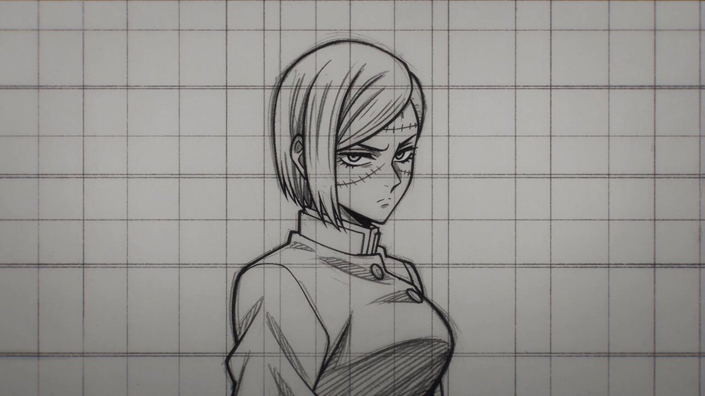

**พรอมต์**

```text
ฉากอนิเมะ 2D สไตล์ซากุกะ (sakuga) คีย์เฟรมพลังงานสูงที่ได้รับแรงบันดาลใจจากเลย์เอาต์สตอรีบอร์ดแบบหยาบ โดดเด่นด้วยเส้นกริดพิมพ์เขียว เส้นบอกแนวอัตราส่วนภาพเชิงเทคนิค และลายเส้นวาดมืออันทรงพลังและระเบิดอารมณ์
ฉากที่ 1 (The Trigger - จุดชนวน): มากิ เซนอิง ยืนหันข้างแบบสามส่วนอย่างคมชัดภายในกรอบงานผลิตที่ยังไม่ลงเงา โคลสอัพเพียงภาพเดียวจับสายตาอันเย็นชาบนใบหน้าที่มีรอยแผลเป็นของเธอขณะที่เธอยกมือขึ้นและดีดนิ้ว ทันใดนั้น แสงวาบไฟฟ้าแห่งพลังงานคำสาปก็ปะทุขึ้นทั่วเงามืดของเธอ ทำให้ภาพร่างอันเงียบสงบแตกกระจายกลายเป็นเศษซากผิวสัมผัสคล้ายถ่านชาร์โคลอันขรุขระ พื้นหลังแยกออกเป็นเส้นเปอร์สเปกทีฟที่บิดเบี้ยวของเสาโทริอิและซากปรักหักพังของศาลเจ้าญี่ปุ่นและแผ่นคอนกรีต
ฉากที่ 2 (The Release & Charge - ปลดปล่อยและพุ่งทะยาน): มุมกล้องพุ่งลงสู่มุมมองหนอนมอง (worm's-eye view) แบบสุดขั้ว มากิถีบตัวออกจากพื้นด้วยพละกำลังทางกายภาพอันมหาศาล สร้างคลื่นกระแทกคล้ายหลุมอุกกาบาตที่ถ่ายทอดออกมาด้วยเฟรมกระแทกสีดำและแดงเข้มที่วาดด้วยมือแบบดิบๆ ผมสั้นสีเข้มของเธอสะบัดไปด้านหลังด้วยโมชันเบลออัตราเฟรมสูงขณะที่เธอชักดาบผ่าวิญญาณ (Split Soul Katana) ออกมา เอฟเฟกต์เสียงตัวอักษรคันจิแบบ 3D มีสไตล์ระเบิดออกมาจากด้านหลังรอยเท้าของเธอ สั่นไหวด้วยความบิดเบี้ยวเพื่อให้สอดรับกับเสียงเบสหนักๆ ที่มีจังหวะขัด
ฉากที่ 3 (The Kinetic Climax - จุดไคลแมกซ์แห่งการเคลื่อนไหว): ในการตัดภาพแบบเลนส์ตาปลา (fisheye) กวาดต่อเนื่องในช็อตเดียว มากิกระโดดพุ่งตรงมายังผู้ชม ถือดาบกลับด้านไว้เหนือศีรษะ เศษซากเรขาคณิตและเส้นความเร็วที่ถูกฟันตามประกบการเคลื่อนไหวของเธอ ขณะที่ดาบของเธอฟันผ่าหน้าจอในแนวทแยง ลายเส้นดินสอหยาบๆ ก็เปลี่ยนผ่านอย่างฉับพลันกลายเป็นสีเซลแบนเรียบที่อิ่มตัวและเข้มข้น—หยดเลือดสีแดงเข้มคมกริบ แสงสะท้อนของเหล็กกล้าแวววาว และสีม่วงเข้มลึก—ก่อนจะหยุดนิ่งในท่าลงสู่พื้นแบบโฟกัสคมชัดชวนหยุดหายใจบนเศษหินที่แตกกระจาย
สไตล์ภาพและข้อมูลจำเพาะทางเทคนิค: แอนิเมชันดิบสไตล์เกงงะ (Genga), การบิดเบือนเปอร์สเปกทีฟแบบไดนามิก, คีย์เฟรมหลวมๆ แบบดิบที่เปลี่ยนไปเป็นการลงเงาแบบเซลล์เฉดดิ้งที่ประณีต, การแพนกล้องติดตามที่น่าทึ่ง, เฟรมกระแทกจลน์สูงที่สอดรับกับบีตอิเล็กทรอนิกส์อันดุดัน
```

[↑ กลับสู่หมวดหมู่](#catalog)

---

<a name="prompt-2100413833538121851"></a>

### กำลังแปล

ผู้เขียน：[@hii\_roto](https://x.com/hii_roto) · [โพสต์ต้นฉบับ](https://x.com/hii_roto/status/2100413833538121851)

คอมิก / สตอรี่บอร์ด · การถ่ายภาพ · อนิเมะ / มังงะ · เผยแพร่แล้ว

โพสต์ต้นฉบับ：[@hii\_roto](https://x.com/hii_roto) · [โพสต์ต้นฉบับ](https://x.com/hii_roto/status/2100043716253917231)

**สรุป:** กำลังแปล


**พรอมต์**

```text
กำลังแปล
```

[↑ กลับสู่หมวดหมู่](#catalog)

---

<a name="prompt-2098369249173782695"></a>

### พรอมต์คอนเซปต์อาร์ตแนวไซไฟอนิเมะและหุ่นยนต์เมคาแห่งอนาคตพร้อมโทนสีขาว-ดำ-ส้ม

ผู้เขียน：[@NVTDanh](https://x.com/NVTDanh) · [โพสต์ต้นฉบับ](https://x.com/NVTDanh/status/2098369249173782695)

อนิเมะ / มังงะ · ไซเบอร์พังก์ / ไซไฟ · เผยแพร่แล้ว

**สรุป:** พรอมต์คอนเซปต์อาร์ตแนวไซไฟอนิเมะและหุ่นยนต์เมคาแห่งอนาคตพร้อมโทนสีขาว-ดำ-ส้ม


**พรอมต์**

```text
คอนเซปต์อาร์ตแนวไซไฟอนิเมะแห่งอนาคต, การออกแบบหุ่นยนต์เมคาในอนาคตอันใกล้, รายละเอียดเชิงกลแบบฮาร์ดเซอร์เฟซ, โทนสีเทคโนโลยีสีขาว-ดำ-ส้มที่โฉบเฉี่ยว, แผ่นเกราะที่ซับซ้อนประณีต, ข้อต่อและกลไกที่เปิดเปลือย, ลายเส้นที่คมชัดและสะอาดตา, สัดส่วนอนิเมะแบบกึ่งสมจริง, การออกแบบเชิงอุตสาหกรรมที่มีรายละเอียดสูง, อาร์ตการผลิตระดับภาพยนตร์, สุนทรียศาสตร์ภาพประกอบเชิงเทคนิคที่ประณีตสะอาดตา
```

[↑ กลับสู่หมวดหมู่](#catalog)

---

<a name="category-sketch-line-art"></a>

## ภาพร่าง / ลายเส้น

<a name="prompt-2101376938258624640"></a>

### กำลังแปล

ผู้เขียน：[@abulu8](https://x.com/abulu8) · [โพสต์ต้นฉบับ](https://x.com/abulu8/status/2101376938258624640)

ภาพร่าง / ลายเส้น · เผยแพร่แล้ว

**สรุป:** กำลังแปล

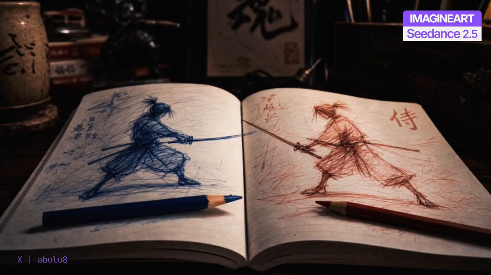

**พรอมต์**

```text
กำลังแปล
```

[↑ กลับสู่หมวดหมู่](#catalog)

---

<a name="prompt-2100043047857729721"></a>

### กำลังแปล

ผู้เขียน：[@leo\_xiaolei](https://x.com/leo_xiaolei) · [โพสต์ต้นฉบับ](https://x.com/leo_xiaolei/status/2100043047857729721)

ภาพประกอบ · ภาพร่าง / ลายเส้น · สีน้ำ · หมึก / สไตล์จีน · เผยแพร่แล้ว

**สรุป:** กำลังแปล


**พรอมต์**

```text
กำลังแปล
```

[↑ กลับสู่หมวดหมู่](#catalog)

---

<a name="category-3d-render"></a>

## ภาพเรนเดอร์ 3 มิติ

<a name="prompt-2101493389115953586"></a>

### วิดีโอแอนิเมชัน 3 มิติน่ารักของแฮมสเตอร์ขนปุยสีทองสวมหูฟังและโบสีชมพู ก้าวเข้ามาในห้องและถือดอกกุหลาบสีแดง

ผู้เขียน：[@Zarnab\_with\_Ai](https://x.com/Zarnab_with_Ai) · [โพสต์ต้นฉบับ](https://x.com/Zarnab_with_Ai/status/2101493389115953586)

ภาพเรนเดอร์ 3 มิติ · เผยแพร่แล้ว

**สรุป:** วิดีโอแอนิเมชัน 3 มิติน่ารักของแฮมสเตอร์ขนปุยสีทองสวมหูฟังและโบสีชมพู ก้าวเข้ามาในห้องและถือดอกกุหลาบสีแดง


**พรอมต์**

```text
สร้างวิดีโอแนวตั้งแบบแอนิเมชัน 3 มิติที่สมจริงเป็นพิเศษ น่ารัก และอบอุ่นหัวใจ ของแฮมสเตอร์ขนปุยตัวจิ๋วสีทองสลับขาวในบรรยากาศภายในบ้านที่อบอุ่นและมีแสงไฟละมุนละไม

แฮมสเตอร์มีขนปุกปุยนุ่มนิ่มเป็นพิเศษ ดวงตากลมโตสีดำขลับเป็นประกาย แก้มสีชมพูระเรื่อ จมูกเล็กๆ สีชมพู และสีหน้าไร้เดียงสาน่ารัก สวมหูฟังขนาดใหญ่เกินตัวสีชมพูอ่อน มีโบผูกผมลายจุดสีชมพูขนาดใหญ่อยู่บนหัว และสวมสร้อยคอริบบิ้นสีชมพูเส้นเล็กพร้อมป้ายชื่อห้อยขนาดจิ๋ว

ฉากที่ 1: แฮมสเตอร์ค่อยๆ โผล่หน้าออกมาจากหลังประตูกรอบสีขาว มองมาที่กล้องอย่างเอียงอาย มันค่อยๆ ก้าวเดินอย่างระมัดระวังออกมาบนพื้นไม้ขัดมันสีอบอุ่น พร้อมกับสบตากับผู้ชมไปด้วย

ฉากที่ 2: แฮมสเตอร์เดินตรงมาข้างหน้าทางกล้องด้วยก้าวย่างเล็กๆ แสนน่ารัก แล้วหยุดลงตรงกลางห้อง หูและโบขยับไหวอย่างเป็นธรรมชาติตามแต่ละก้าว ฉากหลังประกอบด้วยชั้นวางหนังสือไม้ที่แสนอบอุ่น โคมไฟตั้งโต๊ะแสงอบอุ่น ผนังห้องสีเบจที่นุ่มนวล และแสงโดยรอบสีทองอร่ามสวยงาม

ฉากที่ 3: แฮมสเตอร์มองตรงมาที่กล้องด้วยสีหน้าหวานซึ้งไร้เดียงสา หลังจากนั้นครู่หนึ่ง มันค่อยๆ เอื้อมตัวลงไปหยิบดอกกุหลาบสีแดงแสนสวยดอกหนึ่งขึ้นมาด้วยอุ้งเท้าจิ๋วๆ ของมัน

ฉากที่ 4: ถือดอกกุหลาบสีแดงไว้ข้างหน้าลำตัว แฮมสเตอร์ยิ้มให้อย่างอบอุ่นกับกล้อง แก้มของมันมีสีชมพูระเรื่อขึ้นอีกนิด และดูเขินอายพร้อมเปี่ยมไปด้วยความรักใคร่

ช็อตสุดท้าย: แฮมสเตอร์หลับตาลงพร้อมรอยยิ้มกว้างน่ารักสุดๆ ขณะกอดดอกกุหลาบสีแดงไว้แนบอก เป็นช่วงเวลาที่รู้สึกบริสุทธิ์ โรแมนติก น่ารัก และอบอุ่นหัวใจ

กล้อง: แนวตั้ง 9:16, มุมกล้องระดับสายตาในมุมต่ำ, การเคลื่อนไหวของกล้องที่นุ่มนวลและช้า, การค่อยๆ ดันกล้องเข้าไปหาแฮมสเตอร์อย่างนุ่มนวล, ระยะชัดตื้น, การจัดเฟรมภาพแบบภาพยนตร์

แสง: แสงในร่มโทนสีทองอบอุ่น, เงาธรรมชาติที่นุ่มนวล, บรรยากาศยามเย็นที่แสนสบาย, แสงสะท้อนประกายอ่อนๆ บนขนของแฮมสเตอร์

สไตล์: แอนิเมชันตัวละคร 3 มิติสุดน่ารักที่สมจริงเป็นพิเศษ, ขนปุยที่มีรายละเอียดสูงมาก, การแสดงออกทางสีหน้าที่สมจริง, การเรนเดอร์ภาพแบบภาพยนตร์ที่นุ่มนวล, การสะท้อนของพื้นไม้ขัดเงา, การเคลื่อนไหวของวัตถุที่สมจริง, การเล่าเรื่องที่เปี่ยมอารมณ์และน่ารัก, คุณภาพระดับภาพยนตร์แอนิเมชันเกรดพรีเมียม

การเคลื่อนไหว: การขยับอุ้งเท้าเล็กๆ อย่างเป็นธรรมชาติ, การเคลื่อนไหวศีรษะเล็กน้อย, การกะพริบตาที่สมจริง, การหายใจอย่างนุ่มนวล, หูและโบขยับเบาๆ, แอนิเมชันการเดินที่ลื่นไหล, ปฏิสัมพันธ์กับดอกกุหลาบที่ดูสมจริง

ไม่มีข้อความ, ไม่มีคำบรรยาย, ไม่มีลายน้ำ, ไม่มีตัวละครส่วนเกิน, ไม่มีกายวิภาคที่บิดเบี้ยว, ไม่มีวัตถุซ้ำซ้อน
```

[↑ กลับสู่หมวดหมู่](#catalog)

---

<a name="prompt-2101246172438655048"></a>

### พรอมต์แอนิเมชัน 3 มิติแนวคอมเมดี้ ASMR สั้น พ่อครัวโจรสลัดและนกแก้วจอมซนทำอาหารร่วมกันในห้องครัวเรือ

ผู้เขียน：[@Aiwithkami](https://x.com/Aiwithkami) · [โพสต์ต้นฉบับ](https://x.com/Aiwithkami/status/2101246172438655048)

ภาพเรนเดอร์ 3 มิติ · อาหาร / เครื่องดื่ม · เผยแพร่แล้ว

**สรุป:** พรอมต์แอนิเมชัน 3 มิติแนวคอมเมดี้ ASMR สั้น พ่อครัวโจรสลัดและนกแก้วจอมซนทำอาหารร่วมกันในห้องครัวเรือ


**พรอมต์**

```text
สร้างแอนิเมชัน 3 มิติแนวคอมเมดี้ ASMR สั้นความยาว 30 วินาที คุณภาพระดับพิกซาร์ (Pixar) บนเรือโจรสลัดในห้องครัวที่อบอุ่นและสว่างไสวด้วยแสงโคมไฟ

สไตล์: แอนิเมชัน 3 มิติระดับภาพยนตร์พรีเมียม ตัวละครแสดงอารมณ์ได้ชัดเจน คุณภาพประณีตระดับภาพยนตร์ขนาดยาว แสงสีเหลืองอำพันอบอุ่น พื้นผิวอาหารสมจริง ระยะชัดลึกแบบภาพยนตร์ มุกตลกเจ็บตัวชวนขบขัน การโคลงเคลงเบาๆ ของเรือ และเสียง ASMR ของอาหารที่คมชัดสมจริง

ตัวละคร: พ่อครัวโจรสลัดร่างใหญ่กำยำมีเครา สวมผ้ากันเปื้อนเก่าๆ และนกแก้วสีเขียวสดแสนซนที่คอยจ้องจะขโมยวัตถุดิบอยู่ตลอดเวลา รักษาความต่อเนื่องทางรูปลักษณ์ของทั้งสองตัวละครตลอดทั้งเรื่อง

0–4 วินาที

ภาพโคลสอัประยะใกล้มากขณะที่นกแก้วกำลังขโมยหัวกระเทียม มือของโจรสลัดตบลงข้างๆ มันทันที ทั้งสองชะงักและจ้องตากัน ความเงียบชั่วขณะเหมือนเสียงแผ่นเสียงตกร่อง โจรสลัดดีดนกแก้วกระเด็นออกไป มันหมุนคว้างกลางอากาศแล้วลงจอดบนที่แขวนหม้อ แกล้งทำเป็นไม่มีอะไรเกิดขึ้น

4–8 วินาที

โจรสลัดสับกระเทียมอย่างรวดเร็วพร้อมเสียง ASMR ที่คมชัด นกแก้วย่องไปทางมะเขือเทศ กระเทียมถูกใส่ลงในน้ำมันร้อนจนเกิดเสียงฉ่าดังลั่น ทำให้นกแก้วตกใจจนกลิ้งตกจากที่แขวน ถ้วยโลหะส่งเสียงกระทบกันกรุ๊งกริ๊ง

8–14 วินาที

ภาพตัดต่อการทำอาหารสไตล์ภาพยนตร์อันรวดเร็ว: มะเขือเทศฉ่าในกระทะ สมุนไพรถูกฉีก น้ำมันมะกอกรินลงมาช้าๆ เป็นสีทอง ซอสเดือดปุดๆ และโจรสลัดคนกระทะอย่างมั่นใจ ซ้อนทับเลเยอร์เสียง ASMR ของการสับ การทอด การเท และการเดือดปุดๆ อย่างละเอียด

14–19 วินาที

นกแก้วเหลือบเห็นอาหารและแอบพยายามลากกระทะออกไป ร่างเล็กๆ ของมันออกแรงดึงอย่างตลกขบขันข้ามพื้นไม้ โจรสลัดค่อยๆ หันกลับมาจ้อง นกแก้วชะงักค้างขณะที่ยังจับด้ามกระทะอยู่ จากนั้นก็ผิวปากอย่างไร้เดียงสาแล้วปล่อยมือ

19–24 วินาที

โจรสลัดทำอาหารเสร็จด้วยการสะบัดกระทะอย่างน่าทึ่ง ไอร้อนลอยขึ้นเมื่อตักอาหารผิวมันวาวจัดลงจาน นกแก้วมองดูด้วยความหิวพยายามทำหน้าตาไร้เดียงสา

24–30 วินาที

แทนที่จะดุนกแก้ว โจรสลัดกลับเตรียมซอสและขนมปังใส่จานใบเล็กจิ๋วแล้วเลื่อนข้ามโต๊ะไปให้ นกแก้วกระโดดดึ๋งๆ อย่างมีความสุขและกินอยู่ข้างๆ เขา ทั้งคู่สบตากันด้วยความพึงพอใจขณะที่เรือโคลงเคลงเบาๆ

จบด้วยภาพมุมกว้างแบบภาพยนตร์ของห้องครัวแสนอบอุ่นที่ส่องประกายใต้โคมไฟสีเหลืองอำพัน เสียงคลื่นทะเลแผ่วเบาและเสียงไม้เรือลั่นเอี๊ยดอ๊าด พร้อมเสียงโน้ตหีบเพลงชักขี้เล่นนุ่มนวลค่อยๆ จางหายไป

ไม่มีบทสนทนา ไม่มีคำบรรยาย ไม่มีข้อความ รักษาความต่อเนื่องของตัวละคร ฟิสิกส์ธรรมชาติ แอนิเมชันที่ลื่นไหล การจัดเฟรมแบบภาพยนตร์ และเสียง ASMR ของอาหารอย่างละเอียดตลอดทั้งเรื่อง
```

[↑ กลับสู่หมวดหมู่](#catalog)

---

<a name="prompt-2100829705129877876"></a>

### พรอมต์ตลกแอนิเมชัน 3 มิติของเสืออ้วนวิ่งไล่ไก่แจ้ด้วยไม้ตีแมลงวันสีชมพูในทุ่งหญ้า

ผู้เขียน：[@Elvorya](https://x.com/Elvorya) · [โพสต์ต้นฉบับ](https://x.com/Elvorya/status/2100829705129877876)

ภาพเรนเดอร์ 3 มิติ · ตัวละคร · เผยแพร่แล้ว

**สรุป:** พรอมต์ตลกแอนิเมชัน 3 มิติของเสืออ้วนวิ่งไล่ไก่แจ้ด้วยไม้ตีแมลงวันสีชมพูในทุ่งหญ้า

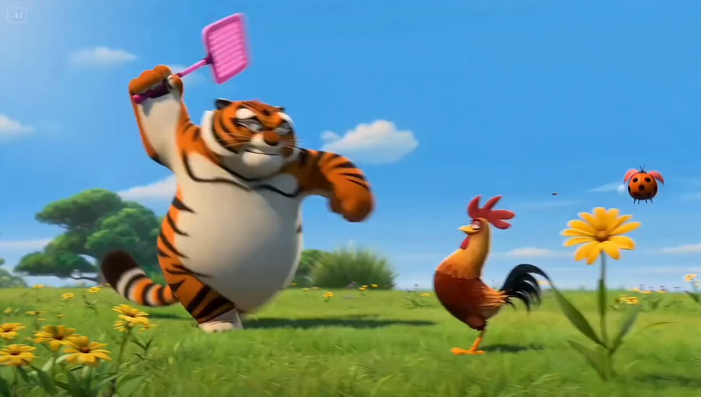

**พรอมต์**

```text
สร้างฉากตลกแอนิเมชัน 3 มิติคุณภาพสูงความยาว 15 วินาทีในทุ่งหญ้าชนบทที่สดใสและเต็มไปด้วยสีสัน

เสือตัวใหญ่ อ้วนท้วม ลายส้มสลับดำ พร้อมสีหน้าการ์ตูนที่แสดงอารมณ์ชัดเจน กำลังวิ่งไล่จับไก่แจ้ตัวเล็กเปี่ยมพลังอย่างขี้เล่นผ่านทุ่งหญ้าสีเขียวแดดจ้า เสือถือไม้ตีแมลงวันสีชมพูขนาดใหญ่ยักษ์ไว้ในอุ้งเท้าข้างหนึ่ง และพยายามจับไก่แจ้ซ้ำแล้วซ้ำเล่า

0–2 วินาที: เริ่มต้นด้วยช็อตมุมต่ำแบบกว้างของทุ่งหญ้าแสนสวยใต้ท้องฟ้าสีฟ้าสดใสพร้อมเมฆสีขาวนุ่มนวล ดอกไม้ป่าหลากสีสัน และต้นไม้ในระยะไกล เสือวิ่งตรงมาทางกล้องในขณะที่ไก่แจ้วิ่งหนีสุดชีวิตอยู่ข้างหน้ามัน

2–4 วินาที: เคลื่อนเข้าสู่ช็อตมุมต่ำที่เปี่ยมพลังอย่างรวดเร็วเมื่อเสือเหวี่ยงไม้ตีแมลงวันสีชมพูขนาดยักษ์ไปทางไก่แจ้ ไก่แจ้กระโดดหลบไปด้านข้างได้อย่างหวุดหวิด

4–7 วินาที: แสดงภาพเสือกระโดดลอยตัวในอากาศอย่างเกินจริง อุ้งเท้ายื่นไปข้างหน้า ในขณะที่ไก่แจ้กระโดดและบินหนีพ้นระยะเอื้อมไปแค่นิดเดียว ใช้การเคลื่อนไหวของกล้องที่กระฉับกระเฉงและโมชันเบลอเล็กน้อยเพื่อสร้างอิมแพ็กต์ความตลกขบขัน

7–10 วินาที: สลับตัดระหว่างช็อตระยะใกล้และระยะกลางในขณะที่เสือเหวี่ยงไม้ตีแมลงวันสีชมพูไปตามพื้นหญ้าซ้ำแล้วซ้ำเล่า ไก่แจ้หลบหลีกการโจมตีทุกครั้งด้วยท่วงท่าการ์ตูนที่เกินจริงแต่ดูสมจริง

10–12 วินาที: เสือเริ่มหงุดหงิดมากขึ้นเรื่อย ๆ และพุ่งชาร์จไปข้างหน้าด้วยความเร็วเต็มพิกัด ทันใดนั้นไก่แจ้เปลี่ยนทิศทางกะทันหัน ทำให้เสือเสียการทรงตัว

12–15 วินาที: ช็อตภาพยนตร์มุมกว้างสุดท้าย: เสือล้มกลิ้งอย่างน่าทึ่งลงบนพื้นหญ้านุ่ม ๆ และนอนแผ่หลาอย่างหมดแรงและมึนงง ในขณะที่ไก่แจ้ยืนมองมันอย่างสงบนิ่งอยู่ใกล้ ๆ ไม้ตีแมลงวันสีชมพูตกลงบนพื้นหญ้าใกล้กัน จบลงด้วยความแตกต่างสุดตลกขบขันระหว่างเสือที่หมดเรี่ยวแรงกับไก่แจ้ผู้มีชัย

สไตล์ภาพ: แอนิเมชัน 3 มิติระดับไฮเอนด์ที่ประณีตงดงาม สุนทรียภาพแบบการ์ตูนภาพยนตร์หลากสีสัน ขนสัตว์และขนนกที่มีรายละเอียด ใบหน้าที่แสดงอารมณ์ชัดเจน แอนิเมชันตัวละครที่ลื่นไหล ตลกเจ็บตัวแบบเกินจริง เงาที่สมจริง แสงแดดฤดูร้อนที่สดใส หญ้าสีเขียวสดใส ดอกไม้หลากสี ท้องฟ้าสีฟ้า ระยะชัดลึกแบบภาพยนตร์ ช็อตกล้องมุมต่ำแบบไดนามิก การแทร็กกิ้งที่นุ่มนวล การตัดต่อฉากแอ็กชันที่รวดเร็ว โมชันเบลอที่แนบเนียน ฟิสิกส์ที่น่าเชื่อถือ อารมณ์ขันขี้เล่นที่เหมาะสำหรับทุกคนในครอบครัว

ความสม่ำเสมอของตัวละคร: คงลักษณะเสือตัวใหญ่ตัวอ้วนตัวเดิม ลายทางสีส้มสลับดำเดิม ไก่แจ้ตัวเดิม ไม้ตีแมลงวันสีชมพูอันเดิม และทุ่งหญ้าเดิมตลอดทั้งวิดีโอ

พรอมต์เชิงลบ: ภาพเสมือนจริง, คนแสดงจริง, สยองขวัญ, แสงมืดมัว, ตัวละครบิดเบี้ยว, ใบหน้าผิดรูป, แขนขาเกิน, อุ้งเท้าผิดรูป, สัตว์ซ้ำซ้อน, กายวิภาคผิดธรรมชาติ, การกะพริบ, การเปลี่ยนตัวละคร, ข้อความ, คำบรรยาย, โลโก้, ลายน้ำ
```

[↑ กลับสู่หมวดหมู่](#catalog)

---

<a name="prompt-2099316017986220245"></a>

### แอนิเมชัน 3D ของสิ่งมีชีวิตรูปพีชขนฟูที่เก็บน้ำผึ้งในป่าและทำเครื่องดื่มเย็นในห้องครัว

ผู้เขียน：[@Zarnab\_with\_Ai](https://x.com/Zarnab_with_Ai) · [โพสต์ต้นฉบับ](https://x.com/Zarnab_with_Ai/status/2099316017986220245)

ภาพเรนเดอร์ 3 มิติ · ตัวละคร · อาหาร / เครื่องดื่ม · สัตว์ / สิ่งมีชีวิต · ทิวทัศน์ / ธรรมชาติ · เผยแพร่แล้ว

**สรุป:** แอนิเมชัน 3D ของสิ่งมีชีวิตรูปพีชขนฟูที่เก็บน้ำผึ้งในป่าและทำเครื่องดื่มเย็นในห้องครัว


**พรอมต์**

```text
สร้างวิดีโอแนวตั้ง 3D แนวภาพยนตร์ที่สมจริงอย่างยิ่งและน่ารัก (9:16) นำเสนอสิ่งมีชีวิตตัวจิ๋วแสนน่ารักรูปทรงลูกพีช มีลำตัวนุ่มฟูสีชมพูพาสเทล ดวงตาสีดำเป็นประกาย ปากเล็กๆ น่ารัก แก้มสีชมพูระเรื่อ แขนและเท้าเล็กจิ๋ว พร้อมใบไม้สีเขียวเล็กๆ บนศีรษะ

เจ้าสิ่งมีชีวิตลูกพีชตัวน้อยอยู่ในป่าที่สวยงามและมีแสงแดดส่องถึง ล้อมรอบด้วยหญ้าสีเขียว ต้นไม้ ใบไม้ และแสงแดดธรรมชาติอันอบอุ่น มันค้นพบรังผึ้งที่แขวนอยู่บนกิ่งไม้ และตักน้ำผึ้งสีทองสดใหม่อย่างมีความสุขด้วยช้อนคันจิ๋ว ผึ้งตัวเล็กๆ บินอยู่รอบๆ ตัวมันและบินมาเกาะใกล้ใบหน้าของมันชั่วครู่

แสดงให้เห็นสิ่งมีชีวิตนี้กำลังเพลิดเพลินกับน้ำผึ้ง เดินผ่านป่า แล้วกลับมายังห้องครัวไม้สไตล์รัสติกที่แสนอบอุ่น มันเตรียมเครื่องดื่มผลไม้ผสมน้ำผึ้งที่ให้ความสดชื่นด้วยการใส่ก้อนน้ำแข็ง เลมอนฝาน ชิ้นผลไม้หลากสีสัน และน้ำผึ้งสีทองลงในแก้วใส มันคนเครื่องดื่มเบาๆ ด้วยช้อนและดื่มอย่างมีความสุข

ทำให้ตัวละครน่ารักอย่างยิ่งและแสดงอารมณ์ได้ดี พร้อมรายละเอียดขนนุ่มฟูเหมือนตุ๊กตา พื้นผิวที่สมจริง การเคลื่อนไหวที่น่ารักน่าเอ็นดู การแสดงออกทางสีหน้าที่เป็นธรรมชาติ ระยะชัดลึกแบบภาพยนตร์ แสงอบอุ่นช่วงโกลเดนอาวร์ โบเก้ที่สวยงาม สภาพแวดล้อมป่าที่ละเอียด การเคลื่อนไหวของกล้องที่นุ่มนวล ภาพโคลสอัพแบบมาโคร เงาที่สมจริง และแอนิเมชัน 3D คุณภาพระดับพรีเมียม

รักษาการออกแบบตัวละคร ใบหน้า สัดส่วน สีสัน ใบไม้ และรูปลักษณ์เดิมให้สอดคล้องกันตลอดทั้งวิดีโอ ไม่มีข้อความ ไม่มีลายน้ำ ไม่มีสรีระที่ผิดเพี้ยน ไม่มีตัวละครเสริม

สไตล์: 3D น่ารักสไตล์พิกซาร์ + พื้นผิวสมจริงระดับภาพถ่าย + การถ่ายภาพมาโครแบบภาพยนตร์ + สุนทรียศาสตร์แฟนตาซีที่อบอุ่น
```

[↑ กลับสู่หมวดหมู่](#catalog)

---

<a name="prompt-2098590744080757223"></a>

### พรอมต์ฉากแอนิเมชัน 3D: ภาพอันอบอุ่นหัวใจของนากตุ๊กตาน่ารักนั่งอยู่บนเก้าอี้หมุนในออฟฟิศแล้วใช้หลอดดูดกาแฟเย็น

ผู้เขียน：[@Zarnab\_with\_Ai](https://x.com/Zarnab_with_Ai) · [โพสต์ต้นฉบับ](https://x.com/Zarnab_with_Ai/status/2098590744080757223)

ภาพเรนเดอร์ 3 มิติ · ตัวละคร · อาหาร / เครื่องดื่ม · เผยแพร่แล้ว

**สรุป:** พรอมต์ฉากแอนิเมชัน 3D: ภาพอันอบอุ่นหัวใจของนากตุ๊กตาน่ารักนั่งอยู่บนเก้าอี้หมุนในออฟฟิศแล้วใช้หลอดดูดกาแฟเย็น


**พรอมต์**

```text
สร้างฉากแอนิเมชัน 3 มิติคุณภาพสูงและมีรายละเอียดระดับอัลตรา โดยมีตัวละครคล้ายนากตัวอ้วนกลมน่ารักตัวเดิม ขนนุ่มสีน้ำตาลเทา หน้าท้องและปากสีขาวครีม ใบหูกลมเล็ก ตาสีดำเป็นประกาย จมูกเล็กสีเข้ม แก้มสีชมพูระเรื่อ อุ้งเท้าสั้น และอุ้งเท้าด้านล่างที่มองเห็นได้อย่างน่ารัก ตัวละครมีลักษณะเหมือนตุ๊กตาผ้านุ่มนิ่ม สัดส่วนกลมกล่อม และมีสีหน้าเบิกบานไร้เดียงสา

จัดวางให้ตัวละครนั่งอย่างสบายบนเก้าอี้สำนักงานตามหลักสรีรศาสตร์สีดำทันสมัย ตัวละครกำลังถือและดื่มกาแฟเย็นจากแก้วพลาสติกใสที่มีหลอดดูด โดยอุ้งเท้าทั้งสองข้างโอบรอบแก้วอย่างเป็นธรรมชาติ จัดให้ตัวละครอยู่ตรงกลางและโดดเด่นในเฟรม

จัดฉากภายในสำนักงานที่ทันสมัยและสว่างสดใส มีแถวของคอกทำงานสีเบจเทา จอคอมพิวเตอร์ หน้าต่างบานใหญ่ แสงแดดยามกลางวันที่นุ่มนวล พื้นเงาวับ และรายละเอียดสำนักงานที่แนบเนียนในพื้นหลัง ใช้ระยะชัดตื้นเพื่อให้ตัวละครยังคงอยู่ในโฟกัสที่คมชัดในขณะที่พื้นหลังเบลออย่างนุ่มนวล

ทำให้ภาพให้ความรู้สึกเหมือนภาพนิ่งจากภาพยนตร์แอนิเมชันระดับพรีเมียม: ขนนุ่มที่มีรายละเอียดสูง พื้นผิวผ้าและพลาสติกที่สมจริง ดวงตาเป็นประกายที่สื่ออารมณ์ได้ดี แสงที่นุ่มนวลเป็นธรรมชาติ องค์ประกอบภาพระดับภาพยนตร์ เงาที่สมจริง แอมเบียนต์อ็อกคลูชันที่ประณีต การเรนเดอร์ 3 มิติที่ขัดเกลาอย่างดี บรรยากาศแปลกใหม่น่ารัก องค์ประกอบภาพที่สะอาดตา คุณภาพแอนิเมชันระดับมืออาชีพ ความละเอียดสูง องค์ประกอบภาพแนวตั้ง 9:16

ข้อสำคัญ: รักษาการออกแบบและสัดส่วนตัวละครให้เหมือนเดิมทุกประการ ไม่มีมนุษย์ในโฟร์กราวด์ ไม่มีข้อความ ไม่มีโลโก้ ไม่มีลายน้ำ และไม่มีสรีระที่บิดเบี้ยว
```

[↑ กลับสู่หมวดหมู่](#catalog)

---

<a name="prompt-2098371778234179766"></a>

### คำแนะนำการผลิตฉากไล่ล่าด้วยรถสไตล์ GTA ตั้งแต่การสร้างโมเดลสีเทา 3D ใน Blender ไปจนถึงการแปลงเป็นภาพวิดีโอด้วย PixVerse \(Seedance 2.5\)

ผู้เขียน：[@hasamaru\_studio](https://x.com/hasamaru_studio) · [โพสต์ต้นฉบับ](https://x.com/hasamaru_studio/status/2098371778234179766)

ภาพเรนเดอร์ 3 มิติ · ผลิตภัณฑ์ · ยานพาหนะ · เผยแพร่แล้ว

**สรุป:** คำแนะนำการผลิตฉากไล่ล่าด้วยรถสไตล์ GTA ตั้งแต่การสร้างโมเดลสีเทา 3D ใน Blender ไปจนถึงการแปลงเป็นภาพวิดีโอด้วย PixVerse \(Seedance 2.5\)


**พรอมต์**

```text
โปรดสร้างฉากไล่ล่าด้วยรถ 3D สไตล์ GTA แบบออริจินัลตามขั้นตอนการผลิตต่อไปนี้

【การออกแบบ】
กำหนดคนขับหลัก 1 คน, รถหลบหนี 1 คัน, รถไล่ล่า 1 คัน และฉากเมือง 1 แห่ง โดยรักษาดีไซน์ของแต่ละส่วนให้มีความสอดคล้องกัน วางแผนทั้งหมด 3 ช็อต ช็อตละ 4 วินาที
・ช็อตไล่ตามที่ติดตามรถจากด้านหลัง
・ช็อตด้านข้างที่ติดตามรถขณะเลี้ยวโค้งหักศอก
・ช็อตมุมกว้างที่จับภาพรถวิ่งลับตาออกไป

【สร้างใน Blender】
สร้างโมเดลสีเทา (Gray model) ที่ประณีต พร้อมริก (Rig) ตัวละครและยานพาหนะที่ขยับทำงานได้ ไม่จำเป็นต้องมีเท็กซ์เจอร์หรือกาง UV

【แอนิเมชันและการทดสอบ】
ทำแอนิเมชันสำหรับคนขับ, การหมุนพวงมาลัย, การหมุนของล้อ, ตัวรถ และกล้อง รักษาทิศทางการเคลื่อนที่และความสัมพันธ์หน้าหลังของรถให้สอดคล้องกัน แก้ไขปัญหาวัตถุทะลุผ่านกัน (Clipping), ล้อลอย, ยางไถลผิดธรรมชาติ, ท่าทางพังเสียรูป และมือหลุดออกจากพวงมาลัย

【เรนเดอร์ใน Blender】
เรนเดอร์เฟรมที่ 1 ถึง 288 ด้วยความละเอียด 1280×720 ที่ 24fps นำเฟรมที่เรนเดอร์จริงจาก Blender มาต่อกันเพื่อสร้างวิดีโอมาสเตอร์เวอร์ชันโมเดลสีเทาความยาว 12 วินาที ส่งออกแต่ละช็อตแยกกัน และเรนเดอร์ภาพนิ่งสีเทาที่ตรงกันเพื่อใช้อ้างอิงรูปทรงและองค์ประกอบภาพ

【เก็บงานด้วยปลั๊กอิน PixVerse】
ใช้ Seedance 2.5 ที่ 720p ประมวลผลแต่ละช็อตแยกกัน ใช้วิดีโอจาก Blender เป็นข้อมูลอ้างอิงการเคลื่อนไหว และใช้ภาพนิ่งสีเทาเป็นข้อมูลอ้างอิงรูปทรง กำหนดโทนสีที่กลมกลืนกันตลอดทั้งวิดีโอในพรอมต์สร้างภาพ รักษาการเคลื่อนไหวของกล้อง จังหวะเวลาของการกระทำ ดีไซน์ตัวละครและยานพาหนะ รวมถึงจำนวนรถให้คงเดิม

【ตรวจสอบและส่งมอบงาน】
ตรวจสอบวิดีโอที่เสร็จสมบูรณ์ทั้งสองตัวเพื่อตรวจหาจุดบกพร่องของภาพและความต่อเนื่องระหว่างช็อต แก้ไขปัญหาในฝั่ง Blender แล้วสร้างใหม่เฉพาะช็อตที่ไม่สำเร็จใน Seedance เท่านั้น อนุญาตให้ลองใหม่ได้สูงสุดช็อตละ 2 ครั้ง

ส่งมอบไฟล์ .blend ที่สามารถแก้ไขได้, วิดีโอโมเดลสีเทาของ Blender ความละเอียด 720p แท้, วิดีโอ 720p ที่ระบุว่าเป็นเวอร์ชัน Seedance และการประเมินสั้นๆ เกี่ยวกับข้อจำกัดที่ยังหลงเหลืออยู่
```

[↑ กลับสู่หมวดหมู่](#catalog)

---

<a name="prompt-2098326362801221835"></a>

### กำลังแปล

ผู้เขียน：[@Chengzilhy](https://x.com/Chengzilhy) · [โพสต์ต้นฉบับ](https://x.com/Chengzilhy/status/2098326362801221835)

คอมิก / สตอรี่บอร์ด · การถ่ายภาพ · ภาพเรนเดอร์ 3 มิติ · เผยแพร่แล้ว

**สรุป:** กำลังแปล


**พรอมต์**

```text
กำลังแปล
```

[↑ กลับสู่หมวดหมู่](#catalog)

---

<a name="category-ink-chinese-style"></a>

## หมึก / สไตล์จีน

<a name="prompt-2100233948341367178"></a>

### กำลังแปล

ผู้เขียน：[@liyue\_ai](https://x.com/liyue_ai) · [โพสต์ต้นฉบับ](https://x.com/liyue_ai/status/2100233948341367178)

หมึก / สไตล์จีน · เผยแพร่แล้ว

โพสต์ต้นฉบับ：[@liyue\_ai](https://x.com/liyue_ai) · [โพสต์ต้นฉบับ](https://x.com/liyue_ai/status/2100087420771610707)

**สรุป:** กำลังแปล


**พรอมต์**

```text
กำลังแปล
```

[↑ กลับสู่หมวดหมู่](#catalog)

---

<a name="category-retro-vintage"></a>

## ย้อนยุค / วินเทจ

<a name="prompt-2101515497150025999"></a>

### พรอมต์อธิบายถึงวิดีโอ DV ย้อนยุคความยาว 30 วินาทีของหญิงชาวเกาหลีที่กำลังเดินเล่นในกรุงโซล ล้างหน้า กินอมยิ้ม และทักทายเพื่อนบ้าน

ผู้เขียน：[@AIwithkhan](https://x.com/AIwithkhan) · [โพสต์ต้นฉบับ](https://x.com/AIwithkhan/status/2101515497150025999)

ย้อนยุค / วินเทจ · ตัวละคร · เผยแพร่แล้ว

**สรุป:** พรอมต์อธิบายถึงวิดีโอ DV ย้อนยุคความยาว 30 วินาทีของหญิงชาวเกาหลีที่กำลังเดินเล่นในกรุงโซล ล้างหน้า กินอมยิ้ม และทักทายเพื่อนบ้าน

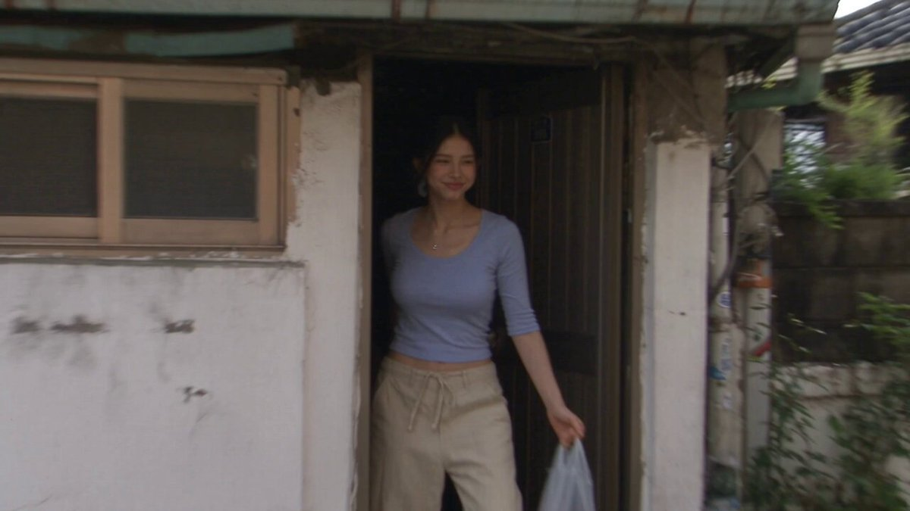

**พรอมต์**

```text
สร้างโฮมวิดีโอส่วนตัวความยาว 30 วินาทีที่สมจริงขั้นสุดของหญิงสาวชาวเกาหลีที่กำลังเพลิดเพลินกับเช้าวันอาทิตย์อันแสนผ่อนคลายในย่านที่อยู่อาศัยเก่าแก่ของกรุงโซล ใช้ภาพที่แนบมาเป็นข้อมูลอ้างอิงของตัวละคร และรักษาใบหน้าของเธอ ผมหางม้าข้างสีดำยาวที่ยุ่งเหยิง เสื้อเข้ารูปสีฟ้าพาสเทล กางเกงหลวมสีครีม รองเท้าผ้าใบสีดำ สร้อยคอเงิน และรูปลักษณ์โดยรวมให้คงที่อย่างสมบูรณ์แบบ
เธอเดินออกจากบ้านด้วยสีหน้าเบิกบาน ล็อกประตูข้างหลังเธอ จัดผมหางม้าข้างที่ยุ่งเหยิงของเธอ และเริ่มเดินเล่นสบายๆ ผ่านย่านที่เงียบสงบ ตลอดทาง เธอเดินผ่านเพื่อนบ้านที่คุ้นเคยสองสามคน และทักทายพวกเขาอย่างอบอุ่นด้วยรอยยิ้มและคำว่า “Hello” สบายๆ สร้างบรรยากาศวันอาทิตย์ที่เป็นกันเองอย่างเป็นธรรมชาติ
เธอเดินไปถึงก๊อกน้ำกลางแจ้งเล็กๆ ในละแวกนั้นและหยุดเพื่อล้างหน้า เธอสาดน้ำเย็นใส่ใบหน้าของเธอ หัวเราะเมื่อหยดน้ำหลายหยดตกลงบนด้านหน้าของเสื้อสีฟ้าพาสเทล ก้มมองจุดที่เปียก ยิ้มและส่ายหัวอย่างขี้เล่นก่อนจะเดินต่อไป
เธอแวะร้านสะดวกซื้อเล็กๆ ในท้องถิ่น ซื้ออมยิ้มหลากสี แกะห่อทันที เอาเข้าปาก และเดินกลับผ่านละแวกบ้านอย่างมีความสุขขณะเอร็ดอร่อยกับมัน เธอแกว่งถุงช้อปปิ้งเล็กๆ ในมือข้างหนึ่งอย่างสบายๆ ขณะถืออมยิ้มไว้อีกมือหนึ่ง
ขณะที่เธอเดินผ่านตรอกแคบๆ ในย่านที่อยู่อาศัย เธอพบเด็กๆ ในละแวกนั้นสองสามคน เธอยิ้ม โบกมือ และจับมือกับพวกเขาทีละคนในขณะที่ยังถืออมยิ้มไว้อีกมือหนึ่ง เธอพูดว่า “Hello!” และเดินต่อไปด้วยรอยยิ้มขี้เล่น
ช่วงใกล้จบ เธอหันมาทางกล้องขณะที่ยังคงถืออมยิ้ม ยิ้มอย่างเป็นธรรมชาติแล้วพูดว่า “Happy Sunday!” ก่อนจะเดินจากไปตามตรอกที่เงียบสงบ
ใช้ฟุตเทจกล้องดีวีสำหรับผู้บริโภคช่วงต้นยุค 2000 แบบดิบๆ: การสั่นของกล้องถือมือ การจัดเฟรมที่ไม่สมบูรณ์แบบ การปรับโฟกัสอัตโนมัติที่แกว่งไปมา การเปลี่ยนของแสง รายละเอียดที่นุ่มนวล สัญญาณรบกวนดิจิทัลเล็กน้อย โมชันเบลอที่เป็นธรรมชาติ การซูมที่เก้งก้างเป็นครั้งคราว และความไม่สมบูรณ์แบบของโฮมวิดีโอที่แท้จริง
เฉพาะเสียงบรรยากาศตามธรรมชาติของย่านในกรุงโซลเท่านั้น — เสียงฝีเท้า เพื่อนบ้านคุยกัน เด็กๆ หัวเราะ เสียงน้ำไหล กระดิ่งจักรยาน การจราจรไกลๆ นก แมลงฤดูร้อน และใบไม้ที่พริ้วไหวตามสายลม ไม่มีดนตรี ไม่มีการบรรยาย ไม่มีคำบรรยาย ไม่มีเหตุการณ์ดราม่า ไม่มีการถ่ายทำภาพยนตร์เชิงพาณิชย์ที่เนี้ยบเกินไป ไม่มีผิวที่ผ่านฟิลเตอร์ความงาม ไม่มีลุคแบบ CGI
```

[↑ กลับสู่หมวดหมู่](#catalog)

---

<a name="category-cyberpunk-sci-fi"></a>

## ไซเบอร์พังก์ / ไซไฟ

<a name="prompt-2097330853588402541"></a>

### กำลังแปล

ผู้เขียน：[@TanLuAI](https://x.com/TanLuAI) · [โพสต์ต้นฉบับ](https://x.com/TanLuAI/status/2097330853588402541)

คอมิก / สตอรี่บอร์ด · ไซเบอร์พังก์ / ไซไฟ · ตัวละคร · เผยแพร่แล้ว

โพสต์ต้นฉบับ：[@TanLuAI](https://x.com/TanLuAI) · [โพสต์ต้นฉบับ](https://x.com/TanLuAI/status/2096586474645004331)

**สรุป:** กำลังแปล


**พรอมต์**

```text
กำลังแปล
```

[↑ กลับสู่หมวดหมู่](#catalog)

---

<a name="category-minimalism"></a>

## มินิมอลลิสต์

<a name="prompt-2100248337920499730"></a>

### กำลังแปล

ผู้เขียน：[@TanLuAI](https://x.com/TanLuAI) · [โพสต์ต้นฉบับ](https://x.com/TanLuAI/status/2100248337920499730)

คอมิก / สตอรี่บอร์ด · มินิมอลลิสต์ · ตัวละคร · สัตว์ / สิ่งมีชีวิต · เผยแพร่แล้ว

**สรุป:** กำลังแปล


**พรอมต์**

```text
กำลังแปล
```

[↑ กลับสู่หมวดหมู่](#catalog)

---

<a name="category-other"></a>

## อื่น ๆ

<a name="prompt-2102214977033818514"></a>

### พรอมต์สไตล์ถ่ายแบบถือกล้องมือจำลองภาพหญิงสาวและแมวลายสลิดที่ค่อยๆ ลดระยะห่างเข้าหากันอย่างเป็นธรรมชาติในคาเฟ่แมวญี่ปุ่น

ผู้เขียน：[@akiyoshisan](https://x.com/akiyoshisan) · [โพสต์ต้นฉบับ](https://x.com/akiyoshisan/status/2102214977033818514)

ตัวละคร · สัตว์ / สิ่งมีชีวิต · เผยแพร่แล้ว

โพสต์ต้นฉบับ：[@akiyoshisan](https://x.com/akiyoshisan) · [โพสต์ต้นฉบับ](https://x.com/akiyoshisan/status/2101912827502248219)

**สรุป:** พรอมต์สไตล์ถ่ายแบบถือกล้องมือจำลองภาพหญิงสาวและแมวลายสลิดที่ค่อยๆ ลดระยะห่างเข้าหากันอย่างเป็นธรรมชาติในคาเฟ่แมวญี่ปุ่น


**พรอมต์**

```text
คาเฟ่แมวในญี่ปุ่น
ซากุระสวมเสื้อท็อปสีเขียวเซจจางๆ + กางเกงสีโทนงาช้าง

ครึ่งแรก: ค่อยๆ เดินเข้าไปหาแมวพันธุ์ผสมขนสั้นลายสลิดสีน้ำตาลที่สะดุดตา→ยื่นมือออกไป→แมวเบือนสายตาหนี／เลียขนแต่งตัว／ย้ายที่เล็กน้อย→ซากุระหยุดเดินตาม

ครึ่งหลัง: จากจุดที่ซากุระไม่ได้มองแมวแล้ว ตัวแมวกลับค่อยๆ ลดระยะห่างเข้ามาเอง→เดินมาถึงตรงปลายเท้า→ดมกลิ่นที่มือ→ลูบเบาๆ เพียงครั้งเดียว→นั่งลงผ่อนคลายอย่างสงบอยู่ใกล้ๆ

Camera: การถ่ายแบบถือกล้องด้วยมือ (Handheld) สไตล์มือสมัครเล่นโดยเพื่อน ห้ามใช้ขาตั้งกล้องคงที่ การแพนกล้องตามการเคลื่อนไหวของแมวจะดีเลย์ประมาณ 0.3 ถึง 0.8 วินาที มีการสั่นไหวเล็กน้อยของมือ การเปลี่ยนตำแหน่งการยืนและความสูง การวืดโฟกัสสั้นๆ (AF hunt) มุมกล้องสลับสายตาอย่างเป็นธรรมชาติระหว่าง แมว→ซากุระ→มือ ไม่มีอาการสมูทแบบกิมบอลที่สมบูรณ์แบบ

Acting: ไม่มีการแสดงอารมณ์ดีใจเสียใจที่เกินจริง แค่สายตา การดึงมือกลับ การผ่อนแรงที่ไหล่ มุมปากคลายยิ้มเล็กน้อยเท่านั้น

Sound: มีเพียงเสียงบรรยากาศในร้าน + เสียงฝีเท้าแมวและเสียงเสียดสีของเสื้อผ้าเท่านั้น
ห้ามบทพูด, เสียงคน, เสียงคนถ่าย, การขยับปากพูด, คำบรรยาย, ข้อความบนจอ, เสียงพากย์บรรยาย

Continuity: รักษาความต่อเนื่องของซากุระคนเดิม ชุดเดิม แมวตัวเดิม และพื้นที่คาเฟ่แมวเดิม
อย่าทำให้แมวทำโชว์หรือรู้ท่าทาง อย่าให้แมวเชื่องกะทันหัน ห้ามการแสดงโอเวอร์ การจัดฉากแบบภาพยนตร์ การแช่ภาพนิ่งเป็นเวลานาน และเหตุการณ์ไม่คาดฝันที่ไม่จำเป็น
```

[↑ กลับสู่หมวดหมู่](#catalog)

---

<a name="prompt-2102122125901328606"></a>

### ฟุตเทจสไตล์สมาร์ตโฟนถือด้วยมือของชาวประมงที่กำลังลากอวนขึ้นเรือ เผยให้เห็นนางเงือกมีชีวิตที่ยันตัวขึ้นและทำให้ลูกเรือตกใจกลัว

ผู้เขียน：[@YourAlphaMom](https://x.com/YourAlphaMom) · [โพสต์ต้นฉบับ](https://x.com/YourAlphaMom/status/2102122125901328606)

ยานพาหนะ · เผยแพร่แล้ว

**สรุป:** ฟุตเทจสไตล์สมาร์ตโฟนถือด้วยมือของชาวประมงที่กำลังลากอวนขึ้นเรือ เผยให้เห็นนางเงือกมีชีวิตที่ยันตัวขึ้นและทำให้ลูกเรือตกใจกลัว


**พรอมต์**

```text
สร้างวิดีโอสมจริงระดับสูงสุด ความยาว 15 วินาที สัดส่วนแนวตั้ง 9:16 ของชาวประมงที่กำลังลากนางเงือกขนาดยักษ์ขึ้นมาบนเรือประมงที่กำลังทำงาน ช็อตแบบถือกล้องถ่ายต่อเนื่องช็อตเดียว (ONE continuous handheld shot) บันทึกโดยสมาชิกลูกเรือที่มองไม่เห็นตัวซึ่งยืนอยู่บนดาดฟ้าเรือ

กล้องและแสง

ฟุตเทจจากสมาร์ตโฟนทั่วไปที่สมจริง: มีการสั่นไหวของมือเล็กน้อย การจัดเฟรมที่ไม่สมบูรณ์แบบ ออโต้โฟกัสธรรมดา ภาพเบลอจากการเคลื่อนไหวอย่างเป็นธรรมชาติ และการซูมแบบดิจิทัลที่สมจริง ตัวอุปกรณ์บันทึกภาพและผู้ถ่ายยังคงอยู่นอกเฟรม

แสงแดดกลางวันในวันฟ้าหลัวสว่าง สีสันเป็นกลาง เงาที่นุ่มนวล พื้นผิวที่เปียก อุปกรณ์ประมงที่ผ่านการใช้งานมานาน และทะเลสีเทาธรรมดา ผิวหนังธรรมชาติและพื้นผิวเกล็ด โดยไม่มีการจัดแสงแบบภาพยนตร์หรือฟิลเตอร์เสริมความงาม

ผู้สังเกตการณ์ยืนอยู่ห่างจากขอบดาดฟ้าเรือหลายก้าวตลอดเวลา พร้อมมุมมองที่ชัดเจนของตาข่าย ชาวประมงทั้งสอง และสิ่งมีชีวิตนั้น เรือโคลงเคลงเบาๆ

ฉากและสิ่งมีชีวิต

เรือประมงที่กำลังทำงานพร้อมดาดฟ้าเรือที่กว้างและเปียก กราบนอกเรือที่เป็นโลหะ และแขนบูมยกไฮดรอลิกขนาดเล็ก ชาวประมงสองคนสวมเสื้อแจ็กเก็ตกันน้ำ ถุงมือยาง และรองเท้าบูททำงาน

ตาข่ายดักปลาขนาดหนักห้อยลงมาจากบูมเหนือพื้นดาดฟ้าด้านในกราบเรือทันที วินช์รับน้ำหนักของมันไว้ โดยชาวประมงคอยประคองและเปิดมันออก

ด้านในคือนางเงือกยาวประมาณสามเมตรที่มีรูปลักษณ์ของหญิงสาวอายุ 24 ปีที่สวยงามเป็นพิเศษ: ใบหน้าของผู้หญิงที่สะดุดตา ดวงตาที่สื่ออารมณ์ ริมฝีปากอวบอิ่ม ผิวขาวซีด ผมสีเข้มยาวพันกัน แขนมนุษย์ เอวคอด รูปร่างทรวดทรงองค์เอวชัดเจนมาก หน้าอกอิ่มขนาดใหญ่มาก และสะโพกผายกลมกลืนไหลต่อเนื่องตามธรรมชาติไปสู่หางปลาสีเทาอมเขียวหนาพร้อมครีบกว้าง เธอเซ็กซี่สะดุดตา ด้วยส่วนโค้งเว้าตามธรรมชาติที่เต็มอิ่มและกายวิภาคที่น่าเชื่อถือ เกล็ดที่ซ้อนทับกันหนาแน่นปกคลุมหน้าอกของเธอและทอดยาวลงไปในหาง รูปลักษณ์ของเธอมีความเป็นธรรมชาติและดูมีชีวิตชีวา ด้วยเกล็ดที่ไม่สม่ำเสมอ น้ำเค็ม และรอยตำหนิเล็กๆ ตามธรรมชาติของผิว

ลำตัวและหางของเธอรวมกันเป็นร่างเดียวที่ต่อเนื่อง เธอมีสองแขนและหนึ่งหาง

การกระทำต่อเนื่อง

เริ่มต้นตอนกลางการลาก (MID-HAUL) ตาข่ายที่มีน้ำหยดกำลังถูกยกขึ้นมาบนเรือ แขวนอยู่เหนือพื้นดาดฟ้าพอดี น้ำหนักของมันกินพื้นที่ส่วนใหญ่ของเฟรม

หางปลาขนาดมหึมายื่นออกมาทางช่องเปิดที่หลวม ข้างๆ กัน ระหว่างรอยพับของตาข่าย มือมนุษย์สีซีดปรากฏให้เห็นอย่างชัดเจน ใบหน้าของเธอยังคงถูกซ่อนไว้ด้วยตาข่ายและเส้นผมเปียก

บุคคลที่มองไม่เห็นตัวซึ่งกำลังถ่ายทำมีปฏิกิริยาทันที:

“What the hell did you catch?”

วินช์หย่อนตาข่ายลงบนดาดฟ้าที่โล่ง น้ำไหลนองไปตามแผ่นกระดาน น้ำหนักของสิ่งมีชีวิตทิ้งตัวลงบนพื้นผิวอย่างเห็นได้ชัดก่อนที่ชาวประมงจะคลายตาข่ายออก

ชาวประมงคนหนึ่งดึงตาข่ายส่วนที่หย่อนออกจากร่างกายส่วนบนของเธอ ในขณะที่อีกคนดึงตาข่ายให้พ้นจากหาง สิ่งมีชีวิตนั้นยังคงอยู่ในตำแหน่งเดิมขณะที่ตาข่ายเปิดออกรอบตัวเธอ

มุมมองทำการซูมดิจิทัลสั้นๆ ที่ไม่เรียบเนียนเล็กน้อยไปยังมือมนุษย์ จากนั้นปรับขึ้นเพื่อเผยให้เห็นใบหน้าของเธอใต้ผมเปียก ดวงตาของเธอเปิดอยู่ เธอค่อยๆ หันสายตาไปยังชาวประมงที่อยู่ใกล้ที่สุด

ค้างช่วงเวลาแห่งการค้นพบนี้ไว้สั้นๆ พร้อมเสียงหายใจที่ได้ยินจากด้านหลังกล้อง

จากนั้นเธอวางฝ่ามือทั้งสองข้างลงบนดาดฟ้าเรืออย่างกะทันหันและยกลำตัวส่วนบนขึ้น หางที่หนักของเธอโค้งงอและฟาดลงบนดาดฟ้าที่เปียกหนึ่งครั้ง ซัดม่านน้ำไปยังชาวประมง

ชายทั้งสองผงะถอยหลังด้วยการเคลื่อนไหวตามสัญชาตญาณที่แยกจากกัน ปล่อยตาข่ายที่หลวมและก้าวถอยห่าง

คนที่ถ่ายคลิปตะโกนขึ้น:

“It’s moving!”

มุมมองซูมกลับออกอย่างรวดเร็วเพื่อให้ยังคงมองเห็นตัวเธอและชาวประมงที่กำลังถอยหนี การสั่นไหวอย่างตกใจช่วงสั้นๆ รบกวนการจัดเฟรม แต่สิ่งมีชีวิตยังคงมองเห็นได้อย่างชัดเจน

สิ้นสุดที่ 15 วินาทีโดยที่ลำตัวส่วนบนของเธอยกขึ้นด้วยแขน ผมปรกใบหน้าของเธอ มองไปยังบุคคลที่กำลังถ่ายทำ ตาข่ายที่คลายออกยังคงอยู่ใต้และข้างตัวเธอ

เสียงและความต่อเนื่อง

เสียงสดตามธรรมชาติเท่านั้น: มอเตอร์วินช์ เสียงน้ำไหล เสียงเครื่องยนต์เรือเบาๆ เสียงลม ตาข่ายเปียก รองเท้าบูทบนดาดฟ้า เสียงหางฟาดอย่างแรง เสียงหายใจอย่างตกใจ และปฏิกิริยาสั้นๆ สองประโยคเป็นภาษาอังกฤษ ไม่มีดนตรีหรือเอฟเฟกต์เสียงสยองขวัญเพิ่มเติม

ตาข่ายเปิดออกอย่างเห็นได้ชัดเพื่อเผยให้เห็นสิ่งมีชีวิตตัวเดิมที่อยู่ข้างในนั้นแล้ว คงรักษาร่างกายของเธอ ชาวประมง อุปกรณ์ และการจัดวางดาดฟ้าไว้ตลอด

การบันทึกภาพแบบไม่ขาดตอนหนึ่งครั้งด้วยความเร็วปกติ ไม่มีการตัดต่อ การเปลี่ยนฉากที่ซ่อนอยู่ สโลว์โมชัน หรือมุมมองจากภายนอก

ไม่มีคำบรรยาย กราฟิก ลายน้ำ หรืออินเทอร์เฟซการบันทึก
```

[↑ กลับสู่หมวดหมู่](#catalog)

---

<a name="prompt-2102124797903712308"></a>

### กำลังแปล

ผู้เขียน：[@Alexneyef](https://x.com/Alexneyef) · [โพสต์ต้นฉบับ](https://x.com/Alexneyef/status/2102124797903712308)

การตลาดผลิตภัณฑ์ · ยานพาหนะ · ทิวทัศน์ / ธรรมชาติ · เผยแพร่แล้ว

โพสต์ต้นฉบับ：[@Alexneyef](https://x.com/Alexneyef) · [โพสต์ต้นฉบับ](https://x.com/Alexneyef/status/2101050286660075846)

**สรุป:** กำลังแปล

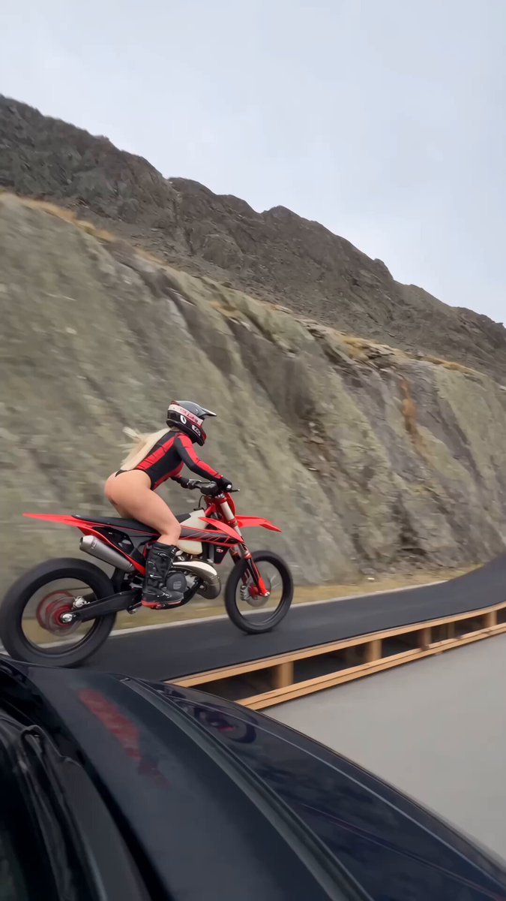

**พรอมต์**

```text
กำลังแปล
```

[↑ กลับสู่หมวดหมู่](#catalog)

---

<a name="prompt-2101887507059351894"></a>

### ข้อความพรอมต์โฆษณา 15 วินาทีสำหรับกระปุกสกินแคร์หรูหรา พร้อมการสาดของน้ำ เกลียวคลื่นครีม และดอกไม้ประดับ

ผู้เขียน：[@Aiwithmaha](https://x.com/Aiwithmaha) · [โพสต์ต้นฉบับ](https://x.com/Aiwithmaha/status/2101887507059351894)

การตลาดผลิตภัณฑ์ · ผลิตภัณฑ์ · เผยแพร่แล้ว

**สรุป:** ข้อความพรอมต์โฆษณา 15 วินาทีสำหรับกระปุกสกินแคร์หรูหรา พร้อมการสาดของน้ำ เกลียวคลื่นครีม และดอกไม้ประดับ


**พรอมต์**

```text
สร้างโฆษณาสกินแคร์ระดับหรูแบบสมจริงขั้นสุดความยาว 15 วินาที โดยมีกระปุกแก้วหรูหราที่ติดฉลากว่า “AQUA LUXE – DEEP HYDRATION” ในสภาพแวดล้อมโทนสีฟ้าสดชื่นเย็นสบาย เริ่มต้นด้วยพื้นหลังบรรยากาศสีฟ้าละมุน ขณะที่ลำแสงอ่อนๆ และละอองน้ำละเอียดสร้างบรรยากาศสะอาดตาและพรีเมียม ค่อยๆ เผยให้เห็นกระปุกสกินแคร์ที่ตั้งอยู่บนผิวน้ำแวววาว พร้อมเงาสะท้อนที่สมจริงและระยะชัดลึกแบบภาพยนตร์ ค่อยๆ เลื่อนกล้องเข้าไปใกล้ขึ้นในขณะที่แสงไฮไลท์นุ่มนวลพาดผ่านฝาสีเงินเมทัลลิกและบรรจุภัณฑ์แก้ว ล้อมรอบกระปุกด้วยเกลียวคลื่นเนื้อครีมสีขาวเนียนนุ่มดุจแพรไหมที่ไหลเวียนอย่างสง่างาม สร้างผิวสัมผัสสกินแคร์ที่หรูหรา เพิ่มหยดน้ำลอยน้ำและฟองสบู่ขนาดเล็กที่เคลื่อนไหวอย่างเป็นธรรมชาติทั่วทั้งฉากตามหลักฟิสิกส์ที่สมจริง เปลี่ยนฉากไปสู่น้ำใสกระจ่างที่สาดกระจายอย่างน่าทึ่งโอบล้อมรอบตัวผลิตภัณฑ์ โดยยังคงให้กระปุกอยู่ในตำแหน่งกึ่งกลางและคมชัดอย่างไร้ที่ติ เสริมด้วยดอกไม้สีขาวบอบบางและใบไม้สีเขียวสดรอบๆ ละอองน้ำเพื่อสร้างบรรยากาศที่สื่อถึงการเติมความชุ่มชื้นอันสดชื่น ปิดท้ายด้วยภาพฮีโร่ช็อตแสนงดงามของกระปุก AQUA LUXE DEEP HYDRATION ที่อยู่ตรงกลางตัดกับพื้นหลังสีฟ้า ล้อมรอบด้วยหยดน้ำ ดอกไม้ และแสงเรืองรองนุ่มนวล พร้อมการจัดแสงระดับภาพยนตร์ระดับพรีเมียมและการโฟกัสผลิตภัณฑ์อย่างไร้ที่ติ
```

[↑ กลับสู่หมวดหมู่](#catalog)

---

<a name="prompt-2101955160696336440"></a>

### วิดีโอสไตล์โฆษณาการทำดับเบิ้ลชีสเบอร์เกอร์ของ Wendy’s บนเตาย่างแบน

ผู้เขียน：[@noorwithwifi](https://x.com/noorwithwifi) · [โพสต์ต้นฉบับ](https://x.com/noorwithwifi/status/2101955160696336440)

อาหาร / เครื่องดื่ม · เผยแพร่แล้ว

**สรุป:** วิดีโอสไตล์โฆษณาการทำดับเบิ้ลชีสเบอร์เกอร์ของ Wendy’s บนเตาย่างแบน


**พรอมต์**

```text
สร้างวิดีโออาหารสไตล์โฆษณาของพ่อครัวที่สวมถุงมือสีดำและชุดยูนิฟอร์มของ Wendy’s กำลังทำดับเบิ้ลชีสเบอร์เกอร์บนเตาย่างแบนร้อนๆ แสดงภาพขนมปังโรยงากำลังปิ้ง เนื้อเบอร์เกอร์ทรงสี่เหลี่ยมสดใหม่กำลังถูกกดและส่งเสียงฉ่าพร้อมควันกรุ่น ชีสอเมริกันสีเหลืองกำลังละลาย มายองเนสถูกทาบนขนมปังชิ้นล่าง จากนั้นวางซ้อนเนื้อฉ่ำชีสสองชิ้นด้วยผักกาดแก้ว มะเขือเทศ หอมหัวใหญ่ แตงกวาดอง ซอสมะเขือเทศ และมายองเนส ก่อนจะประกบด้วยขนมปังชิ้นบน ปิดท้ายด้วยภาพโคลสอัพแบบไดนามิกที่เชฟถือเบอร์เกอร์ที่เสร็จสมบูรณ์ยื่นมาทางกล้องพร้อมรอยยิ้มบางๆ โดยใช้แสงโทนอุ่น พื้นผิวเป็นมันเงา มุมกล้องสไตล์ภาพยนตร์ และพื้นหลังแบบเบลอนุ่มนวล
```

[↑ กลับสู่หมวดหมู่](#catalog)

---

<a name="prompt-2102008176958976380"></a>

### 首尔老社区散步的韩系女生日常，DV家用录像机风格与多动作连贯叙事。

ผู้เขียน：[@AIwithkhan](https://x.com/AIwithkhan) · [โพสต์ต้นฉบับ](https://x.com/AIwithkhan/status/2102008176958976380)

ตัวละคร · เผยแพร่แล้ว

**สรุป:** 首尔老社区散步的韩系女生日常，DV家用录像机风格与多动作连贯叙事。

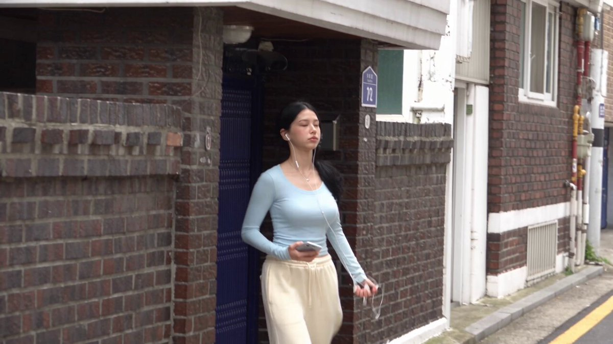

**พรอมต์**

```text
สร้างโฮมวิดีโอส่วนตัวความยาว 30 วินาทีที่สมจริงขั้นสุดของหญิงสาวชาวเกาหลีที่กำลังเพลิดเพลินกับบ่ายวันอาทิตย์อันแสนผ่อนคลายในย่านที่อยู่อาศัยเก่าแก่ของกรุงโซล ใช้ภาพที่แนบมาเป็นข้อมูลอ้างอิงของตัวละคร และรักษาใบหน้าของเธอ ผมหางม้าข้างสีดำยาวที่ดูยุ่งๆ เสื้อรัดรูปสีฟ้าพาสเทล กางเกงสไตล์ชุดนอนทรงหลวมสีครีม รองเท้าผ้าใบสีดำ สร้อยคอสีเงิน และรูปลักษณ์โดยรวมให้สม่ำเสมออย่างสมบูรณ์แบบตลอดทั้งคลิป

เธอออกจากบ้านโดยถือโทรศัพท์ไว้ในมือข้างหนึ่งและสวมหูฟังไว้ที่หู เริ่มเปิดเพลงและเดินเล่นไปตามถนนที่อยู่อาศัยอันเงียบสงบอย่างสบายๆ ขณะฟังเพลง โยกศีรษะเบาๆ ตามจังหวะ และเพลิดเพลินกับบ่ายอันเงียบสงบ

เธอเดินมาถึงร้านสะดวกซื้อเล็กๆ ในละแวกนั้น ถอดหูฟังออกข้างหนึ่ง เดินเข้าไปข้างในแล้วซื้อน้ำเปล่าเย็นๆ หนึ่งขวด เธอเดินออกมาข้างนอก เก็บโทรศัพท์และหูฟังใส่ในกระเป๋ากางเกงชุดนอนอย่างปลอดภัย จากนั้นเดินตรงไปยังม้านั่งแถวนั้น

เธอนั่งลงอย่างสบายบนม้านั่ง เปิดขวดน้ำและจิบน้ำอย่างสดชื่นหลายอึกพร้อมกับมองไปรอบๆ ถนนอันเงียบสงบ เธอเช็ดหยดน้ำเล็กๆ ออกจากริมฝีปากและผ่อนคลายอยู่ครู่หนึ่ง

เพื่อนสาวของเธอปรากฏตัวขึ้นจากฝั่งตรงข้ามของถนนอย่างกะทันหัน พวกเธอจำกันได้ ยิ้มแย้มสดใส และเดินเข้าหากันก่อนจะสวมกอดกันอย่างอบอุ่นเป็นธรรมชาติ พวกเธอคุยและหัวเราะด้วยกันสั้นๆ เหมือนเพื่อนสนิท

เพื่อนคนนั้นบอกลาแล้วเดินจากไป เธอหยิบขวดน้ำขึ้นมา โบกมือเบาๆ และเดินต่อไปยังบ้านของเธอพร้อมถือขวดน้ำไว้อย่างสบายๆ

ไม่กี่นาทีต่อมา เธอสังเกตเห็นว่าเชือกผูกรองเท้าข้างหนึ่งของเธอหลุด เธอหยุดบนทางเท้า ก้มลงอย่างเป็นธรรมชาติ ผูกเชือกรองเท้าให้แน่น ลุกขึ้นยืนแล้วปัดมือกับกางเกงชุดนอนของเธอ

เธอเดินต่อไปยังบ้านของเธอ ชำเลืองมองกลับมาที่กล้องด้วยรอยยิ้มที่ผ่อนคลายและพูดอย่างไม่เป็นทางการว่า “Bye!” ก่อนที่จะหันหลังแล้วเดินจากไปตามตรอกที่อยู่อาศัยอันเงียบสงบ

ใช้ฟุตเทจกล้อง DV สำหรับผู้บริโภคยุคต้นทศวรรษ 2000 แบบดิบๆ: การสั่นไหวของกล้องถือมือ, การจัดเฟรมที่ไม่สมบูรณ์, การหาโฟกัสอัตโนมัติ (autofocus hunting), การเปลี่ยนระดับแสง, รายละเอียดดิจิทัลที่นุ่มนวล, นอยส์ดิจิทัลเล็กน้อย, โมชั่นเบลอที่เป็นธรรมชาติ, การซูมที่เก้ๆ กังๆ เป็นบางครั้ง, สีสันที่ซีดจางลงเล็กน้อย และข้อบกพร่องที่สมจริงของโฮมวิดีโอ

บรรยากาศเสียงรอบข้างตามธรรมชาติของย่านในโซลเท่านั้น — เสียงฝีเท้า, เสียงบทสนทนาอันไกลโพ้น, เสียงกระดิ่งประตูกระทบกันของร้านสะดวกซื้อ, การจราจร, เสียงนก, กระดิ่งจักรยาน, ใบไม้ไหวตามสายลม, เสียงขวดน้ำ และบรรยากาศถนนที่เงียบสงบ เสียงเพลงจากหูฟังของเธอควรได้ยินเพียงแผ่วเบาเฉพาะเมื่อเหมาะสมเท่านั้น ห้ามเป็นเพลงประกอบของวิดีโอ

รักษาความต่อเนื่องที่สมจริงตลอดทั้งคลิป: โทรศัพท์และหูฟังถูกเก็บไว้ในกระเป๋ากางเกงชุดนอนก่อนที่เธอจะดื่มน้ำ, ขวดน้ำยังคงอยู่กับตัวเธอหลังจากนั้น, เชือกรองเท้าต้องหลุดอย่างเห็นได้ชัดก่อนที่เธอจะผูก และผูกเสร็จเรียบร้อยอย่างถูกต้องหลังจากนั้น

ไม่มีดนตรีที่เพิ่มเข้ามาในแทร็กเสียง, ไม่มีการบรรยาย, ไม่มีคำบรรยายใต้ภาพ, ไม่มีแคปชัน, ไม่มีเหตุการณ์ดราม่า, ไม่ใช่ภาพยนตร์เชิงพาณิชย์ที่ขัดเกลามาอย่างดี, ไม่มีผิวฟิลเตอร์ความงาม, ไม่มีลุค CGI, ไม่มีการเปลี่ยนชุด, ไม่มีการเปลี่ยนตัวตน, ไม่มีตัวละครซ้ำซ้อน, ไม่มีสิ่งของที่หายไป, ไม่มีการเคลื่อนไหวที่ไม่สมจริงหรือสภาพแวดล้อมที่เปลี่ยนแปลง
```

[↑ กลับสู่หมวดหมู่](#catalog)

---

<a name="prompt-2101902583858122820"></a>

### หัวรถจักรเซรามิกศิลาดล, ตู้รถไฟสีงาช้าง/สีเขียวเซจ, ผนังพอร์ซเลน, แสงจันทร์, เสียงล้อกระทบรางที่ประสานกันอย่างลงตัว \+ เสียงพ่นไอน้ำ \+ เสียงระฆังวัด

ผู้เขียน：[@KaminiKamini222](https://x.com/KaminiKamini222) · [โพสต์ต้นฉบับ](https://x.com/KaminiKamini222/status/2101902583858122820)

ยานพาหนะ · เผยแพร่แล้ว

**สรุป:** หัวรถจักรเซรามิกศิลาดล, ตู้รถไฟสีงาช้าง/สีเขียวเซจ, ผนังพอร์ซเลน, แสงจันทร์, เสียงล้อกระทบรางที่ประสานกันอย่างลงตัว \+ เสียงพ่นไอน้ำ \+ เสียงระฆังวัด


**พรอมต์**

```text
หัวรถจักรเซรามิกศิลาดล, ตู้รถไฟสีงาช้าง/สีเขียวเซจ, ผนังพอร์ซเลน, แสงจันทร์, เสียงล้อกระทบรางที่ประสานกันอย่างลงตัว + เสียงพ่นไอน้ำ + เสียงระฆังวัด
```

[↑ กลับสู่หมวดหมู่](#catalog)

---

<a name="prompt-2101889380193620167"></a>

### วิดีโอสไตล์ Vlog ถือถ่ายด้วยมือของหญิงสาวชาวเกาหลีในยิมสมัยใหม่ พร้อมการกระทำตามช่วงเวลา บทสนทนา และเสียงบรรยากาศ

ผู้เขียน：[@doctorwasif](https://x.com/doctorwasif) · [โพสต์ต้นฉบับ](https://x.com/doctorwasif/status/2101889380193620167)

อื่น ๆ · เผยแพร่แล้ว

**สรุป:** วิดีโอสไตล์ Vlog ถือถ่ายด้วยมือของหญิงสาวชาวเกาหลีในยิมสมัยใหม่ พร้อมการกระทำตามช่วงเวลา บทสนทนา และเสียงบรรยากาศ

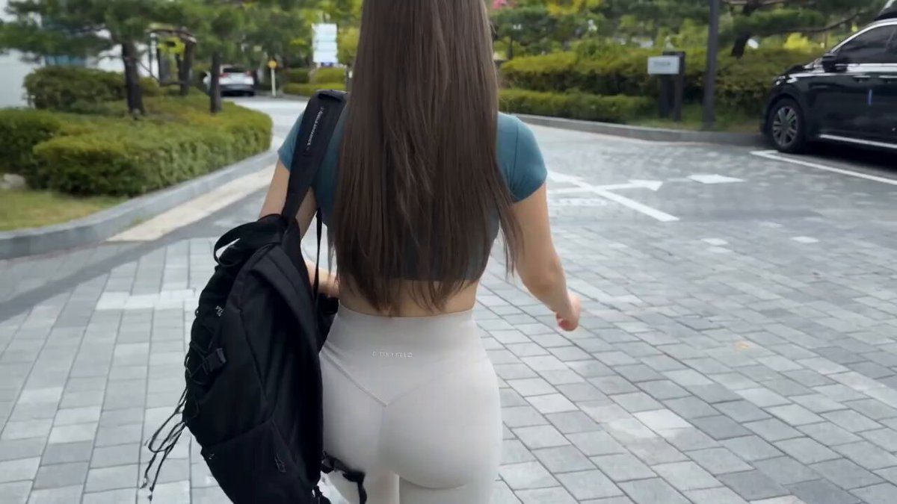

**พรอมต์**

```text
image = วัตถุหลัก

หญิงสาวชาวเกาหลีที่สมจริงในวิดีโอบล็อก (Vlog) ยิมสมัยใหม่ที่สมจริง อัตราส่วน 16:9, สไตล์ถ่ายด้วยสมาร์ทโฟนแบบมือถือ RAW/Vlog, ออโต้โฟกัสเป็นธรรมชาติ, มีการสั่นไหวเล็กน้อย, การปรับเฟรมเป็นบางครั้ง, โมชันเบลอเล็กน้อย, แสงและสีที่เป็นธรรมชาติ ไม่มีดนตรีประกอบ รวมเสียงบรรยากาศยิมที่สมจริง: เสียงฝีเท้า, เสียงยกน้ำหนัก, ลู่วิ่งไฟฟ้า, เสียงคนคุยกันไกลๆ และบทสนทนาภาษาเกาหลีที่ชัดเจนเป็นธรรมชาติ

00:00–00:03 — โถงทางเข้า เธอผูกเชือกรองเท้า หยิบกระเป๋ายิมและขวดน้ำ มองกล้องแล้วพูดว่า: “좋아요, 헬스장 갈 준비 다 됐어요.”

00:03–00:06 — เดินข้างนอกมุ่งหน้าไปยังยิม ช็อตถือกล้องแบบสบายๆ/ถ่ายตามหลัง

00:06–00:09 — บนเสื่อออกกำลังกาย เธอยืดกล้ามเนื้อและพูดว่า: “오늘은 어깨랑 팔 운동 할 거예요.”

00:09–00:13 — หน้ากระจก เธอเล่นดัมเบลเคิร์ล มองดูเงาตัวเองแล้วนับ: “하나, 둘, 셋...”

00:13–00:16 — ช็อตโคลสอัพ เธอเล่นเสร็จ วางดัมเบลลง ถอนหายใจแล้วหัวเราะ: “이거 진짜 힘드네요.”

00:16–00:20 — ช็อตเคลื่อนกล้องตามด้านข้าง เธอวิ่งเหยาะๆ บนลู่วิ่งในระดับปานกลางและพูดพร้อมเสียงหอบ: “페이스 좀 올려볼게요.”

00:20–00:23 — ช็อตโคลสอัพ เธอผ่อนความเร็วลง ใช้ผ้าขนหนูซับเหงื่อ หายใจแรงแต่มีรอยยิ้ม

00:23–00:27 — นั่งบนม้านั่ง ดื่มน้ำและพูดคุยอย่างสบายๆ: “오늘 컨디션 진짜 좋았던 것 같아요.”

00:27–00:30 — เธอลุกขึ้นยืน หยิบกระเป๋า โบกมือและยิ้ม: “오늘 영상은 여기까지! 다음에 봐요.” ตัดจบอย่างเป็นธรรมชาติ
```

[↑ กลับสู่หมวดหมู่](#catalog)

---

<a name="prompt-2101908933078310950"></a>

### กำลังแปล

ผู้เขียน：[@CaliraVal](https://x.com/CaliraVal) · [โพสต์ต้นฉบับ](https://x.com/CaliraVal/status/2101908933078310950)

คอมิก / สตอรี่บอร์ด · ตัวละคร · ทิวทัศน์ / ธรรมชาติ · เผยแพร่แล้ว

**สรุป:** กำลังแปล

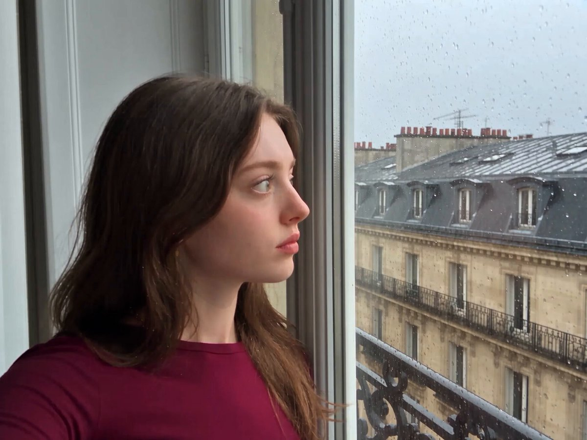

**พรอมต์**

```text
กำลังแปล
```

[↑ กลับสู่หมวดหมู่](#catalog)

---

<a name="prompt-2101690647313043576"></a>

### พร้อมต์สารคดีความยาว 30 วินาทีสร้างภาพการก่อสร้างสะพานลอนดอนและชีวิตบนท้องถนนยุคกลางโดยรอบช่วงประมาณปี 1190-1200

ผู้เขียน：[@john\_my07](https://x.com/john_my07) · [โพสต์ต้นฉบับ](https://x.com/john_my07/status/2101690647313043576)

ทิวทัศน์เมือง / ถนน · เผยแพร่แล้ว

**สรุป:** พร้อมต์สารคดีความยาว 30 วินาทีสร้างภาพการก่อสร้างสะพานลอนดอนและชีวิตบนท้องถนนยุคกลางโดยรอบช่วงประมาณปี 1190-1200

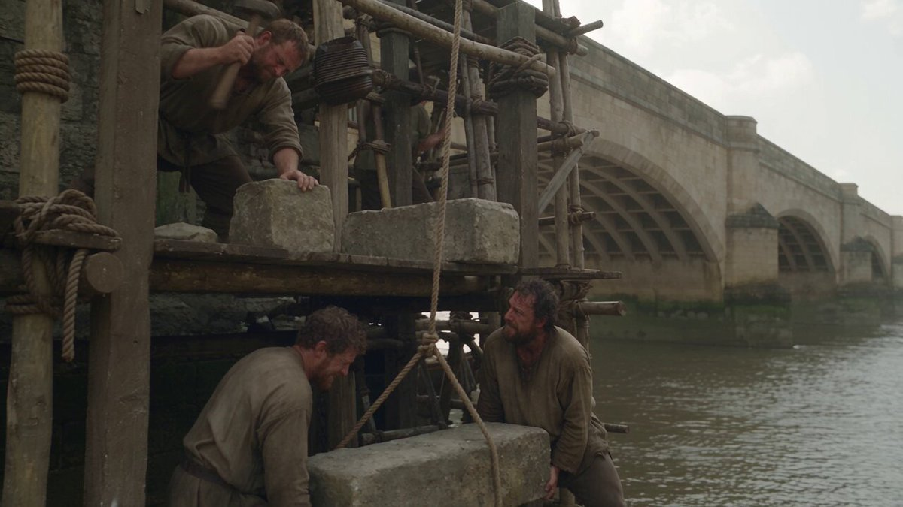

**พรอมต์**

```text
สร้างวิดีโอสารคดีประวัติศาสตร์ความยาว 30 วินาที ความละเอียด 1080p ที่สมจริงเหมือนภาพถ่ายขั้นสุดโดยใช้ Seedance 2.5 บรรยายภาพวันธรรมดาวันหนึ่งในลอนดอนระหว่างการก่อสร้างสะพานลอนดอนหินยุคกลาง ประมาณช่วงปี 1176 ถึง 1209 วิดีโอต้องดูเหมือนฟุตเทจจริงที่บันทึกจากการสังเกตตามธรรมชาติจากยุคสมัยนั้น ราวกับว่ามีกล้องสารคดีที่ล่องหนได้บันทึกภาพชีวิตจริงในยุคกลางไว้ ห้ามมีลักษณะที่ดูเหมือนสร้างจาก AI ห้ามมีสุนทรียภาพแนวแฟนตาซี และห้ามมีภาพแนวภาพยนตร์ที่ขัดเกลาจนเกินจริง

ข้อมูลจำเพาะของวิดีโอ:
ความยาว: 30 วินาที
ความละเอียด: 1080p
อัตราส่วนภาพ: 16:9
สไตล์: สัจนิยมทางประวัติศาสตร์แท้จริง สารคดีเชิงสังเกตการณ์
กล้อง: ผู้ควบคุมกล้องที่มองไม่เห็น การเคลื่อนไหวแบบถือกล้องด้วยมืออย่างเป็นธรรมชาติ
การจัดแสง: แสงกลางวันสมจริง หมอกควันบรรยากาศธรรมชาติ
เสียง: เสียงสภาพแวดล้อมที่เหมาะสมกับยุคสมัย คนงาน เกวียน แม่น้ำ นก และบทสนทนาของมนุษย์ ไม่มีดนตรียุคใหม่

ฉากหลังทางประวัติศาสตร์:

ลอนดอน ประเทศอังกฤษ ระหว่างการก่อสร้างสะพานลอนดอนหินยุคกลางขนาดใหญ่แห่งแรก ปีควรให้ความรู้สึกประมาณปี 1190–1200 โดยที่สะพานยังสร้างไม่เสร็จ ใช้สถาปัตยกรรม เสื้อผ้า เครื่องมือ วิธีการก่อสร้าง และชีวิตประจำวันในยุคกลางที่สมเหตุสมผลทางประวัติศาสตร์ สะพานกำลังถูกสร้างข้ามแม่น้ำเทมส์ภายใต้โครงการขนาดใหญ่ที่เริ่มขึ้นในปี 1176 และเสร็จสมบูรณ์ในปี 1209

การก่อสร้างควรแสดงให้เห็นงานก่ออิฐหิน นั่งร้านไม้ เสาเข็มไม้ คนงานขนย้ายหิน เชือก เครื่องมือช่าง และเรือขนส่งวัสดุก่อสร้างอย่างชัดเจน หลีกเลี่ยงอุปกรณ์ก่อสร้างสมัยใหม่ เครื่องจักรอุตสาหกรรม เครน หมวกนิรภัย ถนนสมัยใหม่ หรือสถาปัตยกรรมผิดยุคผิดสมัย

ฉากที่ 1 — 0–6 วินาที: การก่อสร้างสะพาน

เปิดเรื่องด้วยมุมมองกว้างปานกลางอย่างเป็นธรรมชาติจากริมแม่น้ำ แสดงภาพสะพานลอนดอนหินที่สร้างเสร็จบางส่วนโดดเด่นเต็มเฟรม คนงานหลายคนกำลังสร้างสะพานอย่างกระตือรือร้น: ช่างหินตกแต่งก้อนหินด้วยเครื่องมือช่าง กรรมกรลากวัสดุ และคนงานยืนอยู่บนนั่งร้านไม้หยาบๆ เสาเข็มไม้และนั่งร้านก่อสร้างชั่วคราวยื่นลงไปในแม่น้ำเทมส์

กล้องเคลื่อนไหวช้าๆ อย่างเป็นธรรมชาติ ราวกับมีคนล่องหนกำลังสังเกตการทำงานจากริมฝั่งแม่น้ำ คนงานปฏิบัติตัวอย่างอิสระ มุ่งมั่นอยู่กับงานของตน บางคนหยุดคุยกัน ขณะที่บางคนแบกหินและดึงเชือก ซุ้มโค้งที่ยังไม่เสร็จและพื้นผิวหินขรุขระต้องดูสมจริงทางกายภาพและสมเหตุสมผลทางประวัติศาสตร์

แม่น้ำเทมส์ไหลอย่างเป็นธรรมชาติใต้พื้นที่ก่อสร้าง พร้อมเรือไม้แล่นผ่านไปมาในบริเวณใกล้เคียง ฝุ่น ละอองหินขนาดเล็ก ผิวสัมผัสของไม้ และการเคลื่อนไหวอันละเอียดอ่อนสร้างความรู้สึกของสถานที่ก่อสร้างที่กำลังทำงานอยู่จริงๆ

ฉากที่ 2 — 6–12 วินาที: ผู้คนดำเนินชีวิตประจำวัน

กล้องเคลื่อนย้ายมุมมองอย่างเป็นธรรมชาติไปยังบริเวณริมแม่น้ำใกล้เคียงโดยไม่มีการตัดภาพฉับพลัน ชาวลอนดอนยุคกลางดำเนินกิจวัตรประจำวันของพวกเขา ผู้หญิงคนหนึ่งถือตะกร้าสาน ผู้ชายคนหนึ่งขนส่งสิ่งของบนเกวียนลากไม้ และพ่อค้าจัดวางสินค้าเรียบง่ายใกล้บริเวณริมแม่น้ำที่คึกคัก คนเดินเท้าสองสามคนหยุดมองการก่อสร้างสะพาน

ผู้คนไม่ควรแสดงท่าทางเหมือนตัวประกอบที่กำลังแสดงภาพยนตร์ พวกเขาเดิน พูดคุย ทำงาน แบกสิ่งของ และมีปฏิสัมพันธ์กันอย่างเป็นธรรมชาติ เสื้อผ้าประกอบด้วยเสื้อทูนิกผ้าขนสัตว์หยาบ ผ้าคลุมเรียบง่าย เสื้อผ้าผ้าลินิน รองเท้าหนัง และผ้าคลุมศีรษะยุคกลางที่สมเหตุสมผลทางประวัติศาสตร์ ไม่มีทรงผมสมัยใหม่ ซิป ผ้าใยสังเคราะห์ หรือเครื่องประดับร่วมสมัย

สะพานยังคงมองเห็นได้บางส่วนในพื้นหลัง เพื่อรักษาความต่อเนื่องทางสายตากับหัวเรื่องหลัก

ฉากที่ 3 — 12–18 วินาที: ชุมชนใกล้เคียง

แสดงภาพย่านริมแม่น้ำยุคกลางโดยรอบอย่างสั้นๆ ทางเดินแคบและไม่เรียบ อาคารโครงสร้างไม้ แผงขายของในตลาดแบบเรียบง่าย เกวียนไม้ และผู้คนที่สัญจรไปมาระหว่างแม่น้ำกับถนนใกล้เคียง คนพายเรือกำลังนำเรือไม้ขนาดเล็กไปตามแม่น้ำเทมส์ ขณะที่อีกคนกำลังขนถ่ายสิ่งของ

กล้องไม่ควรแช่อยู่ที่บริเวณชุมชนนานเกินไป ให้ส่วนนี้สั้นและเป็นการสังเกตการณ์ เพื่อให้เห็นภาพรวมของโลกรอบๆ สถานที่ก่อสร้างเพียงแวบเดียว แสงธรรมชาติ ความลึกของบรรยากาศที่สมจริง และผิวสัมผัสวัสดุยุคกลางที่แม่นยำ หลีกเลี่ยงการทำให้สภาพแวดล้อมดูเหมือนอาณาจักรแฟนตาซีหรือสวนสนุกประวัติศาสตร์สมัยใหม่

ฉากที่ 4 — 18–25 วินาที: กลับสู่การก่อสร้าง

กล้องหันความสนใจกลับไปที่สะพานลอนดอนอย่างเป็นธรรมชาติ กลุ่มคนงานค่อยๆ เคลื่อนย้ายก้อนหินขนาดใหญ่เข้าที่ ช่างหินเคาะหินด้วยค้อนและสิ่วจนเกิดเศษหินเล็กๆ คนงานอีกคนส่งสัญญาณให้เพื่อนร่วมงานขณะดึงเชือก

แสดงให้เห็นถึงการใช้แรงกายในการก่อสร้าง: คนงานยก แบก ทรงตัว สื่อสาร และปรับแต่งวัสดุ ซุ้มหินที่เสร็จบางส่วนและคานรองรับไม้หยาบๆ ยังคงเป็นจุดโฟกัสสายตาหลัก ใช้การเคลื่อนไหว น้ำหนัก แรงเสียดทาน และแรงโน้มถ่วงของมนุษย์ที่สมจริง ห้ามมีการยกของที่เป็นไปไม่ได้ วัตถุลอยได้ หรือชิ้นส่วนสะพานประกอบกันอย่างน่าอัศจรรย์

ผู้คนในบริเวณใกล้เคียงสองสามคนยืนดูการก่อสร้างจากระยะที่ปลอดภัย ขณะที่คนอื่นๆ ยังคงดำเนินกิจวัตรประจำวันต่อไปโดยไม่ได้สนใจมากนัก

ฉากที่ 5 — 25–30 วินาที: ช่วงเวลาประวัติศาสตร์ที่มีชีวิต

จบลงด้วยมุมมองกว้างปานกลางที่มีการจัดเฟรมอย่างเป็นธรรมชาติของสะพานที่ยังสร้างไม่เสร็จ ริมแม่น้ำที่คึกคัก และผู้คนที่กำลังทำงานและเดินอยู่ใกล้ๆ กล้องยังคงอยู่ในระดับสายตามนุษย์ มีการสั่นไหวเล็กน้อยตามธรรมชาติของการถือด้วยมือ และมีองค์ประกอบภาพที่ไม่สมบูรณ์แบบแต่ดูน่าเชื่อถือ

คนงานคนหนึ่งเดินตัดผ่านฉากหน้าพร้อมถือเครื่องมือหินขนาดเล็ก บดบังสะพานไปชั่วขณะหนึ่ง กล้องปรับตำแหน่งอย่างนุ่มนวล เผยให้เห็นสะพานอีกครั้ง แม่น้ำ คนงาน คนเดินเท้า และอาคารยุคกลางโดยรอบสร้างความรู้สึกของวันธรรมดาวันหนึ่งที่ดำเนินไปท่ามกลางโครงการวิศวกรรมชิ้นเอก

จบลงโดยไม่มีการเปิดตัวที่ตื่นเต้นเร้าใจ ไม่มีการเคลื่อนไหวกล้องแบบประดิษฐ์ หรือการเปลี่ยนฉากแบบภาพยนตร์สมัยใหม่

ข้อกำหนดความแท้จริงและความสมจริง:

ทำให้วิดีโอดูเหมือนฟุตเทจสารคดีประวัติศาสตร์จริงๆ ไม่ใช่ภาพสร้างใหม่จาก AI
ใช้การแสดงออกทางสีหน้าของมนุษย์อย่างเป็นธรรมชาติ ผิวสัมผัสสมจริง ฟันที่ไม่สมบูรณ์แบบ และสัดส่วนร่างกายที่น่าเชื่อถือ
เสื้อผ้า เครื่องมือ วัสดุก่อสร้าง และเทคนิคการก่อสร้างยุคกลางที่ถูกต้อง
ผู้ควบคุมกล้องต้องมองไม่เห็นอย่างสมบูรณ์ ไม่มีกล้อง มือ เงาสะท้อน หรืออุปกรณ์สมัยใหม่
การเคลื่อนไหวของกล้องแบบถือด้วยมืออย่างเป็นธรรมชาติ การปรับโฟกัสอย่างแนบเนียน สิ่งกีดขวางในฉากหน้าเป็นครั้งคราว และการเปิดรับแสงที่สมจริง
การออกแบบทางสถาปัตยกรรมและความคืบหน้าของการก่อสร้างที่สอดคล้องกันตลอดทั้งวิดีโอ
พฤติกรรมของแม่น้ำ ลม ฝุ่น ผิวสัมผัสของหิน ลายไม้ และการเคลื่อนไหวของฝูงชนที่สมจริง
ไม่มีวัตถุสมัยใหม่ ไฟฟ้า ยานพาหนะ ป้ายร่วมสมัย อาคารสมัยใหม่ หรือรายละเอียดที่ผิดยุคผิดสมัย
ไม่มีการเกรดสีภาพยนตร์ที่เกินจริง บรรยากาศแฟนตาซี สโลว์โมชัน ไทม์แลปส์ แสงสะท้อนเลนส์ประดิษฐ์ หรือดนตรีประกอบ
ไม่มีคำบรรยาย ข้อความซ้อนทับ ลายน้ำ หรือสิ่งแปลกปลอมจาก AI ที่มองเห็นได้
เป้าหมายเชิงสร้างสรรค์ขั้นสุดท้าย:

ผู้ชมควรรู้สึกราวกับว่าพวกเขาได้ย้อนเวลากลับไปยังลอนดอนยุคกลางในวันธรรมดาวันหนึ่งขณะที่สะพานลอนดอนหินอันเป็นเอกลักษณ์กำลังถูกสร้างขึ้น การก่อสร้างสะพานเป็นจุดโฟกัสหลัก ขณะที่ผู้คน พ่อค้า คนงาน เรือ และถนนหนทางในท้องถิ่นใกล้เคียงช่วยเปิดมุมมองสั้นๆ แต่น่าเชื่อถือเกี่ยวกับชีวิตจริงในยุคกลาง ทุกการเคลื่อนไหว ผิวสัมผัส สีหน้า และรายละเอียดสภาพแวดล้อมควรให้ความรู้สึกสมจริงอย่างแท้จริง
```

[↑ กลับสู่หมวดหมู่](#catalog)

---

<a name="prompt-2101792588252790800"></a>

### ฉากแอนิเมชันของจ๊อกกี้ที่อ้วนที่สุดในโลกขี่แรดเข้าร่วมการแข่งขันความเร็ว

ผู้เขียน：[@SloppenhAImer](https://x.com/SloppenhAImer) · [โพสต์ต้นฉบับ](https://x.com/SloppenhAImer/status/2101792588252790800)

อื่น ๆ · เผยแพร่แล้ว

**สรุป:** ฉากแอนิเมชันของจ๊อกกี้ที่อ้วนที่สุดในโลกขี่แรดเข้าร่วมการแข่งขันความเร็ว

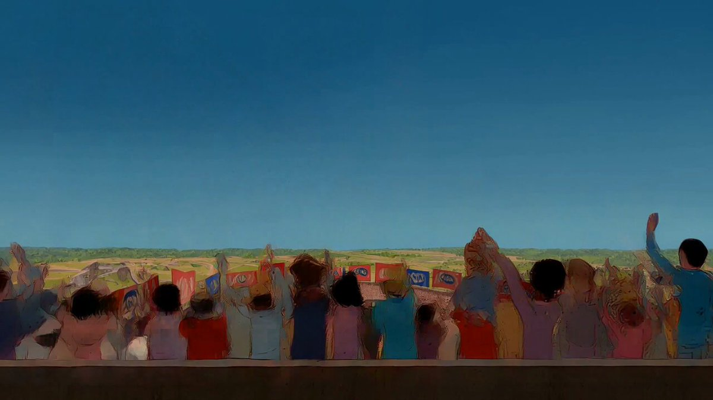

**พรอมต์**

```text
จ๊อกกี้ที่อ้วนที่สุดในโลกแข่งขี่แรด
```

[↑ กลับสู่หมวดหมู่](#catalog)

---

<a name="prompt-2101827048402534496"></a>

### กำลังแปล

ผู้เขียน：[@john87445528](https://x.com/john87445528) · [โพสต์ต้นฉบับ](https://x.com/john87445528/status/2101827048402534496)

คอมิก / สตอรี่บอร์ด · ตัวละคร · เผยแพร่แล้ว

**สรุป:** กำลังแปล

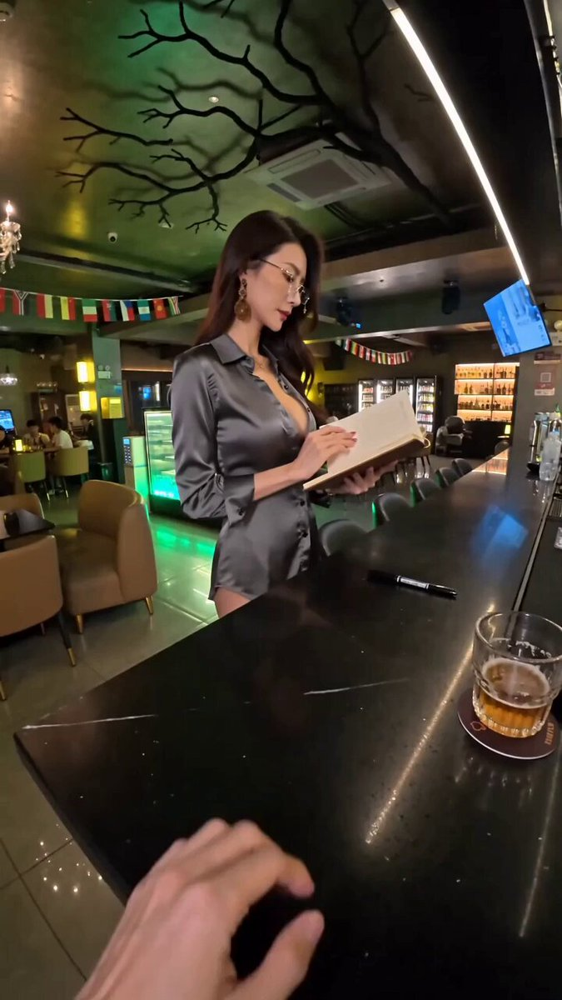

**พรอมต์**

```text
กำลังแปล
```

[↑ กลับสู่หมวดหมู่](#catalog)

---

<a name="prompt-2101689290992542125"></a>

### หญิงสาวในลิฟต์อพาร์ตเมนต์เกาหลีกลายร่างเป็นสิ่งมีชีวิตผิดธรรมชาติและไล่ล่าเพื่อนบ้านที่ตื่นตระหนก

ผู้เขียน：[@AIwithkhan](https://x.com/AIwithkhan) · [โพสต์ต้นฉบับ](https://x.com/AIwithkhan/status/2101689290992542125)

ตัวละคร · สัตว์ / สิ่งมีชีวิต · เผยแพร่แล้ว

**สรุป:** หญิงสาวในลิฟต์อพาร์ตเมนต์เกาหลีกลายร่างเป็นสิ่งมีชีวิตผิดธรรมชาติและไล่ล่าเพื่อนบ้านที่ตื่นตระหนก

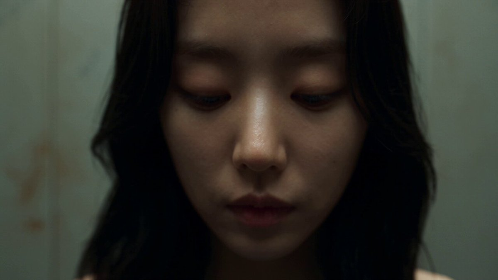

**พรอมต์**

```text
หญิงสาวชาวเกาหลีสวมเสื้อครอปเข้ารูปสีน้ำเงินและกางเกงขาสั้นสีขาวก้าวเข้าไปในลิฟต์ของอพาร์ตเมนต์เก่าตามลำพัง โดยมีเพื่อนบ้านที่ดูเหนื่อยล้ายืนอยู่ข้างๆ อย่างเงียบๆ

ประตูลิฟต์ปิดลง แสงไฟฟลูออเรสเซนต์กะพริบถี่ขณะที่หญิงสาวยืนจ้องมองพื้นนิ่งสนิทโดยไม่ไหวติง

ตัวเลขบอกชั้นเกิดอาการรวนกะทันหัน เธอค่อยๆ เงยหน้าขึ้นและมองไปยังเพื่อนบ้านด้วยสีหน้าว่างเปล่าชวนขนลุก

นิ้วมือของเธอเริ่มกระตุกอย่างรุนแรง ไหล่ของเธอกระตุกเกร็งราวกับมีบางสิ่งกำลังเคลื่อนไหวอยู่ใต้ผิวหนัง

ทันใดนั้นเธอคว้าจับราวจับของลิฟต์ โน้มตัวไปข้างหน้าอย่างผิดธรรมชาติ แล้วทรุดตัวกระแทกกับผนังลิฟต์

เพื่อนบ้านก้าวถอยหลังด้วยความหวาดกลัวและกดปุ่มฉุกเฉินอย่างบ้าคลั่ง

เธอนิ่งสนิทไปชั่วครู่ จากนั้นค่อยๆ ลุกขึ้นยืนด้วยดวงตาเบิกกว้างที่ไร้จุดโฟกัส ผิวซีดเผือด และท่วงท่าที่ผิดธรรมชาติ

ศีรษะของเธอเอียงไปข้างหนึ่งอย่างรวดเร็ว มือของเธอกระตุกขณะที่ลมหายใจเริ่มหนักหน่วงและขาดช่วง

เพื่อนบ้านพยายามออกแรงงัดประตูลิฟต์ให้เปิดออก แต่ประตูกลับติดค้างอยู่ระหว่างชั้น

หญิงสาวพุ่งตัวไปข้างหน้าอย่างกะทันหันและกระแทกเข้ากับผนังลิฟต์ จากนั้นหันไปหาเพื่อนบ้านด้วยสีหน้าน่าสะพรึงกลัว

ไฟฉุกเฉินเปลี่ยนเป็นสีแดงขณะที่ลิฟต์สั่นสะเทือนและหยุดนิ่งสนิท

เพื่อนบ้านคลานหนีไปยังแผงควบคุมอย่างสิ้นหวัง ขณะที่เธอค่อยๆ ย่างสามขุมเข้ามาจากด้านหลัง

ลิฟต์ร่วงลงมาสองสามนิ้วอย่างกะทันหัน ทั้งคู่เซถลาขณะที่แสงไฟกะพริบอย่างรุนแรง

ในที่สุดประตูก็เปิดออกได้เพียงครึ่งเดียว เผยให้เห็นโถงทางเดินอพาร์ตเมนต์ที่มืดมิดด้านนอก

เพื่อนบ้านเบียดตัวแทรกผ่านช่องเปิดออกไป แต่หญิงสาวก็พุ่งตัวมาข้างหน้าอย่างรวดเร็วและคลานลอดใต้ประตูที่กำลังปิดลง

เพื่อนบ้านวิ่งหนีไปตามโถงทางเดินขณะที่สิ่งมีชีวิตนั้นไล่ตามด้วยการเคลื่อนไหวที่รวดเร็วและผิดธรรมชาติ

ผู้อยู่อาศัยคนหนึ่งเปิดประตูห้องออกมา เห็นสิ่งมีชีวิตนั้นกำลังพุ่งตรงเข้ามา จึงรีบกระแทกประตูปิดสนิททันที

สิ่งมีชีวิตนั้นหยุดชะงัก ค่อยๆ หันมาทางกล้อง จากนั้นก็พุ่งชาร์จไปตามโถงทางเดินอย่างกะทันหัน

ไฟตามโถงทางเดินกะพริบดับไปทีละดวงขณะที่กล้องถอยร่นไปทางบันไดหนีไฟ

ประตูลิฟต์ยังคงเปิดค้างอยู่ด้านหลังของเธอ ภายในว่างเปล่าสนิท ขณะที่มีเสียงหายใจผิดเพี้ยนแผ่วเบาดังออกมาจากข้างใน

สไตล์: หนังสยองขวัญในลิฟต์อพาร์ตเมนต์เกาหลีที่สมจริงระดับอัลตรา กล้องถือมือที่ให้ความรู้สึกอึดอัดคับแคบ แสงไฟฟลูออเรสเซนต์และไฟฉุกเฉินกะพริบ ผิวหนังและการแสดงออกทางสีหน้าที่สมจริง การเคลื่อนไหวของร่างกายที่ผิดธรรมชาติแต่ยังคงความสมจริงทางกายภาพ จังหวะดำเนินเรื่องตึงเครียด ภาพสะท้อนในลิฟต์ที่สมจริง การสั่นของกล้องอย่างแนบเนียน โมชันเบลอที่เป็นธรรมชาติ ให้ความรู้สึกแบบภาพยนตร์แต่ดูสมจริง สยองขวัญสไตล์เทคนิคพิเศษที่สร้างขึ้นจริง (practical-effects) ไม่มีความแหวะ ไม่มีเลือด ไม่มีบาดแผลเปิดชัดเจน ไม่มีคำบรรยาย ไม่มีลายน้ำ ไม่ดูเหมือนภาพซีจีไอ
```

[↑ กลับสู่หมวดหมู่](#catalog)

---

<a name="prompt-2101633366311219260"></a>

### ฉากอันอบอุ่นหัวใจของลูกแมวสองตัวที่มอบดอกกุหลาบและกอดกันบนชายหาดยามพระอาทิตย์ตกดิน

ผู้เขียน：[@Zarnab\_with\_Ai](https://x.com/Zarnab_with_Ai) · [โพสต์ต้นฉบับ](https://x.com/Zarnab_with_Ai/status/2101633366311219260)

สัตว์ / สิ่งมีชีวิต · ทิวทัศน์ / ธรรมชาติ · เผยแพร่แล้ว

**สรุป:** ฉากอันอบอุ่นหัวใจของลูกแมวสองตัวที่มอบดอกกุหลาบและกอดกันบนชายหาดยามพระอาทิตย์ตกดิน


**พรอมต์**

```text
ฉากภาพยนตร์ที่อบอุ่นหัวใจของลูกแมวขนฟูสุดน่ารักสองตัวนั่งเคียงข้างกันบนหาดทรายอันเงียบสงบในยามพระอาทิตย์ตกดินสีทอง ลูกแมวตัวหนึ่งมีขนสีส้มนุ่มนวล และอีกตัวมีขนปุกปุยสีขาวบริสุทธิ์ ลูกแมวสีส้มค่อยๆ ถือและยื่นดอกกุหลาบสีแดงแสนสวยให้ลูกแมวสีขาวอย่างอ่อนโยน ลูกแมวสีขาวรับดอกกุหลาบไว้ด้วยสีหน้าประหลาดใจและน่ารัก ทั้งสองสบตากันด้วยความรัก จากนั้นก็ขยับเข้ามาใกล้ชิดและกอดกันในห้วงเวลาที่อ่อนหวานและโรแมนติก แสงแดดสีทองอันอบอุ่นยามโพล้เพล้ ท้องฟ้าสีส้มเปล่งประกาย คลื่นทะเลอันสงบนิ่งเป็นฉากหลัง แสงสะท้อนของพระอาทิตย์ตกอันนุ่มนวลบนผิวน้ำ สายลมทะเลพัดเบาๆ รายละเอียดพื้นผิวของเม็ดทราย การเคลื่อนไหวที่เป็นธรรมชาติของลูกแมว ใบหน้าที่สื่ออารมณ์ การเล่าเรื่องที่เปี่ยมด้วยความรู้สึกน่ารัก การจัดองค์ประกอบภาพแบบภาพยนตร์ ระยะชัดตื้น แสงฟุ้งชวนฝัน ขนปุกปุยสมจริงระดับอัลตร้า คุณภาพสมจริงดั่งภาพถ่าย การเคลื่อนไหวของกล้องที่นุ่มนวล 4K แนวตั้ง 9:16 ไม่มีข้อความ ไม่มีคำบรรยาย ไม่มีลายน้ำ
```

[↑ กลับสู่หมวดหมู่](#catalog)

---

<a name="prompt-2101683541629354348"></a>

### แอนิเมชันภาพวาดพู่กันจีนแบบไร้รอยต่อที่เปลี่ยนผ่านจากคลื่นทะเลสู่ขุนเขาเจดีย์ในม่านหมอก ใบไม้เปลี่ยนสี ดอกซากุระ และค่ำคืนพระจันทร์เต็มดวง

ผู้เขียน：[@noorwithwifi](https://x.com/noorwithwifi) · [โพสต์ต้นฉบับ](https://x.com/noorwithwifi/status/2101683541629354348)

ทิวทัศน์ / ธรรมชาติ · เผยแพร่แล้ว

**สรุป:** แอนิเมชันภาพวาดพู่กันจีนแบบไร้รอยต่อที่เปลี่ยนผ่านจากคลื่นทะเลสู่ขุนเขาเจดีย์ในม่านหมอก ใบไม้เปลี่ยนสี ดอกซากุระ และค่ำคืนพระจันทร์เต็มดวง


**พรอมต์**

```text
แอนิเมชันสีน้ำภาพวาดพู่กันจีนโบราณที่ต่อเนื่องไร้รอยต่อ เริ่มต้นด้วยคลื่นทะเลสีน้ำเงินเข้มที่แปรเปลี่ยนเป็นทิวเขาเคล้าสายหมอกพร้อมเจดีย์และบันไดหิน เมฆหมึกสีแดงชาดพัดผ่านฉาก เปลี่ยนผ่านไปสู่แม่น้ำอันเงียบสงบที่มีเรือลำเล็กและต้นไม้สีแดงในฤดูใบไม้ร่วง ใบไม้สีแดงเปลี่ยนรูปกลายเป็นดอกซากุระสีชมพูอ่อนหวาน พร้อมกลีบดอกที่ล่องลอยอยู่รอบต้นไม้ลักษณะคล้ายบอนไซโดดเดี่ยวบนเกาะเล็กๆ ในที่สุด พระจันทร์เต็มดวงส่องแสงเจิดจ้าก็ลอยขึ้นหลังทิวเขาไกล สาดประกายเงาสะท้อนสีทองข้ามผืนน้ำอันสงบนิ่ง ขณะที่ฉากค่อยๆ เลือนหายไปสู่ค่ำคืนอันเงียบสงบ เปี่ยมด้วยบรรยากาศ งดงามเชิงกวี การเปลี่ยนผ่านที่ลื่นไหล สุนทรียศาสตร์ภาพวาดจีนอันสง่างาม พื้นผิวสีน้ำนุ่มนวล
```

[↑ กลับสู่หมวดหมู่](#catalog)

---

<a name="prompt-2101679923358257157"></a>

### หญิงสาวช่วยชายชราเข็นรถเข็นโอเด้งในคืนฝนตก และได้รับมันเทศเผาเรืองแสงสุดวิเศษ

ผู้เขียน：[@aiwithlumi](https://x.com/aiwithlumi) · [โพสต์ต้นฉบับ](https://x.com/aiwithlumi/status/2101679923358257157)

ตัวละคร · เผยแพร่แล้ว

**สรุป:** หญิงสาวช่วยชายชราเข็นรถเข็นโอเด้งในคืนฝนตก และได้รับมันเทศเผาเรืองแสงสุดวิเศษ


**พรอมต์**

```text
หญิงสาวสวมรองเท้าบูทหนังสีน้ำตาล แว่นตา เสื้อโค้ทกันฝนสีแทน และผ้าพันคอหนาสีแดง เดินผ่านตรอกสไตล์ญี่ปุ่นในค่ำคืนที่หนาวเย็นและมีฝนตก ไอหายใจของเธอมองเห็นได้ชัดในอากาศ เธอเห็นชายชราคนหนึ่งกำลังเข็นรถเข็นโอเด้งไม้ที่มีโคมไฟสีแดงส่องสว่างอย่างยากลำบาก เธอจึงวางกระเป๋าเดินทางหนังลงแล้วรีบเข้าไปช่วย ทั้งสองช่วยกันเข็นรถเข็นผ่านตรอกที่เปียกแฉะ แล้วส่งยิ้มอันอบอุ่นให้แก่กัน ชายชรามอบมันเทศเผาห่อหนังสือพิมพ์ให้เธอ เมื่อเธอเปิดมันออก มันเทศที่ส่งควันกรุ่นก็เปล่งแสงประกายเวทมนตร์สีทองอันอบอุ่นและมีสะเก็ดประกายระยิบระยับเล็กๆ เธอกัดไปหนึ่งคำพร้อมกับหลับตา ยิ้มอย่างสงบสุขท่ามกลางประกายแสงที่ลอยล่องอยู่รอบตัว ในขณะที่ชายชราเข็นรถเข็นเรืองแสงของเขาห่างออกไปในระยะไกล อบอุ่น อารมณ์ซาบซึ้ง ราวกับภาพยนตร์ สมจริง แสงสว่างยามค่ำคืนที่เปี่ยมด้วยบรรยากาศ ระยะชัดตื้น แสงเวทมนตร์อันอบอุ่น 4K
```

[↑ กลับสู่หมวดหมู่](#catalog)

---

<a name="prompt-2101295673605824841"></a>

### เขากะพริบตาหนึ่งครั้งอย่างช้าๆ และไม่ขยับเขยื้อน

ผู้เขียน：[@GlennHasABeard](https://x.com/GlennHasABeard) · [โพสต์ต้นฉบับ](https://x.com/GlennHasABeard/status/2101295673605824841)

อื่น ๆ · เผยแพร่แล้ว

**สรุป:** เขากะพริบตาหนึ่งครั้งอย่างช้าๆ และไม่ขยับเขยื้อน

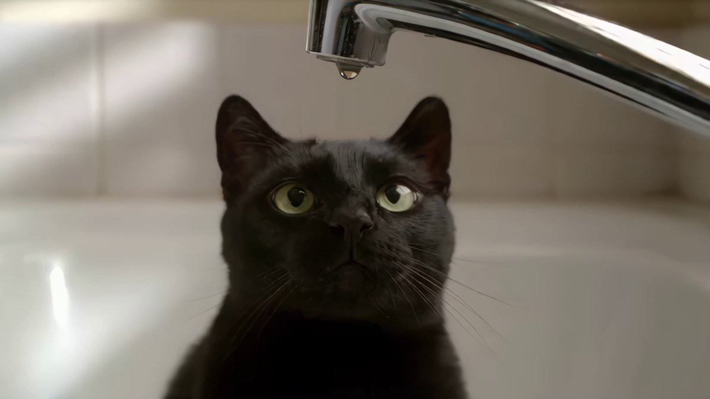

**พรอมต์**

```text
เขากะพริบตาหนึ่งครั้งอย่างช้าๆ และไม่ขยับเขยื้อน
```

[↑ กลับสู่หมวดหมู่](#catalog)

---

<a name="prompt-2101519217421885874"></a>

### ข้อความคำสั่งอธิบายอย่างละเอียดถึงโฮมวิดีโอสไตล์ MiniDV ยุคต้น 2000 ของหญิงสาวชาวเกาหลีที่กำลังเลือกเสื้อผ้าที่จะสวมใส่ในห้องนอนกรุงโซลวันฝนตก พร้อมระบุไทม์สแตมป์บทพูดและภาพความยาว 30 วินาทีและสัญญาณเสียงสภาพแวดล้อมอย่างครบถ้วน

ผู้เขียน：[@iamahmedfaraz66](https://x.com/iamahmedfaraz66) · [โพสต์ต้นฉบับ](https://x.com/iamahmedfaraz66/status/2101519217421885874)

ตัวละคร · เผยแพร่แล้ว

**สรุป:** ข้อความคำสั่งอธิบายอย่างละเอียดถึงโฮมวิดีโอสไตล์ MiniDV ยุคต้น 2000 ของหญิงสาวชาวเกาหลีที่กำลังเลือกเสื้อผ้าที่จะสวมใส่ในห้องนอนกรุงโซลวันฝนตก พร้อมระบุไทม์สแตมป์บทพูดและภาพความยาว 30 วินาทีและสัญญาณเสียงสภาพแวดล้อมอย่างครบถ้วน

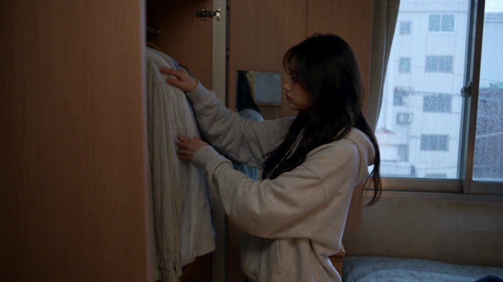

**พรอมต์**

```text
ตัวแบบหลัก: หญิงสาวชาวเกาหลีอายุ 24 ปี มีเสน่ห์อย่างเป็นธรรมชาติ ผิวพรรณดูสมจริง แต่งหน้าบางเบา ผมยาวสีเข้มปล่อยสลวยแบบหลวมๆ สวมชุดลำลองใส่สบายอยู่บ้านขณะกำลังเตรียมตัว รักษาอัตลักษณ์ ลักษณะใบหน้า ทรงผม สัดส่วนรูปร่าง และรูปลักษณ์ที่แท้จริงของเธอไว้ตลอดทั้งคลิป

สถานที่: ห้องนอนในอพาร์ตเมนต์เก่าขนาดเล็กในกรุงโซล ช่วงเช้าตรู่ที่มืดครึ้มและมีฝนตก ตู้เสื้อผ้าเปิดอยู่ โต๊ะเครื่องแป้งไม้เรียบง่าย กระจกบานเล็ก เสื้อผ้าที่พับไว้ กระเป๋าสะพายไหล่ผ้าแคนวาส และหน้าต่างที่มีหยดน้ำฝนเกาะมองออกไปเห็นตึกอพาร์ตเมนต์ข้างเคียงที่พร่ามัว ฝนตกสม่ำเสมออยู่ข้างนอก

แสงและบรรยากาศ: บรรยากาศอบอุ่นสลัวๆ ในช่วงเวลาบลูอาวเออร์ แสงสีฟ้าอมเทาเย็นๆ จากหน้าต่างที่มีฝนตกผสมผสานกับโคมไฟหัวเตียงโทนอุ่นที่สลัว ท้องฟ้ามืดครึ้มมีเมฆมาก สีสันหม่นลง เงาฟุ้งนุ่มนวล และภายในห้องได้รับแสงน้อยเล็กน้อย (underexposed) บรรยากาศเช้าวันฝนตกที่เงียบสงบ งัวเงีย และเป็นกันเอง

สไตล์: โฮมวิดีโอ Sony MiniDV ช่วงต้นยุค 2000 ที่สมจริงเป็นพิเศษ ถ่ายทำโดยบุคคลอื่นที่ถือกล้องวิดีโอ เป็นธรรมชาติอย่างแท้จริงและไม่ได้จัดฉาก เหมือนสมาชิกในครอบครัวกำลังถือกล้องถ่ายเธออย่างไม่เป็นทางการขณะที่เธอกำลังเตรียมตัว การเคลื่อนไหวของกล้องถือมืออย่างเป็นธรรมชาติ มีการสั่นไหวเล็กน้อยตามมือมนุษย์ การจัดเฟรมที่ไม่สมบูรณ์แบบ การปรับเฟรมอย่างนุ่มนวล การค้นหาโฟกัสอัตโนมัติ (autofocus hunting) เป็นบางครั้ง การเปลี่ยนค่าการเปิดรับแสงเล็กน้อย สีซีดจาง คอนทราสต์นุ่มนวล การบีบอัดไฟล์แบบ DV แท้ๆ สัญญาณรบกวนดิจิทัล (noise) เล็กน้อยในที่แสงน้อยและเสียงรบกวนของไมโครโฟน การเคลื่อนไหวในเวลาจริงอย่างราบรื่นต่อเนื่องตลอดทั้งคลิป ไม่มีการกระตุก การสะดุด เฟรมข้าม เฟรมซ้ำ ลักษณะแบบสต็อปโมชัน ภาพเบลอจากการเคลื่อนไหวมากเกินไป การเปลี่ยนความเร็ว หรือลักษณะเฟรมเรตต่ำ ไม่มีการใช้ระบบกันสั่นหรือการเคลื่อนไหวแบบภาพยนตร์สมัยใหม่

00:00–00:04: เธอยืนอย่างงัวเงียอยู่หน้าตู้เสื้อผ้าที่เปิดอยู่ มองดูเสื้อผ้าหลายตัวที่แขวนอยู่ เธอหยิบเสื้อเชิ้ตโอเวอร์ไซส์เรียบๆ ออกมาหนึ่งตัวแล้วทาบกับตัวเธอขณะมองไปที่กระจก

00:04–00:08: เธอเปลี่ยนใจ เก็บตัวนั้นกลับเข้าไปแล้วดึงเสื้อเชิ้ตอีกตัวออกมา เธอทาบตัวที่สองกับตัวเองและพินิจดูเงาสะท้อนของเธอด้วยสีหน้าครุ่นคิด

00:08–00:12: เธอมองสลับไปมาระหว่างเสื้อเชิ้ตสองตัว โดยถือไว้คนละมือ เธอเหลือบมองมาทางกล้องวิดีโอพร้อมรอยยิ้มเล็กๆ ที่ไม่แน่ใจ ราวกับกำลังถามอย่างเงียบๆ ว่าควรใส่ตัวไหนดี

00:12–00:16: เธอวางเสื้อเชิ้ตทั้งสองตัวลงบนเตียงแล้วนั่งลงครู่หนึ่ง เธอมองไปทางหน้าต่างที่มีฝนตก ฟังเสียงฝน แล้วหันกลับมามองที่เสื้อผ้า

00:16–00:20: เธอหยิบเสื้อเชิ้ตตัวหนึ่งขึ้นมาอีกครั้งแล้วยืนหน้ากระจก ทาบกับตัวเองคร่าวๆ จากมุมต่างๆ เธอหมุนตัวไปทางซ้ายและขวาเล็กน้อยเพื่อดูว่าดูเป็นอย่างไร

00:20–00:24: ในที่สุดเธอก็ดูพอใจ เธอแขวนเสื้อเชิ้ตอีกตัวกลับเข้าไปในตู้เสื้อผ้า และพับเสื้อเชิ้ตตัวที่เลือกพาดไว้บนแขนอย่างเรียบร้อย

00:24–00:27: เธอสังเกตเห็นเสื้อแจ็กเก็ตน้ำหนักเบาแขวนอยู่ใกล้ๆ จึงหยุดชะงักและพิจารณาเสื้อตัวนั้นด้วย เธอสัมผัสแจ็กเก็ต จากนั้นมองออกไปข้างนอกที่สายฝนผ่านหน้าต่าง

00:27–00:30: เธอตัดสินใจหยิบแจ็กเก็ตไปด้วย เธอมองไปที่กล้องวิดีโอด้วยรอยยิ้มพึงพอใจเล็กๆ หยิบกระเป๋าสะพายไหล่ผ้าแคนวาสแล้วเดินออกจากห้องนอน กล้องติดตามเธอไปสองสามก้าวอย่างเป็นกันเองก่อนจะตัดภาพ

เสียง: เสียงบรรยากาศสดจากสถานที่เท่านั้น ได้แก่ เสียงฝนกระทบหน้าต่างอย่างสม่ำเสมอ เสียงเสื้อผ้าเสียดสี เสียงเลื่อนประตูตู้เสื้อผ้า เสียงฝีเท้าเบาๆ การเคลื่อนไหวของผืนผ้า เสียงการจราจรแผ่วๆ ในระยะไกล และบรรยากาศอพาร์ตเมนต์ที่เงียบสงบ ไม่มีดนตรี การบรรยาย หรือเอฟเฟกต์เสียงเพิ่มเติม

เป้าหมาย: ให้ความรู้สึกเหมือนฟุตเทจครอบครัวธรรมดาๆ ความยาว 30 วินาทีในต้นยุค 2000 มากกว่าวิดีโอแฟชั่นที่มีการจัดโครงสร้าง เรื่องราวเป็นเพียงแค่การที่เธอค่อยๆ ตัดสินใจว่าจะใส่อะไรในเช้าวันฝนตก การหยุดชะงักสั้นๆ ความลังเล และการเคลื่อนไหวที่เป็นกันเองควรทำให้รู้สึกเป็นธรรมชาติ ใกล้ชิด และสมจริง

คุณภาพการเคลื่อนไหว: รักษาให้ทุกการกระทำราบรื่น ต่อเนื่อง และสมจริงตามหลักกายภาพ ให้เวลาเพียงพอสำหรับการเคลื่อนไหวแต่ละครั้งอย่างเป็นธรรมชาติ หลีกเลี่ยงการตัดต่อที่รวดเร็วหรือการบีบอัดการกระทำ กล้องถือมือควรเลื่อนลอยและปรับเฟรมอย่างนุ่มนวลเหมือนคนจริงๆ ถ่ายอย่างไม่เป็นทางการ ไม่มีการกระตุก สะดุด เฟรมข้าม เฟรมซ้ำ หรือลักษณะเฟรมเรตต่ำ รูปลักษณ์ย้อนยุคควรมาจากเอกลักษณ์เฉพาะของ MiniDV แท้ๆ เท่านั้น ไม่ใช่มาจากการเคลื่อนไหวที่ไม่ต่อเนื่อง
```

[↑ กลับสู่หมวดหมู่](#catalog)

---

<a name="prompt-2101148067458347258"></a>

### ข้อความคำสั่งสำหรับแอนิเมชัน 8 วินาทีจากบอร์ดอินโฟกราฟิกชุดแต่งกาย กำหนดให้นางแบบและกล่องไอเทมเสื้อผ้าแต่ละชิ้นหมุน 360 องศาไปพร้อมกันเพื่อจัดแสดง

ผู้เขียน：[@AIwithkhan](https://x.com/AIwithkhan) · [โพสต์ต้นฉบับ](https://x.com/AIwithkhan/status/2101148067458347258)

อินโฟกราฟิก / ภาพประกอบเพื่อการศึกษา · อินฟลูเอนเซอร์ / นางแบบ · ไอเทมแฟชั่น · เผยแพร่แล้ว

**สรุป:** ข้อความคำสั่งสำหรับแอนิเมชัน 8 วินาทีจากบอร์ดอินโฟกราฟิกชุดแต่งกาย กำหนดให้นางแบบและกล่องไอเทมเสื้อผ้าแต่ละชิ้นหมุน 360 องศาไปพร้อมกันเพื่อจัดแสดง


**พรอมต์**

```text
สร้างแอนิเมชันอินโฟกราฟิกแฟชั่นระดับพรีเมียมที่ดูสะอาดตาความยาว 8 วินาที โดยอิงจากเลย์เอาต์บอร์ดชุดแต่งกาย องค์ประกอบทั้งหมดจะยังคงมองเห็นได้บนพื้นหลังสีขาวสไตล์มินิมอล นางแบบทางด้านขวาเริ่มหมุน 360° อย่างราบรื่นบนแกนแนวตั้งของเธอ ราวกับแท่นหมุนโชว์สินค้าแฟชั่น การเคลื่อนไหวของเธอดูสง่างามและต่อเนื่อง โดยยังคงรักษาท่วงท่าที่เป็นธรรมชาติและฟิสิกส์ของเนื้อผ้าที่สมจริง เส้นผม สายกระโปรง และเครื่องประดับตอบสนองต่อการเคลื่อนไหวอย่างประณีต ในเวลาเดียวกันทุกประการ ไอเทมทุกชิ้นที่แสดงอยู่ภายในกล่องที่มีหมายเลขกำกับจะหมุนไปพร้อมกันอย่างสอดคล้อง: สร้อยคอหมุนอย่างช้าๆ ในรูปแบบ 3 มิติ เผยให้เห็นมิติความลึกของสายโซ่และรายละเอียดของจี้ โบว์ติดผมหมุนอย่างสง่างามรอบจุดศูนย์กลาง เครื่องเล่นเกมพกพาหมุนรอบแกนแนวตั้งเหมือนในโฆษณาสินค้า มินิสเกิร์ตคาร์โก้หมุน 360° เพื่อแสดงมุมมองด้านหน้า ด้านข้าง และด้านหลัง รองเท้าบู้ทส้นตึกหมุนไปด้วยกันราวกับการเรนเดอร์จัดแสดงสินค้าระดับหรู เสื้อเปิดไหล่สีดำหมุนอย่างราบรื่นเพื่อเผยให้เห็นรูปทรงเสื้อผ้าแบบเต็มตัว ไอเทมทั้งหมดหมุนเสร็จสมบูรณ์พร้อมกันอย่างสมบูรณ์แบบตามความเร็วการหมุนของนางแบบ กล่อง ตัวเลข ตัวอักษร และเลย์เอาต์ยังคงอยู่กับที่โดยมีเพียงตัวสินค้าเท่านั้นที่หมุนอยู่ภายในกรอบ กล้องส่วนใหญ่ยังคงอยู่นิ่งพร้อมการดันมุมกล้องเข้าอย่างประณีตแบบภาพยนตร์ แสงไฟสตูดิโอที่นุ่มนวล เงาที่สมจริง ความงามสไตล์โฆษณาแฟชั่นเชิงพาณิชย์ที่สะอาดตา รายละเอียดคมชัดเป็นพิเศษ โมชันกราฟิกเกรดพรีเมียม การผ่อนความเร็วอย่างนุ่มนวล การนำเสนอแบบแคตตาล็อกหรูหรา 4K, 60fps
```

[↑ กลับสู่หมวดหมู่](#catalog)

---

<a name="prompt-2101462342265389125"></a>

### กำลังแปล

ผู้เขียน：[@IronEntrepreneu](https://x.com/IronEntrepreneu) · [โพสต์ต้นฉบับ](https://x.com/IronEntrepreneu/status/2101462342265389125)

อื่น ๆ · เผยแพร่แล้ว

**สรุป:** กำลังแปล

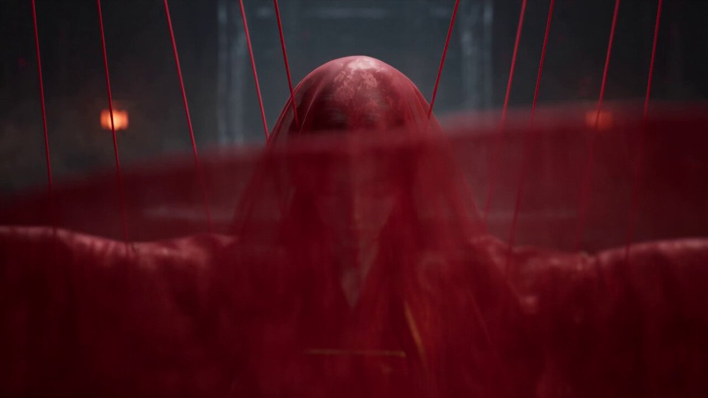

**พรอมต์**

```text
กำลังแปล
```

[↑ กลับสู่หมวดหมู่](#catalog)

---

<a name="prompt-2101457329401057421"></a>

### ช็อตภาพจากโดรนบินผ่านทุ่งหญ้าและภูเขา

ผู้เขียน：[@SomebodyisEscip](https://x.com/SomebodyisEscip) · [โพสต์ต้นฉบับ](https://x.com/SomebodyisEscip/status/2101457329401057421)

ทิวทัศน์ / ธรรมชาติ · เผยแพร่แล้ว

**สรุป:** ช็อตภาพจากโดรนบินผ่านทุ่งหญ้าและภูเขา

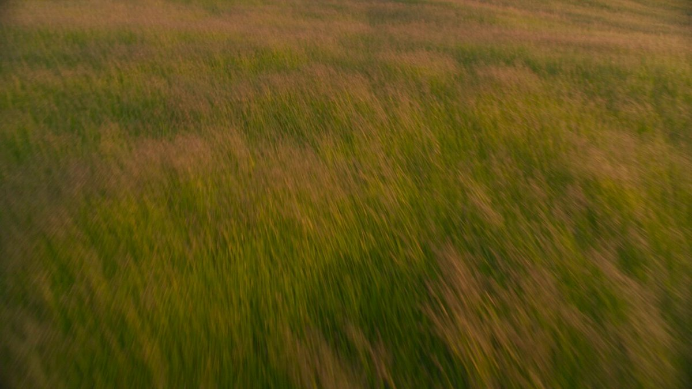

**พรอมต์**

```text
-โดรนบินผ่านทุ่งหญ้า
-โดรนบินผ่านภูเขา
```

[↑ กลับสู่หมวดหมู่](#catalog)

---

<a name="prompt-2101430744195428713"></a>

### เต็นท์เปลญวนที่ขึงอยู่ระหว่างต้นไม้สองต้นในป่าที่มีฝนตกและหมอกลงจัด

ผู้เขียน：[@0xKarmi](https://x.com/0xKarmi) · [โพสต์ต้นฉบับ](https://x.com/0xKarmi/status/2101430744195428713)

ทิวทัศน์ / ธรรมชาติ · เผยแพร่แล้ว

โพสต์ต้นฉบับ：[@ridark\_eth](https://x.com/ridark_eth) · [โพสต์ต้นฉบับ](https://x.com/ridark_eth/status/2100972106586439809)

**สรุป:** เต็นท์เปลญวนที่ขึงอยู่ระหว่างต้นไม้สองต้นในป่าที่มีฝนตกและหมอกลงจัด

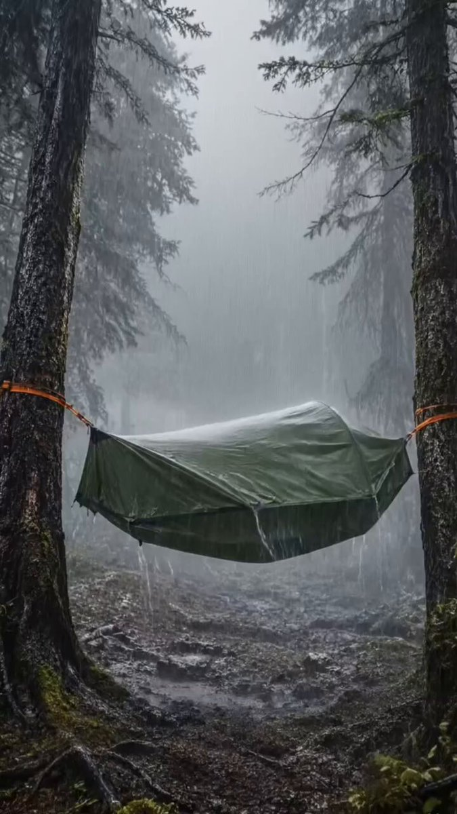

**พรอมต์**

```text
เต็นท์เปลญวนที่ขึงอยู่ระหว่างต้นไม้สองต้นในป่าที่มีฝนตกและหมอกลงจัด มีเม็ดฝนตกลงกระทบผืนผ้า
```

[↑ กลับสู่หมวดหมู่](#catalog)

---

<a name="prompt-2101176910244139187"></a>

### ใช้ Image1 เป็นข้อมูลอ้างอิงสำหรับสตรีมเมอร์ HANEUL สร้างไลฟ์สตรีมเกมเพลย์แอ็กชันอาชญากรรมความยาว 30 วินาทีแบบเทคเดียวไม่ตัดต่อ อัตราส่วน 16:9 แสดงการปล้นห้องนิรภัยของธนาคาร การยิงปะทะกับการ์ด และการขับรถหลบหนี พร้อมโอเวอร์เลย์กล้องสตรีมเมอร์, HUD และแชตที่เลื่อนอย่างต่อเนื่อง

ผู้เขียน：[@doctorwasif](https://x.com/doctorwasif) · [โพสต์ต้นฉบับ](https://x.com/doctorwasif/status/2101176910244139187)

อื่น ๆ · เผยแพร่แล้ว

**สรุป:** ใช้ Image1 เป็นข้อมูลอ้างอิงสำหรับสตรีมเมอร์ HANEUL สร้างไลฟ์สตรีมเกมเพลย์แอ็กชันอาชญากรรมความยาว 30 วินาทีแบบเทคเดียวไม่ตัดต่อ อัตราส่วน 16:9 แสดงการปล้นห้องนิรภัยของธนาคาร การยิงปะทะกับการ์ด และการขับรถหลบหนี พร้อมโอเวอร์เลย์กล้องสตรีมเมอร์, HUD และแชตที่เลื่อนอย่างต่อเนื่อง

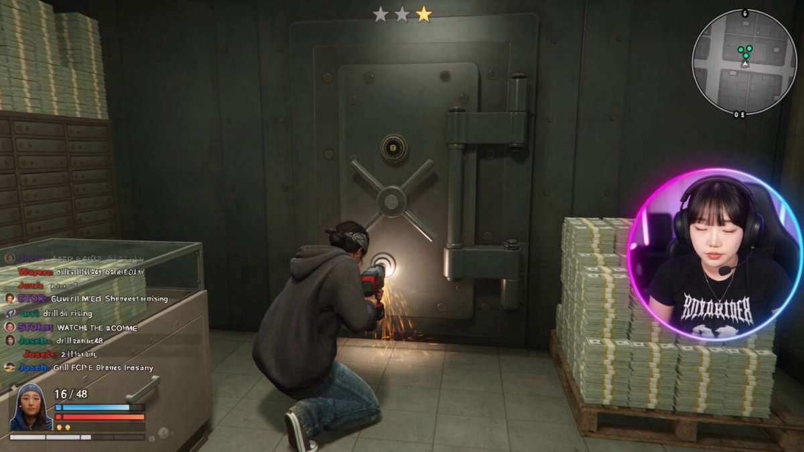

**พรอมต์**

```text
ใช้ Image1 เป็นข้อมูลอ้างอิงที่มีความสำคัญสูงสุดสำหรับ HANEUL รักษาสัดส่วน โทนสีผิว ผมสั้นหน้าม้าตรงสีดำ รอยเจาะ รูปร่าง ชุด อุปกรณ์เสริม แสง มุมกล้อง และการจัดฉากสตรีมมิ่งจริงของเธอไว้อย่างแม่นยำ เธอต้องดูเหมือนหญิงสาวชาวเกาหลีตัวจริงคนเดิม ไม่ผ่านการสไตล์ลิสต์ ไม่ดูเป็นพลาสติก อนิเมะ 3D ซ้ำซ้อน หรือสลับใบหน้า

สร้างการจำลองไลฟ์สตรีมเกมเพลย์แนวแอ็กชันอาชญากรรมแบบโอเพ่นเวิลด์สมจริง ความยาว 30 วินาทีพอดี อัตราส่วน 16:9 ความละเอียด 1080p โดยมีเฉพาะตัวละคร/ยานพาหนะ/ฉากที่สมมติขึ้นเท่านั้น เป็นการถ่ายทำแบบช็อตเดียวต่อเนื่องไม่ตัดต่อ ไม่มีการคัต การเปลี่ยนฉาก การเปลี่ยนซีน ซับไตเติิล เสียงบรรยาย หรือกล้องสตรีมเมอร์แบบเต็มจอ

เลย์เอาต์คงที่: เกมเพลย์ตลอดทั้งคลิป; กล้องสตรีมเมอร์สี่เหลี่ยมจัตุรัส 1:1 นีออนชมพู-ฟ้าที่มุมล่างขวา ไม่มีการเคลื่อนที่หรือปรับขนาด; มีเฉพาะ HANEUL ในกล้องสตรีมเมอร์ แชตเลื่อนภาษาอังกฤษล้วนที่มุมล่างซ้ายพร้อมชื่อผู้ใช้: orri, Joseph, New York Robots, Christopher Clark, Wavers, STOK, Andrea Brown. HUD คงที่: เลือด/เกราะที่มุมล่างซ้าย, อาวุธ + กระสุนข้างกล้องสตรีมเมอร์, ตัวนับเงิน, แผนที่ย่อมุมบนขวาพร้อมเส้นทาง GPS + จุดสีแดงแสดงการ์ด 2 จุดพอดี, ดาวระดับการประกาศจับตรงกลางด้านบน

เกมเพลย์: ผู้เล่นหญิงหนึ่งคนใส่เสื้อฮู้ด/กางเกงยีนส์สีเข้มพร้อมผ้าพันคอ, ปืนพกขนาดกะทัดรัด, รปภ. ในเครื่องแบบสีกรมท่าติดอาวุธ 2 คนพอดี ไม่มีตัวละครติดอาวุธอื่น รถตำรวจในฉากหลังปรากฏเฉพาะช่วงหลบหนี ผู้เล่นได้รับความเสียหายจริงและพลังชีวิตเหลือน้อยอย่างต่อเนื่อง

0–5 วินาที: ย่อตัวอยู่ในห้องนิรภัยขณะที่สว่านเจาะเสร็จ มีสะเก็ดไฟ; 0 ดาว HANEUL ลืมตาอย่างชัดเจน/มีสมาธิ กะพริบตาอย่างเป็นธรรมชาติเท่านั้น ภาษาเกาหลี: “Come on... almost through.” แชต: “orri: drill % rising”, “Joseph: keep it quiet.”

5–11 วินาที: ตู้เซฟเปิดออก → คว้าเงินสด → สัญญาณเตือนภัยกะพริบ → ยามสองคนเข้ามาใกล้และยิง ผู้เล่นถูกยิงเฉี่ยวอย่างเห็นได้ชัด สะดุ้ง เลือดลด ระดับการประกาศจับกลายเป็น 1 ดาว HANEUL เบิกตากว้างอย่างตกใจ อ้าปากค้าง ยกมือขึ้นครู่หนึ่ง ภาษาเกาหลี: “Whoa, they found us!” แชต: “STOK: GUARDS INCOMING”, “Andrea Brown: SHE GOT HIT”.

11–19 วินาที: การยิงต่อสู้อย่างดุเดือดไม่คิดชีวิต HANEUL กลับมาควบคุมคีย์บอร์ด/เมาส์อย่างบ้าคลั่งทันที ตาเบิกกว้าง ผู้เล่นยิงด้วยมือเดียวขณะถือเงิน; ยามพยายามโอบล้อม/ยิงอย่างกระตือรือร้น; กระจกแตก กล่องโลหะบุบ ผู้เล่นเข้าที่กำบังและยิงตอบโต้ กระสุน: 16/48 → 10/48, ระดับการประกาศจับ 2 ดาว ภาษาเกาหลี: “Don't die! Get them off me!” แชตเลื่อนอย่างรวดเร็ว: “Joseph: WATCH THE PILLAR GUY”, “orri: 2 stars already”, “Wavers: FINISH THEM AND RUN”.

19–23 วินาที: ผู้เล่นยิง 4 นัดเด็ดขาดพอดี แต่ละนัดแสดงปฏิกิริยาการโดนยิงชัดเจน: ยามคนแรกโดนยิง คนที่สองโดนยิง คนแรกล้มลง คนที่สองซวนเซแล้วล้มลง กระสุน: 10/48 → 8/48 → 6/48 → 4/48 ยามทั้งสองยังคงนอนราบอยู่ แชต: “STOK: BOTH GUARDS DOWN”, “Andrea Brown: GRAB THE REST AND GO”.

23–30 วินาที: ผู้เล่นคว้าเงินก้อนสุดท้าย วิ่งไปที่ตรอก ขึ้นรถหลบหนี เปลี่ยนมุมกล้องเป็นมุมมองไล่ตามด้านหลังอย่างราบรื่นโดยไม่มีการคัต รถตำรวจสองคันไล่ล่า รถเฉี่ยวถังขยะ เลี้ยวตัดกระแสจราจรทำให้ตำรวจชะลอ เข้าสู่ถนนใหญ่ที่พลุกพล่าน เลือดยังกะพริบสีแดง ระดับการประกาศจับยังคงเป็น 2 ดาว เงินยังคงเพิ่มขึ้น HANEUL โน้มตัวไปข้างหน้า ตาเห็นชัดเจนและตึงเครียด ขับรถไปพร้อมจับเมาส์/ปุ่มควบคุมแน่น ภาษาเกาหลี: “Go, go! We got it, just get us out — we're not clear yet!” แชต: “New York Robots: LOSE THE COPS”, “Christopher Clark: stars haven't dropped”. เฟรมสุดท้ายยังคงติดสถานะต้องการตัวพร้อมไฟตำรวจด้านหลัง; ไม่มีการถูกจับ ความตาย ข้อความหนีรอดปลอดภัย หรือไตเติิลจบ

สิ่งจำเป็นเด็ดขาด: มี HANEUL 1 คนพอดี, ผู้เล่น 1 คน, ยาม 2 คน; ไม่มีการทำซ้ำ; ไม่มีการเปลี่ยนอาวุธ; ยามติดอาวุธตลอดเวลา; ปฏิกิริยาของเกมเพลย์/กล้องสตรีมเมอร์ตรงกันอย่างสมจริง; ไม่หลับตานานเกินไป; ไม่มีเลือดสาดสยองขวัญ; ดาวประกาศจับยังคงอยู่จนถึงเฟรมสุดท้าย
```

[↑ กลับสู่หมวดหมู่](#catalog)

---

<a name="prompt-2101300251508494611"></a>

### กำลังแปล

ผู้เขียน：[@AIwithSarah\_](https://x.com/AIwithSarah_) · [โพสต์ต้นฉบับ](https://x.com/AIwithSarah_/status/2101300251508494611)

การออกแบบแอป / เว็บ · ตัวละคร · เผยแพร่แล้ว

**สรุป:** กำลังแปล

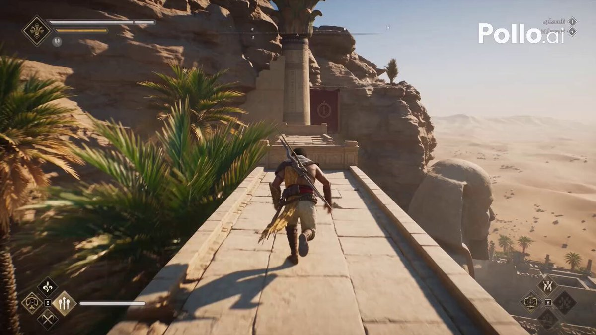

**พรอมต์**

```text
กำลังแปล
```

[↑ กลับสู่หมวดหมู่](#catalog)

---

<a name="prompt-2101163963421708290"></a>

### กำลังแปล

ผู้เขียน：[@Chengzilhy](https://x.com/Chengzilhy) · [โพสต์ต้นฉบับ](https://x.com/Chengzilhy/status/2101163963421708290)

คอมิก / สตอรี่บอร์ด · ไอเทมแฟชั่น · เผยแพร่แล้ว

**สรุป:** กำลังแปล

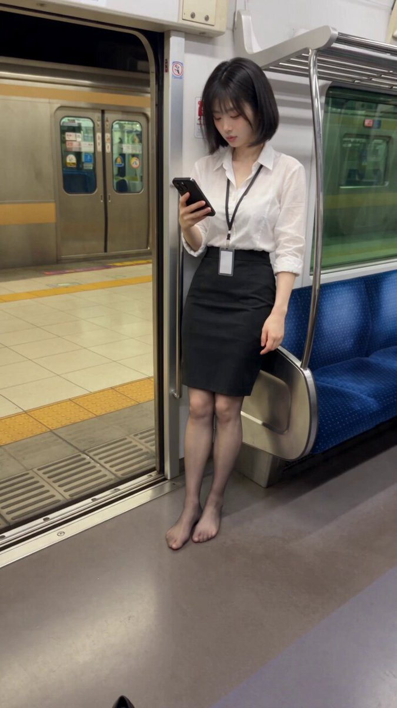

**พรอมต์**

```text
กำลังแปล
```

[↑ กลับสู่หมวดหมู่](#catalog)

---

<a name="prompt-2101133453706359225"></a>

### ลูกแพะแสนน่ารักกระโดดดึ๋งๆ และเล่นอย่างสนุกสนานในหิมะหนาในชนบท

ผู้เขียน：[@Zarnab\_with\_Ai](https://x.com/Zarnab_with_Ai) · [โพสต์ต้นฉบับ](https://x.com/Zarnab_with_Ai/status/2101133453706359225)

อื่น ๆ · เผยแพร่แล้ว

**สรุป:** ลูกแพะแสนน่ารักกระโดดดึ๋งๆ และเล่นอย่างสนุกสนานในหิมะหนาในชนบท

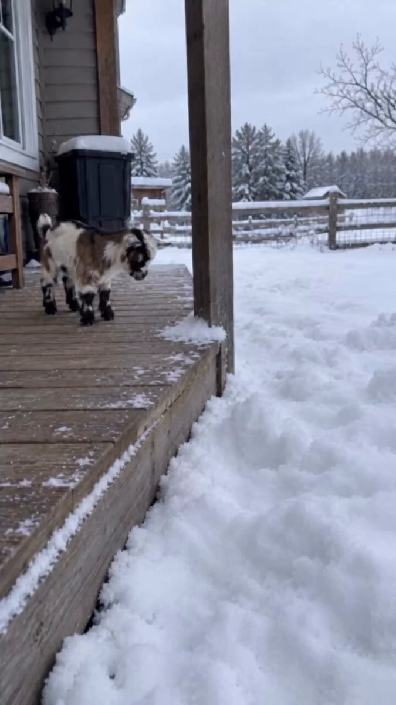

**พรอมต์**

```text
ลูกแพะแสนน่ารักกำลังเล่นอย่างมีความสุขในทุ่งหิมะฤดูหนาว ท่ามกลางหิมะสีขาวนุ่มฟูที่ทับถมกันหนา ลูกแพะเดินลุยหิมะและตะเกียกตะกายอย่างน่ารักน่าเอ็นดูเมื่อหิมะสูงถึงลำตัว จากนั้นก็กระโดดโลดเต้นอย่างขี้เล่นและกระโดดดึ๋งๆ ไปตามหิมะด้วยความตื่นเต้น ในบางครั้งมันจะมองตรงมาที่กล้องด้วยแววตาอยากรู้อยากเห็นและร่าเริง มีรั้วไม้ชนบทและต้นไม้ที่ปกคลุมด้วยหิมะปรากฏในฉากหลัง สร้างบรรยากาศฤดูหนาวในชนบทที่เงียบสงบ

ภาพถ่ายสัตว์ป่าที่สมจริงเป็นพิเศษ, แสงธรรมชาติ, แสงสว่างในวันฤดูหนาวที่มีเมฆครึ้มอย่างนุ่มนวล, พื้นผิวหิมะที่สมจริง, ขนที่มีรายละเอียดชัดเจน, การเคลื่อนไหวของสัตว์ตามธรรมชาติ, ให้ความรู้สึกเหมือนถ่ายด้วยกล้องสมาร์ทโฟนแบบถือด้วยมืออย่างนุ่มนวล, องค์ประกอบภาพแนวตั้ง 9:16, ระยะชัดลึกแบบภาพยนตร์, ช่วงเวลาแคนดิดที่แท้จริง, มีรายละเอียดสูง, สมจริงดั่งภาพถ่าย, 4K, ไม่มีข้อความ, ไม่มีลายน้ำ
```

[↑ กลับสู่หมวดหมู่](#catalog)

---

<a name="prompt-2101156829896290702"></a>

### โฮมวิดีโอ MiniDV ช่วงต้นยุค 2000 ความยาว 15 วินาที ของหญิงสาวชาวเกาหลีที่สะดุดผ้าห่มซ้ำแล้วซ้ำเล่าในห้องนอนที่โซลในวันฝนตก

ผู้เขียน：[@iamahmedfaraz66](https://x.com/iamahmedfaraz66) · [โพสต์ต้นฉบับ](https://x.com/iamahmedfaraz66/status/2101156829896290702)

ตัวละคร · เผยแพร่แล้ว

**สรุป:** โฮมวิดีโอ MiniDV ช่วงต้นยุค 2000 ความยาว 15 วินาที ของหญิงสาวชาวเกาหลีที่สะดุดผ้าห่มซ้ำแล้วซ้ำเล่าในห้องนอนที่โซลในวันฝนตก

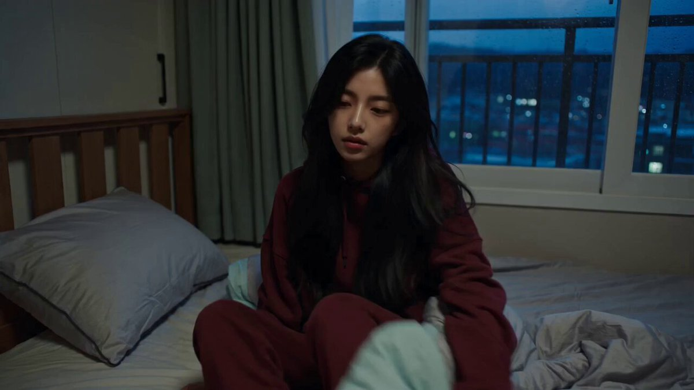

**พรอมต์**

```text
โฮมวิดีโอ Sony MiniDV ช่วงต้นยุค 2000 ความยาว 15 วินาที สมจริงเป็นพิเศษ ถ่ายแบบสบายๆ โดยบุคคลอื่น ตัวแบบ: หญิงสาวชาวเกาหลี วัย 24 ปี มีเสน่ห์อย่างเป็นธรรมชาติ ผิวดูสมจริง แต่งหน้าน้อยมาก ปล่อยผมยาวสีเข้มแบบสบายๆ สวมเสื้อฮู้ดโอเวอร์ไซส์สีแดงมารูนและกางเกงลำลองทรงหลวม สะพายกระเป๋าผ้าแคนวาสแบบเรียบง่าย คงอัตลักษณ์ รูปร่างหน้าตา ทรงผม สัดส่วนรูปร่าง และลักษณะภายนอกของเธอให้ตรงตามนี้อย่างเคร่งครัดตลอดทั้งคลิป สถานที่และบรรยากาศ: อพาร์ตเมนต์เก่าหลังเล็กในกรุงโซลในเช้าตรู่ที่มืดครึ้มและฝนตก ห้องนอนแสนอบอุ่นเชื่อมต่อกับทางเข้าขนาดเล็ก เตียงเรียบง่ายพร้อมผ้าห่มนุ่ม เฟอร์นิเจอร์ไม้ หน้าต่างที่มีคราบน้ำฝนมองออกไปเห็นอาคารอพาร์ตเมนต์ข้างเคียงที่เบลออยู่ด้านนอก บรรยากาศช่วงบลูอาวร์ที่มืดสลัว แสงสีฟ้าอมเทาเย็นๆ จากหน้าต่างที่ฝนตกผสมผสานกับแสงไฟอุ่นๆ อ่อนๆ ภายในห้อง สีหม่นลง เงาที่นุ่มนวล สภาพแวดล้อมโดยรอบมีแสงน้อยเล็กน้อย (underexposed) ฝนตกคงที่ด้านนอก บรรยากาศเงียบสงบ ง่วงเหงา และเป็นกันเอง สไตล์: ฟุตเทจโฮมวิดีโอ Sony MiniDV แท้ๆ ในช่วงต้นยุค 2000 ถ่ายโดยบุคคลอื่น เป็นธรรมชาติอย่างสมบูรณ์แบบและไม่มีการจัดฉาก การเคลื่อนไหวของกล้องแบบถือด้วยมืออย่างเป็นธรรมชาติ กล้องสั่นไหวเล็กน้อย การจัดเฟรมที่ไม่สมบูรณ์แบบ การปรับเฟรมอย่างนุ่มนวล การหาโฟกัสของออโต้โฟกัสเป็นระยะ การเปลี่ยนระดับการรับแสงเล็กน้อย สีสันที่ซีดจาง คอนทราสต์ที่นุ่มนวล การบีบอัดแบบ DV ของแท้ สัญญาณรบกวนดิจิทัลในที่แสงน้อยและเสียงนอยส์จากไมโครโฟนเล็กน้อย การเคลื่อนไหวแบบเรียลไทม์ที่ต่อเนื่องและราบรื่นตลอดทั้งคลิป ไม่มีอาการสะดุด กระตุก ข้ามเฟรม เฟรมซ้ำ ลักษณะแบบสต็อปโมชัน ภาพเบลอจากการเคลื่อนไหวที่มากเกินไป การเปลี่ยนความเร็ว ลักษณะอัตราเฟรมต่ำ การกันสั่น หรือการเคลื่อนไหวแบบภาพยนตร์สมัยใหม่ 00:00–00:04: เธอนั่งอยู่ที่ขอบเตียง ดูง่วงนอนและสะลึมสะลือเล็กน้อย สวมเสื้อฮู้ดโอเวอร์ไซส์สีแดงมารูนและกางเกงลำลองทรงหลวม เธอลุกขึ้นยืนและเอื้อมมือไปหยิบกระเป๋าผ้าแคนวาสใกล้กับประตู 00:04–00:07: เธอเดินสองสามก้าวไปยังประตู แต่ผ้าห่มยังคงพันหลวมๆ อยู่รอบข้อเท้าข้างหนึ่ง มันค่อยๆ ดึงเท้าของเธอไปข้างหลัง เธอหยุดและก้มมองลงมาด้วยความสับสน 00:07–00:10: เธอพยายามก้าวไปอีกก้าว ผ้าห่มติดขัดอีกครั้งและเลื่อนไปตามพื้นพร้อมกับตัวเธอ เธอก้มมองมันด้วยสีหน้าหงุดหงิดเล็กน้อย จากนั้นก้มลงและพยายามปลดข้อเท้าของเธอให้เป็นอิสระ 00:10–00:12: ในที่สุดเธอก็เอาเท้าออกมาได้ ยืนขึ้นและก้าวอย่างมั่นใจหนึ่งก้าวไปยังประตู 00:12–00:15: ผ้าห่มไปเกี่ยวรอบข้อเท้าของเธออีกครั้งหนึ่งและดึงกลับเบาๆ เธอชะงักนิ่ง ก้มมองมัน จากนั้นค่อยๆ มองตรงมาที่กล้องวิดีโอด้วยสีหน้าตายสนิท หลังจากถอนหายใจเบาๆ เธอก็เตะผ้าห่มออกไปเบาๆ แล้วเดินออกไป เสียง: เสียงธรรมชาติเท่านั้น—เสียงฝนตกกระทบหน้าต่างอย่างสม่ำเสมอ บรรยากาศอพาร์ตเมนต์ที่เงียบสงบ เสียงฝีเท้าเบาๆ เสียงผ้าและผ้าห่มเสียดสีไปกับพื้น การเคลื่อนไหวของเสื้อผ้าอย่างแผ่วเบา และเสียงถอนหายใจตามธรรมชาติของเธอ ไม่มีดนตรี การบรรยาย หรือเอฟเฟกต์เสียงเพิ่มเติม เป้าหมาย: น่ารัก เข้าถึงง่าย และตลกขบขันเล็กน้อย เหมือนเช้าวันธรรมดาที่ง่วงงุนซึ่งถูกบันทึกไว้โดยบังเอิญด้วยกล้อง MiniDV ประจำครอบครัวรุ่นเก่า ความตลกขบขันควรมาจากผ้าห่มที่ปฏิเสธไม่ยอมให้เธอไปซ้ำแล้วซ้ำเล่าอย่างสิ้นเชิง การมองหน้าตายไปยังกล้องในตอนท้ายคือหมัดเด็ดทางอารมณ์ขัน คุณภาพการเคลื่อนไหว: รักษาทุกการเคลื่อนไหวให้ราบรื่น ต่อเนื่อง และสมจริงตามหลักฟิสิกส์ ผ้าห่มต้องมีพฤติกรรมที่เป็นธรรมชาติด้วยฟิสิกส์ของเนื้อผ้าที่น่าเชื่อถือและความตึงเบาๆ เมื่อเกี่ยวรอบข้อเท้าของเธอ ไม่มีการกระตุกกะทันหัน การดึงที่เกินจริง หรือการเคลื่อนไหวที่วุ่นวาย ความสวยงามแบบ MiniDV วินเทจต้องมาจากเนื้อสัมผัสของภาพ ออโต้โฟกัส พฤติกรรมการเปิดรับแสง สีที่หม่น และการถือกล้องด้วยมือ—ไม่ใช่จากการลดอัตราเฟรมหรือการเคลื่อนไหวที่กระตุก
```

[↑ กลับสู่หมวดหมู่](#catalog)

---

<a name="prompt-2100995032782446719"></a>

### ฉากแอนิเมชันจังหวะเร็วของการสู้รบระหว่างซามูไรมนุษย์กับโลกเวทมนตร์ ในสไตล์ภาพลายเส้นขยุกขยิกแบบเด็กและเท็กซ์เจอร์สีเทียนหยาบหนา

ผู้เขียน：[@teucutemsebo](https://x.com/teucutemsebo) · [โพสต์ต้นฉบับ](https://x.com/teucutemsebo/status/2100995032782446719)

อื่น ๆ · เผยแพร่แล้ว

**สรุป:** ฉากแอนิเมชันจังหวะเร็วของการสู้รบระหว่างซามูไรมนุษย์กับโลกเวทมนตร์ ในสไตล์ภาพลายเส้นขยุกขยิกแบบเด็กและเท็กซ์เจอร์สีเทียนหยาบหนา

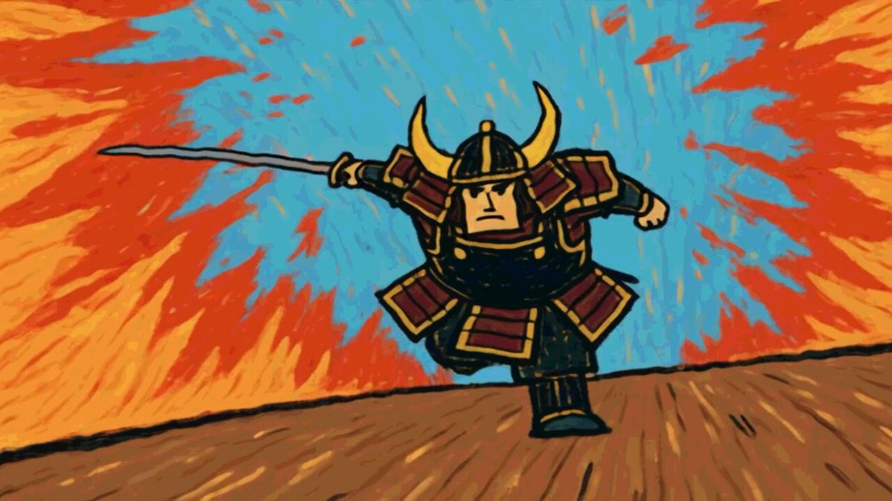

**พรอมต์**

```text
มหาสงครามสุดโกลาหลระหว่างโลกมนุษย์กับโลกเวทมนตร์ ดาบคาตานะปะทะคาถาอาคม ศพและเลือดสาดกระจาย เปลวเพลิงกลืนกินผืนแผ่นดิน มังกรยักษ์และวัวบินต่อสู้ฟาดฟันกันบนท้องฟ้า…… ฉากแอ็กชันจังหวะเร็วฉับไว

24 มุมกล้องที่แตกต่างกัน สไตล์ภาพ: เท็กซ์เจอร์สีชอล์กน้ำมัน/สีเทียนเส้นหนา เส้นขอบสีดำหนาหนัก ปาดสีทึบเรียบ ท้องฟ้าสีฟ้าสดใส เปลวไฟสีส้มแดง ให้ความรู้สึกลายเส้นขยุกขขยิกแบบไร้เดียงสา ภาพอัดแน่นไร้ระเบียบ
```

[↑ กลับสู่หมวดหมู่](#catalog)

---

<a name="prompt-2100935767270773092"></a>

### กำลังแปล

ผู้เขียน：[@john\_my07](https://x.com/john_my07) · [โพสต์ต้นฉบับ](https://x.com/john_my07/status/2100935767270773092)

การออกแบบแอป / เว็บ · เผยแพร่แล้ว

**สรุป:** กำลังแปล

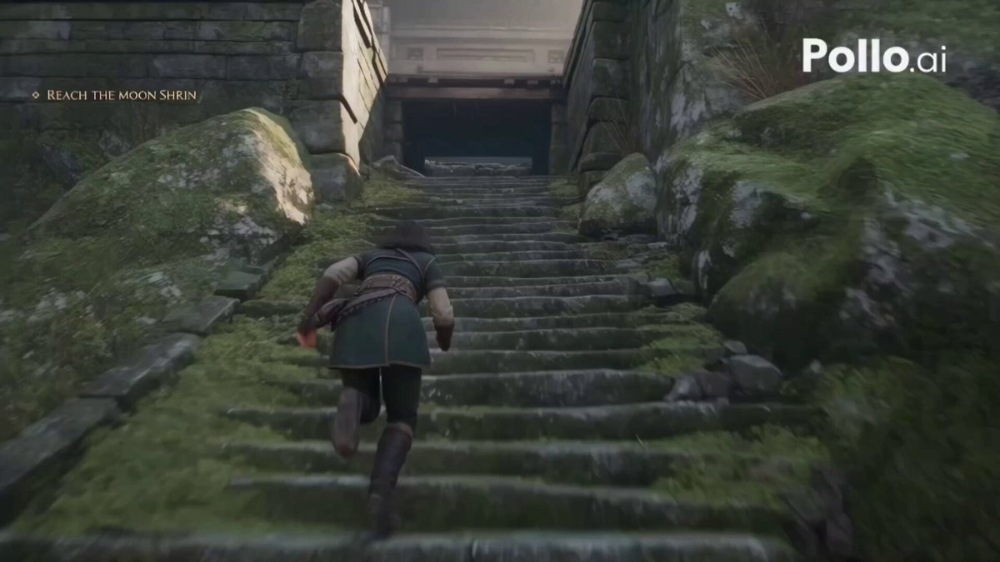

**พรอมต์**

```text
กำลังแปล
```

[↑ กลับสู่หมวดหมู่](#catalog)

---

<a name="prompt-2100814631006801988"></a>

### หญิงสาวชาวเอเชียต่อสู้และขับไล่ผู้ทำร้ายในลิฟต์มืดที่มีไฟสีแดงกะพริบ

ผู้เขียน：[@Viniai\_](https://x.com/Viniai_) · [โพสต์ต้นฉบับ](https://x.com/Viniai_/status/2100814631006801988)

ตัวละคร · เผยแพร่แล้ว

**สรุป:** หญิงสาวชาวเอเชียต่อสู้และขับไล่ผู้ทำร้ายในลิฟต์มืดที่มีไฟสีแดงกะพริบ

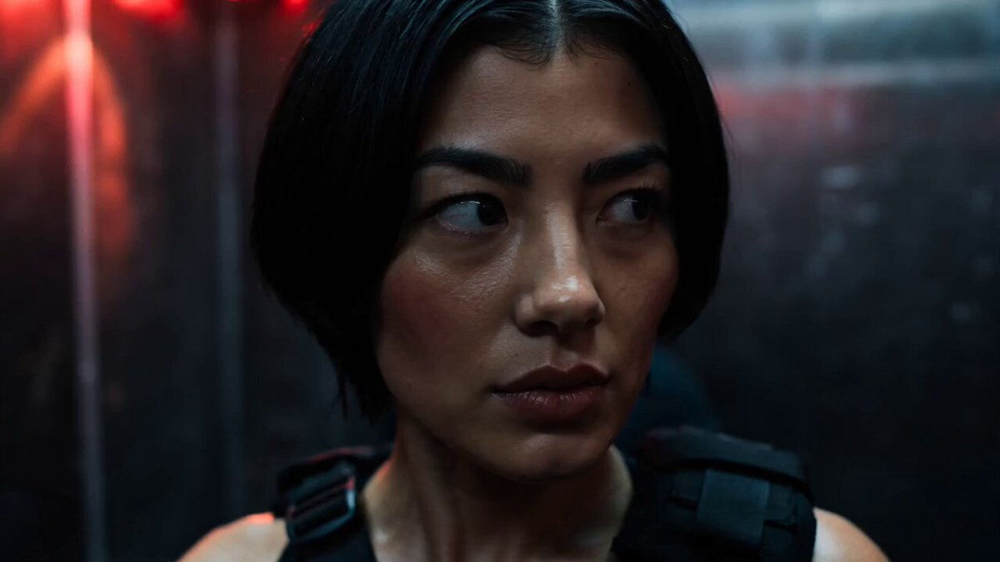

**พรอมต์**

```text
หญิงสาวชาวเอเชียผมบ็อบสวมเสื้อกั๊กแทคติคอลสีเข้มยืนอยู่คนเดียวภายในลิฟต์อุตสาหกรรมที่แสงสลัว มีไฟฉุกเฉินสีแดงกระพริบอยู่เหนือศีรษะ ชายคนหนึ่งคว้าตัวเธอจากด้านหลัง และเธอตอบโต้ด้วยท่วงท่าป้องกันตัวที่รวดเร็วจนหลุดพ้นออกมาได้ มุมกล้องชวนอึดอัดคับแคบ ผนังโลหะสีเข้ม การออกแบบคิวบู๊ระยะประชิดอันดุเดือด สุนทรียภาพแบบภาพยนตร์แอ็กชันดิบเถื่อน
```

[↑ กลับสู่หมวดหมู่](#catalog)

---

<a name="prompt-2100815169840406787"></a>

### ไทม์แลปส์ภาพย่อส่วนแนวตั้ง 16 วินาทีของชาวนาจิ๋วที่กำลังสร้างและเก็บเกี่ยวนาขั้นบันได

ผู้เขียน：[@RizwanAly07](https://x.com/RizwanAly07) · [โพสต์ต้นฉบับ](https://x.com/RizwanAly07/status/2100815169840406787)

สถาปัตยกรรม / การตกแต่งภายใน · เผยแพร่แล้ว

**สรุป:** ไทม์แลปส์ภาพย่อส่วนแนวตั้ง 16 วินาทีของชาวนาจิ๋วที่กำลังสร้างและเก็บเกี่ยวนาขั้นบันได


**พรอมต์**

```text
สร้างวิดีโอไทม์แลปส์แนวตั้งขนาด 9:16 ความยาว 16 วินาที สไตล์ภาพถ่ายย่อส่วนเสมือนจริงขั้นสุดเกี่ยวกับการทำฟาร์ม

ลาดภูเขาขนาดย่อส่วนที่แห้งแล้งอย่างสิ้นเชิงถูกเปลี่ยนโฉมอย่างรวดเร็วโดยชาวนาจิ๋วเสมือนจริง 50–100 คน ให้กลายเป็นนาขั้นบันไดหลายชั้นอันงดงามตระการตา ให้ทั้งวิดีโอมีจังหวะที่เร็วมาก หนาแน่น และมีความเคลื่อนไหวอย่างต่อเนื่อง โดยมีหลายทีมทำงานพร้อมกัน

0–2 วินาที — การขึงแนวและขุดดิน
ชาวนาขึงเชือก ตอกหลักไม้ วัดระดับ และเริ่มลงมือขุดดินภูเขาที่แห้งแล้งทันทีด้วยจอบและพลั่ว

2–4 วินาที — การสร้างขั้นบันได
หลายทีมร่วมกันขุดปรับพื้นที่ขั้นบันไดแนวนอนพร้อมๆ กัน คนงานขุดดิน แบกตะกร้าลงเขา ปรับหน้าดินให้เรียบ และก่อกำแพงหินกันดินพังด้วยตนเอง ขั้นบันไดต้องปรากฏให้เห็นการพัฒนาเป็นรูปเป็นร่างอย่างชัดเจน ไม่ปรากฏขึ้นมาในทันทีทันใดเด็ดขาด

4–6 วินาที — ระบบชลประทาน
ชาวนาเรียงก้อนหิน บดอัดดิน ขุดคูส่งน้ำเชื่อมต่อกัน และวางสะพานไม้ขนาดจิ๋ว ประตูน้ำเปิดออกและน้ำโคลนไหลลงมาจริงๆ จากขั้นบันไดชั้นบนสุดผ่านไปยังแปลงนาด่านล่าง

6–8 วินาที — แปลงนาและการดำนา
ชาวนาเกลี่ยและปรับระดับโคลนเปียก ขณะที่คนอื่นๆ แบกตะกร้าใส่ต้นกล้าข้าว กลุ่มคนคุกเข่า ปักดำต้นกล้าทีละแถว ลุกขึ้น และย้ายไปยังส่วนถัดไปอย่างรวดเร็ว

8–10 วินาที — การปักดำขนานใหญ่
ภาพไทม์แลปส์ความเร็วสูงแสดงให้เห็นต้นกล้าหลายร้อยต้นที่ถูกปักดำลงดินจริงๆ ในขณะที่ทีมอื่นๆ ดูแลคูส่งน้ำและรักษาระดับน้ำ นาขั้นบันไดกลายเป็นทุ่งข้าวสีเขียวขจีหนาแน่น

10–12 วินาที — การเจริญเติบโตและการดูแลรักษา
ต้นข้าวเจริญเติบโตตามธรรมชาติผ่านภาพเร่งเวลาไทม์แลปส์ ชาวนากำจัดวัชพืช ซ่อมแซมกำแพงขั้นบันได ลอกคูระบายน้ำ และถือเครื่องมือรวมถึงตะกร้า

12–14 วินาที — การเก็บเกี่ยว
ข้าวสีเขียวเปลี่ยนเป็นสีเหลืองทองและสุกงอมอย่างรวดเร็ว ชาวนาใช้เคียวขนาดจิ๋วเกี่ยวรวงข้าว มัดรวมเป็นฟ่อน แบกใส่ตะกร้า และขนขึ้นเกวียนไม้ขนาดเล็ก

14–16 วินาที — การเผยภาพสุดท้าย
กล้องถอยหลังและลอยขึ้นอย่างรวดเร็วและนุ่มนวลเพื่อเผยให้เห็นนาขั้นบันไดซ้อนชั้นขนาดมหึมา กำแพงหิน ทางน้ำไหล ทางเดินโคลน สะพาน ทุ่งนาสีทอง เกวียน ตะกร้า และชาวนาหลายสิบคนที่ยังคงกำลังเก็บเกี่ยวอยู่

สไตล์: ภาพถ่ายมาโครย่อส่วนแบบโฟโตรีลลิสติก รายละเอียดดินและหินที่สมจริง น้ำโคลนสมจริง แสงแดดธรรมชาติ เงาที่แม่นยำ ระยะชัดตื้น การเคลื่อนไหวของกล้องแบบถือถ่ายมาโครอย่างนุ่มนวล รายละเอียดระดับ 8K มนุษย์จริงในสัดส่วนย่อส่วนขนาดจิ๋ว ไม่ใช่ CGI การ์ตูน แอนิเมชัน หรือของเล่นพลาสติก

ข้อห้ามเคร่งครัด: ห้ามมีสิ่งของปรากฏขึ้นอย่างน่าอัศจรรย์ การเทเลพอร์ต สิ่งของหายไป คนงานเพิ่มจำนวนหรือกลายร่าง คนงานลอยได้ ขั้นบันไดโผล่ขึ้นมาทันที การเติบโตแบบทันทีทันใด ผังเปลี่ยนแปลงไป มนุษย์ร่างยักษ์ เครื่องมือขนาดใหญ่เกินจริง ข้อความ โลโก้ หรือลายน้ำ ทุกๆ ขั้นบันได กำแพง ทางน้ำ ต้นกล้า และฟ่อนผลผลิตต้องถูกสร้าง ปลูก หรือจัดการอย่างสมจริงในทางกายภาพ
```

[↑ กลับสู่หมวดหมู่](#catalog)

---

<a name="prompt-2100793667338563914"></a>

### กำลังแปล

ผู้เขียน：[@HoodyLiu](https://x.com/HoodyLiu) · [โพสต์ต้นฉบับ](https://x.com/HoodyLiu/status/2100793667338563914)

คอมิก / สตอรี่บอร์ด · ตัวละคร · เผยแพร่แล้ว

โพสต์ต้นฉบับ：[@techhalla](https://x.com/techhalla) · [โพสต์ต้นฉบับ](https://x.com/techhalla/status/2100526482212712584)

**สรุป:** กำลังแปล


**พรอมต์**

```text
กำลังแปล
```

[↑ กลับสู่หมวดหมู่](#catalog)

---

<a name="prompt-2100760347397538127"></a>

### พรอมต์สร้างวิดีโอที่ถ่ายทอดตั้งแต่ประตูตรวจตั๋วขึ้นเออเรอร์ไปจนถึงตกรถไฟบนชานชาลาที่สถานีในญี่ปุ่น

ผู้เขียน：[@akiyoshisan](https://x.com/akiyoshisan) · [โพสต์ต้นฉบับ](https://x.com/akiyoshisan/status/2100760347397538127)

ตัวละคร · ยานพาหนะ · เผยแพร่แล้ว

โพสต์ต้นฉบับ：[@akiyoshisan](https://x.com/akiyoshisan) · [โพสต์ต้นฉบับ](https://x.com/akiyoshisan/status/2100386541550117317)

**สรุป:** พรอมต์สร้างวิดีโอที่ถ่ายทอดตั้งแต่ประตูตรวจตั๋วขึ้นเออเรอร์ไปจนถึงตกรถไฟบนชานชาลาที่สถานีในญี่ปุ่น

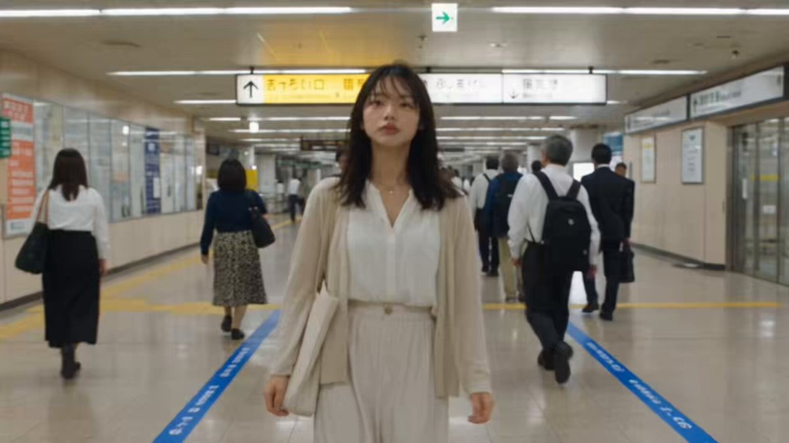

**พรอมต์**

```text
สถานีรถไฟในญี่ปุ่น ซากุระเดินไปที่ประตูตรวจตั๋ว→แตะสมาร์ตโฟนที่จุดแตะบัตร IC แต่เกิดข้อผิดพลาด→ถอยออกมาเช็กหน้าจอและกดแก้ไข→แตะใหม่อีกครั้งได้ยินเสียง "ปิ๊บ"→หน้าจอเปลี่ยนจากสีแดงเป็นสีเขียวแล้วเดินผ่านไป→รีบมุ่งหน้าไปยังชานชาลา→วินาทีที่ไปถึง รถไฟก็ออกตัวพอดี หยุดยืนมองรถไฟแล่นออกไปครู่หนึ่ง

เดินเร็วอย่างเป็นธรรมชาติ มีความสับสนเล็กน้อย ผิดหวังแบบสำรวม กล้องรักษาระยะห่างแบบผู้สังเกตการณ์ เน้นเสียงบรรยากาศในสถานี ไม่มีบทพูด ไม่มีการสนทนา ไม่มีคำบรรยาย ตัวละคร/เครื่องแต่งกาย/พื้นที่สถานีคงความต่อเนื่องด้วยการดึงเฟรม+การอ้างอิงหลายจุด ห้ามการแสดงที่โอเวอร์เกินจริง การแทรกแซงที่ไม่เป็นธรรมชาติของฝูงชน การแตะเกตตรวจตั๋วผิดพลาด และการวิ่งกวดขึ้นรถไฟอย่างอันตราย
```

[↑ กลับสู่หมวดหมู่](#catalog)

---

<a name="prompt-2100460643874943066"></a>

### เช้าวันฤดูหนาวอันเงียบสงบของญี่ปุ่น แสดงภาพหญิงสาวเปิดประตูบานเลื่อน ให้อาหารนกกระจอก กวาดหิมะ ดื่มชา และเดินเคียงข้างหมู่บ้านที่ปกคลุมไปด้วยหิมะ

ผู้เขียน：[@noorlewisx](https://x.com/noorlewisx) · [โพสต์ต้นฉบับ](https://x.com/noorlewisx/status/2100460643874943066)

ตัวละคร · อาหาร / เครื่องดื่ม · เผยแพร่แล้ว

**สรุป:** เช้าวันฤดูหนาวอันเงียบสงบของญี่ปุ่น แสดงภาพหญิงสาวเปิดประตูบานเลื่อน ให้อาหารนกกระจอก กวาดหิมะ ดื่มชา และเดินเคียงข้างหมู่บ้านที่ปกคลุมไปด้วยหิมะ


**พรอมต์**

```text
เช้าวันฤดูหนาวอันเงียบสงบของญี่ปุ่นในบ้านไม้ชนบทแบบดั้งเดิม ห้องทาทามิที่ปกคลุมด้วยบรรยากาศหิมะพร้อมประตูบานเลื่อนกระดาษโชจิ หญิงสาวผมสั้นสีดำสวมเสื้อคาร์ดิแกนขนฟูสีน้ำตาลทับเสื้อสเวตเตอร์สีครีม กางเกงสีเข้ม และรองเท้าบูทขนนุ่ม คุกเข่าแล้วลุกขึ้นเลื่อนเปิดประตู เผยให้เห็นหมู่บ้านหิมะภายนอก แสงแดดสีทองนุ่มนวลส่องผ่านหน้าต่างที่ปกคลุมด้วยเกล็ดน้ำแข็ง เธอเดินก้าวออกไปยังระเบียงไม้เอ็งงาวะ ย่อตัวลงโปรยเมล็ดพืชให้กับนกกระจอกตัวน้อยที่กระโดดไปมาบนหิมะตกใหม่ ต่อมาเธอกวาดหิมะออกจากระเบียงด้วยไม้กวาดฟางแบบดั้งเดิม ด้านในเธอนั่งคุกเข่าบนเสื่อทาทามิรินชาร้อนกรุ่นจากกาน้ำชาเซรามิกใส่ถ้วยเล็กๆ ถือไว้ด้วยสองมือแล้วทอดสายตามองออกไปนอกหน้าต่างอย่างสงบ จากนั้นเธอเดินเลียบไปตามทางเดินหิมะข้างบ้านไม้ สวมเสื้อโค้ตสีเบจอ่อน มองออกไปยังหมู่บ้านที่ปกคลุมด้วยหิมะอันงดงามราวภาพวาด ซึ่งมีบ้านเรือนแบบดั้งเดิม รั้วไม้ ต้นสนที่รับน้ำหนักหิมะ ภูเขาที่อยู่ไกลลิบ และควันจากปล่องไฟที่ลอยขึ้นในแสงอาทิตย์สีทองยามเช้า อารมณ์ภาพยนตร์ เงียบสงบ อบอุ่น รายละเอียดคมชัดสูง แสงธรรมชาติ สมจริงแต่เปี่ยมด้วยบทกวี บรรยากาศที่ได้แรงบันดาลใจจากสตูดิโอจิบลิ 8k
```

[↑ กลับสู่หมวดหมู่](#catalog)

---

<a name="prompt-2100468572644573436"></a>

### กำลังแปล

ผู้เขียน：[@krienknight](https://x.com/krienknight) · [โพสต์ต้นฉบับ](https://x.com/krienknight/status/2100468572644573436)

คอมิก / สตอรี่บอร์ด · ตัวละคร · เผยแพร่แล้ว

**สรุป:** กำลังแปล


**พรอมต์**

```text
กำลังแปล
```

[↑ กลับสู่หมวดหมู่](#catalog)

---

<a name="prompt-2100423982898115050"></a>

### พรอมต์วิดีโอฉาก Vlog ชีวิตฤดูร้อนอันแสนสบายของหญิงสาวชาวเกาหลีข้างลำธารและบ้านไม้

ผู้เขียน：[@aiwithaayat](https://x.com/aiwithaayat) · [โพสต์ต้นฉบับ](https://x.com/aiwithaayat/status/2100423982898115050)

ตัวละคร · เผยแพร่แล้ว

**สรุป:** พรอมต์วิดีโอฉาก Vlog ชีวิตฤดูร้อนอันแสนสบายของหญิงสาวชาวเกาหลีข้างลำธารและบ้านไม้


**พรอมต์**

```text
หญิงสาวชาวเกาหลีแสนสวยสวมชุดเดรสฤดูร้อนสีขาวเนื้อนุ่มและหมวกสานกันแดดจากธรรมชาติ พร้อมสุนทรียภาพการใช้ชีวิตแบบเกาหลีที่สดชื่นและสง่างาม เธอมีผมสั้นสีเข้มดัดลอนอ่อนๆ แต่งหน้าบางเบา และมีสีหน้าที่อ่อนโยนเป็นธรรมชาติ เธอเพลิดเพลินกับวันฤดูร้อนอันเงียบสงบข้างลำธารบนภูเขาที่งดงาม เธอนั่งอยู่ริมน้ำ รับประทานแตงโมอย่างสงบ และเพลิดเพลินกับบรรยากาศที่สดชื่น เธอเดินช้าๆ ไปรอบพื้นที่กลางแจ้งอันอบอุ่นสบาย พลางจัดหมวกและชมทิวทัศน์ แสงแดดส่องผ่านร่มไม้อย่างนุ่มนวล สร้างไฮไลท์ที่อบอุ่นแบบภาพยนตร์และเลนส์แฟลร์ที่เป็นธรรมชาติ ผ้าม่านสีขาวพลิ้วไหวอย่างแผ่วเบาตามสายลมฤดูร้อนข้างบ้านไม้ เธอถือตะกร้าปิกนิกใบเล็กและเพลิดเพลินกับบรรยากาศชนบทอันเงียบสงบ กล้องจับภาพระยะใกล้ ช็อตขนาดกลาง และช็อตกว้างแบบภาพยนตร์ที่นุ่มนวล สมจริงดุจภาพถ่าย อบอุ่น ชวนฝัน สงบ ในสไตล์วิดีโอบล็อกฤดูร้อนแบบเกาหลี สีสันเป็นธรรมชาติ แสงนุ่มนวล การเคลื่อนไหวสมจริง และคุณภาพระดับ 4K แบบภาพยนตร์
```

[↑ กลับสู่หมวดหมู่](#catalog)

---

<a name="prompt-2100383168356573667"></a>

### ในการซูมใกล้หน้าจอโทรศัพท์ เด็กสาวบนวอลเปเปอร์ตื่นขึ้นมาและส่งเสียงออดอ้อน ปัดไอคอนแอปที่บังใบหน้าออกทีละอันแล้วชูสองนิ้วอย่างมีความสุข

ผู้เขียน：[@PhotoX86](https://x.com/PhotoX86) · [โพสต์ต้นฉบับ](https://x.com/PhotoX86/status/2100383168356573667)

การออกแบบแอป / เว็บ · ตัวละคร · บทคัดย่อ / ความเป็นมา · เผยแพร่แล้ว

**สรุป:** ในการซูมใกล้หน้าจอโทรศัพท์ เด็กสาวบนวอลเปเปอร์ตื่นขึ้นมาและส่งเสียงออดอ้อน ปัดไอคอนแอปที่บังใบหน้าออกทีละอันแล้วชูสองนิ้วอย่างมีความสุข


**พรอมต์**

```text
integrated_multimodal_description: [ช็อต 1] ไลฟ์แอ็กชันโคลสอัปแบบเสมือนจริงระดับอัลตราเฉพาะหน้าจอสมาร์ตโฟน, การจัดเฟรมแนวตั้ง 9:16, ความยาวประมาณ 15.00 วินาที, ขอบและกระจกโทรศัพท์ของจริงพร้อมแสงสะท้อนจากสภาพแวดล้อมเล็กน้อย, จอแสดงผลความคมชัดสูง ในวิดีโอทั้งหมดมีบุคคลเพียงคนเดียวเท่านั้นอย่างเคร่งครัด: หญิงสาวในภาพวอลเปเปอร์ที่อยู่ด้านในหน้าจอโทรศัพท์ นอกหน้าจอจะต้องไม่มีมนุษย์ ไม่มีใบหน้า ไม่มีมือ ไม่มีนิ้ว ไม่มีแขน ไม่มีชิ้นส่วนร่างกายใดๆ และไม่มีเงาดำอย่างเด็ดขาด—เฟรมประกอบด้วยตัวโทรศัพท์และเนื้อหาบนจอแสดงผลเท่านั้น ภาพวอลเปเปอร์คือภาพถ่ายครึ่งตัวของหญิงสาวชาวเอเชียแสนสวย—เครื่องหน้าประณีต แต่งหน้าสวยงาม สีหน้ามีชีวิตชีวา เสื้อผ้าทันสมัย—แต่หน้าจอหลักถูกปกคลุมอย่างหนาแน่นด้วยไอคอนแอปมากมายที่บดบังใบหน้า ดวงตา และพื้นที่สำคัญของร่างกายเธอ ไม่มีข้อความที่อ่านออกได้ ไม่มีคำบรรยาย ไม่มีซับไตเติล ไม่มีลายน้ำ ไม่มีโลโก้บนหน้าจอ—ไอคอนแอปเป็นสัญลักษณ์กราฟิกล้วนๆ โดยไม่มีป้ายกำกับ ตั้งแต่ 00:00.000 ถึง 00:02.000, เฟรมภาพนิ่ง: ไอคอนหนาแน่นปกคลุมตัวเธออย่างสมบูรณ์ ตั้งแต่ 00:02.000 ถึง 00:12.000, หญิงสาวในภาพวอลเปเปอร์มีชีวิตขึ้นมาอย่างกะทันหันภายในหน้าจอ ขมวดคิ้วเล็กน้อยด้วยสีหน้าโกรธแต่แฝงความออดอ้อนน่ารัก และหญิงสาวที่มีชีวิตชีวาด้วยเสียงโทนกลางค่อนข้างสูงที่ชัดเจน (S1) ตะโกนตรงหน้าพร้อมขยับริมฝีปากที่มองเห็นได้: [Chinese] 挡住我了！ เธอยังคงอยู่เฉพาะด้านในวอลเปเปอร์เท่านั้น เธอใช้นิ้วชี้เพียงนิ้วเดียวโดยกำหนดเป้าหมายอย่างแม่นยำ: ปลายนิ้วต้องกดลงไปตรงตำแหน่งของไอคอนโดยตรงก่อน จากนั้นปัดไอคอนนั้นออกไปอย่างรวดเร็ว ไอคอนจะขยับเฉพาะเมื่อถูกกดอย่างแม่นยำเท่านั้น—การโบกมือมั่วๆ ในพื้นที่ว่างเปล่าจะไม่มีผลอะไร เธอเคลียร์พวกมันทีละอันด้วยวิธีนี้ หากเธอเคลื่อนไหวเร็วมาก ก็ยังคงเป็นลำดับการกดและปัดอย่างรวดเร็วและแม่นยำบนไอคอนที่ต่อเนื่องกัน โดยไม่เคยมีการกวัดแกว่งอย่างไร้จุดหมาย ไอคอนบางอันหลุดออกไปด้วยการกดแล้วปัดอย่างเฉียบคมเพียงครั้งเดียว บางอันต้องกดแล้วปัดอย่างแม่นยำเป็นครั้งที่สอง ขณะที่กำลังเคลียร์พวกมัน เธอทำปากจู๋อย่างออดอ้อนและกลอกตาเป็นบางครั้ง ไอคอนค่อยๆ ลดลงในขณะที่ใบหน้าและร่างกายของเธอค่อยๆ เผยออกมาทีละนิด วินาทีที่ไอคอนสุดท้ายหลุดออกจากหน้าจอ การเคลื่อนไหวของการกดและปัดด้วยนิ้วชี้ทั้งหมดจะหยุดลงทันที—มือบนหน้าจอของเธอวางนิ่งและไม่ปัดต่อไปอีกแล้ว ตั้งแต่ 00:12.000 ถึง 00:15.000, หน้าจอสะอาดสะอ้านมีเพียงรูปภาพของเธอ ด้วยมือที่เคยปัดอยู่นิ่งแล้ว เธอแย้มยิ้มอย่างสดใสมีความสุข ดวงตาโค้งเป็นรูปเสี้ยวพระจันทร์ ทำท่าชูสองนิ้ว V-sign ชัยชนะมาทางผู้ชม และหยุดค้างท่านั้นไว้จนครบ 15.00 วินาที สมจริงเป็นพิเศษ การเคลื่อนไหวเป็นธรรมชาติและราบรื่น แสงหน้าจอที่แท้จริงและเงาสะท้อนที่นุ่มนวล overall_soundscape: เสียงบรรยากาศในห้องผ่านกระจกโทรศัพท์ที่นุ่มนวล, เสียงแตะ UI สั้นๆ แล้วตามด้วยเสียงฟึ่บสำหรับการกดและปัดที่แม่นยำแต่ละครั้ง, เสียงตะโกนหนึ่งประโยคของเธอและเสียงถอนหายใจออดอ้อนเบาๆ หลังจากไอคอนสุดท้ายถูกเคลียร์ออกไป เสียงการเคลื่อนไหวของนิ้วก็หยุดลง non_diegetic_music: ดนตรีอิเล็กทรอนิกส์แบบดีดที่สนุกสนานและเบาสบายในจังหวะปานกลาง สดใสขึ้นเมื่อไอคอนสุดท้ายถูกเคลียร์ออกไป จากนั้นบรรเลงคลอเบาๆ ในขณะที่หยุดค้างท่า V-sign，3:4，15s
```

[↑ กลับสู่หมวดหมู่](#catalog)

---

<a name="prompt-2100290901733986767"></a>

### หนังสือเล่มสีแดงและหนังสือเล่มสีน้ำเงินไม่เคยตกลงมาและทั้งสองเล่มอยู่บนโต๊ะในตอนท้าย มีเพียงหนังสือเล่มสีเขียวเท่านั้นที่ตกลงมาและทั้งสี่เล่มก็ตกลงมาทั้งหมด

ผู้เขียน：[@GlennHasABeard](https://x.com/GlennHasABeard) · [โพสต์ต้นฉบับ](https://x.com/GlennHasABeard/status/2100290901733986767)

อื่น ๆ · เผยแพร่แล้ว

**สรุป:** หนังสือเล่มสีแดงและหนังสือเล่มสีน้ำเงินไม่เคยตกลงมาและทั้งสองเล่มอยู่บนโต๊ะในตอนท้าย มีเพียงหนังสือเล่มสีเขียวเท่านั้นที่ตกลงมาและทั้งสี่เล่มก็ตกลงมาทั้งหมด


**พรอมต์**

```text
หนังสือเล่มสีแดงและหนังสือเล่มสีน้ำเงินไม่เคยตกลงมาและทั้งสองเล่มอยู่บนโต๊ะในตอนท้าย มีเพียงหนังสือเล่มสีเขียวเท่านั้นที่ตกลงมาและทั้งสี่เล่มก็ตกลงมาทั้งหมด
```

[↑ กลับสู่หมวดหมู่](#catalog)

---

<a name="prompt-2100223364505755756"></a>

### กำลังแปล

ผู้เขียน：[@georgesttock](https://x.com/georgesttock) · [โพสต์ต้นฉบับ](https://x.com/georgesttock/status/2100223364505755756)

ตัวละคร · อาหาร / เครื่องดื่ม · ทิวทัศน์ / ธรรมชาติ · เผยแพร่แล้ว

**สรุป:** กำลังแปล


**พรอมต์**

```text
กำลังแปล
```

[↑ กลับสู่หมวดหมู่](#catalog)

---

<a name="prompt-2100094856362123609"></a>

### พรอมต์เกมวิดีโอมุมมองบุคคลที่สามแนวลอบเร้นความยาว 30 วินาที ที่พนักงานหญิงในออฟฟิศหลบหลีกเพื่อนร่วมงานเพื่อไปยังโต๊ะทำงานโดยไม่ให้ถูกตรวจจับ จบลงด้วยจุดพลิกผันจากกล้องวงจรปิด

ผู้เขียน：[@kingofdairyque](https://x.com/kingofdairyque) · [โพสต์ต้นฉบับ](https://x.com/kingofdairyque/status/2100094856362123609)

ตัวละคร · เผยแพร่แล้ว

**สรุป:** พรอมต์เกมวิดีโอมุมมองบุคคลที่สามแนวลอบเร้นความยาว 30 วินาที ที่พนักงานหญิงในออฟฟิศหลบหลีกเพื่อนร่วมงานเพื่อไปยังโต๊ะทำงานโดยไม่ให้ถูกตรวจจับ จบลงด้วยจุดพลิกผันจากกล้องวงจรปิด


**พรอมต์**

```text
ใช้ภาพที่อัปโหลดตรง 1 ภาพ @Image1 เป็นข้อมูลอ้างอิงลำดับความสำคัญสูงสุดสำหรับหญิงสาวชาวญี่ปุ่นวัยผู้ใหญ่ รักษาใบหน้า อัตลักษณ์ โทนสีผิว สัดส่วนร่างกาย และรูปลักษณ์ของเธอไว้ หากการแต่งกายไม่ชัดเจน: เสื้อเบลเซอร์ทำงานเข้ารูปสีดำ, เสื้อเบลาส์ผ้าซาตินสีขาว, กระโปรงพลีทมิดี้สีชาร์โคล, ถุงน่องสีดำโปร่งแสง, รองเท้าส้นเตี้ยสีดำ, กระเป๋าสะพายไปทำงานสีเข้ม ผมตรงยาวสีดำขลับประบ่าพร้อมหน้าม้าบางนุ่มนวล ผู้ใหญ่สมจริงอายุ 20+, รูปลักษณ์มืออาชีพที่สง่างาม ห้ามเป็นอนิเมะ, CGI หรือผิวพลาสติก

สร้างวิดีโอความยาวตรง 30 วินาที, แนวนอน 16:9, เนทีฟ 4K, 24fps, รูปแบบการเล่นเกมแนวลอบเร้นมุมมองบุคคลที่สามแบบคนแสดงจริงที่สมจริงเป็นพิเศษ ช็อตข้ามไหล่แบบต่อเนื่องหนึ่งช็อตตั้งแต่ 00:00–25.5 จากนั้นตัดฉากแบบแข็ง (hard cut) หนึ่งครั้งไปยังช็อตโต๊ะทำงานแบบมุมมองคงที่ ห้ามมีการตัดต่ออื่น ไม่มีดนตรีประกอบ (BGM), ไม่มีคำบรรยายซับไตเติล, ไม่มีเสียงบรรยาย, ไม่มีลายน้ำ หรือคำบรรยายภาพ บทสนทนาภาษาญี่ปุ่นที่เป็นธรรมชาติ; HUD เป็นภาษาอังกฤษเท่านั้น

ฉาก:
สำนักงานองค์กรญี่ปุ่นสมัยใหม่ที่เชื่อมต่อกันแห่งหนึ่ง: ล็อบบี้ที่สว่าง → โต๊ะรักษาความปลอดภัย → ประตูกั้นทางเข้า → ทางเดินกระจก → สำนักงานแบบเปิด (open-plan) → ไวท์บอร์ดแบบมีล้อเลื่อน → โต๊ะทำงาน แสงแดดยามเช้าส่องจากหน้าต่างด้านขวา กล้องวงจรปิด PTZ สีขาวทางกายภาพตรง 1 ตัวอยู่เหนือ/ทางขวาของโต๊ะทำงาน

ตัวละคร:
เจ้าหน้าที่รักษาความปลอดภัย — ชายชาวญี่ปุ่นวัย 40 กว่าปี รูปร่างหนา เครื่องแบบสีกรมท่า ปรากฏเฉพาะในล็อบบี้
เจ้าหน้าที่ฝ่ายบุคคล (HR) — หญิงชาวญี่ปุ่นวัย 30 กว่าปี ชุดสูทสีเบจ กางเกงขายาวสีดำ รถเข็นเอกสาร ปรากฏเฉพาะในทางเดิน
หัวหน้าแผนก — ชายชาวญี่ปุ่นอายุประมาณ 50 ปี แว่นตา ชุดสูทสีชาร์โคล เสื้อเชิ้ตสีขาว เนกไทสีแดงเข้ม เขาเป็นผู้ไล่ตามเพียงคนเดียว ทุกคนมีใบหน้าที่โดดเด่นและคงเส้นคงวา

HUD:
แผนที่ย่อ (Mini-map) + กรวยการมองเห็นสีเหลืองที่มุมล่างซ้าย, STAMINA/COMPOSURE ที่มุมบนซ้าย, DETECTION ที่กึ่งกลางด้านบน, SPRINT/CROUCH/INTERACT/SLIDE ที่มุมล่างขวา
เปิดฉาก:
【LATE — 12 MIN】
【OBJECTIVE: REACH YOUR DESK UNDETECTED】

00:00–00:07 — ล็อบบี้:
เธอวิ่งเต็มฝีเท้าผ่านล็อบบี้ รปภ. สังเกตเห็นเธอ เธอเบรก ย่อตัว และสไลด์ตัวไปหลังกระถางต้นไม้ในขณะที่กรวยการมองเห็นของเขาพุ่งขึ้นถึง 91% เสียงวิทยุสื่อสารทำให้เขาเสียสมาธิ เธอแตะบัตรเข้า ประตูเปิดออก กระเป๋าของเธอติดอยู่ชั่วครู่ และเธอหลบหนีเข้าไปในทางเดิน การตรวจจับลดลงเหลือ 34% รปภ. ไม่วิ่งตาม

00:07–00:13 — ทางเดิน:
เจ้าหน้าที่ HR กำลังเข็นรถเข็นเอกสารทรงสูง เธอซ่อนตัวอยู่หลังรถเข็นและเคลื่อนที่ไปรอบๆ ขณะที่ HR มองซ้ายและขวา การตรวจจับพุ่งแตะ 96% แต่เธอก็ไม่ถูกเห็นชัดเจน เธอแอบเข้าไปในออฟฟิศแบบเปิด HR ไม่วิ่งตาม

00:13–00:18 — การแจ้งเตือน:
หัวหน้าแผนกเห็นเงาสะท้อนของเธอในกระจกและจำเธอได้ กล้องจับภาพใบหน้าของเขาชั่วครู่ เครื่องหมาย 【!】 สีแดงขนาดใหญ่กะพริบตรงสองครั้ง และ DETECTION เปลี่ยนเป็น 【ALERT】 สีแดง
เขาตะโกน:
「ちょっと待って！」
เธอตอบ:
「やばい！」
จากนั้นเธอก็ออกวิ่ง

00:18–00:23.5 — การไล่ล่า:
เธอดึงไวท์บอร์ดแบบมีล้อเลื่อนมาด้านข้างเพื่อขวางเขา จากนั้นสไลด์ตัวผ่านช่องว่างแคบๆ ระหว่างบอร์ดกับโต๊ะทำงาน เขาอ้อมไปรอบๆ บอร์ดและวิ่งไล่ตามต่อ รักษาการสัมผัสพื้นของเท้าที่สมจริง แรงเสียดทาน โมเมนตัม แรงเฉื่อยของกระเป๋า การเคลื่อนไหวของเส้นผมและเสื้อผ้า

00:23.5–00:25.5 — โต๊ะทำงาน:
เธอมาถึงโต๊ะทำงาน จับขอบโต๊ะ หมุนตัวลงนั่งบนเก้าอี้ เปิดแล็ปท็อปและพิมพ์อย่างรวดเร็วราวกับกำลังทำงาน การตรวจจับลดลง 98% → 7%
HUD:
【MISSION COMPLETE】
【STEALTH RANK: S】
เธอยิ้มอย่างพึงพอใจเล็กน้อย

25.5 วินาที — ตัดฉากแบบแข็ง (HARD CUT)

00:25.5–00:30 — จุดพลิกผันจากกล้องวงจรปิด (CCTV TWIST):
ช็อตคงที่ด้านหน้าโต๊ะทำงาน แสดงให้เห็นใบหน้า ลำตัวส่วนบน แล็ปท็อป และกล้องวงจรปิด PTZ ทางกายภาพ ตอนแรกกล้องวงจรปิดหันไปทางโถงทางเดิน ในเวลา 00:26.3 มันหมุนด้วยกลไกประมาณ 45° มาทางเธอ และไฟแสดงสถานะสีแดงเปิดใช้งาน

HUD:
【CCTV DETECTED】

รอยยิ้มของเธอชะงักค้างและเธอค่อยๆ มองไปยังกล้อง

หัวหน้าแผนกพูดผ่านลำโพง:
「ピョナさん、私の部屋に来てください。」

ที่เวลา 00:28.8:
【MISSION FAILED】
【LATE PENALTY +1】
【NEXT: SURVIVE THE MEETING】

เธอเบิกตากว้างขึ้นเล็กน้อยและทิ้งไหล่ลง เฟรมสุดท้ายแสดงให้เห็นสีหน้าที่แข็งค้างของเธออย่างชัดเจน และกล้องวงจรปิดที่หันหน้าเข้าหาเธอพร้อมไฟสีแดง

ฟิสิกส์:
การเคลื่อนไหวที่รวดเร็วแต่สมจริง น้ำหนัก แรงเสียดทาน ความสมดุล การฟื้นตัว การหมุนของล้อ แรงเฉื่อยของกระเป๋า การเคลื่อนไหวของเส้นผม/เสื้อผ้า และการโต้ตอบกับสภาพแวดล้อม
```

[↑ กลับสู่หมวดหมู่](#catalog)

---

<a name="prompt-2100074769207247005"></a>

### กำลังแปล

ผู้เขียน：[@itxabdullaa](https://x.com/itxabdullaa) · [โพสต์ต้นฉบับ](https://x.com/itxabdullaa/status/2100074769207247005)

ตัวละคร · เผยแพร่แล้ว

**สรุป:** กำลังแปล


**พรอมต์**

```text
กำลังแปล
```

[↑ กลับสู่หมวดหมู่](#catalog)

---

<a name="prompt-2100071299968032968"></a>

### กำลังแปล

ผู้เขียน：[@laviniavelle](https://x.com/laviniavelle) · [โพสต์ต้นฉบับ](https://x.com/laviniavelle/status/2100071299968032968)

การตลาดผลิตภัณฑ์ · ตัวละคร · ไอเทมแฟชั่น · เผยแพร่แล้ว

**สรุป:** กำลังแปล


**พรอมต์**

```text
กำลังแปล
```

[↑ กลับสู่หมวดหมู่](#catalog)

---

<a name="prompt-2100070781174907387"></a>

### กำลังแปล

ผู้เขียน：[@aiwithaayat](https://x.com/aiwithaayat) · [โพสต์ต้นฉบับ](https://x.com/aiwithaayat/status/2100070781174907387)

ตัวละคร · เผยแพร่แล้ว

**สรุป:** กำลังแปล


**พรอมต์**

```text
กำลังแปล
```

[↑ กลับสู่หมวดหมู่](#catalog)

---

<a name="prompt-2100022778674254091"></a>

### กำลังแปล

ผู้เขียน：[@akiyoshisan](https://x.com/akiyoshisan) · [โพสต์ต้นฉบับ](https://x.com/akiyoshisan/status/2100022778674254091)

ตัวละคร · เผยแพร่แล้ว

โพสต์ต้นฉบับ：[@akiyoshisan](https://x.com/akiyoshisan) · [โพสต์ต้นฉบับ](https://x.com/akiyoshisan/status/2099652823827054686)

**สรุป:** กำลังแปล


**พรอมต์**

```text
กำลังแปล
```

[↑ กลับสู่หมวดหมู่](#catalog)

---

<a name="prompt-2100013757779099770"></a>

### กำลังแปล

ผู้เขียน：[@TanLuAI](https://x.com/TanLuAI) · [โพสต์ต้นฉบับ](https://x.com/TanLuAI/status/2100013757779099770)

ตัวละคร · เผยแพร่แล้ว

**สรุป:** กำลังแปล


**พรอมต์**

```text
กำลังแปล
```

[↑ กลับสู่หมวดหมู่](#catalog)

---

<a name="prompt-2099645118550888633"></a>

### กำลังแปล

ผู้เขียน：[@TanLuAI](https://x.com/TanLuAI) · [โพสต์ต้นฉบับ](https://x.com/TanLuAI/status/2099645118550888633)

คอมิก / สตอรี่บอร์ด · เผยแพร่แล้ว

**สรุป:** กำลังแปล


**พรอมต์**

```text
กำลังแปล
```

[↑ กลับสู่หมวดหมู่](#catalog)

---

<a name="prompt-2099564383252705547"></a>

### การแสดงกายกรรมทรงตัวของเด็กสาวในชุดสีลาเวนเดอร์บนแผ่นไม้แคบเหนือนั่งร้านสูงในโรงละครละครสัตว์

ผู้เขียน：[@6AW0RON0k](https://x.com/6AW0RON0k) · [โพสต์ต้นฉบับ](https://x.com/6AW0RON0k/status/2099564383252705547)

ตัวละคร · เผยแพร่แล้ว

โพสต์ต้นฉบับ：[@6AW0RON0k](https://x.com/6AW0RON0k) · [โพสต์ต้นฉบับ](https://x.com/6AW0RON0k/status/2099190119370576229)

**สรุป:** การแสดงกายกรรมทรงตัวของเด็กสาวในชุดสีลาเวนเดอร์บนแผ่นไม้แคบเหนือนั่งร้านสูงในโรงละครละครสัตว์


**พรอมต์**

```text
> โรงละครละครสัตว์อันยิ่งใหญ่ ระเบียงสีทอง ที่นั่งชมสองชั้น
> เด็กสาวในชุดสีลาเวนเดอร์ยืนอยู่บนแผ่นไม้แคบๆ ที่ทรงตัวอยู่บนยอดนั่งร้านโลหะ แท่นนั้นอยู่สูงจากพื้นทราย 5 เมตร
> แผ่นไม้โคลงเคลง เธอปรับสมดุล น้ำหนักตัวถ่ายไปทางซ้าย นั่งร้านส่งเสียงเอี๊ยดอ๊าด
> ผู้ชมหยุดนิ่ง โทรศัพท์สว่างเรืองแต่ไม่มีใครถ่ายวิดีโอ พวกเขากำลังเฝ้าดู
> เธอทรงตัวได้ ขาข้างหนึ่งยกขึ้น แผ่นไม้ยังรับน้ำหนักได้
```

[↑ กลับสู่หมวดหมู่](#catalog)

---

<a name="prompt-2099340009648377870"></a>

### นักเรียนหญิงที่ง่วงนอนในห้องเรียนเผชิญหน้ากับกิ้งก่ายักษ์และแปลงร่างเป็นชุดเกราะเรืองแสง

ผู้เขียน：[@iX00AI](https://x.com/iX00AI) · [โพสต์ต้นฉบับ](https://x.com/iX00AI/status/2099340009648377870)

อื่น ๆ · เผยแพร่แล้ว

**สรุป:** นักเรียนหญิงที่ง่วงนอนในห้องเรียนเผชิญหน้ากับกิ้งก่ายักษ์และแปลงร่างเป็นชุดเกราะเรืองแสง


**พรอมต์**

```text
กำลังนั่งเรียนหนังสืออย่างง่วงนอน\nกิ้งก่ายักษ์\nเกราะส่องแสง\nวงแหวนอนุภาค\nถ่ายด้วย iPhone 17
```

[↑ กลับสู่หมวดหมู่](#catalog)

---

<a name="prompt-2099148058256716100"></a>

### ฟลิปเปอร์จะขยับเมื่อลูกบอลอยู่ใกล้เท่านั้น วงล้อคะแนนจะหมุนเมื่อโดนตีเท่านั้น

ผู้เขียน：[@GlennHasABeard](https://x.com/GlennHasABeard) · [โพสต์ต้นฉบับ](https://x.com/GlennHasABeard/status/2099148058256716100)

อื่น ๆ · เผยแพร่แล้ว

**สรุป:** ฟลิปเปอร์จะขยับเมื่อลูกบอลอยู่ใกล้เท่านั้น วงล้อคะแนนจะหมุนเมื่อโดนตีเท่านั้น


**พรอมต์**

```text
ฟลิปเปอร์จะขยับเมื่อลูกบอลอยู่ใกล้เท่านั้น วงล้อคะแนนจะหมุนเมื่อโดนตีเท่านั้น
```

[↑ กลับสู่หมวดหมู่](#catalog)

---

<a name="prompt-2098982502006489324"></a>

### โฮมวิดีโอสไตล์ MiniDV ยุคต้นทศวรรษ 2000 ของหญิงสาวชาวเกาหลีที่เผลอรดน้ำต้นไม้ในกระถางมากเกินไปบนระเบียงอพาร์ตเมนต์ในกรุงโซลวันฝนตก

ผู้เขียน：[@iamahmedfaraz66](https://x.com/iamahmedfaraz66) · [โพสต์ต้นฉบับ](https://x.com/iamahmedfaraz66/status/2098982502006489324)

ตัวละคร · เผยแพร่แล้ว

**สรุป:** โฮมวิดีโอสไตล์ MiniDV ยุคต้นทศวรรษ 2000 ของหญิงสาวชาวเกาหลีที่เผลอรดน้ำต้นไม้ในกระถางมากเกินไปบนระเบียงอพาร์ตเมนต์ในกรุงโซลวันฝนตก


**พรอมต์**

```text
ตัวแบบหลัก: หญิงสาวชาวเกาหลี อายุ 24 ปี มีเสน่ห์อย่างเป็นธรรมชาติ ผิวสมจริง แต่งหน้าน้อยมาก ผมสีเข้มยาวปล่อยสยายสบายๆ สวมเสื้อยืดโอเวอร์ไซส์สีลาเวนเดอร์ซีดเรียบง่ายและกางเกงลำลองทรงหลวมสีเทา รักษาอัตลักษณ์ ลักษณะใบหน้า ทรงผม สัดส่วนรูปร่าง และรูปลักษณ์ภายนอกของเธอให้ตรงตามเดิมตลอดทั้งคลิป

สถานที่: ระเบียงอพาร์ตเมนต์เก่าขนาดเล็กในกรุงโซล ในช่วงเช้าตรู่ที่มืดครึ้มและมีฝนตก มีกระถางต้นไม้เล็กๆ หลายกระถางวางเรียงตามราวระเบียง พร้อมพื้นคอนกรีตเปียกชื้น ราวโลหะ มองเห็นอาคารอพาร์ตเมนต์ข้างเคียงและหลังคาบ้านเรือนที่ชุ่มฝนอยู่เบื้องหลัง ฝนยังคงตกอย่างต่อเนื่องอยู่ภายนอก

แสงและบรรยากาศ: บรรยากาศช่วงบลูอาวร์ (blue-hour) ที่มืดสลัวและอบอุ่น แสงสีฟ้าอมเทาเย็นๆ จากท้องฟ้าที่มีเมฆฝนส่องสว่างบนระเบียงอย่างนุ่มนวล พร้อมแสงเรืองอุ่นๆ จางๆ ส่องมาจากภายในอพาร์ตเมนต์ด้านหลังของเธอ พื้นผิวที่เปียกชื้นสะท้อนแสงสลัว บรรยากาศกรุงโซลในวันฝนตกที่เงียบสงบ ง่วงซึม และเป็นกันเอง

สไตล์: วิดีโอโฮมวิดีโอด้วยกล้อง Sony MiniDV ยุคต้นทศวรรษ 2000 ที่สมจริงอย่างยิ่ง ถ่ายโดยบุคคลอื่นที่ถือกล้องวิดีโอ ดูเป็นธรรมชาติและไม่ได้จัดฉากอย่างสิ้นเชิง เหมือนสมาชิกในครอบครัวกำลังถ่ายเธออย่างไม่เป็นทางการ การเคลื่อนไหวของกล้องแบบถือด้วยมืออย่างเป็นธรรมชาติ มีการสั่นไหวเล็กน้อยของมนุษย์ การจัดเฟรมที่ไม่สมบูรณ์แบบ การปรับเฟรมอย่างนุ่มนวล การค้นหาโฟกัสอัตโนมัติเป็นบางครั้ง การเปลี่ยนค่าการเปิดรับแสงเล็กน้อย สีซีด คอนทราสต์นุ่มนวล การบีบอัดไฟล์แบบ DV แท้ๆ สัญญาณรบกวนดิจิทัลในที่แสงน้อยและเสียงนอยส์จากไมโครโฟนเล็กน้อย การเคลื่อนไหวแบบเรียลไทม์ที่ราบรื่นและต่อเนื่องตลอดคลิป ไม่มีการกระตุก การสั่นไหวของภาพ การข้ามเฟรม เฟรมซ้ำ ลักษณะคล้ายสต็อปโมชัน ภาพเบลอจากการเคลื่อนไหวมากเกินไป การเปลี่ยนความเร็ว หรือลักษณะอัตราเฟรมต่ำ ไม่มีการใช้ระบบลดการสั่นไหวหรือการเคลื่อนไหวทางภาพยนตร์สมัยใหม่

00:00–00:04: เธอยืนอยู่บนระเบียงเล็กๆ ถือกระบวยรดน้ำแบบเรียบง่าย เธอค่อยๆ รดน้ำต้นไม้ในกระถางต้นหนึ่งอย่างนุ่มนวลพร้อมกับมองดูใบของมัน

00:04–00:08: เธอเลื่อนกระบวยรดน้ำไปยังอีกต้นหนึ่งและเผลอรดน้ำมากเกินไป น้ำล้นขอบกระถางอย่างรวดเร็วและไหลนองไปทั่วพื้นระเบียง

00:08–00:11: เธอสังเกตเห็นแอ่งน้ำทันทีและชะงักไปชั่วครู่ เธอก้มลงมองน้ำ จากนั้นมองกลับไปที่ต้นไม้ด้วยสีหน้าเขินอายเล็กน้อย

00:11–00:15: เธอหันไปมองกล้องวิดีโอและส่งยิ้มแห้งๆ อย่างรู้สึกผิด หัวเราะเบาๆ และยักไหล่เหมือนยอมรับความผิดพลาดของตนเอง เธอวางกระบวยรดน้ำลงแล้วค่อยๆ ก้าวเลี่ยงแอ่งน้ำอย่างระมัดระวัง

เสียง: เสียงบรรยากาศสดจากสถานที่เท่านั้น—เสียงฝนตกต่อเนื่อง เสียงน้ำไหลรินจากกระบวย เสียงน้ำกระเซ็นลงบนคอนกรีต เสียงการจราจรไกลๆ เสียงอพาร์ตเมนต์แผ่วเบา เสียงขยับของเสื้อผ้าที่นุ่มนวล และเสียงหัวเราะเบาๆ ของเธอ ไม่มีดนตรีประกอบ เสียงบรรยาย หรือเอฟเฟกต์เสียงเพิ่มเติม

เป้าหมาย: ให้ความรู้สึกเหมือนความผิดพลาดเล็กๆ น้อยๆ ที่ไม่เป็นพิษเป็นภัยซึ่งถูกบันทึกไว้ได้โดยบังเอิญด้วยกล้อง MiniDV ประจำครอบครัวยุคต้นทศวรรษ 2000 น่ารัก เรียบง่าย และเป็นธรรมชาติมากกว่าตลกขบขันหรือเกินจริง ปฏิกิริยาของเธอควรจะละเอียดอ่อนและจริงใจ โดยมีบรรยากาศของระเบียงในวันฝนตกยังคงเป็นอารมณ์หลักของภาพ

คุณภาพการเคลื่อนไหว: รักษาการเคลื่อนไหวของตัวละครและกล้องให้ราบรื่น ต่อเนื่อง และสมจริงตามหลักฟิสิกส์ น้ำควรรินไหลอย่างเป็นธรรมชาติโดยไม่มีการเปลี่ยนแปลงกะทันหันหรือกระเด็นอย่างผิดธรรมชาติ หลีกเลี่ยงการเคลื่อนไหวที่รวดเร็ว กลิ่นอายวินเทจของ MiniDV จะต้องมาจากเนื้อสัมผัสของภาพ โฟกัสอัตโนมัติ พฤติกรรมการเปิดรับแสง สีที่หม่นลง และการถือถ่ายด้วยมือ—ไม่ใช่จากการลดอัตราเฟรมหรือการเคลื่อนไหวที่สะดุด
```

[↑ กลับสู่หมวดหมู่](#catalog)

---

<a name="prompt-2098625551833669826"></a>

### ข้อความแจ้งเตือนสำหรับวิดีโอเซลฟี่แบบถือด้วยมือความยาว 30 วินาที แสดงภาพหญิงสาวและลูกแมวลายสลิดข้างหน้าต่างในวันฝนตกกำลังเล่นสายดึงมูลี่

ผู้เขียน：[@itxabdullaa](https://x.com/itxabdullaa) · [โพสต์ต้นฉบับ](https://x.com/itxabdullaa/status/2098625551833669826)

ภาพบุคคล / เซลฟี่ · ตัวละคร · เผยแพร่แล้ว

**สรุป:** ข้อความแจ้งเตือนสำหรับวิดีโอเซลฟี่แบบถือด้วยมือความยาว 30 วินาที แสดงภาพหญิงสาวและลูกแมวลายสลิดข้างหน้าต่างในวันฝนตกกำลังเล่นสายดึงมูลี่


**พรอมต์**

```text
การอ้างอิงและตัวแบบ ใช้ "@<image1" เป็นภาพอ้างอิงที่แน่นอนสำหรับหญิงสาว คงไว้ซึ่งอัตลักษณ์ ใบหน้า ทรงผม เสื้อผ้า ผิวสัมผัส สัดส่วนร่างกาย และรูปลักษณ์ที่เป็นธรรมชาติของเธอตลอดทั้งคลิป มีลูกแมวลายสลิดตัวเล็กเพียง 1 ตัวเท่านั้น ลูกแมวตัวเดิมอย่างต่อเนื่องตลอดทั้งคลิป ไม่มีสัตว์อื่น ไม่มีลูกแมวซ้ำ

รูปแบบ วิดีโอเซลฟี่จากกล้องหน้าแบบถือด้วยมือ แนวตั้ง 9:16 ความยาว 30 วินาที ภายในห้องข้างหน้าต่างในวันฝนตก แสงธรรมชาติสีเทานุ่มนวลส่องผ่านกระจก มีเงาสะท้อนที่หน้าต่างเล็กน้อยและเสียงบรรยากาศในห้องที่สมจริง ไม่มีการปรับเกรดสี ไม่มีแสงแบบภาพยนตร์ ไม่มีฟิลเตอร์บิวตี้

---

0–5 วินาที — ช่วงเวลาแสนอบอุ่นในวันฝนตก

หญิงสาวยืนข้างหน้าต่างกอดลูกแมวแนบอก หยดน้ำฝนค่อยๆ ไหลลงมาตามผิวกระจกด้านหลังเธอ เธอมองเข้าไปในโทรศัพท์ จากนั้นเกาคางลูกแมวอย่างอ่อนโยน ลูกแมวมองออกไปทางหน้าต่างอย่างสงบ เธอยิ้มเบาๆ และพูดขึ้นสบายๆ ว่า: "วันสบายๆ แบบนี้ อบอุ่นจังเนอะ?" โทรศัพท์ยังคงสั่นไหวเล็กน้อยตามธรรมชาติของการถือด้วยมือ

---

5–10 วินาที — บางอย่างเคลื่อนไหว

การเคลื่อนไหวเล็กน้อยจากมูลี่หน้าต่างดึงดูดความสนใจของลูกแมว หูของมันตั้งตรงไปข้างหน้าทันที หญิงสาวสังเกตเห็นลูกแมวกำลังจ้องมองผ่านไหล่ของเธอ เธอหันไปทางหน้าต่างเล็กน้อยโดยยังคงประคองลูกแมวไว้อย่างมั่นคง ลูกแมวยื่นอุ้งเท้าข้างหนึ่งไปทางสายดึงมูลี่ที่ห้อยอยู่ เธอหัวเราะเบาๆ และพูดว่า: "มองอะไรอยู่น่ะ?"

---

10–15 วินาที — จู่โจมสายมูลี่

จู่ๆ ลูกแมวก็ใช้สองอุ้งเท้าตะปบสายมูลี่ หญิงสาวมีท่าทีประหลาดใจและพยายามขยับสายออกไปอย่างอ่อนโยน ลูกแมวไม่ยอมและดึงสายเข้ามาหาตัวเอง เธอหัวเราะขณะที่โทรศัพท์ในมือสั่นเล็กน้อย เธอพูดว่า: "เฮ้ อย่ายุ่งกับตรงนั้นสิ" ลูกแมวยังคงตะปบสายมูลี่ต่อไปเรื่อยๆ

---

15–20 วินาที — เล่นอย่างโกลาหล

ลูกแมวดิ้นดุ๊กดิ๊กอย่างตื่นเต้นบนอกของเธอขณะพยายามจับสายที่กำลังแกว่งไปมา เธอใช้มือหนึ่งประคองตัวมันไว้ให้มั่นคง และใช้อีกมือหนึ่งค่อยๆ กั้นอุ้งเท้าของมันไว้ ลูกแมวบิดตัวไปมาแล้วเอื้อมมือไปจับอีกครั้ง เธอหัวเราะดังขึ้นและพูดว่า: "ชักจะอยากรู้อยากเห็นมากเกินไปแล้วนะ" ปอยผมหลุดลุ่ยสองสามเส้นตกลงมาข้างใบหน้าของเธออย่างเป็นธรรมชาติ

---

20–25 วินาที — ลูกแมวปีนป่าย

ทันใดนั้นลูกแมวก็ปีนขึ้นไปหาไหล่ของเธอ โดยยังคงโฟกัสไปที่หน้าต่าง อุ้งเท้าของมันเกาะเนื้อผ้าของเสื้อที่เธอสวม เธอส่งเสียงร้องตกใจเล็กๆ ตามด้วยเสียงหัวเราะ มือที่ถือโทรศัพท์ยกขึ้นเล็กน้อยขณะพยายามให้ทั้งตัวเธอและลูกแมวยังคงอยู่ในเฟรม กล้องเอียงเล็กน้อยชั่วขณะก่อนจะกลับมาจัดกึ่งกลางได้อย่างเป็นธรรมชาติ

---

25–30 วินาที — เซลฟี่เซอร์ไพรส์

ลูกแมวปีนถึงไหล่ของเธอแล้วหันหน้าหนีจากหน้าต่างเข้าหาโทรศัพท์ทันที มันยื่นหน้าเข้าไปใกล้เลนส์ สูดดมด้วยความอยากรู้อยากเห็น เธอเอนตัวไปข้างหลังขณะกำลังหัวเราะ ลูกแมวยกอุ้งเท้าข้างหนึ่งขึ้นมาทางกล้อง เธอเริ่มพูดว่า: "อ้าว ตอนนี้อยากจะ—" แล้วก็หลุดหัวเราะออกมา อุ้งเท้าเกือบแตะโดนหน้าเลนส์ โทรศัพท์ลดต่ำลงอย่างเป็นธรรมชาติ คลิปจบลงระหว่างที่เธอกำลังหัวเราะ

เสียง เสียงบรรยากาศของฝนผ่านหน้าต่าง เสียงการเคลื่อนไหวแผ่วเบาของมูลี่ เสียงเสียดสีของเนื้อผ้า เสียงการเคลื่อนไหวของลูกแมว เสียงร้องเหมียวเบาๆ หนึ่งครั้ง เสียงพูดที่เป็นธรรมชาติของหญิงสาว เสียงหายใจ เสียงหัวเราะในลำคอ และเสียงหัวเราะอย่างจริงใจ ไม่มีดนตรีประกอบ ไม่มีคำบรรยาย ไม่มีข้อความ ไม่มีโลโก้ ไม่มีลายน้ำ ไม่มีการตัดต่อมุมกล้อง ไม่มีการซูม มีลูกแมวเพียงหนึ่งตัวถ้วน
```

[↑ กลับสู่หมวดหมู่](#catalog)

---

<a name="prompt-2098577397717307413"></a>

### กำลังแปล

ผู้เขียน：[@mi7\_crypto](https://x.com/mi7_crypto) · [โพสต์ต้นฉบับ](https://x.com/mi7_crypto/status/2098577397717307413)

ตัวละคร · เผยแพร่แล้ว

**สรุป:** กำลังแปล


**พรอมต์**

```text
กำลังแปล
```

[↑ กลับสู่หมวดหมู่](#catalog)

---

<a name="prompt-2098562237333913765"></a>

### กำลังแปล

ผู้เขียน：[@john87445528](https://x.com/john87445528) · [โพสต์ต้นฉบับ](https://x.com/john87445528/status/2098562237333913765)

คอมิก / สตอรี่บอร์ด · เผยแพร่แล้ว

**สรุป:** กำลังแปล


**พรอมต์**

```text
กำลังแปล
```

[↑ กลับสู่หมวดหมู่](#catalog)

---

<a name="prompt-2098403961325695379"></a>

### พรอมต์อธิบายถึงเปลวไฟที่ค่อยๆ ลามลงมาตามก้านไม้ขีด ทำให้เนื้อไม้ไหม้เกรียมเป็นสีดำและม้วนงอ

ผู้เขียน：[@GlennHasABeard](https://x.com/GlennHasABeard) · [โพสต์ต้นฉบับ](https://x.com/GlennHasABeard/status/2098403961325695379)

อื่น ๆ · เผยแพร่แล้ว

**สรุป:** พรอมต์อธิบายถึงเปลวไฟที่ค่อยๆ ลามลงมาตามก้านไม้ขีด ทำให้เนื้อไม้ไหม้เกรียมเป็นสีดำและม้วนงอ


**พรอมต์**

```text
เปลวไฟเคลื่อนตัวลงมาตามแท่งไม้อย่างช้าๆ เนื้อไม้ด้านหลังไหม้เกรียมเป็นสีดำและม้วนงอ
```

[↑ กลับสู่หมวดหมู่](#catalog)

---

<a name="prompt-2098306219903492133"></a>

### พรอมต์สตอรี่บอร์ดโฆษณาหรูหรา 15 วินาทีสำหรับน้ำหอมพฤกษศาสตร์ ประกอบด้วยหยดน้ำค้างมาโคร การถ่ายโคลสอัปผลิตภัณฑ์ บทพูดตัวละคร และฉากจบของแบรนด์

ผู้เขียน：[@yourPlugAI](https://x.com/yourPlugAI) · [โพสต์ต้นฉบับ](https://x.com/yourPlugAI/status/2098306219903492133)

คอมิก / สตอรี่บอร์ด · การตลาดผลิตภัณฑ์ · ตัวละคร · ผลิตภัณฑ์ · เผยแพร่แล้ว

โพสต์ต้นฉบับ：[@yourPlugAI](https://x.com/yourPlugAI) · [โพสต์ต้นฉบับ](https://x.com/yourPlugAI/status/2098049745885225020)

**สรุป:** พรอมต์สตอรี่บอร์ดโฆษณาหรูหรา 15 วินาทีสำหรับน้ำหอมพฤกษศาสตร์ ประกอบด้วยหยดน้ำค้างมาโคร การถ่ายโคลสอัปผลิตภัณฑ์ บทพูดตัวละคร และฉากจบของแบรนด์


**พรอมต์**

```text
พรอมต์วิดีโอแบบต่อเนื่อง 15 วินาที

0 ถึง 3 วินาที (The Hook - จุดดึงดูดความสนใจ)
ภาพ (Visual): ช็อต Tilt-up มาโครระยะใกล้พิเศษผ่านใบไม้เขตร้อนสีเขียวสดใสที่มีหยดน้ำค้างยามเช้าเกาะพราว แสงแดดส่องเป็นประกายจ้าเข้ามาในเลนส์ เผยให้เห็นละอองเกสรและอนุภาคละอองน้ำที่ลอยคว้าง
การเคลื่อนไหว (Action): หยดน้ำค้างเลื่อนไหลลงมาจากใบปาล์มขนาดใหญ่และกระเด็นกระทบกับหินธรรมชาติในแบบสโลว์โมชันสมจริงเป็นพิเศษ ดีดละอองน้ำขนาดจิ๋วพุ่งขึ้นด้านบนในทันที
เสียง (Sound): เสียงประสานเครื่องเป่าลมไม้อินทรีย์ทุ้มลึกเปิดตัวเข้าสู่เอฟเฟกต์เสียงหยดน้ำกระทบที่คมชัดและมีรายละเอียดสูง ควบคู่ไปกับเสียงนกร้องแผ่วเบาและเสียงใบไม้เสียดสีกัน

3 ถึง 6 วินาที (The Product Reveal - การเปิดตัวผลิตภัณฑ์)
ภาพ (Visual): มุมกล้องหมุนวนอย่างราบรื่นรอบขวดน้ำหอมแก้วฝ้าที่ตั้งตรงอยู่บนหินบะซอลต์ปกคลุมด้วยมอส ล้อมรอบด้วยกล้วยไม้ป่าที่กำลังเบ่งบาน
การเคลื่อนไหว (Action): ละอองพฤกษาเนื้อละเอียดดั่งหยดน้ำค้างพ่นออกมาอย่างหมดจดจากหัวฉีดด้านข้าง กระจายตัวออกในแนวนอนขณะที่แสงแดดคมชัดจับละอองน้ำขนาดเล็กทุกหยด ทำให้เกิดเอฟเฟกต์ปริซึมสีรุ้งอันนุ่มนวล
เสียง (Sound): เสียงคลิกกดหัวปั๊มโลหะที่คมชัด ตามด้วยเสียงฟุ้งกระจายของละอองน้ำที่สดชื่นสร้างบรรยากาศ และเสียงสายลมพัดผ่านแผ่วเบา

6 ถึง 9 วินาที (The Character Dialogue - บทพูดของตัวละคร)
ภาพ (Visual): ภาพระยะปานกลาง (Medium shot) ของหญิงสาวยืนอยู่ในเรือนกระจกพฤกษศาสตร์ที่อาบไปด้วยแสงแดด เธอปัดใบเฟิร์นสีเขียวออกจากใบหน้าอย่างอ่อนโยน พร้อมมองตรงเข้ามาในเลนส์กล้องด้วยสายตาที่สงบนิ่งและมั่นใจ
การเคลื่อนไหว (Action): เธอเอียงศีรษะรับแสงแดดเล็กน้อย ใบหน้าผ่อนคลายและนิ่งสนิทอย่างสมบูรณ์แบบ พูดประโยคของเธออย่างเป็นธรรมชาติพร้อมรอยยิ้มละมุน
เสียง (Sound): คอร์ดเครื่องสายอคูสติกนุ่มนวลแนวเอิร์ธโทน คลออยู่ใต้เสียงพากย์อันอบอุ่นและมีลมหายใจแผ่วเบา: "Breathe the wild."

9 ถึง 12 วินาที (The Sensory Surge - คลื่นแห่งการรับรู้สัมผัส)
ภาพ (Visual): ซีเควนซ์การบานของดอกไม้แบบเร่งความเร็ว (Fast-forward) โดยกลีบดอกไม้สีทองผลิบานรอบขวดน้ำหอม ผสานอย่างแนบเนียนไปกับแสงแดดที่หมุนวนและใบไม้สีเขียวตามหลักฟิสิกส์การเคลื่อนไหวที่มีพลัง
การเคลื่อนไหว (Action): มอสธรรมชาติและกลีบดอกไม้ลอยตัวขึ้นเบาๆ สู่บรรยากาศรอบๆ ขวด สร้างเอฟเฟกต์การลอยตัวตามธรรมชาติอย่างไร้น้ำหนัก
เสียง (Sound): ทำนองเพลงอคูสติกที่ยกระดับอารมณ์ คลอไปกับการเปลี่ยนผ่านของเสียงลมพัดผ่านนุ่มนวลและผิวสัมผัสเสียงใบไม้เสียดสีเบาๆ

12 ถึง 15 วินาที (The Brand Outro - ตอนจบของแบรนด์)
ภาพ (Visual): ช็อตเด่นตรงกลาง (Hero shot) ของขวดแก้วฝ้าที่ตั้งตรงอยู่บนแผ่นหินอ่อนอาบแสงแดด ท่ามกลางมอสสีเขียวสดและน้ำค้างยามเช้า ตราสินค้าที่สลักคำว่า "GILBERTO" โดดเด่นสะดุดตาด้วยตัวอักษรสีทองคมชัด
การเคลื่อนไหว (Action): แสงแดดยามเช้ากวาดผ่านขวดอย่างนุ่มนวลจากซ้ายไปขวา ขณะที่ละอองพฤกษาอันบอบบางลอยลงสู่ฐานขวด
เสียง (Sound): เสียงกระดิ่งอคูสติกที่อบอุ่นและมั่นคง กังวานต่อเนื่องจนค่อยๆ จางหายไปอย่างนุ่มนวล
```

[↑ กลับสู่หมวดหมู่](#catalog)

---

<a name="prompt-2098284373372018792"></a>

### ฉากเหนือจริงสุดแฟนตาซีของมนุษย์ตัวจิ๋วที่เดินข้ามทะเลทรายแตกระแหงสีซีดไปยังวาฬสีขาวขนาดยักษ์ที่กำลังหลับใหลอยู่

ผู้เขียน：[@AIwithMinal](https://x.com/AIwithMinal) · [โพสต์ต้นฉบับ](https://x.com/AIwithMinal/status/2098284373372018792)

สัตว์ / สิ่งมีชีวิต · เผยแพร่แล้ว

**สรุป:** ฉากเหนือจริงสุดแฟนตาซีของมนุษย์ตัวจิ๋วที่เดินข้ามทะเลทรายแตกระแหงสีซีดไปยังวาฬสีขาวขนาดยักษ์ที่กำลังหลับใหลอยู่


**พรอมต์**

```text
ฉากภาพยนตร์ที่สมจริงอย่างยิ่งของร่างมนุษย์ตัวจิ๋วที่กำลังเดินข้ามภูมิประเทศทะเลทรายสีซีดแตกระแหงอันไม่มีที่สิ้นสุด มุ่งหน้าไปยังสิ่งมีชีวิตคล้ายวาฬสีขาวขนาดยักษ์ในตำนานที่นอนพักผ่อนอย่างสงบอยู่บนพื้น สิ่งมีชีวิตขนาดมหึมานี้มีผิวหนังที่มีลวดลายละเอียด ครีบขนาดมหึมา ดวงตาอันละเอียดอ่อน และมีตัวตนที่ดูเหนือจริงราวกับความฝัน หมอกนุ่มนวลล้อมรอบฉาก สร้างบรรยากาศลึกลับ การจัดองค์ประกอบภาพมุมกว้างที่เน้นความแตกต่างของขนาดอย่างมากระหว่างมนุษย์กับสิ่งมีชีวิต โทนสีเดียวที่เรียบขรึม แสงกระจายนุ่มนวล เงาสมจริง ความลึกของบรรยากาศ พื้นผิวที่มีรายละเอียดสูง การถ่ายภาพแบบภาพยนตร์ 8K HDR สมจริงเสมือนภาพถ่าย สัจนิยมแฟนตาซีมหากาพย์ องค์ประกอบแนวตั้ง 9:16
```

[↑ กลับสู่หมวดหมู่](#catalog)

---

<a name="prompt-2098273068317893063"></a>

### กำลังแปล

ผู้เขียน：[@TanLuAI](https://x.com/TanLuAI) · [โพสต์ต้นฉบับ](https://x.com/TanLuAI/status/2098273068317893063)

อื่น ๆ · เผยแพร่แล้ว

**สรุป:** กำลังแปล


**พรอมต์**

```text
กำลังแปล
```

[↑ กลับสู่หมวดหมู่](#catalog)

---

<a name="prompt-2098242830661792189"></a>

### นกกระจอกเทศขี่รถของเล่นสีชมพูและหลบหนีไปบนสเก็ตบอร์ดผ่านตลาดที่พลุกพล่าน

ผู้เขียน：[@mrdejie](https://x.com/mrdejie) · [โพสต์ต้นฉบับ](https://x.com/mrdejie/status/2098242830661792189)

ยานพาหนะ · เผยแพร่แล้ว

**สรุป:** นกกระจอกเทศขี่รถของเล่นสีชมพูและหลบหนีไปบนสเก็ตบอร์ดผ่านตลาดที่พลุกพล่าน


**พรอมต์**

```text
สร้างช็อตวิดีโอสดความยาวต่อเนื่อง 30 วินาทีแบบดิบๆ จากเฮลิคอปเตอร์ข่าวโทรทัศน์ไนจีเรีย แสดงภาพการไล่ล่าสุดโกลาหลในตลาด นกกระจอกเทศตัวจริงขนาดใหญ่ขี่รถของเล่นพลาสติกสีชมพูเก่าๆ ซีดๆ สกปรก แล่นผ่านตลาดกลางแจ้งที่แออัด ขณะที่พ่อค้าแม่ค้าขายอาหารท้องถิ่นวิ่งไล่ตามเหมือนต้องการจะจับมันไปทำอาหาร รถของเล่นชนเข้ากับสิ่งกีดขวางที่เป็นแผงขายของ นกกระจอกเทศเตะพ่อค้าคนหนึ่งจนล้มหงายหลัง จากนั้นก็หลบหนีไปบนสเก็ตบอร์ด ฟุตเทจสดจากเฮลิคอปเตอร์แบบไม่ผ่านการปรับแต่งเท่านั้น: ช็อตติดตามจากมุมสูงเพียงช็อตเดียว มีการสั่นไหวอย่างเป็นธรรมชาติ ฟิสิกส์สมจริง แสงแดดจ้า ไม่มีเกรดสีภาพยนตร์ ไม่มีสโลว์โมชั่น ไม่มีลุคฟิล์ม ไม่มีการตัดต่อ

เริ่มต้นที่ภาพมุมไกลจากเฮลิคอปเตอร์ของตลาดไนจีเรียที่แออัดในเวลากลางวัน: แผงขายอาหาร ร่ม กะละมัง ลังไม้ เนื้อสัตว์แขวน ควันจากเตาย่าง ผู้คนเดินจับจ่าย รถโอกาดา (มอเตอร์ไซค์รับจ้าง) และเคเกะ (รถสามล้อ) นกกระจอกเทศกำลังเคลื่อนที่ด้วยความเร็วสูงผิดทิศทางบนรถของเล่นสีชมพูสกปรกคันจิ๋ว ขาของมันเกือบแตะพื้น พ่อค้าคนหนึ่งสวมเสื้อกล้ามซีดๆ และผ้าพันท่อนล่างวิ่งตามหลังมันพร้อมมีดยาว นกกระจอกเทศเลี้ยวลัดเลาะไปตามแผงขายของ ถุงพริกหล่นลงมา เคเกะเบรกกะทันหัน รถเข็นใส่มันสำปะหลังเอียงคว่ำ พ่อค้าแม่ค้าคนอื่นๆ วิ่งมาร่วมก๊วน — คนหนึ่งถือชามกะละมังโลหะ คนหนึ่งถือทัพพีขนาดยักษ์ คนหนึ่งถือถุงถ่าน คนหนึ่งถือไม้เสียบเนื้อซูยา พวกเขาสวมชุดผ้าลายอังการา เสื้อกล้าม รองเท้าแตะยาง และผ้ากันเปื้อนเปื้อนคราบทับเสื้อผ้าแนวสตรีท ไม่มีชุดเครื่องแบบเชฟ

นกกระจอกเทศพุ่งตรงไปยังสิ่งกีดขวางซึ่งเป็นโต๊ะและรถตู้ดันโฟที่จอดอยู่ มันหักหลบเคเกะที่กำลังลื่นไถล ล้อพลาสติกล็อกและรถของเล่นก็ไถลตะแคงข้างชนเข้ากับขาโต๊ะและหยุดลงอย่างแรง นกกระจอกเทศกระโดดออกมา กางปีกครึ่งหนึ่ง พ่อค้าแม่ค้าพุ่งกรูเข้ามาจากทั้งสองข้าง

พ่อค้าที่ถือมีดยื่นมือไปคว้าคอมัน นกกระจอกเทศจิกหน้าผากเขา พ่อค้าที่ถือกะละมังพุ่งเข้าใส่ นกกระจอกเทศวางเท้าข้างหนึ่งแล้วเตะเข้าที่หน้าอกของเขา — ลูกเตะหนักหน่วงของจริงแบบนกกระจอกเทศ — จนเขาลอยไปตกบนกองหัวหอม กะละมังกลิ้งไปตามพื้น พ่อค้าถือทัพพีลื่นคราบน้ำมันที่หก เกิดช่องว่างเปิดออก

นกกระจอกเทศวิ่งไปที่สเก็ตบอร์ดสภาพโทรมที่วางอยู่บนดินข้างลังไม้ ก้าวขึ้นไป ทรงตัวโงนเงน แล้วใช้ขายาวข้างหนึ่งไถออกไป มันย่อตัวต่ำ กางปีกออก แล้วไถไปตามทางเดินในตลาดระหว่างแผงขายของและเคเกะ พ่อค้าแม่ค้าวิ่งไล่ตามด้วยเท้า รถของเล่นสีชมพูที่พังถูกทิ้งไว้ตรงสิ่งกีดขวาง จบลงที่ภาพนกกระจอกเทศที่ไถสเก็ตบอร์ดไปไกลตามถนน พ่อค้าแม่ค้าตัวเล็กลงเรื่อยๆ ด้านหลังมัน เฮลิคอปเตอร์ยังคงบินติดตามถ่ายจากระยะไกล

ใช้นกกระจอกเทศตัวเดิม รถของเล่นสีชมพูสกปรกคันเดิมจนกระทั่งชน และสเก็ตบอร์ดอันเดิมสำหรับการหลบหนี น้ำหนักของสัตว์ การเตะ การโงนเงน และฟิสิกส์ของตลาดที่สมจริง แสงแดดธรรมชาติ เฉพาะคนขายอาหารท้องถิ่นเท่านั้น

เสียง: เสียงใบพัดเฮลิคอปเตอร์ เสียงจอแจในตลาด เสียงแตรรถ เสียงตะโกน เสียงกะละมังกระทบกัน เสียงเครื่องยนต์รถของเล่นที่ทำงานหนัก เสียงเตะหนักๆ และคนล้มกระแทก เสียงล้อสเก็ตบอร์ดบดบนดิน ไม่มีดนตรีประกอบ ไม่มีคำบรรยายใต้ภาพ ไม่มีเสียงพากย์
```

[↑ กลับสู่หมวดหมู่](#catalog)

---

<a name="prompt-2097936691273019608"></a>

### ข้อความแจ้งเตือนสำหรับวิดีโอความยาว 25 วินาทีในสไตล์โฮมวิดีโอ DV ต้นยุค 2000 บันทึกช่วงเวลาบ่ายของหญิงสาวในย่านเก่าของกรุงโซลที่ออกไปซื้อกิ๊บติดผมและพบปะกับเพื่อน

ผู้เขียน：[@kingofdairyque](https://x.com/kingofdairyque) · [โพสต์ต้นฉบับ](https://x.com/kingofdairyque/status/2097936691273019608)

ตัวละคร · เผยแพร่แล้ว

**สรุป:** ข้อความแจ้งเตือนสำหรับวิดีโอความยาว 25 วินาทีในสไตล์โฮมวิดีโอ DV ต้นยุค 2000 บันทึกช่วงเวลาบ่ายของหญิงสาวในย่านเก่าของกรุงโซลที่ออกไปซื้อกิ๊บติดผมและพบปะกับเพื่อน


**พรอมต์**

```text
โฮมวิดีโอแบบ DV ยุคต้นทศวรรษ 2000 ความยาว 25 วินาที ความละเอียด 1080p อัตราส่วน 16:9 สมจริงขั้นสุด ของหญิงสาวชาวเกาหลีที่กำลังใช้อันตรภาคบ่ายที่น่าจดจำอย่างไม่คาดคิดในย่านชุมชนเก่าแก่ของกรุงโซล

ตัวละคร: หญิงสาวชาวเกาหลี อายุช่วงต้น 20 ปี สวยอย่างเป็นธรรมชาติ ผิวสมจริง ผมยาวตรงสีน้ำตาลเข้มติดกิ๊บหนีบผมขนาดเล็กสีครีม สวมเสื้อโปโลโอเวอร์ไซส์สีเขียวเซจ กางเกงยีนส์ขากระบอกตรงสีเข้ม รองเท้าผ้าใบสไตล์เรโทรสีขาว กระเป๋าสะพายไหล่สีแดงเบอร์กันดี นาฬิกาข้อมือสีเงินสายบาง รักษาใบหน้า เส้นผม เครื่องแต่งกาย เครื่องประดับ และสัดส่วนของเธอให้คงที่และสม่ำเสมออย่างสมบูรณ์แบบ

สไตล์ภาพ: ฟุตเทจจากกล้องวิดีโอแคมคอร์เดอร์ DV ราคาถูกของแท้ มีการสั่นไหวจากการถือด้วยมือ การจัดเฟรมที่ไม่สมบูรณ์แบบ การวูบวาบของระบบออโต้โฟกัส สีสันซีดจาง รายละเอียดดิจิทัลที่นุ่มนวล การเปลี่ยนค่าแสง การซูมโดยไม่ได้ตั้งใจ และภาพเบลอจากการเคลื่อนไหวที่เป็นธรรมชาติ ไม่มีการขัดเกลาหรือลดการสั่นไหวแบบภาพยนตร์ ควรให้ความรู้สึกเหมือนฟุตเทจที่บังเอิญพบในการ์ดหน่วยความจำเก่าๆ

ฉาก: ถนนในย่านเก่าแก่ที่เงียบสงบของกรุงโซล อพาร์ตเมนต์เก่าแก่ ตรอกซอยคอนกรีต ไม้กระถาง จักรยาน เสาไฟฟ้า ร้านค้าเล็กๆ ในละแวกบ้าน แสงแดดยามบ่ายแก่ๆ ที่อบอุ่น ไม่มีแบรนด์หรือโลโก้ใดๆ

เรื่องราว

00:00–00:05 — แผนการ
เธอเดินไปตามตรอกที่เงียบสงบพร้อมถุงกระดาษใบเล็ก เธอตรวจดูรายการซื้อของ ตระหนักได้ว่าเธอทำทุกอย่างเสร็จหมดแล้ว จากนั้นก็มองตรงมาที่กล้อง

“ฉันออกมาเพื่ออย่างเดียวแท้ๆ”

เธอยักไหล่แล้วเดินต่อไป

00:05–00:10 — การค้นพบ
เธอสังเกตร้านเครื่องเขียนเล็กๆ แห่งหนึ่ง และพบกิ๊บหนีบผมสีครีมที่สวยงาม เธอทาบมันไว้ข้างผม ส่องดูเงาสะท้อนของตัวเองแล้วยิ้ม

“โอเค… อันนี้ดีกว่า”

กล้องซูมเข้าใกล้เกินไปโดยไม่ได้ตั้งใจ

00:10–00:16 — ช่วงเวลาสำคัญ
เมื่อออกมาข้างนอก เธอสังเกตเห็นเงาสะท้อนของตัวเองในแอ่งน้ำ เธอจัดกิ๊บแล้วโพสท่าอยู่ครึ่งวินาที

จักรยานคันหนึ่งกดกระดิ่งกะทันหันจากด้านหลังเธอ เธอสะดุ้ง หันกลับไป แล้วก็หัวเราะให้กับตัวเอง

00:16–00:21 — เพื่อน
เธอเดินมาถึงลานเล็กๆ แห่งหนึ่งที่มีเพื่อนของเธอนั่งรอพร้อมเครื่องดื่มเย็นสองแก้ว พวกเธอนั่งลงบนกำแพงเตี้ยๆ หัวเราะ และพูดคุยกันอย่างสบายๆ

เพื่อนของเธอสังเกตเห็นกิ๊บตัวใหม่และช่วยจัดให้เธอ

เธอมองมาที่กล้อง:

“เธอคิดว่าตัวเองเป็นสไตลิสต์ของฉันน่ะ”

00:21–00:25 — ความทรงจำ
เธอเดินมุ่งหน้าไปยังอพาร์ตเมนต์ของเธอ หันกลับมา ยิ้ม และชี้ไปที่กิ๊บติดผม

“คุ้มค่าที่ได้ออกจากบ้านแล้ว”

เธอหายเข้าไปข้างใน

กล้องหยุดแช่อยู่ที่ตรอกอันว่างเปล่าเป็นเวลาหนึ่งวินาทีก่อนจะตัดเป็นสีดำอย่างกะทันหัน

เสียง: เสียงบรรยากาศตามธรรมชาติเท่านั้น — เสียงฝีเท้า เสียงนก เสียงการจราจรไกลๆ กระดิ่งจักรยาน ลม เสียงร้านค้า เสียงขยับของกระดาษ เสียงหัวเราะ เสียงเครื่องดื่มเย็น ไม่มีดนตรี ไม่มีคำบรรยายใต้ภาพ ไม่มีแคปชัน ไม่มีโลโก้ หรือเสียงบรรยายใดๆ

ความสมจริง: ปฏิกิริยาที่เป็นธรรมชาติ จังหวะเวลาที่ไม่สมบูรณ์แบบ ฟิสิกส์ที่น่าเชื่อถือ ตัวละครและวัตถุมีความต่อเนื่องสม่ำเสมอ ไม่มีการเปลี่ยนอัตลักษณ์ มือบิดเบี้ยว นิ้วเกิน คนซ้ำซ้อน การเทเลพอร์ต การเปลี่ยนชุด หรือลักษณะที่เป็น CGI
```

[↑ กลับสู่หมวดหมู่](#catalog)

---

<a name="prompt-2097904148360630318"></a>

### พรอมต์วิดีโอแนวตั้งที่สมจริงของหญิงสาวรีวิวน้ำหอม Bleu de Chanel พร้อมบทพูดและท่าทางที่เป็นธรรมชาติ

ผู้เขียน：[@CaliraVal](https://x.com/CaliraVal) · [โพสต์ต้นฉบับ](https://x.com/CaliraVal/status/2097904148360630318)

ตัวละคร · เผยแพร่แล้ว

**สรุป:** พรอมต์วิดีโอแนวตั้งที่สมจริงของหญิงสาวรีวิวน้ำหอม Bleu de Chanel พร้อมบทพูดและท่าทางที่เป็นธรรมชาติ


**พรอมต์**

```text
สร้างวิดีโอรีวิวน้ำหอมหรูหราที่สมจริง โดยมีหญิงสาวมีสไตล์อยู่ในบรรยากาศโมเดิร์นที่หรูหรา

เธอถือขวดน้ำหอม Bleu de Chanel หันเข้าหากล้อง แสดงขวดอย่างชัดเจน จากนั้นเธอฉีดน้ำหอมเล็กน้อยลงบนข้อมือและลำคอ สูดดมกลิ่นหอมอย่างอ่อนโยน ยิ้มอย่างเป็นธรรมชาติ และแสดงปฏิกิริยาส่วนตัวที่จริงใจ

เธอมองตรงมาที่กล้องและพูดอย่างเป็นธรรมชาติด้วยน้ำเสียงผู้หญิงภาษาอังกฤษที่อบอุ่น มั่นใจ พร้อมการลิปซิงค์ที่สมบูรณ์แบบ:

“I’ve been trying Bleu de Chanel, and honestly, I really love it. It smells fresh, clean, sophisticated, and very elegant. It’s perfect for everyday wear, but it also feels special enough for an evening out. Definitely a fragrance I’d recommend.”

ใช้การแสดงสีหน้าอย่างเป็นธรรมชาติ ท่าทางมือที่สมจริง การขยับริมฝีปากที่แม่นยำ และสไตล์การนำเสนอแบบอินฟลูเอนเซอร์ตัวจริง ให้น้ำเสียงของเธอชัดเจน ราบรื่น เป็นมิตร และเป็นกันเองเหมือนบทสนทนา—ไม่แข็งเป็นหุ่นยนต์หรือดูเป็นการค้ามากเกินไป

ใช้แสงนุ่มนวลชวนมอง พื้นผิวผิวหนังที่สมจริง ระยะชัดตื้น การเคลื่อนไหวของกล้องแบบภาพยนตร์ ละอองสเปรย์น้ำหอมที่เป็นธรรมชาติ การสะท้อนแสงที่สมจริง และฉากหลังไลฟ์สไตล์ระดับพรีเมียม รักษาลักษณะขวดน้ำหอมให้สม่ำเสมอและจดจำได้ตลอดทั้งคลิป

สมจริงระดับภาพถ่าย โฆษณาน้ำหอมหรูหรา การรีวิวสินค้าอย่างจริงใจ ฟิสิกส์ที่สมจริง การเคลื่อนไหวที่ราบรื่น 4K แนวตั้ง ไม่มีมือที่บิดเบี้ยว ไม่มีขวดที่เบี้ยวผิดรูป ไม่มีการเปลี่ยนใบหน้า ไม่มีการกะพริบ ไม่มีข้อความที่ไม่ถูกต้อง
```

[↑ กลับสู่หมวดหมู่](#catalog)

---

<a name="prompt-2097917075176178101"></a>

### สร้างวล็อกไลฟ์สไตล์ฟาร์มปศุสัตว์อเมริกันความยาว 30 วินาทีที่สมจริง ติดตามกิจวัตรประจำวันของหญิงสาวชาวไร่ตั้งแต่พระอาทิตย์ขึ้นจนถึงพระอาทิตย์ตก

ผู้เขียน：[@aiwithaly](https://x.com/aiwithaly) · [โพสต์ต้นฉบับ](https://x.com/aiwithaly/status/2097917075176178101)

ตัวละคร · ทิวทัศน์ / ธรรมชาติ · เผยแพร่แล้ว

**สรุป:** สร้างวล็อกไลฟ์สไตล์ฟาร์มปศุสัตว์อเมริกันความยาว 30 วินาทีที่สมจริง ติดตามกิจวัตรประจำวันของหญิงสาวชาวไร่ตั้งแต่พระอาทิตย์ขึ้นจนถึงพระอาทิตย์ตก


**พรอมต์**

```text
สร้างวิดีโอบล็อก (Vlog) ไลฟ์สไตล์ฟาร์มปศุสัตว์อเมริกันความยาว 30 วินาทีที่สมจริงขั้นสุดยอด โดยติดตามหญิงสาวชาวไร่คนเดิมตลอดหนึ่งวันทำงานจริง ตั้งแต่พระอาทิตย์ขึ้นจนถึงพระอาทิตย์ตก เริ่มต้นด้วยการที่เธอเปิดโรงนาและให้อาหารม้า จากนั้นซ่อมรั้วไม้ ก่อนจะใส่อานม้าและขี่ม้าข้ามทุ่งกว้างสไตล์ตะวันตก

แสดงให้เห็นฟาร์มปศุสัตว์ที่ใช้งานจริง ประกอบด้วยโรงนาเก่าแก่ผ่านสภาพอากาศ คอกม้า กองฟาง ทางเดินดิน รั้วไม้ รถกระบะ ทุ่งหญ้าเขียวขจี และเนินเขาไกลตา รักษาความต่อเนื่องของตัวละคร ม้า เสื้อผ้า และสภาพแวดล้อมของฟาร์มให้สมบูรณ์แบบ

จับภาพพฤติกรรมม้าที่สมจริง ชีวกลศาสตร์การขี่ม้า แรงกระแทกของเกือกม้า ฝุ่น การเคลื่อนไหวของยอดหญ้า อานและเครื่องเทียมม้าหนัง อาหารสัตว์ เนื้อไม้ การตอกค้อน และแสงแดดธรรมชาติ ใช้เทคนิคการถ่ายทำภาพยนตร์แนวสารคดี-วล็อกแบบถือกล้องถ่าย (Handheld) ยุค 2026 พร้อมภาพระยะใกล้ ภาพมุมกว้างของฟาร์ม การปรับโฟกัสอัตโนมัติที่สมจริง กล้องสั่นไหวเล็กน้อย และการขี่ม้าที่ราบรื่นในช่วงแสงสีทอง (Golden Hour)

ใช้เฉพาะเสียงในฉากที่สมจริง (Diegetic audio) เท่านั้น: เสียงม้า นก ลม เสียงโรงนา เสียงฝีเท้าม้า เครื่องมือ หนัง และแมลง บทสนทนาภาษาอังกฤษแบบอเมริกันสั้นๆ ที่ตรงกับภาพ ห้ามมีดนตรี เสียงบรรยาย คำบรรยาย CGI การเคลื่อนไหวที่ผิดธรรมชาติ ฟิสิกส์ที่เป็นไปไม่ได้ โลโก้ หรือลายน้ำ
```

[↑ กลับสู่หมวดหมู่](#catalog)

---

<a name="prompt-2097908289619284300"></a>

### พรอมต์โฆษณาสกินแคร์หลายฉากสำหรับมาส์กหน้ากลิ่นลาเวนเดอร์ พร้อมภาพโคลสอัพผลิตภัณฑ์ การทา และสโลแกน

ผู้เขียน：[@AvelyrahnAI](https://x.com/AvelyrahnAI) · [โพสต์ต้นฉบับ](https://x.com/AvelyrahnAI/status/2097908289619284300)

ผลิตภัณฑ์ · เผยแพร่แล้ว

**สรุป:** พรอมต์โฆษณาสกินแคร์หลายฉากสำหรับมาส์กหน้ากลิ่นลาเวนเดอร์ พร้อมภาพโคลสอัพผลิตภัณฑ์ การทา และสโลแกน


**พรอมต์**

```text
สุนทรียภาพวิดีโอโฆษณาความงามที่สะอาดตาและเรียบง่าย ด้วยธีมสีม่วงพาสเทลและสีลาเวนเดอร์นุ่มนวล พร้อมแสงอบอุ่นหรูหรา

ฉากที่ 1: ช็อตภาพยนตร์ระยะใกล้ของกระปุกสกินแคร์สีม่วงเข้มที่มีฉลากระบุว่า Foxtale Skin Radiance Mask วางอยู่บนแท่นทรงกลมสีขาวสไตล์มินิมอล ฝาเปิดออกเผยให้เห็นเนื้อมาส์กโคลนสีลาเวนเดอร์เนียนนุ่ม และมีดอกไม้สีม่วงดอกเล็กๆ กระจายอยู่รอบๆ

ฉากที่ 2: ช็อตมาโครซูมเข้าใกล้ไม้พายเครื่องสำอางสีขาวกำลังตักเนื้อสัมผัสสีม่วงลาเวนเดอร์ที่เข้มข้น ครีมมี่ ฟูนุ่มดุจวิปครีมขึ้นมาจากกระปุก

ฉากที่ 3: หญิงสาวผิวเปล่งปลั่งยิ้มแย้มขณะใช้ไม้พายทามาส์กหน้าสีลาเวนเดอร์อันเนียนนุ่มลงบนโหนกแก้มและเกลี่ยให้เข้ากันอย่างง่ายดาย

ฉากที่ 4: กระปุกวางอยู่บนแท่นหินตัดกับฉากหลังสีม่วงพาสเทล โดยมีข้อความตัวหนาหรูหราทางด้านขวาเขียนว่า Detans & Brightens  Cleaner Pores  Clearer Skin  Natural Glow,
```

[↑ กลับสู่หมวดหมู่](#catalog)

---

<a name="prompt-2097893690220085662"></a>

### คลิปชีวิตประจำวันสไตล์กล้อง DV ยุคต้นปี 2000 ของหญิงสาวเกาหลีในย่านที่พักอาศัยเก่าแก่ของโซล ย่างบาร์บีคิวจนโดนลวก ล้างน้ำ และซื้อไอศกรีม

ผู้เขียน：[@AIwithkhan](https://x.com/AIwithkhan) · [โพสต์ต้นฉบับ](https://x.com/AIwithkhan/status/2097893690220085662)

ตัวละคร · เผยแพร่แล้ว

**สรุป:** คลิปชีวิตประจำวันสไตล์กล้อง DV ยุคต้นปี 2000 ของหญิงสาวเกาหลีในย่านที่พักอาศัยเก่าแก่ของโซล ย่างบาร์บีคิวจนโดนลวก ล้างน้ำ และซื้อไอศกรีม


**พรอมต์**

```text
สร้างโฮมวิดีโอส่วนตัวความยาว 30 วินาที ความละเอียด 1080p ที่สมจริงอย่างยิ่ง ของหญิงสาวชาวเกาหลีอายุราว 20 ปีต้นๆ ผมยาวสีดำมัดหางม้าข้างแบบยุ่งๆ สวมเสื้อเข้ารูปสีฟ้าพาสเทล กางเกงนอนขายาวหลวมๆ สีครีม รองเท้าผ้าใบสีดำ สร้อยคอเงิน สะพายกระเป๋าผ้าแคนวาส โดยคงรูปลักษณ์เดิมไว้ตลอดทั้งคลิป
ฉากหลังเป็นย่านที่พักอาศัยเก่าแก่ที่เงียบสงบในกรุงโซลในบ่ายฤดูร้อนที่อบอุ่น: ซอยคอนกรีตแคบๆ บ้านหลังเล็กๆ กำแพงเก่า ไม้กระถาง จักรยาน เสาไฟฟ้า สายไฟระโยงระยาง ผ้าตาก และเตาบาร์บีคิวกลางแจ้งแบบเรียบง่าย
ใช้สุนทรียภาพแบบกล้องวิดีโอ DV สำหรับผู้บริโภคยุคต้นทศวรรษ 2000 ที่ดิบๆ: กล้องสั่นไหวแบบถือด้วยมืออย่างเห็นได้ชัด การจัดเฟรมที่ไม่สมบูรณ์ การโฟกัสหลุด/วูบวาบเพื่อหาโฟกัส แสงเปลี่ยนไปมา ภาพเบลอจากการเคลื่อนไหว สีซีดจาง รายละเอียดดิจิทัลที่นุ่มนวล นอยส์เล็กน้อย และการซูมเข้าออกแบบไม่ตั้งใจ ไม่ใช้การถ่ายทำภาพยนตร์ที่ประณีต
เธอออกจากบ้านพร้อมกระเป๋าผ้า ล็อกประตู จัดผมหางม้า และเดินไปตามซอยอย่างสบายๆ ขณะที่มีลมพัดเบาๆ ทำให้ผมของเธอปลิว
เธอเห็นเพื่อนสาวชาวเกาหลีอยู่นอกบ้านหลังเล็ก สวมเสื้อครอปสีเทา กางเกงสไตล์ชุดนอนทรงหลวม และรองเท้าแตะเดินในบ้าน กำลังเตรียมอาหารบนเตาบาร์บีคิวถ่านแบบเรียบง่าย
เธอยิ้ม เดินเข้าไปหาและถามว่า “Need some help?” และเพื่อนของเธอก็ยื่นที่คีบอาหารให้อย่างมีความสุข
พวกเขาพูดคุยและหัวเราะในขณะที่เธอช่วยพลิกอาหารอย่างระมัดระวัง แต่เธอเผลอไปแตะโดนขอบร้อนของเตาบาร์บีคิว จึงชักมือกลับทันทีแล้วพูดว่า “Ah! Hot!”
เพื่อนของเธอแสดงความเป็นห่วงและชี้ไปที่ก๊อกน้ำกลางแจ้งในบริเวณใกล้เคียง เธอจึงรีบเดินไปที่นั่นขณะที่กุมมือที่เจ็บไว้
เธอเปิดก๊อกน้ำแล้วเอามือไปรองใต้สายน้ำไหลเย็น ภาพโคลสอัพของน้ำที่ไหลผ่านนิ้วมือของเธออย่างเป็นธรรมชาติ ขณะที่เธอถอนหายใจด้วยความโล่งอก
หลังจากเช็ดมือให้แห้ง เธอสังเกตรถเข็นไอศกรีมเล็กๆ ในละแวกนั้น เธอจึงเดินไปและเลือกไอศกรีมธรรมดาๆ จากคนขาย
เธอหยิบเหรียญจากกระเป๋าผ้าแคนวาส นับเหรียญอย่างเป็นธรรมชาติและส่งให้คนขาย จากนั้นเดินออกมากินไอศกรีมด้วยรอยยิ้มขบขันเล็กๆ
เธอเดินกลับบ้านผ่านซอยเดิม มองดูมือของเธอแล้วมองดูไอศกรีม พลางพูดเบาๆ ว่า “Maybe this can help,” แล้วหายลับเข้าไปในประตูรั้วของเธอ
เสียง: มีเพียงเสียงจริงตามธรรมชาติในฉาก—เสียงฝีเท้า นก แมลง สกู๊ตเตอร์ กระดิ่งจักรยาน เสียงคนในละแวกบ้าน เสียงบาร์บีคิวย่าง เสียงถ่านแตกเปรี๊ยะ บทสนทนา เสียงน้ำไหล เสียงรถเข็นไอศกรีม เหรียญ และเสียงขยับกล้อง ไม่ใส่ดนตรีหรือเสียงบรรยาย คำสั่งเชิงลบ: ไม่มีคำบรรยาย คำอธิบายภาพ โลโก้ ลายน้ำ การเปลี่ยนรูปลักษณ์/เครื่องแต่งกาย คนซ้ำ มือผิดรูป เลือดสาด เลือด บาดแผลรุนแรง ลุคแบบ CGI การเทเลพอร์ต วัตถุซ้ำซ้อน หรือการเคลื่อนไหวของกล้องแบบภาพยนตร์ที่ประณีต
```

[↑ กลับสู่หมวดหมู่](#catalog)

---

<a name="prompt-2097891120701480996"></a>

### พรอมต์วิดีโอสไตล์ถ่ายด้วยสมาร์ตโฟนอย่างเป็นธรรมชาติ ถ่ายทอดภาพหญิงสาวสวมชุดยูกาตะซื้อทาโกะยากิและเดินเล่นในเทศกาลฤดูใบไม้ร่วง

ผู้เขียน：[@akiyoshisan](https://x.com/akiyoshisan) · [โพสต์ต้นฉบับ](https://x.com/akiyoshisan/status/2097891120701480996)

ตัวละคร · เผยแพร่แล้ว

โพสต์ต้นฉบับ：[@akiyoshisan](https://x.com/akiyoshisan) · [โพสต์ต้นฉบับ](https://x.com/akiyoshisan/status/2097185065772138617)

**สรุป:** พรอมต์วิดีโอสไตล์ถ่ายด้วยสมาร์ตโฟนอย่างเป็นธรรมชาติ ถ่ายทอดภาพหญิงสาวสวมชุดยูกาตะซื้อทาโกะยากิและเดินเล่นในเทศกาลฤดูใบไม้ร่วง


**พรอมต์**

```text
ญี่ปุ่นยุคปัจจุบัน ค่ำคืนบนทางเดินสู่ศาลเจ้าชวนให้นึกถึงเทศกาลฤดูใบไม้ร่วงกลางเดือนกันยายนในฟุกุโอกะ เพื่อนกำลังใช้สมาร์ตโฟนถ่ายคลิปหญิงสาวชาวญี่ปุ่นในชุดยูกาตะน่ารักอย่างเป็นธรรมชาติ แสงไฟโทนอบอุ่นจากซุ้มร้านค้าตัดกับบรรยากาศยามค่ำคืนช่วงต้นฤดูใบไม้ร่วงที่มีสีฟ้าจางๆ

หญิงสาวเจอซุ้มร้านค้าและซื้อทาโกะยากิ หลังจากรับมาแล้วเธอถือถาดรูปเรือไว้ระดับอก ใช้ไม้จิ้มฟันจิ้มทาโกะยากิขึ้นมาหนึ่งชิ้น ด้วยความที่ยังร้อน เธอจึงเป่าฟู่เบาๆ คลายร้อนที่หน้าปากครู่หนึ่งแล้วรับประทานอย่างเป็นธรรมชาติ ไม่แสดงท่าทีเอร็ดอร่อยเกินจริง มีเพียงสายตาและมุมปากที่ผ่อนคลายลงเล็กน้อย กังวลเรื่องซอสหรือปลาโอแห้งเลอะ จึงใช้กระดาษทิชชู่ซับที่ริมฝีปากเบาๆ

หลังจากนั้นเธอเริ่มเดินต่อทันที เปลี่ยนสถานที่และมุมกล้องอย่างมีจังหวะทุกๆ 2-3 วินาที จากแถวซุ้มขายของ ฝูงชน ทางเดินศาลเจ้าที่กว้างขึ้น ไปจนถึงข้างศาลเจ้าที่ค่อนข้างเงียบสงบ ไม่ถ่ายแช่ภาพข้างหลังนานเกินไป แต่สลับระหว่างมุมด้านข้าง ภาพมือ มุมเฉียงด้านหลัง และภาพมุมกว้างขณะเดินอย่างเป็นธรรมชาติ ช่วงท้าย แสงไฟจากซุ้มร้านค้าค่อยๆ ห่างออกไป ลมกลางคืนพัดปอยผมหน้าม้าและแขนเสื้อยูกาตะพลิ้วไหว ในตอนท้ายกล้องจะเคลื่อนอ้อมไปด้านข้างขณะเดิน เผยให้เห็นใบหน้าใกล้ๆ อย่างเป็นธรรมชาติ จบลงโดยทิ้งร่องรอยความประทับใจของเทศกาลและบรรยากาศการเปลี่ยนผ่านจากปลายฤดูร้อนสู่ต้นฤดูใบไม้ร่วง

ไม่มีบทพูด ไม่มีคำบรรยาย ไม่มีดนตรีประกอบ ไม่มีโลโก้ ไม่มีการแสดงเกินจริง ไม่มีการโพสท่าแบบนางแบบ ไม่มองกล้อง ไม่ใช้มุมกล้องนิ่งแช่นาน ไม่ก้มกัดจากถาดรูปเรือโดยตรง ต้องใช้ไม้จิ้มฟันกินทาโกะยากิเสมอ รักษาความต่อเนื่องของใบหน้าตัวละคร ชุดยูกาตะ โอบิ ทรงผม พัด และถาดรูปเรือ
```

[↑ กลับสู่หมวดหมู่](#catalog)

---

<a name="prompt-2096903888813330826"></a>

### พรอมต์วิดีโอ ASMR สไตล์โฆษณาที่เผยให้เห็นการปรุงอาหาร น้ำซุปที่ทะลักออกมา และการจัดจานของเซิงเจียนเปาแสนกรอบ

ผู้เขียน：[@Lianaalane](https://x.com/Lianaalane) · [โพสต์ต้นฉบับ](https://x.com/Lianaalane/status/2096903888813330826)

การตลาดผลิตภัณฑ์ · อาหาร / เครื่องดื่ม · เผยแพร่แล้ว

**สรุป:** พรอมต์วิดีโอ ASMR สไตล์โฆษณาที่เผยให้เห็นการปรุงอาหาร น้ำซุปที่ทะลักออกมา และการจัดจานของเซิงเจียนเปาแสนกรอบ


**พรอมต์**

```text
สร้างวิดีโออาหารความยาว 15 วินาทีที่สมจริงระดับภาพยนตร์ ในสไตล์โฆษณาสตรีทฟู้ดระดับพรีเมียมของเอเชียแนว ASMR ที่มีความมันวาวและเก็บรายละเอียดขั้นสุด พร้อมแสงนุ่มนวลละมุนตา หยดน้ำซุปหยดช้าๆ แบบสโลว์โมชัน ควันลอยกรุ่น และภาพโคลสอัปชวนน้ำลายสอ
ตะเกียบไม้ค่อยๆ คีบเซิงเจียนเปาเนื้อแน่นสีขาวขึ้นมาจากกระทะเหล็กสีดำ ด้านบนโรยด้วยงาดำและต้นหอม ผิวแป้งเปล่งประกายใต้แสงไฟอบอุ่น ตัวซาลาเปาถูกฉีกออกอย่างช้าๆ ในแบบสโลว์โมชันอันน่าทึ่ง เผยให้เห็นน้ำซุปสีทองเข้มข้นและไส้หมูสับชุ่มฉ่ำทะลักออกมา ซอสสีอำพันเหนียวนุ่มยืดตัวเป็นสายเงางามหยดลงมาด้านล่าง ขณะที่ไอควันสีขาวหนาทึบหมุนวนลอยขึ้น ภาพโคลสอัปขั้นสุดของไส้เนื้อทรงลูกชิ้นแสนอร่อย ขณะที่น้ำซุปสีทองหยดลงในช้อนเซรามิกสีขาวอย่างต่อเนื่องจนเป็นหยดน้ำทรงสวยงาม ภาพมุมกว้างของกระทะเหล็กหล่อที่เรียงรายไปด้วยซาลาเปาดิบจับจีบอย่างประณีตบนเตาแก๊ส เมื่อเทน้ำใสลงไปก็เกิดไอน้ำหนาทึบลอยฟุ้งขึ้นมาทันที ช็อตระยะประชิดแสดงให้เห็นก้นซาลาเปาที่เกรียมกรอบกลายเป็นแผ่นกรอบคล้ายลายลูกไม้สีทอง ตะหลิวโลหะพลิกกลับด้านเผยให้เห็นขอบกรอบคาราเมล ซาลาเปาที่สุกแล้วจัดเรียงซ้อนกันบนจานลายครามสีน้ำเงินขาว ลูกหนึ่งถูกกัดเปิดให้เห็นเนื้อสีชมพูระอุควันและซอส ตะเกียบคีบจุ่มลงในน้ำจิ้มซีอิ๊วผสมน้ำมันงาสีเข้ม ช็อตมุมกว้างสุดท้ายคือจานที่มีควันกรุ่นใต้โคมไฟแขวนแสงอบอุ่นบนโต๊ะไม้ในครัวยามค่ำคืนอันแสนอบอุ่น ไอควันจางๆ ลอยขึ้นตัดกับหน้าต่างมืดมิดที่มีแสงไฟเมืองอยู่ไกลๆ
```

[↑ กลับสู่หมวดหมู่](#catalog)

---

<a name="prompt-2097194787564658942"></a>

### โฆษณาเครื่องประดับสุดหรูความยาว 30 วินาที นำเสนอการเปิดกล่องในห้องนอนยามเช้าและเซ็ตอัญมณีสีน้ำเงินเปล่งประกาย

ผู้เขียน：[@ayzalnooor24521](https://x.com/ayzalnooor24521) · [โพสต์ต้นฉบับ](https://x.com/ayzalnooor24521/status/2097194787564658942)

อื่น ๆ · เผยแพร่แล้ว

**สรุป:** โฆษณาเครื่องประดับสุดหรูความยาว 30 วินาที นำเสนอการเปิดกล่องในห้องนอนยามเช้าและเซ็ตอัญมณีสีน้ำเงินเปล่งประกาย


**พรอมต์**

```text
สร้างสรรค์วิดีโอโฆษณาเครื่องประดับสุดหรูระดับภาพยนตร์ความยาว 30 วินาที ในสไตล์ที่อบอุ่นและสง่างาม วิดีโอเริ่มต้นด้วยห้องนอนที่ตกแต่งอย่างสวยงาม แสงแดดยามเช้าอันนุ่มนวล และกล่องของขวัญเครื่องประดับระดับพรีเมียมวางอยู่บนโต๊ะไม้ หญิงสาวหยิบกล่องอันหรูหราขึ้นมาอย่างแผ่วเบา สร้างช่วงเวลาการเปิดกล่องที่ละเอียดอ่อนและเปี่ยมด้วยอารมณ์ กล้องเคลื่อนเข้าสู่ภาพโคลสอัปสไตล์ภาพยนตร์จับภาพใบหน้าและมือของเธอขณะเผยให้เห็นเครื่องประดับ จี้อัญมณีสีน้ำเงินเปล่งประกายระยิบระยับแสดงในภาพมาโครที่มีรายละเอียดประณีตท่ามกลางแสงสีทองนวลตา เธอสวมสร้อยคออย่างสง่างาม เน้นดีไซน์อันประณีตและความเปล่งประกายหรูหรา ฉากดำเนินต่อไปด้วยช่วงเวลายามเช้าอันเงียบสงบใกล้หน้าต่าง โดยถือแก้วน้ำท่ามกลางแสงแดดอันอบอุ่น ภาพโคลสอัปจับภาพจี้ที่เปล่งประกายอย่างเป็นธรรมชาติตัดกับผิวของเธอพร้อมเงาและแสงสะท้อนที่สมจริง วิดีโอจบลงด้วยกล่องเครื่องประดับระดับพรีเมียมที่จัดแสดงเซ็ตเครื่องประดับที่เข้าชุดกันอย่างสมบูรณ์แบบ แสงไฟสไตล์ภาพยนตร์ที่นุ่มนวล โทนสีทองอบอุ่น สุนทรียภาพแห่งโฆษณาระดับลักชัวรี การเคลื่อนไหวของกล้องที่ลื่นไหล ระยะชัดลึกตื้น รายละเอียดสมจริงเสมือนภาพถ่าย รูปแบบแนวตั้ง 9:16
```

[↑ กลับสู่หมวดหมู่](#catalog)

---

<a name="prompt-2097320255139795072"></a>

### พรอมต์สตอรีบอร์ดรายละเอียดสูงสำหรับการควบคุมการเปลี่ยนชุดของแฟนสาวผ่านสมาร์ทโฟนในมุมมอง POV

ผู้เขียน：[@johnAGI168](https://x.com/johnAGI168) · [โพสต์ต้นฉบับ](https://x.com/johnAGI168/status/2097320255139795072)

คอมิก / สตอรี่บอร์ด · ไอเทมแฟชั่น · เผยแพร่แล้ว

โพสต์ต้นฉบับ：[@johnAGI168](https://x.com/johnAGI168) · [โพสต์ต้นฉบับ](https://x.com/johnAGI168/status/2077395194773672409)

**สรุป:** พรอมต์สตอรีบอร์ดรายละเอียดสูงสำหรับการควบคุมการเปลี่ยนชุดของแฟนสาวผ่านสมาร์ทโฟนในมุมมอง POV


**พรอมต์**

```text
ระยะเวลา: 20 วินาที
อัตราส่วนภาพ: 9:16
สไตล์โดยรวม: ซีรีส์สั้นมุมมองบุคคลที่หนึ่ง POV แฟนหนุ่ม, การสั่นไหวจากการถือมือถือตามการหายใจเบาๆ อย่างสมจริง, แสงธรรมชาติในร่มที่โปร่งสบาย, เลื่อนหน้าจอมือถือ + แตะคลิกเปลี่ยนชุดในพริบตา, จังหวะกระชับสดใสหวานซึ้งเอาใจ, หน้าจอแนวตั้ง

【ฉาก】ห้องนั่งเล่น/ห้องนอนที่สว่างสดใส, แสงธรรมชาติจากหน้าต่างบานใหญ่จรดพื้น, พื้นหลังเรียบง่ายอบอุ่น, พื้นสะอาดไร้สิ่งของเกะกะ
【ตัวละคร】นางเอก (@图片1, เปิดฉากด้วยชุดดั้งเดิมของตัวละคร); พระเอกเป็นมุมมอง POV ไม่เปิดเผยใบหน้าตลอดเรื่อง มีเพียงมือผู้ชายที่ถือโทรศัพท์ปรากฏที่ด้านล่างของหน้าจอ
【อุปกรณ์ประกอบฉาก】สมาร์ทโฟนจอเต็มรุ่นใหม่ ถือแนวตั้ง หน้าจอเป็นแอปแต่งตัวสไตล์เรียบหรูทันสมัย: ด้านบนเป็นภาพพรีวิวขนาดใหญ่ ด้านล่างเป็นการ์ดเสื้อผ้าเลื่อนแนวนอนได้ ทุกครั้งที่เลื่อนจะมีความลื่นไหลตามนิ้ว เมื่อแตะการ์ดหน้าจอจะซูมเข้าเล็กน้อยพร้อมการสั่นตอบสนองสั้นๆ

SHOT 1 (00:00-00:03.5) เปิดฉากจัดแสดง
ภาพ: POV นางเอกยืนกลางเฟรม หมุนตัวครึ่งรอบอย่างมีความสุขเพื่ออวดชุด สองมือจับชายเสื้อเบาๆ ดวงตาเป็นประกายมองมาที่กล้อง
บทพูด: นางเอก: "ที่รัก ดูสิ วันนี้เค้าแต่งตัวเป็นไงบ้าง?"
เสียงประกอบ: เสียงบรรยากาศในห้อง เสียงผ้าเสียดสีเบาๆ
ข้อจำกัด: นางเอกเต็มตัวในเฟรม ชุดเปิดฉาก = ชุดดั้งเดิมของตัวละคร

SHOT 2 (00:03.5-00:06.5) หยิบโทรศัพท์ + เลื่อนครั้งแรก
ภาพ: มือของพระเอกยกโทรศัพท์ขึ้นมาในเฟรมจากด้านล่าง หน้าจอสว่างขึ้น แสดงแอปแต่งตัว นิ้วหัวแม่มือเลื่อนการ์ดจากขวาไปซ้าย หยุดที่การ์ด @衣服1 ภาพพรีวิวขยายใหญ่ขึ้น
บทพูด: พระเอก (เสียงพากย์นอกจอ, เสียงเอื่อยเฉื่อย): "ก็พอใช้ได้ ลองเปลี่ยนชุดนี้ดูสิ"
เสียงประกอบ: เสียงเสียดสีเบาๆ จากการเลื่อนหน้าจอ
ข้อจำกัด: หน้าจอโทรศัพท์ต้องชัดเจนอ่านออกได้ บนการ์ดต้องมองออกว่าเป็น @衣服1; พระเอกโผล่แค่มือ ไม่เปิดเผยใบหน้า

SHOT 3 (00:06.5-00:09.5) แตะคลิกเปลี่ยนทันทีครั้งที่ 1
ภาพ: นิ้วโป้งแตะลงบนการ์ด @衣服1 หน้าจอสั่นสั้นๆ ในเฟรมเดียวกันกับจังหวะที่แตะลงไป เสื้อผ้าของนางเอกจะเปลี่ยนเป็น @衣服1 ทันที ตำแหน่งการยืน ท่าทาง ทรงผมต่อเนื่องอย่างสมบูรณ์แบบ; เธอก้มมองเสื้อผ้า ตาโต อ้าปากค้าง แล้วเงยหน้ามองกล้อง
บทพูด: นางเอก (ประหลาดใจ): "เอ๊ะ?!"
เสียงประกอบ: เสียง "ติ๊ง" ใสๆ + เสียง "ดริ๊ง" เปลี่ยนชุด เสียงขยับของผ้าเบาๆ
ข้อจำกัด: การเปลี่ยนชุดเกิดขึ้นในเฟรมเดียวกันกับการแตะ เปลี่ยนฉับพลันในเฟรมเดียว; เพิ่มแสงเรืองรองนุ่มนวลกวาดจากบนลงล่างของร่างกายได้; ห้ามการซ้อนภาพ (dissolve), จอดำกะพริบ, ตัวละครกระโดดเปลี่ยนตำแหน่ง

SHOT 4 (00:09.5-00:13) เลื่อนครั้งที่สอง + แตะคลิกเปลี่ยนทันที
ภาพ: นิ้วโป้งเลื่อนซ้ายอีกครั้ง การ์ดหยุดที่ @衣服2 แตะหนึ่งครั้ง ในเฟรมเดียวกันนางเอกเปลี่ยนเป็น @衣服2; คราวนี้เธอเริ่มรู้สึกตัว แก้มแดงระเรื่อ นิ้วมือบิดเกลียวอยู่ด้านหน้า บิดตัวเอียงอายเล็กน้อย สายตาหลบไปมาแต่อดไม่ได้ที่จะมองกล้อง
บทพูด: พระเอก (เสียงพากย์นอกจอ): "ชุดนี้ก็โอเคนะ"
นางเอก (เสียงเบา): "เธอเนี่ย... กดมั่วไปเรื่อย"
เสียงประกอบ: เสียงเลื่อน + "ติ๊ง" + "ดริ๊ง", ดนตรีจังหวะเบิกบานค่อยๆ ดังขึ้น
ข้อจำกัด: การเลื่อนต้องมองเห็นการเลื่อนจากการ์ด @衣服1 ไปยัง @衣服2 อย่างสมบูรณ์; การเปลี่ยนชุดยังคงเป็นการตัดตรงในเฟรมเดียวกันกับการแตะ

SHOT 5 (00:13-00:16.5) เลื่อนครั้งที่สาม + แตะคลิกเปลี่ยนทันที
ภาพ: เลื่อนต่อไปที่ @衣服3 แตะหนึ่งครั้ง เปลี่ยนเป็น @衣服3 ในเฟรมเดียวกัน; นางเอกเริ่มคุ้นเคยแล้ว กัดริมฝีปากล่างเบาๆ ยกมือจัดคอเสื้อ/ชายกระโปรงของชุดใหม่ สายตามองกล้องด้วยความภูมิใจนิดๆ
บทพูด: นางเอก: "ชุดนี้... ก็น่ารักดีเหมือนกันนะเนี่ย"
เสียงประกอบ: "ติ๊ง" + "ดริ๊ง", จังหวะดนตรีเร็วขึ้นครึ่งจังหวะ
ข้อจำกัด: ลำดับปฏิกิริยาสามขั้น: ประหลาดใจ → ขวยเขิน → ภูมิใจ; ทุกครั้งต้องมีการเคลื่อนไหวเล็กๆ ห้ามยืนทื่อ

SHOT 6 (00:16.5-00:20) เลื่อนครั้งที่สี่ + แตะคลิก + จบฉาก
ภาพ: เลื่อนครั้งสุดท้ายหยุดที่ @衣服4 นิ้วโป้งแตะลงไป ในเฟรมเดียวกันนางเอกเปลี่ยนเป็น @衣服4 ทันที; เธอหลุดขำออกมา ก้าวไปข้างหน้าเข้าใกล้กล้อง หรี่ตาอย่างเจ้าเล่ห์ โทรศัพท์ยังคงถืออยู่ที่ด้านล่างของหน้าจอ หน้าจอหยุดอยู่ที่พรีวิว @衣服4
บทพูด: พระเอก (เสียงพากย์นอกจอ, พึงพอใจ): "ชุดนี้แหละ ลงตัว"
นางเอก (ยิ้มพลางขยับเข้ามาใกล้, แกล้งบ่นกระเง้ากระงอด): "เธอนี่นิสัยไม่ดีเลย—แต่เค้าชอบจัง!"
เสียงประกอบ: "ติ๊ง" + "ดริ๊ง", ดนตรีจบลงที่จังหวะหนักหวานๆ พอดีกับคำพูดสุดท้ายของนางเอก
ข้อจำกัด: ตอนจบนางเอกเข้ามาใกล้แต่ไม่ชิดกล้องเกินไป; โทรศัพท์ต้องมองเห็นที่ด้านล่างภาพตลอดเวลา; ลำดับชุดล็อคตามนี้: เปิดฉาก = ชุดเดิม → @衣服1 → @衣服2 → @衣服3 → @衣服4 ห้ามสลับลำดับ

【กฎเหล็กของผู้กำกับ】
1. กฎเหล็กการเปลี่ยนชุด: การเปลี่ยนชุดแต่ละครั้งต้องเกิดขึ้นในเฟรมเดียวกันกับ "การคลิก" เป็นการเปลี่ยนฉับพลันในเฟรมเดียว ตำแหน่งการยืน ท่าทาง ทรงผม และรูปหน้าของนางเอกต้องต่อเนื่องกันอย่างสมบูรณ์แบบข้ามเฟรมเปลี่ยนชุด มีเพียงเสื้อผ้าเท่านั้นที่เปลี่ยน
2. กฎเหล็กมุมมอง POV: กล้อง = สายตาพระเอก สั่นไหวตามการหายใจเบาๆ จากการถือกล้องตลอดเวลา; พระเอกแสดงแค่มือ + เสียงพากย์ ห้ามเปิดเผยใบหน้าโดยเด็ดขาด
3. กฎเหล็กโทรศัพท์: แต่ละครั้งต้องเลื่อนก่อนแล้วจึงคลิก การเลื่อนต้องลื่นไหลตามนิ้ว การเปลี่ยนการ์ดต้องชัดเจน; ห้ามเปลี่ยนชุดขึ้นมาลอยๆ ห้ามเปลี่ยนชุดโดยไม่มองหน้าจอ
4. การอ้างอิงชุด: เปิดฉาก = เสื้อผ้าดั้งเดิมใน @图片1; ครั้งที่ 1 = @衣服1; ครั้งที่ 2 = @衣服2; ครั้งที่ 3 = @衣服3; ครั้งที่ 4 = @衣服4
5. รูปปากตอนพูดต้องชัดเจน และสอดคล้องกับจังหวะการแตะคลิก

Negative: การซ้อนภาพเปลี่ยนชุด (dissolve), แฟลชดำ, แฟลชขาว, ควัน, การหมุนตัวบังภาพ, ตัวละครวาร์ปเปลี่ยนตำแหน่ง, ท่าทางสะดุดขาดตอน, รูปหน้าเปลี่ยน, ทรงผมเปลี่ยน, รองเท้าเปลี่ยนมั่ว (เว้นแต่จะมาพร้อมกับรูปเสื้อผ้า), ปรากฏใบหน้าพระเอก, หน้าจอแนวนอน, ซับไตเติล, ลายน้ำ, โลโก้, พื้นหลังเปลี่ยนกะทันหัน, มีคนอื่นเข้ามาในเฟรม, ชุดลำลองอยู่บ้านหลวมๆ ยกเว้นแต่รูปเสื้อผ้าจะเป็นแบบนั้น, กล้องสั่นไหวรุนแรง, หน้าจอมือถือเบลออ่านไม่ออก
```

[↑ กลับสู่หมวดหมู่](#catalog)

---

<a name="prompt-2097261787548615064"></a>

### พรอมต์โฆษณาผลิตภัณฑ์ดูแลผิวระดับไฮเอนด์ 3 ฉาก จัดแสดงเอสเซนส์เมือกหอยทาก COSRX ด้วยช็อตมาโคร เนื้อสัมผัสหนืดหยด และการจัดแสงในสตูดิโอ

ผู้เขียน：[@AvelyrahnAI](https://x.com/AvelyrahnAI) · [โพสต์ต้นฉบับ](https://x.com/AvelyrahnAI/status/2097261787548615064)

อื่น ๆ · เผยแพร่แล้ว

**สรุป:** พรอมต์โฆษณาผลิตภัณฑ์ดูแลผิวระดับไฮเอนด์ 3 ฉาก จัดแสดงเอสเซนส์เมือกหอยทาก COSRX ด้วยช็อตมาโคร เนื้อสัมผัสหนืดหยด และการจัดแสงในสตูดิโอ


**พรอมต์**

```text
ฉากที่ 1: ช็อตมาโครระดับภาพยนตร์ของขวด COSRX Advanced Snail 96 Mucin Power Essence ตั้งอยู่บนพื้นผิวกระจกเรียบหรู ล้อมรอบด้วยควันสีขาวฟุ้งชวนฝันและหยดน้ำใสแวววาวที่ลอยอยู่ แสงไฟสตูดิโอโทนสีเบจอบอุ่นและสีทองนุ่มนวล ความละเอียด 4k สมจริงดุจภาพถ่าย

ฉากที่ 2: การเปลี่ยนผ่านมุมกล้องโคลสอัปแบบไดนามิก ขณะที่เอสเซนส์เมือกหอยทากเนื้อเข้มข้น เงางาม หนืด ค่อยๆ หยดและยืดตัวลงมาจากด้านบนสู่พื้นผิวกระจกสะท้อนข้างขวด ก่อให้เกิดระลอกคลื่นหยดน้ำขนาดเล็ก ความงามที่หรูหราสง่างาม ผิวสัมผัสละเอียดเป็นพิเศษ

ฉากที่ 3: กล้องค่อยๆ ดันเข้า (push-in) โฟกัสอย่างคมชัดไปที่ฉลากผลิตภัณฑ์ ขณะที่แสงนุ่มนวลส่องประกายผ่านขวดแก้วและระลอกคลื่นสุดท้ายบนแอ่งเอสเซนส์ด้านล่างค่อยๆ สงบนิ่ง ลุคโฆษณาระดับไฮเอนด์สไตล์มินิมอล
```

[↑ กลับสู่หมวดหมู่](#catalog)

---

[สำรวจ Leadde.ai →](https://leadde.ai/?utm_source=github&utm_medium=readme&utm_campaign=prompt-library&utm_content=seedance2.5)
