# Seedance 2.5 · Prompt Kütüphanesi · Leadde.ai

[](README.md) [](README_zh.md) [](README_zh-TW.md) [](README_ja-JP.md) [](README_ko-KR.md) [](README_th-TH.md) [](README_vi-VN.md) [](README_hi-IN.md) [](README_es-ES.md) [-lightgrey)](README_es-419.md) [](README_de-DE.md) [](README_fr-FR.md) [](README_it-IT.md) [-lightgrey)](README_pt-BR.md) [](README_pt-PT.md) [](README_tr-TR.md)

**Best for:** Seedance prompts for motion, camera language, cinematic scenes, product videos, and short-form creative.

For PDF, PPT, SOP, training, and multilingual video workflows:
[Awesome Document-to-Video](https://github.com/LeaddeOpenLab/awesome-document-to-video)

> **Her gün özenle seçilen kaliteli istemler**

Yapay zekâ ile görsel, video ve 3D üretimi için eksiksiz istemleri keşfedin. Stile göre gezinin, farklı dilleri seçin ve özgün üreticilerle kaynaklarını inceleyin.

[Leadde.ai’yi keşfedin →](https://leadde.ai/?utm_source=github&utm_medium=readme&utm_campaign=prompt-library&utm_content=seedance2.5)

## Leadde.ai ile tanışın

Leadde.ai, ekiplerin belgeleri, slaytları ve metinleri eğitim, işe uyum ve pazarlama için yapay zekâ destekli iş videolarına dönüştürmesine yardımcı olur.

Günlük istem seçkimizi ve yeni yaratıcı fikirleri takip etmek için bu depoya yıldız verin.

**108** Prompt · Son eklenen: **2026-09-17**

<a name="catalog"></a>

## Kategoriye göre göz at

[Fotoğrafçılık](#category-photography) · [Sinematik / Film Karesi](#category-cinematic-film-still) · [Anime / Manga](#category-anime-manga) · [Çizim / Çizgi Sanatı](#category-sketch-line-art) · [3D Modelleme](#category-3d-render) · [Mürekkep / Çin Tarzı](#category-ink-chinese-style) · [Siberpunk / Bilim Kurgu](#category-cyberpunk-sci-fi) · [Minimalizm](#category-minimalism) · [Diğer](#category-other)

<a name="all-prompts"></a>

<a name="category-photography"></a>

## Fotoğrafçılık

<a name="prompt-2097837460910956650"></a>

### Çeviri sürüyor

Yazar：[@john87445528](https://x.com/john87445528) · [Orijinal gönderi](https://x.com/john87445528/status/2097837460910956650)

Fotoğrafçılık · Karakter · Moda Ürünü · Yayımlandı

**Özet:** Çeviri sürüyor


**İstem**

```text
Çeviri sürüyor
```

[↑ Kategorilere dön](#catalog)

---

<a name="prompt-2096930655615758734"></a>

### 30 saniyelik ultra gerçekçi UGC video istemi: Genç Koreli kadın yatak odasında kamerayı elde tutarak günlük vlog çekiyor, yeni aldığı kamerayı gösteriyor ve doğal bir şekilde konuşuyor.

Yazar：[@AIwithkhan](https://x.com/AIwithkhan) · [Orijinal gönderi](https://x.com/AIwithkhan/status/2096930655615758734)

Fotoğrafçılık · Karakter · Yayımlandı

**Özet:** 30 saniyelik ultra gerçekçi UGC video istemi: Genç Koreli kadın yatak odasında kamerayı elde tutarak günlük vlog çekiyor, yeni aldığı kamerayı gösteriyor ve doğal bir şekilde konuşuyor.


**İstem**

```text
Kendi yatak odasında, yakın zamanda satın aldığı yeni kamera hakkında kameraya samimi bir şekilde konuşan genç bir Koreli kadının 30 saniyelik, 1080p ultra gerçekçi bir UGC videosunu oluşturun.
ANA ÖZNE
20'li yaşlarının başında genç Koreli kadın, doğal olarak güzel, gerçekçi cilt dokusu, hafif makyaj, yüzünün etrafında birkaç serbest tutam olan, gevşekçe bağlanmış dağınık yandan at kuyruğu şeklinde dalgalı siyah saçlar. Üzerinde vücuda oturan pastel mavi kısa bir üst, krem rengi dökümlü pijama tarzı pantolon ve sade gümüş bir kolye var.
Tam yüz kimliğini, saç stilini, kıyafetini, vücut hatlarını ve genel görünümünü tüm video boyunca tutarlı bir şekilde koruyun.
MEKÂN
Ilık bir pazartesi sabahında normal bir Kore dairesinde bulunan kendi sıcak ve samimi yatak odası. Arkasında bir yastık, küçük bir komodin, birkaç günlük kişisel eşya ve pencereden giren yumuşak doğal güneş ışığıyla, hafifçe kırışmış beyaz nevresimli yatağında rahatça oturuyor.
Oda sahnelenmiş veya lüks değil, içinde yaşanmış ve özgün hissettirmelidir.
UGC TARZI
Kamerayı kendisi tutuyor veya kamera önündeki yatağa rastgele yaslanmış durumda. Çerçeveleme, doğal el hareketleri, küçük otomatik odaklama ayarlamaları ve ara sıra değişen pozlama ile hafifçe kusurludur.
Video, parlatılmış bir reklam gibi değil, takipçileri için kaydedilmiş samimi, kişisel bir vlog gibi hissettirmelidir.
HAREKET / DİYALOG
Yatakta bağdaş kurup oturur, lense bakar ve gülümser.
Doğal bir şekilde şöyle der:
“Okay, I finally got this camera I’ve been talking about.”
Hafifçe güler ve kısa bir süre göstermek için kamerayı eline alır.
“I’ve only had it for like two days, but I already bring it everywhere.”
Kamerayı tekrar yerine koyar ve yastığa yaslanır.
“I wanted something that feels a little more personal than just using my phone.”
Odasının etrafına bakar, ardından tekrar lense döner.
“The footage has this old-school look that I really love. It kind of feels like I’m recording memories instead of just posting videos.”
Gülümser ve açıkta kalan bir saç tutamını kulağının arkasına sıkıştırır.
Sona doğru saate bir göz atar, güler ve şöyle der:
“Anyway, it’s Monday, I should probably get out of bed.”
Doğal bir şekilde gülümseyerek kaydı durdurmak istercesine kameraya doğru uzanır ve video hareketin ortasında kesilir.
KAMERA / GÖRSEL GÖRÜNÜM
2000'lerin başındaki DV tarzından ilham alan ince bir dokunuşa sahip özgün UGC: yumuşak dijital ayrıntılar, hafif görüntü gürültüsü, hafif otomatik odaklama araması, doğal cilt dokusu ve sıcak sabah ışığı. Dramatik ışıklandırma veya sinematik kamera hareketleri yok.
SES
Yalnızca doğal yatak odası ortam sesi, onun sesi, ince kumaş hareketleri, uzaktan gelen mahalle sesleri ve hafif kamera tutma gürültüsü. Müzik yok, dış ses yok.
SON HİS
Rahat bir Koreli yaşam tarzı içerik üreticisi videosu. Kendi odasında çekilmiş sıradan bir pazartesi sabahı vlog'u gibi sıcak, feminen, samimi ve inandırıcı.
NEGATİF
Ticari reklam oyunculuğu yok, kusursuz stüdyo aydınlatması yok, kurgulanmış influencer pozları yok, kimlik kayması yok, kıyafet değişikliği yok, bozuk eller yok, fazla parmaklar yok, altyazı, logo, filigran veya yapay zekâ kusurları yok.
```

[↑ Kategorilere dön](#catalog)

---

<a name="prompt-2096931238460178592"></a>

### Seul'ün eski bir mahallesinde sıradan ama unutulmaz bir yaz akşamı geçiren genç bir Koreli kadının, ayrıntılı zaman çizelgesi eylemleri, el kamerası kusurları ve ortam sesi içeren, 2000'lerin başlarına ait 30 saniyelik, 1080p, 16:9 ultra gerçekçi bir DV ev videosunu oluşturun.

Yazar：[@SimplyAnnisa](https://x.com/SimplyAnnisa) · [Orijinal gönderi](https://x.com/SimplyAnnisa/status/2096931238460178592)

Fotoğrafçılık · Karakter · Yayımlandı

**Özet:** Seul'ün eski bir mahallesinde sıradan ama unutulmaz bir yaz akşamı geçiren genç bir Koreli kadının, ayrıntılı zaman çizelgesi eylemleri, el kamerası kusurları ve ortam sesi içeren, 2000'lerin başlarına ait 30 saniyelik, 1080p, 16:9 ultra gerçekçi bir DV ev videosunu oluşturun.


**İstem**

```text
Seul'ün eski bir mahallesinde sıradan ama beklenmedik derecede unutulmaz bir yaz akşamı geçiren genç bir Koreli kadının, 2000'lerin başlarına ait ultra gerçekçi, 30 saniyelik, 1080p, 16:9 formatında bir DV ev videosunu oluşturun.

20'li yaşlarının başında, doğal olarak güzel bir Koreli kadın; gerçekçi cilt, hafif makyaj, uzun siyah hafif dalgalı saçlar, açık mavi örgü kazak, dökümlü krem rengi pantolon, beyaz spor ayakkabılar, kahverengi çapraz çanta ve gümüş saat. Kimliğini, yüzünü, kıyafetini, saç modelini ve vücut oranlarını kusursuz bir şekilde tutarlı tutun.

MEKÂN

Beton sokakları, apartmanları, saksı bitkileri, bisikletleri, elektrik direkleri, yapraklı ağaçları ve minik bir mahalle bakkalı olan sessiz, eski bir Seul konut caddesi. Yaşanmışlık hissi veren ve otantik. Markalar, logolar, reklamlar veya turistik yerler yok.

KAMERA TARZI

2000'lerin başından kalma ucuz bir DV video kamerasından alınmış ham görüntüler: titrek el kamerası hareketi, kusurlu kadraj, otomatik odaklama arayışı, pozlama dalgalanmaları, soluk renkler, yumuşak detaylar, hafif kaset paraziti, kazara yapılan yakınlaştırmalar ve doğal kamera hataları. Sabitleme veya sinematik çekimler yok.

00:00–00:06 — GİZEM

Küçük bir plastik poşet taşıyarak sokakta yürürken aniden arkasından gelen hafif bir çıngırak sesi duyar.

Durur ve etrafına bakınır.

Kamera hızla kafası karışmış yüzüne yakınlaşır.

Şöyle der:

“Did you hear that?”

00:06–00:12 — KÜÇÜK KEŞİF

Sesi takip eder ve küçük zili hafifçe açık kalmış eski, küçük bir bisiklet bulur.

Zile nazikçe dokunur.

Çın.

Kameraya bakar ve güler.

Ardından bisiklette asılı duran, el yazısıyla yazılmış gibi görünen küçük bir kâğıt etiket fark eder, ancak yazı okunamayacak kadar belirsizdir.

00:12–00:18 — RÜZGÂR

Ani bir esinti sokak boyunca birkaç kuru yaprağı savurur.

Biri doğrudan başının üzerine düşer.

Fark etmez.

Kameraman güler.

Kafası karışmış görünür, ardından durumu fark edip yaprağı alır.

Kameraya mahcup bir bakış atar.

00:18–00:24 — KÜÇÜK MÜCADELE

Yaprağı bisikletin selesine koyar ve orada dengede tutmaya çalışır.

Rüzgâr onu hemen uçurur.

Tekrar dener.

Tekrar düşer.

Güler ve sonunda pes eder.

00:24–00:30 — HATIRA

Yaprağı yerden alır, küçük çantasına koyar ve eve doğru yürümeye başlar.

Birkaç adım attıktan sonra kameraya döner ve şöyle der:

“Okay, that was pointless.”

Gülümser ve yürümeye devam eder.

Kamera, görüntü aniden kararmadan önce onu birkaç saniye takip eder.

SES

Yalnızca doğal ortam sesi: ayak sesleri, uzaktaki trafik, bisiklet zili, yaz böcekleri, yapraklar, rüzgâr, mahalle ambiyansı ve doğal gülüşler.

Müzik, dış ses, altyazı, başlık, logo, filigran veya ekranda herhangi bir metin yok.

GERÇEKÇİLİK

Doğal insan tepkileri, kusurlu zamanlama, gerçekçi fizik kuralları, tutarlı nesneler, otantik Kore mahallesi detayları ve inandırıcı DV kamera kusurları. CGI görünümü, bozuk eller, fazladan parmaklar, yinelenen insanlar, kimlik kayması veya kıyafet değişiklikleri yok.

16:9 en-boy oranı.
```

[↑ Kategorilere dön](#catalog)

---

<a name="prompt-2097181982924984513"></a>

### Sessiz bir mahallede, ayrıntılı kronolojik sahne zaman damgalarıyla 2000'lerin başı DV video kamerası ev videosu estetiğinde otantik Endonezyalı kadın.

Yazar：[@QAiStudio](https://x.com/QAiStudio) · [Orijinal gönderi](https://x.com/QAiStudio/status/2097181982924984513)

Fotoğrafçılık · Karakter · Yayımlandı

**Özet:** Sessiz bir mahallede, ayrıntılı kronolojik sahne zaman damgalarıyla 2000'lerin başı DV video kamerası ev videosu estetiğinde otantik Endonezyalı kadın.


**İstem**

```text
Otantik Endonezyalı kadın, 2000'lerin başı Endonezya ev videosu estetiği. Birebir yüzünü, kimliğini, saç stilini, yüz hatlarını, ten rengini, vücut hatlarını, doğal koltuk altı tüylerini, soluk zeytin yeşili kolsuz crop top'ını, bol yüksek bel açık mavi kot pantolonunu, siyah bez spor ayakkabılarını, siyah kordon kolyesini, dalgalı siyah saçlarını, yana taranmış kâküllerini, dağınık toplanmış at kuyruğunu koruyun. Sıradan sessiz Endonezya yerleşim mahallesi: dar beton ara sokak, basit tek katlı evler, küçük teraslar, alçak duvarlar, saksı bitkileri, park edilmiş motosikletler, büyük ağaçlar, birbirine dolanmış havai kablolar. Dükkân veya ticari faaliyet yok. 00:00–00:03: Teras zemininde oturmuş bir deftere karalamalar yapıyor; el kamerası yukarıdan/yandan süzülüyor. 00:03–00:07: Kalemi çenesine vuruyor, hafifçe gülümsüyor, ardından çizmeye devam ediyor; kamera yüzü ile elleri arasında geziniyor. 00:07–00:10: Betonda sürünen karıncaları izleyerek bir hasırın üzerine uzanıyor. 00:10–00:13: Karıncaların yakınına hafifçe dokunuyor ve sessizce gülüyor. 00:13–00:17: Alçak bir duvara doğru yürüyor, üzerine zıplıyor ve bacaklarını sallıyor. 00:17–00:20: Sessiz sokağa bakarken rahatça cips yiyor. 00:20–00:24: Omuzlarında bir havlu, nemli saçlarıyla basamaklarda oturuyor, yavaşça tarıyor. 00:24–00:27: Islak saçlarını tararken yakın el kamerası çekimi, su damlacıkları görünür durumda. 00:27–00:30: Bitiriyor, nemli saçlarını arkaya atıyor, kameraya bakıyor ve doğal bir şekilde gülümsüyor. Siyaha ani kesme. Son derece ham el DV kamerası gerçekçiliği: yoğun hareket, mikro titremeler, kazara yapılan çerçevelemeler, merkez dışı kompozisyon, ara sıra yüzün kadraj dışı kalması, otomatik odaklama arayışı, pozlama dalgalanmaları, hareket bulanıklığı, rolling shutter, soluk/doygunluğu azaltılmış renkler, dijital parazit ve sıkıştırma artefaktları. Poz verme, sabitleme, sinematik görünüm, moda-reklam tasarımı, modern renk derecelendirmesi veya müzik yok. Yalnızca doğal sabah ambiyansı: kuşlar, esinti, uzaktaki motosikletler, mahalle konuşmaları, kâğıt çizimi, cips paketi, yapraklar, tarak. 16:9.
```

[↑ Kategorilere dön](#catalog)

---

<a name="prompt-2097185861259727263"></a>

### Gün batımındaki balık pazarlarından ve sahil yürüyüşlerinden gece yarısı dalgakıranına kadar uzanan bir akşam yolculuğunu yakalayan 30 saniyelik Kore sahili seyahat vlogu için fotogerçekçi istem.

Yazar：[@nawalsehar](https://x.com/nawalsehar) · [Orijinal gönderi](https://x.com/nawalsehar/status/2097185861259727263)

Fotoğrafçılık · Manzara / Doğa · Yayımlandı

**Özet:** Gün batımındaki balık pazarlarından ve sahil yürüyüşlerinden gece yarısı dalgakıranına kadar uzanan bir akşam yolculuğunu yakalayan 30 saniyelik Kore sahili seyahat vlogu için fotogerçekçi istem.


**İstem**

```text
Huzurlu bir kıyı köyünde bir akşam boyunca genç bir Koreli kadını takip eden, Kore sahilinde geçen 30 saniyelik fotogerçekçi bir canlı çekim seyahat vlogger videosu oluşturun. Taze deniz ürünleri, ıslak zeminler ve gün batımı ışığının olduğu hareketli bir deniz ürünleri pazarında başlayın. Rahat ve geleneksel bir konukevine giriş yapar, ardından altın saatte dalgalar ayaklarına vururken sahilde çıplak ayakla yürür. Taze ızgara deniz ürünlerinin tadını çıkardığı ve çevresiyle doğal bir şekilde etkileşime girdiği sıcak bir gece deniz ürünleri pazarına geçiş yapın. Gece yarısı sessiz bir dalgakıranın yanında, uzaktaki balıkçı ışıkları ve aşağıda çarpan dalgalarla karanlık okyanusu izleyerek bitirin. Otantik 2026 akıllı telefon/sinema kamerası vlog tarzı, doğal Kore ortamı, gerçekçi cilt, saç, kıyafet, su, yemek, duman, dalgalar ve insan hareketi. Elde taşınan kamera, doğal otomatik odaklama, pozlama değişiklikleri ve gerçekçi hareket bulanıklığı. Yalnızca İngilizce diyalog, doğal çevresel ses, arka plan müziği veya dış ses yok. İnandırıcı fizik kurallarına, aydınlatmaya, akıcı harekete ve kendiliğinden gelişen ifadelere güçlü vurgu. CGI, animasyon, altyazı, logo veya filigran yok.
```

[↑ Kategorilere dön](#catalog)

---

<a name="prompt-2097186378861953475"></a>

### Otobüsünü kaçırdıktan sonra sakin bir köyü keşfeden genç bir kadını takip eden, doğal aydınlatma ve elde kamera tarzı içeren, Japon dağ kasabasında geçen 30 saniyelik fotogerçekçi bir seyahat vLog'u oluşturun.

Yazar：[@aiwithaly](https://x.com/aiwithaly) · [Orijinal gönderi](https://x.com/aiwithaly/status/2097186378861953475)

Fotoğrafçılık · Karakter · Manzara / Doğa · Yayımlandı

**Özet:** Otobüsünü kaçırdıktan sonra sakin bir köyü keşfeden genç bir kadını takip eden, doğal aydınlatma ve elde kamera tarzı içeren, Japon dağ kasabasında geçen 30 saniyelik fotogerçekçi bir seyahat vLog'u oluşturun.


**İstem**

```text
Otobüsünü kaçıran ve 25 dakikasını bu sakin kasabayı keşfederek geçiren genç bir Japon kadını takip eden, Japon dağ kasabasında geçen 30 saniyelik fotogerçekçi bir seyahat vLog'u oluşturun. Kadının hareket eden otobüsün ardından koşmasını → sefer saatlerini kontrol etmesini → huzurlu sokaklarda ve kırmızı bir köprünün üzerinden yürümesini → geleneksel bir çay dükkanını keşfetmesini → sıcak yeşil çayın tadını çıkarmasını → altın saatteki dağ manzarasını izlemesini → bir sonraki otobüsün geldiğini duyup durağa geri dönmesini gösterin. 2026 yılına ait otantik seyahat görüntüleri, doğal Japon manzaraları, gerçekçi yürüme ve insan hareketleri, rüzgarda hareket eden saç ve giysiler, akan dere, tüten çay, inandırıcı otobüs fiziği ve altın saat aydınlatması. Doğal otomatik odaklama, pozlama değişiklikleri ve hafif hareket bulanıklığı ile elde tutulan akıllı telefon veya sinema kamerası tarzı. Yalnızca İngilizce diyalog, gerçekçi köy ortamı ve arka plan müziği yok. CGI, animasyon, VHS estetiği, altyazı, logo veya filigran olmasın.
```

[↑ Kategorilere dön](#catalog)

---

<a name="prompt-2097097582262825180"></a>

### 15秒第一人称视角的台球厅暧昧喜剧视频提示词，包含详细的分镜时间线、人物互动、运镜方式、台球局轨迹及音频与负面约束。

Yazar：[@john87445528](https://x.com/john87445528) · [Orijinal gönderi](https://x.com/john87445528/status/2097097582262825180)

Çizgi Roman / Hikaye Taslağı · Fotoğrafçılık · Karakter · Yayımlandı

**Özet:** 15秒第一人称视角的台球厅暧昧喜剧视频提示词，包含详细的分镜时间线、人物互动、运镜方式、台球局轨迹及音频与负面约束。


**İstem**

```text
｜15秒｜男主第一人称｜海妖风暧昧喜剧 【剧情锁定】 成年女主角#1发现男主准备击球，故意走进他的视野，主动侧坐上台球桌，屈起一条腿，让预定#2服装原有剪裁自然呈现大腿线条，以海妖风眼神和姿态干扰瞄准。男主停杆、抬头，她以为自己的小心思奏效；男主却不耐烦地倒转球杆，用橡胶粗端隔着衣服轻顶她臀侧一下，催她下桌。她被识破后调皮又无奈地让开，男主立即继续击球，母球撞中目标球，目标球落袋。 必须完整呈现“她先站着—主动上桌—故意展示腿部线条并观察他的反应”。她明知会干扰打球，仍主动试探；不能开场便让她已经坐好，也不能演成偶然挡路。 【人物与服装】 画面中唯一可见的人物是成年女主角#1
，面孔、发型、体型保持一致。#1完整穿着预定#2
屏幕截图_31-8-2026_22160_jimeng.jianying.com
服装，带着装饰眼镜
包括既定丝袜
和配饰；#2仅是服装编号，绝不生成第二个人物。腿部呈现服从#2本身的长度、开口和袜装，不能为了露腿改变剪裁、消除袜子或凭空缩短衣服。 成年男主只提供第一人称视点、唯一一支球杆和一句画外对白。脸、身体、手臂、双手、影子、倒影均不入画。全片不出现其他人或人物复制。 【影像与拍摄关系】 9:16竖屏，1080×1920，30fps，约26—28mm等效视角。男主佩戴贴近眼线的轻型头戴相机，保留未经处理的手机视频观感。低头看球、抬头看人、直起身体均带动真实镜头运动。男主无需手持摄影设备，可以正常操杆；握杆手和架杆手始终位于取景下缘之外。 全程连续第一人称，不切到男主正面、第三人称或外部全景。轻微呼吸起伏、头部晃动和不完美重新构图；从白球转看#1时，对焦允许短暂迟疑。冷白顶灯照明，肤色和衣料保留纹理，暗部带少量手机噪点；快速调杆有适量运动模糊，但不能糊掉端头交换。无美颜、磨皮、电影调色和稳定器运镜。 构图以能读懂人物动作为先：上桌时保留她扶库边的手、坐下的位置和两腿变化；试探时让脸与腿部线条同时在画面内；赶人时让表情和球杆粗端同时可见；最后回到白球、红球、中袋的完整路线。镜头不长时间追着某一处身体，也不能为了看脸把上桌和调杆动作裁掉。 【台球厅环境】 普通室内台球厅，绿色台呢、红棕色木质库边、黑色桌体、银色边框和白色网兜球袋。背景为深灰与棕色竖向墙板、浅色百叶窗、深绿色等候椅，顶灯将桌面照得比背景明亮。远处可见另一张无人使用的球桌，环境朴素、有实际使用痕迹，整体空间和光线全程不变。 没有酒吧灯光、粉色爱心、霓虹装饰、豪华软包或摄影棚布景。镜头范围内不出现其他顾客、工作人员、人像海报或镜面反射。 【空间与球局】 男主位于近侧长库边中央，#1开始站在对面长库边、画面右侧。两人隔着约1.3米的桌宽相对，不能改成隔着整张球桌的长度。对面中袋位于画面上方中央，始终是明确的落袋目标。 桌上起始共有四颗球：一颗白色母球、一颗红色实心目标球、一颗蓝球、一颗黄球。白球位于近半台中央；红球在对面中袋前约25厘米，白球、红球、中袋形成容易看清的直线。蓝球与黄球分别停在左右远离球路的位置，全程静止。 #1坐在对面中袋右侧的库边，身体斜向镜头；一条屈腿轻放在台面右侧边缘，另一条腿垂在桌外。她的腿部和上身进入男主瞄准视野，但不踩球、不压球、不把腿跨在两球之间。她必须下桌后男主才击球。 她坐下前，白球到红球、红球到中袋的路线已在开场建立；她坐下后，屈腿位于这条路线右侧，进入视野并分散注意，但实际球路没有被身体堵死。她收腿下桌的过程中不得碰动任何球。球位从开头直到出杆保持不变，观众能用同一组位置看懂男主始终想打哪一球。 【海妖风与结尾表情】 坐姿呈自然S曲线：身体微侧，肩部下沉，颈部拉长，下巴轻轻侧抬，腰胯略向一侧移。屈腿与垂腿前后错位，大腿线条在人物整体中自然可见；左手撑库边，右手只整理一次发丝。半垂眼冷感直视男主，嘴角仅有很淡的试探笑意。 前半段冷艳、克制、有距离感；后半段按剧情允许出现调皮、无奈的微笑。她被识破后不惊恐、不生气，也不狼狈尖叫，而是嘴角先停半拍，随后侧眼抿笑、小幅摇头，像在用表情说“行吧，你就知道打球”。这句话不实际说出，不加字幕。 暧昧必须通过相互观察表现：她每次调整坐姿后都会瞥一眼杆头，看到杆头停住才露出得意；男主的镜头则反复从她回到红球，留下他其实更在乎球局的线索。前半段的腿部展示、后半段的调皮笑都属于成年人的轻松玩笑，保持自然、从容，不用夸张表情代替剧情。 【球杆连续性】 唯一一支约145厘米的台球杆：浅木色细杆、细小蓝色皮头、深色粗握柄、尾部黑色橡胶保护帽。细头用于击球，橡胶粗端用于一次轻微赶人动作。 调头是端对端转过180度。必须连续看见：细头离开白球并撤回；同一杆身斜向扫过镜头前方；细头转向侧下方，粗握柄和黑色尾帽从另一侧绕出；最终黑色粗端指向#1。握持点可以藏在下缘，杆身不能整根退出后突然换成另一端，也不能只沿长轴自转。 翻杆时杆身经过人物前方，必须与她保持明显的前后距离，不扫到头发、面部或肩膀。橡胶尾帽靠近臀侧后仅短暂接触一次，随即离开；接下来由#1自己撑住库边、收腿、滑下。她的身体运动、衣料变化与接触顺序同步，不能先下桌再补拍顶人的动作。 【严格时间分镜】 → 0—3秒，第一人称俯看球桌。白球、红球、中袋与左右静止的蓝黄两球同时建立，细杆头正在白球后方试瞄。 原本站在对面长库边右侧的#1先看一眼球杆方向，再看向镜头。她主动扶住库边，侧身坐上去，屈起一条腿放到台面边缘，另一条腿垂在桌外。坐下、抬腿和衣料自然形成褶皱的过程连续可见，#2原有剪裁呈现大腿线条。镜头随男主抬头，从球路转向她的完整坐姿。 → 3—5.5秒，保持#1面部、上身和腿部同框的中景。她肩部放松下沉、颈部拉长，身体形成S曲线，指尖整理发丝，半垂眼看着镜头，随后把视线短暂移向球杆，确认男主是否停下。 球杆停止试瞄。镜头略低头看球，又抬回她脸上。#1看见这个反应，嘴角慢慢浮起一丝笃定笑意，屈起的膝盖略向侧面调整，使大腿线条更完整。动作明显带有故意干扰的试探，但不拉扯衣摆。 → 5.5—7秒，球杆再次靠近白球，却仍未击打。男主短促呼气，镜头随他直起身体升高，发出略带火气、不耐烦的成年男声：“让开，让开。” #1没有立刻移动，只轻轻侧头，半垂眼望着他，嘴角还保留着以为自己成功的笑意。 → 7—8.5秒，完整展示调转球杆。浅木色细头先从白球后方撤回，同一杆身斜贯画面前景，细头沿侧下方转走；深色粗柄与黑色橡胶尾帽从另一侧转到正前方，完成端对端半圈翻转。 相机有轻微头部晃动，但始终让杆身的一部分留在画面中。最终画面下方清楚出现朝向#1的黑色橡胶粗端，细头已经朝向男主一侧。 → 8.5—10秒，男主将粗端越过桌面，隔着完整#2服装，在#1靠台面一侧的臀部外侧短促轻顶一下，随即撤开。人物中景同时交代她的脸、姿态、库边和接触动作，不切局部特写。 #1低头看一眼黑色杆尾，嘴角原来的笃定笑意停住半拍。她明白男主完全没有配合自己的试探，主动双手撑库边，把屈起的腿收出台面，顺势向桌外滑下。动作由她自身支撑完成，不被顶飞，也不跌倒。 → 10—11秒，#1双脚落地后向画面右侧让开半步，鞋底落地声清楚。她侧眼看向男主，抿住忍不住扬起的嘴角，轻轻摇一次头，带一点“被你看穿了”的调皮无奈。 她身体重新微侧，颈线拉长，维持冷艳基调；不是慌张、恼怒、委屈或被羞辱的表情。 → 11—12秒，球杆粗端收回，按先前相反的路径端对端调转：黑色尾帽转向下缘，浅木色杆身和蓝色细皮头重新指向白球。镜头随男主低头回到球路，细头停在白球后方，#1已经完全让出观察方向。 → 12—14秒，男主平稳出杆一次，细皮头实际接触白球，发出清楚的“嗒”。白球先滚动，再撞上红球；红球沿直线滚向对面中袋，越过袋沿并落进白色网兜，发出真实的落袋声。 白球碰撞后留在台面，减速停下；蓝球和黄球原地不动。落袋后桌上剩白、蓝、黄三颗球，红球不能再次出现在桌面。 → 14—15秒，镜头从空出的中袋略抬向右侧。#1站在桌旁，目光先扫过落袋位置，再回到男主，半垂眼侧视，嘴角带着克制的调皮笑意，轻轻呼出一口气。 她保持自然S曲线和前后错位的双腿，一副小计策失败却又拿他没办法的模样。男主没有搭话，结尾停在她无奈抿笑的反应上。 【音频】 现场同期声：通风设备、远处模糊人声、坐上库边的衣料摩擦、球杆转动的轻响、鞋底落地、击球、球体碰撞与落袋声。唯一对白来自镜头后方成年男主：“让开，让开。”#1用表情完成反应。无背景音乐、旁白、解释性对白和罐头笑声。 【负面约束】 不得省略主动上桌和故意干扰；不得只拍她已经坐好的状态；不得把大腿裁出画面，也不得使用裙底角度或腿臀慢扫；不得改变#2服装或露出内衣；不得复制人物、肢体、球和球杆；不得出现男主或第二个#1；不得把翻杆省略成杆子退出后换端；不得用细头顶人、反复顶撞、造成受伤或摔落；不得让#1做惊恐、愤怒或委屈反应；不得省略白球撞红球和红球真实落袋；不得白球入袋代替红球，不得目标球凭空消失；不得出现字幕、水印、平台UI、爱心贴纸、慢动作或电影滤镜。
```

[↑ Kategorilere dön](#catalog)

---

<a name="category-cinematic-film-still"></a>

## Sinematik / Film Karesi

<a name="prompt-2100311999838380522"></a>

### Kapalı bir shojinin sabit çerçevesi, durgunluk içinde yalnızca washi kağıdından süzülen soğuk doğal ışık giderek aydınlanır.

Yazar：[@studiokagurajp](https://x.com/studiokagurajp) · [Orijinal gönderi](https://x.com/studiokagurajp/status/2100311999838380522)

Sinematik / Film Karesi · Yayımlandı

**Özet:** Kapalı bir shojinin sabit çerçevesi, durgunluk içinde yalnızca washi kağıdından süzülen soğuk doğal ışık giderek aydınlanır.

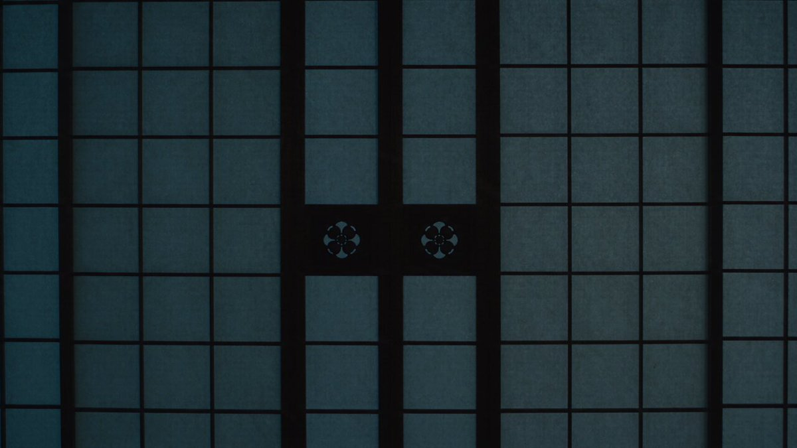

**İstem**

```text
SAHNE: Kapalı bir shojiye bakan iç mekân, 16:9. Sabit çerçeve. Kâğıt ızgara çekimi doldurur. El yok. İnsan silüeti yok. Okunabilir yazı yok. HAREKET: Kâğıt loş başlar. Sanki bir bulut geçmiş gibi paneller boyunca daha soğuk bir gün ışığı aydınlanır, ardından sabit kalır. Ahşap kafes hareket etmez. Bu bir kapının açılması değildir. Bir silme geçişi değildir. ODAK: Kâğıt lifi ve merkezdeki bir kumiko bağlantı noktası üzerinde son derece keskin. Kenarlar çerçevenin içinde kalır. FİZİK: Işık değişir. Ahşap ve kâğıt hareketsiz kalır. Bükülme yok. Kamera kayması yok. IŞIK: Yalnızca kâğıttan geçen dağınık gün ışığı. Elektrik rengi yok. Kâğıt üzerine çizilmiş sert güneş diski yok. STİL: Fotogerçekçi sinematik, dönem Japonyası, yıpranmış ahşap ve washi dokusu, yumuşak gren. Anime yok. Metin yok. Filigran yok. Logo yok.
```

[↑ Kategorilere dön](#catalog)

---

<a name="prompt-2100088243492385019"></a>

### Çeviri sürüyor

Yazar：[@Lianaalane](https://x.com/Lianaalane) · [Orijinal gönderi](https://x.com/Lianaalane/status/2100088243492385019)

Sinematik / Film Karesi · Şehir Manzarası / Sokak · Yayımlandı

**Özet:** Çeviri sürüyor

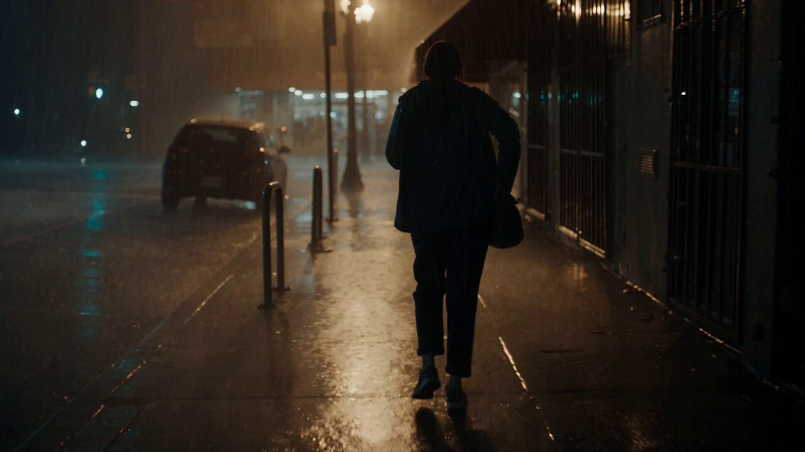

**İstem**

```text
Çeviri sürüyor
```

[↑ Kategorilere dön](#catalog)

---

<a name="prompt-2100088925603696879"></a>

### Bir devin ceketini onaran minik bir terzi hakkında 30 saniyelik sinematik 3D animasyon kısa film.

Yazar：[@SyntheSarah](https://x.com/SyntheSarah) · [Orijinal gönderi](https://x.com/SyntheSarah/status/2100088925603696879)

Sinematik / Film Karesi · 3D Modelleme · Yayımlandı

**Özet:** Bir devin ceketini onaran minik bir terzi hakkında 30 saniyelik sinematik 3D animasyon kısa film.

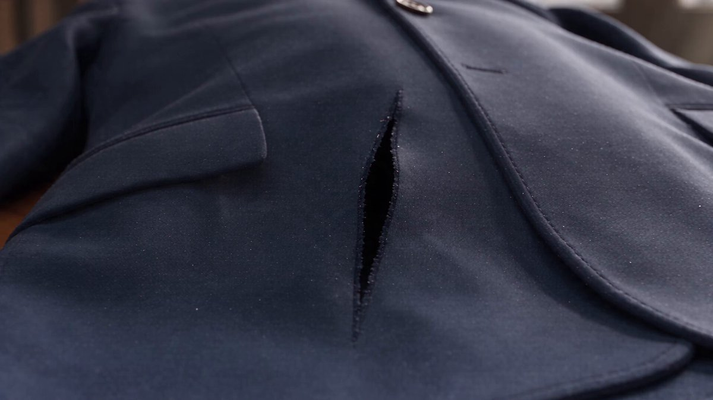

**İstem**

```text
The Tiny Tailor başlıklı 30 saniyelik birinci sınıf sinematik bir 3D animasyon kısa filmi oluşturun. Başından sonuna kadar kusursuz bir görsel devamlılık sağlayarak, minik terzinin yüzünü, vücudunu, giysilerini, oranlarını, renklerini ve aksesuarlarını her çekimde özdeş tutun; dikiş odası, masa, ceket, iğne ve ipliğin de boyut, şekil, konum ve görünüm açısından tutarlı kalmasını sağlayın. İnsan benzeri doğal hareketler, fiziksel olarak inandırıcı nesne etkileşimi, doğru anatomi içeren ve hiçbir yapaylık, bükülme, biçim değiştirme veya kamera sıçraması barındırmayan tek bir kesintisiz mantıksal zaman çizelgesi kullanın. Görsel tarz, plastik görünümlü karakterlerden veya çizgi film fiziğinden kaçınan, gerçekçi malzemeler, ayrıntılı kumaş, doğal dokular, fiziksel tabanlı aydınlatma, gerçekçi gölgeler, ince alan derinliği ve özenli uzun metrajlı film kalitesine sahip üst düzey sinematik 3D animasyondur. Hikaye, birkaç santim boyundaki minik bir terzinin elinde mezura ile devasa ahşap bir masada yürüyerek büyük, koyu mavi bir cekete yaklaşmasıyla zarif bir terzi atölyesinde başlar. Bir yırtık fark eder, neredeyse kendi boyundaki bir iğneye altın sarısı iplik geçirir ve yırtığı birden fazla açıdan gösterilen gerçekçi dikişlerle özenle onarır. Eserine hayran kalmak için bir adım geri çekilir, ardından devasa bir insan eli kareye girer ve ceketi alır. Son çekim, onarılan ceketi giyen devasa bir kişiyi ortaya çıkarır ve kamera geriye çekilerek minik terzinin elinde iğnesiyle ceketin cebinde gururla oturduğunu gösterir. Hızlı kesmeler veya imkansız fizik kuralları olmaksızın, baştan sona pürüzsüz sinematik kamera hareketleri, dengeli çerçeveleme ve tutarlı perspektif kullanın. Süre 30 saniye, en boy oranı 16'ya 9, yüksek ayrıntılı sinematik 3D animasyon çıktısı.
```

[↑ Kategorilere dön](#catalog)

---

<a name="prompt-2100085430976930255"></a>

### Çeviri sürüyor

Yazar：[@Noor\_ul\_ain43](https://x.com/Noor_ul_ain43) · [Orijinal gönderi](https://x.com/Noor_ul_ain43/status/2100085430976930255)

Sinematik / Film Karesi · Yayımlandı

**Özet:** Çeviri sürüyor

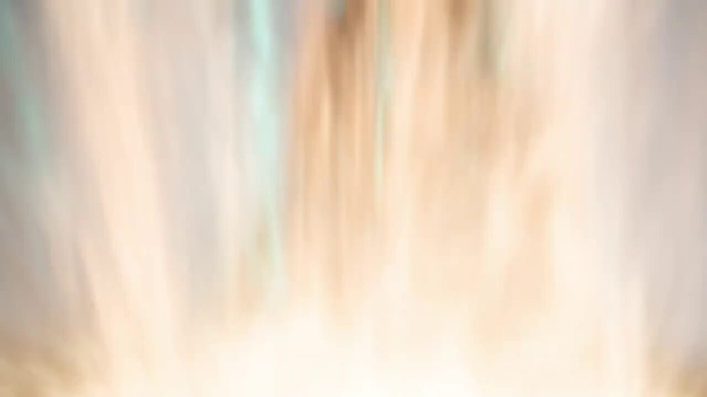

**İstem**

```text
Çeviri sürüyor
```

[↑ Kategorilere dön](#catalog)

---

<a name="prompt-2100072308350288351"></a>

### Çeviri sürüyor

Yazar：[@auqibhabib](https://x.com/auqibhabib) · [Orijinal gönderi](https://x.com/auqibhabib/status/2100072308350288351)

Sinematik / Film Karesi · Hayvan / Yaratık · Manzara / Doğa · Yayımlandı

**Özet:** Çeviri sürüyor

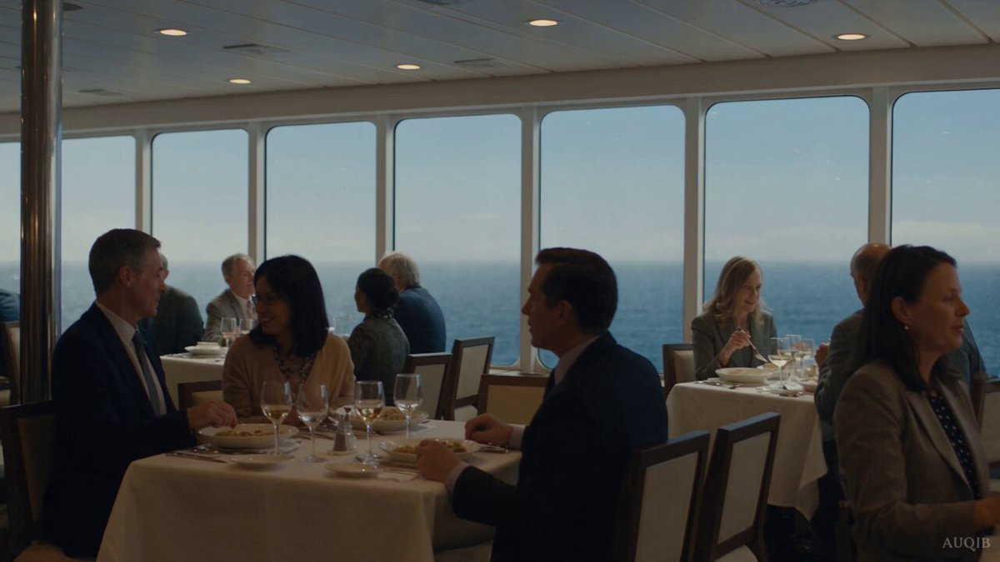

**İstem**

```text
Çeviri sürüyor
```

[↑ Kategorilere dön](#catalog)

---

<a name="prompt-2100031321774903354"></a>

### Çeviri sürüyor

Yazar：[@juliaevee](https://x.com/juliaevee) · [Orijinal gönderi](https://x.com/juliaevee/status/2100031321774903354)

Sinematik / Film Karesi · Yayımlandı

**Özet:** Çeviri sürüyor

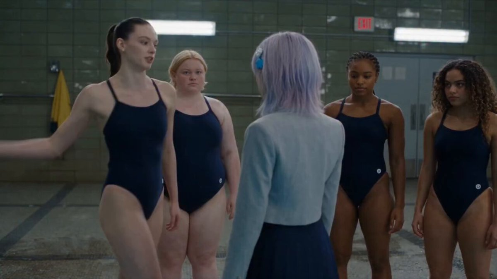

**İstem**

```text
Çeviri sürüyor
```

[↑ Kategorilere dön](#catalog)

---

<a name="prompt-2100013701659283924"></a>

### Çeviri sürüyor

Yazar：[@fps\_lusu](https://x.com/fps_lusu) · [Orijinal gönderi](https://x.com/fps_lusu/status/2100013701659283924)

Çizgi Roman / Hikaye Taslağı · Sinematik / Film Karesi · Anime / Manga · Karakter · Yayımlandı

**Özet:** Çeviri sürüyor

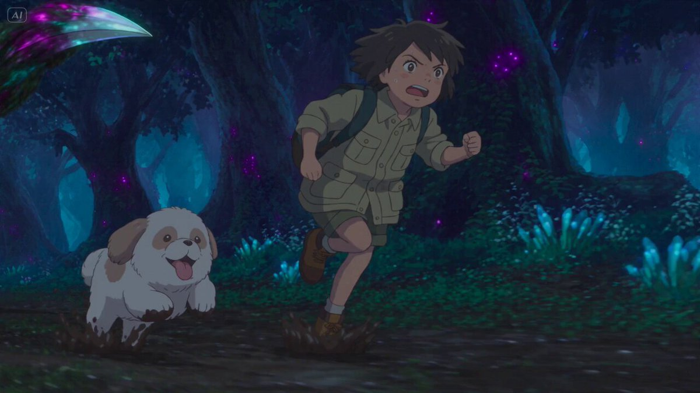

**İstem**

```text
Çeviri sürüyor
```

[↑ Kategorilere dön](#catalog)

---

<a name="prompt-2100043484849926230"></a>

### Çeviri sürüyor

Yazar：[@Aiwithmaha](https://x.com/Aiwithmaha) · [Orijinal gönderi](https://x.com/Aiwithmaha/status/2100043484849926230)

Fotoğrafçılık · Sinematik / Film Karesi · Retro / Vintage · Karakter · Yiyecek / İçecek · Şehir Manzarası / Sokak · Yayımlandı

**Özet:** Çeviri sürüyor

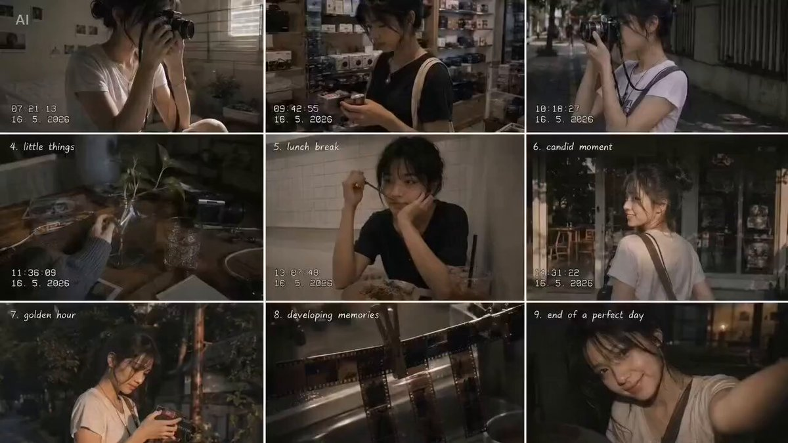

**İstem**

```text
Çeviri sürüyor
```

[↑ Kategorilere dön](#catalog)

---

<a name="prompt-2099404551199809774"></a>

### Çeviri sürüyor

Yazar：[@Lianaalane](https://x.com/Lianaalane) · [Orijinal gönderi](https://x.com/Lianaalane/status/2099404551199809774)

Sinematik / Film Karesi · Retro / Vintage · Araç · Yayımlandı

**Özet:** Çeviri sürüyor

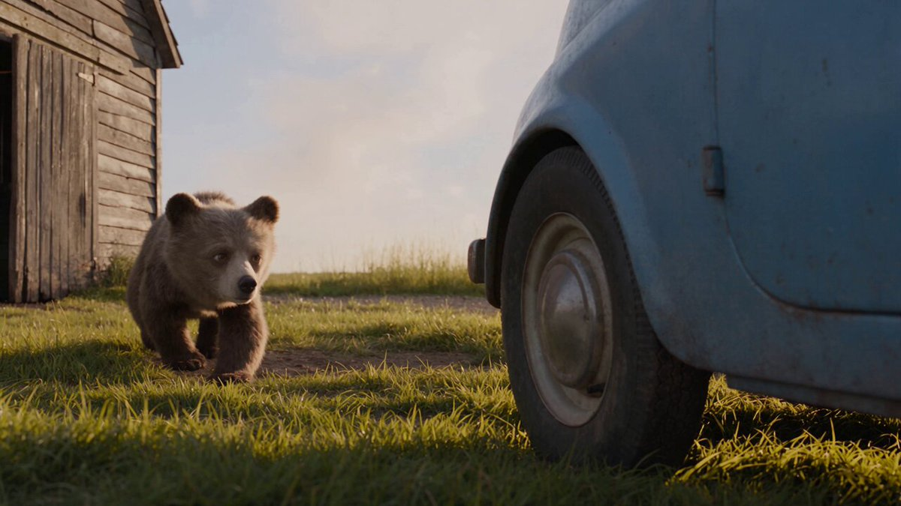

**İstem**

```text
Çeviri sürüyor
```

[↑ Kategorilere dön](#catalog)

---

<a name="prompt-2099327265888993335"></a>

### Kalabalık bir şehir caddesinde uçuşan güvercinler eşliğinde yolları kesişen bir adam ile kırmızı elbiseli bir kadının 15 saniyelik sinematik sekansı.

Yazar：[@Elvorya](https://x.com/Elvorya) · [Orijinal gönderi](https://x.com/Elvorya/status/2099327265888993335)

Sinematik / Film Karesi · Karakter · Moda Ürünü · Yayımlandı

**Özet:** Kalabalık bir şehir caddesinde uçuşan güvercinler eşliğinde yolları kesişen bir adam ile kırmızı elbiseli bir kadının 15 saniyelik sinematik sekansı.

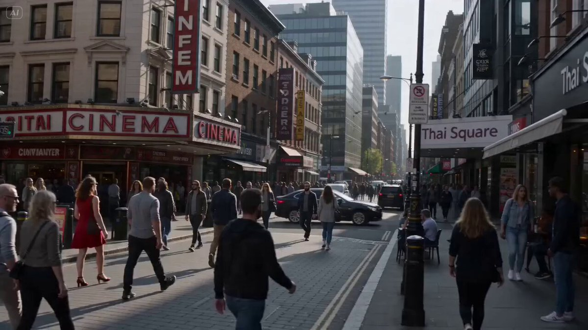

**İstem**

```text
Aydınlık bir ikindi vaktinde, Manhattan tarzı kalabalık bir şehir kavşağında geçen, 15 saniyelik fotogerçekçi ve sinematik bir kentsel sekans oluşturun. Yüksek şehir binaları, sinema tabelaları, vitrinler, trafik, sokak direkleri ve doğal bir şekilde hareket eden yüzlerce yaya ile çevrili kalabalık bir yaya caddesinde yumuşak, düşük açılı ileri kaydırma çekimiyle (forward tracking shot) başlayın. Koyu antrasit ceket ve koyu renk gömlek giymiş, orta yaşlı, sakallı ve sert görünümlü bir adam, ciddi ve düşünceli bir ifadeyle kalabalığın arasından kameraya doğru sabit adımlarla yürür. Adam yaklaşırken kamera yumuşak bir şekilde geriye doğru kayar, yayalar ön ve arka plandan doğal olarak geçerken onu net bir şekilde odakta tutar.

Zarif, dökümlü kırmızı elbiseli bir kadın aniden sahneye yandan girer ve adamın yanından geçerken kısa bir bakışma yaşanır. İnandırıcı göz teması ve doğal insan hareketini gösteren sinematik orta plan çekimlerle devam edin. Güvercinler aniden etraflarında havalanarak ön planda dinamik bir hareket ve ince bir görsel gerilim yaratır. Adamın yüzü, kalabalığın içinde ilerleyen kadın ve şehrin ölçeğini ve enerjisini gösteren geniş çevre çekimleri arasında kurgu yapın. Yumuşak, dengelenmiş kamera hareketinden hafif, elde taşınan sinematik bir hisse kademeli olarak geçiş yapın.

Son saniyelerde kamera yavaşça geriye doğru çekilir ve hafifçe yükselir; yüksek binalar arasında uzanan tamamen kalabalık caddeyi gözler önüne sererken, adam hareket eden kalabalığın içinde giderek küçülür. Sıcak doğal güneş ışığı, gerçekçi gölgeler, atmosferik derinlik, hafif lens parlaması (lens flare), yakın planlarda sığ alan derinliği, doğal cilt dokusu, gerçekçi saç ve kıyafet hareketi, fiziksel olarak doğru aydınlatma, özgün yaya davranışları, gerçekçi güvercinler ve hareket bulanıklığı (motion blur), sinematik renk derecelendirmesi, birinci sınıf uzun metrajlı film sinematografisi, yere basan fotogerçekçilik, son derece ayrıntılı kentsel ortam.

Animasyon yok, çizgi film görünümü yok, abartılı CGI yok, bozuk yüzler yok, çoğaltılmış insanlar yok, doğal olmayan vücut hareketleri yok, havada asılı nesneler yok, altyazı yok, logo yok, filigran yok. Sekans boyunca tutarlı karakter görünümü, giyim, ortam ve yüz hatlarını koruyun.

Çekim zamanlaması

0–3 sn: Kalabalık şehir caddesinde geniş/düşük açılı kaydırma çekimi.
3–6 sn: Sakallı adam kameraya yaklaşır, kamera yumuşakça geriye doğru kayar.
6–9 sn: Kırmızı elbiseli kadın adamın yolundan geçer; kısa bir göz teması.
9–12 sn: Yakın/orta plan çekimler + aniden ön planda uçuşan güvercinler.
12–15 sn: Kamera geriye çekilip yükselir, şehrin devasa kalabalık caddesini ve kalabalığın içinde kaybolan adamı ortaya çıkarır.
```

[↑ Kategorilere dön](#catalog)

---

<a name="prompt-2099332819768291755"></a>

### Çeviri sürüyor

Yazar：[@Just\_sharon7](https://x.com/Just_sharon7) · [Orijinal gönderi](https://x.com/Just_sharon7/status/2099332819768291755)

Sinematik / Film Karesi · Karakter · Moda Ürünü · Araç · Şehir Manzarası / Sokak · Yayımlandı

**Özet:** Çeviri sürüyor

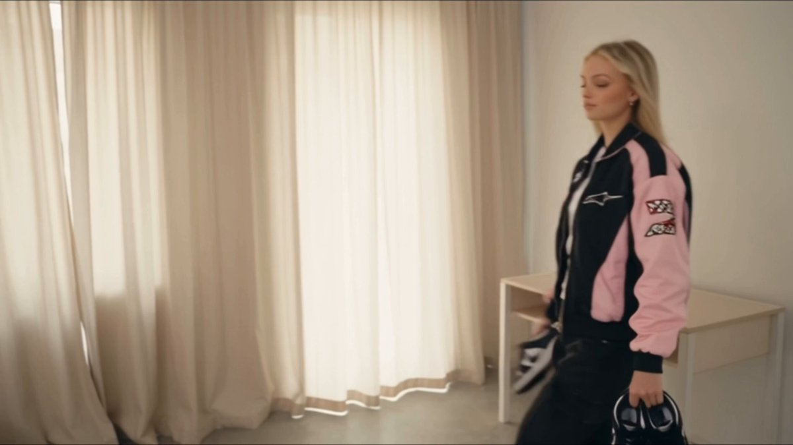

**İstem**

```text
Çeviri sürüyor
```

[↑ Kategorilere dön](#catalog)

---

<a name="prompt-2099299015527690460"></a>

### Japonya'da bir taşra kentinde geçen, bisikletle canlı müzik mekanına gidip arkadaşının akustik performansını izlemeyi ve gündelik insan ilişkilerini konu alan gerçekçi video üretim istemi.

Yazar：[@akiyoshisan](https://x.com/akiyoshisan) · [Orijinal gönderi](https://x.com/akiyoshisan/status/2099299015527690460)

Sinematik / Film Karesi · Karakter · Yayımlandı

Orijinal gönderi：[@akiyoshisan](https://x.com/akiyoshisan) · [Orijinal gönderi](https://x.com/akiyoshisan/status/2098940614666756371)

**Özet:** Japonya'da bir taşra kentinde geçen, bisikletle canlı müzik mekanına gidip arkadaşının akustik performansını izlemeyi ve gündelik insan ilişkilerini konu alan gerçekçi video üretim istemi.

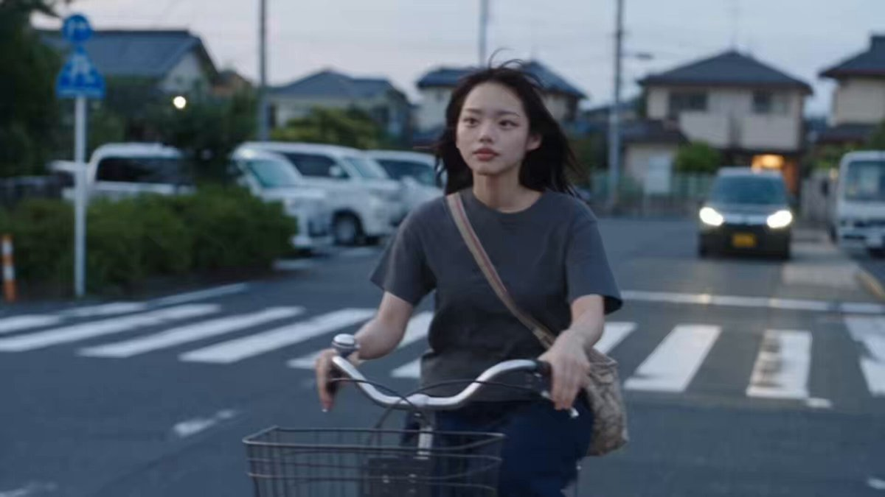

**İstem**

```text
Japonya'da bir taşra kenti. Akşamüstünden geceye.
Sakura şehirde bisiklet sürüyor → Küçük bir canlı müzik mekanının yanındaki bisiklet park yerine bırakıyor → İçeri giriyor → Seyircilerin arka tarafından arkadaşının akustik gitar eşliğinde şarkı söylemesini izliyor.

İkinci yarı: Arkadaşı akustik gitar çalarak şarkı söylüyor. Performans sırasında, seyircilerin arasındaki Sakura ile bir anlığına göz göze geliyor. El sallamak yok. Abartılı gülümsemek yok. Çalmayı bırakmak yok. Aralarındaki bağı yalnızca bakışlar ve yüzdeki ufacık mimik değişimleri gösteriyor.

Konser bittikten sonra aynı mekanın yanında buluşuyorlar.
Sakura ilk kısımdaki aynı bisikleti elinde itiyor, arkadaşıyla yan yana gece yolunda yürüyor.

Diyalog neredeyse hiç yok.
Yalnızca canlı performans sırasında kısa şarkı sesi.
Elde çekim titremesi, otomatik odak kararsızlığı ve pozlama dalgalanmalarına doğal olarak izin veriliyor.
Aşırı oyunculuk, mankenvari hareketler, altyazı, seslendirme, didaktik duygu ifadeleri, logo ve özel isimler yok.
```

[↑ Kategorilere dön](#catalog)

---

<a name="prompt-2099284949496906161"></a>

### Kuzey Kutbu'nda geçen, 15 saniyelik nefes kesici bir sinematik hayatta kalma hikayesi. Seçkin bir arama-kurtarma helikopteri, donmuş bir okyanusta şiddetli bir kar fırtınasının ortasında, parçalanan buz kütleleri üzerinde mahsur kalmış bir kâşifi kurtarmak için bir acil durum sinyaline doğru hızla ilerliyor.

Yazar：[@DeCat2025](https://x.com/DeCat2025) · [Orijinal gönderi](https://x.com/DeCat2025/status/2099284949496906161)

Sinematik / Film Karesi · Manzara / Doğa · Yayımlandı

Orijinal gönderi：[@DeCat2025](https://x.com/DeCat2025) · [Orijinal gönderi](https://x.com/DeCat2025/status/2098478244496343184)

**Özet:** Kuzey Kutbu'nda geçen, 15 saniyelik nefes kesici bir sinematik hayatta kalma hikayesi. Seçkin bir arama-kurtarma helikopteri, donmuş bir okyanusta şiddetli bir kar fırtınasının ortasında, parçalanan buz kütleleri üzerinde mahsur kalmış bir kâşifi kurtarmak için bir acil durum sinyaline doğru hızla ilerliyor.

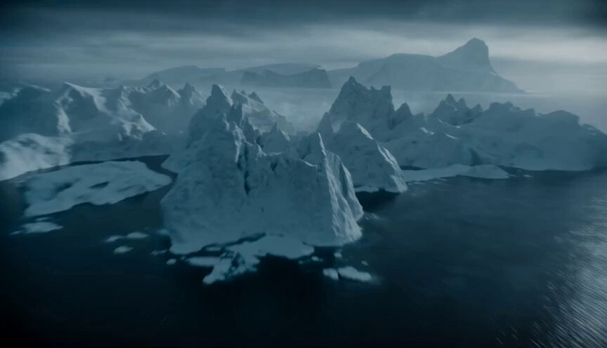

**İstem**

```text
Kuzey Kutbu'nda geçen, 15 saniyelik nefes kesici bir sinematik hayatta kalma hikayesi. Şiddetli bir kar fırtınası donmuş bir okyanus üzerinde uğuldarken, seçkin bir arama-kurtarma helikopteri bir acil durum sinyaline doğru hızla ilerliyor. Aşağıda, yalnız bir kâşif hızla sürüklenen bir buz kütlesinin üzerinde mahsur kalmış durumda ve ayaklarının altında devasa çatlaklar yayılıyor. Bir kurtarma yüzücüsü bembeyaz tipinin içine doğru bir kabloyla alçalırken, helikopter şiddetli rüzgarların arasında havada asılı duruyor. Tam kurtarıcı kâşife ulaştığı anda, buz sahanlığı paramparça oluyor ve devasa buz kütleleri donmuş denize çarpıyor. 

Kurtarıcı son saniyede kâşifi yakalıyor ve arkalarında devasa bir buzdağının çökmesiyle ikisi de gökyüzüne doğru çekiliyor; bu çöküş, kırılan buzların üzerinden aşan güçlü bir dalgayı tetikliyor. Kamera, sonsuz buzulların üzerinde geniş bir hava çekimiyle başlıyor, kar fırtınası boyunca alçak irtifada yoğun bir kovalamacaya dalıyor, kurtarma anında dramatik bir yakın plana geçiyor ve ardından donmuş manzara altlarında parçalanırken uzaklaşan helikopteri gösteren epik, geniş bir açıyla geri çekiliyor. 

Hiper-gerçekçi, fotogerçekçi Kutup ortamı, gerçekçi kar fiziği, dönen kar fırtınası, dinamik rotor rüzgarı, sinematik hacimsel aydınlatma, yoğun atmosferik sis, buz kristalleri, ayrıntılı kurtarma ekipmanı, IMAX ölçeği, Unreal Engine 5 kalitesi, dramatik kamera hareketi, ultra-gerçekçi su ve buz simülasyonu, 8K gerçekçilik, başyapıt, metin yok, filigran yok, 16:9.
```

[↑ Kategorilere dön](#catalog)

---

<a name="prompt-2099289940701946340"></a>

### Jack'in sigara içip sokağa dik dik baktığı plan hareketi istemi.

Yazar：[@XStrangeHistory](https://x.com/XStrangeHistory) · [Orijinal gönderi](https://x.com/XStrangeHistory/status/2099289940701946340)

Sinematik / Film Karesi · Karakter · Şehir Manzarası / Sokak · Yayımlandı

**Özet:** Jack'in sigara içip sokağa dik dik baktığı plan hareketi istemi.

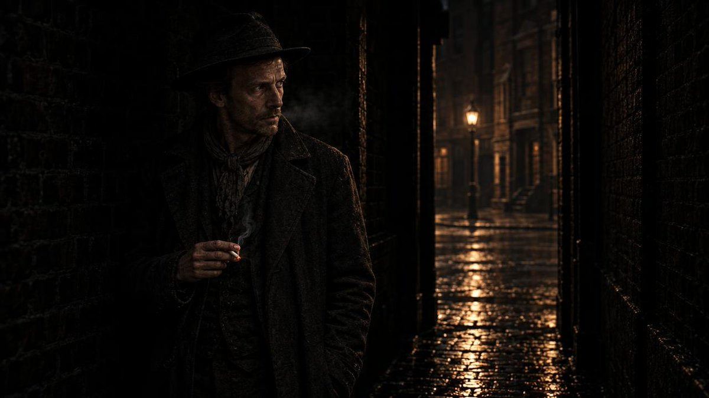

**İstem**

```text
Jack sigarasından bir nefes çeker, o çektikçe köz daha parlak parlar, ardından yavaşça nefesini verir, duman süzülerek dağılır. Gözleri ilerideki sokakta sabit kalır, bunun dışında tamamen hareketsizdir. Sabit kamera; arkasındaki sokak sığ bir bulanıklık içine doğru yumuşar.
```

[↑ Kategorilere dön](#catalog)

---

<a name="prompt-2099089929439531390"></a>

### Çeviri sürüyor

Yazar：[@MeenakshiYACS](https://x.com/MeenakshiYACS) · [Orijinal gönderi](https://x.com/MeenakshiYACS/status/2099089929439531390)

Sinematik / Film Karesi · Karakter · Yayımlandı

**Özet:** Çeviri sürüyor

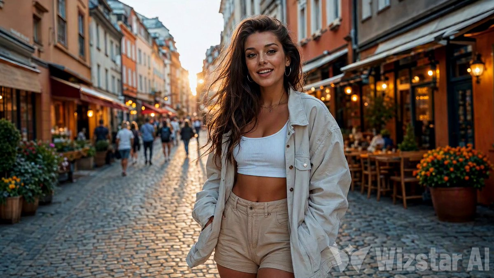

**İstem**

```text
Çeviri sürüyor
```

[↑ Kategorilere dön](#catalog)

---

<a name="prompt-2098797781792047191"></a>

### Çeviri sürüyor

Yazar：[@MadMax\_Series](https://x.com/MadMax_Series) · [Orijinal gönderi](https://x.com/MadMax_Series/status/2098797781792047191)

Sinematik / Film Karesi · Yayımlandı

**Özet:** Çeviri sürüyor


**İstem**

```text
Çeviri sürüyor
```

[↑ Kategorilere dön](#catalog)

---

<a name="prompt-2098803826405089450"></a>

### Çeviri sürüyor

Yazar：[@MeenakshiYACS](https://x.com/MeenakshiYACS) · [Orijinal gönderi](https://x.com/MeenakshiYACS/status/2098803826405089450)

Sinematik / Film Karesi · Araç · Yayımlandı

**Özet:** Çeviri sürüyor


**İstem**

```text
Çeviri sürüyor
```

[↑ Kategorilere dön](#catalog)

---

<a name="prompt-2098777905010778507"></a>

### Çeviri sürüyor

Yazar：[@bmx\_ai13](https://x.com/bmx_ai13) · [Orijinal gönderi](https://x.com/bmx_ai13/status/2098777905010778507)

Sinematik / Film Karesi · Siberpunk / Bilim Kurgu · Yayımlandı

**Özet:** Çeviri sürüyor


**İstem**

```text
Çeviri sürüyor
```

[↑ Kategorilere dön](#catalog)

---

<a name="prompt-2098791384392282330"></a>

### Çeviri sürüyor

Yazar：[@abulu8](https://x.com/abulu8) · [Orijinal gönderi](https://x.com/abulu8/status/2098791384392282330)

Sinematik / Film Karesi · Yayımlandı

**Özet:** Çeviri sürüyor


**İstem**

```text
Çeviri sürüyor
```

[↑ Kategorilere dön](#catalog)

---

<a name="prompt-2098748314548134381"></a>

### Çeviri sürüyor

Yazar：[@johnAGI168](https://x.com/johnAGI168) · [Orijinal gönderi](https://x.com/johnAGI168/status/2098748314548134381)

Çizgi Roman / Hikaye Taslağı · Fotoğrafçılık · Sinematik / Film Karesi · Yayımlandı

**Özet:** Çeviri sürüyor


**İstem**

```text
Çeviri sürüyor
```

[↑ Kategorilere dön](#catalog)

---

<a name="prompt-2098590274410950732"></a>

### Kızıl cübbeli bir kılıç ustası ile üç hasır şapkalı suikastçı arasında bambu ormanında geçen sinematik Doğu dövüş sanatları düellosu.

Yazar：[@rachses2](https://x.com/rachses2) · [Orijinal gönderi](https://x.com/rachses2/status/2098590274410950732)

Sinematik / Film Karesi · Manzara / Doğa · Yayımlandı

**Özet:** Kızıl cübbeli bir kılıç ustası ile üç hasır şapkalı suikastçı arasında bambu ormanında geçen sinematik Doğu dövüş sanatları düellosu.


**İstem**

```text
Ultra hızlı geleneksel Doğu dövüş sanatları koreografisine adanmış 30 saniyelik, 16:9, 24fps bir kısa film oluşturun. Yüksek bütçeli sinematik fotogerçekçi canlı çekim + AAA sinematik kalite. Altyazı yok, kullanıcı arayüzü yok, logo yok, dış ses yok, arka plan müziği yok—yalnızca kırılan bambu sapları, hışırdayan yapraklar, şaklayan ipek kumaş, kılıç vızıltıları, ince dallara basan ayakların keskin sesleri, metalik kılıç çarpmaları, gövdeye inen ağır darbeler, kamçı hareketli kamera kaydırmaları (whip pan) ve keskin nefes verişler korunsun.

Karakterler

Başrol: Kızıl cübbeli yalnız suikastçı, tek bir çift ağızlı düz kılıç (Jian), esnek ipek kuşak, sakin ve ölümcül bir duruş.

Suikastçılar (3 Hasır Şapkalı Suikastçı): Birbirinin aynı koyu gri cübbeler, gözleri gizleyen konik bambu şapkalar. Farklı silahlar: Suikastçı A (Zincirli orak/Kusarigama), Suikastçı B (Çift kanca kılıç), Suikastçı C (Ağır demir asa).

Öz ve Aksiyon
Maksimum çeviklik, yer çekimine meydan okuyan yaprak üzeri hareketler ve dur durak bilmeyen çok yönlü saldırılar. İlk kare, üç suikastçının da yüksek bambu örtüsünden aynı anda aşağı düşmesiyle açılır. Hafif adımlarla ağaca tırmanma, eğilmiş bambu saplarından aşağı kayma, havada silah yönlendirmeleri, dönerek yapılan kuşak sarmaları ve sallanan dallarda asılıyken yakın mesafeden yapılan seri savuşturmalar içerir.

Tek Seferlik Hız Rampası (Speed Ramp)
4. saniyede tek bir 0,12 saniyelik mikro yavaşlama: Suikastçı A'nın zincirli orağı, başrolün boğazına santimetreler kala bir bambu sapına dolanır; uçuşan kabuk parçalarını, zincirdeki gerilimi ve başrolün havada zinciri kesmeden önce soğuk bakışlarla bıçağı takip edişini gösterir.

Kamera ve Çevre
Baş dönmesi hissi veren dikey kamera eğilmeleri (tilt), yoğun bambu sapları arasında hızlı takip çekimleri, aşağı yönlü düşüşleri takip eden geniş açılı lens, ağır asa darbelerinde sarsılan kamera. Çevre şiddetle tepki verir: rüzgâr patlamalarıyla savrulan yüzlerce yeşil yaprak, ayak baskısıyla kırılan bambu sapları, ani yön değişikliklerinin etrafında dönen yoğun sis.

Bitiş Sekansı
Başrol, yükseklik kazanmak için Suikastçı C'nin saplama hamlesi yapan asasına basar, aşağı doğru 720° ters dönerek B'nin kanca kılıçlarını kesip A'yı silahsızlandıran bir vuruş yapar, ardından boyun hizasında hızlı bir ters saplama için doğrudan C'nin arkasına iner. Son kare, kırılan bambu sapları tek galibin etrafına yıkılırken durulan kızıl cübbeleri yakalar.
```

[↑ Kategorilere dön](#catalog)

---

<a name="prompt-2098622086608773436"></a>

### Beyaz saçlı kadın savaşçının düşman ordusuna ve devasa ağır zırhlı askere karşı tek başına verdiği mücadeleyi film kalitesinde anlatan, 23 saniyelik çok çekimli epik karanlık fantezi savaş sekansı.

Yazar：[@Noor\_ul\_ain43](https://x.com/Noor_ul_ain43) · [Orijinal gönderi](https://x.com/Noor_ul_ain43/status/2098622086608773436)

Sinematik / Film Karesi · Yayımlandı

**Özet:** Beyaz saçlı kadın savaşçının düşman ordusuna ve devasa ağır zırhlı askere karşı tek başına verdiği mücadeleyi film kalitesinde anlatan, 23 saniyelik çok çekimli epik karanlık fantezi savaş sekansı.


**İstem**

```text
23 saniyelik ultra sinematik bir karanlık fantezi savaş sekansı oluşturun, fotogerçekçi, yüksek bütçeli fantastik film estetiği, 16:9 geniş ekran.

SAHNE 1 — 0–3 saniye
Devasa bir savaş alanının önünde tek başına duran beyaz saçlı gizemli bir kadın savaşçının arkasından başlayın. Rüzgarda doğal bir şekilde dalgalanan uzun gümüşi beyaz saçları, koyu renkli orta çağ deri ve metal zırhı ve sırtına asılı bir kılıcı vardır. Önünde, savaş alanını kaplayan devasa bir ordu yer alır. Uzakta orta çağdan kalma harabe kuleler ve katedral benzeri yapılar görünür. Güneş ufukta alçalmış, yoğun duman ve tozun arasından güçlü, altın rengi bir ters ışık oluşturmaktadır. Arkasından yavaş ve sinematik kamera yaklaşması (push-in), hafif atmosferik pus, gerçekçi rüzgar hareketi, destansı ölçek.

SAHNE 2 — 3–6 saniye
Aniden yoğun aksiyona geçiş yapın. Savaşçı hızla ileriye, çatışmaya doğru atılır. Uçuşan kıvılcımlar, duman ve enkazların arasında ilerlerken dinamik bir alt açı takip çekimi (low-angle tracking shot). Kılıcını muazzam bir hızla savururken kılıç sıcak güneş ışığını yakalar. Gerçekçi hareket bulanıklığı (motion blur), uçuşan közler, toz parçacıkları ve ayrıntılı metal yansımaları kullanın. Kamera, sinematik kompozisyonu korurken hareketini agresif bir şekilde takip eder.

SAHNE 3 — 6–9 saniye
Savaşçının savaş alanında büyük, zırhlı bir düşmanla dövüştüğünü gösterin. Düşman ağır bir kuvvetle saldırırken o güçlü bir kılıç darbesi indirir. Silahlar çarpıştığında kıvılcımlar saçılır. Zemin çamurlu, hasar görmüş ve molozlarla kaplıdır. Etraflarını yanan nesneler ve küçük ateşler sarmıştır. Çarpışma anında el kamerası tarzında sinematik kamera hareketi kullanın, ardından dramatik etkiyi vurgulamak için aksiyonu kısa süreliğine yavaşlatın.

SAHNE 4 — 9–12 saniye
Saldırının ardından savaşçı savaş alanına sert bir iniş yapar. Etrafında toz ve duman savrulurken zırhlı gövdesini kameraya yakın gösterin. Gümüşi saçları rüzgarda dalgalanır. Kılıcı hazır vaziyette yavaşça ayağa kalkar. Arkasında, harabeye dönmüş orta çağ şehri devasa altın sarısı gün batımına karşı silüet halindedir. Güçlü hacimsel ışıklandırma, atmosferik perspektif ve gerçekçi çevresel detaylar.

SAHNE 5 — 12–15 saniye
Savaşçının yüzüne yoğun bir yakın çekime geçin. İfadesi şiddetli, odaklanmış ve kararlıdır. Gümüşi beyaz saçları yüzünü kısmen çerçeveler. Gözleri yaklaşan bir düşmana kilitlenmiş durumdadır. Sıcak gün batımı ışığı yüzünün bir tarafını aydınlatırken diğer tarafı daha karanlık ve dramatik kalır. Son derece ayrıntılı cilt, gerçekçi gözler, ince nefes alışverişi ve doğal yüz hareketleri. Sinematik alan derinliği.

SAHNE 6 — 15–18 saniye
Ona doğru ilerleyen devasa düşman ordusunu gözler önüne serin. Yüzlerce veya binlerce karanlık, savaştan hırpalanmış insansı figür harap olmuş savaş alanında ilerler. Havayı duman, toz ve korlar doldurur. Kamera yavaşça geriye ve yukarıya doğru çekilerek ordunun muazzam büyüklüğünü ve önlerinde tek başına duran küçük savaşçıyı ortaya çıkarır. Arka planda devasa harabe kuleler yükselir.

SAHNE 7 — 18–21 saniye
Çevresindeki savaş alanı giderek kaotikleşirken savaşçı tamamen hareketsiz durur. Hasarlı zeminde çatlaklar ve parlayan korlar belirir. Duman kameranın önünden süzülür. Gün batımı harabe şehrin arkasında parlak bir şekilde parıldar. Savaşçının yalnızlığını ve gücünü vurgulamak için onun etrafında yavaş, 360 derecelik sinematik bir kamera hareketi kullanın. Rüzgar pelerinini, saçını ve kıyafetlerini doğal bir şekilde hareket ettirir.

SAHNE 8 — 21–23 saniye
Son derece geniş bir genel çekimle (establishing shot) bitirin. Savaşçı, arkasında devasa harabe şehir ve yanan ufuk uzanırken harap olmuş savaş alanının merkezinde tek başına durmaktadır. Toz ve duman altın rengi ışığın içinde yavaşça süzülür. Karakter devasa çevre içinde küçücük kalana kadar kamera yavaş yavaş daha da uzaklaşır. Güçlü, sinematik bir donuk kare ile sonlandırın ve hafifçe siyaha karartın.
```

[↑ Kategorilere dön](#catalog)

---

<a name="prompt-2098625650852815257"></a>

### Yanan bir tapınak avlusunda bir kılıç ustası ile bir oni arasındaki 30 saniyelik savaş için ayrıntılı 6 çekimli sinematik istem.

Yazar：[@bmx\_ai13](https://x.com/bmx_ai13) · [Orijinal gönderi](https://x.com/bmx_ai13/status/2098625650852815257)

Sinematik / Film Karesi · Yayımlandı

**Özet:** Yanan bir tapınak avlusunda bir kılıç ustası ile bir oni arasındaki 30 saniyelik savaş için ayrıntılı 6 çekimli sinematik istem.


**İstem**

```text
6 çekim, toplam 30 sn: 0.0-5.0 sn, 5.0-10.0 sn, 10.0-15.0 sn, 15.0-20.0 sn, 20.0-25.0 sn, 25.0-30.0 sn. Sert kesmeler, erime (dissolve) yok. Baştan sona normal hız, ağır çekim yok, hız rampalama (ramping) yok.

ÇEKİM KADANSI KRİTİK: yerel 24 fps, gerçek 180 derece enstantane, her karede gerçek 1/48 sn pozlama. Akıcı, kesintisiz hareket bulanıklığı (motion blur). Asla kesik kesik değil, asla titreşimli değil. Enterpolasyon yok, gölgelenme (ghosting) yok, video görünümü yok.

EKRANDA METİN OLMAMASI KRİTİK: karenin hiçbir yerinde herhangi bir türde metin yok. Altyazı, başlık, jenerik, filigran, logo, zaman kodu, arayüz kaplaması yok.

KAREDE BAŞKA KİMSE OLMAMASI KRİTİK: keşiş, köylü veya figüran yok. Yalnızca kılıç ustası, oni ve bir karga görünür.

ATEŞ KRİTİK: yanan tapınağın közleri her kare boyunca sürüklenir ve parlar; ara sıra bir vuruşu flaş gibi aydınlatacak kadar parlak parıldar. Aydınlanan herhangi bir anın kademeli niteliği tamamen köz parlamasından gelir, asla bozuk görüntüden kaynaklanmaz; kamera hareketi baştan sona pürüzsüz kalır. Düşen küller ekranın solundan sağına doğru çapraz bir şekilde savrulur.

Özne Kilidi - Kılıç Ustası: zayıf ve yıpranmış vücut yapısı, kırlaşmış kısa kesilmiş saçlar, sert çene, is bulaşmış cilt, temiz yüz, dövme yok. Kömür rengi hakama ve yanmış çivit mavisi haori, tek çelik omuzluk, saman sandaletler. Kavisli katanayı iki eliyle kavrar. Yanan tapınak avlusunda oni'ye doğru ilerler; her vuruşta duruşu alçak ve kontrollüdür.

Özne Kilidi - Oni: devasa boynuzlu iblis, görünür gözenekleri olmayan, erimiş turuncu ışıkla fay hatları boyunca parlayan çatlak obsidyen kırmızısı ten, fildişi dişli çene, birbirine girmiş siyah yele. Sivri uçlu çivilerle kaplı devasa bir demir kanabo taşır. Yeri sarsan ağır adımlarla ilerler, asla koşmaz.

Dünya Katmanı: geceleri yanan bir tapınak avlusu; parçalanmış taştan bir torii kapısı, kiremit döken çöken bir pagoda çatısı, kırık fenerlerin saçıldığı geniş bir çakıllı avlu, tapınak duvarının ötesinde uzaktaki yanan çatılar. Başka hiçbir yapı sağlam durmuyor.

ATMOSFER KRİTİK, yalnızca derinlik: yüksek yoğunlukta ağır duman pusu; kılıç ustası yakında net, oni orta mesafede yumuşatılmış, yanan çatılar uzakta neredeyse silinmiş. Yalnızca yoğunlaştırılmış duman havası, asla bir sis makinesi görünümü yok.

ÇEKİM 1 0.0-5.0 sn. İLERLEYİŞ. Çakıl seviyesinde alçak kamera, 15° eğik açı (cant), kılıç ustasını ileriye doğru takip ediyor. Kılıç ustası savrulan közlerin arasından adımlarla ilerler, katana kaldırılmış, oni ileride heybetle belirir. Kılıç ustası ekranın solunda ilerliyor, oni ekranın sağında avluyu dolduruyor. Diejetik ses.

ÇEKİM 2 5.0-10.0 sn. ÇARPIŞMA. Kamera göğüs hizasında dar açıyla yörüngede döner, eğim 15-35° arasında değişir, asla düz değildir. Katana kıvılcım yağmuru içinde kanabo'ya çarparak çınlar, kılıç ustası bir adım geri savrulur. İkisi de ortalanmış, çakıllar havaya fırlıyor. Diejetik ses.

ÇEKİM 3 10.0-15.0 sn. KEHANET. Çöken pagoda çatısından kiremitler yağarken aniden havalanan bir kargaya kesme. Düşen enkazdan hızla uzaklaşarak süzülür. Karga, yanan çatı hattına karşı ortalanmıştır. Diejetik ses.

ÇEKİM 4 15.0-20.0 sn. ÇÖKÜŞ. Avluda alçak sabit kamera, pagoda çatısı çökerken hızla yukarı kayar (whip-pan). Çatı bölümü kopar ve gürültüyle avluya çarpar; kılıç ustası çakıl ve kül içinden yuvarlanarak kurtulur. Çatı kirişi kadrajı çapraz keser, kılıç ustası alt ortadan yükselir. Diejetik ses.

ÇEKİM 5 20.0-25.0 sn. HÜCUM. Kamera zemin seviyesine iner, ateş ışığının parlamasıyla aydınlanan, sürüklenen közlerden oluşan bir koridor boyunca ileriye doğru fırlar. Kılıç ustası eğilerek koşar, katanası kıvılcımlar saçar, oni'nin yan tarafına doğru sokulur. Kılıç ustası ekranın solundan sağına doğru hamle yapar. Diejetik ses.

ÇEKİM 6 25.0-30.0 sn. SONRASI. Kamera, közlerin yatıştığı ve rüzgarın dindiği geniş ve sabit bir avlu kadrajına çekilir. Oni'nin parlayan fay hatları kararırken ve kadrajın dışına devrilirken, kılıç ustası tek başına durur, katana indirilmiş, göğsü inip kalkmaktadır. Kılıç ustası küçük ve ortalanmış, arkada yanan pagoda karanlığa gömülmüştür. Diejetik ses.

Kareler Arası Kurallar: kılıç ustasının haori'si, omuzluğu ve sandaletleri asla değişmez. Oni'nin fay hattı parıltısı Çekim 6'ya kadar asla tamamen sönmez. Yalnızca kılıç ustası, oni ve karga görünür. Kül yönü sabit kalır. Pagoda nerede görünürse görünsün aynı silueti korur. Köz parıltısı yalnızca Çekim 1, 2 ve 5 içinde geçerlidir. Hiçbir noktada müzik devreye girmez.

Son Kare: kılıç ustası avluda tek başına durur, katana indirilmiş, közler etrafında süzülür, oni'nin karanlık düşmüş silüeti kadrajın kenarında, pagoda'nın kırık silüeti arkada cılız bir şekilde yanmaktadır. Ekranda metin yok, logo yok, filigran yok.

Ses Katmanı: yalnızca diejetik — çıtırdayan ateş, düşen kiremitler, katananın demire çarpıp çınlaması, oni'nin derinden gelen gırtlaksı kükremesi, ayaklar altında ezilen çakıl, bir karganın tiz çığlığı. Müzik yok, altyazı yok.

Kamera ve Çekim Gerçekçiliği: ~32mm/68° Görüş Açısı (FOV), ateş ışığından kaynaklanan oval bokeh ve çizgisel parlamalara (streak flares) sahip vintage 2x anamorfik, sığ alan derinliği, renkli negatif sunumu, ince gren. 15-45° arasında değişen eğik açılı (cant) sert el kamerası kullanımı, hızla içeri girip geri çekilme, her kare hareketin ortasında ama kendi devinimi içinde akıcı, asla sabitlenmemiş, asla gimbal pürüzsüzlüğünde değil. CGI görünümü yok, yapay zeka pürüzsüzlüğü yok, video oyunu arayüzü (HUD) yok, hareket yumuşatma yok.
```

[↑ Kategorilere dön](#catalog)

---

<a name="prompt-2098623498922897725"></a>

### Bir şelalenin yanında çöken ip köprüyü geçen kadın maceracıyı anlatan, zaman çizelgesiyle senkronize ses ipuçları içeren 15 saniyelik ayrıntılı sinematik komut.

Yazar：[@m\_zubaair](https://x.com/m_zubaair) · [Orijinal gönderi](https://x.com/m_zubaair/status/2098623498922897725)

Sinematik / Film Karesi · Yayımlandı

**Özet:** Bir şelalenin yanında çöken ip köprüyü geçen kadın maceracıyı anlatan, zaman çizelgesiyle senkronize ses ipuçları içeren 15 saniyelik ayrıntılı sinematik komut.


**İstem**

```text
Uzun, dağınık ve doğal bir şekilde dalgalanan saçlara sahip, gerçekçi doğa yürüyüşü kıyafetleri, dayanıklı botlar ve bir sırt çantası giymiş güzel, genç bir Amerikalı kadın maceracı, iki devasa yeşil dağ arasına asılmış son derece eski ve dengesiz ahşap bir ip köprüyü dikkatle geçmektedir. Köprünün hemen yanından aşağıya gürül gürül dökülen devasa bir şelale, muazzam miktarda çağlayan su ve sis üretmektedir. Aşağıdaki kanyon inanılmaz derecede derin ve ürkütücüdür.

ÖNEMLİ: 15 saniyenin tamamı boyunca son derece gerçekçi, sürükleyici ve senkronize bir ses tasarımı oluşturun. Her ses, görsel eylem ve kamera hareketiyle doğal olarak eşleşmelidir.

00:00–00:03
Devasa dağ kanyonunun, narin ahşap ip köprünün ve yanındaki dev şelalenin geniş, sinematik bir tanıtım çekimiyle başlayın.
SES:

- Güçlü ve sürekli şelale kükremesi
- Yoğun çağlayan su sesi ve uzaktan gelen yankı
- Sert dağ rüzgârı
- Hafif ip gıcırtısı ve ahşap köprünün hareketi
- Çok uzaktan hafifçe duyulan doğal kuş sesleri

Kadın köprüye dikkatle adım atar.
Eski ahşap tahtalara basan gerçekçi yürüyüş botu adımları ekleyin:
“GÜM… GICIRTI… GÜM… GICIRTI…”

00:03–00:06
Kadın köprüde ilerlemeye devam ederken kamera onun arkasına ve hafifçe yukarısına geçer. Salık saçları rüzgârda doğal bir şekilde hareket eder. Şelale yanında şiddetle akmaktadır.
SES:

- Ayak sesleri daha netleşir ve biraz hızlanır
- Ahşap tahtalar kadının ağırlığı altında inler
- İplerin gerilme gıcırtısı
- Kadının etrafında uğuldayan rüzgâr
- Sahnenin altında kesintisiz kükreyen güçlü şelale sesi

00:06–00:09
Ayağını son derece eski bir diğer tahtaya basar. Aniden tahta bükülür ve botunun altında çatlamaya başlar.
SES TASARIMI ŞİDDETLENMELİDİR:

- Yüksek ahşap çatlama sesleri: “ÇAT… ÇAT…”
- Keskin tahta kıymıklanma sesleri
- Gerilen ve kopan iplerin sesi
- Kadının nefesi hızlanır
- Korkuyla alınan kısa bir nefes

İlerideki birkaç tahta peş peşe kırılmaya başlar.

00:09–00:12
Arkasındaki tüm köprünün çökmekte olduğunu fark eder. Ahşap tahtalar kırılıp aşağıdaki devasa kanyona düşerken, kadın çaresizce karşı dağa doğru koşar.
SES:

- Hızlı ve senkronize ayak sesleri: “KÜT-KÜT-KÜT-KÜT”
- Çok sayıda yüksek ahşap çatlama ve parçalanma sesi
- Şiddetle gıcırdayan ve kopan ipler
- Havada ıslık çalarak düşen ahşap tahtalar
- Devasa şelale kükremesi ve kanyon yankısı
- Kadının korku dolu nefes alışverişi
- Giderek artan sinematik gerilim

00:12–00:14
Son bir umutsuz sıçrayış yapar ve diğer taraftaki sağlam zemine ulaşır. Geriye döner ve köprünün geri kalanının şelale kanyonuna tamamen çöküşünü şok içinde izler.
SES:

- Son ve tok bir tahta ÇATLAMASI
- Aşağıya doğru çarparak düşen çok sayıda tahta
- Derin ip kopma sesi
- Kanyon boyunca yankılanan devasa enkaz düşüşü
- Çok aşağılardan gelen su çarpma sesleri

00:14–00:15
Hayatta kaldığını anlar. Yüz ifadesi korkudan yerini saf bir rahatlama ve mutluluğa bırakır. Gülümser, hafifçe güler, sevinçle kollarını kaldırır ve yıkılmış köprüye bakarak rahatlamış bir şekilde derin bir nefes alır.
SES:

- Şelale sesi devam eder ancak biraz yumuşamıştır
- Dağların arasından hafifçe esen rüzgâr
- Kadının rahatlamış nefesi
- Hafif, neşeli bir gülüş / mutluluk dolu iç çekiş
- Hafif, coşkulu, sinematik müzik yükselişi
- Huzurlu ve doğal bir dağ ambiyansıyla bitiş

Tüm ses kaydı, devasa bir dağ kanyonunda gerçek mekânda kaydedilmiş hissi vermelidir. Hiçbir yapay veya çizgi film benzeri ses efekti olmamalıdır. Mükemmel işitsel-görsel senkronizasyon, gerçekçi akustik yansımalar, doğal kanyon yankısı, dinamik ses seviyesi değişimleri, etkileyici uzamsal ses, gerilimden rahatlamaya uzanan sinematik ilerleme.

Görsel stil: ultra fotogerçekçi, gerçekçi insan anatomisi, doğal yüz ifadeleri, gerçekçi ten ve saç hareketi, fiziksel olarak doğru ahşap yıkımı, inandırıcı ip fiziği, gerçekçi şelale sisi, dramatik dağ ölçeği, sinematik kamera hareketi, HDR, 4K detay.
```

[↑ Kategorilere dön](#catalog)

---

<a name="prompt-2098461817555374451"></a>

### Blender'da gri model ve animasyon yapımını yönlendiren ve PixVerse ile nihai videoyu üreten GTA tarzı araba takibi tüm süreç talimatı.

Yazar：[@Aria\_Nawi](https://x.com/Aria_Nawi) · [Orijinal gönderi](https://x.com/Aria_Nawi/status/2098461817555374451)

Sinematik / Film Karesi · 3D Modelleme · Araç · Yayımlandı

**Özet:** Blender'da gri model ve animasyon yapımını yönlendiren ve PixVerse ile nihai videoyu üreten GTA tarzı araba takibi tüm süreç talimatı.


**İstem**

```text
Şu iş akışını kullanarak GTA'dan ilham alan özgün bir çizgi film araba takibi sahnesi oluşturun: Tasarım: Bir ana sürücü, bir kaçış arabası, bir takip eden araba ve bir kentsel ortam belirleyin. Tasarımlarını tutarlı tutun. 4 saniyelik üç çekim planlayın: arkadan takip eden kovalamaca, keskin bir viraj boyunca yandan takip ve geniş bir çıkış çekimi. Blender'da İnşa: Temiz gri modeller ile işlevsel karakter ve araç donantıları (rig) oluşturun. Doku veya UV açma gerekli değildir. Canlandırma ve Test: Sürücüyü, direksiyonu, tekerlek dönüşünü, araçları ve kameraları canlandırın. Tutarlı bir gidiş yönü ve araç sıralaması sağlayın. İçe geçmeleri (clipping), havada duran tekerlekleri, kayan lastikleri, bozuk pozları ve direksiyonla teması kesilen elleri düzeltin. Blender'da Render: 1–288 arasındaki kareleri 1280×720 çözünürlükte, 24 fps hızında render edin. Blender'da render edilen gerçek kareleri 12 saniyelik eksiksiz bir gri model master videoda birleştirin. Her çekimi ayrı ayrı dışa aktarın ve şekil ile kompozisyon referansı olarak eşleşen gri hareketsiz kareleri render edin. PixVerse Eklentisi ile Tamamlama: Her çekimi ayrı ayrı işleyerek 720p çözünürlükte Seedance 2.5 kullanın. Blender kliplerini hareket referansı, gri hareketsiz kareleri ise şekil referansı olarak kullanın. Üretim isteminde tutarlı bir çizgi film renk paleti tanımlayın. Kamera hareketini, aksiyon zamanlamasını, karakter ve araç tasarımlarını ve araç sayısını koruyun. İnceleme ve Teslimat: Her iki tamamlanmış videoyu görsel kusurlar ve devamlılık açısından inceleyin. Blender'daki sorunları düzeltin ve çekim başına en fazla iki yeniden deneme hakkıyla yalnızca başarısız olan Seedance çekimlerini yeniden üretin. Düzenlenebilir .blend dosyasını, yerel 720p Blender gri model videosunu, ayrı olarak etiketlenmiş 720p Seedance sürümünü ve kalan sınırlılıkların kısa bir değerlendirmesini teslim edin.
```

[↑ Kategorilere dön](#catalog)

---

<a name="prompt-2098450393277595841"></a>

### Referans görsele dayanarak Griffith Gözlemevi 3D salonunu Blender'da yeniden oluşturmaya ve PixVerse ile render almaya yönelik üç çekimli iş akışı talimatı.

Yazar：[@leilamakes](https://x.com/leilamakes) · [Orijinal gönderi](https://x.com/leilamakes/status/2098450393277595841)

Sinematik / Film Karesi · 3D Modelleme · Yayımlandı

**Özet:** Referans görsele dayanarak Griffith Gözlemevi 3D salonunu Blender'da yeniden oluşturmaya ve PixVerse ile render almaya yönelik üç çekimli iş akışı talimatı.


**İstem**

```text
Foucault sarkacı, kubbe duvar resimleri, bronz korkuluklar, mermer zemin, banklar, gök küreleri, masa lambaları ve astronomik sergiler dahil olmak üzere yerel Blender'da Griffith Gözlemevi'nin merkezi kubbeli salonunun düzenlenebilir bir 3D yeniden canlandırmasını oluşturun. Üç adet 5 saniyelik çekimden oluşan 15 saniyelik stabil bir kamera sekansı oluşturun: Salona doğru ilerleyin, yükselin ve merkezi sarkacın etrafında dönün. Kubbenin ve duvar resimlerinin etrafında dönmek için yukarı bakan yükseltilmiş bir kamera kullanın. Bir gök küresine yaklaşın ve akıcı bir detay yörünge hareketi yapın. Tam olarak bu kamera animasyonlarını kullanarak gri model videoları işleyin (render alın). Nihai videoları üretmeden önce kamera hareketini, çerçevelemeyi, mekânsal akışı ve örtünmeyi inceleyin. PixVerse'te Seedance 2.5 kullanın. Her çekim için ilgili gri model videoyu ve Griffith Gözlemevi'nin iç mekanına ait aynı gerçek fotoğrafı yükleyin. Fotoğraf malzemeleri, renkleri, duvar resimlerini ve aydınlatmayı kontrol eder. Gri model video ise oda düzenini, kompozisyonu, perspektifi ve kamera hareketini kontrol eder. Prompt: @gray-model video üretmek için @reference image görsel stilini kullanın. Gri model videodaki mimariyi, mobilya konumlarını, nesne sayısını, çerçevelemeyi, perspektifi ve kamera hareketini kesinlikle koruyun. Yalnızca referans görseldeki gerçekçi malzemeleri, kubbe duvar resimlerini ve sıcak iç mekan aydınlatmasını uygulayın. Her nesneyi hareketsiz tutun. İnsan, mobilya, kapı, pencere veya sergi ögesi eklemeyin. Mimariyi veya kamera yolunu değiştirmeyin. Kesintilerden, sarsıntılardan, bükülmelerden, titremelerden veya düzen değişikliklerinden kaçının. Üretilen her çekimi inceleyin ve yalnızca belirgin sorunları olan çekimleri yeniden üretin. Onaylanan çekimleri 15 saniyelik tek bir videoda birleştirin ve her çekimin ilk karesini dışa aktarın. Düzenlenebilir Blender projesini, gri model videoları, üretilen üç çekimi, nihai videoyu, prompt'ları ve ilk kare ekran görüntülerini teslim edin.
```

[↑ Kategorilere dön](#catalog)

---

<a name="prompt-2098487159363871212"></a>

### Bir kadının yüksek kattaki bir otel odasından balkona doğru davetsiz misafirlerden kaçtığı 30 saniyelik sinematik aksiyon-gerilim sahnesi.

Yazar：[@aaassa120](https://x.com/aaassa120) · [Orijinal gönderi](https://x.com/aaassa120/status/2098487159363871212)

Sinematik / Film Karesi · Karakter · Yayımlandı

**Özet:** Bir kadının yüksek kattaki bir otel odasından balkona doğru davetsiz misafirlerden kaçtığı 30 saniyelik sinematik aksiyon-gerilim sahnesi.


**İstem**

```text
Gece vakti, yüksek bir kattaki modern ve lüks bir otel odasında geçen ultra fotogerçekçi, sinematik, 30 saniyelik aksiyon-gerilim sahnesi. Kullanışlı koyu renk bir ceket, pantolon ve rahat ayakkabılar giymiş yetişkin, profesyonel bir kadın, şifrelenmiş gibi görünen gizemli bir USB belleği seyahat çantasına koyup güvenceye aldıktan sonra takip edildiğini fark eder.

0–5 sn: Otel masasındaki USB belleğin dar makro yakın çekimi. Kadın belleği hızla kapar, kapıya bakar, seyahat çantasına koyar ve çantayı kapatır. Üç ani kapı çalışı onu olduğu yere çiviler.

5–10 sn: Otel kapısına doğru yavaş sinematik yaklaşma. Ardından boğuk bir erkek sesi “Kapıyı aç. İçeride olduğunu biliyoruz,” derken sert bir vuruş duyulur. Yüz ifadesi şaşkınlıktan korkuya döner. Fısıldayarak “Bu imkânsız,” der, ardından temkinli bir şekilde geri adım atar.

10–15 sn: Yavaşça aşağı doğru dönen kapı kolunun aşırı yakın çekimi. Gerçekçi mandal ve kilit sesleri. Seyahat çantasını kapıp balkona doğru koşan kadının korku dolu yüzüne kesme.

15–20 sn: Balkonun cam sürgülü kapısını iki eliyle, rayın direncini fiziksel olarak yenerek açar. Serin gece havası saçlarını ve ceketini doğal bir şekilde hareket ettirir. Arkasında, otel odasının kapısı bir darbeyle şiddetle sarsılır. Kadın, yüksek kenarın yakınında gerçekçi bir denge kurarak dikkatlice balkona adım atar.

20–25 sn: Otel kapısına güçlü bir darbe daha iner. Kilit ve pervaz, kapı menteşeleri üzerinde doğal bir şekilde içeri doğru açılmadan önce direnir. Kapı aralığında kısmen görünen bir siluet belirir. Kadın balkonda daha da ilerlerken ani hava akımıyla etraftaki kâğıtlar uçuşur.

25–30 sn: Korkuluğa ulaşır ve çok aşağıdaki şehre bakar. Dar bir boşlukla ayrılan komşu balkona döner, ardından yaklaşan siluete tekrar bakar. Korkuluğu sıkıca kavrar ve fısıldar: “Düşün.” Dramatik dış geniş çekim; otel cephesini, kadının balkonunu ve komşu balkonu gözler önüne serer.

Ayakları yere basan film gerçekçiliği, gerçekçi insan oyunculuğu ve biyomekaniği, doğru yerçekimi, momentum, eylemsizlik, sürtünme, denge, kapı mekaniği, sürgülü cam hareketi, kumaş devinimi, nesne ağırlığı, doğal gece aydınlatması, kontrollü omuz kamerası sinematografisi, gerçekçi alan derinliği, doğal hareket bulanıklığı, pratik efekt estetiği, senkronize diyalog ve ses tasarımı, uzaktaki şehir ambiyansı, ayak sesleri, nefes alışverişi, kapı darbeleri, kilit titreşimi, cam kapı hareketi ve gece rüzgârı.

Süper kahraman fiziği yok, imkânsız sıçrama yok, düşme yok, ışınlanma yok, havada asılı nesneler yok, patlayan kapı yok, sebepsiz kırılan cam yok, abartılı rüzgâr yok, robotik oyunculuk yok, bozuk anatomi yok, değişen yüz veya kıyafet yok, yinelenen karakterler yok, imkânsız kamera hareketleri yok, CGI görünümü yok, kan yok, vahşet yok, metin yok, logo yok, filigran yok.

Heyecanın doruk noktasında siyaha sert bir kesmeyle sona erer..
```

[↑ Kategorilere dön](#catalog)

---

<a name="prompt-2098447487266914317"></a>

### Çeviri sürüyor

Yazar：[@liluocheng13](https://x.com/liluocheng13) · [Orijinal gönderi](https://x.com/liluocheng13/status/2098447487266914317)

Çizgi Roman / Hikaye Taslağı · Fotoğrafçılık · Sinematik / Film Karesi · Yayımlandı

**Özet:** Çeviri sürüyor


**İstem**

```text
Çeviri sürüyor
```

[↑ Kategorilere dön](#catalog)

---

<a name="prompt-2098432763368178141"></a>

### Blender ön görselleştirmesi ve PixVerse render'ına dayalı sinematik üç çekimli şehir içi araba kovalamacası tam süreç üretim talimatı.

Yazar：[@n\_\_deborah](https://x.com/n__deborah) · [Orijinal gönderi](https://x.com/n__deborah/status/2098432763368178141)

Sinematik / Film Karesi · 3D Modelleme · Araç · Şehir Manzarası / Sokak · Yayımlandı

**Özet:** Blender ön görselleştirmesi ve PixVerse render'ına dayalı sinematik üç çekimli şehir içi araba kovalamacası tam süreç üretim talimatı.


**İstem**

```text
Blender'dan PixVerse'e yapılandırılmış bir iş akışı kullanarak özgün, fotogerçekçi ve sinematik bir araba kovalamacası oluşturun. İki araba, bir sürücü ve bir kentsel çevre tasarlayın. Arkadan takip, yandan takip eden viraj dönüşü ve geniş açıdan çıkış içeren, birbiriyle bağlantılı 4 saniyelik üç çekim oluşturun. Blender'da araç hareketini, tekerlek dönüşünü, direksiyon yönlendirmesini, sürücü etkileşimini ve kamera yollarını canlandırıp doğrulayın. 12 saniyelik 1280×720 gri model bir video render edin. Kompozisyonu, perspektifi ve araç kimliğini koruyarak ilgili ilk karelerden sinematik referans görseller oluşturmak için PixVerse Plugin ve Seedance 2.5 kullanın. Orijinal kamera hareketini, yörüngeleri, zamanlamayı, renkleri ve mekânsal ilişkileri korurken her bir çekimi üretmek için bu referansları Blender videolarıyla birlikte kullanın.
```

[↑ Kategorilere dön](#catalog)

---

<a name="prompt-2098432658166694305"></a>

### GTA tarzı araba kovalamaca sahnesi için Blender animasyonu ve yapay zeka render iş akışı istemi.

Yazar：[@Mapunda\_01](https://x.com/Mapunda_01) · [Orijinal gönderi](https://x.com/Mapunda_01/status/2098432658166694305)

Sinematik / Film Karesi · 3D Modelleme · Araç · Yayımlandı

**Özet:** GTA tarzı araba kovalamaca sahnesi için Blender animasyonu ve yapay zeka render iş akışı istemi.


**İstem**

```text
Fotogerçekçi, canlı aksiyon sinematik dokunuşa sahip, GTA'dan ilham alan özgün bir araba takibi sahnesi oluşturun. Sürücüyü, iki arabayı ve kentsel ortamı tasarlayın. Üç adet 4 saniyelik çekim planlayın: arkadan takip eden kovalamaca, keskin bir virajda yandan takip ve geniş bir çıkış çekimi. Araçlar, tekerlek dönüşü, direksiyon, sürücü hareketi ve kameralar dahil olmak üzere sahneyi ve animasyonu Blender'da oluşturun. 12 saniyelik gri model videosunun tamamını 1280×720 ve 24 fps'de render alın. Ardından, kompozisyonu, perspektifi, özne konumlarını ve araç sayısını koruyarak her çekimin ilk gri karesini fotogerçekçi sinematik bir referansa dönüştürmek için Seedance 2.5 ile PixVerse Eklentisini kullanın. Araç kimliğini, renkleri, kamera hareketini, yörüngeleri ve aksiyon zamanlamasını koruyarak nihai çekimleri üretmek için her sinematik referansı ilgili Blender videosuyla birlikte kullanın.
```

[↑ Kategorilere dön](#catalog)

---

<a name="prompt-2098432693222715716"></a>

### Blender'da 12 saniyelik tek çekim bir büyücü atölyesi animasyonu oluşturun ve bunu PixVerse Seedance 2.5 ile stilize edin.

Yazar：[@KICHOCHEZI](https://x.com/KICHOCHEZI) · [Orijinal gönderi](https://x.com/KICHOCHEZI/status/2098432693222715716)

Sinematik / Film Karesi · 3D Modelleme · Yayımlandı

**Özet:** Blender'da 12 saniyelik tek çekim bir büyücü atölyesi animasyonu oluşturun ve bunu PixVerse Seedance 2.5 ile stilize edin.


**İstem**

```text
Sağlanan büyücü atölyesi referansına dayalı olarak Blender'da 12 saniyelik, tek çekim bir beyaz model (white-model) animasyonu oluşturun. Taş duvarları, ahşap rafları, kemerli pencereyi, şömineyi, kitapları, astronomik aleti ve iksir şişeleriyle dolu simya masasını inşa edin. Tam olarak bir iksir tutan tek bir sağ elle alçak bir birinci şahıs bakış açısı canlandırın. Şişe sağ alt kenara yakınken başlayın, atölyenin etrafına ve pencereye doğru bakın, iksiri doğal bir şekilde kaldırın, incelemek için duraklayın, ardından şömineye ve parlayan reaktiflere doğru dönerken indirin. Beyaz model MP4'ü dışa aktarın. Ardından, kamera, hareket ve mekânsal düzen için Blender videosunu, görünüm için ise sağlanan görselleri referans alarak PixVerse'i Seedance 2.5 ile kullanın. Yıpranmış taş, oymalı ahşap, eskitilmiş deri, gerçekçi cam, soğuk pencere ışığı, sıcak şömine aydınlatması, parlayan büyülü sıvılar, doğal alevler, közler, kıvılcımlar ve duman eklerken kesintisiz çekimi ve zamanlamayı koruyun.
```

[↑ Kategorilere dön](#catalog)

---

<a name="prompt-2098411323562324348"></a>

### Çeviri sürüyor

Yazar：[@johnAGI168](https://x.com/johnAGI168) · [Orijinal gönderi](https://x.com/johnAGI168/status/2098411323562324348)

Çizgi Roman / Hikaye Taslağı · Poster / El İlanı · Sinematik / Film Karesi · Çizgi Roman / Grafik Roman · Karakter · Moda Ürünü · Yayımlandı

**Özet:** Çeviri sürüyor


**İstem**

```text
Çeviri sürüyor
```

[↑ Kategorilere dön](#catalog)

---

<a name="prompt-2098353311808385384"></a>

### Çeviri sürüyor

Yazar：[@TanLuAI](https://x.com/TanLuAI) · [Orijinal gönderi](https://x.com/TanLuAI/status/2098353311808385384)

Çizgi Roman / Hikaye Taslağı · Sinematik / Film Karesi · Araç · Yayımlandı

Orijinal gönderi：[@TanLuAI](https://x.com/TanLuAI) · [Orijinal gönderi](https://x.com/TanLuAI/status/2098041885856272478)

**Özet:** Çeviri sürüyor


**İstem**

```text
Çeviri sürüyor
```

[↑ Kategorilere dön](#catalog)

---

<a name="prompt-2098330707374514573"></a>

### Gece vakti neon ışıklı bir şehir caddesinde üç şarkıcının yer aldığı ayrıntılı çok çekimli sinematik müzik videosu istemi.

Yazar：[@meAsifAi](https://x.com/meAsifAi) · [Orijinal gönderi](https://x.com/meAsifAi/status/2098330707374514573)

Sinematik / Film Karesi · Şehir Manzarası / Sokak · Yayımlandı

**Özet:** Gece vakti neon ışıklı bir şehir caddesinde üç şarkıcının yer aldığı ayrıntılı çok çekimli sinematik müzik videosu istemi.


**İstem**

```text
Gece vakti neon ışıklı bir şehirde duygusal ve modern bir şarkı seslendiren üç genç yetişkin şarkıcının yer aldığı 30 saniyelik ultra gerçekçi sinematik bir müzik videosu oluşturun. Video; gerçekçi insanlar, kusursuz dudak senkronizasyonu, etkileyici performanslar, atmosferik aydınlatma ve sofistike sinematografi ile yüksek bütçeli profesyonel bir müzik videosu gibi görünmelidir.

KARAKTERLER

Karakter 1 — Baş Kadın Vokal:
Genç yetişkin kadın, 20'li yaşların başı, uzun siyah saçlar, etkileyici gözler, zarif siyah-gümüş kıyafet, kendinden emin ama duygusal bir kişilik.

Karakter 2 — Baş Erkek Vokal:
Genç yetişkin erkek, 20'li yaşların başı, koyu renkli dokulu saçlar, şık siyah ceket ve beyaz gömlek, karizmatik ve duygusal açıdan dışavurumcu.

Karakter 3 — Kadın Vokalist:
Genç yetişkin kadın, 20'li yaşların başı, omuz hizasında koyu renkli saçlar, modaya uygun koyu kırmızı kıyafet, enerjik ama doğal sahne duruşu.

Video boyunca yüzlerini, kıyafetlerini, saç stillerini, vücut oranlarını ve kimliklerini mükemmel bir şekilde tutarlı tutun.

ÇEVRE

Hafif bir yağmurun ardından gece vakti fütüristik bir şehir merkezi caddesi. Renkli neon tabelaları yansıtan ıslak kaldırım, parlayan vitrinler, hafif sis, uzaktaki trafik, sinematik bokeh, atmosferik şehir ışıkları ve gerçekçi yansımalar.

PLAN PLAN ÇEKİM LİSTESİ

0–4 sn — Açılış
Karakter 1'in gözlerinin aşırı yakın planı (extreme close-up). Gözlerinde neon yansımaları açıkça görülür. Şarkı söylemeye başladıkça kamera yavaşça geriye doğru çekilir. Arka planda yağmur damlaları parıldar.

4–8 sn — Baş Vokal Performansı
Karakter 1, doğrudan kameraya doğru şarkı söylerken ıslak caddede yavaşça yürür. Geriye doğru akıcı kaydırma çekimi (tracking shot). Saçları gece rüzgarında doğal bir şekilde dalgalanır.

8–12 sn — Erkek Kısmı
Neon ışıklı bir binaya yaslanmış Karakter 2'ye geçiş. Kendi bölümünü söylemeye başlar. Arkasında rengarenk şehir ışıkları bulanıklaşırken, etrafında ağır sinematik kamera dönüşü (orbit).

12–16 sn — Kadın Vokalist
Karakter 3 neon caddede yürürken belirir. Kameraya bakarak şarkı söyler. Akıcı yandan kaydırma çekimi yakın plana (close-up) dönüşür.

16–22 sn — Üçlü Performans
Üç karakter de geniş bir şehir kavşağında buluşur ve birlikte performans sergiler. Onlar şarkı söylerken kamera yavaşça etraflarında döner. Doğal etkileşim, ince jestler, inandırıcı kimya.

22–27 sn — Duygusal Nakarat
Seri ama zarif yakın plan dizilimi: Karakter 1 söylerken, Karakter 2 katılır, Karakter 3 armoni yapar. Her ağız hareketi sağlanan sesi hassas bir şekilde takip eder.

27–30 sn — Kapanış Çekimi
Üç şarkıcı ıslak caddenin ortasında birlikte durur. Kamera yavaşça yukarı doğru yükselir ve uzaklaşarak çevrelerindeki ışıl ışıl şehri gözler önüne serer. Şarkının son sözünü tam ritminde birlikte tamamlarlar. Dramatik ve sinematik bir geniş açıyla sona erer.

SİNEMATOGRAFİ

Üst düzey müzik videosu sinematografisi, anamorfik lens görünümü, sığ alan derinliği, gimbal ile akıcı takip, ağır çekim vurguları, sinematik yakın planlar, kontrollü kamera hareketi, gerçekçi lens parlamaları (lens flare), doğal hareket bulanıklığı (motion blur), hoş bokeh ve dinamik kompozisyon.

SES VE PERFORMANS

Verilen şarkıyı/sesi birebir film müziği olarak kullanın. Karakterler doğru sözleri fonem düzeyinde kusursuz dudak senkronizasyonuyla görünür şekilde söylemelidir. İfadeler, göz hareketleri ve jestler şarkının duygusu ve ritmiyle uyuşmalıdır. Konu dışı diyalog konuşması olmamalıdır.

KALİTE

Ultra gerçekçi, fotogerçekçi insanlar, doğal cilt dokusu, gerçekçi gözler ve dişler, fiziksel olarak doğru aydınlatma, gerçekçi ıslak yüzeyler, detaylı saç telleri, gerçekçi kumaş hareketi, HDR, sinematik kontrast, profesyonel renk düzenleme, 4K detay, birinci sınıf müzik videosu estetiği.

NEGATİF: yüz bozulması/morflanması, kimlik değişiklikleri, tutarsız kıyafetler, fazladan insanlar, kopya karakterler, bozuk eller, deforme olmuş yüzler, doğal olmayan yürüyüş, robotik hareketler, hatalı dudak senkronizasyonu, rastgele konuşmalar, titreme, kare enterpolasyonu kusurları, metin, altyazı, logolar, filigranlar.
```

[↑ Kategorilere dön](#catalog)

---

<a name="prompt-2098284076809719997"></a>

### Genç bir cadının devasa bir su hortumuyla yanan bir Orta Çağ köyünü söndürdüğü sinematik karanlık fantezi sahnesi.

Yazar：[@Zoyavelle](https://x.com/Zoyavelle) · [Orijinal gönderi](https://x.com/Zoyavelle/status/2098284076809719997)

Sinematik / Film Karesi · Yayımlandı

**Özet:** Genç bir cadının devasa bir su hortumuyla yanan bir Orta Çağ köyünü söndürdüğü sinematik karanlık fantezi sahnesi.


**İstem**

```text
Gizemli ve doğaüstü bir felaket sırasında bir Orta Çağ Avrupa köyünde geçen, son derece gerçekçi, sinematik bir fantastik video oluşturun. Solgun tenli, uzun düz siyah saçlı, büyük sivri uçlu siyah bir cadı şapkası, koyu siyah pelerin ve koyu bordo Orta Çağ elbisesi giymiş genç ve güzel bir kadın, köylüler ona korku ve şüpheyle bakarken kalabalık bir Orta Çağ köyünde yürür. Ahşap karkaslı evler, taş sokaklar, eski pazar tezgâhları, rustik giysiler içindeki Orta Çağ köylüleri, atmosferik duman ve sis.

Masif taştan bir kemere doğru yürür ve köye tepeden bakan açık bir avluya çıkar. Uzakta, birkaç Orta Çağ evi yoğun bir şekilde yanmakta, devasa turuncu alevler ve yoğun siyah dumanlar gökyüzüne yükselmektedir. Cadı aniden doğaüstü bir hâl alarak yerin üzerinde öne doğru uçar; koyu renkli pelerini ve elbisesi rüzgârda dramatik bir şekilde dalgalanır.

Devasa büyülü bir su hortumu yanan köyün ortasında aniden yükselir, sokaklara hücum eden ve alevleri söndürmeye başlayan devasa, dönen bir su sütunu oluşturur. Gizemli uçan cadı dumanlı gökyüzünden geçerken köylüler toplanır ve şok içinde yukarı bakar.

Duman ve suyla kaplı Orta Çağ köyünün, yanan çatıların, korkmuş köylülerin ve devasa su girdabının dramatik havadan çekimlerini gösterin. Genç cadının köylülerin arasında sakince durduğu ve doğrudan kameraya esrarengiz bir ifadeyle baktığı sinematik bir yakın çekimle sonlandırın.

Fotogerçekçi, sinematik karanlık fantezi, Orta Çağ Avrupası, gerçekçi insan yüzleri, ayrıntılı kıyafetler ve mimari, hacimsel aydınlatma, doğal yangın ve duman simülasyonu, gerçekçi su fiziği, dramatik atmosfer, sığ alan derinliği, gerçekçi kamera hareketi, akıcı hareket, film kalitesinde kompozisyon, yüksek detay, 4K, anamorfik sinematik görünüm, dramatik aydınlatma, gerçekçi dokular, epik fantastik film tarzı.
```

[↑ Kategorilere dön](#catalog)

---

<a name="prompt-2098319351917002812"></a>

### Hollywood aksiyon gişe rekortmeni tarzında yağmurlu gece sokak kovalamacası sahnesi; kadın kahraman SUV takibinden kaçıyor ve motosikletle binalar arasında atlayış yapıyor.

Yazar：[@codewithhajra](https://x.com/codewithhajra) · [Orijinal gönderi](https://x.com/codewithhajra/status/2098319351917002812)

Sinematik / Film Karesi · Araç · Mimari / İç Mekan · Yayımlandı

**Özet:** Hollywood aksiyon gişe rekortmeni tarzında yağmurlu gece sokak kovalamacası sahnesi; kadın kahraman SUV takibinden kaçıyor ve motosikletle binalar arasında atlayış yapıyor.


**İstem**

```text
Karakter: 20'li yaşlarının başında, doğal gerçekçi hatlara sahip, uzun koyu kahverengi saçlı, atletik yapılı, şık siyah taktik ceket, vücuda oturan koyu renk pantolon ve askeri botlar giyen güzel bir kadın. Kararlı ve korkusuz görünüyor.

Sahne — 0–3sn:
Yağmurla ıslanmış bir şehir ara sokağında gece vakti. Neon tabelalar ıslak zeminde yansıyor. Kadın kameraya doğru koşarken, arkasında siyah bir SUV aniden bir barikata çarpıp parçalıyor. Havada kıvılcımlar ve enkaz parçaları uçuşuyor.

Sahne — 3–6sn:
Park halindeki bir arabanın kaputu üzerinden hızla kayıyor, kendi etrafında dönerek gelen bir saldırıdan kıl payı kurtuluyor. Kamera onu hızlı bir elde takip çekimiyle izliyor. Saçları ve ceketi aksiyonla birlikte doğal bir şekilde hareket ediyor.

Sahne — 6–8sn:
Koltuğun üzerinden bir motosiklet kaskı kapıyor, şık siyah bir motosikletin üzerine atlıyor ve ara sokakta hızlanıyor. Farları yağmuru yarıp geçen SUV onu arkasından kovalıyor.

Sahne — 8–10sn:
Motosiklet iki bina arasındaki küçük bir rampadan fırlıyor. Havada uçarken adeta donmuş gibi ağır çekim, arkasında şehir ışıkları parlıyor. Sorunsuzca yere iniyor ve hızla uzaklaşıyor.

Görsel stil: Üst düzey Hollywood aksiyon gişe rekortmeni filmi, fotogerçekçi, sinematik aydınlatma, dramatik yağmur, gerçekçi fizik, pratik görünümlü patlamalar, dinamik kamera hareketi, sığ alan derinliği, anamorfik lens parlamaları, ayrıntılı yüz ifadeleri, gerçekçi cilt dokusu, birinci sınıf VFX.

Kamera: Hızlı takip çekimleri → alt açı aksiyon çekimi → yakın plan → geniş hava çekimi. Akıcı ancak yoğun kamera hareketi, sinematik hareket bulanıklığı.

Ses: Ağır sinematik perküsyon, kükreyen motosiklet motoru, lastik gıcırtısı, yağmur, darbe sesleri ve son inişte dramatik bir bas vuruşu.

Önemli: Tüm çekimler boyunca aynı kadın karakteri, yüzü, saç stilini ve kıyafeti tutarlı tutun. Metin yok, altyazı yok, bozuk anatomi yok, fazladan uzuv yok, çizgi film görünümü yok.
```

[↑ Kategorilere dön](#catalog)

---

<a name="prompt-2098290630179057858"></a>

### Bir kadının gece yarısı uzayda yol alarak terk edilmiş bir ay istasyonuna giden bir trene binişini betimleyen sinematik bilimkurgu sekansı.

Yazar：[@Strength04\_X](https://x.com/Strength04_X) · [Orijinal gönderi](https://x.com/Strength04_X/status/2098290630179057858)

Sinematik / Film Karesi · Siberpunk / Bilim Kurgu · Karakter · Araç · Yayımlandı

Orijinal gönderi：[@Strength04\_X](https://x.com/Strength04_X) · [Orijinal gönderi](https://x.com/Strength04_X/status/2098256490238755226)

**Özet:** Bir kadının gece yarısı uzayda yol alarak terk edilmiş bir ay istasyonuna giden bir trene binişini betimleyen sinematik bilimkurgu sekansı.


**İstem**

```text
REFERANS: Sağlanan karakter referans görselini başkahramanın birebir görsel kimliği olarak kullanın. Tüm sekans boyunca yüzünü, saç stilini, giysilerini, vücut oranlarını ve görsel detaylarını değiştirmeden koruyun. 0–5 SN Gece yarısı tamamen boş duran terk edilmiş bir yeraltı tren istasyonu. Titreşen ışıkların arasından tozlar süzülüyor. Genç bir kadın peronda tek başına beklerken aniden hiç ses çıkarmadan eski bir tren gelir. Trenin pencereleri yolcular yerine yıldızlarla dolu bir gökyüzünü gösterir. 5–10 SN Tren kapıları kendiliğinden açılır. Kadın içeri adım atar. Kapılar kapanırken kamera onu arkasından takip eder → tren karanlık tünelde hızlanır → tünelin duvarları galaksilere ve uzak gezegenlere dönüşmeye başlar. 10–16 SN Tren tünelden dışarı fırlar ve görünmez raylar üzerinde açık uzayda yol alır. Dünya çok aşağılarda görünür. Kadın, parçalanmış bir ayın devasa kütleleri trenin yanından süzülüp geçerken pencereden dışarı bakar. 16–22 SN Tren, ayın yüzeyi boyunca inşa edilmiş terk edilmiş devasa bir ay istasyonuna yaklaşır. Birdenbire istasyondaki sönük tüm ışıklar tek tek yanar. Binlerce boş peron ufka doğru uzanırken kamera trenin yanında hareket eder. 22–27 SN Tren durur. Kadın ayın üzerine adım atar. Önünde, Dünya'ya doğru yavaşça açılan bir kapı şeklinde inşa edilmiş devasa, gizemli bir yapı durmaktadır. Yapının içinden geçen ılık bir güneş ışığı huzmesi yüzünü aydınlatır. 27–30 SN Kamera ay istasyonundan hızla geriye doğru çekilir → tüm ay görüş alanına girer → tren Dünya'ya doğru uzanan imkansız rayları boyunca ayrılmaya başlar → son çekim, devasa mavi bir gezegenin altında uzayı aşan küçük parıldayan treni gösterir. GÖRSEL TARZ: Aşırı gerçekçi sinematik bilimkurgu-fantezi, fotogerçekçi karakter, gerçekçi ay ortamı, fiziksel olarak inandırıcı uzay aydınlatması, ayrıntılı terk edilmiş mimari, hacimsel ışık, zarif lens efektleri, devasa ölçek, birinci sınıf Hollywood sinematografisi, IMAX kompozisyonu. KAMERA: Yavaş ve gerilimli açılış, pürüzsüz takip çekimleri, uzay geçişi sırasında dinamik hızlanma, geniş yörünge çekimleri, kontrollü son geri çekilme. NEGATİF: çizgi film, anime, düşük kaliteli CGI, yüz bozulması/başkalaşımı, karakter tutarsızlığı, kostüm değişiklikleri, bozuk anatomi, gerçek dışı yansımalar, aşırı kamera sarsıntısı, metin, altyazı, logolar, filigran.
```

[↑ Kategorilere dön](#catalog)

---

<a name="prompt-2098261249913970732"></a>

### Kırmızı kart gösteren kadın hakeme tek dizinin üzerine çökerek evlenme teklif eden futbolcunun 15 saniyelik sahne sahne video istemi.

Yazar：[@bmx\_ai13](https://x.com/bmx_ai13) · [Orijinal gönderi](https://x.com/bmx_ai13/status/2098261249913970732)

Çizgi Roman / Hikaye Taslağı · Sinematik / Film Karesi · Yayımlandı

**Özet:** Kırmızı kart gösteren kadın hakeme tek dizinin üzerine çökerek evlenme teklif eden futbolcunun 15 saniyelik sahne sahne video istemi.


**İstem**

```text
Seedance 2.5 için 15 saniyelik fotogerçekçi bir futbol stadyumu videosu oluşturun. En boy oranı: 16:9 yatay. Otantik seyirci çekimi, hafif el kamerası hareketi, doğal gün ışığı, gerçekçi ten dokusu, canlı yeşil çimler ve kalabalık tribünler. Kademeli yakınlaştırmaya sahip tek bir kesintisiz çekim.

Kısa koyu saçlı yetişkin bir erkek futbolcu, logosuz düz lacivert bir forma giyiyor. Koyu renk saçları sıkı bir topuz yapılmış yetişkin bir kadın hakem, logosuz düz siyah hakem forması, siyah çoraplar, kol saati ve düdük takıyor. Tüm kıyafetler ve ekipmanlar markasızdır.

0–2 saniye: Taç çizgisinin hemen yanındaki ön sıradan geniş yatay açı. Futbolcuyu solda, hakemi sağda konumlandırın; saha ve stadyum kalabalığı arkalarında uzansın. Seyircilerin elleri ve telefonları alt köşeleri kısmen çerçeveliyor. Kadın hakem havaya düz kırmızı bir kart kaldırırken futbolcu tek dizinin üzerine çökmeye başlar.

2–4 saniye: Futbolcunun dizi çime değer değmez ikiliye doğru yavaşça yakınlaşın. Küçük siyah bir yüzük kutusunu kaldırır ve kadına doğru açar. Kaldırılmış kırmızı kartı, açık kutuyu ve her iki karakteri de yatay çerçevenin içinde net bir şekilde görünür tutun.

4–6 saniye: Diz çökmüş oyuncuyu üç çeyrek profilden ve hakemin yüzünü net bir şekilde gösteren ikili orta plana (medium two-shot) geçin. Hakem yüzüğü fark eder. Sert ifadesi şaşkınlığa dönüşür: kaşları kalkar, dudakları aralanır ve havadaki kolu bir anlığına donup kalır.

6–8 saniye: Her iki yüzü de çerçevede tutarak biraz daha yaklaşın. Hakem yüzükten gözlerine bakar ve sıcak, duygu dolu bir gülümsemeyle parlar. Futbolcu tek dizi üzerinde kalarak gülümser ve kutuyu sabit bir şekilde tutar.

8–10 saniye: Kadın hakem güler ve kırmızı kartı yavaşça yanına indirir. Omuzları rahatlar. Tribün kenarındaki seyirciler, kalabalığın coşkusu arttıkça telefonlarını kaldırır.

10–12 saniye: Hakem mutlulukla başını sallar ve boşta kalan eliyle ona doğru uzanır. Futbolcu yüzük kutusunu kapatır, güvenle tutar ve doğal bir şekilde ayağa kalkar. Her iki başı da çerçevede rahatça tutmak için kamerayı nazikçe yukarı doğru eğin (tilt up).

12–15 saniye: Taç çizgisinin yanında birbirlerine doğru bir adım atıp sıcak bir şekilde kucaklaşırlar. Çifti merkezde tutun; arka planda takım arkadaşları yaklaşarak alkışlasın. Hafif el kamerası sallantısıyla sarılma anında sabit kalın.

Ses: Doğal stadyum ortamı, yükselen tezahüratlar, alkışlar ve mutlu kahkahalar. Anlaşılır bir diyalog veya seslendirme yok.

Görsel kısıtlamalar: Tutarlı yüzler, giysiler, gerçekçi eller, doğal hareket ve nesnelerde kararlı süreklilik. Tam kare 16:9 kompozisyon, siyah şeritler yok. Metin, başlık, altyazı, logo, filigran, forma isimleri veya numaraları, sponsor işaretleri, okunabilir tabelalar, emojiler veya grafik kaplamalar yok.
```

[↑ Kategorilere dön](#catalog)

---

<a name="prompt-2098265557237989841"></a>

### 1990'lar Manhattan sokaklarında sinematik gerçekçilik sunan çok bölümlü video oluşturma istemi.

Yazar：[@AiwithBloodline](https://x.com/AiwithBloodline) · [Orijinal gönderi](https://x.com/AiwithBloodline/status/2098265557237989841)

Fotoğrafçılık · Sinematik / Film Karesi · Şehir Manzarası / Sokak · Yayımlandı

**Özet:** 1990'lar Manhattan sokaklarında sinematik gerçekçilik sunan çok bölümlü video oluşturma istemi.


**İstem**

```text
{
  "format": "16:9, 30 sn, yerel ses açık, sinematik gerçekçilik, metin katmanı yok, ekranda altyazı yok",
  "style": "1990'lar Manhattan sokak sinematografisi, sıcak Kodak film stoğu emülasyonu, ince gren, yumuşak sis, anamorfik lens parlaması",
  "subject_and_action": {
    "0-6s": "Midtown Manhattan'ın kalabalık bir kaldırımında öne doğru ilerleyen elde çekilmiş geniş açı. Ön planda lacivert takım elbiseli bir adam adım atarken kol saatine bakar. Yanında bej blazer ceketli, kıvırcık kumral saçlı bir kadın yürür. Karenin merkezinde mavi-sarı çizgili şemsiyeli bir sosisli sandviç arabasından buhar yükselir. Sarı taksiler caddede yavaşça ilerler.",
    "6-14s": "Kamera, sokak lezzetleri arabasının yanında canlı çiçek desenli bluz giymiş bir kadın ile ten rengi ve beyaz kıyafetli bir erkeğin bakışıp gülümsemesini orta-geniş açıda yakalar. Arkalarında gri takım elbiseli ve bordo kravatlı bir adam kameraya doğru yürür. Kalabalık yoğunluğu yüksek kalır, herkes iş kıyafetleri içindedir, doğal ve tempolu bir yürüme hızı vardır.",
    "14-20s": "'W 34th St.' tabelalı bir mağaza köşesine daha alçak, daha yakın bir açıya geçiş. Ön planda, günlük sokak giyimli (sırt çantası, kot pantolon, polo yaka tişört) iki genç adam zıt yönde gülüşerek yürürken, alt kadrajdan sarı bir taksi hareket bulanıklığı içinde hızla geçer. Arkalarındaki vitrinde giyim mağazası mankenleri ve neon 'OPEN' tabelası görünür.",
    "20-30s": "Kamera, hafifçe yükseltilmiş olarak bir yaya geçidi kavşağına yerleşir. Beyaz çizgili yaya geçidinde büyük bir ofis çalışanı kalabalığı kameraya doğru yürür, yanlarında trafikte rölantide bekleyen sarı taksiler, sağda çizgili şemsiyeleriyle ikinci bir sosisli arabası bulunur. Kamera, kalabalık sonlara doğru biraz seyreldiğinde sabit durur ve odağı derin arka plandaki puslu silüete doğru çeker."
  },
  "environment": "Yoğun Midtown Manhattan kavşağı, atmosferik pus içinde kaybolan yüksek ofis kuleleri, sokak satıcısı arabaları, boyalı yaya geçitleri, döneme uygun tabelalar (kasıtlı olarak genel/okunaksız bırakılmış), klasik köşeli sarı taksiler",
  "camera": "Elde taşınan yürüyüş kamerası, göz hizası, doğal salınımlı yavaş ileri dolly; 14. saniyede ikincil bir açıya sert bir kesme; ön planda derin odak, arka plandaki kulelerde yumuşak düşüş",
  "lighting_and_color": "Parlak öğle güneşi, sıcak kehribar ana ışık, yumuşak gölge kenarları, taksilerde ve şemsiyelerde canlı sarı/mavi doygunluk ile hafifçe doygunluğu azaltılmış arka plan",
  "audio": "Şehir trafiğinin ortam uğultusu, birbirine karışan kalabalık mırıltıları ve ayak sesleri, uzaktan gelen araba kornaları, 14. saniyedeki kesmede kısa bir otobüs motoru gürültüsü, diyalog yok, müzik yok",
  "continuity": "Dört bölüm boyunca aynı kalabalık yoğunluğu, aynı taksi modeli/rengi, aynı yemek arabası şemsiyesi tasarımı ve aynı sıcak renk tonlaması korunur",
  "constraints": "Hiçbir tabelada okunabilir metin yok, modern telefonlar veya araçlar yok, anakronik kıyafetler yok, görünür logo yok, bozuk veya yinelenen yüzler yok"
}
```

[↑ Kategorilere dön](#catalog)

---

<a name="prompt-2098264877248987394"></a>

### Neon ışıklarla aydınlatılmış ıslak bir şehir caddesinde performans sergileyen üç şarkıcının yer aldığı 30 saniyelik sinematik bir müzik videosu istemi.

Yazar：[@ChillaiKalan\_\_](https://x.com/ChillaiKalan__) · [Orijinal gönderi](https://x.com/ChillaiKalan__/status/2098264877248987394)

Sinematik / Film Karesi · Şehir Manzarası / Sokak · Yayımlandı

**Özet:** Neon ışıklarla aydınlatılmış ıslak bir şehir caddesinde performans sergileyen üç şarkıcının yer aldığı 30 saniyelik sinematik bir müzik videosu istemi.


**İstem**

```text
Neon ışıklarla aydınlatılmış bir şehirde geceleyin duygusal ve modern bir şarkı seslendiren üç genç yetişkin şarkıcının yer aldığı 30 saniyelik ultra gerçekçi sinematik bir müzik videosu oluşturun. Video; gerçekçi insanlar, kusursuz dudak senkronizasyonu, etkileyici performanslar, atmosferik aydınlatma ve sofistike sinematografi ile yüksek bütçeli profesyonel bir müzik videosu gibi görünmelidir.

KARAKTERLER

Karakter 1 — Kadın Baş Vokalist:
Genç yetişkin kadın, 20'li yaşların başı, uzun siyah saçlar, etkileyici gözler, zarif siyah-gümüş kıyafet, kendinden emin ama duygusal bir kişilik.

Karakter 2 — Erkek Baş Vokalist:
Genç yetişkin erkek, 20'li yaşların başı, koyu renkli dokulu saçlar, şık siyah ceket ve beyaz gömlek, karizmatik ve duygularını dışa vuran.

Karakter 3 — Kadın Vokalist:
Genç yetişkin kadın, 20'li yaşların başı, omuz hizasında koyu saçlar, modaya uygun koyu kırmızı kıyafet, enerjik ama doğal sahne duruşu.

Yüzlerini, kıyafetlerini, saç stillerini, vücut oranlarını ve kimliklerini video boyunca tamamen tutarlı tutun.

ORTAM

Hafif bir yağmurun ardından geceleyin fütüristik bir şehir merkezi caddesi. Renkli neon tabelaları yansıtan ıslak asfalt, parıldayan vitrinler, hafif sis, uzaktaki trafik, sinematik bokeh, atmosferik şehir ışıkları ve gerçekçi yansımalar.

SAHNE SAHNE AKIŞ

0–4 sn — Açılış
Karakter 1'in gözlerine aşırı yakın çekim. Gözlerinde görünen neon yansımaları. Şarkı söylemeye başladıkça kamera yavaşça geriye çekilir. Yağmur damlaları arka planda parıldar.

4–8 sn — Baş Vokal Performansı
Karakter 1 doğrudan kameraya doğru şarkı söylerken ıslak caddede yavaşça yürür. Yumuşak geriye doğru takip çekimi. Saçları gece esintisinde doğal bir şekilde dalgalanır.

8–12 sn — Erkek Bölümü
Neon ışıklı bir binaya yaslanan Karakter 2'ye geçiş. Kendi bölümünü söylemeye başlar. Arkasında rengârenk şehir ışıkları bulanıklaşırken etrafında yavaş sinematik kamera dönüşü.

12–16 sn — Kadın Vokalist
Karakter 3 neon caddede yürürken görünür. Kameraya doğru bakarak şarkı söyler. Yumuşak yanal takip çekimi yakın çekime dönüşür.

16–22 sn — Üçlü Performans
Üç karakter de geniş bir şehir kavşağında buluşur ve birlikte performans sergiler. Onlar şarkı söylerken kamera etraflarında yavaşça döner. Doğal etkileşim, ince jestler, inandırıcı uyum.

22–27 sn — Duygusal Nakarat
Hızlı ama zarif yakın çekim sekansı: Karakter 1 şarkı söylüyor, Karakter 2 katılıyor, Karakter 3 armoni yapıyor. Her ağız hareketi sağlanan sesi tam olarak takip eder.

27–30 sn — Kapanış Çekimi
Üç şarkıcı ıslak caddenin ortasında yan yana durur. Kamera yavaşça yukarı doğru yükselir ve uzaklaşarak etraflarındaki parıldayan şehri gözler önüne serer. Son sözü tam vuruşunda birlikte tamamlarlar. Dramatik ve sinematik geniş açılı bir çekimle sonlanır.

SİNEMATOGRAFİ

Üst düzey müzik videosu sinematografisi, anamorfik lens görünümü, sığ alan derinliği, yumuşak gimbal takibi, ağır çekim dokunuşları, sinematik yakın çekimler, kontrollü kamera hareketleri, gerçekçi lens parlamaları, doğal hareket bulanıklığı, harika bokeh ve dinamik kompozisyon.

SES VE PERFORMANS

Verilen şarkıyı/sesi birebir film müziği olarak kullanın. Karakterler doğru şarkı sözlerini fonem düzeyinde hassas dudak senkronizasyonu ile belirgin şekilde söylemelidir. İfadeler, göz hareketleri ve jestler şarkının duygusu ve ritmiyle uyuşmalıdır. Konu dışı alakasız konuşmalar olmamalıdır.

KALİTE

Ultra gerçekçi, fotogerçekçi insanlar, doğal cilt dokusu, gerçekçi gözler ve dişler, fiziksel olarak doğru aydınlatma, gerçekçi ıslak yüzeyler, detaylı saç telleri, gerçekçi kumaş hareketi, HDR, sinematik kontrast, profesyonel renk derecelendirmesi, 4K detay, birinci sınıf müzik videosu estetiği.

NEGATİF: yüz biçim değiştirmesi, kimlik değişiklikleri, tutarsız kıyafetler, fazladan insanlar, yinelenen karakterler, bozuk eller, deforme olmuş yüzler, doğal olmayan yürüyüş, robotik hareketler, hatalı dudak senkronizasyonu, rastgele konuşma, titreme, kare enterpolasyonu kusurları, metin, altyazı, logolar, filigranlar.
```

[↑ Kategorilere dön](#catalog)

---

<a name="prompt-2098257195347616210"></a>

### Referans görsele dayalı olarak 20 farklı kamera konumuna sahip, hızlı sert kesmeler içeren ve özne tutarlılığını koruyan sinematik çekim değiştirme talimatı oluşturun.

Yazar：[@0xkyne](https://x.com/0xkyne) · [Orijinal gönderi](https://x.com/0xkyne/status/2098257195347616210)

Fotoğrafçılık · Sinematik / Film Karesi · Yayımlandı

Orijinal gönderi：[@Framer\_X](https://x.com/Framer_X) · [Orijinal gönderi](https://x.com/Framer_X/status/2097866934725583101)

**Özet:** Referans görsele dayalı olarak 20 farklı kamera konumuna sahip, hızlı sert kesmeler içeren ve özne tutarlılığını koruyan sinematik çekim değiştirme talimatı oluşturun.


**İstem**

```text
Referans görsel için hızlı geçişli sinematik kamera açılarından oluşan bir gösterim oluşturun\n\nToplam çekim sayısı: 20\n\nVideo boyunca karakteri, ortamı, kıyafetleri, aydınlatmayı, hareketi ve genel sahneyi tamamen tutarlı tutun. Konumu değiştirmeyin veya yeni unsurlar eklemeyin.\n\nAşağıdakiler dahil olmak üzere birbirinden belirgin şekilde farklı 20 çekim kurulumu kullanın:\n\nAşırı geniş açı çekim, ortamı tanıtan geniş çekim (establishing shot), orta geniş çekim, orta çekim (medium shot), orta yakın çekim, yakın çekim (close-up), aşırı yakın çekim (extreme close-up), alt açı, aşırı alt açı, üst açı, tepeden çekim (overhead), yukarıdan aşağıya çekim (top-down), zemin seviyesi çekim, göz hizası çekim, eğik açı (dutch angle), profil çekimi, dörtte üç açı, doğrudan karşıdan çekim, arka açı, omuz üstü çekim (over-the-shoulder), ters omuz üstü çekim, yan açı çekimi, ön plan çerçevelemeli çekim, telefoto lens çekimi, geniş açı yakın çekim, simetrik kompozisyon, merkez dışı kompozisyon, takip açısı (tracking), yörünge açısı (orbit) ve dramatik perspektif açıları.\n\nÖnemli notlar:\n\n- Her iki çekim arasında sert kesme (hard cut) kullanın.\n\n- Hiçbir kamera açısı 1 saniyeden uzun sürmemelidir.\n\n- Hiçbir kamera açısını veya kompozisyonunu tekrarlamayın.\n\n- Açılar arasında uzun ve kesintisiz kamera hareketleri oluşturmayın.\n\n- Eylem tüm kesmeler boyunca sürekliliğini korumalıdır.\n\n- Yalnızca kamera konumunu, kamera açısını, lensi ve kadrajı değiştirin.\n\n- Özne ve sahne görsel olarak tutarlı kalmalıdır.
```

[↑ Kategorilere dön](#catalog)

---

<a name="prompt-2097961776969109709"></a>

### Eski bir apartmanın asansöründe ve koridorunda üç kişi arasında geçen üstü kapalı yüzleşmeyi ve takibi anlatan 30 saniyelik gerçekçi, sinematik bir gerilim kısa filmi oluşturun.

Yazar：[@bmx\_ai13](https://x.com/bmx_ai13) · [Orijinal gönderi](https://x.com/bmx_ai13/status/2097961776969109709)

Fotoğrafçılık · Sinematik / Film Karesi · Mimari / İç Mekan · Yayımlandı

**Özet:** Eski bir apartmanın asansöründe ve koridorunda üç kişi arasında geçen üstü kapalı yüzleşmeyi ve takibi anlatan 30 saniyelik gerçekçi, sinematik bir gerilim kısa filmi oluşturun.


**İstem**

```text
16:9 geniş ekranda 30 saniyelik fotogerçekçi, sinematik bir gerilim filmi oluşturun. Birinci sınıf teatral sinematografi, ölçülü oyunculuklar, dikkatle gerekçelendirilmiş kamera hareketleri, inandırıcı fiziksel aksiyon ve sıkı bir şekilde kontrol edilen gerilim.

MEKÂN VE KARAKTERLER:
Eski bir Hong Kong apartmanı: bal rengi ahşap panelleri, çizik pirinç aksamları ve tepeden gelen sıcak aydınlatması olan dar bir asansör; dışarıda ise yeşil ve aşı boyası rengi karolar, metal güvenlik parmaklıkları, açıkta duran borular ve soğuk floresan ışıkları olan dar koridorlar.
Baştan sona üç tutarlı karakteri koruyun:
— Düz siyah küt saçlı, kırmızı-gri ekose gömlek ceketli, beyaz kulak üstü kulaklıklı ve siyah çapraz askılı çantalı genç yetişkin bir Doğu Asyalı kadın.
— Kısa koyu renk saçlı, dikdörtgen gözlüklü, antrasit taktik yelekli ve koyu polo tişörtlü orta yaşlı bir Doğu Asyalı koruyucu. Sıradan görünen tavırları, sürekli bir tetikte olma hâlini gizler.
— Yıpranmış bir yüze, kahverengi kasket şapkaya, yuvarlak gözlüklere, koyu renk hırkaya ve desenli boyun atkısına sahip yaşlı bir Doğu Asyalı takipçi. Neredeyse hareketsiz, sessizce tehditkâr.

00:00–00:04 — GİZLİ TEHDİT
Hemen yaşlı adamın hırkasının yanında kapalı bir çakıyı gizleyen elinin aşırı yakın çekimiyle başlayın. Ölçülü bir metalik tıkırtı sesi. Asansör içi geniş çekim kompozisyonuna kesin: kadın ön planda solda kulaklık takmış hâlde duruyor; yaşlı adam arkasında, sağda bekliyor. Kehribar rengi ışık, bunaltıcı bir sessizlik. Asansör kapıları kapanmaya başlarken kamerayla yavaşça öne doğru yaklaşın.
00:04–00:08 — ARAYA GİRİŞ
Bir el kapanmakta olan kapıları tutar. Kapılar tekrar açılır ve soğuk yeşil koridorun önünde gözlüklü koruyucu görünür. Sakin bir şekilde içeri girer ve kendisini kadınla yaşlı adamın arasına konumlandırır. Yakın ikili çekimde kadına kulaklığını indirmesini işaret eder. Kadın başta rahatsız olarak kulaklığını indirir, ardından adamın ciddi ifadesini fark eder. Koruyucunun gözleri kısa bir an gizlenen eli takip eder.
00:08–00:12 — SESSİZ YÜZLEŞME
Kontrollü yanal kamera hareketi, her üç yüzü de katmanlı bir derinlikte ortaya çıkarır. Koruyucu, kayıtsızca kırmızı bir elma uzatır ve bu hareketi takipçiye doğru dönmek için kullanır. Yaşlı adamın kasketinin altındaki gözlerine kesin; ardından parmaklarının gizli çakıyı daha sıkı kavramasına geçin. Kadın aralarındaki bu etkileşimi izler ve durumu anlamaya başlar. Ölçülü oyunculuk, abartılı tepkiler yok.
00:12–00:15 — BİRİ İZLİYOR
Soğuk mavi monitörlerle aydınlatılan loş bir güvenlik odasına sert kesme yapın. Kulaklık takan bir operatör, aynı asansörün içindeki yaşlı adamı gösteren ekrana doğru eğilir. Monitöre doğru yaklaşın, ardından güvenlik kamerasındaki görüntüsünden asansördeki yüzüne eşleşmeli kesme (match-cut) yapın. Derinden gelen müzikal ritim hızlanır.

00:15–00:20 — ÇIKIŞ
Asansör zili gerilimi böler. Kapılar yeşil karolu koridora açılır. Koruyucu, sıradan ifadesini korurken kadını küçük ve acil bir hareketle dışarı yönlendirir. Önlerinde geriye doğru kaydırma yapın. Omuzlarının arkasında, yaşlı adam kehribar rengi asansörün tam ortasında dik dik bakarak kalır. Kapılar onun etrafında kapanmaya başlar.
00:20–00:25 — KİLİT
İkiliyi tek bir akıcı kaydırma çekimiyle dar apartman koridoru boyunca takip edin. Yıpranmış metal bir daire kapısında dururlar. Dar detay çekim: Koruyucu bir anahtar dener; anahtar dönmeden takılır. Soğukkanlılığı ilk kez bozulur. Kadın koridordan geriye bakar. Odağı, kadının endişeli profilinden uzaktaki asansörün tekrar açılan kapılarına kaydırın (rack focus).

00:25–00:30 — MERAK VE GERİLİM DORUKTA (CLIFFHANGER)
Yaşlı takipçi, şimdi beklenenden daha yakın bir şekilde koridora adım atar. Derin, ölçülü adımlar. Koruyucunun nihayet anahtarı çevirmesiyle bir kez çapraz kesme yapın. Daire kapısı açılır ve koruyucu kadını içeri sokar. Dairenin içinden kamera, takipçi yaklaşırken daralan kapı aralığına odaklanır. Kapı, tam o ulaşmadan önce hızla çarparak kapanır. 00:29'da siyaha kesin. Son bir saniyeyi sessiz, tek bir metalik tıkırtı eşliğinde siyah ekranda tutun.
GÖRSEL YÖNETİM:
Ön plan engelleri, tehditkâr arka plan figürleri ve net karakter ilişkileri için yatay alanı kullanarak yerel olarak 16:9 formatında kadrajlayın. Doğal cilt dokusu, ayrıntılı kumaşlar, hafif film greni, görünür gölge ayrıntılarına sahip zengin siyahlar. Soğuk yeşil koridorlar ve mavi güvenlik ekranlarıyla tezat oluşturan sıcak kehribar asansör ışığı. Mekânsal gerilim için 35mm çerçeveleme, gözler ve eller için 85mm yakın çekimler kullanın. Gerçekçi hareket bulanıklığı, yalnızca son kaçış sırasında ölçülü el kamerası hareketi. Ekran yönünü, kostümleri, yüzleri, nesne yerleşimini ve mimari sürekliliği koruyun.

SES YÖNETİMİ:
Asansör motorunun uğultusu, kulaklık indirildiğinde solan zayıf kulaklık müziği, kumaş hışırtısı, hafif çakı tıkırtısı, floresan cızırtısı, asansör zili, tempolu adımlar, zorlanan anahtar mekanizması ve son olarak sert bir kapı çarpması. Asgari düzeyde derinden gelen yaylılar ve kademeli olarak hızlanan bir bas atımı. Diyalog veya dış ses yok.
KAÇINILMASI GEREKENLER:
Ekranda altyazılar, metinler, başlıklar, filigranlar, logolar, abartılı dövüşler, vahşet/kan, yapay cilt, bozuk eller, değişen yüzler, yinelenen karakterler, duvarların içinden geçen imkânsız kamera hareketleri, rastgele ağır çekim, aşırı lens parlamaları veya çılgınca montaj. Gerilimi bakışlar, mizansen, ses ve zamanlama yoluyla oluşturun.
```

[↑ Kategorilere dön](#catalog)

---

<a name="prompt-2097942616415568240"></a>

### Tepesinde yüzen balinaların bulunduğu bir okyanusun yer aldığı fütüristik bir şehirdeki kadını konu alan bilim kurgu istemi.

Yazar：[@IsabelWhite24](https://x.com/IsabelWhite24) · [Orijinal gönderi](https://x.com/IsabelWhite24/status/2097942616415568240)

Sinematik / Film Karesi · Siberpunk / Bilim Kurgu · Karakter · Manzara / Doğa · Yayımlandı

**Özet:** Tepesinde yüzen balinaların bulunduğu bir okyanusun yer aldığı fütüristik bir şehirdeki kadını konu alan bilim kurgu istemi.


**İstem**

```text
Dikey 9:16 formatında 10 saniyelik ultra gerçekçi sinematik bir bilim kurgu fantastik video oluşturun.

ANA KARAKTER

20'li yaşlarında güzel bir genç yetişkin kadın, gece vakti fütüristik bir şehirde tek başına yürüyor. Uzun, doğal olarak dalgalanan koyu renk saçları ve sakin, hafif meraklı bir ifadesi var.

Hafif, ruhani kumaştan yapılmış yere kadar uzanan zarif ve dökümlü bir elbise giyiyor. Elbise sofistike ve sinematik; yürüdükçe rüzgarla hafifçe hareket eden uzun, dökümlü katmanlara sahip. Kumaş, şehrin ışıklarından yansımalar yakalıyor. Açık saçık kıyafet yok.

Video boyunca kadının görünümünü, saç stilini, yüzünü, elbisesini ve oranlarını tutarlı tutun.

ÇEVRE

Şehir muazzam büyüklükte, fütüristik ve neredeyse tamamen sessiz. Göğe uzanan cam gökdelenler, hafif neon ışıklar ve parlayan pencerelerle kaplı bir şekilde bulutların arasında kayboluyor. Sokaklar yakın zamanda yağan yağmurdan dolayı ıslak ve güzel yansımalar oluşturuyor.

Havada hafif bir sis, havada asılı minik parçacıklar, uzakta uçan araçlar ve yumuşak bir atmosferik pus var.

Genel atmosfer gizemli, güzel, gerçeküstü, huzurlu ve hafif tekinsiz hissettirmelidir.

0–2 SANİYE

Kadının arkasından yapılan sinematik bir orta-geniş takip çekimiyle (tracking shot) başlayın.

Uzun elbisesi arkasında doğal bir şekilde süzülürken, sessiz fütüristik bir sokakta yavaşça yürüyor.

Kamera onu yürüme hizasında pürüzsüz bir şekilde takip ediyor. Adımları, kaldırımdaki sığ yağmur suyunda minik dalgalanmalar yaratıyor.

Aniden yavaşlıyor.

Şehrin ortam ışıkları ıslak sokak boyunca yansıyor.

2–4 SANİYE

Kadın yavaş yavaş yukarı bakıyor.

Kamera onun bakışıyla birlikte yavaşça yukarı doğru eğiliyor (tilt up).

Şehrin üzerinde, gökdelenlerin arasında gece gökyüzünde imkansız bir biçimde asılı duran devasa bir okyanusu ortaya çıkarın.

Okyanus, gökyüzünde tutulan devasa, şeffaf bir su kütlesi gibi görünüyor ve derinliklerinden güneş ışığı benzeri mavi bir aydınlatma süzülüyor.

Yüzen okyanusun içinde, devasa balinalar gökdelenlerin üzerinde yavaşça yüzüyor.

Yukarıdaki parıldayan mavi suyun içinden devasa silüetleri geçiyor.

Balinaları gerçekçi ve görkemli yapın, doğal ve yavaş hareket etmelerini sağlayın.

Kadın sessiz bir hayranlık içinde yukarı bakarak bir an tamamen hareketsiz kalıyor.

4–6 SANİYE

Kadının yukarı baktığı daha yakın bir sinematik çekime geçin.

Aniden, ıslak kaldırımın üzerinde minik su damlacıkları belirmeye başlıyor.

Damlacıklar aşağı düşmek yerine yer çekimine karşı yukarı doğru yükseliyor.

Yüzlerce minik damlacık su birikintilerinden ve sokaklardan yukarı kalkarak yukarıdaki devasa okyanusa doğru süzülüyor.

Damlacıklar, şehrin yansıyan ışığının ince izlerini bırakarak pürüzsüz ve fiziksel olarak doğal bir şekilde hareket etmelidir.

Kadın yavaşça bir elini kaldırıyor ve su damlacıklarının parmaklarının arasından geçişini izliyor.

6–8 SANİYE

Olay çok daha büyük bir hale geliyor.

Şehrin dört bir yanındaki çeşmelerden, su birikintilerinden, çatılardan ve sokaklardan su yükselmeye başlıyor.

Kamera geriye ve yukarıya doğru çekilerek geniş bir çevre tanıtım çekimine (establishing shot) geçiyor.

Tüm fütüristik şehir, yükselen suyla birlikte yavaşça yükselmeye başlıyor.

Binalar yapısal olarak bozulmadan nazikçe yerden havalanıyor.

Gökdelenler boyunca ışıklar hafifçe titreşiyor.

Şehir yavaş yavaş ağırlıksız hale gelirken uçan araçlar şaşkınlık içinde havada asılı kalıyor.

Yer çekimi kaybolmaya başladıkça kadının elbisesi ve saçları hafifçe yukarı doğru süzülüyor.

8–10 SANİYE

Nefes kesici geniş bir hava sinematik çekimiyle bitirin.

Tüm fütüristik şehir artık devasa yüzen okyanusa doğru yavaşça yükseliyor.

Kadın, aşağıdaki bir çatıda veya yükseltilmiş bir sokakta duruyor ve bu devasa gösterinin karşısında küçücük görünüyor.

Balinalar onun üzerindeki okyanusta huzurla süzülüyor.

Binlerce parıldayan su damlası yıldızlar gibi şehrin etrafında yükseliyor.

Kamera yavaşça daha da uzaklaşarak sahnenin imkansız büyüklükteki ölçeğini gözler önüne seriyor.

Gece gökyüzü ile ışıldayan şehir arasında asılı kalmış kadının, yüzen şehrin, devasa okyanusun ve tepede yüzen balinaların güzel, gerçeküstü bir görüntüsüyle sonlandırın.
```

[↑ Kategorilere dön](#catalog)

---

<a name="prompt-2097901351049294063"></a>

### Bir yaz akşamında kırsal bir kasaba panayırındaki bir kadının 30 saniyelik gerçekçi vlog videosu için prompt.

Yazar：[@nawalsehar](https://x.com/nawalsehar) · [Orijinal gönderi](https://x.com/nawalsehar/status/2097901351049294063)

Sinematik / Film Karesi · Karakter · Yayımlandı

**Özet:** Bir yaz akşamında kırsal bir kasaba panayırındaki bir kadının 30 saniyelik gerçekçi vlog videosu için prompt.


**İstem**

```text
Sıcak bir yaz akşamında genç bir Amerikalı kadını takip eden, 30 saniyelik ultra fotogerçekçi, sinematik bir Amerikan kasaba panayırı vlogu oluşturun. Altın sarısı ışık kaybolurken kadının küçük bir kırsal panayıra girişiyle başlayın; ardından dönme dolaba binmesini, taze bir funnel cake paylaşmasını, halka atma oyununu denemesini, ailelerin ve yerel satıcıların arasında dolaşmasını, canlı bir country müzik grubunu dinlemesini ve havai fişeklerin geceyi aydınlatışını izlemesini gösterin.

Panayırın; tozlu yollar, pikaplar, yemek tezgahları, ahşap stantlar, dizi dizi ampuller, çocuklar, aileler, tarım arazileri ve ışıl ışıl parlayan lunapark oyuncaklarıyla gerçekten yerel ve yaşanmış hissi vermesini sağlayın. Karakterin görünümünü ve kıyafetlerini video boyunca tamamen aynı tutun.

2026 yılına uygun gerçekçi elde tutulan kamera vlog sinematografisi, doğal yüz ifadeleri, hafif kamera hareketleri, otantik akşam aydınlatması, gerçekçi kalabalık davranışları ve fiziksel olarak doğru hareketler kullanın. Ayrıntılı yiyecekleri, kar tanesini andıran pudra şekerini, lunapark aletlerinin mekaniğini, atılan halkaları, havai fişekleri, süzülen dumanı, rüzgarı ve yansımaları yakalayın.

Yalnızca Amerikan İngilizcesinde kısa, senkronize diyaloglar içeren doğal panayır alanı seslerini ve canlı müziği kullanın. Dış ses anlatımı, altyazı, CGI, animasyon, sahte kalabalıklar, imkansız fizik kuralları, süzülen kamera, logo veya filigran olmasın.
```

[↑ Kategorilere dön](#catalog)

---

<a name="prompt-2097502400961761425"></a>

### Tropikal bir çiçek vadisinde oynayan küçük bir erkek çocuğu ve inci beyazı yavru bir ejderhanın 3D animasyonlu sinematik sahnesi.

Yazar：[@Zarnab\_with\_Ai](https://x.com/Zarnab_with_Ai) · [Orijinal gönderi](https://x.com/Zarnab_with_Ai/status/2097502400961761425)

Sinematik / Film Karesi · 3D Modelleme · Karakter · Hayvan / Yaratık · Yayımlandı

**Özet:** Tropikal bir çiçek vadisinde oynayan küçük bir erkek çocuğu ve inci beyazı yavru bir ejderhanın 3D animasyonlu sinematik sahnesi.


**İstem**

```text
Renkli, sinematik bir tarzda, yüksek kaliteli bir 3D animasyon fantezi sahnesi oluşturun.

Dağınık siyah saçlı ve sade bej kumaş giysili sevimli küçük bir erkek çocuğu, dost canlısı bir yavru ejderhanın yanında güzel çiçeklerle dolu bir tarlada oturup oynamaktadır. Ejderha büyük, çok sevimli, açık mavi detaylara sahip inci beyazı renginde, küçük boynuzlu, etkileyici parlak mavi gözlü, başı ve boynu çevresinde yumuşak tüy benzeri pullara ve uzun zarif bir kuyruğa sahiptir.

Sahne; yemyeşil dağlar, kristal berraklığında turkuaz sular, tropikal ağaçlar ve yumuşak beyaz bulutlarla kaplı parlak mavi bir gökyüzü ile çevrili büyülü bir tropikal vadide geçmektedir.

Küçük çocuk yakında otururken, canlı pembe-kırmızı çiçeklerin arasında huzur içinde uyuyan yavru ejderhanın yakın çekimiyle başlayın. Ejderha gözlerini yavaşça açar, merakla etrafına bakınır ve sevimli, oyuncu bir yüz ifadesi takınır.

Ejderha ve çocuğun suyun kenarında güzel mavi çiçeklerle dolu bir tarla ile çevrili olduğu daha geniş bir çekime geçin. Çocuk izleyip kahkaha atarken ejderha çiçeklerin arasında oyuncu bir şekilde geriye doğru yuvarlanır.

Güzel ada benzeri manzarayı, çiçek açmış tarlaları, tropikal ağaçları, dağları ve turkuaz suyu gözler önüne seren sinematik bir havadan geniş çekim gösterin. Çocuk ve ejderha aşağıda birlikte oynarken, renkli küçük kuşlar yakındaki bir ağacın etrafında uçar ve zıplar.

Ardından çocuğun ejderhanın sırtında oturduğu bir yakın çekime geri dönün. Çocuk neşeyle gülerken ejderha komik, oyuncu yüz ifadeleri yapar.

Çocuk ve sevimli ejderhanın rengarenk devasa bir çiçek çayırında birlikte huzur içinde yattığı, gülümseyerek bu büyülü anın tadını çıkardığı bir sahneyle sonlandırın.

Pürüzsüz karakter animasyonu, etkileyici yüz ifadeleri, doğal vücut hareketleri, sinematik kamera geçişleri, sığ alan derinliği, yumuşak hacimsel aydınlatma, canlı renkler, ayrıntılı 3D dokular, büyülü ve aile dostu bir atmosfer, kaliteli animasyon filmi seviyesi ve iç ısıtan sıcak bir ton kullanın.

Metin yok, altyazı yok, filigran yok.
En boy oranı: 16:9.
Süre: yaklaşık 15 saniye.
```

[↑ Kategorilere dön](#catalog)

---

<a name="prompt-2096826123330138410"></a>

### Altın saatte karlı bir dağ yamacında beyaz kayaklar taşıyan, krem rengi suni kürk kabanlı sarışın bir kadının sinematik moda çekimi.

Yazar：[@noorlewisx](https://x.com/noorlewisx) · [Orijinal gönderi](https://x.com/noorlewisx/status/2096826123330138410)

Sinematik / Film Karesi · Karakter · Moda Ürünü · Yayımlandı

**Özet:** Altın saatte karlı bir dağ yamacında beyaz kayaklar taşıyan, krem rengi suni kürk kabanlı sarışın bir kadının sinematik moda çekimi.


**İstem**

```text
Sinematik moda filmi karesi, dalgalı kumral saçlı ve kahverengi gözlü güzel genç bir kadının, altın saatte güneşli, karlı bir dağ yamacında kameraya doğru yürüdüğü alt açı çekimi. Beyaz fitilli büstiyer ve uyumlu beyaz şort üzerine dökümlü krem rengi suni kürk kaban, beyaz tüylü kayak botları ve beyaz eldivenler giyiyor. Bir omzuna asılmış siyah bağlamalı zarif beyaz kayak takımı taşıyor. Sığ alan derinliği ve bokeh ile en ön planda parıldayan kristal kar, arka planda karla kaplı zirveler ve maviden alacakaranlığa dönen berrak gökyüzü, dramatik kenar aydınlatması, yüksek moda editoryal fotoğrafçılığı, 35mm film greni, ultra gerçekçi, fotogerçekçi, 8k
```

[↑ Kategorilere dön](#catalog)

---

<a name="prompt-2097303258171949530"></a>

### Çeviri sürüyor

Yazar：[@Strength04\_X](https://x.com/Strength04_X) · [Orijinal gönderi](https://x.com/Strength04_X/status/2097303258171949530)

Sinematik / Film Karesi · Karakter · Moda Ürünü · Yayımlandı

Orijinal gönderi：[@Strength04\_X](https://x.com/Strength04_X) · [Orijinal gönderi](https://x.com/Strength04_X/status/2097272589387546831)

**Özet:** Çeviri sürüyor


**İstem**

```text
Çeviri sürüyor
```

[↑ Kategorilere dön](#catalog)

---

<a name="prompt-2096984350055436729"></a>

### Çeviri sürüyor

Yazar：[@TanLuAI](https://x.com/TanLuAI) · [Orijinal gönderi](https://x.com/TanLuAI/status/2096984350055436729)

Sinematik / Film Karesi · Yayımlandı

**Özet:** Çeviri sürüyor


**İstem**

```text
Çeviri sürüyor
```

[↑ Kategorilere dön](#catalog)

---

<a name="prompt-2097249504986644872"></a>

### Çeviri sürüyor

Yazar：[@johnAGI168](https://x.com/johnAGI168) · [Orijinal gönderi](https://x.com/johnAGI168/status/2097249504986644872)

Çizgi Roman / Hikaye Taslağı · Sinematik / Film Karesi · Yayımlandı

**Özet:** Çeviri sürüyor


**İstem**

```text
Çeviri sürüyor
```

[↑ Kategorilere dön](#catalog)

---

<a name="prompt-2096948259059085379"></a>

### Ağır çekim kılıç dövüşü, mürekkep yıkama görselleri ve hacimsel aydınlatma içeren sonbahar akçaağaç ormanında sinematik Wuxia dövüş sanatları düellosu.

Yazar：[@aiwithlumi](https://x.com/aiwithlumi) · [Orijinal gönderi](https://x.com/aiwithlumi/status/2096948259059085379)

Sinematik / Film Karesi · Manzara / Doğa · Yayımlandı

**Özet:** Ağır çekim kılıç dövüşü, mürekkep yıkama görselleri ve hacimsel aydınlatma içeren sonbahar akçaağaç ormanında sinematik Wuxia dövüş sanatları düellosu.


**İstem**

```text
Sonbahar akçaağaç ormanında sinematik Wuxia sekansı: dökümlü pembe-beyaz ipek Hanfu giymiş bir kadın savaşçı ile mavi cüppeli bir erkek savaşçıdan oluşan iki dövüş sanatçısı, altın sarısı güneş ışınları sisi delip kırmızı akçaağaç yaprakları dökülürken ıslak yosunlu nehir kayaları üzerinde karşı karşıya gelir. Kadın havaya sıçrar, çelik Jian'ını çeker ve kılıçları parlayan kıvılcımlar saçarak çarpışmadan önce dramatik bir ağır çekimde adama doğru süzülür. Kadın, etrafına su sıçratarak zarif bir şekilde yere inerken, kadraj boyunca siyah bir sumi-e mürekkep yıkama efekti yayılır. Kırmızı akçaağaçlar ve ışıltılı arka ışıkla çerçevelenmiş, son derece ayrıntılı dokular, 24 fps sinematik hareket ve atmosferik hacimsel aydınlatma ile her iki savaşçının da senkronize bir gard duruşunda kılıçlarını başlarının üzerinde tuttuğu mükemmel derecede simetrik bir geniş açılı çekimle sonlanır.
```

[↑ Kategorilere dön](#catalog)

---

<a name="prompt-2096815972560835061"></a>

### Kırsal bir köyü keşfeden ve bir şelalenin arkasındaki gizli sihirli bir kapıyı keşfeden iki genç arkadaşın yer aldığı 30 saniyelik sinematik 3D çizgi film macera istemi.

Yazar：[@iamrealsnow](https://x.com/iamrealsnow) · [Orijinal gönderi](https://x.com/iamrealsnow/status/2096815972560835061)

Sinematik / Film Karesi · İllüstrasyon · 3D Modelleme · Yayımlandı

**Özet:** Kırsal bir köyü keşfeden ve bir şelalenin arkasındaki gizli sihirli bir kapıyı keşfeden iki genç arkadaşın yer aldığı 30 saniyelik sinematik 3D çizgi film macera istemi.


**İstem**

```text
Güzel bir kırsal köyde geçen, 16:9 manzara formatında, 30 saniyelik büyüleyici ve sinematik bir 3D çizgi film macerası oluşturun.

Sahne 1 — 0–5 sn:
Yeşil tepeler, ahşap kulübeler, sebze bahçeleri ve pırıl pırıl bir nehirle çevrili rengarenk küçük bir köyde sabahın erken saatleri. İki sevimli özgün çizgi film arkadaşı, meraklı küçük bir erkek çocuğu ve zeki küçük bir kız çocuğu, küçük macera sırt çantalarını takmış bir şekilde kulübelerinden dışarı adım atar. Gökyüzünde kuşlar uçar ve sıcak güneş ışığı köyü doldurur.

Sahne 2 — 5–10 sn:
İki arkadaş büyük bir ağacın altına sıkıştırılmış eski ahşap bir harita keşfeder. Heyecandan gözleri faltaşı gibi açılır. Harita, yakındaki ormanın derinliklerinde bulunan gizemli bir şelaleyi göstermektedir. Heyecanla ormana doğru işaret ederler ve yolculuklarına başlarlar.

Sahne 3 — 10–17 sn:
Neşeli bir köy patikasında koşarlar, küçük ahşap bir köprüden geçerler, sevimli çiftlik hayvanlarının yanından geçip gür bir ormana girerler. Güneş ışığı ağaçların arasından süzülürken etraflarında kelebekler uçuşur. Yüz ifadeleri heyecan ve merak doludur.

Sahne 4 — 17–24 sn:
Parlayan çiçekler ve dev yosunlu kayalarla çevrili gizli bir şelaleye ulaşırlar. Şelalenin arkasında, dağa oyulmuş küçük ve gizemli ahşap bir kapı keşfederler. Kız çocuğu omzunun üzerinden bakarken, erkek çocuğu kapıyı yavaşça açar.

Sahne 5 — 24–30 sn:
Kapının içinden sihirli altın bir ışık parlar ve onların hayranlık dolu yüzlerini aydınlatır. Birbirlerine bakıp gülümserler ve içeriye birlikte adım atarlar. Kamera ormanın içinden geriye doğru çekilir, uzaktaki güzel köyü gözler önüne serer ve sahne, daha büyük bir maceranın başlamak üzere olduğu hissiyle sona erer.

Tarz: sevimli, yüksek kaliteli 3D animasyon çizgi film, etkileyici yüzler, oyuncu karakter animasyonu, canlı kırsal renkler, sinematik aydınlatma, yumuşak hacimsel güneş ışığı, ayrıntılı ortamlar, masalsı macera atmosferi, akıcı kamera hareketi, aile dostu, özgün karakterler, telif hakkıyla korunan tanınabilir karakterler yok, metin yok, logo yok, 16:9.
```

[↑ Kategorilere dön](#catalog)

---

<a name="prompt-2097182918368276602"></a>

### Seul'deki Koreli bir kadının zamanı dondurmak için parmaklarını şıklatmasını, kıyafetleri dönüştürmesini ve bir LED reklam panosunda görsel bir döngüyü tetiklemesini içeren zaman ayarlı sekansları detaylandıran 15 saniyelik sinematik bir video istemi.

Yazar：[@MissDelulu9](https://x.com/MissDelulu9) · [Orijinal gönderi](https://x.com/MissDelulu9/status/2097182918368276602)

Sinematik / Film Karesi · Karakter · Moda Ürünü · Yayımlandı

**Özet:** Seul'deki Koreli bir kadının zamanı dondurmak için parmaklarını şıklatmasını, kıyafetleri dönüştürmesini ve bir LED reklam panosunda görsel bir döngüyü tetiklemesini içeren zaman ayarlı sekansları detaylandıran 15 saniyelik sinematik bir video istemi.


**İstem**

```text
Seul'de Koreli bir kadının yer aldığı, 15 saniyelik, ultra gerçekçi, sinematik, 16:9 manzara formatında bir video oluşturun.

0–2 sn:
Yüzünün aşırı yakın çekimi. Aniden doğrudan kameraya bakar ve neşeli, kendinden emin bir ifadeyle şöyle der: “Watch this.”

2–6 sn:
Parmaklarını şıklatır.

Anında, sıradan kıyafeti çarpıcı ve fütüristik bir Kore sokak modası görünümüne dönüşürken, tüm Seul caddesi etrafında hareketin ortasında donup kalır.

6–11 sn:
Donmuş kalabalığın arasından rahatça yürür. Her bir kişinin yanından geçerken, onlar teker teker aniden çözülür ancak kıyafetleri tamamen farklı yüksek moda görünümlerine dönüşür.

11–15 sn:
Devasa bir LED reklam panosuna ulaşır, ona bakar ve reklam panosunda aniden KENDİSİNİN panoya doğru yürüdüğü canlı bir video gösterilerek imkânsız bir görsel döngü oluşur.

Hızlı tempolu kurgu, son derece gerçekçi Koreli kadın, doğal Kore sokak ortamı, birinci sınıf moda stili, sinematik gece aydınlatması, gerçekçi kalabalık hareketi, akıcı dönüşüm efektleri, ayrıntılı yüz ifadeleri, dinamik kamera hareketi, güçlü görsel kanca, şaşırtıcı son, cilalı viral sosyal medya estetiği, altyazısız, filigransız.
```

[↑ Kategorilere dön](#catalog)

---

<a name="prompt-2096906803967840616"></a>

### Kablolu kulaklıklarla Çongçing'i keşfeden K-pop idolü bir kızı içeren, tam zaman çizelgesi dökümü, kamera açıları, gardırop ve negatif istemleri kapsayan 30 saniyelik sinematik seyahat ve moda klibi \(MV\) istemi.

Yazar：[@ImaStudio\_ai](https://x.com/ImaStudio_ai) · [Orijinal gönderi](https://x.com/ImaStudio_ai/status/2096906803967840616)

Fotoğrafçılık · Sinematik / Film Karesi · Karakter · Moda Ürünü · Yayımlandı

**Özet:** Kablolu kulaklıklarla Çongçing'i keşfeden K-pop idolü bir kızı içeren, tam zaman çizelgesi dökümü, kamera açıları, gardırop ve negatif istemleri kapsayan 30 saniyelik sinematik seyahat ve moda klibi \(MV\) istemi.


**İstem**

```text
Çin'in Çongçing kentinde geçen 30 saniyelik, 16:9 oranında, 24fps fotogerçekçi sinematik seyahat ve moda klibi (MV) oluşturun.
TEMEL KONSEPT:
K-pop tarzında kurgusal genç bir Koreli kadın, beyaz kablolu kulaklıklarla müzik dinlerken bir gününü Çongçing'i keşfederek geçirir. Filmin tamamı, şık bir Kore seyahat vlogu ile gençlik müzik videosunun birleşimi hissini verir; taze, çabasız, hayat dolu ve sinematiktir, asla bir turizm reklamı gibi durmaz.
KARAKTER SABİTLEME:
Yalnızca tek bir kadın, 20–23 yaşlarında, Koreli idol görünümünde: küçük zarif bir yüz, doğal açık ten, hafif ince kâküllü uzun siyah saçlar, koyu kahverengi gözler, hafif aegyo-sal, ince göz kalemi, parlak nude-pembe dudaklar, ince vücut yapısı.
Her çekimde birebir aynı yüzü, saçı, vücut oranlarını, makyajı ve kimliği koruyun.
Beyaz kablolu kulaklıklar video boyunca görünür kalmalıdır.
Diyalog yok. Duygu; göz teması, hafif tebessümler, yürüme, arkaya dönüp bakma, gülme ve müziğe göre doğal hareket etme yoluyla yansıtılır.
GARDROP:
Gündüz: krem rengi crop triko üst, açık mavi yüksek bel kot pantolon, gümüş küpeler, siyah omuz çantası.
Gün batımı: vücuda oturan açık mavi-gri üst, siyah crop ceket, kot pantolon.
Gece: siyah askılı bluz, oversize siyah ceket, gümüş takılar.
Kıyafet değişiklikleri yalnızca sert kesmelerde (hard cut) gerçekleşir.
ZAMAN ÇİZELGESİ:
0–3 sn: Nehir kenarındaki bir seyir noktasında aşırı yakın selfie çekimi. Çongçing silüeti ve köprü arkada yumuşak bir şekilde bulanıklaşmış. Kulaklığın tekini kulağına takar, müzik başlar, kameraya gülümser.
3–6 sn: Çongçing'in dik bir yamaç sokağında takip çekimi. Katmanlı binalar, yokuşlar, ağaçlar, yaprakların arasından süzülen güneş ışığı. Saçlar ve kulaklık kablosu doğal biçimde hareket eder.
6–9 sn: Liziba. Havaray konut binasının içinden geçerken alt açı çekimi. Yukarı bakar, ardından arkasını dönüp gülümser.
9–12 sn: Yangtze Nehri Teleferiği. Pencerenin yakınında durup nehri, köprüleri, kuleleri ve şehrin dik katmanlarını izler. Rüzgâr saçlarını ve kulaklık kablosunu hareket ettirir.
12–15 sn: Eski yamaç sokağı / Shancheng Patikası / Shibati. Taş merdivenler, eski binalar, fenerler, küçük dükkânlar. Yukarı doğru yürür ve arkasına dönüp kameraya bakar.
15–18 sn: Hızlı yaşam tarzı montajı: taş basamaklardaki ayakkabılar, tırabzandaki el, bir içecek satın alma, rüzgârda uçuşan saçlar, dar sokakların arasına çerçevelenmiş yüksek binalar.
18–22 sn: Gün batımı manzarası. GÖRÜNÜM 2'ye geçiş. Geniş şehir silüeti, nehir ve köprüler sıcak turuncu ışık altında. Arkasından başlar, ardından yan profili görünür. Gözlerini kısa bir süre kapatır ve dinler.
22–26 sn: Gece vakti Hongya Mağarası. GÖRÜNÜM 3'e geçiş. Sıcak altın sarısı ışıklar, koyu mavi gökyüzü, gerçek kalabalıklar. Onu takip eden bir arkadaş gibi rahat bir çekim yapın. Arkasına bakar, güler ve yürümeye devam eder.
26–30 sn: Qiansimen Köprüsü yakınında gece nehir kenarı. Yanına bir kız arkadaşı katılır. Koreografi olmadan, müziğin ritmine uyarak rahatça zıplar, döner, güler ve hareket ederler. Başroldeki kız daha da yaklaşır, kulaklığın tekini çıkarır ve ışıldayan şehre arkasını dönüp bakar.
Bitiş metni:
CHONGQING
FOLLOW THE SOUND.
KAMERA:
24mm şehir genel planları, 35–50mm portreler, 85mm detaylar. Yumuşak el kamerası, yürüyüş takibi, selfie çerçeveleme, yavaş içeri doğru yaklaşmalar (push-in), doğal alt açılar. Eyleme bağlı sert kesmeler.
GERÇEKÇİLİK:
Gerçek cilt dokusu, doğal saç fiziği, sabit kulaklık kablosu, gerçekçi Çongçing mimarisi, havaray, teleferik, kalabalıklar, nehir ve yamaçlar.
NEGATİF:
Yüzün bozulması veya kayması, karakter kopyalanması, rastgele kıyafet değişimi, eksik kulaklık, şekli bozuk eller, plastik cilt, siberpunk Çongçing, Çongçing'in yerini alan Japon veya Kore sokakları, sahte simge yapılar, rastgele metin, altyazı, filigran, aşırı güzellik filtresi yok.
SON HİS:
Koreli bir K-pop kızının Çongçing'deki ilk günü — kulaklarında müzik, tüm şehir onun kendi klibi gibi akıp gidiyor.
```

[↑ Kategorilere dön](#catalog)

---

<a name="prompt-2096832969453543579"></a>

### Öğleden sonraki bir yağmur fırtınasında geçen, bir şemsiyeyi paylaşan ve bir kafeyi ziyaret eden iki öğrenciyi takip eden, 30 saniyelik fotogerçekçi bir Amerikan üniversitesi romantizm vlog'u oluşturun.

Yazar：[@nawalsehar](https://x.com/nawalsehar) · [Orijinal gönderi](https://x.com/nawalsehar/status/2096832969453543579)

Fotoğrafçılık · Sinematik / Film Karesi · Yayımlandı

**Özet:** Öğleden sonraki bir yağmur fırtınasında geçen, bir şemsiyeyi paylaşan ve bir kafeyi ziyaret eden iki öğrenciyi takip eden, 30 saniyelik fotogerçekçi bir Amerikan üniversitesi romantizm vlog'u oluşturun.


**İstem**

```text
Ani bir öğleden sonra yağmur fırtınası sırasında geçen, 30 saniyelik, fotogerçekçi, canlı çekim bir Amerikan üniversitesi romantizm vlog'u oluşturun. Genç bir kadın öğrenci şemsiyesiz bir şekilde şiddetli yağmura yakalanır, ta ki bir erkek öğrenci nazikçe siyah şemsiyesini onunla paylaşana kadar. Gerçekçi bir ABD üniversite kampüsünde birlikte yürürler, şakalaşırlar ve yavaş yavaş birbirlerine alışırlar.

Kampüsteki sıcak bir kafeye sığınırlar, yağmurla kaplı bir pencerenin kenarında sıcak kahve paylaşırlar ve aralarında ince bir bağ anı yaşanır. Yağmur dindiğinde, altın sarısı güneş ışığı bulutların arasından süzülür ve ıslak kampüste birlikte yürürler.

Modern 2026 sinematik büyüme hikayesi (coming-of-age) tarzı, doğal Amerikan İngilizcesi diyaloglar, gerçekçi yağmur, ıslak saç ve kıyafetler, şemsiye fiziği, su birikintisi yansımaları, otantik öğrenci davranışları, akıllı telefon tarzı elde çekim kamera, doğal ifadeler ve zarif bir romantizm. Abartılı oyunculuk, CGI, animasyon, altyazı, müzik veya filigran olmasın.
```

[↑ Kategorilere dön](#catalog)

---

<a name="prompt-2097184908250845406"></a>

### Gün batımında hareketli bir Avrupa tarihi kent merkezini keşfeden şık bir genç kadının, ayrıntılı diyaloglar, dudak senkronizasyonu talimatları ve sinematik seyahat filmi estetiği içeren sinematik yapay zekâ seyahat vlogu.

Yazar：[@CaliraVal](https://x.com/CaliraVal) · [Orijinal gönderi](https://x.com/CaliraVal/status/2097184908250845406)

Sinematik / Film Karesi · Karakter · Manzara / Doğa · Yayımlandı

**Özet:** Gün batımında hareketli bir Avrupa tarihi kent merkezini keşfeden şık bir genç kadının, ayrıntılı diyaloglar, dudak senkronizasyonu talimatları ve sinematik seyahat filmi estetiği içeren sinematik yapay zekâ seyahat vlogu.


**İstem**

```text
Gün batımında hareketli bir Avrupa tarihi kent merkezini keşfeden şık bir genç kadının sinematik yapay zekâ seyahat vlogu. Uzun ve dalgalı koyu renk saçları var; beyaz bir crop top, hafif dökümlü bir ceket ve bej şort giyiyor. Renkli tarihi binalar, samimi kafeler, yerel dükkânlar ve sıcak parıltılı sokak lambalarıyla çevrili dar arnavut kaldırımlı sokaklarda özgüvenle yürüyor. Kameraya doğal bir şekilde bakıyor ve samimi, enerjik bir tavırla doğrudan izleyicilere hitap ediyor. Net telaffuza, gerçekçi sohbet tonuna ve ince duyguya sahip doğal, genç kadın İngilizce dış ses ekleyin. Konuşmasını dudak hareketleriyle kusursuz şekilde senkronize edin. Dış ses diyaloğu: “Hey everyone! I’m exploring this beautiful city today, and honestly, every street feels like a movie. The atmosphere here is incredible, and I can’t wait to show you what I find!” Küçük bir sokak fırınından yerel bir hamur işi aldığı sahneye geçiş. Gülümseyip şöyle diyor: “This looks absolutely delicious. I had to try it!” Ardından açık hava kafesinde oturup gelip geçen insanları izlerken kahvesini yudumluyor: “Sometimes the best part of traveling is simply slowing down and enjoying the moment.” Son çekim: Güneş batarken şehre tepeden bakan harika bir seyir noktasına doğru yürüyor. Kameraya dönüp şöyle diyor: “Okay, this view is definitely the highlight of my day. Would you come here?” Doğal yüz ifadeleri, doğru dudak senkronizasyonu, gerçekçi kadın İngilizce ses, hafif nefes alışlar ve duraklamalar, doğal el jestleri, gerçekçi cilt dokusu, ince saç hareketleri, özgün el kamerası vlog çekimi, akıcı kamera takibi, sığ alan derinliği, gerçekçi arka plan insanları, sinematik altın saat ışıklandırması, yumuşak lens parlaması, fotogerçekçi, 4K, son derece ayrıntılı, doğal hareket, seçkin seyahat filmi estetiği.
```

[↑ Kategorilere dön](#catalog)

---

<a name="prompt-2097182529564365135"></a>

### Gece sisli bir uçurumda, etrafı yükselen biyolüminesans kürelerle çevrili, kesintisiz sinematik bir kamera yaklaşma hareketine sahip yıpranmış bir fener bekçisi.

Yazar：[@SyntheSarah](https://x.com/SyntheSarah) · [Orijinal gönderi](https://x.com/SyntheSarah/status/2097182529564365135)

Fotoğrafçılık · Sinematik / Film Karesi · Mimari / İç Mekan · Yayımlandı

**Özet:** Gece sisli bir uçurumda, etrafı yükselen biyolüminesans kürelerle çevrili, kesintisiz sinematik bir kamera yaklaşma hareketine sahip yıpranmış bir fener bekçisi.


**İstem**

```text
Yıpranmış yaşlı bir fener bekçisi, geceleyin sisli bir uçurumun üzerinde, kalın yün bir palto giymiş, eski bir pirinç fener tutarak duruyor. Altında, okyanus dalgaları kayalara her çarptığında yumuşak bir biyolüminesans mavi ışıkla parlıyor. Feneri kaldırdığında, onlarca süzülen parlak küre (ateş böcekleri gibi) sudan yükselip sisli havaya doğru yanından geçerek silüetinin etrafında nazikçe dönüyor. Hacimsel ay ışığı hüzmeleri sisi yarıp geçiyor. Kamera uçurumun geniş açısıyla başlıyor, ardından küreler etrafını sararken bekçinin yüzüne doğru yavaş ve sinematik bir yaklaşma hareketi yapıyor ve kürelerin gözlerinde yansıdığı bir yakın planla sona eriyor. Camgöbeği ve sıcak kehribar renk derecelendirmesi, hiper-gerçekçi dokular, sığ alan derinliği, film greni, atmosferik sis, 15 saniye, akıcı ve kesintisiz kamera hareketi, kesme yok.
```

[↑ Kategorilere dön](#catalog)

---

<a name="prompt-2097225058439840092"></a>

### A detailed 30-second vertical video prompt detailing a timeline-based transformation from a gray Blender 3D clay blockout into a photorealistic futuristic desert city around a central observatory.

Yazar：[@Itswsm105f](https://x.com/Itswsm105f) · [Orijinal gönderi](https://x.com/Itswsm105f/status/2097225058439840092)

Fotoğrafçılık · Sinematik / Film Karesi · 3D Modelleme · Siberpunk / Bilim Kurgu · Yayımlandı

**Özet:** A detailed 30-second vertical video prompt detailing a timeline-based transformation from a gray Blender 3D clay blockout into a photorealistic futuristic desert city around a central observatory.


**İstem**

```text
Create a 30-second vertical 9:16 cinematic comparison video demonstrating how a simple Blender 3D blockout can be transformed into a highly detailed cinematic AI-generated scene.
CONCEPT: A futuristic desert city built around a massive ancient-looking circular observatory.
0–5 seconds — Blender Blockout:
Show a basic gray Blender clay render from an elevated cinematic camera angle. The scene contains simple geometric buildings, large cylindrical towers, rectangular platforms, a huge circular observatory structure in the center, basic roads and small placeholder vehicles. Everything is untextured gray clay with simple lighting, clearly looking like a 3D Blender blockout.
5–10 seconds — Camera Push-In:
Slowly move the camera toward the central observatory while maintaining the exact composition and geometry. Subtle Blender viewport/clay-render feeling. No textures, no realistic materials.
10–15 seconds — Transformation:
Begin a smooth visual transition from the gray Blender blockout into the finished cinematic environment. Geometry remains structurally consistent while realistic materials, textures, lighting, atmosphere and environmental details gradually appear.
15–25 seconds — Final AI Cinematic Scene:
Reveal a spectacular futuristic desert metropolis at golden hour. Massive sandstone-and-metal towers rise from golden dunes, connected by elevated bridges. The central circular observatory has intricate futuristic architecture, glowing windows and mechanical details. Small flying vehicles move naturally between buildings. Dust particles float through warm sunlight. Long shadows, volumetric lighting, realistic reflections, detailed surfaces, atmospheric depth and subtle heat haze. Make the environment feel enormous, believable and cinematic.
25–30 seconds — Final Reveal:
Pull the camera backward and upward to reveal the full city surrounded by endless desert dunes. The final frame should create a strong visual contrast between the simple Blender concept and the stunning finished AI-generated world.
STYLE: photorealistic cinematic sci-fi, AAA game environment quality, realistic materials, natural atmospheric perspective, volumetric sunlight, detailed architecture, physically realistic lighting, subtle camera movement, premium VFX, highly detailed environment.
IMPORTANT: The final scene must be completely original and must NOT reproduce the reference video's architecture, composition, Japanese temples, floating islands, army formations, or cloud setting. Preserve only the general Blender blockout → AI cinematic transformation concept.
NO: cartoon style, anime, distorted buildings, random geometry changes, excessive camera shake, text artifacts, duplicated vehicles, warped architecture, unrealistic physics.
```

[↑ Kategorilere dön](#catalog)

---

<a name="prompt-2096837494000308685"></a>

### Büyük Patlama'dan modern insanlığa kadar evrenin ve Dünya'daki yaşamın kusursuz evrimini tasvir eden 30 saniyelik fotogerçekçi sinematik bir belgesel istemi.

Yazar：[@RuzainaMeer](https://x.com/RuzainaMeer) · [Orijinal gönderi](https://x.com/RuzainaMeer/status/2096837494000308685)

Fotoğrafçılık · Sinematik / Film Karesi · Yayımlandı

**Özet:** Büyük Patlama'dan modern insanlığa kadar evrenin ve Dünya'daki yaşamın kusursuz evrimini tasvir eden 30 saniyelik fotogerçekçi sinematik bir belgesel istemi.


**İstem**

```text
Evrenin ve Dünya'daki yaşamın evrimini kesintisiz tek bir yolculukta gösteren 30 saniyelik, ultra fotogerçekçi sinematik bir belgesel oluşturun.

Büyük Patlama ve uzayın genişlemesiyle başlayın, ardından maddenin oluşumunu, ilk yıldızları, galaksileri, süpernovaları, Güneş Sistemi'nin ve Dünya'nın doğumunu gösterin. Volkanik erken Dünya'ya, soğuyan okyanuslara, ilkel tek hücreli yaşama, karmaşık deniz canlılarına, karaya çıkan yaşama, tarih öncesi ormanlara, dinozorlara, erken memelilere, primatlara, insansılara ve nihayet modern Homo sapiens'e geçiş yapın.

Kamera Dünya'dan Ay'a, Güneş Sistemi'ne ve Samanyolu'na hızla geri çekilerek insanlığı evrene bağlarken, ufka bakan modern bir insanla sonlandırın.

Sürekli sinematik kamera hareketi, zaman ve ölçek boyunca kusursuz geçişler, gerçekçi fizik, bilimsel temelli ortamlar, doğal hareketler, ayrıntılı hayvan anatomisi, gerçekçi aydınlatma, HDR ve üst düzey belgesel sinematografisi kullanın.

16:9, ultra gerçekçi, fotogerçekçi, duygusal açıdan güçlü, bilimsel temelli. Metin, etiket, anlatım, fantezi, siberpunk, neon veya fütüristik ögeler içermez.
```

[↑ Kategorilere dön](#catalog)

---

<a name="prompt-2097185540391211470"></a>

### Görkemli dağlar ve altın saatlerin güneş ışığı eşliğinde, bir dağ ormanındaki engebeli patika boyunca ultra gerçekçi sinematik dağ yürüyüşü sahnesi.

Yazar：[@AIwithMinal](https://x.com/AIwithMinal) · [Orijinal gönderi](https://x.com/AIwithMinal/status/2097185540391211470)

Sinematik / Film Karesi · Manzara / Doğa · Yayımlandı

**Özet:** Görkemli dağlar ve altın saatlerin güneş ışığı eşliğinde, bir dağ ormanındaki engebeli patika boyunca ultra gerçekçi sinematik dağ yürüyüşü sahnesi.


**İstem**

```text
Ultra gerçekçi sinematik dağ yürüyüşü sahnesi, sık bir dağ ormanının içinden kıvrılarak geçen dar ve engebeli bir patika, her iki tarafta aşınmış devasa kayalar, dramatik gölgeler düşüren uzun ağaçlar, dalların arasından süzülen altın saatlerin sıcak güneş ışığı, uzakta görünen görkemli katmanlı dağlar, yumuşak atmosferik pus, doğal toprak tonları, sarmalayıcı vahşi doğa atmosferi, akıcı sinematik kamera hareketi, gerçekçi dokular, hacimsel aydınlatma, sığ alan derinliği, HDR, 8K, fotogerçekçi, sinematik renk derecelendirme, profesyonel açık hava macera sinematografisi, dikey 9:16.
```

[↑ Kategorilere dön](#catalog)

---

<a name="prompt-2096791786807275583"></a>

### Sahil taşlarından yapılmış minik bir insansı figürün sığ bir gelgit havuzunda dans edip yıkıldığı 21 saniyelik dikey 9:16 sinematik bir stop-motion animasyon.

Yazar：[@arsalannazir07](https://x.com/arsalannazir07) · [Orijinal gönderi](https://x.com/arsalannazir07/status/2096791786807275583)

Sinematik / Film Karesi · Yayımlandı

**Özet:** Sahil taşlarından yapılmış minik bir insansı figürün sığ bir gelgit havuzunda dans edip yıkıldığı 21 saniyelik dikey 9:16 sinematik bir stop-motion animasyon.


**İstem**

```text
21 saniyelik dikey 9:16 sinematik bir stop-motion animasyon oluşturun. Kayalık bir deniz kıyısındaki sığ bir gelgit havuzunda, tamamen doğal şekilli pürüzsüz sahil taşlarından yapılmış minik bir insansı figür canlanıyor. Her bir vücut parçası ayrı taşlardan inşa edilmiştir: baş olarak büyük oval bir taş, gövde için üst üste dizilmiş yuvarlak taşlar, kolları ve bacakları oluşturan daha küçük taşlar.

Sahne, hafifçe odak dışı kalmış bir tel örgünün ardından çekilerek doğal bir ön plan çerçevesi oluşturuyor. Karakterin arkasında sakin bir kıyı şeridi, sığ deniz suyu, kaya midyeleriyle kaplı kayalar, deniz yosunları ve kapalı bir gökyüzü altında hafifçe bulanıklaşmış bir orman yer alıyor. Fotogerçekçi dokular, doğal soluk renkler, sığ alan derinliği, gerçekçi su yansımaları.

Animasyon: Taş figür yavaşça dengesini bulur ve neşeli küçük bir insan gibi hareket etmeye başlar. Ağırlığını kaydırır, bir bacağını kaldırır, dizlerini büker, taştan kollarını sallar ve ıslak yüzeyde dengesini dikkatle korurken tuhaf, eğlenceli küçük bir dans sergiler. Her adımın altında minik dalgacıklar oluşur ve sudaki yansıması doğal bir şekilde hareket eder. Hareketler, gerçekçi taş fiziği ve ağırlığına sahip, el yapımı stop-motion hissi veren, hafif kusurlu ama inandırıcı olmalıdır.

Son saniyelere doğru figür dengesini kaybeder, tökezler ve doğal bir şekilde yere yığılır; taşlar birbirinden ayrılarak sığ, ıslak zemine yuvarlanır. Karakter tamamen sıradan taşlara dönüşerek dağılır. Kamera dağılmış taşlara ve onların yansımalarına odaklanarak sona erer.

Kamera: akıllı telefon tarzında sabitlenmiş dikey kompozisyon, ince doğal kamera hareketi, orta-geniş çekim, su seviyesine yakın alçak açı, çitten gelen güçlü ön plan bokeh etkisi, sinematik alan derinliği.

Aydınlatma: yumuşak dağınık gün ışığı, kapalı kıyı atmosferi, gerçekçi yansımalar ve ıslak taş parıltıları.

Tarz: ultra gerçekçi canlı çekim ortamı + sevimli fotogerçekçi taştan stop-motion karakter, dokunsal taş yüzeyleri, fiziksel olarak inandırıcı hareket, sinematik makro fotoğrafçılık, CGI görünümlü yüzeyler yok, metin yok, insan yok.

Negatif istem: çizgi film, plastik görünümlü taşlar, abartılı yüz hatları, pürüzsüz CGI karakter, havada asılı duran nesneler, gerçekçi olmayan fizik, fazladan uzuvlar, değişen ortam, kamera kesmeleri, metin, filigran, aşırı doygun renkler.
```

[↑ Kategorilere dön](#catalog)

---

<a name="prompt-2096840505355370629"></a>

### 35mm film estetiği, elde kamera hareketi, sıcak nostaljik tonlar ve doğal anlarla, 20 yaşında Doğu Asyalı bir kadının sekiz detaylı sahnede Bali'yi keşfetmesini konu alan 30 saniyelik sinematik tropik seyahat vlogger montajı.

Yazar：[@eshal\_\_ai](https://x.com/eshal__ai) · [Orijinal gönderi](https://x.com/eshal__ai/status/2096840505355370629)

Fotoğrafçılık · Sinematik / Film Karesi · Retro / Vintage · Karakter · Yayımlandı

**Özet:** 35mm film estetiği, elde kamera hareketi, sıcak nostaljik tonlar ve doğal anlarla, 20 yaşında Doğu Asyalı bir kadının sekiz detaylı sahnede Bali'yi keşfetmesini konu alan 30 saniyelik sinematik tropik seyahat vlogger montajı.


**İstem**

```text
Rüya gibi bir yaz tatilinde Bali'yi keşfeden, koyu saçlı, 20 yaşında güzel bir Doğu Asyalı kadının yer aldığı 30 saniyelik sinematik bir tropik seyahat vlogger montajı. Elde taşınan kamera hareketleri, doğal anlar, yumuşak altın saat güneş ışığı, rüya gibi 35mm film estetiği, sıcak nostaljik renk derecelendirmesi, sığ alan derinliği, doğal cilt dokusu, atmosferik aydınlatma ve sinematik hikaye anlatımı ile otantik bir lüks seyahat günlüğü gibi çekilmiştir. Her sahnede aynı kadını koruyun: koyu saçlar, genç görünüm, doğal makyaj, zarif yaz kıyafetleri, rahat ve mutlu ifade. Format: 4K sinematik video, 24fps, 35mm film greni, gerçekçi el kamerası, yumuşak odak, sıcak renk paleti, seyahat belgeseli tarzı.

Sahne 1 (0-4sn) — Varış ve Köy Sokağı: Ilık bir Bali sabahı. Keten anvelop bir elbise giymiş, güneş gözlüklerini saçına kaldırmış kadın, frangipani ağaçları ve taş tapınaklarla çevrili dar bir sokakta yürüyor. Motosikletler arka planda hafifçe bulanık bir şekilde geçiyor, bir kapı eşiğindeki adaktan tütsü dumanı yükseliyor. Kamera onu arkadan takip ediyor, ardından omzunun üzerinden geriye bakıp gülerek yumuşakça "Okay, I think I already love it here." derken yakın plana geçiyor.

Sahne 2 (4-8sn) — Uçurum Kenarı Sahili Keşfi: Arkasındaki kireçtaşı kayalıklara çarpan turkuaz sular eşliğinde taş basamaklardan dar bir uçurum kenarı sahiline iniyor. Elbisesinin etek ucunu hafifçe kaldırmış, dalgalar ayaklarına dolanırken kıyı çizgisinde çıplak ayakla yürüyor. Ayak izlerinin köpükle dolduğu, güneş ışığının suya saçıldığı, pürüzlü kayalıkların ufku çerçevelediği alt açı çekimleri.

Sahne 3 (8-12sn) — Pirinç Terası ve Orman Anları: Muz yaprakları ve bambuların arasından yukarı bakan solucan bakışı bir açı; güneş ışığı yumuşak lens parlamalarıyla sıcak ışık demetleri halinde süzülüyor. Zümrüt yeşili bir pirinç terasının kenarında duran, rüzgar saç tellerini havalandırırken uzaklara bakıp fısıltıyla "It's so green it doesn't look real." diyen kadının yakın planına geçiş.

Sahne 4 (12-16sn) — Warung Kafe ve Yavaş Yaşam: Ormana bakan küçük, açık hava bir warung'da tek başına oturuyor, kağıt pipetle taze hindistan cevizi suyu yudumluyor. Güneş ışığı örgü bambu perdelerden süzülüyor. Hindistan cevizini saran ellerinin, kabukta biriken yoğuşma damlacıklarının ve ağaçların salınışını izlerken yüzündeki memnun tebessümün yakın plan çekimleri.

Sahne 5 (16-20sn) — Okyanus Macerası: Yüzeyinde güneş ışığının parıldadığı sakin turkuaz bir lagünde ahşap bir longboard üzerinde kürek çekiyor. Kamera su seviyesinde etrafında dönerek nazik dalgalanmaları ve uzaktaki yeşil kayalıkları yakalıyor. Dengesini hafifçe kaybedip kahkahayı basıyor ve kameraya doğru sesleniyor: "Don't film this part — actually, keep filming it."

Sahne 6 (20-24sn) — Gece Pazarı Keşfi: Kağıt fenerlerle donatılmış ışıl ışıl bir Bali gece pazarı, havaya yükselen satay dumanı, fiyatları haykıran satıcılar. Kalabalığın arasında süzülerek ızgara şişlerin ve mangolu yapışkan pirincin tadına bakıyor; yüzü sıcak dizi ışıklar ve geçen motosiklet farlarıyla aydınlanıyor. Tadı aldığında gözlerinin büyümesinin sinematik yakın planları, arkasında yumuşak bokeh ile bulanıklaşan fenerler.

Sahne 7 (24-27sn) — Altın Gün Batımı Finali: Güneş denize batarken kıyıda duran kadının geniş siluet çekimi; gökyüzü turuncu ve menekşe renginde alev alev, yansımalar ıslak kumda dalgalanıyor. Dalgalar ayak bileklerini nazikçe yıkarken, bir eliyle gözlerini siper edip yüzünü son ışığa doğru çeviriyor.

Sahne 8 (27-30sn) — Otelde Gece Düşünceleri: Gece vakti parıldayan kıyı silüetine bakan bir çatı katı havuz barı. Sade beyaz bir elbiseyle korkuluğa yaslanmış, saçları esintide dalgalanıyor, şehir ışıkları gözlerine yansıyor. Otel yatağında kıvrılmış, dirseğine dayanmış, doğrudan lense bakarak yumuşak ve sıcak bir gülümsemeyle "Goodnight from Bali." derken son samimi yakın plan.

Kamera Tarzı: Otantik seyahat vlogger sinematografisi, el kamerası sarsıntısı, pürüzsüz sinematik geçişler, yavaş itmeler (push-in), doğal süzülme hareketi, ara sıra POV açıları, gerçekçi otomatik odaklama arayışı, hafif hareket bulanıklığı.

Görsel Tarz: Rüya gibi Bali tatil filmi, butik seyahat markası estetiği, yumuşak altın güneş ışığı, gerçekçi cilt dokusu, sinematik sığ alan derinliği, nostaljik 35mm film görünümü, sıcak atmosferik tonlar, doğal ve kurgusuz ifadeler, duygusal hikaye anlatımı.

Kaçınılması gerekenler: çizgi film tarzı, CGI görünümü, plastik cilt, gerçekçi olmayan yüz, tutarsız karakter görünümü, değişen saç modeli, fazladan parmaklar, bozuk vücut, yapay aydınlatma, aşırı doygun renkler, bulanık yüz, doğal olmayan hareketler, yinelenen insanlar.
```

[↑ Kategorilere dön](#catalog)

---

<a name="category-anime-manga"></a>

## Anime / Manga

<a name="prompt-2098369249173782695"></a>

### Beyaz-siyah-turuncu paletli fütüristik anime bilim kurgu ve meka konsept sanatı istemi.

Yazar：[@NVTDanh](https://x.com/NVTDanh) · [Orijinal gönderi](https://x.com/NVTDanh/status/2098369249173782695)

Anime / Manga · Siberpunk / Bilim Kurgu · Yayımlandı

**Özet:** Beyaz-siyah-turuncu paletli fütüristik anime bilim kurgu ve meka konsept sanatı istemi.


**İstem**

```text
Fütüristik anime bilim kurgu konsept sanatı, yakın gelecek meka tasarımı, sert yüzeyli mekanik detaylar, şık beyaz-siyah-turuncu teknoloji paleti, karmaşık zırh panelleri, açıkta duran eklemler ve makineler, keskin temiz çizimler, yarı gerçekçi anime oranları, yüksek detaylı endüstriyel tasarım, sinematik prodüksiyon sanatı, temiz teknik illüstrasyon estetiği
```

[↑ Kategorilere dön](#catalog)

---

<a name="category-sketch-line-art"></a>

## Çizim / Çizgi Sanatı

<a name="prompt-2100043047857729721"></a>

### Çeviri sürüyor

Yazar：[@leo\_xiaolei](https://x.com/leo_xiaolei) · [Orijinal gönderi](https://x.com/leo_xiaolei/status/2100043047857729721)

İllüstrasyon · Çizim / Çizgi Sanatı · Suluboya · Mürekkep / Çin Tarzı · Yayımlandı

**Özet:** Çeviri sürüyor

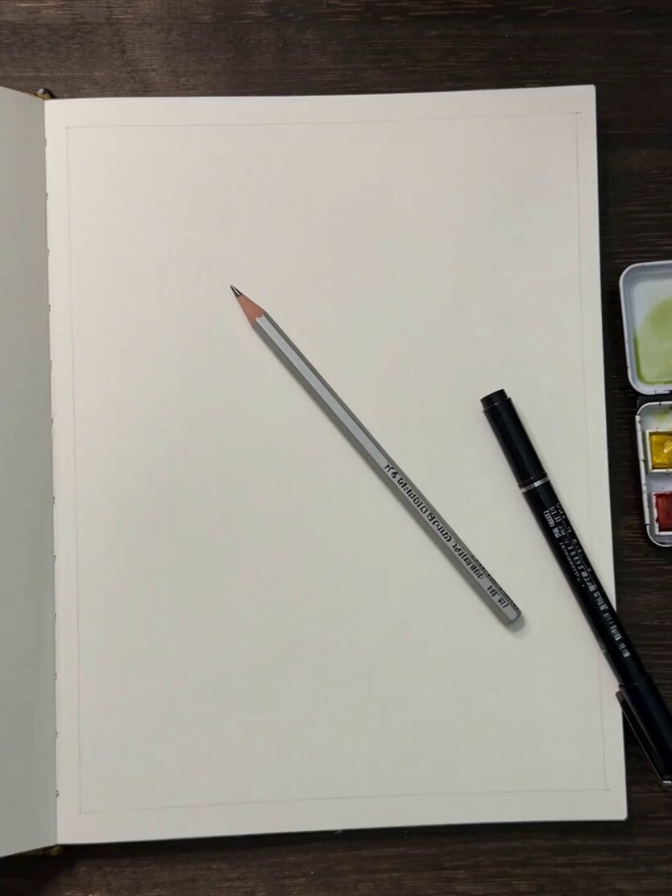

**İstem**

```text
Çeviri sürüyor
```

[↑ Kategorilere dön](#catalog)

---

<a name="category-3d-render"></a>

## 3D Modelleme

<a name="prompt-2099316017986220245"></a>

### Ormandan bal toplayan ve mutfakta buzlu bir içecek hazırlayan tüylü, şeftali şeklinde bir yaratığın 3D animasyonu.

Yazar：[@Zarnab\_with\_Ai](https://x.com/Zarnab_with_Ai) · [Orijinal gönderi](https://x.com/Zarnab_with_Ai/status/2099316017986220245)

3D Modelleme · Karakter · Yiyecek / İçecek · Hayvan / Yaratık · Manzara / Doğa · Yayımlandı

**Özet:** Ormandan bal toplayan ve mutfakta buzlu bir içecek hazırlayan tüylü, şeftali şeklinde bir yaratığın 3D animasyonu.

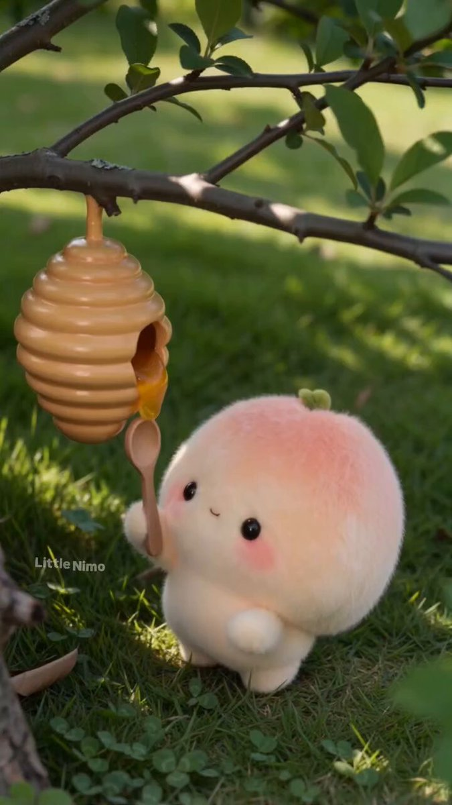

**İstem**

```text
Yumuşak, tüylü pastel pembe bir gövdeye, minik parlak siyah gözlere, sevimli küçük bir ağza, pembe yanaklara, minicik kollara ve ayaklara ve başının üstünde küçük yeşil bir yaprağa sahip şeftali şeklinde küçücük, sevimli bir yaratığın yer aldığı şirin, ultra gerçekçi 3D sinematik dikey bir video (9:16) oluşturun.

Küçük şeftali yaratık, yeşil çimler, ağaçlar, yapraklar ve ılık doğal güneş ışığıyla çevrili, güneşle aydınlanan güzel bir ormandadır. Bir ağaç dalından sarkan bir bal peteği keşfeder ve minik bir kaşıkla taze altın sarısı balı neşeyle toplar. Küçük bir arı etrafında uçar ve kısa bir süreliğine yüzünün yakınına konar.

Yaratığın balın tadını çıkarışını, ormanda yürüyüşünü ve ardından ahşap, samimi ve rustik bir mutfağa dönüşünü gösterin. Şeffaf bir bardağa buz küpleri, limon dilimleri, renkli meyve parçaları ve altın rengi bal ekleyerek ferahlatıcı bir bardak meyveli ve ballı içecek hazırlar. İçeceği bir kaşıkla nazikçe karıştırır ve mutlulukla içer.

Karakteri yumuşak peluş benzeri tüylü detaylar, gerçekçi dokular, sevimli hareketler, doğal yüz ifadeleri, sinematik alan derinliği, altın saatlerin sıcak ışıklandırması, güzel bokeh etkisi, ayrıntılı orman ortamı, akıcı kamera hareketleri, makro yakın çekimler, gerçekçi gölgeler ve birinci sınıf yüksek kaliteli 3D animasyon ile son derece sevimli ve etkileyici hale getirin.

Tüm video boyunca aynı karakter tasarımını, yüzü, oranları, renkleri, yaprağı ve görünümü tutarlı tutun. Metin yok, filigran yok, bozuk anatomi yok, ekstra karakterler yok.

Tarz: Pixar benzeri sevimli 3D + fotogerçekçi dokular + sinematik makro fotoğrafçılık + samimi fantastik estetik.
```

[↑ Kategorilere dön](#catalog)

---

<a name="prompt-2098590744080757223"></a>

### 3D animasyon sahnesi istemi: Bir ofis döner sandalyesinde oturup pipetle buzlu kahve içen sevimli bir pelüş su samurunun iç ısıtan sahnesini tasvir eder.

Yazar：[@Zarnab\_with\_Ai](https://x.com/Zarnab_with_Ai) · [Orijinal gönderi](https://x.com/Zarnab_with_Ai/status/2098590744080757223)

3D Modelleme · Karakter · Yiyecek / İçecek · Yayımlandı

**Özet:** 3D animasyon sahnesi istemi: Bir ofis döner sandalyesinde oturup pipetle buzlu kahve içen sevimli bir pelüş su samurunun iç ısıtan sahnesini tasvir eder.


**İstem**

```text
Yumuşak gri-kahverengi kürkü, kremsi beyaz göbeği ve burnu, minik yuvarlak kulakları, parlak siyah gözleri, küçük koyu renkli burnu, pembe yanakları, kısa patileri ve görünür sevimli pati yastıkları olan aynı sevimli tombul su samuru benzeri karakteri içeren, yüksek kaliteli ve son derece ayrıntılı bir 3D animasyon sahnesi oluşturun. Karakter yumuşak bir pelüş oyuncak görünümüne, yuvarlak hatlara ve masum, mutlu bir ifadeye sahiptir.

Karakteri modern, siyah ergonomik bir ofis koltuğunda rahatça otururken konumlandırın. Karakter, her iki patisini doğal bir şekilde bardağın etrafına sarmış hâlde, pipetli şeffaf plastik bir bardaktaki buzlu kahveyi tutmakta ve içmektedir. Karakteri kadrajın merkezinde ve belirgin tutun.

Sahneyi; sıra sıra bej-gri çalışma bölmeleri, bilgisayar monitörleri, büyük pencereler, yumuşak gün ışığı, cilalı zeminler ve arka planda zarif ofis detayları içeren aydınlık ve modern bir ofis içine yerleştirin. Karakterin keskin bir şekilde odakta kalması, arka planın ise yumuşak bir şekilde bulanıklaşması için sığ bir alan derinliği kullanın.

Görselin birinci sınıf bir animasyon film karesi hissi vermesini sağlayın: son derece ayrıntılı yumuşak kürk, gerçekçi kumaş ve plastik dokuları, etkileyici parlak gözler, doğal yumuşak aydınlatma, sinematik kompozisyon, gerçekçi gölgeler, ince ortam karartması (ambient occlusion), kusursuz 3D işleme, sevimli masalsı bir hava, temiz kompozisyon, profesyonel animasyon kalitesi, yüksek çözünürlük, dikey 9:16 kompozisyon.

Önemli: Ön planda insan olmadan, metin olmadan, logo olmadan, filigran olmadan ve bozuk anatomi olmadan, baştan sona tamamen aynı karakter tasarımını ve oranlarını koruyun.
```

[↑ Kategorilere dön](#catalog)

---

<a name="prompt-2098371778234179766"></a>

### Blender'da 3D gri model yapımından PixVerse \(Seedance 2.5\) ile videolaştırmaya kadar belirlenen GTA tarzı araba kovalamacası prodüksiyon talimatları.

Yazar：[@hasamaru\_studio](https://x.com/hasamaru_studio) · [Orijinal gönderi](https://x.com/hasamaru_studio/status/2098371778234179766)

3D Modelleme · Ürün · Araç · Yayımlandı

**Özet:** Blender'da 3D gri model yapımından PixVerse \(Seedance 2.5\) ile videolaştırmaya kadar belirlenen GTA tarzı araba kovalamacası prodüksiyon talimatları.


**İstem**

```text
Aşağıdaki prodüksiyon iş akışını takip ederek orijinal bir GTA tarzı 3D araba kovalamacası oluşturun:

[Tasarım]
Tutarlı görünümlere sahip 1 ana sürücü, 1 kaçış aracı, 1 takip aracı ve 1 şehir ortamı tasarlayın. Her biri 4 saniyelik toplam 3 çekim planlayın:
- Araçları arkadan takip eden bir takip çekimi
- Keskin bir virajı dönen araçları yandan takip eden bir çekim
- Araçların hızla uzaklaşmasını yakalayan geniş bir çekim

[Blender'da Modelleme]
Karakterler ve araçlar için temiz gri modeller ve çalışır durumda rig'ler oluşturun. Doku ve UV haritalandırma gerekli değildir.

[Animasyon ve Test]
Sürücüyü, direksiyonu, tekerlek dönüşünü, araçları ve kameraları canlandırın. İlerleme yönünü ve araç sıralamasını tutarlı tutun; iç içe geçmeleri, havada duran tekerlekleri, yapay lastik kaymalarını, bozuk pozları ve ellerin direksiyondan ayrılmasını düzeltin.

[Blender'da Render Alma]
1 ile 288 arasındaki kareleri 1280×720, 24 fps olarak render alın. Blender'da gerçekten render alınmış kareleri 12 saniyelik bir gri model ana videosunda birleştirin. Her çekimi ayrı ayrı dışa aktarın ve şekil ile kompozisyon referansı olarak karşılık gelen gri sabit kareleri render alın.

[PixVerse Eklentisi ile Tamamlama]
Her çekimi ayrı ayrı işlemek için 720p çözünürlükte Seedance 2.5 kullanın. Hareket referansı olarak Blender videosunu, biçim tutarlılığı için gri sabit kareleri kullanın. Üretim komutlarında tüm görüntüler için tutarlı bir renk düzeni belirtin. Kamera hareketlerini, aksiyon zamanlamasını, karakter ve araç tasarımlarını ve araç sayısını koruyun.

[İnceleme ve Teslimat]
Tamamlanan her iki videoyu da görsel bozulmalar ve çekimler arası devamlılık açısından inceleyin. Blender'daki altta yatan sorunları düzeltin ve Seedance'te yalnızca başarısız olan çekimleri çekim başına en fazla 2 deneme ile yeniden oluşturun.

Düzenlenebilir .blend dosyasını, yerel 720p Blender gri model videosunu, Seedance versiyonu olarak etiketlenmiş 720p videoyu ve kalan kısıtlamaların kısa bir değerlendirmesini teslim edin.
```

[↑ Kategorilere dön](#catalog)

---

<a name="prompt-2098326362801221835"></a>

### Çeviri sürüyor

Yazar：[@Chengzilhy](https://x.com/Chengzilhy) · [Orijinal gönderi](https://x.com/Chengzilhy/status/2098326362801221835)

Çizgi Roman / Hikaye Taslağı · Fotoğrafçılık · 3D Modelleme · Yayımlandı

**Özet:** Çeviri sürüyor


**İstem**

```text
Çeviri sürüyor
```

[↑ Kategorilere dön](#catalog)

---

<a name="category-ink-chinese-style"></a>

## Mürekkep / Çin Tarzı

<a name="prompt-2100233948341367178"></a>

### Çeviri sürüyor

Yazar：[@liyue\_ai](https://x.com/liyue_ai) · [Orijinal gönderi](https://x.com/liyue_ai/status/2100233948341367178)

Mürekkep / Çin Tarzı · Yayımlandı

Orijinal gönderi：[@liyue\_ai](https://x.com/liyue_ai) · [Orijinal gönderi](https://x.com/liyue_ai/status/2100087420771610707)

**Özet:** Çeviri sürüyor

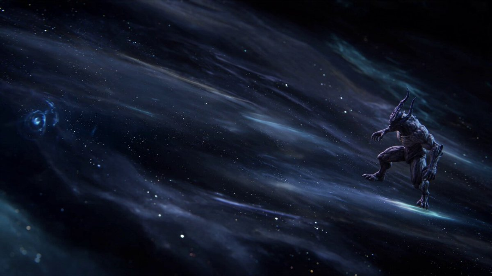

**İstem**

```text
Çeviri sürüyor
```

[↑ Kategorilere dön](#catalog)

---

<a name="category-cyberpunk-sci-fi"></a>

## Siberpunk / Bilim Kurgu

<a name="prompt-2097330853588402541"></a>

### Çeviri sürüyor

Yazar：[@TanLuAI](https://x.com/TanLuAI) · [Orijinal gönderi](https://x.com/TanLuAI/status/2097330853588402541)

Çizgi Roman / Hikaye Taslağı · Siberpunk / Bilim Kurgu · Karakter · Yayımlandı

Orijinal gönderi：[@TanLuAI](https://x.com/TanLuAI) · [Orijinal gönderi](https://x.com/TanLuAI/status/2096586474645004331)

**Özet:** Çeviri sürüyor


**İstem**

```text
Çeviri sürüyor
```

[↑ Kategorilere dön](#catalog)

---

<a name="category-minimalism"></a>

## Minimalizm

<a name="prompt-2100248337920499730"></a>

### Çeviri sürüyor

Yazar：[@TanLuAI](https://x.com/TanLuAI) · [Orijinal gönderi](https://x.com/TanLuAI/status/2100248337920499730)

Çizgi Roman / Hikaye Taslağı · Minimalizm · Karakter · Hayvan / Yaratık · Yayımlandı

**Özet:** Çeviri sürüyor

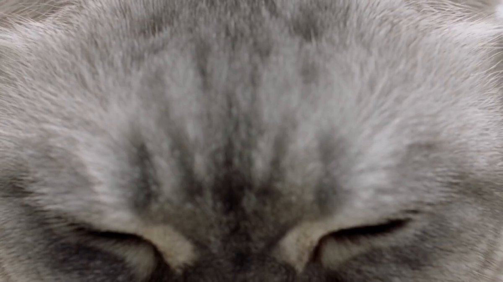

**İstem**

```text
Çeviri sürüyor
```

[↑ Kategorilere dön](#catalog)

---

<a name="category-other"></a>

## Diğer

<a name="prompt-2100290901733986767"></a>

### kırmızı kitap ve mavi kitap asla düşmez ve sonunda her ikisi de masanın üzerindedir, sadece yeşil kitaplar düşer ve dördü de düşer

Yazar：[@GlennHasABeard](https://x.com/GlennHasABeard) · [Orijinal gönderi](https://x.com/GlennHasABeard/status/2100290901733986767)

Diğer · Yayımlandı

**Özet:** kırmızı kitap ve mavi kitap asla düşmez ve sonunda her ikisi de masanın üzerindedir, sadece yeşil kitaplar düşer ve dördü de düşer

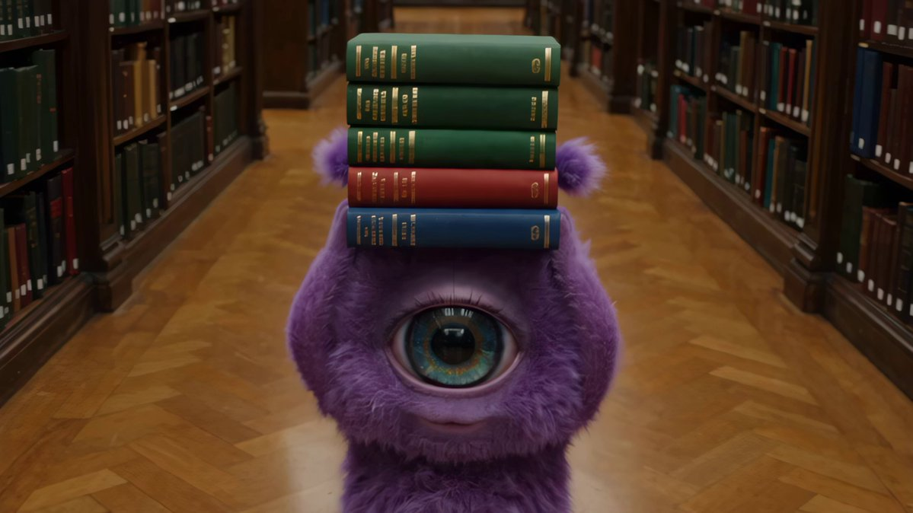

**İstem**

```text
kırmızı kitap ve mavi kitap asla düşmez ve sonunda her ikisi de masanın üzerindedir, sadece yeşil kitaplar düşer ve dördü de düşer
```

[↑ Kategorilere dön](#catalog)

---

<a name="prompt-2100223364505755756"></a>

### Çeviri sürüyor

Yazar：[@georgesttock](https://x.com/georgesttock) · [Orijinal gönderi](https://x.com/georgesttock/status/2100223364505755756)

Karakter · Yiyecek / İçecek · Manzara / Doğa · Yayımlandı

**Özet:** Çeviri sürüyor

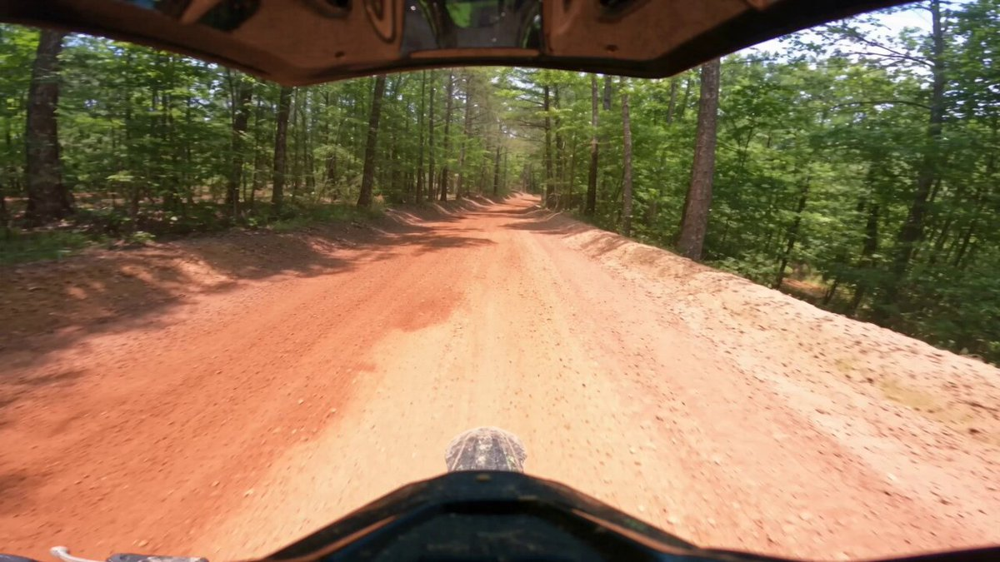

**İstem**

```text
Çeviri sürüyor
```

[↑ Kategorilere dön](#catalog)

---

<a name="prompt-2100094856362123609"></a>

### Bir ofis çalışanının fark edilmeden masasına ulaşmak için personeli atlattığı ve bir güvenlik kamerası sürpriziyle sona eren 30 saniyelik üçüncü şahıs gizlilik video oyunu istemi.

Yazar：[@kingofdairyque](https://x.com/kingofdairyque) · [Orijinal gönderi](https://x.com/kingofdairyque/status/2100094856362123609)

Karakter · Yayımlandı

**Özet:** Bir ofis çalışanının fark edilmeden masasına ulaşmak için personeli atlattığı ve bir güvenlik kamerası sürpriziyle sona eren 30 saniyelik üçüncü şahıs gizlilik video oyunu istemi.

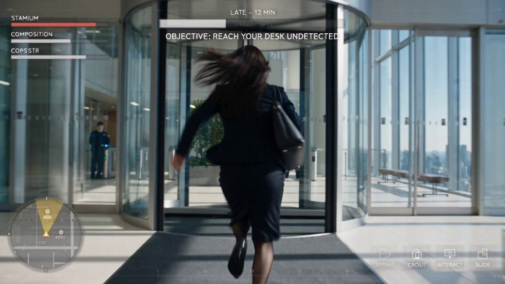

**İstem**

```text
Tam olarak yüklenen 1 görseli kullanın. @Image1, yetişkin Japon kadın için en yüksek öncelikli referanstır. Yüzünü, kimliğini, ten rengini, vücut oranlarını ve görünümünü koruyun. Kıyafet net değilse: vücuda oturan siyah ofis ceketi, beyaz saten bluz, antrasit rengi pileli midi etek, ince siyah çorap, siyah alçak topuklu ayakkabı, koyu renk iş çantası. Omuzların altına inen, yumuşak ince kâküllü, uzun düz simsiyah saçlar. 20+ yaşlarında gerçekçi yetişkin, zarif ve profesyonel görünüm. Anime, CGI veya plastik cilt yok.

Tam olarak 30 saniye, 16:9 yatay, doğal 4K, 24fps, ultra gerçekçi canlı çekim üçüncü şahıs gizlilik oynanışı oluşturun. 00:00–25.5 arasında omuz üstünden tek bir kesintisiz çekim, ardından sabit bir çalışma masası çekimine TEK bir sert kesme. Başka kesme, arka plan müziği, altyazı, anlatım, filigran veya başlık yok. Doğal Japonca diyalog; yalnızca İngilizce HUD.

MEKÂN:
Birbiriyle bağlantılı modern bir Japon kurumsal ofisi: aydınlık lobi → güvenlik masası → turnike kapısı → cam koridor → açık plan ofis → tekerlekli beyaz tahta → çalışma masası. Sağ taraftaki pencerelerden gelen sabah güneş ışığı. Çalışma masasının sağ üstünde tam olarak BİR adet fiziksel beyaz PTZ güvenlik kamerası.

KARAKTERLER:
Güvenlik görevlisi — 40'larında Japon erkek, geniş yapılı, lacivert üniformalı, yalnızca lobide.
İK çalışanı — 30'larında Japon kadın, bej takım elbise, siyah pantolon, evrak arabası, yalnızca koridorda.
Departman müdürü — 50 yaş civarında Japon erkek, gözlüklü, antrasit takım elbise, beyaz gömlek, koyu kırmızı kravat. Tek takipçi odur. Hepsinin yüzleri belirgindir ve tutarlı kalır.

HUD:
Sol altta mini harita + sarı görüş konisi, sol üstte STAMINA/COMPOSURE, üst ortada DETECTION, sağ altta SPRINT/CROUCH/INTERACT/SLIDE.
Açılış:
【LATE — 12 MIN】
【OBJECTIVE: REACH YOUR DESK UNDETECTED】

00:00–00:07 — LOBİ:
Lobide hızla depar atar. Güvenlik onu fark eder. Güvenliğin görüş konisi %91'e ulaştığında fren yapar, çömelir ve bir saksının arkasına kayar. Telsiz sesi güvenliğin dikkatini dağıtır. Giriş kartını okutur, turnike açılır, çantası kısa bir süre takılır ve koridora kaçar. Fark edilme %34'e düşer. Güvenlik asla takip etmez.

00:07–00:13 — KORİDOR:
İK çalışanı yüksek bir evrak arabasını iter. Kadın onun arkasına saklanır ve İK çalışanı sola ve sağa bakarken arabanın etrafında hareket eder. Fark edilme %96'ya ulaşır ancak net olarak görülmez. Açık ofise süzülür. İK çalışanı asla peşine düşmez.

00:13–00:18 — ALARM:
Departman müdürü onun camdaki yansımasını görür ve onu tanır. Kamera kısa bir süre müdürün yüzünü gösterir. Büyük kırmızı bir 【!】 tam olarak iki kez yanıp söner ve DETECTION kırmızı 【ALERT】 haline gelir.
Müdür bağırır:
「ちょっと待って！」
Kadın cevap verir:
「やばい！」
Ardından koşmaya başlar.

00:18–00:23.5 — KOVALAMACA:
Onu engellemek için tekerlekli beyaz tahtayı yana doğru çeker, ardından tahta ile masa arasındaki dar boşluktan bedenen kayarak geçer. Müdür tahtanın etrafından dolaşır ve kovalamaya devam eder. Gerçekçi ayak teması, sürtünme, momentum, çanta eylemsizliği, saç ve giysi hareketini koruyun.

00:23.5–00:25.5 — ÇALIŞMA MASASI:
Çalışma masasına ulaşır, masayı tutar, sandalyeye doğru döner, dizüstü bilgisayarı açar ve çalışıyormuş gibi hızla yazı yazar. Fark edilme %98 → %7'ye düşer.
HUD:
【MISSION COMPLETE】
【STEALTH RANK: S】
Hafif tatmin olmuş bir tebessüm eder.

25.5sn — SERT KESME.

00:25.5–00:30 — GÜVENLİK KAMERASI SÜRPRİZİ:
Yüzünü, vücudunun üst kısmını, dizüstü bilgisayarı ve fiziksel PTZ güvenlik kamerasını gösteren sabit ön çalışma masası çekimi. Güvenlik kamerası başlangıçta koridora dönüktür. 00:26.3'te mekanik olarak yaklaşık 45° kadına doğru döner ve kırmızı göstergesi etkinleşir.

HUD:
【CCTV DETECTED】

Gülümsemesi donakalır ve yavaşça kameraya doğru bakar.

Departman müdürü hoparlörden konuşur:
「ピョナさん、私の部屋に来てください。」

00:28.8'de:
【MISSION FAILED】
【LATE PENALTY +1】
【NEXT: SURVIVE THE MEETING】

Gözlerini hafifçe açar ve omuzlarını düşürür. Son kare, onun donmuş ifadesini ve kırmızı ışığıyla ona dönük olan güvenlik kamerasını net bir şekilde gösterir.

FİZİK:
Hızlı ancak gerçekçi hareket, ağırlık, sürtünme, denge, toparlanma, tekerlek dönüşü, çanta eylemsizliği, saç/kıyafet hareketi ve çevre etkileşimi.
```

[↑ Kategorilere dön](#catalog)

---

<a name="prompt-2100074769207247005"></a>

### Çeviri sürüyor

Yazar：[@itxabdullaa](https://x.com/itxabdullaa) · [Orijinal gönderi](https://x.com/itxabdullaa/status/2100074769207247005)

Karakter · Yayımlandı

**Özet:** Çeviri sürüyor


**İstem**

```text
Çeviri sürüyor
```

[↑ Kategorilere dön](#catalog)

---

<a name="prompt-2100071299968032968"></a>

### Çeviri sürüyor

Yazar：[@laviniavelle](https://x.com/laviniavelle) · [Orijinal gönderi](https://x.com/laviniavelle/status/2100071299968032968)

Ürün Pazarlaması · Karakter · Moda Ürünü · Yayımlandı

**Özet:** Çeviri sürüyor

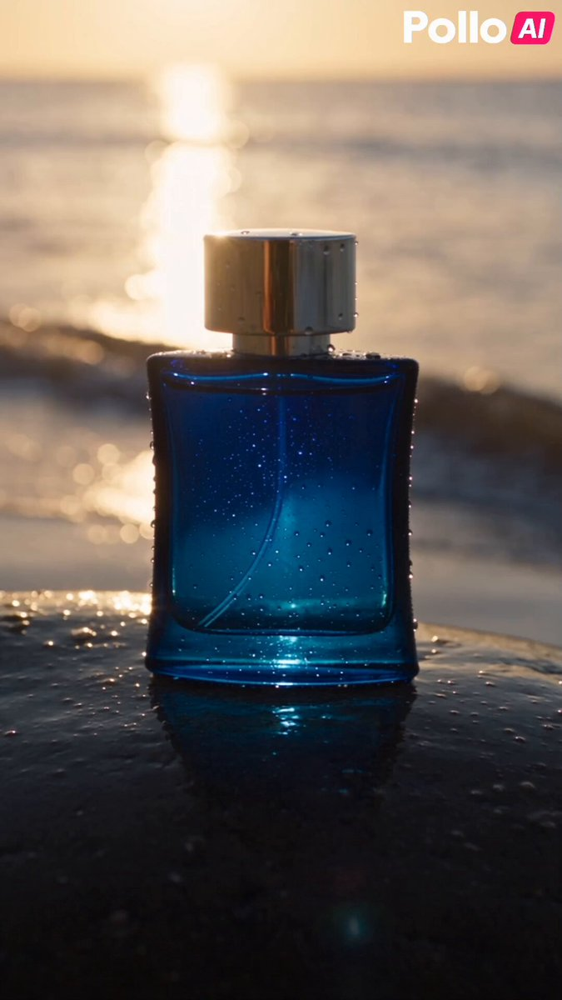

**İstem**

```text
Çeviri sürüyor
```

[↑ Kategorilere dön](#catalog)

---

<a name="prompt-2100070781174907387"></a>

### Çeviri sürüyor

Yazar：[@aiwithaayat](https://x.com/aiwithaayat) · [Orijinal gönderi](https://x.com/aiwithaayat/status/2100070781174907387)

Karakter · Yayımlandı

**Özet:** Çeviri sürüyor

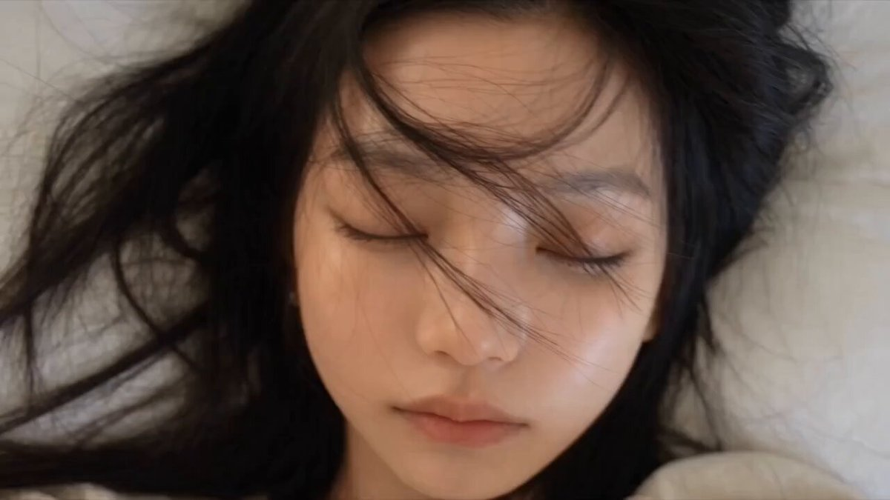

**İstem**

```text
Çeviri sürüyor
```

[↑ Kategorilere dön](#catalog)

---

<a name="prompt-2100022778674254091"></a>

### Çeviri sürüyor

Yazar：[@akiyoshisan](https://x.com/akiyoshisan) · [Orijinal gönderi](https://x.com/akiyoshisan/status/2100022778674254091)

Karakter · Yayımlandı

Orijinal gönderi：[@akiyoshisan](https://x.com/akiyoshisan) · [Orijinal gönderi](https://x.com/akiyoshisan/status/2099652823827054686)

**Özet:** Çeviri sürüyor

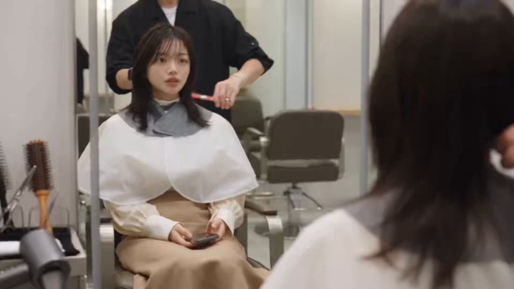

**İstem**

```text
Çeviri sürüyor
```

[↑ Kategorilere dön](#catalog)

---

<a name="prompt-2100013757779099770"></a>

### Çeviri sürüyor

Yazar：[@TanLuAI](https://x.com/TanLuAI) · [Orijinal gönderi](https://x.com/TanLuAI/status/2100013757779099770)

Karakter · Yayımlandı

**Özet:** Çeviri sürüyor

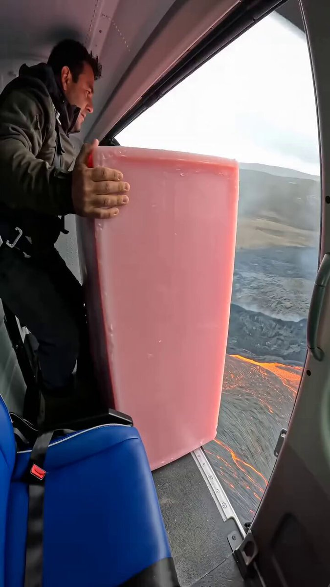

**İstem**

```text
Çeviri sürüyor
```

[↑ Kategorilere dön](#catalog)

---

<a name="prompt-2099645118550888633"></a>

### Çeviri sürüyor

Yazar：[@TanLuAI](https://x.com/TanLuAI) · [Orijinal gönderi](https://x.com/TanLuAI/status/2099645118550888633)

Çizgi Roman / Hikaye Taslağı · Yayımlandı

**Özet:** Çeviri sürüyor

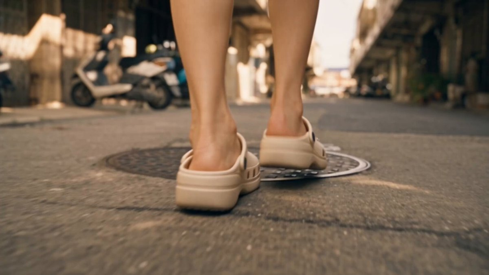

**İstem**

```text
Çeviri sürüyor
```

[↑ Kategorilere dön](#catalog)

---

<a name="prompt-2099564383252705547"></a>

### Sirk tiyatrosunda lavanta rengi giysili kızın yüksek iskele üzerindeki dar tahtada sergilediği denge akrobasi gösterisi.

Yazar：[@6AW0RON0k](https://x.com/6AW0RON0k) · [Orijinal gönderi](https://x.com/6AW0RON0k/status/2099564383252705547)

Karakter · Yayımlandı

Orijinal gönderi：[@6AW0RON0k](https://x.com/6AW0RON0k) · [Orijinal gönderi](https://x.com/6AW0RON0k/status/2099190119370576229)

**Özet:** Sirk tiyatrosunda lavanta rengi giysili kızın yüksek iskele üzerindeki dar tahtada sergilediği denge akrobasi gösterisi.

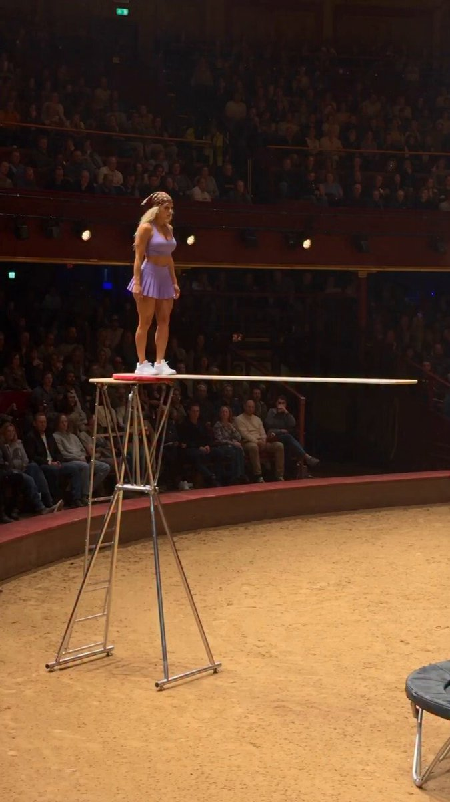

**İstem**

```text
> Görkemli bir sirk tiyatrosu. Altın rengi balkonlar. İki katlı seyirci kitlesi.
> Lavanta rengi giysili bir kız, metal bir iskelenin tepesinde dengede duran dar bir tahtanın üzerinde duruyor. Platform, kum zeminin 5 metre yukarısında.
> Tahta sallanıyor. Kız kendini ayarlıyor. Ağırlığı sola kayıyor. İskele gıcırdıyor.
> Seyirciler donup kalmış. Telefonlar parlıyor ama kimse kayıt yapmıyor. Sadece izliyorlar.
> Dengeleniyor. Bir ayağı kalkıyor. Tahta dayanıyor.
```

[↑ Kategorilere dön](#catalog)

---

<a name="prompt-2099340009648377870"></a>

### Derste uyuklayan kız öğrenci devasa bir kertenkele ile karşılaşır ve parlayan bir zırha dönüşür

Yazar：[@iX00AI](https://x.com/iX00AI) · [Orijinal gönderi](https://x.com/iX00AI/status/2099340009648377870)

Diğer · Yayımlandı

**Özet:** Derste uyuklayan kız öğrenci devasa bir kertenkele ile karşılaşır ve parlayan bir zırha dönüşür

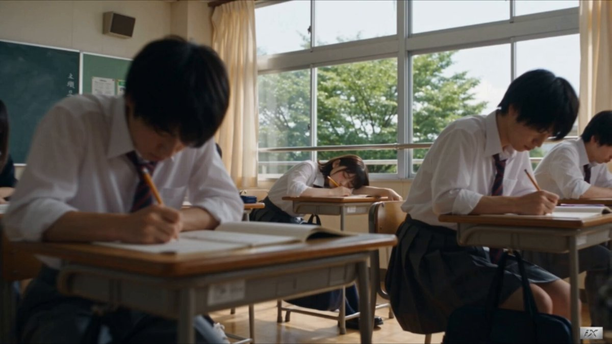

**İstem**

```text
Uykulu bir şekilde derse katılıyor\nDev bir kertenkele\nParlayan zırh\nParçacık halkası\niPhone 17 ile çekildi
```

[↑ Kategorilere dön](#catalog)

---

<a name="prompt-2099148058256716100"></a>

### paletler yalnızca top onlara yakın olduğunda hareket eder, skor makaraları yalnızca bir vuruşta döner

Yazar：[@GlennHasABeard](https://x.com/GlennHasABeard) · [Orijinal gönderi](https://x.com/GlennHasABeard/status/2099148058256716100)

Diğer · Yayımlandı

**Özet:** paletler yalnızca top onlara yakın olduğunda hareket eder, skor makaraları yalnızca bir vuruşta döner

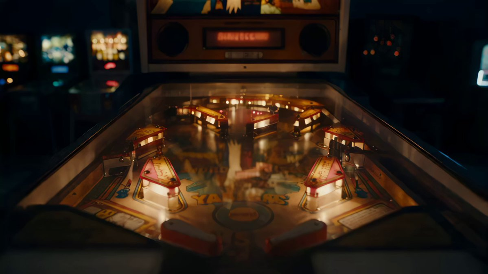

**İstem**

```text
paletler yalnızca top onlara yakın olduğunda hareket eder, skor makaraları yalnızca bir vuruşta döner
```

[↑ Kategorilere dön](#catalog)

---

<a name="prompt-2098982502006489324"></a>

### 2000'lerin başı MiniDV tarzında, yağmurlu bir Seul apartman balkonunda saksı bitkilerini yanlışlıkla fazla sulayan genç bir Koreli kadının ev videosu.

Yazar：[@iamahmedfaraz66](https://x.com/iamahmedfaraz66) · [Orijinal gönderi](https://x.com/iamahmedfaraz66/status/2098982502006489324)

Karakter · Yayımlandı

**Özet:** 2000'lerin başı MiniDV tarzında, yağmurlu bir Seul apartman balkonunda saksı bitkilerini yanlışlıkla fazla sulayan genç bir Koreli kadının ev videosu.

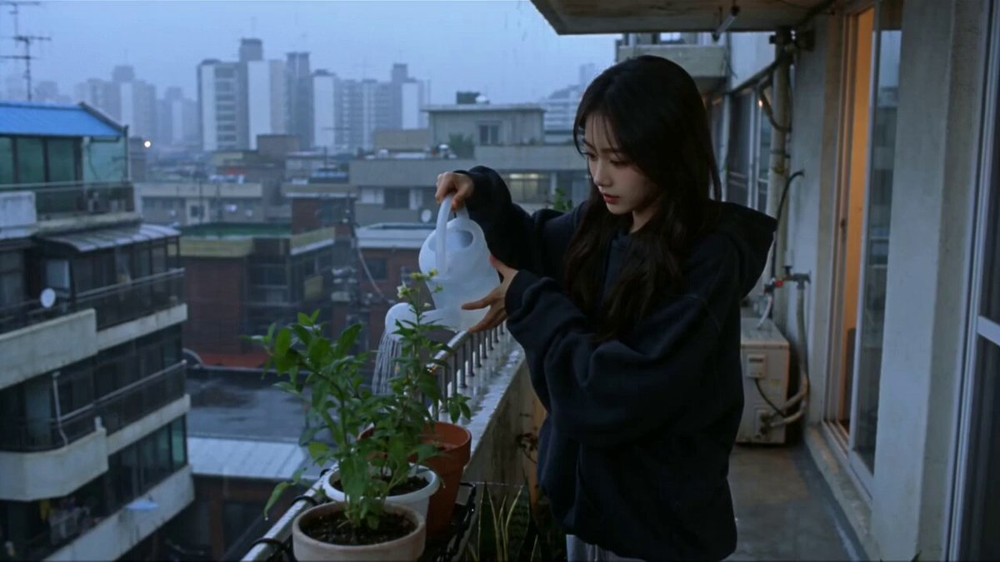

**İstem**

```text
Ana Konu: 24 yaşında, doğal olarak çekici, gerçekçi ciltli, minimum makyajlı, uzun koyu renk saçları serbestçe dökülmüş genç Koreli kadın. Üzerinde sade, büyük beden, soluk lavanta rengi bir tişört ve bol gri ev pantolonu var. Başından sonuna kadar tam kimliğini, yüz hatlarını, saç modelini, vücut oranlarını ve görünümünü koruyun.

Konum: Karanlık ve yağmurlu bir sabahın erken saatlerinde Seul'deki eski küçük bir apartman balkonu. Korkuluk boyunca dizilmiş birkaç küçük saksı bitkisi, ıslak beton zemin, metal korkuluk, komşu apartman binaları ve ötede görünen yağmurla kaplı çatılar. Dışarıda yağmur aralıksız yağmaya devam ediyor.

Aydınlatma ve Atmosfer: Rahat, karanlık mavi saat ambiyansı. Bulutlu ve yağmurlu gökyüzünden gelen soğuk mavi-gri ışık balkonu hafifçe aydınlatıyor; arkasındaki daireden ise hafif, sıcak bir parıltı yayılıyor. Islak yüzeyler loş ışığı yansıtıyor. Sessiz, uykulu ve samimi yağmurlu Seul atmosferi.

Tarz: El kamerasını tutan başka biri tarafından çekilmiş, 2000'lerin başlarına ait son derece gerçekçi Sony MiniDV ev videosu. Bir aile üyesinin onu rastgele çekmesi gibi tamamen samimi ve kurgusuz. Doğal el hareketi, ince insani sarsıntı, kusurlu kadrajlama, hafif yeniden kadrajlama, ara sıra otomatik odaklanma arayışı, hafif pozlama değişimleri, soluk renkler, yumuşak kontrast, otantik DV sıkıştırması, loş ışıkta ince dijital parazit ve mikrofon gürültüsü. Baştan sona pürüzsüz, sürekli, gerçek zamanlı hareket. Takılma, titreme, kare atlama, yinelenen kareler, stop-motion görünümü, aşırı hareket bulanıklığı, hız değişimleri veya düşük kare hızı görünümü yok. Sabitleme veya modern sinematik hareket yok.

00:00–00:04: Elinde sade bir sulama kabı tutarak küçük balkonda duruyor. Yapraklarına bakarken saksı bitkilerinden birini nazikçe suluyor.

00:04–00:08: Sulama kabını başka bir bitkiye doğru götürüyor ve yanlışlıkla çok fazla su döküyor. Su hızla saksının kenarından taşıyor ve balkon zeminine yayılıyor.

00:08–00:11: Su birikintisini hemen fark ediyor ve bir anlığına donup kalıyor. Hafifçe utanmış bir ifadeyle önce suya, ardından tekrar bitkiye bakıyor.

00:11–00:15: Kameraya doğru bakıyor ve hafif suçlu bir tebessüm sergiliyor; sessizce gülerek hatasını kabul edercesine omuz silkiyor. Sulama kabını yere bırakıyor ve birikintinin etrafından dikkatlice geçiyor.

Ses: Yalnızca doğal ortam sesi—aralıksız yağmur, sulama kabından dökülen su, betona çarpan su sıçramaları, uzaktan gelen trafik, hafif daire sesleri, yumuşak kıyafet hışırtısı ve onun sessiz gülüşü. Müzik, dış ses veya eklenmiş ses efektleri yok.

Amaç: 2000'lerin başlarına ait bir aile MiniDV kamerasına kazara yakalanmış küçük, zararsız bir hata gibi hissettirmesi. Komik veya abartılı olmaktan ziyade sevimli, sıradan ve spontane. Yağmurlu balkon atmosferi ana görsel ruh halini oluşturmaya devam ederken tepkisi ince ve içten olmalı.

Hareket kalitesi: Tüm karakter ve kamera hareketlerini pürüzsüz, kesintisiz ve fiziksel olarak gerçekçi tutun. Su, ani değişiklikler veya doğal olmayan sıçramalar olmaksızın doğal bir şekilde dökülmeli. Hızlı hareketlerden kaçının. Nostaljik MiniDV estetiği, düşük kare hızından veya kesintili hareketten değil; görüntü dokusundan, otomatik odaktan, pozlama davranışından, soluk renklerden ve elde çekim hissiyatından kaynaklanmalıdır.
```

[↑ Kategorilere dön](#catalog)

---

<a name="prompt-2098625551833669826"></a>

### Yağmurlu bir pencere kenarında jaluzi ipleriyle oynayan bir kadın ve tekir yavru kediyi içeren 30 saniyelik elde çekim selfie video istemi.

Yazar：[@itxabdullaa](https://x.com/itxabdullaa) · [Orijinal gönderi](https://x.com/itxabdullaa/status/2098625551833669826)

Portre / Selfie · Karakter · Yayımlandı

**Özet:** Yağmurlu bir pencere kenarında jaluzi ipleriyle oynayan bir kadın ve tekir yavru kediyi içeren 30 saniyelik elde çekim selfie video istemi.


**İstem**

```text
REFERANS VE ÖZNE Kadın için tam görsel referans olarak "@<image1" kullanın. Klibin tamamı boyunca kadının kimliğini, yüzünü, saç stilini, giysilerini, cilt dokusunu, vücut oranlarını ve doğal görünümünü koruyun. Tam olarak BİR küçük tekir yavru kedi. Klibin başından sonuna kadar aynı yavru kedi kesintisiz yer alır. Başka hayvan yok, mükerrer kedi yok. FORMAT 30 saniyelik dikey 9:16 elde tutulan ön kamera özçekimi. Yağmurlu bir günde pencere kenarında kapalı bir oda. Camın ardından süzülen yumuşak gri doğal gün ışığı. Çok hafif pencere yansımaları ve gerçekçi oda ortam sesi. Renk derecelendirmesi yok, sinematik aydınlatma yok, güzellik filtresi yok. --- 0–5 SN — HUZURLU YAĞMURLU AN Kadın, pencerenin yanında yavru kediyi göğsüne bastırarak durur. Yağmur damlaları arkasındaki camdan yavaşça aşağı süzülür. Telefona bakar, ardından yavru kedinin çenesinin altını nazikçe kaşır. Yavru kedi sakince pencereye doğru bakar. Kadın hafifçe gülümser ve rahat bir tavırla şöyle der: "Ne kadar huzurlu bir gün, değil mi?" Telefon hafif kusurlu ve doğal bir şekilde elde tutulmaya devam eder. --- 5–10 SN — BİR ŞEY HAREKET EDİYOR Pencere jaluzisinden gelen küçük bir hareket yavru kedinin dikkatini çeker. Kulakları aniden öne doğru dikilir. Kadın, yavru kedinin omzunun üzerinden baktığını fark eder. Yavru kediyi güvenli bir şekilde desteklemeyi sürdürürken hafifçe pencereye doğru döner. Yavru kedi, sarkan jaluzi ipine doğru bir patisini uzatır. Kadın sessizce güler ve şöyle der: "Neye bakıyorsun?" --- 10–15 SN — JALUZİ İPİ SALDIRISI Yavru kedi aniden iki patisiyle jaluzi ipini yakalar. Kadın şaşkınlıkla tepki verir ve ipi nazikçe uzaklaştırmaya çalışır. Yavru kedi direnir ve ipi kendine doğru çeker. Telefon kadının elinde hafifçe titrerken kadın güler. Şöyle der: "Hey, onu rahat bırak." Yavru kedi ipe pati vurmaya devam eder. --- 15–20 SN — KAOTİK OYUN Yavru kedi, hareket eden ipi yakalamaya çalışırken kadının göğsüne doğru heyecanla kıvranır. Kadın bir eliyle kedinin vücudunu güvenle desteklerken diğer eliyle patilerini nazikçe engeller. Yavru kedi dönüp tekrar uzanır. Kadın daha çok güler ve şöyle der: "Fazla meraklı olmaya başladın." Saçından birkaç tutam doğal bir şekilde yüzünün kenarına dökülür. --- 20–25 SN — YAVRU KEDİ TIRMANIYOR Yavru kedi, hala pencereye odaklanmış halde aniden kadının omzuna doğru tırmanır. Patileri kadının üst giysisinin kumaşını kavrar. Kadın şaşkınlıkla küçük bir çığlık atar ve ardından kahkaha atar. Hem kendisini hem de yavru kediyi kadrajda tutmaya çalışırken telefonu tuttuğu eli hafifçe yükselir. Kamera doğal bir şekilde yeniden merkezlenmeden önce kısa süreliğine dengesini kaybeder. --- 25–30 SN — SÜRPRİZ SELFIE Yavru kedi kadının omzuna ulaşır ve aniden pencereden telefona doğru döner. Yüzünü merceğe yaklaştırarak merakla koklar. Kadın gülerken geriye doğru yaslanır. Yavru kedi kameraya doğru bir patisini kaldırır. Kadın "Aa, şimdi de şunu mu—" diye başlar ve kahkahaya boğulur. Pati neredeyse merceğe değer. Telefon doğal bir şekilde aşağı eğilir. Klip kahkahanın ortasında sona erer. SES Pencereden gelen yağmur ortam sesi, hafif jaluzi hareketi, kumaş hışırtısı, yavru kedi hareketi, tek bir minik miyavlama, kadının doğal sesi, nefes alıp verme, burun kıkırdamaları ve içten kahkaha. Arka plan müziği yok. Altyazı yok. Metin yok. Logo yok. Filigran yok. Kesme yok. Yakınlaştırma yok. Tam olarak bir yavru kedi.
```

[↑ Kategorilere dön](#catalog)

---

<a name="prompt-2098577397717307413"></a>

### Çeviri sürüyor

Yazar：[@mi7\_crypto](https://x.com/mi7_crypto) · [Orijinal gönderi](https://x.com/mi7_crypto/status/2098577397717307413)

Karakter · Yayımlandı

**Özet:** Çeviri sürüyor


**İstem**

```text
Çeviri sürüyor
```

[↑ Kategorilere dön](#catalog)

---

<a name="prompt-2098562237333913765"></a>

### Çeviri sürüyor

Yazar：[@john87445528](https://x.com/john87445528) · [Orijinal gönderi](https://x.com/john87445528/status/2098562237333913765)

Çizgi Roman / Hikaye Taslağı · Yayımlandı

**Özet:** Çeviri sürüyor


**İstem**

```text
Çeviri sürüyor
```

[↑ Kategorilere dön](#catalog)

---

<a name="prompt-2098403961325695379"></a>

### İstem, alevin bir kibrit çöpü boyunca yavaşça aşağıya doğru ilerlemesini, ahşabı karartıp kıvırmasını tarif ediyor.

Yazar：[@GlennHasABeard](https://x.com/GlennHasABeard) · [Orijinal gönderi](https://x.com/GlennHasABeard/status/2098403961325695379)

Diğer · Yayımlandı

**Özet:** İstem, alevin bir kibrit çöpü boyunca yavaşça aşağıya doğru ilerlemesini, ahşabı karartıp kıvırmasını tarif ediyor.


**İstem**

```text
alev çubuk boyunca yavaşça aşağı ilerliyor, arkasındaki ahşap kararıp kıvrılıyor
```

[↑ Kategorilere dön](#catalog)

---

<a name="prompt-2098306219903492133"></a>

### Makro çiy damlaları, ürün yakın çekimi, karakter monoloğu ve marka kapanışı içeren 15 saniyelik botanik parfüm lüks reklam filmi storyboard istemi.

Yazar：[@yourPlugAI](https://x.com/yourPlugAI) · [Orijinal gönderi](https://x.com/yourPlugAI/status/2098306219903492133)

Çizgi Roman / Hikaye Taslağı · Ürün Pazarlaması · Karakter · Ürün · Yayımlandı

Orijinal gönderi：[@yourPlugAI](https://x.com/yourPlugAI) · [Orijinal gönderi](https://x.com/yourPlugAI/status/2098049745885225020)

**Özet:** Makro çiy damlaları, ürün yakın çekimi, karakter monoloğu ve marka kapanışı içeren 15 saniyelik botanik parfüm lüks reklam filmi storyboard istemi.


**İstem**

```text
15 Saniyelik Sıralı Video İstemi

0 - 3 Saniye (Kanca)
Görsel: Sabah çiy damlaları damlayan canlı yeşil tropikal yaprakların arasından yapılan aşırı makro yukarı eğim (tilt-up) çekimi. Güneş ışığı lense parlak bir şekilde yansıyarak havada süzülen polenleri ve su parçacıklarını aydınlatır.
Eylem: Çiy damlaları büyük bir palmiye yaprağından aşağı kayar ve aşırı gerçekçi ağır çekimde ham taşın üzerine sıçrayarak anında mikro damlacıkları yukarı doğru fırlatır.
Ses: Canlı, son derece ayrıntılı bir su sıçraması ses efektine açılan derin organik nefesli çalgı armonisi; buna eşlik eden tatlı kuş cıvıltıları ve yaprak hışırtıları.

3 - 6 Saniye (Ürün Tanıtımı)
Görsel: Açan yabani orkidelerle çevrili, yosunlu bir bazalt kaya üzerinde dik duran buzlu cam parfüm şişesinin etrafında yumuşak kamera yörüngesi.
Eylem: İnce, çiy benzeri botanik bir sis yan püskürtücüden temiz bir şekilde sıkılır, yatay olarak dağılırken keskin güneş ışığı her bir mikro damlacığı yakalar ve hafif bir gökkuşağı prizması etkisi yaratır.
Ses: Temiz, metalik pompa püskürtme klik sesi ve ardından gelen ferahlatıcı, atmosferik sis akışı sesi ile hafif bir rüzgar esintisi.

6 - 9 Saniye (Karakter Diyaloğu)
Görsel: Güneşle aydınlanan botanik bir serada duran kadının, yeşil bir eğrelti otu yaprağını nazikçe yüzünden uzaklaştırarak sakin ve kendinden emin bir bakışla doğrudan kamera lensine baktığı orta çekim.
Eylem: Başını hafifçe güneş ışığına doğru eğer, yüzü rahat ve tamamen dingindir; repliğini yumuşak bir gülümsemeyle doğal bir şekilde söyler.
Ses: Sıcak, nefesli bir dış sesin altındaki yumuşak, topraksı akustik yaylı akoru: "Breathe the wild."

9 - 12 Saniye (Duyusal Yükseliş)
Görsel: Altın sarısı çiçek yapraklarının parfüm şişesinin etrafında açıldığı, dönen güneş ışığı ve yeşil yapraklarla dinamik hareket fiziği içinde kusursuzca birleştiği hızlı çekim (fast-forward) çiçek açma sekansı.
Eylem: Doğal yosun ve çiçek yaprakları şişeyi çevreleyen havaya nazikçe yükselerek ağırlıksız, doğal bir süzülme etkisi yaratır.
Ses: Yükselen akustik melodi tırmanışına eşlik eden yumuşak bir hava geçiş sesi (swoosh) ve hafif hışırtı dokuları.

12 - 15 Saniye (Marka Kapanışı)
Görsel: Taze yeşil yosun ve sabah çiyi arasında, güneş alan mermer bir blok üzerinde dik duran buzlu cam şişenin merkezlenmiş ana (hero) çekimi. Kazınmış "GILBERTO" marka adı, net altın rengi tipografisiyle dikkat çeker.
Eylem: Sabah ışığı soldan sağa doğru şişenin üzerinden yumuşakça geçerken narin botanik sis tabana çöker.
Ses: Yumuşak bir sönümlemeyle (fadeout) uzayan sıcak, tok akustik çan sesi.
```

[↑ Kategorilere dön](#catalog)

---

<a name="prompt-2098284373372018792"></a>

### Solgun ve çatlamış bir çölde uyuyan devasa bir beyaz balinaya doğru yürüyen minik bir insanın fantastik ve gerçeküstü sahnesi.

Yazar：[@AIwithMinal](https://x.com/AIwithMinal) · [Orijinal gönderi](https://x.com/AIwithMinal/status/2098284373372018792)

Hayvan / Yaratık · Yayımlandı

**Özet:** Solgun ve çatlamış bir çölde uyuyan devasa bir beyaz balinaya doğru yürüyen minik bir insanın fantastik ve gerçeküstü sahnesi.


**İstem**

```text
Sonsuz, solgun ve çatlamış bir çöl manzarasında yerde huzur içinde dinlenen devasa, efsanevi beyaz balina benzeri bir yaratığa doğru yürüyen minik bir insan figürünün son derece gerçekçi sinematik sahnesi. Devasa yaratık ayrıntılı dokulu bir deriye, muazzam yüzgeçlere, ince belirgin gözlere ve gerçeküstü, rüya gibi bir varlığa sahiptir. Sahneyi saran hafif sis, gizemli bir atmosfer yaratır. İnsan ile yaratık arasındaki aşırı ölçek farkını vurgulayan geniş açılı kompozisyon, yumuşak tek renkli tonlar, yumuşak dağınık aydınlatma, gerçekçi gölgeler, atmosferik derinlik, son derece ayrıntılı dokular, sinematik fotoğrafçılık, 8K, HDR, fotogerçekçi, epik fantezi gerçekçiliği, dikey 9:16 kompozisyon.
```

[↑ Kategorilere dön](#catalog)

---

<a name="prompt-2098273068317893063"></a>

### Çeviri sürüyor

Yazar：[@TanLuAI](https://x.com/TanLuAI) · [Orijinal gönderi](https://x.com/TanLuAI/status/2098273068317893063)

Diğer · Yayımlandı

**Özet:** Çeviri sürüyor


**İstem**

```text
Çeviri sürüyor
```

[↑ Kategorilere dön](#catalog)

---

<a name="prompt-2098242830661792189"></a>

### Bir devekuşu pembe bir oyuncak arabaya biner ve kalabalık bir pazarda kaykayla kaçar.

Yazar：[@mrdejie](https://x.com/mrdejie) · [Orijinal gönderi](https://x.com/mrdejie/status/2098242830661792189)

Araç · Yayımlandı

**Özet:** Bir devekuşu pembe bir oyuncak arabaya biner ve kalabalık bir pazarda kaykayla kaçar.


**İstem**

```text
Kaotik bir pazar kovalamacasına ait, 30 saniyelik kesintisiz, ham, canlı bir Nijerya televizyonu haber helikopteri çekimi oluşturun. Gerçek ve devasa bir devekuşu; kirli, soluk, eski pembe plastik bir oyuncak arabayı kalabalık bir açık hava pazarının içinde sürerken yerel yemek satıcıları onu yakalayıp pişirmek istercesine kovalar. Oyuncak araba tezgahlardan oluşan bir barikata çarpar. Devekuşu tekmeyle bir satıcıyı yere serer, ardından bir kaykayın üzerine binip kaçar. Yalnızca işlenmemiş canlı helikopter görüntüleri: yüksek irtifadan tek bir takip çekimi, doğal sarsıntı, gerçek fizik kuralları, parlak gün ışığı. Sinematik renk derecelendirmesi yok, ağır çekim yok, film dokusu yok, kesme yok.

Gün ışığında kalabalık bir Nijerya pazarının uzaktan helikopter görüntüsüyle başlayın: yemek tezgahları, şemsiyeler, leğenler, kasalar, asılı etler, ızgara dumanı, alışveriş yapanlar, okada ve keke. Devekuşu, bacakları neredeyse yere değecek şekilde, kirli küçük pembe oyuncak arabayla çoktan ters yönde hızla ilerlemektedir. Soluk bir atlet ve peştamal giymiş bir satıcı elinde uzun bir bıçakla arkasından koşar. Devekuşu tezgahların arasından kıvrılarak geçer. Bir çuval biber devrilip dökülür. Bir keke fren yapar. Bir yer elması el arabası devrilir. Daha fazla satıcı katılır — biri metal bir leğenle, biri dev bir kepçeyle, biri bir çuval kömürle, biri bir suya şişiyle. Sokak kıyafetlerinin üzerine Ankara kumaşı, atletler, lastik terlikler ve lekeli önlükler giymişlerdir. Aşçı üniforması yok.

Devekuşu, masalardan oluşan bir barikata ve park halindeki bir danfo minibüsüne doğru sürer. Kayan bir kekenin yanından manevra yaparak sıyrılır. Plastik tekerlekler kilitlenir ve oyuncak araba yan kayarak bir masa ayağına sertçe çarpıp durur. Devekuşu kanatları yarı açık halde üzerinden fırlar. Satıcılar her iki taraftan hücum eder.

Bıçaklı satıcı boynunu yakalamaya çalışır. Devekuşu onun alnını gagalar. Leğenli satıcı hamle yapar. Devekuşu tek ayağını yere basar ve onun göğsüne tekme atar — devekuşlarına has gerçek, çok sert bir tekme — ve adam bir soğan yığınının üzerine uçar. Leğen yuvarlanır. Kepçeli satıcı dökülen yağın üzerinde kayar. Bir boşluk açılır.

Devekuşu, bir kasanın yanında toprakta duran yıpranmış bir kaykaya doğru koşar, üzerine adım atar, hafifçe bocaladıktan sonra uzun bir bacağıyla yeri iterek hız alır. Kanatları açık halde alçakça çömelir ve tezgahlar ile kekelerin arasındaki pazar sokağında kayarak ilerler. Satıcılar yaya olarak kovalar. Çarpan pembe oyuncak araba barikatta geride kalır. Devekuşu kaykayla yolda çoktan uzaklaşmışken, satıcılar arkasında küçülürken ve helikopter hala onu uzaktan takip ederken sona erdirin.

Çarpışmaya kadar aynı devekuşunu ve aynı kirli pembe oyuncak arabayı, kaçış içinse aynı kaykayı muhafaza edin. Gerçekçi hayvan ağırlığı, tekme, bocalama ve pazar fiziği. Doğal gün ışığı. Yalnızca yerel yemek satıcıları.

Ses: helikopter pervanesi, pazar gürültüsü, kornalar, bağırmalar, takırdayan leğenler, zorlanan oyuncak araba motoru, sert tekme ve yere düşen beden sesi, toprak üzerindeki kaykay tekerlekleri. Müzik yok. Altyazı yok. Dış ses yok.
```

[↑ Kategorilere dön](#catalog)

---

<a name="prompt-2097936691273019608"></a>

### Eski bir Seul mahallesinde genç bir kadının saç tokası alıp arkadaşıyla buluştuğu bir öğleden sonra kesitini kaydeden, 2000'lerin başı DV ev videosu tarzında 25 saniyelik video istemi.

Yazar：[@kingofdairyque](https://x.com/kingofdairyque) · [Orijinal gönderi](https://x.com/kingofdairyque/status/2097936691273019608)

Karakter · Yayımlandı

**Özet:** Eski bir Seul mahallesinde genç bir kadının saç tokası alıp arkadaşıyla buluştuğu bir öğleden sonra kesitini kaydeden, 2000'lerin başı DV ev videosu tarzında 25 saniyelik video istemi.


**İstem**

```text
Eski bir Seul mahallesinde beklenmedik derecede unutulmaz bir öğleden sonra geçiren genç bir Koreli kadının 25 saniyelik, 1080p, 16:9 ultra gerçekçi, 2000'lerin başı DV ev videosu.

KARAKTER: Koreli kadın, 20'li yaşların başında, doğal güzellikte, gerçekçi cilt, küçük krem rengi saç tokası takılmış uzun düz koyu kahverengi saçlar. Adaçayı yeşili bol kesim polo yaka tişört, koyu renk düz paça kot pantolon, beyaz retro spor ayakkabılar, bordo omuz çantası, ince gümüş saat. Yüzünü, saçını, kıyafetini, aksesuarlarını ve oranlarını tamamen tutarlı tutun.

GÖRSEL TARZ: Otantik ucuz DV el kamerası çekimi. Elde çekim sarsıntısı, kusurlu kadrajlama, otomatik odaklama arayışı, soluk renkler, yumuşak dijital detaylar, pozlama değişimleri, kazara yapılan yakınlaştırmalar, doğal hareket bulanıklığı. Sinematik cila veya sabitleme yok. Eski bir hafıza kartında tesadüfen bulunmuş bir video gibi hissettirmeli.

MEKÂN: Seul'ün sakin eski sokakları, yaşlanan apartmanlar, beton ara sokaklar, saksı bitkileri, bisikletler, elektrik direkleri, minik mahalle dükkanları. Ilık akşamüstü güneş ışığı. Marka veya logo yok.

HİKÂYE

00:00–00:05 — PLAN
Küçük bir kağıt torbayla sessiz bir sokakta yürüyor. Alışveriş listesini kontrol ediyor, her şeyi çoktan bitirdiğini fark ediyor ve ardından doğrudan kameraya bakıyor.

“I came out for one thing.”

Omuz silkip yürümeye devam ediyor.

00:05–00:10 — KEŞİF
Küçük bir kırtasiye dükkanı görüyor ve güzel bir krem rengi saç tokası buluyor. Saçının yanında tutuyor, yansımasına bakıyor ve gülümsüyor.

“Okay… this is better.”

Kamera kazara aşırı yakınlaşma yapıyor.

00:10–00:16 — O AN
Dışarıda, su birikintisindeki yansımasını fark ediyor. Tokayı düzeltiyor ve yarım saniyeliğine poz veriyor.

Arkasından aniden bir bisiklet zili çalıyor. İrkilip arkasına dönüyor, sonra kendi haline gülüyor.

00:16–00:21 — ARKADAŞ
Arkadaşının iki soğuk içecekle beklediği küçük bir avluya varıyor. Alçak bir duvara oturup gülüşüyor ve havadan sudan konuşuyorlar.

Arkadaşı yeni tokayı fark ediyor ve onun için düzeltiyor.

Kameraya bakıyor:

“She thinks she’s my stylist.”

00:21–00:25 — ANI
Apartmanına doğru yürüyor, arkasını dönüyor, gülümsüyor ve saç tokasını işaret ediyor.

“Worth leaving the house.”

İçeri girip gözden kayboluyor.

Kamera, aniden siyaha düşmeden önce bir saniye boş sokakta kalıyor.

SES: Yalnızca doğal ortam sesleri — ayak sesleri, kuşlar, uzaktaki trafik, bisiklet zili, rüzgar, dükkan sesleri, kağıt hışırtısı, kahkaha, soğuk içecek sesleri. Müzik, altyazı, başlık, logo veya seslendirme yok.

GERÇEKÇİLİK: Doğal tepkiler, kusurlu zamanlama, inandırıcı fizik, tutarlı karakter ve nesneler. Kimlik kayması, bozuk eller, fazladan parmaklar, yinelenen insanlar, ışınlanma, kıyafet değişiklikleri veya CGI görünümü yok.
```

[↑ Kategorilere dön](#catalog)

---

<a name="prompt-2097904148360630318"></a>

### Genç bir kadının Bleu de Chanel parfümünü sözlü diyalog ve doğal hareketlerle incelediği gerçekçi dikey video istemi.

Yazar：[@CaliraVal](https://x.com/CaliraVal) · [Orijinal gönderi](https://x.com/CaliraVal/status/2097904148360630318)

Karakter · Yayımlandı

**Özet:** Genç bir kadının Bleu de Chanel parfümünü sözlü diyalog ve doğal hareketlerle incelediği gerçekçi dikey video istemi.


**İstem**

```text
Zarif ve modern bir ortamda şık bir genç kadının yer aldığı gerçekçi bir lüks parfüm inceleme videosu oluşturun.

Bleu de Chanel parfüm şişesini kameraya doğru tutarak şişeyi net bir şekilde gösterir. Ardından bileğine ve boynuna az miktarda sıkar, kokuyu nazikçe koklar, doğal bir şekilde gülümser ve içten kişisel bir tepki verir.

Doğrudan kameraya bakar ve kusursuz dudak senkronizasyonuyla sıcak, kendinden emin bir kadın İngilizce sesiyle doğal bir şekilde konuşur:

“I’ve been trying Bleu de Chanel, and honestly, I really love it. It smells fresh, clean, sophisticated, and very elegant. It’s perfect for everyday wear, but it also feels special enough for an evening out. Definitely a fragrance I’d recommend.”

Doğal yüz ifadeleri, gerçekçi el hareketleri, doğru dudak hareketleri ve özgün influencer tarzı bir sunum kullanın. Sesini net, pürüzsüz, samimi ve konuşma havasında tutun; robotik veya aşırı ticari olmasın.

Yumuşak ve hoş bir aydınlatma, gerçekçi cilt dokusu, sığ alan derinliği, sinematik kamera hareketi, doğal parfüm püskürtme sisi, gerçekçi yansımalar ve premium bir yaşam tarzı arka planı kullanın. Parfüm şişesini baştan sona tutarlı ve tanınabilir tutun.

Fotogerçekçi, lüks parfüm reklamı, özgün ürün incelemesi, gerçekçi fizik, akıcı hareket, 4K, dikey. Bozuk eller yok, yamuk şişe yok, değişen yüz yok, titreme yok, hatalı metin yok.
```

[↑ Kategorilere dön](#catalog)

---

<a name="prompt-2097917075176178101"></a>

### Bir çiftlik kadınının gündoğumundan günbatımına kadarki günlük rutinini takip eden, 30 saniyelik gerçekçi bir Amerikan çiftlik yaşam tarzı vlog'u oluşturun.

Yazar：[@aiwithaly](https://x.com/aiwithaly) · [Orijinal gönderi](https://x.com/aiwithaly/status/2097917075176178101)

Karakter · Manzara / Doğa · Yayımlandı

**Özet:** Bir çiftlik kadınının gündoğumundan günbatımına kadarki günlük rutinini takip eden, 30 saniyelik gerçekçi bir Amerikan çiftlik yaşam tarzı vlog'u oluşturun.


**İstem**

```text
Gündoğumundan günbatımına kadar otantik bir çalışma günü boyunca aynı genç çiftlik kadınını takip eden, 30 saniyelik ultra fotogerçekçi bir Amerikan çiftlik yaşam tarzı vlog'u oluşturun. Ahırı açıp atları beslemesiyle başlayın, ardından bir atı eyerleyip açık Batı arazilerinde sürmeden önce ahşap bir çiti tamir etmesini gösterin.

Yıpranmış ahırlar, at padokları, saman, toprak yollar, ahşap çitler, kamyonetler, yeşil tarlalar ve uzaktaki tepelerle dolu gerçek bir çalışan çiftlik sergileyin. Karakteri, atı, kıyafetleri ve çiftlik ortamını mükemmel bir şekilde tutarlı tutun.

Gerçekçi at davranışlarını, binicilik biyomekaniğini, toynak darbelerini, tozu, çim hareketini, deri eyer takımlarını, yemi, ahşabı, çekiç vuruşlarını ve doğal güneş ışığını yakalayın. Yakın çekimler, geniş çiftlik manzaraları, gerçekçi otomatik odaklama, ince kamera sarsıntısı ve altın saatte akıcı bir biniş içeren, 2026 yılı el kamerası belgesel-vlog sinematografisi kullanın.

Yalnızca doğal diegetik ses: atlar, kuşlar, rüzgar, ahır sesleri, nal sesleri, aletler, deri ve böcekler. Amerikan İngilizcesinde kısa, senkronize diyaloglar. Müzik, dış ses, altyazı, CGI, yapay hareket, imkansız fizik kuralları, logo veya filigran olmasın.
```

[↑ Kategorilere dön](#catalog)

---

<a name="prompt-2097908289619284300"></a>

### Ürün yakın çekimleri, uygulama ve slogan içeren, lavantalı yüz maskesine yönelik çok sahneli cilt bakımı reklamı istemi.

Yazar：[@AvelyrahnAI](https://x.com/AvelyrahnAI) · [Orijinal gönderi](https://x.com/AvelyrahnAI/status/2097908289619284300)

Ürün · Yayımlandı

**Özet:** Ürün yakın çekimleri, uygulama ve slogan içeren, lavantalı yüz maskesine yönelik çok sahneli cilt bakımı reklamı istemi.


**İstem**

```text
Yumuşak pastel mor ve lavanta temalı, sıcak ve lüks bir aydınlatmaya sahip, temiz ve minimalist bir ticari güzellik videosu estetiği.

Sahne 1: Üzerinde Foxtale Skin Radiance Mask yazılı koyu mor bir cilt bakım kavanozunun,
minimalist beyaz dairesel bir podyum üzerinde duran, kapağı açık halde pürüzsüz lavanta kili maskesini ve etrafa saçılmış küçük mor çiçekleri gösteren sinematik bir yakın çekimi.

Sahne 2: Kavanozdan zengin, kremsi ve çırpılmış lavanta moru dokuyu kaldıran beyaz bir kozmetik spatulaya yakınlaşan makro çekim.

Sahne 3: Işıltılı genç bir kadının, pürüzsüz lavanta yüz maskesini spatulayla elmacık kemiğine gülümseyerek uygulaması ve zahmetsizce dağıtması.

Sahne 4: Pastel mor bir arka plana karşı taş bir blok üzerinde duran kavanoz ve sağ tarafta  Detans & Brightens  Cleaner Pores  Clearer Skin  Natural Glow  yazan zarif, kalın metin,
```

[↑ Kategorilere dön](#catalog)

---

<a name="prompt-2097893690220085662"></a>

### 2000'lerin başı DV dokusunda, Seul'ün eski bir yerleşim bölgesinde barbeküde elini yakan, suya tutan ve dondurma alan Koreli bir kızın hayatından bir kesit.

Yazar：[@AIwithkhan](https://x.com/AIwithkhan) · [Orijinal gönderi](https://x.com/AIwithkhan/status/2097893690220085662)

Karakter · Yayımlandı

**Özet:** 2000'lerin başı DV dokusunda, Seul'ün eski bir yerleşim bölgesinde barbeküde elini yakan, suya tutan ve dondurma alan Koreli bir kızın hayatından bir kesit.


**İstem**

```text
20'li yaşlarının başında, uzun siyah dağınık yan at kuyruğu saçlı, pastel mavi dar kesim üst, bol krem rengi pijama altı, siyah spor ayakkabılar, gümüş kolye takan ve kanvas bez çanta taşıyan genç bir Koreli kadının 30 saniyelik, 1080p ultra gerçekçi kişisel ev videosunu oluşturun; baştan sona aynı görünümü koruyun.
Sıcak bir yaz öğleden sonrasında Seul'ün sakin, eski bir yerleşim mahallesinde geçsin: dar beton sokaklar, küçük evler, eski duvarlar, saksı bitkileri, bisikletler, elektrik direkleri, havadaki kablolar, asılı çamaşırlar ve basit bir açık hava barbeküsü.
2000'lerin başındaki tüketici tipi ham DV video kamera estetiğini kullanın: güçlü el titremesi, kusurlu kadrajlama, odak arama hareketleri, pozlama kaymaları, hareket bulanıklığı, soluk renkler, yumuşak dijital detaylar, hafif parazit ve kazara yapılan yakınlaştırmalar; cilalı sinematografi olmasın.
Bez çantasıyla evinden çıkar, kapıyı kilitler, at kuyruğunu düzeltir ve hafif bir rüzgar saçlarını savururken sokakta rahat adımlarla yürür.
Küçük bir evin önünde gri crop top, bol pijama tarzı pantolon ve ev terlikleri giymiş, basit bir kömürlü barbeküde yemek hazırlayan genç Koreli arkadaşını görür.
Gülümser, yanına gider ve “Need some help?” diye sorar; arkadaşı da neşeyle pişirme maşasını ona uzatır.
O dikkatlice yemekleri çevirmeye yardım ederken sohbet edip gülerler, ancak kazara barbekünün sıcak kenarına dokunur ve hemen elini geri çekerek “Ah! Hot!” der.
Arkadaşı endişelenir ve yakındaki açık hava su musluğunu işaret eder, o da acıyan elini tutarak hızla oraya doğru yürür.
Musluğu açar ve elini serin akan suyun altına tutar; rahat bir nefes alırken parmaklarının üzerinden doğal bir şekilde akan suyun yakın çekimi.
Elini kuruladıktan sonra mahalledeki küçük bir dondurma arabasını fark eder, oraya yürür ve satıcıdan sade bir dondurma seçer.
Kanvas bez çantasından bozuk paraları çıkarır, doğal bir şekilde sayarak satıcıya verir, ardından hafif neşeli bir gülümsemeyle dondurmasını yiyerek oradan uzaklaşır.
Aynı yerleşim sokağından eve doğru geri yürür, önce eline sonra dondurmaya bakar, sessizce “Maybe this can help,” der ve bahçe kapısından içeri girerek gözden kaybolur.
SES: sadece doğal diejetik sesler — ayak sesleri, kuşlar, böcekler, skuterlar, bisiklet zilleri, mahalledeki sesler, barbekünün cızırtısı, kömürün çıtırtısı, diyaloglar, akan su, dondurma arabası sesleri, bozuk paralar ve kameranın tutulma gürültüsü; müzik veya dış ses yok. Negatif: altyazı, yazı, logo, filigran, kimlik/kıyafet değişiklikleri, yinelenen insanlar, bozuk eller, vahşet, kan, aşırı yaralanma, CGI görünümü, ışınlanma, nesne çoğalması veya cilalı sinematik hareketler olmasın.
```

[↑ Kategorilere dön](#catalog)

---

<a name="prompt-2097891120701480996"></a>

### Sonbahar festivalinde yukata giymiş bir kadının takoyaki alışını ve yürüyüşünü tasvir eden doğal akıllı telefon çekimi tarzı video istemi.

Yazar：[@akiyoshisan](https://x.com/akiyoshisan) · [Orijinal gönderi](https://x.com/akiyoshisan/status/2097891120701480996)

Karakter · Yayımlandı

Orijinal gönderi：[@akiyoshisan](https://x.com/akiyoshisan) · [Orijinal gönderi](https://x.com/akiyoshisan/status/2097185065772138617)

**Özet:** Sonbahar festivalinde yukata giymiş bir kadının takoyaki alışını ve yürüyüşünü tasvir eden doğal akıllı telefon çekimi tarzı video istemi.


**İstem**

```text
Günümüz Japonyası, Fukuoka'da eylül ortasındaki bir sonbahar festivalini anımsatan tapınak yolu gecesi. Sevimli bir yukata giymiş Japon bir kadın, arkadaşı tarafından akıllı telefonla doğal bir şekilde kaydediliyor. Tezgâhların sıcak tonlu ışıkları, erken sonbaharın hafif maviye çalan gece havasıyla buluşuyor.

Kadın bir tezgâh fark eder ve takoyaki alır. Teslim aldıktan sonra kayık şeklindeki tabağı göğüs hizasında tutar, kürdanla yalnızca bir adet takoyaki alır ve sıcak olduğu için yemeden önce ağzının önünde hafifçe üfleyerek soğuttuktan sonra doğal bir şekilde yer. Lezzeti abartılı mimiklerle göstermez, sadece göz çevresi ve dudakları hafifçe gevşer. Sos veya palamut kurusu bulaşmasından endişelenerek ağzının kenarını bir mendille nazikçe kurular.

Hemen ardından yürümeye başlar; tezgâh sırası, kalabalık, geniş tapınak yolu ve tapınağın yanındaki biraz daha sakin köşe arasında her 2-3 saniyede bir tempolu bir şekilde mekân ve kompozisyon değişir. Uzun süre sadece arkadan çekim sürdürülmez; yan profil, eller, çapraz arka açı ve yürüyüşün genel çekimleri doğal olarak birbirini izler. Sonlara doğru tezgâhların ışıkları uzaklaşır, gece rüzgârıyla kâkülleri ve yukatasının kolları dalgalanır. Son olarak yürürken kamera yana doğru kayar ve yüzün doğal bir yakın çekimini yapar. Festivalin bıraktığı tatlı anı hissi ve yaz sonundan erken sonbahara geçişin havası korunarak son bulur.

Diyalog, altyazı, fon müziği veya logo yok. Aşırı oyunculuk, modellik tavırları, kameraya bakış yok. Sabit kamera uzun süre tutulmaz. Kayık tabaktan doğrudan ısırılmaz; takoyaki kesinlikle kürdanla yenmelidir. Karakterin yüzü, yukatası, obi kuşağı, saç modeli, uchiwa yelpazesi ve kayık tabağın sürekliliği korunmalıdır.
```

[↑ Kategorilere dön](#catalog)

---

<a name="prompt-2096903888813330826"></a>

### Çıtır shengjianbao'ların pişirilmesini, fışkıran et suyunu ve sunumunu sergileyen reklam tarzı ASMR video istemi.

Yazar：[@Lianaalane](https://x.com/Lianaalane) · [Orijinal gönderi](https://x.com/Lianaalane/status/2096903888813330826)

Ürün Pazarlaması · Yiyecek / İçecek · Yayımlandı

**Özet:** Çıtır shengjianbao'ların pişirilmesini, fışkıran et suyunu ve sunumunu sergileyen reklam tarzı ASMR video istemi.


**İstem**

```text
Kremamsı yumuşak aydınlatma, ağır çekimde damlayan et suları, yükselen buhar ve ağız sulandıran yakın çekimlerle, birinci sınıf Asya sokak lezzetleri ASMR filmlerinin tam olarak parlak ve ultra detaylı reklam tarzında 15 saniyelik hiper gerçekçi sinematik bir yemek videosu oluşturun. 
Ahşap yemek çubukları, siyah demir bir tavadan tombul beyaz bir shengjianbao'yu yavaşça kaldırır; üzerinde siyah susam taneleri ve yeşil soğan bulunur, hamur sıcak ışık altında parıldar. Bao, dramatik bir ağır çekimde yırtılarak açılır; içinden koyu altın sarısı bir et suyu ve sulu kıyma harcı fışkırır, yapışkan kehribar rengi sos uzun parlak şeritler halinde uzayıp aşağı dökülürken yoğun beyaz buhar yukarı doğru kıvrılır. Yuvarlak köfte benzeri lezzetli harcın aşırı yakın çekiminde altın rengi sıvı, beyaz seramik bir kaşığa sürekli damlayarak mükemmel ağır damlalar oluşturur. Gazlı ocak üzerindeki dökme demir tavaya mükemmel kıvrımlı çiğ baoziler dizilmişken berrak su döküldüğü ve anında yoğun buhar bulutları oluşturduğu geniş çekim. Yakın çekimlerde, metal bir spatula onları çevirip karamelize çıtır kenarları ortaya çıkarırken tabanlarının altın rengi dantel benzeri kabuklara dönüştüğü görülür. Mavi-beyaz bir tabağa üst üste dizilmiş pişmiş baoziler; biri buharlı pembemsi etini ve sosunu gösterecek şekilde ısırılmış, yemek çubukları onu koyu soya-susam sosuna batırır. Rahat bir gece mutfağında ahşap bir masanın üzerindeki sıcak sarkıt lambanın altında tüten tabağın son geniş çekimi, uzaktaki şehir ışıklarıyla aydınlanan karanlık bir pencereye karşı yükselen hafif buhar.
```

[↑ Kategorilere dön](#catalog)

---

<a name="prompt-2097194787564658942"></a>

### Sabah vakti yatak odasında yapılan bir kutu açılışını ve parıldayan mavi değerli taş setini içeren 30 saniyelik lüks mücevher reklamı.

Yazar：[@ayzalnooor24521](https://x.com/ayzalnooor24521) · [Orijinal gönderi](https://x.com/ayzalnooor24521/status/2097194787564658942)

Diğer · Yayımlandı

**Özet:** Sabah vakti yatak odasında yapılan bir kutu açılışını ve parıldayan mavi değerli taş setini içeren 30 saniyelik lüks mücevher reklamı.


**İstem**

```text
Sıcak ve zarif bir tarzda 30 saniyelik sinematik lüks mücevher reklam videosu oluşturun.
Video, güzelce dekore edilmiş bir yatak odası, yumuşak sabah güneş ışığı ve ahşap bir masanın üzerine yerleştirilmiş birinci sınıf bir mücevher hediye kutusuyla açılır.
Bir kadın zarif kutuyu nazikçe eline alır ve narin ve duygusal bir kutu açma anı yaratır.
Kamera, mücevheri ortaya çıkarırken yüzünün ve ellerinin sinematik yakın çekimlerine doğru hareket eder.
Işıl ışıl parlayan mavi değerli taşlı bir kolye ucu, yumuşak altın rengi ışıklandırmayla ayrıntılı makro çekimlerde gösterilir.
Kolyeyi zarif bir şekilde takarak şık tasarımını ve lüks ışıltısını vurgular.
Sahne, pencerenin yanında, sıcak güneş ışığında bir fincan tutarak huzurlu bir sabah anıyla devam eder.
Yakın çekimler, gerçekçi gölgeler ve yansımalarla kolyenin teninde doğal olarak parıldamasını yakalar.
Video, birbiriyle eşleşen tam mücevher setini sergileyen birinci sınıf bir mücevher kutusuyla sona erer.
Yumuşak sinematik aydınlatma, sıcak altın tonları, lüks reklam estetiği, pürüzsüz kamera hareketleri, sığ alan derinliği, fotogerçekçi detaylar, 9:16 dikey format.
```

[↑ Kategorilere dön](#catalog)

---

<a name="prompt-2097320255139795072"></a>

### POV bakış açısıyla telefon üzerinden kız arkadaşa kıyafet değiştirme ayrıntılı çekim senaryosu istemi.

Yazar：[@johnAGI168](https://x.com/johnAGI168) · [Orijinal gönderi](https://x.com/johnAGI168/status/2097320255139795072)

Çizgi Roman / Hikaye Taslağı · Moda Ürünü · Yayımlandı

Orijinal gönderi：[@johnAGI168](https://x.com/johnAGI168) · [Orijinal gönderi](https://x.com/johnAGI168/status/2077395194773672409)

**Özet:** POV bakış açısıyla telefon üzerinden kız arkadaşa kıyafet değiştirme ayrıntılı çekim senaryosu istemi.


**İstem**

```text
Süre: 20 saniye
En-boy oranı: 9:16
Genel stil: Erkek arkadaşın birinci şahıs POV bakış açısıyla kısa dizi, elde tutulan gerçek telefondan kaynaklanan hafif ve gerçekçi nefes titremesi, aydınlık ve doğal iç mekân ışığı, telefonda kaydırma + tıklama ile anında kıyafet değişimi, hafif tempolu tatlı ve romantik atmosfer, dikey ekran

【Mekân】Aydınlık oturma odası/yatak odası, boydan boya pencerelerden gelen doğal ışık, sade ve sıcak arka plan, temiz ve dağınıklıktan uzak zemin
【Karakterler】Kadın başrol (@Resim 1, açılışta karakterin orijinal kıyafetiyle); erkek başrol POV açısındadır, yüzü hiçbir şekilde görünmez, kadrajın yalnızca alt kısmında telefonu tutan erkek elleri yer alır
【Aksesuar】Dikey tutulan modern, çerçevesiz bir akıllı telefon. Ekranda sade ve şık bir kombin uygulaması açıktır: üstte büyük önizleme görseli, altta yatay olarak kaydırılabilen kıyafet kartları. Her kaydırma parmağı takip eden akıcı bir eylemsizliğe sahiptir, karta tıklandığında ekranda hafif bir yakınlaşma ve kısa titreşim geri bildirimi oluşur

SHOT 1 (00:00-00:03.5) Açılış sunumu
Görüntü: POV, kadın başrol kadrajın ortasında durur, kombinini göstermek için neşeyle olduğu yerde yarım tur döner, iki eliyle elbisenin/eteğin ucunu hafifçe kaldırır, parıldayan gözlerle kameraya bakar.
Diyalog: Kadın başrol: "Aşkım, bugünkü kombinim nasıl olmuş?"
Ses efektleri: İç mekân ortam sesi, kumaşın hafif hışırtısı.
Kısıtlamalar: Kadın başrol boydan kadrajda olmalıdır, açılış kıyafeti = karakterin orijinal kıyafeti.

SHOT 2 (00:03.5-00:06.5) Telefonu çıkarma + ilk kaydırma
Görüntü: Kadrajın altından erkek başrolün eli telefonu kaldırarak kadraja girer, ekran aydınlanır ve kombin uygulaması görünür. Başparmak kartları sağdan sola doğru kaydırır ve @Kıyafet 1 kartında durur, önizleme görseli büyür.
Diyalog: Erkek başrol (dış ses, rahat/tembel bir tonda): "Fena değil. Bir de şunu dene bakalım."
Ses efektleri: Ekranda hafif kaydırma sürtünme sesi.
Kısıtlamalar: Telefon ekranı net ve okunabilir olmalıdır, kartın üzerindekinin @Kıyafet 1 olduğu açıkça seçilmelidir; erkek başrolün sadece elleri görünür, yüzü asla görünmez.

SHOT 3 (00:06.5-00:09.5) İlk tıklama ile anında değişim
Görüntü: Başparmak @Kıyafet 1 kartına dokunur, ekran kısa bir titreşim verir. Tıklamanın gerçekleştiği tam o karede kadın başrolün kıyafeti anında @Kıyafet 1'e dönüşür; duruş pozisyonu, pozu ve saç modeli kusursuz bir devamlılık içindedir; kadın başrol şaşkınlıkla gözlerini açıp ağzı aralık şekilde kıyafetine bakar, ardından başını kaldırıp kameraya bakar.
Diyalog: Kadın başrol (şaşkın): "Aaa?!"
Ses efektleri: Net bir "bip" + kıyafet değişimi "çın" sesi, kumaşın açılma fısıltısı.
Kısıtlamalar: Kıyafet değişimi tıklamayla aynı karede, tek karelik ani kesmeyle gerçekleşmelidir; vücuttan aşağıya doğru kayan yumuşak hafif bir parıltı eklenebilir; erime/çözünme (dissolve), siyah ekran parlaması veya karakterin konum atlaması kesinlikle yasaktır.

SHOT 4 (00:09.5-00:13) İkinci kaydırma + tıklama ile anında değişim
Görüntü: Başparmak tekrar sola kaydırır, kart @Kıyafet 2'de durur ve tıklar. Aynı karede kadın başrol @Kıyafet 2'ye bürünür; bu kez ne olduğunu anlar, yanakları hafifçe kızarır, parmaklarını önünde kenetler, utangaç bir tavırla hafifçe kıvrılır, gözlerini kaçırır ama yine de kameraya bakmaktan kendini alamaz.
Diyalog: Erkek başrol (dış ses): "Bu da fena olmadı."
Kadın başrol (kısık sesle): "Sen de... rastgele basıp duruyorsun."
Ses efektleri: Kaydırma sesi + "bip" + "çın", hafif neşeli müzik usulca yükselmeye başlar.
Kısıtlamalar: Kaydırma sırasında @Kıyafet 1 kartından @Kıyafet 2 kartına geçiş eksiksiz görünmelidir; kıyafet değişimi yine tıklamayla aynı karede sert kesme şeklinde olmalıdır.

SHOT 5 (00:13-00:16.5) Üçüncü kaydırma + tıklama ile anında değişim
Görüntü: Kart tekrar kaydırılarak @Kıyafet 3'e gelinir ve tıklanır. Aynı karede @Kıyafet 3'e geçilir; kadın başrol artık duruma alışmıştır, alt dudağını hafifçe ısırır, elini kaldırarak yeni kıyafetin yakasını/eteğini düzeltir ve kameraya hafif gururlu/özgüvenli bir bakış atar.
Diyalog: Kadın başrol: "Bu... bayağı güzelmiş aslında."
Ses efektleri: "Bip" + "çın", müzik temposu yarım vuruş hızlanır.
Kısıtlamalar: Üç aşamalı tepki gelişimi: şaşkınlık → utangaçlık → gurur/kendini beğenme; her aşamada küçük jestler olmalı, put gibi hareketsiz durmak yasaktır.

SHOT 6 (00:16.5-00:20) Dördüncü kaydırma + tıklama + kapanış
Görüntü: Son kaydırma @Kıyafet 4'te durur, başparmak tıklar. Aynı karede kadın başrol anında @Kıyafet 4'e dönüşür; dayanamayıp güler, kameraya doğru bir adım atarak yaklaşır, gözlerini hınzırca kısar. Telefon kadrajın altında tutulmaya devam eder, ekran @Kıyafet 4 önizlemesinde kalır.
Diyalog: Erkek başrol (dış ses, tatmin olmuş): "Tamamdır, bu olsun."
Kadın başrol (gülümseyerek yaklaşır, tatlı bir sitemle): "Çok fenasın sen ya... ama bayıldım!"
Ses efektleri: "Bip" + "çın", müzik kadın başrolün son repliğiyle birlikte tatlı ve vurgulu bir vuruşla sonlanır.
Kısıtlamalar: Kapanışta kadın başrol yaklaşır ancak kameraya aşırı derecede yapışmaz; telefon daima kadrajın alt kısmında görünür kalmalıdır; kıyafet sırası kilitlidir: Açılış = orijinal kıyafet → @Kıyafet 1 → @Kıyafet 2 → @Kıyafet 3 → @Kıyafet 4, sıra kesinlikle bozulamaz.

【Yönetmenin Katı Kuralları】
1. Kıyafet Değişimi Kuralı: Her kıyafet değişimi "tıklama" ile tamı tamına aynı karede, tek karelik anlık sıçramayla olmalıdır. Kadın başrolün durduğu yer, pozu, saç modeli ve yüz hatları değişim karesi boyunca tamamen kesintisiz olmalı, yalnızca kıyafeti değişmelidir.
2. POV Kuralı: Kamera erkek başrolün gözleridir, çekim boyunca elde tutulan hafif nefes titremesi korunmalıdır; erkek başrol sadece elleri ve dış sesiyle yer alır, yüzünün görünmesi kesinlikle yasaktır.
3. Telefon Kuralı: Her seferinde önce kaydırma sonra tıklama yapılmalıdır; kaydırma parmağı takip etmeli, kart geçişleri net olmalıdır; yoktan kıyafet değişimi veya ekrana bakmadan doğrudan değişim yasaktır.
4. Kıyafet Referansları: Açılış = @Resim 1 orijinal kıyafeti; 1. kez = @Kıyafet 1; 2. kez = @Kıyafet 2; 3. kez = @Kıyafet 3; 4. kez = @Kıyafet 4.
5. Diyaloglarda dudak hareketleri net olmalı, tıklama ritimleriyle senkronize edilmelidir.

Negatif: Erime/çözünmeyle kıyafet değişimi, siyah flaş, beyaz flaş, duman, dönerek kıyafet gizleme/değiştirme, karakter ışınlanması, duruş kopukluğu, yüz şeklinin değişmesi, saç modelinin değişmesi, ayakkabıların rastgele değişmesi (kıyafet görselinde açıkça belirtilmedikçe), erkek başrolün yüzünün görünmesi, yatay ekran, altyazı, filigran, logo, arka planın aniden değişmesi, kadraja birden fazla kişinin girmesi, kıyafet görselinde açıkça yer almadıkça bol ev kıyafetleri, kameranın aşırı şiddetli sarsılması, telefon ekranının bulanık ve okunaksız olması.
```

[↑ Kategorilere dön](#catalog)

---

<a name="prompt-2097261787548615064"></a>

### COSRX salyangoz müsini esansını makro çekimler, viskoz damlama dokusu ve stüdyo aydınlatmasıyla sergileyen 3 sahnelik üst düzey bir cilt bakımı reklamı prompt'u.

Yazar：[@AvelyrahnAI](https://x.com/AvelyrahnAI) · [Orijinal gönderi](https://x.com/AvelyrahnAI/status/2097261787548615064)

Diğer · Yayımlandı

**Özet:** COSRX salyangoz müsini esansını makro çekimler, viskoz damlama dokusu ve stüdyo aydınlatmasıyla sergileyen 3 sahnelik üst düzey bir cilt bakımı reklamı prompt'u.


**İstem**

```text
Sahne 1: Şık bir cam yüzey üzerinde duran COSRX Advanced Snail 96 Mucin Power Essence şişesinin sinematik makro çekimi, etrafında dalgalanan ruhani beyaz duman ve süzülen kristal berraklığında su damlacıkları, sıcak bej ve yumuşak altın tonlarında stüdyo aydınlatması, 4k çözünürlük, fotogerçekçi.\n\nSahne 2: Kalın, parlak ve viskoz salyangoz müsini esansının yukarıdan şişenin yanındaki yansıtıcı cam yüzeye yavaşça damlayıp uzamasıyla dalgalanan mikro damlacıklar oluşturan dinamik yakın çekim geçişi, zarif ve lüks estetik, aşırı ayrıntılı dokular.\n\nSahne 3: Yumuşak bir ışık cam şişe üzerinde parıldarken ve son bir dalgalanma alttaki biriken esansta durulurken ürün etiketine net bir şekilde odaklanan yumuşak kamera yaklaşması, minimalist ve üst düzey reklam görünümü.
```

[↑ Kategorilere dön](#catalog)

---

[Leadde.ai’yi keşfedin →](https://leadde.ai/?utm_source=github&utm_medium=readme&utm_campaign=prompt-library&utm_content=seedance2.5)
