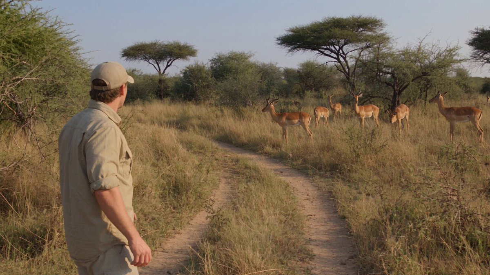
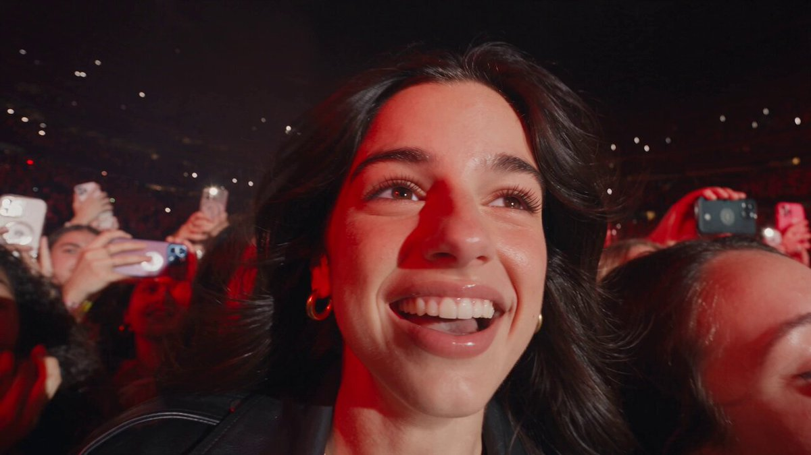
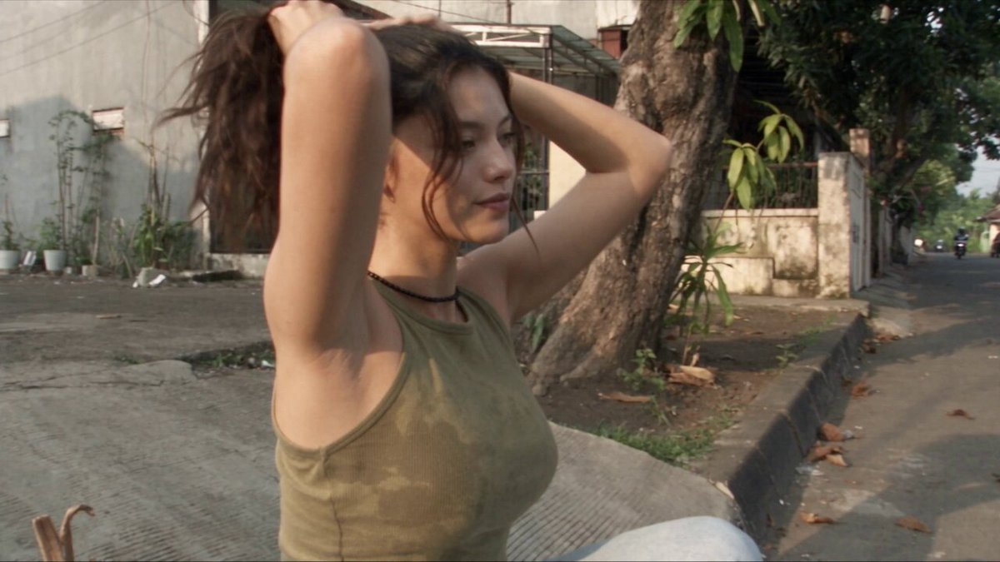
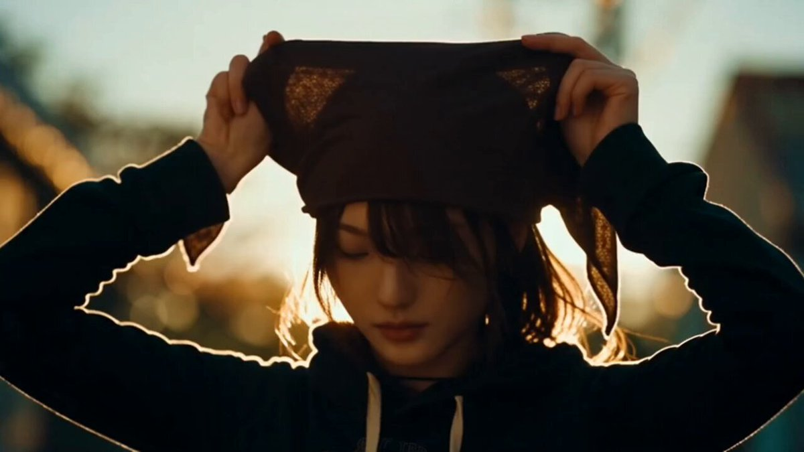
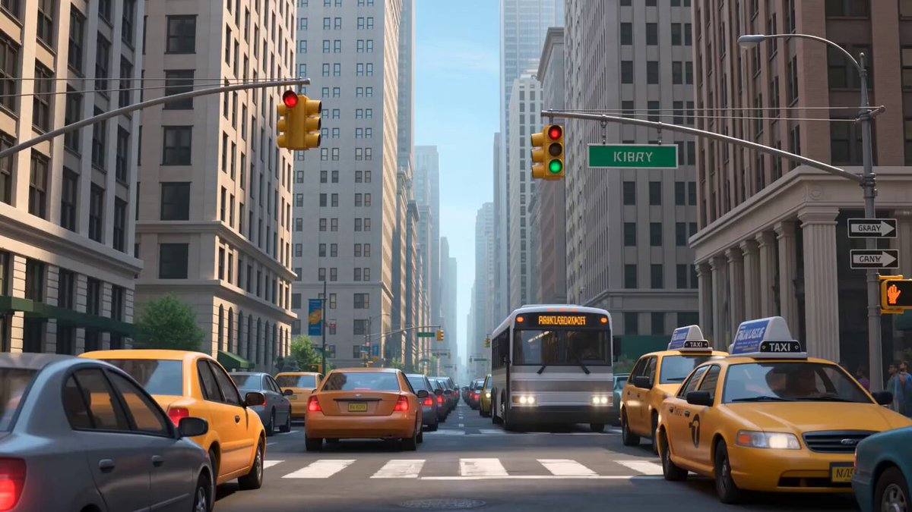

# Seedance 2.5 · Prompt Kütüphanesi · Leadde.ai

[](README.md) [](README_zh.md) [](README_zh-TW.md) [](README_ja-JP.md) [](README_ko-KR.md) [](README_th-TH.md) [](README_vi-VN.md) [](README_hi-IN.md) [](README_es-ES.md) [-lightgrey)](README_es-419.md) [](README_de-DE.md) [](README_fr-FR.md) [](README_it-IT.md) [-lightgrey)](README_pt-BR.md) [](README_pt-PT.md) [](README_tr-TR.md)

**Best for:** Seedance prompts for motion, camera language, cinematic scenes, product videos, and short-form creative.

For PDF, PPT, SOP, training, and multilingual video workflows:
[Awesome Document-to-Video](https://github.com/LeaddeOpenLab/awesome-document-to-video)

> **Her gün özenle seçilen kaliteli istemler**

Yapay zekâ ile görsel, video ve 3D üretimi için eksiksiz istemleri keşfedin. Stile göre gezinin, farklı dilleri seçin ve özgün üreticilerle kaynaklarını inceleyin.

[Leadde.ai’yi keşfedin →](https://leadde.ai/?utm_source=github&utm_medium=readme&utm_campaign=prompt-library&utm_content=seedance2.5)

## Leadde.ai ile tanışın

Leadde.ai, ekiplerin belgeleri, slaytları ve metinleri eğitim, işe uyum ve pazarlama için yapay zekâ destekli iş videolarına dönüştürmesine yardımcı olur.

Günlük istem seçkimizi ve yeni yaratıcı fikirleri takip etmek için bu depoya yıldız verin.

**231** Prompt · Son eklenen: **2026-09-23**

<a name="catalog"></a>

## Kategoriye göre göz at

[Fotoğrafçılık](#category-photography) · [Sinematik / Film Karesi](#category-cinematic-film-still) · [Anime / Manga](#category-anime-manga) · [Çizim / Çizgi Sanatı](#category-sketch-line-art) · [3D Modelleme](#category-3d-render) · [Mürekkep / Çin Tarzı](#category-ink-chinese-style) · [Retro / Vintage](#category-retro-vintage) · [Siberpunk / Bilim Kurgu](#category-cyberpunk-sci-fi) · [Minimalizm](#category-minimalism) · [Diğer](#category-other)

<a name="all-prompts"></a>

<a name="category-photography"></a>

## Fotoğrafçılık

<a name="prompt-2102635625904251200"></a>

### Çeviri sürüyor

Yazar：[@john\_my07](https://x.com/john_my07) · [Orijinal gönderi](https://x.com/john_my07/status/2102635625904251200)

Fotoğrafçılık · Hayvan / Yaratık · Yayımlandı

**Özet:** Çeviri sürüyor



**İstem**

```text
Çeviri sürüyor
```

[↑ Kategorilere dön](#catalog)

---

<a name="prompt-2102613848813650341"></a>

### Çeviri sürüyor

Yazar：[@Diplomeme](https://x.com/Diplomeme) · [Orijinal gönderi](https://x.com/Diplomeme/status/2102613848813650341)

Çizgi Roman / Hikaye Taslağı · Fotoğrafçılık · Yayımlandı

**Özet:** Çeviri sürüyor



**İstem**

```text
Çeviri sürüyor
```

[↑ Kategorilere dön](#catalog)

---

<a name="prompt-2102375668688322597"></a>

### Dönüş, aşağı ve yukarı eğim hareketlerinin adım adım hassas biçimde kontrol edildiği, 10 saniyelik akıllı telefon el kamerasıyla yatak odası tek plan portre kamera talimatı.

Yazar：[@johnAGI168](https://x.com/johnAGI168) · [Orijinal gönderi](https://x.com/johnAGI168/status/2102375668688322597)

Fotoğrafçılık · Portre / Selfie · Yayımlandı

**Özet:** Dönüş, aşağı ve yukarı eğim hareketlerinin adım adım hassas biçimde kontrol edildiği, 10 saniyelik akıllı telefon el kamerasıyla yatak odası tek plan portre kamera talimatı.


**İstem**

```text
10 saniye, 9:16 dikey ekran, otantik akıllı telefon el kamerası çekimi, kesintisiz tek plan (one-shot).

Tek karakter referans kartı olarak @图片1 kullanılsın; karakterin dış görünüşü, saç stili ve kıyafetleri kesinlikle karakter kartıyla birebir aynı kalmalıdır. Mekan doğal ışıkla aydınlatılan bir yatak odası, beyaz çarşaflar ve yumuşak yastıklar, günlük yaşam hissi, yumuşak ve sıcak renk tonları.

0—2 saniye:
Karakter kameraya arkası dönük biçimde yatakta yüzüstü yatmakta, üst gövdesini ön kollarıyla desteklemekte, bacakları doğal bir şekilde yatağın ayakucuna doğru uzanmaktadır. Kamera, ayakucuna yakın yüksek bir noktadan eğik açıyla aşağıya doğru çekim yapar; ilk kadraj karakterin sırtını, bacaklarını ve ayaklarını içerir. Kamera, ayakucundan yatak başına doğru fiziki olarak ileri yaklaşırken kadrajı kademeli olarak yukarı kaldırır, daha geniş kadrajdan bel, sırt ve omuzlara doğru ilerler; bacaklar ve ayaklar kadrajın altından doğal bir şekilde çıkar. Hafif el kamerası dalgalanması korunur, yaklaşma hareketi yumuşak ve süreklidir.

2—4.5 saniye:
Kadraj dışından bir el sol alt köşeden kısa bir süreliğine girer, karakterin bel hizasındaki kıyafete hafifçe dokunur ve geri çekilir. Dokunmayı fark eden karakter başını kameraya doğru çevirir, ardından omuzlarını ve vücudunu yana döndürür, koluyla destek alarak yavaşça yüzünü tam karşıdan gösterir. Kamera karakterin hareketini takip ederek yukarı yönelir, omuz ve sırttan yüze ve üst gövdeye doğru kayar; hafifçe yatay kadraj düzeltmesi yaparak yatak yanındaki yüksek açılı eğik üstten bakış pozisyonunu sürekli korur. Karakterin dönüşü ile kameranın takibi pürüzsüzce birbirine bağlanır.

4.5—6 saniye:
Karakter yan yatarak duruşunu ayarlar, dizlerini doğal şekilde bükerek bir araya getirir. Kamera net, kesintisiz ve biraz daha hızlı bir aşağı eğim (tilt down) hareketi yapar; kadraj yüzden göğüs üzerinden aşağıya doğru bükülmüş diz ve bacaklara iner, yüz kadrajın üstünden çıkar; diz ve bacak hizasına ulaştığında kısa bir an yavaşlar. Hareket sırasında hafif gerçekçi hareket bulanıklığına ve bileğin hafif yan eğilmesine izin verilir.

6—7.5 saniye:
Kamera derhal aynı yol üzerinden tersine yukarı eğim (tilt up) yapar; diz ve bacaklardan üst gövde üzerinden tekrar yüze ve omuzlara döner, hareket akıcı ve uyumludur. Karakter kulağının yanındaki saçı düzeltmek için elini hafifçe kaldırır, bakışlarını aşağıdan tekrar kameraya çevirir; yüz ifadesi doğaldır, hafif bir merak ve yakınlık hissi barındırır.

7.5—10 saniye:
Kamera hafifçe geriye çekilir, kadrajı başın tepesinden uylukların üst kısmına kadar genişletir. Karakter yan dönük biçimde yastıklara yaslanır, elleri doğal şekilde durur, kameraya bakmayı sürdürür. Kamera kademeli olarak yavaşlar, yatak yanındaki eğik üstten çekim pozisyonunda durur ve çok hafif bir el kamerası salınımıyla sonlanır.

Kamera hareketi odak noktaları: başlangıçta yavaş yaklaşma, orta bölümde biraz daha hızlı aşağı ve yukarı eğim hareketleri, sonda hafif geriye çekilip yavaşlama. Kamera hareketi, karakterin dönüşü ve kadraj değişiklikleri mekansal sürekliliği korur; yatak, yastıklar ve oda konumu sabit kalır.

Kaçınılması gerekenler: Kesmeler, geçişler, 180 derece yörünge dönüşü, 360 derece yuvarlanma, ters dönen görüntü, ani dijital yakınlaştırma, aşırı titreme, karakterin ışınlanması, yüz değişimleri, kıyafet değişimleri, uzuv deformasyonları, fazla parmaklar, ikinci bir tam kişinin kadraja girmesi, altyazı, filigran. Kadraj dışındaki el sadece dokunma anında kısa süreliğine görünmeli ve ardından tamamen çıkmalıdır.
```

[↑ Kategorilere dön](#catalog)

---

<a name="prompt-2101897626123899372"></a>

### Karlı dağdaki süzülen tapınak keşfini ve Boss savaşını sergileyen Unreal Engine 5 tarzında üçüncü şahıs aksiyon-macera oynanış sekansı.

Yazar：[@kingofdairyque](https://x.com/kingofdairyque) · [Orijinal gönderi](https://x.com/kingofdairyque/status/2101897626123899372)

Fotoğrafçılık · Karakter · Yayımlandı

**Özet:** Karlı dağdaki süzülen tapınak keşfini ve Boss savaşını sergileyen Unreal Engine 5 tarzında üçüncü şahıs aksiyon-macera oynanış sekansı.


**İstem**

```text
Unreal Engine 5 ile hazırlanmış, 30 saniyelik, 16:9 oranında, fotogerçekçi, üçüncü şahıs fantastik aksiyon-macera oynanış sekansı. Kusursuz hareketler, gerçekçi fizik, dinamik kamera açıları ve asgari düzeyde HUD ile gerçek, oynanabilir bir AAA oyunu hissi verin.

Yıpranmış kışlık giysiler, kürk astarlı pelerin, tırmanma ekipmanı, kavisli bir kılıç ve parıldayan gümüş-mavi bir rüzgâr cihazı taşıyan genç bir kâşif, bulutların üzerinde asılı duran devasa donmuş bir tapınağı keşfeder. Karakter ve ekipman tutarlılığını kesinlikle koruyun.

0–5 sn — Donmuş Zirve
Kâşif buzlu bir duvara tırmanır, çökmekte olan bir platformun üzerine atlar, ardından devasa buz kütleleri bulutlara doğru düşerken dar ve donmuş bir köprüden hızla koşar. Kamera devasa tapınağı gözler önüne sermek için geriye çekilerek geniş açıya geçer.

5–10 sn — Rüzgârla Geçiş
Köprü çöker. Kâşif rüzgâr cihazını etkinleştirir, boşluğun üzerinden fırlar, asılı bir zinciri yakalar, kadim bir türbinin etrafında sallanır ve başka bir platforma iniş yapar.

10–15 sn — Tapınak Uyanıyor
Kristallerle dolu devasa bir odanın içinde kâşif üç kadim rüzgâr mekanizmasını etkinleştirir. Donmuş bir kapı patlayarak açılır ve odanın yukarısında uyanmakta olan devasa kanatlı bir yaratığı ortaya çıkarır.

15–21 sn — Kaçış
Tapınak çökmeye başlar. Kâşif dönen platformlar üzerinde koşar, düşen taşlardan kaçar ve yaratık arkasındaki platformları yok ederken çıkışa doğru süzülmek için rüzgâr yeteneğini kullanır.

21–26 sn — Boss Arenası
Kâşif bulutların üzerindeki devasa dairesel bir platforma fırlar. Yaratık tapınağın çatısını kırarak içeri dalar. Oyuncu kılıcını çekerken arena boyunca kar ve buz etrafa saçılır.

26–30 sn — Epik Dövüş
Yaratık devasa bir kanat saldırısı başlatır. Kâşif altından sıyrılır, rüzgâr cihazını kullanarak parlayan göğüs kristalini açığa çıkarır, ardından kılıcıyla vurur. Yaratığın can barı düşerken mavi enerji çatlakları gövdesine yayılır. Yaratık bir sonraki saldırısını hazırlarken oyuncunun ileriye hücum etmesiyle sonlandırın.

Fotogerçekçi AAA oynanış, gerçekçi kar ve buz fiziği, sinematik aydınlatma, hacimsel bulutlar, ayrıntılı kadim mimari, doğal kumaş ve saç hareketleri, yaratığın inandırıcı ağırlığı, akıcı 60 fps hareket, kesintisiz oyuncu kontrollü kamera.

Kurgusal montaj kesintileri yok, vahşet yok, kan yok, modern silahlar yok, altyazı yok, logo yok, filigran yok, siyah şeritler yok, karararak kapanma (fade-out) yok.
```

[↑ Kategorilere dön](#catalog)

---

<a name="prompt-2101516770255270041"></a>

### Hasarlı köy keşfi, bulmaca çözerek güç sağlama, yeraltı bölüm sonu canavarı savaşı, su baskınından kaçış ve HUD arayüzünü içeren Unreal Engine 5 gerçekçi tarzda üçüncü şahıs aksiyon-macera oyunu oynanış videosu promptu.

Yazar：[@AIwithSynthia](https://x.com/AIwithSynthia) · [Orijinal gönderi](https://x.com/AIwithSynthia/status/2101516770255270041)

Uygulama / Web Tasarımı · Fotoğrafçılık · Karakter · Yayımlandı

**Özet:** Hasarlı köy keşfi, bulmaca çözerek güç sağlama, yeraltı bölüm sonu canavarı savaşı, su baskınından kaçış ve HUD arayüzünü içeren Unreal Engine 5 gerçekçi tarzda üçüncü şahıs aksiyon-macera oyunu oynanış videosu promptu.


**İstem**

```text
Sinematik bir fragman değil, gerçek oynanabilir Unreal Engine 5 görüntülerini andıran, 16 : 9 formatında, 30 saniyelik fotogerçekçi bir AAA üçüncü şahıs açık dünya aksiyon-macera oynanış videosu oluşturun.
20'li yaşların ortalarında genç Koreli kadın maceracı; baştan sona birebir aynı yüz, alçak koyu renk atkuyruğu, atletik yapı, koyu deniz mavisi ceket, siyah tişört, kahverengi kargo pantolon, dayanıklı botlar, eldivenler, sırt çantası, tırmanma ipi ve metal pusulalı bileklik.
Karakterin arkasında ve hafifçe üzerinde duran, özgün hareket kabiliyetine, gerçekçi fiziklere, gölgelere, materyallere, animasyona ve çevresel etkileşime sahip, normal oyuncu kontrollü bir üçüncü şahıs kamerası kullanın.
Terk edilmiş evler, çamurlu sokaklar, kırık köprüler, araçlar ve sarkan elektrik kablolarıyla dolu, fırtınadan hasar görmüş bir dağ köyüne girer. HUD: “SEARCH THE ABANDONED VILLAGE.”
Keşfeder, kırık bir geçidin üzerinden atlar, bir çatıya tırmanır ve dayanıklılığı (stamina) gözle görülür şekilde azalırken eski bir radyo kulesine ulaşır. HUD: “FIND A WAY TO THE RADIO TOWER.”
Kilitli bir jeneratör odası keşfeder, gevşek bir kabloyu yeniden bağlar ve gücü geri getirerek köyün altındaki antik bir mekanizmayı etkinleştirir. HUD: “INVESTIGATE THE HIDDEN PASSAGE.”
Dönen platformlar, metal zincirler ve devasa mühürlü bir kapı içeren devasa bir yeraltı harabesine iner, ardından kapıyı açmak için mekanizmayı etkinleştirir.
Taş ve metalden oluşan devasa bir muhafız uyanır. Düşman can çubuğu ve kilitlenme göstergesiyle birlikte HUD “DEFEAT THE RUIN GUARDIAN” olarak değişirken kılıcını çeker.
Muhafız saldırır → karakter sıyrılır → manyetik bilekliğini etkinleştirir → hasarlı zırhı çekip koparır → parlayan zayıf bir nokta ortaya çıkar → kılıcıyla oraya vurur → bölüm sonu canavarının (boss) canı azalır.
Muhafız odayı yerle bir eder, duvarlardan sular fışkırır ve karakter çöken platformlardan kaçar, enkazların üzerinden atlar ve yüzeye doğru tırmanır. HUD: “ESCAPE THE FLOODED RUINS.”
Köyün üzerindeki dağlık bir seyir noktasına ulaşır ve uzaktaki dağlar arasında asılı duran devasa bir antik gökyüzü kalesi görür. HUD: “MISSION COMPLETE: ESCAPED THE RUINS”, ardından “NEW OBJECTIVE: INVESTIGATE THE SKY FORTRESS.”
Fotogerçekçi Kore UE5 kalitesinde oynanış, gerçekçi yıkım ve su fiziği, işlevsel minimalist HUD, doğal oyuncu kontrollü kamera hareketi, katı karakter ve ekipman tutarlılığı; sinematik fragman görünümü yok, mobil oyun grafiği yok, anime yok, çizgi film yok, vahşet (gore) yok, altyazı yok, logo yok, filigran yok.
```

[↑ Kategorilere dön](#catalog)

---

<a name="prompt-2101138386132386252"></a>

### Aydınlık ve zarif bir odada cilt bakımı uygulayan Koreli bir kadının yer aldığı 15 saniyelik fotogerçekçi cilt bakımı reklamı.

Yazar：[@Aiwithmaha](https://x.com/Aiwithmaha) · [Orijinal gönderi](https://x.com/Aiwithmaha/status/2101138386132386252)

Fotoğrafçılık · Karakter · Yayımlandı

**Özet:** Aydınlık ve zarif bir odada cilt bakımı uygulayan Koreli bir kadının yer aldığı 15 saniyelik fotogerçekçi cilt bakımı reklamı.


**İstem**

```text
Aydınlık ve zarif beyaz bir odada genç bir Koreli kadının yer aldığı 15 saniyelik fotogerçekçi bir cilt bakımı videosu oluşturun. Kadının parmak ucuyla yanağına nazikçe dokunduğu, gerçekçi cilt dokusunu ve yumuşak gün ışığını gösteren doğal yüzünün aşırı yakın çekimiyle başlayın. Ardından, beyaz mermer bir masanın üzerinde duran şeffaf cilt bakımı şişesine elinin yavaşça uzandığını gösterin. Yüz hatlarını ve görünümünü tutarlı tutarak, iki elini de kullanarak cilt bakım ürününü yüzüne nazikçe uygulayışıyla devam edin. Parmak uçlarıyla her iki yanağına nazikçe masaj yaparken gözlerini huzurla kapattığını gösterin. Büyük bir pencerenin yanında sade beyaz bir elbise içinde dururken, tül beyaz perdelerin güneş ışığında doğal bir şekilde hareket ettiği daha geniş bir çekimle bitirin. Doğal eller, gerçekçi cilt, yumuşak sinematik aydınlatma, ferah lüks atmosfer, nazik kamera hareketleri ve hiçbir bozulma veya yapay görünümlü ayrıntı olmadan hareketleri akıcı ve gerçekçi tutun.
```

[↑ Kategorilere dön](#catalog)

---

<a name="prompt-2097837460910956650"></a>

### Çeviri sürüyor

Yazar：[@john87445528](https://x.com/john87445528) · [Orijinal gönderi](https://x.com/john87445528/status/2097837460910956650)

Fotoğrafçılık · Karakter · Moda Ürünü · Yayımlandı

**Özet:** Çeviri sürüyor


**İstem**

```text
Çeviri sürüyor
```

[↑ Kategorilere dön](#catalog)

---

<a name="prompt-2096930655615758734"></a>

### 30 saniyelik ultra gerçekçi UGC video istemi: Genç Koreli kadın yatak odasında kamerayı elde tutarak günlük vlog çekiyor, yeni aldığı kamerayı gösteriyor ve doğal bir şekilde konuşuyor.

Yazar：[@AIwithkhan](https://x.com/AIwithkhan) · [Orijinal gönderi](https://x.com/AIwithkhan/status/2096930655615758734)

Fotoğrafçılık · Karakter · Yayımlandı

**Özet:** 30 saniyelik ultra gerçekçi UGC video istemi: Genç Koreli kadın yatak odasında kamerayı elde tutarak günlük vlog çekiyor, yeni aldığı kamerayı gösteriyor ve doğal bir şekilde konuşuyor.


**İstem**

```text
Kendi yatak odasında, yakın zamanda satın aldığı yeni kamera hakkında kameraya samimi bir şekilde konuşan genç bir Koreli kadının 30 saniyelik, 1080p ultra gerçekçi bir UGC videosunu oluşturun.
ANA ÖZNE
20'li yaşlarının başında genç Koreli kadın, doğal olarak güzel, gerçekçi cilt dokusu, hafif makyaj, yüzünün etrafında birkaç serbest tutam olan, gevşekçe bağlanmış dağınık yandan at kuyruğu şeklinde dalgalı siyah saçlar. Üzerinde vücuda oturan pastel mavi kısa bir üst, krem rengi dökümlü pijama tarzı pantolon ve sade gümüş bir kolye var.
Tam yüz kimliğini, saç stilini, kıyafetini, vücut hatlarını ve genel görünümünü tüm video boyunca tutarlı bir şekilde koruyun.
MEKÂN
Ilık bir pazartesi sabahında normal bir Kore dairesinde bulunan kendi sıcak ve samimi yatak odası. Arkasında bir yastık, küçük bir komodin, birkaç günlük kişisel eşya ve pencereden giren yumuşak doğal güneş ışığıyla, hafifçe kırışmış beyaz nevresimli yatağında rahatça oturuyor.
Oda sahnelenmiş veya lüks değil, içinde yaşanmış ve özgün hissettirmelidir.
UGC TARZI
Kamerayı kendisi tutuyor veya kamera önündeki yatağa rastgele yaslanmış durumda. Çerçeveleme, doğal el hareketleri, küçük otomatik odaklama ayarlamaları ve ara sıra değişen pozlama ile hafifçe kusurludur.
Video, parlatılmış bir reklam gibi değil, takipçileri için kaydedilmiş samimi, kişisel bir vlog gibi hissettirmelidir.
HAREKET / DİYALOG
Yatakta bağdaş kurup oturur, lense bakar ve gülümser.
Doğal bir şekilde şöyle der:
“Okay, I finally got this camera I’ve been talking about.”
Hafifçe güler ve kısa bir süre göstermek için kamerayı eline alır.
“I’ve only had it for like two days, but I already bring it everywhere.”
Kamerayı tekrar yerine koyar ve yastığa yaslanır.
“I wanted something that feels a little more personal than just using my phone.”
Odasının etrafına bakar, ardından tekrar lense döner.
“The footage has this old-school look that I really love. It kind of feels like I’m recording memories instead of just posting videos.”
Gülümser ve açıkta kalan bir saç tutamını kulağının arkasına sıkıştırır.
Sona doğru saate bir göz atar, güler ve şöyle der:
“Anyway, it’s Monday, I should probably get out of bed.”
Doğal bir şekilde gülümseyerek kaydı durdurmak istercesine kameraya doğru uzanır ve video hareketin ortasında kesilir.
KAMERA / GÖRSEL GÖRÜNÜM
2000'lerin başındaki DV tarzından ilham alan ince bir dokunuşa sahip özgün UGC: yumuşak dijital ayrıntılar, hafif görüntü gürültüsü, hafif otomatik odaklama araması, doğal cilt dokusu ve sıcak sabah ışığı. Dramatik ışıklandırma veya sinematik kamera hareketleri yok.
SES
Yalnızca doğal yatak odası ortam sesi, onun sesi, ince kumaş hareketleri, uzaktan gelen mahalle sesleri ve hafif kamera tutma gürültüsü. Müzik yok, dış ses yok.
SON HİS
Rahat bir Koreli yaşam tarzı içerik üreticisi videosu. Kendi odasında çekilmiş sıradan bir pazartesi sabahı vlog'u gibi sıcak, feminen, samimi ve inandırıcı.
NEGATİF
Ticari reklam oyunculuğu yok, kusursuz stüdyo aydınlatması yok, kurgulanmış influencer pozları yok, kimlik kayması yok, kıyafet değişikliği yok, bozuk eller yok, fazla parmaklar yok, altyazı, logo, filigran veya yapay zekâ kusurları yok.
```

[↑ Kategorilere dön](#catalog)

---

<a name="prompt-2096931238460178592"></a>

### Seul'ün eski bir mahallesinde sıradan ama unutulmaz bir yaz akşamı geçiren genç bir Koreli kadının, ayrıntılı zaman çizelgesi eylemleri, el kamerası kusurları ve ortam sesi içeren, 2000'lerin başlarına ait 30 saniyelik, 1080p, 16:9 ultra gerçekçi bir DV ev videosunu oluşturun.

Yazar：[@SimplyAnnisa](https://x.com/SimplyAnnisa) · [Orijinal gönderi](https://x.com/SimplyAnnisa/status/2096931238460178592)

Fotoğrafçılık · Karakter · Yayımlandı

**Özet:** Seul'ün eski bir mahallesinde sıradan ama unutulmaz bir yaz akşamı geçiren genç bir Koreli kadının, ayrıntılı zaman çizelgesi eylemleri, el kamerası kusurları ve ortam sesi içeren, 2000'lerin başlarına ait 30 saniyelik, 1080p, 16:9 ultra gerçekçi bir DV ev videosunu oluşturun.


**İstem**

```text
Seul'ün eski bir mahallesinde sıradan ama beklenmedik derecede unutulmaz bir yaz akşamı geçiren genç bir Koreli kadının, 2000'lerin başlarına ait ultra gerçekçi, 30 saniyelik, 1080p, 16:9 formatında bir DV ev videosunu oluşturun.

20'li yaşlarının başında, doğal olarak güzel bir Koreli kadın; gerçekçi cilt, hafif makyaj, uzun siyah hafif dalgalı saçlar, açık mavi örgü kazak, dökümlü krem rengi pantolon, beyaz spor ayakkabılar, kahverengi çapraz çanta ve gümüş saat. Kimliğini, yüzünü, kıyafetini, saç modelini ve vücut oranlarını kusursuz bir şekilde tutarlı tutun.

MEKÂN

Beton sokakları, apartmanları, saksı bitkileri, bisikletleri, elektrik direkleri, yapraklı ağaçları ve minik bir mahalle bakkalı olan sessiz, eski bir Seul konut caddesi. Yaşanmışlık hissi veren ve otantik. Markalar, logolar, reklamlar veya turistik yerler yok.

KAMERA TARZI

2000'lerin başından kalma ucuz bir DV video kamerasından alınmış ham görüntüler: titrek el kamerası hareketi, kusurlu kadraj, otomatik odaklama arayışı, pozlama dalgalanmaları, soluk renkler, yumuşak detaylar, hafif kaset paraziti, kazara yapılan yakınlaştırmalar ve doğal kamera hataları. Sabitleme veya sinematik çekimler yok.

00:00–00:06 — GİZEM

Küçük bir plastik poşet taşıyarak sokakta yürürken aniden arkasından gelen hafif bir çıngırak sesi duyar.

Durur ve etrafına bakınır.

Kamera hızla kafası karışmış yüzüne yakınlaşır.

Şöyle der:

“Did you hear that?”

00:06–00:12 — KÜÇÜK KEŞİF

Sesi takip eder ve küçük zili hafifçe açık kalmış eski, küçük bir bisiklet bulur.

Zile nazikçe dokunur.

Çın.

Kameraya bakar ve güler.

Ardından bisiklette asılı duran, el yazısıyla yazılmış gibi görünen küçük bir kâğıt etiket fark eder, ancak yazı okunamayacak kadar belirsizdir.

00:12–00:18 — RÜZGÂR

Ani bir esinti sokak boyunca birkaç kuru yaprağı savurur.

Biri doğrudan başının üzerine düşer.

Fark etmez.

Kameraman güler.

Kafası karışmış görünür, ardından durumu fark edip yaprağı alır.

Kameraya mahcup bir bakış atar.

00:18–00:24 — KÜÇÜK MÜCADELE

Yaprağı bisikletin selesine koyar ve orada dengede tutmaya çalışır.

Rüzgâr onu hemen uçurur.

Tekrar dener.

Tekrar düşer.

Güler ve sonunda pes eder.

00:24–00:30 — HATIRA

Yaprağı yerden alır, küçük çantasına koyar ve eve doğru yürümeye başlar.

Birkaç adım attıktan sonra kameraya döner ve şöyle der:

“Okay, that was pointless.”

Gülümser ve yürümeye devam eder.

Kamera, görüntü aniden kararmadan önce onu birkaç saniye takip eder.

SES

Yalnızca doğal ortam sesi: ayak sesleri, uzaktaki trafik, bisiklet zili, yaz böcekleri, yapraklar, rüzgâr, mahalle ambiyansı ve doğal gülüşler.

Müzik, dış ses, altyazı, başlık, logo, filigran veya ekranda herhangi bir metin yok.

GERÇEKÇİLİK

Doğal insan tepkileri, kusurlu zamanlama, gerçekçi fizik kuralları, tutarlı nesneler, otantik Kore mahallesi detayları ve inandırıcı DV kamera kusurları. CGI görünümü, bozuk eller, fazladan parmaklar, yinelenen insanlar, kimlik kayması veya kıyafet değişiklikleri yok.

16:9 en-boy oranı.
```

[↑ Kategorilere dön](#catalog)

---

<a name="prompt-2097181982924984513"></a>

### Sessiz bir mahallede, ayrıntılı kronolojik sahne zaman damgalarıyla 2000'lerin başı DV video kamerası ev videosu estetiğinde otantik Endonezyalı kadın.

Yazar：[@QAiStudio](https://x.com/QAiStudio) · [Orijinal gönderi](https://x.com/QAiStudio/status/2097181982924984513)

Fotoğrafçılık · Karakter · Yayımlandı

**Özet:** Sessiz bir mahallede, ayrıntılı kronolojik sahne zaman damgalarıyla 2000'lerin başı DV video kamerası ev videosu estetiğinde otantik Endonezyalı kadın.


**İstem**

```text
Otantik Endonezyalı kadın, 2000'lerin başı Endonezya ev videosu estetiği. Birebir yüzünü, kimliğini, saç stilini, yüz hatlarını, ten rengini, vücut hatlarını, doğal koltuk altı tüylerini, soluk zeytin yeşili kolsuz crop top'ını, bol yüksek bel açık mavi kot pantolonunu, siyah bez spor ayakkabılarını, siyah kordon kolyesini, dalgalı siyah saçlarını, yana taranmış kâküllerini, dağınık toplanmış at kuyruğunu koruyun. Sıradan sessiz Endonezya yerleşim mahallesi: dar beton ara sokak, basit tek katlı evler, küçük teraslar, alçak duvarlar, saksı bitkileri, park edilmiş motosikletler, büyük ağaçlar, birbirine dolanmış havai kablolar. Dükkân veya ticari faaliyet yok. 00:00–00:03: Teras zemininde oturmuş bir deftere karalamalar yapıyor; el kamerası yukarıdan/yandan süzülüyor. 00:03–00:07: Kalemi çenesine vuruyor, hafifçe gülümsüyor, ardından çizmeye devam ediyor; kamera yüzü ile elleri arasında geziniyor. 00:07–00:10: Betonda sürünen karıncaları izleyerek bir hasırın üzerine uzanıyor. 00:10–00:13: Karıncaların yakınına hafifçe dokunuyor ve sessizce gülüyor. 00:13–00:17: Alçak bir duvara doğru yürüyor, üzerine zıplıyor ve bacaklarını sallıyor. 00:17–00:20: Sessiz sokağa bakarken rahatça cips yiyor. 00:20–00:24: Omuzlarında bir havlu, nemli saçlarıyla basamaklarda oturuyor, yavaşça tarıyor. 00:24–00:27: Islak saçlarını tararken yakın el kamerası çekimi, su damlacıkları görünür durumda. 00:27–00:30: Bitiriyor, nemli saçlarını arkaya atıyor, kameraya bakıyor ve doğal bir şekilde gülümsüyor. Siyaha ani kesme. Son derece ham el DV kamerası gerçekçiliği: yoğun hareket, mikro titremeler, kazara yapılan çerçevelemeler, merkez dışı kompozisyon, ara sıra yüzün kadraj dışı kalması, otomatik odaklama arayışı, pozlama dalgalanmaları, hareket bulanıklığı, rolling shutter, soluk/doygunluğu azaltılmış renkler, dijital parazit ve sıkıştırma artefaktları. Poz verme, sabitleme, sinematik görünüm, moda-reklam tasarımı, modern renk derecelendirmesi veya müzik yok. Yalnızca doğal sabah ambiyansı: kuşlar, esinti, uzaktaki motosikletler, mahalle konuşmaları, kâğıt çizimi, cips paketi, yapraklar, tarak. 16:9.
```

[↑ Kategorilere dön](#catalog)

---

<a name="prompt-2097185861259727263"></a>

### Gün batımındaki balık pazarlarından ve sahil yürüyüşlerinden gece yarısı dalgakıranına kadar uzanan bir akşam yolculuğunu yakalayan 30 saniyelik Kore sahili seyahat vlogu için fotogerçekçi istem.

Yazar：[@nawalsehar](https://x.com/nawalsehar) · [Orijinal gönderi](https://x.com/nawalsehar/status/2097185861259727263)

Fotoğrafçılık · Manzara / Doğa · Yayımlandı

**Özet:** Gün batımındaki balık pazarlarından ve sahil yürüyüşlerinden gece yarısı dalgakıranına kadar uzanan bir akşam yolculuğunu yakalayan 30 saniyelik Kore sahili seyahat vlogu için fotogerçekçi istem.


**İstem**

```text
Huzurlu bir kıyı köyünde bir akşam boyunca genç bir Koreli kadını takip eden, Kore sahilinde geçen 30 saniyelik fotogerçekçi bir canlı çekim seyahat vlogger videosu oluşturun. Taze deniz ürünleri, ıslak zeminler ve gün batımı ışığının olduğu hareketli bir deniz ürünleri pazarında başlayın. Rahat ve geleneksel bir konukevine giriş yapar, ardından altın saatte dalgalar ayaklarına vururken sahilde çıplak ayakla yürür. Taze ızgara deniz ürünlerinin tadını çıkardığı ve çevresiyle doğal bir şekilde etkileşime girdiği sıcak bir gece deniz ürünleri pazarına geçiş yapın. Gece yarısı sessiz bir dalgakıranın yanında, uzaktaki balıkçı ışıkları ve aşağıda çarpan dalgalarla karanlık okyanusu izleyerek bitirin. Otantik 2026 akıllı telefon/sinema kamerası vlog tarzı, doğal Kore ortamı, gerçekçi cilt, saç, kıyafet, su, yemek, duman, dalgalar ve insan hareketi. Elde taşınan kamera, doğal otomatik odaklama, pozlama değişiklikleri ve gerçekçi hareket bulanıklığı. Yalnızca İngilizce diyalog, doğal çevresel ses, arka plan müziği veya dış ses yok. İnandırıcı fizik kurallarına, aydınlatmaya, akıcı harekete ve kendiliğinden gelişen ifadelere güçlü vurgu. CGI, animasyon, altyazı, logo veya filigran yok.
```

[↑ Kategorilere dön](#catalog)

---

<a name="prompt-2097186378861953475"></a>

### Otobüsünü kaçırdıktan sonra sakin bir köyü keşfeden genç bir kadını takip eden, doğal aydınlatma ve elde kamera tarzı içeren, Japon dağ kasabasında geçen 30 saniyelik fotogerçekçi bir seyahat vLog'u oluşturun.

Yazar：[@aiwithaly](https://x.com/aiwithaly) · [Orijinal gönderi](https://x.com/aiwithaly/status/2097186378861953475)

Fotoğrafçılık · Karakter · Manzara / Doğa · Yayımlandı

**Özet:** Otobüsünü kaçırdıktan sonra sakin bir köyü keşfeden genç bir kadını takip eden, doğal aydınlatma ve elde kamera tarzı içeren, Japon dağ kasabasında geçen 30 saniyelik fotogerçekçi bir seyahat vLog'u oluşturun.


**İstem**

```text
Otobüsünü kaçıran ve 25 dakikasını bu sakin kasabayı keşfederek geçiren genç bir Japon kadını takip eden, Japon dağ kasabasında geçen 30 saniyelik fotogerçekçi bir seyahat vLog'u oluşturun. Kadının hareket eden otobüsün ardından koşmasını → sefer saatlerini kontrol etmesini → huzurlu sokaklarda ve kırmızı bir köprünün üzerinden yürümesini → geleneksel bir çay dükkanını keşfetmesini → sıcak yeşil çayın tadını çıkarmasını → altın saatteki dağ manzarasını izlemesini → bir sonraki otobüsün geldiğini duyup durağa geri dönmesini gösterin. 2026 yılına ait otantik seyahat görüntüleri, doğal Japon manzaraları, gerçekçi yürüme ve insan hareketleri, rüzgarda hareket eden saç ve giysiler, akan dere, tüten çay, inandırıcı otobüs fiziği ve altın saat aydınlatması. Doğal otomatik odaklama, pozlama değişiklikleri ve hafif hareket bulanıklığı ile elde tutulan akıllı telefon veya sinema kamerası tarzı. Yalnızca İngilizce diyalog, gerçekçi köy ortamı ve arka plan müziği yok. CGI, animasyon, VHS estetiği, altyazı, logo veya filigran olmasın.
```

[↑ Kategorilere dön](#catalog)

---

<a name="prompt-2097097582262825180"></a>

### 15秒第一人称视角的台球厅暧昧喜剧视频提示词，包含详细的分镜时间线、人物互动、运镜方式、台球局轨迹及音频与负面约束。

Yazar：[@john87445528](https://x.com/john87445528) · [Orijinal gönderi](https://x.com/john87445528/status/2097097582262825180)

Çizgi Roman / Hikaye Taslağı · Fotoğrafçılık · Karakter · Yayımlandı

**Özet:** 15秒第一人称视角的台球厅暧昧喜剧视频提示词，包含详细的分镜时间线、人物互动、运镜方式、台球局轨迹及音频与负面约束。


**İstem**

```text
｜15秒｜男主第一人称｜海妖风暧昧喜剧 【剧情锁定】 成年女主角#1发现男主准备击球，故意走进他的视野，主动侧坐上台球桌，屈起一条腿，让预定#2服装原有剪裁自然呈现大腿线条，以海妖风眼神和姿态干扰瞄准。男主停杆、抬头，她以为自己的小心思奏效；男主却不耐烦地倒转球杆，用橡胶粗端隔着衣服轻顶她臀侧一下，催她下桌。她被识破后调皮又无奈地让开，男主立即继续击球，母球撞中目标球，目标球落袋。 必须完整呈现“她先站着—主动上桌—故意展示腿部线条并观察他的反应”。她明知会干扰打球，仍主动试探；不能开场便让她已经坐好，也不能演成偶然挡路。 【人物与服装】 画面中唯一可见的人物是成年女主角#1
，面孔、发型、体型保持一致。#1完整穿着预定#2
屏幕截图_31-8-2026_22160_jimeng.jianying.com
服装，带着装饰眼镜
包括既定丝袜
和配饰；#2仅是服装编号，绝不生成第二个人物。腿部呈现服从#2本身的长度、开口和袜装，不能为了露腿改变剪裁、消除袜子或凭空缩短衣服。 成年男主只提供第一人称视点、唯一一支球杆和一句画外对白。脸、身体、手臂、双手、影子、倒影均不入画。全片不出现其他人或人物复制。 【影像与拍摄关系】 9:16竖屏，1080×1920，30fps，约26—28mm等效视角。男主佩戴贴近眼线的轻型头戴相机，保留未经处理的手机视频观感。低头看球、抬头看人、直起身体均带动真实镜头运动。男主无需手持摄影设备，可以正常操杆；握杆手和架杆手始终位于取景下缘之外。 全程连续第一人称，不切到男主正面、第三人称或外部全景。轻微呼吸起伏、头部晃动和不完美重新构图；从白球转看#1时，对焦允许短暂迟疑。冷白顶灯照明，肤色和衣料保留纹理，暗部带少量手机噪点；快速调杆有适量运动模糊，但不能糊掉端头交换。无美颜、磨皮、电影调色和稳定器运镜。 构图以能读懂人物动作为先：上桌时保留她扶库边的手、坐下的位置和两腿变化；试探时让脸与腿部线条同时在画面内；赶人时让表情和球杆粗端同时可见；最后回到白球、红球、中袋的完整路线。镜头不长时间追着某一处身体，也不能为了看脸把上桌和调杆动作裁掉。 【台球厅环境】 普通室内台球厅，绿色台呢、红棕色木质库边、黑色桌体、银色边框和白色网兜球袋。背景为深灰与棕色竖向墙板、浅色百叶窗、深绿色等候椅，顶灯将桌面照得比背景明亮。远处可见另一张无人使用的球桌，环境朴素、有实际使用痕迹，整体空间和光线全程不变。 没有酒吧灯光、粉色爱心、霓虹装饰、豪华软包或摄影棚布景。镜头范围内不出现其他顾客、工作人员、人像海报或镜面反射。 【空间与球局】 男主位于近侧长库边中央，#1开始站在对面长库边、画面右侧。两人隔着约1.3米的桌宽相对，不能改成隔着整张球桌的长度。对面中袋位于画面上方中央，始终是明确的落袋目标。 桌上起始共有四颗球：一颗白色母球、一颗红色实心目标球、一颗蓝球、一颗黄球。白球位于近半台中央；红球在对面中袋前约25厘米，白球、红球、中袋形成容易看清的直线。蓝球与黄球分别停在左右远离球路的位置，全程静止。 #1坐在对面中袋右侧的库边，身体斜向镜头；一条屈腿轻放在台面右侧边缘，另一条腿垂在桌外。她的腿部和上身进入男主瞄准视野，但不踩球、不压球、不把腿跨在两球之间。她必须下桌后男主才击球。 她坐下前，白球到红球、红球到中袋的路线已在开场建立；她坐下后，屈腿位于这条路线右侧，进入视野并分散注意，但实际球路没有被身体堵死。她收腿下桌的过程中不得碰动任何球。球位从开头直到出杆保持不变，观众能用同一组位置看懂男主始终想打哪一球。 【海妖风与结尾表情】 坐姿呈自然S曲线：身体微侧，肩部下沉，颈部拉长，下巴轻轻侧抬，腰胯略向一侧移。屈腿与垂腿前后错位，大腿线条在人物整体中自然可见；左手撑库边，右手只整理一次发丝。半垂眼冷感直视男主，嘴角仅有很淡的试探笑意。 前半段冷艳、克制、有距离感；后半段按剧情允许出现调皮、无奈的微笑。她被识破后不惊恐、不生气，也不狼狈尖叫，而是嘴角先停半拍，随后侧眼抿笑、小幅摇头，像在用表情说“行吧，你就知道打球”。这句话不实际说出，不加字幕。 暧昧必须通过相互观察表现：她每次调整坐姿后都会瞥一眼杆头，看到杆头停住才露出得意；男主的镜头则反复从她回到红球，留下他其实更在乎球局的线索。前半段的腿部展示、后半段的调皮笑都属于成年人的轻松玩笑，保持自然、从容，不用夸张表情代替剧情。 【球杆连续性】 唯一一支约145厘米的台球杆：浅木色细杆、细小蓝色皮头、深色粗握柄、尾部黑色橡胶保护帽。细头用于击球，橡胶粗端用于一次轻微赶人动作。 调头是端对端转过180度。必须连续看见：细头离开白球并撤回；同一杆身斜向扫过镜头前方；细头转向侧下方，粗握柄和黑色尾帽从另一侧绕出；最终黑色粗端指向#1。握持点可以藏在下缘，杆身不能整根退出后突然换成另一端，也不能只沿长轴自转。 翻杆时杆身经过人物前方，必须与她保持明显的前后距离，不扫到头发、面部或肩膀。橡胶尾帽靠近臀侧后仅短暂接触一次，随即离开；接下来由#1自己撑住库边、收腿、滑下。她的身体运动、衣料变化与接触顺序同步，不能先下桌再补拍顶人的动作。 【严格时间分镜】 → 0—3秒，第一人称俯看球桌。白球、红球、中袋与左右静止的蓝黄两球同时建立，细杆头正在白球后方试瞄。 原本站在对面长库边右侧的#1先看一眼球杆方向，再看向镜头。她主动扶住库边，侧身坐上去，屈起一条腿放到台面边缘，另一条腿垂在桌外。坐下、抬腿和衣料自然形成褶皱的过程连续可见，#2原有剪裁呈现大腿线条。镜头随男主抬头，从球路转向她的完整坐姿。 → 3—5.5秒，保持#1面部、上身和腿部同框的中景。她肩部放松下沉、颈部拉长，身体形成S曲线，指尖整理发丝，半垂眼看着镜头，随后把视线短暂移向球杆，确认男主是否停下。 球杆停止试瞄。镜头略低头看球，又抬回她脸上。#1看见这个反应，嘴角慢慢浮起一丝笃定笑意，屈起的膝盖略向侧面调整，使大腿线条更完整。动作明显带有故意干扰的试探，但不拉扯衣摆。 → 5.5—7秒，球杆再次靠近白球，却仍未击打。男主短促呼气，镜头随他直起身体升高，发出略带火气、不耐烦的成年男声：“让开，让开。” #1没有立刻移动，只轻轻侧头，半垂眼望着他，嘴角还保留着以为自己成功的笑意。 → 7—8.5秒，完整展示调转球杆。浅木色细头先从白球后方撤回，同一杆身斜贯画面前景，细头沿侧下方转走；深色粗柄与黑色橡胶尾帽从另一侧转到正前方，完成端对端半圈翻转。 相机有轻微头部晃动，但始终让杆身的一部分留在画面中。最终画面下方清楚出现朝向#1的黑色橡胶粗端，细头已经朝向男主一侧。 → 8.5—10秒，男主将粗端越过桌面，隔着完整#2服装，在#1靠台面一侧的臀部外侧短促轻顶一下，随即撤开。人物中景同时交代她的脸、姿态、库边和接触动作，不切局部特写。 #1低头看一眼黑色杆尾，嘴角原来的笃定笑意停住半拍。她明白男主完全没有配合自己的试探，主动双手撑库边，把屈起的腿收出台面，顺势向桌外滑下。动作由她自身支撑完成，不被顶飞，也不跌倒。 → 10—11秒，#1双脚落地后向画面右侧让开半步，鞋底落地声清楚。她侧眼看向男主，抿住忍不住扬起的嘴角，轻轻摇一次头，带一点“被你看穿了”的调皮无奈。 她身体重新微侧，颈线拉长，维持冷艳基调；不是慌张、恼怒、委屈或被羞辱的表情。 → 11—12秒，球杆粗端收回，按先前相反的路径端对端调转：黑色尾帽转向下缘，浅木色杆身和蓝色细皮头重新指向白球。镜头随男主低头回到球路，细头停在白球后方，#1已经完全让出观察方向。 → 12—14秒，男主平稳出杆一次，细皮头实际接触白球，发出清楚的“嗒”。白球先滚动，再撞上红球；红球沿直线滚向对面中袋，越过袋沿并落进白色网兜，发出真实的落袋声。 白球碰撞后留在台面，减速停下；蓝球和黄球原地不动。落袋后桌上剩白、蓝、黄三颗球，红球不能再次出现在桌面。 → 14—15秒，镜头从空出的中袋略抬向右侧。#1站在桌旁，目光先扫过落袋位置，再回到男主，半垂眼侧视，嘴角带着克制的调皮笑意，轻轻呼出一口气。 她保持自然S曲线和前后错位的双腿，一副小计策失败却又拿他没办法的模样。男主没有搭话，结尾停在她无奈抿笑的反应上。 【音频】 现场同期声：通风设备、远处模糊人声、坐上库边的衣料摩擦、球杆转动的轻响、鞋底落地、击球、球体碰撞与落袋声。唯一对白来自镜头后方成年男主：“让开，让开。”#1用表情完成反应。无背景音乐、旁白、解释性对白和罐头笑声。 【负面约束】 不得省略主动上桌和故意干扰；不得只拍她已经坐好的状态；不得把大腿裁出画面，也不得使用裙底角度或腿臀慢扫；不得改变#2服装或露出内衣；不得复制人物、肢体、球和球杆；不得出现男主或第二个#1；不得把翻杆省略成杆子退出后换端；不得用细头顶人、反复顶撞、造成受伤或摔落；不得让#1做惊恐、愤怒或委屈反应；不得省略白球撞红球和红球真实落袋；不得白球入袋代替红球，不得目标球凭空消失；不得出现字幕、水印、平台UI、爱心贴纸、慢动作或电影滤镜。
```

[↑ Kategorilere dön](#catalog)

---

<a name="category-cinematic-film-still"></a>

## Sinematik / Film Karesi

<a name="prompt-2102643806424506710"></a>

### Çeviri sürüyor

Yazar：[@QAiStudio](https://x.com/QAiStudio) · [Orijinal gönderi](https://x.com/QAiStudio/status/2102643806424506710)

Sinematik / Film Karesi · Karakter · Yayımlandı

**Özet:** Çeviri sürüyor



**İstem**

```text
Çeviri sürüyor
```

[↑ Kategorilere dön](#catalog)

---

<a name="prompt-2102641743669961207"></a>

### Çeviri sürüyor

Yazar：[@Zoyavelle](https://x.com/Zoyavelle) · [Orijinal gönderi](https://x.com/Zoyavelle/status/2102641743669961207)

Sinematik / Film Karesi · Karakter · Yiyecek / İçecek · Yayımlandı

**Özet:** Çeviri sürüyor



**İstem**

```text
Çeviri sürüyor
```

[↑ Kategorilere dön](#catalog)

---

<a name="prompt-2102616914187227595"></a>

### Çeviri sürüyor

Yazar：[@SimplyAnnisa](https://x.com/SimplyAnnisa) · [Orijinal gönderi](https://x.com/SimplyAnnisa/status/2102616914187227595)

Çizgi Roman / Hikaye Taslağı · Sinematik / Film Karesi · Anime / Manga · Yiyecek / İçecek · Yayımlandı

**Özet:** Çeviri sürüyor


**İstem**

```text
Çeviri sürüyor
```

[↑ Kategorilere dön](#catalog)

---

<a name="prompt-2102622012351131832"></a>

### Şehir merkezi trafiğinde ilerleyen bir bisikletli kuryenin sinematik animasyon sekansı.

Yazar：[@Elvorya](https://x.com/Elvorya) · [Orijinal gönderi](https://x.com/Elvorya/status/2102622012351131832)

Sinematik / Film Karesi · Yayımlandı

**Özet:** Şehir merkezi trafiğinde ilerleyen bir bisikletli kuryenin sinematik animasyon sekansı.



**İstem**

```text
Hızlı tempolu bir teslimat turu sırasında kalabalık ve modern bir şehirde yol alan genç bir bisikletli kuryeyi takip eden, 15 saniyelik, fotogerçekçi, sinematik, animasyonlu bir kentsel macera sekansı oluşturun.

Yüksek gökdelenler, sarı taksiler, belediye otobüsleri, arabalar, trafik ışıkları, yayalar, sokak tabelaları ve gerçekçi kentsel ayrıntılarla çevrili yoğun bir şehir merkezi caddesinin sokak seviyesinden düşük açılı bir tanıtım çekimiyle başlayın → siyah bisiklet kaskı, turuncu kısa kollu teslimat ceketi, koyu renk pantolon, eldivenler ve büyük kırmızı yalıtımlı teslimat sırt çantası giymiş genç erkek kuryenin trafikte doğrudan kameraya doğru sürüşünü akıcı bir şekilde gösterin; her çekimde tamamen aynı karakter tasarımını, yüzü, kıyafetleri, bisikleti ve oranları koruyun → hareket halindeki araçların arasından dikkatlice süzülüşünü gösteren dinamik bir arkadan takip çekimine geçin; tekerlek dönüşü, vücut dengesi, yol sürtünmesi, süspansiyon hareketi ve hafif el kamerası sarsıntısı gerçekçi olsun → kavşakta hızlanarak geçerken yanından hızla akan trafiğin doğal sinematik hareket bulanıklığı oluşturduğu dramatik bir yan açı çekimine geçin → kaldırıma yaklaşıp ön tekerleği yumuşak bir şekilde kaldırarak bordür taşına çıkışını ve yayaların doğal tepkiler verişini gösteren daha geniş bir kentsel çekime geçiş yapın → kalabalık kaldırım boyunca ilerlerken inandırıcı derinlik ve ölçekle yayaların, sokak mobilyalarının, dükkan vitrinlerinin ve şehir altyapısının yanından geçişini dinamik bir alt açı takip çekimiyle sürdürün → caddeye geri dönüp yoğun şehir merkezi ortamında teslimat rotasına devam ederken dramatik bir yükseltilmiş açıya geçin → kuryenin etrafında araçlar hareket ederken devasa gökdelenlerin altında güvenle bisiklet sürüşünü gösteren hızlı ve sinematik bir yandan takip çekimine geçiş yapın → son çekim, yükselen şehir binalarının altında ön planda bisiklet süren kurye, gökdelenler arasında yansıyan sıcak öğleden sonra güneş ışığı, uzun gerçekçi gölgeler, atmosferik derinlik ve arkasında doğal bir şekilde akmaya devam eden şehirle kahramanca bir geniş açılı sinematik kareye dönüşsün.

Görsel stil: fotogerçekçi üst düzey animasyon filmi sinematografisi, sinematik kentsel macera, gerçekçi karakter animasyonu, etkileyici ama doğal yüz ifadeleri, inandırıcı insan anatomisi, fiziksel olarak doğru bisiklet hareketi, gerçekçi yol etkileşimi, ayrıntılı araçlar, doğal yaya davranışları, dinamik kamera koreografisi, akıcı takip çekimleri, düşük açı perspektifi, ince hareket bulanıklığı, sığ alan derinliği, gerçekçi yansımalar, hacimsel güneş ışığı, atmosferik şehir sisi, ayrıntılı gökdelen mimarisi, sinematik derinlik, doğal gölgeler, özenli aydınlatma, güçlü ölçek hissi, sürükleyici şehir merkezi atmosferi, enerjik tempo, kesintisiz çekim geçişleri, birinci sınıf uzun metrajlı film kalitesi.

Karakter tutarlılığı: tüm sekans boyunca aynı genç kurye; her çekimde aynı yüz, saç modeli, kask, turuncu ceket, koyu renk pantolon, kırmızı teslimat çantası, bisiklet tasarımı, vücut oranları ve aksesuarlar. Sahneler arasında kusursuz bir devamlılık sağlayın.

Negatif istem: altyazı yok, metin yok, logo yok, filigran yok, bozuk yüz yok, kimlik değişimi yok, fazla parmak yok, deforme olmuş el yok, yinelenen insan yok, kopya bisiklet yok, tutarsız kıyafet yok, değişen sırt çantası yok, yamuk tekerlek yok, havada duran bisiklet yok, bozuk fizik kuralları yok, imkansız araç hareketi yok, kaybolan yayalar yok, titreme yok, seğirme yok, ışınlanma yok, lastiksi animasyon yok, doğal olmayan vücut hareketi yok, bozuk anatomi yok, düz aydınlatma yok, ucuz CGI yok, düşük detaylı bina yok, bulanık karakter yok, rastgele nesneler yok, kamera hatası yok, kare yırtılması yok.
```

[↑ Kategorilere dön](#catalog)

---

<a name="prompt-2102572922674225517"></a>

### Pembe saçlı bir kızın cam bir gökdelenden düşüşünü ve altın rengi kanat enerjisini açığa çıkarmasını gösteren sinematik sekans.

Yazar：[@Aiwithmaha](https://x.com/Aiwithmaha) · [Orijinal gönderi](https://x.com/Aiwithmaha/status/2102572922674225517)

Sinematik / Film Karesi · Karakter · Yayımlandı

**Özet:** Pembe saçlı bir kızın cam bir gökdelenden düşüşünü ve altın rengi kanat enerjisini açığa çıkarmasını gösteren sinematik sekans.


**İstem**

```text
Gece vakti fütüristik bir cam gökdelenden aşağı düşen pembe saçlı anime tarzı bir kızın dramatik bir yukarıdan aşağıya çekimini oluştur; etrafı yansımalar, ışıklar ve yoğun hareket bulanıklığıyla çevrili olsun. Kamera hızla dönerek onun inişini takip eder, ardından sakin ve gizemli göründüğü karanlık bir yakın çekime geçer. Pembe kıyafetinin, sıkılmış elinin ve dalgalanan saçlarının ayrıntılı çekimlerini göster. Sinematik aydınlatma ve derin gölgelerle gerilimi artır, ardından parlayan altın sarısı gözleriyle, saçlarında esen rüzgârla, parlak sıcak ışıkla ve arkasında kanat benzeri bir enerjiyle kameraya doğru ileriye uçtuğu güçlü bir son çekime geç. Ultra detaylı 3D anime sinematik tarzı, gerçekçi hareket, akıcı kamera hareketi, dramatik alan derinliği, yüksek kaliteli aydınlatma, dinamik aksiyon, tutarlı karakter tasarımı, epik sinematik atmosfer.
```

[↑ Kategorilere dön](#catalog)

---

<a name="prompt-2102607673501892691"></a>

### Altın saatte bir kıyı hemzemin geçidinin yakınında bakışan Koreli bir kız ve erkeğin sinematik romantik sahnesi.

Yazar：[@aiwithaayat](https://x.com/aiwithaayat) · [Orijinal gönderi](https://x.com/aiwithaayat/status/2102607673501892691)

Sinematik / Film Karesi · Karakter · Grup / Çift · Yayımlandı

**Özet:** Altın saatte bir kıyı hemzemin geçidinin yakınında bakışan Koreli bir kız ve erkeğin sinematik romantik sahnesi.


**İstem**

```text
Uzun, düz siyah saçlı güzel bir Koreli kız, altın saatte huzurlu bir Kore sahil kasabasında şık bej bir trençkot giymiş ve bir el çantası taşırken yürüyor. Koyu renk deri ceketli yakışıklı bir Koreli genç, klasik bir tramvay geçerken hemzemin geçidin yakınında duruyor. Kız sahil caddesi boyunca yavaşça ona doğru yaklaşıyor, ılık güneş ışığı yüzünde parlıyor. Sinematik kamera hareketleri, doğal yürüme hareketi, gerçekçi yüz ifadeleri, hafif okyanus esintisi ve ayrıntılı Kore sokak manzaraları. Nazik ve romantik bir atmosfer, sığ alan derinliği, sıcak renk tonlaması ve fotogerçekçi kalite ile ilk göz temaslarını yakalayın. Akıcı geçişler, doğal aydınlatma ve duygusal hikaye anlatımıyla 15 saniyelik güzel, sinematik bir aşk hikayesi yaratın.
```

[↑ Kategorilere dön](#catalog)

---

<a name="prompt-2102582169747300545"></a>

### Hulk'ın karanlık, yağmurlu bir tropikal ormanda dev bir T-Rex ile yüzleştiği sinematik aksiyon sekansı.

Yazar：[@AynahhX](https://x.com/AynahhX) · [Orijinal gönderi](https://x.com/AynahhX/status/2102582169747300545)

Sinematik / Film Karesi · Yayımlandı

**Özet:** Hulk'ın karanlık, yağmurlu bir tropikal ormanda dev bir T-Rex ile yüzleştiği sinematik aksiyon sekansı.


**İstem**

```text
Şiddetli bir yağmur fırtınası sırasında yoğun bir tropikal ormanda geçen, 15 saniyelik sinematik ve ultra fotogerçekçi bir fantastik aksiyon sekansı oluşturun. Hulk'ı çamurlu bir orman patikasında yapayalnız dururken gösterin; etrafı devasa ağaçlar, kalın bir sis ve şiddetli yağmurla çevrilidir → güçlü varlığı kadrajı doldururken kamera yavaşça ona doğru yaklaşır → aniden, arkasındaki karanlık ormandan devasa ve gerçekçi bir T-Rex belirir, devasa vücudundaki suları silkeler → Hulk yavaşça arkasını döner ve bu devasa dinozora yukarı bakar → T-Rex agresif bir şekilde kükrer ve öne doğru atılır → yaratığın ayak sesleri altında yer sarsılırken Hulk kendini hazırlar → dev dinozor ile Hulk arasında dramatik bir yüzleşme gösterin → her iki karakterin de yağmur altında durduğu, sis ve parçalanmış bitki örtüsüyle çevrili geniş ve sinematik bir planla sonlandırın.

Ultra gerçekçi canlı çekim VFX, son derece ayrıntılı cilt ve kas dokuları, gerçekçi dinozor pulları, doğal yaratık hareketleri, gerçekçi yağmur ve su sıçramaları, ıslak çamurlu zemin, atmosferik sis, dramatik fırtına bulutları, hacimsel aydınlatma, sinematik alan derinliği, dinamik kamera hareketi, hafif el kamerası sarsıntısı, gerçekçi fizik kuralları, epik ölçek, koyu yeşil ve mavi sinematik renk derecelendirmesi, gişe canavarı film atmosferi, kesintisiz geçişler, son derece ayrıntılı, fotogerçekçi, 4K sinematik kalite. Metin, altyazı, logo, filigran veya kullanıcı arayüzü yok.
```

[↑ Kategorilere dön](#catalog)

---

<a name="prompt-2102535561278001202"></a>

### Yakın çekimde, bir yetişkinin parmakları ahşap bir go tahtasının kesişim noktasına siyah bir go taşını hassas bir şekilde yerleştiriyor.

Yazar：[@studiokagurajp](https://x.com/studiokagurajp) · [Orijinal gönderi](https://x.com/studiokagurajp/status/2102535561278001202)

Sinematik / Film Karesi · Yayımlandı

**Özet:** Yakın çekimde, bir yetişkinin parmakları ahşap bir go tahtasının kesişim noktasına siyah bir go taşını hassas bir şekilde yerleştiriyor.


**İstem**

```text
SAHNE: Ahşap go tahtası, 16:9. Boş kesişim noktalarına kilitlenmiş yakın çekim, yalnızca ızgara. Arduvaz siyahı dışbükey bir go taşı, otuzlu yaşlarında bir yetişkinin parmakları arasında tutuluyor. Uzak kenarda sade bir ahşap kase yumuşak bir şekilde duruyor. Yüz kadraj dışında. Tahta üzerinde yazı yok. Kakma metin yok. Plastik parlaklığı yok.

EYLEM: Tek bir yerleştirme. Siyah taş tek bir kesişim noktasına konur ve öylece kalır. Parmaklar biraz geri çekilir ve bekler. İkinci bir taş yok. Beyaz taş yok. Tahtayı süpürmek yok.

ODAK: Taşın kenarı, noktanın ahşap damarları ve parmak ucunun derisi üzerinde jilet gibi keskin. Tahtanın geri kalanı bir stop yumuşak.

FİZİK: Taşın bir ağırlığı var. Ahşaba klik sesiyle oturur ve kalır. Havada durmaz veya yerine doğru kaymaz. Manyetik yapışma yok.

IŞIK: Soldan gelen pencere ışığı, sadece cilalı ahşap üzerinde küçük bir ışıltı yansıması.

STİL: Fotogerçekçi sinematik, dönem Japonyası, arduvaz taşı ve yıpranmış ahşap, yumuşak gren. Anime yok. Metin yok. Filigran yok. Logo yok.

SES: Yalnızca diejetik ses efektleri. Müzik yok. Fon müziği yok. Şarkı söyleme yok. Konuşma yok. Anlatım yok. Ahşap üzerinde tek bir taş klik sesi. Ardından sessizlik. İkinci bir klik yok.
```

[↑ Kategorilere dön](#catalog)

---

<a name="prompt-2102406322008559857"></a>

### Bir Avrupa meydanında zamanı donduran, çeşme suyundan içecek hazırlayan ve bir gökkuşağı ortaya çıkarmak için zamanı yeniden başlatan takım elbiseli bir adamın sinematik sekansı.

Yazar：[@aiwithlumi](https://x.com/aiwithlumi) · [Orijinal gönderi](https://x.com/aiwithlumi/status/2102406322008559857)

Sinematik / Film Karesi · Karakter · Yiyecek / İçecek · Yayımlandı

**Özet:** Bir Avrupa meydanında zamanı donduran, çeşme suyundan içecek hazırlayan ve bir gökkuşağı ortaya çıkarmak için zamanı yeniden başlatan takım elbiseli bir adamın sinematik sekansı.


**İstem**

```text
Taş bir çeşme ve açık hava kafesi bulunan bir Avrupa meydanında sinematik, fotogerçekçi bir sahne oluşturun. Koyu renk takım elbiseli bir adam parmaklarını şıklatır ve çeşmeden fışkıran devasa su sütunu havada hareketsizce asılı kalarak zaman donar. Sakin bir şekilde suyun içinden yürür, donup kalmış bir garsondan bir şarap kadehi alır, havada duran su damlacıklarını kadehe doldurur, limon ekler ve bir veranda şemsiyesini ayarlar. Şemsiyeyi eğer, parmaklarını tekrar şıklatır ve zaman yeniden akmaya başlar; su güneş ışığında parıldayarak kafenin üzerinde muhteşem bir tam gökkuşağı oluşturur ve herkes hayretle tepki verir. İçeceğinden bir yudum alır, kameraya bakar ve Rusça olarak **“Так гораздо лучше”** ("Çok daha iyi") der.
```

[↑ Kategorilere dön](#catalog)

---

<a name="prompt-2102276993094176768"></a>

### Sinematik, gerçekçi, komik bir sabah rutini videosu: Yatağımda huzur içinde uyurken fütüristik bir robot yanıma yuvarlanarak geliyor, ekranında net bir şekilde “6 AM” yazıyor ve yüksek sesle bir alarm çalıyor. Yarı uykulu ve sinirli bir halde, eğlenceli bir slapstick anında robota sert bir yumruk atıyorum.

Yazar：[@shushant\_l](https://x.com/shushant_l) · [Orijinal gönderi](https://x.com/shushant_l/status/2102276993094176768)

Sinematik / Film Karesi · Yayımlandı

**Özet:** Sinematik, gerçekçi, komik bir sabah rutini videosu: Yatağımda huzur içinde uyurken fütüristik bir robot yanıma yuvarlanarak geliyor, ekranında net bir şekilde “6 AM” yazıyor ve yüksek sesle bir alarm çalıyor. Yarı uykulu ve sinirli bir halde, eğlenceli bir slapstick anında robota sert bir yumruk atıyorum.


**İstem**

```text
Sinematik, gerçekçi, komik bir sabah rutini videosu: Yatağımda huzur içinde uyurken fütüristik bir robot yanıma yuvarlanarak geliyor, ekranında net bir şekilde “6 AM” yazıyor ve yüksek sesle bir alarm çalıyor. Yarı uykulu ve sinirli bir halde, eğlenceli bir slapstick anında robota sert bir yumruk atıyorum. Zarar görmeyen robot anında bir uzaktan kumanda çıkarıyor ve yatağımı çılgınca dans eden, sallanan bir kanepeye dönüştürerek beni tamamen sarsıp uyandırıyor. Ardından her bir dişi temizleyerek dişlerimi hızlı ve kusursuz bir şekilde fırçalıyor, hemen ardından taze, sıcak bir kahve hazırlayıp bana uzatıyor ve ben de onu içiyorum. Hızlı tempolu görsel komedi, etkileyici tepkiler, akıcı dönüşümler, gerçekçi fizik, sinematik kamera hareketleri. Diyalog, konuşma, seslendirme veya sözlü iletişim yok. Yalnızca ses efektleri ve neşeli arka plan müziği. Görselim buraya eklenmiştir ve @img1 'dir. Onu eksiksiz ve mükemmel bir şekilde kullanın.
```

[↑ Kategorilere dön](#catalog)

---

<a name="prompt-2102264635361505625"></a>

### Çeviri sürüyor

Yazar：[@Diplomeme](https://x.com/Diplomeme) · [Orijinal gönderi](https://x.com/Diplomeme/status/2102264635361505625)

Sinematik / Film Karesi · Yayımlandı

**Özet:** Çeviri sürüyor


**İstem**

```text
Çeviri sürüyor
```

[↑ Kategorilere dön](#catalog)

---

<a name="prompt-2102192911412781348"></a>

### Tatami odasındaki geleneksel Japon sade altın varaklı katlanır paravan için, kıvrımlardan süzülen doğal pencere gün ışığını yakalayan sinematik metinden videoya istemi.

Yazar：[@studiokagurajp](https://x.com/studiokagurajp) · [Orijinal gönderi](https://x.com/studiokagurajp/status/2102192911412781348)

Sinematik / Film Karesi · Yayımlandı

**Özet:** Tatami odasındaki geleneksel Japon sade altın varaklı katlanır paravan için, kıvrımlardan süzülen doğal pencere gün ışığını yakalayan sinematik metinden videoya istemi.


**İstem**

```text
SAHNE: Bir tatami odası, 16:9. Zikzak şeklinde duran altı kanatlı altın varaklı byobu üzerinde kilitli üç çeyrek açı. Altın sadedir — boyalı bir sahne yok, ünlü bir kompozisyon yok. Kadrajda yetişkin yok. Okunabilir yazı yok.

EYLEM: Altın loş başlar. Bir panjur açılmış gibi pencereden gelen daha soğuk bir gün ışığı şeridi kıvrımların üzerinden kayar, ardından durur. Kıvrımların aydınlık ve gölgeli yüzleri yerinde kalır. Paravan hareket etmez. Bu bir silinerek geçiş (wipe) değildir.

ODAK: Altın varak dokusu ve merkezdeki bir katlama kenarı üzerinde son derece keskin. Uzaktaki tatami bir stop yumuşak.

FİZİK: Altın yansıtır. Sim gibi parıldamaz. Paravanın bir ağırlığı vardır ve sabit durur. CGI ışıltı döngüsü yok.

IŞIK: Soldan tek bir pencere. Parlama altının boyunca akar, ardından durulur. Müze tarzı homojen aydınlatma yok. Elektrik renkleri yok.

STİL: Fotogerçekçi sinematik, dönem Japonyası, altın varak ve lake çerçeve, yumuşak gren. Anime yok. Metin yok. Filigran yok. Logo yok.
```

[↑ Kategorilere dön](#catalog)

---

<a name="prompt-2102042146392129849"></a>

### Bir Kore dizisi aksiyon-romantizm tarzında, bir erkeğin düşen arabayı tek eliyle yakalayarak bir kadını kurtarmasını tasvir eden 30 saniyelik sinematik istem.

Yazar：[@AIwithWania](https://x.com/AIwithWania) · [Orijinal gönderi](https://x.com/AIwithWania/status/2102042146392129849)

Sinematik / Film Karesi · Karakter · Araç · Yayımlandı

**Özet:** Bir Kore dizisi aksiyon-romantizm tarzında, bir erkeğin düşen arabayı tek eliyle yakalayarak bir kadını kurtarmasını tasvir eden 30 saniyelik sinematik istem.


**İstem**

```text
Referans görsel taslağını kullanarak ultra gerçekçi bir canlı çekim Kore aksiyon-romantizm sahnesi oluşturun. Sahne boyunca AYNI iki Koreli karakteri, birebir aynı yüzleri, saç stillerini, kıyafetleri, vücut oranlarını ve AYNI siyah arabayı koruyun. Kimlik, gardırop, saç stili veya araç değişikliği olmasın.

0–4sn: Bir kadın kulaklık takarak modern bir Kore sokağında yürür. Siyah bir araba aniden kontrolünü kaybeder ve ona doğru fırlar.

4–8sn: Şok içinde arabayı fark ettiği yakın çekim. Tehlikeyi gören ve anında tepki veren kapüşonlu adama geçiş.

8–12sn: Aşırı bir hızla ona doğru koşar ve çarpışmadan hemen önce onu kenara çeker.

12–16sn: Güvenli bir şekilde yere düşerler. Kadın yukarı bakar ve hasarlı arabanın tam üzerlerine düştüğünü görür.

16–20sn: Adam bir elini kaldırır ve tepelerinden düşen arabayı durdurur. O arabayı tutarken kadın korkuyla ona sokulur.

20–24sn: Adamın sakin ve odaklanmış yüzünün yakın çekimi. Arabayı uzağa iter ve araba birkaç metre öteye sert bir şekilde çarpar.

24–28sn: Ayağa kalkarlar ve sıcak gün batımı ışığı sokağı doldururken sessizce şok, rahatlama ve minnettarlıkla birbirlerine bakarlar.

28–30sn: Işıldayan şehir silüetine karşı her ikisinin geniş arka plan çekimi. Yavaş vinç hareketiyle geriye/yukarıya doğru çekilme, ardından karararak kapanma.

TARZ: Birinci sınıf Kore canlı çekim sineması, fotogerçekçi cilt, doğal ifadeler, gerçekçi saç/kıyafet hareketi, inandırıcı yerçekimi ve araba fiziği, sinematik alan derinliği, gerçekçi hareket bulanıklığı, HDR aydınlatma, zarif omuz kamerası aksiyon çekimleri, akıcı duygusal çekimler.

KESİN SINIRLAMA: Yapay zekâ görünümlü yüzler, yüz değişiklikleri, vücut deformasyonları, yinelenen insanlar, gardırop değişiklikleri, bozuk eller, doğal olmayan hareketler, ışınlanma veya araba modeli değişikliği olmasın. Tüm hareketleri gerçekçi ve profesyonelce canlandırılmış şekilde tutun.
```

[↑ Kategorilere dön](#catalog)

---

<a name="prompt-2102063363694231594"></a>

### Karakter detayları, aksiyon olay örgüsü ve korku atmosferi açıklamalarını içeren, modern Kore ofisinde zombi salgını korku filmi sahnesi üretim istemi.

Yazar：[@AIwithSynthia](https://x.com/AIwithSynthia) · [Orijinal gönderi](https://x.com/AIwithSynthia/status/2102063363694231594)

Sinematik / Film Karesi · Karakter · Yayımlandı

**Özet:** Karakter detayları, aksiyon olay örgüsü ve korku atmosferi açıklamalarını içeren, modern Kore ofisinde zombi salgını korku filmi sahnesi üretim istemi.


**İstem**

```text
Tamamen modern bir Kore kurumsal ofisinin içinde geçen, yüklenen görseli kadın başrol için en yüksek öncelikli referans olarak kullanan ve onun tam yüzünü, saç stilini, ten rengini, vücut oranlarını ve kıyafetini koruyan, 30 saniyelik, 1080p ultra gerçekçi bir salgın-korku sekansı oluşturun. Genç Koreli kadın gece geç saatlerde masasında tek başına çalışırken, kabinlerin arasında aniden ağır nefes alan ve doğal olmayan şekilde hareket eden tuhaf bir iş arkadaşı belirir. Bir çalışma masasının yanına yığılır, şiddetle nöbet geçirir, ardından aniden kan çanağı gözlerle ayağa kalkar ve başka bir çalışana saldırır. Çalışanlar masaların arasında koşturup sandalyeleri, monitörleri ve kâğıtları devirirken ofiste panik patlak verir. Kadın ana girişe doğru koşar ancak koridoru istila eden enfekte iş arkadaşlarını görünce geri dönmek zorunda kalır. Enfekte çalışanlar cam giriş kapılarına şiddetle çarparken, kadın ve birkaç hayatta kalan kişi masaları, sandalyeleri ve dosya dolaplarını kapılara doğru iter. Bir panel aniden parçalanmadan ve enfekte eller açıklıktan uzanmadan önce camda çatlaklar yayılır. Hayatta kalanlar ofisin daha derinlerine çekilir ve arkalarından kapıyı çarparak kapatıp cam bir konferans odasına sığınırlar. Enfekte güruh odayı kuşatırken, girişe doğru büyük bir konferans masası sürüklerler. Kadın dışarıda mahsur kalan bir iş arkadaşını fark eder, kapıyı kısa bir süre açar, onu içeri çeker ve hemen tekrar barikat kurar. Enfekte silüetler çatlamış cama vururken herkes ağır nefes alarak sessizliğe gömülür. Ofis ışıkları aniden söner, cam basınç altında çatlamaya başlarken geriye sadece kırmızı acil durum aydınlatması kalır. Enfekte silüetler konferans odasını tamamen kuşatırken kadının dehşet içinde kameraya bakmasıyla bitirin, ardından karararak sonlansın; fotogerçekçi Kore ofis ortamı, gerçekçi fizik, el kamerası, titreyen floresan ışıklar, atmosferik toz, doğal ofis ortam sesleri, alarmlar, ayak sesleri, çığlıklar, ağır nefes alma ve cama vurma sesleri, arka plan müziği yok, aşırı vahşet/kan yok, CGI görünümü yok, bozuk yüzler yok, yinelenen karakterler yok, ışınlanma yok, kıyafet değişikliği yok, altyazı, başlık, logo veya filigran yok.
```

[↑ Kategorilere dön](#catalog)

---

<a name="prompt-2102022966112563595"></a>

### Jeongseon'da bir kış gölü üzerinde yeşil aurora yansımalarını izleyen genç bir Koreli kadını tasvir eden 30 saniyelik sinematik seyahat reklamı istemi.

Yazar：[@SimplyAnnisa](https://x.com/SimplyAnnisa) · [Orijinal gönderi](https://x.com/SimplyAnnisa/status/2102022966112563595)

Sinematik / Film Karesi · Karakter · Manzara / Doğa · Yayımlandı

**Özet:** Jeongseon'da bir kış gölü üzerinde yeşil aurora yansımalarını izleyen genç bir Koreli kadını tasvir eden 30 saniyelik sinematik seyahat reklamı istemi.


**İstem**

```text
Jeongseon, Gangwon-do, Güney Kore'de huzurlu bir kış gölünün kenarında aynı genç Koreli kadının yer aldığı 30 saniyelik, 16:9 fotogerçekçi canlı çekim sinematik Kore seyahat reklamı oluşturun.

Üzerinde siyah bol kesim puffer mont, açık gri kazak, mavi kot pantolon, beyaz-gri spor ayakkabılar, bej bere ve siyah çapraz askılı çanta bulunmaktadır. Yüzü, saçı, kıyafeti ve oranları baştan sona tamamen aynı tutun.

Sahne: Kar kaplı çam ağaçları, karanlık dağlar, hafif zümrüt yeşili bir Kuzey Işıkları aurasını yansıtan sakin bir göl, görünür nefes buharı, hafif kış rüzgarı ve gerçekçi gece aydınlatması.

Sekans:

- 0–6sn: Kadın göle dönüktür, hayranlıkla auroraya bakar. Dış ses: "Wow... this is unreal."
- 6–13sn: Kameraya döner, gülümser ve aurorayı işaret eder. Dış ses: "Look at that... it's beautiful."
- 13–21sn: Sakince gölü izler, gözlerini kapatır ve yavaşça nefes alır. Dış ses: "I could stay here all night."
- 21–30sn: Kameraya doğru döner, bir adım yaklaşır ve aurora hafifçe parlarken nazikçe gülümser. Dış ses: "Okay... I don't want to leave."

Tarz: Seçkin Kore seyahat reklamı sinematografisi ile otantik akıllı telefon vlogger gerçekçiliğinin harmanı. Doğal el kamerası hareketi, gerçekçi otomatik odaklama, hafif alan derinliği, doğal cilt dokusu ve inandırıcı aurora yansımaları.

Yalnızca doğal ortam sesi: hafif rüzgar, kıyafet hışırtısı, ayak sesleri ve nefes alıp verme. Doğal konuşma havasında kadın dış sesi. Arka plan müziği yok.

Katı gerçekçilik: CGI, 3D, animasyon, plastik cilt görünümü, karakter değişiklikleri, kıyafet değişiklikleri, fazladan insanlar, gerçekçi olmayan yansımalar, metin, altyazı, logo veya filigran yok. Kesintisiz mekân ve hava durumu. Fotogerçekçi canlı çekim, sinematik kalite.
```

[↑ Kategorilere dön](#catalog)

---

<a name="prompt-2102053757341037048"></a>

### Çeviri sürüyor

Yazar：[@MadMax\_Series](https://x.com/MadMax_Series) · [Orijinal gönderi](https://x.com/MadMax_Series/status/2102053757341037048)

Çizgi Roman / Hikaye Taslağı · Sinematik / Film Karesi · Şehir Manzarası / Sokak · Yayımlandı

**Özet:** Çeviri sürüyor


**İstem**

```text
Çeviri sürüyor
```

[↑ Kategorilere dön](#catalog)

---

<a name="prompt-2102011250741846328"></a>

### Kristal bir diyarda yanardöner altın rengi elbiseli sarışın bir kadının sinematik çekimi.

Yazar：[@TaliaAariz](https://x.com/TaliaAariz) · [Orijinal gönderi](https://x.com/TaliaAariz/status/2102011250741846328)

Sinematik / Film Karesi · Karakter · Yayımlandı

**Özet:** Kristal bir diyarda yanardöner altın rengi elbiseli sarışın bir kadının sinematik çekimi.


**İstem**

```text
Göz kamaştırıcı bir güneşin altında, gerçeküstü ve rüya gibi bir prizma diyarında dans eden ruhani sarışın bir kadının nefes kesici, yüksek moda sinematik videosu. Kusursuz aynalı bir zemine parlak gökkuşağı kırılmaları yansıtan yanardöner metalik fasetler ve kaleydoskopik cam panellerle bezenmiş, özenle işlenmiş, ışıltılı altın rengi bir elbise giyiyor. Yüzen cam küpler, devasa vitray kemerler ve yükselen kristal yapılarla çevrili olan pürüzsüz dönen kamera, kadının zarif hareketlerini net yüksek çözünürlüklü ayrıntılarla takip ediyor, objektife doğru dönerken dingin bir ifadeye sahip yüzünü net bir şekilde gösteriyor, canlı prizmatik ışık ve renkli mercek parlamalarıyla tamamen aydınlanıyor.
```

[↑ Kategorilere dön](#catalog)

---

<a name="prompt-2101881835290845251"></a>

### Camgöbeği elbiseli bir kadının Escher tarzı, ters yüz edilmiş bir Venedik'te koşmasını tasvir eden gerçeküstü sinematik bir video istemi.

Yazar：[@laviniavelle](https://x.com/laviniavelle) · [Orijinal gönderi](https://x.com/laviniavelle/status/2101881835290845251)

Sinematik / Film Karesi · Karakter · Moda Ürünü · Yayımlandı

**Özet:** Camgöbeği elbiseli bir kadının Escher tarzı, ters yüz edilmiş bir Venedik'te koşmasını tasvir eden gerçeküstü sinematik bir video istemi.


**İstem**

```text
Sinematik dinamik bir aksiyon videosu istemi, görsel gerçeküstücülük, elinde sarı bir zarf tutan klasik vintage camgöbeği elbiseli genç bir Doğu Asyalı kadın, rüya gibi gerçeküstü bir Venedik'te hızla koşuyor, dinamik kamera hareketi, gökyüzünden sarkan Venedik şehrinin baş aşağı yansımasıyla zihin bükücü bir ayna boyutu illüzyonu yaratılıyor, Venedik tuğla sokaklarında koşuyor, M.C. Escher tarzı kıvrımlı taş merdivenleri tırmanıyor, altın saat gökyüzündeki parlak bir gökkuşağı eşliğinde devasa bir boşluğun üzerinden atlıyor, kırmızı elmaların yere düştüğü kalabalık bir açık hava meyve pazarının yanından son sürat geçiyor, altın rengi gün batımında klasik kırmızı kiremitli çatılarda duruyor, dinamik hızlı takip çekimi, sinematik aydınlatma, 8k çözünürlük, 35mm lensle çekilmiş ultra detaylı fotogerçekçi, alan derinliği başyapıtı.
```

[↑ Kategorilere dön](#catalog)

---

<a name="prompt-2101993937770811467"></a>

### Beyaz elbiseli bir kadının şelaleler, bulutlar ve diyaloglar eşliğinde zümrüt yeşili bir dağ cennetini keşfettiğini tasvir eden sinematik video istemi.

Yazar：[@MissDelulu9](https://x.com/MissDelulu9) · [Orijinal gönderi](https://x.com/MissDelulu9/status/2101993937770811467)

Sinematik / Film Karesi · Karakter · Moda Ürünü · Manzara / Doğa · Yayımlandı

**Özet:** Beyaz elbiseli bir kadının şelaleler, bulutlar ve diyaloglar eşliğinde zümrüt yeşili bir dağ cennetini keşfettiğini tasvir eden sinematik video istemi.


**İstem**

```text
Devasa zümrüt dağlarla çevrili gizli bir yeşil cenneti keşfeden yetişkin bir kadının nefes kesici, fotogerçekçi, sinematik bir videosunu oluşturun.

İnce askılı ve dökümlü yumuşak etekli, sade, kısa beyaz bir yazlık elbise, beyaz sandaletler giyiyor ve doğal bir şekilde dalgalanan uzun saçları var. Yüzünü ve görünümünü tutarlı tutun.

Doğrudan devasa bir panoramik vadi manzarasıyla başlayın: yemyeşil dağlar, zirveler arasında süzülen sayısız devasa kabarık bulut, şelaleler, sis, çiçeklerle kaplı minik evler, dereler, çiçekler ve sıcak güneş ışığı. Etrafına bakar ve şöyle der: “Burası gerçek olamaz…”

Geniş açılı kamera şelaleler, parıldayan dereler, çiçekler, minik evler, devasa ağaçlar, dağlar ve bulutlardan oluşan tüm manzarayı gösterirken, o doğal bir patika boyunca yavaşça yürür. Şöyle der: “Bir rüya gibi hissettiriyor.”

Kamera, o küçücük kalana kadar uzağa çekilerek epik bir havadan açılışla yükselir. Devasa vadinin tamamını, sonsuz yeşil dağları, dev bulutları, şelaleleri, köyü, dereleri ve altın sarısı güneş ışığını gösterin. Şöyle der: “Sonsuza kadar burada kalabilirim.”

Tarz: Aşırı gerçekçi, sinematik, rüya gibi ama inandırıcı, gerçekçi bulutlar, su, sis, yeşillik ve güneş ışığı, pürüzsüz kamera hareketi, doğal insan hareketi, nefes kesici ölçek, birinci sınıf sinematik kalite, 16:9, 4K, yakın çekim yok, metin yok, filigran yok.
```

[↑ Kategorilere dön](#catalog)

---

<a name="prompt-2101970747958624593"></a>

### Çeviri sürüyor

Yazar：[@johnAGI168](https://x.com/johnAGI168) · [Orijinal gönderi](https://x.com/johnAGI168/status/2101970747958624593)

Çizgi Roman / Hikaye Taslağı · Sinematik / Film Karesi · Karakter · Araç · Yayımlandı

**Özet:** Çeviri sürüyor


**İstem**

```text
Çeviri sürüyor
```

[↑ Kategorilere dön](#catalog)

---

<a name="prompt-2101890198703354285"></a>

### Bir kadının yer altı otoparkında arkasındaki dansçılar ve arabalarla birlikte beyaz korse üstüyle dans ettiği sinematik müzik klibi sahnesi.

Yazar：[@AIwithMinal](https://x.com/AIwithMinal) · [Orijinal gönderi](https://x.com/AIwithMinal/status/2101890198703354285)

Sinematik / Film Karesi · Karakter · Araç · Yayımlandı

**Özet:** Bir kadının yer altı otoparkında arkasındaki dansçılar ve arabalarla birlikte beyaz korse üstüyle dans ettiği sinematik müzik klibi sahnesi.


**İstem**

```text
Ultra gerçekçi sinematik moda performansı sahnesi; uzun, koyu siyah saçlı güzel bir genç kadın merkezde özgüvenle duruyor, zarif beyaz askısız korse üst, koyu renk yüksek belli dar kot pantolon, katmanlı gümüş kolyeler ve halka küpeler takmış. Siyah deri kıyafetler giymiş, senkronize dans pozları veren şık kadın dansçılar onun etrafını sarmış. Arkalarında arabalar ve parlak farların bulunduğu dramatik gece ortamı, etkileyici endüstriyel atmosfer, sıcak arka aydınlatma, ince sis, gerçekçi gölgeler, dinamik kompozisyon, güçlü ve kendinden emin ifade, profesyonel müzik klibi estetiği, fotogerçekçi cilt ve kumaş detayları, sığ alan derinliği, sinematik ışıklandırma, yüksek kontrast, 8K, HDR, 85mm lens, dikey 9:16 kompozisyon.
```

[↑ Kategorilere dön](#catalog)

---

<a name="prompt-2101889590621536594"></a>

### Koreli bir kızın oyun alanı ve spor alanındaki sıra dışı gününü anlatan sinematik sekans.

Yazar：[@Lianaalane](https://x.com/Lianaalane) · [Orijinal gönderi](https://x.com/Lianaalane/status/2101889590621536594)

Sinematik / Film Karesi · Karakter · Yayımlandı

**Özet:** Koreli bir kızın oyun alanı ve spor alanındaki sıra dışı gününü anlatan sinematik sekans.


**İstem**

```text
Renkli bir açık hava oyun alanında neşeli, rüya gibi bir gün geçiren güzel bir Koreli kızın videosunu oluşturun.
Üzerinde günlük beyaz bir gömlek, koyu renk kot pantolon, spor ayakkabılar var ve şık bir leopar desenli omuz çantası taşıyor.
Onu oyun alanındaki parlak sarı bir kaydırağın üzerinde dinlenirken ve şakacı bir şekilde uzanırken gösterin.
Ardından bir salıncakta sessizce otururken, biraz yorgun ve düşüncelere dalmış göründüğü ana geçiş yapın.
Daha sonra oyun alanının kenarında komik turuncu bir koni şapka takmış halde oturur ve sıra dışı sinematik bir an yaratır.
Yumuşak doğal gün ışığı ve sakin bir atmosfer eşliğinde beton basamaklarda huzurla dinlendiğini gösterin.
Basketbol toplarıyla dolu bir alışveriş arabasının içinde rahatça uyurken, komik ve beklenmedik bir sahne yaratarak bitirin.
Gerçekçi yüz ifadeleri, doğal vücut hareketleri, sinematik kamera hareketleri, yumuşak renkler ve fotogerçekçi ayrıntılar kullanın.
Pürüzsüz geçişler ve eğlenceli, sinematik bir hikaye anlatımı tarzıyla Koreli kızın kimliğini ve görünümünü tüm video boyunca tutarlı tutun.
```

[↑ Kategorilere dön](#catalog)

---

<a name="prompt-2101906866921955737"></a>

### Kırsal bir köyden Koreli bir üniversite öğrencisinin günlük gidiş-gelişini ve kampüs hayatını takip eden 30 saniyelik fotogerçekçi bir vlog oluşturun.

Yazar：[@nawalsehar](https://x.com/nawalsehar) · [Orijinal gönderi](https://x.com/nawalsehar/status/2101906866921955737)

Fotoğrafçılık · Sinematik / Film Karesi · Yayımlandı

**Özet:** Kırsal bir köyden Koreli bir üniversite öğrencisinin günlük gidiş-gelişini ve kampüs hayatını takip eden 30 saniyelik fotogerçekçi bir vlog oluşturun.


**İstem**

```text
Kore'nin huzurlu bir dağ köyünde yaşayan 20'li yaşlarının başındaki Koreli bir üniversite öğrencisini takip eden, 30 saniyelik, ultra fotogerçekçi, canlı çekim bir kişisel vlog oluşturun. Doğal sabah rutinini, köydeki otobüs durağına yürüyüşünü, bölgesel otobüse binişini, pirinç tarlaları ve tepeler arasından geçişini, üniversitedeki bir derse katılışını, arkadaşlarıyla sessizce sohbet edişini ve ardından gün batımında köye doğru eve giden otobüse binişini gösterin.

Kimliğini, saç stilini, krem rengi kazağını, bej ceketini, mavi kot pantolonunu, spor ayakkabılarını, sırt çantasını ve vücut oranlarını baştan sona tutarlı tutun. 16:9 formatında, hafif el kamerası hareketi, doğal otomatik odaklama ve pozlama değişiklikleri, gerçekçi alan derinliği ve samimi Kore kırsalı ve üniversite atmosferi içeren otantik modern 2026 akıllı telefon/kamera çekimleri kullanın. Retro veya VHS estetiği olmasın.

Her hareketi fiziksel olarak inandırıcı kılın: gerçekçi yürüme biyomekaniği, denge, sürtünme, eylemsizlik, sırt çantası ağırlığı, kumaş ve saç hareketi, otobüs freni ve süspansiyonu, lastik çekişi, hızlanma, dönüşler, pencere yansımaları, doğal gölgeler ve inandırıcı insan etkileşimleri. Her eylem bir sonrakine doğal bir şekilde bağlanmalı; ışınlanma, havada süzülen nesneler, ayak kayması veya imkansız hareketler olmamalıdır.

Yalnızca diejetik (sahne içi) ses kullanın: kuşlar, ayak sesleri, rüzgar, kapılar, otobüs motoru ve frenleri, ulaşım kartı bip sesi, sınıf ortamı, yazı sesleri, sandalyeler, öğrenci sohbetleri ve akşam trafiği. Müzik, anlatım, altyazı veya dış ses olmasın.

Otobüsün akşam ışıkları düşerken uzaktaki köye doğru kıvrımlı bir kırsal yolda ilerlediği bir dış çekimle sonlandırın, ardından doğal bir şekilde siyaha kararsın.

CGI görünümü, animasyon, bozuk eller, fazladan parmaklar, yinelenen insanlar, değişen yüzler veya kıyafetler, robotik hareketler, tekrarlayan yürüme döngüleri, abartılı kamera sarsıntısı, fantastik unsurlar, metin katmanları, logolar veya filigran olmasın.
```

[↑ Kategorilere dön](#catalog)

---

<a name="prompt-2101911177962090931"></a>

### Huzurlu kırsal anların tadını çıkaran Koreli bir kızın nostaljik sinematik montajı.

Yazar：[@ayzalnooor24521](https://x.com/ayzalnooor24521) · [Orijinal gönderi](https://x.com/ayzalnooor24521/status/2101911177962090931)

Sinematik / Film Karesi · Retro / Vintage · Karakter · Yayımlandı

**Özet:** Huzurlu kırsal anların tadını çıkaran Koreli bir kızın nostaljik sinematik montajı.


**İstem**

```text
Rüya gibi nostaljik bir kırsal ortamda güzel bir Koreli kız.
Siyah kurdele detaylı zarif beyaz bir elbise ve dantelli bir saç bandı takıyor.
Ilık güneş ışığı altında, kır çiçekleriyle dolu huzurlu bir çayırda klasik bir bisiklet sürüyor.
Daha sonra bir ağacın altındaki çimlerde dinleniyor, sessizce bir kitap okuyor.
Başının üzerinde bir kitap tutarak küçük ahşap bir köprüden geçiyor.
Sahne, taze bir karpuzu dikkatlice kestiği samimi ve nostaljik bir eve dönüşüyor.
Nostaljik eski bir televizyon ve rustik iç mekan sıcak bir retro atmosfer yaratıyor.
Yüzen balıklarla dolu renkli bir akvaryumun yanında sakin bir an geçiriyor.
Videoda yumuşak sinematik aydınlatma, nazik kamera hareketleri ve rüya gibi nostaljik bir hava var.
Gerçekçi ayrıntılar, doğal hareketler ve sıcak nostaljik bir estetikle 25 saniyelik güzel bir sinematik montaj oluşturun.
```

[↑ Kategorilere dön](#catalog)

---

<a name="prompt-2101907970972119058"></a>

### Büyük su baskınlarını, şehirdeki gökdelenlerin arasına sürüklenen bir kargo gemisini ve geniş çaplı yıkımı gösteren sinematik tsunami felaketi sekansı.

Yazar：[@aiwithaayat](https://x.com/aiwithaayat) · [Orijinal gönderi](https://x.com/aiwithaayat/status/2101907970972119058)

Sinematik / Film Karesi · Yayımlandı

**Özet:** Büyük su baskınlarını, şehirdeki gökdelenlerin arasına sürüklenen bir kargo gemisini ve geniş çaplı yıkımı gösteren sinematik tsunami felaketi sekansı.


**İstem**

```text
Karanlık ve fırtınalı bir gökyüzü altında modern bir şehre yaklaşan devasa bir tsunamiyi gösteren sinematik bir felaket video sekansı oluşturuldu. Video, şehir siluetinin arkasında yükselen dev dalganın geniş bir havadan çekimiyle açılıyor; ardından sokak seviyesinde şiddetli su baskınları ve şehrin içinden hızla akan güçlü su kütleleri geliyor. Gökyüzünü delen gökdelenlerin arasında dramatik bir şekilde karaya sürüklenen dev bir kargo gemisi, gerçeküstü ve kıyamet benzeri bir atmosfer yaratıyor. Arabalar, sokaklar, binalar ve şehir yapıları azgın dalgalar, enkazlar, su sisi ve taşkınlar altında eziliyor. Kamera, yıkımın boyutunu vurgulamak için sinematik geniş açılı çekimler, alt açı perspektifleri, takip hareketleri ve dramatik yakın çekimler kullanıyor. Kasvetli gri-mavi aydınlatma, ağır bulutlar, gerçekçi su fiziği, atmosferik sis ve ayrıntılı çevresel efektler, fotogerçekçi bir Hollywood felaket filmi görünümü yaratıyor. Sekans, baştan sona güçlü bir görsel sürekliliği ve gerçekçi hareketi koruyarak şehrin neredeyse tamamen sular ve sis tarafından yutulmasıyla sona eriyor.
```

[↑ Kategorilere dön](#catalog)

---

<a name="prompt-2101908482073252349"></a>

### Ay ışığı altında, sisli bir çam ormanında bir adamın adım adım kurt adama dönüşümünü ayrıntılarıyla anlatan sinematik, zaman sıralı istem.

Yazar：[@AIwithWania](https://x.com/AIwithWania) · [Orijinal gönderi](https://x.com/AIwithWania/status/2101908482073252349)

Sinematik / Film Karesi · Karakter · Manzara / Doğa · Yayımlandı

**Özet:** Ay ışığı altında, sisli bir çam ormanında bir adamın adım adım kurt adama dönüşümünü ayrıntılarıyla anlatan sinematik, zaman sıralı istem.


**İstem**

```text
16:9 formatında sinematik bir karanlık fantezi dönüşümü oluşturun. Kısa koyu saçlı, hafif kirli sakallı ve siyah giysili gerçekçi bir yetişkin adam, gece vakti soğuk, sisli bir çam ormanında tek başına duruyor. Baştan sona AYNI yüzü, bedeni, saç modelini ve kimliği koruyun.

0–3sn: Karşıdan orta çekim. Başının her iki yanını tutarak hafifçe öne doğru eğilir, ağır ağır nefes alır. Yavaşça kamerayla yaklaşma (push-in). Mavi-gri ay ışığı ve süzülen sis.

3–6sn: Dar yakın plan. Çenesi kenetlenir, ifadesi sertleşir ve gözleri yavaş yavaş kehribar-turuncu renkte parlar. Şakaklar, yanaklar ve boyun çevresinde kürkler belirir; kulaklar yavaşça sivrilir.

6–10sn: Kesintisiz gerçekçi dönüşüm: yüz kurt görünümü alır, çene öne doğru uzar, dişler keskinleşir, koyu kahverengi-gri kürk başa, omuzlara, kollara ve gövdeye yayılır. Vücut daha uzun ve daha kaslı hale gelir. Ani biçim değiştirme (morphing), kesmeler, kan veya vahşet yok.

10–12sn: Kamera geri çekilerek parlayan kehribar gözleri, kalın kürkü, kaslı vücudu, pençeli elleri, kurt benzeri bacakları ve doğal bir kuyruğu olan, tamamen dönüşmüş tek bir gerçekçi kurt adamı gözler önüne serer. Ağaçların arkasında dolunay.

12–15sn: Dramatik tam boy geniş açı çekim. Kurt adam siste durur, ağır nefes alır, kürkü rüzgarda hareket eder, ardından yavaşça başını aya doğru kaldırır.

Tarz: ultra gerçekçi canlı çekim (live-action), sinematik VFX, hacimsel ay ışığı, derin gölgeler, gerçekçi kürk, doğal anatomi, alan derinliği, hafif hareket bulanıklığı ve film greni. Ses: orman rüzgarı, ağır nefes alma, alçak bas uğultusu, dönüşüm sesleri ve derin bir hırıltı. Tam olarak BİR adam BİR kurt adama dönüşür. Kopyalar, ekstra yaratıklar, fazladan uzuvlar, çizgi film görünümü veya deforme olmuş anatomi yok.
```

[↑ Kategorilere dön](#catalog)

---

<a name="prompt-2101901338267591008"></a>

### Genç bir çocuğun büyülü bir ormandaki define avını takip eden 15 saniyelik sinematik bir fantastik sekans.

Yazar：[@Elvorya](https://x.com/Elvorya) · [Orijinal gönderi](https://x.com/Elvorya/status/2101901338267591008)

Sinematik / Film Karesi · Karakter · Manzara / Doğa · Yayımlandı

**Özet:** Genç bir çocuğun büyülü bir ormandaki define avını takip eden 15 saniyelik sinematik bir fantastik sekans.


**İstem**

```text
Gizemli ve büyülü bir ormanda genç, maceraperest bir çocuğu takip eden 15 saniyelik, fotogerçekçi, sinematik bir fantastik macera sekansı oluşturun. Sık, devasa orman yaprakları, parlayan mavi çiçekler, kıvrılan kökler, uçuşan ateş böcekleri ve büyülü parçacıklar arasında yavaşça ilerleyen alt açı bir sahne belirleme çekimi ile başlayın → ormanda temkinli bir şekilde yürüyen, dağınık kızıl-kahverengi saçlı, sarı macera gömleği, mavi şort, küçük bir sırt çantası ve kâşif ekipmanı giymiş genç çocuğu ortaya çıkarın → yosun kaplı bir taşın üzerinde duran eski bir define haritasını keşfedip onu merakla incelediği sinematik bir yakın çekime geçiş yapın → dev ağaç kökleri üzerinde koştuğu ve ormanın daha derinlerine giden gizemli patikayı takip ettiği dinamik bir takip çekimine geçin → uzakta parıldayan kadim altın bir hazine sandığının durduğu, devasa ağaç köklerinden oluşmuş karanlık ve dolambaçlı bir tünele geçiş yapın → hazine sandığının yanında girdap gibi dönen yeşil büyülü dumanların arasından dramatik bir şekilde beliren, büyük siyah sivri bir şapka takmış, uğursuz, yeşil, cadı benzeri büyülü bir yaratığı aniden ortaya çıkarın → elinin etrafında büyülü mavi bir enerji parlamaya başlarken, ifadesi korkudan kararlılığa dönüşen ve geri adım atmayan çocuğa geçiş yapın → parlayan elini büyülü tehdide doğru kaldırırken, yüzünü aydınlatan yoğun mavi ışıkla dramatik bir yakın çekime geçiş yapın → büyülü ormanın içinde açılan, altın sikke yığınlarını ve göz alıcı bir şekilde parlayan mavi bir elması ortaya çıkaran kadim hazine sandığına geri dönün → son çekim, sıcak altın rengi güneş ışığı ormanın tepesindeki yaprak örtüsünü yarıp geçerken, etrafında süzülen büyülü parçacıklar eşliğinde parlayan mavi elması tutarak devasa kıvrık ağaçların altında gururla duran genç maceracının kahramanca, geniş açılı, alt açıdan bir çekimine dönüşür.

Sinematik fantastik macera atmosferi, inandırıcı doğal hareketlere sahip etkileyici karakter animasyonu, ayrıntılı yüz ifadeleri, gerçekçi vücut hareketleri, dramatik kamera koreografisi, sahneler arası pürüzsüz geçişler, sığ alan derinliği, hacimsel aydınlatma, parlayan biyolüminesans bitkiler, gerçekçi orman dokuları, atmosferik sis, büyülü parçacıklar, sinematik mavi ve altın rengi kontrastı, dramatik kenar aydınlatması, zengin çevresel detaylar, birinci sınıf animasyon filmi kalitesinde kusursuz sinematografi, sürükleyici hikâye anlatımı, her çekimde tutarlı karakter görünümü ve kıyafetleri, güçlü ölçek hissi, meraktan tehlikeye ve zafere uzanan duygusal ilerleyiş, sinematik derinlik, dinamik aydınlatma, gerçekçi gölgeler, epik macera filmi hissi.

Altyazı yok, metin yok, logo yok, filigran yok, bozuk yüz yok, fazladan parmak yok, şekilsiz eller yok, yinelenen karakter yok, tutarsız kıyafet yok, karakter dönüşümü yok, rastgele nesneler yok, düz aydınlatma yok, ucuz CGI yok, düşük detaylı çevre yok, titreme yok, sarsıntı yok, doğal olmayan hareket yok.
```

[↑ Kategorilere dön](#catalog)

---

<a name="prompt-2101801894410920335"></a>

### Gece vakti kağıt fenerlerle çevrili dar, ıslak ahşap bir sokakta yürüyen, koyu renkli kimonolu ve kasalı bir figürün sinematik çekimi.

Yazar：[@studiokagurajp](https://x.com/studiokagurajp) · [Orijinal gönderi](https://x.com/studiokagurajp/status/2101801894410920335)

Sinematik / Film Karesi · Şehir Manzarası / Sokak · Yayımlandı

**Özet:** Gece vakti kağıt fenerlerle çevrili dar, ıslak ahşap bir sokakta yürüyen, koyu renkli kimonolu ve kasalı bir figürün sinematik çekimi.


**İstem**

```text
SAHNE: Gece vakti ahşap dar bir sokak, 16:9. Sabit kamera, göğüs hizasında. Saçakların altındaki kağıt fenerler derinlemesine geriye doğru uzanıyor. Asfalt değil, ıslak sıkıştırılmış toprak. Otuzlu yaşlarında, koyu renkli bir kimono ve derin bir kasa giymiş bir yetişkin sağ kenardan başlıyor. Yüz siperlik tarafından gizlenmiş. İkinci bir kişi yok. Tapınak kapısı yok. Okunabilir dükkan tabelası yok.

EYLEM: Figür tek bir kesintisiz geçişle karede sola doğru yürür ve çıkar. Yürüyüşün bir ağırlığı vardır. Kasa siperliği asla kalkmaz. Kamera pan yapmaz. İkinci bir figür yok. Geriye bakış yok.

ODAK: Yürüyen figürün omuzlarında ve en yakındaki fener kağıdında jilet gibi keskin. Uzaktaki saçaklar bir durak daha yumuşak.

FİZİK: Vücudun bir ağırlığı var. Ayaklar ıslak zemine basıyor. Kişi kaymaz veya havada süzülmez. Kumaş biraz geride kalır, sonra yetişir.

IŞIK: Yalnızca sıcak fenerler. Aralarında serin bir karanlık. Modern sokak lambası yok. Yüzde güzellik ışığı yok — yüz görünmüyor.

STİL: Fotogerçekçi sinematik, dönem Japonyası, ıslak ahşap ve yağlı kağıt fenerler, yumuşak gren. Anime yok. Metin yok. Filigran yok. Logo yok.

SES: Yalnızca diejetik ses efektleri. Müzik yok. Fon müziği yok. Şarkı yok. Konuşma yok. Anlatım yok. Islak sıkıştırılmış toprakta ağır adımlar. Yumuşak kumaş. Fenerler arasındaki gece havası. Ses figürle birlikte uzaklaşır.
```

[↑ Kategorilere dön](#catalog)

---

<a name="prompt-2101541610035064931"></a>

### Kafeteryada pembe saçlı Koreli bir liseli kızın yemek tepsisini dökmeden fırlatıp yakalarken akrobatik bir geri takla attığı sinematik çekim çekim sekansı.

Yazar：[@Zorax\_Ai](https://x.com/Zorax_Ai) · [Orijinal gönderi](https://x.com/Zorax_Ai/status/2101541610035064931)

Sinematik / Film Karesi · Karakter · Yayımlandı

**Özet:** Kafeteryada pembe saçlı Koreli bir liseli kızın yemek tepsisini dökmeden fırlatıp yakalarken akrobatik bir geri takla attığı sinematik çekim çekim sekansı.


**İstem**

```text
Sinematik Kore lise dizisi, 22 saniyelik kesintisiz sekans çekimi, fotogerçekçi canlı çekim, 24fps, sığ ila orta alan derinliği, pencereden gelen gün ışığıyla karışan doğal floresan kafeterya aydınlatması, hafif sıcak renk derecelendirmesi.
Kalabalık Kore lisesi kafeteryası: uzun ahşap masalar, metal banklar, hafif parlak karolu zemin, beyaz petek ızgaralı tavan, asılı floresan lambalar. Pastel mavi kısa kollu yazlık üniformalar içinde mor kravatlı (erkekler) ve pembe kurdele fiyonklu (kızlar) paslanmaz çelik bölmeli tepsilerden yemek yiyen onlarca öğrenci.
Başkarakter: 20'li yaşların başında, lise son sınıf öğrencisi olarak biçimlendirilmiş Koreli bir kadın @[Image 1](image_1) — ortadan ayrılmış ve yüzü çevreleyen katlara sahip uzun düz pastel pembe saçlar, soluk makyaj, parlak dudaklar, pastel pembe kısa kollu okul bluzu, lacivert kurdele fiyonk, pastel pembe mini etek, beyaz soket çoraplar, kaba beyaz spor ayakkabılar (chunky sneakers), göğsünde küçük mavi bir yaka kartı. Orta koridorda iki eliyle paslanmaz 5 bölmeli yemek tepsisini taşıyarak yürüyor. Tepsinin içeriği: bir tepeleme beyaz pirinç pilavı, baharatlı kırmızı tteokbokki silindirleri, bir yığın kimchi, çeşnili yeşil namul ve küçük metal bir çorba kasesinde kırmızı güveç. Kaşık ve yemek çubukları tepside duruyor.
Çekim 1 (0–1sn): Orta-geniş takip çekimi. Koridordan kameraya doğru dümdüz yürüyor, sakin bir ifade, tepsi bel hizasında dengeli tutuluyor. Arka plandaki öğrenciler gülüyor ve yemek yiyor.
Çekim 2 (1sn): Ayaklarının yakın plan alt açı detayı. Sol beyaz spor ayakkabısının topuğunu cilalı zemine sürtüyor, ardından iki ayağını da yere basıyor.
Çekim 3 (2sn): Başını kaldırırken yüzünün orta yakın planı, hafifçe irkilmiş, saçları dalgalanıyor.
Çekim 4–6 (3–6sn): Ağır çekim VFX yemek sekansı. Tepsiyi yukarı doğru fırlatıyor. Tepsi ve çatal-bıçak takımı havada asılı kalıyor. Tteokbokki parçaları, kimchi ve namul bölmelerden havalanıyor ve yerçekimi durmuş gibi tepsinin üzerinde düzgün bir yatay çizgi halinde süzülüyor. Üst açıya kesme: yiyecekler kusursuz bir şekilde her bir bölmeye geri yerleşiyor; çorba kasesi dik duruyor, hiçbir şey dökülmüyor.
Çekim 7 (7sn): Geniş açı. Kafeterya zemininde hızlı bir geriye el yayı / çember hareketine iniyor, eteği savruluyor, bir spor ayakkabısı yukarı doğru tekme atıyor. Yakındaki masalardaki öğrenciler donup kalıyor ve bakakalıyor.
Çekim 8 (8sn): Döne döne yere iniyor, saçları savruluyor ve düşen tepsiyi ve gereçleri tek bir akıcı hareketle hiçbir yiyeceği düşürmeden yakalıyor.
Çekim 9–11 (9–11sn): Yemek çubuklarını ve kaşığı yakalayan ellerin yakın planları, ardından kameraya doğru uzatılmış tamamlanmış tepsinin kahraman güzellik çekimi — pilav, tteokbokki, kimchi, namul ve güveç hepsi mükemmel şekilde dizilmiş.
Çekim 12 (12sn): Erkeklerin bulunduğu bir masaya kesme. Beyaz gömlekli ve lacivert kravatlı yakışıklı, koyu saçlı bir çocuk şaşkınlıkla ağzı açık dönüyor; etrafındaki arkadaşları hayretle bakıyor.
Çekim 13–14 (13–14sn): Başkarakterin yüzünün, kameraya dik dik bakan, ardından hafif, manidar bir sırıtış sergileyen dar güzellik yakın planı.
Çekim 15–20 (15–20sn): Şoke olmuş çocuğun masasından geçiyor, tepsi sol elinde, ona aşağıdan bir bakış atıyor. Korece altyazılı yumuşak bir diyalog cümlesi: “Yiyelim de görelim.” Çocuk utanarak aşağı bakıyor. Kız yürümeye devam ediyor.
Çekim 21 (21sn): Uzun saçları ve lacivert eteğiyle koridorda uzaklaşırken arkadan takip çekimi, kafeterya arkasında yeniden uğuldamaya başlıyor.
Tarz notları: üst düzey K-drama sinematografisi (ışıltılı bir gençlik romantizmi / okul fantazisi tadında), pratik kafeterya seti, sadece havada duran yiyecekler ve ters takla anlarında ince ağır çekim, yiyeceklerin asla dağılmaması veya çizgi film gibi görünmemesi için temiz VFX, logo yok, tek satırdaki isteğe bağlı Korece altyazı dışında ekranda metin yok.
Negatif: dağınık dökülmeler, kırık tepsi, Batı kafeteryası, yetişkin ofis kıyafetleri, abartılı anime yüzleri, titrek telefon çekimi, filigranlar.
```

[↑ Kategorilere dön](#catalog)

---

<a name="prompt-2101752882890407941"></a>

### Gri kapüşonlardan oluşan bir deniz nefesini tutarken tek bir kızıl palto merdivenleri çıkıyor, ardından şemsiyeler bir dalga gibi açılıyor.

Yazar：[@aaassa120](https://x.com/aaassa120) · [Orijinal gönderi](https://x.com/aaassa120/status/2101752882890407941)

Sinematik / Film Karesi · Yayımlandı

**Özet:** Gri kapüşonlardan oluşan bir deniz nefesini tutarken tek bir kızıl palto merdivenleri çıkıyor, ardından şemsiyeler bir dalga gibi açılıyor.


**İstem**

```text
Gri kapüşonlardan oluşan bir deniz nefesini tutarken tek bir kızıl palto merdivenleri çıkıyor, ardından şemsiyeler bir dalga gibi açılıyor 🌂\n\nKamera, o beton bir katedralde sadece kırmızı bir iplikten ibaret kalana kadar geriye çekilmeye devam ediyor.
```

[↑ Kategorilere dön](#catalog)

---

<a name="prompt-2101676857850552488"></a>

### Çeviri sürüyor

Yazar：[@johnAGI168](https://x.com/johnAGI168) · [Orijinal gönderi](https://x.com/johnAGI168/status/2101676857850552488)

Sinematik / Film Karesi · Karakter · Hayvan / Yaratık · Yayımlandı

**Özet:** Çeviri sürüyor


**İstem**

```text
Çeviri sürüyor
```

[↑ Kategorilere dön](#catalog)

---

<a name="prompt-2101642532593836182"></a>

### Çeviri sürüyor

Yazar：[@john87445528](https://x.com/john87445528) · [Orijinal gönderi](https://x.com/john87445528/status/2101642532593836182)

Çizgi Roman / Hikaye Taslağı · Sinematik / Film Karesi · Karakter · Yayımlandı

**Özet:** Çeviri sürüyor


**İstem**

```text
Çeviri sürüyor
```

[↑ Kategorilere dön](#catalog)

---

<a name="prompt-2101528965110501762"></a>

### Genç bir adamın yağmurlu bir pencere kenarında gece geç saatte ramen pişirip yediği sinematik anime sekansı.

Yazar：[@Elvorya](https://x.com/Elvorya) · [Orijinal gönderi](https://x.com/Elvorya/status/2101528965110501762)

Sinematik / Film Karesi · Anime / Manga · Karakter · Yiyecek / İçecek · Yayımlandı

**Özet:** Genç bir adamın yağmurlu bir pencere kenarında gece geç saatte ramen pişirip yediği sinematik anime sekansı.


**İstem**

```text
Sessiz ve yağmurlu bir gecede evindeki genç bir adamı takip eden, 30 saniyelik sinematik anime tarzı bir yaşamdan kesit (slice-of-life) sekansı oluşturun. Dışarıdaki ışıl ışıl şehir ışıklarının görülebildiği, yağmur damlalarıyla kaplı büyük bir pencerenin yanındaki loş apartman mutfağında tek başına durduğu geniş ve atmosferik bir çekimle başlayın → ocağa bir tencere koyup gece geç saat yemeğini hazırlamaya başladığı sıcak bir yakın çekime geçiş yapın → ince eriştelerin yükselen buhar eşliğinde fokurdayan suda piştiği yukarıdan çekilmiş bir yiyecek yakın çekimine geçin → ocağın yanındaki küçük bir kaseye taze bir yumurta kırdığı samimi bir yakın çekime geçiş yapın → tencereden taze pişmiş erişteleri kaldıran yemek çubuklarının ayrıntılı bir makro çekimine geçin → eriştelerin bir kaseye konduğu ve üzerine rafadan bir yumurta, dilimlenmiş yeşil soğan ile kırmızı biber baharatı eklendiği sinematik bir yakın çekime geçiş yapın → tamamlanmış dumanı tüten kaseyi iki eliyle dikkatlice tuttuğu sıcak bir orta çekime geçin → yağmurlu pencerenin yanındaki küçük bir masada tek başına oturup dışarıdaki ışıl ışıl şehre sessizce baktığı geniş bir gece iç mekân çekimine geçiş yapın → yemek çubuklarının yumurta ve biber süslemesinin yanındaki erişteleri kaldırdığı aşırı yakın bir yiyecek çekimine geçin → erişteleri ağzına götürüp yavaşça bir ısırık aldığı samimi bir yan profil yakın çekimine geçiş yapın → son çekimler onun huzurlu yüzü, tüten ramen ve pencereden yansıyan yağmurlu şehir ışıkları arasında gidip gelsin; sıcak yemeğiyle tek başına oturduğu sessiz ve geniş bir çekimle sona ersin.

Doğal anime sinematografisi, ayrıntılı el çizimi karakter animasyonu, sinematik yaşamdan kesit hikâye anlatımı, gerçekçi yiyecek hareketi, ince yüz ifadeleri, yumuşak kamera hareketi, akıcı sinematik geçişler, sığ alan derinliği, son derece ayrıntılı ramen dokuları, yükselen buhar, soğuk mavi gece ışığıyla tezat oluşturan sıcak turuncu mutfak aydınlatması, yağmurla kaplı cam, renkli şehir bokehi, atmosferik yansımalar, yumuşak gölgeler, ayrıntılı apartman içi, samimi kadraj, huzurlu ve yalnız bir ruh hali, nostaljik gece atmosferi, her sahnede tutarlı karakter görünümü. Fotogerçekçi canlı çekim görüntüsü, 3D CGI görünümü, bozuk yüzler, doğal olmayan eller, fazla parmaklar, abartılı ifadeler, karakter tutarsızlığı, titreme, altyazı, metin, logo veya filigran olmasın.
```

[↑ Kategorilere dön](#catalog)

---

<a name="prompt-2101442950647697549"></a>

### Yükselen buhar eşliğinde bir soba satıcısını içeren, Edo dönemi sinematik gece ara sokağı sahnesi.

Yazar：[@studiokagurajp](https://x.com/studiokagurajp) · [Orijinal gönderi](https://x.com/studiokagurajp/status/2101442950647697549)

Sinematik / Film Karesi · Yayımlandı

**Özet:** Yükselen buhar eşliğinde bir soba satıcısını içeren, Edo dönemi sinematik gece ara sokağı sahnesi.


**İstem**

```text
SAHNE: Edo dönemi gece ara sokağı, 16:9. Tekerleksiz, omuz askılı ahşap bir soba tezgahına kilitlenmiş üç çeyrek açı. Bir kağıt andon parıldıyor. Tezgahta kaynayan bir tencere duruyor. Otuzlu yaşlarında yetişkin bir satıcı kasa takıyor; yüzü siperliğin altında gizli kalıyor. İkinci bir yüz yok. Noren veya fener üzerinde okunabilir yazı yok.\n\nEYLEM: Buhar tencereden yükselir ve yavaş bir tabaka halinde merceğin önünden geçer, ardından incelir. Satıcı başını kaldırmaz. Kaseye dökme eylemi yok. İçeri adım atan müşteri yok.\n\nODAK: Buhar kenarı, tencere ağzı ve andon kağıdı üzerinde son derece keskin. Ara sokağın ahşap tahtaları bir durak yumuşak.\n\nFİZİK: Buhar sıcak ve nemlidir. Sürüklenir, ardından kaybolur. Kuru buz veya sis makinesi gibi görünmez. CGI şeritleri yok.\n\nIŞIK: Andon tek sıcak ana ışıktır. Etrafında serin, ıslak bir gece. Parıltı yalnızca çorba suyunun üzerinde.\n\nTARZ: Fotogerçekçi sinematik, dönem Japonyası, odun dumanı ve yağlı kağıt parıltısı, yumuşak gren. Anime yok. Metin yok. Filigran yok. Logo yok.\n\nSES: Yalnızca diejetik SFX. Müzik yok. Fon müziği yok. Şarkı söyleme yok. Konuşma yok. Dış ses yok. Satıcı çağrısı yok. Tabaka merceğin önünden geçerken hafif kaynama ve ıslak buhar tıslaması. Uzaktan gelen gece ara sokağı havası.
```

[↑ Kategorilere dön](#catalog)

---

<a name="prompt-2101173902307467397"></a>

### Yeraltı istasyonundaki bir kadının üç saldırganı savuşturduğu, trenin gelişiyle sona eren gerçekçi aksiyon kısa filmi.

Yazar：[@nawalsehar](https://x.com/nawalsehar) · [Orijinal gönderi](https://x.com/nawalsehar/status/2101173902307467397)

Fotoğrafçılık · Sinematik / Film Karesi · Karakter · Araç · Yayımlandı

**Özet:** Yeraltı istasyonundaki bir kadının üç saldırganı savuşturduğu, trenin gelişiyle sona eren gerçekçi aksiyon kısa filmi.


**İstem**

```text
Neredeyse boş bir metro istasyonunda geçen 30 saniyelik, ultra fotogerçekçi, canlı çekim bir gece aksiyon-gerilimi oluşturun. Bir kadın, silahsız üç saldırgan tarafından etrafının sarıldığını fark eder. Sakin kalır, hamlelerinden sıyrılır, onların ivmelerini tersine çevirir ve insanüstü hareketlere başvurmadan istasyon ortamını kullanarak mesafe oluşturur.

Yüzleşme şiddetlendikçe yaklaşan tren atmosferi dönüştürür; raylar titremeye başlar, platformdaki sahipsiz kâğıtlar savrulur, tünelden rüzgâr yükselir ve trenin farları istasyonu aydınlatarak süpürür. Gerçekçi biyomekanik, sürtünme, momentum, denge, çarpışmalar ve çevresel etkileşim ile her hareketi fiziksel olarak inandırıcı kılın.

Sinematik el kamerası takibi, dövüşün mekânsal konumunu net gösteren geniş açılar, yakın tepki çekimleri, trenin alt açı çekimleri, gerçekçi floresan aydınlatma, doğal hareket bulanıklığı, otomatik odaklama ve hafif kamera titreşimi kullanın. Yalnızca diegetik sesler olsun: ayak sesleri, nefes alıp verme, darbeler, metal sürtünmesi, ray titreşimi, tren kornası, hızla esen hava, fren sesi ve kapıların açılması.

Kadının nefesini toplaması, saldırganlara arkasını dönmesi ve açılan kapılara doğru yürümesiyle trenin yanaşmasıyla sonlandırın.

CGI görünümü, animasyon, süper kahraman yetenekleri, tel desteği (wire-fu), uçan bedenler, silahlar, vahşet/kan, imkânsız fizik kuralları, bozuk anatomi, kopyalanmış karakterler, aşırı kamera sarsıntısı, raylarda tehlikeli hareketler, altyazılar, logolar veya filigran olmasın.
```

[↑ Kategorilere dön](#catalog)

---

<a name="prompt-2101326226891972799"></a>

### Tıklım tıklım bir 4DX sinemasında yoğun fiziksel efektleri ve heyecanlı seyirci tepkilerini gösteren elde taşınan POV video.

Yazar：[@shushant\_l](https://x.com/shushant_l) · [Orijinal gönderi](https://x.com/shushant_l/status/2101326226891972799)

Sinematik / Film Karesi · Yayımlandı

**Özet:** Tıklım tıklım bir 4DX sinemasında yoğun fiziksel efektleri ve heyecanlı seyirci tepkilerini gösteren elde taşınan POV video.


**İstem**

```text
Japonya'da tıklım tıklım dolu bir 4DX sinemasının içinde çekilmiş ultra gerçekçi, viral akıllı telefon videosu. Dev ekranda bir film oynatılırken seyircilerin arasından iPhone tarzı elde taşınan bir çekimle başlayın. Aniden, ekrandaki aksiyon gerçek salona taşıyormuş gibi görünür: koltuklar senkronize bir şekilde şiddetle eğilir ve sarsılır, kalabalığın arasından güçlü rüzgarlar eser, saçlar ve kıyafetler doğal bir şekilde savrulur, su sisi püskürtülür, ışıklar yanıp söner ve tüm seyirci çığlık atar, güler, koltuklarına tutunur ve telefonlarını kaldırır. Özgün mikro sarsıntılar, hareket bulanıklığı, pozlama değişimleri, gerçekçi düşük ışık HDR'ı ve kendiliğinden gelişen insan tepkileriyle bunu kesintisiz tek bir el çekimi olarak tutun. Beklentiden tam bir duyusal kaosa doğru ilerleyin, ardından 4DX efektleri tüm yoğunluğuyla devam ederken ön plandaki izleyicinin şaşkınlık içinde gülmesinin yakın tepkisiyle bitirin. Fiziksel olarak inandırıcı senkronize efektler, kalabalık Japon sineması atmosferi, sinematik gerçekçilik, kurgulanmış tepkiler yok. Müzik, altyazı, logo, kullanıcı arayüzü veya görünür çekim telefonu yok.
```

[↑ Kategorilere dön](#catalog)

---

<a name="prompt-2101202565321101780"></a>

### 15秒超自然科幻短片：霓虹夜市中淡定女子击退巨怪并从容离开。

Yazar：[@Viniai\_](https://x.com/Viniai_) · [Orijinal gönderi](https://x.com/Viniai_/status/2101202565321101780)

Sinematik / Film Karesi · Siberpunk / Bilim Kurgu · Karakter · Yayımlandı

**Özet:** 15秒超自然科幻短片：霓虹夜市中淡定女子击退巨怪并从容离开。


**İstem**

```text
15 saniye uzunluğunda, 24 fps, 1280x720 geniş ekranda, üst düzey bir doğaüstü güçler reklamı/tanıtımı görsel tarzında — ağır görsel efektlere (VFX), gece vakti neon aydınlatmasına ve ana karakterin baştan sona kasıtlı olarak abartısız ve kayıtsız performansına sahip, ayağı yere basan fotogerçekçi canlı çekim görünümünde hiper-gerçekçi sinematik kısa bir video oluşturun.

KARAKTER: Yüzünü çevreleyen birkaç serbest tutam saçla birlikte yüksek bir atkuyruğu yapılmış parlak simsiyah saçlara, keskin belirgin hatlara ve sıcak buğday/zeytin rengi tene sahip, yirmili yaşlarının ortalarında genç bir kadın. Siyah dar balıkçı yaka kazağın üzerine altın işlemeli ejderha detaylarına sahip dar kesim kızıl-kırmızı ipek bir bomber ceket, dar siyah pantolon ve ince altın zincir kolyeyle birlikte zarif altın halka küpeler takıyor. İfadesi kaosun ortasında bile sakin, soğukkanlı ve hafifçe eğlenir gibidir. Onu fotogerçekçi cilt detayları ve doğal oranlarla işleyin; tüm 15 saniye boyunca her bir çekimde ve kamera açısında yüzünü, saç modelini ve kıyafetini tamamen tutarlı tutun — kimlik kayması yok, kesmeler arasında tasarım değişikliği yok.

MEKÂN: Yoğun, göğe yükselen bir Asya megakentinde yağmurla ıslanmış bir gece pazarı sokağı — kırmızı, pembe ve camgöbeği parlayan neon tabelalarla dolu dar sokak, asılı kâğıt fenerler, yemek tezgâhlarından yükselen buhar, ayakların altında neon ışıltısını yansıtan su birikintileri ve puslu, kapalı bir gece gökyüzüne yükselen ışıklı pencerelere sahip birbirine bitişik çok katlı binalar. Bu aydınlatmayı, mimariyi ve atmosferi her çekimde tamamen tutarlı tutun.

YARATIK: Yanardöner yeşil-turkuaz-mor parçalı kabuğa, çok sayıda zırhlı pençeli bacağa ve kanat benzeri uzuvlara sahip devasa, biyolüminesans uzaylı böceksi bir canavar; arka plandaki büyük bir pazar yapısına/iskelesine çarparak çevreleyen kalabalığın panik içinde kaçışmasına neden oluyor. Göründüğü her çekimde tasarımını, rengini ve oranlarını tutarlı tutun.

AKSİYON SEKANSİ (kronolojik, 0:00-0:15, hiçbir ânı atlamadan veya kısaltmadan sekansın tamamını bu sırayla işleyin):
0:00-0:04 — Ana karakterin arkadan ve ardından yan profilden görülmesiyle açılır; hareketli ve kalabalık bir gece pazarı kalabalığının ortasında sakince dururken, neon tabelalar titreyip etrafındaki ıslak sokakta yansırken ve kalabalık yanından geçip giderken sıradan ve canlı bir gece pazarı atmosferi oluşturarak içecek kutusundan rahatça bir yudum alır.
0:04-0:07 — Dev yaratık arka plandaki pazar yapısına çarparak kıvılcımlar, buhar ve enkaz parçaları saçar; çevredeki kalabalık hem ön planda hem de arka planda çığlık atarak kaçışır, ancak ana karakter yaratığın devasa bacağı hemen arkasında belirse bile sakince içkisini içmeye devam ederek hareketsiz ve kayıtsız kalır.
0:07-0:09 — Açıkta kalan teninde (boyun, eller ve ceket dikişleri) parlayan elektrik mavisi şimşek damarları yayılmaya başlar, atkuyruğu yükselen büyülü bir enerji alanına yakalanmışçasına yukarı savrulur, gözleri parlayan gözyaşları gibi aşağıya süzülen ikiz ışık izleriyle birlikte parıldayan elektrik mavisi-beyaz renkte alev alır ve siluetinin etrafında alttaki ıslak kaldırıma yansıyan soluk yarı saydam mavi bir güç kubbesi oluşmaya başlar.
0:09-0:11 — Bir kolunu kaldırır ve çatırdayan ışıkla aydınlanan parmaklarıyla açık elini yaratığa doğru uzatır; aşırı yakın çekimde avucundan yakıcı yatay bir beyaz-mavi enerji ışını fışkırır, ardından geniş bir çekim, ışının dar sokak boyunca ilerleyip neon tabelaları kısa süreliğine solduran kör edici beyaz bir ışık patlamasıyla doğrudan yaratığa ulaştığını ve yükselen buhar ile duman arasında onu yere serdiğini gösterir.
0:11-0:13 — Olay sonrası ânı: kolunu indirir ve kamera onun sakin profilinde sabit dururken şimşekler teninden silinir, neon yansımaları ıslak sokakta yeniden titremeye başlar; yaratığın yere serildiği arka planda duman ve küçük yer ateşleri tütmekte, ıslak kaldırımda dairesel yanık ve kavrulma izleri yayılmaktadır.
0:13-0:15 (biniş) — Yüzünde nötr ve kayıtsız bir ifadeyle yıkımdan sakince arkasını dönüp uzaklaşır, yürürken rahatça telefonunu kontrol eder ve arkasında duman yükselmeye devam ederken ön plandaki yakındaki bir gece pazarı yemek tezgâhına (yükselen buhar, asılı fenerler, sergilenen şişeler) doğru yaklaşır — sekans, sanki hiçbir şey olmamış gibi, güçleri tamamen devre dışı kalmış halde bu rahat uzaklaşma çekimiyle sona erer.

KAMERA ÇALIŞMASI: Sakin açılış anlarında arkadan ve profilden yakın orta çekimlerin bir karışımı, yaratık çarptığında daha geniş bir tepki çekimi, güç aktivasyonu anında ten/göz dönüşümüne odaklanan dar yakın çekimler, ışın çıkışı sırasında parlayan ele aşırı yakın çekim, ışının çarpması için geniş bir çekim ve son sakin uzaklaşma için takip eden bir orta çekim. Kamera hareketi ince ve elde-sinematiktir, asla aceleye getirilmez; karakterin sakin çerçevelenmesi ile kalabalığın ve yaratığın kaotik çerçevelenmesi arasında tezat oluşturur.

AYDINLATMA VE RENK: Islak kaldırımdan ve camlardan yansıyan canlı kırmızı, pembe ve camgöbeği neon tabelalar, arka planda sıcak fener ışığı ve yemek tezgâhı buharı ile karakterin güçlerinin ve şimşek damarlarının elektrik mavisi-beyaz ışıltısına tezat oluşturan ve olay sonrası duman ve yanık izleri sırasında sıcak turuncu ateş/köz tonları içeren soğuk gece ortam aydınlatması. Her çekimde karakteri neon ışıklı yoğun arka plandan ayıran güçlü kenar aydınlatmasına sahip yüksek dinamik aralık (HDR).

TARZ VE KALİTE: Sinematik film greni, fizik tabanlı materyaller, ayrıntılı cilt ve kumaş dokusu, gerçekçi saç ve kumaş fiziği, ıslak sokak yansımaları, atmosferik buhar ve duman parçacık simülasyonu, kalabalık ve arka plan kaosunda doğal alan derinliği düşüşüyle net ön plan odağı, birinci sınıf bir reklam gibi renk derecelendirmesi, 4K eşdeğeri ince detaylar, 15 saniyenin tamamı boyunca korunan sakin karakter performansı ile çevredeki kaotik enerji arasındaki tona bağlı tezat içeren hiper-gerçekçi fotogerçekçi işleme.

TUTARLILIK VE NEGATİF KISITLAMALAR: Yukarıda açıklanan her kamera açısında ana karakterin yüz kimliğinde, saç modelinde, kıyafetinde ve oranlarında ve yaratığın tasarımında kareler ve çekimler arasında güçlü bir tutarlılık sağlayın. Kimlik kayması, yüz bozulması/morflanması, eğrilme, titreme, çift uzuvlar, fazla parmaklar, bozuk anatomi, kesmeler arasında tutarsız giysi veya renk, uyumsuz ışık yönü, istenmeyen metin, logolar, filigranlar, altyazılar, düşük çözünürlüklü kusurlar, plastik veya balmumu benzeri cilt dokusu ve doğal olmayan veya robotik hareketlerden kaçının. Saç, kumaş, duman, şimşek ve ışık huzmesi efektleri için baştan sona doğal fiziği koruyun. Açılıştaki sakin çekimden sondaki uzaklaşma çekimine kadar, hiçbir ânı atlamadan, kısaltmadan veya aceleye getirmeden, 15 saniyelik sekansın tamamını tam olarak yukarıda zamanlandığı şekilde işleyin.
```

[↑ Kategorilere dön](#catalog)

---

<a name="prompt-2100791255672492374"></a>

### Çeviri sürüyor

Yazar：[@24\_y0siii](https://x.com/24_y0siii) · [Orijinal gönderi](https://x.com/24_y0siii/status/2100791255672492374)

Ürün Pazarlaması · Sinematik / Film Karesi · Çizim / Çizgi Sanatı · 3D Modelleme · Yayımlandı

**Özet:** Çeviri sürüyor


**İstem**

```text
Çeviri sürüyor
```

[↑ Kategorilere dön](#catalog)

---

<a name="prompt-2100875394530312534"></a>

### Paris'te beyaz elbisesi bir butik vitrininin yanında sihirli bir şekilde kırmızı saten bir elbiseye dönüşen ve ardından bir dondurma arabasının yanından geçen sarışın bir kadının 15 saniyelik sinematik lüks moda filmi.

Yazar：[@Noor\_ul\_ain43](https://x.com/Noor_ul_ain43) · [Orijinal gönderi](https://x.com/Noor_ul_ain43/status/2100875394530312534)

Sinematik / Film Karesi · Karakter · Moda Ürünü · Yayımlandı

**Özet:** Paris'te beyaz elbisesi bir butik vitrininin yanında sihirli bir şekilde kırmızı saten bir elbiseye dönüşen ve ardından bir dondurma arabasının yanından geçen sarışın bir kadının 15 saniyelik sinematik lüks moda filmi.


**İstem**

```text
Sinematik 15 saniyelik lüks moda filmi, fotogerçekçi, ultra detaylı 4K, birinci sınıf moda-editoryal estetiği, ince film greni, sığ alan derinliği, zarif kamera hareketi.

Uzun, hacimli bal sarısı dalgalı saçlara, ışıltılı doğal bir cilde, zarif altın küpelere ve çabasız bir özgüvene sahip büyüleyici genç bir kadın, Paris'te sakin bir lüks alışveriş caddesinde zarifçe yürüyor. Siluetine mükemmel şekilde oturan, sofistike beyaz, kare yaka, kolsuz midi bir elbise giymiş ve bunu zarif ten rengi sivri burunlu topuklu ayakkabılarla kombinlemiş. Saçları yumuşak Paris esintisinde doğal bir şekilde salınıyor.

Büyüleyici bir butik vitrininin yanında yavaşlıyor. İçerideki bir manken, siyah kurdeleli güzelce düzenlenmiş kırmızı lüks hediye kutuları, taba rengi sert deriden bir el çantası, parlak kırmızı topuklu ayakkabılar ve zarif alışveriş çantalarıyla çevrili, zarif, dökümlü, karmen kırmızısı saten, kare yaka bir elbise taşıyor.

Yakın çekim: gözleri camın ardından kırmızı elbiseyle buluşuyor. Mankenin etrafında sıcak, büyülü bir parıltı beliriyor. İnce turuncu-altın rengi ışık şeritleri, butik camındaki yansımaları yakalayarak kırmızı saten elbisenin etrafında zarifçe spiral çizmeye başlıyor. Şeritler aniden dökümlü bir ipek gibi vitrinin içinden süzülüyor ve kadının etrafını zarifçe sarıyor.

Kusursuz dönüşüm: nefes kesici tek bir sinematik hareketle, beyaz elbisesi kumaşı gerçekçi ipek fiziğiyle doğal bir şekilde dalgalanan aynı lüks karmen kırmızısı saten gece elbisesine dönüşüyor. Aşağıya bakıyor, güvenle gülümsüyor ve yürümeye devam ediyor.

Dinamik alt açı takip çekimi: ten rengi topuklu ayakkabıları Paris'teki bir yaya geçidine adım atarken, kırmızı saten etek rüzgarda bacaklarının etrafında dramatik bir şekilde dalgalanıyor. Bulvarı geçerken kamera yumuşakça yükselerek zarif bir moda çekimine dönüşüyor.

Açık pembe şemsiyeli, büyüleyici vintage bir Paris dondurma arabasına geçiş. Külah içinde vanilyalı yumuşak dondurmasını alıyor, neşeli ve zarif bir şekilde gülümsüyor, küçük bir ısırık alıyor ve gezintisine devam ediyor.

Son sinematik geniş açı çekim: zarif Haussmann tarzı binalar, ışıl ışıl kafe terasları, park etmiş klasik arabalar ve hafifçe bulanıklaştırılmış yayalarla çevrili görkemli bir Paris bulvarında güvenle uzaklaşıyor. Karmen rengi saten elbisesi arkasında sıvı bir ipek gibi akıyor.

Yumuşak bulutlu Paris gün ışığı, ince altın sarısı ışıltılar, gerçekçi cilt dokusu, doğal yüz ifadeleri, gerçekçi kumaş hareketi, sofistike lüks kampanya aydınlatması, sinematik derinlik, sarsıntısız pürüzsüz kamera hareketi, anamorfik lens karakteri, birinci sınıf moda dergisi renk derecelendirmesi, romantik ama modern bir atmosfer, görsel olarak büyüleyici, metin yok, logo yok, filigran yok.
```

[↑ Kategorilere dön](#catalog)

---

<a name="prompt-2101085053870858398"></a>

### Geleneksel bir Japon getasının ıslak bir taş patikaya basmadan önce kısa bir süre havada asılı kaldığı ve ince bir su halkası oluşturduğu sabit yakın çekim.

Yazar：[@studiokagurajp](https://x.com/studiokagurajp) · [Orijinal gönderi](https://x.com/studiokagurajp/status/2101085053870858398)

Sinematik / Film Karesi · Yayımlandı

**Özet:** Geleneksel bir Japon getasının ıslak bir taş patikaya basmadan önce kısa bir süre havada asılı kaldığı ve ince bir su halkası oluşturduğu sabit yakın çekim.


**İstem**

```text
SAHNE: Alacakaranlıkta ıslak taş patika, 16:9. Sabit alçak yakın çekim. Yetişkin bir erkeğin getası, otuzlu yaşlarında. Yüz kadraj dışı. İkinci bir kişi yok. Okunabilir yazı yok.

HAREKET: Tek bir sabit çekimde iki vuruş. İlk yarı: Geta, karanlık ve ıslak bir arnavut kaldırımının bir parmak genişliğinde üzerinde asılı kalır ve öyle durur. Sıçrama yok. Temas yok. İkinci yarı: Ahşap taban aynı taşla buluşur ve basılı kalır. Temastan ince bir su halkası yayılır. Kayış gerilir. Yürüme döngüsü yok. İkinci bir adım yok.

ODAK: Taban kenarında, ahşabın ıslak dokusunda ve taşın parlaklığında son derece keskin. Arka plandaki yol bir durak yumuşatılmış.

FİZİK: İlk yarı temas anının öncesidir — ayak süzülür. İkinci yarının ağırlığı vardır. Su yer değiştirir. Buzda kayma hissi yok. Temastan sonra havada asılı kalma yok.

IŞIK: Sağdan vuran soğuk alacakaranlık, yalnızca ıslak taşın üzerinde küçük bir yansıma.

TARZ: Fotogerçekçi sinematik, dönem Japonyası, yıpranmış ahşap ve ıslak taş, yumuşak gren. Anime yok. Metin yok. Filigran yok. Logo yok. Bölünmüş ekran grafiği yok. Altyazı yok.

SES: Yalnızca diejetik ses efektleri. Müzik yok. Fon müziği yok. Şarkı söyleme yok. Konuşma yok. Dış ses yok. Geta süzülürken neredeyse sessizlik. Temas anında: taş üzerinde ahşabın tek bir ıslak basışı ve su halkası yayılırken küçük bir su sıçraması. İkinci bir adım yok.
```

[↑ Kategorilere dön](#catalog)

---

<a name="prompt-2101073250235322409"></a>

### Çeviri sürüyor

Yazar：[@MaAyyoub](https://x.com/MaAyyoub) · [Orijinal gönderi](https://x.com/MaAyyoub/status/2101073250235322409)

Çizgi Roman / Hikaye Taslağı · Sinematik / Film Karesi · Karakter · Mimari / İç Mekan · Yayımlandı

Orijinal gönderi：[@MaAyyoub](https://x.com/MaAyyoub) · [Orijinal gönderi](https://x.com/MaAyyoub/status/2100618084155265124)

**Özet:** Çeviri sürüyor


**İstem**

```text
Çeviri sürüyor
```

[↑ Kategorilere dön](#catalog)

---

<a name="prompt-2101083383136915502"></a>

### Çeviri sürüyor

Yazar：[@john87445528](https://x.com/john87445528) · [Orijinal gönderi](https://x.com/john87445528/status/2101083383136915502)

Fotoğrafçılık · Sinematik / Film Karesi · Retro / Vintage · Karakter · Şehir Manzarası / Sokak · Yayımlandı

**Özet:** Çeviri sürüyor


**İstem**

```text
Çeviri sürüyor
```

[↑ Kategorilere dön](#catalog)

---

<a name="prompt-2101008442215264341"></a>

### Ayrıntılı zaman çizelgesi çekimleri, kamera açıları, gerçekçi biyolojik alışkanlıklar ve dış ses içeren 30 saniyelik büyük beyaz köpekbalığı belgesel fragmanı istemi.

Yazar：[@CharaspowerAI](https://x.com/CharaspowerAI) · [Orijinal gönderi](https://x.com/CharaspowerAI/status/2101008442215264341)

Çizgi Roman / Hikaye Taslağı · Fotoğrafçılık · Sinematik / Film Karesi · Hayvan / Yaratık · Yayımlandı

**Özet:** Ayrıntılı zaman çizelgesi çekimleri, kamera açıları, gerçekçi biyolojik alışkanlıklar ve dış ses içeren 30 saniyelik büyük beyaz köpekbalığı belgesel fragmanı istemi.


**İstem**

```text
Büyük beyaz köpekbalığına odaklanan, 30 saniyelik, ultra gerçekçi, birinci sınıf yaban hayatı belgeseli fragmanı. Üst düzey doğa tarihi sinematografisi, su altı takibi, uzun odaklı yüzey çekimleri, ağır çekim sudan fırlamalar, stabilize edilmiş tekne seviyesinden görüntüler, derin mavi su, parlak gün ışığı, gerçekçi kostikler, ince film greni, zarif gerilim, bilimsel temellere dayanan davranışlar, korku tarzı yok.

Ana konu: bir yetişkin büyük beyaz köpekbalığı, devasa ancak gerçekçi oranlar, doğal yara izleri, güçlü kuyruk hareketi, sakin avcı davranışı, baştan sona tutarlı desenler.

İkincil yaban hayatı: foklar, deniz kuşları, küçük sürü balıkları. Tehlikede olan hiçbir insan yok.
Kayalık bir kıyı şeridinin yakınında soğuk açık okyanus, dev yosun (kelp) sınırları, derin mavi dik yamaçlar, güneş ışığı alan yüzey suları, kıyı açığı ada habitatı.

0-5 sn: Sessiz açılış
Gün doğumunda sakin bir okyanus üzerinde geniş hava çekimi. Su altına kesme: devasa bir gölge yüzeyin altında süzülüyor.
İngilizce dış ses: “For millions of years… this silhouette has ruled the edge of the ocean.”

5-10 sn: İlk gösterim
Yandan takip çekimi, mavi suyun içinde sessizce ilerleyen büyük beyazın tamamını ortaya çıkarır. Gözün, solungaç hareketinin, kuyruk ritminin ve yalnızca ağız hafifçe açıldığında doğal olarak görünen diş sıralarının yakın çekimi.
Dış ses: “Not through speed alone… but through patience.”

10-16 sn: Avlanma davranışı
Köpekbalığı, uzaktaki bir fok kolonisinin altında, derinde ve neredeyse görünmez kalarak gezinir. Balık sürüleri gövdesinin etrafında ikiye ayrılır. Kamera arkadan ve alttan takip eder.
Dış ses: “Every movement is calculated.”

16-22 sn: Güç anı
Köpekbalığı güneş ışığı huzmelerinin arasından yukarıya doğru hızlanır. Devasa bir su serpintisi duvarı içinde yüzeyden tamamen fırlayıp ardından okyanusa geri düştüğü dramatik ağır çekime kesme.
Dış ses: “When the moment comes… power becomes precision.”

22-27 sn: Görkemli ölçek
Su altı geniş çekimi: köpekbalığı yosunlarla çevrili mavi bir koridordan geçer, ardından kameranın altından dönerek minik balıklara kıyasla devasa boyutunu sergiler.
Dış ses: “But behind the legend… is an animal perfectly built for its world.”

27-30 sn: Son ikonik gösterim
Altın gün ışığında su yüzeyi seviyesinden çekim. Sırt yüzgeci sakin suyu yararak geçer, ardından kaybolur.
Dış ses: “The great white shark… master of the blue.”
Sert bir kesmeyle siyaha geçiş.

Fotogerçekçi köpekbalığı anatomisi, otantik yüzme mekaniği, gerçekçi batmazlık ve su fiziği, tutarlı desenler, birinci sınıf belgesel temposu, doğal İngilizce seslendirme, bilimsel temelli davranış, vahşet/kan yok, beslenme yakın çekimi yok, yaralanma yok, metin yok, logo yok.
```

[↑ Kategorilere dön](#catalog)

---

<a name="prompt-2100896374686630226"></a>

### Çeviri sürüyor

Yazar：[@TanLuAI](https://x.com/TanLuAI) · [Orijinal gönderi](https://x.com/TanLuAI/status/2100896374686630226)

Çizgi Roman / Hikaye Taslağı · Fotoğrafçılık · Sinematik / Film Karesi · Yayımlandı

**Özet:** Çeviri sürüyor


**İstem**

```text
Çeviri sürüyor
```

[↑ Kategorilere dön](#catalog)

---

<a name="prompt-2100903709492613245"></a>

### Sese duyarlı enfekte canavarlar tarafından kapana kıstırılan bir Japon lisesi fen sınıfının sinematik korku sekansı.

Yazar：[@ElsaSofia\_\_AI](https://x.com/ElsaSofia__AI) · [Orijinal gönderi](https://x.com/ElsaSofia__AI/status/2100903709492613245)

Sinematik / Film Karesi · Yayımlandı

**Özet:** Sese duyarlı enfekte canavarlar tarafından kapana kıstırılan bir Japon lisesi fen sınıfının sinematik korku sekansı.


**İstem**

```text
Bir Japon lisesinin fen laboratuvarında, öğleden sonra yapılan bir ders sırasında geçen kısa, ultra gerçekçi sinematik bir korku-aksiyon sekansı oluşturun. Kadın bir fen bilgisi öğretmeni bir deney gösterirken ışıklar aniden yanıp söner ve odadaki tüm dijital ekranlar aynı anda kapanır. Kilitli bir saklama dolabının içinden garip bir tırmalama sesi gelir.

Öğretmen temkinli bir şekilde dolaba yaklaşır, ancak kapağı açamadan cam pencereler şiddetle sarsılır. Bir öğrenci, dışarıda kimse olmamasına rağmen camın dışında koyu renkli el izlerinin belirdiğini fark eder. Sınıf kapısı aniden çarparak kapanır ve kendini kilitler.

Öğretmen herkese sakin kalmasını söyler ve kapıyı zorlayarak açmak için metal bir laboratuvar ayağı kullanır. Tam öğrenciler koridora kaçmaya başladığı sırada, acil durum ışıklarından biri koridorun uzak ucunda hareketsiz duran birkaç enfekte figürü aydınlatır.

Öğrenciler hızla laboratuvara geri koşar ve girişin önüne alelacele masaları yığarlar. Öğretmen enfektelerin sese tepki verdiğini fark eder, bu yüzden herkes tamamen sessizleşir. Bir öğrenci kazara cam bir behere çarparak onu düşürür.

Ses koridorda yankılanır.

Tüm enfekte figürler yavaşça laboratuvara doğru döner.

Öğretmen tek parmağını kaldırarak sessizce herkese kıpırdamamalarını işaret eder. Dışarıdan düzinelerce ayak sesi yaklaşmaya başlarken kamera yavaşça barikat kurulmuş kapıya doğru yaklaşır. Kapı şiddetle sarsılmaya başlamadan hemen önce ekran kararır.

Fotogerçekçi canlı çekim korku, otantik Japon lisesi fen laboratuvarı, gerçekçi genç öğrenciler ve öğretmen, doğal el kamerası sinematografisi, ince pratik efektler, inandırıcı fiziksel hareketler, atmosferik floresan aydınlatma, gerçekçi gölgeler, gergin tempo, otantik yüz tepkileri, sinematik alan derinliği, soluk korku renk derecelendirmesi, yalnızca diejetik ortam sesi. Müzik, dış ses, aşırı kan, açık yaralar, animasyon, anime, çizgi film tarzı, yapay CGI görünümü, bozuk anatomi, altyazı, metin, logo veya filigran yok.
```

[↑ Kategorilere dön](#catalog)

---

<a name="prompt-2100824560484659349"></a>

### Çeviri sürüyor

Yazar：[@john\_my07](https://x.com/john_my07) · [Orijinal gönderi](https://x.com/john_my07/status/2100824560484659349)

Sinematik / Film Karesi · Siberpunk / Bilim Kurgu · Yayımlandı

Orijinal gönderi：[@wavespeed\_ai](https://x.com/wavespeed_ai) · [Orijinal gönderi](https://x.com/wavespeed_ai/status/2090069277147812341)

**Özet:** Çeviri sürüyor


**İstem**

```text
Çeviri sürüyor
```

[↑ Kategorilere dön](#catalog)

---

<a name="prompt-2100886741972640200"></a>

### Genç bir kadının acil durum ışıkları altında yeraltı koridorundan geceye kaçışını tasvir eden sinematik gerilim promptu.

Yazar：[@Lianaalane](https://x.com/Lianaalane) · [Orijinal gönderi](https://x.com/Lianaalane/status/2100886741972640200)

Sinematik / Film Karesi · Karakter · Yayımlandı

**Özet:** Genç bir kadının acil durum ışıkları altında yeraltı koridorundan geceye kaçışını tasvir eden sinematik gerilim promptu.


**İstem**

```text
Gece vakti büyük modern bir binaya doğru tek başına yürüyen genç bir kadının yer aldığı, karanlık sinematik gerilim tarzında 30 saniyelik bir video oluşturun. Kamera geniş bir açılış çekiminden yüzünün yakın planına geçerken, kadın endişeli ve tetikte bir ifadeyle yavaşça etrafına bakar. Aniden arkasını döner ve omzunda bir çanta taşırken ayak sesleri boş koridorda yankılanarak dar bir yeraltı beton geçidine doğru koşmaya başlar. Pürüzsüz takip çekimleri, el kamerası hareketi, gerçekçi vücut hareketleri, tavandaki endüstriyel ışıklar, derin gölgeler ve hafif mavi-yeşil sinematik tonlar kullanın. Daha derinlere doğru koştukça, kırmızı acil durum aydınlatması kademeli olarak belirir ve gergin bir atmosfer yaratır. Kamera kadını arkadan yakından takip eder ve gerilimi artırmak için geniş, yan ve alt açı çekimleri arasında geçiş yapar. Sona doğru ağır bir kapıya ulaşır, kapıyı iterek açar ve karanlık geceye doğru fırlar. Görselleri fotogerçekçi, sinematik, atmosferik ve duygusal olarak yoğun tutun; doğal aydınlatma, gerçekçi dokular, akıcı hareketler içersin ve ekranda metin veya filigran bulunmasın.
```

[↑ Kategorilere dön](#catalog)

---

<a name="prompt-2100963101524820154"></a>

### Genç bir bulut çobanının gök gürültüsü koçlarını kementlediği, gökkuşaklarında sörf yaptığı ve fırtına bulutlarını yağmur bulutu koyunlarına dönüştürdüğü tuhaf bir 3D animasyon fantezisi.

Yazar：[@CharaspowerAI](https://x.com/CharaspowerAI) · [Orijinal gönderi](https://x.com/CharaspowerAI/status/2100963101524820154)

Sinematik / Film Karesi · 3D Modelleme · Yayımlandı

**Özet:** Genç bir bulut çobanının gök gürültüsü koçlarını kementlediği, gökkuşaklarında sörf yaptığı ve fırtına bulutlarını yağmur bulutu koyunlarına dönüştürdüğü tuhaf bir 3D animasyon fantezisi.


**İstem**

```text
Kabarık, uçan bir yaratığa binen genç bir bulut çobanı, fırtına bulutlarının serbest kalıp gök gürültüsünden yapılmış devasa, dört nala koşan hayvanlara dönüştüğü bir gökyüzü otlağında yarışıyor; şimşek saçan bir koçu kementliyor, yüzen adalar arasında zıplıyor, ayaklarının altında bükülen bir gökkuşağının üzerinde sörf yapıyor ve fırtınayı aşağıdaki huzurlu bir şehre ulaşmadan önce devasa bir hava kapısına doğru geri gütmeye çalışıyor; sinematik fantezi 3D animasyon, etkileyici yüzlere sahip yumuşak heykelsi bulut karakterleri, muazzam hava derinliği, buharın içinden süzülen akıcı kamera, ışıl ışıl gün doğumu, elektrik moru şimşekler, gökkuşağı kırılmaları, sis izleri ve parıldayan yağmur damlacıkları, tuhaf ama epik bir atmosfer; çobanın bir kez ıslık çalmasıyla her fırtına yaratığının aniden uysal yağmur bulutu koyunlarına dönüşmesi ve şehrin üzerine kusursuz bir gökkuşağı dökmesiyle son buluyor.
```

[↑ Kategorilere dön](#catalog)

---

<a name="prompt-2100953182780145992"></a>

### Yağmurlu bir sokakta pencere kenarında kitap okuyan bir kadına teselli getiren kızıl saçlı bir kız çocuğu olarak sonbahar melankolisini kişileştiren iç ısıtıcı, sinematik bir kısa animasyon oluşturun.

Yazar：[@aiwithlumi](https://x.com/aiwithlumi) · [Orijinal gönderi](https://x.com/aiwithlumi/status/2100953182780145992)

Sinematik / Film Karesi · Karakter · Şehir Manzarası / Sokak · Yayımlandı

**Özet:** Yağmurlu bir sokakta pencere kenarında kitap okuyan bir kadına teselli getiren kızıl saçlı bir kız çocuğu olarak sonbahar melankolisini kişileştiren iç ısıtıcı, sinematik bir kısa animasyon oluşturun.


**İstem**

```text
Yağmurlu bir sonbahar akşamında, şirin bir Avrupa arnavut kaldırımlı sokağında geçen iç ısıtıcı, sinematik bir kısa animasyon oluşturun. Sonbahar melankolisini (“Khandra”), yuvarlak gözlüklü, çizgili atkılı, yeşil örgü kazaklı, yaprak pelerinli ve kırmızı yağmur çizmeli, nazik, kızıl saçlı küçük bir kız çocuğu olarak kişileştirin. Yağmurun altında yürür ve pencere kenarında kitap okuyan genç bir kadına sessiz bir huzur getirir; onu sihirli bir şekilde sıcak bir battaniye, çay, bir kitap ve uyuyan gri bir kediyle sarıp sarmalar. Khandra'nın onların yanında huzur içinde oturduğu, elinde altın sarısı bir yaprak tuttuğu ve sıcacık gülümsediği bir sahneyle bitirin. Yumuşak sonbahar renkleri, yağmur ambiyansı, samimi aydınlatma, duygusal hikaye anlatımı, büyülü gerçekçilik ve yumuşak kamera hareketleri. 23 saniyelik video boyunca sağlanan Rusça seslendirmeyi doğal bir şekilde dahil edin.
```

[↑ Kategorilere dön](#catalog)

---

<a name="prompt-2100787710424416603"></a>

### Havada süzülen sınıf eşyaları arasında öne doğru yürüyen, elini kaldıran ve saçını düzelten Koreli bir kız öğrencinin 15 saniyelik sinematik takip çekimi.

Yazar：[@Aiwithmaha](https://x.com/Aiwithmaha) · [Orijinal gönderi](https://x.com/Aiwithmaha/status/2100787710424416603)

Sinematik / Film Karesi · Karakter · Yayımlandı

**Özet:** Havada süzülen sınıf eşyaları arasında öne doğru yürüyen, elini kaldıran ve saçını düzelten Koreli bir kız öğrencinin 15 saniyelik sinematik takip çekimi.


**İstem**

```text
15 saniyelik sinematik video istemi: Gerçekçi, genç bir Koreli kız öğrenci, dağınık bir sınıfın ortasında, kırmızı kurdele kravatlı beyaz kısa kollu okul üniforması gömleği ve koyu gri pileli etek giymiş halde duruyor; arkasında ise birkaç öğrenci oturup hareket ediyor. Kitaplar, kâğıtlar, defterler ve sınıf eşyaları etrafa saçılmış ve havada uçuşarak kaotik ama gerçekçi bir atmosfer yaratıyor. Arka plandaki öğrenciler ani kaosa doğal tepkiler verirken, o ciddi ve sakin bir ifadeyle yavaşça kameraya doğru yürüyor. Kamera, gerçekçi bir el kamerası hareketiyle dikey 9:16 kompozisyonda onu merkezde tutarak geriye doğru sarsıntısızca kayıyor. Kâğıtlar ve nesneler inandırıcı bir yerçekimi, hareket bulanıklığı ve doğal fizik kurallarıyla etrafına düşmeye devam ediyor. Videonun ortalarına doğru, kameraya yaklaşmaya devam ederken aynı yüzü, saç stilini, üniformayı ve vücut oranlarını koruyarak bir elini hafifçe kaldırıyor. Son saniyelerde, hafif duygusal bir ifadeyle doğrudan lense bakarken saçlarını nazikçe gözlerinin önünden çekerken kamera yüzüne daha da yaklaşıyor. Kesintisiz akıcı hareketle ve hiç kesme olmadan, baştan sona doğal sınıf aydınlatması, gerçekçi cilt dokusu, ayrıntılı kumaş, özgün gölgeler, sinematik alan derinliği ve fotogerçekçi görseller kullanın.
```

[↑ Kategorilere dön](#catalog)

---

<a name="prompt-2100786082464039119"></a>

### Gece vakti tek bir şimşek çakmasıyla aydınlanan ve ardından şiddetli yağmurun başladığı bir Japon taş bahçesinin 16:9 sinematik çekimi.

Yazar：[@studiokagurajp](https://x.com/studiokagurajp) · [Orijinal gönderi](https://x.com/studiokagurajp/status/2100786082464039119)

Sinematik / Film Karesi · Yayımlandı

**Özet:** Gece vakti tek bir şimşek çakmasıyla aydınlanan ve ardından şiddetli yağmurun başladığı bir Japon taş bahçesinin 16:9 sinematik çekimi.


**İstem**

```text
SAHNE: Gece vakti küçük bir taş bahçe, 16:9. Sabit geniş-yakın çekim. Koyu renk çakıl, tek bir çam ağacı, ıslak parke taşları. Yüz yok. Tapınak kapısı yok. Tapınak yok. Okunabilir bir oyma yok.

EYLEM: Kare neredeyse tamamen siyah başlar. Fotoğrafik tek bir şimşek çakması bahçeyi bir anlığına beyaza bürür, ardından karanlık bir stop daha aydınlık şekilde geri döner. Yağmur anında başlar. Ağır damlalar parke taşlarına çarpar ve sıçrar. İkinci bir şimşek yok. İçeri giren kimse yok.

ODAK: Yağmur çarptıkça ıslak parke taşları üzerinde jilet gibi keskin. Çam ağacı bir stop yumuşak.

FİZİK: Şimşek çizilmiş bir zikzak değil, gökyüzünde gerçek bir parlamadır. Yağmurun bir ağırlığı vardır. Damlalar sıçrar ve akar. Sis gibi havada asılı kalmazlar. Havada oyalanan CGI yıldırımı yok.

IŞIK: Şimşek tek sert ana ışıktır. Ardından serin, ıslak bir gece. Güzellik amaçlı dolgu ışığı yok.

TARZ: Fotogerçekçi sinematik, dönem Japonyası, ıslak taş ve çam iğneleri, yumuşak gren. Anime yok. Metin yok. Filigran yok. Logo yok.

SES: Yalnızca diegetik ses efektleri. Müzik yok. Fon müziği yok. Şarkı söyleme yok. Konuşma yok. Dış ses yok. Şimşekle birlikte bir gök gürültüsü patlaması, ardından parke taşlarına çarpan şiddetli yağmur. İkinci bir gök gürültüsü yok.
```

[↑ Kategorilere dön](#catalog)

---

<a name="prompt-2100856145250332889"></a>

### Zaman çizelgeli çekim planı ve kalite kontrol talimatları içeren, genç bir kadının el değmemiş Kore ormanlarını, kanyonlarını, mağaralarını keşfetmesini ve gizli bir vadiyi bulmasını anlatan 30 saniyelik sinematik 3D kısa film istemi.

Yazar：[@SyntheSarah](https://x.com/SyntheSarah) · [Orijinal gönderi](https://x.com/SyntheSarah/status/2100856145250332889)

Çizgi Roman / Hikaye Taslağı · Sinematik / Film Karesi · 3D Modelleme · Karakter · Yayımlandı

**Özet:** Zaman çizelgeli çekim planı ve kalite kontrol talimatları içeren, genç bir kadının el değmemiş Kore ormanlarını, kanyonlarını, mağaralarını keşfetmesini ve gizli bir vadiyi bulmasını anlatan 30 saniyelik sinematik 3D kısa film istemi.


**İstem**

```text
Güney Kore'de el değmemiş, ücra bir balta girmemiş orman nehrini keşfeden genç bir Koreli kadını konu alan 30 saniyelik sinematik bir 3D macera kısa filmi oluşturun.
Görsel stil: Gerçekçi ortamlar, doğal ten ve saç, inandırıcı su fiziği, gerçekçi bitki örtüsü, atmosferik aydınlatma, ince film greni, ayrıntılı dokular ve üst düzey macera filmi kalitesine sahip son derece ayrıntılı sinematik 3D animasyon. Kadın, video boyunca görsel olarak tamamen aynı kalmalıdır. Çizgi filmimsi görünüm yok, plastik ten yok, fantastik yaratıklar yok, aşırı CGI yok.

[0:00–0:05] — BALTA GİRMEMİŞ ORMANIN İÇİNE

Hafif bir yağmurun ardından yoğun bir Kore dağ ormanının geniş, sinematik havadan çekimiyle açılış yapın.

Kullanışlı bir açık hava macera kıyafeti, yürüyüş botları, küçük bir sırt çantası ve su geçirmez bir ceket giymiş genç bir Koreli kadın sık bitki örtüsünün arasından yürüyor.

Çağlayan suyun sesini duyar ve ağaçlara doğru bakar.

Ormanın derinliklerinde gizlenmiş dar bir nehri keşfederken onu arkasından yavaşça takip edin.

[0:05–0:11] — NEHİR

Nehir kıyısına ulaşır.

Kristal berraklığındaki su, yoğun yeşil bitki örtüsü ve uzun ağaçlarla çevrili yosun kaplı büyük kayaların arasından akar.

Dikkatlice sığ suya adım atar ve akıntıya karşı yürümeye başlar.

Botlarının akan suya girişini gösteren su seviyesinden çekilmiş alt açı planlar kullanın, ardından yanında yumuşak takip çekimlerine geçin.

Su hareketini fiziksel olarak gerçekçi tutun.

[0:11–0:18] — KANYON

İlerledikçe nehir daha da daralır.

Yosun ve küçük bitkilerle kaplı devasa kaya duvarlarıyla çevrili muhteşem, doğal bir kanyona girer.

Güneş ışığı yukarıdaki ağaçların arasından süzülerek suyun üzerinde doğal ışık huzmeleri oluşturur.

Bir şelalenin arkasında küçük bir açıklık fark eder ve oraya dikkatle yaklaşır.

[0:18–0:24] — GİZLİ MAĞARA

Şelalenin arkasına geçer ve gizli, doğal bir mağara keşfeder.

İçeride, duvarlar güzel mineral dokuları ve minik su damlacıklarıyla kaplıdır.

Fenerini mağaranın etrafına tutar ve dağın daha da derinliklerine doğru devam eden bir yer altı deresi keşfeder.

Yüz ifadesi meraktan hayranlığa dönüşür.

[0:24–0:30] — GİZEMİN AÇIĞA ÇIKIŞI

Yer altı deresini takip ederek mağara çıkışına doğru ilerler.

Aniden kamera onu geçerek diğer taraftaki nefes kesici gizli bir vadiyi gözler önüne serer.

El değmemiş Kore dağları ve sisle çevrili vadiden daha büyük bir nehir akar.

Girişte sessizce durup manzarayı seyreder.

Kadını devasa doğal manzara ile çevrili minik bir figür olarak gösteren yavaş, sinematik bir geriye çekilme ile sonlandırın.

TUTARLILIK VE KALİTE KONTROLÜ

Her çekimde tam olarak aynı kadını, yüzü, saç modelini, kıyafetleri, sırt çantasını, vücut oranlarını ve aksesuarları koruyun.

Orman, nehir, kanyon, şelale, mağara ve vadi arasındaki coğrafi ve mekânsal ilişkileri tutarlı tutun.

Karakter biçim değiştirmesi, kimlik değişiklikleri, yinelenen karakterler, fazladan uzuvlar, bozuk eller, eğrilmiş yüz, kaybolan nesneler, havada asılı duran nesneler, doku titremesi, su hataları, doğal olmayan fizik, ani ışık değişiklikleri, kamera sıçramaları, kare enterpolasyon kusurları veya zamansal kararsızlık olmamalıdır.

Basit, fiziksel olarak inandırıcı eylemler ve yumuşak kamera geçişleri kullanın.

Kamera: Sinematik havadan çekimler, sarsıntısız takip çekimleri, su seviyesi çekimleri, makro çevresel ayrıntılar, yumuşak dolly hareketleri, doğal alan derinliği.

Aydınlatma: Sıcak güneş ışığına ve ince atmosferik ışık huzmelerine dönüşen yumuşak, kapalı orman ışığı.

Ruh hali: Gizemli, macera dolu, huzurlu, huşu uyandıran.

Süre: 30 saniye
En boy oranı: 16:9
Kalite: Üst düzey sinematik 3D animasyon, son derece gerçekçi ortam ve fizik.
```

[↑ Kategorilere dön](#catalog)

---

<a name="prompt-2100861168286154994"></a>

### Tokyo İstasyonu'nun bir asır içinde fütüristik bir bilimkurgu metropolüne evrilmesini konu alan, su birikintisi time-lapse geçişi ve çekim zaman çizelgesi planlaması içeren sinematik video istemi.

Yazar：[@fps\_lusu](https://x.com/fps_lusu) · [Orijinal gönderi](https://x.com/fps_lusu/status/2100861168286154994)

Sinematik / Film Karesi · Siberpunk / Bilim Kurgu · Yayımlandı

**Özet:** Tokyo İstasyonu'nun bir asır içinde fütüristik bir bilimkurgu metropolüne evrilmesini konu alan, su birikintisi time-lapse geçişi ve çekim zaman çizelgesi planlaması içeren sinematik video istemi.


**İstem**

```text
Temel Ayarlar
Süre: 30 saniyelik kısa video
En-Boy Oranı: 16:9 (Geniş ekran manzara formatı)
Tür: Hollywood bilimkurgu sinematik reklamı, ultra gerçekçi mimari evrim.
Mekân: Tokyo İstasyonu (Marunouchi kırmızı tuğlalı binası). 2024 yılından tam 100 yıl sonrasına (2124) hızlı, nefes kesici bir geçiş. Sağlanan görsele dayanmaktadır.
Stil ve Görseller
Kalite: Başyapıt düzeyinde sinematik canlı çekim (live-action). Hiper-fotogerçekçi. Ağır optik lens kalitesi, gerçekçi film greni ve atmosferik derinlik (sis/pus/bloom).
Hareket ve Fizik (KRİTİK): Ham, gerçekçi fiziksel hareket. Yürüyen kalabalıklar ve araçlar için hareket halinde doğru gerçek dünya hız temposu, doğal ağırlık ve yerçekimi. Belirli time-lapse penceresi hariç, KESİNLİKLE hiçbir yapay "hızlı sarma" veya "havada süzülen" CGI hissi olmamalıdır.
Aydınlatma (KRİTİK): Sofistike sinematik hacimsel aydınlatma. Ucuz, aşırı doygun, düz neon renklerden KESİNLİKLE KAÇININ. Zarif, yumuşak dağılmış parlayan ışıklar, ince parlama (bloom) efektleri ve anamorfik lens parlamaları (flares) kullanın.
Tutarlılık: Ön plandaki tarihi kırmızı tuğlalı Tokyo İstasyonu binası, 100 yıllık geçiş boyunca KESİNLİKLE tamamen değişmeden ve yapısal olarak birebir aynı kalmalıdır.
Ses ve ASMR
BGM: Epik, duygusal olarak temellendirilmiş orkestra müziği. Time-lapse sırasında derin bir bas geçişine düşer, ardından görkemli, hayranlık uyandıran bir kreşendoya yükselir.
SFX/ASMR: Gelecekte şık, ağır bir manyetik uğultuya ve temiz aerodinamik rüzgâr seslerine dönüşen gerçekçi kalabalık şehir sesleri, ayak sesleri ve modern trafik. İnsan sesi YOKTUR.
Zaman Çizelgesi ve Eylem
0–6 sn (Günümüz Gerçekliği): 2024'te başlayın. İkonik kırmızı tuğlalı Tokyo İstasyonu'nun geniş, düşük açılı bir çekimi. İşe gidip gelen kalabalıklar, doğal yerçekimi ile katı, gerçekçi bir insan yürüme hızında meydandan geçer. Yumuşak altın saat güneş ışığı ıslak arnavut kaldırımlarına güzelce yansır.
6–14 sn (Su Birikintisi Time-Lapse'i): Kamera, meydandaki istasyonu yansıtan büyük bir su birikintisinin yakın çekimine doğru pürüzsüzce alçalır. Sudaki yansıma aniden hiper hızda bir time-lapse moduna geçer. Gökyüzü saniyeler içinde günleri ve geceleri bulanıklaştırarak geçer. Yansımada, istasyonun arkasında devasa fütüristik yapılar ve yüzen platformlar hızla gökyüzüne doğru yükselir.
14–22 sn (Gelecek Geliyor): Kamera su birikintisinden tekrar istasyona doğru yukarı eğilir (tilt up). Artık 2124 yılındayız. Kamera hareketi ve kalabalık hızları kesinlikle ham, gerçekçi gerçek dünya temposuna geri döner. Tarihi kırmızı tuğlalı istasyon mükemmel şekilde korunmuş durumdadır, ancak artık hiper gelişmiş bir ütopya ile çevrilidir. Devasa yüzen yapılar, parlayan devasa bir holografik küre ve şık uçan araçlar gökyüzünü doldurur. Aydınlatma; sıcak gün batımı ile sofistike, biyolüminesans benzeri camgöbeği şehir ışıklarının zarif bir karışımıdır.
22–30 sn (Kalıcı Miras): Görkemli, inanılmaz derecede pürüzsüz drone benzeri bir geriye çekilme çekimi. Kamera, kalbinde huzurla duran zamansız kırmızı tuğlalı Tokyo İstasyonu ile fütüristik mega şehrin nefes kesici ölçeğini gözler önüne serer.
Negatif Komut / Kısıtlamalar
Metin Kuralı: Doğal çevresel tabelalara izin verin, ancak KESİNLİKLE anlatı metni YOK, altyazı YOK, zaman çizelgesi işaretleyicileri (ör. "100 years later", "2024", "2124") YOK.
Ucuz neon YOK, düz parlayan renkler YOK, klişe siberpunk ışıkları YOK.
Havada süzülen fizik YOK, doğal olmayan yürüme hızları YOK, kamera titremesi YOK, anime tarzı YOK, düşük kaliteli 3D render YOK.
```

[↑ Kategorilere dön](#catalog)

---

<a name="prompt-2100822353446060246"></a>

### Karlı bir dağ fırtınasında koyu renk kabanıyla duran bir kadının sinematik çekimi.

Yazar：[@AIwithMinal](https://x.com/AIwithMinal) · [Orijinal gönderi](https://x.com/AIwithMinal/status/2100822353446060246)

Sinematik / Film Karesi · Karakter · Manzara / Doğa · Yayımlandı

**Özet:** Karlı bir dağ fırtınasında koyu renk kabanıyla duran bir kadının sinematik çekimi.


**İstem**

```text
Uçsuz bucaksız, donmuş, karlı bir arazide tek başına duran genç bir kadının ultra gerçekçi sinematik sahnesi; üzerinde koyu renkli, hava koşullarına dayanıklı bir kaban, saçları rüzgarda savrulan, yorgun ama kararlı bir ifade, yoğun kar fırtınası, dramatik karanlık fırtına bulutları, arka planda karla kaplı dağlar, soğuk mavi atmosfer, gerçekçi kar tanecikleri, doğal cilt dokusu, duygusal hikaye anlatımı, dramatik ışıklandırma, sığ alan derinliği, sinematik renk derecelendirmesi, son derece detaylı, fotogerçekçi, 8K, HDR, profesyonel film karesi, 85mm lens, dikey 9:16 kompozisyon.
```

[↑ Kategorilere dön](#catalog)

---

<a name="prompt-2100824456054911362"></a>

### Paris'te beyaz elbisesi dondurmanın tadını çıkarmadan önce sihirli bir şekilde kırmızı satene dönüşen bir kadının sinematik videosu.

Yazar：[@Zyrellix](https://x.com/Zyrellix) · [Orijinal gönderi](https://x.com/Zyrellix/status/2100824456054911362)

Sinematik / Film Karesi · Karakter · Moda Ürünü · Yayımlandı

**Özet:** Paris'te beyaz elbisesi dondurmanın tadını çıkarmadan önce sihirli bir şekilde kırmızı satene dönüşen bir kadının sinematik videosu.


**İstem**

```text
15 saniyelik sinematik moda filmi, fotogerçekçi, 4K, sığ alan derinliği. Uzun dalgalı bal sarısı saçları ve altın çivi küpeleri olan güzel bir genç kadın, kare yakalı, kolsuz, zarif, beyaz bir midi elbise içinde sakin bir Paris alışveriş caddesinde yürüyor. Kare yakalı uyumlu kırmızı saten bir elbise giymiş bir vitrin mankeni, siyah fiyonklu üst üste konmuş kırmızı hediye kutuları, taba rengi deri bir çanta, kırmızı topuklu ayakkabılar ve alışveriş çantalarının sergilendiği lüks bir butik vitrinine gülümsüyor. Parlayan turuncu-altın rengi ışık şeritleri kırmızı elbisenin etrafında dönerek camın içinden geçiyor, kadının etrafını sarıyor ve anında beyaz elbisesini aynı dökümlü kırmızı saten elbiseye dönüştürüyor. Kadın ten rengi sivri burunlu topuklu ayakkabılarıyla yaya geçidinden geçerken, bacaklarının ve uçuşan kırmızı eteğinin alt açıdan çekilmiş takip sahnesine geçiliyor. Pembe şemsiyeli nostaljik bir dondurma arabasından vanilyalı külah dondurma alıyor, gülümsüyor, bir ısırık alıyor ve ardından Haussmann tarzı binalar, park etmiş arabalar ve kafelerle çevrili geniş Paris bulvarında yürüyüp uzaklaşıyor. Yumuşak kapalı gün ışığı, saçların doğal hareketi, moda editoryali renk tonlaması, metin yok, logo yok.
```

[↑ Kategorilere dön](#catalog)

---

<a name="prompt-2100450213261672460"></a>

### 60 saniyelik bir zaman çizelgesinde bir plaj koyunda ve meyve suyu barında bir çifti konu alan sinematik tropikal romantik video senaryosu.

Yazar：[@doctorwasif](https://x.com/doctorwasif) · [Orijinal gönderi](https://x.com/doctorwasif/status/2100450213261672460)

Sinematik / Film Karesi · Grup / Çift · Yayımlandı

**Özet:** 60 saniyelik bir zaman çizelgesinde bir plaj koyunda ve meyve suyu barında bir çifti konu alan sinematik tropikal romantik video senaryosu.


**İstem**

```text
“Where the Light Lands” — 60sn

Görünüm/Stil: Sinematik tropikal romantizm, altın saat → lavanta mavisi alacakaranlık, sıcak mercan/şeftali tonları, yumuşak lens parlaması (lens flare), sığ alan derinliği, belirgin olmayan hafif film greni. Dron geniş açıları, omuz kamerası yakın çekimleri, statik çekimler, yavaşça yaklaşan kamera hareketleri, ağır çekim doğa detayları ve Polaroid vizör bakış açısı (POV) karışımı. Oyuncu, samimi, doğal kimya.

Karakterler:
A — koyu dalgalı saçlar, mayo üzerine giyilmiş krem keten gömlek, bez çanta, Polaroid kamera.
B — kumral saçlar, açık soluk kot gömlek, deniz şortu, yumuşak yüzeyli (soft-top) paddleboard.

Mekân: Turkuaz suları, kıyıya vurmuş odunları, gelgit havuzları ve palmiyeleri olan sakin bir tropikal koy → ipli ışıklarla aydınlatılmış rahat, açık hava meyve suyu barı.

ZAMAN ÇİZELGESİ

0–2sn: Terliklerin ve plaj çantasının üzerinde “Where the Light Lands” başlığı, arkada okyanus.

2–6sn: B sakin turkuaz sularda kürek çekiyor.
6–8sn: Ağır çekim dalga kıyıya ulaşıyor.
8–10sn: Ön planda paddleboard, B suda uzakta.
10–12sn: A, kıyıdan B’nin yaklaşmasını izliyor.
12–14sn: A kıyıya vurmuş bir odun kütüğünde oturuyor, kamera kucağında.
14–16sn: A, karaya çıkarken gülen B’nin fotoğrafını çekiyor.
16–18sn: Makro: fotoğraf kameradan çıkıyor.
18–20sn: B’nin gülümseyerek yaklaştığı vizör bakış açısı (POV).
20–22sn: A belirginleşen fotoğrafı sallayarak kurutmaya çalışıyor.

22–24sn: B: “Ne kadar kötü çıkmış bir bakayım.”
24–26sn: A: “Aslında gerçekten çok güzel oldu.”
26–28sn: B: “Fotoğrafı kötü çıkan biri tam olarak böyle der.”
28–30sn: A fotoğrafı ona uzatıyor.
30–32sn: B gülümseyerek fotoğrafı inceliyor.
32–34sn: B: “…Bunu ben alıyorum.”

34–36sn: Bir keşiş yengeci ıslak kumun üzerinden geçiyor.
36–38sn: Boş koy, hafif dalgalar.

38–40sn: Meyve suyu barının ışıkları yanıyor; A, B’nin yanına gidiyor.
40–42sn: B: “Hep aynı şeyi söylüyorsun, farkında mısın?”
42–44sn: A onun yanına oturuyor.
44–46sn: B onun cevabını bekliyor.
46–48sn: A: “İşe yarayan bir şeyi neden değiştireyim ki?”
48–50sn: İçecekler geliyor; sıcak ipli ışıklar parıldıyor.
50–52sn: Omuzları birbirine değerek gülüyorlar.

52–54sn: Alacakaranlıkta okyanus üzerinde dron çekimi.
54–56sn: Gelgit havuzunda altın sarısı yansımalar.
56–58sn: Köpükler ayak izlerinin üzerinden geçiyor.
58–60sn: İpli ışıklar lavanta mavisi gökyüzüne karşı sallanıyor. Karararak kapanış (fade out).
```

[↑ Kategorilere dön](#catalog)

---

<a name="prompt-2100444829880914240"></a>

### Geleneksel bir Kore avlusunda siyah dövüş sanatları üniforması giymiş genç bir kadının ultra gerçekçi sinematik sahnesi.

Yazar：[@AIwithMinal](https://x.com/AIwithMinal) · [Orijinal gönderi](https://x.com/AIwithMinal/status/2100444829880914240)

Sinematik / Film Karesi · Karakter · Yayımlandı

**Özet:** Geleneksel bir Kore avlusunda siyah dövüş sanatları üniforması giymiş genç bir kadının ultra gerçekçi sinematik sahnesi.


**İstem**

```text
Geleneksel bir Kore dövüş sanatları avlusunda kendinden emin bir şekilde duran sert ve kararlı genç bir kadının ultra gerçekçi sinematik sahnesi, beyaz yakalı siyah dövüş sanatları üniforması giymiş, rüzgarda doğal olarak dalgalanan kısa koyu renkli saçlar, yoğun odaklanmış ifade, dramatik sıcak güneş ışığı, arka planda geleneksel Kore mimarisi ve taş duvarlar, ince hareket bulanıklığı, gerçekçi cilt dokusu, ayrıntılı kumaş, sığ alan derinliği, sinematik renk derecelendirmesi, yüksek kontrast, 8K HDR, profesyonel film karesi, dinamik atmosfer, 35mm lens, dikey 9:16 kompozisyon.
```

[↑ Kategorilere dön](#catalog)

---

<a name="prompt-2100458083831234699"></a>

### Çeviri sürüyor

Yazar：[@Diplomeme](https://x.com/Diplomeme) · [Orijinal gönderi](https://x.com/Diplomeme/status/2100458083831234699)

Sinematik / Film Karesi · Yayımlandı

**Özet:** Çeviri sürüyor


**İstem**

```text
Çeviri sürüyor
```

[↑ Kategorilere dön](#catalog)

---

<a name="prompt-2100462892864979292"></a>

### Kırmızı küplerden kapüşonlu zırhlı bir savaşçının bir araya gelişini ve turuncu bir savaş robotuna karşı verdiği kentsel savaşı ayrıntılarıyla anlatan çok sahneli bilimkurgu aksiyonu görsel taslak istemi.

Yazar：[@itsSaira\_1](https://x.com/itsSaira_1) · [Orijinal gönderi](https://x.com/itsSaira_1/status/2100462892864979292)

Çizgi Roman / Hikaye Taslağı · Sinematik / Film Karesi · Siberpunk / Bilim Kurgu · Şehir Manzarası / Sokak · Yayımlandı

**Özet:** Kırmızı küplerden kapüşonlu zırhlı bir savaşçının bir araya gelişini ve turuncu bir savaş robotuna karşı verdiği kentsel savaşı ayrıntılarıyla anlatan çok sahneli bilimkurgu aksiyonu görsel taslak istemi.


**İstem**

```text
KÜRESEL SÜREKLİLİK — her sahnede
Fotogerçekçi sinematik bilimkurgu aksiyonu, 16:9 yatay format, ultra detaylı, gerçekçi materyaller, dramatik kentsel aydınlatma, sığ alan derinliği, dinamik kamera hareketi. Tüm sahnelerde tamamen aynı fütüristik şehri, kırmızı/siyah renk paletini, robotik teknolojiyi, kapüşonlu zırhlı insansıyı ve turuncu savaş robotunu tutarlı tutun. Her sahne, kusursuz görsel süreklilikle doğrudan bir önceki sahneden devam etmelidir. Metin, logo, filigran veya kullanıcı arayüzü yok.
SAHNE 1 — 0–6 sn
Şehir caddesinde yatan, parlayan yüzlerce küçük yeşil küple çevrili fütüristik metalik silindirik bir cihazın yakın çekimi. Cihaz, yeşil enerjiden yoğun kırmızı enerjiye dönüşmeye başlar. Yavaş sinematik yaklaşma (push-in), gerçekçi yansımalar, sığ alan derinliği.
SAHNE 2 — 6–14 sn
Cihaz, dairesel bir sembole sahip güçlü, kırmızı parlayan bir çekirdeğe dönüşür ve boş şehir caddesine yayılan yüzlerce kırmızı küple çevrelenir. Düşük açılı sinematik takip çekimi, yoğun kırmızı aydınlatma, gerçekçi atmosfer ve enkaz.
SAHNE 3 — 14–24 sn
Kırmızı küpler hızla çoğalır ve tüm caddeye yayılır. Kamera yüksek bir tepe çekimine yükselerek merkezi cihazı çevreleyen devasa bir parlayan kırmızı küp alanını gözler önüne serer. Küpler hareket etmeye ve bir araya toplanmaya başlar.
SAHNE 4 — 24–40 sn
Binlerce kırmızı küp şiddetle devasa bir insansı yaratığın alt gövdesi ve bacakları şeklinde bir araya gelir. Küpler sürekli olarak birbirine kilitlenip detaylı siyah-kırmızı fütüristik zırhı oluştururken yaratık caddeden yükselir. Düşük açılı kamera, güçlü ölçek, toz ve moloz.
SAHNE 5 — 40–54 sn
Devasa insansı yapı oluşmaya devam eder, ardından çöker ve daha küçük, kapüşonlu zırhlı bir savaşçıya dönüşerek yoğunlaşır. Kırmızı küpler vücudunun etrafında akar ve parlayan kırmızı enerji detaylarına sahip şık siyah fütüristik bir zırha kaynaşır. Sinematik dönüşüm yakın çekimleri.
SAHNE 6 — 54–68 sn
Kapüşonlu zırhlı savaşçı, etrafa saçılmış kırmızı küplerle çevrili halde şehir caddesine sert bir iniş yapar. Karakterin tamamı ortaya çıkar: siyah fütüristik zırh, kapüşon, parlayan kırmızı mekanik yüz ve göğsünde kırmızı enerji çekirdeği. Yavaş dramatik kamera açığa çıkarışı.
SAHNE 7 — 68–80 sn
Savaşçının zırhlı göğsünün ve parlayan kırmızı çekirdeğinin yakın çekimi. Yerden kırmızı silindirik bir enerji cihazı yükselir. Savaşçı siyah zırhlı eliyle uzanıp onu kaldırır. Detaylı el, cihaz ve parlayan göğüs çekirdeği arasında geçişler.
SAHNE 8 — 80–94 sn
Harap olmuş şehir caddesinde kapüşonlu savaşçının karşısında fütüristik turuncu bir savaş robotu belirir. Her ikisi de gergin bir açmazda birkaç metre arayla durur. Robot şık turuncu bir zırha, koyu mekanik eklemlere ve parlayan bir vizöre sahiptir. Sinematik dönüşümlü yakın çekimler.
SAHNE 9 — 94–108 sn
Turuncu savaş robotu aniden yüksek hızda saldırır. Kapüşonlu savaşçı kolunu kaldırır ve güçlü bir kırmızı enerji patlaması yayar. Robot duman ve enkazın arasından hızla sıyrılıp hareket eder. Dinamik takip kamerası, yoğun aksiyon, gerçekçi patlamalar.
SAHNE 10 — 108–122 sn
Kapüşonlu savaşçı şehir caddesi boyunca devasa, yoğunlaştırılmış bir kırmızı enerji ışını fırlatır. Turuncu robot ileri hücum eder, binalar ve patlamalar arasında kaçınarak ilerler. Hızlı sinematik kamera hareketi, uçuşan molozlar, duman, kıvılcımlar ve yoğun kırmızı ışık.
SAHNE 11 — 122–136 sn
Harap olmuş şehir caddesinin geniş sinematik çekimi. Çok sayıda turuncu savaş robotu ve karanlık zırhlı figür onu her iki taraftan kuşatırken kapüşonlu savaşçı merkezde durur. Düşmanlar ilerlerken savaşçı başka bir dövüşe hazırlanır. Güçlü bir geniş açılı çekimle sonlanır.
```

[↑ Kategorilere dön](#catalog)

---

<a name="prompt-2100456445900710158"></a>

### Paris sokaklarında yürüyen, beyaz bir elbiseden sihirli bir şekilde kırmızı bir elbiseye dönüşen ve dondurma yiyen genç bir kadının sinematik moda videosu.

Yazar：[@ayzalnooor24521](https://x.com/ayzalnooor24521) · [Orijinal gönderi](https://x.com/ayzalnooor24521/status/2100456445900710158)

Sinematik / Film Karesi · Karakter · Moda Ürünü · Şehir Manzarası / Sokak · Yayımlandı

**Özet:** Paris sokaklarında yürüyen, beyaz bir elbiseden sihirli bir şekilde kırmızı bir elbiseye dönüşen ve dondurma yiyen genç bir kadının sinematik moda videosu.


**İstem**

```text
Zarif Paris sokaklarında yürüyen güzel ve genç bir kadını içeren sinematik bir moda dönüşüm videosu oluşturun. Klasik mimari, kafeler, dükkanlar ve yayalarla çevrili şık bir şehir kaldırımında doğal bir şekilde yürüyen sade, beyaz bir yazlık elbiseyle başlar. Kamera, gerçekçi sinematik hareketlerle ve sığ bir alan derinliğiyle onu akıcı bir şekilde takip eder. Bir mağaza vitrininin önünden geçerken, vücudunun etrafında parıldayan kırmızı ışık izleri süzülerek büyüleyici bir moda geçişi etkisi yaratır. Kıyafeti kusursuz bir şekilde beyazdan sofistike, kolsuz kırmızı bir elbiseye dönüşür. Hareketli bir Paris kavşağında kendine güvenen adımlarla yürürken sokak seviyesinden dinamik çekimlerle devam edin. Kırmızı elbisesi içinde, bir dondurmayı zarifçe tutup yerken kameraya doğal bir şekilde baktığı güzel bir yakın planla sonlandırın. Fotogerçekçi ayrıntılar, zarif moda filmi estetiği, doğal gün ışığı, akıcı geçişler, gerçekçi cilt dokusu, sinematik lens, ince arka plan hareketi, birinci sınıf reklam görünümü.
```

[↑ Kategorilere dön](#catalog)

---

<a name="prompt-2100446648107459068"></a>

### İki genç Koreli arkadaşın geleneksel hanok yaşamını, sabah kahvaltısını, hanbok giyinmeyi ve geleneksel bir sokak pazarını deneyimlemesini anlatan 30 saniyelik sinematik canlı çekim istemi.

Yazar：[@itxabdullaa](https://x.com/itxabdullaa) · [Orijinal gönderi](https://x.com/itxabdullaa/status/2100446648107459068)

Sinematik / Film Karesi · Moda Ürünü · Şehir Manzarası / Sokak · Yayımlandı

**Özet:** İki genç Koreli arkadaşın geleneksel hanok yaşamını, sabah kahvaltısını, hanbok giyinmeyi ve geleneksel bir sokak pazarını deneyimlemesini anlatan 30 saniyelik sinematik canlı çekim istemi.


**İstem**

```text
KESİN SÜRE: 30 SANİYE
16:9 | ULTRA FOTORREALİST CANLI ÇEKİM (LIVE-ACTION)

Geleneksel Kore yaşamını deneyimleyen iki genç Koreli arkadaş hakkında kesintisiz tek bir sinematik filmin ilk 30 saniyesini oluşturun. Asla yapay zekâ tarafından üretilmiş gibi değil, Kore'de çekilmiş otantik ve profesyonel bir canlı çekim gibi görünmelidir.

KARAKTER SABİTLEME — MUTLAK

Yüklenen Genç Koreli Kadın ve Genç Koreli Erkek Karakter Referanslarını birebir kullanın.

Kadın: 23. Erkek: 24.

Birebir yüzleri, gözleri, burunları, dudakları, ten renklerini, saç modellerini, saç uzunluklarını, vücut oranlarını, boy ilişkisini, yaşları ve kimlikleri koruyun. Yeniden tasarım, güzelleştirme, yaşlandırma, vücut değişiklikleri, yüz değişiklikleri veya kimlik kayması olmamalıdır. Bölüm 1 ve 2 boyunca aynı kişiler olmalıdır.

HİKÂYE

İki genç Koreli arkadaş sabahlarına otantik bir hanokta başlar ve geleneksel Kore yaşamını birlikte doğal bir şekilde deneyimler. Samimi, gözlemci ve saygılı. Sadece arkadaşlık, romantizm yok.

SAHNE 1 — ŞAFAK | 0:00–0:06

Şafak vaktinde otantik Kore hanoku. Kâğıt kapılardan süzülen güneş ışığı. Kadın uyanır, ahşap bir kapıyı açar ve avluya çıkar. Erkek başka bir odadan görünür. Birbirlerine hafifçe gülümserler ve birlikte yürürler.

Gerçek ahşap, esinti ve sabah kuşları.

Korece başlık: 한국의 하루
İngilizce: A Day in Traditional Korea

SAHNE 2 — KAHVALTI | 0:06–0:12

Hanokun içinde, dumanı tüten pirinç, çorba, banchan, seramik kaseler ve yemek çubuklarının bulunduğu geleneksel alçak bir Kore masasında otururlar.

Erkek yemeği servis eder. Kadın gülümser. Doğal bir şekilde yerler. Poz vermek veya abartılı tepkiler yok.

Korece altyazı: 하루는 함께하는 아침에서 시작됩니다.
İngilizce: A day begins with a morning shared together.

SAHNE 3 — HANBOK | 0:12–0:18

Çıkmak için hazırlanırlar.

Kadın: referansın birebir aynısı hanbok, fildişi jeogori + mat pudra-gül rengi chima.
Erkek: referansın birebir aynısı hanbok, krem jeogori + koyu mat lacivert baji.

Kadın kurdelesini bağlarken ve erkek kolunu düzeltirken gerçekçi kumaş dokusunu gösterin. Doğal etkileşim.

SAHNE 4 — HANOK SOKAĞI | 0:18–0:24

Otantik hanok çatıları, ahşap kapıları, taş duvarları ve yerel sakinleri olan huzurlu, tarihi bir Kore mahallesinde yürürler.

Kamera arkadan takip eder, ardından hafif bir yan kaydırma yapar. Sessiz bir sohbet, doğal güneş ışığı ve hareket.

SAHNE 5 — GELENEKSEL PAZAR | 0:24–0:30

Otantik esnafların, Korece tabelaların, malzemelerin, atıştırmalıkların, buharların ve yemek tezgâhlarının bulunduğu hareketli bir Kore pazarına girerler.

Kadın bir tezgâhta durur. Esnaf ona geleneksel bir Kore atıştırmalığı verir. Erkek gülümserken kadın bunu doğal bir şekilde inceler. Yavaşça yüz ifadesine doğru yaklaşma (slow push).

KRİTİK BİTİŞ KARESİ

Tam olarak 30. saniyede, kadın tezgâhın yanında SAĞ ELİNDE atıştırmalığı tutarak durmaktadır. Erkek hemen onun SOLUNDA durmaktadır. Her ikisi de birebir aynı hanboku giymiş durumdadır ve esnafa doğru bakmaktadır.

Bu kare BİREBİR Bölüm 2'nin açılış durumu OLMALIDIR.

SİNEMATOGRAFİ

35mm / 50mm / nadiren 85mm. Doğal elde çekim, hafif kaydırma, gerçekçi odak geçişleri, alan derinliği ve hareket bulanıklığı.

Yüzen kamera, imkânsız hareketler, aşırı ağır çekim, hız değişimleri (speed ramps) veya yapay lens efektleri yok.

AYDINLATMA

Doğal sabah güneş ışığı, gerçekçi gölgeler, doğal ten tonları ve ölçülü renk düzenleme.

SES

Otantik Kore ambiyansı: kuşlar, kapılar, ayak sesleri, tabaklar, yemek çubukları, sohbetler, pazarcılar, pazar sesleri ve cızırdayan yiyecekler. Çok hafif geleneksel Kore müziği. Diyalog ve çevre sesleri baskındır.

MUTLAK GERÇEKÇİLİK

Gerçek insanlar, gerçekçi Koreli yüzler, doğal cilt, gözler, dişler ve saçlar. Kusursuz el ve parmaklar. Gerçekçi kıyafetler, yemekler, buhar, gölgeler ve mimari.

CGI, animasyon, anime, plastik cilt, yapay zekâ yüzleri, yüz morflaması, kimlik değişiklikleri, kopyalanmış kişiler, kıyafet değişiklikleri, biçimsiz eller veya bozulmuş çevreler KESİNLİKLE YOK.

Her planda birebir aynı karakterleri, gardırobu, aydınlatmayı, çevreyi ve kaliteyi koruyun. Nihai sonuç, üst düzey profesyonel bir Kore canlı çekim görüntüsü gibi olmalıdır.
```

[↑ Kategorilere dön](#catalog)

---

<a name="prompt-2100462425308901480"></a>

### Akşam saatlerinde kurulan bir sokak pazarında bir takipçiden kaçıp ara sokağa giren bir kadının 30 saniyelik ultra fotogerçekçi canlı çekim kovalamaca gerilimini oluşturun.

Yazar：[@aiwithaly](https://x.com/aiwithaly) · [Orijinal gönderi](https://x.com/aiwithaly/status/2100462425308901480)

Fotoğrafçılık · Sinematik / Film Karesi · Karakter · Şehir Manzarası / Sokak · Yayımlandı

**Özet:** Akşam saatlerinde kurulan bir sokak pazarında bir takipçiden kaçıp ara sokağa giren bir kadının 30 saniyelik ultra fotogerçekçi canlı çekim kovalamaca gerilimini oluşturun.


**İstem**

```text
Kalabalık bir akşam sokak pazarında geçen, 30 saniyelik ultra fotogerçekçi canlı çekim bir kentsel kovalamaca gerilimi oluşturun. Genç bir kadın bir yabancının kendisini takip ettiğini fark eder, hızlanarak koşmaya başlar, yayalar ve yemek tezgahları arasından doğal bir şekilde sıyrılır, bir pazar tezgahının arkasına siner, ardından aniden yön değiştirip takipçisi ulaşmadan hemen önce dar bir sokakta kaybolur.

Gerçekçi insan biyomekaniğini, ivmelenmeyi, momentumu, sürtünmeyi, kütle merkezi kaymalarını, kalabalığın tepkilerini, kumaş ve çanta fiziğini, gerçekçi nesne etkileşimini ve doğal çevresel hareketleri gösterin. El kamerası yakın planları, omuz üstü çekimler, alçak koşu açıları, yandan takip, tezgah arkasından gizli bir bakış açısı ve gerçekçi kamera eylemsizliği ile otomatik odaklamaya sahip dar sokak çekimi kullanın.

Yalnızca diejetik ses kullanın: ayak sesleri, nefes alma, kalabalık uğultusu, satıcılar, bisikletler, kumaş hışırtısı, trafik ve sokakta yankılanan ayak sesleri. Doğal karma pazar aydınlatması, gerçekçi gölgeler, yansımalar, alan derinliği ve hareket bulanıklığı. Kadının ayak sesleri kaybolurken boş sokağın sabit bir çekimiyle sonlandırın.

CGI, animasyon, süper kahraman hareketleri, imkansız parkur, ışınlanma, gerçekçi olmayan kalabalık davranışları, bozuk anatomi, havada duran nesneler, silahlar, vahşet/kan, metin, logolar veya filigran olmasın.
```

[↑ Kategorilere dön](#catalog)

---

<a name="prompt-2100417339716141116"></a>

### Fırtınada parıldayan fütüristik bir savaşçı ile ateş püskürten kara bir ejderha arasındaki 15 saniyelik sinematik fantastik savaş.

Yazar：[@Aiwithmaha](https://x.com/Aiwithmaha) · [Orijinal gönderi](https://x.com/Aiwithmaha/status/2100417339716141116)

Sinematik / Film Karesi · Hayvan / Yaratık · Yayımlandı

**Özet:** Fırtınada parıldayan fütüristik bir savaşçı ile ateş püskürten kara bir ejderha arasındaki 15 saniyelik sinematik fantastik savaş.


**İstem**

```text
Referansla eşleşen 15 saniyelik sinematik bir fantastik savaş videosu oluşturun: 0–1 sn, fütüristik zırhlı bir savaşçı karanlık fırtınalı bir gökyüzünde süzülürken arkasında devasa bir kara ejderha uçar; 1–2 sn, kamera yavaşça yaklaşırken savaşçıyı parıldayan mavi bir enerji sarar; 2–3 sn, ejderha bulutların arasından hızla yaklaşır ve savaşçı ona doğru döner; 3–5 sn, ejderha ağzını açar ve güçlü bir parlak turuncu ateş akışı püskürtürken savaşçı fırtınanın içinde geriye doğru uçar; 5–7 sn, ejderha savaşçıyı kovalarken ejderhanın yüzünün ve parlayan gözlerinin dramatik bir yakın çekimini gösterin; 7–9 sn, arkalarında şimşekler çakarken ve zırhından mavi enerji parlarken savaşçı havada ejderhayla yüzleşir; 9–11 sn, ejderha yoğun ateşle tekrar saldırırken savaşçı bulutların arasından yüksek hızla kaçar; 11–13 sn, fırtınayı aydınlatan ateş ve mavi enerji eşliğinde, her iki karakterin de destansı bir hava çatışmasında birbirine doğru uçtuğunu gösterin; 13–15 sn, ejderha takip ederken savaşçı aniden bulutların içine doğru uzaklaşır, karanlık gökyüzünün dramatik bir geniş açılı çekimiyle sona erer, gerçekçi sinematik CGI, detaylı zırh, devasa ejderha kanatları, hacimsel bulutlar, dinamik kamera hareketi, dramatik aydınlatma, yüksek detay, 4K kalite.
```

[↑ Kategorilere dön](#catalog)

---

<a name="prompt-2100383734935740558"></a>

### Terk edilmiş bir şehirde duran ahşap bir kapıdan ulaşılan, yüzen dağlar ve parıldayan bitkilerle dolu uzaylı harikalar diyarı sekansı.

Yazar：[@RobotCleopatra](https://x.com/RobotCleopatra) · [Orijinal gönderi](https://x.com/RobotCleopatra/status/2100383734935740558)

Sinematik / Film Karesi · Siberpunk / Bilim Kurgu · Yayımlandı

**Özet:** Terk edilmiş bir şehirde duran ahşap bir kapıdan ulaşılan, yüzen dağlar ve parıldayan bitkilerle dolu uzaylı harikalar diyarı sekansı.


**İstem**

```text
Ultra gerçekçi ortamlar, gerçekçi insan animasyonu, atmosferik aydınlatma, sofistike kamera hareketi ve üst düzey sinematik görsel kaliteye sahip 15 saniyelik sinematik bir bilim kurgu-fantezi 3D CGI sekansı oluşturun. Başlık: DÜNYADAKİ SON KAPI. Ortam: Şafak vaktinde terk edilmiş modern bir şehir. Boş sokaklar, sessiz gökdelenler, kırık trafik ışıkları, savrulan tozlar ve bulutların arasından sızan soluk güneş ışığı. Ana karakter: Koyu gri bir palto, yürüyüş botları, kanvas bir sırt çantası giymiş ve bileğine küçük bir pirinç anahtar bağlanmış yalnız bir kâşif. Eylem: 0–4 saniye: Tamamen terk edilmiş şehirde yürür ve sokağın ortasında tek başına duran sıradan ahşap bir kapı keşfeder. 4–8 saniye: Yaklaşır ve kapıyı yavaşça açar. 8–11 saniye: Kapının ardında devasa yüzen dağlar, parıldayan ormanlar, menekşe rengi gökyüzü ve dev şelalelerle dolu nefes kesici bir uzaylı dünyası vardır. 11–15 saniye: Kapıdan içeri adım atar ve arkasını döner. Birdenbire bu uzaylı manzarasında binlerce özdeş kapı belirir ve eş zamanlı olarak açılır, her biri tamamen farklı bir dünyayı gözler önüne serer. Hızlı sinematik geri çekilme. Tarz: gerçeküstü bilim kurgu fantezi, sinematik gerçekçilik, muhteşem dünya keşfi, atmosferik derinlik, diyalog yok.
```

[↑ Kategorilere dön](#catalog)

---

<a name="prompt-2100432617912893711"></a>

### Kovboy şapkalı dev yılan, yeşil sürüngen silahşor ve ejderhanın harabe bir kasabadaki yüzleşmesini içeren çekim planları ve diyaloglarıyla 30 saniyelik ultra fotogerçekçi fantastik western film sahnesi komutu.

Yazar：[@itxsarmadd](https://x.com/itxsarmadd) · [Orijinal gönderi](https://x.com/itxsarmadd/status/2100432617912893711)

Çizgi Roman / Hikaye Taslağı · Fotoğrafçılık · Sinematik / Film Karesi · Yayımlandı

**Özet:** Kovboy şapkalı dev yılan, yeşil sürüngen silahşor ve ejderhanın harabe bir kasabadaki yüzleşmesini içeren çekim planları ve diyaloglarıyla 30 saniyelik ultra fotogerçekçi fantastik western film sahnesi komutu.


**İstem**

```text
BÖLÜM 1 - 30 saniyelik ultra fotogerçekçi, sinematik, canlı çekim bir fantastik western sekansı oluşturun.

YÜKLENMİŞ BİR REFERANS VİDEOSU KULLANMAYIN.

==================================================
KARAKTERLER — TÜMÜYLE AYNI KALACAK
==================================================

DEV YILAN:
Muazzam tarih öncesi yılan, devasa kaslı gövde ve geniş kafa, pürüzlü kahverengi/bej/koyu zeytin yeşili pullar, soluk bej yüz, dikey gözbebeklerine sahip kehribar rengi gözler, gerçekçi dişler, ıslak diş etleri/salya. Yıpranmış koyu kahverengi/siyah kovboy şapkası.

YEŞİL SÜRÜNGEN SİLAHŞOR:
Küçük yeşil kurbağa/sürüngen insansı, dokulu yeşil deri, iri patlak gözler, kahverengi kovboy şapkası, yıpranmış kahverengi western kıyafetleri, koyu metal altıpatlar tabanca.

EJDERHA BİNİCİSİ:
Yıpranmış kahverengi/bej kıyafetler ve koruyucu başlık.

EJDERHA:
Koyu pullu büyük ejderha, boynuzlar/dikenler, kaslı gövde, kızıl-kahverengi/turuncu kösele kanatlar. İlave ejderhalar görünebilir.

Tüm karakterleri, kostümleri, renkleri, yüzleri, oranları ve dokuları tutarlı tutun.

==================================================
ÇEVRE
==================================================

Kasvetli western/orta çağ fantezi kasabası: eskimiş taşlar, koyu renk ahşap, kuleler, çatılar, toz, duman ve enkaz. Parlak bulutlu gün ışığı, sinematik güneş ışığı, hacimsel pus, gerçekçi gölgeler ve alan derinliği.

==================================================
ÇEKİM SIRASI
==================================================

0–3 sn: Dev yılan gövdesinin kameranın yanından hızla geçişini gösteren alt açıdan yakın çekim.

3–6 sn: Yılanın sırtındaki yeşil sürüngen silahşor; devasa yılan kafası kadraja girer.

6–9 sn: Yılan karaktere yaklaşır. Gergin ve dar kompozisyon.

9–12 sn: Yılan kasabanın içinden kıvrılarak geçer, tozu ve molozları savurur.

12–15 sn: Yılan karanlık ahşap/taş bir iç mekânda ilerler.

15–18 sn: Kamera eski binalara ve sallanan cam bir fenere doğru yukarı eğilir.

18–22 sn: Güçlü güneş ışığı, toz ve dumanın olduğu aydınlık, puslu dış mekân.

22–26 sn: Kovboy şapkasının altındaki yılana aşırı yakın çekim; kehribar rengi göz ve hafifçe açık ağız görünür.

26–28 sn: Yılan kameraya doğru atılır; altıpatlar belirginleşir.

28–30 sn: Ön planda altıpatlar varken yılan yüzünün aşırı yakın çekimi.

Yılan yüzü kameraya yakın ve altıpatlar görünür halde SON BULSUN. Kararma (fade), başlık veya siyah ekran olmasın.

==================================================
KAMERA / SES
==================================================

Enerjik sinematik tempo. Alt açılar, takip çekimleri, yakın çekimler, kontrollü el kamerası/gimbal hareketi, gerçekçi optikler, alan derinliği ve hareket bulanıklığı.

İngilizce diyalog:
“What the hell is that?”
“Stay on him.”
“Keep moving!”
“Don’t let it see us.”
“Get ready.”

Gerçekçi yılan hareketi, hırıltılar, nefes alıp verme, rüzgâr, toz, ahşap gıcırtıları ve silah sesleri ekleyin. Senkronize İngilizce altyazı ekleyin.

==================================================
KALİTE
==================================================

Maksimum Seedance 2.5 kalitesi. Ultra fotogerçekçi canlı çekim, gerçekçi materyaller, aydınlatma ve fizik kuralları.

Çizgi film, anime, oyun grafikleri, plastik CGI, şekil bozulması (morphing), titreme (flickering), karakter değişimleri, kostüm/şapka değişimleri, göz rengi değişimleri, ölçek değişimleri, kopyalar, fazladan uzuvlar, bozuk yüzler veya doğal olmayan fizik kuralları KESİNLİKLE OLMASIN.
```

[↑ Kategorilere dön](#catalog)

---

<a name="prompt-2100435410338144486"></a>

### Gece vakti neon bir siberpunk şehir manzarasında POV serbest düşüş.

Yazar：[@itsshara\_ai](https://x.com/itsshara_ai) · [Orijinal gönderi](https://x.com/itsshara_ai/status/2100435410338144486)

Sinematik / Film Karesi · Siberpunk / Bilim Kurgu · Şehir Manzarası / Sokak · Yayımlandı

**Özet:** Gece vakti neon bir siberpunk şehir manzarasında POV serbest düşüş.


**İstem**

```text
Karanlık bir figür bir gökdelenin çıkıntısından atlıyor ve gece vakti neonlara boğulmuş bir siberpunk şehir manzarasında serbest düşüşe geçiyor. Kamera baş döndürücü bir POV dalışıyla aşağıya doğru inerken, devasa holografik reklam panoları ile parlayan mor ve pembe tabelalar hızla yanından geçip gidiyor. Yağmurla kayganlaşmış yüzeyler aşağıdaki neon ışığını yansıtıyor. Yüksek hızlı serbest düşüş, siberpunk kara film atmosferi, baş döndürücü derinlik.
```

[↑ Kategorilere dön](#catalog)

---

<a name="prompt-2100414076170141937"></a>

### İnsanlığın yok oluşunun yüzüncü yılında Nagano Prefektörlüğü'ndeki harabe turistik yerlerin kıyamet sonrası sinematik tarzda çoklu çekim istemi.

Yazar：[@fps\_lusu](https://x.com/fps_lusu) · [Orijinal gönderi](https://x.com/fps_lusu/status/2100414076170141937)

Sinematik / Film Karesi · Yayımlandı

**Özet:** İnsanlığın yok oluşunun yüzüncü yılında Nagano Prefektörlüğü'ndeki harabe turistik yerlerin kıyamet sonrası sinematik tarzda çoklu çekim istemi.


**İstem**

```text
Temel Ayarlar
​Süre: 30 saniyelik kısa film
​En Boy Oranı: 16:9 (Geniş ekran manzara formatı)
​Tür: Kıyamet sonrası Hollywood sinematik gerçek hayat belgeseli.
​Mekân: İnsanlığın yok oluşundan 100 yıl sonra tamamen terk edilmiş ve doğa tarafından muhteşem bir şekilde geri kazanılmış Japonya'nın Nagano Prefektörlüğü'ndeki ünlü turistik noktalar.
​Stil ve Görseller
​Kalite: Üst düzey Hollywood film kalitesi. Nefes kesici gerçek hayat görselleri, kusursuzca harmanlanmış fotogerçekçi çevresel dokular.
​Aydınlatma: Dramatik ve dinamik. Orman tavanından sızan güneş, yoğun gizemli sis, güzel kontrastlar oluşturan yumuşak sabah ışınları.
​Kamera ve Çerçeveleme: Usta işi dengeli, yavaş ve sinematik gimbal hareketleri (yavaş pan, dolly push-in, genişleyen geri çekilme).
​Doku: Güzel Bokeh efektine sahip ağır optik lens kalitesi, gerçekçi film greni, havadaki görünür nem (sis/pus), son derece ayrıntılı ıslak yosun ve paslanmış metal.
​Ses ve ASMR
​BGM: Sessiz, duygusal olarak etkileyici Hollywood tarzı ortam müziği.
​SFX: Doğal, sürükleyici çevresel sesler. Hafif rüzgar, sessizce akan su, hafif kuş cıvıltıları. İnsan sesi YOK.
​Zaman Çizelgesi ve Aksiyon
​0–5sn: Zenkoji Tapınağı girişi. Ağır şekilde yosun ve sarmaşıklarla kaplanmış, hava koşullarından yıpranmış ahşap yapı. Yoğun sabah sisi.
​5–11sn: Matsumoto Kalesi. Yüksek açılı yavaş pan. Hendek uzun sazlıklarla tıkanmış. Güneş ışığı durgun suya duygusal bir şekilde yansıyor.
​11–17sn: Shibu Onsen dar sokak. Kalın asmalarla kaplı ahşap hanlar. Kaplıca suyu yosunlu yapılardan sessizce süzülüyor. Buhar sise karışıyor.
​17–23sn: Hakuba'da terk edilmiş kayak teleferiği kabini. Sürünen asmalar tarafından yutulmuş, dönen dağ sisiyle sarılmış paslı metal gövde.
​23–30sn: Miwa Barajı. Kapsamlı drone geri çekilme çekimi. Kristal berraklığındaki su, gür yeşilliklerin hakim olduğu çürüyen betondan doğal bir şekilde taşıyor. Uçsuz bucaksız, sessiz ve geniş bir çekime doğru karararak kaybolur.
​Negatif Prompt / Kısıtlamalar
​İnsan YOK, karakter YOK.
​Anime stili YOK, 3D render görünümü YOK, çizgi film stili YOK.
​Hızlı kamera hareketleri YOK, kamera titremesi YOK.
```

[↑ Kategorilere dön](#catalog)

---

<a name="prompt-2100311999838380522"></a>

### Kapalı bir shojinin sabit çerçevesi, durgunluk içinde yalnızca washi kağıdından süzülen soğuk doğal ışık giderek aydınlanır.

Yazar：[@studiokagurajp](https://x.com/studiokagurajp) · [Orijinal gönderi](https://x.com/studiokagurajp/status/2100311999838380522)

Sinematik / Film Karesi · Yayımlandı

**Özet:** Kapalı bir shojinin sabit çerçevesi, durgunluk içinde yalnızca washi kağıdından süzülen soğuk doğal ışık giderek aydınlanır.


**İstem**

```text
SAHNE: Kapalı bir shojiye bakan iç mekân, 16:9. Sabit çerçeve. Kâğıt ızgara çekimi doldurur. El yok. İnsan silüeti yok. Okunabilir yazı yok. HAREKET: Kâğıt loş başlar. Sanki bir bulut geçmiş gibi paneller boyunca daha soğuk bir gün ışığı aydınlanır, ardından sabit kalır. Ahşap kafes hareket etmez. Bu bir kapının açılması değildir. Bir silme geçişi değildir. ODAK: Kâğıt lifi ve merkezdeki bir kumiko bağlantı noktası üzerinde son derece keskin. Kenarlar çerçevenin içinde kalır. FİZİK: Işık değişir. Ahşap ve kâğıt hareketsiz kalır. Bükülme yok. Kamera kayması yok. IŞIK: Yalnızca kâğıttan geçen dağınık gün ışığı. Elektrik rengi yok. Kâğıt üzerine çizilmiş sert güneş diski yok. STİL: Fotogerçekçi sinematik, dönem Japonyası, yıpranmış ahşap ve washi dokusu, yumuşak gren. Anime yok. Metin yok. Filigran yok. Logo yok.
```

[↑ Kategorilere dön](#catalog)

---

<a name="prompt-2100088243492385019"></a>

### Çeviri sürüyor

Yazar：[@Lianaalane](https://x.com/Lianaalane) · [Orijinal gönderi](https://x.com/Lianaalane/status/2100088243492385019)

Sinematik / Film Karesi · Şehir Manzarası / Sokak · Yayımlandı

**Özet:** Çeviri sürüyor


**İstem**

```text
Çeviri sürüyor
```

[↑ Kategorilere dön](#catalog)

---

<a name="prompt-2100088925603696879"></a>

### Bir devin ceketini onaran minik bir terzi hakkında 30 saniyelik sinematik 3D animasyon kısa film.

Yazar：[@SyntheSarah](https://x.com/SyntheSarah) · [Orijinal gönderi](https://x.com/SyntheSarah/status/2100088925603696879)

Sinematik / Film Karesi · 3D Modelleme · Yayımlandı

**Özet:** Bir devin ceketini onaran minik bir terzi hakkında 30 saniyelik sinematik 3D animasyon kısa film.


**İstem**

```text
The Tiny Tailor başlıklı 30 saniyelik birinci sınıf sinematik bir 3D animasyon kısa filmi oluşturun. Başından sonuna kadar kusursuz bir görsel devamlılık sağlayarak, minik terzinin yüzünü, vücudunu, giysilerini, oranlarını, renklerini ve aksesuarlarını her çekimde özdeş tutun; dikiş odası, masa, ceket, iğne ve ipliğin de boyut, şekil, konum ve görünüm açısından tutarlı kalmasını sağlayın. İnsan benzeri doğal hareketler, fiziksel olarak inandırıcı nesne etkileşimi, doğru anatomi içeren ve hiçbir yapaylık, bükülme, biçim değiştirme veya kamera sıçraması barındırmayan tek bir kesintisiz mantıksal zaman çizelgesi kullanın. Görsel tarz, plastik görünümlü karakterlerden veya çizgi film fiziğinden kaçınan, gerçekçi malzemeler, ayrıntılı kumaş, doğal dokular, fiziksel tabanlı aydınlatma, gerçekçi gölgeler, ince alan derinliği ve özenli uzun metrajlı film kalitesine sahip üst düzey sinematik 3D animasyondur. Hikaye, birkaç santim boyundaki minik bir terzinin elinde mezura ile devasa ahşap bir masada yürüyerek büyük, koyu mavi bir cekete yaklaşmasıyla zarif bir terzi atölyesinde başlar. Bir yırtık fark eder, neredeyse kendi boyundaki bir iğneye altın sarısı iplik geçirir ve yırtığı birden fazla açıdan gösterilen gerçekçi dikişlerle özenle onarır. Eserine hayran kalmak için bir adım geri çekilir, ardından devasa bir insan eli kareye girer ve ceketi alır. Son çekim, onarılan ceketi giyen devasa bir kişiyi ortaya çıkarır ve kamera geriye çekilerek minik terzinin elinde iğnesiyle ceketin cebinde gururla oturduğunu gösterir. Hızlı kesmeler veya imkansız fizik kuralları olmaksızın, baştan sona pürüzsüz sinematik kamera hareketleri, dengeli çerçeveleme ve tutarlı perspektif kullanın. Süre 30 saniye, en boy oranı 16'ya 9, yüksek ayrıntılı sinematik 3D animasyon çıktısı.
```

[↑ Kategorilere dön](#catalog)

---

<a name="prompt-2100085430976930255"></a>

### Çeviri sürüyor

Yazar：[@Noor\_ul\_ain43](https://x.com/Noor_ul_ain43) · [Orijinal gönderi](https://x.com/Noor_ul_ain43/status/2100085430976930255)

Sinematik / Film Karesi · Yayımlandı

**Özet:** Çeviri sürüyor


**İstem**

```text
Çeviri sürüyor
```

[↑ Kategorilere dön](#catalog)

---

<a name="prompt-2100072308350288351"></a>

### Çeviri sürüyor

Yazar：[@auqibhabib](https://x.com/auqibhabib) · [Orijinal gönderi](https://x.com/auqibhabib/status/2100072308350288351)

Sinematik / Film Karesi · Hayvan / Yaratık · Manzara / Doğa · Yayımlandı

**Özet:** Çeviri sürüyor


**İstem**

```text
Çeviri sürüyor
```

[↑ Kategorilere dön](#catalog)

---

<a name="prompt-2100031321774903354"></a>

### Çeviri sürüyor

Yazar：[@juliaevee](https://x.com/juliaevee) · [Orijinal gönderi](https://x.com/juliaevee/status/2100031321774903354)

Sinematik / Film Karesi · Yayımlandı

**Özet:** Çeviri sürüyor


**İstem**

```text
Çeviri sürüyor
```

[↑ Kategorilere dön](#catalog)

---

<a name="prompt-2100013701659283924"></a>

### Çeviri sürüyor

Yazar：[@fps\_lusu](https://x.com/fps_lusu) · [Orijinal gönderi](https://x.com/fps_lusu/status/2100013701659283924)

Çizgi Roman / Hikaye Taslağı · Sinematik / Film Karesi · Anime / Manga · Karakter · Yayımlandı

**Özet:** Çeviri sürüyor


**İstem**

```text
Çeviri sürüyor
```

[↑ Kategorilere dön](#catalog)

---

<a name="prompt-2100043484849926230"></a>

### Çeviri sürüyor

Yazar：[@Aiwithmaha](https://x.com/Aiwithmaha) · [Orijinal gönderi](https://x.com/Aiwithmaha/status/2100043484849926230)

Fotoğrafçılık · Sinematik / Film Karesi · Retro / Vintage · Karakter · Yiyecek / İçecek · Şehir Manzarası / Sokak · Yayımlandı

**Özet:** Çeviri sürüyor


**İstem**

```text
Çeviri sürüyor
```

[↑ Kategorilere dön](#catalog)

---

<a name="prompt-2099404551199809774"></a>

### Çeviri sürüyor

Yazar：[@Lianaalane](https://x.com/Lianaalane) · [Orijinal gönderi](https://x.com/Lianaalane/status/2099404551199809774)

Sinematik / Film Karesi · Retro / Vintage · Araç · Yayımlandı

**Özet:** Çeviri sürüyor


**İstem**

```text
Çeviri sürüyor
```

[↑ Kategorilere dön](#catalog)

---

<a name="prompt-2099327265888993335"></a>

### Kalabalık bir şehir caddesinde uçuşan güvercinler eşliğinde yolları kesişen bir adam ile kırmızı elbiseli bir kadının 15 saniyelik sinematik sekansı.

Yazar：[@Elvorya](https://x.com/Elvorya) · [Orijinal gönderi](https://x.com/Elvorya/status/2099327265888993335)

Sinematik / Film Karesi · Karakter · Moda Ürünü · Yayımlandı

**Özet:** Kalabalık bir şehir caddesinde uçuşan güvercinler eşliğinde yolları kesişen bir adam ile kırmızı elbiseli bir kadının 15 saniyelik sinematik sekansı.


**İstem**

```text
Aydınlık bir ikindi vaktinde, Manhattan tarzı kalabalık bir şehir kavşağında geçen, 15 saniyelik fotogerçekçi ve sinematik bir kentsel sekans oluşturun. Yüksek şehir binaları, sinema tabelaları, vitrinler, trafik, sokak direkleri ve doğal bir şekilde hareket eden yüzlerce yaya ile çevrili kalabalık bir yaya caddesinde yumuşak, düşük açılı ileri kaydırma çekimiyle (forward tracking shot) başlayın. Koyu antrasit ceket ve koyu renk gömlek giymiş, orta yaşlı, sakallı ve sert görünümlü bir adam, ciddi ve düşünceli bir ifadeyle kalabalığın arasından kameraya doğru sabit adımlarla yürür. Adam yaklaşırken kamera yumuşak bir şekilde geriye doğru kayar, yayalar ön ve arka plandan doğal olarak geçerken onu net bir şekilde odakta tutar.

Zarif, dökümlü kırmızı elbiseli bir kadın aniden sahneye yandan girer ve adamın yanından geçerken kısa bir bakışma yaşanır. İnandırıcı göz teması ve doğal insan hareketini gösteren sinematik orta plan çekimlerle devam edin. Güvercinler aniden etraflarında havalanarak ön planda dinamik bir hareket ve ince bir görsel gerilim yaratır. Adamın yüzü, kalabalığın içinde ilerleyen kadın ve şehrin ölçeğini ve enerjisini gösteren geniş çevre çekimleri arasında kurgu yapın. Yumuşak, dengelenmiş kamera hareketinden hafif, elde taşınan sinematik bir hisse kademeli olarak geçiş yapın.

Son saniyelerde kamera yavaşça geriye doğru çekilir ve hafifçe yükselir; yüksek binalar arasında uzanan tamamen kalabalık caddeyi gözler önüne sererken, adam hareket eden kalabalığın içinde giderek küçülür. Sıcak doğal güneş ışığı, gerçekçi gölgeler, atmosferik derinlik, hafif lens parlaması (lens flare), yakın planlarda sığ alan derinliği, doğal cilt dokusu, gerçekçi saç ve kıyafet hareketi, fiziksel olarak doğru aydınlatma, özgün yaya davranışları, gerçekçi güvercinler ve hareket bulanıklığı (motion blur), sinematik renk derecelendirmesi, birinci sınıf uzun metrajlı film sinematografisi, yere basan fotogerçekçilik, son derece ayrıntılı kentsel ortam.

Animasyon yok, çizgi film görünümü yok, abartılı CGI yok, bozuk yüzler yok, çoğaltılmış insanlar yok, doğal olmayan vücut hareketleri yok, havada asılı nesneler yok, altyazı yok, logo yok, filigran yok. Sekans boyunca tutarlı karakter görünümü, giyim, ortam ve yüz hatlarını koruyun.

Çekim zamanlaması

0–3 sn: Kalabalık şehir caddesinde geniş/düşük açılı kaydırma çekimi.
3–6 sn: Sakallı adam kameraya yaklaşır, kamera yumuşakça geriye doğru kayar.
6–9 sn: Kırmızı elbiseli kadın adamın yolundan geçer; kısa bir göz teması.
9–12 sn: Yakın/orta plan çekimler + aniden ön planda uçuşan güvercinler.
12–15 sn: Kamera geriye çekilip yükselir, şehrin devasa kalabalık caddesini ve kalabalığın içinde kaybolan adamı ortaya çıkarır.
```

[↑ Kategorilere dön](#catalog)

---

<a name="prompt-2099332819768291755"></a>

### Çeviri sürüyor

Yazar：[@Just\_sharon7](https://x.com/Just_sharon7) · [Orijinal gönderi](https://x.com/Just_sharon7/status/2099332819768291755)

Sinematik / Film Karesi · Karakter · Moda Ürünü · Araç · Şehir Manzarası / Sokak · Yayımlandı

**Özet:** Çeviri sürüyor


**İstem**

```text
Çeviri sürüyor
```

[↑ Kategorilere dön](#catalog)

---

<a name="prompt-2099299015527690460"></a>

### Japonya'da bir taşra kentinde geçen, bisikletle canlı müzik mekanına gidip arkadaşının akustik performansını izlemeyi ve gündelik insan ilişkilerini konu alan gerçekçi video üretim istemi.

Yazar：[@akiyoshisan](https://x.com/akiyoshisan) · [Orijinal gönderi](https://x.com/akiyoshisan/status/2099299015527690460)

Sinematik / Film Karesi · Karakter · Yayımlandı

Orijinal gönderi：[@akiyoshisan](https://x.com/akiyoshisan) · [Orijinal gönderi](https://x.com/akiyoshisan/status/2098940614666756371)

**Özet:** Japonya'da bir taşra kentinde geçen, bisikletle canlı müzik mekanına gidip arkadaşının akustik performansını izlemeyi ve gündelik insan ilişkilerini konu alan gerçekçi video üretim istemi.


**İstem**

```text
Japonya'da bir taşra kenti. Akşamüstünden geceye.
Sakura şehirde bisiklet sürüyor → Küçük bir canlı müzik mekanının yanındaki bisiklet park yerine bırakıyor → İçeri giriyor → Seyircilerin arka tarafından arkadaşının akustik gitar eşliğinde şarkı söylemesini izliyor.

İkinci yarı: Arkadaşı akustik gitar çalarak şarkı söylüyor. Performans sırasında, seyircilerin arasındaki Sakura ile bir anlığına göz göze geliyor. El sallamak yok. Abartılı gülümsemek yok. Çalmayı bırakmak yok. Aralarındaki bağı yalnızca bakışlar ve yüzdeki ufacık mimik değişimleri gösteriyor.

Konser bittikten sonra aynı mekanın yanında buluşuyorlar.
Sakura ilk kısımdaki aynı bisikleti elinde itiyor, arkadaşıyla yan yana gece yolunda yürüyor.

Diyalog neredeyse hiç yok.
Yalnızca canlı performans sırasında kısa şarkı sesi.
Elde çekim titremesi, otomatik odak kararsızlığı ve pozlama dalgalanmalarına doğal olarak izin veriliyor.
Aşırı oyunculuk, mankenvari hareketler, altyazı, seslendirme, didaktik duygu ifadeleri, logo ve özel isimler yok.
```

[↑ Kategorilere dön](#catalog)

---

<a name="prompt-2099284949496906161"></a>

### Kuzey Kutbu'nda geçen, 15 saniyelik nefes kesici bir sinematik hayatta kalma hikayesi. Seçkin bir arama-kurtarma helikopteri, donmuş bir okyanusta şiddetli bir kar fırtınasının ortasında, parçalanan buz kütleleri üzerinde mahsur kalmış bir kâşifi kurtarmak için bir acil durum sinyaline doğru hızla ilerliyor.

Yazar：[@DeCat2025](https://x.com/DeCat2025) · [Orijinal gönderi](https://x.com/DeCat2025/status/2099284949496906161)

Sinematik / Film Karesi · Manzara / Doğa · Yayımlandı

Orijinal gönderi：[@DeCat2025](https://x.com/DeCat2025) · [Orijinal gönderi](https://x.com/DeCat2025/status/2098478244496343184)

**Özet:** Kuzey Kutbu'nda geçen, 15 saniyelik nefes kesici bir sinematik hayatta kalma hikayesi. Seçkin bir arama-kurtarma helikopteri, donmuş bir okyanusta şiddetli bir kar fırtınasının ortasında, parçalanan buz kütleleri üzerinde mahsur kalmış bir kâşifi kurtarmak için bir acil durum sinyaline doğru hızla ilerliyor.


**İstem**

```text
Kuzey Kutbu'nda geçen, 15 saniyelik nefes kesici bir sinematik hayatta kalma hikayesi. Şiddetli bir kar fırtınası donmuş bir okyanus üzerinde uğuldarken, seçkin bir arama-kurtarma helikopteri bir acil durum sinyaline doğru hızla ilerliyor. Aşağıda, yalnız bir kâşif hızla sürüklenen bir buz kütlesinin üzerinde mahsur kalmış durumda ve ayaklarının altında devasa çatlaklar yayılıyor. Bir kurtarma yüzücüsü bembeyaz tipinin içine doğru bir kabloyla alçalırken, helikopter şiddetli rüzgarların arasında havada asılı duruyor. Tam kurtarıcı kâşife ulaştığı anda, buz sahanlığı paramparça oluyor ve devasa buz kütleleri donmuş denize çarpıyor. 

Kurtarıcı son saniyede kâşifi yakalıyor ve arkalarında devasa bir buzdağının çökmesiyle ikisi de gökyüzüne doğru çekiliyor; bu çöküş, kırılan buzların üzerinden aşan güçlü bir dalgayı tetikliyor. Kamera, sonsuz buzulların üzerinde geniş bir hava çekimiyle başlıyor, kar fırtınası boyunca alçak irtifada yoğun bir kovalamacaya dalıyor, kurtarma anında dramatik bir yakın plana geçiyor ve ardından donmuş manzara altlarında parçalanırken uzaklaşan helikopteri gösteren epik, geniş bir açıyla geri çekiliyor. 

Hiper-gerçekçi, fotogerçekçi Kutup ortamı, gerçekçi kar fiziği, dönen kar fırtınası, dinamik rotor rüzgarı, sinematik hacimsel aydınlatma, yoğun atmosferik sis, buz kristalleri, ayrıntılı kurtarma ekipmanı, IMAX ölçeği, Unreal Engine 5 kalitesi, dramatik kamera hareketi, ultra-gerçekçi su ve buz simülasyonu, 8K gerçekçilik, başyapıt, metin yok, filigran yok, 16:9.
```

[↑ Kategorilere dön](#catalog)

---

<a name="prompt-2099289940701946340"></a>

### Jack'in sigara içip sokağa dik dik baktığı plan hareketi istemi.

Yazar：[@XStrangeHistory](https://x.com/XStrangeHistory) · [Orijinal gönderi](https://x.com/XStrangeHistory/status/2099289940701946340)

Sinematik / Film Karesi · Karakter · Şehir Manzarası / Sokak · Yayımlandı

**Özet:** Jack'in sigara içip sokağa dik dik baktığı plan hareketi istemi.


**İstem**

```text
Jack sigarasından bir nefes çeker, o çektikçe köz daha parlak parlar, ardından yavaşça nefesini verir, duman süzülerek dağılır. Gözleri ilerideki sokakta sabit kalır, bunun dışında tamamen hareketsizdir. Sabit kamera; arkasındaki sokak sığ bir bulanıklık içine doğru yumuşar.
```

[↑ Kategorilere dön](#catalog)

---

<a name="prompt-2099089929439531390"></a>

### Çeviri sürüyor

Yazar：[@MeenakshiYACS](https://x.com/MeenakshiYACS) · [Orijinal gönderi](https://x.com/MeenakshiYACS/status/2099089929439531390)

Sinematik / Film Karesi · Karakter · Yayımlandı

**Özet:** Çeviri sürüyor


**İstem**

```text
Çeviri sürüyor
```

[↑ Kategorilere dön](#catalog)

---

<a name="prompt-2098797781792047191"></a>

### Çeviri sürüyor

Yazar：[@MadMax\_Series](https://x.com/MadMax_Series) · [Orijinal gönderi](https://x.com/MadMax_Series/status/2098797781792047191)

Sinematik / Film Karesi · Yayımlandı

**Özet:** Çeviri sürüyor


**İstem**

```text
Çeviri sürüyor
```

[↑ Kategorilere dön](#catalog)

---

<a name="prompt-2098803826405089450"></a>

### Çeviri sürüyor

Yazar：[@MeenakshiYACS](https://x.com/MeenakshiYACS) · [Orijinal gönderi](https://x.com/MeenakshiYACS/status/2098803826405089450)

Sinematik / Film Karesi · Araç · Yayımlandı

**Özet:** Çeviri sürüyor


**İstem**

```text
Çeviri sürüyor
```

[↑ Kategorilere dön](#catalog)

---

<a name="prompt-2098777905010778507"></a>

### Çeviri sürüyor

Yazar：[@bmx\_ai13](https://x.com/bmx_ai13) · [Orijinal gönderi](https://x.com/bmx_ai13/status/2098777905010778507)

Sinematik / Film Karesi · Siberpunk / Bilim Kurgu · Yayımlandı

**Özet:** Çeviri sürüyor


**İstem**

```text
Çeviri sürüyor
```

[↑ Kategorilere dön](#catalog)

---

<a name="prompt-2098791384392282330"></a>

### Çeviri sürüyor

Yazar：[@abulu8](https://x.com/abulu8) · [Orijinal gönderi](https://x.com/abulu8/status/2098791384392282330)

Sinematik / Film Karesi · Yayımlandı

**Özet:** Çeviri sürüyor


**İstem**

```text
Çeviri sürüyor
```

[↑ Kategorilere dön](#catalog)

---

<a name="prompt-2098748314548134381"></a>

### Çeviri sürüyor

Yazar：[@johnAGI168](https://x.com/johnAGI168) · [Orijinal gönderi](https://x.com/johnAGI168/status/2098748314548134381)

Çizgi Roman / Hikaye Taslağı · Fotoğrafçılık · Sinematik / Film Karesi · Yayımlandı

**Özet:** Çeviri sürüyor


**İstem**

```text
Çeviri sürüyor
```

[↑ Kategorilere dön](#catalog)

---

<a name="prompt-2098590274410950732"></a>

### Kızıl cübbeli bir kılıç ustası ile üç hasır şapkalı suikastçı arasında bambu ormanında geçen sinematik Doğu dövüş sanatları düellosu.

Yazar：[@rachses2](https://x.com/rachses2) · [Orijinal gönderi](https://x.com/rachses2/status/2098590274410950732)

Sinematik / Film Karesi · Manzara / Doğa · Yayımlandı

**Özet:** Kızıl cübbeli bir kılıç ustası ile üç hasır şapkalı suikastçı arasında bambu ormanında geçen sinematik Doğu dövüş sanatları düellosu.


**İstem**

```text
Ultra hızlı geleneksel Doğu dövüş sanatları koreografisine adanmış 30 saniyelik, 16:9, 24fps bir kısa film oluşturun. Yüksek bütçeli sinematik fotogerçekçi canlı çekim + AAA sinematik kalite. Altyazı yok, kullanıcı arayüzü yok, logo yok, dış ses yok, arka plan müziği yok—yalnızca kırılan bambu sapları, hışırdayan yapraklar, şaklayan ipek kumaş, kılıç vızıltıları, ince dallara basan ayakların keskin sesleri, metalik kılıç çarpmaları, gövdeye inen ağır darbeler, kamçı hareketli kamera kaydırmaları (whip pan) ve keskin nefes verişler korunsun.

Karakterler

Başrol: Kızıl cübbeli yalnız suikastçı, tek bir çift ağızlı düz kılıç (Jian), esnek ipek kuşak, sakin ve ölümcül bir duruş.

Suikastçılar (3 Hasır Şapkalı Suikastçı): Birbirinin aynı koyu gri cübbeler, gözleri gizleyen konik bambu şapkalar. Farklı silahlar: Suikastçı A (Zincirli orak/Kusarigama), Suikastçı B (Çift kanca kılıç), Suikastçı C (Ağır demir asa).

Öz ve Aksiyon
Maksimum çeviklik, yer çekimine meydan okuyan yaprak üzeri hareketler ve dur durak bilmeyen çok yönlü saldırılar. İlk kare, üç suikastçının da yüksek bambu örtüsünden aynı anda aşağı düşmesiyle açılır. Hafif adımlarla ağaca tırmanma, eğilmiş bambu saplarından aşağı kayma, havada silah yönlendirmeleri, dönerek yapılan kuşak sarmaları ve sallanan dallarda asılıyken yakın mesafeden yapılan seri savuşturmalar içerir.

Tek Seferlik Hız Rampası (Speed Ramp)
4. saniyede tek bir 0,12 saniyelik mikro yavaşlama: Suikastçı A'nın zincirli orağı, başrolün boğazına santimetreler kala bir bambu sapına dolanır; uçuşan kabuk parçalarını, zincirdeki gerilimi ve başrolün havada zinciri kesmeden önce soğuk bakışlarla bıçağı takip edişini gösterir.

Kamera ve Çevre
Baş dönmesi hissi veren dikey kamera eğilmeleri (tilt), yoğun bambu sapları arasında hızlı takip çekimleri, aşağı yönlü düşüşleri takip eden geniş açılı lens, ağır asa darbelerinde sarsılan kamera. Çevre şiddetle tepki verir: rüzgâr patlamalarıyla savrulan yüzlerce yeşil yaprak, ayak baskısıyla kırılan bambu sapları, ani yön değişikliklerinin etrafında dönen yoğun sis.

Bitiş Sekansı
Başrol, yükseklik kazanmak için Suikastçı C'nin saplama hamlesi yapan asasına basar, aşağı doğru 720° ters dönerek B'nin kanca kılıçlarını kesip A'yı silahsızlandıran bir vuruş yapar, ardından boyun hizasında hızlı bir ters saplama için doğrudan C'nin arkasına iner. Son kare, kırılan bambu sapları tek galibin etrafına yıkılırken durulan kızıl cübbeleri yakalar.
```

[↑ Kategorilere dön](#catalog)

---

<a name="prompt-2098622086608773436"></a>

### Beyaz saçlı kadın savaşçının düşman ordusuna ve devasa ağır zırhlı askere karşı tek başına verdiği mücadeleyi film kalitesinde anlatan, 23 saniyelik çok çekimli epik karanlık fantezi savaş sekansı.

Yazar：[@Noor\_ul\_ain43](https://x.com/Noor_ul_ain43) · [Orijinal gönderi](https://x.com/Noor_ul_ain43/status/2098622086608773436)

Sinematik / Film Karesi · Yayımlandı

**Özet:** Beyaz saçlı kadın savaşçının düşman ordusuna ve devasa ağır zırhlı askere karşı tek başına verdiği mücadeleyi film kalitesinde anlatan, 23 saniyelik çok çekimli epik karanlık fantezi savaş sekansı.


**İstem**

```text
23 saniyelik ultra sinematik bir karanlık fantezi savaş sekansı oluşturun, fotogerçekçi, yüksek bütçeli fantastik film estetiği, 16:9 geniş ekran.

SAHNE 1 — 0–3 saniye
Devasa bir savaş alanının önünde tek başına duran beyaz saçlı gizemli bir kadın savaşçının arkasından başlayın. Rüzgarda doğal bir şekilde dalgalanan uzun gümüşi beyaz saçları, koyu renkli orta çağ deri ve metal zırhı ve sırtına asılı bir kılıcı vardır. Önünde, savaş alanını kaplayan devasa bir ordu yer alır. Uzakta orta çağdan kalma harabe kuleler ve katedral benzeri yapılar görünür. Güneş ufukta alçalmış, yoğun duman ve tozun arasından güçlü, altın rengi bir ters ışık oluşturmaktadır. Arkasından yavaş ve sinematik kamera yaklaşması (push-in), hafif atmosferik pus, gerçekçi rüzgar hareketi, destansı ölçek.

SAHNE 2 — 3–6 saniye
Aniden yoğun aksiyona geçiş yapın. Savaşçı hızla ileriye, çatışmaya doğru atılır. Uçuşan kıvılcımlar, duman ve enkazların arasında ilerlerken dinamik bir alt açı takip çekimi (low-angle tracking shot). Kılıcını muazzam bir hızla savururken kılıç sıcak güneş ışığını yakalar. Gerçekçi hareket bulanıklığı (motion blur), uçuşan közler, toz parçacıkları ve ayrıntılı metal yansımaları kullanın. Kamera, sinematik kompozisyonu korurken hareketini agresif bir şekilde takip eder.

SAHNE 3 — 6–9 saniye
Savaşçının savaş alanında büyük, zırhlı bir düşmanla dövüştüğünü gösterin. Düşman ağır bir kuvvetle saldırırken o güçlü bir kılıç darbesi indirir. Silahlar çarpıştığında kıvılcımlar saçılır. Zemin çamurlu, hasar görmüş ve molozlarla kaplıdır. Etraflarını yanan nesneler ve küçük ateşler sarmıştır. Çarpışma anında el kamerası tarzında sinematik kamera hareketi kullanın, ardından dramatik etkiyi vurgulamak için aksiyonu kısa süreliğine yavaşlatın.

SAHNE 4 — 9–12 saniye
Saldırının ardından savaşçı savaş alanına sert bir iniş yapar. Etrafında toz ve duman savrulurken zırhlı gövdesini kameraya yakın gösterin. Gümüşi saçları rüzgarda dalgalanır. Kılıcı hazır vaziyette yavaşça ayağa kalkar. Arkasında, harabeye dönmüş orta çağ şehri devasa altın sarısı gün batımına karşı silüet halindedir. Güçlü hacimsel ışıklandırma, atmosferik perspektif ve gerçekçi çevresel detaylar.

SAHNE 5 — 12–15 saniye
Savaşçının yüzüne yoğun bir yakın çekime geçin. İfadesi şiddetli, odaklanmış ve kararlıdır. Gümüşi beyaz saçları yüzünü kısmen çerçeveler. Gözleri yaklaşan bir düşmana kilitlenmiş durumdadır. Sıcak gün batımı ışığı yüzünün bir tarafını aydınlatırken diğer tarafı daha karanlık ve dramatik kalır. Son derece ayrıntılı cilt, gerçekçi gözler, ince nefes alışverişi ve doğal yüz hareketleri. Sinematik alan derinliği.

SAHNE 6 — 15–18 saniye
Ona doğru ilerleyen devasa düşman ordusunu gözler önüne serin. Yüzlerce veya binlerce karanlık, savaştan hırpalanmış insansı figür harap olmuş savaş alanında ilerler. Havayı duman, toz ve korlar doldurur. Kamera yavaşça geriye ve yukarıya doğru çekilerek ordunun muazzam büyüklüğünü ve önlerinde tek başına duran küçük savaşçıyı ortaya çıkarır. Arka planda devasa harabe kuleler yükselir.

SAHNE 7 — 18–21 saniye
Çevresindeki savaş alanı giderek kaotikleşirken savaşçı tamamen hareketsiz durur. Hasarlı zeminde çatlaklar ve parlayan korlar belirir. Duman kameranın önünden süzülür. Gün batımı harabe şehrin arkasında parlak bir şekilde parıldar. Savaşçının yalnızlığını ve gücünü vurgulamak için onun etrafında yavaş, 360 derecelik sinematik bir kamera hareketi kullanın. Rüzgar pelerinini, saçını ve kıyafetlerini doğal bir şekilde hareket ettirir.

SAHNE 8 — 21–23 saniye
Son derece geniş bir genel çekimle (establishing shot) bitirin. Savaşçı, arkasında devasa harabe şehir ve yanan ufuk uzanırken harap olmuş savaş alanının merkezinde tek başına durmaktadır. Toz ve duman altın rengi ışığın içinde yavaşça süzülür. Karakter devasa çevre içinde küçücük kalana kadar kamera yavaş yavaş daha da uzaklaşır. Güçlü, sinematik bir donuk kare ile sonlandırın ve hafifçe siyaha karartın.
```

[↑ Kategorilere dön](#catalog)

---

<a name="prompt-2098625650852815257"></a>

### Yanan bir tapınak avlusunda bir kılıç ustası ile bir oni arasındaki 30 saniyelik savaş için ayrıntılı 6 çekimli sinematik istem.

Yazar：[@bmx\_ai13](https://x.com/bmx_ai13) · [Orijinal gönderi](https://x.com/bmx_ai13/status/2098625650852815257)

Sinematik / Film Karesi · Yayımlandı

**Özet:** Yanan bir tapınak avlusunda bir kılıç ustası ile bir oni arasındaki 30 saniyelik savaş için ayrıntılı 6 çekimli sinematik istem.


**İstem**

```text
6 çekim, toplam 30 sn: 0.0-5.0 sn, 5.0-10.0 sn, 10.0-15.0 sn, 15.0-20.0 sn, 20.0-25.0 sn, 25.0-30.0 sn. Sert kesmeler, erime (dissolve) yok. Baştan sona normal hız, ağır çekim yok, hız rampalama (ramping) yok.

ÇEKİM KADANSI KRİTİK: yerel 24 fps, gerçek 180 derece enstantane, her karede gerçek 1/48 sn pozlama. Akıcı, kesintisiz hareket bulanıklığı (motion blur). Asla kesik kesik değil, asla titreşimli değil. Enterpolasyon yok, gölgelenme (ghosting) yok, video görünümü yok.

EKRANDA METİN OLMAMASI KRİTİK: karenin hiçbir yerinde herhangi bir türde metin yok. Altyazı, başlık, jenerik, filigran, logo, zaman kodu, arayüz kaplaması yok.

KAREDE BAŞKA KİMSE OLMAMASI KRİTİK: keşiş, köylü veya figüran yok. Yalnızca kılıç ustası, oni ve bir karga görünür.

ATEŞ KRİTİK: yanan tapınağın közleri her kare boyunca sürüklenir ve parlar; ara sıra bir vuruşu flaş gibi aydınlatacak kadar parlak parıldar. Aydınlanan herhangi bir anın kademeli niteliği tamamen köz parlamasından gelir, asla bozuk görüntüden kaynaklanmaz; kamera hareketi baştan sona pürüzsüz kalır. Düşen küller ekranın solundan sağına doğru çapraz bir şekilde savrulur.

Özne Kilidi - Kılıç Ustası: zayıf ve yıpranmış vücut yapısı, kırlaşmış kısa kesilmiş saçlar, sert çene, is bulaşmış cilt, temiz yüz, dövme yok. Kömür rengi hakama ve yanmış çivit mavisi haori, tek çelik omuzluk, saman sandaletler. Kavisli katanayı iki eliyle kavrar. Yanan tapınak avlusunda oni'ye doğru ilerler; her vuruşta duruşu alçak ve kontrollüdür.

Özne Kilidi - Oni: devasa boynuzlu iblis, görünür gözenekleri olmayan, erimiş turuncu ışıkla fay hatları boyunca parlayan çatlak obsidyen kırmızısı ten, fildişi dişli çene, birbirine girmiş siyah yele. Sivri uçlu çivilerle kaplı devasa bir demir kanabo taşır. Yeri sarsan ağır adımlarla ilerler, asla koşmaz.

Dünya Katmanı: geceleri yanan bir tapınak avlusu; parçalanmış taştan bir torii kapısı, kiremit döken çöken bir pagoda çatısı, kırık fenerlerin saçıldığı geniş bir çakıllı avlu, tapınak duvarının ötesinde uzaktaki yanan çatılar. Başka hiçbir yapı sağlam durmuyor.

ATMOSFER KRİTİK, yalnızca derinlik: yüksek yoğunlukta ağır duman pusu; kılıç ustası yakında net, oni orta mesafede yumuşatılmış, yanan çatılar uzakta neredeyse silinmiş. Yalnızca yoğunlaştırılmış duman havası, asla bir sis makinesi görünümü yok.

ÇEKİM 1 0.0-5.0 sn. İLERLEYİŞ. Çakıl seviyesinde alçak kamera, 15° eğik açı (cant), kılıç ustasını ileriye doğru takip ediyor. Kılıç ustası savrulan közlerin arasından adımlarla ilerler, katana kaldırılmış, oni ileride heybetle belirir. Kılıç ustası ekranın solunda ilerliyor, oni ekranın sağında avluyu dolduruyor. Diejetik ses.

ÇEKİM 2 5.0-10.0 sn. ÇARPIŞMA. Kamera göğüs hizasında dar açıyla yörüngede döner, eğim 15-35° arasında değişir, asla düz değildir. Katana kıvılcım yağmuru içinde kanabo'ya çarparak çınlar, kılıç ustası bir adım geri savrulur. İkisi de ortalanmış, çakıllar havaya fırlıyor. Diejetik ses.

ÇEKİM 3 10.0-15.0 sn. KEHANET. Çöken pagoda çatısından kiremitler yağarken aniden havalanan bir kargaya kesme. Düşen enkazdan hızla uzaklaşarak süzülür. Karga, yanan çatı hattına karşı ortalanmıştır. Diejetik ses.

ÇEKİM 4 15.0-20.0 sn. ÇÖKÜŞ. Avluda alçak sabit kamera, pagoda çatısı çökerken hızla yukarı kayar (whip-pan). Çatı bölümü kopar ve gürültüyle avluya çarpar; kılıç ustası çakıl ve kül içinden yuvarlanarak kurtulur. Çatı kirişi kadrajı çapraz keser, kılıç ustası alt ortadan yükselir. Diejetik ses.

ÇEKİM 5 20.0-25.0 sn. HÜCUM. Kamera zemin seviyesine iner, ateş ışığının parlamasıyla aydınlanan, sürüklenen közlerden oluşan bir koridor boyunca ileriye doğru fırlar. Kılıç ustası eğilerek koşar, katanası kıvılcımlar saçar, oni'nin yan tarafına doğru sokulur. Kılıç ustası ekranın solundan sağına doğru hamle yapar. Diejetik ses.

ÇEKİM 6 25.0-30.0 sn. SONRASI. Kamera, közlerin yatıştığı ve rüzgarın dindiği geniş ve sabit bir avlu kadrajına çekilir. Oni'nin parlayan fay hatları kararırken ve kadrajın dışına devrilirken, kılıç ustası tek başına durur, katana indirilmiş, göğsü inip kalkmaktadır. Kılıç ustası küçük ve ortalanmış, arkada yanan pagoda karanlığa gömülmüştür. Diejetik ses.

Kareler Arası Kurallar: kılıç ustasının haori'si, omuzluğu ve sandaletleri asla değişmez. Oni'nin fay hattı parıltısı Çekim 6'ya kadar asla tamamen sönmez. Yalnızca kılıç ustası, oni ve karga görünür. Kül yönü sabit kalır. Pagoda nerede görünürse görünsün aynı silueti korur. Köz parıltısı yalnızca Çekim 1, 2 ve 5 içinde geçerlidir. Hiçbir noktada müzik devreye girmez.

Son Kare: kılıç ustası avluda tek başına durur, katana indirilmiş, közler etrafında süzülür, oni'nin karanlık düşmüş silüeti kadrajın kenarında, pagoda'nın kırık silüeti arkada cılız bir şekilde yanmaktadır. Ekranda metin yok, logo yok, filigran yok.

Ses Katmanı: yalnızca diejetik — çıtırdayan ateş, düşen kiremitler, katananın demire çarpıp çınlaması, oni'nin derinden gelen gırtlaksı kükremesi, ayaklar altında ezilen çakıl, bir karganın tiz çığlığı. Müzik yok, altyazı yok.

Kamera ve Çekim Gerçekçiliği: ~32mm/68° Görüş Açısı (FOV), ateş ışığından kaynaklanan oval bokeh ve çizgisel parlamalara (streak flares) sahip vintage 2x anamorfik, sığ alan derinliği, renkli negatif sunumu, ince gren. 15-45° arasında değişen eğik açılı (cant) sert el kamerası kullanımı, hızla içeri girip geri çekilme, her kare hareketin ortasında ama kendi devinimi içinde akıcı, asla sabitlenmemiş, asla gimbal pürüzsüzlüğünde değil. CGI görünümü yok, yapay zeka pürüzsüzlüğü yok, video oyunu arayüzü (HUD) yok, hareket yumuşatma yok.
```

[↑ Kategorilere dön](#catalog)

---

<a name="prompt-2098623498922897725"></a>

### Bir şelalenin yanında çöken ip köprüyü geçen kadın maceracıyı anlatan, zaman çizelgesiyle senkronize ses ipuçları içeren 15 saniyelik ayrıntılı sinematik komut.

Yazar：[@m\_zubaair](https://x.com/m_zubaair) · [Orijinal gönderi](https://x.com/m_zubaair/status/2098623498922897725)

Sinematik / Film Karesi · Yayımlandı

**Özet:** Bir şelalenin yanında çöken ip köprüyü geçen kadın maceracıyı anlatan, zaman çizelgesiyle senkronize ses ipuçları içeren 15 saniyelik ayrıntılı sinematik komut.


**İstem**

```text
Uzun, dağınık ve doğal bir şekilde dalgalanan saçlara sahip, gerçekçi doğa yürüyüşü kıyafetleri, dayanıklı botlar ve bir sırt çantası giymiş güzel, genç bir Amerikalı kadın maceracı, iki devasa yeşil dağ arasına asılmış son derece eski ve dengesiz ahşap bir ip köprüyü dikkatle geçmektedir. Köprünün hemen yanından aşağıya gürül gürül dökülen devasa bir şelale, muazzam miktarda çağlayan su ve sis üretmektedir. Aşağıdaki kanyon inanılmaz derecede derin ve ürkütücüdür.

ÖNEMLİ: 15 saniyenin tamamı boyunca son derece gerçekçi, sürükleyici ve senkronize bir ses tasarımı oluşturun. Her ses, görsel eylem ve kamera hareketiyle doğal olarak eşleşmelidir.

00:00–00:03
Devasa dağ kanyonunun, narin ahşap ip köprünün ve yanındaki dev şelalenin geniş, sinematik bir tanıtım çekimiyle başlayın.
SES:

- Güçlü ve sürekli şelale kükremesi
- Yoğun çağlayan su sesi ve uzaktan gelen yankı
- Sert dağ rüzgârı
- Hafif ip gıcırtısı ve ahşap köprünün hareketi
- Çok uzaktan hafifçe duyulan doğal kuş sesleri

Kadın köprüye dikkatle adım atar.
Eski ahşap tahtalara basan gerçekçi yürüyüş botu adımları ekleyin:
“GÜM… GICIRTI… GÜM… GICIRTI…”

00:03–00:06
Kadın köprüde ilerlemeye devam ederken kamera onun arkasına ve hafifçe yukarısına geçer. Salık saçları rüzgârda doğal bir şekilde hareket eder. Şelale yanında şiddetle akmaktadır.
SES:

- Ayak sesleri daha netleşir ve biraz hızlanır
- Ahşap tahtalar kadının ağırlığı altında inler
- İplerin gerilme gıcırtısı
- Kadının etrafında uğuldayan rüzgâr
- Sahnenin altında kesintisiz kükreyen güçlü şelale sesi

00:06–00:09
Ayağını son derece eski bir diğer tahtaya basar. Aniden tahta bükülür ve botunun altında çatlamaya başlar.
SES TASARIMI ŞİDDETLENMELİDİR:

- Yüksek ahşap çatlama sesleri: “ÇAT… ÇAT…”
- Keskin tahta kıymıklanma sesleri
- Gerilen ve kopan iplerin sesi
- Kadının nefesi hızlanır
- Korkuyla alınan kısa bir nefes

İlerideki birkaç tahta peş peşe kırılmaya başlar.

00:09–00:12
Arkasındaki tüm köprünün çökmekte olduğunu fark eder. Ahşap tahtalar kırılıp aşağıdaki devasa kanyona düşerken, kadın çaresizce karşı dağa doğru koşar.
SES:

- Hızlı ve senkronize ayak sesleri: “KÜT-KÜT-KÜT-KÜT”
- Çok sayıda yüksek ahşap çatlama ve parçalanma sesi
- Şiddetle gıcırdayan ve kopan ipler
- Havada ıslık çalarak düşen ahşap tahtalar
- Devasa şelale kükremesi ve kanyon yankısı
- Kadının korku dolu nefes alışverişi
- Giderek artan sinematik gerilim

00:12–00:14
Son bir umutsuz sıçrayış yapar ve diğer taraftaki sağlam zemine ulaşır. Geriye döner ve köprünün geri kalanının şelale kanyonuna tamamen çöküşünü şok içinde izler.
SES:

- Son ve tok bir tahta ÇATLAMASI
- Aşağıya doğru çarparak düşen çok sayıda tahta
- Derin ip kopma sesi
- Kanyon boyunca yankılanan devasa enkaz düşüşü
- Çok aşağılardan gelen su çarpma sesleri

00:14–00:15
Hayatta kaldığını anlar. Yüz ifadesi korkudan yerini saf bir rahatlama ve mutluluğa bırakır. Gülümser, hafifçe güler, sevinçle kollarını kaldırır ve yıkılmış köprüye bakarak rahatlamış bir şekilde derin bir nefes alır.
SES:

- Şelale sesi devam eder ancak biraz yumuşamıştır
- Dağların arasından hafifçe esen rüzgâr
- Kadının rahatlamış nefesi
- Hafif, neşeli bir gülüş / mutluluk dolu iç çekiş
- Hafif, coşkulu, sinematik müzik yükselişi
- Huzurlu ve doğal bir dağ ambiyansıyla bitiş

Tüm ses kaydı, devasa bir dağ kanyonunda gerçek mekânda kaydedilmiş hissi vermelidir. Hiçbir yapay veya çizgi film benzeri ses efekti olmamalıdır. Mükemmel işitsel-görsel senkronizasyon, gerçekçi akustik yansımalar, doğal kanyon yankısı, dinamik ses seviyesi değişimleri, etkileyici uzamsal ses, gerilimden rahatlamaya uzanan sinematik ilerleme.

Görsel stil: ultra fotogerçekçi, gerçekçi insan anatomisi, doğal yüz ifadeleri, gerçekçi ten ve saç hareketi, fiziksel olarak doğru ahşap yıkımı, inandırıcı ip fiziği, gerçekçi şelale sisi, dramatik dağ ölçeği, sinematik kamera hareketi, HDR, 4K detay.
```

[↑ Kategorilere dön](#catalog)

---

<a name="prompt-2098461817555374451"></a>

### Blender'da gri model ve animasyon yapımını yönlendiren ve PixVerse ile nihai videoyu üreten GTA tarzı araba takibi tüm süreç talimatı.

Yazar：[@Aria\_Nawi](https://x.com/Aria_Nawi) · [Orijinal gönderi](https://x.com/Aria_Nawi/status/2098461817555374451)

Sinematik / Film Karesi · 3D Modelleme · Araç · Yayımlandı

**Özet:** Blender'da gri model ve animasyon yapımını yönlendiren ve PixVerse ile nihai videoyu üreten GTA tarzı araba takibi tüm süreç talimatı.


**İstem**

```text
Şu iş akışını kullanarak GTA'dan ilham alan özgün bir çizgi film araba takibi sahnesi oluşturun: Tasarım: Bir ana sürücü, bir kaçış arabası, bir takip eden araba ve bir kentsel ortam belirleyin. Tasarımlarını tutarlı tutun. 4 saniyelik üç çekim planlayın: arkadan takip eden kovalamaca, keskin bir viraj boyunca yandan takip ve geniş bir çıkış çekimi. Blender'da İnşa: Temiz gri modeller ile işlevsel karakter ve araç donantıları (rig) oluşturun. Doku veya UV açma gerekli değildir. Canlandırma ve Test: Sürücüyü, direksiyonu, tekerlek dönüşünü, araçları ve kameraları canlandırın. Tutarlı bir gidiş yönü ve araç sıralaması sağlayın. İçe geçmeleri (clipping), havada duran tekerlekleri, kayan lastikleri, bozuk pozları ve direksiyonla teması kesilen elleri düzeltin. Blender'da Render: 1–288 arasındaki kareleri 1280×720 çözünürlükte, 24 fps hızında render edin. Blender'da render edilen gerçek kareleri 12 saniyelik eksiksiz bir gri model master videoda birleştirin. Her çekimi ayrı ayrı dışa aktarın ve şekil ile kompozisyon referansı olarak eşleşen gri hareketsiz kareleri render edin. PixVerse Eklentisi ile Tamamlama: Her çekimi ayrı ayrı işleyerek 720p çözünürlükte Seedance 2.5 kullanın. Blender kliplerini hareket referansı, gri hareketsiz kareleri ise şekil referansı olarak kullanın. Üretim isteminde tutarlı bir çizgi film renk paleti tanımlayın. Kamera hareketini, aksiyon zamanlamasını, karakter ve araç tasarımlarını ve araç sayısını koruyun. İnceleme ve Teslimat: Her iki tamamlanmış videoyu görsel kusurlar ve devamlılık açısından inceleyin. Blender'daki sorunları düzeltin ve çekim başına en fazla iki yeniden deneme hakkıyla yalnızca başarısız olan Seedance çekimlerini yeniden üretin. Düzenlenebilir .blend dosyasını, yerel 720p Blender gri model videosunu, ayrı olarak etiketlenmiş 720p Seedance sürümünü ve kalan sınırlılıkların kısa bir değerlendirmesini teslim edin.
```

[↑ Kategorilere dön](#catalog)

---

<a name="prompt-2098450393277595841"></a>

### Referans görsele dayanarak Griffith Gözlemevi 3D salonunu Blender'da yeniden oluşturmaya ve PixVerse ile render almaya yönelik üç çekimli iş akışı talimatı.

Yazar：[@leilamakes](https://x.com/leilamakes) · [Orijinal gönderi](https://x.com/leilamakes/status/2098450393277595841)

Sinematik / Film Karesi · 3D Modelleme · Yayımlandı

**Özet:** Referans görsele dayanarak Griffith Gözlemevi 3D salonunu Blender'da yeniden oluşturmaya ve PixVerse ile render almaya yönelik üç çekimli iş akışı talimatı.


**İstem**

```text
Foucault sarkacı, kubbe duvar resimleri, bronz korkuluklar, mermer zemin, banklar, gök küreleri, masa lambaları ve astronomik sergiler dahil olmak üzere yerel Blender'da Griffith Gözlemevi'nin merkezi kubbeli salonunun düzenlenebilir bir 3D yeniden canlandırmasını oluşturun. Üç adet 5 saniyelik çekimden oluşan 15 saniyelik stabil bir kamera sekansı oluşturun: Salona doğru ilerleyin, yükselin ve merkezi sarkacın etrafında dönün. Kubbenin ve duvar resimlerinin etrafında dönmek için yukarı bakan yükseltilmiş bir kamera kullanın. Bir gök küresine yaklaşın ve akıcı bir detay yörünge hareketi yapın. Tam olarak bu kamera animasyonlarını kullanarak gri model videoları işleyin (render alın). Nihai videoları üretmeden önce kamera hareketini, çerçevelemeyi, mekânsal akışı ve örtünmeyi inceleyin. PixVerse'te Seedance 2.5 kullanın. Her çekim için ilgili gri model videoyu ve Griffith Gözlemevi'nin iç mekanına ait aynı gerçek fotoğrafı yükleyin. Fotoğraf malzemeleri, renkleri, duvar resimlerini ve aydınlatmayı kontrol eder. Gri model video ise oda düzenini, kompozisyonu, perspektifi ve kamera hareketini kontrol eder. Prompt: @gray-model video üretmek için @reference image görsel stilini kullanın. Gri model videodaki mimariyi, mobilya konumlarını, nesne sayısını, çerçevelemeyi, perspektifi ve kamera hareketini kesinlikle koruyun. Yalnızca referans görseldeki gerçekçi malzemeleri, kubbe duvar resimlerini ve sıcak iç mekan aydınlatmasını uygulayın. Her nesneyi hareketsiz tutun. İnsan, mobilya, kapı, pencere veya sergi ögesi eklemeyin. Mimariyi veya kamera yolunu değiştirmeyin. Kesintilerden, sarsıntılardan, bükülmelerden, titremelerden veya düzen değişikliklerinden kaçının. Üretilen her çekimi inceleyin ve yalnızca belirgin sorunları olan çekimleri yeniden üretin. Onaylanan çekimleri 15 saniyelik tek bir videoda birleştirin ve her çekimin ilk karesini dışa aktarın. Düzenlenebilir Blender projesini, gri model videoları, üretilen üç çekimi, nihai videoyu, prompt'ları ve ilk kare ekran görüntülerini teslim edin.
```

[↑ Kategorilere dön](#catalog)

---

<a name="prompt-2098487159363871212"></a>

### Bir kadının yüksek kattaki bir otel odasından balkona doğru davetsiz misafirlerden kaçtığı 30 saniyelik sinematik aksiyon-gerilim sahnesi.

Yazar：[@aaassa120](https://x.com/aaassa120) · [Orijinal gönderi](https://x.com/aaassa120/status/2098487159363871212)

Sinematik / Film Karesi · Karakter · Yayımlandı

**Özet:** Bir kadının yüksek kattaki bir otel odasından balkona doğru davetsiz misafirlerden kaçtığı 30 saniyelik sinematik aksiyon-gerilim sahnesi.


**İstem**

```text
Gece vakti, yüksek bir kattaki modern ve lüks bir otel odasında geçen ultra fotogerçekçi, sinematik, 30 saniyelik aksiyon-gerilim sahnesi. Kullanışlı koyu renk bir ceket, pantolon ve rahat ayakkabılar giymiş yetişkin, profesyonel bir kadın, şifrelenmiş gibi görünen gizemli bir USB belleği seyahat çantasına koyup güvenceye aldıktan sonra takip edildiğini fark eder.

0–5 sn: Otel masasındaki USB belleğin dar makro yakın çekimi. Kadın belleği hızla kapar, kapıya bakar, seyahat çantasına koyar ve çantayı kapatır. Üç ani kapı çalışı onu olduğu yere çiviler.

5–10 sn: Otel kapısına doğru yavaş sinematik yaklaşma. Ardından boğuk bir erkek sesi “Kapıyı aç. İçeride olduğunu biliyoruz,” derken sert bir vuruş duyulur. Yüz ifadesi şaşkınlıktan korkuya döner. Fısıldayarak “Bu imkânsız,” der, ardından temkinli bir şekilde geri adım atar.

10–15 sn: Yavaşça aşağı doğru dönen kapı kolunun aşırı yakın çekimi. Gerçekçi mandal ve kilit sesleri. Seyahat çantasını kapıp balkona doğru koşan kadının korku dolu yüzüne kesme.

15–20 sn: Balkonun cam sürgülü kapısını iki eliyle, rayın direncini fiziksel olarak yenerek açar. Serin gece havası saçlarını ve ceketini doğal bir şekilde hareket ettirir. Arkasında, otel odasının kapısı bir darbeyle şiddetle sarsılır. Kadın, yüksek kenarın yakınında gerçekçi bir denge kurarak dikkatlice balkona adım atar.

20–25 sn: Otel kapısına güçlü bir darbe daha iner. Kilit ve pervaz, kapı menteşeleri üzerinde doğal bir şekilde içeri doğru açılmadan önce direnir. Kapı aralığında kısmen görünen bir siluet belirir. Kadın balkonda daha da ilerlerken ani hava akımıyla etraftaki kâğıtlar uçuşur.

25–30 sn: Korkuluğa ulaşır ve çok aşağıdaki şehre bakar. Dar bir boşlukla ayrılan komşu balkona döner, ardından yaklaşan siluete tekrar bakar. Korkuluğu sıkıca kavrar ve fısıldar: “Düşün.” Dramatik dış geniş çekim; otel cephesini, kadının balkonunu ve komşu balkonu gözler önüne serer.

Ayakları yere basan film gerçekçiliği, gerçekçi insan oyunculuğu ve biyomekaniği, doğru yerçekimi, momentum, eylemsizlik, sürtünme, denge, kapı mekaniği, sürgülü cam hareketi, kumaş devinimi, nesne ağırlığı, doğal gece aydınlatması, kontrollü omuz kamerası sinematografisi, gerçekçi alan derinliği, doğal hareket bulanıklığı, pratik efekt estetiği, senkronize diyalog ve ses tasarımı, uzaktaki şehir ambiyansı, ayak sesleri, nefes alışverişi, kapı darbeleri, kilit titreşimi, cam kapı hareketi ve gece rüzgârı.

Süper kahraman fiziği yok, imkânsız sıçrama yok, düşme yok, ışınlanma yok, havada asılı nesneler yok, patlayan kapı yok, sebepsiz kırılan cam yok, abartılı rüzgâr yok, robotik oyunculuk yok, bozuk anatomi yok, değişen yüz veya kıyafet yok, yinelenen karakterler yok, imkânsız kamera hareketleri yok, CGI görünümü yok, kan yok, vahşet yok, metin yok, logo yok, filigran yok.

Heyecanın doruk noktasında siyaha sert bir kesmeyle sona erer..
```

[↑ Kategorilere dön](#catalog)

---

<a name="prompt-2098447487266914317"></a>

### Çeviri sürüyor

Yazar：[@liluocheng13](https://x.com/liluocheng13) · [Orijinal gönderi](https://x.com/liluocheng13/status/2098447487266914317)

Çizgi Roman / Hikaye Taslağı · Fotoğrafçılık · Sinematik / Film Karesi · Yayımlandı

**Özet:** Çeviri sürüyor


**İstem**

```text
Çeviri sürüyor
```

[↑ Kategorilere dön](#catalog)

---

<a name="prompt-2098432763368178141"></a>

### Blender ön görselleştirmesi ve PixVerse render'ına dayalı sinematik üç çekimli şehir içi araba kovalamacası tam süreç üretim talimatı.

Yazar：[@n\_\_deborah](https://x.com/n__deborah) · [Orijinal gönderi](https://x.com/n__deborah/status/2098432763368178141)

Sinematik / Film Karesi · 3D Modelleme · Araç · Şehir Manzarası / Sokak · Yayımlandı

**Özet:** Blender ön görselleştirmesi ve PixVerse render'ına dayalı sinematik üç çekimli şehir içi araba kovalamacası tam süreç üretim talimatı.


**İstem**

```text
Blender'dan PixVerse'e yapılandırılmış bir iş akışı kullanarak özgün, fotogerçekçi ve sinematik bir araba kovalamacası oluşturun. İki araba, bir sürücü ve bir kentsel çevre tasarlayın. Arkadan takip, yandan takip eden viraj dönüşü ve geniş açıdan çıkış içeren, birbiriyle bağlantılı 4 saniyelik üç çekim oluşturun. Blender'da araç hareketini, tekerlek dönüşünü, direksiyon yönlendirmesini, sürücü etkileşimini ve kamera yollarını canlandırıp doğrulayın. 12 saniyelik 1280×720 gri model bir video render edin. Kompozisyonu, perspektifi ve araç kimliğini koruyarak ilgili ilk karelerden sinematik referans görseller oluşturmak için PixVerse Plugin ve Seedance 2.5 kullanın. Orijinal kamera hareketini, yörüngeleri, zamanlamayı, renkleri ve mekânsal ilişkileri korurken her bir çekimi üretmek için bu referansları Blender videolarıyla birlikte kullanın.
```

[↑ Kategorilere dön](#catalog)

---

<a name="prompt-2098432658166694305"></a>

### GTA tarzı araba kovalamaca sahnesi için Blender animasyonu ve yapay zeka render iş akışı istemi.

Yazar：[@Mapunda\_01](https://x.com/Mapunda_01) · [Orijinal gönderi](https://x.com/Mapunda_01/status/2098432658166694305)

Sinematik / Film Karesi · 3D Modelleme · Araç · Yayımlandı

**Özet:** GTA tarzı araba kovalamaca sahnesi için Blender animasyonu ve yapay zeka render iş akışı istemi.


**İstem**

```text
Fotogerçekçi, canlı aksiyon sinematik dokunuşa sahip, GTA'dan ilham alan özgün bir araba takibi sahnesi oluşturun. Sürücüyü, iki arabayı ve kentsel ortamı tasarlayın. Üç adet 4 saniyelik çekim planlayın: arkadan takip eden kovalamaca, keskin bir virajda yandan takip ve geniş bir çıkış çekimi. Araçlar, tekerlek dönüşü, direksiyon, sürücü hareketi ve kameralar dahil olmak üzere sahneyi ve animasyonu Blender'da oluşturun. 12 saniyelik gri model videosunun tamamını 1280×720 ve 24 fps'de render alın. Ardından, kompozisyonu, perspektifi, özne konumlarını ve araç sayısını koruyarak her çekimin ilk gri karesini fotogerçekçi sinematik bir referansa dönüştürmek için Seedance 2.5 ile PixVerse Eklentisini kullanın. Araç kimliğini, renkleri, kamera hareketini, yörüngeleri ve aksiyon zamanlamasını koruyarak nihai çekimleri üretmek için her sinematik referansı ilgili Blender videosuyla birlikte kullanın.
```

[↑ Kategorilere dön](#catalog)

---

<a name="prompt-2098432693222715716"></a>

### Blender'da 12 saniyelik tek çekim bir büyücü atölyesi animasyonu oluşturun ve bunu PixVerse Seedance 2.5 ile stilize edin.

Yazar：[@KICHOCHEZI](https://x.com/KICHOCHEZI) · [Orijinal gönderi](https://x.com/KICHOCHEZI/status/2098432693222715716)

Sinematik / Film Karesi · 3D Modelleme · Yayımlandı

**Özet:** Blender'da 12 saniyelik tek çekim bir büyücü atölyesi animasyonu oluşturun ve bunu PixVerse Seedance 2.5 ile stilize edin.


**İstem**

```text
Sağlanan büyücü atölyesi referansına dayalı olarak Blender'da 12 saniyelik, tek çekim bir beyaz model (white-model) animasyonu oluşturun. Taş duvarları, ahşap rafları, kemerli pencereyi, şömineyi, kitapları, astronomik aleti ve iksir şişeleriyle dolu simya masasını inşa edin. Tam olarak bir iksir tutan tek bir sağ elle alçak bir birinci şahıs bakış açısı canlandırın. Şişe sağ alt kenara yakınken başlayın, atölyenin etrafına ve pencereye doğru bakın, iksiri doğal bir şekilde kaldırın, incelemek için duraklayın, ardından şömineye ve parlayan reaktiflere doğru dönerken indirin. Beyaz model MP4'ü dışa aktarın. Ardından, kamera, hareket ve mekânsal düzen için Blender videosunu, görünüm için ise sağlanan görselleri referans alarak PixVerse'i Seedance 2.5 ile kullanın. Yıpranmış taş, oymalı ahşap, eskitilmiş deri, gerçekçi cam, soğuk pencere ışığı, sıcak şömine aydınlatması, parlayan büyülü sıvılar, doğal alevler, közler, kıvılcımlar ve duman eklerken kesintisiz çekimi ve zamanlamayı koruyun.
```

[↑ Kategorilere dön](#catalog)

---

<a name="prompt-2098411323562324348"></a>

### Çeviri sürüyor

Yazar：[@johnAGI168](https://x.com/johnAGI168) · [Orijinal gönderi](https://x.com/johnAGI168/status/2098411323562324348)

Çizgi Roman / Hikaye Taslağı · Poster / El İlanı · Sinematik / Film Karesi · Çizgi Roman / Grafik Roman · Karakter · Moda Ürünü · Yayımlandı

**Özet:** Çeviri sürüyor


**İstem**

```text
Çeviri sürüyor
```

[↑ Kategorilere dön](#catalog)

---

<a name="prompt-2098353311808385384"></a>

### Çeviri sürüyor

Yazar：[@TanLuAI](https://x.com/TanLuAI) · [Orijinal gönderi](https://x.com/TanLuAI/status/2098353311808385384)

Çizgi Roman / Hikaye Taslağı · Sinematik / Film Karesi · Araç · Yayımlandı

Orijinal gönderi：[@TanLuAI](https://x.com/TanLuAI) · [Orijinal gönderi](https://x.com/TanLuAI/status/2098041885856272478)

**Özet:** Çeviri sürüyor


**İstem**

```text
Çeviri sürüyor
```

[↑ Kategorilere dön](#catalog)

---

<a name="prompt-2098330707374514573"></a>

### Gece vakti neon ışıklı bir şehir caddesinde üç şarkıcının yer aldığı ayrıntılı çok çekimli sinematik müzik videosu istemi.

Yazar：[@meAsifAi](https://x.com/meAsifAi) · [Orijinal gönderi](https://x.com/meAsifAi/status/2098330707374514573)

Sinematik / Film Karesi · Şehir Manzarası / Sokak · Yayımlandı

**Özet:** Gece vakti neon ışıklı bir şehir caddesinde üç şarkıcının yer aldığı ayrıntılı çok çekimli sinematik müzik videosu istemi.


**İstem**

```text
Gece vakti neon ışıklı bir şehirde duygusal ve modern bir şarkı seslendiren üç genç yetişkin şarkıcının yer aldığı 30 saniyelik ultra gerçekçi sinematik bir müzik videosu oluşturun. Video; gerçekçi insanlar, kusursuz dudak senkronizasyonu, etkileyici performanslar, atmosferik aydınlatma ve sofistike sinematografi ile yüksek bütçeli profesyonel bir müzik videosu gibi görünmelidir.

KARAKTERLER

Karakter 1 — Baş Kadın Vokal:
Genç yetişkin kadın, 20'li yaşların başı, uzun siyah saçlar, etkileyici gözler, zarif siyah-gümüş kıyafet, kendinden emin ama duygusal bir kişilik.

Karakter 2 — Baş Erkek Vokal:
Genç yetişkin erkek, 20'li yaşların başı, koyu renkli dokulu saçlar, şık siyah ceket ve beyaz gömlek, karizmatik ve duygusal açıdan dışavurumcu.

Karakter 3 — Kadın Vokalist:
Genç yetişkin kadın, 20'li yaşların başı, omuz hizasında koyu renkli saçlar, modaya uygun koyu kırmızı kıyafet, enerjik ama doğal sahne duruşu.

Video boyunca yüzlerini, kıyafetlerini, saç stillerini, vücut oranlarını ve kimliklerini mükemmel bir şekilde tutarlı tutun.

ÇEVRE

Hafif bir yağmurun ardından gece vakti fütüristik bir şehir merkezi caddesi. Renkli neon tabelaları yansıtan ıslak kaldırım, parlayan vitrinler, hafif sis, uzaktaki trafik, sinematik bokeh, atmosferik şehir ışıkları ve gerçekçi yansımalar.

PLAN PLAN ÇEKİM LİSTESİ

0–4 sn — Açılış
Karakter 1'in gözlerinin aşırı yakın planı (extreme close-up). Gözlerinde neon yansımaları açıkça görülür. Şarkı söylemeye başladıkça kamera yavaşça geriye doğru çekilir. Arka planda yağmur damlaları parıldar.

4–8 sn — Baş Vokal Performansı
Karakter 1, doğrudan kameraya doğru şarkı söylerken ıslak caddede yavaşça yürür. Geriye doğru akıcı kaydırma çekimi (tracking shot). Saçları gece rüzgarında doğal bir şekilde dalgalanır.

8–12 sn — Erkek Kısmı
Neon ışıklı bir binaya yaslanmış Karakter 2'ye geçiş. Kendi bölümünü söylemeye başlar. Arkasında rengarenk şehir ışıkları bulanıklaşırken, etrafında ağır sinematik kamera dönüşü (orbit).

12–16 sn — Kadın Vokalist
Karakter 3 neon caddede yürürken belirir. Kameraya bakarak şarkı söyler. Akıcı yandan kaydırma çekimi yakın plana (close-up) dönüşür.

16–22 sn — Üçlü Performans
Üç karakter de geniş bir şehir kavşağında buluşur ve birlikte performans sergiler. Onlar şarkı söylerken kamera yavaşça etraflarında döner. Doğal etkileşim, ince jestler, inandırıcı kimya.

22–27 sn — Duygusal Nakarat
Seri ama zarif yakın plan dizilimi: Karakter 1 söylerken, Karakter 2 katılır, Karakter 3 armoni yapar. Her ağız hareketi sağlanan sesi hassas bir şekilde takip eder.

27–30 sn — Kapanış Çekimi
Üç şarkıcı ıslak caddenin ortasında birlikte durur. Kamera yavaşça yukarı doğru yükselir ve uzaklaşarak çevrelerindeki ışıl ışıl şehri gözler önüne serer. Şarkının son sözünü tam ritminde birlikte tamamlarlar. Dramatik ve sinematik bir geniş açıyla sona erer.

SİNEMATOGRAFİ

Üst düzey müzik videosu sinematografisi, anamorfik lens görünümü, sığ alan derinliği, gimbal ile akıcı takip, ağır çekim vurguları, sinematik yakın planlar, kontrollü kamera hareketi, gerçekçi lens parlamaları (lens flare), doğal hareket bulanıklığı (motion blur), hoş bokeh ve dinamik kompozisyon.

SES VE PERFORMANS

Verilen şarkıyı/sesi birebir film müziği olarak kullanın. Karakterler doğru sözleri fonem düzeyinde kusursuz dudak senkronizasyonuyla görünür şekilde söylemelidir. İfadeler, göz hareketleri ve jestler şarkının duygusu ve ritmiyle uyuşmalıdır. Konu dışı diyalog konuşması olmamalıdır.

KALİTE

Ultra gerçekçi, fotogerçekçi insanlar, doğal cilt dokusu, gerçekçi gözler ve dişler, fiziksel olarak doğru aydınlatma, gerçekçi ıslak yüzeyler, detaylı saç telleri, gerçekçi kumaş hareketi, HDR, sinematik kontrast, profesyonel renk düzenleme, 4K detay, birinci sınıf müzik videosu estetiği.

NEGATİF: yüz bozulması/morflanması, kimlik değişiklikleri, tutarsız kıyafetler, fazladan insanlar, kopya karakterler, bozuk eller, deforme olmuş yüzler, doğal olmayan yürüyüş, robotik hareketler, hatalı dudak senkronizasyonu, rastgele konuşmalar, titreme, kare enterpolasyonu kusurları, metin, altyazı, logolar, filigranlar.
```

[↑ Kategorilere dön](#catalog)

---

<a name="prompt-2098284076809719997"></a>

### Genç bir cadının devasa bir su hortumuyla yanan bir Orta Çağ köyünü söndürdüğü sinematik karanlık fantezi sahnesi.

Yazar：[@Zoyavelle](https://x.com/Zoyavelle) · [Orijinal gönderi](https://x.com/Zoyavelle/status/2098284076809719997)

Sinematik / Film Karesi · Yayımlandı

**Özet:** Genç bir cadının devasa bir su hortumuyla yanan bir Orta Çağ köyünü söndürdüğü sinematik karanlık fantezi sahnesi.


**İstem**

```text
Gizemli ve doğaüstü bir felaket sırasında bir Orta Çağ Avrupa köyünde geçen, son derece gerçekçi, sinematik bir fantastik video oluşturun. Solgun tenli, uzun düz siyah saçlı, büyük sivri uçlu siyah bir cadı şapkası, koyu siyah pelerin ve koyu bordo Orta Çağ elbisesi giymiş genç ve güzel bir kadın, köylüler ona korku ve şüpheyle bakarken kalabalık bir Orta Çağ köyünde yürür. Ahşap karkaslı evler, taş sokaklar, eski pazar tezgâhları, rustik giysiler içindeki Orta Çağ köylüleri, atmosferik duman ve sis.

Masif taştan bir kemere doğru yürür ve köye tepeden bakan açık bir avluya çıkar. Uzakta, birkaç Orta Çağ evi yoğun bir şekilde yanmakta, devasa turuncu alevler ve yoğun siyah dumanlar gökyüzüne yükselmektedir. Cadı aniden doğaüstü bir hâl alarak yerin üzerinde öne doğru uçar; koyu renkli pelerini ve elbisesi rüzgârda dramatik bir şekilde dalgalanır.

Devasa büyülü bir su hortumu yanan köyün ortasında aniden yükselir, sokaklara hücum eden ve alevleri söndürmeye başlayan devasa, dönen bir su sütunu oluşturur. Gizemli uçan cadı dumanlı gökyüzünden geçerken köylüler toplanır ve şok içinde yukarı bakar.

Duman ve suyla kaplı Orta Çağ köyünün, yanan çatıların, korkmuş köylülerin ve devasa su girdabının dramatik havadan çekimlerini gösterin. Genç cadının köylülerin arasında sakince durduğu ve doğrudan kameraya esrarengiz bir ifadeyle baktığı sinematik bir yakın çekimle sonlandırın.

Fotogerçekçi, sinematik karanlık fantezi, Orta Çağ Avrupası, gerçekçi insan yüzleri, ayrıntılı kıyafetler ve mimari, hacimsel aydınlatma, doğal yangın ve duman simülasyonu, gerçekçi su fiziği, dramatik atmosfer, sığ alan derinliği, gerçekçi kamera hareketi, akıcı hareket, film kalitesinde kompozisyon, yüksek detay, 4K, anamorfik sinematik görünüm, dramatik aydınlatma, gerçekçi dokular, epik fantastik film tarzı.
```

[↑ Kategorilere dön](#catalog)

---

<a name="prompt-2098319351917002812"></a>

### Hollywood aksiyon gişe rekortmeni tarzında yağmurlu gece sokak kovalamacası sahnesi; kadın kahraman SUV takibinden kaçıyor ve motosikletle binalar arasında atlayış yapıyor.

Yazar：[@codewithhajra](https://x.com/codewithhajra) · [Orijinal gönderi](https://x.com/codewithhajra/status/2098319351917002812)

Sinematik / Film Karesi · Araç · Mimari / İç Mekan · Yayımlandı

**Özet:** Hollywood aksiyon gişe rekortmeni tarzında yağmurlu gece sokak kovalamacası sahnesi; kadın kahraman SUV takibinden kaçıyor ve motosikletle binalar arasında atlayış yapıyor.


**İstem**

```text
Karakter: 20'li yaşlarının başında, doğal gerçekçi hatlara sahip, uzun koyu kahverengi saçlı, atletik yapılı, şık siyah taktik ceket, vücuda oturan koyu renk pantolon ve askeri botlar giyen güzel bir kadın. Kararlı ve korkusuz görünüyor.

Sahne — 0–3sn:
Yağmurla ıslanmış bir şehir ara sokağında gece vakti. Neon tabelalar ıslak zeminde yansıyor. Kadın kameraya doğru koşarken, arkasında siyah bir SUV aniden bir barikata çarpıp parçalıyor. Havada kıvılcımlar ve enkaz parçaları uçuşuyor.

Sahne — 3–6sn:
Park halindeki bir arabanın kaputu üzerinden hızla kayıyor, kendi etrafında dönerek gelen bir saldırıdan kıl payı kurtuluyor. Kamera onu hızlı bir elde takip çekimiyle izliyor. Saçları ve ceketi aksiyonla birlikte doğal bir şekilde hareket ediyor.

Sahne — 6–8sn:
Koltuğun üzerinden bir motosiklet kaskı kapıyor, şık siyah bir motosikletin üzerine atlıyor ve ara sokakta hızlanıyor. Farları yağmuru yarıp geçen SUV onu arkasından kovalıyor.

Sahne — 8–10sn:
Motosiklet iki bina arasındaki küçük bir rampadan fırlıyor. Havada uçarken adeta donmuş gibi ağır çekim, arkasında şehir ışıkları parlıyor. Sorunsuzca yere iniyor ve hızla uzaklaşıyor.

Görsel stil: Üst düzey Hollywood aksiyon gişe rekortmeni filmi, fotogerçekçi, sinematik aydınlatma, dramatik yağmur, gerçekçi fizik, pratik görünümlü patlamalar, dinamik kamera hareketi, sığ alan derinliği, anamorfik lens parlamaları, ayrıntılı yüz ifadeleri, gerçekçi cilt dokusu, birinci sınıf VFX.

Kamera: Hızlı takip çekimleri → alt açı aksiyon çekimi → yakın plan → geniş hava çekimi. Akıcı ancak yoğun kamera hareketi, sinematik hareket bulanıklığı.

Ses: Ağır sinematik perküsyon, kükreyen motosiklet motoru, lastik gıcırtısı, yağmur, darbe sesleri ve son inişte dramatik bir bas vuruşu.

Önemli: Tüm çekimler boyunca aynı kadın karakteri, yüzü, saç stilini ve kıyafeti tutarlı tutun. Metin yok, altyazı yok, bozuk anatomi yok, fazladan uzuv yok, çizgi film görünümü yok.
```

[↑ Kategorilere dön](#catalog)

---

<a name="prompt-2098290630179057858"></a>

### Bir kadının gece yarısı uzayda yol alarak terk edilmiş bir ay istasyonuna giden bir trene binişini betimleyen sinematik bilimkurgu sekansı.

Yazar：[@Strength04\_X](https://x.com/Strength04_X) · [Orijinal gönderi](https://x.com/Strength04_X/status/2098290630179057858)

Sinematik / Film Karesi · Siberpunk / Bilim Kurgu · Karakter · Araç · Yayımlandı

Orijinal gönderi：[@Strength04\_X](https://x.com/Strength04_X) · [Orijinal gönderi](https://x.com/Strength04_X/status/2098256490238755226)

**Özet:** Bir kadının gece yarısı uzayda yol alarak terk edilmiş bir ay istasyonuna giden bir trene binişini betimleyen sinematik bilimkurgu sekansı.


**İstem**

```text
REFERANS: Sağlanan karakter referans görselini başkahramanın birebir görsel kimliği olarak kullanın. Tüm sekans boyunca yüzünü, saç stilini, giysilerini, vücut oranlarını ve görsel detaylarını değiştirmeden koruyun. 0–5 SN Gece yarısı tamamen boş duran terk edilmiş bir yeraltı tren istasyonu. Titreşen ışıkların arasından tozlar süzülüyor. Genç bir kadın peronda tek başına beklerken aniden hiç ses çıkarmadan eski bir tren gelir. Trenin pencereleri yolcular yerine yıldızlarla dolu bir gökyüzünü gösterir. 5–10 SN Tren kapıları kendiliğinden açılır. Kadın içeri adım atar. Kapılar kapanırken kamera onu arkasından takip eder → tren karanlık tünelde hızlanır → tünelin duvarları galaksilere ve uzak gezegenlere dönüşmeye başlar. 10–16 SN Tren tünelden dışarı fırlar ve görünmez raylar üzerinde açık uzayda yol alır. Dünya çok aşağılarda görünür. Kadın, parçalanmış bir ayın devasa kütleleri trenin yanından süzülüp geçerken pencereden dışarı bakar. 16–22 SN Tren, ayın yüzeyi boyunca inşa edilmiş terk edilmiş devasa bir ay istasyonuna yaklaşır. Birdenbire istasyondaki sönük tüm ışıklar tek tek yanar. Binlerce boş peron ufka doğru uzanırken kamera trenin yanında hareket eder. 22–27 SN Tren durur. Kadın ayın üzerine adım atar. Önünde, Dünya'ya doğru yavaşça açılan bir kapı şeklinde inşa edilmiş devasa, gizemli bir yapı durmaktadır. Yapının içinden geçen ılık bir güneş ışığı huzmesi yüzünü aydınlatır. 27–30 SN Kamera ay istasyonundan hızla geriye doğru çekilir → tüm ay görüş alanına girer → tren Dünya'ya doğru uzanan imkansız rayları boyunca ayrılmaya başlar → son çekim, devasa mavi bir gezegenin altında uzayı aşan küçük parıldayan treni gösterir. GÖRSEL TARZ: Aşırı gerçekçi sinematik bilimkurgu-fantezi, fotogerçekçi karakter, gerçekçi ay ortamı, fiziksel olarak inandırıcı uzay aydınlatması, ayrıntılı terk edilmiş mimari, hacimsel ışık, zarif lens efektleri, devasa ölçek, birinci sınıf Hollywood sinematografisi, IMAX kompozisyonu. KAMERA: Yavaş ve gerilimli açılış, pürüzsüz takip çekimleri, uzay geçişi sırasında dinamik hızlanma, geniş yörünge çekimleri, kontrollü son geri çekilme. NEGATİF: çizgi film, anime, düşük kaliteli CGI, yüz bozulması/başkalaşımı, karakter tutarsızlığı, kostüm değişiklikleri, bozuk anatomi, gerçek dışı yansımalar, aşırı kamera sarsıntısı, metin, altyazı, logolar, filigran.
```

[↑ Kategorilere dön](#catalog)

---

<a name="prompt-2098261249913970732"></a>

### Kırmızı kart gösteren kadın hakeme tek dizinin üzerine çökerek evlenme teklif eden futbolcunun 15 saniyelik sahne sahne video istemi.

Yazar：[@bmx\_ai13](https://x.com/bmx_ai13) · [Orijinal gönderi](https://x.com/bmx_ai13/status/2098261249913970732)

Çizgi Roman / Hikaye Taslağı · Sinematik / Film Karesi · Yayımlandı

**Özet:** Kırmızı kart gösteren kadın hakeme tek dizinin üzerine çökerek evlenme teklif eden futbolcunun 15 saniyelik sahne sahne video istemi.


**İstem**

```text
Seedance 2.5 için 15 saniyelik fotogerçekçi bir futbol stadyumu videosu oluşturun. En boy oranı: 16:9 yatay. Otantik seyirci çekimi, hafif el kamerası hareketi, doğal gün ışığı, gerçekçi ten dokusu, canlı yeşil çimler ve kalabalık tribünler. Kademeli yakınlaştırmaya sahip tek bir kesintisiz çekim.

Kısa koyu saçlı yetişkin bir erkek futbolcu, logosuz düz lacivert bir forma giyiyor. Koyu renk saçları sıkı bir topuz yapılmış yetişkin bir kadın hakem, logosuz düz siyah hakem forması, siyah çoraplar, kol saati ve düdük takıyor. Tüm kıyafetler ve ekipmanlar markasızdır.

0–2 saniye: Taç çizgisinin hemen yanındaki ön sıradan geniş yatay açı. Futbolcuyu solda, hakemi sağda konumlandırın; saha ve stadyum kalabalığı arkalarında uzansın. Seyircilerin elleri ve telefonları alt köşeleri kısmen çerçeveliyor. Kadın hakem havaya düz kırmızı bir kart kaldırırken futbolcu tek dizinin üzerine çökmeye başlar.

2–4 saniye: Futbolcunun dizi çime değer değmez ikiliye doğru yavaşça yakınlaşın. Küçük siyah bir yüzük kutusunu kaldırır ve kadına doğru açar. Kaldırılmış kırmızı kartı, açık kutuyu ve her iki karakteri de yatay çerçevenin içinde net bir şekilde görünür tutun.

4–6 saniye: Diz çökmüş oyuncuyu üç çeyrek profilden ve hakemin yüzünü net bir şekilde gösteren ikili orta plana (medium two-shot) geçin. Hakem yüzüğü fark eder. Sert ifadesi şaşkınlığa dönüşür: kaşları kalkar, dudakları aralanır ve havadaki kolu bir anlığına donup kalır.

6–8 saniye: Her iki yüzü de çerçevede tutarak biraz daha yaklaşın. Hakem yüzükten gözlerine bakar ve sıcak, duygu dolu bir gülümsemeyle parlar. Futbolcu tek dizi üzerinde kalarak gülümser ve kutuyu sabit bir şekilde tutar.

8–10 saniye: Kadın hakem güler ve kırmızı kartı yavaşça yanına indirir. Omuzları rahatlar. Tribün kenarındaki seyirciler, kalabalığın coşkusu arttıkça telefonlarını kaldırır.

10–12 saniye: Hakem mutlulukla başını sallar ve boşta kalan eliyle ona doğru uzanır. Futbolcu yüzük kutusunu kapatır, güvenle tutar ve doğal bir şekilde ayağa kalkar. Her iki başı da çerçevede rahatça tutmak için kamerayı nazikçe yukarı doğru eğin (tilt up).

12–15 saniye: Taç çizgisinin yanında birbirlerine doğru bir adım atıp sıcak bir şekilde kucaklaşırlar. Çifti merkezde tutun; arka planda takım arkadaşları yaklaşarak alkışlasın. Hafif el kamerası sallantısıyla sarılma anında sabit kalın.

Ses: Doğal stadyum ortamı, yükselen tezahüratlar, alkışlar ve mutlu kahkahalar. Anlaşılır bir diyalog veya seslendirme yok.

Görsel kısıtlamalar: Tutarlı yüzler, giysiler, gerçekçi eller, doğal hareket ve nesnelerde kararlı süreklilik. Tam kare 16:9 kompozisyon, siyah şeritler yok. Metin, başlık, altyazı, logo, filigran, forma isimleri veya numaraları, sponsor işaretleri, okunabilir tabelalar, emojiler veya grafik kaplamalar yok.
```

[↑ Kategorilere dön](#catalog)

---

<a name="prompt-2098265557237989841"></a>

### 1990'lar Manhattan sokaklarında sinematik gerçekçilik sunan çok bölümlü video oluşturma istemi.

Yazar：[@AiwithBloodline](https://x.com/AiwithBloodline) · [Orijinal gönderi](https://x.com/AiwithBloodline/status/2098265557237989841)

Fotoğrafçılık · Sinematik / Film Karesi · Şehir Manzarası / Sokak · Yayımlandı

**Özet:** 1990'lar Manhattan sokaklarında sinematik gerçekçilik sunan çok bölümlü video oluşturma istemi.


**İstem**

```text
{
  "format": "16:9, 30 sn, yerel ses açık, sinematik gerçekçilik, metin katmanı yok, ekranda altyazı yok",
  "style": "1990'lar Manhattan sokak sinematografisi, sıcak Kodak film stoğu emülasyonu, ince gren, yumuşak sis, anamorfik lens parlaması",
  "subject_and_action": {
    "0-6s": "Midtown Manhattan'ın kalabalık bir kaldırımında öne doğru ilerleyen elde çekilmiş geniş açı. Ön planda lacivert takım elbiseli bir adam adım atarken kol saatine bakar. Yanında bej blazer ceketli, kıvırcık kumral saçlı bir kadın yürür. Karenin merkezinde mavi-sarı çizgili şemsiyeli bir sosisli sandviç arabasından buhar yükselir. Sarı taksiler caddede yavaşça ilerler.",
    "6-14s": "Kamera, sokak lezzetleri arabasının yanında canlı çiçek desenli bluz giymiş bir kadın ile ten rengi ve beyaz kıyafetli bir erkeğin bakışıp gülümsemesini orta-geniş açıda yakalar. Arkalarında gri takım elbiseli ve bordo kravatlı bir adam kameraya doğru yürür. Kalabalık yoğunluğu yüksek kalır, herkes iş kıyafetleri içindedir, doğal ve tempolu bir yürüme hızı vardır.",
    "14-20s": "'W 34th St.' tabelalı bir mağaza köşesine daha alçak, daha yakın bir açıya geçiş. Ön planda, günlük sokak giyimli (sırt çantası, kot pantolon, polo yaka tişört) iki genç adam zıt yönde gülüşerek yürürken, alt kadrajdan sarı bir taksi hareket bulanıklığı içinde hızla geçer. Arkalarındaki vitrinde giyim mağazası mankenleri ve neon 'OPEN' tabelası görünür.",
    "20-30s": "Kamera, hafifçe yükseltilmiş olarak bir yaya geçidi kavşağına yerleşir. Beyaz çizgili yaya geçidinde büyük bir ofis çalışanı kalabalığı kameraya doğru yürür, yanlarında trafikte rölantide bekleyen sarı taksiler, sağda çizgili şemsiyeleriyle ikinci bir sosisli arabası bulunur. Kamera, kalabalık sonlara doğru biraz seyreldiğinde sabit durur ve odağı derin arka plandaki puslu silüete doğru çeker."
  },
  "environment": "Yoğun Midtown Manhattan kavşağı, atmosferik pus içinde kaybolan yüksek ofis kuleleri, sokak satıcısı arabaları, boyalı yaya geçitleri, döneme uygun tabelalar (kasıtlı olarak genel/okunaksız bırakılmış), klasik köşeli sarı taksiler",
  "camera": "Elde taşınan yürüyüş kamerası, göz hizası, doğal salınımlı yavaş ileri dolly; 14. saniyede ikincil bir açıya sert bir kesme; ön planda derin odak, arka plandaki kulelerde yumuşak düşüş",
  "lighting_and_color": "Parlak öğle güneşi, sıcak kehribar ana ışık, yumuşak gölge kenarları, taksilerde ve şemsiyelerde canlı sarı/mavi doygunluk ile hafifçe doygunluğu azaltılmış arka plan",
  "audio": "Şehir trafiğinin ortam uğultusu, birbirine karışan kalabalık mırıltıları ve ayak sesleri, uzaktan gelen araba kornaları, 14. saniyedeki kesmede kısa bir otobüs motoru gürültüsü, diyalog yok, müzik yok",
  "continuity": "Dört bölüm boyunca aynı kalabalık yoğunluğu, aynı taksi modeli/rengi, aynı yemek arabası şemsiyesi tasarımı ve aynı sıcak renk tonlaması korunur",
  "constraints": "Hiçbir tabelada okunabilir metin yok, modern telefonlar veya araçlar yok, anakronik kıyafetler yok, görünür logo yok, bozuk veya yinelenen yüzler yok"
}
```

[↑ Kategorilere dön](#catalog)

---

<a name="prompt-2098264877248987394"></a>

### Neon ışıklarla aydınlatılmış ıslak bir şehir caddesinde performans sergileyen üç şarkıcının yer aldığı 30 saniyelik sinematik bir müzik videosu istemi.

Yazar：[@ChillaiKalan\_\_](https://x.com/ChillaiKalan__) · [Orijinal gönderi](https://x.com/ChillaiKalan__/status/2098264877248987394)

Sinematik / Film Karesi · Şehir Manzarası / Sokak · Yayımlandı

**Özet:** Neon ışıklarla aydınlatılmış ıslak bir şehir caddesinde performans sergileyen üç şarkıcının yer aldığı 30 saniyelik sinematik bir müzik videosu istemi.


**İstem**

```text
Neon ışıklarla aydınlatılmış bir şehirde geceleyin duygusal ve modern bir şarkı seslendiren üç genç yetişkin şarkıcının yer aldığı 30 saniyelik ultra gerçekçi sinematik bir müzik videosu oluşturun. Video; gerçekçi insanlar, kusursuz dudak senkronizasyonu, etkileyici performanslar, atmosferik aydınlatma ve sofistike sinematografi ile yüksek bütçeli profesyonel bir müzik videosu gibi görünmelidir.

KARAKTERLER

Karakter 1 — Kadın Baş Vokalist:
Genç yetişkin kadın, 20'li yaşların başı, uzun siyah saçlar, etkileyici gözler, zarif siyah-gümüş kıyafet, kendinden emin ama duygusal bir kişilik.

Karakter 2 — Erkek Baş Vokalist:
Genç yetişkin erkek, 20'li yaşların başı, koyu renkli dokulu saçlar, şık siyah ceket ve beyaz gömlek, karizmatik ve duygularını dışa vuran.

Karakter 3 — Kadın Vokalist:
Genç yetişkin kadın, 20'li yaşların başı, omuz hizasında koyu saçlar, modaya uygun koyu kırmızı kıyafet, enerjik ama doğal sahne duruşu.

Yüzlerini, kıyafetlerini, saç stillerini, vücut oranlarını ve kimliklerini video boyunca tamamen tutarlı tutun.

ORTAM

Hafif bir yağmurun ardından geceleyin fütüristik bir şehir merkezi caddesi. Renkli neon tabelaları yansıtan ıslak asfalt, parıldayan vitrinler, hafif sis, uzaktaki trafik, sinematik bokeh, atmosferik şehir ışıkları ve gerçekçi yansımalar.

SAHNE SAHNE AKIŞ

0–4 sn — Açılış
Karakter 1'in gözlerine aşırı yakın çekim. Gözlerinde görünen neon yansımaları. Şarkı söylemeye başladıkça kamera yavaşça geriye çekilir. Yağmur damlaları arka planda parıldar.

4–8 sn — Baş Vokal Performansı
Karakter 1 doğrudan kameraya doğru şarkı söylerken ıslak caddede yavaşça yürür. Yumuşak geriye doğru takip çekimi. Saçları gece esintisinde doğal bir şekilde dalgalanır.

8–12 sn — Erkek Bölümü
Neon ışıklı bir binaya yaslanan Karakter 2'ye geçiş. Kendi bölümünü söylemeye başlar. Arkasında rengârenk şehir ışıkları bulanıklaşırken etrafında yavaş sinematik kamera dönüşü.

12–16 sn — Kadın Vokalist
Karakter 3 neon caddede yürürken görünür. Kameraya doğru bakarak şarkı söyler. Yumuşak yanal takip çekimi yakın çekime dönüşür.

16–22 sn — Üçlü Performans
Üç karakter de geniş bir şehir kavşağında buluşur ve birlikte performans sergiler. Onlar şarkı söylerken kamera etraflarında yavaşça döner. Doğal etkileşim, ince jestler, inandırıcı uyum.

22–27 sn — Duygusal Nakarat
Hızlı ama zarif yakın çekim sekansı: Karakter 1 şarkı söylüyor, Karakter 2 katılıyor, Karakter 3 armoni yapıyor. Her ağız hareketi sağlanan sesi tam olarak takip eder.

27–30 sn — Kapanış Çekimi
Üç şarkıcı ıslak caddenin ortasında yan yana durur. Kamera yavaşça yukarı doğru yükselir ve uzaklaşarak etraflarındaki parıldayan şehri gözler önüne serer. Son sözü tam vuruşunda birlikte tamamlarlar. Dramatik ve sinematik geniş açılı bir çekimle sonlanır.

SİNEMATOGRAFİ

Üst düzey müzik videosu sinematografisi, anamorfik lens görünümü, sığ alan derinliği, yumuşak gimbal takibi, ağır çekim dokunuşları, sinematik yakın çekimler, kontrollü kamera hareketleri, gerçekçi lens parlamaları, doğal hareket bulanıklığı, harika bokeh ve dinamik kompozisyon.

SES VE PERFORMANS

Verilen şarkıyı/sesi birebir film müziği olarak kullanın. Karakterler doğru şarkı sözlerini fonem düzeyinde hassas dudak senkronizasyonu ile belirgin şekilde söylemelidir. İfadeler, göz hareketleri ve jestler şarkının duygusu ve ritmiyle uyuşmalıdır. Konu dışı alakasız konuşmalar olmamalıdır.

KALİTE

Ultra gerçekçi, fotogerçekçi insanlar, doğal cilt dokusu, gerçekçi gözler ve dişler, fiziksel olarak doğru aydınlatma, gerçekçi ıslak yüzeyler, detaylı saç telleri, gerçekçi kumaş hareketi, HDR, sinematik kontrast, profesyonel renk derecelendirmesi, 4K detay, birinci sınıf müzik videosu estetiği.

NEGATİF: yüz biçim değiştirmesi, kimlik değişiklikleri, tutarsız kıyafetler, fazladan insanlar, yinelenen karakterler, bozuk eller, deforme olmuş yüzler, doğal olmayan yürüyüş, robotik hareketler, hatalı dudak senkronizasyonu, rastgele konuşma, titreme, kare enterpolasyonu kusurları, metin, altyazı, logolar, filigranlar.
```

[↑ Kategorilere dön](#catalog)

---

<a name="prompt-2098257195347616210"></a>

### Referans görsele dayalı olarak 20 farklı kamera konumuna sahip, hızlı sert kesmeler içeren ve özne tutarlılığını koruyan sinematik çekim değiştirme talimatı oluşturun.

Yazar：[@0xkyne](https://x.com/0xkyne) · [Orijinal gönderi](https://x.com/0xkyne/status/2098257195347616210)

Fotoğrafçılık · Sinematik / Film Karesi · Yayımlandı

Orijinal gönderi：[@Framer\_X](https://x.com/Framer_X) · [Orijinal gönderi](https://x.com/Framer_X/status/2097866934725583101)

**Özet:** Referans görsele dayalı olarak 20 farklı kamera konumuna sahip, hızlı sert kesmeler içeren ve özne tutarlılığını koruyan sinematik çekim değiştirme talimatı oluşturun.


**İstem**

```text
Referans görsel için hızlı geçişli sinematik kamera açılarından oluşan bir gösterim oluşturun\n\nToplam çekim sayısı: 20\n\nVideo boyunca karakteri, ortamı, kıyafetleri, aydınlatmayı, hareketi ve genel sahneyi tamamen tutarlı tutun. Konumu değiştirmeyin veya yeni unsurlar eklemeyin.\n\nAşağıdakiler dahil olmak üzere birbirinden belirgin şekilde farklı 20 çekim kurulumu kullanın:\n\nAşırı geniş açı çekim, ortamı tanıtan geniş çekim (establishing shot), orta geniş çekim, orta çekim (medium shot), orta yakın çekim, yakın çekim (close-up), aşırı yakın çekim (extreme close-up), alt açı, aşırı alt açı, üst açı, tepeden çekim (overhead), yukarıdan aşağıya çekim (top-down), zemin seviyesi çekim, göz hizası çekim, eğik açı (dutch angle), profil çekimi, dörtte üç açı, doğrudan karşıdan çekim, arka açı, omuz üstü çekim (over-the-shoulder), ters omuz üstü çekim, yan açı çekimi, ön plan çerçevelemeli çekim, telefoto lens çekimi, geniş açı yakın çekim, simetrik kompozisyon, merkez dışı kompozisyon, takip açısı (tracking), yörünge açısı (orbit) ve dramatik perspektif açıları.\n\nÖnemli notlar:\n\n- Her iki çekim arasında sert kesme (hard cut) kullanın.\n\n- Hiçbir kamera açısı 1 saniyeden uzun sürmemelidir.\n\n- Hiçbir kamera açısını veya kompozisyonunu tekrarlamayın.\n\n- Açılar arasında uzun ve kesintisiz kamera hareketleri oluşturmayın.\n\n- Eylem tüm kesmeler boyunca sürekliliğini korumalıdır.\n\n- Yalnızca kamera konumunu, kamera açısını, lensi ve kadrajı değiştirin.\n\n- Özne ve sahne görsel olarak tutarlı kalmalıdır.
```

[↑ Kategorilere dön](#catalog)

---

<a name="prompt-2097961776969109709"></a>

### Eski bir apartmanın asansöründe ve koridorunda üç kişi arasında geçen üstü kapalı yüzleşmeyi ve takibi anlatan 30 saniyelik gerçekçi, sinematik bir gerilim kısa filmi oluşturun.

Yazar：[@bmx\_ai13](https://x.com/bmx_ai13) · [Orijinal gönderi](https://x.com/bmx_ai13/status/2097961776969109709)

Fotoğrafçılık · Sinematik / Film Karesi · Mimari / İç Mekan · Yayımlandı

**Özet:** Eski bir apartmanın asansöründe ve koridorunda üç kişi arasında geçen üstü kapalı yüzleşmeyi ve takibi anlatan 30 saniyelik gerçekçi, sinematik bir gerilim kısa filmi oluşturun.


**İstem**

```text
16:9 geniş ekranda 30 saniyelik fotogerçekçi, sinematik bir gerilim filmi oluşturun. Birinci sınıf teatral sinematografi, ölçülü oyunculuklar, dikkatle gerekçelendirilmiş kamera hareketleri, inandırıcı fiziksel aksiyon ve sıkı bir şekilde kontrol edilen gerilim.

MEKÂN VE KARAKTERLER:
Eski bir Hong Kong apartmanı: bal rengi ahşap panelleri, çizik pirinç aksamları ve tepeden gelen sıcak aydınlatması olan dar bir asansör; dışarıda ise yeşil ve aşı boyası rengi karolar, metal güvenlik parmaklıkları, açıkta duran borular ve soğuk floresan ışıkları olan dar koridorlar.
Baştan sona üç tutarlı karakteri koruyun:
— Düz siyah küt saçlı, kırmızı-gri ekose gömlek ceketli, beyaz kulak üstü kulaklıklı ve siyah çapraz askılı çantalı genç yetişkin bir Doğu Asyalı kadın.
— Kısa koyu renk saçlı, dikdörtgen gözlüklü, antrasit taktik yelekli ve koyu polo tişörtlü orta yaşlı bir Doğu Asyalı koruyucu. Sıradan görünen tavırları, sürekli bir tetikte olma hâlini gizler.
— Yıpranmış bir yüze, kahverengi kasket şapkaya, yuvarlak gözlüklere, koyu renk hırkaya ve desenli boyun atkısına sahip yaşlı bir Doğu Asyalı takipçi. Neredeyse hareketsiz, sessizce tehditkâr.

00:00–00:04 — GİZLİ TEHDİT
Hemen yaşlı adamın hırkasının yanında kapalı bir çakıyı gizleyen elinin aşırı yakın çekimiyle başlayın. Ölçülü bir metalik tıkırtı sesi. Asansör içi geniş çekim kompozisyonuna kesin: kadın ön planda solda kulaklık takmış hâlde duruyor; yaşlı adam arkasında, sağda bekliyor. Kehribar rengi ışık, bunaltıcı bir sessizlik. Asansör kapıları kapanmaya başlarken kamerayla yavaşça öne doğru yaklaşın.
00:04–00:08 — ARAYA GİRİŞ
Bir el kapanmakta olan kapıları tutar. Kapılar tekrar açılır ve soğuk yeşil koridorun önünde gözlüklü koruyucu görünür. Sakin bir şekilde içeri girer ve kendisini kadınla yaşlı adamın arasına konumlandırır. Yakın ikili çekimde kadına kulaklığını indirmesini işaret eder. Kadın başta rahatsız olarak kulaklığını indirir, ardından adamın ciddi ifadesini fark eder. Koruyucunun gözleri kısa bir an gizlenen eli takip eder.
00:08–00:12 — SESSİZ YÜZLEŞME
Kontrollü yanal kamera hareketi, her üç yüzü de katmanlı bir derinlikte ortaya çıkarır. Koruyucu, kayıtsızca kırmızı bir elma uzatır ve bu hareketi takipçiye doğru dönmek için kullanır. Yaşlı adamın kasketinin altındaki gözlerine kesin; ardından parmaklarının gizli çakıyı daha sıkı kavramasına geçin. Kadın aralarındaki bu etkileşimi izler ve durumu anlamaya başlar. Ölçülü oyunculuk, abartılı tepkiler yok.
00:12–00:15 — BİRİ İZLİYOR
Soğuk mavi monitörlerle aydınlatılan loş bir güvenlik odasına sert kesme yapın. Kulaklık takan bir operatör, aynı asansörün içindeki yaşlı adamı gösteren ekrana doğru eğilir. Monitöre doğru yaklaşın, ardından güvenlik kamerasındaki görüntüsünden asansördeki yüzüne eşleşmeli kesme (match-cut) yapın. Derinden gelen müzikal ritim hızlanır.

00:15–00:20 — ÇIKIŞ
Asansör zili gerilimi böler. Kapılar yeşil karolu koridora açılır. Koruyucu, sıradan ifadesini korurken kadını küçük ve acil bir hareketle dışarı yönlendirir. Önlerinde geriye doğru kaydırma yapın. Omuzlarının arkasında, yaşlı adam kehribar rengi asansörün tam ortasında dik dik bakarak kalır. Kapılar onun etrafında kapanmaya başlar.
00:20–00:25 — KİLİT
İkiliyi tek bir akıcı kaydırma çekimiyle dar apartman koridoru boyunca takip edin. Yıpranmış metal bir daire kapısında dururlar. Dar detay çekim: Koruyucu bir anahtar dener; anahtar dönmeden takılır. Soğukkanlılığı ilk kez bozulur. Kadın koridordan geriye bakar. Odağı, kadının endişeli profilinden uzaktaki asansörün tekrar açılan kapılarına kaydırın (rack focus).

00:25–00:30 — MERAK VE GERİLİM DORUKTA (CLIFFHANGER)
Yaşlı takipçi, şimdi beklenenden daha yakın bir şekilde koridora adım atar. Derin, ölçülü adımlar. Koruyucunun nihayet anahtarı çevirmesiyle bir kez çapraz kesme yapın. Daire kapısı açılır ve koruyucu kadını içeri sokar. Dairenin içinden kamera, takipçi yaklaşırken daralan kapı aralığına odaklanır. Kapı, tam o ulaşmadan önce hızla çarparak kapanır. 00:29'da siyaha kesin. Son bir saniyeyi sessiz, tek bir metalik tıkırtı eşliğinde siyah ekranda tutun.
GÖRSEL YÖNETİM:
Ön plan engelleri, tehditkâr arka plan figürleri ve net karakter ilişkileri için yatay alanı kullanarak yerel olarak 16:9 formatında kadrajlayın. Doğal cilt dokusu, ayrıntılı kumaşlar, hafif film greni, görünür gölge ayrıntılarına sahip zengin siyahlar. Soğuk yeşil koridorlar ve mavi güvenlik ekranlarıyla tezat oluşturan sıcak kehribar asansör ışığı. Mekânsal gerilim için 35mm çerçeveleme, gözler ve eller için 85mm yakın çekimler kullanın. Gerçekçi hareket bulanıklığı, yalnızca son kaçış sırasında ölçülü el kamerası hareketi. Ekran yönünü, kostümleri, yüzleri, nesne yerleşimini ve mimari sürekliliği koruyun.

SES YÖNETİMİ:
Asansör motorunun uğultusu, kulaklık indirildiğinde solan zayıf kulaklık müziği, kumaş hışırtısı, hafif çakı tıkırtısı, floresan cızırtısı, asansör zili, tempolu adımlar, zorlanan anahtar mekanizması ve son olarak sert bir kapı çarpması. Asgari düzeyde derinden gelen yaylılar ve kademeli olarak hızlanan bir bas atımı. Diyalog veya dış ses yok.
KAÇINILMASI GEREKENLER:
Ekranda altyazılar, metinler, başlıklar, filigranlar, logolar, abartılı dövüşler, vahşet/kan, yapay cilt, bozuk eller, değişen yüzler, yinelenen karakterler, duvarların içinden geçen imkânsız kamera hareketleri, rastgele ağır çekim, aşırı lens parlamaları veya çılgınca montaj. Gerilimi bakışlar, mizansen, ses ve zamanlama yoluyla oluşturun.
```

[↑ Kategorilere dön](#catalog)

---

<a name="prompt-2097942616415568240"></a>

### Tepesinde yüzen balinaların bulunduğu bir okyanusun yer aldığı fütüristik bir şehirdeki kadını konu alan bilim kurgu istemi.

Yazar：[@IsabelWhite24](https://x.com/IsabelWhite24) · [Orijinal gönderi](https://x.com/IsabelWhite24/status/2097942616415568240)

Sinematik / Film Karesi · Siberpunk / Bilim Kurgu · Karakter · Manzara / Doğa · Yayımlandı

**Özet:** Tepesinde yüzen balinaların bulunduğu bir okyanusun yer aldığı fütüristik bir şehirdeki kadını konu alan bilim kurgu istemi.


**İstem**

```text
Dikey 9:16 formatında 10 saniyelik ultra gerçekçi sinematik bir bilim kurgu fantastik video oluşturun.

ANA KARAKTER

20'li yaşlarında güzel bir genç yetişkin kadın, gece vakti fütüristik bir şehirde tek başına yürüyor. Uzun, doğal olarak dalgalanan koyu renk saçları ve sakin, hafif meraklı bir ifadesi var.

Hafif, ruhani kumaştan yapılmış yere kadar uzanan zarif ve dökümlü bir elbise giyiyor. Elbise sofistike ve sinematik; yürüdükçe rüzgarla hafifçe hareket eden uzun, dökümlü katmanlara sahip. Kumaş, şehrin ışıklarından yansımalar yakalıyor. Açık saçık kıyafet yok.

Video boyunca kadının görünümünü, saç stilini, yüzünü, elbisesini ve oranlarını tutarlı tutun.

ÇEVRE

Şehir muazzam büyüklükte, fütüristik ve neredeyse tamamen sessiz. Göğe uzanan cam gökdelenler, hafif neon ışıklar ve parlayan pencerelerle kaplı bir şekilde bulutların arasında kayboluyor. Sokaklar yakın zamanda yağan yağmurdan dolayı ıslak ve güzel yansımalar oluşturuyor.

Havada hafif bir sis, havada asılı minik parçacıklar, uzakta uçan araçlar ve yumuşak bir atmosferik pus var.

Genel atmosfer gizemli, güzel, gerçeküstü, huzurlu ve hafif tekinsiz hissettirmelidir.

0–2 SANİYE

Kadının arkasından yapılan sinematik bir orta-geniş takip çekimiyle (tracking shot) başlayın.

Uzun elbisesi arkasında doğal bir şekilde süzülürken, sessiz fütüristik bir sokakta yavaşça yürüyor.

Kamera onu yürüme hizasında pürüzsüz bir şekilde takip ediyor. Adımları, kaldırımdaki sığ yağmur suyunda minik dalgalanmalar yaratıyor.

Aniden yavaşlıyor.

Şehrin ortam ışıkları ıslak sokak boyunca yansıyor.

2–4 SANİYE

Kadın yavaş yavaş yukarı bakıyor.

Kamera onun bakışıyla birlikte yavaşça yukarı doğru eğiliyor (tilt up).

Şehrin üzerinde, gökdelenlerin arasında gece gökyüzünde imkansız bir biçimde asılı duran devasa bir okyanusu ortaya çıkarın.

Okyanus, gökyüzünde tutulan devasa, şeffaf bir su kütlesi gibi görünüyor ve derinliklerinden güneş ışığı benzeri mavi bir aydınlatma süzülüyor.

Yüzen okyanusun içinde, devasa balinalar gökdelenlerin üzerinde yavaşça yüzüyor.

Yukarıdaki parıldayan mavi suyun içinden devasa silüetleri geçiyor.

Balinaları gerçekçi ve görkemli yapın, doğal ve yavaş hareket etmelerini sağlayın.

Kadın sessiz bir hayranlık içinde yukarı bakarak bir an tamamen hareketsiz kalıyor.

4–6 SANİYE

Kadının yukarı baktığı daha yakın bir sinematik çekime geçin.

Aniden, ıslak kaldırımın üzerinde minik su damlacıkları belirmeye başlıyor.

Damlacıklar aşağı düşmek yerine yer çekimine karşı yukarı doğru yükseliyor.

Yüzlerce minik damlacık su birikintilerinden ve sokaklardan yukarı kalkarak yukarıdaki devasa okyanusa doğru süzülüyor.

Damlacıklar, şehrin yansıyan ışığının ince izlerini bırakarak pürüzsüz ve fiziksel olarak doğal bir şekilde hareket etmelidir.

Kadın yavaşça bir elini kaldırıyor ve su damlacıklarının parmaklarının arasından geçişini izliyor.

6–8 SANİYE

Olay çok daha büyük bir hale geliyor.

Şehrin dört bir yanındaki çeşmelerden, su birikintilerinden, çatılardan ve sokaklardan su yükselmeye başlıyor.

Kamera geriye ve yukarıya doğru çekilerek geniş bir çevre tanıtım çekimine (establishing shot) geçiyor.

Tüm fütüristik şehir, yükselen suyla birlikte yavaşça yükselmeye başlıyor.

Binalar yapısal olarak bozulmadan nazikçe yerden havalanıyor.

Gökdelenler boyunca ışıklar hafifçe titreşiyor.

Şehir yavaş yavaş ağırlıksız hale gelirken uçan araçlar şaşkınlık içinde havada asılı kalıyor.

Yer çekimi kaybolmaya başladıkça kadının elbisesi ve saçları hafifçe yukarı doğru süzülüyor.

8–10 SANİYE

Nefes kesici geniş bir hava sinematik çekimiyle bitirin.

Tüm fütüristik şehir artık devasa yüzen okyanusa doğru yavaşça yükseliyor.

Kadın, aşağıdaki bir çatıda veya yükseltilmiş bir sokakta duruyor ve bu devasa gösterinin karşısında küçücük görünüyor.

Balinalar onun üzerindeki okyanusta huzurla süzülüyor.

Binlerce parıldayan su damlası yıldızlar gibi şehrin etrafında yükseliyor.

Kamera yavaşça daha da uzaklaşarak sahnenin imkansız büyüklükteki ölçeğini gözler önüne seriyor.

Gece gökyüzü ile ışıldayan şehir arasında asılı kalmış kadının, yüzen şehrin, devasa okyanusun ve tepede yüzen balinaların güzel, gerçeküstü bir görüntüsüyle sonlandırın.
```

[↑ Kategorilere dön](#catalog)

---

<a name="prompt-2097901351049294063"></a>

### Bir yaz akşamında kırsal bir kasaba panayırındaki bir kadının 30 saniyelik gerçekçi vlog videosu için prompt.

Yazar：[@nawalsehar](https://x.com/nawalsehar) · [Orijinal gönderi](https://x.com/nawalsehar/status/2097901351049294063)

Sinematik / Film Karesi · Karakter · Yayımlandı

**Özet:** Bir yaz akşamında kırsal bir kasaba panayırındaki bir kadının 30 saniyelik gerçekçi vlog videosu için prompt.


**İstem**

```text
Sıcak bir yaz akşamında genç bir Amerikalı kadını takip eden, 30 saniyelik ultra fotogerçekçi, sinematik bir Amerikan kasaba panayırı vlogu oluşturun. Altın sarısı ışık kaybolurken kadının küçük bir kırsal panayıra girişiyle başlayın; ardından dönme dolaba binmesini, taze bir funnel cake paylaşmasını, halka atma oyununu denemesini, ailelerin ve yerel satıcıların arasında dolaşmasını, canlı bir country müzik grubunu dinlemesini ve havai fişeklerin geceyi aydınlatışını izlemesini gösterin.

Panayırın; tozlu yollar, pikaplar, yemek tezgahları, ahşap stantlar, dizi dizi ampuller, çocuklar, aileler, tarım arazileri ve ışıl ışıl parlayan lunapark oyuncaklarıyla gerçekten yerel ve yaşanmış hissi vermesini sağlayın. Karakterin görünümünü ve kıyafetlerini video boyunca tamamen aynı tutun.

2026 yılına uygun gerçekçi elde tutulan kamera vlog sinematografisi, doğal yüz ifadeleri, hafif kamera hareketleri, otantik akşam aydınlatması, gerçekçi kalabalık davranışları ve fiziksel olarak doğru hareketler kullanın. Ayrıntılı yiyecekleri, kar tanesini andıran pudra şekerini, lunapark aletlerinin mekaniğini, atılan halkaları, havai fişekleri, süzülen dumanı, rüzgarı ve yansımaları yakalayın.

Yalnızca Amerikan İngilizcesinde kısa, senkronize diyaloglar içeren doğal panayır alanı seslerini ve canlı müziği kullanın. Dış ses anlatımı, altyazı, CGI, animasyon, sahte kalabalıklar, imkansız fizik kuralları, süzülen kamera, logo veya filigran olmasın.
```

[↑ Kategorilere dön](#catalog)

---

<a name="prompt-2097502400961761425"></a>

### Tropikal bir çiçek vadisinde oynayan küçük bir erkek çocuğu ve inci beyazı yavru bir ejderhanın 3D animasyonlu sinematik sahnesi.

Yazar：[@Zarnab\_with\_Ai](https://x.com/Zarnab_with_Ai) · [Orijinal gönderi](https://x.com/Zarnab_with_Ai/status/2097502400961761425)

Sinematik / Film Karesi · 3D Modelleme · Karakter · Hayvan / Yaratık · Yayımlandı

**Özet:** Tropikal bir çiçek vadisinde oynayan küçük bir erkek çocuğu ve inci beyazı yavru bir ejderhanın 3D animasyonlu sinematik sahnesi.


**İstem**

```text
Renkli, sinematik bir tarzda, yüksek kaliteli bir 3D animasyon fantezi sahnesi oluşturun.

Dağınık siyah saçlı ve sade bej kumaş giysili sevimli küçük bir erkek çocuğu, dost canlısı bir yavru ejderhanın yanında güzel çiçeklerle dolu bir tarlada oturup oynamaktadır. Ejderha büyük, çok sevimli, açık mavi detaylara sahip inci beyazı renginde, küçük boynuzlu, etkileyici parlak mavi gözlü, başı ve boynu çevresinde yumuşak tüy benzeri pullara ve uzun zarif bir kuyruğa sahiptir.

Sahne; yemyeşil dağlar, kristal berraklığında turkuaz sular, tropikal ağaçlar ve yumuşak beyaz bulutlarla kaplı parlak mavi bir gökyüzü ile çevrili büyülü bir tropikal vadide geçmektedir.

Küçük çocuk yakında otururken, canlı pembe-kırmızı çiçeklerin arasında huzur içinde uyuyan yavru ejderhanın yakın çekimiyle başlayın. Ejderha gözlerini yavaşça açar, merakla etrafına bakınır ve sevimli, oyuncu bir yüz ifadesi takınır.

Ejderha ve çocuğun suyun kenarında güzel mavi çiçeklerle dolu bir tarla ile çevrili olduğu daha geniş bir çekime geçin. Çocuk izleyip kahkaha atarken ejderha çiçeklerin arasında oyuncu bir şekilde geriye doğru yuvarlanır.

Güzel ada benzeri manzarayı, çiçek açmış tarlaları, tropikal ağaçları, dağları ve turkuaz suyu gözler önüne seren sinematik bir havadan geniş çekim gösterin. Çocuk ve ejderha aşağıda birlikte oynarken, renkli küçük kuşlar yakındaki bir ağacın etrafında uçar ve zıplar.

Ardından çocuğun ejderhanın sırtında oturduğu bir yakın çekime geri dönün. Çocuk neşeyle gülerken ejderha komik, oyuncu yüz ifadeleri yapar.

Çocuk ve sevimli ejderhanın rengarenk devasa bir çiçek çayırında birlikte huzur içinde yattığı, gülümseyerek bu büyülü anın tadını çıkardığı bir sahneyle sonlandırın.

Pürüzsüz karakter animasyonu, etkileyici yüz ifadeleri, doğal vücut hareketleri, sinematik kamera geçişleri, sığ alan derinliği, yumuşak hacimsel aydınlatma, canlı renkler, ayrıntılı 3D dokular, büyülü ve aile dostu bir atmosfer, kaliteli animasyon filmi seviyesi ve iç ısıtan sıcak bir ton kullanın.

Metin yok, altyazı yok, filigran yok.
En boy oranı: 16:9.
Süre: yaklaşık 15 saniye.
```

[↑ Kategorilere dön](#catalog)

---

<a name="prompt-2096826123330138410"></a>

### Altın saatte karlı bir dağ yamacında beyaz kayaklar taşıyan, krem rengi suni kürk kabanlı sarışın bir kadının sinematik moda çekimi.

Yazar：[@noorlewisx](https://x.com/noorlewisx) · [Orijinal gönderi](https://x.com/noorlewisx/status/2096826123330138410)

Sinematik / Film Karesi · Karakter · Moda Ürünü · Yayımlandı

**Özet:** Altın saatte karlı bir dağ yamacında beyaz kayaklar taşıyan, krem rengi suni kürk kabanlı sarışın bir kadının sinematik moda çekimi.


**İstem**

```text
Sinematik moda filmi karesi, dalgalı kumral saçlı ve kahverengi gözlü güzel genç bir kadının, altın saatte güneşli, karlı bir dağ yamacında kameraya doğru yürüdüğü alt açı çekimi. Beyaz fitilli büstiyer ve uyumlu beyaz şort üzerine dökümlü krem rengi suni kürk kaban, beyaz tüylü kayak botları ve beyaz eldivenler giyiyor. Bir omzuna asılmış siyah bağlamalı zarif beyaz kayak takımı taşıyor. Sığ alan derinliği ve bokeh ile en ön planda parıldayan kristal kar, arka planda karla kaplı zirveler ve maviden alacakaranlığa dönen berrak gökyüzü, dramatik kenar aydınlatması, yüksek moda editoryal fotoğrafçılığı, 35mm film greni, ultra gerçekçi, fotogerçekçi, 8k
```

[↑ Kategorilere dön](#catalog)

---

<a name="prompt-2097303258171949530"></a>

### Çeviri sürüyor

Yazar：[@Strength04\_X](https://x.com/Strength04_X) · [Orijinal gönderi](https://x.com/Strength04_X/status/2097303258171949530)

Sinematik / Film Karesi · Karakter · Moda Ürünü · Yayımlandı

Orijinal gönderi：[@Strength04\_X](https://x.com/Strength04_X) · [Orijinal gönderi](https://x.com/Strength04_X/status/2097272589387546831)

**Özet:** Çeviri sürüyor


**İstem**

```text
Çeviri sürüyor
```

[↑ Kategorilere dön](#catalog)

---

<a name="prompt-2096984350055436729"></a>

### Çeviri sürüyor

Yazar：[@TanLuAI](https://x.com/TanLuAI) · [Orijinal gönderi](https://x.com/TanLuAI/status/2096984350055436729)

Sinematik / Film Karesi · Yayımlandı

**Özet:** Çeviri sürüyor


**İstem**

```text
Çeviri sürüyor
```

[↑ Kategorilere dön](#catalog)

---

<a name="prompt-2097249504986644872"></a>

### Çeviri sürüyor

Yazar：[@johnAGI168](https://x.com/johnAGI168) · [Orijinal gönderi](https://x.com/johnAGI168/status/2097249504986644872)

Çizgi Roman / Hikaye Taslağı · Sinematik / Film Karesi · Yayımlandı

**Özet:** Çeviri sürüyor


**İstem**

```text
Çeviri sürüyor
```

[↑ Kategorilere dön](#catalog)

---

<a name="prompt-2096948259059085379"></a>

### Ağır çekim kılıç dövüşü, mürekkep yıkama görselleri ve hacimsel aydınlatma içeren sonbahar akçaağaç ormanında sinematik Wuxia dövüş sanatları düellosu.

Yazar：[@aiwithlumi](https://x.com/aiwithlumi) · [Orijinal gönderi](https://x.com/aiwithlumi/status/2096948259059085379)

Sinematik / Film Karesi · Manzara / Doğa · Yayımlandı

**Özet:** Ağır çekim kılıç dövüşü, mürekkep yıkama görselleri ve hacimsel aydınlatma içeren sonbahar akçaağaç ormanında sinematik Wuxia dövüş sanatları düellosu.


**İstem**

```text
Sonbahar akçaağaç ormanında sinematik Wuxia sekansı: dökümlü pembe-beyaz ipek Hanfu giymiş bir kadın savaşçı ile mavi cüppeli bir erkek savaşçıdan oluşan iki dövüş sanatçısı, altın sarısı güneş ışınları sisi delip kırmızı akçaağaç yaprakları dökülürken ıslak yosunlu nehir kayaları üzerinde karşı karşıya gelir. Kadın havaya sıçrar, çelik Jian'ını çeker ve kılıçları parlayan kıvılcımlar saçarak çarpışmadan önce dramatik bir ağır çekimde adama doğru süzülür. Kadın, etrafına su sıçratarak zarif bir şekilde yere inerken, kadraj boyunca siyah bir sumi-e mürekkep yıkama efekti yayılır. Kırmızı akçaağaçlar ve ışıltılı arka ışıkla çerçevelenmiş, son derece ayrıntılı dokular, 24 fps sinematik hareket ve atmosferik hacimsel aydınlatma ile her iki savaşçının da senkronize bir gard duruşunda kılıçlarını başlarının üzerinde tuttuğu mükemmel derecede simetrik bir geniş açılı çekimle sonlanır.
```

[↑ Kategorilere dön](#catalog)

---

<a name="prompt-2096815972560835061"></a>

### Kırsal bir köyü keşfeden ve bir şelalenin arkasındaki gizli sihirli bir kapıyı keşfeden iki genç arkadaşın yer aldığı 30 saniyelik sinematik 3D çizgi film macera istemi.

Yazar：[@iamrealsnow](https://x.com/iamrealsnow) · [Orijinal gönderi](https://x.com/iamrealsnow/status/2096815972560835061)

Sinematik / Film Karesi · İllüstrasyon · 3D Modelleme · Yayımlandı

**Özet:** Kırsal bir köyü keşfeden ve bir şelalenin arkasındaki gizli sihirli bir kapıyı keşfeden iki genç arkadaşın yer aldığı 30 saniyelik sinematik 3D çizgi film macera istemi.


**İstem**

```text
Güzel bir kırsal köyde geçen, 16:9 manzara formatında, 30 saniyelik büyüleyici ve sinematik bir 3D çizgi film macerası oluşturun.

Sahne 1 — 0–5 sn:
Yeşil tepeler, ahşap kulübeler, sebze bahçeleri ve pırıl pırıl bir nehirle çevrili rengarenk küçük bir köyde sabahın erken saatleri. İki sevimli özgün çizgi film arkadaşı, meraklı küçük bir erkek çocuğu ve zeki küçük bir kız çocuğu, küçük macera sırt çantalarını takmış bir şekilde kulübelerinden dışarı adım atar. Gökyüzünde kuşlar uçar ve sıcak güneş ışığı köyü doldurur.

Sahne 2 — 5–10 sn:
İki arkadaş büyük bir ağacın altına sıkıştırılmış eski ahşap bir harita keşfeder. Heyecandan gözleri faltaşı gibi açılır. Harita, yakındaki ormanın derinliklerinde bulunan gizemli bir şelaleyi göstermektedir. Heyecanla ormana doğru işaret ederler ve yolculuklarına başlarlar.

Sahne 3 — 10–17 sn:
Neşeli bir köy patikasında koşarlar, küçük ahşap bir köprüden geçerler, sevimli çiftlik hayvanlarının yanından geçip gür bir ormana girerler. Güneş ışığı ağaçların arasından süzülürken etraflarında kelebekler uçuşur. Yüz ifadeleri heyecan ve merak doludur.

Sahne 4 — 17–24 sn:
Parlayan çiçekler ve dev yosunlu kayalarla çevrili gizli bir şelaleye ulaşırlar. Şelalenin arkasında, dağa oyulmuş küçük ve gizemli ahşap bir kapı keşfederler. Kız çocuğu omzunun üzerinden bakarken, erkek çocuğu kapıyı yavaşça açar.

Sahne 5 — 24–30 sn:
Kapının içinden sihirli altın bir ışık parlar ve onların hayranlık dolu yüzlerini aydınlatır. Birbirlerine bakıp gülümserler ve içeriye birlikte adım atarlar. Kamera ormanın içinden geriye doğru çekilir, uzaktaki güzel köyü gözler önüne serer ve sahne, daha büyük bir maceranın başlamak üzere olduğu hissiyle sona erer.

Tarz: sevimli, yüksek kaliteli 3D animasyon çizgi film, etkileyici yüzler, oyuncu karakter animasyonu, canlı kırsal renkler, sinematik aydınlatma, yumuşak hacimsel güneş ışığı, ayrıntılı ortamlar, masalsı macera atmosferi, akıcı kamera hareketi, aile dostu, özgün karakterler, telif hakkıyla korunan tanınabilir karakterler yok, metin yok, logo yok, 16:9.
```

[↑ Kategorilere dön](#catalog)

---

<a name="prompt-2097182918368276602"></a>

### Seul'deki Koreli bir kadının zamanı dondurmak için parmaklarını şıklatmasını, kıyafetleri dönüştürmesini ve bir LED reklam panosunda görsel bir döngüyü tetiklemesini içeren zaman ayarlı sekansları detaylandıran 15 saniyelik sinematik bir video istemi.

Yazar：[@MissDelulu9](https://x.com/MissDelulu9) · [Orijinal gönderi](https://x.com/MissDelulu9/status/2097182918368276602)

Sinematik / Film Karesi · Karakter · Moda Ürünü · Yayımlandı

**Özet:** Seul'deki Koreli bir kadının zamanı dondurmak için parmaklarını şıklatmasını, kıyafetleri dönüştürmesini ve bir LED reklam panosunda görsel bir döngüyü tetiklemesini içeren zaman ayarlı sekansları detaylandıran 15 saniyelik sinematik bir video istemi.


**İstem**

```text
Seul'de Koreli bir kadının yer aldığı, 15 saniyelik, ultra gerçekçi, sinematik, 16:9 manzara formatında bir video oluşturun.

0–2 sn:
Yüzünün aşırı yakın çekimi. Aniden doğrudan kameraya bakar ve neşeli, kendinden emin bir ifadeyle şöyle der: “Watch this.”

2–6 sn:
Parmaklarını şıklatır.

Anında, sıradan kıyafeti çarpıcı ve fütüristik bir Kore sokak modası görünümüne dönüşürken, tüm Seul caddesi etrafında hareketin ortasında donup kalır.

6–11 sn:
Donmuş kalabalığın arasından rahatça yürür. Her bir kişinin yanından geçerken, onlar teker teker aniden çözülür ancak kıyafetleri tamamen farklı yüksek moda görünümlerine dönüşür.

11–15 sn:
Devasa bir LED reklam panosuna ulaşır, ona bakar ve reklam panosunda aniden KENDİSİNİN panoya doğru yürüdüğü canlı bir video gösterilerek imkânsız bir görsel döngü oluşur.

Hızlı tempolu kurgu, son derece gerçekçi Koreli kadın, doğal Kore sokak ortamı, birinci sınıf moda stili, sinematik gece aydınlatması, gerçekçi kalabalık hareketi, akıcı dönüşüm efektleri, ayrıntılı yüz ifadeleri, dinamik kamera hareketi, güçlü görsel kanca, şaşırtıcı son, cilalı viral sosyal medya estetiği, altyazısız, filigransız.
```

[↑ Kategorilere dön](#catalog)

---

<a name="prompt-2096906803967840616"></a>

### Kablolu kulaklıklarla Çongçing'i keşfeden K-pop idolü bir kızı içeren, tam zaman çizelgesi dökümü, kamera açıları, gardırop ve negatif istemleri kapsayan 30 saniyelik sinematik seyahat ve moda klibi \(MV\) istemi.

Yazar：[@ImaStudio\_ai](https://x.com/ImaStudio_ai) · [Orijinal gönderi](https://x.com/ImaStudio_ai/status/2096906803967840616)

Fotoğrafçılık · Sinematik / Film Karesi · Karakter · Moda Ürünü · Yayımlandı

**Özet:** Kablolu kulaklıklarla Çongçing'i keşfeden K-pop idolü bir kızı içeren, tam zaman çizelgesi dökümü, kamera açıları, gardırop ve negatif istemleri kapsayan 30 saniyelik sinematik seyahat ve moda klibi \(MV\) istemi.


**İstem**

```text
Çin'in Çongçing kentinde geçen 30 saniyelik, 16:9 oranında, 24fps fotogerçekçi sinematik seyahat ve moda klibi (MV) oluşturun.
TEMEL KONSEPT:
K-pop tarzında kurgusal genç bir Koreli kadın, beyaz kablolu kulaklıklarla müzik dinlerken bir gününü Çongçing'i keşfederek geçirir. Filmin tamamı, şık bir Kore seyahat vlogu ile gençlik müzik videosunun birleşimi hissini verir; taze, çabasız, hayat dolu ve sinematiktir, asla bir turizm reklamı gibi durmaz.
KARAKTER SABİTLEME:
Yalnızca tek bir kadın, 20–23 yaşlarında, Koreli idol görünümünde: küçük zarif bir yüz, doğal açık ten, hafif ince kâküllü uzun siyah saçlar, koyu kahverengi gözler, hafif aegyo-sal, ince göz kalemi, parlak nude-pembe dudaklar, ince vücut yapısı.
Her çekimde birebir aynı yüzü, saçı, vücut oranlarını, makyajı ve kimliği koruyun.
Beyaz kablolu kulaklıklar video boyunca görünür kalmalıdır.
Diyalog yok. Duygu; göz teması, hafif tebessümler, yürüme, arkaya dönüp bakma, gülme ve müziğe göre doğal hareket etme yoluyla yansıtılır.
GARDROP:
Gündüz: krem rengi crop triko üst, açık mavi yüksek bel kot pantolon, gümüş küpeler, siyah omuz çantası.
Gün batımı: vücuda oturan açık mavi-gri üst, siyah crop ceket, kot pantolon.
Gece: siyah askılı bluz, oversize siyah ceket, gümüş takılar.
Kıyafet değişiklikleri yalnızca sert kesmelerde (hard cut) gerçekleşir.
ZAMAN ÇİZELGESİ:
0–3 sn: Nehir kenarındaki bir seyir noktasında aşırı yakın selfie çekimi. Çongçing silüeti ve köprü arkada yumuşak bir şekilde bulanıklaşmış. Kulaklığın tekini kulağına takar, müzik başlar, kameraya gülümser.
3–6 sn: Çongçing'in dik bir yamaç sokağında takip çekimi. Katmanlı binalar, yokuşlar, ağaçlar, yaprakların arasından süzülen güneş ışığı. Saçlar ve kulaklık kablosu doğal biçimde hareket eder.
6–9 sn: Liziba. Havaray konut binasının içinden geçerken alt açı çekimi. Yukarı bakar, ardından arkasını dönüp gülümser.
9–12 sn: Yangtze Nehri Teleferiği. Pencerenin yakınında durup nehri, köprüleri, kuleleri ve şehrin dik katmanlarını izler. Rüzgâr saçlarını ve kulaklık kablosunu hareket ettirir.
12–15 sn: Eski yamaç sokağı / Shancheng Patikası / Shibati. Taş merdivenler, eski binalar, fenerler, küçük dükkânlar. Yukarı doğru yürür ve arkasına dönüp kameraya bakar.
15–18 sn: Hızlı yaşam tarzı montajı: taş basamaklardaki ayakkabılar, tırabzandaki el, bir içecek satın alma, rüzgârda uçuşan saçlar, dar sokakların arasına çerçevelenmiş yüksek binalar.
18–22 sn: Gün batımı manzarası. GÖRÜNÜM 2'ye geçiş. Geniş şehir silüeti, nehir ve köprüler sıcak turuncu ışık altında. Arkasından başlar, ardından yan profili görünür. Gözlerini kısa bir süre kapatır ve dinler.
22–26 sn: Gece vakti Hongya Mağarası. GÖRÜNÜM 3'e geçiş. Sıcak altın sarısı ışıklar, koyu mavi gökyüzü, gerçek kalabalıklar. Onu takip eden bir arkadaş gibi rahat bir çekim yapın. Arkasına bakar, güler ve yürümeye devam eder.
26–30 sn: Qiansimen Köprüsü yakınında gece nehir kenarı. Yanına bir kız arkadaşı katılır. Koreografi olmadan, müziğin ritmine uyarak rahatça zıplar, döner, güler ve hareket ederler. Başroldeki kız daha da yaklaşır, kulaklığın tekini çıkarır ve ışıldayan şehre arkasını dönüp bakar.
Bitiş metni:
CHONGQING
FOLLOW THE SOUND.
KAMERA:
24mm şehir genel planları, 35–50mm portreler, 85mm detaylar. Yumuşak el kamerası, yürüyüş takibi, selfie çerçeveleme, yavaş içeri doğru yaklaşmalar (push-in), doğal alt açılar. Eyleme bağlı sert kesmeler.
GERÇEKÇİLİK:
Gerçek cilt dokusu, doğal saç fiziği, sabit kulaklık kablosu, gerçekçi Çongçing mimarisi, havaray, teleferik, kalabalıklar, nehir ve yamaçlar.
NEGATİF:
Yüzün bozulması veya kayması, karakter kopyalanması, rastgele kıyafet değişimi, eksik kulaklık, şekli bozuk eller, plastik cilt, siberpunk Çongçing, Çongçing'in yerini alan Japon veya Kore sokakları, sahte simge yapılar, rastgele metin, altyazı, filigran, aşırı güzellik filtresi yok.
SON HİS:
Koreli bir K-pop kızının Çongçing'deki ilk günü — kulaklarında müzik, tüm şehir onun kendi klibi gibi akıp gidiyor.
```

[↑ Kategorilere dön](#catalog)

---

<a name="prompt-2096832969453543579"></a>

### Öğleden sonraki bir yağmur fırtınasında geçen, bir şemsiyeyi paylaşan ve bir kafeyi ziyaret eden iki öğrenciyi takip eden, 30 saniyelik fotogerçekçi bir Amerikan üniversitesi romantizm vlog'u oluşturun.

Yazar：[@nawalsehar](https://x.com/nawalsehar) · [Orijinal gönderi](https://x.com/nawalsehar/status/2096832969453543579)

Fotoğrafçılık · Sinematik / Film Karesi · Yayımlandı

**Özet:** Öğleden sonraki bir yağmur fırtınasında geçen, bir şemsiyeyi paylaşan ve bir kafeyi ziyaret eden iki öğrenciyi takip eden, 30 saniyelik fotogerçekçi bir Amerikan üniversitesi romantizm vlog'u oluşturun.


**İstem**

```text
Ani bir öğleden sonra yağmur fırtınası sırasında geçen, 30 saniyelik, fotogerçekçi, canlı çekim bir Amerikan üniversitesi romantizm vlog'u oluşturun. Genç bir kadın öğrenci şemsiyesiz bir şekilde şiddetli yağmura yakalanır, ta ki bir erkek öğrenci nazikçe siyah şemsiyesini onunla paylaşana kadar. Gerçekçi bir ABD üniversite kampüsünde birlikte yürürler, şakalaşırlar ve yavaş yavaş birbirlerine alışırlar.

Kampüsteki sıcak bir kafeye sığınırlar, yağmurla kaplı bir pencerenin kenarında sıcak kahve paylaşırlar ve aralarında ince bir bağ anı yaşanır. Yağmur dindiğinde, altın sarısı güneş ışığı bulutların arasından süzülür ve ıslak kampüste birlikte yürürler.

Modern 2026 sinematik büyüme hikayesi (coming-of-age) tarzı, doğal Amerikan İngilizcesi diyaloglar, gerçekçi yağmur, ıslak saç ve kıyafetler, şemsiye fiziği, su birikintisi yansımaları, otantik öğrenci davranışları, akıllı telefon tarzı elde çekim kamera, doğal ifadeler ve zarif bir romantizm. Abartılı oyunculuk, CGI, animasyon, altyazı, müzik veya filigran olmasın.
```

[↑ Kategorilere dön](#catalog)

---

<a name="prompt-2097184908250845406"></a>

### Gün batımında hareketli bir Avrupa tarihi kent merkezini keşfeden şık bir genç kadının, ayrıntılı diyaloglar, dudak senkronizasyonu talimatları ve sinematik seyahat filmi estetiği içeren sinematik yapay zekâ seyahat vlogu.

Yazar：[@CaliraVal](https://x.com/CaliraVal) · [Orijinal gönderi](https://x.com/CaliraVal/status/2097184908250845406)

Sinematik / Film Karesi · Karakter · Manzara / Doğa · Yayımlandı

**Özet:** Gün batımında hareketli bir Avrupa tarihi kent merkezini keşfeden şık bir genç kadının, ayrıntılı diyaloglar, dudak senkronizasyonu talimatları ve sinematik seyahat filmi estetiği içeren sinematik yapay zekâ seyahat vlogu.


**İstem**

```text
Gün batımında hareketli bir Avrupa tarihi kent merkezini keşfeden şık bir genç kadının sinematik yapay zekâ seyahat vlogu. Uzun ve dalgalı koyu renk saçları var; beyaz bir crop top, hafif dökümlü bir ceket ve bej şort giyiyor. Renkli tarihi binalar, samimi kafeler, yerel dükkânlar ve sıcak parıltılı sokak lambalarıyla çevrili dar arnavut kaldırımlı sokaklarda özgüvenle yürüyor. Kameraya doğal bir şekilde bakıyor ve samimi, enerjik bir tavırla doğrudan izleyicilere hitap ediyor. Net telaffuza, gerçekçi sohbet tonuna ve ince duyguya sahip doğal, genç kadın İngilizce dış ses ekleyin. Konuşmasını dudak hareketleriyle kusursuz şekilde senkronize edin. Dış ses diyaloğu: “Hey everyone! I’m exploring this beautiful city today, and honestly, every street feels like a movie. The atmosphere here is incredible, and I can’t wait to show you what I find!” Küçük bir sokak fırınından yerel bir hamur işi aldığı sahneye geçiş. Gülümseyip şöyle diyor: “This looks absolutely delicious. I had to try it!” Ardından açık hava kafesinde oturup gelip geçen insanları izlerken kahvesini yudumluyor: “Sometimes the best part of traveling is simply slowing down and enjoying the moment.” Son çekim: Güneş batarken şehre tepeden bakan harika bir seyir noktasına doğru yürüyor. Kameraya dönüp şöyle diyor: “Okay, this view is definitely the highlight of my day. Would you come here?” Doğal yüz ifadeleri, doğru dudak senkronizasyonu, gerçekçi kadın İngilizce ses, hafif nefes alışlar ve duraklamalar, doğal el jestleri, gerçekçi cilt dokusu, ince saç hareketleri, özgün el kamerası vlog çekimi, akıcı kamera takibi, sığ alan derinliği, gerçekçi arka plan insanları, sinematik altın saat ışıklandırması, yumuşak lens parlaması, fotogerçekçi, 4K, son derece ayrıntılı, doğal hareket, seçkin seyahat filmi estetiği.
```

[↑ Kategorilere dön](#catalog)

---

<a name="prompt-2097182529564365135"></a>

### Gece sisli bir uçurumda, etrafı yükselen biyolüminesans kürelerle çevrili, kesintisiz sinematik bir kamera yaklaşma hareketine sahip yıpranmış bir fener bekçisi.

Yazar：[@SyntheSarah](https://x.com/SyntheSarah) · [Orijinal gönderi](https://x.com/SyntheSarah/status/2097182529564365135)

Fotoğrafçılık · Sinematik / Film Karesi · Mimari / İç Mekan · Yayımlandı

**Özet:** Gece sisli bir uçurumda, etrafı yükselen biyolüminesans kürelerle çevrili, kesintisiz sinematik bir kamera yaklaşma hareketine sahip yıpranmış bir fener bekçisi.


**İstem**

```text
Yıpranmış yaşlı bir fener bekçisi, geceleyin sisli bir uçurumun üzerinde, kalın yün bir palto giymiş, eski bir pirinç fener tutarak duruyor. Altında, okyanus dalgaları kayalara her çarptığında yumuşak bir biyolüminesans mavi ışıkla parlıyor. Feneri kaldırdığında, onlarca süzülen parlak küre (ateş böcekleri gibi) sudan yükselip sisli havaya doğru yanından geçerek silüetinin etrafında nazikçe dönüyor. Hacimsel ay ışığı hüzmeleri sisi yarıp geçiyor. Kamera uçurumun geniş açısıyla başlıyor, ardından küreler etrafını sararken bekçinin yüzüne doğru yavaş ve sinematik bir yaklaşma hareketi yapıyor ve kürelerin gözlerinde yansıdığı bir yakın planla sona eriyor. Camgöbeği ve sıcak kehribar renk derecelendirmesi, hiper-gerçekçi dokular, sığ alan derinliği, film greni, atmosferik sis, 15 saniye, akıcı ve kesintisiz kamera hareketi, kesme yok.
```

[↑ Kategorilere dön](#catalog)

---

<a name="prompt-2097225058439840092"></a>

### A detailed 30-second vertical video prompt detailing a timeline-based transformation from a gray Blender 3D clay blockout into a photorealistic futuristic desert city around a central observatory.

Yazar：[@Itswsm105f](https://x.com/Itswsm105f) · [Orijinal gönderi](https://x.com/Itswsm105f/status/2097225058439840092)

Fotoğrafçılık · Sinematik / Film Karesi · 3D Modelleme · Siberpunk / Bilim Kurgu · Yayımlandı

**Özet:** A detailed 30-second vertical video prompt detailing a timeline-based transformation from a gray Blender 3D clay blockout into a photorealistic futuristic desert city around a central observatory.


**İstem**

```text
Create a 30-second vertical 9:16 cinematic comparison video demonstrating how a simple Blender 3D blockout can be transformed into a highly detailed cinematic AI-generated scene.
CONCEPT: A futuristic desert city built around a massive ancient-looking circular observatory.
0–5 seconds — Blender Blockout:
Show a basic gray Blender clay render from an elevated cinematic camera angle. The scene contains simple geometric buildings, large cylindrical towers, rectangular platforms, a huge circular observatory structure in the center, basic roads and small placeholder vehicles. Everything is untextured gray clay with simple lighting, clearly looking like a 3D Blender blockout.
5–10 seconds — Camera Push-In:
Slowly move the camera toward the central observatory while maintaining the exact composition and geometry. Subtle Blender viewport/clay-render feeling. No textures, no realistic materials.
10–15 seconds — Transformation:
Begin a smooth visual transition from the gray Blender blockout into the finished cinematic environment. Geometry remains structurally consistent while realistic materials, textures, lighting, atmosphere and environmental details gradually appear.
15–25 seconds — Final AI Cinematic Scene:
Reveal a spectacular futuristic desert metropolis at golden hour. Massive sandstone-and-metal towers rise from golden dunes, connected by elevated bridges. The central circular observatory has intricate futuristic architecture, glowing windows and mechanical details. Small flying vehicles move naturally between buildings. Dust particles float through warm sunlight. Long shadows, volumetric lighting, realistic reflections, detailed surfaces, atmospheric depth and subtle heat haze. Make the environment feel enormous, believable and cinematic.
25–30 seconds — Final Reveal:
Pull the camera backward and upward to reveal the full city surrounded by endless desert dunes. The final frame should create a strong visual contrast between the simple Blender concept and the stunning finished AI-generated world.
STYLE: photorealistic cinematic sci-fi, AAA game environment quality, realistic materials, natural atmospheric perspective, volumetric sunlight, detailed architecture, physically realistic lighting, subtle camera movement, premium VFX, highly detailed environment.
IMPORTANT: The final scene must be completely original and must NOT reproduce the reference video's architecture, composition, Japanese temples, floating islands, army formations, or cloud setting. Preserve only the general Blender blockout → AI cinematic transformation concept.
NO: cartoon style, anime, distorted buildings, random geometry changes, excessive camera shake, text artifacts, duplicated vehicles, warped architecture, unrealistic physics.
```

[↑ Kategorilere dön](#catalog)

---

<a name="prompt-2096837494000308685"></a>

### Büyük Patlama'dan modern insanlığa kadar evrenin ve Dünya'daki yaşamın kusursuz evrimini tasvir eden 30 saniyelik fotogerçekçi sinematik bir belgesel istemi.

Yazar：[@RuzainaMeer](https://x.com/RuzainaMeer) · [Orijinal gönderi](https://x.com/RuzainaMeer/status/2096837494000308685)

Fotoğrafçılık · Sinematik / Film Karesi · Yayımlandı

**Özet:** Büyük Patlama'dan modern insanlığa kadar evrenin ve Dünya'daki yaşamın kusursuz evrimini tasvir eden 30 saniyelik fotogerçekçi sinematik bir belgesel istemi.


**İstem**

```text
Evrenin ve Dünya'daki yaşamın evrimini kesintisiz tek bir yolculukta gösteren 30 saniyelik, ultra fotogerçekçi sinematik bir belgesel oluşturun.

Büyük Patlama ve uzayın genişlemesiyle başlayın, ardından maddenin oluşumunu, ilk yıldızları, galaksileri, süpernovaları, Güneş Sistemi'nin ve Dünya'nın doğumunu gösterin. Volkanik erken Dünya'ya, soğuyan okyanuslara, ilkel tek hücreli yaşama, karmaşık deniz canlılarına, karaya çıkan yaşama, tarih öncesi ormanlara, dinozorlara, erken memelilere, primatlara, insansılara ve nihayet modern Homo sapiens'e geçiş yapın.

Kamera Dünya'dan Ay'a, Güneş Sistemi'ne ve Samanyolu'na hızla geri çekilerek insanlığı evrene bağlarken, ufka bakan modern bir insanla sonlandırın.

Sürekli sinematik kamera hareketi, zaman ve ölçek boyunca kusursuz geçişler, gerçekçi fizik, bilimsel temelli ortamlar, doğal hareketler, ayrıntılı hayvan anatomisi, gerçekçi aydınlatma, HDR ve üst düzey belgesel sinematografisi kullanın.

16:9, ultra gerçekçi, fotogerçekçi, duygusal açıdan güçlü, bilimsel temelli. Metin, etiket, anlatım, fantezi, siberpunk, neon veya fütüristik ögeler içermez.
```

[↑ Kategorilere dön](#catalog)

---

<a name="prompt-2097185540391211470"></a>

### Görkemli dağlar ve altın saatlerin güneş ışığı eşliğinde, bir dağ ormanındaki engebeli patika boyunca ultra gerçekçi sinematik dağ yürüyüşü sahnesi.

Yazar：[@AIwithMinal](https://x.com/AIwithMinal) · [Orijinal gönderi](https://x.com/AIwithMinal/status/2097185540391211470)

Sinematik / Film Karesi · Manzara / Doğa · Yayımlandı

**Özet:** Görkemli dağlar ve altın saatlerin güneş ışığı eşliğinde, bir dağ ormanındaki engebeli patika boyunca ultra gerçekçi sinematik dağ yürüyüşü sahnesi.


**İstem**

```text
Ultra gerçekçi sinematik dağ yürüyüşü sahnesi, sık bir dağ ormanının içinden kıvrılarak geçen dar ve engebeli bir patika, her iki tarafta aşınmış devasa kayalar, dramatik gölgeler düşüren uzun ağaçlar, dalların arasından süzülen altın saatlerin sıcak güneş ışığı, uzakta görünen görkemli katmanlı dağlar, yumuşak atmosferik pus, doğal toprak tonları, sarmalayıcı vahşi doğa atmosferi, akıcı sinematik kamera hareketi, gerçekçi dokular, hacimsel aydınlatma, sığ alan derinliği, HDR, 8K, fotogerçekçi, sinematik renk derecelendirme, profesyonel açık hava macera sinematografisi, dikey 9:16.
```

[↑ Kategorilere dön](#catalog)

---

<a name="prompt-2096791786807275583"></a>

### Sahil taşlarından yapılmış minik bir insansı figürün sığ bir gelgit havuzunda dans edip yıkıldığı 21 saniyelik dikey 9:16 sinematik bir stop-motion animasyon.

Yazar：[@arsalannazir07](https://x.com/arsalannazir07) · [Orijinal gönderi](https://x.com/arsalannazir07/status/2096791786807275583)

Sinematik / Film Karesi · Yayımlandı

**Özet:** Sahil taşlarından yapılmış minik bir insansı figürün sığ bir gelgit havuzunda dans edip yıkıldığı 21 saniyelik dikey 9:16 sinematik bir stop-motion animasyon.


**İstem**

```text
21 saniyelik dikey 9:16 sinematik bir stop-motion animasyon oluşturun. Kayalık bir deniz kıyısındaki sığ bir gelgit havuzunda, tamamen doğal şekilli pürüzsüz sahil taşlarından yapılmış minik bir insansı figür canlanıyor. Her bir vücut parçası ayrı taşlardan inşa edilmiştir: baş olarak büyük oval bir taş, gövde için üst üste dizilmiş yuvarlak taşlar, kolları ve bacakları oluşturan daha küçük taşlar.

Sahne, hafifçe odak dışı kalmış bir tel örgünün ardından çekilerek doğal bir ön plan çerçevesi oluşturuyor. Karakterin arkasında sakin bir kıyı şeridi, sığ deniz suyu, kaya midyeleriyle kaplı kayalar, deniz yosunları ve kapalı bir gökyüzü altında hafifçe bulanıklaşmış bir orman yer alıyor. Fotogerçekçi dokular, doğal soluk renkler, sığ alan derinliği, gerçekçi su yansımaları.

Animasyon: Taş figür yavaşça dengesini bulur ve neşeli küçük bir insan gibi hareket etmeye başlar. Ağırlığını kaydırır, bir bacağını kaldırır, dizlerini büker, taştan kollarını sallar ve ıslak yüzeyde dengesini dikkatle korurken tuhaf, eğlenceli küçük bir dans sergiler. Her adımın altında minik dalgacıklar oluşur ve sudaki yansıması doğal bir şekilde hareket eder. Hareketler, gerçekçi taş fiziği ve ağırlığına sahip, el yapımı stop-motion hissi veren, hafif kusurlu ama inandırıcı olmalıdır.

Son saniyelere doğru figür dengesini kaybeder, tökezler ve doğal bir şekilde yere yığılır; taşlar birbirinden ayrılarak sığ, ıslak zemine yuvarlanır. Karakter tamamen sıradan taşlara dönüşerek dağılır. Kamera dağılmış taşlara ve onların yansımalarına odaklanarak sona erer.

Kamera: akıllı telefon tarzında sabitlenmiş dikey kompozisyon, ince doğal kamera hareketi, orta-geniş çekim, su seviyesine yakın alçak açı, çitten gelen güçlü ön plan bokeh etkisi, sinematik alan derinliği.

Aydınlatma: yumuşak dağınık gün ışığı, kapalı kıyı atmosferi, gerçekçi yansımalar ve ıslak taş parıltıları.

Tarz: ultra gerçekçi canlı çekim ortamı + sevimli fotogerçekçi taştan stop-motion karakter, dokunsal taş yüzeyleri, fiziksel olarak inandırıcı hareket, sinematik makro fotoğrafçılık, CGI görünümlü yüzeyler yok, metin yok, insan yok.

Negatif istem: çizgi film, plastik görünümlü taşlar, abartılı yüz hatları, pürüzsüz CGI karakter, havada asılı duran nesneler, gerçekçi olmayan fizik, fazladan uzuvlar, değişen ortam, kamera kesmeleri, metin, filigran, aşırı doygun renkler.
```

[↑ Kategorilere dön](#catalog)

---

<a name="prompt-2096840505355370629"></a>

### 35mm film estetiği, elde kamera hareketi, sıcak nostaljik tonlar ve doğal anlarla, 20 yaşında Doğu Asyalı bir kadının sekiz detaylı sahnede Bali'yi keşfetmesini konu alan 30 saniyelik sinematik tropik seyahat vlogger montajı.

Yazar：[@eshal\_\_ai](https://x.com/eshal__ai) · [Orijinal gönderi](https://x.com/eshal__ai/status/2096840505355370629)

Fotoğrafçılık · Sinematik / Film Karesi · Retro / Vintage · Karakter · Yayımlandı

**Özet:** 35mm film estetiği, elde kamera hareketi, sıcak nostaljik tonlar ve doğal anlarla, 20 yaşında Doğu Asyalı bir kadının sekiz detaylı sahnede Bali'yi keşfetmesini konu alan 30 saniyelik sinematik tropik seyahat vlogger montajı.


**İstem**

```text
Rüya gibi bir yaz tatilinde Bali'yi keşfeden, koyu saçlı, 20 yaşında güzel bir Doğu Asyalı kadının yer aldığı 30 saniyelik sinematik bir tropik seyahat vlogger montajı. Elde taşınan kamera hareketleri, doğal anlar, yumuşak altın saat güneş ışığı, rüya gibi 35mm film estetiği, sıcak nostaljik renk derecelendirmesi, sığ alan derinliği, doğal cilt dokusu, atmosferik aydınlatma ve sinematik hikaye anlatımı ile otantik bir lüks seyahat günlüğü gibi çekilmiştir. Her sahnede aynı kadını koruyun: koyu saçlar, genç görünüm, doğal makyaj, zarif yaz kıyafetleri, rahat ve mutlu ifade. Format: 4K sinematik video, 24fps, 35mm film greni, gerçekçi el kamerası, yumuşak odak, sıcak renk paleti, seyahat belgeseli tarzı.

Sahne 1 (0-4sn) — Varış ve Köy Sokağı: Ilık bir Bali sabahı. Keten anvelop bir elbise giymiş, güneş gözlüklerini saçına kaldırmış kadın, frangipani ağaçları ve taş tapınaklarla çevrili dar bir sokakta yürüyor. Motosikletler arka planda hafifçe bulanık bir şekilde geçiyor, bir kapı eşiğindeki adaktan tütsü dumanı yükseliyor. Kamera onu arkadan takip ediyor, ardından omzunun üzerinden geriye bakıp gülerek yumuşakça "Okay, I think I already love it here." derken yakın plana geçiyor.

Sahne 2 (4-8sn) — Uçurum Kenarı Sahili Keşfi: Arkasındaki kireçtaşı kayalıklara çarpan turkuaz sular eşliğinde taş basamaklardan dar bir uçurum kenarı sahiline iniyor. Elbisesinin etek ucunu hafifçe kaldırmış, dalgalar ayaklarına dolanırken kıyı çizgisinde çıplak ayakla yürüyor. Ayak izlerinin köpükle dolduğu, güneş ışığının suya saçıldığı, pürüzlü kayalıkların ufku çerçevelediği alt açı çekimleri.

Sahne 3 (8-12sn) — Pirinç Terası ve Orman Anları: Muz yaprakları ve bambuların arasından yukarı bakan solucan bakışı bir açı; güneş ışığı yumuşak lens parlamalarıyla sıcak ışık demetleri halinde süzülüyor. Zümrüt yeşili bir pirinç terasının kenarında duran, rüzgar saç tellerini havalandırırken uzaklara bakıp fısıltıyla "It's so green it doesn't look real." diyen kadının yakın planına geçiş.

Sahne 4 (12-16sn) — Warung Kafe ve Yavaş Yaşam: Ormana bakan küçük, açık hava bir warung'da tek başına oturuyor, kağıt pipetle taze hindistan cevizi suyu yudumluyor. Güneş ışığı örgü bambu perdelerden süzülüyor. Hindistan cevizini saran ellerinin, kabukta biriken yoğuşma damlacıklarının ve ağaçların salınışını izlerken yüzündeki memnun tebessümün yakın plan çekimleri.

Sahne 5 (16-20sn) — Okyanus Macerası: Yüzeyinde güneş ışığının parıldadığı sakin turkuaz bir lagünde ahşap bir longboard üzerinde kürek çekiyor. Kamera su seviyesinde etrafında dönerek nazik dalgalanmaları ve uzaktaki yeşil kayalıkları yakalıyor. Dengesini hafifçe kaybedip kahkahayı basıyor ve kameraya doğru sesleniyor: "Don't film this part — actually, keep filming it."

Sahne 6 (20-24sn) — Gece Pazarı Keşfi: Kağıt fenerlerle donatılmış ışıl ışıl bir Bali gece pazarı, havaya yükselen satay dumanı, fiyatları haykıran satıcılar. Kalabalığın arasında süzülerek ızgara şişlerin ve mangolu yapışkan pirincin tadına bakıyor; yüzü sıcak dizi ışıklar ve geçen motosiklet farlarıyla aydınlanıyor. Tadı aldığında gözlerinin büyümesinin sinematik yakın planları, arkasında yumuşak bokeh ile bulanıklaşan fenerler.

Sahne 7 (24-27sn) — Altın Gün Batımı Finali: Güneş denize batarken kıyıda duran kadının geniş siluet çekimi; gökyüzü turuncu ve menekşe renginde alev alev, yansımalar ıslak kumda dalgalanıyor. Dalgalar ayak bileklerini nazikçe yıkarken, bir eliyle gözlerini siper edip yüzünü son ışığa doğru çeviriyor.

Sahne 8 (27-30sn) — Otelde Gece Düşünceleri: Gece vakti parıldayan kıyı silüetine bakan bir çatı katı havuz barı. Sade beyaz bir elbiseyle korkuluğa yaslanmış, saçları esintide dalgalanıyor, şehir ışıkları gözlerine yansıyor. Otel yatağında kıvrılmış, dirseğine dayanmış, doğrudan lense bakarak yumuşak ve sıcak bir gülümsemeyle "Goodnight from Bali." derken son samimi yakın plan.

Kamera Tarzı: Otantik seyahat vlogger sinematografisi, el kamerası sarsıntısı, pürüzsüz sinematik geçişler, yavaş itmeler (push-in), doğal süzülme hareketi, ara sıra POV açıları, gerçekçi otomatik odaklama arayışı, hafif hareket bulanıklığı.

Görsel Tarz: Rüya gibi Bali tatil filmi, butik seyahat markası estetiği, yumuşak altın güneş ışığı, gerçekçi cilt dokusu, sinematik sığ alan derinliği, nostaljik 35mm film görünümü, sıcak atmosferik tonlar, doğal ve kurgusuz ifadeler, duygusal hikaye anlatımı.

Kaçınılması gerekenler: çizgi film tarzı, CGI görünümü, plastik cilt, gerçekçi olmayan yüz, tutarsız karakter görünümü, değişen saç modeli, fazladan parmaklar, bozuk vücut, yapay aydınlatma, aşırı doygun renkler, bulanık yüz, doğal olmayan hareketler, yinelenen insanlar.
```

[↑ Kategorilere dön](#catalog)

---

<a name="category-anime-manga"></a>

## Anime / Manga

<a name="prompt-2102606014692708368"></a>

### Otantik katsudon hazırlığı için 30 saniyelik anime tarzı yemek pişirme zaman çizelgesi istemi.

Yazar：[@Alyssa4aicreate](https://x.com/Alyssa4aicreate) · [Orijinal gönderi](https://x.com/Alyssa4aicreate/status/2102606014692708368)

Anime / Manga · Yiyecek / İçecek · Yayımlandı

**Özet:** Otantik katsudon hazırlığı için 30 saniyelik anime tarzı yemek pişirme zaman çizelgesi istemi.


**İstem**

```text
Tamamen aşağıdaki metin açıklamasına dayanarak, otantik katsudon hazırlanışını gösteren, 30 saniyelik, hızlı tempolu, sinematik bir Japon anime yemek pişirme videosu oluşturun.

ÖNEMLİ: Hiçbir görsel taslağı (storyboard), eskizi, referans görselini, paneli, notu veya kaynak materyali görüntülemeyin, yeniden oluşturmayın, kopyalamayın, referans almayın veya taklit etmeyin. Yalnızca orijinal anime tarzı animasyon üretin.

TARZ

Yüksek kaliteli Japon anime filmi tarzı, sinematik yaz aydınlatması, ultra ayrıntılı yemek dokuları, gerçekçi yemek pişirme fiziği, görünür buhar ve nem, sığ alan derinliği, makro yakın çekimler, akıcı kamera hareketleri, sıcak Japon mutfağı atmosferi. Hareket, şekil, doku ve kompozisyona dayalı doğal eşleşmeli kesmelerle (match cut) hızlı ve ritmik kurgu.

ZAMAN ÇİZELGESİ

0–2.5 sn — Domuz Etini Hazırlama Kesme tahtası üzerinde kalın bir domuz filetosunu ahşap bir tokmakla döven ellerin yakın çekimi. Et yavaş yavaş düzleşir ve lifleri gevşer. Eşit şekilde tuz ve karabiber serpin. Net ritmik darbeler.

2.5–5 sn — Eti Paneleme Hızlı eşleşmeli kesmeler: eti una bastırın, çırpılmış yumurtaya batırın, ardından iri taneli panko ekmek kırıntılarıyla sıkıca kaplayın. Gerçekçi yumurta damlamasını ve ekmek kırıntılarının yüzeye yapışmasını gösterin.

5–7.5 sn — Kızartma Panelenmiş domuz etini sıcak altın sarısı yağa bırakın. Dış kabuk altın kahverengiye dönüp çıtırlaşırken pirzolanın etrafını yoğun kabarcıklar sarar. Sıcak sinematik aydınlatma ve ayrıntılı yağ hareketi.

7.5–9.5 sn — Dilimleme Kızarmış tonkatsuyu ahşap bir tahtaya yerleştirin. Keskin bir bıçak onu eşit şeritler halinde keser. Çıtır kabuk doğal bir şekilde çatırdar ve hafif buhar çıkaran sulu beyaz domuz etini açığa çıkarır.

9.5–12 sn — Dashi ve Soğanı Ağır Ateşte Pişirme İnce dilimlenmiş soğanlar, sığ bir tavada kehribar rengi dashi içinde hafifçe kaynar. Soğanlar yarı saydam hale gelirken küçük kabarcıklar yükselir. Yemek çubukları onları et suyunun içinde nazikçe hareket ettirir.

12–14 sn — Tonkatsu Ekleme Yemek çubukları kullanarak dilimlenmiş tonkatsuyu kaynayan soğanların üzerine dikkatlice yerleştirin. Buhar yükselirken et suyu çıtır kenarlara işlemeye başlar.

14–16.5 sn — Yumurtayı Dökme Çırpılmış altın sarısı yumurtayı yavaşça tonkatsu ve soğanların üzerine dökün. Yumurta boşluklardan doğal olarak yayılır ve sıcak kenarların etrafında pişmeye başlar.

16.5–19 sn — Yumurtayı Pişirme Kısık ateşte yavaşça kıvam alan yumurtanın yakın çekimi. Kenarlar yumuşak ve altın rengi olurken merkez parlak, hafif cıvık ve titrek kalır. Karıştırmak yok.

19–21 sn — Pirinci Hazırlama Beyaz seramik bir donburi kasesine bolca buharda pişmiş Japon kısa taneli pirinci konur. Pirinç kabarık ve hafif parlak görünür.

21–24 sn — Birleştirme Yumurta ve tonkatsu karışımını tavadan pirincin üzerine dikkatlice kaydırın. Dashi pirince hafifçe işlerken yumurta yumuşak bir dalga halinde doğal olarak yerleşir.

24–26 sn — Son Yakın Çekim Tamamlanan katsudon tezgahta durur. Parlak yumurta, tonkatsu ve pirincin üzerine yavaşça yerleşir, hafifçe titrer. Yavaş sinematik yakınlaşma (push-in).

26–30 sn — Ana Sahne Sunumu Ahşap bir yüzey üzerinde geleneksel mavi-beyaz seramik bir kasede tamamlanmış katsudonu sunun. Altın sarısı yumurta, parlak pirinç üzerindeki çıtır tonkatsuyu kaplar, üzeri taze mitsuba ile süslenmiştir. Kamera, güzel bir anime yemek filmi sonu için kasenin etrafında yavaşça yay çizerken buhar yükselir.

SES

1980'lerden ilham alan canlı Japon city-pop enstrümantal müziği, 110–120 BPM, ince koto ve hafif çan perküsyonu ile. Gerçekçi ASMR yemek pişirme seslerini senkronize edin: tokmak darbeleri, bıçakla dilimleme, kızartma cızırtısı, fokurdayan dashi, yemek çubukları, yumurta dökülmesi, buhar ve yumuşak bir seramik çınlaması.

Son sunum sırasında zarif bir rüzgar çanı sesiyle bitirin.

NEGATİF

Görsel taslak (storyboard), referans görseli, eskiz, paneller, kenarlıklar, sayılar, oklar, notlar, altyazılar, başlıklar, kullanıcı arayüzü (UI), logolar veya metin katmanları olmamalıdır. İlgisiz malzemeler veya yemekler olmamalıdır. Yalnızca katsudon. Yemek, eller, mutfak gereçleri, aydınlatma ve ortam baştan sona görsel olarak tutarlı olmalıdır.
```

[↑ Kategorilere dön](#catalog)

---

<a name="prompt-2101102219340972128"></a>

### Maki Zen'in'in kaba taslak storyboard çizimlerinden tam renkli aksiyon dövüşüne geçişini sergileyen yüksek tempolu ana kare sakuga 2D anime sekansı.

Yazar：[@Valora\_Lab](https://x.com/Valora_Lab) · [Orijinal gönderi](https://x.com/Valora_Lab/status/2101102219340972128)

Çizgi Roman / Hikaye Taslağı · Anime / Manga · Çizim / Çizgi Sanatı · Yayımlandı

**Özet:** Maki Zen'in'in kaba taslak storyboard çizimlerinden tam renkli aksiyon dövüşüne geçişini sergileyen yüksek tempolu ana kare sakuga 2D anime sekansı.


**İstem**

```text
Taslak storyboard yerleşimlerinden ilham alan, mavi kopya ızgara çizgileri, teknik en-boy oranı çerçeve kılavuzları ve patlayıcı el çizimi çizgiler içeren yüksek tempolu ana kare (keyframe) sakuga 2D anime sekansı.
1. Sahne (Tetikleyici): Maki Zen'in gölgelendirilmemiş bir prodüksiyon çerçevesi içinde net bir üç çeyrek profilde duruyor. Tek bir yakın çekim, elini kaldırıp parmaklarını şıklatırken yara izli yüzündeki soğuk bakışı yakalıyor. Anında, lanetli enerjinin elektrikli bir parıltısı siluetinde kıvılcımlar saçarak dingin taslağı tırtıklı, kömür dokulu parçalara ayırıyor. Arka plan, harabe haldeki Japon tapınak sütunlarının ve beton blokların eğik perspektif çizgilerine ayrılıyor.
2. Sahne (Serbest Kalış ve Hücum): Kamera aşırı bir solucan gözü (alttan) açısına dalıyor. Maki, ham, el çizimi siyah ve kızıl etki kareleriyle tasvir edilen krater benzeri bir şok dalgası yaratarak canavarca bir fiziksel güçle yerden havalanıyor. Kısa koyu saçları, Split Soul Katana'yı kınından çıkarırken yüksek kare hızlı hareket bulanıklığıyla geriye savruluyor. Ağır, senkoplu bir bas vuruşuna uyum sağlamak için distorsiyonla titreyen stilize 3D Kanji ses efektleri adımlarının arkasından fırlıyor.
3. Sahne (Kinetik Doruk Noktası): Kesintisiz, geniş bir balıkgözü kesiminde Maki, kılıcını başının üzerinde ters kavrayışla tutarak doğrudan izleyiciye doğru sıçrıyor. Geometrik enkaz parçaları ve kesilmiş kinetik hız çizgileri hareketini takip ediyor. Kılıcı ekranı çaprazlamasına keserken, kaba kurşun kalem çizgileri aniden zengin, tamamen doymuş düz sel renklerine—keskin kızıl kan sıçramaları, parıldayan metalik çelik yansımaları ve derin morlar—dönüşüyor ve ardından parçalanmış taşların üzerinde nefes kesici, keskin odaklı bir iniş pozunda donuyor.
Görsel Stil ve Teknik Özellikler: Genga tarzı kaba animasyon, dinamik perspektif bükülmesi, parlak sel gölgelendirmeye dönüşen ham serbest ana kareler, dramatik kamera takibi, sert elektronik ritimlerle senkronize edilmiş yüksek kinetik etki kareleri.
```

[↑ Kategorilere dön](#catalog)

---

<a name="prompt-2100413833538121851"></a>

### Çeviri sürüyor

Yazar：[@hii\_roto](https://x.com/hii_roto) · [Orijinal gönderi](https://x.com/hii_roto/status/2100413833538121851)

Çizgi Roman / Hikaye Taslağı · Fotoğrafçılık · Anime / Manga · Yayımlandı

Orijinal gönderi：[@hii\_roto](https://x.com/hii_roto) · [Orijinal gönderi](https://x.com/hii_roto/status/2100043716253917231)

**Özet:** Çeviri sürüyor


**İstem**

```text
Çeviri sürüyor
```

[↑ Kategorilere dön](#catalog)

---

<a name="prompt-2098369249173782695"></a>

### Beyaz-siyah-turuncu paletli fütüristik anime bilim kurgu ve meka konsept sanatı istemi.

Yazar：[@NVTDanh](https://x.com/NVTDanh) · [Orijinal gönderi](https://x.com/NVTDanh/status/2098369249173782695)

Anime / Manga · Siberpunk / Bilim Kurgu · Yayımlandı

**Özet:** Beyaz-siyah-turuncu paletli fütüristik anime bilim kurgu ve meka konsept sanatı istemi.


**İstem**

```text
Fütüristik anime bilim kurgu konsept sanatı, yakın gelecek meka tasarımı, sert yüzeyli mekanik detaylar, şık beyaz-siyah-turuncu teknoloji paleti, karmaşık zırh panelleri, açıkta duran eklemler ve makineler, keskin temiz çizimler, yarı gerçekçi anime oranları, yüksek detaylı endüstriyel tasarım, sinematik prodüksiyon sanatı, temiz teknik illüstrasyon estetiği
```

[↑ Kategorilere dön](#catalog)

---

<a name="category-sketch-line-art"></a>

## Çizim / Çizgi Sanatı

<a name="prompt-2101376938258624640"></a>

### Çeviri sürüyor

Yazar：[@abulu8](https://x.com/abulu8) · [Orijinal gönderi](https://x.com/abulu8/status/2101376938258624640)

Çizim / Çizgi Sanatı · Yayımlandı

**Özet:** Çeviri sürüyor


**İstem**

```text
Çeviri sürüyor
```

[↑ Kategorilere dön](#catalog)

---

<a name="prompt-2100043047857729721"></a>

### Çeviri sürüyor

Yazar：[@leo\_xiaolei](https://x.com/leo_xiaolei) · [Orijinal gönderi](https://x.com/leo_xiaolei/status/2100043047857729721)

İllüstrasyon · Çizim / Çizgi Sanatı · Suluboya · Mürekkep / Çin Tarzı · Yayımlandı

**Özet:** Çeviri sürüyor


**İstem**

```text
Çeviri sürüyor
```

[↑ Kategorilere dön](#catalog)

---

<a name="category-3d-render"></a>

## 3D Modelleme

<a name="prompt-2101493389115953586"></a>

### Kulaklık ve pembe fiyonk takan, bir odaya adım atan ve kırmızı bir gül tutan kabarık altın sarısı bir hamsterın sevimli 3D animasyon videosu.

Yazar：[@Zarnab\_with\_Ai](https://x.com/Zarnab_with_Ai) · [Orijinal gönderi](https://x.com/Zarnab_with_Ai/status/2101493389115953586)

3D Modelleme · Yayımlandı

**Özet:** Kulaklık ve pembe fiyonk takan, bir odaya adım atan ve kırmızı bir gül tutan kabarık altın sarısı bir hamsterın sevimli 3D animasyon videosu.


**İstem**

```text
Sıcak bir şekilde aydınlatılmış rahat bir ev ortamında, minik ve yumuşacık altın sarısı-beyaz bir hamsterın sevimli, iç ısıtan ve ultra gerçekçi 3D animasyonlu dikey bir videosunu oluşturun.

Hamster son derece yumuşak pelüş tüylere, kocaman parlak siyah gözlere, pembe yanaklara, minik pembe bir buruna ve sevimli, masum bir ifadeye sahiptir. Hamster, üzerine büyük gelen açık pembe kulaklıklar, kafasında puantiyeli büyük pembe bir fiyonk ve üzerinde minik bir isim etiketi sarkan zarif pembe kurdeleden bir kolye takmaktadır.

1. Sahne: Hamster beyaz bir kapı eşiğinin arkasından yavaşça başını uzatır, kameraya doğru utangaç bir şekilde bakar. İzleyiciyle göz temasını koruyarak cilalı, sıcak ahşap zemine doğru dikkatlice adım atar.

2. Sahne: Hamster minik, sevimli adımlarla kameraya doğru ilerler ve odanın ortasında durur. Her adımında kulakları ve fiyonku doğal bir şekilde hareket eder. Arka planda rahat bir ahşap kitaplık, sıcak bir masa lambası, yumuşak bej rengi duvarlar ve güzel bir altın sarısı ortam aydınlatması yer alır.

3. Sahne: Hamster tatlı ve masum bir ifadeyle doğrudan kameraya bakar. Kısa bir an sonra, nazikçe aşağı uzanır ve minik patileriyle tek bir güzel kırmızı gülü alır.

4. Sahne: Kırmızı gülü gövdesinin önünde tutan hamster, kameraya sıcak bir şekilde gülümser. Yanakları biraz daha pembeleşir, utangaç ve sevecen görünür.

Son sahne: Hamster, kırmızı gülü göğsüne yakın tutarak kocaman, sevimli bir gülümsemeyle gözlerini kapatır. Bu an içten, romantik, sevimli ve yürek ısıtıcı hissettirir.

Kamera: dikey 9:16, göz hizasında alçak kamera açısı, pürüzsüz ve yavaş kamera hareketi, hamstera doğru nazik yaklaşma (push-in), sığ alan derinliği, sinematik kadraj.

Aydınlatma: sıcak altın sarısı iç mekân aydınlatması, yumuşak doğal gölgeler, rahat akşam atmosferi, hamsterın tüylerinde ince ışık parıltıları.

Tarz: ultra gerçekçi sevimli 3D karakter animasyonu, son derece detaylı pofuduk kürk, gerçekçi yüz ifadeleri, yumuşak sinematik görüntü işleme, cilalı ahşap zemin yansımaları, gerçekçi nesne hareketi, sevimli duygusal hikâye anlatımı, birinci sınıf animasyon filmi kalitesi.

Hareket: doğal minik pati hareketleri, ince kafa hareketleri, gerçekçi göz kırpma, nazik nefes alıp verme, yumuşak kulak ve fiyonk hareketi, akıcı yürüme animasyonu, gülle inandırıcı etkileşim.

Metin yok, altyazı yok, filigran yok, fazladan karakter yok, bozuk anatomi yok, yinelenen nesneler yok.
```

[↑ Kategorilere dön](#catalog)

---

<a name="prompt-2101246172438655048"></a>

### Bir korsan aşçı ve yaramaz bir papağanın gemi mutfağında birlikte yemek pişirdiği 3D animasyonlu ASMR komedi kısa filmi istemi.

Yazar：[@Aiwithkami](https://x.com/Aiwithkami) · [Orijinal gönderi](https://x.com/Aiwithkami/status/2101246172438655048)

3D Modelleme · Yiyecek / İçecek · Yayımlandı

**Özet:** Bir korsan aşçı ve yaramaz bir papağanın gemi mutfağında birlikte yemek pişirdiği 3D animasyonlu ASMR komedi kısa filmi istemi.


**İstem**

```text
Sıcak, fenerlerle aydınlatılmış bir korsan gemisi mutfağında geçen, 30 saniyelik, Pixar kalitesinde bir 3D animasyonlu ASMR komedi kısa filmi oluşturun.

TARZ: Birinci sınıf sinematik 3D animasyon, etkileyici karakterler, kusursuz uzun metraj film kalitesi, sıcak kehribar aydınlatma, gerçekçi yemek dokuları, sinematik alan derinliği, eğlenceli slapstick mizahı, geminin hafif sallantısı ve net, sürükleyici yemek ASMR'ı.

Karakterler: Eskimiş bir önlük takan iri yarı, yapılı, sakallı bir korsan aşçı ve sürekli malzemeleri çalmaya çalışan yaramaz, parlak yeşil bir papağan. Her iki karakteri de baştan sona görsel olarak tutarlı tutun.

0–4 sn

Papağanın bir baş sarımsak çaldığı aşırı yakın çekim. Korsanın eli aniden sarımsağın yanına sertçe çarpar. Donup birbirlerine bakakalırlar. Plak cızırtısı eşliğinde kısa bir sessizlik. Korsan papağana bir fiske vurur; papağan havada dönerek tencere askısına konar ve hiçbir şey olmamış gibi davranır.

4–8 sn

Korsan net bir ASMR eşliğinde sarımsakları hızla doğrar. Papağan parmak uçlarında bir domatese doğru sokulur. Sarımsak kızgın yağa büyük bir cızırtıyla düşer; papağan irkilerek askılıktan aşağı yuvarlanır. Metal kupalar şıngırdar.

8–14 sn

Hızlı, sinematik bir yemek pişirme montajı: cızırdayan domatesler, koparılan taze otlar, altın sarısı ağır çekimde dökülen zeytinyağı, fokurdayan sos ve korsanın tavayı kendinden emin bir şekilde karıştırması. Ayrıntılı doğrama, cızırdama, dökme ve fokurdama ASMR seslerini katmanlayın.

14–19 sn

Papağan yemeği fark eder ve gizlice tavayı sürüklemeye çalışır. Minik bedeni ahşap zemin üzerinde komik bir şekilde zorlanır. Korsan yavaşça arkasını döner ve dik dik bakar. Papağan hâlâ sapı tutarken donakalır, ardından masumca ıslık çalarak bırakır.

19–24 sn

Korsan, tavayı dramatik bir şekilde havaya fırlatıp tutarak pişirmeyi tamamlar. Parlak yemek tabağa konurken buharlar yükselir. Papağan masum görünmeye çalışarak aç bir şekilde izler.

24–30 sn

Korsan, papağanı azarlamak yerine sos ve ekmekten oluşan minik bir tabak hazırlar ve masanın üzerinden ona doğru kaydırır. Papağan neşeyle zıplayarak onun yanında yemeğini yer. Gemi hafifçe sallanırken birbirlerine memnun bir bakış atarlar.

Kehribar rengi fenerlerin altında parıldayan samimi mutfağın geniş ve sinematik bir çekimiyle, hafif okyanus sesleri ve ahşap gemi gıcırtılarıyla, yavaşça kaybolan yumuşak ve neşeli bir akordeon notası eşliğinde sona erdirin.

Diyalog yok, altyazı yok, metin yok. Baştan sona güçlü karakter tutarlılığı, doğal fizik kuralları, akıcı animasyon, sinematik kadrajlama ve ayrıntılı yemek ASMR'ını koruyun.
```

[↑ Kategorilere dön](#catalog)

---

<a name="prompt-2100829705129877876"></a>

### Çayırda pembe bir sineklikle horozu kovalayan tombul bir kaplanın 3D animasyon komedi istemi.

Yazar：[@Elvorya](https://x.com/Elvorya) · [Orijinal gönderi](https://x.com/Elvorya/status/2100829705129877876)

3D Modelleme · Karakter · Yayımlandı

**Özet:** Çayırda pembe bir sineklikle horozu kovalayan tombul bir kaplanın 3D animasyon komedi istemi.


**İstem**

```text
Aydınlık ve renkli bir kır çayırında geçen, 15 saniyelik, yüksek kaliteli bir 3D animasyon komedi sekansı oluşturun.

Etkileyici çizgi film yüz hatlarına sahip, devasa, tombul, turuncu-siyah bir kaplan, güneşli yeşil bir alanda küçük ve enerjik bir horozu neşeyle kovalıyor. Kaplan bir patisinde devasa pembe bir sineklik tutuyor ve defalarca horozu yakalamaya çalışıyor.

0–2 saniye: Yumuşak beyaz bulutların, renkli kır çiçeklerinin ve uzaktaki ağaçların yer aldığı canlı mavi bir gökyüzü altındaki güzel çayırın alt açıdan geniş çekimiyle başlayın. Horoz çaresizce önünde kaçarken, kaplan kameraya doğru koşar.

2–4 saniye: Kaplan devasa pembe sinekliği horoza doğru savururken hızla dinamik bir alt açı çekimine geçin. Horoz yana sıçrayarak kıl payı kurtulur.

4–7 saniye: Kaplanın patileri öne doğru uzanmış şekilde havada abartılı bir sıçrayış yaptığını, horozun ise tam yetişilemeyecek bir mesafede zıplayıp kanat çırparak kaçtığını gösterin. Komedi etkisini artırmak için enerjik kamera hareketleri ve hafif hareket bulanıklığı kullanın.

7–10 saniye: Kaplan pembe sinekliği çimenlerin üzerinde tekrar tekrar savururken yakın ve orta çekimler arasında geçiş yapın. Horoz her hamleden abartılı ama inandırıcı çizgi film hareketleriyle kaçar.

10–12 saniye: Kaplan giderek daha fazla hırslanır ve tam hızla ileri doğru atılır. Horoz aniden yön değiştirerek kaplanın dengesini kaybetmesine neden olur.

12–15 saniye: Kapanışta sinematik geniş çekim: Kaplan dramatik bir şekilde yumuşak çimenlerin üzerine yuvarlanır ve bitkin, sersemlemiş halde yere serilir; horoz ise sakin bir şekilde yakınında durup ona bakar. Pembe sineklik yakındaki çimlerin üzerine düşer. Yorgun düşmüş kaplan ile muzaffer horoz arasındaki komik tezatla sonlandırın.

Görsel stil: Kusursuz üst düzey 3D animasyon, renkli sinematik çizgi film estetiği, ayrıntılı kürk ve tüyler, etkileyici yüzler, pürüzsüz karakter animasyonu, abartılı durum komedisi (fiziksel komedi), gerçekçi gölgeler, parlak yaz güneşi ışığı, canlı yeşil çimenler, renkli çiçekler, mavi gökyüzü, sinematik alan derinliği, dinamik alt açı kamera çekimleri, akıcı kamera takibi, hızlı aksiyon kesmeleri, hafif hareket bulanıklığı, inandırıcı fizik kuralları, eğlenceli ve aile dostu mizah.

Karakter tutarlılığı: Video boyunca aynı büyük tombul kaplanı, aynı turuncu-siyah çizgileri, aynı horozu, aynı pembe sinekliği ve aynı çayırı koruyun.

Negatif istem: fotogerçekçilik, canlı çekim (live action), korku, karanlık aydınlatma, bozuk karakterler, deforme yüzler, fazladan uzuvlar, şekli bozuk patiler, kopyalanmış hayvanlar, doğal olmayan anatomi, titreme/kırpışma, karakter değişiklikleri, metin, altyazı, logolar, filigran
```

[↑ Kategorilere dön](#catalog)

---

<a name="prompt-2099316017986220245"></a>

### Ormandan bal toplayan ve mutfakta buzlu bir içecek hazırlayan tüylü, şeftali şeklinde bir yaratığın 3D animasyonu.

Yazar：[@Zarnab\_with\_Ai](https://x.com/Zarnab_with_Ai) · [Orijinal gönderi](https://x.com/Zarnab_with_Ai/status/2099316017986220245)

3D Modelleme · Karakter · Yiyecek / İçecek · Hayvan / Yaratık · Manzara / Doğa · Yayımlandı

**Özet:** Ormandan bal toplayan ve mutfakta buzlu bir içecek hazırlayan tüylü, şeftali şeklinde bir yaratığın 3D animasyonu.


**İstem**

```text
Yumuşak, tüylü pastel pembe bir gövdeye, minik parlak siyah gözlere, sevimli küçük bir ağza, pembe yanaklara, minicik kollara ve ayaklara ve başının üstünde küçük yeşil bir yaprağa sahip şeftali şeklinde küçücük, sevimli bir yaratığın yer aldığı şirin, ultra gerçekçi 3D sinematik dikey bir video (9:16) oluşturun.

Küçük şeftali yaratık, yeşil çimler, ağaçlar, yapraklar ve ılık doğal güneş ışığıyla çevrili, güneşle aydınlanan güzel bir ormandadır. Bir ağaç dalından sarkan bir bal peteği keşfeder ve minik bir kaşıkla taze altın sarısı balı neşeyle toplar. Küçük bir arı etrafında uçar ve kısa bir süreliğine yüzünün yakınına konar.

Yaratığın balın tadını çıkarışını, ormanda yürüyüşünü ve ardından ahşap, samimi ve rustik bir mutfağa dönüşünü gösterin. Şeffaf bir bardağa buz küpleri, limon dilimleri, renkli meyve parçaları ve altın rengi bal ekleyerek ferahlatıcı bir bardak meyveli ve ballı içecek hazırlar. İçeceği bir kaşıkla nazikçe karıştırır ve mutlulukla içer.

Karakteri yumuşak peluş benzeri tüylü detaylar, gerçekçi dokular, sevimli hareketler, doğal yüz ifadeleri, sinematik alan derinliği, altın saatlerin sıcak ışıklandırması, güzel bokeh etkisi, ayrıntılı orman ortamı, akıcı kamera hareketleri, makro yakın çekimler, gerçekçi gölgeler ve birinci sınıf yüksek kaliteli 3D animasyon ile son derece sevimli ve etkileyici hale getirin.

Tüm video boyunca aynı karakter tasarımını, yüzü, oranları, renkleri, yaprağı ve görünümü tutarlı tutun. Metin yok, filigran yok, bozuk anatomi yok, ekstra karakterler yok.

Tarz: Pixar benzeri sevimli 3D + fotogerçekçi dokular + sinematik makro fotoğrafçılık + samimi fantastik estetik.
```

[↑ Kategorilere dön](#catalog)

---

<a name="prompt-2098590744080757223"></a>

### 3D animasyon sahnesi istemi: Bir ofis döner sandalyesinde oturup pipetle buzlu kahve içen sevimli bir pelüş su samurunun iç ısıtan sahnesini tasvir eder.

Yazar：[@Zarnab\_with\_Ai](https://x.com/Zarnab_with_Ai) · [Orijinal gönderi](https://x.com/Zarnab_with_Ai/status/2098590744080757223)

3D Modelleme · Karakter · Yiyecek / İçecek · Yayımlandı

**Özet:** 3D animasyon sahnesi istemi: Bir ofis döner sandalyesinde oturup pipetle buzlu kahve içen sevimli bir pelüş su samurunun iç ısıtan sahnesini tasvir eder.


**İstem**

```text
Yumuşak gri-kahverengi kürkü, kremsi beyaz göbeği ve burnu, minik yuvarlak kulakları, parlak siyah gözleri, küçük koyu renkli burnu, pembe yanakları, kısa patileri ve görünür sevimli pati yastıkları olan aynı sevimli tombul su samuru benzeri karakteri içeren, yüksek kaliteli ve son derece ayrıntılı bir 3D animasyon sahnesi oluşturun. Karakter yumuşak bir pelüş oyuncak görünümüne, yuvarlak hatlara ve masum, mutlu bir ifadeye sahiptir.

Karakteri modern, siyah ergonomik bir ofis koltuğunda rahatça otururken konumlandırın. Karakter, her iki patisini doğal bir şekilde bardağın etrafına sarmış hâlde, pipetli şeffaf plastik bir bardaktaki buzlu kahveyi tutmakta ve içmektedir. Karakteri kadrajın merkezinde ve belirgin tutun.

Sahneyi; sıra sıra bej-gri çalışma bölmeleri, bilgisayar monitörleri, büyük pencereler, yumuşak gün ışığı, cilalı zeminler ve arka planda zarif ofis detayları içeren aydınlık ve modern bir ofis içine yerleştirin. Karakterin keskin bir şekilde odakta kalması, arka planın ise yumuşak bir şekilde bulanıklaşması için sığ bir alan derinliği kullanın.

Görselin birinci sınıf bir animasyon film karesi hissi vermesini sağlayın: son derece ayrıntılı yumuşak kürk, gerçekçi kumaş ve plastik dokuları, etkileyici parlak gözler, doğal yumuşak aydınlatma, sinematik kompozisyon, gerçekçi gölgeler, ince ortam karartması (ambient occlusion), kusursuz 3D işleme, sevimli masalsı bir hava, temiz kompozisyon, profesyonel animasyon kalitesi, yüksek çözünürlük, dikey 9:16 kompozisyon.

Önemli: Ön planda insan olmadan, metin olmadan, logo olmadan, filigran olmadan ve bozuk anatomi olmadan, baştan sona tamamen aynı karakter tasarımını ve oranlarını koruyun.
```

[↑ Kategorilere dön](#catalog)

---

<a name="prompt-2098371778234179766"></a>

### Blender'da 3D gri model yapımından PixVerse \(Seedance 2.5\) ile videolaştırmaya kadar belirlenen GTA tarzı araba kovalamacası prodüksiyon talimatları.

Yazar：[@hasamaru\_studio](https://x.com/hasamaru_studio) · [Orijinal gönderi](https://x.com/hasamaru_studio/status/2098371778234179766)

3D Modelleme · Ürün · Araç · Yayımlandı

**Özet:** Blender'da 3D gri model yapımından PixVerse \(Seedance 2.5\) ile videolaştırmaya kadar belirlenen GTA tarzı araba kovalamacası prodüksiyon talimatları.


**İstem**

```text
Aşağıdaki prodüksiyon iş akışını takip ederek orijinal bir GTA tarzı 3D araba kovalamacası oluşturun:

[Tasarım]
Tutarlı görünümlere sahip 1 ana sürücü, 1 kaçış aracı, 1 takip aracı ve 1 şehir ortamı tasarlayın. Her biri 4 saniyelik toplam 3 çekim planlayın:
- Araçları arkadan takip eden bir takip çekimi
- Keskin bir virajı dönen araçları yandan takip eden bir çekim
- Araçların hızla uzaklaşmasını yakalayan geniş bir çekim

[Blender'da Modelleme]
Karakterler ve araçlar için temiz gri modeller ve çalışır durumda rig'ler oluşturun. Doku ve UV haritalandırma gerekli değildir.

[Animasyon ve Test]
Sürücüyü, direksiyonu, tekerlek dönüşünü, araçları ve kameraları canlandırın. İlerleme yönünü ve araç sıralamasını tutarlı tutun; iç içe geçmeleri, havada duran tekerlekleri, yapay lastik kaymalarını, bozuk pozları ve ellerin direksiyondan ayrılmasını düzeltin.

[Blender'da Render Alma]
1 ile 288 arasındaki kareleri 1280×720, 24 fps olarak render alın. Blender'da gerçekten render alınmış kareleri 12 saniyelik bir gri model ana videosunda birleştirin. Her çekimi ayrı ayrı dışa aktarın ve şekil ile kompozisyon referansı olarak karşılık gelen gri sabit kareleri render alın.

[PixVerse Eklentisi ile Tamamlama]
Her çekimi ayrı ayrı işlemek için 720p çözünürlükte Seedance 2.5 kullanın. Hareket referansı olarak Blender videosunu, biçim tutarlılığı için gri sabit kareleri kullanın. Üretim komutlarında tüm görüntüler için tutarlı bir renk düzeni belirtin. Kamera hareketlerini, aksiyon zamanlamasını, karakter ve araç tasarımlarını ve araç sayısını koruyun.

[İnceleme ve Teslimat]
Tamamlanan her iki videoyu da görsel bozulmalar ve çekimler arası devamlılık açısından inceleyin. Blender'daki altta yatan sorunları düzeltin ve Seedance'te yalnızca başarısız olan çekimleri çekim başına en fazla 2 deneme ile yeniden oluşturun.

Düzenlenebilir .blend dosyasını, yerel 720p Blender gri model videosunu, Seedance versiyonu olarak etiketlenmiş 720p videoyu ve kalan kısıtlamaların kısa bir değerlendirmesini teslim edin.
```

[↑ Kategorilere dön](#catalog)

---

<a name="prompt-2098326362801221835"></a>

### Çeviri sürüyor

Yazar：[@Chengzilhy](https://x.com/Chengzilhy) · [Orijinal gönderi](https://x.com/Chengzilhy/status/2098326362801221835)

Çizgi Roman / Hikaye Taslağı · Fotoğrafçılık · 3D Modelleme · Yayımlandı

**Özet:** Çeviri sürüyor


**İstem**

```text
Çeviri sürüyor
```

[↑ Kategorilere dön](#catalog)

---

<a name="category-ink-chinese-style"></a>

## Mürekkep / Çin Tarzı

<a name="prompt-2100233948341367178"></a>

### Çeviri sürüyor

Yazar：[@liyue\_ai](https://x.com/liyue_ai) · [Orijinal gönderi](https://x.com/liyue_ai/status/2100233948341367178)

Mürekkep / Çin Tarzı · Yayımlandı

Orijinal gönderi：[@liyue\_ai](https://x.com/liyue_ai) · [Orijinal gönderi](https://x.com/liyue_ai/status/2100087420771610707)

**Özet:** Çeviri sürüyor


**İstem**

```text
Çeviri sürüyor
```

[↑ Kategorilere dön](#catalog)

---

<a name="category-retro-vintage"></a>

## Retro / Vintage

<a name="prompt-2102606380863472099"></a>

### Seul'de yağmurlu bir sabah vakti dairede buğulu cama gülen yüz çizen genç bir kadının retro DV ev videosu kesiti.

Yazar：[@iamahmedfaraz66](https://x.com/iamahmedfaraz66) · [Orijinal gönderi](https://x.com/iamahmedfaraz66/status/2102606380863472099)

Retro / Vintage · Karakter · Yayımlandı

**Özet:** Seul'de yağmurlu bir sabah vakti dairede buğulu cama gülen yüz çizen genç bir kadının retro DV ev videosu kesiti.


**İstem**

```text
Ana Karakter: 24 yaşında, doğal olarak çekici, gerçekçi bir cilde ve hafif bir makyaja sahip, uzun koyu renk saçları dağınık bir şekilde açık bırakılmış genç Koreli kadın. Üzerinde bol kesim bordo bir kapüşonlu svetşört ve dökümlü günlük bir pantolon var. Bütün video boyunca onun birebir kimliğini, yüz hatlarını, saç modelini, vücut ölçülerini ve görünümünü kesinlikle koruyun.

Konum: Karanlık, yağmurlu bir sabahın erken saatlerinde Seul'de eski ve küçük bir daire. Bulanık komşu apartmanlara, ıslak çatılara ve cılız şehir ışıklarına bakan, yağmurla kaplı büyük bir yatak odası penceresi. Sade ahşap mobilyalar, küçük bir komodin ve sakin, yaşanmışlık hissi veren bir yatak odası.

Aydınlatma ve Atmosfer: Sabahın erken saatlerine özgü koyu mavi saat (blue-hour) ambiyansı. Yağmurlu pencereden süzülen soğuk mavi-gri ışık ve başucu lambasından gelen çok hafif sıcak bir parıltı. Karanlık bulutlu gökyüzü, solgun renkler, yumuşak gölgeler, hafif az pozlanmış (underexposed) iç mekan ve huzurlu, uykulu bir atmosfer.

Tarz: 2000'lerin başlarına ait, kamerayı tutan başka biri tarafından çekilmiş ultra gerçekçi Sony MiniDV ev videosu. Tamamen doğal, anlık ve kurgusuz. Doğal elde taşıma hareketleri, hafif insan sarsıntısı, kusurlu kadrajlama, nazikçe yeniden çerçeveleme, ara sıra yaşanan otomatik odaklama arayışları, hafif pozlama kaymaları, soluk renkler, yumuşak kontrast, otantik DV sıkıştırması, düşük ışıkta ince dijital parazit ve mikrofon hışırtısı. Baştan sona pürüzsüz, kesintisiz, gerçek zamanlı hareket. Takılma, titreme, kare atlama, yinelenen kareler, stop-motion hissi, aşırı hareket bulanıklığı, hız değişiklikleri veya düşük kare hızı görünümü yok. Sabitleme veya modern sinematik hareket yok.

00:00–00:03 — UYANMA PENCERESİ: Hâlâ uykulu bir halde yatak odası penceresine doğru yavaşça yürür ve perdeyi nazikçe yana çeker. Seul'ün karanlık, yağmurlu sabahı açığa çıkar.

00:03–00:06 — BUĞULANMA: Camın buğuyla kaplı olduğunu fark eder. Bir parmağını kaldırır ve buğulu camın üzerinde yavaşça küçük, temiz bir alan açar.

00:06–00:09 — KÜÇÜK ÇİZİM: Dalgın bir şekilde parmak ucuyla buğunun üzerine minik, basit bir gülen yüz çizer. Hafifçe keyiflenmiş bir tebessümle bir an için çizimine bakar.

00:09–00:12 — YAĞMUR: Temizlenen kısma doğru biraz daha yaklaşır ve camdan aşağı süzülen yağmur damlalarını izler. Kamera, arka plandaki bulanık Seul binalarını da yakalayarak nazikçe yakınlaşır.

00:12–00:15 — SAKİN AN: Yağmurun sesini dinleyerek alnını bir saniyeliğine soğuk cama hafifçe yaslar. Kamera yavaşça yağmurlu manzaraya doğru kayıp kesilirken, yüzünde huzurlu, minik bir gülümseme belirir.

Ses: Yalnızca doğal ortam sesi — pencereye vuran aralıksız yağmur, hafif rüzgar, uzaktan gelen trafik sesi, ince oda ambiyansı, yumuşak adımlar ve kumaşın sessiz hışırtısı. Müzik, dış ses veya sonradan eklenmiş ses efektleri yok.

Amaç: 2000'lerin başlarına ait tamamen sıradan, samimi bir ev videosu anı hissi vermek. Dramatik hiçbir şey olmaz; tüm atmosfer yağmurlu pencereden, buğudan, onun minik tebessümünden ve sabahın erken saatlerindeki o sessizlikten doğar. Kasıtlı bir oyunculuktan ziyade tesadüfen yakalanmış gibi hissettirmelidir.

Hareket kalitesi: Hareketlerini son derece doğal ve akıcı tutun, özellikle parmağının buğu üzerindeki hareketini ve pencereye doğru yavaşça yaklaşmasını. Kamera hareketi yumuşak ve kesintisiz kalmalıdır. Takılma, titreme, kare atlama, tekrarlanan kareler veya yapay ağır çekim olmamalıdır. Nostaljik görünüm, düşürülmüş kare hızından değil, gerçek MiniDV görüntü özelliklerinden kaynaklanmalıdır.
```

[↑ Kategorilere dön](#catalog)

---

<a name="prompt-2101515497150025999"></a>

### İstem, Koreli bir kadının Seul'de yürüdüğü, yüzünü yıkadığı, lolipop yediği ve komşularını selamladığı 30 saniyelik retro bir DV videosunu tarif etmektedir.

Yazar：[@AIwithkhan](https://x.com/AIwithkhan) · [Orijinal gönderi](https://x.com/AIwithkhan/status/2101515497150025999)

Retro / Vintage · Karakter · Yayımlandı

**Özet:** İstem, Koreli bir kadının Seul'de yürüdüğü, yüzünü yıkadığı, lolipop yediği ve komşularını selamladığı 30 saniyelik retro bir DV videosunu tarif etmektedir.


**İstem**

```text
Seul'ün eski bir yerleşim mahallesinde sakin bir pazar sabahının tadını çıkaran genç bir Koreli kadının 30 saniyelik, ultra gerçekçi, kişisel bir ev videosunu oluşturun. Karakter referansı olarak ekteki görseli kullanın ve yüzünü, dağınık uzun siyah yan atkuyruğunu, pastel mavi dar kesim üstünü, bol krem rengi pantolonunu, siyah spor ayakkabılarını, gümüş kolyesini ve genel görünümünü kusursuz bir şekilde tutarlı tutun.
Neşeli bir ifadeyle evinden çıkar, arkasından kapıyı kilitler, dağınık yan atkuyruğunu düzeltir ve sessiz mahallede rahatça yürümeye başlar. Yol boyunca tanıdık birkaç komşusunun yanından geçer ve onları bir gülümseme ve sıradan bir “Hello” ile sıcak bir şekilde selamlayarak doğal, samimi bir pazar atmosferi yaratır.
Mahalledeki küçük bir dış mekan çeşmesine ulaşır ve yüzünü yıkamak için durur. Yüzüne serin su çarpar, pastel mavi üstünün önüne birkaç damla su düştüğünde güler, ıslak noktalara bakar, gülümser ve devam etmeden önce muzipçe başını sallar.
Küçük bir yerel bakkala uğrar, renkli bir lolipop şekerleme alır, hemen paketini açar, ağzına atar ve mahallede keyifle tadını çıkararak geri yürür. Bir elinde lolipopu tutarken diğer elinde küçük alışveriş poşetini rahatça sallar.
Dar bir konut sokağından geçerken mahallenin birkaç çocuğuyla karşılaşır. Bir elinde lolipopu tutarken diğer eliyle gülümser, el sallar ve teker teker çocuklarla el sıkışır. “Hello!” der ve oyuncu bir gülümsemeyle yürümeye devam eder.
Sona doğru, hala lolipopu tutarken kameraya döner, doğal bir şekilde gülümser ve sessiz sokakta yürüyüp uzaklaşmadan önce “Happy Sunday!” der.
2000'lerin başındaki tüketici tipi ham DV kamera görüntülerini kullanın: el kamerası sarsıntısı, kusurlu kadrajlama, otomatik odaklama arayışı, pozlama kaymaları, yumuşak detaylar, hafif dijital parazit, doğal hareket bulanıklığı, zaman zaman garip yakınlaştırmalar ve otantik ev videosu kusurları.
Yalnızca doğal Seul mahallesi ambiyansı — ayak sesleri, konuşan komşular, gülen çocuklar, akan su, bisiklet zilleri, uzaktaki trafik, kuşlar, yaz böcekleri ve esintide hareket eden yapraklar. Müzik yok, dış ses yok, altyazı yok, dramatik olaylar yok, cilalı ticari sinematografi yok, güzellik filtreli cilt yok, CGI görünümü yok.
```

[↑ Kategorilere dön](#catalog)

---

<a name="category-cyberpunk-sci-fi"></a>

## Siberpunk / Bilim Kurgu

<a name="prompt-2097330853588402541"></a>

### Çeviri sürüyor

Yazar：[@TanLuAI](https://x.com/TanLuAI) · [Orijinal gönderi](https://x.com/TanLuAI/status/2097330853588402541)

Çizgi Roman / Hikaye Taslağı · Siberpunk / Bilim Kurgu · Karakter · Yayımlandı

Orijinal gönderi：[@TanLuAI](https://x.com/TanLuAI) · [Orijinal gönderi](https://x.com/TanLuAI/status/2096586474645004331)

**Özet:** Çeviri sürüyor


**İstem**

```text
Çeviri sürüyor
```

[↑ Kategorilere dön](#catalog)

---

<a name="category-minimalism"></a>

## Minimalizm

<a name="prompt-2100248337920499730"></a>

### Çeviri sürüyor

Yazar：[@TanLuAI](https://x.com/TanLuAI) · [Orijinal gönderi](https://x.com/TanLuAI/status/2100248337920499730)

Çizgi Roman / Hikaye Taslağı · Minimalizm · Karakter · Hayvan / Yaratık · Yayımlandı

**Özet:** Çeviri sürüyor


**İstem**

```text
Çeviri sürüyor
```

[↑ Kategorilere dön](#catalog)

---

<a name="category-other"></a>

## Diğer

<a name="prompt-2102586248498196843"></a>

### Bir modelin kıyafetinin ve ortamının bir apartman dairesindeki günlük gündelik giysilerden karanlık bir stüdyodaki kutür bir elbiseye kusursuz geçişini betimleyen, 15 saniyelik kesintisiz tek plan çekim reklam istemi.

Yazar：[@MeenakshiYACS](https://x.com/MeenakshiYACS) · [Orijinal gönderi](https://x.com/MeenakshiYACS/status/2102586248498196843)

Moda Ürünü · Yayımlandı

**Özet:** Bir modelin kıyafetinin ve ortamının bir apartman dairesindeki günlük gündelik giysilerden karanlık bir stüdyodaki kutür bir elbiseye kusursuz geçişini betimleyen, 15 saniyelik kesintisiz tek plan çekim reklam istemi.


**İstem**

```text
15 saniyelik, 16:9 sinematik lüks moda reklamı. Konsept: GÜNDELİKTEN İKONA.

İLK KAREYİ ve SON KAREYİ katı görsel çıpalar olarak kullanın. Baştan sona KESİNLİKLE AYNI KIZI koruyun: birebir aynı yüz, saç rengi, saç uzunluğu, yüz hatları, vücut oranları ve kimlik. Tek bir kesintisiz ileriye doğru yürüyüş, tek bir kesintisiz plan, kesme yok, ışınlanma yok, ani kamera değişiklikleri yok.

0–4 sn — GÜNDELİK:
İlk kare referansından başlayın. Genç bir kadın, aydınlık ve modern bir dairede beyaz bir tişört, mavi düz paça kot pantolon ve beyaz bileksiz spor ayakkabılar giymiş halde durmaktadır. Tavandan tabana pencerelerden içeri doğal gün ışığı girmektedir. Sakin bir özgüvenle doğal bir şekilde ileriye doğru yürümeye başlar. Kamera, 35mm sinematik bir lens kullanarak tam boy veya tam boya yakın bir kompozisyonu koruyarak onu pürüzsüzce takip eder. Doğal bir ifade, abartılı bir gülümseme yok.

4–8 sn — MALZEME DÖNÜŞÜMÜ:
Işıl ışıl bir güneş ışığı huzmesinin içinden yürümeye devam ederken dönüşüm kademeli olarak başlar. Beyaz tişörtünün pamuklu dokusu giderek daha ince ve daha lüks hale gelir, doğal bir şekilde ipeksi, birinci sınıf bir kumaşa evrilir. Mavi kot pantolonu yavaş yavaş daha zengin bir doku ve daha sofistike bir görünüm kazanır. Dönüşüm, asla anlık bir kıyafet değişimi şeklinde değil, hareket boyunca kesintisiz olarak gerçekleşmelidir.

8–11 sn — KUTÜR EVRİMİ:
Yürümeye devam ederken, beyaz tişört aşamalı olarak zarif bir siyah kutür üste dönüşürken kot pantolon da doğal bir şekilde dökümlü siyah bir kutür eteğe evrilir. Beyaz spor ayakkabıları kademeli olarak rafine siyah yüksek topuklu ayakkabılara dönüşür. Kumaş gerçekçi ağırlığını, kıvrımlarını, gerilimini ve hareketini korumalıdır. Titreme (flickering), kaybolan giysiler, iç içe geçmeler (clipping) veya fazladan uzuvlar olmamalıdır.

11–13 sn — ORTAM DÖNÜŞÜMÜ:
Kesme olmaksızın, aydınlık daire ortamı etrafında kademeli olarak evrilir. Duvarlar, mobilyalar ve pencereler hafifçe kararır ve yumuşak sinematik ışıklara ve narin bir atmosferik sise sahip sofistike, karanlık bir moda stüdyosuna dönüşür. Bu durum, kadın ışınlanmış gibi DEĞİL, mekân onun etrafında dönüşüyormuş gibi hissettirmelidir.

13–15 sn — İKONİK KAHRAMAN:
Artık tamamen göz alıcı siyah bir kutür gece elbisesi ve siyah topuklu ayakkabılar giymiştir. Lüks moda stüdyosunun merkezine ulaşır ve yavaşlayarak durur. Elbise etrafında salınırken kamera, takipten zarif ve ince bir kavisli harekete doğal bir geçiş yapar. Sakin ve kendinden emin bir moda editoryali ifadesiyle hafifçe kameraya döner.

Son kare referansıyla eşleşen birinci sınıf bir kahraman (hero) kompozisyonuyla bitirin: karanlık stüdyo, saçlarını, omuzlarını ve kutür silüetini belirginleştiren zarif kenar ışığı (rim lighting). Kamera yavaşça geriye çekilir ve rafine bir lüks moda kampanyası çekiminde sabitlenir.

TARZ:
Fotogerçekçi lüks moda kampanyası, sinematik 35mm fotoğrafçılık, birinci sınıf editoryal aydınlatma, gerçekçi ten ve kumaş dokusu, sofistike siyah-beyaz görsel evrim, ince atmosferik sis, sığ alan derinliği, fiziksel olarak doğru kumaş hareketi, zarif ve ölçülü kamera koreografisi.

KATI TUTARLILIK:
Aynı kız, aynı yüz, aynı saç, aynı vücut oranları, aynı kimlik. Tek bir kesintisiz ileriye doğru yürüyüş. Giysi dönüşümü kademeli ve fiziksel olarak inandırıcı olmalıdır. Ortam dönüşümü kademeli ve kusursuz olmalıdır. Doğru anatomi, iki kol, iki el, iki bacak ve gerçekçi ayaklar.
```

[↑ Kategorilere dön](#catalog)

---

<a name="prompt-2102289833326772324"></a>

### Çeviri sürüyor

Yazar：[@magic\_ai\_skill](https://x.com/magic_ai_skill) · [Orijinal gönderi](https://x.com/magic_ai_skill/status/2102289833326772324)

Karakter · Şehir Manzarası / Sokak · Yayımlandı

**Özet:** Çeviri sürüyor


**İstem**

```text
Çeviri sürüyor
```

[↑ Kategorilere dön](#catalog)

---

<a name="prompt-2102263180500312349"></a>

### 2000'lerin başı el DV kamerası dokusuna sahip, genç bir kadının uçurtmayı kurtarma, uçurma, bir kuşu kurtarma ve bir kuzuyu besleme adımlarını ayrıntılarıyla belirten sıralı storyboard videosu.

Yazar：[@doctorwasif](https://x.com/doctorwasif) · [Orijinal gönderi](https://x.com/doctorwasif/status/2102263180500312349)

Çizgi Roman / Hikaye Taslağı · Karakter · Hayvan / Yaratık · Yayımlandı

**Özet:** 2000'lerin başı el DV kamerası dokusuna sahip, genç bir kadının uçurtmayı kurtarma, uçurma, bir kuşu kurtarma ve bir kuzuyu besleme adımlarını ayrıntılarıyla belirten sıralı storyboard videosu.


**İstem**

```text
image = Ana Özne. Başından sonuna kadar yüzünü, kimliğini, saç stilini, yüz hatlarını, cilt tonunu ve vücut oranlarını birebir koruyun. Referans kıyafeti tutarlı tutun.

Otantik Güneydoğu Asyalı veya Koreli kadın. 2000'lerin başı yerleşim mahallesi: dar beton sokaklar, tek katlı sade evler, küçük teraslar, saksı bitkileri, büyük ağaçlar, birbirine dolanmış havai kablolar ve evin yakınında küçük bir keçi/kuzu. Dükkan, pazar, seyyar satıcı veya ticari faaliyet yok.

HAM 2000'LERİN BAŞI DV KAMERA GERÇEKÇİLİĞİ: elde çekilmiş ev videosu görüntüleri, yoğun organik kamera sarsıntısı, kusurlu kadrajlama, sık yeniden kadrajlama, karenin kenarlarına doğru kayan özne, otomatik odak arama (autofocus hunting), lens breathing, pozlama dalgalanmaları, rolling shutter, doğal hareket bulanıklığı, dijital parazit, sıkıştırma artifaktları, soluk/doygunluğu azalmış renkler, patlamış parlak alanlar, soluk siyahlar, düşük kontrast. Arkadaş tarafından çekilmiş gündelik görüntüler. Sabitleme, poz verme, sinematik cazibe, cilalı kompozisyon veya modern renk derecelendirmesi yok.

00:00–00:04
Büyük bir ağacın altında, parmak uçlarında uzanır ve dallara dolanmış uçurtma ipini nazikçe kurtarır. Kamera sallanır ve kadraj kayar.

00:04–00:07
İpi kurtarırken, gülerken ve düşen uçurtmayı yakalarken yapılan yakın el kamerası çekimi.

00:07–00:10
Sokağa doğru yürür, ipi bırakır ve gülümseyerek uçurtmanın rüzgarda yükselişini izler.

00:10–00:13
Rüzgar ipi çekerken uçurtmayı kontrol etmek için birkaç adım hafifçe koşar. Serbest, kusurlu elde kadrajlama.

00:13–00:16
Eve doğru geri döner ve çömelerek içeri uçmuş ürkek bir kuşu nazikçe eline alır.

00:16–00:19
Kuşu avuçlarının içinde dışarı taşırken, onu sakinleştirmek için usulca konuşurken yakın el kamerası çekimi.

00:19–00:22
Ellerini açar ve kuş uçup gider. Güneşten korunmak için gözlerini eliyle siper ederek sıcak bir gülümsemeyle kuşu izler.

00:22–00:25
Keçinin/kuzunun yanına diz çöker ve onu bir biberonla besler.

00:25–00:28
O gülerken ve biberonu düzeltirken keçinin hevesle içtiği yakın çekim.

00:28–00:30
Keçi şakacı bir şekilde kolunu dürter. Güler, onu nazikçe geri iter, ardından kesilmeden önce doğal bir gülümsemeyle kameraya doğru kısa bir süre bakar.

SES: Yalnızca doğal ortam sesi: kuşlar, esinti, yapraklar, uzaktaki motosikletler, dalgalanan uçurtma ipi, kuş cıvıltıları ve keçi melemeleri. Müzik yok.

16:9.
```

[↑ Kategorilere dön](#catalog)

---

<a name="prompt-2102278921161208273"></a>

### Bir salgından çatıya kaçan bir öğretmen ve öğrencilerin Japon lisesi korku sekansı.

Yazar：[@SadiaMalik182](https://x.com/SadiaMalik182) · [Orijinal gönderi](https://x.com/SadiaMalik182/status/2102278921161208273)

Diğer · Yayımlandı

**Özet:** Bir salgından çatıya kaçan bir öğretmen ve öğrencilerin Japon lisesi korku sekansı.


**İstem**

```text
Sıradan bir öğleden sonra dersinde kadın bir öğretmeni takip eden ultra gerçekçi bir Japon lisesi korku-aksiyon sekansı oluşturun. Sınıf sakinken ışıklar aniden yanıp söner ve her öğrencinin telefonuna tam olarak aynı anda aynı acil durum uyarısı gelir. Öğretmen dışarı bakar ve okul bahçesinin tamamen boş olduğunu fark eder.

Yandaki fen laboratuvarından yüksek bir gürültü gelir. Öğretmen herkese içeride kalmasını söyler ve sınıf kapısını dikkatlice açar. Koridor boş görünmektedir ancak dökülen kimyasal bir sıvının izi merdivenlere doğru gitmektedir. Aniden, sınıfın arkasında sessizce oturan bir öğrenci yere yığılır ve garip davranmaya başlar, bu da okulun içinde bir şeylerin çoktan yaşandığını ortaya çıkarır.

Acil durum alarmı çalmaya başlar. Birkaç enfekte öğrenci aniden merdivenlerden sınıfa doğru koşar. Öğrenciler sandalyeler ve dolaplarla girişi kapatmak için birlikte çalışırken, öğretmen sıraları hızla kapı aralığına doğru iter. Bir öğrenci acil çıkış tabelasını fark eder ve grubu ikinci bir koridora doğru yönlendirir.

Arkalarından yaklaşan ayak seslerini duyarken karanlık okul koridorunda ilerlerler. Öğretmen koridorun ışıklarını kapatır ve enfekte olanlar dışarıdan geçerken herkes boş bir sınıfta sessizce saklanır.

Sonunda çatıya ulaşırlar ve yardım bulma umuduyla kapıyı iterek açarlar. Bunun yerine, aşağıdaki okul bahçesinde hareketsiz duran düzinelerce enfekte figür görürler.

Öğretmen çatı kapısını yavaşça kapatır ve öğrencilerine doğru döner.

Sonra arkalarından kısık bir ses fısıldar:

“Sensei... birisi zaten burada.”

Yavaşça arkasını döner.

Karartma.

Fotogerçekçi canlı çekim Japon korku-gerilimi, gerçekçi Japon lisesi ortamı, otantik öğrenci üniformaları, doğal yüz ifadeleri, pratik efektli korku, gerçekçi fizik, elde taşınan sinematik kamera, dinamik takip çekimleri, dramatik yakın çekimler, gerçekçi aydınlatma, acil durum ışıkları, atmosferik toz, doğal karakter hareketleri, otantik tepkiler, tırmanan gerilim, yalnızca diejetik ses, müzik yok, anlatım yok, gerilim odaklı korku, aşırı kan yok, grafik yaralanmalar yok, animasyon yok, anime yok, çizgi film yok, yapay CGI görünümü yok, bozuk anatomi yok, altyazı yok, rastgele metin yok, filigran yok
```

[↑ Kategorilere dön](#catalog)

---

<a name="prompt-2102214977033818514"></a>

### Japonya'daki bir kedi kafede bir kadın ile tekir kedinin doğal bir şekilde birbirine yakınlaşmasını anlatan el kamerası tarzı istem.

Yazar：[@akiyoshisan](https://x.com/akiyoshisan) · [Orijinal gönderi](https://x.com/akiyoshisan/status/2102214977033818514)

Karakter · Hayvan / Yaratık · Yayımlandı

Orijinal gönderi：[@akiyoshisan](https://x.com/akiyoshisan) · [Orijinal gönderi](https://x.com/akiyoshisan/status/2101912827502248219)

**Özet:** Japonya'daki bir kedi kafede bir kadın ile tekir kedinin doğal bir şekilde birbirine yakınlaşmasını anlatan el kamerası tarzı istem.


**İstem**

```text
Japonya'da bir kedi kafe.
Sakura, açık adaçayı yeşili bir üst ＋ fildişi tonlarında pantolon giyiyor.

İlk yarı: Dikkatini çeken kahverengi tekir kısa tüylü melez kediye adım adım yaklaşır → elini uzatır → kedi bakışlarını kaçırır / tüylerini yalar / yerini biraz değiştirir → Sakura kediyi takip etmeyi bırakır.

İkinci yarı: Sakura'nın artık kediye bakmadığı andan itibaren, kedi yavaşça aradaki mesafeyi kapatır → ayaklarının dibine kadar gelir → elini koklar → yalnızca bir kez hafifçe okşanır → yakında sakinleşip yerleşir.

Camera: Bir arkadaş tarafından çekilen amatör el kamerası çekimi. Sabit kamera yasaktır. Kedinin hareketlerini 0,3〜0,8 saniye gecikmeyle takip etme, hafif el titremesi, duruş pozisyonu ve yükseklik değişimi, kısa süreli AF (otomatik odaklama) kararsızlığı. Kamera bakışını doğal bir şekilde Kedi → Sakura → el yönüne kaydırır. Kusursuz bir gimbal hissi yoktur.

Acting: Abartılı duygu gösterileri yoktur. Sadece bakışlar, elini geri çekme, omuzları serbest bırakma, dudak kenarlarının hafifçe gevşemesi düzeyinde.

Sound: Yalnızca dükkân ortam sesi ＋ kedinin pati sesleri ve kıyafet sürtünmesi.
Diyalog, insan sesi, çekimi yapanın sesi, dudak kıpırdatma, altyazı, ekran yazısı ve dış ses yasaktır.

Continuity: Aynı Sakura, aynı kıyafet, aynı kedi ve aynı kedi kafesi mekânı korunmalıdır.
Kediye gösteri hareketleri yaptırılmamalıdır. Bir anda aşırı uysal ve sokulgan hâle getirilmemelidir. Aşırı rol yapma, sinematik abartılı mizansen, uzun süreli sabit çekimler ve gereksiz tesadüfi olaylar yasaktır.
```

[↑ Kategorilere dön](#catalog)

---

<a name="prompt-2102122125901328606"></a>

### Balıkçıların ağları tekneye çekerken kendisini yukarı kaldıran ve mürettebatı ürküten canlı bir denizkızını ortaya çıkardıkları el tipi akıllı telefon tarzı video.

Yazar：[@YourAlphaMom](https://x.com/YourAlphaMom) · [Orijinal gönderi](https://x.com/YourAlphaMom/status/2102122125901328606)

Araç · Yayımlandı

**Özet:** Balıkçıların ağları tekneye çekerken kendisini yukarı kaldıran ve mürettebatı ürküten canlı bir denizkızını ortaya çıkardıkları el tipi akıllı telefon tarzı video.


**İstem**

```text
Balıkçıların devasa bir denizkızını çalışan bir balıkçı teknesine çektikleri 15 saniyelik, dikey 9:16 ultra gerçekçi bir video oluşturun. Güvertede duran, görünmeyen bir mürettebat üyesi tarafından kaydedilen TEK bir kesintisiz el kamerası çekimi.

KAMERA VE AYDINLATMA

Otantik ve sıradan akıllı telefon çekimi: hafif el titremesi, kusurlu kadrajlama, sıradan otomatik odaklama, doğal hareket bulanıklığı ve gerçekçi dijital yakınlaştırma. Kayıt cihazı ve onu tutan kişi kadraj dışında kalır.

Parlak bulutlu gün ışığı. Nötr renkler, yumuşak gölgeler, ıslak yüzeyler, yıpranmış balıkçılık ekipmanları ve sıradan gri bir deniz. Sinematik aydınlatma veya güzellik filtreleri olmaksızın doğal ten ve pul dokusu.

Gözlemci tüm çekim boyunca güvertenin birkaç adım içinde kalır; ağ, her iki balıkçı ve yaratık net bir şekilde görünür. Tekne hafifçe sallanır.

ORTAM VE YARATIK

Geniş, ıslak güvertesi, metal küpeştesi ve küçük bir hidrolik kaldırma bumuna sahip çalışan bir balıkçı teknesi. Su geçirmez ceketler, lastik eldivenler ve iş çizmeleri giymiş iki balıkçı.

Küpeştenin hemen iç kısmında, güvertenin üzerindeki bumdan sarkan ağır bir balık ağı. Vinç ağın ağırlığını taşır; balıkçılar ağı yönlendirir ve açar.

İçinde, son derece güzel 24 yaşında bir kadın görünümünde, yaklaşık üç metre uzunluğunda bir denizkızı vardır: çarpıcı bir kadınsı yüz, etkileyici gözler, dolgun dudaklar, soluk ten, uzun karışık koyu saçlar, insan kolları, ince bir bel, son derece kıvrımlı hatlar, çok büyük ve dolgun göğüsler ve geniş bir yüzgece sahip kalın, gri-yeşil bir balık kuyruğuna doğal olarak bağlanan yuvarlak kalçalar. Yumuşak, doğal dolgun kıvrımları ve inandırıcı anatomisiyle son derece çekicidir. Yoğun ve birbiri üzerine binen pullar göğsünü kaplar ve kuyruğa doğru devam eder. Düzensiz pulları, tuzlu suyu ve küçük doğal cilt kusurlarıyla organik ve canlı bir görünüme sahiptir.

Gövdesi ve kuyruğu tek parça kesintisiz bir vücut oluşturur. İki kolu ve tek bir kuyruğu vardır.

KESİNTİSİZ EYLEM

ÇEKİMİN ORTASINDA başlayın. Damlayan ağ zaten tekneye alınmaktadır ve güvertenin hemen üzerinde asılı durmaktadır. Yükü çerçevenin büyük kısmını doldurur.

Gevşek açıklıktan devasa bir balık kuyruğu dışarı sarkar. Yanında, ağ kıvrımları arasında soluk bir insan eli net bir şekilde görülür. Yüzü hâlâ ağ ve ıslak saçlarla gizlenmiştir.

Kaydı yapan görünmeyen kişi anında tepki verir:

“What the hell did you catch?”

Vinç, ağı boş güverteye indirir. Su güverte tahtaları boyunca süzülür. Balıkçılar ağı gevşetmeden önce yaratığın ağırlığı gözle görülür bir şekilde yüzeye yerleşir.

Bir balıkçı gevşek ağı kadının üst gövdesinden çekerken, diğeri kuyruğundan sıyırır. Ağ etrafında açılırken yaratık aynı pozisyonda kalır.

Kamera, insan eline doğru kısa ve hafif pürüzlü bir dijital yakınlaştırma yapar, ardından ıslak saçların altındaki yüzünü ortaya çıkarmak için yukarı doğru ayarlanır. Gözleri açıktır. Gözlerini yavaşça en yakındaki balıkçıya doğru çevirir.

Kamera arkasından gelen duyulabilir nefes sesiyle bu keşif anını kısa bir süre tutun.

Ardından aniden iki avucunu da güverteye basar ve üst gövdesini yukarı kaldırır. Ağır kuyruğu esner ve ıslak güverteye bir kez ŞAPLATARAK vurur, balıkçılara doğru bir su tabakası fırlatır.

Her iki adam da gevşek ağı bırakıp geriye doğru adım atarak ayrı, içgüdüsel hareketlerle geri çekilir.

Kaydı yapan kişi bağırır:

“It’s moving!”

Kamera, hem denizkızını hem de geri çekilen balıkçıları görünür kılmak için hızla uzaklaşır. Kısa ve irkilmiş bir sarsıntı kadrajı bozar, ancak yaratık net bir şekilde seçilmeye devam eder.

15. saniyede, üst gövdesi kolları üzerinde kalkmış, saçları yüzünün etrafına dökülmüş, kaydı yapan kişiye doğru bakarken sonlandırın. Gevşetilmiş ağ, altında ve yanında durmaya devam eder.

SES VE SÜREKLİLİK

Yalnızca doğal canlı sesler: vinç motoru, süzülen su, teknenin sessiz motoru, rüzgâr, ıslak ağ, güvertedeki çizmeler, kuyruğun ağır şaplama sesi, irkilmiş nefes alışverişi ve İngilizce iki kısa tepki. Müzik veya eklenmiş korku ses efektleri yok.

Ağ, zaten içinde bulunan aynı yaratığı ortaya çıkaracak şekilde gözle görülür biçimde açılır. Tüm çekim boyunca vücudunu, balıkçıları, ekipmanı ve güverte düzenini koruyun.

Normal hızda tek bir kesintisiz kayıt. Kesinti, gizli geçiş, ağır çekim veya harici bakış açıları yok.

Altyazı, grafik, filigran veya kayıt arayüzü yok.
```

[↑ Kategorilere dön](#catalog)

---

<a name="prompt-2102124797903712308"></a>

### Çeviri sürüyor

Yazar：[@Alexneyef](https://x.com/Alexneyef) · [Orijinal gönderi](https://x.com/Alexneyef/status/2102124797903712308)

Ürün Pazarlaması · Araç · Manzara / Doğa · Yayımlandı

Orijinal gönderi：[@Alexneyef](https://x.com/Alexneyef) · [Orijinal gönderi](https://x.com/Alexneyef/status/2101050286660075846)

**Özet:** Çeviri sürüyor


**İstem**

```text
Çeviri sürüyor
```

[↑ Kategorilere dön](#catalog)

---

<a name="prompt-2101887507059351894"></a>

### Su sıçramaları, krem dalgaları ve çiçeksi dokunuşlar içeren lüks bir cilt bakımı kavanozu için 15 saniyelik reklam istemi.

Yazar：[@Aiwithmaha](https://x.com/Aiwithmaha) · [Orijinal gönderi](https://x.com/Aiwithmaha/status/2101887507059351894)

Ürün Pazarlaması · Ürün · Yayımlandı

**Özet:** Su sıçramaları, krem dalgaları ve çiçeksi dokunuşlar içeren lüks bir cilt bakımı kavanozu için 15 saniyelik reklam istemi.


**İstem**

```text
Serin mavi ve ferahlatıcı bir ortamda “AQUA LUXE – DEEP HYDRATION” etiketli zarif bir cam kavanozun yer aldığı 15 saniyelik ultra gerçekçi lüks bir cilt bakımı reklamı oluşturun. Nazik ışık ışınları ve ince su parçacıklarının temiz, birinci sınıf bir atmosfer yarattığı yumuşak mavi atmosferik bir arka planla başlayın. Parlak bir su yüzeyinde duran cilt bakımı kavanozunu gerçekçi yansımalar ve sinematik alan derinliğiyle yavaşça açığa çıkarın. Yumuşak parıltılar metalik gümüş kapağın ve cam ambalajın üzerinde süzülürken kamerayı kademeli olarak yaklaştırın. Kavanozun etrafını, zarifçe akıp giden pürüzsüz, ipeksi beyaz krem benzeri dalgalarla çevreleyerek lüks bir cilt bakımı dokusu oluşturun. Sahne boyunca gerçekçi fizik kurallarıyla doğal bir şekilde hareket eden yüzen su damlacıkları ve minik kabarcıklar ekleyin. Kavanozu mükemmel şekilde keskin ve merkezde tutarken, ürünü saran kristal berraklığında suyun dramatik bir sıçramasına geçiş yapın. Taze, nemlendirmeden ilham alan bir atmosfer için sıçramanın etrafına narin beyaz çiçekler ve taze yeşil yapraklar dahil edin. Su damlacıkları, çiçekler ve yumuşak parıldayan ışıkla çevrili, mavi arka plana karşı ortalanmış AQUA LUXE DEEP HYDRATION kavanozunun güzel bir kahraman çekimi (hero shot) ile birinci sınıf sinematik aydınlatma ve kusursuz ürün odağıyla sonlandırın.
```

[↑ Kategorilere dön](#catalog)

---

<a name="prompt-2101955160696336440"></a>

### Izgara pleyt üzerinde Wendy’s duble çizburger hazırlanmasının reklam tarzı videosu.

Yazar：[@noorwithwifi](https://x.com/noorwithwifi) · [Orijinal gönderi](https://x.com/noorwithwifi/status/2101955160696336440)

Yiyecek / İçecek · Yayımlandı

**Özet:** Izgara pleyt üzerinde Wendy’s duble çizburger hazırlanmasının reklam tarzı videosu.


**İstem**

```text
Siyah eldivenli ve Wendy’s üniformalı bir aşçının sıcak bir ızgara pleyt üzerinde duble çizburger hazırladığı, reklam tarzında bir yemek videosu oluşturun. Susamlı ekmeklerin kızarmasını, taze kare dana köftelerinin bastırılarak buhar eşliğinde cızırdayışını, sarı Amerikan peynirinin erimesini, alt ekmeğe mayonez sürülüşünü, ardından üst ekmek konulmadan önce iki peynirli köftenin marul, domates, soğan, turşu, ketçap ve mayonezle üst üste dizilişini gösterin. Şefin hafif bir tebessümle tamamlanmış burgeri kameraya doğru tuttuğu dinamik bir yakın çekimle, sıcak aydınlatma, parlak dokular, sinematik açılar ve yumuşak odaklı bir arka plan kullanarak bitirin.
```

[↑ Kategorilere dön](#catalog)

---

<a name="prompt-2102008176958976380"></a>

### Seul'ün eski bir mahallesinde yürüyüşe çıkan Koreli bir genç kızın günlük rutini, çoklu eylemli kesintisiz anlatımla DV ev kamerası stili.

Yazar：[@AIwithkhan](https://x.com/AIwithkhan) · [Orijinal gönderi](https://x.com/AIwithkhan/status/2102008176958976380)

Karakter · Yayımlandı

**Özet:** Seul'ün eski bir mahallesinde yürüyüşe çıkan Koreli bir genç kızın günlük rutini, çoklu eylemli kesintisiz anlatımla DV ev kamerası stili.


**İstem**

```text
Seul'ün eski bir yerleşim bölgesinde rahat bir pazar öğleden sonrasının tadını çıkaran genç bir Koreli kadının 30 saniyelik ultra gerçekçi kişisel ev videosunu oluşturun. Ekli görseli karakter referansı olarak kullanın ve yüzünü, uzun siyah dağınık yan at kuyruğunu, üzerindeki vücuda oturan pastel mavi üstü, krem rengi dökümlü pijama tarzı pantolonunu, siyah spor ayakkabılarını, gümüş kolyesini ve genel görünümünü baştan sona tamamen tutarlı tutun.

Bir elinde telefonu ve kulaklarında kulaklıklarıyla evinden çıkar, müzik çalmaya başlar ve dinlerken sakin konut sokağında rahatça yürür, başını ritme göre hafifçe hareket ettirir ve huzurlu öğleden sonrasının keyfini çıkarır.

Mahalledeki küçük bir markete varır, kulaklığın birini çıkarır, içeri girer ve soğuk bir şişe su alır. Dışarı çıkar, telefonunu ve kulaklıklarını pijama pantolonunun cebine güvenle koyar, ardından yakındaki bir mahalle bankına doğru yürür.

Banka rahatça oturur, su şişesini açar ve huzurlu sokağa bakınırken birkaç ferahlatıcı yudum alır. Dudağındaki küçük bir su damlasını siler ve bir anlığına rahatlar.

Kadın arkadaşı aniden caddenin karşı tarafından belirir. Birbirlerini tanırlar, neşeyle gülümserler ve birbirlerine doğru yürüyüp sıcak, doğal bir şekilde sarılırlar. Yakın arkadaşlar gibi kısaca sohbet eder ve birlikte gülerler.

Arkadaşı vedalaşır ve uzaklaşır. Genç kadın su şişesini alır, hafifçe el sallar ve elinde gelişi güzel su şişesiyle evine doğru yürümeye devam eder.

Birkaç dakika sonra aniden ayakkabı bağcıklarından birinin çözüldüğünü fark eder. Kaldırımda durur, doğal bir şekilde eğilir, bağcığı sıkıca bağlar, tekrar ayağa kalkar ve ellerini pijama pantolonuna sürterek temizler.

Evine doğru yürümeye devam eder, rahat bir gülümsemeyle kameraya doğru arkasına bakar ve sakin yerleşim sokağında arkasını dönüp uzaklaşmadan önce gelişigüzel bir şekilde “Bye!” der.

2000'lerin başındaki ham tüketici tipi DV kamera görüntülerini kullanın: el titremesi, kusurlu kadraj, otomatik odak arama, pozlama kaymaları, yumuşak dijital detaylar, hafif dijital parazit, doğal hareket bulanıklığı, ara sıra beceriksiz yakınlaştırmalar, hafif soluk renkler ve otantik ev videosu kusurları.

Yalnızca Seul mahallesinin doğal ortam sesleri — ayak sesleri, uzaktaki konuşmalar, market kapı zili, trafik, kuşlar, bisiklet zilleri, esintide hareket eden yapraklar, su şişesi sesleri ve sessiz sokak ambiyansı. Kulaklığındaki müzik yalnızca uygun olduğunda hafifçe duyulmalı, kesinlikle video için arka plan müziği olarak kullanılmamalıdır.

Baştan sona gerçekçi bir süreklilik sağlayın: su içmeden önce telefon ve kulaklıklar pijama cebine konur, sonrasında su şişesi elinde kalmaya devam eder, ayakkabı bağcığı bağlamadan önce belirgin şekilde çözülmüş durumdadır ve sonrasında düzgünce bağlanmış olur.

Film müziğine sonradan eklenmiş müzik yok, anlatım yok, altyazı yok, başlık yok, dramatik olaylar yok, cilalı ticari sinematografi yok, güzellik filtreli cilt yok, CGI görünümü yok, kıyafet değişikliği yok, kimlik kayması yok, yinelenen karakterler yok, kaybolan nesneler yok, gerçekçi olmayan hareketler veya değişen ortam yok.
```

[↑ Kategorilere dön](#catalog)

---

<a name="prompt-2101902583858122820"></a>

### seladon seramik lokomotif, fildişi ve adaçayı yeşili vagonlar, porselen duvarlar, ay ışığı, senkronize tekerlek tıkırtısı \+ buhar püskürtmesi \+ tapınak çanı.

Yazar：[@KaminiKamini222](https://x.com/KaminiKamini222) · [Orijinal gönderi](https://x.com/KaminiKamini222/status/2101902583858122820)

Araç · Yayımlandı

**Özet:** seladon seramik lokomotif, fildişi ve adaçayı yeşili vagonlar, porselen duvarlar, ay ışığı, senkronize tekerlek tıkırtısı \+ buhar püskürtmesi \+ tapınak çanı.


**İstem**

```text
seladon seramik lokomotif, fildişi ve adaçayı yeşili vagonlar, porselen duvarlar, ay ışığı, senkronize tekerlek tıkırtısı + buhar püskürtmesi + tapınak çanı.
```

[↑ Kategorilere dön](#catalog)

---

<a name="prompt-2101889380193620167"></a>

### Koreli bir kadının modern spor salonunda geçen el kamerası vlog tarzı videosu; zaman aralıklı hareketler, replikler ve ortam ses efektleri.

Yazar：[@doctorwasif](https://x.com/doctorwasif) · [Orijinal gönderi](https://x.com/doctorwasif/status/2101889380193620167)

Diğer · Yayımlandı

**Özet:** Koreli bir kadının modern spor salonunda geçen el kamerası vlog tarzı videosu; zaman aralıklı hareketler, replikler ve ortam ses efektleri.


**İstem**

```text
image = Ana Konu. 

Gerçekçi, modern bir spor salonu vlog'unda otantik Koreli kadın. 16:9, RAW elde tutulan akıllı telefon/vlog stili, doğal otomatik odaklama, mikro sarsıntılar, ara sıra yeniden kadrajlama, hafif hareket bulanıklığı, doğal aydınlatma ve renkler. Müzik yok. Gerçekçi spor salonu ambiyansını dahil edin: ayak sesleri, ağırlıklar, koşu bandı, uzaktan gelen konuşmalar ve net, doğal Korece diyalog.

00:00–00:03 — Giriş. Ayakkabılarını bağlar, spor çantasını ve su şişesini alır, kameraya bakar: “좋아요, 헬스장 갈 준비 다 됐어요.”

00:03–00:06 — Dışarıda spor salonuna doğru yürürken, rahat elde taşınan/arkadan takip çekimi.

00:06–00:09 — Jimnastik matı. Esner ve şöyle der: “오늘은 어깨랑 팔 운동 할 거예요.”

00:09–00:13 — Bir aynanın önünde, dambıl curl yapar, yansımasını izler ve sayar: “하나, 둘, 셋...”

00:13–00:16 — Yakın çekim. Hareketi bitirir, dambılları yere bırakır, nefes verir ve güler: “이거 진짜 힘드네요.”

00:16–00:20 — Yan takip çekimi. Koşu bandında orta tempoda koşar ve nefes nefese şöyle der: “페이스 좀 올려볼게요.”

00:20–00:23 — Yakın çekim. Yavaşlar, havluyla terini siler, ağır nefes alır ama gülümser.

00:23–00:27 — Bankta oturur, su içer ve rahat bir tavırla konuşur: “오늘 컨디션 진짜 좋았던 것 같아요.”

00:27–00:30 — Ayağa kalkar, çantasını alır, el sallar ve gülümser: “오늘 영상은 여기까지! 다음에 봐요.” Doğal kesme.
```

[↑ Kategorilere dön](#catalog)

---

<a name="prompt-2101908933078310950"></a>

### Çeviri sürüyor

Yazar：[@CaliraVal](https://x.com/CaliraVal) · [Orijinal gönderi](https://x.com/CaliraVal/status/2101908933078310950)

Çizgi Roman / Hikaye Taslağı · Karakter · Manzara / Doğa · Yayımlandı

**Özet:** Çeviri sürüyor


**İstem**

```text
Çeviri sürüyor
```

[↑ Kategorilere dön](#catalog)

---

<a name="prompt-2101690647313043576"></a>

### 1190-1200 civarında Londra Köprüsü'nün inşasını ve çevresindeki Orta Çağ sokak yaşamını yeniden canlandıran 30 saniyelik bir belgesel istemi.

Yazar：[@john\_my07](https://x.com/john_my07) · [Orijinal gönderi](https://x.com/john_my07/status/2101690647313043576)

Şehir Manzarası / Sokak · Yayımlandı

**Özet:** 1190-1200 civarında Londra Köprüsü'nün inşasını ve çevresindeki Orta Çağ sokak yaşamını yeniden canlandıran 30 saniyelik bir belgesel istemi.


**İstem**

```text
Seedance 2.5 kullanarak 30 saniyelik, 1080p, ultra fotogerçekçi bir tarihi belgesel videosu oluşturun. Yaklaşık 1176 ile 1209 yılları arasında, Orta Çağ taş Londra Köprüsü'nün (London Bridge) inşası sırasında Londra'da geçen sıradan bir günü tasvir edin. Video, sanki görünmez bir belgesel kamerası gerçek Orta Çağ yaşamını bir şekilde kaydetmiş gibi, o döneme ait özgün ve doğal bir şekilde gözlemlenmiş görüntüler gibi görünmelidir. Yapay zeka tarafından üretilmiş bir görünüm, fantastik estetik veya aşırı cilalı sinematik görseller olmamalıdır.

VİDEO ÖZELLİKLERİ:
Süre: 30 saniye
Çözünürlük: 1080p
En-Boy Oranı: 16:9
Tarz: Özgün tarihi gerçekçilik, gözlemsel belgesel
Kamera: Görünmeyen kamera operatörü, doğal elde taşınan kamera hareketi
Aydınlatma: Gerçekçi gün ışığı, doğal atmosferik pus
Ses: Döneme uygun çevresel sesler, işçiler, arabalar, nehir, kuşlar ve insan konuşmaları. Modern müzik yok.

TARİHİ ORTAM:

İlk büyük Orta Çağ taş Londra Köprüsü'nün inşası sırasında Londra, İngiltere. Yıl, köprü henüz tamamlanmamış haldeyken yaklaşık 1190–1200 hissini vermelidir. Tarihsel olarak makul Orta Çağ mimarisi, kıyafetleri, aletleri, inşaat yöntemleri ve günlük yaşamı kullanın. Köprü, 1176'da başlayıp 1209'da tamamlanan daha geniş proje kapsamında Thames Nehri üzerinde inşa edilmektedir.

İnşaat; taş duvar işçiliğini, ahşap iskeleleri, ahşap kazıkları, taş taşıyan işçileri, halatları, el aletlerini ve inşaat malzemesi taşıyan tekneleri gözle görülür şekilde içermelidir. Modern inşaat ekipmanlarından, endüstriyel makinelerden, vinçlerden, baretlerden, modern yollardan veya anakronik mimariden kaçının.

SAHNE 1 — 0–6 SANİYE: KÖPRÜ İNŞAATI

Nehir kıyısından doğal bir orta-geniş açıyla başlayın; kısmen inşa edilmiş taş Londra Köprüsü kadraja hakim olsun. Birkaç işçi aktif olarak köprüyü inşa etmektedir: taş ustaları el aletleriyle taş blokları şekillendirmekte, ameleler malzeme taşımakta ve işçiler kaba ahşap iskeleler üzerinde durmaktadır. Ahşap kazıklar ve geçici inşaat platformları Thames Nehri'ne doğru uzanmaktadır.

Kamera, görünmeyen bir kişi nehir kıyısından çalışmayı gözlemliyormuşçasına yavaş ve doğal bir şekilde hareket eder. İşçiler görevlerine odaklanmış, bağımsız bir şekilde davranırlar. Bazıları iletişim kurmak için duraklarken, diğerleri taş taşır ve halatları idare eder. Bitmemiş kemerler ve pürüzlü taş yüzeyler fiziksel olarak özgün ve tarihsel olarak makul görünmelidir.

Thames Nehri, yakınından geçen ahşap teknelerle birlikte inşaat alanının altından doğal bir şekilde akar. Toz, küçük taş parçaları, ahşap dokuları ve ince hareketler, gerçek ve faal bir şantiye hissi yaratır.

SAHNE 2 — 6–12 SANİYE: GÜNLÜK YAŞAMINA DEVAM EDEN İNSANLAR

Kamera, sert bir kesme olmadan doğal bir şekilde yakındaki nehir kıyısı çevresine kayar. Orta Çağ Londra sakinleri günlük rutinlerini sürdürmektedir. Bir kadın örgülü bir sepet taşır, bir adam ahşap bir el arabasıyla mal nakleder ve tüccarlar nehir kenarındaki işlek bir alanın yakınında sade mallarını düzenler. Birkaç yaya köprü inşaatını izlemek için duraklar.

İnsanlar bir film için oynayan figüranlar gibi davranmamalıdır. Doğal bir şekilde yürürler, konuşurlar, çalışırlar, eşya taşırlar ve etkileşim kurarlar. Giysiler kaba yün tunikler, sade pelerinler, keten giysiler, deri ayakkabılar ve tarihsel olarak makul Orta Çağ başlıklarını içerir. Modern saç modelleri, fermuarlar, sentetik kumaşlar veya çağdaş aksesuarlar olmamalıdır.

Köprü, ana konuyla görsel sürekliliği koruyarak arka planda kısmen görünür kalır.

SAHNE 3 — 12–18 SANİYE: YAKIN ÇEVRE

Çevredeki Orta Çağ nehir kıyısı mahallesini kısaca gösterin. Dar, engebeli patikalar, ahşap karkas binalar, sade pazar tezgahları, ahşap arabalar ve nehir ile yakındaki sokaklar arasında hareket eden insanlar. Bir kayıkçı Thames Nehri boyunca küçük bir ahşap tekneyi yönlendirirken, başka bir kişi erzak indirir.

Kamera bu muhitte fazla oyalanmamalıdır. Bu bölümü kısa ve gözlemsel tutarak inşaat sahasının etrafındaki dünyaya bir bakış sunun. Doğal ışık, gerçekçi atmosferik derinlik ve doğru Orta Çağ malzeme dokuları. Çevrenin bir fantezi krallığı veya modern bir tarihi tema parkı gibi görünmesinden kaçının.

SAHNE 4 — 18–25 SANİYE: İNŞAATA DÖNÜŞ

Kamera doğal olarak dikkatini yeniden Londra Köprüsü'ne çevirir. Bir grup işçi büyük bir taş bloğu dikkatlice yerine taşır. Bir taş ustası çekici ve keskisiyle taşa vurarak küçük parçalar döker. Başka bir işçi bir halat çekilirken meslektaşlarına işaret verir.

İnşaatın fiziksel çabasını gösterin: malzemeleri kaldıran, taşıyan, dengeleyen, iletişim kuran ve ayarlayan işçiler. Kısmen tamamlanmış taş kemerler ve kaba ahşap destekler ana görsel odak noktası olmaya devam eder. Gerçekçi insan hareketi, ağırlık, sürtünme ve yerçekimi kullanın. İmkansız kaldırmalar, havada duran nesneler veya sihirli bir şekilde birleşen köprü bölümleri olmamalıdır.

Yakındaki birkaç kişi inşaatı güvenli bir mesafeden izlerken, diğerleri fazla dikkat etmeden günlük rutinlerine devam eder.

SAHNE 5 — 25–30 SANİYE: YAŞAYAN BİR TARİHİ AN

Bitmemiş köprünün, işlek nehir kıyısının ve yakınlarda çalışan ve yürüyen insanların doğal olarak kadrajlanmış orta-geniş açılı bir görüntüsüyle bitirin. Kamera insan gözü hizasında kalır; hafif el kamerası hareketi ve kusurlu ama inandırıcı bir kompozisyon içerir.

Ön plandan küçük bir taş aleti taşıyan bir işçi geçerek köprüyü bir anlığına kısmen kapatır. Kamera hafifçe konumunu ayarlar ve köprüyü tekrar ortaya çıkarır. Nehir, işçiler, yayalar ve çevredeki Orta Çağ binaları, büyük bir mühendislik projesi sırasında geçen sıradan bir gün hissi yaratır.

Dramatik bir ifşaat, yapay kamera hareketi veya modern sinematik geçiş olmadan sona erdirin.

ÖZGÜNLÜK VE GERÇEKÇİLİK GEREKSİNİMLERİ:

Videonun yapay zeka tarafından üretilmiş bir canlandırma gibi değil, gerçek bir tarihi belgesel çekimi gibi görünmesini sağlayın.
Doğal insan yüz ifadeleri, gerçekçi cilt dokuları, kusurlu dişler ve inandırıcı vücut oranları kullanın.
Doğru Orta Çağ kıyafetleri, aletleri, yapı malzemeleri ve inşaat teknikleri.
Kamera operatörü tamamen görünmez kalır. Kamera, eller, yansımalar veya modern ekipmanlar olmamalıdır.
Doğal elde kamera hareketi, ince odak ayarlamaları, ara sıra ön planda oluşan engeller ve gerçekçi pozlama.
Video boyunca tutarlı mimari tasarım ve inşaat ilerlemesi.
Gerçekçi nehir davranışı, rüzgar, toz, taş dokuları, ahşap damarları ve kalabalık hareketi.
Modern nesneler, elektrik, araçlar, çağdaş tabelalar, modern binalar veya anakronik ayrıntılar olmamalıdır.
Aşırı sinematik renk derecelendirmesi, fantezi atmosferi, ağır çekim, zaman atlaması (time-lapse), yapay lens parlamaları veya arka plan müziği olmamalıdır.
Altyazı, metin katmanları, filigranlar veya görünür yapay zeka kusurları olmamalıdır.

NİHAİ YARATICI HEDEF:

İzleyici, ikonik taş Londra Köprüsü inşa edilirken sıradan bir gün için Orta Çağ Londrası'na ışınlanmış gibi hissetmelidir. Köprü inşaatı ana odak noktasıdır; yakındaki insanlar, tüccarlar, işçiler, tekneler ve yerel sokaklar ise özgün Orta Çağ yaşamına kısa ama ikna edici bir bakış sunar. Her hareket, doku, ifade ve çevresel detay gerçekliğe dayanmalıdır.
```

[↑ Kategorilere dön](#catalog)

---

<a name="prompt-2101792588252790800"></a>

### Dünyanın en şişman jokeyinin bir gergedana binerek hız yarışına katıldığı animasyon sahnesi.

Yazar：[@SloppenhAImer](https://x.com/SloppenhAImer) · [Orijinal gönderi](https://x.com/SloppenhAImer/status/2101792588252790800)

Diğer · Yayımlandı

**Özet:** Dünyanın en şişman jokeyinin bir gergedana binerek hız yarışına katıldığı animasyon sahnesi.


**İstem**

```text
Dünyanın en şişman jokeyi bir gergedanla yarışıyor
```

[↑ Kategorilere dön](#catalog)

---

<a name="prompt-2101827048402534496"></a>

### Çeviri sürüyor

Yazar：[@john87445528](https://x.com/john87445528) · [Orijinal gönderi](https://x.com/john87445528/status/2101827048402534496)

Çizgi Roman / Hikaye Taslağı · Karakter · Yayımlandı

**Özet:** Çeviri sürüyor


**İstem**

```text
Çeviri sürüyor
```

[↑ Kategorilere dön](#catalog)

---

<a name="prompt-2101689290992542125"></a>

### Kore'deki bir apartman asansöründeki genç bir kadın, doğal olmayan bir yaratığa dönüşür ve panik içindeki komşusunu kovalar.

Yazar：[@AIwithkhan](https://x.com/AIwithkhan) · [Orijinal gönderi](https://x.com/AIwithkhan/status/2101689290992542125)

Karakter · Hayvan / Yaratık · Yayımlandı

**Özet:** Kore'deki bir apartman asansöründeki genç bir kadın, doğal olmayan bir yaratığa dönüşür ve panik içindeki komşusunu kovalar.


**İstem**

```text
Dar mavi crop top ve beyaz şort giymiş genç Koreli bir kadın, eski bir apartmanın asansörüne tek başına biner; yorgun bir komşu sessizce yanında durur. Asansör kapıları kapanır; kadın tamamen hareketsiz bir şekilde yere bakarken floresan ışıklar titrer. Kat göstergesi aniden arızalanır; başını yavaşça kaldırır ve rahatsız edici, boş bir ifadeyle komşuya doğru bakar. Parmakları şiddetle seğirmeye başlar; sanki derisinin altında bir şey hareket ediyormuş gibi omuzları sarsılır. Aniden asansör tırabzanını tutar, doğal olmayan bir şekilde öne doğru bükülür ve ardından duvara yığılır. Komşu korkuyla geriler ve çaresizce acil durum düğmesine basar. Bir an için tamamen hareketsiz kalır, ardından odaklanmamış kocaman gözleri, soluk teni ve doğal olmayan duruşuyla yavaşça ayağa kalkar. Başı sertçe bir yana eğilir; nefesi ağır ve düzensiz hale gelirken elleri seğirir. Komşu asansör kapılarını zorla açmaya çalışır, ancak kapılar katlar arasında sıkışıp kalır. Kadın aniden öne doğru fırlar ve asansör duvarına çarpar, ardından korkunç bir ifadeyle komşuya doğru döner. Asansör sallanıp tamamen dururken acil durum ışıkları kırmızıya döner. Komşu çaresizce kontrol paneline doğru sürünürken o arkadan yavaşça yaklaşır. Asansör aniden birkaç santim aşağı düşer; ışıklar şiddetle titrerken ikisi de tökezler. Kapılar nihayet yarıya kadar açılır ve dışarıdaki karanlık apartman koridorunu gözler önüne serer. Komşu açıklıktan güçlükle geçer, ancak kadın aniden öne atılır ve kapanmakta olan kapıların altından sürünerek geçer. Yaratık hızlı ve doğal olmayan hareketlerle takip ederken komşu koridorda koşar. Bir apartman sakini kapısını açar, yaratığın yaklaştığını görür ve kapıyı hemen çarparak kapatır. Yaratık durur, yavaşça kameraya döner ve aniden koridorda hızla ileri atılır. Kamera merdiven boşluğuna doğru geri çekilirken koridor ışıkları birer birer titrer. Asansör kapıları arkasında açık kalır, içerisi tamamen boştur ve içeriden hafif, bozuk bir nefes sesi gelir. TARZ: Son derece gerçekçi Kore apartman asansörü korkusu, klostrofobik el kamerası, titreyen floresan ve acil durum aydınlatması, gerçekçi cilt ve yüz ifadeleri, doğal olmayan ancak fiziksel olarak inandırıcı vücut hareketi, gergin tempo, gerçekçi asansör yansımaları, hafif kamera sarsıntısı, doğal hareket bulanıklığı, sinematik ama ayakları yere basan, pratik efektli korku, vahşet yok, kan yok, açık yaralanma yok, altyazı yok, filigran yok, CGI görünümü yok.
```

[↑ Kategorilere dön](#catalog)

---

<a name="prompt-2101633366311219260"></a>

### Gün batımı kumsalında iki kedi yavrusunun gül verip birbirine sarıldığı iç ısıtan bir sahne.

Yazar：[@Zarnab\_with\_Ai](https://x.com/Zarnab_with_Ai) · [Orijinal gönderi](https://x.com/Zarnab_with_Ai/status/2101633366311219260)

Hayvan / Yaratık · Manzara / Doğa · Yayımlandı

**Özet:** Gün batımı kumsalında iki kedi yavrusunun gül verip birbirine sarıldığı iç ısıtan bir sahne.


**İstem**

```text
Altın rengi bir gün batımında huzurlu, kumlu bir sahilde birlikte oturan iki sevimli, tüylü kedi yavrusunun iç ısıtan sinematik bir sahnesi. Kedi yavrularından birinin yumuşak turuncu tüyleri, diğerinin ise saf beyaz tüyleri var. Turuncu yavru kedi güzel bir kırmızı gülü nazikçe tutuyor ve yavaşça beyaz yavru kediye uzatıyor. Beyaz yavru kedi, tatlı ve şaşkın bir ifadeyle gülü kabul ediyor. Birbirlerine sevgiyle bakıyorlar, ardından birbirlerine yaklaşıp şefkatli, romantik bir an içinde sarılıyorlar. Sıcak altın saat güneş ışığı, parıldayan turuncu gökyüzü, arka planda sakin okyanus dalgaları, suyun üzerinde gün batımının yumuşak yansımaları, hafif deniz esintisi, ayrıntılı kum dokusu, doğal kedi yavrusu hareketleri, etkileyici yüzler, sevimli duygusal hikaye anlatımı, sinematik kompozisyon, sığ alan derinliği, yumuşak rüya gibi aydınlatma, ultra gerçekçi kabarık kürk, fotogerçekçi kalite, pürüzsüz kamera hareketi, 4K, dikey 9:16. Metin yok, altyazı yok, filigran yok.
```

[↑ Kategorilere dön](#catalog)

---

<a name="prompt-2101683541629354348"></a>

### Okyanus dalgalarından sisli pagoda dağlarına, sonbahar yapraklarına, kiraz çiçeklerine ve dolunaylı bir geceye geçiş yapan kusursuz Çin mürekkep animasyonu.

Yazar：[@noorwithwifi](https://x.com/noorwithwifi) · [Orijinal gönderi](https://x.com/noorwithwifi/status/2101683541629354348)

Manzara / Doğa · Yayımlandı

**Özet:** Okyanus dalgalarından sisli pagoda dağlarına, sonbahar yapraklarına, kiraz çiçeklerine ve dolunaylı bir geceye geçiş yapan kusursuz Çin mürekkep animasyonu.


**İstem**

```text
Kusursuz bir geleneksel Çin mürekkep yıkama ve suluboya animasyonu, koyu mavi okyanus dalgalarının bir pagoda ve taş merdivenler barındıran sisli dağlara dönüşmesiyle başlar. Kızıl mürekkep bulutları sahneyi kaplar ve küçük bir tekne ile sonbahar kırmızısı bir ağacın bulunduğu sakin bir nehre geçiş yapar. Kırmızı yapraklar narin pembe kiraz çiçeklerine dönüşürken, yapraklar minik bir adadaki bonsaimsi yalnız bir ağacın etrafında sürüklenir. Son olarak, parıldayan bir dolunay uzak dağların ardından yükselir, sahne huzurlu bir geceye doğru kararırken sakin suların üzerinde altın rengi bir yansıma oluşturur. Atmosferik, şiirsel, akıcı geçişler, zarif Çin resmi estetiği, yumuşak suluboya dokuları.
```

[↑ Kategorilere dön](#catalog)

---

<a name="prompt-2101679923358257157"></a>

### Genç bir kadın, yağmurlu bir gecede yaşlı bir adamın oden arabasını itmesine yardım eder ve büyülü, parıldayan bir tatlı patates hediye alır.

Yazar：[@aiwithlumi](https://x.com/aiwithlumi) · [Orijinal gönderi](https://x.com/aiwithlumi/status/2101679923358257157)

Karakter · Yayımlandı

**Özet:** Genç bir kadın, yağmurlu bir gecede yaşlı bir adamın oden arabasını itmesine yardım eder ve büyülü, parıldayan bir tatlı patates hediye alır.


**İstem**

```text
Kahverengi deri çizmeler, gözlük, taba rengi bir trençkot ve kalın kırmızı bir atkı giymiş genç bir kadın, soğuk ve yağmurlu Japon tarzı bir sokakta geceleyin yürüyor, nefesi havada buharlaşıyor. Kırmızı feneri parıldayan ahşap bir oden arabasını itmekte zorlanan yaşlı bir adamı görünce deri el çantasını yere bırakıp yardım etmek için koşuyor. Arabayı ıslak sokakta birlikte itiyorlar ve ardından sıcak bir gülümsemeyi paylaşıyorlar. Yaşlı adam ona gazete kağıdına sarılı fırınlanmış tatlı patates veriyor. Kadın paketi açtığında, tüten patates sıcak altın rengi büyülü bir ışıkla ve küçük parıldayan korlarla ışıldıyor. Kadın gözleri kapalı bir ısırık alıyor, etrafında ışıltılar süzülürken huzurla gülümsüyor; bu sırada yaşlı adam parıldayan arabasını uzaklara doğru itiyor. Samimi, duygusal, sinematik, fotogerçekçi, atmosferik gece aydınlatması, sığ alan derinliği, sıcak büyülü ışıltı, 4K.
```

[↑ Kategorilere dön](#catalog)

---

<a name="prompt-2101295673605824841"></a>

### Yavaşça bir kez göz kırpıyor ve hiç kıpırdamıyor

Yazar：[@GlennHasABeard](https://x.com/GlennHasABeard) · [Orijinal gönderi](https://x.com/GlennHasABeard/status/2101295673605824841)

Diğer · Yayımlandı

**Özet:** Yavaşça bir kez göz kırpıyor ve hiç kıpırdamıyor


**İstem**

```text
Yavaşça bir kez göz kırpıyor ve hiç kıpırdamıyor
```

[↑ Kategorilere dön](#catalog)

---

<a name="prompt-2101519217421885874"></a>

### İstem; yağmurlu bir Seul yatak odasında ne giyeceğine karar veren genç bir Koreli kadının, 30 saniyelik senaryolu zaman damgaları ve çevresel ses ipuçlarıyla tamamlanan, 2000'lerin başı MiniDV tarzındaki bir ev videosunu ayrıntılı şekilde tarif etmektedir.

Yazar：[@iamahmedfaraz66](https://x.com/iamahmedfaraz66) · [Orijinal gönderi](https://x.com/iamahmedfaraz66/status/2101519217421885874)

Karakter · Yayımlandı

**Özet:** İstem; yağmurlu bir Seul yatak odasında ne giyeceğine karar veren genç bir Koreli kadının, 30 saniyelik senaryolu zaman damgaları ve çevresel ses ipuçlarıyla tamamlanan, 2000'lerin başı MiniDV tarzındaki bir ev videosunu ayrıntılı şekilde tarif etmektedir.


**İstem**

```text
Ana Özne: 24 yaşında genç Koreli kadın, doğal olarak çekici, gerçekçi cilt, minimal makyaj, uzun koyu renk saçları dağınık bir şekilde açık. Hazırlanırken basit, günlük ev kıyafetleri giyiyor. Tam kimliğini, yüz hatlarını, saç stilini, vücut oranlarını ve görünümünü baştan sona koruyun.

Mekân: Karanlık, yağmurlu bir sabahın erken saatlerinde Seul'deki küçük, eski bir apartman dairesi yatak odası. Açık gardırop, sade ahşap şifonyer, küçük ayna, katlanmış kıyafetler, kanvas omuz çantası ve bulanık komşu apartmanlara bakan yağmurla kaplı bir pencere. Dışarıda aralıksız yağan yağmur.

Aydınlatma ve Atmosfer: Rahat, loş mavi saat ortamı. Yağmurlu pencereden gelen soğuk mavi-gri ışık, zayıf ve sıcak bir komodin lambasıyla karışıyor. Koyu bulutlu gökyüzü, soluk renkler, yumuşak gölgeler ve hafif az pozlanmış iç mekân. Sessiz, uykulu ve samimi yağmurlu sabah atmosferi.

Tarz: Başka bir kişinin video kamerasını tutarak kaydettiği, 2000'lerin başlarına ait ultra gerçekçi Sony MiniDV ev videosu. Tıpkı bir aile üyesinin o hazırlanırken onu gelişigüzel çekmesi gibi tamamen doğal ve kurgusuz. Doğal elde tutma hareketi, ince insan sarsıntısı, kusurlu kadraj, nazik yeniden kadrajlama, zaman zaman otomatik odaklanma arayışı, hafif pozlama değişimleri, soluk renkler, yumuşak kontrast, otantik DV sıkıştırması, düşük ışıkta ince dijital parazit ve mikrofon dip gürültüsü. Baştan sona akıcı, sürekli ve gerçek zamanlı hareket. Takılma, judder, kare atlama, yinelenen kareler, stop-motion görünümü, aşırı hareket bulanıklığı, hız değişimleri veya düşük kare hızı görünümü yok. Sabitleme (stabilizasyon) veya modern sinematik hareket yok.

00:00–00:04: Açık gardırobunun önünde uykulu bir şekilde duruyor, asılı duran birkaç kıyafete göz gezdiriyor. Sade, bol kesim bir gömlek çıkarıyor ve aynaya doğru bakarken onu üzerine tutuyor.

00:04–00:08: Fikrini değiştiriyor, onu geri asıyor ve başka bir gömlek çıkarıyor. İkincisini üzerine tutuyor ve düşünceli bir ifadeyle yansımasını inceliyor.

00:08–00:12: Her iki elinde birer tane tutarak iki gömlek arasında kararsızca bakıyor. Hangisini giymesi gerektiğini sessizce sorarcasına, hafif belirsiz bir gülümsemeyle kameraya doğru bakıyor.

00:12–00:16: Her iki gömleği de yatağın üzerine bırakıyor ve bir anlığına oturuyor. Yağmuru dinleyerek yağmurlu pencereye doğru bakıyor, ardından tekrar kıyafetlere dönüyor.

00:16–00:20: Gömleklerden birini tekrar alıyor ve aynanın karşısına geçip farklı açılardan kısaca üzerine tutuyor. Nasıl durduğunu kontrol etmek için hafifçe sola ve sağa dönüyor.

00:20–00:24: Sonunda tatmin olmuş görünüyor. Diğer gömleği gardıroba geri asıyor ve seçtiği gömleği düzgünce kolunun üzerine katlıyor.

00:24–00:27: Yakında asılı duran hafif bir ceketi fark ediyor, duraklayıp onu da düşünüyor. Cekete dokunuyor, ardından pencereden dışarıdaki yağmura bakıyor.

00:27–00:30: Ceketi de almaya karar veriyor. Memnun küçük bir gülümsemeyle kameraya doğru bakıyor, kanvas omuz çantasını alıyor ve yatak odasından çıkıyor. Kamera, kesilmeden önce onu gelişigüzel birkaç adım takip ediyor.

Ses: Yalnızca doğal ortam sesi—pencereye vuran aralıksız yağmur, kıyafet hışırtıları, kayan gardırop kapakları, yumuşak ayak sesleri, kumaş hareketi, uzaktan gelen hafif trafik sesi ve sessiz apartman daire ambiyansı. Müzik, dış ses veya eklenmiş ses efektleri yok.

Amaç: Yapılandırılmış bir moda videosundan ziyade, 2000'lerin başından kalma sıradan 30 saniyelik bir aile video kaydı hissi vermesi. Hikâye yalnızca yağmurlu bir sabah ne giyeceğine yavaşça karar vermesinden ibarettir. Küçük duraklamalar, kararsızlıklar ve gelişigüzel hareketler bunu kendiliğinden, samimi ve otantik kılmalıdır.

Hareket kalitesi: Her eylemi akıcı, sürekli ve fiziksel olarak gerçekçi tutun. Her hareketin doğal olarak tamamlanması için yeterli zaman tanıyın. Hızlı kesmelerden veya sıkıştırılmış eylemlerden kaçının. Elde tutulan kamera, sıradan bir şekilde çekim yapan gerçek bir insan gibi hafifçe kaymalı ve yeniden kadraj almalıdır. Takılma, judder, kare atlama, yinelenen kareler veya düşük kare hızı görünümü olmamalıdır. Nostaljik görünüm, kesintili hareketlerden değil, tamamen otantik MiniDV özelliklerinden kaynaklanmalıdır.
```

[↑ Kategorilere dön](#catalog)

---

<a name="prompt-2101148067458347258"></a>

### Kombin infografik panosuna dayalı, modelin ve her bir kıyafet kutusunun eşzamanlı olarak 360 derece dönerek sergilenmesini belirten 8 saniyelik animasyon komutu.

Yazar：[@AIwithkhan](https://x.com/AIwithkhan) · [Orijinal gönderi](https://x.com/AIwithkhan/status/2101148067458347258)

İnfografik / Eğitici Görsel · Influencer / Model · Moda Ürünü · Yayımlandı

**Özet:** Kombin infografik panosuna dayalı, modelin ve her bir kıyafet kutusunun eşzamanlı olarak 360 derece dönerek sergilenmesini belirten 8 saniyelik animasyon komutu.


**İstem**

```text
Kombin panosu (outfit-board) düzenine dayalı, temiz ve üst düzey 8 saniyelik bir moda infografik animasyonu oluşturun. Tüm kompozisyon beyaz, minimalist bir arka plan üzerinde görünür kalır. Sağdaki kadın model, bir moda sergileme döner tablası gibi dikey ekseni etrafında 360° pürüzsüz bir dönüşe başlar. Hareketi zarif ve süreklidir; doğal duruşunu ve gerçekçi kumaş fiziğini korur. Saçlar, etek askıları ve aksesuarlar harekete hafifçe tepki verir. Tam olarak aynı anda, numaralandırılmış kutuların içinde gösterilen her bir ürün eşzamanlı olarak döner: Kolye, zincir derinliğini ve kolye ucu detaylarını ortaya çıkararak 3D olarak yavaşça döner. Saç fiyonku merkezinin etrafında zarifçe döner. El oyun konsolu, bir ürün reklamı gibi dikey ekseninde döner. Kargo mini etek; ön, yan ve arka görünümlerini sergilemek için 360° döner. Platform botlar, lüks ürün vitrini renderları gibi birlikte döner. Siyah düşük omuzlu bluz, giysinin tam şeklini ortaya çıkarmak için pürüzsüzce döner. Tüm ürünler, dönüşlerini modelin dönüş hızıyla mükemmel bir uyum içinde tamamlar. Kutular, numaralar, tipografi ve düzen yerinde sabit kalırken, çerçevelerinin içinde yalnızca ürünler döner. Kamera, hafif bir sinematik yakınlaşma (push-in) ile çoğunlukla sabit kalır. Yumuşak stüdyo aydınlatması, gerçekçi gölgeler, temiz ticari moda reklamı estetiği, ultra keskin ayrıntılar, üstün hareketli grafikler, pürüzsüz geçişler (smooth easing), lüks katalog sunumu, 4K, 60fps.
```

[↑ Kategorilere dön](#catalog)

---

<a name="prompt-2101462342265389125"></a>

### Çeviri sürüyor

Yazar：[@IronEntrepreneu](https://x.com/IronEntrepreneu) · [Orijinal gönderi](https://x.com/IronEntrepreneu/status/2101462342265389125)

Diğer · Yayımlandı

**Özet:** Çeviri sürüyor


**İstem**

```text
Çeviri sürüyor
```

[↑ Kategorilere dön](#catalog)

---

<a name="prompt-2101457329401057421"></a>

### Çayır ve dağların arasından geçen dron çekimleri.

Yazar：[@SomebodyisEscip](https://x.com/SomebodyisEscip) · [Orijinal gönderi](https://x.com/SomebodyisEscip/status/2101457329401057421)

Manzara / Doğa · Yayımlandı

**Özet:** Çayır ve dağların arasından geçen dron çekimleri.


**İstem**

```text
-Çayırların arasından geçen dron
-Dağların arasından geçen dron
```

[↑ Kategorilere dön](#catalog)

---

<a name="prompt-2101430744195428713"></a>

### Yağmurlu ve sisli bir ormanda iki ağaç arasına gerilmiş bir hamak çadır.

Yazar：[@0xKarmi](https://x.com/0xKarmi) · [Orijinal gönderi](https://x.com/0xKarmi/status/2101430744195428713)

Manzara / Doğa · Yayımlandı

Orijinal gönderi：[@ridark\_eth](https://x.com/ridark_eth) · [Orijinal gönderi](https://x.com/ridark_eth/status/2100972106586439809)

**Özet:** Yağmurlu ve sisli bir ormanda iki ağaç arasına gerilmiş bir hamak çadır.


**İstem**

```text
yağmurlu ve sisli bir ormanda iki ağaç arasına gerilmiş bir hamak çadır. kumaşa çarpan yağmur damlaları.
```

[↑ Kategorilere dön](#catalog)

---

<a name="prompt-2101176910244139187"></a>

### Yayıncı HANEUL için referans olarak Image1'i kullanın. Bir banka kasası soygununu, korumalarla çatışmayı ve araçla kaçışı gösteren, facecam katmanı, HUD ve kayan sohbet ile tamamlanmış 30 saniyelik kesintisiz 16:9 suç aksiyonu oynanış canlı yayını oluşturun.

Yazar：[@doctorwasif](https://x.com/doctorwasif) · [Orijinal gönderi](https://x.com/doctorwasif/status/2101176910244139187)

Diğer · Yayımlandı

**Özet:** Yayıncı HANEUL için referans olarak Image1'i kullanın. Bir banka kasası soygununu, korumalarla çatışmayı ve araçla kaçışı gösteren, facecam katmanı, HUD ve kayan sohbet ile tamamlanmış 30 saniyelik kesintisiz 16:9 suç aksiyonu oynanış canlı yayını oluşturun.


**İstem**

```text
HANEUL için en yüksek öncelikli referans olarak Image1'i kullanın. Onun tam oranlarını, ten rengini, düz kahküllü kısa siyah saçlarını, pirsinglerini, vücut tipini, kıyafetini, aksesuarlarını, ışıklandırmasını, kamera açısını ve gerçek yayın düzenini koruyun. Stilize edilmiş, plastik, anime, 3D, kopyalanmış veya yüzü değiştirilmiş değil, aynı gerçek yetişkin Koreli kadın gibi görünmelidir. Kesinlikle 30 saniyelik, 16:9 1080p, gerçekçi açık dünya suç-aksiyon oynanış canlı yayını oluşturun; yalnızca kurgusal karakterler/araçlar/mekanlar olmalıdır. Kesintisiz tek plan çekim olmalı; kesme, geçiş, sahne değişimi, altyazı, seslendirme veya tam ekran facecam olmamalıdır. Sabit yerleşim: baştan sona oynanış; sağ altta asla hareket etmeyen/boyutu değişmeyen kare 1:1 neon pembe-mavi facecam; facecam içinde yalnızca HANEUL. Sol altta şu kullanıcı adlarına sahip, yalnızca İngilizce kayan sohbet: orri, Joseph, New York Robots, Christopher Clark, Wavers, STOK, Andrea Brown. Sabit HUD: sol altta can/zırh, facecam'in yanında silah + cephane, para sayacı, sağ üstte GPS rotası + tam olarak 2 kırmızı koruma noktası içeren mini harita, üst ortada aranma yıldızları. Oynanış: boyun bandanası takmış, koyu renkli kapüşonlu/kot pantolonlu bir kadın oyuncu, kompakt tabanca, lacivert üniformalı tam olarak iki silahlı güvenlik görevlisi. Başka silahlı karakter yok; arka plandaki polis arabaları yalnızca kaçış sırasında görünür. Oyuncu gerçek hasar alır ve canı düşük kalır. 0–5 sn: matkap biterken kasada çömelmiş durumda, kıvılcımlar; 0 yıldız. HANEUL'ün gözleri net bir şekilde açık/odaklanmış, yalnızca doğal göz kırpma. Korece: “Come on... almost through.” Sohbet: “orri: drill % rising”, “Joseph: keep it quiet.” 5–11 sn: kasa açılır → para alınır → alarm yanıp söner → iki koruma yaklaşır ve ateş açar. Oyuncu gözle görülür şekilde sıyrık alır, irkilir, canı düşer, aranma seviyesi 1 olur. HANEUL gözlerini şaşkınlıkla açar, nefesi kesilir, ellerini kısa süreliğine kaldırır. Korece: “Whoa, they found us!” Sohbet: “STOK: GUARDS INCOMING”, “Andrea Brown: SHE GOT HIT”. 11–19 sn: yoğun ve pervasız çatışma. HANEUL hemen çılgınca klavye/fare kullanımına devam eder, gözleri faltaşı gibi açıktır. Oyuncu bir yandan parayı tutarken diğer yandan tek elle ateş eder; korumalar aktif olarak yanlardan kuşatır/ateş eder; camlar kırılır, metal kutular çöker, oyuncu siper alır ve ateşe karşılık verir. Cephane: 16/48 → 10/48, aranma seviyesi 2. Korece: “Don't die! Get them off me!” Sohbet hızla akar: “Joseph: WATCH THE PILLAR GUY”, “orri: 2 stars already”, “Wavers: FINISH THEM AND RUN”. 19–23 sn: oyuncu tam olarak dört belirleyici atış yapar, her birinde görünür vuruş tepkisi vardır: ilk koruma vurulur, ikincisi vurulur, ilki yere yığılır, ikincisi sendeler ve sonra düşer. Cephane: 10/48 → 8/48 → 6/48 → 4/48. Her iki koruma da yerde kalır. Sohbet: “STOK: BOTH GUARDS DOWN”, “Andrea Brown: GRAB THE REST AND GO”. 23–30 sn: oyuncu kalan parayı alır, ara sokağa koşar, kaçış arabasına biner, kesme olmadan sorunsuz bir şekilde takip kamerasına geçer. İki polis aracı peşine düşer. Araba çöp kutusuna çarpar, trafiği yararak geçip polisi yavaşlatır, kalabalık caddeye ulaşır. Can kırmızı renkte yanıp sönmeye devam eder, aranma seviyesi 2 yıldızda kalır, para artmış şekilde kalır. HANEUL öne eğilir, gözleri görünür ve gergindir, fareyi/kontrolleri sıkıca kavrayarak sürer. Korece: “Go, go! We got it, just get us out — we're not clear yet!” Sohbet: “New York Robots: LOSE THE COPS”, “Christopher Clark: stars haven't dropped”. Son kare, arkada polis ışıklarıyla birlikte aranma durumu devam eder şekilde biter; yakalanma, ölüm, temiz kaçış mesajı veya bitiş başlığı yoktur. Mutlak kurallar: tam olarak 1 HANEUL, 1 oyuncu, 2 koruma; kopya yok; silah değiştirme yok; korumalar her zaman silahlı; gerçekçi senkronize oynanış/facecam tepkileri; uzun süre kapalı kalan gözler yok; aşırı vahşet/kan yok; aranma yıldızları son kareye kadar kalır.
```

[↑ Kategorilere dön](#catalog)

---

<a name="prompt-2101300251508494611"></a>

### Çeviri sürüyor

Yazar：[@AIwithSarah\_](https://x.com/AIwithSarah_) · [Orijinal gönderi](https://x.com/AIwithSarah_/status/2101300251508494611)

Uygulama / Web Tasarımı · Karakter · Yayımlandı

**Özet:** Çeviri sürüyor


**İstem**

```text
Çeviri sürüyor
```

[↑ Kategorilere dön](#catalog)

---

<a name="prompt-2101163963421708290"></a>

### Çeviri sürüyor

Yazar：[@Chengzilhy](https://x.com/Chengzilhy) · [Orijinal gönderi](https://x.com/Chengzilhy/status/2101163963421708290)

Çizgi Roman / Hikaye Taslağı · Moda Ürünü · Yayımlandı

**Özet:** Çeviri sürüyor


**İstem**

```text
Çeviri sürüyor
```

[↑ Kategorilere dön](#catalog)

---

<a name="prompt-2101133453706359225"></a>

### Sevimli bir yavru keçi kırsaldaki derin karda neşeyle zıplayıp oynuyor.

Yazar：[@Zarnab\_with\_Ai](https://x.com/Zarnab_with_Ai) · [Orijinal gönderi](https://x.com/Zarnab_with_Ai/status/2101133453706359225)

Diğer · Yayımlandı

**Özet:** Sevimli bir yavru keçi kırsaldaki derin karda neşeyle zıplayıp oynuyor.


**İstem**

```text
Derin, yumuşacık beyaz karlarla çevrili, karlı bir kış tarlasında neşeyle oynayan sevimli bir yavru keçi. Keçi karda yürüyor, kar vücuduna kadar ulaştıkça sevimli bir şekilde çabalıyor, ardından oyuncu bir tavırla zıplıyor ve büyük bir heyecanla karda sekiyor. Ara sıra meraklı ve neşeli bir ifadeyle doğrudan kameraya bakıyor. Arka planda kırsal ahşap bir çit ve karla kaplı ağaçlar görülerek huzurlu bir kış köyü ortamı oluşturuyor.

Ultra gerçekçi yaban hayatı fotoğrafçılığı, doğal gün ışığı, yumuşak bulutlu kış aydınlatması, gerçekçi kar dokusu, ayrıntılı kürk, doğal hayvan hareketleri, nazik elde tutulan akıllı telefon kamerası hissi, dikey 9:16 kompozisyon, sinematik alan derinliği, otantik samimi an, son derece ayrıntılı, fotogerçekçi, 4K, metin yok, filigran yok.
```

[↑ Kategorilere dön](#catalog)

---

<a name="prompt-2101156829896290702"></a>

### Yağmurlu bir Seul yatak odasında battaniyenin art arda ayağına takıldığı genç bir Koreli kadının 2000'lerin başı MiniDV formatında 15 saniyelik ev videosu.

Yazar：[@iamahmedfaraz66](https://x.com/iamahmedfaraz66) · [Orijinal gönderi](https://x.com/iamahmedfaraz66/status/2101156829896290702)

Karakter · Yayımlandı

**Özet:** Yağmurlu bir Seul yatak odasında battaniyenin art arda ayağına takıldığı genç bir Koreli kadının 2000'lerin başı MiniDV formatında 15 saniyelik ev videosu.


**İstem**

```text
Başka biri tarafından gündelik bir şekilde çekilmiş, 15 saniyelik ultra gerçekçi 2000'lerin başı Sony MiniDV ev videosu.

Özne: 24 yaşında, doğal olarak çekici, gerçekçi ciltli, minimum makyajlı, uzun koyu saçları serbestçe dökülmüş genç Koreli kadın. Üzerinde büyük beden bordo kapüşonlu bir svetşört ve bol günlük pantolon var, omzunda sade bir kanvas çanta taşıyor. Tam kimliğini, yüz hatlarını, saç stilini, vücut oranlarını ve görünümünü baştan sona koruyun.

Mekân ve Atmosfer: Karanlık, yağmurlu bir sabahın erken saatlerinde Seul'de küçük ve eski bir daire. Küçük bir girişe bağlanan rahat bir yatak odası, yumuşak bir battaniyeye sahip sade bir yatak, ahşap mobilyalar, dışarıdaki bulanık komşu apartmanları gösteren yağmurla kaplı pencere. Koyu mavi saat (blue-hour) ambiyansı, yağmurlu pencereden gelen soğuk mavi-gri ışık ile zayıf sıcak iç mekân ışığının karışımı. Soluk renkler, yumuşak gölgeler, hafifçe az pozlanmış çevre, dışarıda aralıksız yağan yağmur. Sessiz, uykulu, samimi bir atmosfer.

Tarz: Başka biri tarafından çekilmiş, 2000'lerin başlarına ait otantik Sony MiniDV ev videosu kaydı. Tamamen doğal ve kurgulanmamış. Doğal el kamerası hareketi, hafif kamera sarsıntısı, kusurlu kadrajlama, nazik yeniden kadrajlama, ara sıra yaşanan otomatik odaklama arayışı, hafif pozlama değişimleri, soluk renkler, yumuşak kontrast, otantik DV sıkıştırması, düşük ışıkta hafif dijital parazit ve mikrofon paraziti. Baştan sona pürüzsüz ve kesintisiz gerçek zamanlı hareket. Takılma, titreme, kare atlama, yinelenen kareler, stop-motion görünümü, aşırı hareket bulanıklığı, hız değişimleri, düşük kare hızı görünümü, sabitleme veya modern sinematik hareket olmamalıdır.

00:00–00:04: Büyük beden bordo kapüşonlusunu ve bol günlük pantolonunu giymiş, uykulu ve hafif sersemlemiş şekilde yatağının kenarında oturuyor. Ayağa kalkıyor ve kapının yanındaki kanvas omuz çantasına uzanıyor.

00:04–00:07: Kapıya doğru birkaç adım atıyor, ancak battaniye hâlâ gevşek bir şekilde ayak bileklerinden birine sarılı duruyor. Ayağını nazikçe geriye çekiyor. Duruyor ve kafası karışmış bir şekilde aşağı bakıyor.

00:07–00:10: Bir adım daha atmaya çalışıyor. Battaniye tekrar takılıyor ve onunla birlikte yerde kayıyor. Hafifçe canı sıkılmış bir ifadeyle aşağıya bakıyor, ardından eğilip ayak bileğini kurtarmaya çalışıyor.

00:10–00:12: Sonunda ayağını kurtarıyor, doğruluyor ve kapıya doğru kendinden emin bir adım atıyor.

00:12–00:15: Battaniye bir kez daha ayak bileğine dolanıyor ve nazikçe geriye doğru çekiyor. Donup kalıyor, battaniyeye bakıyor, ardından tamamen ifadesiz bir yüzle yavaşça doğrudan video kameraya bakıyor. Küçük bir iç çekişin ardından battaniyeye hafif bir tekme savurup oradan uzaklaşıyor.

Ses: Yalnızca doğal ses — pencereye vuran aralıksız yağmur, sessiz daire ambiyansı, yumuşak ayak sesleri, yerde sürüklenen kumaş ve battaniye hışırtısı, hafif kıyafet hareketi ve onun doğal iç çekişi. Müzik, dış ses veya sonradan eklenmiş ses efektleri yok.

Amaç: Eski bir aile MiniDV kamerasına kazara yakalanmış sıradan, uykulu bir sabah gibi; sevimli, empati kurulabilir ve hafifçe komik. Mizah tamamen battaniyenin onun gitmesine izin vermeyi art arda reddetmesinden kaynaklanmalıdır. Kameraya doğru son ifadesiz bakışı ise komedinin doruk noktasıdır.

Hareket kalitesi: Tüm hareketleri pürüzsüz, kesintisiz ve fiziksel olarak gerçekçi tutun. Battaniye, ayak bileğine dolandığında inandırıcı kumaş fiziği ve hafif bir gerilimle doğal davranmalıdır. Ani sarsıntılar, abartılı çekmeler veya kaotik hareketler olmamalıdır. Nostaljik MiniDV estetiği; düşük kare hızı veya kesintili hareketten değil, görüntü dokusu, otomatik odaklama, pozlama davranışı, soluk renkler ve el kamerası kullanımından gelmelidir.
```

[↑ Kategorilere dön](#catalog)

---

<a name="prompt-2100995032782446719"></a>

### İnsan samurayların büyü dünyasıyla savaştığı, kaba pastel boya dokusuna ve çocuksu karalama tarzına sahip hızlı tempolu bir animasyon sahnesi.

Yazar：[@teucutemsebo](https://x.com/teucutemsebo) · [Orijinal gönderi](https://x.com/teucutemsebo/status/2100995032782446719)

Diğer · Yayımlandı

**Özet:** İnsan samurayların büyü dünyasıyla savaştığı, kaba pastel boya dokusuna ve çocuksu karalama tarzına sahip hızlı tempolu bir animasyon sahnesi.


**İstem**

```text
İnsan dünyası ile büyü dünyası arasında kaotik bir büyük savaş. Büyücülüğe karşı katanalar, etrafa saçılan cesetler ve kanlar, yeryüzünü yutan alevler, gökyüzünde birbirini katleden devasa ejderhalar ve uçan inekler... hızlı tempolu aksiyon sahneleri.

24 farklı kamera açısı. Çizim tarzı: kalın yağlı pastel/pastel boya dokusu, kalın siyah hatlar, düz renk blokları, gök mavisi gökyüzü, turuncu-kırmızı alevler, naif karalama hissi, dağınık ve kalabalık görsel kompozisyon.
```

[↑ Kategorilere dön](#catalog)

---

<a name="prompt-2100935767270773092"></a>

### Çeviri sürüyor

Yazar：[@john\_my07](https://x.com/john_my07) · [Orijinal gönderi](https://x.com/john_my07/status/2100935767270773092)

Uygulama / Web Tasarımı · Yayımlandı

**Özet:** Çeviri sürüyor


**İstem**

```text
Çeviri sürüyor
```

[↑ Kategorilere dön](#catalog)

---

<a name="prompt-2100814631006801988"></a>

### Genç bir Asyalı kadın, yanıp sönen kırmızı ışıklı karanlık bir asansörde bir saldırganı püskürtüyor.

Yazar：[@Viniai\_](https://x.com/Viniai_) · [Orijinal gönderi](https://x.com/Viniai_/status/2100814631006801988)

Karakter · Yayımlandı

**Özet:** Genç bir Asyalı kadın, yanıp sönen kırmızı ışıklı karanlık bir asansörde bir saldırganı püskürtüyor.


**İstem**

```text
Küt saçlı ve koyu renkli taktik yelekli genç bir Asyalı kadın, loş ışıklı endüstriyel bir asansörde tek başına duruyor. Tepede kırmızı bir acil durum ışığı yanıp sönüyor. Bir adam onu arkadan yakalıyor ve kadın hızlı savunma hareketleriyle karşılık verip kurtuluyor. Klostrofobik çerçeveleme, karanlık metalik duvarlar, yoğun yakın dövüş koreografisi. Sert bir aksiyon filmi estetiği.
```

[↑ Kategorilere dön](#catalog)

---

<a name="prompt-2100815169840406787"></a>

### Pirinç terasları inşa eden ve hasat yapan minik çiftçilerin 16 saniyelik dikey minyatür time-lapse videosu.

Yazar：[@RizwanAly07](https://x.com/RizwanAly07) · [Orijinal gönderi](https://x.com/RizwanAly07/status/2100815169840406787)

Mimari / İç Mekan · Yayımlandı

**Özet:** Pirinç terasları inşa eden ve hasat yapan minik çiftçilerin 16 saniyelik dikey minyatür time-lapse videosu.


**İstem**

```text
16 saniyelik dikey 9:16 ultra fotogerçekçi bir minyatür tarım time-lapse videosu oluşturun.

Tamamen çorak bir minyatür dağ yamacı, 50–100 adet minik ve gerçekçi çiftçi tarafından hızla muhteşem çok katmanlı pirinç teraslarına dönüştürülür. Tüm videoyu son derece hızlı tempolu, yoğun ve sürekli hareketli tutun; birden fazla ekip aynı anda çalışmalıdır.

0–2sn — İŞARETLEME VE KAZMA
Çiftçiler ipler gerer, ahşap kazıklar çakar, seviye ölçümleri yapar ve kuru dağ toprağını hemen çapa ve küreklerle kazmaya başlar.

2–4sn — TERAS İNŞASI
Birden fazla ekip aynı anda yatay terasları oyar. İşçiler toprağı kazar, sepetleri yokuş aşağı taşır, yüzeyleri düzler ve fiziksel olarak taştan istinat duvarları örer. Teraslar gözle görülür şekilde inşa edilmelidir — asla anında belirmemelidir.

4–6sn — SULAMA
Çiftçiler taşları üst üste dizer, toprağı sıkıştırır, birbirine bağlanan su kanalları kazar ve minik ahşap köprüler yerleştirir. Bir su bendi kapağı açılır ve çamurlu su en yüksek terastan aşağıdaki çeltiklere doğru fiziksel olarak akar.

6–8sn — ÇELTİKLER VE EKİM
Çiftçiler ıslak çamuru yayıp tesviye ederken diğerleri pirinç fidesi dolu sepetleri taşır. Gruplar diz çöker, fideleri sıra sıra diker, ayağa kalkar ve hızla bir sonraki bölüme geçer.

8–10sn — KİTLESEL EKİM
Hızlı time-lapse, yüzlerce fidenin fiziksel olarak dikildiğini, diğer ekiplerin ise sulama kanallarını ve su seviyelerini koruduğunu gösterir. Teraslar gür, yeşil pirinç tarlalarına dönüşür.

10–12sn — BÜYÜME VE BAKIM
Pirinç, hızlandırılmış time-lapse ile doğal olarak büyür. Çiftçiler yabani otları ayıklar, teras duvarlarını onarır, sulama kanallarını temizler, alet ve sepet taşır.

12–14sn — HASAT
Yeşil pirinç hızla altın sarısına döner ve olgunlaşır. Çiftçiler minik oraklarla sapları keser, demet yapar, sepetlerde taşır ve küçük ahşap arabalara yükler.

14–16sn — SON GÖSTERİM
Hızlı ve yumuşak bir kamera geri çekilmesi ve yukarı doğru kaydırmayla devasa katmanlı pirinç terasları, taş duvarlar, akan kanallar, çamurlu patikalar, köprüler, altın sarısı tarlalar, arabalar, sepetler ve hâlâ hasat yapan düzinelerce çiftçi gözler önüne serilir.

TARZ: Fotogerçekçi makro minyatür fotoğrafçılığı, ayrıntılı toprak ve taşlar, gerçekçi çamurlu su, doğal gün ışığı, doğru gölgeler, sığ alan derinliği, hafif el kamerası makro hareketi, 8K düzeyinde detay. Minyatür ölçekte gerçek insanlar — CGI, çizgi film, animasyon veya plastik oyuncak değil.

KESİNLİKLE YASAK: Sihirli belirmeler, ışınlanma, kaybolan nesneler, kopyalanan/biçim değiştiren işçiler, havada duran işçiler, anında oluşan teraslar, anlık büyüme, değişen düzenler, dev insanlar, orantısız büyük aletler, metin, logo veya filigran olmamalıdır. Her teras, duvar, kanal, fide ve hasat demeti fiziksel olarak inşa edilmeli, dikilmeli veya elle taşınmalıdır.
```

[↑ Kategorilere dön](#catalog)

---

<a name="prompt-2100793667338563914"></a>

### Çeviri sürüyor

Yazar：[@HoodyLiu](https://x.com/HoodyLiu) · [Orijinal gönderi](https://x.com/HoodyLiu/status/2100793667338563914)

Çizgi Roman / Hikaye Taslağı · Karakter · Yayımlandı

Orijinal gönderi：[@techhalla](https://x.com/techhalla) · [Orijinal gönderi](https://x.com/techhalla/status/2100526482212712584)

**Özet:** Çeviri sürüyor


**İstem**

```text
Çeviri sürüyor
```

[↑ Kategorilere dön](#catalog)

---

<a name="prompt-2100760347397538127"></a>

### Japonya'daki bir istasyonda turnikedeki okuma hatasından peronda treni kaçırmaya kadar olan süreci betimleyen video oluşturma istemi.

Yazar：[@akiyoshisan](https://x.com/akiyoshisan) · [Orijinal gönderi](https://x.com/akiyoshisan/status/2100760347397538127)

Karakter · Araç · Yayımlandı

Orijinal gönderi：[@akiyoshisan](https://x.com/akiyoshisan) · [Orijinal gönderi](https://x.com/akiyoshisan/status/2100386541550117317)

**Özet:** Japonya'daki bir istasyonda turnikedeki okuma hatasından peronda treni kaçırmaya kadar olan süreci betimleyen video oluşturma istemi.


**İstem**

```text
Japonya'da bir istasyon. Sakura turnikelere doğru gider→akıllı telefonunu IC okuyucuya yaklaştırır ancak hata verir→bir adım gerileyip ekranı kontrol eder ve işlem yapar→tekrar "bip" sesi duyulur→gösterge kırmızıdan yeşile döner ve geçer→perona doğru aceleyle yürür→vardığı an tren hareket eder. Kısa bir an durup trenin gidişini izler.

Doğal ve hızlı adımlar, hafif bir şaşkınlık, ölçülü bir hayal kırıklığı. Kamera bir gözlemci mesafesini korur. Odak noktası istasyonun ortam sesleridir; replik, diyalog, altyazı yoktur. Karakter/kıyafet/istasyon mekanı ayıklanan kareler + çoklu referanslar ile sürekliliğini korur. Abartılı oyunculuk, kalabalığın doğal olmayan müdahalesi, turnikeye hatalı temaslar ve trene tehlikeli şekilde koşturarak binmeye çalışma yasaktır.
```

[↑ Kategorilere dön](#catalog)

---

<a name="prompt-2100460643874943066"></a>

### Dingin bir Japon kış sabahında sürgülü kapıları açan, serçeleri besleyen, karları süpüren, çay içen ve karlı bir köyün yanında yürüyen bir kadını gösteren sahne.

Yazar：[@noorlewisx](https://x.com/noorlewisx) · [Orijinal gönderi](https://x.com/noorlewisx/status/2100460643874943066)

Karakter · Yiyecek / İçecek · Yayımlandı

**Özet:** Dingin bir Japon kış sabahında sürgülü kapıları açan, serçeleri besleyen, karları süpüren, çay içen ve karlı bir köyün yanında yürüyen bir kadını gösteren sahne.


**İstem**

```text
Geleneksel ahşap bir köy evinde dingin bir Japon kış sabahı, shoji kağıt sürgülü kapılara sahip karla kaplı tatami odası, krem rengi kazağın üzerine kahverengi tüylü bir hırka, koyu renk pantolon ve kabarık botlar giymiş kısa siyah saçlı bir kadın, diz çöküp ardından ayağa kalkarak dışarıdaki karlı köyü gözler önüne seren kapıları kaydırarak açıyor. Buz tutmuş pencerelerden süzülen yumuşak altın rengi güneş ışığı. Ahşap engawa verandasına adım atıyor, taze karda zıplayan küçük serçelere tohum serpmek için çömeliyor. Daha sonra geleneksel bir saman süpürgesiyle verandadaki karları süpürüyor. İçeride tatami üzerinde diz çöküp seramik bir çaydanlıktan küçük bir fincana buharı tüten çay dolduruyor, fincanı iki eliyle tutarak huzurla pencereden dışarı bakıyor. Ardından açık bej bir palto giymiş halde ahşap evin yanındaki karlı patikada uzaklaşıyor, geleneksel evleri, ahşap çitleri, kar yüklü çam ağaçları, uzaktaki dağları ve altın rengi gün doğumu ışığında yükselen baca dumanlarıyla karlar altındaki pitoresk bir köyü seyrediyor. Sinematik, huzurlu, samimi, son derece detaylı, doğal ışıklandırma, fotogerçekçi ama şiirsel, Studio Ghibli esintili atmosfer, 8k.
```

[↑ Kategorilere dön](#catalog)

---

<a name="prompt-2100468572644573436"></a>

### Çeviri sürüyor

Yazar：[@krienknight](https://x.com/krienknight) · [Orijinal gönderi](https://x.com/krienknight/status/2100468572644573436)

Çizgi Roman / Hikaye Taslağı · Karakter · Yayımlandı

**Özet:** Çeviri sürüyor


**İstem**

```text
Çeviri sürüyor
```

[↑ Kategorilere dön](#catalog)

---

<a name="prompt-2100423982898115050"></a>

### Bir dere ve ahşap evin yanında Koreli bir kızın keyifli yaz yaşamı vlog sahnesi video istemi.

Yazar：[@aiwithaayat](https://x.com/aiwithaayat) · [Orijinal gönderi](https://x.com/aiwithaayat/status/2100423982898115050)

Karakter · Yayımlandı

**Özet:** Bir dere ve ahşap evin yanında Koreli bir kızın keyifli yaz yaşamı vlog sahnesi video istemi.


**İstem**

```text
Yumuşak beyaz bir yazlık elbise ve doğal hasır güneş şapkası takan, taze ve zarif bir Kore yaşam tarzı estetiğine sahip güzel bir Koreli kız. Kısa, hafif dalgalı koyu saçları, hafif bir makyajı ve nazik, doğal bir ifadesi var. Güzel bir dağ deresinin kenarında huzurlu bir yaz gününün tadını çıkarıyor. Suyun kenarında oturuyor, sakince bir dilim karpuz yiyor ve ferahlatıcı atmosferin tadını çıkarıyor. Şapkasını düzeltip manzarayı seyrederken samimi açık alanda yavaşça yürüyor. Güneş ışığı ağaçların arasından süzülerek sıcak sinematik parıltılar ve doğal lens parlamaları oluşturuyor. Ahşap evin yanındaki beyaz perde yaz esintisinde hafifçe dalgalanıyor. Küçük bir piknik sepeti taşıyor ve sessiz kır ortamının tadını çıkarıyor. Kamera yakın çekimler, orta çekimler ve akıcı sinematik geniş açılı çekimler yakalıyor. Fotogerçekçi, sıcak, rüya gibi, huzurlu Kore yaz vlogu tarzı, doğal renkler, yumuşak aydınlatma, gerçekçi hareket ve sinematik 4K kalitesi.
```

[↑ Kategorilere dön](#catalog)

---

<a name="prompt-2100383168356573667"></a>

### Akıllı telefon ekranının yakın çekiminde duvar kâğıdındaki kız canlanıp nazlı bir şekilde sesleniyor, yüzünü kapatan uygulama simgelerini tek tek kaydırıp kenara atıyor ve sonunda neşeyle zafer işareti yapıyor.

Yazar：[@PhotoX86](https://x.com/PhotoX86) · [Orijinal gönderi](https://x.com/PhotoX86/status/2100383168356573667)

Uygulama / Web Tasarımı · Karakter · Özet / Arka Plan · Yayımlandı

**Özet:** Akıllı telefon ekranının yakın çekiminde duvar kâğıdındaki kız canlanıp nazlı bir şekilde sesleniyor, yüzünü kapatan uygulama simgelerini tek tek kaydırıp kenara atıyor ve sonunda neşeyle zafer işareti yapıyor.


**İstem**

```text
integrated_multimodal_description: [Shot 1] Yalnızca bir akıllı telefon ekranının canlı çekim ultra fotogerçekçi yakın planı, dikey 9:16 çerçeveleme, yaklaşık 15,00 saniye, hafif çevresel yansımalara sahip gerçek telefon çerçevesi ve camı, yüksek netlikte ekran. Tüm videoda kesinlikle tek bir kişi vardır: telefon ekranının içindeki duvar kâğıdı kadını. Ekranın dışında kesinlikle hiçbir insan, hiçbir yüz, hiçbir el, hiçbir parmak, hiçbir kol, hiçbir vücut parçası ve hiçbir silüet bulunmamalıdır; çerçeve yalnızca telefonu ve ekran içeriğini barındırır. Duvar kâğıdı, genç ve güzel bir Asyalı kadının yarım boy fotoğrafıdır; narin hatlar, zarif makyaj, canlı ifade, modaya uygun giysiler; ancak ana ekran, kadının yüzünü, gözlerini ve önemli vücut bölgelerini kapatan çok sayıda uygulama simgesiyle yoğun biçimde kaplıdır. Ekranda okunabilir metin, altyazı, su damgası, logo yoktur; uygulama simgeleri etiketsiz, saf grafik sembolleridir. 00:00.000 ile 00:02.000 arasında statik kare: onu tamamen örten yoğun simgeler. 00:02.000 ile 00:12.000 arasında, duvar kâğıdındaki kadın ekranın içinde aniden canlanır, hafifçe kaşlarını çatarak kızgın ama işveli bir bakış sergiler ve berrak orta-yüksek bir sese (S1) sahip neşeli genç kadın, dudak hareketleri net şekilde görünerek doğrudan kameraya doğru bağırır: [Chinese] 挡住我了！ Hâlâ sadece duvar kâğıdının içindeyken, yalnızca işaret parmağını hassas bir hedeflemeyle kullanır: parmak ucu önce doğrudan bir simgenin tam konumuna basmalı, ardından o simgeyi hızla kaydırarak fırlatmalıdır; simgeler yalnızca tam olarak basıldığında hareket eder; boşlukta rastgele el sallamak hiçbir işe yaramaz. Simgeleri bu şekilde tek tek temizler; çok hızlı hareket etse bile bu, birbirini izleyen simgelere yapılan seri, isabetli basma ve kaydırma vuruşları dizisidir, asla amaçsız savrulmalar değildir. Bazı simgeler tek bir keskin bas-kaydır hareketiyle ayrılır; birkaç tanesi ise ikinci bir hassas bas-kaydır gerektirir. Simgeleri temizlerken cilveli bir şekilde dudak büker ve ara sıra gözlerini devirir; yüzü ve vücudu parça parça açığa çıktıkça simgeler kademeli olarak azalır. Son simgenin ekrandan çıktığı anda, işaret parmağının tüm basma ve kaydırma hareketleri derhal durur; ekrandaki eli durulur ve artık savurma hareketine devam etmez. 00:12.000 ile 00:15.000 arasında, ekran yalnızca onun fotoğrafıyla tertemizdir; kaydırma yapan el tamamen hareketsizleşmişken, gözleri hilal gibi kavislenen parlak, mutlu bir gülümsemeye bürünür, izleyiciye doğru bir zafer V işareti yapar ve 15,00 saniye boyunca bu donmuş pozu korur. Ultra gerçekçi, akıcı doğal hareket, gerçek ekran aydınlatması ve yumuşak yansımalar. overall_soundscape: Telefon camının yumuşak oda tonu, her isabetli bas-kaydır için kısa kullanıcı arayüzü dokunma ve ardından kayma sesi, kadının bağırdığı tek replik ve hafif nazlı nefesler. Son simge temizlendikten sonra parmak hareketi sesleri kesilir. non_diegetic_music: Orta tempoda hafif, oyuncu elektronik tınılar; son simgeler temizlendiğinde parıldar, ardından V işareti donması altında yumuşakça devam eder.，3:4，15s
```

[↑ Kategorilere dön](#catalog)

---

<a name="prompt-2100290901733986767"></a>

### kırmızı kitap ve mavi kitap asla düşmez ve sonunda her ikisi de masanın üzerindedir, sadece yeşil kitaplar düşer ve dördü de düşer

Yazar：[@GlennHasABeard](https://x.com/GlennHasABeard) · [Orijinal gönderi](https://x.com/GlennHasABeard/status/2100290901733986767)

Diğer · Yayımlandı

**Özet:** kırmızı kitap ve mavi kitap asla düşmez ve sonunda her ikisi de masanın üzerindedir, sadece yeşil kitaplar düşer ve dördü de düşer


**İstem**

```text
kırmızı kitap ve mavi kitap asla düşmez ve sonunda her ikisi de masanın üzerindedir, sadece yeşil kitaplar düşer ve dördü de düşer
```

[↑ Kategorilere dön](#catalog)

---

<a name="prompt-2100223364505755756"></a>

### Çeviri sürüyor

Yazar：[@georgesttock](https://x.com/georgesttock) · [Orijinal gönderi](https://x.com/georgesttock/status/2100223364505755756)

Karakter · Yiyecek / İçecek · Manzara / Doğa · Yayımlandı

**Özet:** Çeviri sürüyor


**İstem**

```text
Çeviri sürüyor
```

[↑ Kategorilere dön](#catalog)

---

<a name="prompt-2100094856362123609"></a>

### Bir ofis çalışanının fark edilmeden masasına ulaşmak için personeli atlattığı ve bir güvenlik kamerası sürpriziyle sona eren 30 saniyelik üçüncü şahıs gizlilik video oyunu istemi.

Yazar：[@kingofdairyque](https://x.com/kingofdairyque) · [Orijinal gönderi](https://x.com/kingofdairyque/status/2100094856362123609)

Karakter · Yayımlandı

**Özet:** Bir ofis çalışanının fark edilmeden masasına ulaşmak için personeli atlattığı ve bir güvenlik kamerası sürpriziyle sona eren 30 saniyelik üçüncü şahıs gizlilik video oyunu istemi.


**İstem**

```text
Tam olarak yüklenen 1 görseli kullanın. @Image1, yetişkin Japon kadın için en yüksek öncelikli referanstır. Yüzünü, kimliğini, ten rengini, vücut oranlarını ve görünümünü koruyun. Kıyafet net değilse: vücuda oturan siyah ofis ceketi, beyaz saten bluz, antrasit rengi pileli midi etek, ince siyah çorap, siyah alçak topuklu ayakkabı, koyu renk iş çantası. Omuzların altına inen, yumuşak ince kâküllü, uzun düz simsiyah saçlar. 20+ yaşlarında gerçekçi yetişkin, zarif ve profesyonel görünüm. Anime, CGI veya plastik cilt yok.

Tam olarak 30 saniye, 16:9 yatay, doğal 4K, 24fps, ultra gerçekçi canlı çekim üçüncü şahıs gizlilik oynanışı oluşturun. 00:00–25.5 arasında omuz üstünden tek bir kesintisiz çekim, ardından sabit bir çalışma masası çekimine TEK bir sert kesme. Başka kesme, arka plan müziği, altyazı, anlatım, filigran veya başlık yok. Doğal Japonca diyalog; yalnızca İngilizce HUD.

MEKÂN:
Birbiriyle bağlantılı modern bir Japon kurumsal ofisi: aydınlık lobi → güvenlik masası → turnike kapısı → cam koridor → açık plan ofis → tekerlekli beyaz tahta → çalışma masası. Sağ taraftaki pencerelerden gelen sabah güneş ışığı. Çalışma masasının sağ üstünde tam olarak BİR adet fiziksel beyaz PTZ güvenlik kamerası.

KARAKTERLER:
Güvenlik görevlisi — 40'larında Japon erkek, geniş yapılı, lacivert üniformalı, yalnızca lobide.
İK çalışanı — 30'larında Japon kadın, bej takım elbise, siyah pantolon, evrak arabası, yalnızca koridorda.
Departman müdürü — 50 yaş civarında Japon erkek, gözlüklü, antrasit takım elbise, beyaz gömlek, koyu kırmızı kravat. Tek takipçi odur. Hepsinin yüzleri belirgindir ve tutarlı kalır.

HUD:
Sol altta mini harita + sarı görüş konisi, sol üstte STAMINA/COMPOSURE, üst ortada DETECTION, sağ altta SPRINT/CROUCH/INTERACT/SLIDE.
Açılış:
【LATE — 12 MIN】
【OBJECTIVE: REACH YOUR DESK UNDETECTED】

00:00–00:07 — LOBİ:
Lobide hızla depar atar. Güvenlik onu fark eder. Güvenliğin görüş konisi %91'e ulaştığında fren yapar, çömelir ve bir saksının arkasına kayar. Telsiz sesi güvenliğin dikkatini dağıtır. Giriş kartını okutur, turnike açılır, çantası kısa bir süre takılır ve koridora kaçar. Fark edilme %34'e düşer. Güvenlik asla takip etmez.

00:07–00:13 — KORİDOR:
İK çalışanı yüksek bir evrak arabasını iter. Kadın onun arkasına saklanır ve İK çalışanı sola ve sağa bakarken arabanın etrafında hareket eder. Fark edilme %96'ya ulaşır ancak net olarak görülmez. Açık ofise süzülür. İK çalışanı asla peşine düşmez.

00:13–00:18 — ALARM:
Departman müdürü onun camdaki yansımasını görür ve onu tanır. Kamera kısa bir süre müdürün yüzünü gösterir. Büyük kırmızı bir 【!】 tam olarak iki kez yanıp söner ve DETECTION kırmızı 【ALERT】 haline gelir.
Müdür bağırır:
「ちょっと待って！」
Kadın cevap verir:
「やばい！」
Ardından koşmaya başlar.

00:18–00:23.5 — KOVALAMACA:
Onu engellemek için tekerlekli beyaz tahtayı yana doğru çeker, ardından tahta ile masa arasındaki dar boşluktan bedenen kayarak geçer. Müdür tahtanın etrafından dolaşır ve kovalamaya devam eder. Gerçekçi ayak teması, sürtünme, momentum, çanta eylemsizliği, saç ve giysi hareketini koruyun.

00:23.5–00:25.5 — ÇALIŞMA MASASI:
Çalışma masasına ulaşır, masayı tutar, sandalyeye doğru döner, dizüstü bilgisayarı açar ve çalışıyormuş gibi hızla yazı yazar. Fark edilme %98 → %7'ye düşer.
HUD:
【MISSION COMPLETE】
【STEALTH RANK: S】
Hafif tatmin olmuş bir tebessüm eder.

25.5sn — SERT KESME.

00:25.5–00:30 — GÜVENLİK KAMERASI SÜRPRİZİ:
Yüzünü, vücudunun üst kısmını, dizüstü bilgisayarı ve fiziksel PTZ güvenlik kamerasını gösteren sabit ön çalışma masası çekimi. Güvenlik kamerası başlangıçta koridora dönüktür. 00:26.3'te mekanik olarak yaklaşık 45° kadına doğru döner ve kırmızı göstergesi etkinleşir.

HUD:
【CCTV DETECTED】

Gülümsemesi donakalır ve yavaşça kameraya doğru bakar.

Departman müdürü hoparlörden konuşur:
「ピョナさん、私の部屋に来てください。」

00:28.8'de:
【MISSION FAILED】
【LATE PENALTY +1】
【NEXT: SURVIVE THE MEETING】

Gözlerini hafifçe açar ve omuzlarını düşürür. Son kare, onun donmuş ifadesini ve kırmızı ışığıyla ona dönük olan güvenlik kamerasını net bir şekilde gösterir.

FİZİK:
Hızlı ancak gerçekçi hareket, ağırlık, sürtünme, denge, toparlanma, tekerlek dönüşü, çanta eylemsizliği, saç/kıyafet hareketi ve çevre etkileşimi.
```

[↑ Kategorilere dön](#catalog)

---

<a name="prompt-2100074769207247005"></a>

### Çeviri sürüyor

Yazar：[@itxabdullaa](https://x.com/itxabdullaa) · [Orijinal gönderi](https://x.com/itxabdullaa/status/2100074769207247005)

Karakter · Yayımlandı

**Özet:** Çeviri sürüyor


**İstem**

```text
Çeviri sürüyor
```

[↑ Kategorilere dön](#catalog)

---

<a name="prompt-2100071299968032968"></a>

### Çeviri sürüyor

Yazar：[@laviniavelle](https://x.com/laviniavelle) · [Orijinal gönderi](https://x.com/laviniavelle/status/2100071299968032968)

Ürün Pazarlaması · Karakter · Moda Ürünü · Yayımlandı

**Özet:** Çeviri sürüyor


**İstem**

```text
Çeviri sürüyor
```

[↑ Kategorilere dön](#catalog)

---

<a name="prompt-2100070781174907387"></a>

### Çeviri sürüyor

Yazar：[@aiwithaayat](https://x.com/aiwithaayat) · [Orijinal gönderi](https://x.com/aiwithaayat/status/2100070781174907387)

Karakter · Yayımlandı

**Özet:** Çeviri sürüyor


**İstem**

```text
Çeviri sürüyor
```

[↑ Kategorilere dön](#catalog)

---

<a name="prompt-2100022778674254091"></a>

### Çeviri sürüyor

Yazar：[@akiyoshisan](https://x.com/akiyoshisan) · [Orijinal gönderi](https://x.com/akiyoshisan/status/2100022778674254091)

Karakter · Yayımlandı

Orijinal gönderi：[@akiyoshisan](https://x.com/akiyoshisan) · [Orijinal gönderi](https://x.com/akiyoshisan/status/2099652823827054686)

**Özet:** Çeviri sürüyor


**İstem**

```text
Çeviri sürüyor
```

[↑ Kategorilere dön](#catalog)

---

<a name="prompt-2100013757779099770"></a>

### Çeviri sürüyor

Yazar：[@TanLuAI](https://x.com/TanLuAI) · [Orijinal gönderi](https://x.com/TanLuAI/status/2100013757779099770)

Karakter · Yayımlandı

**Özet:** Çeviri sürüyor


**İstem**

```text
Çeviri sürüyor
```

[↑ Kategorilere dön](#catalog)

---

<a name="prompt-2099645118550888633"></a>

### Çeviri sürüyor

Yazar：[@TanLuAI](https://x.com/TanLuAI) · [Orijinal gönderi](https://x.com/TanLuAI/status/2099645118550888633)

Çizgi Roman / Hikaye Taslağı · Yayımlandı

**Özet:** Çeviri sürüyor


**İstem**

```text
Çeviri sürüyor
```

[↑ Kategorilere dön](#catalog)

---

<a name="prompt-2099564383252705547"></a>

### Sirk tiyatrosunda lavanta rengi giysili kızın yüksek iskele üzerindeki dar tahtada sergilediği denge akrobasi gösterisi.

Yazar：[@6AW0RON0k](https://x.com/6AW0RON0k) · [Orijinal gönderi](https://x.com/6AW0RON0k/status/2099564383252705547)

Karakter · Yayımlandı

Orijinal gönderi：[@6AW0RON0k](https://x.com/6AW0RON0k) · [Orijinal gönderi](https://x.com/6AW0RON0k/status/2099190119370576229)

**Özet:** Sirk tiyatrosunda lavanta rengi giysili kızın yüksek iskele üzerindeki dar tahtada sergilediği denge akrobasi gösterisi.


**İstem**

```text
> Görkemli bir sirk tiyatrosu. Altın rengi balkonlar. İki katlı seyirci kitlesi.
> Lavanta rengi giysili bir kız, metal bir iskelenin tepesinde dengede duran dar bir tahtanın üzerinde duruyor. Platform, kum zeminin 5 metre yukarısında.
> Tahta sallanıyor. Kız kendini ayarlıyor. Ağırlığı sola kayıyor. İskele gıcırdıyor.
> Seyirciler donup kalmış. Telefonlar parlıyor ama kimse kayıt yapmıyor. Sadece izliyorlar.
> Dengeleniyor. Bir ayağı kalkıyor. Tahta dayanıyor.
```

[↑ Kategorilere dön](#catalog)

---

<a name="prompt-2099340009648377870"></a>

### Derste uyuklayan kız öğrenci devasa bir kertenkele ile karşılaşır ve parlayan bir zırha dönüşür

Yazar：[@iX00AI](https://x.com/iX00AI) · [Orijinal gönderi](https://x.com/iX00AI/status/2099340009648377870)

Diğer · Yayımlandı

**Özet:** Derste uyuklayan kız öğrenci devasa bir kertenkele ile karşılaşır ve parlayan bir zırha dönüşür


**İstem**

```text
Uykulu bir şekilde derse katılıyor\nDev bir kertenkele\nParlayan zırh\nParçacık halkası\niPhone 17 ile çekildi
```

[↑ Kategorilere dön](#catalog)

---

<a name="prompt-2099148058256716100"></a>

### paletler yalnızca top onlara yakın olduğunda hareket eder, skor makaraları yalnızca bir vuruşta döner

Yazar：[@GlennHasABeard](https://x.com/GlennHasABeard) · [Orijinal gönderi](https://x.com/GlennHasABeard/status/2099148058256716100)

Diğer · Yayımlandı

**Özet:** paletler yalnızca top onlara yakın olduğunda hareket eder, skor makaraları yalnızca bir vuruşta döner


**İstem**

```text
paletler yalnızca top onlara yakın olduğunda hareket eder, skor makaraları yalnızca bir vuruşta döner
```

[↑ Kategorilere dön](#catalog)

---

<a name="prompt-2098982502006489324"></a>

### 2000'lerin başı MiniDV tarzında, yağmurlu bir Seul apartman balkonunda saksı bitkilerini yanlışlıkla fazla sulayan genç bir Koreli kadının ev videosu.

Yazar：[@iamahmedfaraz66](https://x.com/iamahmedfaraz66) · [Orijinal gönderi](https://x.com/iamahmedfaraz66/status/2098982502006489324)

Karakter · Yayımlandı

**Özet:** 2000'lerin başı MiniDV tarzında, yağmurlu bir Seul apartman balkonunda saksı bitkilerini yanlışlıkla fazla sulayan genç bir Koreli kadının ev videosu.


**İstem**

```text
Ana Konu: 24 yaşında, doğal olarak çekici, gerçekçi ciltli, minimum makyajlı, uzun koyu renk saçları serbestçe dökülmüş genç Koreli kadın. Üzerinde sade, büyük beden, soluk lavanta rengi bir tişört ve bol gri ev pantolonu var. Başından sonuna kadar tam kimliğini, yüz hatlarını, saç modelini, vücut oranlarını ve görünümünü koruyun.

Konum: Karanlık ve yağmurlu bir sabahın erken saatlerinde Seul'deki eski küçük bir apartman balkonu. Korkuluk boyunca dizilmiş birkaç küçük saksı bitkisi, ıslak beton zemin, metal korkuluk, komşu apartman binaları ve ötede görünen yağmurla kaplı çatılar. Dışarıda yağmur aralıksız yağmaya devam ediyor.

Aydınlatma ve Atmosfer: Rahat, karanlık mavi saat ambiyansı. Bulutlu ve yağmurlu gökyüzünden gelen soğuk mavi-gri ışık balkonu hafifçe aydınlatıyor; arkasındaki daireden ise hafif, sıcak bir parıltı yayılıyor. Islak yüzeyler loş ışığı yansıtıyor. Sessiz, uykulu ve samimi yağmurlu Seul atmosferi.

Tarz: El kamerasını tutan başka biri tarafından çekilmiş, 2000'lerin başlarına ait son derece gerçekçi Sony MiniDV ev videosu. Bir aile üyesinin onu rastgele çekmesi gibi tamamen samimi ve kurgusuz. Doğal el hareketi, ince insani sarsıntı, kusurlu kadrajlama, hafif yeniden kadrajlama, ara sıra otomatik odaklanma arayışı, hafif pozlama değişimleri, soluk renkler, yumuşak kontrast, otantik DV sıkıştırması, loş ışıkta ince dijital parazit ve mikrofon gürültüsü. Baştan sona pürüzsüz, sürekli, gerçek zamanlı hareket. Takılma, titreme, kare atlama, yinelenen kareler, stop-motion görünümü, aşırı hareket bulanıklığı, hız değişimleri veya düşük kare hızı görünümü yok. Sabitleme veya modern sinematik hareket yok.

00:00–00:04: Elinde sade bir sulama kabı tutarak küçük balkonda duruyor. Yapraklarına bakarken saksı bitkilerinden birini nazikçe suluyor.

00:04–00:08: Sulama kabını başka bir bitkiye doğru götürüyor ve yanlışlıkla çok fazla su döküyor. Su hızla saksının kenarından taşıyor ve balkon zeminine yayılıyor.

00:08–00:11: Su birikintisini hemen fark ediyor ve bir anlığına donup kalıyor. Hafifçe utanmış bir ifadeyle önce suya, ardından tekrar bitkiye bakıyor.

00:11–00:15: Kameraya doğru bakıyor ve hafif suçlu bir tebessüm sergiliyor; sessizce gülerek hatasını kabul edercesine omuz silkiyor. Sulama kabını yere bırakıyor ve birikintinin etrafından dikkatlice geçiyor.

Ses: Yalnızca doğal ortam sesi—aralıksız yağmur, sulama kabından dökülen su, betona çarpan su sıçramaları, uzaktan gelen trafik, hafif daire sesleri, yumuşak kıyafet hışırtısı ve onun sessiz gülüşü. Müzik, dış ses veya eklenmiş ses efektleri yok.

Amaç: 2000'lerin başlarına ait bir aile MiniDV kamerasına kazara yakalanmış küçük, zararsız bir hata gibi hissettirmesi. Komik veya abartılı olmaktan ziyade sevimli, sıradan ve spontane. Yağmurlu balkon atmosferi ana görsel ruh halini oluşturmaya devam ederken tepkisi ince ve içten olmalı.

Hareket kalitesi: Tüm karakter ve kamera hareketlerini pürüzsüz, kesintisiz ve fiziksel olarak gerçekçi tutun. Su, ani değişiklikler veya doğal olmayan sıçramalar olmaksızın doğal bir şekilde dökülmeli. Hızlı hareketlerden kaçının. Nostaljik MiniDV estetiği, düşük kare hızından veya kesintili hareketten değil; görüntü dokusundan, otomatik odaktan, pozlama davranışından, soluk renklerden ve elde çekim hissiyatından kaynaklanmalıdır.
```

[↑ Kategorilere dön](#catalog)

---

<a name="prompt-2098625551833669826"></a>

### Yağmurlu bir pencere kenarında jaluzi ipleriyle oynayan bir kadın ve tekir yavru kediyi içeren 30 saniyelik elde çekim selfie video istemi.

Yazar：[@itxabdullaa](https://x.com/itxabdullaa) · [Orijinal gönderi](https://x.com/itxabdullaa/status/2098625551833669826)

Portre / Selfie · Karakter · Yayımlandı

**Özet:** Yağmurlu bir pencere kenarında jaluzi ipleriyle oynayan bir kadın ve tekir yavru kediyi içeren 30 saniyelik elde çekim selfie video istemi.


**İstem**

```text
REFERANS VE ÖZNE Kadın için tam görsel referans olarak "@<image1" kullanın. Klibin tamamı boyunca kadının kimliğini, yüzünü, saç stilini, giysilerini, cilt dokusunu, vücut oranlarını ve doğal görünümünü koruyun. Tam olarak BİR küçük tekir yavru kedi. Klibin başından sonuna kadar aynı yavru kedi kesintisiz yer alır. Başka hayvan yok, mükerrer kedi yok. FORMAT 30 saniyelik dikey 9:16 elde tutulan ön kamera özçekimi. Yağmurlu bir günde pencere kenarında kapalı bir oda. Camın ardından süzülen yumuşak gri doğal gün ışığı. Çok hafif pencere yansımaları ve gerçekçi oda ortam sesi. Renk derecelendirmesi yok, sinematik aydınlatma yok, güzellik filtresi yok. --- 0–5 SN — HUZURLU YAĞMURLU AN Kadın, pencerenin yanında yavru kediyi göğsüne bastırarak durur. Yağmur damlaları arkasındaki camdan yavaşça aşağı süzülür. Telefona bakar, ardından yavru kedinin çenesinin altını nazikçe kaşır. Yavru kedi sakince pencereye doğru bakar. Kadın hafifçe gülümser ve rahat bir tavırla şöyle der: "Ne kadar huzurlu bir gün, değil mi?" Telefon hafif kusurlu ve doğal bir şekilde elde tutulmaya devam eder. --- 5–10 SN — BİR ŞEY HAREKET EDİYOR Pencere jaluzisinden gelen küçük bir hareket yavru kedinin dikkatini çeker. Kulakları aniden öne doğru dikilir. Kadın, yavru kedinin omzunun üzerinden baktığını fark eder. Yavru kediyi güvenli bir şekilde desteklemeyi sürdürürken hafifçe pencereye doğru döner. Yavru kedi, sarkan jaluzi ipine doğru bir patisini uzatır. Kadın sessizce güler ve şöyle der: "Neye bakıyorsun?" --- 10–15 SN — JALUZİ İPİ SALDIRISI Yavru kedi aniden iki patisiyle jaluzi ipini yakalar. Kadın şaşkınlıkla tepki verir ve ipi nazikçe uzaklaştırmaya çalışır. Yavru kedi direnir ve ipi kendine doğru çeker. Telefon kadının elinde hafifçe titrerken kadın güler. Şöyle der: "Hey, onu rahat bırak." Yavru kedi ipe pati vurmaya devam eder. --- 15–20 SN — KAOTİK OYUN Yavru kedi, hareket eden ipi yakalamaya çalışırken kadının göğsüne doğru heyecanla kıvranır. Kadın bir eliyle kedinin vücudunu güvenle desteklerken diğer eliyle patilerini nazikçe engeller. Yavru kedi dönüp tekrar uzanır. Kadın daha çok güler ve şöyle der: "Fazla meraklı olmaya başladın." Saçından birkaç tutam doğal bir şekilde yüzünün kenarına dökülür. --- 20–25 SN — YAVRU KEDİ TIRMANIYOR Yavru kedi, hala pencereye odaklanmış halde aniden kadının omzuna doğru tırmanır. Patileri kadının üst giysisinin kumaşını kavrar. Kadın şaşkınlıkla küçük bir çığlık atar ve ardından kahkaha atar. Hem kendisini hem de yavru kediyi kadrajda tutmaya çalışırken telefonu tuttuğu eli hafifçe yükselir. Kamera doğal bir şekilde yeniden merkezlenmeden önce kısa süreliğine dengesini kaybeder. --- 25–30 SN — SÜRPRİZ SELFIE Yavru kedi kadının omzuna ulaşır ve aniden pencereden telefona doğru döner. Yüzünü merceğe yaklaştırarak merakla koklar. Kadın gülerken geriye doğru yaslanır. Yavru kedi kameraya doğru bir patisini kaldırır. Kadın "Aa, şimdi de şunu mu—" diye başlar ve kahkahaya boğulur. Pati neredeyse merceğe değer. Telefon doğal bir şekilde aşağı eğilir. Klip kahkahanın ortasında sona erer. SES Pencereden gelen yağmur ortam sesi, hafif jaluzi hareketi, kumaş hışırtısı, yavru kedi hareketi, tek bir minik miyavlama, kadının doğal sesi, nefes alıp verme, burun kıkırdamaları ve içten kahkaha. Arka plan müziği yok. Altyazı yok. Metin yok. Logo yok. Filigran yok. Kesme yok. Yakınlaştırma yok. Tam olarak bir yavru kedi.
```

[↑ Kategorilere dön](#catalog)

---

<a name="prompt-2098577397717307413"></a>

### Çeviri sürüyor

Yazar：[@mi7\_crypto](https://x.com/mi7_crypto) · [Orijinal gönderi](https://x.com/mi7_crypto/status/2098577397717307413)

Karakter · Yayımlandı

**Özet:** Çeviri sürüyor


**İstem**

```text
Çeviri sürüyor
```

[↑ Kategorilere dön](#catalog)

---

<a name="prompt-2098562237333913765"></a>

### Çeviri sürüyor

Yazar：[@john87445528](https://x.com/john87445528) · [Orijinal gönderi](https://x.com/john87445528/status/2098562237333913765)

Çizgi Roman / Hikaye Taslağı · Yayımlandı

**Özet:** Çeviri sürüyor


**İstem**

```text
Çeviri sürüyor
```

[↑ Kategorilere dön](#catalog)

---

<a name="prompt-2098403961325695379"></a>

### İstem, alevin bir kibrit çöpü boyunca yavaşça aşağıya doğru ilerlemesini, ahşabı karartıp kıvırmasını tarif ediyor.

Yazar：[@GlennHasABeard](https://x.com/GlennHasABeard) · [Orijinal gönderi](https://x.com/GlennHasABeard/status/2098403961325695379)

Diğer · Yayımlandı

**Özet:** İstem, alevin bir kibrit çöpü boyunca yavaşça aşağıya doğru ilerlemesini, ahşabı karartıp kıvırmasını tarif ediyor.


**İstem**

```text
alev çubuk boyunca yavaşça aşağı ilerliyor, arkasındaki ahşap kararıp kıvrılıyor
```

[↑ Kategorilere dön](#catalog)

---

<a name="prompt-2098306219903492133"></a>

### Makro çiy damlaları, ürün yakın çekimi, karakter monoloğu ve marka kapanışı içeren 15 saniyelik botanik parfüm lüks reklam filmi storyboard istemi.

Yazar：[@yourPlugAI](https://x.com/yourPlugAI) · [Orijinal gönderi](https://x.com/yourPlugAI/status/2098306219903492133)

Çizgi Roman / Hikaye Taslağı · Ürün Pazarlaması · Karakter · Ürün · Yayımlandı

Orijinal gönderi：[@yourPlugAI](https://x.com/yourPlugAI) · [Orijinal gönderi](https://x.com/yourPlugAI/status/2098049745885225020)

**Özet:** Makro çiy damlaları, ürün yakın çekimi, karakter monoloğu ve marka kapanışı içeren 15 saniyelik botanik parfüm lüks reklam filmi storyboard istemi.


**İstem**

```text
15 Saniyelik Sıralı Video İstemi

0 - 3 Saniye (Kanca)
Görsel: Sabah çiy damlaları damlayan canlı yeşil tropikal yaprakların arasından yapılan aşırı makro yukarı eğim (tilt-up) çekimi. Güneş ışığı lense parlak bir şekilde yansıyarak havada süzülen polenleri ve su parçacıklarını aydınlatır.
Eylem: Çiy damlaları büyük bir palmiye yaprağından aşağı kayar ve aşırı gerçekçi ağır çekimde ham taşın üzerine sıçrayarak anında mikro damlacıkları yukarı doğru fırlatır.
Ses: Canlı, son derece ayrıntılı bir su sıçraması ses efektine açılan derin organik nefesli çalgı armonisi; buna eşlik eden tatlı kuş cıvıltıları ve yaprak hışırtıları.

3 - 6 Saniye (Ürün Tanıtımı)
Görsel: Açan yabani orkidelerle çevrili, yosunlu bir bazalt kaya üzerinde dik duran buzlu cam parfüm şişesinin etrafında yumuşak kamera yörüngesi.
Eylem: İnce, çiy benzeri botanik bir sis yan püskürtücüden temiz bir şekilde sıkılır, yatay olarak dağılırken keskin güneş ışığı her bir mikro damlacığı yakalar ve hafif bir gökkuşağı prizması etkisi yaratır.
Ses: Temiz, metalik pompa püskürtme klik sesi ve ardından gelen ferahlatıcı, atmosferik sis akışı sesi ile hafif bir rüzgar esintisi.

6 - 9 Saniye (Karakter Diyaloğu)
Görsel: Güneşle aydınlanan botanik bir serada duran kadının, yeşil bir eğrelti otu yaprağını nazikçe yüzünden uzaklaştırarak sakin ve kendinden emin bir bakışla doğrudan kamera lensine baktığı orta çekim.
Eylem: Başını hafifçe güneş ışığına doğru eğer, yüzü rahat ve tamamen dingindir; repliğini yumuşak bir gülümsemeyle doğal bir şekilde söyler.
Ses: Sıcak, nefesli bir dış sesin altındaki yumuşak, topraksı akustik yaylı akoru: "Breathe the wild."

9 - 12 Saniye (Duyusal Yükseliş)
Görsel: Altın sarısı çiçek yapraklarının parfüm şişesinin etrafında açıldığı, dönen güneş ışığı ve yeşil yapraklarla dinamik hareket fiziği içinde kusursuzca birleştiği hızlı çekim (fast-forward) çiçek açma sekansı.
Eylem: Doğal yosun ve çiçek yaprakları şişeyi çevreleyen havaya nazikçe yükselerek ağırlıksız, doğal bir süzülme etkisi yaratır.
Ses: Yükselen akustik melodi tırmanışına eşlik eden yumuşak bir hava geçiş sesi (swoosh) ve hafif hışırtı dokuları.

12 - 15 Saniye (Marka Kapanışı)
Görsel: Taze yeşil yosun ve sabah çiyi arasında, güneş alan mermer bir blok üzerinde dik duran buzlu cam şişenin merkezlenmiş ana (hero) çekimi. Kazınmış "GILBERTO" marka adı, net altın rengi tipografisiyle dikkat çeker.
Eylem: Sabah ışığı soldan sağa doğru şişenin üzerinden yumuşakça geçerken narin botanik sis tabana çöker.
Ses: Yumuşak bir sönümlemeyle (fadeout) uzayan sıcak, tok akustik çan sesi.
```

[↑ Kategorilere dön](#catalog)

---

<a name="prompt-2098284373372018792"></a>

### Solgun ve çatlamış bir çölde uyuyan devasa bir beyaz balinaya doğru yürüyen minik bir insanın fantastik ve gerçeküstü sahnesi.

Yazar：[@AIwithMinal](https://x.com/AIwithMinal) · [Orijinal gönderi](https://x.com/AIwithMinal/status/2098284373372018792)

Hayvan / Yaratık · Yayımlandı

**Özet:** Solgun ve çatlamış bir çölde uyuyan devasa bir beyaz balinaya doğru yürüyen minik bir insanın fantastik ve gerçeküstü sahnesi.


**İstem**

```text
Sonsuz, solgun ve çatlamış bir çöl manzarasında yerde huzur içinde dinlenen devasa, efsanevi beyaz balina benzeri bir yaratığa doğru yürüyen minik bir insan figürünün son derece gerçekçi sinematik sahnesi. Devasa yaratık ayrıntılı dokulu bir deriye, muazzam yüzgeçlere, ince belirgin gözlere ve gerçeküstü, rüya gibi bir varlığa sahiptir. Sahneyi saran hafif sis, gizemli bir atmosfer yaratır. İnsan ile yaratık arasındaki aşırı ölçek farkını vurgulayan geniş açılı kompozisyon, yumuşak tek renkli tonlar, yumuşak dağınık aydınlatma, gerçekçi gölgeler, atmosferik derinlik, son derece ayrıntılı dokular, sinematik fotoğrafçılık, 8K, HDR, fotogerçekçi, epik fantezi gerçekçiliği, dikey 9:16 kompozisyon.
```

[↑ Kategorilere dön](#catalog)

---

<a name="prompt-2098273068317893063"></a>

### Çeviri sürüyor

Yazar：[@TanLuAI](https://x.com/TanLuAI) · [Orijinal gönderi](https://x.com/TanLuAI/status/2098273068317893063)

Diğer · Yayımlandı

**Özet:** Çeviri sürüyor


**İstem**

```text
Çeviri sürüyor
```

[↑ Kategorilere dön](#catalog)

---

<a name="prompt-2098242830661792189"></a>

### Bir devekuşu pembe bir oyuncak arabaya biner ve kalabalık bir pazarda kaykayla kaçar.

Yazar：[@mrdejie](https://x.com/mrdejie) · [Orijinal gönderi](https://x.com/mrdejie/status/2098242830661792189)

Araç · Yayımlandı

**Özet:** Bir devekuşu pembe bir oyuncak arabaya biner ve kalabalık bir pazarda kaykayla kaçar.


**İstem**

```text
Kaotik bir pazar kovalamacasına ait, 30 saniyelik kesintisiz, ham, canlı bir Nijerya televizyonu haber helikopteri çekimi oluşturun. Gerçek ve devasa bir devekuşu; kirli, soluk, eski pembe plastik bir oyuncak arabayı kalabalık bir açık hava pazarının içinde sürerken yerel yemek satıcıları onu yakalayıp pişirmek istercesine kovalar. Oyuncak araba tezgahlardan oluşan bir barikata çarpar. Devekuşu tekmeyle bir satıcıyı yere serer, ardından bir kaykayın üzerine binip kaçar. Yalnızca işlenmemiş canlı helikopter görüntüleri: yüksek irtifadan tek bir takip çekimi, doğal sarsıntı, gerçek fizik kuralları, parlak gün ışığı. Sinematik renk derecelendirmesi yok, ağır çekim yok, film dokusu yok, kesme yok.

Gün ışığında kalabalık bir Nijerya pazarının uzaktan helikopter görüntüsüyle başlayın: yemek tezgahları, şemsiyeler, leğenler, kasalar, asılı etler, ızgara dumanı, alışveriş yapanlar, okada ve keke. Devekuşu, bacakları neredeyse yere değecek şekilde, kirli küçük pembe oyuncak arabayla çoktan ters yönde hızla ilerlemektedir. Soluk bir atlet ve peştamal giymiş bir satıcı elinde uzun bir bıçakla arkasından koşar. Devekuşu tezgahların arasından kıvrılarak geçer. Bir çuval biber devrilip dökülür. Bir keke fren yapar. Bir yer elması el arabası devrilir. Daha fazla satıcı katılır — biri metal bir leğenle, biri dev bir kepçeyle, biri bir çuval kömürle, biri bir suya şişiyle. Sokak kıyafetlerinin üzerine Ankara kumaşı, atletler, lastik terlikler ve lekeli önlükler giymişlerdir. Aşçı üniforması yok.

Devekuşu, masalardan oluşan bir barikata ve park halindeki bir danfo minibüsüne doğru sürer. Kayan bir kekenin yanından manevra yaparak sıyrılır. Plastik tekerlekler kilitlenir ve oyuncak araba yan kayarak bir masa ayağına sertçe çarpıp durur. Devekuşu kanatları yarı açık halde üzerinden fırlar. Satıcılar her iki taraftan hücum eder.

Bıçaklı satıcı boynunu yakalamaya çalışır. Devekuşu onun alnını gagalar. Leğenli satıcı hamle yapar. Devekuşu tek ayağını yere basar ve onun göğsüne tekme atar — devekuşlarına has gerçek, çok sert bir tekme — ve adam bir soğan yığınının üzerine uçar. Leğen yuvarlanır. Kepçeli satıcı dökülen yağın üzerinde kayar. Bir boşluk açılır.

Devekuşu, bir kasanın yanında toprakta duran yıpranmış bir kaykaya doğru koşar, üzerine adım atar, hafifçe bocaladıktan sonra uzun bir bacağıyla yeri iterek hız alır. Kanatları açık halde alçakça çömelir ve tezgahlar ile kekelerin arasındaki pazar sokağında kayarak ilerler. Satıcılar yaya olarak kovalar. Çarpan pembe oyuncak araba barikatta geride kalır. Devekuşu kaykayla yolda çoktan uzaklaşmışken, satıcılar arkasında küçülürken ve helikopter hala onu uzaktan takip ederken sona erdirin.

Çarpışmaya kadar aynı devekuşunu ve aynı kirli pembe oyuncak arabayı, kaçış içinse aynı kaykayı muhafaza edin. Gerçekçi hayvan ağırlığı, tekme, bocalama ve pazar fiziği. Doğal gün ışığı. Yalnızca yerel yemek satıcıları.

Ses: helikopter pervanesi, pazar gürültüsü, kornalar, bağırmalar, takırdayan leğenler, zorlanan oyuncak araba motoru, sert tekme ve yere düşen beden sesi, toprak üzerindeki kaykay tekerlekleri. Müzik yok. Altyazı yok. Dış ses yok.
```

[↑ Kategorilere dön](#catalog)

---

<a name="prompt-2097936691273019608"></a>

### Eski bir Seul mahallesinde genç bir kadının saç tokası alıp arkadaşıyla buluştuğu bir öğleden sonra kesitini kaydeden, 2000'lerin başı DV ev videosu tarzında 25 saniyelik video istemi.

Yazar：[@kingofdairyque](https://x.com/kingofdairyque) · [Orijinal gönderi](https://x.com/kingofdairyque/status/2097936691273019608)

Karakter · Yayımlandı

**Özet:** Eski bir Seul mahallesinde genç bir kadının saç tokası alıp arkadaşıyla buluştuğu bir öğleden sonra kesitini kaydeden, 2000'lerin başı DV ev videosu tarzında 25 saniyelik video istemi.


**İstem**

```text
Eski bir Seul mahallesinde beklenmedik derecede unutulmaz bir öğleden sonra geçiren genç bir Koreli kadının 25 saniyelik, 1080p, 16:9 ultra gerçekçi, 2000'lerin başı DV ev videosu.

KARAKTER: Koreli kadın, 20'li yaşların başında, doğal güzellikte, gerçekçi cilt, küçük krem rengi saç tokası takılmış uzun düz koyu kahverengi saçlar. Adaçayı yeşili bol kesim polo yaka tişört, koyu renk düz paça kot pantolon, beyaz retro spor ayakkabılar, bordo omuz çantası, ince gümüş saat. Yüzünü, saçını, kıyafetini, aksesuarlarını ve oranlarını tamamen tutarlı tutun.

GÖRSEL TARZ: Otantik ucuz DV el kamerası çekimi. Elde çekim sarsıntısı, kusurlu kadrajlama, otomatik odaklama arayışı, soluk renkler, yumuşak dijital detaylar, pozlama değişimleri, kazara yapılan yakınlaştırmalar, doğal hareket bulanıklığı. Sinematik cila veya sabitleme yok. Eski bir hafıza kartında tesadüfen bulunmuş bir video gibi hissettirmeli.

MEKÂN: Seul'ün sakin eski sokakları, yaşlanan apartmanlar, beton ara sokaklar, saksı bitkileri, bisikletler, elektrik direkleri, minik mahalle dükkanları. Ilık akşamüstü güneş ışığı. Marka veya logo yok.

HİKÂYE

00:00–00:05 — PLAN
Küçük bir kağıt torbayla sessiz bir sokakta yürüyor. Alışveriş listesini kontrol ediyor, her şeyi çoktan bitirdiğini fark ediyor ve ardından doğrudan kameraya bakıyor.

“I came out for one thing.”

Omuz silkip yürümeye devam ediyor.

00:05–00:10 — KEŞİF
Küçük bir kırtasiye dükkanı görüyor ve güzel bir krem rengi saç tokası buluyor. Saçının yanında tutuyor, yansımasına bakıyor ve gülümsüyor.

“Okay… this is better.”

Kamera kazara aşırı yakınlaşma yapıyor.

00:10–00:16 — O AN
Dışarıda, su birikintisindeki yansımasını fark ediyor. Tokayı düzeltiyor ve yarım saniyeliğine poz veriyor.

Arkasından aniden bir bisiklet zili çalıyor. İrkilip arkasına dönüyor, sonra kendi haline gülüyor.

00:16–00:21 — ARKADAŞ
Arkadaşının iki soğuk içecekle beklediği küçük bir avluya varıyor. Alçak bir duvara oturup gülüşüyor ve havadan sudan konuşuyorlar.

Arkadaşı yeni tokayı fark ediyor ve onun için düzeltiyor.

Kameraya bakıyor:

“She thinks she’s my stylist.”

00:21–00:25 — ANI
Apartmanına doğru yürüyor, arkasını dönüyor, gülümsüyor ve saç tokasını işaret ediyor.

“Worth leaving the house.”

İçeri girip gözden kayboluyor.

Kamera, aniden siyaha düşmeden önce bir saniye boş sokakta kalıyor.

SES: Yalnızca doğal ortam sesleri — ayak sesleri, kuşlar, uzaktaki trafik, bisiklet zili, rüzgar, dükkan sesleri, kağıt hışırtısı, kahkaha, soğuk içecek sesleri. Müzik, altyazı, başlık, logo veya seslendirme yok.

GERÇEKÇİLİK: Doğal tepkiler, kusurlu zamanlama, inandırıcı fizik, tutarlı karakter ve nesneler. Kimlik kayması, bozuk eller, fazladan parmaklar, yinelenen insanlar, ışınlanma, kıyafet değişiklikleri veya CGI görünümü yok.
```

[↑ Kategorilere dön](#catalog)

---

<a name="prompt-2097904148360630318"></a>

### Genç bir kadının Bleu de Chanel parfümünü sözlü diyalog ve doğal hareketlerle incelediği gerçekçi dikey video istemi.

Yazar：[@CaliraVal](https://x.com/CaliraVal) · [Orijinal gönderi](https://x.com/CaliraVal/status/2097904148360630318)

Karakter · Yayımlandı

**Özet:** Genç bir kadının Bleu de Chanel parfümünü sözlü diyalog ve doğal hareketlerle incelediği gerçekçi dikey video istemi.


**İstem**

```text
Zarif ve modern bir ortamda şık bir genç kadının yer aldığı gerçekçi bir lüks parfüm inceleme videosu oluşturun.

Bleu de Chanel parfüm şişesini kameraya doğru tutarak şişeyi net bir şekilde gösterir. Ardından bileğine ve boynuna az miktarda sıkar, kokuyu nazikçe koklar, doğal bir şekilde gülümser ve içten kişisel bir tepki verir.

Doğrudan kameraya bakar ve kusursuz dudak senkronizasyonuyla sıcak, kendinden emin bir kadın İngilizce sesiyle doğal bir şekilde konuşur:

“I’ve been trying Bleu de Chanel, and honestly, I really love it. It smells fresh, clean, sophisticated, and very elegant. It’s perfect for everyday wear, but it also feels special enough for an evening out. Definitely a fragrance I’d recommend.”

Doğal yüz ifadeleri, gerçekçi el hareketleri, doğru dudak hareketleri ve özgün influencer tarzı bir sunum kullanın. Sesini net, pürüzsüz, samimi ve konuşma havasında tutun; robotik veya aşırı ticari olmasın.

Yumuşak ve hoş bir aydınlatma, gerçekçi cilt dokusu, sığ alan derinliği, sinematik kamera hareketi, doğal parfüm püskürtme sisi, gerçekçi yansımalar ve premium bir yaşam tarzı arka planı kullanın. Parfüm şişesini baştan sona tutarlı ve tanınabilir tutun.

Fotogerçekçi, lüks parfüm reklamı, özgün ürün incelemesi, gerçekçi fizik, akıcı hareket, 4K, dikey. Bozuk eller yok, yamuk şişe yok, değişen yüz yok, titreme yok, hatalı metin yok.
```

[↑ Kategorilere dön](#catalog)

---

<a name="prompt-2097917075176178101"></a>

### Bir çiftlik kadınının gündoğumundan günbatımına kadarki günlük rutinini takip eden, 30 saniyelik gerçekçi bir Amerikan çiftlik yaşam tarzı vlog'u oluşturun.

Yazar：[@aiwithaly](https://x.com/aiwithaly) · [Orijinal gönderi](https://x.com/aiwithaly/status/2097917075176178101)

Karakter · Manzara / Doğa · Yayımlandı

**Özet:** Bir çiftlik kadınının gündoğumundan günbatımına kadarki günlük rutinini takip eden, 30 saniyelik gerçekçi bir Amerikan çiftlik yaşam tarzı vlog'u oluşturun.


**İstem**

```text
Gündoğumundan günbatımına kadar otantik bir çalışma günü boyunca aynı genç çiftlik kadınını takip eden, 30 saniyelik ultra fotogerçekçi bir Amerikan çiftlik yaşam tarzı vlog'u oluşturun. Ahırı açıp atları beslemesiyle başlayın, ardından bir atı eyerleyip açık Batı arazilerinde sürmeden önce ahşap bir çiti tamir etmesini gösterin.

Yıpranmış ahırlar, at padokları, saman, toprak yollar, ahşap çitler, kamyonetler, yeşil tarlalar ve uzaktaki tepelerle dolu gerçek bir çalışan çiftlik sergileyin. Karakteri, atı, kıyafetleri ve çiftlik ortamını mükemmel bir şekilde tutarlı tutun.

Gerçekçi at davranışlarını, binicilik biyomekaniğini, toynak darbelerini, tozu, çim hareketini, deri eyer takımlarını, yemi, ahşabı, çekiç vuruşlarını ve doğal güneş ışığını yakalayın. Yakın çekimler, geniş çiftlik manzaraları, gerçekçi otomatik odaklama, ince kamera sarsıntısı ve altın saatte akıcı bir biniş içeren, 2026 yılı el kamerası belgesel-vlog sinematografisi kullanın.

Yalnızca doğal diegetik ses: atlar, kuşlar, rüzgar, ahır sesleri, nal sesleri, aletler, deri ve böcekler. Amerikan İngilizcesinde kısa, senkronize diyaloglar. Müzik, dış ses, altyazı, CGI, yapay hareket, imkansız fizik kuralları, logo veya filigran olmasın.
```

[↑ Kategorilere dön](#catalog)

---

<a name="prompt-2097908289619284300"></a>

### Ürün yakın çekimleri, uygulama ve slogan içeren, lavantalı yüz maskesine yönelik çok sahneli cilt bakımı reklamı istemi.

Yazar：[@AvelyrahnAI](https://x.com/AvelyrahnAI) · [Orijinal gönderi](https://x.com/AvelyrahnAI/status/2097908289619284300)

Ürün · Yayımlandı

**Özet:** Ürün yakın çekimleri, uygulama ve slogan içeren, lavantalı yüz maskesine yönelik çok sahneli cilt bakımı reklamı istemi.


**İstem**

```text
Yumuşak pastel mor ve lavanta temalı, sıcak ve lüks bir aydınlatmaya sahip, temiz ve minimalist bir ticari güzellik videosu estetiği.

Sahne 1: Üzerinde Foxtale Skin Radiance Mask yazılı koyu mor bir cilt bakım kavanozunun,
minimalist beyaz dairesel bir podyum üzerinde duran, kapağı açık halde pürüzsüz lavanta kili maskesini ve etrafa saçılmış küçük mor çiçekleri gösteren sinematik bir yakın çekimi.

Sahne 2: Kavanozdan zengin, kremsi ve çırpılmış lavanta moru dokuyu kaldıran beyaz bir kozmetik spatulaya yakınlaşan makro çekim.

Sahne 3: Işıltılı genç bir kadının, pürüzsüz lavanta yüz maskesini spatulayla elmacık kemiğine gülümseyerek uygulaması ve zahmetsizce dağıtması.

Sahne 4: Pastel mor bir arka plana karşı taş bir blok üzerinde duran kavanoz ve sağ tarafta  Detans & Brightens  Cleaner Pores  Clearer Skin  Natural Glow  yazan zarif, kalın metin,
```

[↑ Kategorilere dön](#catalog)

---

<a name="prompt-2097893690220085662"></a>

### 2000'lerin başı DV dokusunda, Seul'ün eski bir yerleşim bölgesinde barbeküde elini yakan, suya tutan ve dondurma alan Koreli bir kızın hayatından bir kesit.

Yazar：[@AIwithkhan](https://x.com/AIwithkhan) · [Orijinal gönderi](https://x.com/AIwithkhan/status/2097893690220085662)

Karakter · Yayımlandı

**Özet:** 2000'lerin başı DV dokusunda, Seul'ün eski bir yerleşim bölgesinde barbeküde elini yakan, suya tutan ve dondurma alan Koreli bir kızın hayatından bir kesit.


**İstem**

```text
20'li yaşlarının başında, uzun siyah dağınık yan at kuyruğu saçlı, pastel mavi dar kesim üst, bol krem rengi pijama altı, siyah spor ayakkabılar, gümüş kolye takan ve kanvas bez çanta taşıyan genç bir Koreli kadının 30 saniyelik, 1080p ultra gerçekçi kişisel ev videosunu oluşturun; baştan sona aynı görünümü koruyun.
Sıcak bir yaz öğleden sonrasında Seul'ün sakin, eski bir yerleşim mahallesinde geçsin: dar beton sokaklar, küçük evler, eski duvarlar, saksı bitkileri, bisikletler, elektrik direkleri, havadaki kablolar, asılı çamaşırlar ve basit bir açık hava barbeküsü.
2000'lerin başındaki tüketici tipi ham DV video kamera estetiğini kullanın: güçlü el titremesi, kusurlu kadrajlama, odak arama hareketleri, pozlama kaymaları, hareket bulanıklığı, soluk renkler, yumuşak dijital detaylar, hafif parazit ve kazara yapılan yakınlaştırmalar; cilalı sinematografi olmasın.
Bez çantasıyla evinden çıkar, kapıyı kilitler, at kuyruğunu düzeltir ve hafif bir rüzgar saçlarını savururken sokakta rahat adımlarla yürür.
Küçük bir evin önünde gri crop top, bol pijama tarzı pantolon ve ev terlikleri giymiş, basit bir kömürlü barbeküde yemek hazırlayan genç Koreli arkadaşını görür.
Gülümser, yanına gider ve “Need some help?” diye sorar; arkadaşı da neşeyle pişirme maşasını ona uzatır.
O dikkatlice yemekleri çevirmeye yardım ederken sohbet edip gülerler, ancak kazara barbekünün sıcak kenarına dokunur ve hemen elini geri çekerek “Ah! Hot!” der.
Arkadaşı endişelenir ve yakındaki açık hava su musluğunu işaret eder, o da acıyan elini tutarak hızla oraya doğru yürür.
Musluğu açar ve elini serin akan suyun altına tutar; rahat bir nefes alırken parmaklarının üzerinden doğal bir şekilde akan suyun yakın çekimi.
Elini kuruladıktan sonra mahalledeki küçük bir dondurma arabasını fark eder, oraya yürür ve satıcıdan sade bir dondurma seçer.
Kanvas bez çantasından bozuk paraları çıkarır, doğal bir şekilde sayarak satıcıya verir, ardından hafif neşeli bir gülümsemeyle dondurmasını yiyerek oradan uzaklaşır.
Aynı yerleşim sokağından eve doğru geri yürür, önce eline sonra dondurmaya bakar, sessizce “Maybe this can help,” der ve bahçe kapısından içeri girerek gözden kaybolur.
SES: sadece doğal diejetik sesler — ayak sesleri, kuşlar, böcekler, skuterlar, bisiklet zilleri, mahalledeki sesler, barbekünün cızırtısı, kömürün çıtırtısı, diyaloglar, akan su, dondurma arabası sesleri, bozuk paralar ve kameranın tutulma gürültüsü; müzik veya dış ses yok. Negatif: altyazı, yazı, logo, filigran, kimlik/kıyafet değişiklikleri, yinelenen insanlar, bozuk eller, vahşet, kan, aşırı yaralanma, CGI görünümü, ışınlanma, nesne çoğalması veya cilalı sinematik hareketler olmasın.
```

[↑ Kategorilere dön](#catalog)

---

<a name="prompt-2097891120701480996"></a>

### Sonbahar festivalinde yukata giymiş bir kadının takoyaki alışını ve yürüyüşünü tasvir eden doğal akıllı telefon çekimi tarzı video istemi.

Yazar：[@akiyoshisan](https://x.com/akiyoshisan) · [Orijinal gönderi](https://x.com/akiyoshisan/status/2097891120701480996)

Karakter · Yayımlandı

Orijinal gönderi：[@akiyoshisan](https://x.com/akiyoshisan) · [Orijinal gönderi](https://x.com/akiyoshisan/status/2097185065772138617)

**Özet:** Sonbahar festivalinde yukata giymiş bir kadının takoyaki alışını ve yürüyüşünü tasvir eden doğal akıllı telefon çekimi tarzı video istemi.


**İstem**

```text
Günümüz Japonyası, Fukuoka'da eylül ortasındaki bir sonbahar festivalini anımsatan tapınak yolu gecesi. Sevimli bir yukata giymiş Japon bir kadın, arkadaşı tarafından akıllı telefonla doğal bir şekilde kaydediliyor. Tezgâhların sıcak tonlu ışıkları, erken sonbaharın hafif maviye çalan gece havasıyla buluşuyor.

Kadın bir tezgâh fark eder ve takoyaki alır. Teslim aldıktan sonra kayık şeklindeki tabağı göğüs hizasında tutar, kürdanla yalnızca bir adet takoyaki alır ve sıcak olduğu için yemeden önce ağzının önünde hafifçe üfleyerek soğuttuktan sonra doğal bir şekilde yer. Lezzeti abartılı mimiklerle göstermez, sadece göz çevresi ve dudakları hafifçe gevşer. Sos veya palamut kurusu bulaşmasından endişelenerek ağzının kenarını bir mendille nazikçe kurular.

Hemen ardından yürümeye başlar; tezgâh sırası, kalabalık, geniş tapınak yolu ve tapınağın yanındaki biraz daha sakin köşe arasında her 2-3 saniyede bir tempolu bir şekilde mekân ve kompozisyon değişir. Uzun süre sadece arkadan çekim sürdürülmez; yan profil, eller, çapraz arka açı ve yürüyüşün genel çekimleri doğal olarak birbirini izler. Sonlara doğru tezgâhların ışıkları uzaklaşır, gece rüzgârıyla kâkülleri ve yukatasının kolları dalgalanır. Son olarak yürürken kamera yana doğru kayar ve yüzün doğal bir yakın çekimini yapar. Festivalin bıraktığı tatlı anı hissi ve yaz sonundan erken sonbahara geçişin havası korunarak son bulur.

Diyalog, altyazı, fon müziği veya logo yok. Aşırı oyunculuk, modellik tavırları, kameraya bakış yok. Sabit kamera uzun süre tutulmaz. Kayık tabaktan doğrudan ısırılmaz; takoyaki kesinlikle kürdanla yenmelidir. Karakterin yüzü, yukatası, obi kuşağı, saç modeli, uchiwa yelpazesi ve kayık tabağın sürekliliği korunmalıdır.
```

[↑ Kategorilere dön](#catalog)

---

<a name="prompt-2096903888813330826"></a>

### Çıtır shengjianbao'ların pişirilmesini, fışkıran et suyunu ve sunumunu sergileyen reklam tarzı ASMR video istemi.

Yazar：[@Lianaalane](https://x.com/Lianaalane) · [Orijinal gönderi](https://x.com/Lianaalane/status/2096903888813330826)

Ürün Pazarlaması · Yiyecek / İçecek · Yayımlandı

**Özet:** Çıtır shengjianbao'ların pişirilmesini, fışkıran et suyunu ve sunumunu sergileyen reklam tarzı ASMR video istemi.


**İstem**

```text
Kremamsı yumuşak aydınlatma, ağır çekimde damlayan et suları, yükselen buhar ve ağız sulandıran yakın çekimlerle, birinci sınıf Asya sokak lezzetleri ASMR filmlerinin tam olarak parlak ve ultra detaylı reklam tarzında 15 saniyelik hiper gerçekçi sinematik bir yemek videosu oluşturun. 
Ahşap yemek çubukları, siyah demir bir tavadan tombul beyaz bir shengjianbao'yu yavaşça kaldırır; üzerinde siyah susam taneleri ve yeşil soğan bulunur, hamur sıcak ışık altında parıldar. Bao, dramatik bir ağır çekimde yırtılarak açılır; içinden koyu altın sarısı bir et suyu ve sulu kıyma harcı fışkırır, yapışkan kehribar rengi sos uzun parlak şeritler halinde uzayıp aşağı dökülürken yoğun beyaz buhar yukarı doğru kıvrılır. Yuvarlak köfte benzeri lezzetli harcın aşırı yakın çekiminde altın rengi sıvı, beyaz seramik bir kaşığa sürekli damlayarak mükemmel ağır damlalar oluşturur. Gazlı ocak üzerindeki dökme demir tavaya mükemmel kıvrımlı çiğ baoziler dizilmişken berrak su döküldüğü ve anında yoğun buhar bulutları oluşturduğu geniş çekim. Yakın çekimlerde, metal bir spatula onları çevirip karamelize çıtır kenarları ortaya çıkarırken tabanlarının altın rengi dantel benzeri kabuklara dönüştüğü görülür. Mavi-beyaz bir tabağa üst üste dizilmiş pişmiş baoziler; biri buharlı pembemsi etini ve sosunu gösterecek şekilde ısırılmış, yemek çubukları onu koyu soya-susam sosuna batırır. Rahat bir gece mutfağında ahşap bir masanın üzerindeki sıcak sarkıt lambanın altında tüten tabağın son geniş çekimi, uzaktaki şehir ışıklarıyla aydınlanan karanlık bir pencereye karşı yükselen hafif buhar.
```

[↑ Kategorilere dön](#catalog)

---

<a name="prompt-2097194787564658942"></a>

### Sabah vakti yatak odasında yapılan bir kutu açılışını ve parıldayan mavi değerli taş setini içeren 30 saniyelik lüks mücevher reklamı.

Yazar：[@ayzalnooor24521](https://x.com/ayzalnooor24521) · [Orijinal gönderi](https://x.com/ayzalnooor24521/status/2097194787564658942)

Diğer · Yayımlandı

**Özet:** Sabah vakti yatak odasında yapılan bir kutu açılışını ve parıldayan mavi değerli taş setini içeren 30 saniyelik lüks mücevher reklamı.


**İstem**

```text
Sıcak ve zarif bir tarzda 30 saniyelik sinematik lüks mücevher reklam videosu oluşturun.
Video, güzelce dekore edilmiş bir yatak odası, yumuşak sabah güneş ışığı ve ahşap bir masanın üzerine yerleştirilmiş birinci sınıf bir mücevher hediye kutusuyla açılır.
Bir kadın zarif kutuyu nazikçe eline alır ve narin ve duygusal bir kutu açma anı yaratır.
Kamera, mücevheri ortaya çıkarırken yüzünün ve ellerinin sinematik yakın çekimlerine doğru hareket eder.
Işıl ışıl parlayan mavi değerli taşlı bir kolye ucu, yumuşak altın rengi ışıklandırmayla ayrıntılı makro çekimlerde gösterilir.
Kolyeyi zarif bir şekilde takarak şık tasarımını ve lüks ışıltısını vurgular.
Sahne, pencerenin yanında, sıcak güneş ışığında bir fincan tutarak huzurlu bir sabah anıyla devam eder.
Yakın çekimler, gerçekçi gölgeler ve yansımalarla kolyenin teninde doğal olarak parıldamasını yakalar.
Video, birbiriyle eşleşen tam mücevher setini sergileyen birinci sınıf bir mücevher kutusuyla sona erer.
Yumuşak sinematik aydınlatma, sıcak altın tonları, lüks reklam estetiği, pürüzsüz kamera hareketleri, sığ alan derinliği, fotogerçekçi detaylar, 9:16 dikey format.
```

[↑ Kategorilere dön](#catalog)

---

<a name="prompt-2097320255139795072"></a>

### POV bakış açısıyla telefon üzerinden kız arkadaşa kıyafet değiştirme ayrıntılı çekim senaryosu istemi.

Yazar：[@johnAGI168](https://x.com/johnAGI168) · [Orijinal gönderi](https://x.com/johnAGI168/status/2097320255139795072)

Çizgi Roman / Hikaye Taslağı · Moda Ürünü · Yayımlandı

Orijinal gönderi：[@johnAGI168](https://x.com/johnAGI168) · [Orijinal gönderi](https://x.com/johnAGI168/status/2077395194773672409)

**Özet:** POV bakış açısıyla telefon üzerinden kız arkadaşa kıyafet değiştirme ayrıntılı çekim senaryosu istemi.


**İstem**

```text
Süre: 20 saniye
En-boy oranı: 9:16
Genel stil: Erkek arkadaşın birinci şahıs POV bakış açısıyla kısa dizi, elde tutulan gerçek telefondan kaynaklanan hafif ve gerçekçi nefes titremesi, aydınlık ve doğal iç mekân ışığı, telefonda kaydırma + tıklama ile anında kıyafet değişimi, hafif tempolu tatlı ve romantik atmosfer, dikey ekran

【Mekân】Aydınlık oturma odası/yatak odası, boydan boya pencerelerden gelen doğal ışık, sade ve sıcak arka plan, temiz ve dağınıklıktan uzak zemin
【Karakterler】Kadın başrol (@Resim 1, açılışta karakterin orijinal kıyafetiyle); erkek başrol POV açısındadır, yüzü hiçbir şekilde görünmez, kadrajın yalnızca alt kısmında telefonu tutan erkek elleri yer alır
【Aksesuar】Dikey tutulan modern, çerçevesiz bir akıllı telefon. Ekranda sade ve şık bir kombin uygulaması açıktır: üstte büyük önizleme görseli, altta yatay olarak kaydırılabilen kıyafet kartları. Her kaydırma parmağı takip eden akıcı bir eylemsizliğe sahiptir, karta tıklandığında ekranda hafif bir yakınlaşma ve kısa titreşim geri bildirimi oluşur

SHOT 1 (00:00-00:03.5) Açılış sunumu
Görüntü: POV, kadın başrol kadrajın ortasında durur, kombinini göstermek için neşeyle olduğu yerde yarım tur döner, iki eliyle elbisenin/eteğin ucunu hafifçe kaldırır, parıldayan gözlerle kameraya bakar.
Diyalog: Kadın başrol: "Aşkım, bugünkü kombinim nasıl olmuş?"
Ses efektleri: İç mekân ortam sesi, kumaşın hafif hışırtısı.
Kısıtlamalar: Kadın başrol boydan kadrajda olmalıdır, açılış kıyafeti = karakterin orijinal kıyafeti.

SHOT 2 (00:03.5-00:06.5) Telefonu çıkarma + ilk kaydırma
Görüntü: Kadrajın altından erkek başrolün eli telefonu kaldırarak kadraja girer, ekran aydınlanır ve kombin uygulaması görünür. Başparmak kartları sağdan sola doğru kaydırır ve @Kıyafet 1 kartında durur, önizleme görseli büyür.
Diyalog: Erkek başrol (dış ses, rahat/tembel bir tonda): "Fena değil. Bir de şunu dene bakalım."
Ses efektleri: Ekranda hafif kaydırma sürtünme sesi.
Kısıtlamalar: Telefon ekranı net ve okunabilir olmalıdır, kartın üzerindekinin @Kıyafet 1 olduğu açıkça seçilmelidir; erkek başrolün sadece elleri görünür, yüzü asla görünmez.

SHOT 3 (00:06.5-00:09.5) İlk tıklama ile anında değişim
Görüntü: Başparmak @Kıyafet 1 kartına dokunur, ekran kısa bir titreşim verir. Tıklamanın gerçekleştiği tam o karede kadın başrolün kıyafeti anında @Kıyafet 1'e dönüşür; duruş pozisyonu, pozu ve saç modeli kusursuz bir devamlılık içindedir; kadın başrol şaşkınlıkla gözlerini açıp ağzı aralık şekilde kıyafetine bakar, ardından başını kaldırıp kameraya bakar.
Diyalog: Kadın başrol (şaşkın): "Aaa?!"
Ses efektleri: Net bir "bip" + kıyafet değişimi "çın" sesi, kumaşın açılma fısıltısı.
Kısıtlamalar: Kıyafet değişimi tıklamayla aynı karede, tek karelik ani kesmeyle gerçekleşmelidir; vücuttan aşağıya doğru kayan yumuşak hafif bir parıltı eklenebilir; erime/çözünme (dissolve), siyah ekran parlaması veya karakterin konum atlaması kesinlikle yasaktır.

SHOT 4 (00:09.5-00:13) İkinci kaydırma + tıklama ile anında değişim
Görüntü: Başparmak tekrar sola kaydırır, kart @Kıyafet 2'de durur ve tıklar. Aynı karede kadın başrol @Kıyafet 2'ye bürünür; bu kez ne olduğunu anlar, yanakları hafifçe kızarır, parmaklarını önünde kenetler, utangaç bir tavırla hafifçe kıvrılır, gözlerini kaçırır ama yine de kameraya bakmaktan kendini alamaz.
Diyalog: Erkek başrol (dış ses): "Bu da fena olmadı."
Kadın başrol (kısık sesle): "Sen de... rastgele basıp duruyorsun."
Ses efektleri: Kaydırma sesi + "bip" + "çın", hafif neşeli müzik usulca yükselmeye başlar.
Kısıtlamalar: Kaydırma sırasında @Kıyafet 1 kartından @Kıyafet 2 kartına geçiş eksiksiz görünmelidir; kıyafet değişimi yine tıklamayla aynı karede sert kesme şeklinde olmalıdır.

SHOT 5 (00:13-00:16.5) Üçüncü kaydırma + tıklama ile anında değişim
Görüntü: Kart tekrar kaydırılarak @Kıyafet 3'e gelinir ve tıklanır. Aynı karede @Kıyafet 3'e geçilir; kadın başrol artık duruma alışmıştır, alt dudağını hafifçe ısırır, elini kaldırarak yeni kıyafetin yakasını/eteğini düzeltir ve kameraya hafif gururlu/özgüvenli bir bakış atar.
Diyalog: Kadın başrol: "Bu... bayağı güzelmiş aslında."
Ses efektleri: "Bip" + "çın", müzik temposu yarım vuruş hızlanır.
Kısıtlamalar: Üç aşamalı tepki gelişimi: şaşkınlık → utangaçlık → gurur/kendini beğenme; her aşamada küçük jestler olmalı, put gibi hareketsiz durmak yasaktır.

SHOT 6 (00:16.5-00:20) Dördüncü kaydırma + tıklama + kapanış
Görüntü: Son kaydırma @Kıyafet 4'te durur, başparmak tıklar. Aynı karede kadın başrol anında @Kıyafet 4'e dönüşür; dayanamayıp güler, kameraya doğru bir adım atarak yaklaşır, gözlerini hınzırca kısar. Telefon kadrajın altında tutulmaya devam eder, ekran @Kıyafet 4 önizlemesinde kalır.
Diyalog: Erkek başrol (dış ses, tatmin olmuş): "Tamamdır, bu olsun."
Kadın başrol (gülümseyerek yaklaşır, tatlı bir sitemle): "Çok fenasın sen ya... ama bayıldım!"
Ses efektleri: "Bip" + "çın", müzik kadın başrolün son repliğiyle birlikte tatlı ve vurgulu bir vuruşla sonlanır.
Kısıtlamalar: Kapanışta kadın başrol yaklaşır ancak kameraya aşırı derecede yapışmaz; telefon daima kadrajın alt kısmında görünür kalmalıdır; kıyafet sırası kilitlidir: Açılış = orijinal kıyafet → @Kıyafet 1 → @Kıyafet 2 → @Kıyafet 3 → @Kıyafet 4, sıra kesinlikle bozulamaz.

【Yönetmenin Katı Kuralları】
1. Kıyafet Değişimi Kuralı: Her kıyafet değişimi "tıklama" ile tamı tamına aynı karede, tek karelik anlık sıçramayla olmalıdır. Kadın başrolün durduğu yer, pozu, saç modeli ve yüz hatları değişim karesi boyunca tamamen kesintisiz olmalı, yalnızca kıyafeti değişmelidir.
2. POV Kuralı: Kamera erkek başrolün gözleridir, çekim boyunca elde tutulan hafif nefes titremesi korunmalıdır; erkek başrol sadece elleri ve dış sesiyle yer alır, yüzünün görünmesi kesinlikle yasaktır.
3. Telefon Kuralı: Her seferinde önce kaydırma sonra tıklama yapılmalıdır; kaydırma parmağı takip etmeli, kart geçişleri net olmalıdır; yoktan kıyafet değişimi veya ekrana bakmadan doğrudan değişim yasaktır.
4. Kıyafet Referansları: Açılış = @Resim 1 orijinal kıyafeti; 1. kez = @Kıyafet 1; 2. kez = @Kıyafet 2; 3. kez = @Kıyafet 3; 4. kez = @Kıyafet 4.
5. Diyaloglarda dudak hareketleri net olmalı, tıklama ritimleriyle senkronize edilmelidir.

Negatif: Erime/çözünmeyle kıyafet değişimi, siyah flaş, beyaz flaş, duman, dönerek kıyafet gizleme/değiştirme, karakter ışınlanması, duruş kopukluğu, yüz şeklinin değişmesi, saç modelinin değişmesi, ayakkabıların rastgele değişmesi (kıyafet görselinde açıkça belirtilmedikçe), erkek başrolün yüzünün görünmesi, yatay ekran, altyazı, filigran, logo, arka planın aniden değişmesi, kadraja birden fazla kişinin girmesi, kıyafet görselinde açıkça yer almadıkça bol ev kıyafetleri, kameranın aşırı şiddetli sarsılması, telefon ekranının bulanık ve okunaksız olması.
```

[↑ Kategorilere dön](#catalog)

---

<a name="prompt-2097261787548615064"></a>

### COSRX salyangoz müsini esansını makro çekimler, viskoz damlama dokusu ve stüdyo aydınlatmasıyla sergileyen 3 sahnelik üst düzey bir cilt bakımı reklamı prompt'u.

Yazar：[@AvelyrahnAI](https://x.com/AvelyrahnAI) · [Orijinal gönderi](https://x.com/AvelyrahnAI/status/2097261787548615064)

Diğer · Yayımlandı

**Özet:** COSRX salyangoz müsini esansını makro çekimler, viskoz damlama dokusu ve stüdyo aydınlatmasıyla sergileyen 3 sahnelik üst düzey bir cilt bakımı reklamı prompt'u.


**İstem**

```text
Sahne 1: Şık bir cam yüzey üzerinde duran COSRX Advanced Snail 96 Mucin Power Essence şişesinin sinematik makro çekimi, etrafında dalgalanan ruhani beyaz duman ve süzülen kristal berraklığında su damlacıkları, sıcak bej ve yumuşak altın tonlarında stüdyo aydınlatması, 4k çözünürlük, fotogerçekçi.\n\nSahne 2: Kalın, parlak ve viskoz salyangoz müsini esansının yukarıdan şişenin yanındaki yansıtıcı cam yüzeye yavaşça damlayıp uzamasıyla dalgalanan mikro damlacıklar oluşturan dinamik yakın çekim geçişi, zarif ve lüks estetik, aşırı ayrıntılı dokular.\n\nSahne 3: Yumuşak bir ışık cam şişe üzerinde parıldarken ve son bir dalgalanma alttaki biriken esansta durulurken ürün etiketine net bir şekilde odaklanan yumuşak kamera yaklaşması, minimalist ve üst düzey reklam görünümü.
```

[↑ Kategorilere dön](#catalog)

---

[Leadde.ai’yi keşfedin →](https://leadde.ai/?utm_source=github&utm_medium=readme&utm_campaign=prompt-library&utm_content=seedance2.5)
